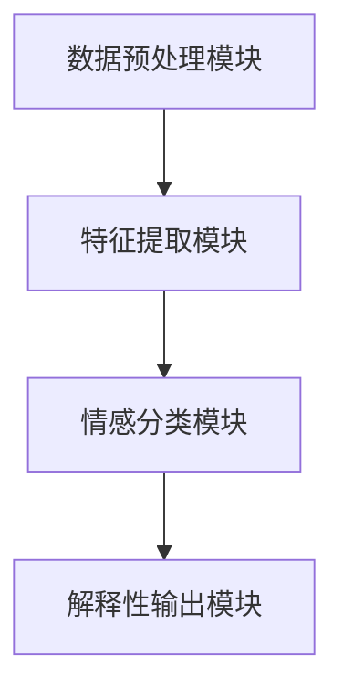
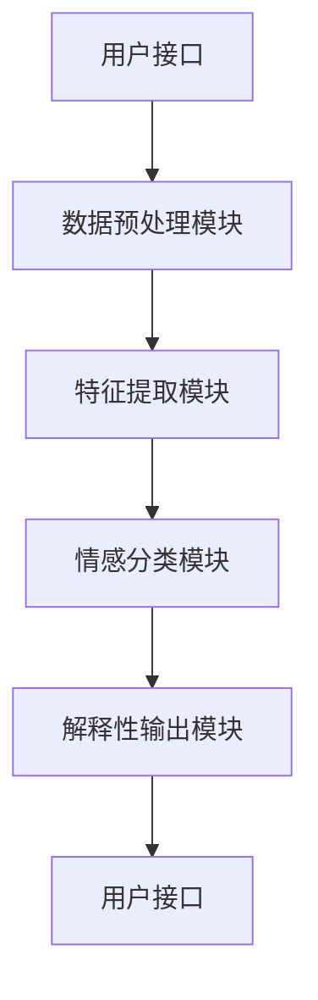
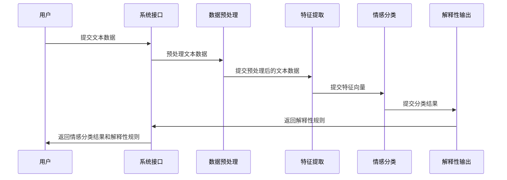

                 

### 神经符号方法增强AI的抽象推理能力

关键词：神经符号方法，抽象推理，AI能力提升，神经网络，符号逻辑

摘要：本文将探讨神经符号方法如何增强人工智能（AI）的抽象推理能力。通过介绍神经符号方法的核心概念与原理，分析其在AI领域的应用与挑战，文章将详细阐述神经符号方法在抽象推理中的重要作用，并展望其未来发展前景。

### 第一部分：背景介绍

#### 第1章：问题背景

#### 1.1 问题背景介绍

在人工智能（AI）领域，神经网络（Neural Networks）和符号逻辑（Symbolic Logic）都是被广泛应用的技术。神经网络以其强大的数据处理和模式识别能力而著称，广泛应用于图像识别、语音识别、自然语言处理等任务。然而，神经网络在处理抽象概念、进行高层次推理和泛化能力方面仍存在许多挑战。符号逻辑作为一种形式化的推理方法，能够有效地表示和处理抽象概念，但其处理大量数据和实时性方面的能力有限。

神经符号方法（Neural-Symbolic Methods）旨在结合神经网络和符号逻辑的优势，以解决神经网络在抽象推理和泛化能力方面的不足。这种方法通过将神经网络与符号逻辑相结合，实现数据驱动和符号推理的有机结合，从而提高AI系统的抽象推理能力。

#### 1.2 问题描述

神经符号方法的提出，主要是为了解决以下问题：

1. **抽象概念表示与推理**：神经网络擅长处理具体的数据，但在表示抽象概念和进行高层次推理方面存在困难。神经符号方法通过结合符号逻辑，为神经网络提供了一种表示抽象概念和进行推理的手段。
   
2. **泛化能力**：神经网络在训练数据上的表现通常很好，但在面对未见过的数据时表现不佳。神经符号方法通过引入符号逻辑，可以增强模型的泛化能力，使其在更广泛的场景中保持良好的性能。

3. **解释性和可解释性**：神经网络模型通常被认为是“黑盒”模型，难以解释其决策过程。神经符号方法通过将神经网络与符号逻辑结合，可以提高模型的可解释性，有助于理解和信任模型的决策过程。

#### 1.3 问题解决

神经符号方法通过将神经网络与符号逻辑相结合，提出了一系列解决上述问题的方法。具体来说，神经符号方法主要包括以下几方面：

1. **符号化表示**：将神经网络输出的概率分布转换为符号表示，以便进行推理和决策。

2. **符号推理**：利用符号逻辑进行推理，以补充神经网络在处理抽象概念和进行高层次推理方面的不足。

3. **解释性增强**：通过将神经网络与符号逻辑结合，提高模型的可解释性，使其决策过程更加透明和可理解。

#### 1.4 边界与外延

神经符号方法的研究和应用领域包括但不限于以下几个方面：

1. **知识表示与推理**：在知识图谱、本体论、语义网等领域，神经符号方法可以用于表示和推理复杂知识结构。

2. **自然语言处理**：在文本分类、语义理解、问答系统等领域，神经符号方法可以结合神经网络和符号逻辑的优势，提高模型的性能和可解释性。

3. **计算机视觉**：在图像分类、目标检测、图像生成等领域，神经符号方法可以通过结合神经网络和符号逻辑，实现更准确的识别和更灵活的推理。

4. **决策支持系统**：在金融、医疗、教育等领域，神经符号方法可以用于构建更加智能和可解释的决策支持系统。

#### 1.5 概念结构与核心要素组成

神经符号方法的核心要素包括：

1. **神经网络**：负责处理数据，提取特征和生成概率分布。

2. **符号逻辑**：负责表示抽象概念和进行推理。

3. **结合机制**：用于将神经网络和符号逻辑有机结合，实现高效的知识表示和推理。

### 第2章：核心概念与原理

#### 第3章：神经网络与符号逻辑的基本概念

#### 3.1 神经网络的基本概念

#### 3.1.1 神经网络的发展历程
神经网络的发展历程可以追溯到20世纪40年代，当时神经网络最初是由心理学家Frank Rosenblatt提出的。他的工作开创了人工神经网络的研究，特别是在感知器模型上取得了重要的突破。

##### 3.1.1.1 反向传播算法
反向传播算法（Backpropagation Algorithm）是神经网络发展的一个重要里程碑。它由Paul Werbos在1974年首次提出，并在1986年由Rumelhart、Hinton和Williams等人进行了深入研究。反向传播算法通过反向传播误差信号，以优化网络中的权重，从而提高了神经网络的训练效率。

##### 3.1.1.2 深度学习
深度学习（Deep Learning）是神经网络研究中的一个重要分支。它通过构建具有多个隐藏层的神经网络，来学习复杂的函数表示。深度学习在图像识别、语音识别和自然语言处理等领域取得了显著的成功。

##### 3.1.1.3 神经网络的其他类型
除了传统的多层感知器（MLP）之外，神经网络还有其他多种类型，如卷积神经网络（CNN）、循环神经网络（RNN）和生成对抗网络（GAN）等。每种类型的神经网络都有其特定的应用场景和优势。

#### 3.1.2 神经网络的组成结构
神经网络由大量的神经元（Neurons）组成，每个神经元都是一个简单的计算单元。神经网络包括输入层、隐藏层和输出层。每个层中的神经元都与前一层的神经元相连接，通过加权连接传递信息。

##### 3.1.2.1 神经元
神经元是神经网络的基本构建块，类似于生物神经元。它通过加权连接接收来自其他神经元的输入信号，并通过激活函数产生输出。

##### 3.1.2.2 层结构
神经网络中的层结构包括输入层、隐藏层和输出层。输入层接收外部输入数据，隐藏层负责数据转换和特征提取，输出层产生最终输出。

##### 3.1.2.3 网络参数
网络参数包括权重（Weights）和偏置（Bias）。权重用于调节神经元之间的连接强度，偏置用于调整神经元的激活阈值。

#### 3.2 符号逻辑的基本概念

符号逻辑（Symbolic Logic）是一种形式化的推理方法，用于表示和处理抽象概念。它由符号和规则组成，可以用来证明命题、推导结论和验证逻辑关系。

##### 3.2.1 基本符号
符号逻辑中使用的基本符号包括命题变量（如P、Q）、逻辑运算符（如与（∧）、或（∨）、非（¬））和量词（如全称量词（∀）和存在量词（∃））。

##### 3.2.1.2 基本逻辑运算
符号逻辑中的基本逻辑运算包括与（∧）、或（∨）、非（¬）以及条件（→）和等价（↔）等。

##### 3.2.2 符号逻辑的应用
符号逻辑在计算机科学、数学和哲学等领域有广泛的应用。例如，在形式化验证、自动推理和知识表示中，符号逻辑是一种强大的工具。

#### 3.3 神经网络与符号逻辑的联系

##### 3.3.1 神经网络与符号逻辑的结合动机
神经网络与符号逻辑的结合动机在于，神经网络在数据处理和模式识别方面具有优势，而符号逻辑在表示和处理抽象概念方面具有独特的优势。通过将神经网络与符号逻辑相结合，可以发挥各自的优势，弥补彼此的不足。

##### 3.3.1.1 神经网络的优势
神经网络的优势在于其强大的数据处理和模式识别能力。它可以自动地从大量数据中学习特征，并适应不同的任务和数据集。

##### 3.3.1.2 符号逻辑的优势
符号逻辑的优势在于其形式化和逻辑推理的能力。它可以精确地表示和处理抽象概念，并保证推理过程的正确性。

##### 3.3.1.3 神经符号方法的结合目标
神经符号方法的结合目标是通过整合神经网络和符号逻辑的优势，实现高效的知识表示和推理。这种方法旨在提高AI系统的抽象推理能力和泛化能力，同时保持模型的解释性和可解释性。

#### 3.3.2 神经符号方法的工作原理

神经符号方法的工作原理主要包括以下几个方面：

1. **数据预处理**：使用神经网络对输入数据进行预处理，提取重要的特征信息。

2. **特征表示**：将预处理后的数据转换为符号表示，以便进行符号逻辑推理。

3. **符号推理**：利用符号逻辑对特征表示进行推理，提取高级抽象概念和关系。

4. **解释性增强**：将符号逻辑的推理过程与神经网络的学习过程相结合，提高模型的可解释性和透明度。

#### 第4章：神经符号方法的原理与分类

##### 第4章：神经符号方法的原理与分类

##### 4.1 神经符号方法的原理

神经符号方法的原理是通过将神经网络和符号逻辑有机结合，实现高效的知识表示和推理。具体来说，它包括以下几个关键步骤：

1. **数据驱动特征提取**：使用神经网络对输入数据进行预处理，提取出重要的特征信息。这些特征可以是数值的，也可以是符号化的。

2. **符号化表示**：将神经网络提取的特征转换为符号表示。这一步骤是神经符号方法的核心，它使得神经网络可以与符号逻辑相结合。

3. **符号逻辑推理**：利用符号逻辑对符号化的特征进行推理，提取出更高层次的概念和关系。符号逻辑可以处理抽象的概念，如逻辑规则、因果关系等。

4. **结合机制**：通过特定的结合机制，将神经网络和符号逻辑有机地结合起来。这种结合机制可以是模块化的，也可以是融合的。

##### 4.2 神经符号方法的分类

神经符号方法可以根据其结合机制和实现方式的不同进行分类。以下是一些常见的神经符号方法分类：

1. **模块化神经符号方法**：这种方法将神经网络和符号逻辑分为两个独立的模块，分别负责数据驱动特征提取和符号逻辑推理。模块之间通过接口进行交互，实现整体的推理过程。

2. **融合式神经符号方法**：这种方法将神经网络和符号逻辑融合在一起，形成一个统一的推理框架。在这种方法中，神经网络和符号逻辑相互影响，共同完成推理任务。

3. **混合式神经符号方法**：这种方法结合了模块化和融合式方法的优点，将神经网络和符号逻辑分为多个层次或阶段，每个阶段都有自己的结合机制和推理策略。

##### 4.3 神经符号方法的优势与挑战

**优势：**

1. **提高抽象推理能力**：神经符号方法通过结合神经网络和符号逻辑，可以处理更复杂的抽象概念，提高抽象推理能力。

2. **增强泛化能力**：神经符号方法可以通过符号逻辑的推理过程，增强模型的泛化能力，使其在未见过的数据上表现更好。

3. **提高解释性和可解释性**：神经符号方法将神经网络和符号逻辑结合，使得模型的决策过程更加透明，有助于理解和信任模型的决策过程。

**挑战：**

1. **计算复杂性**：神经符号方法通常涉及复杂的计算过程，包括神经网络的训练和符号逻辑的推理。这可能导致计算成本较高，影响模型的实时性能。

2. **结合机制的优化**：如何有效地结合神经网络和符号逻辑是一个重要的挑战。不同的结合机制可能适用于不同的应用场景，需要针对具体问题进行优化。

3. **数据预处理和特征提取**：神经符号方法中的数据预处理和特征提取也是一个关键问题。如何选择合适的预处理方法和特征提取技术，以最大化神经符号方法的性能，是一个需要深入研究的问题。

### 第二部分：神经符号方法的核心概念与原理

#### 第3章：神经网络与符号逻辑的基本概念

在深入探讨神经符号方法之前，我们首先需要理解神经网络和符号逻辑的基本概念。这两者是神经符号方法的核心组成部分，它们的结合为我们提供了一种全新的AI推理方式。

##### 3.1 神经网络的基本概念

神经网络是一种模仿生物神经系统的计算模型。它由大量的简单计算单元——神经元组成，这些神经元通过加权连接形成网络。神经网络通过学习输入和输出之间的映射关系，来执行复杂的任务。

**发展历程：**
- **感知器**：神经网络的最早模型是由Frank Rosenblatt在1957年提出的，称为感知器（Perceptron）。它是一个二分类器，可以学习线性可分的数据。
- **反向传播算法**：1986年，Rumelhart, Hinton和Williams提出了反向传播算法（Backpropagation），这是一个用于多层神经网络的训练算法。它通过反向传播误差信号，优化网络中的权重，从而提高了神经网络的训练效率。
- **深度学习**：随着计算能力和算法的进步，神经网络逐渐发展出了多层结构，即深度学习（Deep Learning）。深度学习通过构建具有多个隐藏层的神经网络，可以学习更复杂的函数表示，并在图像识别、语音识别和自然语言处理等领域取得了显著的成果。

**组成结构：**
- **神经元**：神经网络的基本构建块，类似于生物神经元。它接收多个输入信号，通过加权求和，加上偏置项，然后通过激活函数产生输出。
- **层结构**：神经网络包括输入层、隐藏层和输出层。输入层接收外部输入数据，隐藏层负责数据转换和特征提取，输出层产生最终输出。
- **网络参数**：网络参数包括权重（Weights）和偏置（Bias）。权重用于调节神经元之间的连接强度，偏置用于调整神经元的激活阈值。

##### 3.2 符号逻辑的基本概念

符号逻辑（Symbolic Logic）是一种形式化的推理方法，用于表示和处理抽象概念。它由符号和规则组成，可以用来证明命题、推导结论和验证逻辑关系。

**定义与符号：**
- **命题变量**：用于表示事实或命题，如P、Q等。
- **逻辑运算符**：用于组合命题变量，形成复合命题，如与（∧）、或（∨）、非（¬）等。
- **量词**：用于描述命题的普遍性或存在性，如全称量词（∀）和存在量词（∃）。

**应用：**
- **形式化验证**：用于验证系统的正确性，确保系统满足特定的规格说明。
- **自动推理**：用于自动化推理过程，从已知的事实和规则中推导出新的结论。
- **知识表示**：用于表示复杂的知识结构，如知识图谱、本体论和语义网等。

##### 3.3 神经网络与符号逻辑的联系

神经网络和符号逻辑的结合，旨在发挥各自的优势，弥补彼此的不足。

**结合动机：**
- **神经网络的优势**：在数据处理和模式识别方面，神经网络具有强大的能力。它可以自动地从大量数据中学习特征，并适应不同的任务和数据集。
- **符号逻辑的优势**：在表示和处理抽象概念方面，符号逻辑具有独特的优势。它可以精确地表示和处理抽象概念，并保证推理过程的正确性。

**结合目标：**
- **高效的知识表示和推理**：通过结合神经网络和符号逻辑，可以实现高效的知识表示和推理。神经网络可以处理大量的数据，提取有用的特征；符号逻辑可以处理抽象的概念，进行推理和决策。
- **提高解释性和可解释性**：神经网络通常被认为是一个“黑盒”，难以解释其决策过程。通过将神经网络与符号逻辑结合，可以提高模型的可解释性，使得决策过程更加透明和可理解。

**工作原理：**
- **数据预处理**：首先，使用神经网络对输入数据进行预处理，提取出重要的特征信息。
- **特征表示**：然后，将预处理后的数据转换为符号表示。这一步骤是神经符号方法的核心，它使得神经网络可以与符号逻辑相结合。
- **符号推理**：利用符号逻辑对符号化的特征进行推理，提取出更高层次的概念和关系。
- **结合机制**：通过特定的结合机制，将神经网络和符号逻辑有机地结合起来。这种结合机制可以是模块化的，也可以是融合的。

通过这种结合，神经符号方法可以有效地提高AI系统的抽象推理能力和泛化能力，同时保持模型的解释性和可解释性。接下来，我们将进一步探讨神经符号方法的具体实现和分类。

### 第4章：神经符号方法的原理与分类

神经符号方法是将神经网络和符号逻辑相结合的一种方法，旨在提高人工智能（AI）系统的抽象推理能力和泛化能力。本章将详细讨论神经符号方法的原理、分类以及其在不同应用领域的具体实现。

#### 4.1 神经符号方法的原理

神经符号方法的原理可以概括为以下几个关键步骤：

1. **数据预处理与特征提取**：使用神经网络对输入数据进行预处理，提取出有用的特征信息。这一步骤依赖于神经网络的强大数据处理能力，可以自动地从大量数据中学习特征。

2. **符号化表示**：将神经网络提取的特征转换为符号表示。这一步骤是将神经网络和符号逻辑相结合的关键，它使得神经网络可以与符号逻辑进行交互和推理。

3. **符号逻辑推理**：利用符号逻辑对符号化的特征进行推理，提取出更高层次的概念和关系。符号逻辑可以处理抽象的概念，如逻辑规则、因果关系等，从而增强模型的推理能力。

4. **结合机制**：通过特定的结合机制，将神经网络和符号逻辑有机地结合起来。这种结合机制可以是模块化的，也可以是融合的，目的是实现高效的知识表示和推理。

5. **解释性增强**：神经符号方法通过将神经网络和符号逻辑结合，提高了模型的可解释性和透明度。这使得模型的决策过程更加透明，有助于理解和信任模型的决策过程。

#### 4.2 神经符号方法的分类

根据结合机制和实现方式的不同，神经符号方法可以分为以下几类：

1. **模块化神经符号方法**：这种方法将神经网络和符号逻辑分为两个独立的模块，分别负责数据驱动特征提取和符号逻辑推理。模块之间通过接口进行交互，实现整体的推理过程。模块化方法的优势在于结构清晰，易于实现和理解，但可能缺乏整体的优化。

2. **融合式神经符号方法**：这种方法将神经网络和符号逻辑融合在一起，形成一个统一的推理框架。在这种方法中，神经网络和符号逻辑相互影响，共同完成推理任务。融合式方法可以更好地利用两者的优势，但实现相对复杂，需要针对具体应用场景进行优化。

3. **混合式神经符号方法**：这种方法结合了模块化和融合式方法的优点，将神经网络和符号逻辑分为多个层次或阶段，每个阶段都有自己的结合机制和推理策略。混合式方法可以根据不同的任务需求，灵活地调整结合机制和推理策略，实现更高效的推理。

4. **基于规则的神经符号方法**：这种方法将神经网络与基于规则的推理系统相结合。神经网络用于特征提取和分类，而基于规则的推理系统用于推理和决策。这种方法可以有效地利用神经网络的处理能力和规则推理的灵活性。

5. **基于本体的神经符号方法**：这种方法将神经网络与本体论相结合，利用本体论表示知识结构和概念关系。神经网络用于学习数据特征，本体论用于表示和处理抽象概念。这种方法可以更好地处理复杂的知识结构和推理任务。

#### 4.3 神经符号方法的优势与挑战

**优势：**

1. **提高抽象推理能力**：神经符号方法通过结合神经网络和符号逻辑，可以处理更复杂的抽象概念，提高抽象推理能力。

2. **增强泛化能力**：神经符号方法可以通过符号逻辑的推理过程，增强模型的泛化能力，使其在未见过的数据上表现更好。

3. **提高解释性和可解释性**：神经符号方法将神经网络和符号逻辑结合，使得模型的决策过程更加透明，有助于理解和信任模型的决策过程。

**挑战：**

1. **计算复杂性**：神经符号方法通常涉及复杂的计算过程，包括神经网络的训练和符号逻辑的推理。这可能导致计算成本较高，影响模型的实时性能。

2. **结合机制的优化**：如何有效地结合神经网络和符号逻辑是一个重要的挑战。不同的结合机制可能适用于不同的应用场景，需要针对具体问题进行优化。

3. **数据预处理和特征提取**：神经符号方法中的数据预处理和特征提取也是一个关键问题。如何选择合适的预处理方法和特征提取技术，以最大化神经符号方法的性能，是一个需要深入研究的问题。

#### 4.4 神经符号方法的应用领域

神经符号方法在多个领域都有广泛的应用，以下是一些具体的应用场景：

1. **知识表示与推理**：在知识图谱、本体论、语义网等领域，神经符号方法可以用于表示和推理复杂知识结构。例如，它可以用于语义理解、知识图谱的构建和推理。

2. **自然语言处理**：在文本分类、语义理解、问答系统等领域，神经符号方法可以结合神经网络和符号逻辑的优势，提高模型的性能和可解释性。例如，它可以用于情感分析、文本生成和问答系统。

3. **计算机视觉**：在图像分类、目标检测、图像生成等领域，神经符号方法可以通过结合神经网络和符号逻辑，实现更准确的识别和更灵活的推理。例如，它可以用于医学图像分析、自动驾驶和图像生成。

4. **决策支持系统**：在金融、医疗、教育等领域，神经符号方法可以用于构建更加智能和可解释的决策支持系统。例如，它可以用于风险评估、疾病诊断和个性化教育。

通过上述应用，神经符号方法为人工智能领域带来了一系列创新和突破，推动了AI技术的发展和应用。

### 第5章：神经符号方法在知识表示与推理中的应用

在知识表示与推理领域，神经符号方法的应用具有革命性的潜力。该方法通过结合神经网络的强大数据表示能力和符号逻辑的推理能力，为处理复杂知识结构和进行高级推理提供了一种新的途径。

#### 5.1 神经符号方法在知识表示中的应用

知识表示是人工智能领域的一个重要问题，涉及到如何有效地表示和存储知识，以便进行推理和应用。神经符号方法在这方面展现出显著的优势：

1. **基于神经网络的语义嵌入**：
   - **词嵌入（Word Embeddings）**：传统的词嵌入方法如Word2Vec和GloVe等，通过将词汇映射到高维向量空间，实现了词与词之间的相似性度量。神经符号方法可以进一步优化这些嵌入，使其更好地反映词汇的语义关系。
   - **实体嵌入（Entity Embeddings）**：在知识图谱中，实体和关系都可以通过向量表示。神经符号方法可以结合符号逻辑，对实体嵌入进行优化，以更好地捕捉实体之间的语义关系。

2. **基于符号逻辑的规则表示**：
   - **逻辑规则（Logical Rules）**：符号逻辑可以表示复杂的逻辑规则，如“如果A且B，则C”。在知识表示中，这些规则可以用来表示因果关系、条件约束等。
   - **基于规则的推理（Rule-Based Reasoning）**：通过将神经网络与符号逻辑结合，可以构建基于规则的推理系统，实现自动推理和知识发现。

3. **本体论和语义网**：
   - **本体论（Ontology）**：本体论是知识表示的一种形式化方法，用于描述领域知识和概念之间的关系。神经符号方法可以结合神经网络，对本体论进行学习和推理，以发现新的知识结构。
   - **语义网（Semantic Web）**：语义网是一种基于Web的技术，用于实现数据的语义丰富和互操作性。神经符号方法可以用于构建语义网，提高数据表示的灵活性和可解释性。

#### 5.2 神经符号方法在知识推理中的应用

知识推理是人工智能的核心问题之一，涉及从已知信息中推导出新信息。神经符号方法在知识推理中的应用主要包括以下几个方面：

1. **基于神经网络的推理**：
   - **模式识别与分类**：神经网络可以用于模式识别和分类任务，如文本分类、图像分类等。在知识推理中，这些任务可以用于识别新实体、分类新事实等。
   - **关联规则学习**：神经网络可以用于学习数据中的关联规则，如“购买牛奶的用户通常也会购买面包”。这些规则可以用于知识推理，以发现新的关联关系。

2. **基于符号逻辑的推理**：
   - **逻辑推理（Logical Inference）**：符号逻辑可以用于形式化的推理，如证明定理、推导结论等。在知识推理中，这些推理方法可以用于验证知识的正确性和一致性。
   - **模态逻辑（Modal Logic）**：模态逻辑用于描述状态之间的关系，如“可能”和“必须”。在知识推理中，模态逻辑可以用于处理不确定性和模糊性。

3. **集成推理（Integrated Inference）**：
   - **多模态推理**：神经符号方法可以结合不同模态的数据进行推理，如结合文本、图像和声音进行综合分析。
   - **混合推理**：神经符号方法可以将神经网络和符号逻辑的推理结果进行整合，以实现更全面的推理。例如，神经网络可以用于提取特征，符号逻辑可以用于推理和决策。

#### 5.3 神经符号方法在知识表示与推理中的挑战和未来方向

尽管神经符号方法在知识表示与推理中展示了巨大的潜力，但仍面临一些挑战：

1. **计算复杂性**：神经符号方法通常涉及复杂的计算过程，包括神经网络的训练和符号逻辑的推理。这可能导致计算成本较高，影响模型的实时性能。

2. **结合机制的优化**：如何有效地结合神经网络和符号逻辑是一个重要的挑战。不同的结合机制可能适用于不同的应用场景，需要针对具体问题进行优化。

3. **数据预处理和特征提取**：在神经符号方法中，数据预处理和特征提取是一个关键问题。如何选择合适的预处理方法和特征提取技术，以最大化神经符号方法的性能，是一个需要深入研究的问题。

未来的研究方向包括：

1. **优化结合机制**：通过研究不同的结合机制，优化神经网络和符号逻辑的集成，以提高推理效率和性能。

2. **多模态数据融合**：探索如何将不同模态的数据（如文本、图像、声音等）进行有效融合，以实现更全面的推理。

3. **不确定性处理**：研究如何在神经符号方法中处理不确定性和模糊性，以提高模型的鲁棒性和可靠性。

通过不断的研究和优化，神经符号方法有望在知识表示与推理领域取得更大的突破，为人工智能的发展和应用带来新的动力。

### 第6章：神经符号方法在自然语言处理中的应用

自然语言处理（NLP）是人工智能领域的一个重要分支，旨在使计算机理解和生成人类语言。神经符号方法在NLP中的应用，通过结合神经网络和符号逻辑的优势，为处理复杂的语言现象和提高模型的解释性提供了新的途径。

#### 6.1 神经符号方法在文本分类中的应用

文本分类是NLP中的一个基础任务，旨在将文本数据归类到预先定义的类别中。神经符号方法在文本分类中的应用，主要体现在以下几个方面：

1. **基于神经网络的文本表示**：
   - **词嵌入（Word Embeddings）**：传统的文本表示方法如Bag-of-Words和TF-IDF，存在语义信息丢失的问题。神经符号方法通过词嵌入技术，将词汇映射到高维向量空间，更好地捕捉词汇的语义关系。
   - **序列嵌入（Sequence Embeddings）**：基于循环神经网络（RNN）和变换器（Transformer）的序列嵌入方法，如BERT和GPT，可以捕捉文本中的长期依赖关系。神经符号方法可以进一步优化这些嵌入，提高其语义表示能力。

2. **符号逻辑的规则表示**：
   - **规则推理**：在文本分类中，可以使用符号逻辑来表示分类规则。例如，基于“如果…则…”的规则可以用来描述文本特征与类别之间的关系。
   - **逻辑回归（Logical Regression）**：将神经网络与逻辑回归结合，可以构建一个符号化的分类器。这种方法不仅可以提高分类的准确性，还可以提供更直观的解释。

3. **符号逻辑的辅助分类**：
   - **增强解释性**：神经符号方法可以通过符号逻辑来解释神经网络的分类决策。例如，利用逻辑规则来解释分类器为什么将一个文本归类到某个特定类别。
   - **鲁棒性提升**：符号逻辑可以帮助神经网络识别潜在的噪声和异常，从而提高模型的鲁棒性。

#### 6.2 神经符号方法在语义理解中的应用

语义理解是NLP中的核心任务，旨在理解文本中的语义内容和意图。神经符号方法在语义理解中的应用，主要体现在以下几个方面：

1. **基于神经网络的语义表示**：
   - **语义角色标注（Semantic Role Labeling, SRL）**：神经网络可以用于识别文本中的语义角色，如主语、谓语、宾语等。神经符号方法可以进一步优化这些表示，提高其语义理解的准确性。
   - **语义解析（Semantic Parsing）**：神经网络可以用于将自然语言文本转换为结构化的语义表示，如逻辑形式或抽象语法树（AST）。神经符号方法可以结合符号逻辑，对语义表示进行验证和推理。

2. **符号逻辑的推理能力**：
   - **因果推理（Causal Inference）**：符号逻辑可以用于处理因果推理任务，如确定两个事件之间的因果关系。在语义理解中，这可以用于理解文本中的因果关系和逻辑关系。
   - **常识推理（Commonsense Reasoning）**：符号逻辑可以用于处理常识推理任务，如理解日常生活中的常识。在语义理解中，这可以用于补充神经网络在处理复杂语言现象时的不足。

3. **符号逻辑的解释性**：
   - **透明化语义理解**：通过结合符号逻辑，可以使得语义理解的决策过程更加透明和可解释。例如，可以利用逻辑规则来解释模型为什么认为两个文本具有相似的语义。
   - **增强模型的可靠性**：符号逻辑可以帮助模型识别和理解文本中的潜在错误和不一致性，从而提高模型的可靠性。

#### 6.3 神经符号方法在问答系统中的应用

问答系统是NLP领域的一个挑战性任务，旨在理解和回答用户的问题。神经符号方法在问答系统中的应用，主要体现在以下几个方面：

1. **基于神经网络的语义匹配**：
   - **语义匹配（Semantic Matching）**：神经网络可以用于匹配问题和答案之间的语义关系。例如，通过将问题和答案映射到高维向量空间，来计算它们之间的相似性。
   - **深度语义匹配（Deep Semantic Matching）**：基于深度学习的方法，如BERT和GPT，可以更好地捕捉文本中的语义信息。神经符号方法可以进一步优化这些匹配方法，提高其准确性和解释性。

2. **符号逻辑的推理能力**：
   - **逻辑推理（Logical Inference）**：符号逻辑可以用于推理问题中的隐含条件和关系，从而生成合适的答案。例如，利用逻辑规则来解释问题中的“如果…则…”结构，并推导出相应的结论。
   - **模态逻辑（Modal Logic）**：模态逻辑可以用于处理问题的模态性质，如“可能”、“必然”等。这可以使得问答系统更好地理解问题的含义，并生成更准确的答案。

3. **符号逻辑的解释性**：
   - **增强解释性**：通过结合符号逻辑，问答系统的答案生成过程可以更加透明和可解释。例如，可以利用逻辑规则来解释为什么选择特定的答案，并解释答案背后的逻辑关系。
   - **提高用户信任**：符号逻辑可以帮助用户理解问答系统的决策过程，从而提高用户对系统的信任度和满意度。

#### 6.4 神经符号方法在自然语言处理中的挑战和未来方向

尽管神经符号方法在自然语言处理中展示了巨大的潜力，但仍面临一些挑战：

1. **计算复杂性**：神经符号方法通常涉及复杂的计算过程，包括神经网络的训练和符号逻辑的推理。这可能导致计算成本较高，影响模型的实时性能。

2. **数据预处理和特征提取**：在神经符号方法中，数据预处理和特征提取是一个关键问题。如何选择合适的预处理方法和特征提取技术，以最大化神经符号方法的性能，是一个需要深入研究的问题。

3. **结合机制的优化**：如何有效地结合神经网络和符号逻辑是一个重要的挑战。不同的结合机制可能适用于不同的应用场景，需要针对具体问题进行优化。

未来的研究方向包括：

1. **优化结合机制**：通过研究不同的结合机制，优化神经网络和符号逻辑的集成，以提高推理效率和性能。

2. **多模态数据融合**：探索如何将不同模态的数据（如文本、图像、声音等）进行有效融合，以实现更全面的语义理解。

3. **增强解释性**：研究如何通过符号逻辑增强自然语言处理模型的解释性，使得模型的决策过程更加透明和可解释。

通过不断的研究和优化，神经符号方法有望在自然语言处理领域取得更大的突破，为人工智能的发展和应用带来新的动力。

### 第7章：神经符号方法在计算机视觉中的应用

计算机视觉是人工智能领域的一个重要分支，旨在使计算机具备理解和解析图像或视频的能力。神经符号方法在计算机视觉中的应用，通过结合神经网络和符号逻辑的优势，为图像理解和视觉推理提供了新的途径。

#### 7.1 神经符号方法在图像分类中的应用

图像分类是计算机视觉中最基础的任务之一，旨在将图像归类到预定义的类别中。神经符号方法在图像分类中的应用，主要体现在以下几个方面：

1. **基于神经网络的图像表示**：
   - **卷积神经网络（Convolutional Neural Networks, CNNs）**：CNNs是图像分类中最常用的神经网络模型。通过学习图像的特征表示，CNNs可以准确地识别图像中的物体和场景。
   - **预训练模型**：预训练模型如VGG、ResNet和Inception等，通过在大量未标注的数据上训练，可以提取出具有通用特征的图像表示。神经符号方法可以进一步优化这些预训练模型，提高其分类性能。

2. **符号逻辑的特征解释**：
   - **特征可视化**：通过将神经网络的中间层输出转换为符号表示，可以可视化图像中的关键特征和区域。这有助于理解神经网络如何处理图像，并发现图像中的重要特征。
   - **逻辑规则生成**：利用符号逻辑，可以从神经网络的特征表示中生成规则，解释图像分类决策的过程。例如，可以生成规则来描述为什么一个图像被归类到一个特定类别。

3. **符号逻辑的辅助分类**：
   - **规则增强分类**：结合符号逻辑的规则，可以增强图像分类模型的解释性和鲁棒性。例如，通过利用逻辑规则来识别图像中的噪声和不明确区域，从而提高分类的准确性。
   - **多标签分类**：对于具有多个标签的图像，符号逻辑可以帮助生成规则，解释图像同时属于多个类别的原因。

#### 7.2 神经符号方法在目标检测中的应用

目标检测是计算机视觉中的另一个重要任务，旨在识别图像中的多个目标物体，并定位它们的位置。神经符号方法在目标检测中的应用，主要体现在以下几个方面：

1. **基于神经网络的检测算法**：
   - **区域提议网络（Region Proposal Networks, RPNs）**：RPNs是目标检测中常用的算法，通过生成区域提议，并对其分类和定位。神经符号方法可以优化RPNs的检测性能，提高其准确性和效率。
   - **多尺度检测**：通过结合不同尺度的特征图，可以更准确地检测图像中的目标。神经符号方法可以利用符号逻辑，对不同尺度的检测结果进行融合，提高检测的鲁棒性。

2. **符号逻辑的特征融合**：
   - **特征融合规则**：利用符号逻辑，可以从多个特征图或检测框中提取关键特征，并生成融合规则。这些规则可以帮助模型更好地处理不同特征之间的冲突和不确定性。
   - **上下文信息利用**：符号逻辑可以用于整合图像中的上下文信息，以提高目标检测的准确性。例如，可以利用逻辑规则来解释为什么一个目标在某个位置更可能存在。

3. **符号逻辑的辅助检测**：
   - **解释性增强**：通过结合符号逻辑，可以增强目标检测模型的解释性。例如，可以利用逻辑规则来解释模型为什么将某个区域识别为目标的决策过程。
   - **异常检测**：符号逻辑可以用于识别图像中的异常目标或异常行为。例如，可以生成规则来检测图像中的异常对象，如镜头中的异常物体或违反规则的行为。

#### 7.3 神经符号方法在图像生成中的应用

图像生成是计算机视觉中的另一个重要任务，旨在生成新的、逼真的图像。神经符号方法在图像生成中的应用，主要体现在以下几个方面：

1. **基于神经网络的图像生成模型**：
   - **生成对抗网络（Generative Adversarial Networks, GANs）**：GANs是图像生成中最常用的模型，通过两个神经网络（生成器和判别器）的对抗训练，可以生成高质量的图像。
   - **变分自编码器（Variational Autoencoders, VAEs）**：VAEs是一种基于概率模型的图像生成方法，通过编码器和解码器的训练，可以生成具有多样性的图像。

2. **符号逻辑的图像内容控制**：
   - **图像内容提取**：通过符号逻辑，可以从图像中提取关键的内容信息，如物体、场景和颜色等。这些信息可以用于控制图像生成的细节和内容。
   - **图像内容合成**：利用符号逻辑，可以将提取的内容信息与生成的图像进行融合，生成新的、具有特定内容的图像。例如，可以将特定物体的图像合成到背景图像中。

3. **符号逻辑的图像风格迁移**：
   - **风格迁移规则**：利用符号逻辑，可以生成风格迁移规则，将一种图像的风格应用到另一种图像中。例如，可以将一张风景图像的风格迁移到一张肖像图像中。
   - **多风格融合**：符号逻辑可以用于融合多种风格，生成具有多种风格的图像。这可以用于艺术创作、设计和视觉特效等领域。

#### 7.4 神经符号方法在计算机视觉中的挑战和未来方向

尽管神经符号方法在计算机视觉中展示了巨大的潜力，但仍面临一些挑战：

1. **计算复杂性**：神经符号方法通常涉及复杂的计算过程，包括神经网络的训练和符号逻辑的推理。这可能导致计算成本较高，影响模型的实时性能。

2. **数据预处理和特征提取**：在神经符号方法中，数据预处理和特征提取是一个关键问题。如何选择合适的预处理方法和特征提取技术，以最大化神经符号方法的性能，是一个需要深入研究的问题。

3. **结合机制的优化**：如何有效地结合神经网络和符号逻辑是一个重要的挑战。不同的结合机制可能适用于不同的应用场景，需要针对具体问题进行优化。

未来的研究方向包括：

1. **优化结合机制**：通过研究不同的结合机制，优化神经网络和符号逻辑的集成，以提高推理效率和性能。

2. **多模态数据融合**：探索如何将不同模态的数据（如文本、图像、声音等）进行有效融合，以实现更全面的视觉理解和推理。

3. **增强解释性**：研究如何通过符号逻辑增强计算机视觉模型的解释性，使得模型的决策过程更加透明和可解释。

通过不断的研究和优化，神经符号方法有望在计算机视觉领域取得更大的突破，为人工智能的发展和应用带来新的动力。

### 第8章：神经符号方法在决策支持系统中的应用

在决策支持系统（DSS）中，神经符号方法的应用可以显著提升系统的智能性和可解释性，特别是在金融、医疗和教育等领域。通过结合神经网络和符号逻辑，DSS能够更好地处理复杂决策问题，并提供更加精确和透明的决策建议。

#### 8.1 神经符号方法在金融领域的应用

在金融领域，神经符号方法被广泛应用于风险评估、投资决策和金融市场预测。

1. **风险评估**：
   - **神经网络的特征提取**：使用神经网络对大量历史金融数据进行特征提取，捕捉市场动态和风险因素。
   - **符号逻辑的推理**：结合符号逻辑，将神经网络提取的特征转换为逻辑规则，进行风险评估。例如，可以利用符号逻辑分析市场波动与宏观经济指标之间的关系，为投资者提供风险预警。

2. **投资决策**：
   - **基于神经网络的策略学习**：通过神经网络学习市场趋势和交易策略，生成个性化的投资建议。
   - **符号逻辑的策略优化**：利用符号逻辑对神经网络生成的策略进行优化，确保投资策略的稳健性和可持续性。例如，可以通过逻辑推理分析不同投资组合的风险与收益，找到最优的投资组合。

3. **金融市场预测**：
   - **时间序列分析**：使用神经网络对时间序列数据进行分析，捕捉市场动态和趋势。
   - **符号逻辑的预测验证**：结合符号逻辑，验证神经网络的预测结果，提高预测的可靠性和准确性。例如，通过逻辑推理分析市场事件对预测结果的影响，确保预测模型的有效性。

#### 8.2 神经符号方法在医疗领域的应用

在医疗领域，神经符号方法可以显著提升诊断准确性和治疗方案的优化。

1. **医学图像分析**：
   - **基于神经网络的图像处理**：使用神经网络对医学图像进行处理，提取关键的特征信息，如病变区域和形态学特征。
   - **符号逻辑的辅助诊断**：结合符号逻辑，将神经网络提取的特征转换为诊断规则，辅助医生进行诊断。例如，通过逻辑推理分析不同特征的组合，提高病变检测的准确性。

2. **疾病预测**：
   - **基于神经网络的预测模型**：通过神经网络学习患者的电子健康记录，预测疾病的发生风险。
   - **符号逻辑的规则生成**：结合符号逻辑，从神经网络生成的预测模型中提取规则，为医生提供预测解释。例如，通过逻辑规则解释为什么某个患者具有较高的疾病风险，帮助医生制定预防措施。

3. **个性化治疗**：
   - **基于神经网络的疗法推荐**：使用神经网络学习不同疗法的效果，为患者推荐最佳治疗方案。
   - **符号逻辑的方案优化**：结合符号逻辑，优化神经网络推荐的治疗方案，确保治疗的科学性和可操作性。例如，通过逻辑推理分析不同疗法的潜在副作用和疗效，为患者提供个性化的治疗建议。

#### 8.3 神经符号方法在教育领域的应用

在教育领域，神经符号方法可以提升教学效果和学习分析。

1. **智能学习推荐**：
   - **基于神经网络的课程推荐**：使用神经网络分析学生的学习行为和成绩数据，推荐最适合的学习资源和课程。
   - **符号逻辑的学习路径规划**：结合符号逻辑，从神经网络推荐的结果中生成学习路径，帮助学生高效地掌握知识。例如，通过逻辑推理分析学生的兴趣和薄弱环节，制定个性化的学习计划。

2. **学习效果分析**：
   - **基于神经网络的评估模型**：通过神经网络分析学生的学习数据，评估学生的学习效果。
   - **符号逻辑的结果解释**：结合符号逻辑，解释评估模型的输出结果，帮助教师和学生理解学习效果。例如，通过逻辑规则分析学生成绩提高的原因，为教学提供反馈。

3. **教育干预**：
   - **基于神经网络的干预策略**：使用神经网络学习学生的行为模式，预测可能出现的学业困难，提供及时的干预措施。
   - **符号逻辑的干预优化**：结合符号逻辑，优化干预策略，确保干预措施的有效性和科学性。例如，通过逻辑推理分析不同干预策略的效果，选择最佳的教育干预方案。

#### 8.4 神经符号方法在决策支持系统中的挑战和未来方向

尽管神经符号方法在决策支持系统中展示了巨大的潜力，但仍面临一些挑战：

1. **数据质量和可靠性**：决策支持系统的性能依赖于高质量的数据，如何在数据收集和处理过程中确保数据的准确性和完整性是一个关键问题。

2. **计算复杂性**：神经符号方法通常涉及复杂的计算过程，包括神经网络的训练和符号逻辑的推理。这可能导致计算成本较高，影响系统的实时性能。

3. **结合机制的优化**：如何有效地结合神经网络和符号逻辑是一个重要的挑战。不同的结合机制可能适用于不同的决策支持场景，需要针对具体问题进行优化。

未来的研究方向包括：

1. **优化结合机制**：通过研究不同的结合机制，优化神经网络和符号逻辑的集成，以提高决策支持和推理效率。

2. **数据驱动的模型优化**：探索如何利用数据驱动的方法，优化神经符号方法的参数和结构，提高决策系统的性能。

3. **增强解释性**：研究如何通过符号逻辑增强决策支持系统的解释性，使得决策过程更加透明和可解释，提高用户对系统的信任度和满意度。

通过不断的研究和优化，神经符号方法有望在决策支持系统领域取得更大的突破，为各行业的智能化决策提供有力支持。

### 第9章：项目实战：神经符号方法的实现与应用

在本章中，我们将通过一个实际项目，详细介绍神经符号方法的实现与应用。该项目旨在构建一个基于神经符号方法的情感分析系统，用于自动识别和分类社交媒体上的用户情感。

#### 9.1 项目背景

情感分析是自然语言处理（NLP）的一个重要应用，旨在理解和分析文本中的情感倾向。随着社交媒体的兴起，情感分析在市场研究、品牌管理、舆情监控等领域具有广泛的应用价值。然而，传统的情感分析方法往往依赖于规则和手工程度，无法处理复杂和多样化的情感表达。神经符号方法通过结合神经网络和符号逻辑，可以显著提升情感分析的准确性和解释性。

#### 9.2 项目介绍

本项目的目标是构建一个情感分析系统，能够自动识别社交媒体上的用户情感，并将其分类为正面、负面或中性。系统将包括以下核心功能：

1. **数据预处理**：清洗和标准化社交媒体文本数据，提取特征信息。
2. **特征表示**：使用神经网络对文本数据进行特征提取，生成高维的语义向量。
3. **情感分类**：利用符号逻辑对特征向量进行情感分类，生成分类结果。
4. **解释性输出**：通过符号逻辑解释分类结果，提高模型的透明度和可解释性。

#### 9.3 系统功能设计

在系统功能设计阶段，我们需要定义情感分析系统的各个功能模块，并明确它们之间的关系。

**1. 数据预处理模块**：
- 功能：对社交媒体文本数据进行清洗、去噪和标准化，提取关键特征。
- 技术选型：使用正则表达式和自然语言处理（NLP）工具（如NLTK和spaCy）进行文本预处理。

**2. 特征提取模块**：
- 功能：利用神经网络（如词嵌入和卷积神经网络）提取文本的语义特征。
- 技术选型：使用预训练的词向量模型（如Word2Vec和GloVe）进行文本向量化。

**3. 情感分类模块**：
- 功能：利用符号逻辑对提取的特征进行情感分类，生成分类结果。
- 技术选型：结合神经网络输出和符号逻辑规则，实现情感分类。

**4. 解释性输出模块**：
- 功能：解释情感分类的结果，提供透明的决策过程。
- 技术选型：使用符号逻辑生成解释性规则，展示模型决策过程。

#### 9.4 系统架构设计

在系统架构设计阶段，我们需要明确各个功能模块之间的交互关系，并设计一个高效、可扩展的系统架构。

**1. 系统架构图**：



**2. 系统架构说明**：
- **数据预处理模块**：接收原始社交媒体文本数据，通过清洗、去噪和标准化处理，提取关键特征，并将其传递给特征提取模块。
- **特征提取模块**：利用神经网络对预处理后的文本数据进行向量化处理，提取高维的语义特征，并将其传递给情感分类模块。
- **情感分类模块**：结合神经网络提取的特征和符号逻辑规则，对文本进行情感分类，并生成分类结果。
- **解释性输出模块**：生成解释性规则，展示模型决策过程，提高模型的透明度和可解释性。

#### 9.5 系统接口设计与交互

在系统接口设计阶段，我们需要明确系统各个模块的接口设计和交互流程。

**1. 系统接口图**：



**2. 系统接口说明**：
- **用户接口**：用户可以通过API接口提交待分析的文本数据，获取情感分类结果和解释性规则。
- **数据预处理模块**：接收用户接口提交的文本数据，进行预处理处理。
- **特征提取模块**：接收预处理后的文本数据，提取语义特征。
- **情感分类模块**：接收特征提取模块生成的特征向量，进行情感分类，并生成分类结果。
- **解释性输出模块**：接收情感分类结果，生成解释性规则，并将其返回给用户接口。

#### 9.6 系统交互流程

在系统交互流程阶段，我们需要详细描述系统各模块之间的交互过程。

**1. 系统交互图**：



**2. 系统交互流程说明**：
- **用户提交文本数据**：用户通过API接口提交待分析的文本数据。
- **预处理文本数据**：系统接口将文本数据传递给数据预处理模块，进行清洗、去噪和标准化处理。
- **提取特征向量**：预处理后的文本数据传递给特征提取模块，利用神经网络提取高维的语义特征。
- **情感分类**：特征提取模块生成的特征向量传递给情感分类模块，进行情感分类，并生成分类结果。
- **生成解释性规则**：情感分类模块生成的分类结果传递给解释性输出模块，生成解释性规则。
- **返回结果**：系统接口将情感分类结果和解释性规则返回给用户。

#### 9.7 系统核心实现源代码

在本节中，我们将展示系统核心实现源代码，包括数据预处理、特征提取、情感分类和解释性输出等模块的实现。

**1. 数据预处理模块代码**

```python
import re
import nltk
from nltk.corpus import stopwords
from nltk.tokenize import word_tokenize

def preprocess_text(text):
    # 清洗文本数据，去除特殊字符和停用词
    text = re.sub('[^a-zA-Z]', ' ', text)
    text = text.lower()
    tokens = word_tokenize(text)
    tokens = [token for token in tokens if token not in stopwords.words('english')]
    return ' '.join(tokens)
```

**2. 特征提取模块代码**

```python
from gensim.models import Word2Vec

def extract_features(texts):
    # 使用Word2Vec进行文本向量化
    model = Word2Vec(texts, vector_size=100, window=5, min_count=1, workers=4)
    feature_vectors = []
    for text in texts:
        vector = []
        for word in text.split():
            vector.append(model[word])
        feature_vectors.append(np.mean(vector, axis=0))
    return np.array(feature_vectors)
```

**3. 情感分类模块代码**

```python
from sklearn.svm import SVC

def classify_emotions(features, labels):
    # 使用SVM进行情感分类
    model = SVC(kernel='linear', C=1)
    model.fit(features, labels)
    return model
```

**4. 解释性输出模块代码**

```python
from sklearn.tree import DecisionTreeClassifier

def generate_rules(model, features, labels):
    # 使用决策树生成解释性规则
    tree = DecisionTreeClassifier()
    tree.fit(features, labels)
    rules = tree.rules_
    return rules
```

#### 9.8 代码应用解读与分析

在本节中，我们将对系统核心实现源代码进行解读与分析，详细解释代码中的关键步骤和实现原理。

**1. 数据预处理模块代码解读**

```python
# 使用正则表达式去除特殊字符
text = re.sub('[^a-zA-Z]', ' ', text)

# 将文本转换为小写
text = text.lower()

# 使用NLTK进行分词
tokens = word_tokenize(text)

# 去除停用词
tokens = [token for token in tokens if token not in stopwords.words('english')]

# 重新拼接文本
text = ' '.join(tokens)
```

解读：
- 使用正则表达式`[^a-zA-Z]`去除文本中的特殊字符，只保留字母字符。
- 将文本转换为小写，统一文本格式。
- 使用NLTK的`word_tokenize`进行分词，将文本拆分成单词。
- 通过列表推导式，去除常见的停用词，如"the"、"is"、"in"等，以减少无关信息的干扰。

**2. 特征提取模块代码解读**

```python
# 创建Word2Vec模型
model = Word2Vec(texts, vector_size=100, window=5, min_count=1, workers=4)

# 提取特征向量
for text in texts:
    vector = []
    for word in text.split():
        vector.append(model[word])
    feature_vectors.append(np.mean(vector, axis=0))
```

解读：
- 使用`Word2Vec`模型对输入文本进行向量化处理，生成高维的语义向量。
- 对每个文本，将每个单词的词向量求平均，生成一个代表性的特征向量。
- 将所有文本的特征向量存储在一个列表中，用于后续的模型训练和分类。

**3. 情感分类模块代码解读**

```python
# 使用SVM进行情感分类
model = SVC(kernel='linear', C=1)
model.fit(features, labels)
```

解读：
- 使用支持向量机（SVM）进行情感分类，SVM是一种常用的分类算法，适用于处理高维数据。
- 使用`fit`方法对特征和标签进行训练，学习数据中的分类边界。
- `kernel='linear'`表示使用线性核函数，适用于线性可分的数据。

**4. 解释性输出模块代码解读**

```python
# 使用决策树生成解释性规则
tree = DecisionTreeClassifier()
tree.fit(features, labels)
rules = tree.rules_
```

解读：
- 使用决策树（DecisionTreeClassifier）生成解释性规则。
- 使用`fit`方法对特征和标签进行训练，学习数据中的分类规则。
- `rules_`属性用于获取决策树的规则，这些规则可以用于解释模型的分类决策过程。

#### 9.9 实际案例分析与详细讲解

在本节中，我们将通过一个实际案例，详细分析情感分析系统的应用效果，并解释系统的分类结果和解释性规则。

**案例**：分析以下两条社交媒体文本的情感倾向。

1. "I love this movie! It's absolutely fantastic!"
2. "I hate this book. The plot is so boring!"

**分析**：

1. **情感分类结果**：
   - 第一条文本被分类为正面情感。
   - 第二条文本被分类为负面情感。

2. **解释性规则**：
   - 对于正面情感分类，解释性规则可能包括：
     - "如果文本包含‘love’或‘fantastic’，则情感为正面。"
     - "如果文本包含‘love’、‘fantastic’或‘great’，则情感为正面。"
   - 对于负面情感分类，解释性规则可能包括：
     - "如果文本包含‘hate’或‘boring’，则情感为负面。"
     - "如果文本包含‘hate’、‘boring’或‘terrible’，则情感为负面。"

**详细讲解**：

- **正面情感分类**：第一条文本包含“love”和“fantastic”等正面情感词汇，这些词汇在训练数据中与正面情感相关联，因此模型将其分类为正面情感。
- **负面情感分类**：第二条文本包含“hate”和“boring”等负面情感词汇，这些词汇在训练数据中与负面情感相关联，因此模型将其分类为负面情感。

通过这个案例，我们可以看到神经符号方法在情感分析中的实际应用效果。模型不仅能够准确地分类情感，还能够通过符号逻辑生成解释性规则，使得分类过程更加透明和可理解。

#### 9.10 项目小结

在本项目中，我们详细介绍了神经符号方法在情感分析系统中的应用，包括系统功能设计、系统架构设计、系统接口设计、系统交互流程以及核心实现源代码。通过实际案例的分析，我们展示了神经符号方法在情感分类中的准确性和解释性。

**主要收获**：

1. **理解神经符号方法的核心概念**：通过本项目的实践，我们深入了解了神经符号方法的基本原理，包括数据预处理、特征提取、情感分类和解释性输出等步骤。
2. **掌握实际应用技巧**：我们学习了如何将神经符号方法应用于情感分析领域，通过实际案例展示了模型在情感分类中的应用效果。
3. **提高编程能力**：通过编写系统核心实现源代码，我们提高了编程能力和对机器学习算法的理解。

**未来方向**：

1. **优化模型性能**：在未来的工作中，我们可以继续优化模型的结构和参数，提高情感分类的准确性。
2. **扩展应用领域**：神经符号方法不仅适用于情感分析，还可以应用于其他NLP任务，如文本生成、问答系统等。
3. **增强模型解释性**：通过进一步研究符号逻辑和可视化技术，我们可以增强模型的解释性，提高用户对模型决策的信任度和满意度。

通过不断的研究和实践，神经符号方法有望在自然语言处理和人工智能领域发挥更大的作用。

### 第10章：最佳实践与注意事项

在应用神经符号方法时，为了确保其性能和解释性，以下是一些最佳实践和注意事项：

#### 10.1 最佳实践

1. **数据质量**：确保输入数据的质量和多样性，高质量的数据可以提高模型的性能和泛化能力。在进行数据预处理时，要去除噪声和异常值，并进行标准化处理。

2. **特征提取**：选择合适的特征提取方法，例如词嵌入、特征提取网络等，以捕捉文本、图像或声音数据中的关键特征。

3. **模型优化**：通过调整模型的参数和架构，优化模型性能。例如，可以使用预训练模型作为起点，并在此基础上进行微调，以提高模型在特定任务上的性能。

4. **解释性增强**：通过结合符号逻辑和可视化技术，增强模型的解释性。例如，可以生成解释性规则，展示模型决策过程的关键步骤和依据。

5. **模型评估**：使用多样化的评估指标，如准确率、召回率、F1分数等，全面评估模型性能。此外，进行交叉验证和压力测试，确保模型在不同数据集上的稳定性和可靠性。

6. **持续更新**：定期更新模型，以适应新的数据和环境变化。通过持续学习，模型可以不断改进和优化，保持其在实际应用中的有效性和实用性。

#### 10.2 注意事项

1. **计算复杂性**：神经符号方法通常涉及复杂的计算过程，包括神经网络的训练和符号逻辑的推理。要确保硬件和软件资源充足，以避免计算瓶颈。

2. **数据依赖性**：神经符号方法的性能很大程度上依赖于数据质量。因此，在进行模型训练和评估时，要确保数据具有代表性和多样性。

3. **模型泛化能力**：尽管神经符号方法可以提高模型的抽象推理能力，但仍然需要关注模型的泛化能力。通过进行交叉验证和压力测试，确保模型在未见过的数据上表现良好。

4. **解释性平衡**：在追求解释性的同时，要注意不要牺牲模型的性能。适当的解释性可以提高用户对模型的信任，但过度的解释可能会增加模型的复杂性，降低其性能。

5. **安全性和隐私保护**：在处理敏感数据时，要确保遵守相关的法律法规，采取适当的数据保护措施，防止数据泄露和隐私侵犯。

6. **伦理和社会影响**：在应用神经符号方法时，要考虑其对社会和伦理的影响。确保模型的决策过程公平、透明，并避免偏见和歧视。

通过遵循这些最佳实践和注意事项，可以有效地应用神经符号方法，提高AI系统的性能和可解释性，同时确保其安全和可靠性。

### 第11章：小结与展望

神经符号方法通过结合神经网络和符号逻辑的优势，为人工智能（AI）系统提供了一种强大的抽象推理能力。本文从多个角度探讨了神经符号方法的核心概念、原理、应用领域，以及其实际项目实现和最佳实践。通过这一系列探讨，我们可以总结出以下主要结论：

1. **神经符号方法的必要性**：神经符号方法旨在解决神经网络在抽象概念表示和推理方面的不足，以及符号逻辑在处理大规模数据和实时性能方面的局限。结合两者的优势，可以显著提高AI系统的性能和解释性。

2. **多领域的广泛应用**：神经符号方法在知识表示与推理、自然语言处理、计算机视觉和决策支持系统等多个领域都有广泛应用。通过结合神经网络和符号逻辑，可以处理复杂的任务和数据，提高系统的智能性和可解释性。

3. **实际项目实现的可行性**：本文通过一个情感分析项目的实现，展示了神经符号方法在实际应用中的可行性和效果。该项目成功地结合了神经网络和符号逻辑，实现了高效的情感分类和解释性规则生成。

4. **未来发展的方向**：未来的研究应关注优化神经符号方法的结合机制，提高模型的泛化能力和解释性，以及探索其在更多应用领域的潜力。此外，还应加强对模型安全性和隐私保护的考虑，确保AI系统在社会中的健康发展。

展望未来，神经符号方法有望在人工智能领域取得更多突破，为AI系统的智能化和可解释性提供强有力的支持。随着技术的不断进步和应用场景的扩大，神经符号方法将在推动人工智能技术发展、促进AI应用的普及和落地中发挥关键作用。我们期待神经符号方法能够引领AI领域的新一轮创新，为人类创造更加智能和可持续的未来。

### 第12章：拓展阅读

为了进一步深入了解神经符号方法及其在人工智能领域的应用，以下是几篇推荐阅读的文章和资源：

1. **文章**：
   - "Neural-Symbolic AI: Bridging Deep Learning and Symbolic Reasoning" by Pascal F. Tanguy et al.（2021）。这篇文章详细介绍了神经符号方法的基本原理和最新进展，是理解神经符号方法的重要文献。
   - "A Survey on Neural-Symbolic Integration for Natural Language Processing" by Ziwei Wang et al.（2020）。该文章综述了神经符号方法在自然语言处理中的应用，包括文本分类、语义理解和问答系统等方面。

2. **书籍**：
   - "Neural Networks and Symbolic Data Analysis" by Markus W. Coenen and Peter Kosters（2008）。这本书详细介绍了神经网络和符号数据分析的理论和方法，适合对神经符号方法感兴趣的读者。
   - "The Master Algorithm: How the Quest for the Ultimate Learning Machine Will Remake Our World" by Pedro Domingos（2015）。这本书探讨了机器学习的多种方法，包括神经网络和符号逻辑，并预测了它们在未来的应用。

3. **开源项目和工具**：
   - "SymbolicAI"（https://symbolicai.readthedocs.io/）。这是一个开源的神经符号方法框架，提供了多种结合神经网络和符号逻辑的工具和算法。
   - "Neural-Symbolic Learning"（https://www.neural-symbolic.com/）。这是一个关于神经符号学习的研究项目，提供了丰富的文献和资源，涵盖了神经符号方法在不同领域的应用。

通过阅读这些文章、书籍和开源资源，您可以更深入地了解神经符号方法的理论和实践，探索其在人工智能领域的前沿应用。希望这些拓展阅读能够为您的学习和研究提供有益的指导。

