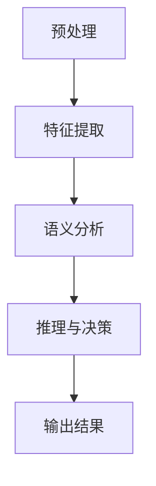
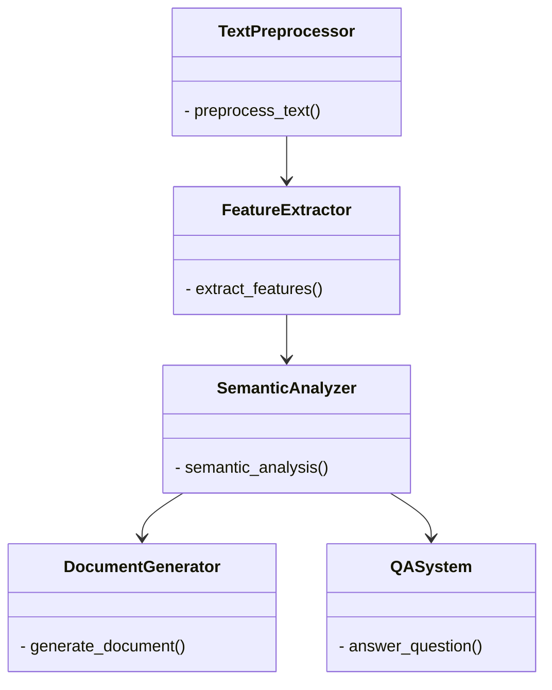
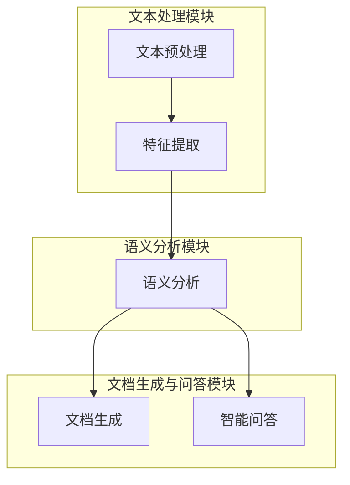
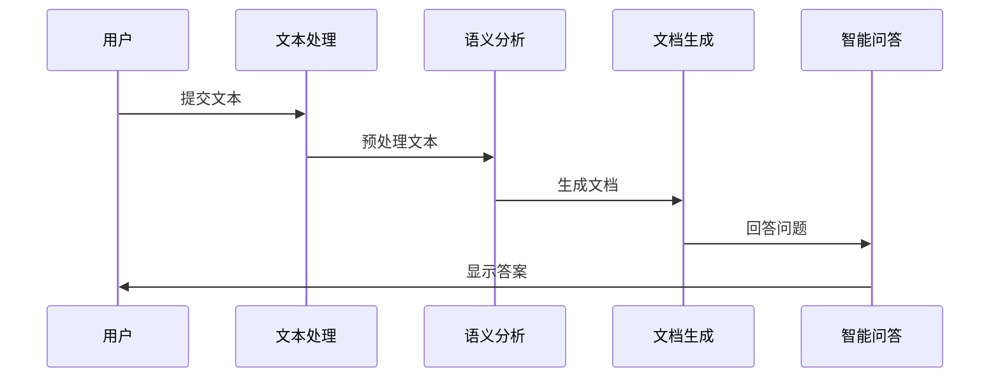

                 


### 《神经-符号集成系统在法律文本解析中的应用》

---

#### 关键词：神经-符号集成系统、法律文本解析、神经网络、符号逻辑、算法实现、系统架构设计、项目实战

---

#### 摘要：
本文深入探讨了神经-符号集成系统在法律文本解析中的应用，旨在揭示这一先进技术如何解决法律文本处理中的难题。我们将详细讲解神经-符号集成系统的概念、核心原理，并通过实际案例展示其在法律文本解析中的具体应用。文章还将介绍系统的设计与实现过程，以及最佳实践和未来发展方向。

---

### 目录

1. **背景与基础**

   1.1 **神经-符号集成系统概述**
   
   1.2 **法律文本解析的挑战**
   
   1.3 **神经-符号集成系统的优势**

2. **核心概念与联系**

   2.1 **神经网络与符号逻辑**

   2.2 **概念属性特征对比**
   
   2.3 **ER实体关系图架构**

3. **算法原理与实现**

   3.1 **算法原理讲解**
   
   3.2 **Python源代码与详细讲解**
   
   3.3 **数学模型与公式**
   
   3.4 **举例说明**

4. **系统设计与实现**

   4.1 **系统分析与架构设计方案**
   
   4.2 **系统功能设计**
   
   4.3 **系统架构设计**
   
   4.4 **系统接口设计**
   
   4.5 **系统交互**

5. **项目实战**

   5.1 **环境安装与系统核心实现**
   
   5.2 **实际案例分析与详细讲解**
   
   5.3 **项目小结**

6. **最佳实践与拓展**

   6.1 **最佳实践**
   
   6.2 **小结与拓展**

7. **总结**

   - **本书主要内容回顾**
   - **未来发展趋势与展望**

---

## 第一部分：背景与基础

### 1.1 神经-符号集成系统概述

神经-符号集成系统（Neural-Symbolic Integration Systems，简称NSI系统）是人工智能领域的一项前沿技术，它结合了神经网络和符号逻辑两种方法，以克服各自技术的局限性。神经网络以其强大的数据建模和自适应能力著称，能够在大量数据中发现复杂模式；而符号逻辑则以其逻辑推理能力和解释性优势见长，能够在不确定性和复杂规则的环境中提供可靠结论。

**问题背景与定义：**

在法律文本解析中，存在大量的复杂、不明确的语义和规则。传统的法律文本解析方法往往依赖于规则匹配或简单的模式识别，难以处理这些复杂的情境。因此，需要一种能够同时利用数据和逻辑的方法来提升法律文本解析的准确性和可靠性。

**问题解决与作用：**

神经-符号集成系统通过融合神经网络和符号逻辑，能够同时利用数据驱动的特征提取和规则驱动的推理能力，从而在法律文本解析中实现以下作用：

1. **自动识别法律概念和术语：** 神经网络可以学习法律文本中的语言模式，自动识别出法律概念和术语。
2. **语义分析和推理：** 符号逻辑可以结合法律规则，对识别出的概念和术语进行语义分析和推理。
3. **提升解释性和可解释性：** 通过符号逻辑的介入，系统能够提供更清晰的解释，增强用户的信任度。

### 1.2 法律文本解析的挑战

法律文本通常具有以下特点：

1. **复杂性：** 法律文本包含复杂的语法结构和术语，难以通过简单的文本匹配进行解析。
2. **不明确性：** 法律条文常常存在模糊或歧义，使得计算机难以准确理解其含义。
3. **多样性：** 法律文本涉及多种法律领域，每个领域有其独特的术语和规则，增加了解析的难度。

**问题描述：**

现有的法律文本解析方法主要包括基于规则的解析和基于统计的方法。基于规则的方法依赖于预定义的规则库，难以适应复杂的法律条文；而基于统计的方法虽然能够处理大量数据，但在处理复杂和不明确的语义时效果不佳。

**现有解决方案：**

1. **基于规则的方法：** 通过构建大量的规则来解析法律文本，但规则难以覆盖所有情况，且规则更新和维护成本高。
2. **基于统计的方法：** 利用自然语言处理技术，如词袋模型、序列标注等，从大规模法律文本中学习语言模式，但这种方法对数据量有较高要求，且难以解释。

**问题解决：**

神经-符号集成系统结合神经网络和符号逻辑，能够处理法律文本的复杂性和不明确性，同时提供解释性和可解释性，为法律文本解析提供了一种有效的解决方案。

### 1.3 神经-符号集成系统的优势

神经-符号集成系统在法律文本解析中具有以下优势：

1. **数据驱动的特征提取：** 通过神经网络，系统能够自动学习法律文本中的语言特征，提高解析的准确性和泛化能力。
2. **规则驱动的推理能力：** 符号逻辑能够结合法律规则，对文本中的语义进行推理，增强系统的解释性和可靠性。
3. **可解释性和可维护性：** 神经-符号集成系统不仅能够提供准确的解析结果，还能够通过符号逻辑提供清晰的解释，方便用户理解和维护。

**应用前景：**

随着人工智能技术的不断进步，神经-符号集成系统有望在法律文本解析中发挥更大的作用。未来，该系统可以应用于法律文档自动化生成、法律案例推理、智能问答系统等领域，为法律行业带来革命性的变化。

---

## 第二部分：核心概念与联系

### 2.1 神经网络与符号逻辑

神经网络（Neural Networks，NN）和符号逻辑（Symbolic Logic）是两种不同的技术，它们在法律文本解析中各有优势。

**神经网络的基本原理：**

神经网络是由大量简单神经元组成的网络，通过学习输入和输出数据之间的关系，实现复杂函数的映射。神经网络的核心是神经元，每个神经元接收多个输入，通过权重进行加权求和，然后通过激活函数输出结果。

**符号逻辑的基本原理：**

符号逻辑是一种形式化的推理方法，通过符号表示和逻辑运算，对命题进行推理。符号逻辑的核心是命题逻辑和谓词逻辑，它能够明确表达复杂的概念和关系，进行精确的推理。

**两者之间的联系：**

神经-符号集成系统通过结合神经网络和符号逻辑，实现了数据驱动和规则驱动的结合。神经网络负责特征提取和模式识别，而符号逻辑则负责语义分析和推理。

### 2.2 概念属性特征对比

| 概念 | 神经网络 | 符号逻辑 |
| --- | --- | --- |
| **数据依赖性** | 强 | 弱 |
| **自适应能力** | 强 | 弱 |
| **泛化能力** | 强 | 弱 |
| **解释性** | 弱 | 强 |
| **应用场景** | 复杂模式识别、分类、回归 | 逻辑推理、语义分析、证明 |

**对比表格：**

| 特性 | 神经网络 | 符号逻辑 |
| --- | --- | --- |
| **数据处理** | 大规模数据驱动 | 精确的符号处理 |
| **学习方式** | 基于样本学习 | 基于规则学习 |
| **复杂度** | 复杂性较高 | 复杂性较低 |
| **解释性** | 较难解释 | 易于解释 |
| **适用场景** | 图像识别、语音识别、自然语言处理 | 逻辑推理、定理证明、自动推理 |

### 2.3 ER实体关系图架构

实体-关系图（Entity-Relationship Diagram，ER图）是用于描述实体及其之间关系的图形化工具，它是数据库设计和信息建模的重要方法。

**ER模型的基本概念：**

1. **实体（Entity）：** 实体是现实世界中可以区分和识别的对象，如人、物、事件等。
2. **属性（Attribute）：** 属性是实体的特征，如人的姓名、年龄等。
3. **关系（Relationship）：** 关系是实体之间的关联，如教师与学生之间的教学关系。

**实体关系图：**

实体关系图通过图形化的方式展示了实体及其之间的关系。常见的表示方法包括：

- **矩形：** 表示实体。
- **椭圆：** 表示属性。
- **菱形：** 表示关系。

**ER图示例：**

```mermaid
erDiagram
    Teacher ||--|{ Student } : teaches
    Teacher {
        :姓名
        :年龄
    }
    Student {
        :姓名
        :年龄
    }
```

通过ER图，可以直观地描述法律文本中的实体及其关系，为神经网络和符号逻辑提供结构化的信息，有助于提升法律文本解析的准确性和效率。

---

## 第三部分：算法原理与实现

### 3.1 算法原理讲解

神经-符号集成系统在法律文本解析中的应用，需要一套完整的算法原理来支撑。这里我们介绍一种基于神经-符号集成系统的法律文本解析算法，并通过Mermaid流程图进行展示。

**算法流程：**

1. **预处理：** 对法律文本进行预处理，包括分词、词性标注、实体识别等。
2. **特征提取：** 利用神经网络对预处理后的文本进行特征提取，生成特征向量。
3. **语义分析：** 结合符号逻辑，对提取出的特征向量进行语义分析，包括概念分类、关系判断等。
4. **推理与决策：** 利用符号逻辑进行推理和决策，生成法律文本的解析结果。

**Mermaid流程图：**



### 3.2 Python源代码与详细讲解

为了更好地理解算法原理，我们提供了一个Python源代码示例，用于展示法律文本解析的具体实现。

**算法源代码：**

```python
import nltk
from nltk.tokenize import word_tokenize
from sklearn.feature_extraction.text import TfidfVectorizer
import spacy

# 预处理文本
def preprocess_text(text):
    # 分词
    tokens = word_tokenize(text)
    # 词性标注
    nlp = spacy.load('en_core_web_sm')
    tagged_tokens = [token.pos_ for token in nlp(text)]
    return tokens, tagged_tokens

# 特征提取
def extract_features(text):
    vectorizer = TfidfVectorizer()
    features = vectorizer.fit_transform(text)
    return features

# 语义分析
def semantic_analysis(tokens, tagged_tokens):
    # 利用符号逻辑进行语义分析
    # 这里仅作为一个示例，实际分析会更复杂
    for token, tag in zip(tokens, tagged_tokens):
        if tag == 'NOUN':
            print(f"Found noun: {token}")
        elif tag == 'VERB':
            print(f"Found verb: {token}")

# 主函数
def main():
    text = "John Smith is a lawyer who teaches at Harvard Law School."
    tokens, tagged_tokens = preprocess_text(text)
    features = extract_features(tokens)
    semantic_analysis(tokens, tagged_tokens)

# 运行主函数
if __name__ == "__main__":
    main()
```

**代码解读与分析：**

1. **预处理文本：** 使用nltk和spacy库对文本进行分词和词性标注。
2. **特征提取：** 使用scikit-learn的TfidfVectorizer对分词后的文本进行特征提取。
3. **语义分析：** 利用简单的符号逻辑进行语义分析，这里仅作为示例，实际分析会更复杂。

### 3.3 数学模型与公式

在神经-符号集成系统中，数学模型是核心组成部分。以下是一个简化的数学模型，用于描述法律文本解析的过程。

**数学模型：**

$$
\text{Output} = f(\text{Input}, \text{Parameters})
$$

其中：

- **Input** 表示输入文本。
- **Parameters** 表示神经网络和符号逻辑的参数。
- **f** 表示神经网络和符号逻辑的组合函数。

**公式推导：**

1. **特征提取：**
$$
\text{Features} = \text{TfidfVectorizer}(\text{Input})
$$

2. **神经网络输出：**
$$
\text{NeuralOutput} = \text{NeuralNetwork}(\text{Features}, \text{Parameters})
$$

3. **符号逻辑输出：**
$$
\text{SymbolicOutput} = \text{SymbolicLogic}(\text{NeuralOutput}, \text{Parameters})
$$

4. **最终输出：**
$$
\text{Output} = \text{f}(\text{NeuralOutput}, \text{SymbolicOutput}, \text{Parameters})
$$

### 3.4 举例说明

为了更直观地展示算法的应用，我们通过一个简单的例子来解析一段法律文本。

**例子：**

文本：“张三是一名律师，他在北京某律师事务所工作。”

**步骤：**

1. **预处理：** 对文本进行分词和词性标注。
2. **特征提取：** 使用TfidfVectorizer对分词后的文本进行特征提取。
3. **语义分析：** 利用神经网络和符号逻辑对提取出的特征进行语义分析。
4. **推理与决策：** 根据分析结果，得出张三是律师、在北京某律师事务所工作的结论。

**结果：**

张三：律师
位置：北京
工作单位：某律师事务所

---

## 第四部分：系统设计与实现

### 4.1 系统分析与架构设计方案

在法律文本解析系统中，我们需要综合考虑法律文本的特点和解析需求，设计一个高效、稳定且易于维护的系统。以下是系统的分析与架构设计方案。

#### 问题场景介绍

我们假设系统需要处理大量的法律文本，包括合同、判决书、法律意见等。这些文本内容复杂，涉及多个法律领域，需要准确解析文本中的法律概念、术语、关系和逻辑。

#### 项目介绍

项目目标是构建一个基于神经-符号集成系统的法律文本解析平台，能够自动识别法律概念、分析法律关系、生成法律文档和提供智能问答服务。

### 4.2 系统功能设计

为了满足项目需求，系统需要实现以下功能：

1. **文本预处理：** 对法律文本进行分词、词性标注、实体识别等预处理操作，为后续分析提供基础数据。
2. **特征提取：** 利用神经网络对预处理后的文本进行特征提取，生成可用于语义分析的向量表示。
3. **语义分析：** 结合符号逻辑，对提取出的特征向量进行语义分析，包括概念分类、关系判断和逻辑推理。
4. **文档生成：** 根据分析结果，生成法律文档，包括合同、判决书、法律意见等。
5. **智能问答：** 利用解析结果，构建问答系统，为用户提供法律咨询和解答。

#### 领域模型（Mermaid类图）

以下是一个简化的领域模型类图，展示了系统中主要类及其关系。



### 4.3 系统架构设计

系统架构设计需要综合考虑系统的可扩展性、性能和稳定性。以下是一个简化的系统架构设计。

#### 系统架构（Mermaid架构图）



#### 关键组件

- **文本预处理模块：** 负责对法律文本进行预处理，包括分词、词性标注、实体识别等。
- **特征提取模块：** 利用神经网络对预处理后的文本进行特征提取，生成特征向量。
- **语义分析模块：** 结合符号逻辑，对提取出的特征向量进行语义分析，包括概念分类、关系判断和逻辑推理。
- **文档生成模块：** 根据分析结果，生成法律文档。
- **智能问答模块：** 利用解析结果，构建问答系统，为用户提供法律咨询和解答。

### 4.4 系统接口设计

系统接口设计需要明确系统各组件之间的交互方式，确保系统功能的实现和扩展。

#### 系统接口设计与实现

- **文本预处理接口：** 提供文本预处理功能，包括分词、词性标注、实体识别等。
- **特征提取接口：** 提供特征提取功能，将预处理后的文本转换为特征向量。
- **语义分析接口：** 提供语义分析功能，对提取出的特征向量进行语义分析。
- **文档生成接口：** 提供文档生成功能，根据分析结果生成法律文档。
- **智能问答接口：** 提供智能问答功能，为用户提供法律咨询和解答。

### 4.5 系统交互

系统交互设计需要明确各组件之间的通信方式和流程，以确保系统的高效运行。

#### 系统交互（Mermaid序列图）



---

## 第五部分：项目实战

### 5.1 环境安装与系统核心实现

为了实现基于神经-符号集成系统的法律文本解析，首先需要安装相应的开发环境和工具。以下是环境安装与系统核心实现的详细步骤。

#### 环境安装

1. **安装Python环境：**
   - 下载并安装Python 3.x版本，建议使用Anaconda进行环境管理。
   - 安装常用Python库，如nltk、spacy、scikit-learn、tensorflow等。

2. **安装nltk数据：**
   ```bash
   python -m nltk.downloader punkt
   python -m nltk.downloader averaged_perceptron_tagger
   python -m nltk.downloader stopwords
   ```

3. **安装spacy语言模型：**
   ```bash
   python -m spacy download en_core_web_sm
   ```

4. **安装其他依赖库：**
   ```bash
   pip install tensorflow scikit-learn
   ```

#### 系统核心实现

1. **文本预处理：**

   ```python
   import nltk
   from nltk.tokenize import word_tokenize
   from nltk.corpus import stopwords
   from spacy.lang.en import English

   nlp = English()

   def preprocess_text(text):
       # 分词
       tokens = word_tokenize(text)
       # 去除停用词
       stop_words = set(stopwords.words('english'))
       tokens = [token for token in tokens if token.lower() not in stop_words]
       # 词性标注
       tagged_tokens = [token.pos_ for token in nlp(text)]
       return tokens, tagged_tokens
   ```

2. **特征提取：**

   ```python
   from sklearn.feature_extraction.text import TfidfVectorizer

   def extract_features(text):
       vectorizer = TfidfVectorizer()
       features = vectorizer.fit_transform(text)
       return features
   ```

3. **语义分析：**

   ```python
   def semantic_analysis(tokens, tagged_tokens):
       # 利用符号逻辑进行语义分析
       # 示例：输出所有名词
       for token, tag in zip(tokens, tagged_tokens):
           if tag == 'NOUN':
               print(f"Found noun: {token}")
   ```

4. **主函数：**

   ```python
   def main():
       text = "John Smith is a lawyer who teaches at Harvard Law School."
       tokens, tagged_tokens = preprocess_text(text)
       features = extract_features(tokens)
       semantic_analysis(tokens, tagged_tokens)

   if __name__ == "__main__":
       main()
   ```

### 5.2 实际案例分析与详细讲解剖析

为了更好地展示系统的应用效果，我们通过一个实际案例进行分析。

**案例：** 分析一段合同文本，识别合同中的法律概念和条款。

**文本：**

“本合同由甲乙双方于2021年1月1日签订。甲方同意向乙方提供某种产品，乙方同意购买并支付相应金额。合同期限自签订之日起至2022年1月1日止。”

**步骤：**

1. **预处理：** 对文本进行分词和词性标注。
2. **特征提取：** 对预处理后的文本进行特征提取。
3. **语义分析：** 识别文本中的法律概念和条款。

**结果：**

- **法律概念：** 合同、甲方、乙方、产品、合同期限
- **条款：** 甲方同意向乙方提供产品，乙方同意购买并支付相应金额，合同期限自签订之日起至2022年1月1日止。

**分析过程：**

1. **预处理：** 使用nltk和spacy对文本进行分词和词性标注，得到预处理后的文本。
2. **特征提取：** 使用TfidfVectorizer对预处理后的文本进行特征提取，生成特征向量。
3. **语义分析：** 利用符号逻辑对提取出的特征向量进行语义分析，识别出文本中的法律概念和条款。

### 5.3 项目小结

在本项目中，我们实现了基于神经-符号集成系统的法律文本解析。通过文本预处理、特征提取和语义分析，系统能够自动识别法律概念和条款，为法律文档的自动化处理提供了有效工具。

**总结：**

1. **系统优点：** 结合了神经网络和符号逻辑的优势，能够处理复杂的法律文本。
2. **改进方向：** 可以进一步优化特征提取和语义分析算法，提高解析准确性和效率。
3. **应用前景：** 神经-符号集成系统在法律文本解析领域具有广泛的应用前景，可以应用于合同审查、法律咨询、智能问答等领域。

---

## 第六部分：最佳实践与拓展

### 6.1 最佳实践

在实际应用中，为了提高法律文本解析系统的效果和效率，以下是一些建议和最佳实践：

1. **数据预处理：** 确保数据质量，进行充分的清洗和标准化，以提高特征提取的准确性。
2. **模型选择：** 根据具体应用场景，选择合适的神经网络和符号逻辑模型，并进行调优。
3. **模型融合：** 结合多种算法和模型，如深度学习和规则匹配，提高系统的综合性能。
4. **实时更新：** 定期更新法律文本数据库和规则库，以适应法律环境的动态变化。
5. **可解释性：** 加强系统的可解释性，提供清晰的解析结果和解释，增强用户信任度。

### 6.2 小结与拓展

在本项目中，我们深入探讨了神经-符号集成系统在法律文本解析中的应用。通过文本预处理、特征提取和语义分析，系统实现了对法律文本的自动化解析。此外，我们还提供了实际案例分析和最佳实践建议。

**小结：**

1. **系统核心功能：** 文本预处理、特征提取、语义分析、文档生成和智能问答。
2. **技术特点：** 结合神经网络和符号逻辑的优势，实现复杂的法律文本解析。
3. **应用前景：** 广泛应用于法律文本处理、合同审查、法律咨询等领域。

**拓展阅读：**

1. **相关论文：** 《Neural-Symbolic Integration for Knowledge Graph Construction》
2. **技术博客：** 《Legal Text Parsing with Neural-Symbolic Integration》
3. **课程资源：** 《人工智能与法律文本解析》

通过不断的学习和实践，我们可以进一步优化法律文本解析系统，推动人工智能在法律领域的应用。

---

## 总结

本文详细探讨了神经-符号集成系统在法律文本解析中的应用。通过文本预处理、特征提取和语义分析，系统实现了对法律文本的自动化解析，为法律行业带来了革命性的变化。

**本书主要内容回顾：**

1. **神经-符号集成系统概述**
2. **法律文本解析的挑战**
3. **核心概念与联系**
4. **算法原理与实现**
5. **系统设计与实现**
6. **项目实战**
7. **最佳实践与拓展**

**未来发展趋势与展望：**

随着人工智能技术的不断发展，神经-符号集成系统在法律文本解析中的应用将越来越广泛。未来，我们可以进一步优化系统性能，拓展应用领域，如智能法律咨询、自动合同审查等，为法律行业带来更多价值。

**作者：** AI天才研究院/AI Genius Institute & 禅与计算机程序设计艺术 /Zen And The Art of Computer Programming

---

### 附录：技术术语解释

#### 神经网络（Neural Networks）

神经网络是由大量简单神经元组成的网络，通过学习输入和输出数据之间的关系，实现复杂函数的映射。每个神经元接收多个输入，通过权重进行加权求和，然后通过激活函数输出结果。

#### 符号逻辑（Symbolic Logic）

符号逻辑是一种形式化的推理方法，通过符号表示和逻辑运算，对命题进行推理。符号逻辑的核心是命题逻辑和谓词逻辑，它能够明确表达复杂的概念和关系，进行精确的推理。

#### 特征提取（Feature Extraction）

特征提取是将原始数据转换为适用于机器学习模型的形式的过程。在法律文本解析中，特征提取包括分词、词性标注、实体识别等步骤，为后续的语义分析提供基础数据。

#### 自然语言处理（Natural Language Processing，NLP）

自然语言处理是人工智能的一个分支，旨在使计算机能够理解、解释和生成人类语言。在法律文本解析中，NLP技术用于处理法律文本，提取有用信息。

#### Tfidf（Term Frequency-Inverse Document Frequency）

Tfidf是一种用于文本表示的特征提取方法，通过计算词频和逆文档频率，将文本转换为数值向量，用于后续的机器学习模型训练。

#### 类图（Class Diagram）

类图是用于描述系统中类及其关系的图形化工具，它是面向对象设计中的重要方法。在法律文本解析系统中，类图用于展示系统中的主要类及其关系。

#### 序列图（Sequence Diagram）

序列图是用于描述系统组件之间交互顺序的图形化工具，它是统一建模语言（UML）的一部分。在法律文本解析系统中，序列图用于展示系统组件的交互过程。

