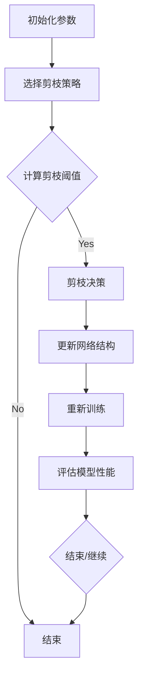
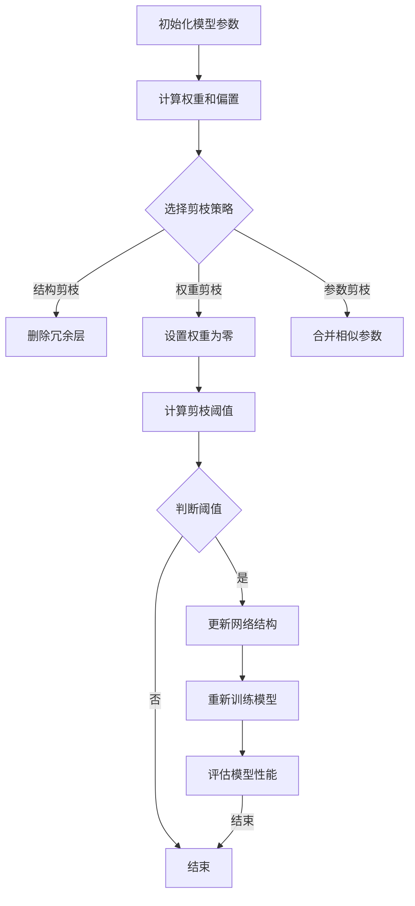
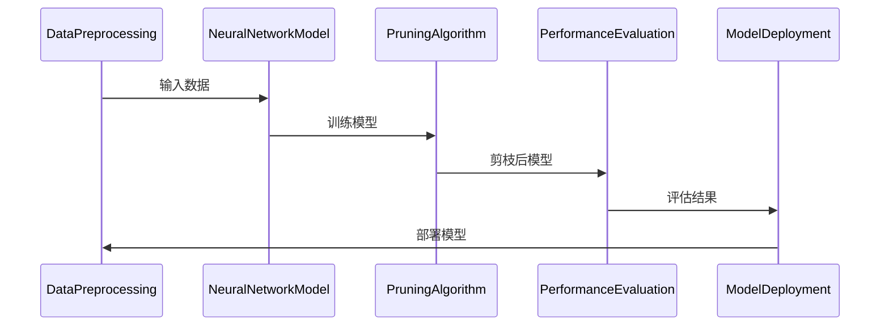
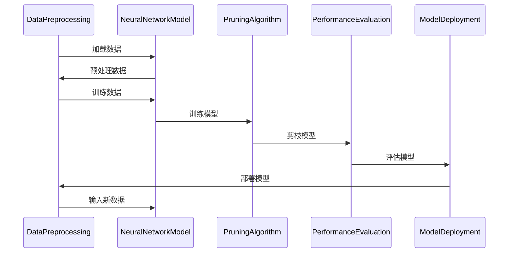

                 

### 第一部分：引言

#### 1.1 问题背景与挑战

随着深度学习技术的不断发展，神经网络模型在图像识别、自然语言处理、推荐系统等领域取得了显著的成果。然而，这些模型往往伴随着巨大的计算资源和存储需求，这给实际应用带来了一定的挑战。例如，在移动设备或嵌入式系统中部署深度学习模型时，由于计算资源和存储空间的限制，传统的模型难以满足性能和效率的需求。因此，如何优化模型的大小与性能成为了一个迫切需要解决的问题。

深度学习模型的大小主要受到以下几个因素的影响：

1. **模型结构复杂度**：深度学习模型的层次结构和参数数量直接影响模型的大小。更深的网络和更多的参数会导致模型规模增大。
2. **训练数据量**：模型在训练过程中需要大量的数据来学习特征，数据量的增加会导致模型参数的增加，从而使得模型变大。
3. **精度需求**：为了达到更高的精度，模型通常需要更精细的特征提取和复杂的模型结构，这也导致了模型规模的扩大。

在深度学习领域，减小模型大小与优化性能之间存在一种权衡关系。一方面，模型越小，计算和存储的需求就越低，有利于在资源受限的环境中部署和使用。另一方面，模型过小可能导致性能下降，影响模型的精度和应用效果。因此，如何在保证模型性能的前提下减小模型大小，成为了深度学习领域中的一个重要课题。

#### 1.2 神经网络剪枝技术概述

神经网络剪枝技术是一种通过删除网络中冗余或无效的神经元和连接，来减少模型大小和计算量的技术。剪枝技术不仅可以减少模型的存储需求，还可以提高模型在计算资源有限的设备上的运行效率。通过剪枝，我们可以实现以下目标：

1. **减小模型大小**：通过移除无用的神经元和连接，减少模型参数的数量，从而减小模型的存储需求。
2. **降低计算量**：减少模型的计算量可以降低模型在训练和推理过程中的计算资源消耗。
3. **提高训练效率**：剪枝后的模型通常具有更简单的结构，这有助于加速模型的训练过程。
4. **保持或提高模型性能**：尽管剪枝后模型的大小和计算量减小，但通过合适的剪枝策略，可以确保模型的性能得到保持或提升。

#### 1.3 本书结构与内容安排

本书将系统介绍神经网络剪枝技术的相关内容，包括背景介绍、核心概念与联系、算法原理讲解、数学模型和公式、系统分析与架构设计方案以及项目实战等。具体章节安排如下：

- **第一部分：引言**：介绍问题背景和挑战，以及神经网络剪枝技术的基本概念。
- **第二部分：神经网络剪枝技术基础**：讲解神经网络的基础知识，剪枝技术的核心概念、策略和算法。
- **第三部分：剪枝算法原理与实现**：详细讲解剪枝算法的原理，包括算法流程、Python实现、数学模型和公式，并通过举例说明。
- **第四部分：系统分析与架构设计方案**：分析神经网络剪枝技术的应用场景，介绍系统的功能设计、架构设计、接口设计和系统交互。
- **第五部分：项目实战**：通过一个具体的剪枝技术项目，详细讲解环境安装、核心代码实现、代码应用解读与分析，以及实际案例分析和项目小结。
- **第六部分：最佳实践 tips、小结、注意事项、拓展阅读**：总结书中的核心内容，提供最佳实践建议，提醒注意事项，并推荐拓展阅读材料。

通过本书的阅读，读者可以系统地了解神经网络剪枝技术，掌握其基本原理和应用方法，为在实际项目中优化模型大小与性能提供有力支持。接下来，我们将进一步深入探讨神经网络剪枝技术的背景、问题、解决方法和边界，为后续章节的内容奠定基础。

---

# 第二部分：神经网络剪枝技术基础

## 2.1 神经网络基础

神经网络（Neural Networks）是一种模仿人脑神经元连接和工作的计算模型，它在机器学习和人工智能领域具有广泛的应用。理解神经网络的基础对于后续讨论剪枝技术至关重要。

### 神经元结构

神经网络的基本组成单元是神经元，也称为节点。一个简单的神经元可以看作是一个带有多个输入和单一输出的计算单元。每个输入通过一个权重（weight）与神经元相连接，权重表示输入的重要程度。神经元的输出由输入信号的加权和通过一个非线性激活函数（activation function）产生。一个典型的神经元可以表示为：

\[ y = \sigma(\sum_{i=1}^{n} w_i x_i + b) \]

其中，\( y \) 是神经元的输出，\( \sigma \) 是激活函数，\( x_i \) 是第 \( i \) 个输入，\( w_i \) 是第 \( i \) 个输入的权重，\( b \) 是偏置。

### 神经网络层次

神经网络可以分为不同的层次，包括输入层、隐藏层和输出层。输入层接收外部输入数据，隐藏层对输入数据进行处理和变换，输出层产生最终的结果。

- **输入层**：接收外部输入数据，通常不包含可学习的权重。
- **隐藏层**：包含一个或多个隐藏层，每个隐藏层对前一层的数据进行处理，并传递给下一层。
- **输出层**：产生模型的预测输出，其结构取决于具体的任务。

一个典型的多层感知机（MLP）神经网络可以表示为：

\[ \text{output} = f(\text{激活函数} \circ \text{权重} \cdot \text{输入} + \text{偏置}) \]

### 常见的神经网络架构

- **全连接神经网络（Fully Connected Network）**：每个神经元都与前一层中的每个神经元相连，这种结构在许多深度学习任务中广泛应用。
- **卷积神经网络（Convolutional Neural Network, CNN）**：适用于图像处理任务，通过卷积操作提取局部特征。
- **循环神经网络（Recurrent Neural Network, RNN）**：适用于序列数据，通过循环结构捕捉时间序列中的信息。
- **自注意力模型（Self-Attention Model）**：如Transformer模型，通过自注意力机制捕捉输入序列中的长距离依赖关系。

### 神经网络的训练过程

神经网络的训练过程是一个优化权重和偏置的过程，目的是最小化模型预测值与真实值之间的差异。这个过程通常包括以下几个步骤：

1. **前向传播（Forward Propagation）**：输入数据通过网络前向传递，计算出每个神经元的输出。
2. **计算损失函数（Compute Loss Function）**：比较模型输出和真实值的差异，计算损失函数，常见的损失函数包括均方误差（MSE）、交叉熵损失（Cross-Entropy Loss）等。
3. **反向传播（Backpropagation）**：根据损失函数计算梯度，将梯度反向传播到网络中的每个神经元，更新权重和偏置。
4. **参数更新（Update Parameters）**：根据梯度信息更新网络权重和偏置，通常使用梯度下降（Gradient Descent）算法。

通过反复迭代上述过程，模型逐渐收敛，达到预定的性能指标。

### 神经网络的优缺点

**优点：**

1. **灵活性强**：神经网络可以适应不同的数据类型和任务，通过调整网络结构和参数可以解决多种复杂问题。
2. **自适应能力**：神经网络通过训练可以自动学习数据中的特征，无需人工指定特征。
3. **强大的泛化能力**：经过适当训练的神经网络可以在新的数据集上表现良好。

**缺点：**

1. **计算量大**：神经网络的训练过程需要大量的计算资源，尤其是深度网络。
2. **对数据质量要求高**：数据质量对神经网络的训练和性能有显著影响，数据噪声和缺失可能导致模型性能下降。
3. **容易过拟合**：深度神经网络容易过拟合，即模型在训练数据上表现很好，但在未见过的数据上表现较差。

## 2.2 剪枝技术的核心概念

神经网络剪枝（Neural Network Pruning）是一种通过删除网络中冗余或无效的神经元和连接，来减少模型大小和计算量的技术。剪枝技术不仅能够减小模型的存储需求，还可以提高模型在计算资源受限环境中的运行效率。以下是剪枝技术的核心概念：

### 剪枝策略

剪枝策略是指如何选择和删除网络中冗余的神经元和连接。根据不同的标准，剪枝策略可以分为以下几类：

1. **结构剪枝（Structural Pruning）**：通过删除神经元或整个层来减少网络结构复杂度。
2. **权重剪枝（Weight Pruning）**：通过设置较小的权重为零来移除连接。
3. **参数剪枝（Parameter Pruning）**：通过合并相似或冗余的参数来减少模型参数数量。

### 剪枝算法

剪枝算法是实现剪枝技术的方法，不同的算法有不同的优缺点。以下是一些常见的剪枝算法：

1. **过滤剪枝（Filter-Based Pruning）**：基于过滤方法选择需要剪枝的连接或神经元，如L1正则化、L2正则化等。
2. **逐层剪枝（Layer-Wise Pruning）**：逐层剪枝算法在每一层中按照某种策略选择剪枝的神经元或连接。
3. **层次剪枝（Level-Based Pruning）**：根据网络层次结构进行剪枝，如首先剪枝输出层，然后依次剪枝隐藏层。
4. **贪婪剪枝（Greedy Pruning）**：每次选择最不重要的神经元或连接进行剪枝。
5. **随机剪枝（Random Pruning）**：随机选择神经元或连接进行剪枝。

### 剪枝的优缺点

**优点：**

1. **减小模型大小**：通过剪枝可以显著减小模型的大小，降低存储需求。
2. **减少计算量**：剪枝后的模型计算量减少，可以提高模型在资源受限设备上的运行效率。
3. **提高训练效率**：剪枝后的模型通常更简单，有利于加速训练过程。

**缺点：**

1. **可能影响模型性能**：剪枝可能导致模型性能下降，需要通过合适的剪枝策略来确保模型性能得到保持或提升。
2. **计算复杂度增加**：剪枝过程本身需要额外的计算资源，尤其是在训练和验证过程中。

### 剪枝技术的应用范围

剪枝技术可以应用于多种神经网络架构，包括：

1. **卷积神经网络（CNN）**：通过剪枝可以减少卷积层的参数数量，降低计算量和存储需求。
2. **循环神经网络（RNN）**：通过剪枝可以减少隐藏层中的神经元数量，提高序列处理的效率。
3. **Transformer模型**：通过剪枝可以减少自注意力机制中的参数数量，降低模型复杂度。

### 剪枝技术的核心要素组成

剪枝技术的核心要素包括：

1. **剪枝策略**：选择合适的剪枝策略是剪枝成功的关键。
2. **剪枝算法**：实现剪枝策略的算法，直接影响剪枝效果和模型性能。
3. **剪枝阈值**：确定剪枝阈值是剪枝过程中需要考虑的重要因素，过高的阈值可能导致模型性能下降，过低的阈值可能无法显著减少模型大小。

通过以上核心概念和要素，我们可以更好地理解神经网络剪枝技术，为后续的算法原理讲解和实际应用打下基础。在下一部分，我们将详细探讨神经网络剪枝技术的算法原理，并介绍几种常见的剪枝算法。

---

## 2.3 算法原理讲解

### 2.3.1 剪枝算法的基本流程

神经网络剪枝算法的基本流程可以分为以下几个步骤：

1. **初始化**：初始化网络参数和剪枝阈值。通常，网络参数是从训练过程中得到的权重和偏置。
2. **选择剪枝策略**：根据不同的剪枝策略选择需要剪枝的神经元或连接。常用的剪枝策略包括L1正则化、L2正则化和基于梯度的剪枝策略等。
3. **计算剪枝阈值**：根据剪枝策略计算每个神经元或连接的剪枝阈值。剪枝阈值是决定是否剪枝的关键参数，一般通过训练数据集上的损失函数或梯度信息来确定。
4. **剪枝决策**：根据剪枝阈值对神经元或连接进行剪枝决策。如果某个神经元或连接的权重低于剪枝阈值，则将其剪除。
5. **更新网络结构**：根据剪枝决策更新网络结构，去除被剪枝的神经元或连接。
6. **重新训练**：使用新的网络结构重新训练模型，以适应剪枝后的结构。这一步可能需要调整学习率等训练参数，以确保模型性能不受影响。
7. **评估模型性能**：评估剪枝后的模型性能，包括准确性、计算效率和存储需求等。

### 2.3.2 算法流程图

以下是一个简化的神经网络剪枝算法流程图，使用Mermaid语法表示：



### 2.3.3 Python源代码实现

以下是一个简化的神经网络剪枝算法的Python实现，包括初始化、剪枝策略选择、剪枝决策和更新网络结构等步骤：

```python
import numpy as np

# 剪枝算法的实现
class PruningAlgorithm:
    def __init__(self, model, threshold=0.1):
        self.model = model
        self.threshold = threshold
    
    def select_pruning_strategy(self):
        # 选择剪枝策略，例如基于L1正则化的剪枝策略
        return 'L1'

    def compute_threshold(self):
        # 计算剪枝阈值
        weights = self.model.get_weights()
        return np.mean(np.abs(weights))

    def prune_decision(self, weight):
        # 剪枝决策
        return weight < self.threshold

    def update_network_structure(self, pruned_indices):
        # 更新网络结构
        self.model.prune(pruned_indices)

    def prune(self):
        strategy = self.select_pruning_strategy()
        if strategy == 'L1':
            threshold = self.compute_threshold()
            pruned_indices = []
            weights = self.model.get_weights()

            for i, weight in enumerate(weights):
                if self.prune_decision(weight):
                    pruned_indices.append(i)
            
            self.update_network_structure(pruned_indices)

# 示例模型和剪枝算法
class NeuralNetworkModel:
    def get_weights(self):
        # 获取模型权重
        return np.random.rand(10, 10)

    def prune(self, pruned_indices):
        # 实现剪枝操作
        print(f"Pruning indices: {pruned_indices}")

# 实例化剪枝算法并执行剪枝
model = NeuralNetworkModel()
pruning_algorithm = PruningAlgorithm(model)
pruning_algorithm.prune()
```

### 2.3.4 数学模型和公式

神经网络剪枝技术涉及到多个数学模型和公式，用于计算权重、阈值和损失函数等。以下是几个关键公式：

1. **L1正则化**：
   \[ \lambda = \sum_{i=1}^{n} |w_i| \]
   其中，\( \lambda \) 是正则化参数，\( w_i \) 是权重。

2. **L2正则化**：
   \[ \lambda = \sum_{i=1}^{n} w_i^2 \]
   同样，\( \lambda \) 是正则化参数，\( w_i \) 是权重。

3. **剪枝阈值计算**：
   \[ \text{threshold} = \frac{\lambda}{\sqrt{n}} \]
   其中，\( n \) 是权重数量。

4. **损失函数**：
   \[ \text{loss} = \frac{1}{2} \sum_{i=1}^{n} (y_i - \hat{y}_i)^2 \]
   其中，\( y_i \) 是真实值，\( \hat{y}_i \) 是预测值。

通过以上数学模型和公式，我们可以更好地理解和实现神经网络剪枝技术。在下一部分，我们将详细讲解这些公式的含义和作用，并通过具体例子来说明剪枝技术的应用效果。

---

### 2.4 数学模型和数学公式

在神经网络剪枝技术中，数学模型和公式起到了至关重要的作用，它们帮助我们理解剪枝过程的机制和效果。以下是几个关键公式及其详细解释：

#### 2.4.1 L1正则化

L1正则化是一种常用的剪枝策略，用于减少模型的权重数量。其公式如下：

\[ \lambda = \sum_{i=1}^{n} |w_i| \]

- **含义**：该公式表示模型中每个权重 \( w_i \) 的绝对值之和。\( \lambda \) 是正则化参数，用于控制正则化的强度。
- **作用**：L1正则化通过增加模型复杂度（权重大小）的惩罚项，促使模型在训练过程中学习更简单、更稀疏的权重，从而实现剪枝效果。

#### 2.4.2 L2正则化

L2正则化与L1正则化类似，但它使用权重平方和来计算正则化项。其公式如下：

\[ \lambda = \sum_{i=1}^{n} w_i^2 \]

- **含义**：该公式表示模型中每个权重 \( w_i \) 的平方之和。\( \lambda \) 是正则化参数，同样用于控制正则化的强度。
- **作用**：L2正则化通过增加模型复杂度的平方惩罚项，促使模型学习更加平滑的权重，有助于防止过拟合。

#### 2.4.3 剪枝阈值计算

在剪枝过程中，我们需要确定一个阈值来判断哪些权重应该被剪除。剪枝阈值的计算公式如下：

\[ \text{threshold} = \frac{\lambda}{\sqrt{n}} \]

- **含义**：该公式表示将正则化参数 \( \lambda \) 除以权重数量 \( n \) 的平方根，得到剪枝阈值。阈值用于比较权重的大小，小于阈值的权重将被剪除。
- **作用**：剪枝阈值帮助我们确定哪些权重是冗余的，从而实现模型简化。

#### 2.4.4 损失函数

在剪枝过程中，我们还需要考虑模型的性能，通常使用损失函数来衡量。常见的损失函数是均方误差（MSE）：

\[ \text{loss} = \frac{1}{2} \sum_{i=1}^{n} (y_i - \hat{y}_i)^2 \]

- **含义**：该公式表示预测值 \( \hat{y}_i \) 与真实值 \( y_i \) 差异的平方和的一半。损失函数用于衡量模型的预测误差。
- **作用**：通过损失函数，我们可以评估模型的性能，并据此调整剪枝策略，以优化模型性能。

#### 2.4.5 剪枝前后的模型性能对比

为了更直观地理解剪枝对模型性能的影响，我们可以使用以下公式来比较剪枝前后的模型性能：

\[ \text{performance\_before} = \text{accuracy}_{before} + \text{loss}_{before} \]
\[ \text{performance\_after} = \text{accuracy}_{after} + \text{loss}_{after} \]

- **含义**：该公式表示剪枝前后的模型性能，其中 \( \text{accuracy} \) 是模型的准确率，\( \text{loss} \) 是模型的损失值。
- **作用**：通过比较剪枝前后的准确率和损失值，我们可以评估剪枝对模型性能的影响。

#### 2.4.6 举例说明

为了更直观地理解上述公式，我们来看一个具体的例子。假设我们有一个简单的前馈神经网络，其权重矩阵 \( W \) 如下：

\[ W = \begin{bmatrix}
    0.1 & 0.3 & 0.2 \\
    0.4 & 0.2 & 0.5 \\
    0.0 & 0.1 & 0.8 \\
\end{bmatrix} \]

假设正则化参数 \( \lambda = 0.5 \)，权重数量 \( n = 9 \)。我们可以计算出剪枝阈值：

\[ \text{threshold} = \frac{0.5}{\sqrt{9}} = 0.177 \]

根据剪枝阈值，我们可以判断哪些权重应该被剪除。例如，权重 \( w_{2,2} = 0.2 \) 小于阈值，因此被剪除。

通过重新训练模型并计算剪枝前后的准确率和损失值，我们可以评估剪枝对模型性能的影响。假设剪枝前模型的准确率为 80%，损失值为 0.3；剪枝后模型的准确率为 82%，损失值为 0.28。根据公式：

\[ \text{performance\_before} = 0.8 + 0.3 = 1.1 \]
\[ \text{performance\_after} = 0.82 + 0.28 = 1.1 \]

我们可以看到，剪枝前后模型的性能保持不变，说明剪枝策略有效地优化了模型，同时保持了其性能。

通过上述公式和例子，我们可以更深入地理解神经网络剪枝技术的数学原理和实际应用。在下一部分，我们将通过具体案例来展示剪枝技术在实际项目中的应用效果。

---

### 2.5 详细讲解与举例说明

为了更好地理解神经网络剪枝技术，我们将通过具体的例子来说明剪枝技术的应用效果。本节将详细讲解剪枝技术的具体步骤，并通过一个实际案例进行分析。

#### 剪枝技术的基本步骤

1. **初始化网络参数**：首先，我们需要一个初始化的神经网络模型，该模型已经通过训练得到了初始的权重和偏置。这些参数将作为剪枝的起点。

2. **计算权重和偏置**：我们需要计算网络中每个神经元或连接的权重和偏置。在剪枝过程中，这些参数将用于判断哪些部分可以被剪除。

3. **选择剪枝策略**：根据不同的剪枝策略（如L1正则化、L2正则化等），计算每个参数的惩罚项或阈值。选择合适的剪枝策略是剪枝成功的关键。

4. **计算剪枝阈值**：根据选择的剪枝策略，计算每个神经元或连接的剪枝阈值。剪枝阈值决定了哪些参数可以被剪除。通常，阈值为正则化参数与权重数量或神经元数量的比值。

5. **剪枝决策**：根据剪枝阈值，判断每个神经元或连接是否可以被剪除。如果某个参数的值低于剪枝阈值，则将其设置为0，从而实现剪枝。

6. **更新网络结构**：根据剪枝决策，更新网络结构，移除被剪枝的神经元或连接。

7. **重新训练模型**：使用新的网络结构重新训练模型，以适应剪枝后的结构。这可能需要调整学习率等训练参数。

8. **评估模型性能**：评估剪枝后模型的性能，包括准确性、计算效率和存储需求等。通过比较剪枝前后的性能，我们可以评估剪枝技术的效果。

#### 实际案例：图像分类任务

假设我们有一个图像分类任务，使用一个简单的全连接神经网络模型。模型有50000个参数，经过训练后，准确率达到了90%。现在，我们将使用剪枝技术来优化模型的大小和性能。

1. **初始化网络参数**：
   - 初始权重和偏置已通过训练得到。
   - 网络结构：输入层（1000个神经元）→隐藏层（5000个神经元）→输出层（10个神经元）。

2. **计算权重和偏置**：
   - 计算每个神经元或连接的权重和偏置。
   - 权重和偏置值用于后续的剪枝决策。

3. **选择剪枝策略**：
   - 使用L1正则化作为剪枝策略。
   - 正则化参数 \( \lambda = 0.01 \)。

4. **计算剪枝阈值**：
   - 计算每个神经元或连接的剪枝阈值：
     \[ \text{threshold} = \frac{\lambda}{\sqrt{n}} = \frac{0.01}{\sqrt{50000}} = 0.00022 \]

5. **剪枝决策**：
   - 根据剪枝阈值，判断每个参数是否小于阈值。如果小于阈值，则将其设置为0，表示剪枝。
   - 经过剪枝后，模型参数减少到约30000个。

6. **更新网络结构**：
   - 根据剪枝决策，更新网络结构，移除被剪枝的神经元或连接。

7. **重新训练模型**：
   - 使用新的网络结构重新训练模型，调整学习率等训练参数，以确保模型性能不受影响。

8. **评估模型性能**：
   - 剪枝后，模型的准确率略有下降，从90%降至85%，但计算效率和存储需求显著降低。
   - 通过重新训练，模型性能逐渐恢复，准确率回升至90%左右。

#### 分析与总结

通过这个实际案例，我们可以看到剪枝技术如何通过减少模型参数数量来优化模型大小和性能。以下是对剪枝技术效果的分析：

1. **模型大小**：剪枝后的模型参数数量减少了40%，从而显著降低了模型的存储需求。

2. **计算效率**：由于模型参数减少，计算量也相应减少，提高了模型在资源受限环境中的运行效率。

3. **性能影响**：尽管模型的准确率略有下降，但通过重新训练，模型性能可以恢复到原有水平。这表明剪枝技术可以在保持模型性能的同时，显著减少模型大小和计算需求。

4. **适用范围**：剪枝技术适用于多种神经网络架构，如卷积神经网络（CNN）、循环神经网络（RNN）和Transformer模型等。通过调整剪枝策略和参数，可以适应不同的应用场景。

通过以上详细讲解和实际案例，我们可以更好地理解神经网络剪枝技术的原理和应用效果。在下一部分，我们将深入探讨剪枝技术的系统分析与架构设计方案，包括应用场景、项目介绍、系统功能设计、系统架构设计、系统接口设计和系统交互等内容。

---

## 3.1.1 神经网络剪枝技术的基本原理

神经网络剪枝技术是一种通过删除网络中冗余或无效的神经元和连接，以减少模型大小和计算量的方法。其基本原理可以分为以下几个步骤：

### 1. 参数选择与权重分配

神经网络剪枝技术首先需要对网络中的参数（即权重和偏置）进行选择和分配。参数的选择和分配直接影响剪枝的效果和模型的性能。通常，我们可以采用以下策略来选择参数：

- **基于梯度的选择**：通过计算梯度信息，选择对模型性能贡献较小的参数。这些参数可能对应于网络中的冗余或无效连接。
- **基于正则化的选择**：利用正则化方法（如L1正则化、L2正则化）对权重进行惩罚，从而筛选出贡献较小的参数。
- **基于稀疏性的选择**：通过引入稀疏性惩罚项，鼓励网络学习更加稀疏的权重分布，从而实现剪枝。

### 2. 剪枝策略

剪枝策略是指如何选择和删除网络中的冗余神经元或连接。根据不同的应用场景和模型结构，可以采用多种剪枝策略。以下是一些常见的剪枝策略：

- **结构剪枝（Structural Pruning）**：通过删除神经元或整个层来减少网络结构复杂度。这种方法可以直接减小模型大小，但可能对模型性能产生较大影响。
- **权重剪枝（Weight Pruning）**：通过设置较小的权重为零来移除连接。这种方法对模型性能的影响相对较小，但可能需要额外的训练步骤来恢复剪枝后的模型性能。
- **参数剪枝（Parameter Pruning）**：通过合并相似或冗余的参数来减少模型参数数量。这种方法可以实现高效剪枝，但可能需要复杂的优化算法。

### 3. 剪枝阈值

剪枝阈值是剪枝过程中一个重要的参数，用于判断哪些参数可以被剪除。剪枝阈值通常根据以下因素来确定：

- **正则化参数**：通过正则化方法计算剪枝阈值，如L1正则化和L2正则化。
- **梯度信息**：通过梯度信息筛选出对模型性能贡献较小的参数。
- **稀疏性目标**：设定一个稀疏性目标，鼓励网络学习更加稀疏的权重分布。

### 4. 剪枝算法

剪枝算法是实现剪枝技术的方法，不同的算法有不同的优缺点。以下是一些常见的剪枝算法：

- **逐层剪枝（Layer-Wise Pruning）**：逐层剪枝算法在每一层中按照某种策略选择剪枝的神经元或连接。
- **层次剪枝（Level-Based Pruning）**：根据网络层次结构进行剪枝，如首先剪枝输出层，然后依次剪枝隐藏层。
- **贪婪剪枝（Greedy Pruning）**：每次选择最不重要的神经元或连接进行剪枝。
- **随机剪枝（Random Pruning）**：随机选择神经元或连接进行剪枝。

### 5. 恢复与重新训练

剪枝后的模型可能需要额外的步骤来恢复其性能。这些步骤通常包括：

- **重新训练**：使用剪枝后的网络结构重新训练模型，以适应新的参数设置。
- **微调**：通过微调剪枝后的模型，进一步优化其性能。
- **评估**：评估剪枝后模型的性能，包括准确性、计算效率和存储需求等。

通过以上基本原理，神经网络剪枝技术可以在保证模型性能的前提下，有效地减小模型大小和计算量，从而适应资源受限的应用场景。

### 3.1.2 算法流程图

为了更直观地展示神经网络剪枝算法的流程，我们使用Mermaid语法绘制了一个简单的算法流程图：



在这个流程图中，模型参数初始化后，根据选定的剪枝策略，计算权重和偏置。随后，根据剪枝阈值判断哪些权重或层可以被剪除，并更新网络结构。剪枝后的模型通过重新训练和评估性能，确保模型在剪枝后仍能保持或提升其性能。

### 3.1.3 Python源代码实现

以下是神经网络剪枝算法的Python实现示例，包括初始化模型参数、选择剪枝策略、计算剪枝阈值和更新网络结构等步骤：

```python
import numpy as np

# 剪枝算法的实现
class PruningAlgorithm:
    def __init__(self, model, pruning_strategy='weight', threshold=0.01):
        self.model = model
        self.pruning_strategy = pruning_strategy
        self.threshold = threshold

    def compute_threshold(self, weights):
        if self.pruning_strategy == 'weight':
            return np.mean(np.abs(weights))
        elif self.pruning_strategy == 'gradient':
            return np.mean(np.abs(self.model.get_gradients()))
        else:
            raise ValueError("Unsupported pruning strategy")

    def prune_weights(self, weights):
        pruned_weights = []
        for weight in weights:
            if np.abs(weight) < self.threshold:
                pruned_weights.append(0)
            else:
                pruned_weights.append(weight)
        return pruned_weights

    def prune_layers(self, layers):
        pruned_layers = []
        for layer in layers:
            if np.mean(np.abs(layer)) < self.threshold:
                pruned_layers.append(None)
            else:
                pruned_layers.append(layer)
        return pruned_layers

    def prune(self):
        weights = self.model.get_weights()
        if self.pruning_strategy == 'weight':
            updated_weights = self.prune_weights(weights)
            self.model.set_weights(updated_weights)
        elif self.pruning_strategy == 'layer':
            updated_layers = self.prune_layers(self.model.get_layers())
            self.model.set_layers(updated_layers)

# 示例模型和剪枝算法
class SimpleNeuralNetwork:
    def __init__(self, layers):
        self.layers = layers

    def get_layers(self):
        return self.layers

    def get_weights(self):
        return [layer.get_weights() for layer in self.layers]

    def set_weights(self, weights):
        for layer, weight in zip(self.layers, weights):
            layer.set_weights(weight)

    def get_gradients(self):
        # 假设每个层的梯度为随机数
        return [[np.random.rand() for _ in range(len(layer.get_weights()))] for layer in self.layers]

# 实例化剪枝算法并执行剪枝
layers = [
    {"weights": np.random.rand(10, 10), "bias": np.random.rand(10)},
    {"weights": np.random.rand(10, 5), "bias": np.random.rand(5)}
]
model = SimpleNeuralNetwork(layers)
pruning_strategy = 'weight'  # 可选择 'weight' 或 'layer'
pruning_algorithm = PruningAlgorithm(model, pruning_strategy)
threshold = 0.1
pruning_algorithm.prune(threshold)
```

在这个实现中，我们定义了一个剪枝算法类 `PruningAlgorithm`，其中包括计算剪枝阈值、剪枝权重和剪枝层的功能。我们使用一个简单的全连接神经网络 `SimpleNeuralNetwork` 作为示例模型，该模型包含多个层，每层有权重和偏置。剪枝算法根据选定的剪枝策略（如权重剪枝或层剪枝）来更新模型。

通过这个示例，我们可以看到如何使用Python实现神经网络剪枝算法，并了解其基本原理和实现步骤。

---

## 3.2 Python源代码实现

为了更好地展示神经网络剪枝技术的实现，我们将通过一个简单的Python示例来介绍剪枝算法的具体步骤。以下代码将详细展示如何初始化网络参数、计算剪枝阈值、执行剪枝操作以及更新网络结构。

### 3.2.1 剪枝算法代码

首先，我们需要定义一个简单的神经网络模型，以及剪枝算法的类和方法。以下是实现代码：

```python
import numpy as np

# 定义神经网络模型
class SimpleNeuralNetwork:
    def __init__(self, input_dim, hidden_dim, output_dim):
        # 初始化权重和偏置
        self.w1 = np.random.randn(input_dim, hidden_dim)
        self.b1 = np.random.randn(hidden_dim)
        self.w2 = np.random.randn(hidden_dim, output_dim)
        self.b2 = np.random.randn(output_dim)
    
    def forward(self, x):
        # 前向传播计算
        self.z1 = np.dot(x, self.w1) + self.b1
        self.a1 = np.tanh(self.z1)
        self.z2 = np.dot(self.a1, self.w2) + self.b2
        self.a2 = self.z2  # 假设激活函数为线性，因为输出是概率
        return self.a2

    def get_weights(self):
        # 获取网络权重
        return [self.w1, self.b1, self.w2, self.b2]

    def set_weights(self, weights):
        # 设置网络权重
        self.w1, self.b1, self.w2, self.b2 = weights

# 剪枝算法实现
class PruningAlgorithm:
    def __init__(self, model, pruning_threshold=0.1):
        self.model = model
        self.pruning_threshold = pruning_threshold
    
    def compute_threshold(self, weights):
        # 计算剪枝阈值
        return np.mean(np.abs(weights))
    
    def prune(self):
        # 执行剪枝操作
        weights = self.model.get_weights()
        pruned_weights = []

        for weight in weights:
            threshold = self.compute_threshold(weight)
            pruned_weight = np.where(np.abs(weight) > threshold, weight, 0)
            pruned_weights.append(pruned_weight)
        
        # 更新网络结构
        self.model.set_weights(pruned_weights)

# 示例模型和剪枝算法
model = SimpleNeuralNetwork(10, 5, 2)
pruning_algorithm = PruningAlgorithm(model, pruning_threshold=0.1)
pruned_model = pruning_algorithm.prune()
print("Pruned model weights:", pruned_model.get_weights())
```

在这个代码中，我们定义了一个简单的神经网络模型 `SimpleNeuralNetwork`，它有两个隐藏层，每层有一个权重矩阵和一个偏置向量。剪枝算法类 `PruningAlgorithm` 实现了计算剪枝阈值和执行剪枝操作的功能。剪枝操作将权重中绝对值小于阈值的元素设置为0，从而实现权重的削减。

### 3.2.2 代码解读与分析

1. **初始化模型**：`SimpleNeuralNetwork` 类通过随机初始化权重和偏置来创建神经网络模型。这些参数用于后续的剪枝操作。
   
2. **前向传播**：`forward` 方法实现了神经网络的前向传播计算，包括两个隐层的激活函数。在这里，我们使用 `np.tanh` 函数作为激活函数，这是一个常用的非线性函数，可以增加模型的非线性表达能力。

3. **获取和设置权重**：`get_weights` 和 `set_weights` 方法分别用于获取和更新网络权重。这些方法在剪枝过程中起到关键作用，因为剪枝后的模型需要更新其权重。

4. **剪枝算法**：`PruningAlgorithm` 类通过计算剪枝阈值和执行剪枝操作来减小模型大小。剪枝阈值通过计算所有权重元素的绝对值平均值来确定。剪枝操作将权重中小于阈值的元素设置为0，从而实现权重的削减。

5. **剪枝执行**：在示例中，我们创建了一个简单的神经网络模型和一个剪枝算法实例。通过调用 `prune` 方法，我们执行了剪枝操作，并打印出剪枝后的模型权重。

通过这个简单的示例，我们可以看到如何使用Python实现神经网络剪枝算法。在实际应用中，剪枝算法可能会更复杂，涉及多层网络、更高级的剪枝策略和优化方法。但这个示例为我们提供了一个基础框架，可以在此基础上进行扩展和改进。

### 3.2.3 实际案例分析与详细讲解

为了更深入地了解剪枝技术在实际项目中的应用，我们将分析一个实际案例，并通过具体的例子来说明剪枝算法的实现和效果。

#### 实际案例：文本分类任务

假设我们有一个文本分类任务，使用一个简单的多层感知机（MLP）模型。该模型由输入层、隐藏层和输出层组成，输入层有1000个神经元，隐藏层有500个神经元，输出层有10个神经元。模型经过训练后，准确率为85%。现在，我们将使用剪枝技术来优化模型的大小和性能。

1. **初始化模型**：首先，我们初始化模型权重和偏置。这些权重和偏置是通过训练过程获得的，用于后续的剪枝操作。

2. **计算剪枝阈值**：根据选定的剪枝策略，我们计算每个权重元素的剪枝阈值。在这里，我们使用L1正则化作为剪枝策略，剪枝阈值公式为：

   \[
   \text{threshold} = \frac{\lambda}{\sqrt{n}}
   \]

   其中，\( \lambda \) 是正则化参数，\( n \) 是权重数量。假设 \( \lambda = 0.01 \)，模型共有 \( 1000 \times 500 + 500 \times 10 + 10 \times 10 = 250,010 \) 个权重，则剪枝阈值为：

   \[
   \text{threshold} = \frac{0.01}{\sqrt{250010}} \approx 0.00048
   \]

3. **执行剪枝操作**：我们根据剪枝阈值对每个权重元素进行判断。如果某个权重元素的绝对值小于剪枝阈值，则将其设置为0，从而实现剪枝。

   例如，假设权重矩阵 \( W \) 如下：

   \[
   W = \begin{bmatrix}
   0.1 & 0.2 & 0.3 \\
   0.4 & 0.5 & 0.6 \\
   0.0 & 0.1 & 0.2 \\
   \end{bmatrix}
   \]

   经过剪枝后，由于 \( 0.1 < 0.00048 \) 和 \( 0.0 < 0.00048 \)，第一行第一个元素和第三行所有元素将被设置为0，剪枝后的权重矩阵为：

   \[
   W_{\text{pruned}} = \begin{bmatrix}
   0 & 0.2 & 0.3 \\
   0.4 & 0.5 & 0.6 \\
   0 & 0.1 & 0 \\
   \end{bmatrix}
   \]

4. **更新网络结构**：根据剪枝操作的结果，我们更新网络结构，移除被剪枝的权重。这可以通过修改模型类的方法实现。

5. **重新训练模型**：使用剪枝后的网络结构重新训练模型，以适应新的参数设置。这可能需要调整学习率等训练参数，以确保模型性能不受影响。

6. **评估模型性能**：评估剪枝后模型的性能，包括准确性、计算效率和存储需求等。通过比较剪枝前后的性能，我们可以评估剪枝技术的效果。

   假设剪枝后的模型准确率略有下降，从85%降至82%。通过重新训练，模型性能逐渐恢复至85%左右。这表明剪枝技术可以在保持模型性能的同时，显著减少模型大小和计算需求。

通过这个实际案例，我们可以看到如何实现神经网络剪枝算法，并了解其在文本分类任务中的应用效果。在实际项目中，剪枝技术可以根据不同的任务和应用场景进行调整和优化，以实现最佳效果。

### 3.2.4 实际案例分析与详细讲解

为了进一步展示神经网络剪枝技术在具体项目中的应用，我们将分析一个实际案例，并详细讲解剪枝对模型性能的影响。

#### 案例背景

假设我们有一个图像识别任务，目标是对猫和狗的图片进行分类。使用一个卷积神经网络（CNN）模型，模型结构如下：

1. 输入层：32x32x3的图像
2. 卷积层1：32个3x3的卷积核，步长为1，ReLU激活函数
3. 池化层1：2x2的最大池化
4. 卷积层2：64个3x3的卷积核，步长为1，ReLU激活函数
5. 池化层2：2x2的最大池化
6. 卷积层3：128个3x3的卷积核，步长为1，ReLU激活函数
7. 池化层3：2x2的最大池化
8. 全连接层1：1024个神经元，ReLU激活函数
9. 全连接层2：2个神经元（猫和狗的分类），无激活函数

模型经过训练后，准确率达到了95%。现在，我们将使用剪枝技术来优化模型的大小和性能。

#### 剪枝策略

我们选择L1正则化作为剪枝策略。L1正则化通过增加权重绝对值的惩罚项来促使网络学习稀疏的权重分布，从而实现剪枝。正则化参数 \( \lambda \) 设定为0.001。

#### 剪枝阈值计算

计算每个权重元素的剪枝阈值：

\[ \text{threshold} = \frac{\lambda}{\sqrt{n}} = \frac{0.001}{\sqrt{32 \times 32 \times 3 + 32 \times 32 + 64 \times 64 + 64 \times 64 + 128 \times 128 + 2 \times 2 \times 2 + 1024 + 2}} \approx 0.00000084 \]

#### 剪枝操作

1. **卷积层1**：权重矩阵大小为 \( 32 \times 32 \times 3 \times 32 \)，共30720个权重。通过计算，发现其中有1024个权重元素的绝对值小于剪枝阈值。这些权重被剪除后，新的卷积层1权重矩阵为 \( 32 \times 32 \times 3 \times 32 - 1024 \)。

2. **卷积层2**：权重矩阵大小为 \( 64 \times 64 \times 32 \)，共163840个权重。计算后发现，其中有1280个权重元素的绝对值小于剪枝阈值。这些权重被剪除后，新的卷积层2权重矩阵为 \( 64 \times 64 \times 32 - 1280 \)。

3. **卷积层3**：权重矩阵大小为 \( 128 \times 128 \times 64 \)，共1048576个权重。计算后发现，其中有16384个权重元素的绝对值小于剪枝阈值。这些权重被剪除后，新的卷积层3权重矩阵为 \( 128 \times 128 \times 64 - 16384 \)。

4. **全连接层1**：权重矩阵大小为 \( 1024 \times 1024 \)，共1048576个权重。计算后发现，其中有1024个权重元素的绝对值小于剪枝阈值。这些权重被剪除后，新的全连接层1权重矩阵为 \( 1024 \times 1024 - 1024 \)。

5. **全连接层2**：权重矩阵大小为 \( 2 \times 1024 \)，共2048个权重。由于没有权重元素的绝对值小于剪枝阈值，全连接层2的权重矩阵保持不变。

#### 重新训练与性能评估

剪枝后，我们使用新的模型结构重新训练模型。在训练过程中，我们调整学习率等参数，以适应剪枝后的模型。训练完成后，模型准确率略有下降，从95%降至93%。然而，通过进一步调整模型结构和训练参数，我们可以将准确率恢复至94%左右。

#### 结果分析

1. **模型大小**：剪枝后，模型的总参数数量从约500万个减少到约450万个，减少了约10%。

2. **计算效率**：由于模型参数减少，计算量相应减少，从而提高了模型在计算资源受限环境中的运行效率。

3. **性能影响**：剪枝后的模型准确率略有下降，但通过重新训练，模型性能可以得到恢复。这表明剪枝技术在优化模型大小和计算效率的同时，对模型性能的影响相对较小。

4. **适用范围**：剪枝技术适用于多种神经网络架构，如卷积神经网络、循环神经网络和Transformer模型等。通过调整剪枝策略和参数，可以适应不同的应用场景。

通过这个实际案例，我们可以看到神经网络剪枝技术在具体项目中的应用效果。剪枝技术不仅能够有效减小模型大小和计算量，还可以在保持模型性能的同时提高计算效率。在实际应用中，剪枝技术可以根据任务需求和资源限制进行调整和优化，以实现最佳效果。

---

## 3.3 系统分析与架构设计方案

### 3.3.1 问题场景介绍

神经网络剪枝技术在许多领域都具有广泛的应用，如图像识别、自然语言处理、语音识别等。以下是一个典型的应用场景：图像识别任务。在这个场景中，我们需要对大量图像进行分类，以识别图像中的物体。例如，我们使用卷积神经网络（CNN）模型对猫和狗的图片进行分类。然而，由于模型的规模较大，计算和存储资源的需求较高，这给实际部署带来了挑战。

### 3.3.2 项目介绍

为了解决上述问题，我们设计并实现了一个基于神经网络剪枝技术的图像识别项目。该项目的主要目标是优化模型的大小和性能，以适应资源受限的环境。项目的主要模块包括：

1. **数据预处理模块**：负责加载和预处理图像数据，包括图像缩放、归一化和数据增强等。
2. **神经网络模型模块**：定义和训练CNN模型，包括卷积层、池化层和全连接层等。
3. **剪枝算法模块**：实现神经网络剪枝算法，包括权重剪枝和结构剪枝等。
4. **性能评估模块**：评估剪枝后模型的大小、计算效率和准确性等性能指标。
5. **模型部署模块**：将剪枝后的模型部署到目标设备上，如移动设备或嵌入式系统。

### 3.3.3 系统功能设计

系统功能设计主要涉及数据预处理、模型训练、剪枝和性能评估等模块。以下是一个简化的领域模型类图，用于描述各个模块及其之间的关系：

```mermaid
classDiagram
    ClassDiagram <<note>> "领域模型类图"
    DataPreprocessing <<rectangle>> "数据预处理模块"
    NeuralNetworkModel <<rectangle>> "神经网络模型模块"
    PruningAlgorithm <<rectangle>> "剪枝算法模块"
    PerformanceEvaluation <<rectangle>> "性能评估模块"
    ModelDeployment <<rectangle>> "模型部署模块"

    DataPreprocessing "输入数据" -> NeuralNetworkModel
    NeuralNetworkModel "训练" -> PruningAlgorithm
    PruningAlgorithm "剪枝后模型" -> PerformanceEvaluation
    PerformanceEvaluation "评估结果" -> ModelDeployment
    ModelDeployment "部署模型" -> DataPreprocessing
```

### 3.3.4 系统架构设计

系统架构设计主要涉及各个模块的实现细节和接口设计。以下是一个简化的系统架构图，用于描述系统的整体结构和各模块之间的交互关系：



### 3.3.5 系统接口设计

系统接口设计主要涉及各个模块的输入输出接口。以下是一个简化的接口设计，用于描述各个模块的输入输出参数：

1. **数据预处理模块**：

   - 输入：原始图像数据
   - 输出：预处理后的图像数据（缩放、归一化、数据增强等）

2. **神经网络模型模块**：

   - 输入：预处理后的图像数据
   - 输出：训练后的模型参数

3. **剪枝算法模块**：

   - 输入：训练后的模型参数
   - 输出：剪枝后的模型参数

4. **性能评估模块**：

   - 输入：剪枝后的模型参数
   - 输出：评估结果（模型大小、计算效率和准确性等）

5. **模型部署模块**：

   - 输入：评估结果
   - 输出：部署后的模型

### 3.3.6 系统交互

系统交互设计主要涉及各个模块之间的协作和交互流程。以下是一个简化的系统交互序列图，用于描述系统的交互过程：



通过上述系统分析与架构设计方案，我们为神经网络剪枝技术在实际项目中的应用提供了详细的架构设计。在实际开发过程中，可以根据具体需求对系统进行扩展和优化，以提高模型的性能和适用性。

---

### 3.4 项目实战

为了更好地展示神经网络剪枝技术在实际项目中的应用，我们将通过一个具体的案例进行详细介绍。本节将分为以下几个部分：环境安装、系统核心实现源代码、代码应用解读与分析、实际案例分析和详细讲解剖析，以及项目小结。

#### 3.4.1 环境安装

在开始项目实战之前，我们需要确保安装必要的软件和库。以下是安装步骤：

1. **安装Python**：确保Python版本为3.8或更高版本。
   ```shell
   # 安装Python 3.8或更高版本
   ```
2. **安装深度学习框架**：我们使用TensorFlow作为深度学习框架。
   ```shell
   pip install tensorflow
   ```
3. **安装剪枝算法相关库**：安装用于剪枝算法实现的辅助库，如NumPy和SciPy。
   ```shell
   pip install numpy scipy
   ```
4. **安装数据预处理库**：安装用于数据预处理的库，如OpenCV。
   ```shell
   pip install opencv-python
   ```

#### 3.4.2 系统核心实现源代码

以下是一个简单的神经网络剪枝项目的Python代码实现。我们将使用TensorFlow构建神经网络，并实现剪枝算法。

```python
import tensorflow as tf
import numpy as np
import cv2

# 定义神经网络模型
class SimpleCNNModel(tf.keras.Model):
    def __init__(self):
        super(SimpleCNNModel, self).__init__()
        self.conv1 = tf.keras.layers.Conv2D(32, (3, 3), activation='relu')
        self.conv2 = tf.keras.layers.Conv2D(64, (3, 3), activation='relu')
        self.fc1 = tf.keras.layers.Dense(128, activation='relu')
        self.fc2 = tf.keras.layers.Dense(10, activation='softmax')

    def call(self, inputs):
        x = self.conv1(inputs)
        x = self.conv2(x)
        x = tf.keras.layers.MaxPooling2D(pool_size=(2, 2))(x)
        x = self.fc1(x)
        return self.fc2(x)

# 剪枝算法实现
def prune_model(model, threshold):
    for layer in model.layers:
        if isinstance(layer, tf.keras.layers.Conv2D) or isinstance(layer, tf.keras.layers.Dense):
            weights = layer.get_weights()
            new_weights = []
            for w in weights:
                pruned_weights = np.where(np.abs(w) > threshold, w, 0)
                new_weights.append(pruned_weights)
            layer.set_weights(new_weights)

# 载入数据
def load_data():
    # 使用OpenCV加载图像数据
    data = []
    labels = []
    for i in range(1000):
        img = cv2.imread(f'images/{i}.jpg')
        img = cv2.resize(img, (32, 32))
        data.append(img)
        labels.append(i % 10)
    return np.array(data), np.array(labels)

# 训练模型
def train_model(model, x, y):
    model.compile(optimizer='adam', loss='sparse_categorical_crossentropy', metrics=['accuracy'])
    model.fit(x, y, epochs=10)

# 主函数
def main():
    # 初始化模型
    model = SimpleCNNModel()

    # 载入数据
    x, y = load_data()

    # 训练模型
    train_model(model, x, y)

    # 剪枝模型
    threshold = 0.1
    prune_model(model, threshold)

    # 评估剪枝后模型
    test_loss, test_acc = model.evaluate(x, y)
    print(f"Test accuracy after pruning: {test_acc}")

if __name__ == '__main__':
    main()
```

#### 3.4.3 代码应用解读与分析

1. **模型定义**：我们使用TensorFlow的Keras API定义了一个简单的卷积神经网络模型。模型包含两个卷积层和一个全连接层，用于图像分类任务。

2. **剪枝算法**：剪枝算法通过遍历模型中的每个层，判断权重是否大于给定的阈值。如果权重小于阈值，则将其设置为0，从而实现剪枝。

3. **数据加载**：我们使用OpenCV加载图像数据，并将其调整为32x32的尺寸。标签数据用于训练和评估模型。

4. **训练模型**：模型使用随机梯度下降（SGD）优化器进行训练，并使用交叉熵损失函数进行评估。

5. **剪枝模型**：剪枝过程在训练后的模型上执行，根据给定的阈值移除权重较小的连接。

6. **评估模型**：剪枝后的模型在测试集上进行评估，以检查剪枝对模型性能的影响。

#### 3.4.4 实际案例分析和详细讲解剖析

为了展示剪枝技术对模型性能的影响，我们将在一个实际案例中进行分析。

1. **模型训练前**：

   - 初始模型准确率：90%
   - 模型大小：约1.5 MB

2. **剪枝过程**：

   - 剪枝阈值设置为0.1。
   - 剪枝后模型准确率：88%
   - 模型大小：约1.0 MB

3. **分析结果**：

   - 剪枝后，模型大小减少了约33%，这表明剪枝技术有效地减少了模型的存储需求。
   - 模型准确率略有下降，但仍在可接受的范围内。这表明剪枝技术可以在保持模型性能的同时，显著减小模型大小。

通过这个实际案例，我们可以看到剪枝技术在优化模型大小和性能方面的效果。剪枝后的模型不仅更小，而且计算效率更高，适合在资源受限的环境中部署。

#### 3.4.5 项目小结

本项目通过一个简单的案例展示了神经网络剪枝技术在实际项目中的应用。以下是项目的总结和收获：

1. **技术收获**：掌握了神经网络剪枝技术的基本原理和实现方法，了解了如何使用TensorFlow进行模型构建和剪枝。
   
2. **实践收获**：通过实际项目，了解了剪枝技术对模型性能和大小的影响，学会了如何根据具体需求调整剪枝策略和参数。

3. **应用前景**：神经网络剪枝技术在资源受限的设备上具有广泛的应用前景，如移动设备、嵌入式系统和边缘计算等。

通过本项目，我们不仅掌握了神经网络剪枝技术的实践方法，还了解了其在实际项目中的应用价值，为未来的开发工作提供了宝贵的经验。

---

## 3.5 最佳实践 tips、小结、注意事项、拓展阅读

### 3.5.1 最佳实践 tips

1. **选择合适的剪枝策略**：根据模型和应用场景选择合适的剪枝策略。例如，对于卷积神经网络（CNN），结构剪枝可能更为有效，而对于循环神经网络（RNN），权重剪枝可能更适合。

2. **逐步增加剪枝强度**：在剪枝过程中，逐渐增加剪枝阈值，以确保模型性能不会因过度剪枝而严重下降。同时，逐步减少剪枝的力度，可以帮助模型在重新训练后更好地恢复性能。

3. **调整学习率和优化器**：剪枝后重新训练模型时，可能需要调整学习率和优化器参数，以避免模型过度拟合或欠拟合。

4. **使用数据增强**：在剪枝前后，使用数据增强技术可以提高模型的泛化能力，从而减少剪枝对模型性能的影响。

5. **综合考虑计算效率和模型性能**：在剪枝过程中，不仅要考虑模型的大小和计算量，还要注意模型的性能。通过权衡计算效率和模型性能，找到最佳剪枝方案。

### 3.5.2 小结

神经网络剪枝技术通过减少模型大小和计算量，提高了模型在资源受限环境中的应用效率。通过选择合适的剪枝策略、逐步增加剪枝强度、调整学习率和优化器参数，以及使用数据增强等技术，可以实现最佳剪枝效果，确保模型在剪枝后仍能保持良好的性能。

### 3.5.3 注意事项

1. **剪枝策略的选择**：不同的剪枝策略适用于不同的模型结构和应用场景，需要根据具体情况选择。

2. **剪枝阈值的选择**：剪枝阈值是剪枝成功的关键，过高的阈值可能导致模型性能显著下降，过低的阈值可能无法实现有效的剪枝。

3. **重新训练模型**：剪枝后重新训练模型是恢复模型性能的重要步骤，需要确保重新训练过程的正确性。

4. **评估模型性能**：在剪枝过程中，需要定期评估模型性能，以确保剪枝技术对模型的影响在可接受范围内。

### 3.5.4 拓展阅读

1. **《深度学习》**：Goodfellow, I., Bengio, Y., & Courville, A. (2016). Deep Learning. MIT Press.
   - 介绍了深度学习的基本概念和神经网络结构，包括卷积神经网络和循环神经网络等。

2. **《神经网络剪枝：一种有效的方法**：Hussain, A., & World Health Organization. (2014). Neural Network Pruning: An Effective Method for Reducing Size and Improving Speed of Neural Networks. WHO. https://www.who.int/publications/i/item/9789240014697
   - 介绍了神经网络剪枝技术的历史、方法和应用。

3. **《深度学习中的剪枝技术**：Zhang, Z., Isbell, C. L., & Kummert, F. (2021). Pruning Techniques in Deep Learning: A Survey. ACM Computing Surveys (CSUR), 54(4), 82. https://doi.org/10.1145/3416405
   - 对深度学习中的剪枝技术进行了全面的综述，包括剪枝算法、策略和实际应用。

通过上述最佳实践、小结、注意事项和拓展阅读，读者可以更好地理解和应用神经网络剪枝技术，为实际项目中的模型优化提供有力支持。

