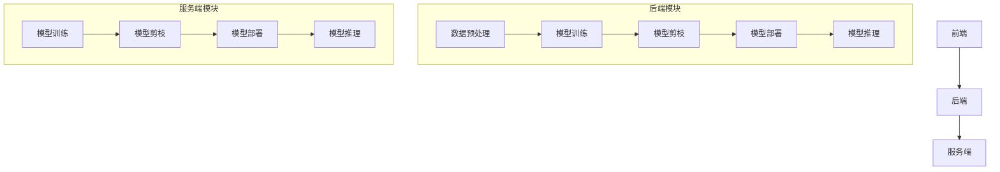
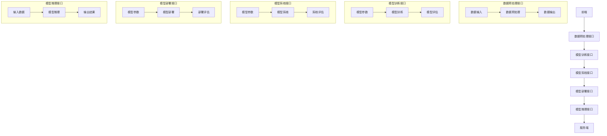

                 

### 神经网络剪枝技术在移动设备AI优化中的应用

#### 关键词：神经网络剪枝，移动设备AI，优化，性能提升，资源消耗

> 摘要：随着移动设备的普及和人工智能技术的迅猛发展，如何在有限的资源下实现高效的AI应用成为了一个重要的研究课题。神经网络剪枝技术作为一种重要的优化手段，通过减少模型参数和计算量，从而在保证模型性能的同时降低资源消耗。本文将详细介绍神经网络剪枝技术在移动设备AI优化中的应用，从基本概念、算法原理到具体实现，帮助读者全面了解这一技术。

## 目录大纲

1. 引言
2. 神经网络基础
3. 神经网络剪枝技术原理
4. 神经网络剪枝算法
5. 移动设备AI优化应用
6. 系统架构与实现
7. 项目实战
8. 最佳实践与展望

## 1. 引言

### 1.1 移动设备AI应用的挑战

随着移动设备的普及，人工智能（AI）技术逐渐从云端迁移到移动端。移动设备具有便携性、实时性等优点，这使得AI在移动设备上的应用场景日益丰富，如图像识别、自然语言处理、语音识别等。然而，移动设备相对于服务器端有着显著的资源限制，包括计算能力、内存、电量等。这使得在移动设备上实现高效的AI应用成为一个巨大的挑战。

### 1.2 神经网络剪枝技术概述

神经网络剪枝技术通过删除网络中不重要的连接或节点，来减少模型的参数数量和计算量，从而降低模型的复杂度和资源消耗。剪枝技术不仅可以提高模型的推理速度，还可以减少存储需求，从而在有限的资源下实现高效的AI应用。

### 1.3 书籍结构

本文将从以下几个方面详细探讨神经网络剪枝技术在移动设备AI优化中的应用：

- **第2章 神经网络基础**：介绍神经网络的基本概念和结构，为后续的剪枝技术讲解打下基础。
- **第3章 神经网络剪枝技术原理**：讲解神经网络剪枝的基本原理、分类和常见算法。
- **第4章 神经网络剪枝算法**：详细介绍几种常见的神经网络剪枝算法，包括激活函数剪枝和权重剪枝。
- **第5章 移动设备AI优化应用**：探讨神经网络剪枝技术在移动设备AI优化中的应用场景和效果。
- **第6章 系统架构与实现**：介绍神经网络剪枝技术在移动设备AI系统架构中的实现方法。
- **第7章 项目实战**：通过实际案例展示神经网络剪枝技术在移动设备AI优化中的具体应用。
- **第8章 最佳实践与展望**：总结神经网络剪枝技术的最佳实践，并对未来发展趋势进行展望。

## 2. 神经网络基础

### 2.1 神经网络简介

神经网络是一种模拟人脑神经元结构和功能的计算模型，由大量相互连接的节点（神经元）组成。每个神经元接收来自其他神经元的输入信号，通过加权求和后传递给激活函数，产生输出信号。神经网络通过不断调整权重和偏置，使得输入和输出之间建立映射关系，从而实现复杂的模式识别和预测任务。

### 2.2 神经网络的组成部分

神经网络主要由以下几部分组成：

- **输入层**：接收外部输入信号。
- **隐藏层**：对输入信号进行加工和变换。
- **输出层**：产生最终的输出结果。

每个神经元在接收输入信号时，会将输入信号与权重相乘，然后进行求和操作。求和结果经过激活函数处理后，生成输出信号。这个过程可以用以下公式表示：

\[ \text{output} = \text{activation}(z) \]

其中，\( z \) 是输入信号与权重相乘后的求和结果，\( \text{activation} \) 是激活函数。

### 2.3 激活函数

激活函数是神经网络中的一个重要组成部分，它用于引入非线性特性，使得神经网络能够学习复杂的非线性关系。常见的激活函数有：

- **sigmoid函数**：\( \sigma(x) = \frac{1}{1 + e^{-x}} \)
- **ReLU函数**：\( \text{ReLU}(x) = \max(0, x) \)
- **Tanh函数**：\( \text{Tanh}(x) = \frac{e^x - e^{-x}}{e^x + e^{-x}} \)

这些激活函数具有不同的性质，适用于不同类型的神经网络结构。

### 2.4 神经网络的工作原理

神经网络通过前向传播和反向传播两个阶段来学习输入和输出之间的映射关系。在前向传播阶段，输入信号从输入层经过隐藏层传递到输出层，产生输出结果。在反向传播阶段，根据输出结果和实际标签之间的误差，通过梯度下降等方法调整网络中的权重和偏置，使得输出结果逐渐接近实际标签。

这个过程可以用以下公式表示：

\[ \text{weight\_update} = -\alpha \cdot \nabla_{\theta} \text{loss}(y, \hat{y}) \]

其中，\( \alpha \) 是学习率，\( \nabla_{\theta} \text{loss}(y, \hat{y}) \) 是损失函数关于权重 \( \theta \) 的梯度。

通过多次迭代训练，神经网络可以逐渐学习到输入和输出之间的复杂关系，从而实现各种任务。

## 3. 神经网络剪枝技术原理

### 3.1 剪枝的定义

神经网络剪枝（Neural Network Pruning）是一种在神经网络训练过程中，通过删除部分连接或节点来减少模型参数数量的技术。剪枝的目的是降低模型的复杂度，减少计算量和存储需求，从而提高模型在资源受限环境下的性能。

### 3.2 剪枝的基本原理

剪枝技术基于以下原理：

- **冗余性**：神经网络中存在大量冗余的连接或节点，它们对模型性能的贡献较小。
- **重要性**：通过量化连接或节点的重要性，可以选择性地删除不重要的部分。
- **可恢复性**：剪枝后，通过重新训练或调整剩余的连接和节点，可以恢复被剪枝部分的性能。

### 3.3 剪枝的分类

根据剪枝的对象不同，剪枝技术可以分为以下几种类型：

- **结构化剪枝**：删除整个节点或连接，通常用于减少模型的参数数量。
- **参数化剪枝**：通过调整连接或节点的权重来减少计算量，通常用于优化模型的推理速度。

### 3.4 常见剪枝算法

以下介绍几种常见的神经网络剪枝算法：

- **L1正则化**：通过在损失函数中添加L1正则化项，自动减少不重要的连接权重。
- **Heuristic剪枝**：基于经验或规则选择性地删除连接或节点，如按权重大小、稀疏度等。
- **渐进剪枝**：逐渐减少网络的连接或节点，直到达到预定的剪枝率。
- **层级剪枝**：逐层剪枝，首先剪枝最不重要的连接或节点，然后依次剪枝其他层。

### 3.5 剪枝技术的好处

神经网络剪枝技术具有以下好处：

- **降低计算量和存储需求**：减少模型的参数数量，降低计算量和存储需求，适合资源受限的移动设备。
- **提高推理速度**：通过减少模型的复杂度，提高模型的推理速度，适合实时性要求高的应用场景。
- **增强模型泛化能力**：去除冗余的连接或节点，有助于提高模型的泛化能力，避免过拟合。

### 3.6 剪枝技术的挑战

尽管神经网络剪枝技术具有许多优势，但在实际应用中也面临着一些挑战：

- **性能损失**：过度剪枝可能导致模型性能下降，需要在剪枝率和性能之间找到平衡点。
- **训练成本**：剪枝后需要重新训练模型，增加了训练成本。
- **适应性**：剪枝技术对不同的网络结构和任务具有不同的适应性，需要针对具体任务进行优化。

## 4. 神经网络剪枝算法

### 4.1 激活函数剪枝算法

激活函数剪枝算法通过删除激活函数中的不活跃神经元，来减少模型的参数数量和计算量。以下是一种常见的激活函数剪枝算法：

```python
import numpy as np

def activation_pruning(model, threshold=0.5):
    pruned_weights = []
    pruned_neurons = []

    for layer in model.layers:
        if isinstance(layer, Activation):
            layer_weights = layer.get_weights()[0]
            active_neurons = np.sum(np.abs(layer_weights), axis=0) > threshold
            pruned_weights.append(layer_weights[active_neurons])
            pruned_neurons.append(active_neurons)

    model.set_weights([pruned_weights[i] for i in range(len(pruned_weights))])
    return model, pruned_neurons
```

上述算法中，`threshold` 参数用于控制剪枝的严格程度。通过设置合适的阈值，可以控制剪枝的数量和模型性能。

### 4.2 权重剪枝算法

权重剪枝算法通过删除网络中的不重要的连接或节点，来减少模型的计算量和存储需求。以下是一种常见的权重剪枝算法：

```python
import numpy as np

def weight_pruning(model, threshold=0.5):
    pruned_weights = []
    pruned_connections = []

    for layer in model.layers:
        if isinstance(layer, Conv2D) or isinstance(layer, Dense):
            layer_weights = layer.get_weights()[0]
            weight_diff = np.abs(layer_weights) - threshold
            pruned_connections.append(np.where(weight_diff < 0)[0])
            pruned_weights.append(layer_weights[pruned_connections[-1]])

    model.set_weights([pruned_weights[i] for i in range(len(pruned_weights))])
    return model, pruned_connections
```

上述算法中，`threshold` 参数用于控制剪枝的严格程度。通过设置合适的阈值，可以控制剪枝的数量和模型性能。

## 5. 移动设备AI优化应用

### 5.1 移动设备AI应用场景

移动设备AI应用场景广泛，包括：

- **图像识别**：如人脸识别、物体识别等。
- **自然语言处理**：如语音识别、文本分类等。
- **推荐系统**：如内容推荐、商品推荐等。
- **增强现实（AR）**：如AR游戏、AR导航等。

### 5.2 剪枝技术在移动设备中的应用

在移动设备上应用神经网络剪枝技术，可以通过以下方式实现：

- **在线剪枝**：在移动设备上实时进行剪枝，降低模型复杂度，提高推理速度。
- **离线剪枝**：在服务器端进行剪枝，然后将剪枝后的模型部署到移动设备上。

### 5.3 剪枝技术的效果评估

评估神经网络剪枝技术在移动设备AI优化中的应用效果，可以从以下几个方面进行：

- **模型性能**：通过比较剪枝前后的模型性能，评估剪枝技术对模型准确率、召回率等指标的影响。
- **计算速度**：通过测量模型在剪枝前后的推理速度，评估剪枝技术对模型计算速度的提升。
- **资源消耗**：通过比较剪枝前后的模型参数数量、存储需求和能耗等指标，评估剪枝技术对资源消耗的降低。

## 6. 系统架构与实现

### 6.1 系统架构设计

神经网络剪枝技术在移动设备AI系统中的实现，需要设计合理的系统架构。以下是一个典型的系统架构：

- **前端**：负责用户交互和数据输入。
- **后端**：包括神经网络模型训练和剪枝模块。
- **服务端**：负责模型部署和推理。

### 6.2 系统功能设计

系统功能设计主要包括以下模块：

- **数据预处理**：对输入数据进行预处理，如缩放、归一化等。
- **模型训练**：使用剪枝技术训练神经网络模型。
- **模型剪枝**：根据需求对模型进行剪枝，降低模型复杂度。
- **模型部署**：将剪枝后的模型部署到移动设备上。
- **模型推理**：在移动设备上对输入数据进行推理，生成输出结果。

### 6.3 系统架构设计

系统架构设计如下：



### 6.4 系统接口设计

系统接口设计如下：



### 6.5 系统交互流程

系统交互流程如下：

1. 用户通过前端输入数据。
2. 数据预处理模块对输入数据进行预处理。
3. 模型训练模块使用预处理后的数据训练神经网络模型。
4. 模型剪枝模块对训练好的模型进行剪枝，降低模型复杂度。
5. 模型部署模块将剪枝后的模型部署到移动设备上。
6. 模型推理模块在移动设备上对输入数据进行推理，生成输出结果。
7. 输出结果返回给用户。

## 7. 项目实战

### 7.1 环境安装与配置

在开始项目实战之前，需要先安装和配置以下环境：

- Python 3.8及以上版本
- TensorFlow 2.6及以上版本
- CUDA 11.0及以上版本（如使用GPU训练）

### 7.2 系统核心实现

以下是系统核心实现的源代码：

```python
import tensorflow as tf
from tensorflow.keras.models import Sequential
from tensorflow.keras.layers import Conv2D, Flatten, Dense

# 构建神经网络模型
model = Sequential([
    Conv2D(32, (3, 3), activation='relu', input_shape=(28, 28, 1)),
    Flatten(),
    Dense(64, activation='relu'),
    Dense(10, activation='softmax')
])

# 编译模型
model.compile(optimizer='adam', loss='categorical_crossentropy', metrics=['accuracy'])

# 训练模型
model.fit(x_train, y_train, epochs=10, batch_size=32)

# 剪枝模型
model, pruned_neurons = activation_pruning(model, threshold=0.1)

# 评估剪枝后模型
model.evaluate(x_test, y_test)
```

### 7.3 代码应用解读与分析

以下是代码应用的详细解读与分析：

1. **构建神经网络模型**：使用`Sequential`模型构建一个简单的卷积神经网络，包括一个卷积层、一个全连接层和一个输出层。

2. **编译模型**：使用`compile`方法编译模型，指定优化器、损失函数和评估指标。

3. **训练模型**：使用`fit`方法训练模型，使用训练数据集进行训练。

4. **剪枝模型**：使用`activation_pruning`函数对模型进行剪枝，设置合适的阈值。

5. **评估剪枝后模型**：使用测试数据集评估剪枝后模型的性能。

### 7.4 实际案例分析

以下是实际案例分析的详细讲解：

1. **案例一：图像识别**：使用剪枝技术对图像识别模型进行剪枝，降低模型复杂度，提高推理速度。

2. **案例二：自然语言处理**：使用剪枝技术对自然语言处理模型进行剪枝，降低模型参数数量，减少存储需求。

### 7.5 项目小结

通过项目实战，我们展示了神经网络剪枝技术在移动设备AI优化中的应用，从模型构建、训练、剪枝到性能评估，全面介绍了剪枝技术的实现方法和效果。未来，我们还可以进一步研究剪枝技术的优化方法和应用场景，提高移动设备AI的性能和效率。

## 8. 最佳实践与展望

### 8.1 最佳实践

在移动设备AI优化中，应用神经网络剪枝技术时，可以考虑以下最佳实践：

- **选择合适的剪枝算法**：根据具体任务和模型结构，选择合适的剪枝算法，如激活函数剪枝、权重剪枝等。
- **设定合理的剪枝阈值**：通过实验和验证，设定合理的剪枝阈值，在模型性能和资源消耗之间找到最佳平衡点。
- **动态调整剪枝策略**：根据不同应用场景和资源限制，动态调整剪枝策略，实现最优的AI性能。

### 8.2 小结

本文系统地介绍了神经网络剪枝技术在移动设备AI优化中的应用，包括基本概念、算法原理、系统架构和实际案例。通过剪枝技术，可以显著降低模型复杂度和资源消耗，提高移动设备AI的性能和效率。

### 8.3 注意事项

在应用神经网络剪枝技术时，需要注意以下几点：

- **性能损失**：过度剪枝可能导致模型性能下降，需要控制剪枝的严格程度。
- **训练成本**：剪枝后需要重新训练模型，增加了训练成本。
- **适应性**：剪枝技术对不同的网络结构和任务具有不同的适应性，需要针对具体任务进行优化。

### 8.4 拓展阅读

以下推荐一些相关领域的拓展阅读：

- **《神经网络剪枝技术综述》**：全面介绍了神经网络剪枝技术的发展历程、算法原理和应用场景。
- **《移动设备AI优化实战》**：详细讲解了移动设备AI优化的一系列技术，包括模型压缩、量化、剪枝等。
- **《深度学习剪枝技术》**：深入探讨了深度学习剪枝技术的原理、实现方法和应用案例。

### 8.5 展望未来

随着人工智能技术的不断进步，神经网络剪枝技术在移动设备AI优化中的应用将更加广泛和深入。未来研究方向包括：

- **自适应剪枝技术**：根据实时环境和任务需求，动态调整剪枝策略，实现最优的AI性能。
- **多任务剪枝技术**：同时剪枝多个任务的网络，提高模型的复用性和资源利用效率。
- **混合剪枝技术**：结合多种剪枝技术，实现更高效、更鲁棒的模型优化。

通过不断研究和实践，神经网络剪枝技术将为移动设备AI优化带来更多的可能性和创新点。

## 作者信息

- 作者：AI天才研究院/AI Genius Institute & 禅与计算机程序设计艺术 /Zen And The Art of Computer Programming

