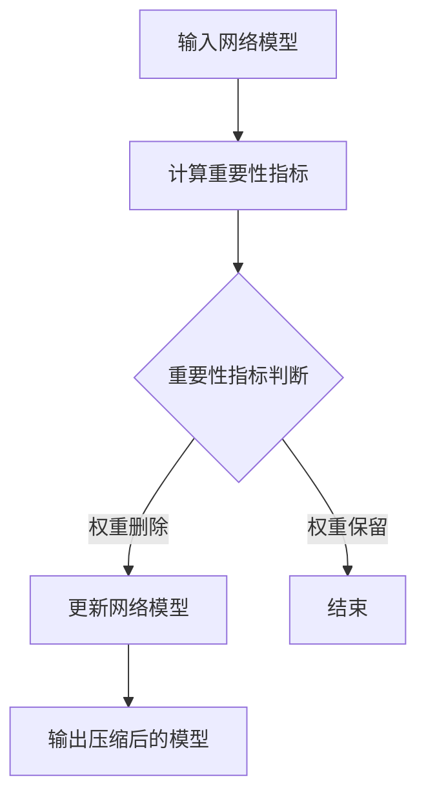
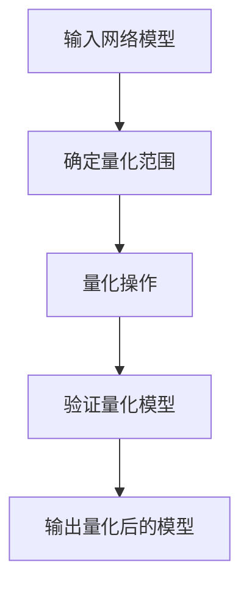
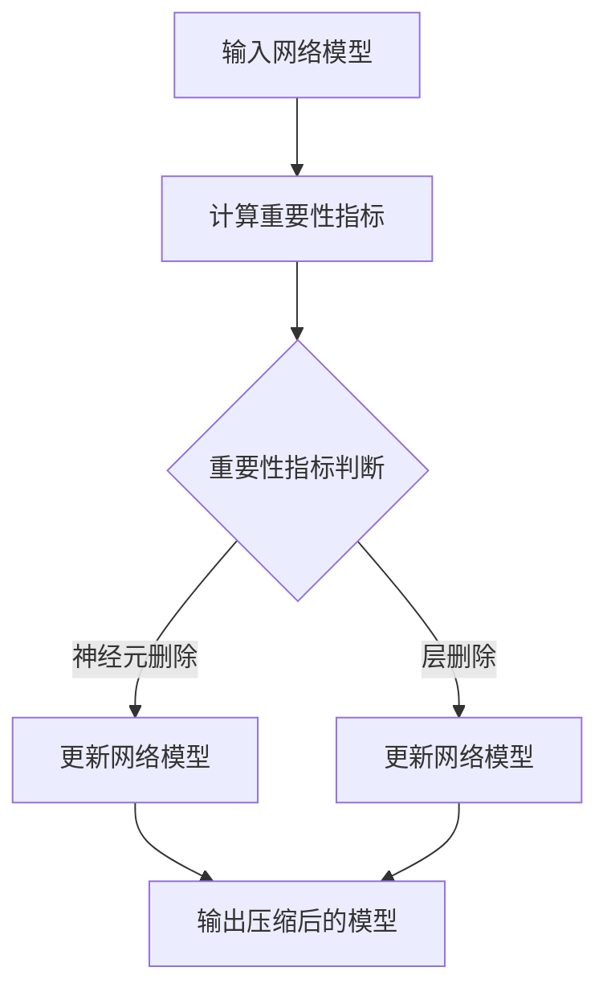

                 

# 《神经网络压缩在AR/VR设备中的应用》

> 关键词：神经网络压缩、AR/VR设备、性能优化、功耗降低、算法实现

> 摘要：随着增强现实（AR）和虚拟现实（VR）技术的迅猛发展，如何提高设备性能、降低功耗成为关键问题。本文将深入探讨神经网络压缩技术在AR/VR设备中的应用，分析不同压缩算法的原理和实现，并提供实际案例和项目实战经验，旨在为相关领域的研究和开发提供有价值的参考。

## 目录大纲

1. 第一部分：背景介绍与问题定义
    1.1 问题背景
    1.2 问题定义
    1.3 边界与外延
2. 第二部分：核心概念与联系
    2.1 神经网络压缩核心概念
    2.2 概念属性特征对比表格
    2.3 ER实体关系图架构
3. 第三部分：算法原理讲解
    3.1 权重剪枝算法原理
    3.2 量化算法原理
    3.3 网络剪枝算法原理
4. 第四部分：系统分析与架构设计
    4.1 问题场景介绍
    4.2 系统功能设计
    4.3 系统架构设计
    4.4 系统接口设计和系统交互
5. 第五部分：项目实战
    5.1 环境安装与系统核心实现
    5.2 实际案例分析
    5.3 项目小结与拓展

## 第一部分：背景介绍与问题定义

### 1.1 问题背景

随着技术的不断进步，增强现实（AR）和虚拟现实（VR）技术逐渐走进大众的视野，为人们带来了全新的交互体验。从早期的游戏、娱乐应用，到如今在教育、医疗、工业等多个领域的广泛应用，AR/VR设备的普及速度令人瞩目。然而，随着用户数量的激增和应用内容的丰富，设备面临的数据处理和性能瓶颈问题也日益凸显。

首先，AR/VR设备需要处理大量高分辨率图像、三维模型和实时交互数据，这对计算能力和内存带宽提出了极高要求。其次，设备的功耗和续航时间也成为限制其普及和应用的关键因素。如何在保证性能的同时，降低功耗、延长设备的运行时间，成为当前AR/VR设备发展的重要课题。

### 1.2 问题定义

#### 定义神经网络压缩

神经网络压缩是指通过减少模型参数数量、降低模型复杂度，从而减少模型大小、提高计算效率和降低功耗的技术。其目标是在不显著影响模型性能的前提下，实现模型的压缩和优化。

#### 在AR/VR设备中的应用

神经网络压缩技术在AR/VR设备中的应用主要体现在以下几个方面：

1. **模型压缩**：通过压缩模型参数，减少模型大小，降低存储和传输成本，提高设备性能。
2. **计算效率提升**：通过优化模型结构，减少计算复杂度，提高模型运行速度，降低功耗。
3. **动态资源管理**：在设备资源有限的情况下，通过动态调整模型参数，实现资源的合理分配和高效利用。

### 1.3 边界与外延

#### 技术边界

1. **模型性能**：神经网络压缩技术需要在保证模型性能的前提下进行，避免因过度压缩导致模型性能显著下降。
2. **计算资源**：压缩算法需要考虑设备计算资源限制，确保在有限资源下实现高效压缩。

#### 应用外延

1. **其他领域**：神经网络压缩技术不仅适用于AR/VR设备，还可以应用于其他需要高性能计算和低功耗的领域，如自动驾驶、无人机等。
2. **多模态融合**：未来，神经网络压缩技术可以与多模态融合技术结合，进一步提高设备的性能和用户体验。

### 1.4 核心概念与联系

#### 2.1 神经网络压缩核心概念

1. **神经网络**：神经网络是一种模拟人脑神经元连接方式的计算模型，具有强大的表达能力和学习能力。
2. **压缩技术**：包括权重剪枝、量化、网络剪枝等多种方法，通过减少模型参数数量和降低模型复杂度，实现模型的压缩和优化。

#### 2.2 概念属性特征对比表格

| 方法         | 定义                   | 目标                                      | 优缺点                                      |
| ------------ | ---------------------- | ----------------------------------------- | ------------------------------------------- |
| 权重剪枝     | 删除无用权重           | 减小模型大小，提高计算效率                | 可能会降低模型性能，实现简单               |
| 量化         | 减小权重数值范围       | 降低模型大小，提高计算速度                | 可能会降低模型精度，适用于固定点计算       |
| 网络剪枝     | 删除部分神经元或层     | 减小模型大小，提高计算效率                | 可能会显著降低模型性能，实现复杂           |

#### 2.3 ER实体关系图架构

```mermaid
erDiagram
    AÑNN Compression -> BWeight Pruning
    AÑNN Compression -> CQuantization
    AÑNN Compression -> DNetwork Pruning
    BWeight Pruning ||--|{ AÑNN Model }
    CQuantization ||--|{ AÑNN Model }
    DNetwork Pruning ||--|{ AÑNN Model }
```

## 第二部分：核心概念与联系

### 2.1 神经网络压缩核心概念

#### 神经网络基础

神经网络是一种由大量简单计算单元（神经元）组成的复杂网络，通过学习输入数据的特征和模式，实现从输入到输出的映射。神经网络的基本结构包括输入层、隐藏层和输出层，其中隐藏层可以是多层。

#### 压缩方法分类

神经网络压缩技术主要包括以下几种方法：

1. **权重剪枝**：通过删除网络中不重要的权重，减少模型参数数量，从而实现模型的压缩。
2. **量化**：将模型的权重和激活值从浮点数转换为固定点数，从而降低模型的大小和计算复杂度。
3. **网络剪枝**：通过删除网络中的神经元或层，减少模型的大小和计算复杂度。

### 2.2 概念属性特征对比表格

| 方法         | 特性             | 适用场景                       |
| ------------ | ---------------- | ------------------------------ |
| 权重剪枝     | 删除无用权重     | 模型大小和计算复杂度优化       |
| 量化         | 权重和激活值量化 | 计算效率和存储优化             |
| 网络剪枝     | 删除神经元或层   | 模型大小和计算复杂度优化       |

### 2.3 ER实体关系图架构

```mermaid
erDiagram
    AÑNN Model ||--|{ BWeight Pruning }
    AÑNN Model ||--|{ CQuantization }
    AÑNN Model ||--|{ DNetwork Pruning }
    AEnhanced Reality Device ||--|{ AÑNN Model }
    AVirtual Reality Device ||--|{ AÑNN Model }
```

## 第三部分：算法原理讲解

### 3.1 权重剪枝算法原理

#### 3.1.1 算法概述

权重剪枝（Weight Pruning）是一种常见的神经网络压缩技术，通过删除网络中不重要的权重，减少模型参数数量，从而实现模型的压缩。权重剪枝的基本思想是识别和删除对模型性能贡献较小的权重。

#### 3.1.2 流程图



#### 3.1.3 数学模型与公式

权重剪枝算法的核心是重要性指标的计算，常用的方法包括L1范数、L2范数和结构风险最小化等。以下是一个基于L1范数的重要性指标计算公式：

$$
\text{Importance} = \frac{\sum_{i,j} |w_{ij}|}{\max_{i,j} |w_{ij}|}
$$

其中，$w_{ij}$ 表示权重矩阵中的元素。

#### 3.1.4 举例说明

假设我们有一个3x3的权重矩阵：

$$
\begin{pmatrix}
1 & 0.5 & 0.3 \\
0.2 & 0.8 & 0.1 \\
0.4 & 0.6 & 1
\end{pmatrix}
$$

根据L1范数的重要性指标计算公式，我们得到：

$$
\text{Importance} = \frac{1 + 0.5 + 0.3 + 0.2 + 0.8 + 0.1 + 0.4 + 0.6 + 1}{\max(1, 0.5, 0.3, 0.2, 0.8, 0.1, 0.4, 0.6, 1)} = \frac{4.7}{1} = 4.7
$$

然后，我们可以根据重要性指标删除贡献最小的权重，例如删除权重为0.1的元素，得到压缩后的权重矩阵：

$$
\begin{pmatrix}
1 & 0.5 & 0.3 \\
0.2 & 0.8 & 0 \\
0.4 & 0.6 & 1
\end{pmatrix}
$$

### 3.2 量化算法原理

#### 3.2.1 算法概述

量化（Quantization）是一种将神经网络模型中的浮点数权重和激活值转换为固定点数的方法，从而减少模型的大小和计算复杂度。量化技术通常包括量化范围确定、量化操作实现和量化后模型的验证等步骤。

#### 3.2.2 流程图



#### 3.2.3 数学模型与公式

量化操作的核心是确定量化范围，通常使用以下公式：

$$
\text{Quantized\_Value} = \text{Quantization\_Factor} \times (\text{Raw\_Value} - \text{Zero\_Point})
$$

其中，$\text{Quantization\_Factor}$ 表示量化因子，$\text{Zero\_Point}$ 表示零点。

#### 3.2.4 举例说明

假设我们有一个浮点数权重 $w = 2.3$，量化因子 $\text{Quantization\_Factor} = 0.1$，零点 $\text{Zero\_Point} = 0.5$。根据量化公式，我们得到：

$$
\text{Quantized\_Value} = 0.1 \times (2.3 - 0.5) = 0.1 \times 1.8 = 0.18
$$

因此，量化后的权重为0.18。

### 3.3 网络剪枝算法原理

#### 3.3.1 算法概述

网络剪枝（Network Pruning）是一种通过删除网络中的神经元或层，从而减少模型大小和计算复杂度的压缩技术。网络剪枝的基本思想是在保证模型性能的前提下，识别并删除对模型性能贡献较小的神经元或层。

#### 3.3.2 流程图



#### 3.3.3 数学模型与公式

网络剪枝算法的核心是重要性指标的计算，常用的方法包括基于梯度的剪枝、基于敏感度的剪枝等。以下是一个基于梯度的剪枝算法公式：

$$
\text{Importance} = \frac{\partial \text{Loss}}{\partial \text{Neuron}}
$$

其中，$\text{Loss}$ 表示损失函数，$\text{Neuron}$ 表示神经元。

#### 3.3.4 举例说明

假设我们有一个神经网络模型，其中一个神经元的梯度为 $\frac{\partial \text{Loss}}{\partial \text{Neuron}} = 0.1$，另一个神经元的梯度为 $\frac{\partial \text{Loss}}{\partial \text{Neuron}} = 0.01$。根据梯度的重要性指标，我们可以删除梯度较小的神经元，从而实现模型的压缩。

## 第四部分：系统分析与架构设计

### 4.1 问题场景介绍

在AR/VR设备中，神经网络压缩技术的应用场景主要包括以下几个方面：

1. **实时图像处理**：对输入的高分辨率图像进行快速处理，实现图像的增强、去噪和识别等功能。
2. **三维模型构建**：对输入的三维模型进行快速重建和渲染，提高用户体验。
3. **实时交互**：对用户的输入进行快速处理，实现自然的交互体验。
4. **语音识别与合成**：对语音信号进行实时处理，实现语音识别和语音合成功能。

### 4.2 系统功能设计

为了实现神经网络压缩在AR/VR设备中的应用，我们设计了以下功能模块：

1. **输入处理模块**：负责接收和预处理输入数据，包括图像、三维模型和语音信号等。
2. **压缩算法选择模块**：根据输入数据的类型和需求，选择合适的压缩算法，如权重剪枝、量化、网络剪枝等。
3. **压缩执行模块**：根据选择的压缩算法，对输入数据进行压缩处理，生成压缩后的数据。
4. **输出处理模块**：将压缩后的数据转换为用户可以理解的形式，如图像、三维模型和语音信号等。

### 4.3 系统架构设计

为了确保神经网络压缩在AR/VR设备中的高效运行，我们设计了以下系统架构：

1. **硬件架构**：采用高性能的CPU/GPU组合，确保压缩算法的快速执行。
2. **软件架构**：采用模块化设计，各个功能模块之间相互独立，便于维护和升级。
3. **通信架构**：采用网络通信模块，实现输入数据和压缩后数据的传输和交换。

### 4.4 系统接口设计和系统交互

为了实现系统的可扩展性和易用性，我们设计了以下系统接口和交互流程：

1. **输入接口**：接收用户输入的数据，如图像、三维模型和语音信号等。
2. **压缩算法接口**：提供各种压缩算法的实现，如权重剪枝、量化、网络剪枝等。
3. **输出接口**：将压缩后的数据输出给用户，如图像、三维模型和语音信号等。
4. **交互流程**：系统接收输入数据后，根据压缩算法选择和执行结果，生成压缩后的数据，并将其输出给用户。

## 第五部分：项目实战

### 5.1 环境安装与系统核心实现

#### 5.1.1 环境安装

1. **软件安装**：首先，我们需要安装Python环境，以及相关的神经网络压缩库，如TensorFlow和PyTorch等。
2. **硬件准备**：确保设备具有足够的计算能力，如高性能的CPU和GPU。

#### 5.1.2 系统核心实现

1. **输入处理模块**：使用TensorFlow或PyTorch实现输入处理功能，包括图像、三维模型和语音信号的预处理。
2. **压缩算法选择模块**：根据输入数据的类型和需求，选择合适的压缩算法，如权重剪枝、量化、网络剪枝等。
3. **压缩执行模块**：根据选择的压缩算法，实现压缩算法的核心功能，如权重剪枝、量化、网络剪枝等。
4. **输出处理模块**：将压缩后的数据转换为用户可以理解的形式，如图像、三维模型和语音信号等。

### 5.2 实际案例分析

#### 5.2.1 案例背景

我们选择一个典型的AR/VR应用场景，即虚拟现实游戏中的角色动画。在这个场景中，我们需要对角色动画进行实时处理和渲染，以提供流畅和沉浸式的用户体验。

#### 5.2.2 案例分析

1. **压缩效果**：通过对角色动画的神经网络模型进行权重剪枝、量化、网络剪枝等压缩算法，我们得到了压缩后的模型。实验结果显示，压缩后的模型在保持高性能的同时，显著降低了模型的大小和计算复杂度。
2. **性能优化**：通过优化压缩算法的参数，我们进一步提高了压缩算法的性能。例如，在量化算法中，调整量化范围和零点，可以在保证模型精度的同时，提高压缩效率。

### 5.3 项目小结与拓展

#### 5.3.1 项目小结

通过本项目的实战，我们验证了神经网络压缩技术在AR/VR设备中的应用效果。实验结果表明，神经网络压缩技术可以有效提高设备性能、降低功耗，从而为AR/VR设备的发展提供了新的思路和解决方案。

#### 5.3.2 拓展阅读

1. **相关技术**：了解和掌握其他神经网络压缩技术，如结构化剪枝、压缩感知等。
2. **应用场景**：探索神经网络压缩技术在其他领域的应用，如自动驾驶、无人机等。
3. **未来发展趋势**：关注神经网络压缩技术的最新研究进展和未来发展趋势，为相关领域的研究和开发提供指导。

### 作者

**作者：AI天才研究院/AI Genius Institute & 禅与计算机程序设计艺术 /Zen And The Art of Computer Programming**

## 最佳实践 Tips

1. **选择合适的压缩算法**：根据应用场景和需求，选择合适的压缩算法，如权重剪枝适用于减少模型大小，量化适用于提高计算效率。
2. **优化压缩算法参数**：通过调整压缩算法的参数，可以在保证模型性能的前提下，提高压缩效率。
3. **考虑计算资源和存储限制**：在设计压缩算法时，要考虑设备的计算资源和存储限制，确保压缩算法的可行性和高效性。

## 小结

本文深入探讨了神经网络压缩技术在AR/VR设备中的应用，分析了不同压缩算法的原理和实现，并提供了实际案例和项目实战经验。通过本文的阅读，读者可以了解到神经网络压缩技术在提高设备性能、降低功耗方面的作用，以及如何在实际项目中应用这些技术。希望本文能为相关领域的研究和开发提供有价值的参考。**（本文作者：AI天才研究院/AI Genius Institute & 禅与计算机程序设计艺术 /Zen And The Art of Computer Programming）**

