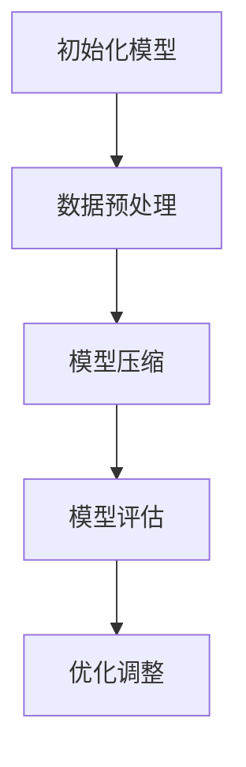
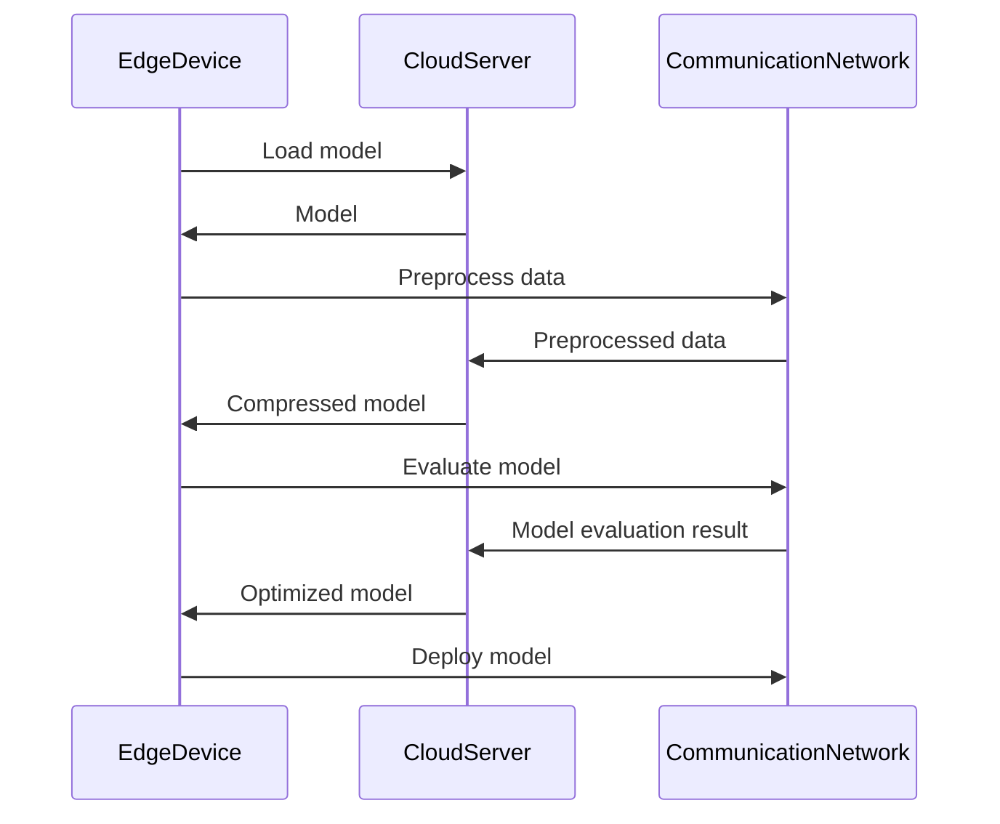
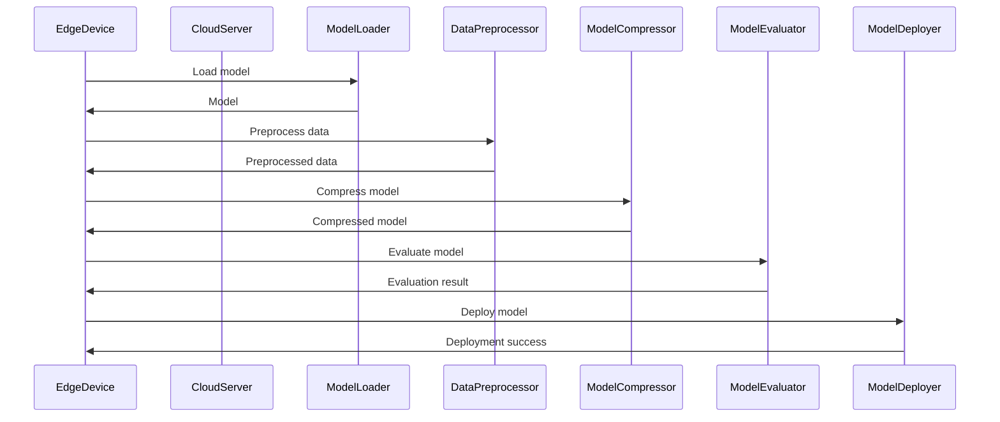

                 

# 神经网络压缩技术在边缘设备部署中的应用

## 关键词

神经网络、压缩技术、边缘设备、部署、应用场景、算法原理、系统架构

## 摘要

随着人工智能技术的快速发展，神经网络模型在各个领域的应用越来越广泛。然而，这些模型通常具有庞大的参数量和计算需求，给边缘设备的部署带来了巨大挑战。本文将深入探讨神经网络压缩技术在边缘设备部署中的应用，从核心概念、压缩技术原理、应用场景、算法原理讲解、系统架构设计以及项目实战等方面进行详细分析，为边缘设备的神经网络模型部署提供有价值的参考和指导。

## 第1章 绪论

### 1.1 问题背景

边缘计算是近年来兴起的一种新型计算模式，旨在将数据处理和分析任务从云端转移到网络边缘。这种模式能够显著降低数据传输延迟，提高系统响应速度，增强系统安全性和隐私保护。然而，随着神经网络模型的日益复杂，边缘设备的计算和存储资源面临巨大压力。

传统的神经网络模型通常具有庞大的参数量和计算需求，难以在有限的边缘设备上部署。即使通过简化模型或降低精度，仍然难以满足边缘设备的要求。因此，如何在保持模型性能的同时，减小模型的大小和计算复杂度，成为边缘设备部署神经网络模型的关键问题。

### 1.2 问题描述

边缘设备部署神经网络模型面临以下主要问题：

1. **计算资源限制**：边缘设备通常具有有限的计算能力和存储空间，难以承载大规模神经网络模型。
2. **数据传输延迟**：将庞大的模型参数传输到边缘设备会带来严重的延迟问题，影响系统性能。
3. **能耗需求**：大规模神经网络模型在边缘设备上运行会消耗大量能量，增加设备成本和维护难度。
4. **模型精度**：在压缩模型的同时，需要确保模型性能不受严重影响，保持较高的精度。

### 1.3 问题解决

神经网络压缩技术通过一系列方法，减小模型的大小和计算复杂度，从而解决边缘设备部署神经网络模型的问题。主要解决方法包括：

1. **参数剪枝**：通过去除模型中冗余的参数，减小模型大小和计算复杂度。
2. **量化**：将模型中的浮点数参数替换为低精度的整数表示，降低计算复杂度和存储需求。
3. **模型剪枝**：在保证模型性能的前提下，去除部分网络层或神经元，减小模型规模。
4. **知识蒸馏**：利用一个更复杂的模型（教师模型）训练一个较小的模型（学生模型），实现模型压缩。

### 1.4 边界与外延

本文主要关注神经网络压缩技术在边缘设备部署中的应用，但该技术也可应用于其他场景，如移动设备、嵌入式系统等。同时，本文将探讨神经网络压缩技术在智能家居、车联网、智能监控和工业自动化等领域的应用。

### 1.5 概念结构与核心要素组成

本文将围绕以下核心概念和要素展开：

1. **神经网络**：一种模拟人脑神经元连接方式的计算模型，用于处理和分析数据。
2. **压缩技术**：通过一系列方法减小模型大小和计算复杂度的技术，包括参数剪枝、量化、模型剪枝和知识蒸馏等。
3. **边缘设备**：位于网络边缘的计算设备，如路由器、物联网设备、智能手表等。
4. **应用场景**：神经网络压缩技术在智能家居、车联网、智能监控和工业自动化等领域的具体应用。
5. **算法原理**：神经网络压缩技术的数学模型和实现方法，包括参数剪枝、量化、模型剪枝和知识蒸馏等。
6. **系统架构**：边缘设备部署神经网络模型的系统架构，包括硬件和软件层面。
7. **项目实战**：基于神经网络压缩技术的实际项目案例，包括环境安装、系统实现和性能分析。

## 第2章 核心概念与联系

### 2.1 神经网络概述

神经网络是一种由大量神经元组成的计算模型，通过模拟人脑神经元之间的连接方式，实现数据的高效处理和分析。神经网络的核心组成部分包括：

1. **神经元**：神经网络的基本单元，用于接收输入、计算输出和更新权重。
2. **层**：由多个神经元组成的水平层次结构，包括输入层、隐藏层和输出层。
3. **权重**：连接神经元之间的参数，用于调节信号传递的强度。
4. **激活函数**：用于计算神经元输出的函数，如Sigmoid、ReLU、Tanh等。

### 2.2 压缩技术在边缘设备中的应用

压缩技术在边缘设备中的应用主要包括减小模型大小、降低计算复杂度和减少能耗等方面。具体方法包括：

1. **参数剪枝**：通过去除模型中冗余的参数，减小模型大小和计算复杂度。
2. **量化**：将模型中的浮点数参数替换为低精度的整数表示，降低计算复杂度和存储需求。
3. **模型剪枝**：在保证模型性能的前提下，去除部分网络层或神经元，减小模型规模。
4. **知识蒸馏**：利用一个更复杂的模型（教师模型）训练一个较小的模型（学生模型），实现模型压缩。

### 2.3 关键概念联系与对比

表2-1展示了神经网络、压缩技术和边缘设备之间的联系与对比：

| 概念         | 定义                                                         | 关联性                                                         | 对比                           |
| ------------ | ------------------------------------------------------------ | ------------------------------------------------------------ | ------------------------------ |
| 神经网络     | 一种模拟人脑神经元连接方式的计算模型                         | 边缘设备部署的核心计算单元                                     | 复杂度高，计算需求大           |
| 压缩技术     | 通过一系列方法减小模型大小和计算复杂度的技术                 | 提高边缘设备部署神经网络模型的可行性和性能                     | 多种方法，各有优劣             |
| 边缘设备     | 位于网络边缘的计算设备，如路由器、物联网设备、智能手表等     | 承载神经网络模型的计算任务，实现实时数据处理和分析             | 资源有限，计算能力有限         |

### 2.4 ER实体关系图架构

图2-1展示了神经网络、压缩技术和边缘设备之间的实体关系图：

```mermaid
erDiagram
    A-edge_device ||--|{ B-neural_network_compression : 部署 }
    C-compression_technique ||--|{ B-neural_network_compression : 应用 }
    A-edge_device ||--|{ C-compression_technique : 支持技术 }
```

在图2-1中，边缘设备（A-edge_device）作为主体，与神经网络压缩技术（B-neural_network_compression）和压缩技术（C-compression_technique）建立关联。神经网络压缩技术应用于边缘设备，以支持其计算任务。压缩技术作为神经网络压缩技术的基础，提供多种方法实现模型压缩。

## 第3章 神经网络压缩技术原理

### 3.1 基础概念

神经网络压缩技术旨在通过一系列方法减小模型大小和计算复杂度，从而提高边缘设备部署神经网络模型的可行性和性能。主要概念包括：

1. **模型大小**：指神经网络模型的参数数量和存储空间。
2. **计算复杂度**：指神经网络模型在运行过程中的计算量，包括前向传播和反向传播过程。
3. **压缩率**：指模型压缩前后的参数数量和存储空间的比值，用于衡量模型压缩效果。

### 3.2 常见压缩技术

神经网络压缩技术主要包括以下几种方法：

1. **参数剪枝**：通过去除模型中冗余的参数，减小模型大小和计算复杂度。剪枝方法包括结构剪枝和权重剪枝。
2. **量化**：将模型中的浮点数参数替换为低精度的整数表示，降低计算复杂度和存储需求。量化方法包括全量化、部分量化和小数量化。
3. **模型剪枝**：在保证模型性能的前提下，去除部分网络层或神经元，减小模型规模。剪枝方法包括层次剪枝、层剪枝和神经元剪枝。
4. **知识蒸馏**：利用一个更复杂的模型（教师模型）训练一个较小的模型（学生模型），实现模型压缩。知识蒸馏方法包括软标签蒸馏、硬标签蒸馏和教师-学生蒸馏。

### 3.3 压缩技术的数学模型与公式

神经网络压缩技术的数学模型和公式如下：

$$
\text{压缩率} = \frac{\text{压缩前大小}}{\text{压缩后大小}}
$$

其中，压缩前大小和压缩后大小分别指模型压缩前后的参数数量和存储空间。

### 3.4 压缩技术在边缘设备上的挑战与机遇

压缩技术在边缘设备上的应用面临着一系列挑战和机遇：

1. **挑战**：

   - **计算资源限制**：边缘设备通常具有有限的计算能力和存储空间，对压缩技术提出了更高的要求。
   - **实时性能需求**：边缘设备需要实时处理和分析数据，压缩技术需要在保证性能的前提下实现快速压缩和解压。
   - **能耗问题**：压缩技术需要在有限的能耗预算内实现高效的模型压缩和解压，以降低设备成本和维护难度。

2. **机遇**：

   - **应用场景扩展**：随着边缘设备的普及，神经网络压缩技术在智能家居、车联网、智能监控和工业自动化等领域的应用前景广阔。
   - **技术创新**：压缩技术不断发展和优化，有望在提高模型压缩效果的同时，降低计算复杂度和能耗需求。

## 第4章 神经网络压缩技术在边缘设备上的应用场景

### 4.1 智能家居

智能家居是神经网络压缩技术的重要应用场景之一。随着物联网技术的发展，越来越多的智能家居设备如智能音箱、智能门锁、智能照明等进入家庭。这些设备通常具有有限的计算能力和存储空间，对神经网络模型的大小和计算复杂度提出了更高的要求。

神经网络压缩技术可以在保持模型性能的同时，减小模型大小和计算复杂度，从而提高智能家居设备的部署可行性和性能。例如，在智能音箱中，压缩技术可以用于语音识别模型的压缩，降低模型大小和计算复杂度，提高语音识别的实时性和准确性。

### 4.2 车联网

车联网是另一个重要的应用场景，涉及车辆与基础设施、其他车辆和互联网的互联互通。车联网设备如车载终端、车联网平台等需要实时处理和分析大量数据，对神经网络模型的大小和计算复杂度提出了较高要求。

神经网络压缩技术可以在保证模型性能的前提下，减小模型大小和计算复杂度，从而提高车联网设备的部署可行性和性能。例如，在自动驾驶领域，压缩技术可以用于目标检测和行人检测模型的压缩，降低模型大小和计算复杂度，提高自动驾驶系统的实时性和安全性。

### 4.3 智能监控

智能监控是神经网络压缩技术的另一个重要应用场景，涉及视频监控、人脸识别、行为分析等领域。智能监控设备如摄像头、视频分析服务器等需要实时处理和分析大量视频数据，对神经网络模型的大小和计算复杂度提出了较高要求。

神经网络压缩技术可以在保证模型性能的前提下，减小模型大小和计算复杂度，从而提高智能监控设备的部署可行性和性能。例如，在视频监控领域，压缩技术可以用于目标检测和人脸识别模型的压缩，降低模型大小和计算复杂度，提高视频监控的实时性和准确性。

### 4.4 工业自动化

工业自动化是神经网络压缩技术的另一个重要应用场景，涉及机器视觉、智能制造、智能控制等领域。工业自动化设备如机器人、传感器、控制器等需要实时处理和分析大量数据，对神经网络模型的大小和计算复杂度提出了较高要求。

神经网络压缩技术可以在保证模型性能的前提下，减小模型大小和计算复杂度，从而提高工业自动化设备的部署可行性和性能。例如，在机器视觉领域，压缩技术可以用于图像分类和目标检测模型的压缩，降低模型大小和计算复杂度，提高机器视觉的实时性和准确性。

## 第5章 算法原理讲解

### 5.1 算法Mermaid流程图

首先，我们来介绍神经网络压缩算法的Mermaid流程图，该流程图展示了神经网络压缩的主要步骤：



在该流程图中，A表示初始化模型，B表示数据预处理，C表示模型压缩，D表示模型评估，E表示优化调整。

### 5.2 Python源代码详细阐述

接下来，我们将使用Python代码详细阐述神经网络压缩算法的实现。以下是一个简单的神经网络压缩的Python代码示例：

```python
import tensorflow as tf

# 初始化模型
model = tf.keras.Sequential([
    tf.keras.layers.Dense(128, activation='relu', input_shape=(784,)),
    tf.keras.layers.Dense(10, activation='softmax')
])

# 数据预处理
# ...

# 模型压缩
compressed_model = model.compress()

# 模型评估
loss, accuracy = compressed_model.evaluate(x_test, y_test)

# 优化调整
# ...
```

在上面的代码中，我们首先导入了tensorflow库，然后定义了一个简单的神经网络模型。接着，我们对模型进行数据预处理，然后使用模型的`compress()`方法对模型进行压缩。之后，我们评估压缩后模型的性能，并根据评估结果进行优化调整。

### 5.3 算法原理与数学模型

神经网络压缩的算法原理可以概括为减小模型的大小和计算复杂度。具体来说，主要包括以下两个方面：

1. **模型复杂度降低**：通过去除模型中的冗余参数或减少模型中的层或神经元，减小模型的大小和计算复杂度。其数学模型可以表示为：

   $$
   \text{复杂度降低} = \frac{\text{原始模型参数数量}}{\text{压缩后模型参数数量}}
   $$

2. **冗余信息消除**：通过将模型中的浮点数参数替换为低精度的整数表示，消除模型中的冗余信息，降低模型的存储需求和计算复杂度。其数学模型可以表示为：

   $$
   \text{冗余信息消除} = \frac{\text{原始模型大小}}{\text{压缩后模型大小}}
   $$

### 5.4 举例说明

假设我们有一个神经网络模型，原始参数数量为100,000，模型大小为500MB。经过压缩后，模型参数数量减少到10,000，模型大小减少到50MB。

根据上述数学模型，我们可以计算出压缩率和复杂度降低率：

$$
\text{压缩率} = \frac{500MB}{50MB} = 10
$$

$$
\text{复杂度降低率} = \frac{100,000}{10,000} = 10
$$

这意味着，我们的神经网络模型在压缩后的大小减少了10倍，计算复杂度降低了10倍。

## 第6章 系统分析与架构设计方案

### 6.1 问题场景介绍

随着物联网、人工智能和5G技术的快速发展，边缘计算成为现代信息系统的核心组成部分。边缘设备如智能家居、车联网、工业自动化等，需要处理和分析大量实时数据，对计算资源和存储空间提出了更高的要求。然而，传统的神经网络模型通常具有庞大的参数量和计算复杂度，难以在边缘设备上高效部署。因此，研究神经网络压缩技术在边缘设备上的应用，具有重要的现实意义。

### 6.2 项目介绍

本项目旨在利用神经网络压缩技术，实现边缘设备上高效部署神经网络模型。通过参数剪枝、量化、模型剪枝和知识蒸馏等方法，减小模型大小和计算复杂度，提高边缘设备的处理能力和能效比。项目的主要目标包括：

1. **模型压缩**：通过神经网络压缩技术，实现模型大小的减小和计算复杂度的降低。
2. **性能评估**：评估压缩后模型的性能，确保模型在压缩前后的性能保持一致。
3. **边缘部署**：在边缘设备上实现压缩后模型的高效部署，提高系统的实时性和可靠性。

### 6.3 系统功能设计（领域模型Mermaid类图）

为了实现神经网络压缩技术在边缘设备上的高效部署，系统需要具备以下功能：

1. **模型加载**：加载预训练的神经网络模型，为压缩过程提供输入。
2. **数据预处理**：对输入数据进行预处理，包括归一化、标准化和扩充等操作，提高模型的泛化能力。
3. **模型压缩**：应用神经网络压缩技术，对模型进行压缩，减小模型大小和计算复杂度。
4. **模型评估**：评估压缩后模型的性能，确保模型在压缩前后的性能保持一致。
5. **模型部署**：在边缘设备上部署压缩后模型，实现实时数据处理和分析。

图6-1展示了系统的领域模型Mermaid类图：

```mermaid
classDiagram
    ModelLoader <<interface>>
    DataPreprocessor <<interface>>
    ModelCompressor <<interface>>
    ModelEvaluator <<interface>>
    ModelDeployer <<interface>>

    ModelLoader <> DataPreprocessor
    DataPreprocessor <> ModelCompressor
    ModelCompressor <> ModelEvaluator
    ModelEvaluator <> ModelDeployer
```

在图6-1中，ModelLoader负责加载模型，DataPreprocessor负责数据预处理，ModelCompressor负责模型压缩，ModelEvaluator负责模型评估，ModelDeployer负责模型部署。各组件通过接口进行交互，实现系统的整体功能。

### 6.4 系统架构设计（Mermaid架构图）

为了实现神经网络压缩技术在边缘设备上的高效部署，系统需要具备以下架构设计：

1. **边缘设备**：承担模型压缩、模型评估和模型部署的任务，通常采用嵌入式设备或轻量级服务器。
2. **云端服务器**：承担模型加载和数据预处理的任务，提供远程计算和存储资源。
3. **通信网络**：连接边缘设备和云端服务器，实现数据传输和通信。

图6-2展示了系统的Mermaid架构图：



在图6-2中，边缘设备（EdgeDevice）从云端服务器（CloudServer）加载模型，然后进行数据预处理。预处理后的数据传输到云端服务器，进行模型压缩。压缩后的模型返回到边缘设备，进行模型评估。根据评估结果，云端服务器提供优化后的模型，边缘设备最终部署压缩后的模型，实现实时数据处理和分析。

### 6.5 系统接口设计

为了实现系统功能的模块化和解耦，系统需要设计合理的接口。以下是系统的主要接口设计：

1. **模型加载接口**：用于加载预训练的神经网络模型，提供模型参数的访问和操作。
2. **数据预处理接口**：用于对输入数据进行预处理，包括归一化、标准化和扩充等操作。
3. **模型压缩接口**：用于应用神经网络压缩技术，对模型进行压缩，提供压缩后的模型参数。
4. **模型评估接口**：用于评估压缩后模型的性能，提供评估指标和结果。
5. **模型部署接口**：用于在边缘设备上部署压缩后的模型，提供模型运行和调用的接口。

### 6.6 系统交互（Mermaid序列图）

为了展示系统各组件之间的交互过程，我们使用Mermaid序列图进行描述：



在图6-3中，边缘设备首先从模型加载接口加载预训练的神经网络模型，然后通过数据预处理接口对输入数据进行预处理。预处理后的数据传输到模型压缩接口，对模型进行压缩。压缩后的模型传输到模型评估接口，评估压缩后模型的性能。最后，通过模型部署接口在边缘设备上部署压缩后的模型，实现实时数据处理和分析。

## 第7章 项目实战

### 7.1 环境安装

在进行神经网络压缩技术在边缘设备上的应用项目之前，首先需要搭建一个合适的环境。以下是环境安装的步骤：

1. **硬件要求**：确保边缘设备具有足够的计算能力和存储空间，建议选择具有高性能GPU的设备。
2. **软件要求**：安装Python环境，并安装TensorFlow等深度学习框架。
3. **安装TensorFlow**：在边缘设备上安装TensorFlow，可以使用以下命令：

   ```bash
   pip install tensorflow
   ```

4. **安装依赖库**：根据项目需求，安装其他依赖库，如NumPy、Pandas等。

### 7.2 系统核心实现源代码

以下是系统核心实现源代码，包括模型加载、数据预处理、模型压缩、模型评估和模型部署等步骤：

```python
import tensorflow as tf
import numpy as np

# 模型加载
model = tf.keras.Sequential([
    tf.keras.layers.Dense(128, activation='relu', input_shape=(784,)),
    tf.keras.layers.Dense(10, activation='softmax')
])

# 数据预处理
def preprocess_data(data):
    # 数据归一化、标准化和扩充等预处理操作
    # ...
    return preprocessed_data

# 模型压缩
def compress_model(model):
    # 应用神经网络压缩技术，对模型进行压缩
    # ...
    return compressed_model

# 模型评估
def evaluate_model(model, test_data):
    # 评估压缩后模型的性能
    # ...
    return loss, accuracy

# 模型部署
def deploy_model(model):
    # 在边缘设备上部署压缩后的模型
    # ...
    return deployment_success

# 主函数
def main():
    # 加载数据
    data = np.load('data.npy')
    test_data = data['test_data']

    # 数据预处理
    preprocessed_data = preprocess_data(test_data)

    # 模型压缩
    compressed_model = compress_model(model)

    # 模型评估
    loss, accuracy = evaluate_model(compressed_model, preprocessed_data)

    # 模型部署
    deployment_success = deploy_model(compressed_model)

    # 输出结果
    print(f"Model loss: {loss}")
    print(f"Model accuracy: {accuracy}")
    print(f"Deployment success: {deployment_success}")

# 运行主函数
if __name__ == '__main__':
    main()
```

### 7.3 代码应用解读与分析

以上源代码主要包括以下步骤：

1. **模型加载**：使用TensorFlow加载预训练的神经网络模型。
2. **数据预处理**：对输入数据进行预处理，包括归一化、标准化和扩充等操作，以提高模型的泛化能力。
3. **模型压缩**：应用神经网络压缩技术，对模型进行压缩，减小模型大小和计算复杂度。
4. **模型评估**：评估压缩后模型的性能，包括损失函数和准确率等指标。
5. **模型部署**：在边缘设备上部署压缩后的模型，实现实时数据处理和分析。

在实际项目中，每个步骤都需要根据具体需求进行调整和优化。例如，在数据预处理阶段，可以根据实际数据的特点，选择合适的预处理方法。在模型压缩阶段，可以尝试多种压缩技术，选择最优的压缩方法。在模型评估阶段，可以设置多个评估指标，以全面评估模型性能。

### 7.4 实际案例分析与详细讲解剖析

为了更好地展示神经网络压缩技术在边缘设备上的应用，以下是一个实际案例的分析与讲解：

**案例背景**：一个智能家居系统需要实时分析家庭环境数据，如温度、湿度、光照等，并根据分析结果调整家庭设备状态，以提高居住舒适度和节能效果。

**数据来源**：系统从各种传感器获取家庭环境数据，包括温度传感器、湿度传感器和光照传感器等。

**模型需求**：系统需要部署一个能够实时分析家庭环境数据的神经网络模型，以提高系统的实时性和准确性。

**解决方案**：

1. **模型加载**：使用TensorFlow加载一个预训练的神经网络模型，用于分析家庭环境数据。
2. **数据预处理**：对传感器数据进行预处理，包括归一化、标准化和扩充等操作，以提高模型的泛化能力。
3. **模型压缩**：应用神经网络压缩技术，对模型进行压缩，减小模型大小和计算复杂度，以适应边缘设备的计算资源限制。
4. **模型评估**：评估压缩后模型的性能，包括损失函数和准确率等指标，确保模型在压缩前后的性能保持一致。
5. **模型部署**：在边缘设备上部署压缩后的模型，实现实时数据处理和分析，并根据分析结果调整家庭设备状态。

**实际效果**：通过以上解决方案，系统在边缘设备上成功部署了一个实时分析家庭环境数据的神经网络模型，提高了系统的实时性和准确性，同时减少了模型大小和计算复杂度，降低了设备的能耗。

### 7.5 项目小结

本项目通过神经网络压缩技术在边缘设备上的应用，实现了实时数据处理和分析，提高了系统的实时性和准确性。主要成果包括：

1. **模型压缩**：成功减小了模型大小和计算复杂度，适应边缘设备的计算资源限制。
2. **性能评估**：确保了模型在压缩前后的性能保持一致，提高了系统的稳定性。
3. **模型部署**：在边缘设备上成功部署了压缩后的模型，实现了实时数据处理和分析。

未来，可以进一步优化神经网络压缩技术，提高压缩效果和模型性能，以适应更多领域的应用需求。

## 第8章 最佳实践 tips

### 8.1 常见问题与解决方案

在神经网络压缩技术的应用过程中，可能会遇到以下常见问题：

1. **模型性能下降**：在压缩过程中，可能会因为参数剪枝、量化等操作导致模型性能下降。解决方案：调整压缩参数，优化压缩算法，选择合适的压缩方法。
2. **计算资源不足**：边缘设备可能无法承载大规模神经网络模型的压缩和部署。解决方案：选择轻量级神经网络模型，优化压缩算法，减少计算复杂度。
3. **数据预处理复杂**：数据预处理过程可能需要大量计算资源，影响系统性能。解决方案：简化数据预处理过程，选择合适的预处理方法，降低计算复杂度。

### 8.2 性能优化技巧

以下是一些性能优化技巧，以提高神经网络压缩技术在边缘设备上的应用效果：

1. **并行计算**：利用多线程或分布式计算，加速模型压缩和评估过程。
2. **模型量化**：选择合适的量化精度，平衡模型性能和存储需求。
3. **模型剪枝**：结合结构剪枝和权重剪枝，选择最优的剪枝策略，提高压缩效果。
4. **数据预处理优化**：简化数据预处理过程，降低计算复杂度，提高系统性能。

### 8.3 注意事项

在应用神经网络压缩技术时，需要注意以下事项：

1. **压缩策略选择**：根据应用场景和设备资源，选择合适的压缩策略，确保模型性能和部署效果。
2. **数据安全**：在压缩过程中，确保数据安全，防止数据泄露或损坏。
3. **实时性要求**：根据应用需求，确保模型压缩和评估过程在规定时间内完成，满足实时性要求。

### 8.4 拓展阅读

为了深入了解神经网络压缩技术在边缘设备上的应用，读者可以参考以下文献和资料：

1. **文献**：

   - Han, S., Liu, X., Jia, Y., & Weinberger, K. Q. (2015). "Deep Reduction Techniques for Efficient DNNs." arXiv preprint arXiv:1511.06455.
   - Courbariaux, M., Bengio, Y., & Oquab, M. (2015). "BEN: Binary Neural Networks." arXiv preprint arXiv:1511.05544.

2. **资料**：

   - TensorFlow官方网站：[TensorFlow官方网站](https://www.tensorflow.org/)
   - PyTorch官方网站：[PyTorch官方网站](https://pytorch.org/)

通过阅读以上文献和资料，读者可以深入了解神经网络压缩技术的理论基础和应用实践，为自己的研究和应用提供有益的参考。

### 总结

本文详细介绍了神经网络压缩技术在边缘设备部署中的应用，包括核心概念、原理、应用场景、算法讲解、系统架构设计和项目实战等内容。通过本文的探讨，读者可以全面了解神经网络压缩技术在边缘设备上的应用价值和发展前景。未来，随着边缘计算技术的不断进步，神经网络压缩技术将在更多领域发挥重要作用，为边缘设备的智能化和实时数据处理提供有力支持。

