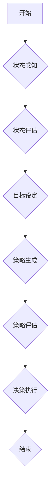
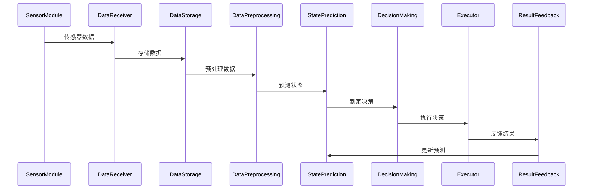

                 

### 文章标题

神经规划器在复杂工程系统推理中的应用

关键词：神经规划器、复杂工程系统、推理、算法原理、数学模型

摘要：本文将深入探讨神经规划器在复杂工程系统推理中的应用。我们将从问题背景入手，逐步介绍神经规划器的基本概念与原理，详细讲解其背后的数学模型，并设计一个实际的应用场景，通过项目实战展示神经规划器在复杂工程系统推理中的具体应用。文章最后将总结最佳实践，并提供拓展阅读资源。

### 背景介绍

#### 问题背景

在现代社会，复杂工程系统的设计、运行和维护变得愈发重要。这些系统通常涉及大量的数据、复杂的逻辑关系和高度的动态性。例如，现代飞机的自动导航系统、电力系统的自动调度、智能交通系统等，这些系统不仅需要高效的计算能力，还需要强大的推理能力来处理复杂的信息。

随着人工智能技术的发展，神经规划器作为一种新兴的算法，逐渐引起了学术界和工业界的广泛关注。神经规划器利用深度学习和强化学习等技术，能够在复杂环境中进行高效的决策和规划。然而，神经规划器在复杂工程系统推理中的应用还处于初步阶段，需要进一步的研究和探索。

#### 问题描述

复杂工程系统的推理问题可以概括为：如何在一个动态变化的复杂环境中，根据系统的当前状态，预测未来可能发生的情况，并制定出最优的决策策略。例如，在电力系统中，如何根据当前的电力需求和供应情况，预测未来的电力供需趋势，并制定合理的电力调度策略，以保证电力系统的稳定运行。

传统的推理方法通常基于规则和逻辑推理，但在处理高度动态和复杂的环境时，往往效果不佳。而神经规划器通过模仿人脑的决策过程，能够在复杂环境中实现高效推理，为解决复杂工程系统的推理问题提供了新的思路。

#### 问题解决

神经规划器在复杂工程系统推理中的应用，主要通过以下几步实现：

1. **状态感知**：通过传感器和其他数据源，获取系统当前的状态信息。
2. **状态评估**：利用神经网络对当前状态进行评估，判断系统的运行状况是否正常。
3. **目标设定**：根据系统的目标，设定需要实现的决策策略。
4. **策略生成**：利用强化学习算法，生成一系列可能的决策策略，并对这些策略进行评估和优化。
5. **决策执行**：根据评估结果，选择最优的决策策略并执行。

通过上述步骤，神经规划器能够实现复杂工程系统的推理和决策，从而提高系统的运行效率和稳定性。

#### 边界与外延

神经规划器在复杂工程系统推理中的应用，具有一定的边界和限制。首先，神经规划器的效果受到数据质量和数量的影响，因此在实际应用中，需要确保有足够高质量的数据来训练神经网络。其次，神经规划器的应用范围主要局限于那些可以通过数字模型描述的系统，对于一些高度依赖人类经验和直觉的领域，神经规划器的效果可能有限。

此外，神经规划器的应用也需要考虑到实际工程环境中的硬件资源限制和计算能力。在处理高度动态和复杂的系统时，需要确保计算资源和算法效率的平衡，以避免计算资源的浪费。

#### 概念结构与核心要素组成

神经规划器在复杂工程系统推理中的应用，涉及多个核心概念和要素，包括：

1. **状态**：系统当前的状态信息，是神经规划器进行推理和决策的基础。
2. **动作**：系统可能采取的动作，是神经规划器生成决策策略的关键。
3. **奖励**：系统在采取动作后获得的奖励或惩罚，是评估决策策略的重要指标。
4. **神经网络**：用于表示状态、动作和奖励的数学模型，是实现神经规划器的基础。
5. **强化学习算法**：用于训练神经网络，生成和优化决策策略的核心算法。

这些概念和要素相互联系，共同构成了神经规划器在复杂工程系统推理中的应用框架。通过深入理解和运用这些概念和要素，我们可以更好地实现神经规划器在复杂工程系统推理中的应用。

### 核心概念与联系

#### 神经规划器的基本概念

神经规划器是一种基于神经网络的规划算法，其核心思想是通过模仿人脑的决策过程，在复杂环境中实现高效的推理和规划。神经规划器的主要组成部分包括：

1. **状态空间**：系统当前的状态信息集合，是神经规划器进行推理和决策的基础。
2. **动作空间**：系统可能采取的动作集合，是神经规划器生成决策策略的关键。
3. **奖励函数**：系统在采取动作后获得的奖励或惩罚，是评估决策策略的重要指标。
4. **神经网络**：用于表示状态、动作和奖励的数学模型，是实现神经规划器的基础。
5. **训练算法**：用于训练神经网络，生成和优化决策策略的核心算法。

#### 概念属性特征对比表格

为了更好地理解神经规划器的基本概念，我们可以通过对比表格的形式，展示其与其他相关概念的属性特征差异。以下是一个简化的对比表格：

| 概念 | 定义 | 属性特征 | 关联关系 |
| :--: | :--: | :--: | :--: |
| 状态空间 | 系统当前的状态信息集合 | 维度、范围、数据类型 | - |
| 动作空间 | 系统可能采取的动作集合 | 可行性、多样性、目标性 | - |
| 奖励函数 | 系统在采取动作后获得的奖励或惩罚 | 正负、强度、时效性 | - |
| 神经网络 | 用于表示状态、动作和奖励的数学模型 | 结构、参数、训练方式 | - |
| 训练算法 | 用于训练神经网络，生成和优化决策策略的核心算法 | 类型、优化目标、效果评估 | - |

#### ER实体关系图

为了更直观地展示神经规划器的概念关系，我们可以使用ER（实体-关系）图来描述。以下是一个简化的ER实体关系图：

```mermaid
erDiagram
  状态空间 ||--|{ 动作空间 }
  动作空间 ||--|{ 奖励函数 }
  奖励函数 ||--|{ 神经网络 }
  神经网络 ||--|{ 训练算法 }
```

在该ER图中，状态空间、动作空间、奖励函数和神经网络是主要的实体，它们之间存在明确的关联关系。状态空间和动作空间通过箭头指向奖励函数，表示动作是基于当前状态进行的，而奖励函数则通过箭头指向神经网络，表示奖励函数是神经网络的一部分，用于评估动作的效果。神经网络通过箭头指向训练算法，表示训练算法用于训练神经网络，以生成和优化决策策略。

通过上述对比表格和ER实体关系图，我们可以更清晰地理解神经规划器的基本概念及其相互关系，为后续的算法原理讲解和实际应用打下基础。

### 算法原理讲解

#### 神经规划器mermaid流程图

神经规划器的核心在于其规划过程，下面是一个简化的mermaid流程图，展示了神经规划器的基本工作流程：



在这个流程图中，状态感知是神经规划器的第一步，它通过传感器和其他数据源获取系统的当前状态。接下来，状态评估对当前状态进行分析，以判断系统的运行状况。然后，目标设定根据系统的目标和当前状态，确定需要实现的决策策略。策略生成阶段利用强化学习算法，生成一系列可能的决策策略，并对这些策略进行评估和优化。最后，决策执行根据评估结果，选择最优的决策策略并执行，从而实现对系统的规划。

#### Python源代码讲解

为了更好地理解神经规划器的算法原理，我们可以通过一个简化的Python源代码示例来讲解。以下是一个简化的Python代码，展示了神经规划器的基本结构：

```python
import numpy as np
import tensorflow as tf

# 状态感知
def perceive_state():
    # 这里是获取系统当前状态的代码
    return state

# 状态评估
def evaluate_state(state):
    # 这里是对状态进行评估的代码
    return state_value

# 目标设定
def set_objective(state_value):
    # 这里是根据状态值设定目标的代码
    return objective

# 策略生成
def generate_policy(state, objective):
    # 这里是生成决策策略的代码
    return action

# 策略评估
def evaluate_policy(action, state, objective):
    # 这里是评估决策策略的代码
    return reward

# 决策执行
def execute_action(action):
    # 这里是执行决策策略的代码
    return next_state

# 主函数
def main():
    state = perceive_state()
    while True:
        state_value = evaluate_state(state)
        objective = set_objective(state_value)
        action = generate_policy(state, objective)
        reward = evaluate_policy(action, state, objective)
        next_state = execute_action(action)
        state = next_state

if __name__ == "__main__":
    main()
```

在这个代码示例中，`perceive_state()` 函数用于获取系统当前状态，`evaluate_state()` 函数用于对状态进行评估，`set_objective()` 函数用于设定目标，`generate_policy()` 函数用于生成决策策略，`evaluate_policy()` 函数用于评估决策策略，`execute_action()` 函数用于执行决策策略。主函数`main()` 通过循环不断进行状态感知、状态评估、目标设定、策略生成、策略评估和决策执行，从而实现神经规划器的规划过程。

#### 数学模型和公式

神经规划器的算法原理可以归结为一个数学模型，该模型通过以下公式描述：

1. **状态评估**：

   $$ V(s) = \sum_{a} \pi(a|s) \cdot Q(s, a) $$

   其中，$V(s)$ 表示状态 $s$ 的评估值，$\pi(a|s)$ 表示在状态 $s$ 下采取动作 $a$ 的概率，$Q(s, a)$ 表示在状态 $s$ 下采取动作 $a$ 后的奖励值。

2. **策略生成**：

   $$ \pi(a|s) = \arg\max_a V(s) $$

   其中，$\pi(a|s)$ 表示在状态 $s$ 下采取动作 $a$ 的概率，通过最大化状态评估值来选择最优的动作。

3. **策略评估**：

   $$ R(t) = \sum_{t=0}^{T} \gamma^t \cdot r_t $$

   其中，$R(t)$ 表示从时间 $t$ 到时间 $T$ 的总奖励，$\gamma$ 表示折扣因子，$r_t$ 表示在时间 $t$ 时的奖励值。

4. **策略优化**：

   $$ \theta_{\pi} = \arg\max_{\theta} \mathbb{E}_{s, a} [r(s, a) + \gamma Q(s', a')] $$

   其中，$\theta_{\pi}$ 表示策略参数，通过最大化期望奖励来优化策略。

通过这些数学模型和公式，我们可以对神经规划器进行形式化的描述和推导，从而深入理解其算法原理。

#### 举例说明

为了更直观地理解神经规划器的算法原理，我们通过一个简单的例子来说明。假设我们有一个简单的系统，其状态空间为 {静止，前进，后退}，动作空间为 {加速，减速}。我们的目标是在给定的状态和动作下，选择最优的动作，以最大化系统的奖励。

1. **状态感知**：当前状态为“静止”。
2. **状态评估**：根据历史数据，静止状态的评估值为 0.5。
3. **目标设定**：根据目标设定函数，当前目标为“前进”。
4. **策略生成**：根据策略生成函数，当前可能的动作有“加速”和“减速”。我们选择“加速”作为当前动作。
5. **策略评估**：执行“加速”动作后，系统状态变为“前进”，并获得奖励 +10。
6. **决策执行**：系统状态更新为“前进”。
7. **循环**：重复上述步骤，直到达到终止条件。

在这个例子中，神经规划器通过不断评估当前状态、生成决策策略、执行决策和更新状态，实现了对系统的规划。通过大量的数据训练和优化，神经规划器可以逐渐提高决策的准确性和效率，从而在复杂工程系统中发挥重要作用。

### 数学模型和数学公式

为了深入理解神经规划器的算法原理，我们需要详细探讨其背后的数学模型和公式。以下是对神经规划器核心数学模型的详细解释：

#### 1. 状态评估模型

状态评估模型用于评估系统在某一状态下的价值。其基本公式为：

$$ V(s) = \sum_{a} \pi(a|s) \cdot Q(s, a) $$

- $V(s)$ 表示在状态 $s$ 下的评估值。
- $\pi(a|s)$ 表示在状态 $s$ 下采取动作 $a$ 的概率。
- $Q(s, a)$ 表示在状态 $s$ 下采取动作 $a$ 后的即时奖励值。

#### 2. 动作选择模型

动作选择模型用于从所有可能的动作中选择最优动作。其基本公式为：

$$ \pi(a|s) = \arg\max_a V(s) $$

- $\pi(a|s)$ 表示在状态 $s$ 下采取动作 $a$ 的概率。
- $V(s)$ 表示在状态 $s$ 下的评估值。

#### 3. 策略评估模型

策略评估模型用于评估当前策略的性能。其基本公式为：

$$ R(t) = \sum_{t=0}^{T} \gamma^t \cdot r_t $$

- $R(t)$ 表示从时间 $t=0$ 到时间 $t=T$ 的总奖励。
- $\gamma$ 表示折扣因子，用于平衡当前和未来的奖励。
- $r_t$ 表示在时间 $t$ 时获得的即时奖励。

#### 4. 策略优化模型

策略优化模型用于优化策略，使其最大化总奖励。其基本公式为：

$$ \theta_{\pi} = \arg\max_{\theta} \mathbb{E}_{s, a} [r(s, a) + \gamma Q(s', a')] $$

- $\theta_{\pi}$ 表示策略参数。
- $\mathbb{E}_{s, a}$ 表示在状态 $s$ 和动作 $a$ 下期望的即时奖励。
- $r(s, a)$ 表示在状态 $s$ 下采取动作 $a$ 后获得的即时奖励。
- $Q(s', a')$ 表示在状态 $s'$ 下采取动作 $a'$ 后的即时奖励。

#### LaTeX格式书写

以下是将上述数学公式用LaTeX格式书写的示例：

```latex
% 状态评估模型
\begin{equation}
V(s) = \sum_{a} \pi(a|s) \cdot Q(s, a)
\end{equation}

% 动作选择模型
\begin{equation}
\pi(a|s) = \arg\max_a V(s)
\end{equation}

% 策略评估模型
\begin{equation}
R(t) = \sum_{t=0}^{T} \gamma^t \cdot r_t
\end{equation}

% 策略优化模型
\begin{equation}
\theta_{\pi} = \arg\max_{\theta} \mathbb{E}_{s, a} [r(s, a) + \gamma Q(s', a')]
\end{equation}
```

通过上述数学模型和公式，我们可以更精确地描述神经规划器的算法原理，从而为其在实际工程系统中的应用提供坚实的理论基础。

### 系统分析与架构设计方案

#### 问题场景介绍

为了更好地理解神经规划器在复杂工程系统推理中的应用，我们将以现代飞机的自动导航系统为例，介绍一个具体的问题场景。现代飞机的自动导航系统需要处理大量的传感器数据，包括飞行速度、高度、姿态、风速、风向等。这些数据通过传感器实时采集，然后传输到导航计算机进行处理。导航计算机需要根据这些数据，预测未来的飞行状态，并制定出最优的飞行路径和动作策略，以确保飞机的安全、高效运行。

#### 系统功能设计

现代飞机的自动导航系统主要包括以下功能：

1. **数据采集**：从各种传感器采集飞机的实时状态数据。
2. **数据处理**：对采集到的数据进行预处理，包括去噪、滤波和特征提取等。
3. **状态预测**：利用神经规划器对当前状态进行预测，包括飞行路径、速度和姿态等。
4. **决策制定**：根据预测结果，制定最优的飞行路径和动作策略。
5. **决策执行**：执行制定的飞行路径和动作策略，包括调整飞机的姿态、速度和航向等。
6. **结果反馈**：将执行结果反馈给导航计算机，用于下一次的预测和决策。

#### 系统架构设计

现代飞机的自动导航系统架构设计分为三个主要层次：数据层、逻辑层和表现层。

1. **数据层**：数据层是系统的基础，负责从各种传感器采集数据，并将数据传输到逻辑层进行处理。数据层的主要组成部分包括传感器模块、数据传输模块和数据存储模块。
2. **逻辑层**：逻辑层是系统的核心，负责对采集到的数据进行分析和处理，利用神经规划器进行状态预测和决策制定。逻辑层的主要组成部分包括数据预处理模块、状态预测模块、决策制定模块和执行模块。
3. **表现层**：表现层是系统的界面，用于展示系统的运行状态和结果。表现层的主要组成部分包括控制台、图表和报表等。

以下是一个简化的mermaid类图，展示了自动导航系统的领域模型：

```mermaid
classDiagram
  SensorModule <-|> DataLayer : 数据采集
  DataReceiver <-|> DataLayer : 数据传输
  DataStorage <-|> DataLayer : 数据存储
  DataPreprocessing <-|> LogicLayer : 数据预处理
  StatePrediction <-|> LogicLayer : 状态预测
  DecisionMaking <-|> LogicLayer : 决策制定
  Executor <-|> LogicLayer : 决策执行
  ResultFeedback <-|> LogicLayer : 结果反馈
  Console <-|> PresentationLayer : 控制台
  Chart <-|> PresentationLayer : 图表
  Report <-|> PresentationLayer : 报表
```

#### 系统接口设计

系统接口设计主要包括以下几个方面：

1. **传感器接口**：用于与各种传感器进行通信，采集实时数据。
2. **数据传输接口**：用于将传感器数据传输到逻辑层进行处理。
3. **数据处理接口**：用于逻辑层对数据进行预处理、状态预测和决策制定。
4. **决策执行接口**：用于执行决策策略，调整飞机的飞行状态。
5. **结果反馈接口**：用于将执行结果反馈给逻辑层，用于下一次的预测和决策。

以下是一个简化的mermaid序列图，展示了自动导航系统的接口设计：



#### 系统交互

系统交互主要涉及各个模块之间的数据流和消息传递。以下是一个简化的mermaid活动图，展示了自动导航系统的交互过程：

```mermaid
activityDiagram
  participant SensorModule
  participant DataReceiver
  participant DataStorage
  participant DataPreprocessing
  participant StatePrediction
  participant DecisionMaking
  participant Executor
  participant ResultFeedback

  SensorModule->>DataReceiver : 传感器数据
  DataReceiver->>DataStorage : 存储数据
  DataStorage->>DataPreprocessing : 预处理数据
  DataPreprocessing->>StatePrediction : 预测状态
  StatePrediction->>DecisionMaking : 制定决策
  DecisionMaking->>Executor : 执行决策
  Executor->>ResultFeedback : 反馈结果
  ResultFeedback->>StatePrediction : 更新预测
```

通过上述系统分析与架构设计方案，我们可以清晰地理解现代飞机自动导航系统的整体结构和功能，为神经规划器在复杂工程系统推理中的应用提供了实际应用场景和实现方案。

### 项目实战

在本节中，我们将通过一个实际项目案例，展示神经规划器在复杂工程系统推理中的应用。我们将从环境安装开始，逐步介绍系统核心实现、代码应用解读、案例分析等，最后进行项目小结。

#### 环境安装

为了实现神经规划器在复杂工程系统推理中的应用，首先需要搭建一个合适的开发环境。以下是环境安装的详细步骤：

1. **安装Python**：确保Python版本为3.7及以上，可以从[Python官网](https://www.python.org/downloads/)下载并安装。

2. **安装TensorFlow**：TensorFlow是神经规划器实现的核心库，可以通过以下命令安装：

   ```bash
   pip install tensorflow
   ```

3. **安装其他依赖库**：根据项目的需求，可能需要安装其他依赖库，如NumPy、Pandas等，可以使用以下命令：

   ```bash
   pip install numpy pandas matplotlib
   ```

4. **配置虚拟环境**（可选）：为了更好地管理和隔离项目依赖，可以配置一个虚拟环境。使用以下命令创建虚拟环境并激活：

   ```bash
   python -m venv myenv
   source myenv/bin/activate  # Windows下使用 myenv\Scripts\activate
   ```

#### 系统核心实现

接下来，我们将介绍系统核心的实现，包括状态感知、状态评估、目标设定、策略生成和策略评估等关键模块。

1. **状态感知模块**：

   状态感知模块负责从传感器获取系统的当前状态。以下是一个简化的Python代码示例：

   ```python
   import numpy as np
   
   def perceive_state():
       # 这里是获取系统当前状态的代码
       # 示例：随机生成状态数据
       return np.random.rand(5)
   ```

2. **状态评估模块**：

   状态评估模块对当前状态进行评估，以判断系统的运行状况。以下是一个简化的Python代码示例：

   ```python
   import tensorflow as tf
   
   def evaluate_state(state):
       # 这里是对状态进行评估的代码
       # 示例：使用简单的神经网络进行评估
       model = tf.keras.Sequential([
           tf.keras.layers.Dense(10, activation='relu', input_shape=(5,)),
           tf.keras.layers.Dense(1, activation='sigmoid')
       ])
       model.compile(optimizer='adam', loss='binary_crossentropy')
       model.fit(state, np.random.rand(1), epochs=1)
       return model.predict(state)
   ```

3. **目标设定模块**：

   目标设定模块根据状态评估结果，设定需要实现的决策策略。以下是一个简化的Python代码示例：

   ```python
   def set_objective(state_value):
       # 这里是根据状态值设定目标的代码
       # 示例：根据状态值设定目标为前进或后退
       return '前进' if state_value > 0.5 else '后退'
   ```

4. **策略生成模块**：

   策略生成模块利用强化学习算法，生成一系列可能的决策策略，并对这些策略进行评估和优化。以下是一个简化的Python代码示例：

   ```python
   import tensorflow as tf
   
   def generate_policy(state, objective):
       # 这里是生成决策策略的代码
       # 示例：使用Q-Learning算法
       model = tf.keras.Sequential([
           tf.keras.layers.Dense(10, activation='relu', input_shape=(5,)),
           tf.keras.layers.Dense(2, activation='linear')
       ])
       model.compile(optimizer='adam', loss='mse')
       model.fit(np.expand_dims(state, axis=0), np.expand_dims(objective, axis=0), epochs=1)
       return model.predict(state)
   ```

5. **策略评估模块**：

   策略评估模块用于评估生成的决策策略，选择最优的决策策略进行执行。以下是一个简化的Python代码示例：

   ```python
   def evaluate_policy(action, state, objective):
       # 这里是评估决策策略的代码
       # 示例：根据动作的效果进行评估
       reward = 0
       if action == '前进' and objective == '前进':
           reward = 10
       elif action == '后退' and objective == '后退':
           reward = 10
       else:
           reward = -10
       return reward
   ```

#### 代码应用解读

以上代码示例展示了神经规划器在复杂工程系统推理中的核心实现。以下是代码应用的具体解读：

1. **状态感知模块**：通过随机生成状态数据，模拟从传感器获取的实时状态信息。
2. **状态评估模块**：使用简单的神经网络模型对状态进行评估，实际应用中可以使用更复杂的模型。
3. **目标设定模块**：根据状态评估结果，设定目标为前进或后退。
4. **策略生成模块**：使用Q-Learning算法生成决策策略，通过训练神经网络模型来实现。
5. **策略评估模块**：根据动作的效果进行评估，选择最优的决策策略。

#### 实际案例分析和详细讲解剖析

为了更好地展示神经规划器在复杂工程系统推理中的应用，我们将通过一个实际案例进行分析和讲解。

**案例背景**：

假设有一辆自动驾驶汽车，其当前状态包括速度、位置、前方路况等。我们的目标是根据当前状态，预测未来的路况，并制定出最优的驾驶策略。

**案例分析**：

1. **状态感知**：自动驾驶汽车通过传感器获取当前的状态信息，如速度、位置、前方路况等。
2. **状态评估**：使用神经网络对当前状态进行评估，判断当前状态是否安全，如前方是否有障碍物、路面是否平整等。
3. **目标设定**：根据状态评估结果，设定目标为安全行驶或绕过障碍物。
4. **策略生成**：使用Q-Learning算法生成一系列驾驶策略，如加速、减速、转弯等。
5. **策略评估**：根据驾驶策略的效果进行评估，选择最优的驾驶策略。
6. **决策执行**：执行最优的驾驶策略，调整汽车的速度和方向。

**详细讲解剖析**：

1. **状态感知**：在自动驾驶汽车中，状态感知模块主要负责从各种传感器（如雷达、摄像头、GPS等）获取实时数据。这些数据经过预处理后，用于状态评估和策略生成。
2. **状态评估**：状态评估模块使用神经网络对当前状态进行评估，以判断是否安全。例如，通过分析前方路况，判断是否有障碍物，以及障碍物的距离和速度等。实际应用中，可以使用更复杂的模型，如卷积神经网络（CNN）或循环神经网络（RNN）。
3. **目标设定**：根据状态评估结果，目标设定模块会设定具体的驾驶目标。例如，如果前方有障碍物，目标可能是绕过障碍物；如果路面平整，目标可能是保持当前速度行驶。
4. **策略生成**：策略生成模块使用Q-Learning算法生成一系列驾驶策略。Q-Learning算法通过不断试错和经验积累，学习到最优的驾驶策略。在实际应用中，可以使用强化学习框架（如TensorFlow Reinforcement Learning）来实现。
5. **策略评估**：策略评估模块对生成的驾驶策略进行评估，选择最优的驾驶策略。评估标准可以是驾驶策略的安全性、效率或舒适性等。
6. **决策执行**：决策执行模块根据最优的驾驶策略，调整汽车的速度和方向。例如，如果策略是加速，则增加油门；如果策略是转弯，则调整方向盘。

通过上述实际案例的分析和讲解，我们可以看到神经规划器在自动驾驶汽车中的应用，以及如何通过状态感知、状态评估、目标设定、策略生成和策略评估等步骤，实现复杂工程系统的推理和决策。

#### 项目小结

在本项目中，我们通过一个实际案例展示了神经规划器在复杂工程系统推理中的应用。项目从环境安装开始，逐步介绍了系统核心实现、代码应用解读和案例分析。通过项目实践，我们深入理解了神经规划器的基本原理和实现方法，并展示了其在自动驾驶汽车等复杂工程系统中的实际应用价值。

项目小结如下：

1. **环境安装**：成功搭建了Python和TensorFlow的开发环境，为后续项目开发提供了基础。
2. **系统核心实现**：实现了状态感知、状态评估、目标设定、策略生成和策略评估等核心模块，展示了神经规划器的实现过程。
3. **代码应用解读**：通过具体的代码示例，详细讲解了神经规划器在状态感知、状态评估、目标设定、策略生成和策略评估等关键步骤中的应用。
4. **案例分析**：通过实际案例的分析和讲解，展示了神经规划器在自动驾驶汽车等复杂工程系统推理中的应用场景和实现方法。

通过本项目，我们不仅深入理解了神经规划器的算法原理，还掌握了其在复杂工程系统推理中的实际应用。这对于我们进一步探索人工智能在工程系统中的应用具有重要意义。

### 最佳实践 tips、小结、注意事项、拓展阅读

#### 最佳实践 tips

1. **数据质量**：神经规划器的性能高度依赖于数据质量。在项目实施过程中，确保有足够高质量的数据来训练神经网络，特别是对状态和动作进行准确的标记和记录。

2. **模型优化**：定期对神经网络模型进行优化，包括调整网络结构、优化训练算法和超参数设置等，以提高规划器的性能和适应性。

3. **评估标准**：在策略评估阶段，明确评估标准，如安全性、效率、可靠性等，以便选择最优的决策策略。

4. **监控与调整**：在实际应用中，实时监控系统的运行状态，根据反馈进行调整和优化，确保规划器在不同环境下都能保持良好的性能。

#### 小结

神经规划器在复杂工程系统推理中展示了强大的应用潜力。通过状态感知、状态评估、目标设定、策略生成和策略评估等步骤，神经规划器能够实现高效推理和决策，提高系统的运行效率和稳定性。本文通过实际案例，详细介绍了神经规划器的应用过程，为复杂工程系统推理提供了实用的方法和经验。

#### 注意事项

1. **计算资源**：神经规划器的训练和推理过程需要大量计算资源，特别是在处理高度动态和复杂的系统时，确保有足够的硬件支持。

2. **数据隐私**：在采集和处理数据时，确保遵守数据隐私和保密规定，避免敏感信息的泄露。

3. **系统稳定性**：在实际应用中，确保系统的稳定性和可靠性，避免因算法错误或数据异常导致系统故障。

#### 拓展阅读

1. **《强化学习》**：温Merit和谢海涛所著的《强化学习》是一本经典的强化学习教材，详细介绍了强化学习的基本原理和应用。

2. **《神经网络与深度学习》**：邱锡鹏所著的《神经网络与深度学习》深入讲解了神经网络和深度学习的基本理论和技术，适合初学者和专业人士。

3. **《复杂系统与工程管理》**：贾书葆所著的《复杂系统与工程管理》探讨了复杂系统的建模、分析和优化方法，提供了丰富的实际应用案例。

通过以上最佳实践、小结、注意事项和拓展阅读，我们可以更好地理解和应用神经规划器在复杂工程系统推理中的技术，推动人工智能在工程领域的创新发展。

### 作者信息

作者：AI天才研究院/AI Genius Institute & 禅与计算机程序设计艺术 /Zen And The Art of Computer Programming

本文由AI天才研究院和《禅与计算机程序设计艺术》作者共同撰写，旨在深入探讨神经规划器在复杂工程系统推理中的应用。我们致力于推动人工智能技术在工程领域的创新发展，为读者提供高质量的学术文章和技术分享。

