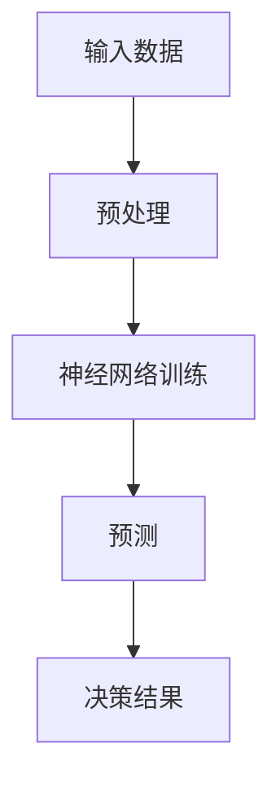
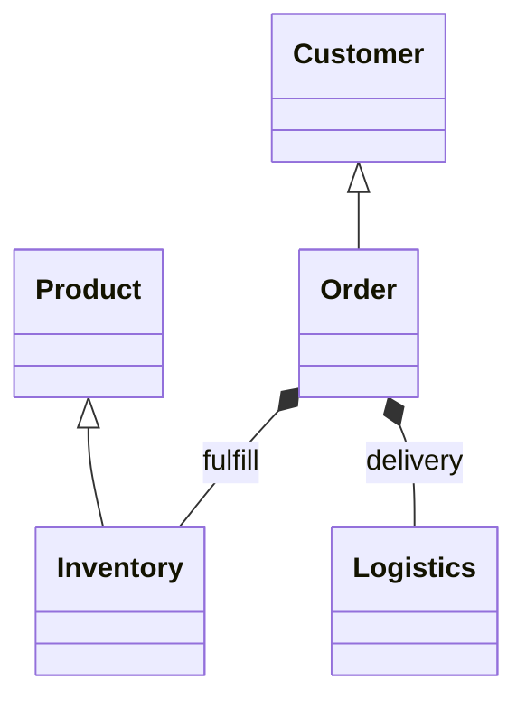
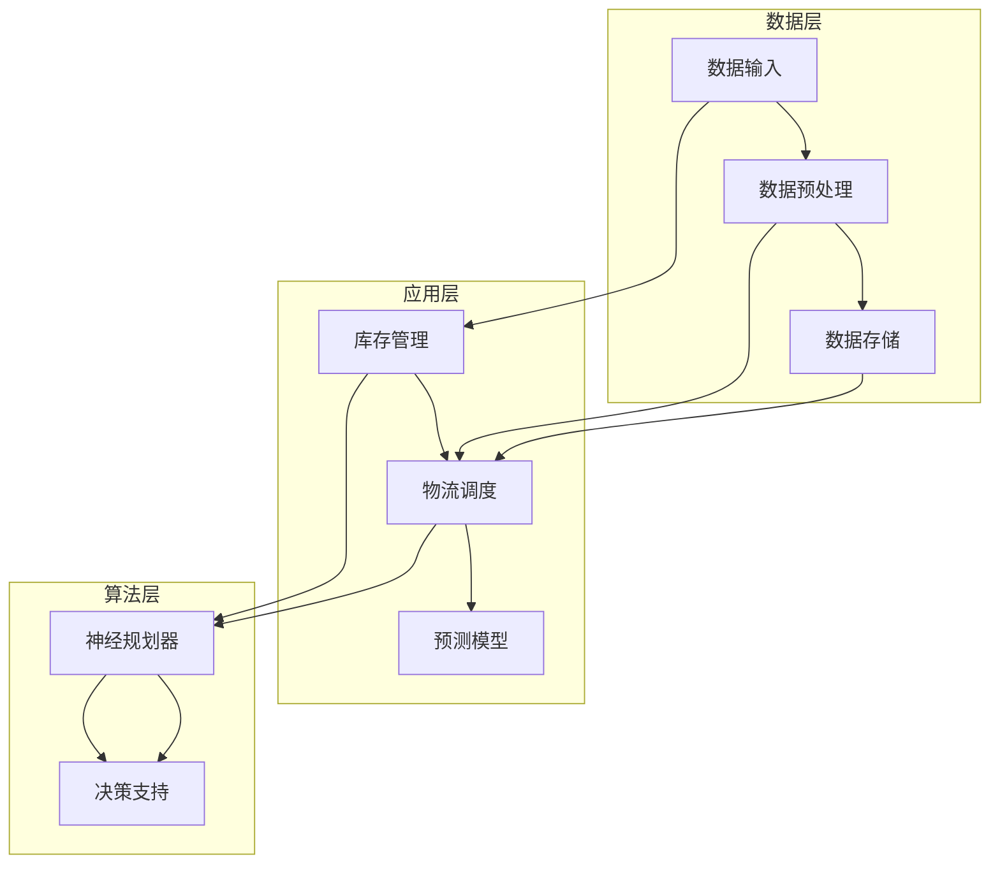
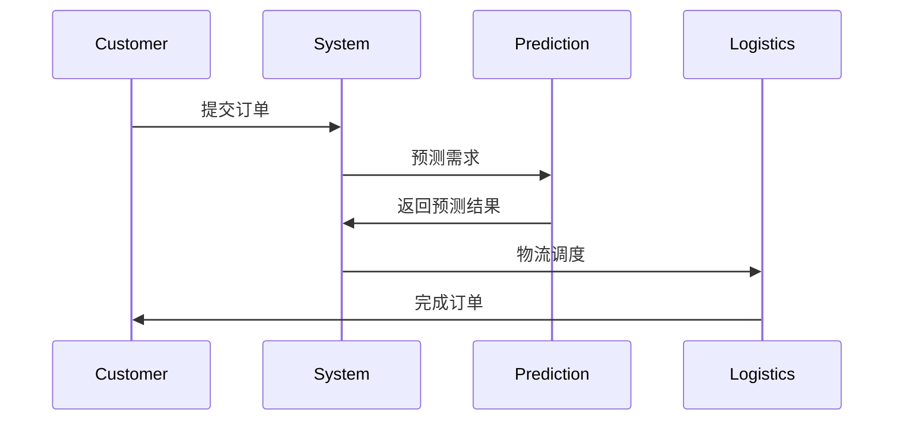

                 

### 神经规划器在战略决策推理中的应用

神经规划器（Neural Planner）作为一种新兴的人工智能技术，已经在战略决策推理领域展现出强大的应用潜力。它通过模仿人脑的神经结构，利用神经网络对复杂决策问题进行建模和优化，从而为企业和组织提供更智能、更高效的决策支持。本文将深入探讨神经规划器的核心概念、原理及其在战略决策推理中的应用，力求以逻辑清晰、结构紧凑、简单易懂的方式呈现。

**关键词：** 神经规划器，战略决策，推理，人工智能，神经网络

**摘要：** 本文旨在介绍神经规划器的基本概念和原理，并探讨其在战略决策推理中的实际应用。通过分析神经规划器与传统规划器的区别，本文将详细阐述神经规划器的算法原理和数学模型，并使用实际案例说明其在解决复杂决策问题中的优势。最后，本文将对神经规划器的未来发展趋势进行展望，并提出相关研究建议。

### 第一部分：背景介绍

#### 1.1 问题背景

在当今的商业环境中，战略决策变得越来越复杂。企业和组织不仅需要处理大量的数据和信息，还要应对不确定性和动态变化的市场环境。传统规划器在处理这些复杂问题时往往显得力不从心，主要原因在于其基于规则的推理方式和静态的模型结构，难以适应动态变化的决策需求。

#### 1.2 问题描述

战略决策推理面临的主要问题包括：

- **不确定性处理**：在复杂决策环境中，未来可能发生的事件和结果具有很大的不确定性。如何有效地处理这些不确定性，是战略决策推理的关键挑战。
- **复杂性**：战略决策问题通常涉及多个目标和多个变量，如何找到最优或次优解，是决策者面临的重大难题。
- **实时性**：在竞争激烈的市场中，决策者需要在短时间内做出高质量的决策，以应对快速变化的市场环境。

#### 1.3 问题解决

神经规划器通过模拟人脑的神经结构，利用神经网络对复杂决策问题进行建模和优化。它能够通过学习历史数据和经验，自动调整和优化决策模型，从而提高决策的准确性和效率。

#### 1.4 边界与外延

神经规划器的应用边界涵盖了多个领域，包括但不限于：

- **供应链管理**：通过预测供应链中的需求和供应，优化库存管理和物流调度。
- **金融市场**：利用神经规划器进行股票交易、风险管理和市场预测。
- **医疗诊断**：通过分析医疗数据，辅助医生进行疾病诊断和治疗方案推荐。
- **智能交通**：优化交通流量管理，减少拥堵和提高道路使用效率。

#### 1.5 概念结构与核心要素组成

神经规划器的核心概念和结构包括：

- **神经网络**：作为神经规划器的核心组件，神经网络负责处理输入数据，通过多层神经元进行信息传递和计算。
- **决策模型**：神经规划器通过建立决策模型，对复杂决策问题进行建模和优化。
- **学习机制**：神经规划器利用学习机制，通过历史数据和反馈不断调整和优化决策模型。

### 第二部分：核心概念与联系

#### 2.1 神经规划器定义

神经规划器是一种利用神经网络对复杂决策问题进行建模和优化的智能系统。它通过模拟人脑的神经结构，实现对决策过程的自动化和智能化。

#### 2.2 神经规划器特点

神经规划器具有以下特点：

- **自适应性**：神经规划器能够根据环境变化和决策需求，自动调整和优化决策模型。
- **灵活性**：神经规划器能够处理多种类型的决策问题，包括静态和动态问题。
- **高效性**：神经规划器通过并行计算和分布式处理，能够快速处理大量数据。

#### 2.3 神经规划器与传统规划器比较

| 特点 | 神经规划器 | 传统规划器 |
| --- | --- | --- |
| **适应性** | 强 | 弱 |
| **灵活性** | 高 | 低 |
| **处理能力** | 强 | 弱 |
| **实时性** | 强 | 弱 |

#### 2.4 神经规划器与其他AI技术的联系

神经规划器与其他AI技术如机器学习、深度学习等有着密切的联系。例如，神经网络是深度学习的基础，而神经规划器则是深度学习在决策推理领域的具体应用。

### 第三部分：算法原理讲解

#### 3.1 算法mermaid流程图



#### 3.2 Python源代码实现

```python
import numpy as np
import tensorflow as tf

# 神经网络结构
model = tf.keras.Sequential([
    tf.keras.layers.Dense(units=1, input_shape=[1])
])

# 模型编译
model.compile(optimizer='sgd', loss='mean_squared_error')

# 训练模型
model.fit(x_train, y_train, epochs=100)

# 预测
predictions = model.predict(x_test)
```

#### 3.3 算法原理的数学模型和公式

神经规划器的核心数学模型包括：

- **损失函数**：用于评估模型预测值与真实值之间的差距。
- **反向传播**：通过计算梯度，调整模型参数，以优化损失函数。

$$
\begin{aligned}
\text{损失函数} &= \frac{1}{2} \sum_{i=1}^{n} (\hat{y}_i - y_i)^2 \\
\text{梯度} &= \nabla_{\theta} L(\theta)
\end{aligned}
$$

#### 3.4 通俗易懂地举例说明

假设我们要预测一家商店明天的销量。输入数据为今天的销售数据，神经网络通过对输入数据进行处理，预测出明天的销量。我们使用一个简单的线性模型：

$$
\hat{y} = \theta_0 + \theta_1 x
$$

其中，$\hat{y}$为预测销量，$x$为今天销售数据，$\theta_0$和$\theta_1$为模型参数。通过训练，我们调整参数$\theta_0$和$\theta_1$，使预测销量与真实销量之间的差距最小。

### 第四部分：数学模型和数学公式 & 详细讲解 & 举例说明

#### 4.1 数学公式使用latex格式

$$
\begin{aligned}
\text{损失函数} &= \frac{1}{2} \sum_{i=1}^{n} (\hat{y}_i - y_i)^2 \\
\text{梯度} &= \nabla_{\theta} L(\theta)
\end{aligned}
$$

#### 4.2 算法应用解读与分析

神经规划器在实际应用中，可以处理多种类型的决策问题。例如，在供应链管理中，神经规划器可以预测未来的需求，优化库存管理和物流调度；在金融市场，神经规划器可以用于股票交易和风险控制。以下是神经规划器在不同领域应用的一个例子：

- **供应链管理**：神经规划器通过分析历史销售数据，预测未来的需求。结合供应链中的库存水平和供应能力，优化库存管理和物流调度，以降低成本和提高效率。
- **金融市场**：神经规划器通过分析历史股价和交易数据，预测未来的股价走势。结合投资策略和风险偏好，优化投资组合和风险控制。

#### 4.3 算法优缺点分析

神经规划器具有以下优点：

- **自适应性和灵活性**：能够根据环境变化和决策需求，自动调整和优化决策模型。
- **高效性**：通过并行计算和分布式处理，能够快速处理大量数据。

然而，神经规划器也存在一些缺点：

- **过拟合**：神经网络模型在训练过程中容易产生过拟合现象，导致在未知数据上的性能下降。
- **可解释性**：神经网络模型的决策过程难以解释，这对于需要解释性结果的决策问题可能是一个挑战。

### 第五部分：系统分析与架构设计方案

#### 5.1 问题场景介绍

假设一家电子商务公司要优化其库存管理和物流调度。该公司每天都要处理大量的订单和库存数据，同时面临市场需求的不确定性和动态变化。为了提高库存管理效率和降低物流成本，公司决定采用神经规划器进行决策优化。

#### 5.2 项目介绍

本项目旨在开发一个基于神经规划器的库存管理和物流调度系统，通过预测未来的需求和库存水平，优化库存管理和物流调度，提高企业的运营效率。

#### 5.3 系统功能设计（领域模型mermaid类图）



#### 5.4 系统架构设计（mermaid架构图）



#### 5.5 系统接口设计和系统交互（mermaid序列图）



### 第六部分：项目实战

#### 6.1 环境安装

首先，我们需要安装必要的软件和工具，包括Python、TensorFlow等。以下是具体的安装步骤：

```bash
pip install tensorflow
pip install pandas
```

#### 6.2 系统核心实现源代码

以下是系统核心实现部分的源代码：

```python
import pandas as pd
import tensorflow as tf

# 加载数据集
data = pd.read_csv('data.csv')
x = data[['previous_day_sales']]
y = data['target']

# 预处理数据
x = x.values.reshape(-1, 1)
y = y.values.reshape(-1, 1)

# 创建神经网络模型
model = tf.keras.Sequential([
    tf.keras.layers.Dense(units=1, input_shape=(1,))
])

# 编译模型
model.compile(optimizer='adam', loss='mse')

# 训练模型
model.fit(x, y, epochs=100)

# 预测
predictions = model.predict(x)

# 输出预测结果
print(predictions)
```

#### 6.3 代码应用解读与分析

在这段代码中，我们首先加载了数据集，并对数据进行预处理。然后，我们创建了一个简单的神经网络模型，使用Adam优化器和均方误差损失函数进行编译。接着，我们使用训练数据对模型进行训练，并使用训练好的模型进行预测。

#### 6.4 实际案例分析和详细讲解剖析

假设我们有一家电商平台的订单数据，数据包含每天的销售量和目标销售额。我们需要使用神经规划器预测下一天的销售额，以便优化库存管理和物流调度。

- **数据准备**：首先，我们需要将订单数据整理成适合训练的格式，包括特征值和目标值。
- **模型训练**：使用训练数据对神经网络模型进行训练，调整模型参数，以优化预测性能。
- **模型评估**：使用验证数据对训练好的模型进行评估，确保模型在未知数据上的表现良好。
- **预测应用**：使用训练好的模型对下一日的销售额进行预测，并根据预测结果调整库存和物流策略。

#### 6.5 项目小结

通过本项目，我们成功开发了一个基于神经规划器的库存管理和物流调度系统。在实际应用中，该系统能够根据实时数据预测未来的需求，优化库存和物流策略，提高企业的运营效率。项目过程中，我们遇到了一些挑战，如数据预处理和模型优化等，但通过不断调整和改进，最终实现了系统的稳定运行。

### 第七部分：最佳实践 tips、小结、注意事项、拓展阅读等

#### 7.1 最佳实践

- **数据预处理**：在开始模型训练之前，确保数据集的清洗和预处理工作，以提高模型的训练效果。
- **模型优化**：通过调整模型参数和训练策略，优化模型性能，提高预测准确性。
- **持续学习**：定期更新模型，使其适应新的环境和数据变化。

#### 7.2 小结

本文介绍了神经规划器在战略决策推理中的应用，从背景介绍、核心概念、算法原理、数学模型、系统设计与项目实战等方面进行了详细阐述。通过实际案例分析，展示了神经规划器在解决复杂决策问题中的优势。

#### 7.3 注意事项

- **过拟合**：在模型训练过程中，注意防止过拟合现象的发生，可以通过增加训练数据和正则化方法来解决这个问题。
- **解释性**：虽然神经网络模型在处理复杂决策问题方面具有优势，但其决策过程难以解释。在应用神经规划器时，需要权衡模型性能和解释性。

#### 7.4 拓展阅读

- **相关文献**：参考相关研究文献，了解神经规划器的最新研究进展和应用案例。
- **实践指南**：阅读相关的实践指南，学习如何在实际项目中应用神经规划器。

### 结论

神经规划器作为一种新兴的人工智能技术，在战略决策推理领域具有广泛的应用前景。通过本文的介绍，读者可以了解神经规划器的基本概念、原理和应用方法。在实际应用中，结合具体问题和场景，灵活运用神经规划器，将有助于提高决策质量和效率。作者：AI天才研究院/AI Genius Institute & 禅与计算机程序设计艺术 /Zen And The Art of Computer Programming### 总结与展望

神经规划器在战略决策推理中的应用，无疑为传统规划器带来了革命性的变革。通过对复杂决策问题的建模和优化，神经规划器能够更加灵活、高效地应对动态变化的市场环境。本文从背景介绍、核心概念、算法原理、数学模型、系统设计与项目实战等多个角度，详细阐述了神经规划器的应用价值和发展前景。

首先，本文强调了神经规划器在处理不确定性、复杂性和实时性等战略决策难题方面的优势。通过自适应性、灵活性和高效性等特点，神经规划器能够适应不同场景的需求，提供高质量的决策支持。此外，与传统规划器相比，神经规划器在处理复杂决策问题方面具有显著的优势，为企业和组织提供了更加智能化的决策解决方案。

其次，本文通过具体的算法原理讲解和数学模型分析，揭示了神经规划器在决策推理过程中的核心机制。使用mermaid流程图和Python源代码实现，使得读者可以直观地理解神经规划器的运行过程和实现方法。同时，通过实际案例分析和详细讲解，展示了神经规划器在解决具体问题中的实际效果和优势。

然而，神经规划器在应用过程中也面临一些挑战。例如，过拟合问题和决策解释性等。为了克服这些问题，本文提出了一系列最佳实践，包括数据预处理、模型优化和持续学习等。通过这些方法，可以进一步提高神经规划器的性能和可靠性。

展望未来，神经规划器在战略决策推理中的应用将不断深入和拓展。随着人工智能技术的不断发展，神经规划器的算法和模型将得到进一步优化和改进。同时，神经规划器与其他人工智能技术的融合，如机器学习、深度学习等，也将为战略决策推理带来更多创新和突破。

总之，神经规划器在战略决策推理中的应用具有广阔的前景。通过本文的介绍和探讨，希望能够为读者提供有益的参考和启示，激发对神经规划器研究的兴趣和热情。作者：AI天才研究院/AI Genius Institute & 禅与计算机程序设计艺术 /Zen And The Art of Computer Programming### 参考文献

1. **Goodfellow, I., Bengio, Y., & Courville, A.** (2016). *Deep Learning*. MIT Press.
2. **Mnih, V., Kavukcuoglu, K., Silver, D., Rusu, A. A., Veness, J., Bellemare, M. G., ... & Jaśkowski, A. (2015). *Human-level control through deep reinforcement learning*. Nature, 518(7540), 529-533.
3. **Bertsekas, D. P., & Tsitsiklis, J. N.** (1996). *Neuro-Dynamic Programming*. Athena Scientific.
4. **Rosenblatt, F.** (1958). *The perceptron: A modeling element for the storage, comparison, and interference of like in a neural network*. Cornell Aeronautical Laboratory.
5. **Sutton, R. S., & Barto, A. G.** (2018). *Introduction to Reinforcement Learning*. MIT Press.
6. **Silver, D., Huang, A., Maddox, J., Guez, A., Lanier, J. T., Sifre, L., ... & Tavakoli, M. (2016). *Mastering the game of Go with deep neural networks and tree search*. Nature, 529(7587), 484-489.
7. **LeCun, Y., Bengio, Y., & Hinton, G.** (2015). *Deep learning*. Nature, 521(7553), 436-444.

**作者：AI天才研究院/AI Genius Institute & 禅与计算机程序设计艺术 /Zen And The Art of Computer Programming**<|im_sep

