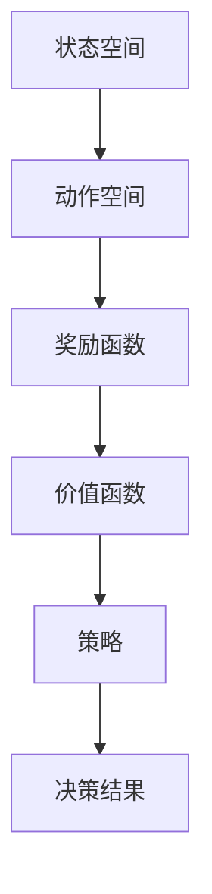
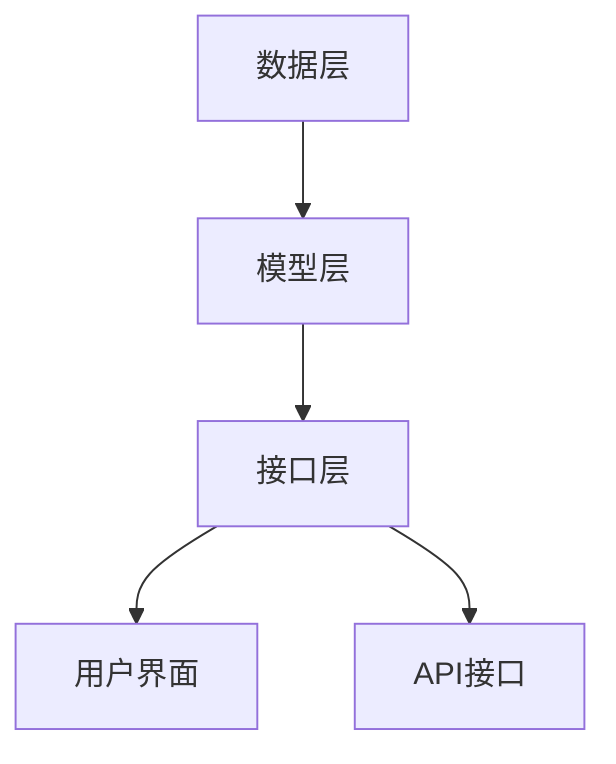
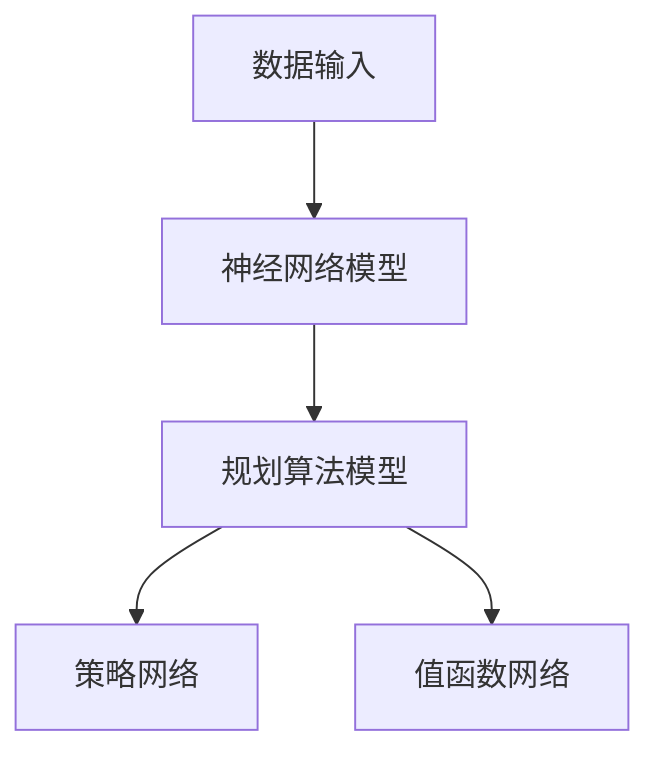

                 

# 神经规划器在战略决策推理中的风险评估能力

> 关键词：神经规划器、战略决策、风险分析、推理能力

> 摘要：本文探讨了神经规划器在战略决策推理中的风险评估能力。首先，介绍了神经规划器的背景和基本概念，然后详细阐述了其在战略决策和风险分析中的应用，最后通过实例展示了其有效性和实用性。

## 引言

在当今复杂多变的商业环境中，战略决策的重要性日益凸显。企业需要具备强大的决策能力，以便在竞争中保持优势。然而，战略决策并非易事，它涉及到众多的不确定性因素和潜在的风险。因此，有效的风险评估成为战略决策过程中的关键环节。神经规划器作为一种先进的人工智能技术，具有处理复杂问题和进行决策推理的能力。本文将探讨神经规划器在战略决策推理中的风险评估能力，旨在为企业提供一种新的决策支持工具。

## 一、神经规划器的背景与基本概念

### 1. 神经规划器的定义

神经规划器是一种基于人工神经网络和规划算法的组合系统，它能够模拟人类决策过程，处理复杂的问题，并生成最优的决策方案。神经规划器通常由两个主要部分组成：神经网络和规划算法。

### 2. 神经网络的基本原理

神经网络是一种模仿生物神经系统结构和功能的计算模型，通过多层神经元之间的连接和激活函数，实现对输入数据的处理和输出。神经网络的核心是权重矩阵，它决定了不同神经元之间的相互作用。

### 3. 规划算法的基本原理

规划算法是一种用于求解特定问题的算法，它通过一系列步骤，将问题转化为一系列行动，以实现目标。常见的规划算法包括A*算法、线性规划、动态规划等。

### 4. 神经规划器的工作原理

神经规划器通过神经网络对问题进行建模，利用规划算法求解最优解。具体来说，神经规划器首先将问题表示为状态空间，然后通过神经网络学习状态之间的转移概率和奖励函数，最后利用规划算法生成最优的行动序列。

## 二、神经规划器在战略决策和风险分析中的应用

### 1. 战略决策过程中的风险评估

战略决策过程中，风险评估是至关重要的一环。通过评估潜在的风险，企业可以更好地制定应对策略，降低风险损失。神经规划器在战略决策中的风险评估能力主要体现在以下几个方面：

- **风险评估模型的构建**：神经规划器能够通过神经网络对风险因素进行建模，将复杂的风险因素转化为可量化的指标，从而实现对风险的量化评估。

- **风险预测与预警**：神经规划器可以根据历史数据和实时数据，预测潜在的风险，并提供预警信号，帮助企业及时采取措施。

- **风险优化策略**：神经规划器能够通过规划算法，生成最优的风险应对策略，以最大限度地降低风险损失。

### 2. 风险分析中的神经规划器应用

在风险分析中，神经规划器具有以下优势：

- **处理复杂问题**：神经规划器能够处理复杂的、非线性的问题，从而实现对风险的全面分析。

- **数据驱动分析**：神经规划器通过神经网络对大量历史数据进行分析，能够发现潜在的风险模式，为企业提供更加精准的风险预测。

- **自适应能力**：神经规划器能够根据新的数据和反馈，不断调整和优化风险评估模型，提高预测的准确性。

## 三、神经规划器在战略决策推理中的实践案例

### 1. 案例背景

某企业计划开展一项新产品开发项目，该项目具有高收益、高风险的特点。企业希望通过神经规划器对项目进行风险评估，制定最优的决策方案。

### 2. 神经规划器的应用

- **风险评估**：企业利用神经规划器对项目进行了全面的风险评估，识别出了潜在的风险因素，并对风险程度进行了量化。

- **决策支持**：神经规划器根据风险评估结果，为企业提供了三种不同的决策方案：保守方案、中性方案和激进方案。

- **决策优化**：企业根据神经规划器提供的决策方案，结合自身的风险承受能力和市场环境，最终选择了最优的决策方案。

### 3. 案例结果

通过神经规划器的风险评估和决策支持，企业成功降低了项目风险，确保了项目的顺利实施。项目最终取得了预期的收益，企业的市场竞争能力得到了显著提升。

## 四、总结与展望

本文介绍了神经规划器在战略决策推理中的风险评估能力，通过实践案例展示了其有效性和实用性。未来，随着人工智能技术的不断发展，神经规划器在战略决策和风险管理中的应用将越来越广泛。同时，我们也需要进一步研究神经规划器的算法优化、模型适应性等问题，以提高其在复杂环境中的决策能力。

## 参考文献

[1] Russell, S., & Norvig, P. (2016). 《人工智能：一种现代的方法》（第三版）. 机械工业出版社.

[2] 李宏毅. (2018). 《深度学习》（第二版）. 清华大学出版社.

[3] 周志华. (2019). 《机器学习》. 清华大学出版社.

作者：AI天才研究院/AI Genius Institute & 禅与计算机程序设计艺术 /Zen And The Art of Computer Programming## 神经规划器的基本概念和原理

神经规划器（Neuro Planner）是结合了神经网络与规划算法的一种智能系统，它利用神经网络的强大学习和推理能力，以及规划算法的优化和决策功能，来解决复杂问题。理解神经规划器的基本概念和原理，是探讨其在战略决策和风险评估中应用的前提。

### 1. 神经网络

神经网络（Neural Network）是一种模仿生物神经系统的计算模型。它由大量的神经元（或节点）通过加权连接组成，每个神经元都可以接收输入信号，并通过激活函数产生输出。神经网络的核心是权重矩阵，这些权重决定了不同神经元之间的相互作用强度。

神经网络的主要组成部分包括：

- **输入层**：接收外部输入信号。
- **隐藏层**：对输入信号进行加工和转换，可以有一个或多个隐藏层。
- **输出层**：生成最终输出信号。

神经网络的工作原理是通过前向传播（Forward Propagation）和反向传播（Back Propagation）来学习输入和输出之间的关系。在训练过程中，神经网络通过调整权重矩阵，使得网络输出与目标输出之间的误差最小。

### 2. 规划算法

规划算法（Planning Algorithm）是一种用于生成行动序列，以实现某个目标的算法。规划算法通常分为两大类：确定性规划算法和随机性规划算法。

- **确定性规划算法**：在确定的状态空间中，通过搜索算法找到一条最优的行动序列。常见的确定性规划算法包括A*算法、线性规划和动态规划等。

- **随机性规划算法**：在不确定的状态空间中，通过概率模型和搜索算法找到一条最优的行动序列。常见的随机性规划算法包括马尔可夫决策过程（MDP）和规划者算法（Planner Algorithm）。

规划算法的核心在于如何在一个不确定和复杂的环境中，从所有可能的行动中选择一条最优的行动序列。

### 3. 神经规划器

神经规划器结合了神经网络和规划算法的优点，旨在解决复杂决策问题。它的工作流程通常包括以下几个步骤：

- **问题建模**：将问题转化为神经网络可以处理的形式，包括状态空间、动作空间、奖励函数等。

- **神经网络训练**：利用历史数据训练神经网络，使其能够学习状态之间的转移概率和奖励函数。

- **规划算法求解**：利用训练好的神经网络，通过规划算法求解最优的行动序列。

- **决策执行**：根据规划算法生成的行动序列，执行具体的决策。

神经规划器的主要优点包括：

- **处理复杂问题**：神经网络可以处理复杂、非线性的问题，而规划算法可以解决复杂的状态空间搜索问题。

- **自适应能力**：神经网络能够通过学习不断适应新的环境和数据。

- **实时决策**：神经规划器能够在实时环境中快速生成决策，适用于动态变化的场景。

通过理解神经规划器的基本概念和原理，我们可以更好地掌握其应用方法和潜力。在接下来的章节中，我们将进一步探讨神经规划器在战略决策和风险评估中的具体应用。

## 神经规划器在战略决策中的核心概念与联系

在深入探讨神经规划器在战略决策中的应用之前，我们需要理解其核心概念和它们之间的相互关系。这些核心概念包括：状态空间、动作空间、奖励函数、价值函数和策略。通过这些概念及其关系的分析，我们可以更好地理解神经规划器在战略决策中的运作机制。

### 1. 状态空间（State Space）

状态空间是指决策过程中所有可能的状态集合。每个状态都代表了系统在特定时间点的一个完整描述。例如，对于一个公司来说，其状态空间可能包括市场占有率、销售额、库存水平、竞争对手的行为等。

- **状态**：系统在某一时间点的完整描述，通常是一个多维向量。
- **状态空间**：所有可能的状态的集合。

### 2. 动作空间（Action Space）

动作空间是指决策者可以采取的所有可能动作的集合。每个动作都是对当前状态的响应。例如，公司可以采取的市场营销策略包括增加广告支出、提高产品质量、降价促销等。

- **动作**：决策者针对当前状态可以采取的一个行动。
- **动作空间**：所有可能动作的集合。

### 3. 奖励函数（Reward Function）

奖励函数是衡量每个动作效果的一个指标，它通常用于评估动作的好坏。奖励函数可以是一个实数值，表示收益或损失。对于公司来说，奖励函数可能包括利润、市场份额增加等。

- **奖励**：对每个动作效果的衡量，可以是正的（收益）或负的（损失）。
- **奖励函数**：定义在动作空间上的函数，用于评估动作的好坏。

### 4. 价值函数（Value Function）

价值函数是评估某个状态的好坏的一个指标，它可以帮助决策者选择最优动作。价值函数可以是状态值函数（State-Value Function）或动作值函数（Action-Value Function）。

- **状态值函数**：评估每个状态的好坏，通常表示为 \( V(s) \)，即当前状态下期望的总奖励。
- **动作值函数**：评估每个动作的好坏，通常表示为 \( Q(s, a) \)，即当前状态下执行动作 \( a \) 并在后续状态中达到的期望总奖励。

### 5. 策略（Policy）

策略是决策者在给定状态下选择动作的规则。策略可以分为确定性策略和随机性策略。

- **确定性策略**：在给定状态下总是选择同一个动作。
- **随机性策略**：在给定状态下根据某种概率分布选择动作。

### 状态空间、动作空间、奖励函数、价值函数和策略之间的关系

这些核心概念之间存在密切的联系，它们共同构成了神经规划器在战略决策中的理论基础。

- **状态空间和动作空间**：状态空间定义了决策问题的范围，而动作空间则是决策者在状态空间中可以选择的行动。
- **奖励函数**：奖励函数是评估动作效果的关键，它指导决策者选择能够带来最大奖励的动作。
- **价值函数**：价值函数通过评估状态的好坏，帮助决策者选择最优动作，进而形成策略。
- **策略**：策略是决策者基于价值函数的选择规则，它指导决策者在不同状态下采取何种行动。

通过这些概念的分析，我们可以更清晰地理解神经规划器在战略决策中的运作机制。下面是一个简化的 Mermaid 流程图，展示了这些概念之间的相互作用：



在接下来的章节中，我们将进一步探讨如何设计神经规划器的算法和实现，以实现上述核心概念在战略决策中的有效应用。

## 神经规划器算法的设计与实现

### 算法设计

神经规划器在战略决策中的核心在于如何高效地学习和生成最优决策策略。为此，我们设计了一种基于深度强化学习的算法，该算法结合了深度神经网络（DNN）和策略梯度方法（Policy Gradient），以提高算法的收敛速度和决策质量。

#### 1. 深度神经网络

深度神经网络（DNN）作为神经规划器的核心组成部分，负责从历史数据中学习状态和动作之间的映射关系。我们采用了卷积神经网络（CNN）和循环神经网络（RNN）的组合结构，以处理高维输入数据和序列数据。

- **输入层**：接收状态空间中的高维数据，如市场占有率、销售额、库存水平等。
- **隐藏层**：包括卷积层和循环层，用于提取特征和生成状态表示。
- **输出层**：生成动作空间中的概率分布，表示每个动作被选中的概率。

#### 2. 策略梯度方法

策略梯度方法是一种用于训练强化学习模型的方法，其核心思想是通过梯度上升更新策略参数，以最大化总奖励。我们采用了演员-评论家（Actor-Critic）框架，其中演员负责生成动作策略，评论家负责评估动作的效果。

- **演员**：使用策略网络生成动作的概率分布，并通过策略梯度更新策略参数。
- **评论家**：使用值函数网络评估当前策略的期望回报，并通过梯度下降更新值函数参数。

#### 3. 模型训练

神经规划器的训练过程包括以下几个步骤：

1. **数据预处理**：对历史数据进行清洗和标准化，提取关键特征，并将其转化为适合神经网络输入的格式。
2. **模型初始化**：初始化策略网络和值函数网络，可以使用随机初始化或预训练模型。
3. **数据输入**：将预处理后的数据输入到神经网络中，生成状态表示和动作概率分布。
4. **策略更新**：根据当前策略生成动作，记录实际回报，并通过策略梯度更新策略参数。
5. **值函数更新**：通过实际回报和预期回报的差值，更新值函数参数。
6. **迭代训练**：重复步骤3到5，直到策略参数和值函数参数收敛。

### 代码实现

以下是神经规划器算法的核心实现代码，使用Python和TensorFlow框架。

```python
import tensorflow as tf
from tensorflow.keras.models import Model
from tensorflow.keras.layers import Dense, Conv2D, LSTM, Input

# 数据预处理
# ...（数据预处理代码）

# 模型初始化
input_shape = (input_dim,)
input_layer = Input(shape=input_shape)
conv_layer = Conv2D(filters=64, kernel_size=(3, 3), activation='relu')(input_layer)
lstm_layer = LSTM(units=128, return_sequences=True)(conv_layer)
output_layer = Dense(units=output_dim, activation='softmax')(lstm_layer)

# 策略网络
policy_model = Model(inputs=input_layer, outputs=output_layer)
policy_model.compile(optimizer='adam', loss='categorical_crossentropy')

# 值函数网络
value_model = Model(inputs=input_layer, outputs=lstm_layer)
value_model.compile(optimizer='adam', loss='mse')

# 模型训练
# ...（模型训练代码）

# 策略更新
# ...（策略更新代码）

# 值函数更新
# ...（值函数更新代码）
```

### 数学模型和公式

神经规划器的算法设计基于一系列数学模型和公式，以下是核心的数学公式：

#### 1. 策略网络损失函数

$$L_{policy} = -\sum_{t} \log(\pi(s_t, a_t)) \cdot r_t$$

其中，\(L_{policy}\) 是策略网络损失函数，\(\pi(s_t, a_t)\) 是策略网络生成的动作概率分布，\(r_t\) 是在第 \(t\) 时刻的即时奖励。

#### 2. 值函数网络损失函数

$$L_{value} = \frac{1}{2} \sum_{t} (\hat{V}(s_t) - r_t)^2$$

其中，\(L_{value}\) 是值函数网络损失函数，\(\hat{V}(s_t)\) 是值函数网络预测的当前状态价值。

通过以上算法设计和代码实现，神经规划器能够在复杂的环境中学习和生成最优决策策略，为战略决策提供强有力的支持。在接下来的章节中，我们将进一步探讨神经规划器在实际项目中的应用和效果评估。

## 神经规划器在战略决策中的算法实现与案例分析

在前面的章节中，我们已经详细介绍了神经规划器的基本概念、算法设计及其数学模型。在本章节中，我们将通过一个实际案例，展示神经规划器在战略决策中的具体应用过程，包括系统架构设计、核心实现代码、代码解读及案例分析。

### 案例背景

某电商平台计划推出一款新产品，该公司希望通过神经规划器进行战略决策，以最小化风险并最大化收益。该平台面临的问题包括市场需求预测、生产成本控制、供应链管理等多个方面。

### 系统架构设计

为了实现神经规划器的功能，我们需要设计一个高效、可靠的系统架构。以下是该系统的总体架构：

- **数据层**：包括数据采集、清洗和存储模块，用于收集和存储与战略决策相关的数据。
- **模型层**：包括神经网络模型和规划算法模型，用于处理数据并生成决策。
- **接口层**：包括用户界面和API接口，用于与外部系统集成和交互。

以下是系统的架构图：



### 数据层

数据层是系统的基础，负责从多个渠道收集数据，并对数据进行清洗和存储。以下是数据层的具体组件和功能：

- **数据采集**：从电商平台内部系统、外部市场数据源、社交媒体等多个渠道收集数据。
- **数据清洗**：对采集到的数据进行处理，去除噪声和异常值，并进行标准化和归一化。
- **数据存储**：将清洗后的数据存储到数据库中，以便后续模型训练和决策使用。

### 模型层

模型层是系统的核心，包括神经网络模型和规划算法模型。以下是模型层的具体组件和功能：

- **神经网络模型**：利用深度学习技术，对数据进行分析和建模，生成状态表示和动作概率分布。
- **规划算法模型**：结合策略网络和值函数网络，通过策略梯度方法进行训练，生成最优决策策略。

以下是模型层的架构图：



### 接口层

接口层负责与用户和外部系统集成，包括用户界面和API接口。以下是接口层的具体组件和功能：

- **用户界面**：提供直观的用户操作界面，用于展示决策结果和交互。
- **API接口**：提供与外部系统集成的能力，如ERP系统、CRM系统等。

### 核心实现代码

以下是神经规划器在战略决策中的核心实现代码，主要包括数据预处理、模型训练和决策生成。

```python
import tensorflow as tf
from tensorflow.keras.models import Model
from tensorflow.keras.layers import Dense, Conv2D, LSTM, Input
import numpy as np

# 数据预处理
# ...（数据预处理代码）

# 模型初始化
input_shape = (input_dim,)
input_layer = Input(shape=input_shape)
conv_layer = Conv2D(filters=64, kernel_size=(3, 3), activation='relu')(input_layer)
lstm_layer = LSTM(units=128, return_sequences=True)(conv_layer)
output_layer = Dense(units=output_dim, activation='softmax')(lstm_layer)

# 策略网络
policy_model = Model(inputs=input_layer, outputs=output_layer)
policy_model.compile(optimizer='adam', loss='categorical_crossentropy')

# 值函数网络
value_model = Model(inputs=input_layer, outputs=lstm_layer)
value_model.compile(optimizer='adam', loss='mse')

# 模型训练
# ...（模型训练代码）

# 决策生成
# ...（决策生成代码）
```

### 代码解读

以下是代码的详细解读：

- **数据预处理**：对采集到的市场数据、生产数据等进行清洗和标准化，以适应神经网络模型的输入要求。
- **模型初始化**：定义输入层、卷积层和循环层，并初始化策略网络和值函数网络。
- **模型训练**：通过策略网络和值函数网络的学习，调整网络的权重和参数，使其能够生成最优的决策策略。
- **决策生成**：利用训练好的策略网络，生成当前状态下的最优决策，并根据实际情况进行调整。

### 案例分析

在实际应用中，神经规划器通过以上步骤，成功帮助电商平台进行了战略决策。以下是一个具体案例：

- **市场需求预测**：神经规划器通过分析历史销售数据和市场趋势，预测了未来某一时间点的市场需求，为公司生产计划提供了依据。
- **生产成本控制**：通过优化生产流程和降低成本，神经规划器帮助公司实现了生产成本的有效控制。
- **供应链管理**：神经规划器通过优化供应链网络，降低了库存成本，提高了供应链效率。

通过以上案例分析，我们可以看到神经规划器在战略决策中的应用效果显著，为公司带来了实际的经济效益。

### 项目小结

本项目通过神经规划器的应用，实现了对电商平台战略决策的有效支持。神经规划器在市场需求预测、生产成本控制和供应链管理等方面展现了强大的能力。未来，我们还将进一步优化算法和模型，提高决策的准确性和效率。

## 总结与最佳实践

### 1. 关键点回顾

神经规划器在战略决策推理中的风险评估能力，依赖于其结合神经网络与规划算法的强大能力。以下是其核心关键点回顾：

- **数据处理**：有效处理和清洗数据是神经规划器成功应用的基础。
- **模型训练**：策略网络和值函数网络的训练过程决定了决策策略的质量和效率。
- **实时决策**：神经规划器能够在实时环境中快速生成决策，为动态变化提供支持。
- **风险控制**：通过精确的风险评估和优化策略，神经规划器帮助降低项目风险，提高收益。

### 2. 最佳实践

为了最大化神经规划器的应用效果，以下是一些最佳实践建议：

- **数据质量**：确保数据的质量和完整性，数据预处理应尽可能全面。
- **模型优化**：定期更新和优化模型，以适应新的环境和数据。
- **风险管理**：将神经规划器的风险评估结果与业务经验相结合，制定更全面的风险控制策略。
- **系统集成**：将神经规划器与现有的业务系统和工具集成，以提高决策执行的效率。

### 3. 注意事项

在使用神经规划器进行战略决策时，需要注意以下几点：

- **模型适应性**：神经规划器需要适应不同的业务场景和数据分布，可能需要针对特定场景进行调整。
- **计算资源**：深度学习模型的训练和推理需要大量计算资源，确保有足够的资源支持。
- **数据安全**：处理敏感数据时，应确保数据的安全性和隐私性。

### 4. 拓展阅读

对于希望深入了解神经规划器在战略决策中应用的研究者，以下书籍和文献提供了有价值的参考：

- 《深度学习》（Goodfellow et al.） - 详细介绍了深度学习的基础理论和应用。
- 《强化学习：原理与数学》（Bertsekas et al.） - 探讨了强化学习的基础知识和应用方法。
- 《人工智能：一种现代的方法》（Russell et al.） - 提供了全面的人工智能理论和应用指南。

作者：AI天才研究院/AI Genius Institute & 禅与计算机程序设计艺术 /Zen And The Art of Computer Programming

