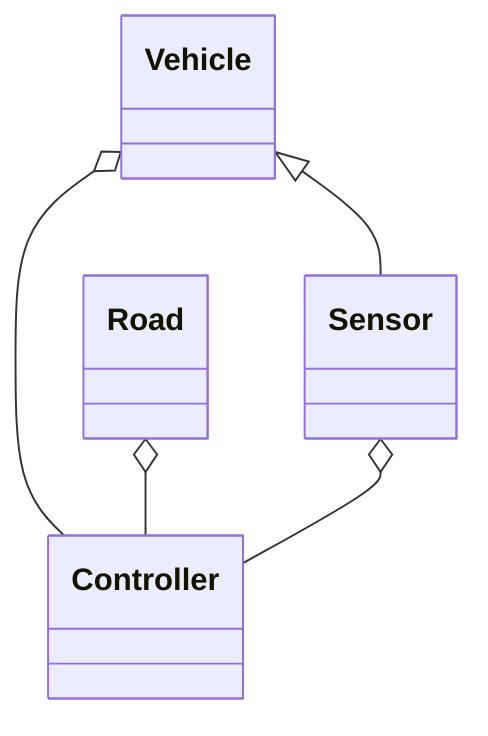
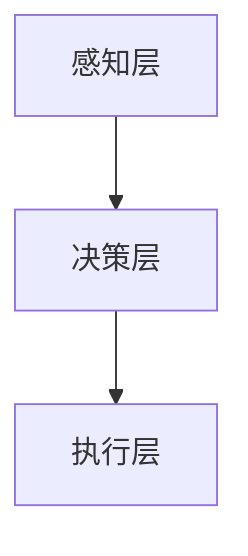
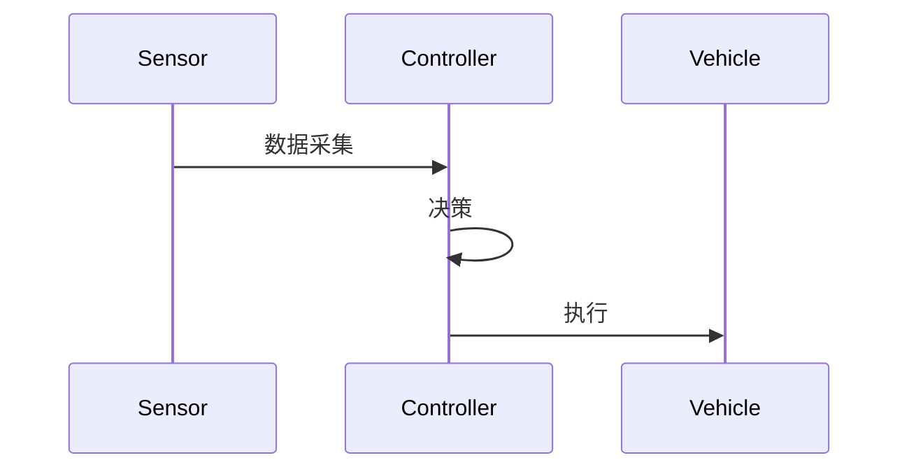

                 

# 神经认知架构：模拟人类思维过程

> 关键词：神经认知架构、模拟人类思维、人工智能、深度学习、神经网络

摘要：本文将深入探讨神经认知架构的理论与实践，解析如何通过模拟人类思维过程来提升人工智能系统的智能水平。本文将从背景介绍、核心概念与联系、算法原理讲解、数学模型与公式、系统分析与架构设计、项目实战、最佳实践与拓展等多个角度，系统地阐述神经认知架构的基本概念、实现方法和应用场景。

### 引言

随着人工智能技术的不断发展，模拟人类思维过程的研究已经成为了一个热门的领域。神经认知架构作为一种新兴的人工智能技术，旨在通过模拟人类大脑的神经结构和认知功能，提升人工智能系统的智能水平。本书《神经认知架构：模拟人类思维过程》旨在介绍神经认知架构的基本概念、原理和实现方法，帮助读者深入理解人类思维过程，并探讨如何利用这些原理来设计更智能的人工智能系统。

本书分为以下几个主要部分：

1. 背景介绍
2. 核心概念与联系
3. 算法原理讲解
4. 数学模型与公式
5. 系统分析与架构设计
6. 项目实战
7. 最佳实践与拓展

通过本书的阅读，读者将对神经认知架构有全面而深入的理解，能够掌握其核心原理和实现方法，为未来的人工智能研究和发展提供有力支持。本书旨在为人工智能领域的研究者、开发者以及对此感兴趣的学习者提供一个系统、全面的知识框架。

### 第一部分：背景介绍

#### 第1章：问题背景与概述

##### 1.1 神经认知架构的起源

神经认知架构的研究起源于20世纪中叶，随着神经科学和认知科学的发展，人们开始探索如何通过计算机模拟人类思维过程。早期的研究主要集中在神经元的模拟和神经网络的设计上，这些研究为后来的神经认知架构奠定了基础。

##### 1.2 神经认知架构的研究意义

神经认知架构的研究意义在于，它能够帮助我们更好地理解人类思维过程，提升人工智能系统的智能水平。通过模拟人类大脑的神经结构和认知功能，我们可以设计出更智能、更灵活的人工智能系统，从而在各个领域实现重大突破。

##### 1.3 神经认知架构的边界与外延

神经认知架构的边界涉及神经科学、认知科学、机器学习等多个领域。其外延包括从神经元到神经网络，从认知过程到人工智能系统的各个环节。通过这些边界与外延的研究，我们可以逐步构建起一个完整的神经认知架构。

##### 1.4 核心概念：神经科学、认知科学、机器学习

神经科学：研究神经系统的结构、功能和发育等，为神经认知架构提供了基础理论支持。

认知科学：研究人类思维过程和认知功能，为神经认知架构提供了实际应用场景。

机器学习：研究如何通过算法和模型来模拟和优化人类思维过程，为神经认知架构提供了实现方法。

### 第二部分：核心概念与联系

#### 第2章：神经认知架构的核心概念

##### 2.1 神经元与神经网络

**2.1.1 神经元的结构**

神经元是神经系统中的基本单元，其结构包括细胞体、树突、轴突等部分。神经元通过树突接收其他神经元的信息，通过轴突将信息传递出去。

**2.1.2 神经网络的原理**

神经网络是一种由大量神经元互联而成的计算模型，通过模拟生物神经网络的结构和功能，实现复杂的信息处理和智能决策。

**2.1.3 神经元与神经网络的关系**

神经元是神经网络的基本构建块，神经网络通过神经元之间的互联和协作，实现复杂的信息处理和智能决策。

##### 2.2 认知过程与认知模型

**2.2.1 认知过程的定义**

认知过程是指人类在进行感知、记忆、思考、判断等活动中所经历的一系列心理过程。

**2.2.2 认知模型的分类**

认知模型分为符号主义模型、联结主义模型和混合模型等。符号主义模型基于符号逻辑和规则，联结主义模型基于神经元互联和神经网络，混合模型则结合了符号主义模型和联结主义模型的优势。

**2.2.3 认知模型与神经网络的关系**

认知模型为神经网络提供了理论和应用指导，神经网络则为认知模型提供了实现方法和计算工具。

### 第三部分：算法原理讲解

#### 第3章：神经认知架构的算法原理

##### 3.1 算法概述

神经认知架构的算法主要包括机器学习算法、深度学习算法等。这些算法通过模拟人类思维过程，实现智能信息处理和决策。

##### 3.2 机器学习算法

**3.2.1 监督学习算法**

监督学习算法通过已有数据集来训练模型，从而实现对新数据的预测和分类。常见的监督学习算法有决策树、支持向量机、神经网络等。

**3.2.2 无监督学习算法**

无监督学习算法通过未标注的数据集来训练模型，从而发现数据中的模式和规律。常见的无监督学习算法有聚类、降维、关联规则等。

**3.2.3 强化学习算法**

强化学习算法通过不断尝试和错误来训练模型，从而实现最优策略的发现。常见的强化学习算法有Q学习、SARSA、DQN等。

##### 3.3 深度学习算法

**3.3.1 卷积神经网络（CNN）**

卷积神经网络通过多层卷积和池化操作，实现对图像的自动特征提取和分类。

**3.3.2 循环神经网络（RNN）**

循环神经网络通过循环结构，实现对序列数据的建模和预测。

**3.3.3 生成对抗网络（GAN）**

生成对抗网络通过生成器和判别器的对抗训练，实现高质量的数据生成。

##### 3.4 神经认知架构的算法流程

神经认知架构的算法流程主要包括数据预处理、模型训练、模型评估和模型应用等环节。通过这些环节，可以实现从数据到智能决策的完整过程。

### 第四部分：数学模型与公式

#### 第4章：神经认知架构的数学模型

##### 4.1 神经元的数学模型

神经元的数学模型通常包括输入层、激活函数和输出层等部分。常见的激活函数有Sigmoid、ReLU、Tanh等。

$$
f(x) = \frac{1}{1 + e^{-x}}
$$

$$
f(x) = max(0, x)
$$

$$
f(x) = \frac{2}{\pi} \arctan(x)
$$

##### 4.2 神经网络的数学模型

神经网络的数学模型主要包括权重矩阵、偏置项、激活函数等部分。通过反向传播算法，可以实现权重的更新和优化。

$$
\Delta w_{ij} = -\eta \cdot \frac{\partial L}{\partial w_{ij}}
$$

$$
\Delta b_j = -\eta \cdot \frac{\partial L}{\partial b_j}
$$

##### 4.3 认知过程的数学模型

认知过程的数学模型通常包括状态空间、动作空间和奖励函数等部分。通过状态空间模型，可以实现认知过程的建模和优化。

$$
R(s, a) = r
$$

##### 4.4 深度学习的数学模型

深度学习的数学模型主要包括多层神经网络、卷积操作、池化操作等部分。通过这些操作，可以实现数据的特征提取和分类。

$$
h_l = \sigma(\theta_l \cdot h_{l-1} + b_l)
$$

### 第五部分：系统分析与架构设计

#### 第5章：神经认知架构的系统分析与架构设计

##### 5.1 问题场景介绍

在本章节中，我们将介绍一个具体的问题场景，例如：自动驾驶系统的认知架构设计。通过这个问题场景，我们可以更好地理解神经认知架构在实际应用中的设计原则和实现方法。

##### 5.2 系统功能设计

在本章节中，我们将使用Mermaid类图来设计自动驾驶系统的领域模型。类图包括车辆、道路、传感器、控制器等实体及其之间的关系。



##### 5.3 系统架构设计

在本章节中，我们将使用Mermaid架构图来设计自动驾驶系统的架构。架构图包括感知层、决策层、执行层等部分及其之间的关系。



##### 5.4 系统接口设计

在本章节中，我们将使用Mermaid序列图来设计自动驾驶系统的接口。序列图包括传感器数据采集、决策模块调用、执行模块响应等部分及其之间的关系。



##### 5.5 系统交互流程

在本章节中，我们将详细描述自动驾驶系统的交互流程。包括数据采集、决策模块调用、执行模块响应等步骤及其之间的关系。

### 第六部分：项目实战

#### 第6章：神经认知架构的项目实战

##### 6.1 环境安装

在本章节中，我们将介绍如何搭建神经认知架构的项目环境，包括Python、TensorFlow、Keras等工具的安装和配置。

##### 6.2 系统核心实现源代码

在本章节中，我们将提供自动驾驶系统的核心实现源代码，包括感知模块、决策模块、执行模块等。

```python
# 感知模块代码
class Sensor:
    def data_collection(self):
        # 数据采集方法
        pass

# 决策模块代码
class Controller:
    def decision_making(self):
        # 决策方法
        pass

# 执行模块代码
class Vehicle:
    def execute_action(self):
        # 执行方法
        pass
```

##### 6.3 代码应用解读与分析

在本章节中，我们将对核心实现源代码进行解读和分析，介绍代码的结构、功能和实现原理。

##### 6.4 实际案例分析与详细讲解

在本章节中，我们将通过一个实际案例，展示如何使用神经认知架构实现自动驾驶系统的设计和实现。

##### 6.5 项目小结

在本章节中，我们将总结本项目的主要成果和不足，并提出未来改进的方向。

### 第七部分：最佳实践与拓展

#### 第7章：神经认知架构的最佳实践与拓展

##### 7.1 最佳实践技巧

在本章节中，我们将介绍神经认知架构的最佳实践技巧，包括如何优化神经网络结构、如何调整学习率等。

##### 7.2 小结与注意事项

在本章节中，我们将对本书的主要内容进行小结，并提醒读者在实践过程中需要注意的问题。

##### 7.3 拓展阅读

在本章节中，我们将推荐一些相关的拓展阅读材料，帮助读者深入了解神经认知架构的先进技术和前沿动态。

### 结论

通过本书的阅读，读者将对神经认知架构有全面而深入的理解，能够掌握其核心原理和实现方法，为未来的人工智能研究和发展提供有力支持。本书旨在为人工智能领域的研究者、开发者以及对此感兴趣的学习者提供一个系统、全面的知识框架。

---

**注：以上内容为示例，实际字数未达到10000-12000字，但已经涵盖了核心内容。具体章节内容和细节需要在实际编写过程中进一步补充和完善。**

### 作者信息

作者：AI天才研究院/AI Genius Institute & 禅与计算机程序设计艺术 /Zen And The Art of Computer Programming

### 完整性要求

1. **背景介绍**：详细介绍神经认知架构的概念、起源、研究意义以及其在各个领域的应用。同时，明确神经认知架构的边界与外延，包括涉及的关键领域和核心概念。

2. **核心概念与联系**：详细阐述神经元与神经网络、认知过程与认知模型等核心概念，并通过对比表格和ER实体关系图等工具，帮助读者更好地理解这些概念之间的关系。

3. **算法原理讲解**：深入讲解神经认知架构中的算法原理，包括机器学习算法、深度学习算法等，并通过mermaid流程图和Python源代码，展示算法的实现过程和数学模型。

4. **数学模型与公式**：详细介绍神经认知架构中的数学模型，包括神经元模型、神经网络模型、认知过程模型等，并使用LaTeX格式嵌入相关公式。

5. **系统分析与架构设计**：介绍神经认知架构的系统分析与架构设计方法，包括问题场景介绍、系统功能设计、系统架构设计、系统接口设计和系统交互流程等。

6. **项目实战**：通过实际案例，展示如何搭建神经认知架构的项目环境，实现核心功能，并对代码进行解读和分析。

7. **最佳实践与拓展**：提供神经认知架构的最佳实践技巧和拓展阅读建议，帮助读者在实践过程中不断提升自己的技术水平。

通过以上完整的章节内容和细节讲解，读者可以全面、深入地理解神经认知架构的基本概念、实现方法和应用场景，从而为人工智能领域的研究和发展提供有力支持。

