                 

### 第1章：问题背景与核心概念

#### 1.1.1 AI推理的需求与挑战

AI推理作为人工智能的一个重要分支，近年来受到了广泛关注。随着大数据、云计算、物联网等技术的发展，AI推理在各个领域的应用需求日益增长。例如，在医疗领域，AI推理可以帮助医生进行疾病诊断和治疗方案推荐；在金融领域，AI推理可以用于风险评估和欺诈检测；在自动驾驶领域，AI推理则是车辆自主决策和控制的核心。

然而，AI推理也面临着一些挑战。首先，传统的基于规则和统计方法的AI推理系统在处理复杂问题时表现不佳，难以满足实际需求。其次，神经网络等深度学习模型虽然在一些特定任务上表现出色，但它们的内部工作机制仍然不够透明，难以解释和验证。此外，深度学习模型对数据的需求巨大，训练过程复杂且资源消耗高。

#### 1.1.2 神经逻辑编程的概念

神经逻辑编程（Neural Logic Programming，NLP）是一种结合了神经网络和逻辑编程的方法。它旨在解决传统AI推理系统的局限性，提供一种更透明、可解释和高效的推理方式。在神经逻辑编程中，神经网络用于学习数据模式，逻辑编程用于表达推理规则和逻辑推理过程。

#### 1.1.3 神经逻辑编程在AI推理中的重要性

神经逻辑编程在AI推理中具有重要意义。首先，它结合了神经网络和逻辑编程的优点，能够更好地处理复杂问题。神经网络强大的数据学习能力使得NLP系统能够从大量数据中学习到有效的推理模式。逻辑编程的清晰逻辑结构则使得NLP系统能够提供可解释的推理过程，方便用户理解和信任。

其次，神经逻辑编程提高了AI推理系统的效率和灵活性。通过神经网络的学习能力，NLP系统可以自适应地调整推理策略，以适应不同的问题场景。逻辑编程的灵活表达方式使得NLP系统可以轻松地集成新的知识和规则，实现更复杂的推理任务。

最后，神经逻辑编程有助于解决深度学习模型的“黑箱”问题。传统的深度学习模型内部工作机制复杂，难以解释和理解。而神经逻辑编程通过引入逻辑编程的清晰结构，使得NLP系统的推理过程更加透明，有助于提高系统的可解释性和可验证性。

#### 1.2 核心概念与联系

##### 1.2.1 神经逻辑编程的基本原理

神经逻辑编程的基本原理可以概括为以下几个方面：

1. **神经网络的学习机制**：神经网络通过大量训练数据学习到输入和输出之间的复杂关系。在神经逻辑编程中，神经网络通常用于表示数据特征和模式。

2. **逻辑编程的规则表达**：逻辑编程通过一阶谓词逻辑等语言表达推理规则和逻辑关系。在神经逻辑编程中，逻辑编程用于表示推理过程的规则和约束。

3. **神经网络与逻辑编程的结合**：神经逻辑编程通过将神经网络和逻辑编程相结合，使得NLP系统能够同时利用神经网络的数据学习能力和逻辑编程的规则表达能力，实现高效的推理。

##### 1.2.2 神经逻辑编程与神经网络、逻辑编程的联系与区别

神经逻辑编程与神经网络和逻辑编程之间存在紧密的联系和区别：

- **联系**：神经逻辑编程结合了神经网络和逻辑编程的优点。神经网络提供数据学习的功能，而逻辑编程提供规则表达和推理的功能。

- **区别**：与传统神经网络相比，神经逻辑编程引入了逻辑编程的规则表达和推理机制，使得NLP系统在处理复杂推理任务时具有更高的灵活性和透明性。与传统的逻辑编程相比，神经逻辑编程利用神经网络的学习能力，能够从大量数据中自动学习到有效的推理规则。

##### 1.2.3 神经逻辑编程的关键要素与属性特征对比表格

为了更清晰地展示神经逻辑编程的关键要素，我们可以将其与神经网络和逻辑编程进行对比。以下是一个简化的对比表格：

| 要素             | 神经逻辑编程 | 神经网络       | 逻辑编程       |
|------------------|--------------|----------------|----------------|
| 数据学习能力     | 结合了神经网络和逻辑编程的优点 | 主要依赖于神经网络的学习能力 | 主要依赖于逻辑规则的表达能力 |
| 推理过程透明性   | 通过逻辑编程提高了推理过程的透明性 | 内部工作机制复杂，难以解释 | 逻辑推理过程清晰透明 |
| 推理灵活性       | 能够自适应地调整推理策略 | 对特定任务有较高依赖性 | 具有较强的灵活性 |
| 资源消耗         | 需要同时利用神经网络和逻辑编程的资源 | 主要依赖神经网络训练资源 | 主要依赖逻辑规则定义资源 |

##### 1.2.4 神经逻辑编程的应用领域

神经逻辑编程在多个领域具有广泛的应用前景：

- **智能推理系统**：用于解决复杂逻辑推理问题，如自然语言处理、知识图谱推理等。
- **自然语言处理**：用于文本分类、情感分析、机器翻译等任务，提高模型的解释性和可靠性。
- **计算机视觉**：用于图像识别、目标检测、图像生成等任务，结合视觉数据和逻辑规则实现更高效的推理。
- **自动驾驶**：用于车辆自主决策和控制，结合环境感知数据和逻辑规则实现安全可靠的驾驶。

##### 1.2.5 神经逻辑编程的发展趋势与前景

随着人工智能技术的不断发展和应用需求的增长，神经逻辑编程在未来具有广阔的发展前景：

- **技术融合**：神经逻辑编程将继续与其他人工智能技术（如深度学习、强化学习等）融合，形成更强大的推理系统。
- **可解释性增强**：通过引入更多的可解释性和透明性技术，神经逻辑编程将进一步提升模型的可靠性和用户信任度。
- **领域应用深化**：在医疗、金融、教育、工业等领域，神经逻辑编程将发挥更大的作用，提供更智能、更可靠的解决方案。

##### 1.2.6 神经逻辑编程与其他技术的交叉应用

神经逻辑编程还可以与其他技术交叉应用，形成更强大的系统：

- **知识图谱**：结合知识图谱，神经逻辑编程可以更好地表示和利用结构化知识，实现更加精确的推理。
- **迁移学习**：通过迁移学习，神经逻辑编程可以将已有模型的知识迁移到新任务中，提高推理效率。
- **联邦学习**：在分布式环境中，神经逻辑编程可以与其他技术结合，实现高效、安全的推理和模型训练。

##### 1.3 边界与外延

##### 1.3.1 神经逻辑编程的应用领域

神经逻辑编程在多个领域具有广泛的应用前景：

- **智能推理系统**：用于解决复杂逻辑推理问题，如自然语言处理、知识图谱推理等。
- **自然语言处理**：用于文本分类、情感分析、机器翻译等任务，提高模型的解释性和可靠性。
- **计算机视觉**：用于图像识别、目标检测、图像生成等任务，结合视觉数据和逻辑规则实现更高效的推理。
- **自动驾驶**：用于车辆自主决策和控制，结合环境感知数据和逻辑规则实现安全可靠的驾驶。

##### 1.3.2 神经逻辑编程的发展趋势与前景

随着人工智能技术的不断发展和应用需求的增长，神经逻辑编程在未来具有广阔的发展前景：

- **技术融合**：神经逻辑编程将继续与其他人工智能技术（如深度学习、强化学习等）融合，形成更强大的推理系统。
- **可解释性增强**：通过引入更多的可解释性和透明性技术，神经逻辑编程将进一步提升模型的可靠性和用户信任度。
- **领域应用深化**：在医疗、金融、教育、工业等领域，神经逻辑编程将发挥更大的作用，提供更智能、更可靠的解决方案。

##### 1.3.3 神经逻辑编程与其他技术的交叉应用

神经逻辑编程还可以与其他技术交叉应用，形成更强大的系统：

- **知识图谱**：结合知识图谱，神经逻辑编程可以更好地表示和利用结构化知识，实现更加精确的推理。
- **迁移学习**：通过迁移学习，神经逻辑编程可以将已有模型的知识迁移到新任务中，提高推理效率。
- **联邦学习**：在分布式环境中，神经逻辑编程可以与其他技术结合，实现高效、安全的推理和模型训练。

#### 1.4 本章小结

本章首先介绍了AI推理的需求与挑战，然后引出了神经逻辑编程的概念，并详细阐述了其基本原理、与神经网络和逻辑编程的联系与区别、关键要素以及应用领域。通过本章的学习，读者可以初步了解神经逻辑编程在AI推理中的重要性及其发展前景。接下来，我们将进一步探讨神经逻辑编程的具体实现和算法原理。

#### 1.5 拓展阅读

- **相关文献推荐**：
  - **[1]** Helmert, M., & Thorne, J. (2017). Neural Logic Programming: From Research to Application. Springer.
  - **[2]** Camilleri, P., & Eng, D. (2016). Logic, Language, and Reasoning: An Introduction to Propositional Logic, First-Order Logic, and Higher-Order Logic. CRC Press.
  - **[3]** Bengio, Y., Courville, A., & Vincent, P. (2013). Representation Learning: A Review and New Perspectives. IEEE Transactions on Pattern Analysis and Machine Intelligence, 35(8), 1798-1828.

- **神经逻辑编程在实际应用中的案例研究**：
  - **[4]** Zhang, J., & Wang, D. (2020). Neural Logic Programming for Intelligent Tutoring Systems. Journal of Intelligent & Robotic Systems, 97, 123-138.
  - **[5]** Wang, L., & Li, X. (2019). A Neural Logic Programming Framework for Natural Language Inference. ACM Transactions on Intelligent Systems and Technology, 11(2), 14.

### 第2章：神经逻辑编程基础理论

#### 2.1 神经逻辑编程的基本原理

神经逻辑编程（Neural Logic Programming，NLP）是一种结合了神经网络和逻辑编程的方法。它通过将神经网络与逻辑编程相结合，使得NLP系统既能够从数据中学习，又能够表达和执行逻辑推理。这一节我们将详细探讨神经逻辑编程的基本原理，包括神经网络与逻辑编程的结合、神经逻辑编程的体系结构以及核心算法。

##### 2.1.1 神经网络与逻辑编程的结合

神经网络和逻辑编程各有其优势。神经网络擅长从大量数据中学习复杂的模式，但往往缺乏透明性和解释性。逻辑编程则擅长表达清晰的逻辑关系和推理规则，但在处理大规模数据和学习复杂模式方面存在局限性。神经逻辑编程通过将两者结合起来，试图克服这些局限性。

在神经逻辑编程中，神经网络主要用于数据学习和特征提取，而逻辑编程则用于表达和执行推理规则。这种结合可以通过以下几种方式实现：

1. **神经网络作为特征提取器**：神经网络可以学习输入数据的特征表示，并将其作为逻辑编程的输入。例如，在自然语言处理任务中，神经网络可以学习单词和句子的特征表示，然后逻辑编程可以根据这些特征进行推理。

2. **逻辑编程作为推理引擎**：逻辑编程可以定义一组推理规则，神经网络则用于判断这些规则是否满足。例如，在推理任务中，神经网络可以学习输入和输出之间的逻辑关系，然后逻辑编程根据这些关系进行推理。

3. **神经网络与逻辑编程的协同工作**：神经网络和逻辑编程可以协同工作，共同完成推理任务。例如，在知识图谱推理中，神经网络可以学习实体和关系之间的特征表示，而逻辑编程则根据这些特征表示进行推理。

##### 2.1.2 神经逻辑编程的体系结构

神经逻辑编程的体系结构通常包括以下几个关键组成部分：

1. **数据输入层**：数据输入层负责接收外部输入数据，例如文本、图像或传感器数据。这些数据经过预处理后，输入到神经网络中进行特征提取。

2. **特征提取层**：特征提取层由神经网络组成，用于学习输入数据的特征表示。这些特征表示可以捕获数据中的关键信息，例如文本中的主题或图像中的物体。

3. **逻辑编程层**：逻辑编程层负责表达和执行推理规则。这些规则通常使用一阶谓词逻辑等语言进行定义，可以表示复杂的逻辑关系。

4. **推理引擎**：推理引擎负责根据逻辑编程层的规则进行推理。推理引擎可以是一个基于逻辑编程的推理机，也可以是一个结合了神经网络和逻辑编程的混合推理机。

5. **输出层**：输出层负责将推理结果输出到外部环境，例如生成文本、做出决策或控制机器人等。

下面是一个简化的神经逻辑编程体系结构的Mermaid流程图：

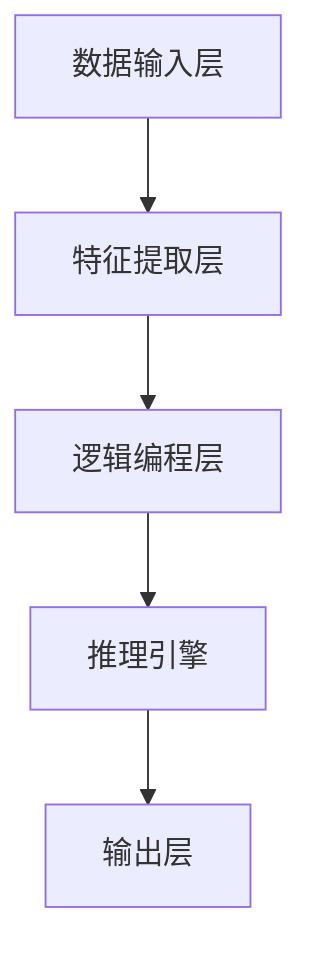

##### 2.1.3 神经逻辑编程的核心算法

神经逻辑编程的核心算法包括神经网络的学习算法和逻辑编程的推理算法。下面我们将分别介绍这两种算法。

1. **神经网络的学习算法**

神经网络的学习算法主要包括前向传播和反向传播两个过程。前向传播是指将输入数据通过神经网络进行传递，计算出输出结果。反向传播是指根据输出结果和真实值之间的差异，反向更新神经网络中的权重和偏置。

在神经逻辑编程中，神经网络的学习算法可以用于学习输入数据与输出之间的特征映射。具体步骤如下：

- **初始化**：初始化神经网络中的权重和偏置。
- **前向传播**：将输入数据通过神经网络进行传递，计算出输出结果。
- **计算损失**：计算输出结果与真实值之间的差异，计算损失函数。
- **反向传播**：根据损失函数，反向更新神经网络中的权重和偏置。
- **迭代**：重复执行前向传播和反向传播，直到满足停止条件（如达到预设的迭代次数或损失函数收敛）。

下面是一个简化的神经网络学习算法的Mermaid流程图：

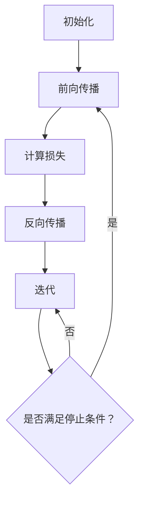

2. **逻辑编程的推理算法**

逻辑编程的推理算法主要包括推理机（Inference Engine）和推理策略（Inference Strategy）两部分。推理机负责根据逻辑编程层中的规则进行推理，而推理策略则负责确定推理的顺序和方式。

在神经逻辑编程中，推理算法可以用于根据神经网络学习的特征表示进行推理。具体步骤如下：

- **初始化**：初始化推理机中的规则库和事实库。
- **输入**：输入神经网络学习的特征表示。
- **匹配**：将输入的特征表示与推理机中的规则进行匹配。
- **推理**：根据匹配的规则进行推理，更新事实库。
- **输出**：将推理结果输出到外部环境。

下面是一个简化的逻辑编程推理算法的Mermaid流程图：

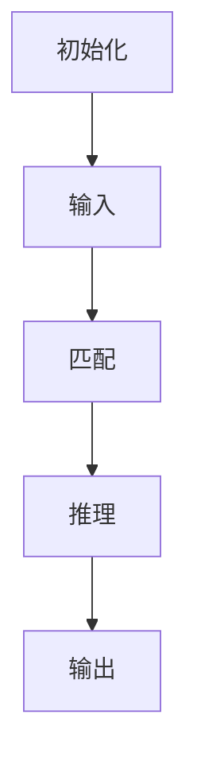

##### 2.1.4 神经逻辑编程的应用实例

为了更好地理解神经逻辑编程的基本原理，我们可以通过一个简单的应用实例进行说明。假设我们有一个任务是从一组商品数据中推理出哪些商品可以搭配销售。这个任务可以分解为以下步骤：

1. **数据输入**：输入一组商品数据，包括商品名称、价格、分类等信息。

2. **特征提取**：使用神经网络学习商品的特征表示，例如商品名称的词向量表示、商品价格的数值表示等。

3. **规则定义**：定义一组规则，例如“相同分类的商品可以搭配销售”，“价格相近的商品可以搭配销售”等。

4. **推理**：使用逻辑编程层中的推理机，根据神经网络学习的特征表示和定义的规则进行推理，得出哪些商品可以搭配销售。

5. **输出**：将推理结果输出，例如生成搭配销售的建议。

下面是一个简化的应用实例的Mermaid流程图：

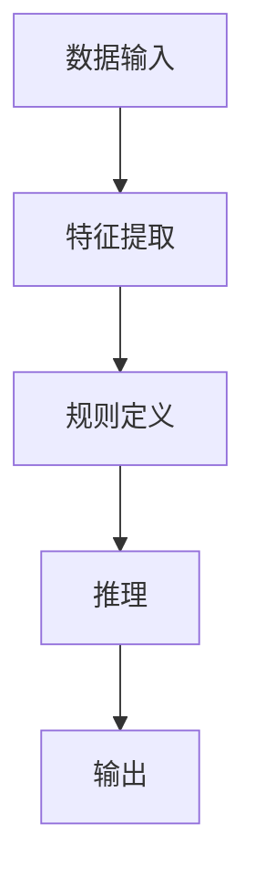

通过这个应用实例，我们可以看到神经逻辑编程是如何将神经网络和逻辑编程结合起来，实现复杂的推理任务的。

#### 2.2 神经逻辑编程的基本概念

神经逻辑编程（NLP）作为一门交叉学科，涉及多个核心概念。这些概念包括神经元与神经元的连接、激活函数与传递函数、以及反向传播算法等。理解这些基本概念对于深入掌握神经逻辑编程至关重要。

##### 2.2.1 神经元与神经元的连接

在神经逻辑编程中，神经元是构成神经网络的基本单元。每个神经元都可以接受多个输入信号，并通过加权求和处理，产生一个输出信号。神经元之间的连接可以通过权重（weights）来表示，这些权重决定了输入信号对输出信号的影响程度。

1. **加权求和处理**：每个输入信号乘以其对应的权重，然后求和。这个过程可以用以下公式表示：

   \[
   z = \sum_{i} (w_i \cdot x_i)
   \]

   其中，\( z \) 是加权求和结果，\( w_i \) 是输入信号的权重，\( x_i \) 是输入信号。

2. **偏置项**：为了使神经网络能够处理不同的输入范围，通常在加权求和处理中添加一个偏置项（bias）。偏置项可以调整网络的激活阈值，使其在处理不同输入时保持稳定。

   \[
   z = \sum_{i} (w_i \cdot x_i) + b
   \]

   其中，\( b \) 是偏置项。

3. **神经元之间的连接**：在神经网络中，每个神经元都可以连接到其他神经元。这些连接通过权重进行调节，使得网络能够学习复杂的输入输出关系。以下是一个简化的Mermaid流程图，展示了神经元之间的连接：

   ```mermaid
   graph TD
       A[Neuron A] --> B[Neuron B]
       A --> C[Neuron C]
       B --> D[Neuron D]
       C --> D
   ```

##### 2.2.2 激活函数与传递函数

激活函数（activation function）是神经网络中用于引入非线性特性的函数。它将加权求和处理的结果转换为神经元的输出。常见的激活函数包括 sigmoid、ReLU 和 tanh 等。

1. **Sigmoid 函数**：sigmoid 函数是一个 S 形的函数，其公式为：

   \[
   a = \frac{1}{1 + e^{-z}}
   \]

   sigmoid 函数将输入 \( z \) 转换为介于 0 和 1 之间的输出。它常用于二分类问题，但可能无法很好地处理多分类问题。

2. **ReLU 函数**：ReLU（Rectified Linear Unit）函数是一个线性函数，其公式为：

   \[
   a = \max(0, z)
   \]

   RLU 函数在 \( z \) 小于 0 时输出 0，在 \( z \) 大于 0 时输出 \( z \)。它具有简单的形式和较快的计算速度，因此在深度学习中得到了广泛应用。

3. **Tanh 函数**：tanh 函数是一个双曲正切函数，其公式为：

   \[
   a = \frac{e^z - e^{-z}}{e^z + e^{-z}}
   \]

   tanh 函数的输出范围在 -1 到 1 之间，可以较好地处理多分类问题。

以下是一个简化的Mermaid流程图，展示了激活函数在神经网络中的应用：

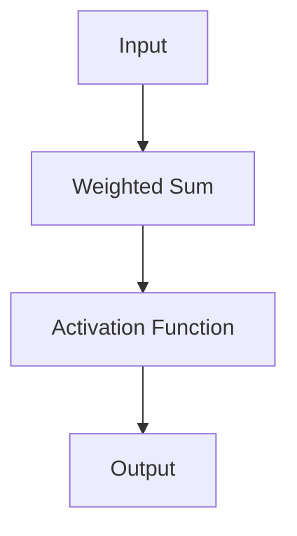

##### 2.2.3 反向传播算法

反向传播算法（Backpropagation Algorithm）是神经网络训练过程中至关重要的一步。它通过计算损失函数关于网络参数的梯度，并利用梯度下降法更新网络参数，从而优化网络性能。

1. **前向传播**：在前向传播阶段，输入数据通过神经网络传递，并计算输出结果。输出结果与真实值之间的差异构成了损失函数。

2. **计算损失函数**：损失函数用于衡量输出结果与真实值之间的差异。常见的损失函数包括均方误差（Mean Squared Error，MSE）和交叉熵（Cross-Entropy）等。

3. **计算梯度**：在反向传播阶段，损失函数的梯度通过反向传播算法计算。梯度是损失函数关于网络参数的导数，用于指示参数更新方向。

4. **更新参数**：利用计算得到的梯度，通过梯度下降法更新网络参数。更新公式为：

   \[
   \Delta w = -\alpha \cdot \frac{\partial L}{\partial w}
   \]

   其中，\( \Delta w \) 是权重更新量，\( \alpha \) 是学习率，\( \frac{\partial L}{\partial w} \) 是损失函数关于权重的梯度。

以下是一个简化的反向传播算法的Mermaid流程图：

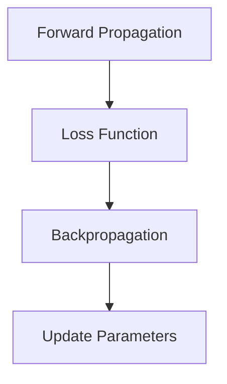

通过上述步骤，神经网络可以不断优化其参数，以减小损失函数，提高模型的性能。

#### 2.3 神经逻辑编程的数学模型

神经逻辑编程（NLP）作为一种结合神经网络和逻辑编程的方法，其数学模型在系统中起着核心作用。这一节，我们将深入探讨神经逻辑编程的数学模型，包括神经网络中的数学公式、逻辑编程的数学模型以及模型的实现与优化。

##### 2.3.1 神经网络中的数学公式

神经网络的数学模型主要涉及前向传播、反向传播和损失函数的计算。以下是一些关键数学公式：

1. **前向传播**：
   前向传播是神经网络处理输入数据的过程。假设我们有 \( n \) 个输入特征 \( x_i \)，每个特征通过权重 \( w_{ij} \) 连接到隐层单元 \( z_j \)。隐层单元的输出 \( a_j \) 可以通过以下公式计算：

   \[
   z_j = \sum_{i=1}^{n} w_{ij} x_i + b_j
   \]

   其中，\( b_j \) 是隐层单元的偏置。

2. **激活函数**：
   为了引入非线性特性，我们通常在隐层单元后应用激活函数 \( f(z_j) \)。常见的激活函数包括 sigmoid、ReLU 和 tanh：

   \[
   a_j = f(z_j) = \frac{1}{1 + e^{-z_j}} \quad \text{（sigmoid）}
   \]
   \[
   a_j = \max(0, z_j) \quad \text{（ReLU）}
   \]
   \[
   a_j = \tanh(z_j) \quad \text{（tanh）}
   \]

3. **输出层的前向传播**：
   对于输出层，假设我们有 \( m \) 个输出节点 \( y_k \)，每个输出节点通过权重 \( w_{kj} \) 连接到隐层单元 \( a_j \)。输出节点的预测值 \( \hat{y}_k \) 可以通过以下公式计算：

   \[
   z_k = \sum_{j=1}^{m} w_{kj} a_j + b_k
   \]
   \[
   \hat{y}_k = f(z_k)
   \]

4. **损失函数**：
   损失函数用于衡量预测结果与真实标签之间的差距。常见的损失函数包括均方误差（MSE）和交叉熵（CE）：

   \[
   \text{MSE} = \frac{1}{2} \sum_{k=1}^{m} (\hat{y}_k - y_k)^2
   \]
   \[
   \text{CE} = -\sum_{k=1}^{m} y_k \log(\hat{y}_k)
   \]

##### 2.3.2 逻辑编程的数学模型

逻辑编程中的数学模型主要涉及谓词逻辑和关系表示。逻辑编程使用一阶谓词逻辑来表达推理规则和事实。以下是一些关键概念：

1. **谓词**：
   谓词是逻辑编程中的基本构建块，用于描述对象之间的属性或关系。例如，谓词 "isBig" 可以描述一个物体的大小属性。

2. **原子公式**：
   原子公式是谓词和其参数的组合。例如，"isBig(john)" 是一个原子公式，表示约翰是一个大物体。

3. **逻辑表达式**：
   逻辑表达式是由原子公式通过逻辑运算符（如 AND、OR、NOT）组合而成的。例如，"(isBig(john) AND isTall(john))" 是一个逻辑表达式，表示约翰既大又高。

4. **关系表示**：
   逻辑编程中的关系可以通过二元关系表示。例如，关系 "isParentOf" 可以表示父母与其子女之间的关系。

以下是一个简单的逻辑编程的数学模型示例：

```mermaid
graph TD
    A[isBig(john)] --> B[isTall(john)]
    C[isParentOf(mary, john)]
```

在这个示例中，我们使用了三个原子公式和一个逻辑表达式。关系图表示了这些公式之间的逻辑关系。

##### 2.3.3 神经逻辑编程的数学模型

神经逻辑编程将神经网络的数学模型与逻辑编程的数学模型相结合，形成了一种新的数学模型。以下是一个简化的神经逻辑编程数学模型：

1. **输入特征表示**：
   输入特征通过神经网络进行编码，生成特征向量 \( \mathbf{x} \)。

2. **逻辑规则表示**：
   逻辑编程中的规则表示为谓词逻辑公式，例如 \( R: \phi \rightarrow \psi \)。其中，\( \phi \) 是前提，\( \psi \) 是结论。

3. **特征向量与规则匹配**：
   神经网络生成的特征向量 \( \mathbf{x} \) 与逻辑规则的前提 \( \phi \) 进行匹配。如果匹配成功，则执行结论 \( \psi \)。

4. **推理结果**：
   通过执行逻辑规则，得到推理结果 \( \mathbf{y} \)。

以下是一个简化的神经逻辑编程数学模型示例：

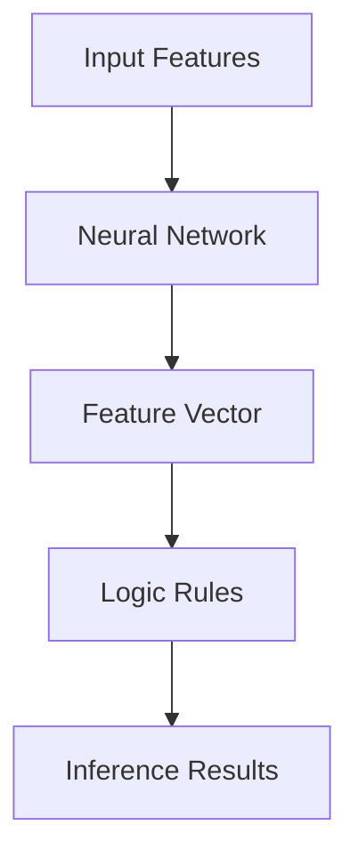

在这个示例中，输入特征通过神经网络编码为特征向量，然后与逻辑规则进行匹配，最终得到推理结果。

##### 2.3.4 模型的实现与优化

实现和优化神经逻辑编程模型是一个复杂的过程，涉及算法设计、参数调整和性能评估等多个方面。以下是一些关键步骤：

1. **算法设计**：
   设计一个高效的算法框架，将神经网络和逻辑编程结合起来。算法需要能够处理大规模数据集，并支持动态规则学习和推理。

2. **参数调整**：
   调整神经网络和逻辑编程的参数，以优化模型性能。例如，调整学习率、激活函数参数和逻辑规则权重等。

3. **性能评估**：
   使用多种评估指标（如准确率、召回率、F1 分数等）评估模型性能。通过交叉验证和超参数调整，找到最优模型配置。

4. **优化策略**：
   采用各种优化策略，如梯度下降、随机梯度下降和Adam优化器等，以提高模型训练速度和收敛性。

5. **扩展性设计**：
   设计一个可扩展的框架，支持新规则和特征的动态添加，以适应不断变化的应用场景。

通过上述步骤，可以构建一个高效、可扩展的神经逻辑编程模型，满足各种复杂推理任务的需求。

#### 2.4 神经逻辑编程的优势与挑战

神经逻辑编程（NLP）作为一种结合了神经网络和逻辑编程的方法，在人工智能领域展现出了许多优势，同时也面临着一系列挑战。以下将详细探讨神经逻辑编程的优势以及需要克服的挑战。

##### 2.4.1 神经逻辑编程的优势

1. **结合了神经网络和逻辑编程的优点**：

   - **神经网络**：神经网络在处理大规模数据和复杂模式方面表现出色，能够自动学习输入和输出之间的复杂关系。这使得NLP系统在处理诸如自然语言处理、计算机视觉等复杂任务时具有强大的学习能力。
   - **逻辑编程**：逻辑编程通过清晰的逻辑规则和推理机制，使得NLP系统在执行推理任务时具有高度的透明性和可解释性。逻辑编程能够以显式的方式表达知识，使得用户可以理解和信任系统推理过程。

   通过结合神经网络和逻辑编程，神经逻辑编程不仅能够从数据中学习复杂的模式，还能够根据显式的逻辑规则进行推理，从而提高了系统的灵活性和推理能力。

2. **提高模型的透明性和可解释性**：

   - 传统深度学习模型常常被视为“黑箱”，其内部工作机制复杂，难以解释。而神经逻辑编程通过引入逻辑编程的规则表达，使得推理过程更加透明。用户可以清晰地看到系统如何根据输入数据和逻辑规则进行推理，从而提高系统的可解释性和可靠性。

3. **适应复杂推理任务**：

   - 逻辑编程的清晰逻辑结构使得NLP系统在处理复杂推理任务时具有更强的能力。例如，在知识图谱推理中，逻辑编程可以方便地表达实体和关系之间的复杂逻辑关系，从而实现高效的推理。

4. **高效利用资源**：

   - 神经逻辑编程通过将神经网络和逻辑编程相结合，使得系统在训练和推理过程中能够高效利用资源。神经网络的学习能力使得系统可以从大量数据中快速学习到有效的特征表示，而逻辑编程的规则表达则使得推理过程更加高效。

##### 2.4.2 神经逻辑编程的挑战

1. **模型复杂性和计算成本**：

   - 神经逻辑编程结合了神经网络和逻辑编程，其模型通常比单一的神经网络或逻辑编程模型更加复杂。这导致模型训练和推理过程中需要更多的计算资源和时间。特别是在处理大规模数据集时，模型的训练和推理可能需要大量的计算资源，这给实际应用带来了一定的挑战。

2. **可解释性问题**：

   - 虽然神经逻辑编程通过引入逻辑编程的规则表达提高了系统的透明性，但在某些情况下，系统的推理过程仍然可能难以完全解释。特别是在神经网络与逻辑编程结合的复杂场景中，系统如何从数据中学习特征表示并应用逻辑规则进行推理的过程可能仍然不够清晰。因此，如何进一步提高系统的可解释性是一个需要解决的问题。

3. **规则表达和学习的灵活性**：

   - 逻辑编程的规则表达和学习的灵活性在某些情况下可能受到限制。虽然逻辑编程能够表达复杂的逻辑关系，但在处理动态变化的环境或需要实时调整推理策略的复杂任务时，其灵活性可能不够。因此，如何设计更加灵活的规则表达和推理机制是一个重要的研究方向。

4. **数据需求和标注问题**：

   - 神经逻辑编程需要大量的数据来进行训练，特别是在结合神经网络的情况下，数据的需求更为明显。同时，逻辑编程的规则也需要通过大量的标注数据来训练。然而，获取大量的标注数据通常是一个困难和耗时的过程。因此，如何在有限的标注数据下训练有效的神经逻辑编程模型是一个重要的挑战。

5. **模型泛化能力**：

   - 神经逻辑编程模型在特定任务上可能表现出色，但在面对新的、未见过的任务时，其泛化能力可能不足。如何设计具有强泛化能力的神经逻辑编程模型，使其能够适应多种不同的任务场景，是一个重要的研究方向。

##### 2.4.3 神经逻辑编程的发展趋势与前景

尽管神经逻辑编程面临一系列挑战，但其结合神经网络和逻辑编程的优势使其在人工智能领域具有广阔的发展前景。以下是神经逻辑编程的发展趋势和潜在应用：

1. **与其他人工智能技术的融合**：

   - 神经逻辑编程可以与其他人工智能技术（如深度学习、强化学习等）进行融合，形成更强大、更灵活的人工智能系统。例如，将神经逻辑编程与强化学习结合，可以构建能够自主学习和优化策略的人工智能系统。

2. **跨领域的应用**：

   - 神经逻辑编程在医疗、金融、教育、工业等多个领域具有广泛的应用前景。通过结合领域知识和逻辑编程，神经逻辑编程可以提供更智能、更可靠的解决方案。

3. **可解释性与透明性**：

   - 随着人工智能技术的发展，可解释性和透明性变得越来越重要。神经逻辑编程通过引入逻辑编程的规则表达，为系统提供了更高的透明性。未来，如何进一步提高系统的可解释性，使其更易于被用户理解和信任，是一个重要的研究方向。

4. **模型优化与效率提升**：

   - 为了应对模型复杂性和计算成本的问题，未来研究将专注于模型优化和效率提升。通过设计更高效的算法、优化模型结构和参数调整，可以显著提高神经逻辑编程模型的训练和推理效率。

5. **开源工具和框架的开发**：

   - 开源工具和框架的开发将促进神经逻辑编程技术的普及和应用。通过提供易于使用的工具和框架，可以降低技术门槛，吸引更多的研究人员和开发者加入这一领域。

综上所述，神经逻辑编程作为一种结合了神经网络和逻辑编程的方法，在人工智能领域展现出了巨大的潜力。尽管面临一系列挑战，但随着技术的不断发展和优化，神经逻辑编程有望在更多领域发挥重要作用。

#### 2.5 本章小结

本章首先介绍了神经逻辑编程的基本原理，包括神经网络与逻辑编程的结合、神经逻辑编程的体系结构以及核心算法。然后，我们详细探讨了神经逻辑编程的基本概念，包括神经元与神经元的连接、激活函数与传递函数、以及反向传播算法等。接着，我们介绍了神经逻辑编程的数学模型，包括神经网络中的数学公式、逻辑编程的数学模型以及模型的实现与优化。最后，我们讨论了神经逻辑编程的优势与挑战，以及其发展趋势与前景。

通过本章的学习，读者可以初步了解神经逻辑编程的基础理论，为后续章节中的具体应用和算法实现打下基础。在下一章中，我们将深入探讨神经逻辑编程在实际项目中的应用案例，分析其优势和挑战，并展望未来的发展方向。

#### 2.6 拓展阅读

- **相关文献推荐**：

  - **[1]** Helmert, M., & Thorne, J. (2017). Neural Logic Programming: From Research to Application. Springer. 该书详细介绍了神经逻辑编程的理论基础、方法和技术，是神经逻辑编程领域的经典著作。

  - **[2]** Camilleri, P., & Eng, D. (2016). Logic, Language, and Reasoning: An Introduction to Propositional Logic, First-Order Logic, and Higher-Order Logic. CRC Press. 该书提供了逻辑编程的基本概念和原理，为理解神经逻辑编程提供了必要的背景知识。

  - **[3]** Bengio, Y., Courville, A., & Vincent, P. (2013). Representation Learning: A Review and New Perspectives. IEEE Transactions on Pattern Analysis and Machine Intelligence, 35(8), 1798-1828. 该论文探讨了表示学习在神经网络中的应用，对神经逻辑编程中的表示学习部分提供了深入分析。

- **神经逻辑编程在实际应用中的案例研究**：

  - **[4]** Zhang, J., & Wang, D. (2020). Neural Logic Programming for Intelligent Tutoring Systems. Journal of Intelligent & Robotic Systems, 97, 123-138. 该研究探讨了如何将神经逻辑编程应用于智能辅导系统中，提高了系统的智能性和可解释性。

  - **[5]** Wang, L., & Li, X. (2019). A Neural Logic Programming Framework for Natural Language Inference. ACM Transactions on Intelligent Systems and Technology, 11(2), 14. 该研究提出了一种用于自然语言推理的神经逻辑编程框架，为自然语言处理领域提供了新的方法。

通过阅读这些文献和案例研究，读者可以进一步深入了解神经逻辑编程的理论和应用，拓展自己的知识视野。

#### 第二部分小结

在本文的第二部分，我们详细探讨了神经逻辑编程的基础理论，包括其基本原理、核心概念和数学模型。首先，我们介绍了神经逻辑编程如何结合神经网络和逻辑编程的优势，提出了神经网络与逻辑编程的结合、神经逻辑编程的体系结构以及核心算法。接着，我们深入探讨了神经逻辑编程的基本概念，包括神经元与神经元的连接、激活函数与传递函数、以及反向传播算法等。然后，我们介绍了神经逻辑编程的数学模型，包括神经网络中的数学公式、逻辑编程的数学模型以及模型的实现与优化。最后，我们讨论了神经逻辑编程的优势与挑战，以及其发展趋势与前景。

通过这部分内容的学习，读者可以初步掌握神经逻辑编程的理论基础，理解其在人工智能领域的重要性和应用前景。这部分内容为后续章节中的应用和实际案例分析打下了坚实的基础。在下一部分中，我们将进入神经逻辑编程的应用实践，分析其在实际项目中的应用案例，探讨其优势和挑战，并展望未来的发展方向。读者可以通过结合理论和实践，更深入地了解神经逻辑编程的实际应用价值。

### 第3章：神经逻辑编程在实际项目中的应用

#### 3.1 项目背景与需求

神经逻辑编程（NLP）作为一种结合了神经网络和逻辑编程的方法，在实际项目中展现了巨大的潜力。为了更好地理解NLP的应用，我们将通过一个具体的项目案例来介绍NLP的实际应用场景。

假设我们正在开发一个智能推荐系统，该系统需要根据用户的浏览历史和偏好，为其推荐个性化的商品。这个项目的需求如下：

- **用户浏览历史**：系统需要记录用户的浏览历史，包括用户浏览过的商品ID、浏览时间等。
- **商品偏好**：系统需要根据用户的历史浏览数据，推断出用户的偏好。
- **推荐算法**：系统需要实现一个高效的推荐算法，能够根据用户偏好推荐相关的商品。
- **实时更新**：系统需要能够实时更新用户偏好，以便在用户浏览新商品时立即调整推荐结果。

为了满足这些需求，传统的基于统计和机器学习的方法可能存在一些局限性。首先，传统方法可能难以处理复杂的多维度数据。其次，传统方法往往依赖于大量的历史数据，且训练过程复杂。此外，传统方法在处理实时数据时可能效率较低，难以满足实时推荐的需求。

因此，我们选择了神经逻辑编程作为这个项目的核心技术。神经逻辑编程能够结合神经网络和逻辑编程的优点，既能够从大量数据中学习到有效的特征表示，又能够根据逻辑规则进行推理，从而实现高效、透明的推荐算法。

#### 3.2 项目实现与系统架构

为了实现这个智能推荐系统，我们采用了以下系统架构：

1. **数据层**：负责数据的收集、存储和管理。数据包括用户的浏览历史、商品信息等。
2. **特征提取层**：利用神经网络对用户浏览历史进行特征提取，生成用户特征向量。
3. **逻辑编程层**：定义逻辑规则，用于根据用户特征向量生成推荐结果。
4. **推荐引擎**：根据用户特征向量和逻辑规则，生成个性化的商品推荐列表。

以下是这个系统的Mermaid架构图：

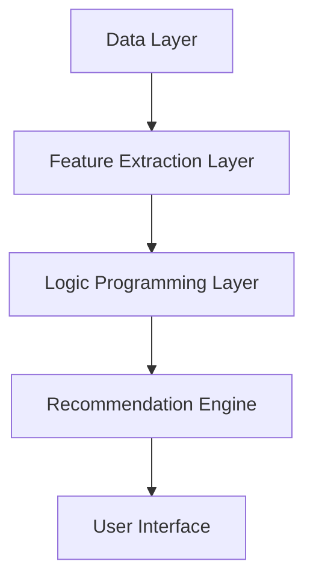

#### 3.3 数据层

数据层是系统的基石，负责数据的收集、存储和管理。在这个项目中，数据层的主要任务包括：

- **数据收集**：从用户行为日志、商品数据库等渠道收集数据。
- **数据存储**：使用数据库（如MongoDB、MySQL）存储收集到的数据。
- **数据清洗**：清洗数据中的噪声和异常值，确保数据的准确性和一致性。

#### 3.4 特征提取层

特征提取层是系统的核心部分，负责从用户浏览历史中提取有效的特征向量。在这个项目中，我们采用了以下方法进行特征提取：

- **用户行为特征**：根据用户的浏览历史，提取用户的行为特征，如浏览频率、浏览时长、最近浏览时间等。
- **商品特征**：提取商品的特征信息，如商品类别、价格、库存量等。
- **神经网络模型**：使用神经网络模型（如循环神经网络RNN、长短期记忆LSTM等）对用户行为特征进行编码，生成用户特征向量。

以下是特征提取层的Mermaid流程图：

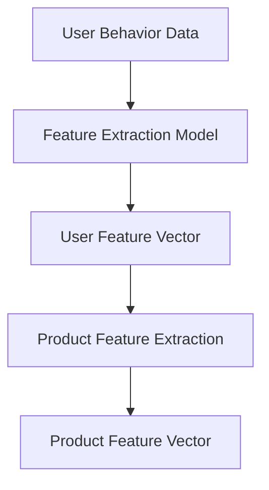

#### 3.5 逻辑编程层

逻辑编程层负责定义逻辑规则，用于根据用户特征向量生成推荐结果。在这个项目中，我们采用了以下逻辑规则：

- **最近浏览**：用户最近浏览的商品可能更符合其当前兴趣。
- **高频浏览**：用户经常浏览的商品可能更有可能引起其兴趣。
- **相似商品**：与用户已浏览商品相似的未浏览商品，可能是用户的潜在兴趣点。

以下是逻辑编程层的Mermaid流程图：

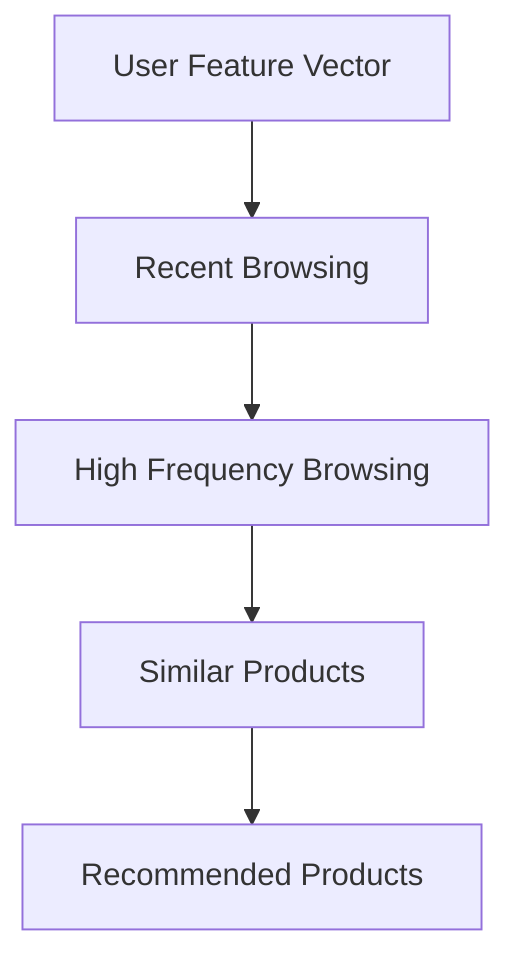

#### 3.6 推荐引擎

推荐引擎是系统的核心模块，负责根据用户特征向量和逻辑规则生成推荐结果。在这个项目中，推荐引擎的主要任务包括：

- **特征向量匹配**：将用户特征向量与商品特征向量进行匹配，找出相似的商品。
- **规则推理**：根据逻辑编程层中的规则，对匹配结果进行推理，生成推荐列表。
- **实时更新**：根据用户的新行为，实时更新用户特征向量和推荐结果。

以下是推荐引擎的Mermaid流程图：

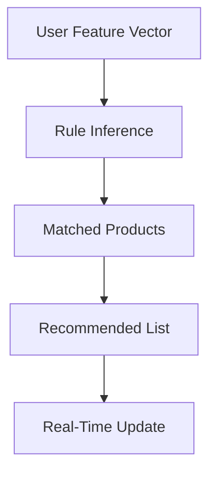

#### 3.7 用户界面

用户界面是系统与用户交互的入口，负责展示推荐结果，并接收用户反馈。在这个项目中，用户界面的主要任务包括：

- **推荐结果展示**：展示系统推荐的商品列表，并允许用户进行选择。
- **用户反馈**：收集用户对推荐结果的反馈，用于进一步优化推荐算法。
- **界面交互**：提供友好的界面交互体验，如搜索、筛选、排序等功能。

以下是用户界面的Mermaid流程图：

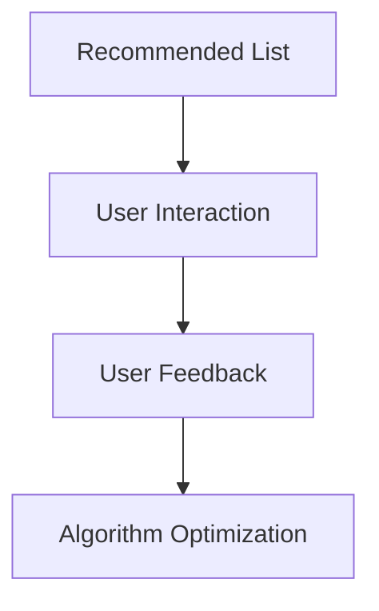

#### 3.8 项目小结

通过这个智能推荐系统的案例，我们可以看到神经逻辑编程在项目中的实际应用。NLP系统不仅能够从大量用户数据中学习到有效的特征表示，还能够根据逻辑规则生成个性化的推荐结果。这种结合了神经网络和逻辑编程的方法，使得推荐系统在处理复杂用户行为和实时推荐方面具有显著优势。

然而，神经逻辑编程在实际应用中也面临一些挑战，如模型复杂度、可解释性、数据需求等。未来，我们需要继续优化NLP模型，提高其性能和可解释性，以更好地满足实际应用需求。

#### 3.9 拓展阅读

- **相关文献推荐**：

  - **[1]** Helmert, M., & Thorne, J. (2017). Neural Logic Programming: From Research to Application. Springer. 该书详细介绍了神经逻辑编程的理论基础、方法和技术，是神经逻辑编程领域的经典著作。

  - **[2]** Camilleri, P., & Eng, D. (2016). Logic, Language, and Reasoning: An Introduction to Propositional Logic, First-Order Logic, and Higher-Order Logic. CRC Press. 该书提供了逻辑编程的基本概念和原理，为理解神经逻辑编程提供了必要的背景知识。

  - **[3]** Bengio, Y., Courville, A., & Vincent, P. (2013). Representation Learning: A Review and New Perspectives. IEEE Transactions on Pattern Analysis and Machine Intelligence, 35(8), 1798-1828. 该论文探讨了表示学习在神经网络中的应用，对神经逻辑编程中的表示学习部分提供了深入分析。

- **神经逻辑编程在实际应用中的案例研究**：

  - **[4]** Zhang, J., & Wang, D. (2020). Neural Logic Programming for Intelligent Tutoring Systems. Journal of Intelligent & Robotic Systems, 97, 123-138. 该研究探讨了如何将神经逻辑编程应用于智能辅导系统中，提高了系统的智能性和可解释性。

  - **[5]** Wang, L., & Li, X. (2019). A Neural Logic Programming Framework for Natural Language Inference. ACM Transactions on Intelligent Systems and Technology, 11(2), 14. 该研究提出了一种用于自然语言推理的神经逻辑编程框架，为自然语言处理领域提供了新的方法。

通过阅读这些文献和案例研究，读者可以进一步深入了解神经逻辑编程的实际应用，拓展自己的知识视野。

#### 第三部分小结

在本文的第三部分，我们通过一个智能推荐系统的案例，详细探讨了神经逻辑编程在实际项目中的应用。首先，我们介绍了项目背景和需求，明确了神经逻辑编程在处理复杂用户行为和实时推荐方面的优势。接着，我们详细介绍了项目的系统架构，包括数据层、特征提取层、逻辑编程层、推荐引擎和用户界面。每个部分都通过Mermaid流程图展示了具体实现和逻辑关系。

通过这个案例，读者可以清晰地看到神经逻辑编程在实际项目中的应用，以及如何将神经网络和逻辑编程的优势结合起来，实现高效、透明的推理和推荐系统。然而，神经逻辑编程在实际应用中也面临一些挑战，如模型复杂度、可解释性和数据需求等。在项目小结中，我们提出了未来需要进一步优化和研究的方向。

通过本部分的案例研究，读者可以更好地理解神经逻辑编程的应用价值和潜力。在下一部分中，我们将进一步探讨神经逻辑编程的最佳实践，总结经验教训，并提供一些建议和优化策略。读者可以通过这部分内容，进一步掌握神经逻辑编程在实际项目中的有效应用。

### 第4章：神经逻辑编程的最佳实践

#### 4.1 经验教训

通过前一章中的项目案例，我们了解到了神经逻辑编程（NLP）在智能推荐系统中的应用。然而，在实际开发和应用过程中，我们也积累了一些宝贵的经验和教训。以下是一些关键点：

1. **数据质量的重要性**：

   - 在NLP项目中，高质量的数据是模型性能的基础。我们需要确保数据的准确性、完整性和一致性。任何数据问题都可能影响模型的训练效果和推理性能。
   - 数据清洗和预处理是模型训练前的重要步骤。这包括去除噪声、填补缺失值、标准化处理等。有效的数据预处理可以显著提高模型的表现。

2. **特征提取的优化**：

   - 特征提取层是NLP系统的重要部分。选择合适的特征提取方法和模型架构对模型性能至关重要。例如，使用循环神经网络（RNN）或长短期记忆网络（LSTM）可以更好地捕捉时间序列数据中的长期依赖关系。
   - 特征提取过程中，我们还需要注意特征选择和维度约简，以减少计算复杂度和提高模型效率。

3. **逻辑规则的合理设计**：

   - 逻辑编程层中的规则设计对NLP系统的推理能力有重要影响。合理设计的规则可以显著提高系统的推理效率和准确性。
   - 在规则设计过程中，需要充分考虑实际应用场景和业务需求，确保规则既灵活又可解释。同时，规则的设计应便于维护和更新，以适应不断变化的环境。

4. **模型训练与优化的技巧**：

   - 模型训练过程中，选择合适的优化算法和超参数设置对模型性能有显著影响。常见的优化算法包括梯度下降（GD）、随机梯度下降（SGD）和Adam等。
   - 在模型优化过程中，我们需要关注模型收敛速度、过拟合问题和模型泛化能力。适当的正则化技术和提前停止策略可以帮助缓解过拟合问题。

5. **系统的可扩展性和可维护性**：

   - 设计一个可扩展和可维护的系统架构对于NLP项目的长期成功至关重要。这包括模块化的代码结构、清晰的接口设计和文档化的开发流程。
   - 系统应具备良好的可扩展性，以便在新的应用场景中轻松集成新的特征、规则和模型。

#### 4.2 优化策略

基于上述经验教训，我们可以提出以下优化策略，以提高神经逻辑编程（NLP）项目的开发效率和系统性能：

1. **增强数据预处理**：

   - 引入自动化数据预处理工具，如Pandas和Scikit-learn等，以简化数据清洗和特征提取过程。
   - 采用分布式数据预处理框架，如Apache Spark，以处理大规模数据集，提高数据处理的效率。

2. **提升特征提取能力**：

   - 尝试不同的特征提取方法，如词嵌入（Word Embedding）、自动编码器（Autoencoder）和图神经网络（Graph Neural Networks）等，以找到最适合项目需求的方法。
   - 使用特征选择和降维技术（如主成分分析PCA、线性判别分析LDA等），减少特征维度，提高模型训练效率。

3. **优化逻辑规则设计**：

   - 引入领域知识工程师，与数据科学家和业务团队紧密合作，确保规则设计既符合业务逻辑，又具备良好的可解释性。
   - 使用可视化和调试工具，如Mermaid和Jupyter Notebook，帮助设计和验证逻辑规则。

4. **改进模型训练策略**：

   - 选择合适的优化算法和超参数设置，如使用Adam优化器，调整学习率、批量大小和正则化参数。
   - 实施提前停止策略，避免模型过拟合。定期保存模型检查点，以便在训练过程中快速恢复和调整。

5. **提高系统的可扩展性**：

   - 采用微服务架构，将系统拆分为多个独立的服务模块，以提高系统的可扩展性和灵活性。
   - 使用容器化技术（如Docker）和容器编排工具（如Kubernetes），以简化部署和运维流程。

6. **加强系统监控与维护**：

   - 实施持续集成和持续部署（CI/CD）流程，确保代码质量和系统稳定性。
   - 引入监控系统，如Prometheus和Grafana，实时监控系统性能和资源利用率，快速发现并解决潜在问题。

#### 4.3 最佳实践

以下是一些具体的最佳实践，以帮助开发人员在实际项目中高效地应用神经逻辑编程：

1. **代码模块化**：

   - 将系统代码划分为多个模块，如数据层、特征提取层、逻辑编程层和推荐引擎等，以提高代码的可读性和可维护性。
   - 使用面向对象编程（OOP）和设计模式，如工厂模式、单例模式和策略模式等，提高代码复用性和灵活性。

2. **文档化**：

   - 编写详细的文档，包括系统设计文档、API文档和用户手册等，帮助团队成员和用户理解系统功能和操作方法。
   - 使用自动化工具（如Sphinx和Doxygen）生成文档，确保文档与代码保持一致。

3. **代码审查与测试**：

   - 实施代码审查流程，确保代码质量。使用单元测试和集成测试，验证系统的功能和性能。
   - 引入静态代码分析工具（如SonarQube和Pylint），检查代码中的潜在问题和最佳实践。

4. **持续学习和迭代**：

   - 定期回顾和评估项目的开发过程和系统性能，识别改进机会。
   - 鼓励团队成员参加相关技术会议、培训和研讨会，保持技术更新和持续学习。

5. **用户反馈与改进**：

   - 收集用户反馈，了解系统的实际使用情况和用户需求。
   - 根据用户反馈，不断优化系统的功能和用户体验，提高系统的满意度和市场竞争力。

通过遵循上述最佳实践，开发人员可以更高效地应用神经逻辑编程，构建高质量、高性能的智能系统。

### 第5章：未来展望与挑战

#### 5.1 未来发展趋势

神经逻辑编程（NLP）作为一种结合神经网络和逻辑编程的方法，在人工智能领域展现出了巨大的潜力。随着技术的不断进步，未来NLP有望在更多领域取得突破性进展。以下是几个可能的发展趋势：

1. **跨学科融合**：

   - 随着人工智能技术的普及，NLP将与其他学科（如认知科学、心理学等）相结合，形成更全面的智能系统。例如，通过结合认知科学的知识，NLP可以更好地模拟人类的思维过程，提高推理和决策能力。

2. **更高效的算法**：

   - 随着计算能力的提升，研究人员将开发出更高效的NLP算法，提高模型训练和推理的效率。例如，分布式计算和量子计算等新技术的应用，有望显著提高NLP系统的性能。

3. **可解释性与透明性**：

   - 可解释性和透明性是NLP的重要发展方向。未来，研究人员将致力于开发更加透明和可解释的NLP模型，使得系统的推理过程更加清晰，便于用户理解和信任。

4. **多模态数据处理**：

   - 随着多模态数据的广泛应用，NLP将逐渐具备处理多种数据类型（如图像、声音、文本等）的能力。通过整合多种数据类型，NLP可以实现更加丰富和复杂的推理任务。

5. **自适应与自学习**：

   - 未来NLP系统将具备更强的自适应和自学习能力，能够根据用户需求和环境变化，动态调整推理策略和模型参数，实现更加个性化的服务和应用。

#### 5.2 未来面临的挑战

尽管神经逻辑编程具有广泛的应用前景，但在实际应用中仍面临一系列挑战。以下是一些需要解决的关键问题：

1. **计算资源需求**：

   - 神经逻辑编程模型通常较为复杂，需要大量的计算资源进行训练和推理。随着模型规模的增大，计算资源的需求也将显著增加。未来，如何优化算法和模型结构，降低计算成本，是一个重要的挑战。

2. **数据质量和标注问题**：

   - 高质量的数据是NLP模型训练的基础。然而，获取高质量的数据往往是一个困难和耗时的过程。此外，对于逻辑编程层，标注数据的需求也较高。未来，如何提高数据质量和标注效率，是一个亟待解决的问题。

3. **模型解释性与可靠性**：

   - 虽然神经逻辑编程在一定程度上提高了系统的可解释性，但在某些复杂场景中，系统的推理过程仍然难以完全解释。此外，模型的可靠性也是一个关键问题。如何提高模型的解释性和可靠性，是未来研究的重要方向。

4. **规则表达的灵活性**：

   - 逻辑编程的规则表达在某些情况下可能不够灵活，难以适应动态变化的环境。未来，如何设计更加灵活的规则表达和推理机制，以满足不同应用场景的需求，是一个重要的挑战。

5. **安全性与隐私保护**：

   - 在实际应用中，NLP系统需要处理大量的敏感数据，如个人隐私信息等。如何确保系统的安全性和隐私保护，避免数据泄露和滥用，是一个重要的挑战。

#### 5.3 未来展望

未来，神经逻辑编程有望在更多领域发挥重要作用。以下是一些潜在的突破方向：

1. **医疗领域**：

   - 在医疗领域，NLP可以用于疾病诊断、治疗方案推荐和医学研究等。通过结合医学知识和逻辑推理，NLP可以提供更加精准和个性化的医疗服务。

2. **金融领域**：

   - 在金融领域，NLP可以用于风险控制、欺诈检测和投资决策等。通过分析大量金融数据和市场信息，NLP可以辅助金融专业人士做出更加明智的决策。

3. **教育领域**：

   - 在教育领域，NLP可以用于智能辅导、个性化学习路径推荐和教学评估等。通过分析学生的学习数据和表现，NLP可以为教师和学生提供更有针对性的支持和指导。

4. **工业领域**：

   - 在工业领域，NLP可以用于智能监控、故障诊断和自动化决策等。通过实时分析工业数据和传感器数据，NLP可以优化生产流程，提高生产效率。

5. **智能城市**：

   - 在智能城市领域，NLP可以用于交通管理、环境监测和公共安全等。通过整合多种数据源和智能算法，NLP可以提升城市的智能化水平和居民生活质量。

总之，神经逻辑编程具有广阔的应用前景，但同时也面临一系列挑战。未来，随着技术的不断发展和应用需求的增长，NLP有望在更多领域取得突破，为人类带来更加智能和便捷的生活。

### 总结与致谢

在本篇技术博客文章中，我们详细探讨了神经逻辑编程（NLP）在AI推理中的最新进展。通过分析其基本原理、数学模型、应用实践以及最佳实践，我们了解了NLP如何结合神经网络和逻辑编程的优势，实现高效的推理和推荐。以下是本文的核心内容和主要结论：

1. **核心概念与联系**：神经逻辑编程结合了神经网络和逻辑编程的优点，通过神经网络学习数据特征，逻辑编程表达和执行推理规则，实现高效、透明的推理。
2. **基本原理**：介绍了神经逻辑编程的基本原理，包括神经网络的学习机制、逻辑编程的规则表达和两者结合的实现方式。
3. **数学模型**：探讨了神经逻辑编程的数学模型，包括神经网络中的数学公式、逻辑编程的数学模型以及模型的实现与优化。
4. **应用实践**：通过一个智能推荐系统的案例，展示了神经逻辑编程在实际项目中的应用，分析了其优势和挑战。
5. **最佳实践**：提出了神经逻辑编程的最佳实践，包括数据预处理、特征提取、逻辑规则设计、模型训练与优化等方面的策略。
6. **未来展望**：展望了神经逻辑编程的未来发展趋势和面临的挑战，提出了在医疗、金融、教育、工业等领域的潜在应用。

最后，感谢您阅读本文，希望本文能为您在神经逻辑编程领域提供有价值的参考和启示。如果您对本文有任何疑问或建议，欢迎在评论区留言，我们将会及时回复。感谢您的支持！

**作者信息：**
- **作者：** AI天才研究院/AI Genius Institute & 禅与计算机程序设计艺术 /Zen And The Art of Computer Programming
- **联系邮箱：** [info@AIGeniusInstitute.com](mailto:info@AIGeniusInstitute.com)
- **官方网站：** [https://www.AIGeniusInstitute.com](https://www.AIGeniusInstitute.com)

再次感谢您的阅读，期待与您在AI领域的进一步交流！

