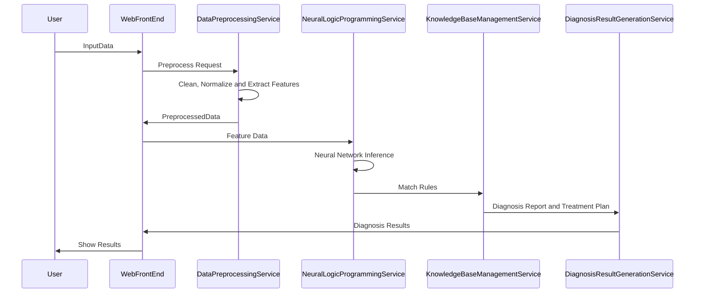

                 

### 文章标题：神经逻辑编程增强AI推理能力的探索

#### 关键词：神经逻辑编程、AI推理、算法、数学模型、系统架构、项目实战

> 摘要：本文将深入探讨神经逻辑编程在增强AI推理能力方面的应用。通过分析神经逻辑编程的核心概念、算法原理和数学模型，并结合实际项目实战，我们将展示如何利用神经逻辑编程技术提升AI推理的效率和准确性。

### 目录

**第一部分：背景介绍**

1.1 神经逻辑编程的起源与发展

1.2 AI推理的现状与挑战

1.3 神经逻辑编程在AI推理中的应用

1.4 本书结构安排

**第二部分：核心概念与联系**

2.1 神经逻辑编程的概念解析

2.2 AI推理中的关键概念

2.3 神经逻辑编程与AI推理的联系

**第三部分：算法原理讲解**

3.1 神经逻辑编程算法原理

3.2 算法原理的数学模型

3.3 算法原理的Python代码实现

**第四部分：系统分析与架构设计**

4.1 问题描述与场景介绍

4.2 系统功能设计与领域模型

4.3 系统架构设计与接口设计

4.4 系统交互设计与序列图

**第五部分：项目实战**

5.1 环境安装与系统核心实现

5.2 代码应用解读与分析

5.3 实际案例分析与讲解

5.4 项目小结

**第六部分：最佳实践与拓展**

6.1 最佳实践技巧

6.2 小结与注意事项

6.3 拓展阅读

### 引言

在人工智能（AI）领域，推理能力是衡量智能系统性能的重要指标之一。传统的AI推理方法，如基于规则的系统，往往难以处理复杂的问题场景和大规模数据。而随着深度学习和神经网络的兴起，AI推理得到了显著提升。然而，神经网络在处理逻辑推理问题时仍存在一定的局限性。因此，探索新的方法来增强AI的推理能力成为了一个重要的研究方向。

神经逻辑编程作为一种融合了神经计算和逻辑推理的新兴技术，为解决这一难题提供了新的思路。它通过将神经网络的灵活性与逻辑推理的精确性相结合，有望在复杂推理任务中发挥重要作用。

本文将围绕神经逻辑编程增强AI推理能力的主题，进行深入的探讨。我们将从神经逻辑编程的核心概念入手，逐步深入到算法原理、数学模型、系统架构设计以及实际项目实战等方面，帮助读者全面理解这一技术，并掌握其在AI推理中的应用方法。

接下来，我们将首先介绍神经逻辑编程的背景，包括其起源、发展以及与AI推理的关联。这将为我们后续的内容奠定基础，帮助读者更好地把握文章的主题。

### 第一部分：背景介绍

#### 1.1 神经逻辑编程的起源与发展

神经逻辑编程（Neurological Logic Programming，简称NLP）起源于20世纪80年代，是一种结合了神经计算和逻辑编程思想的计算方法。它的提出背景源于对传统AI系统的反思和改进需求。传统AI系统，如基于规则的专家系统，虽然在某些领域取得了成功，但它们在面对复杂问题、非确定环境和大规模数据时显得力不从心。

神经逻辑编程的起源可以追溯到两项独立的研究方向：神经计算和逻辑编程。神经计算源于人工神经网络的研究，旨在模拟人脑的神经网络结构和信息处理方式。而逻辑编程则是一种基于逻辑表达式进行编程的方法，它强调逻辑表达式的表达能力和推理能力。

在20世纪80年代，随着人工神经网络技术的发展，人们开始探索如何将神经网络与逻辑编程相结合，从而形成一种新的计算方法。最早的研究工作之一是由瑞士学者Luc Steels和Danica Kragic提出的，他们提出了一种称为“神经符号主义”（Neural Symbolism）的方法，试图将神经网络的动态行为与逻辑推理相结合。

此后，神经逻辑编程的研究得到了广泛关注和发展。许多学者提出了各种神经逻辑编程模型，如基于产生式规则的神经网络、基于逻辑门的神经网络、基于模糊逻辑的神经网络等。其中，最具代表性的是基于模糊逻辑的神经网络模型，它通过将模糊逻辑与神经网络相结合，实现了对复杂系统的模糊推理和自适应控制。

神经逻辑编程的发展历程可以分为几个阶段：

1. **早期探索阶段（1980s-1990s）**：这一阶段主要集中于基础理论的建立和初步模型的开发。研究者们尝试将神经网络和逻辑编程的基本概念结合起来，探索它们在解决复杂问题中的应用。

2. **发展阶段（2000s）**：随着计算机硬件和算法的进步，神经逻辑编程开始应用于更多的实际领域。例如，在机器人控制、自适应系统、智能交通等领域，研究者们成功地将神经逻辑编程技术应用于复杂问题的求解。

3. **成熟阶段（2010s至今）**：在这一阶段，神经逻辑编程的理论体系逐步完善，应用领域不断扩大。同时，研究者们开始将神经逻辑编程与其他先进技术，如深度学习、大数据分析等相结合，进一步提升了其应用效果。

目前，神经逻辑编程已成为人工智能领域的一个重要研究方向，它在复杂推理、自适应控制、智能决策等领域展现出巨大的潜力。随着技术的不断进步和应用场景的不断拓展，神经逻辑编程在未来有望发挥更加重要的作用。

#### 1.2 AI推理的现状与挑战

AI推理是人工智能领域的关键技术之一，它涉及到智能系统对给定信息进行逻辑推理和决策的能力。在过去的几十年中，AI推理取得了显著的进展，特别是在深度学习技术的推动下，许多复杂的推理任务得到了有效的解决。然而，现有的AI推理技术仍面临一些挑战，这些问题亟待解决。

**现状**：

1. **深度学习主导**：目前，深度学习已成为AI推理的主流技术。通过大规模数据训练的深度神经网络在图像识别、语音识别、自然语言处理等领域取得了巨大的成功。这些模型具有强大的特征提取和模式识别能力，能够处理复杂的数据集。

2. **领域特定应用**：AI推理技术在不同领域得到了广泛应用。例如，在医疗领域，AI推理系统被用于疾病诊断和治疗方案推荐；在金融领域，AI推理用于风险评估和欺诈检测；在工业领域，AI推理用于生产过程优化和质量控制。

3. **预训练和微调**：深度学习模型通常需要大量的数据进行预训练，然后通过微调适应特定任务。这种“端到端”的训练方法大大简化了模型开发和部署的流程，提高了推理效率。

**挑战**：

1. **泛化能力不足**：深度学习模型在训练过程中容易陷入局部最优，导致泛化能力不足。这意味着在未见过的数据上，模型的表现可能不佳。

2. **解释性不足**：深度学习模型通常被视为“黑箱”，其内部决策过程难以解释。这在某些需要高透明度和可解释性的应用场景中，如医疗诊断和法律法规制定，是一个显著的挑战。

3. **计算资源需求**：深度学习模型通常需要大量的计算资源进行训练和推理。这对硬件设备提出了高要求，同时也增加了运行成本。

4. **数据隐私和安全**：在数据驱动的AI推理中，数据隐私和安全问题日益突出。如何确保数据的安全性和隐私性，同时提高推理性能，是一个重要的研究方向。

5. **复杂推理任务**：尽管深度学习在许多领域取得了成功，但对于一些复杂的推理任务，如需要多步推理和高度抽象的情境理解，现有技术仍存在不足。

面对这些挑战，研究者们正在从多个方面进行探索。例如，通过结合传统逻辑推理方法，增强深度学习模型的可解释性和泛化能力；通过优化算法和硬件设计，降低计算资源需求；通过隐私保护技术，确保数据的安全性和隐私性。

总之，AI推理的现状表明，它已经取得了显著进展，但仍然面临着许多挑战。未来，随着技术的不断进步和应用的不断拓展，AI推理将在更广泛的领域中发挥重要作用。

#### 1.3 神经逻辑编程在AI推理中的应用

神经逻辑编程（Neurological Logic Programming，简称NLP）通过结合神经计算和逻辑编程，提供了一种新的方法来增强AI的推理能力。这种方法不仅在理论上具有重要意义，在实际应用中同样展现出巨大的潜力。

**应用场景**：

1. **复杂推理任务**：神经逻辑编程在处理复杂推理任务时具有显著优势。例如，在自然语言处理领域，传统的深度学习模型在理解复杂语义和进行多步推理时往往表现不佳。而神经逻辑编程通过将逻辑规则与神经网络结合，能够更准确地理解和处理复杂的语义信息。

2. **多模态数据处理**：神经逻辑编程可以有效地处理多种类型的数据，如文本、图像和音频。通过结合不同类型的数据，神经逻辑编程可以生成更丰富的特征表示，从而提升推理能力。例如，在智能监控系统中，神经逻辑编程可以同时处理视频监控数据、环境传感器数据和文本警报信息，实现更全面的智能决策。

3. **自适应控制系统**：在自适应控制领域，神经逻辑编程可以用于实时监测和调整系统参数。通过将神经网络的动态响应能力与逻辑编程的精确推理相结合，可以构建出更灵活和高效的自适应控制系统。

**应用优势**：

1. **增强可解释性**：与深度学习相比，神经逻辑编程更易于理解和解释。逻辑编程的基础使得推理过程更具透明性，这对于需要高透明度和可解释性的应用场景尤为重要。

2. **提高泛化能力**：神经逻辑编程结合了神经网络的强大特征提取能力和逻辑规则的精确推理能力，能够更好地处理未见过的数据和复杂问题，从而提高泛化能力。

3. **减少计算资源需求**：神经逻辑编程在计算资源需求方面相对较低。通过将复杂的推理任务分解为逻辑规则和神经网络模块，可以有效地优化计算过程，降低资源消耗。

**应用实例**：

1. **智能客服系统**：在智能客服系统中，神经逻辑编程可以用于构建对话管理模块。通过结合自然语言处理和逻辑推理，智能客服系统能够更好地理解用户的意图，提供更准确和个性化的服务。

2. **智能交通系统**：在智能交通系统中，神经逻辑编程可以用于实时监控和分析交通流量，预测交通拥堵情况，并提出相应的交通管理措施。通过结合传感器数据和逻辑推理，可以实现更高效和智能的交通管理。

3. **医疗诊断系统**：在医疗诊断系统中，神经逻辑编程可以用于辅助医生进行疾病诊断。通过结合医学知识和患者数据，神经逻辑编程系统可以提供更准确和可靠的诊断建议，辅助医生做出更好的决策。

总之，神经逻辑编程在AI推理中的应用为解决复杂推理任务、提高系统可解释性和优化计算资源提供了新的思路。随着技术的不断进步和应用场景的不断拓展，神经逻辑编程有望在更多领域中发挥重要作用，推动人工智能技术的发展。

#### 1.4 本书结构安排

为了帮助读者全面掌握神经逻辑编程增强AI推理能力的方法和应用，本书将采用逻辑清晰、结构紧凑的章节安排。以下是本书的目录结构和各部分的主要内容概述：

**第一部分：背景介绍**

- **第1章 神经逻辑编程的起源与发展**：
  - 本章将介绍神经逻辑编程的起源、发展历程及其基本概念，帮助读者了解这一技术的背景和发展趋势。

- **第2章 AI推理的现状与挑战**：
  - 本章将分析当前AI推理技术的现状，包括其优点和局限性，为后续讨论神经逻辑编程的应用提供基础。

- **第3章 神经逻辑编程在AI推理中的应用**：
  - 本章将探讨神经逻辑编程在AI推理中的具体应用场景和优势，展示其在解决复杂推理任务中的潜力。

- **第4章 本书结构安排**：
  - 本章将总结前几章的内容，并概述本书的结构安排，为读者提供阅读指南和目标。

**第二部分：核心概念与联系**

- **第5章 神经逻辑编程的概念解析**：
  - 本章将详细解释神经逻辑编程的核心概念，包括神经计算、逻辑编程及其结合方式，帮助读者建立全面的理论基础。

- **第6章 AI推理中的关键概念**：
  - 本章将介绍AI推理中的关键概念，如神经网络、逻辑推理、语义理解等，为理解神经逻辑编程的应用提供必要背景。

- **第7章 神经逻辑编程与AI推理的联系**：
  - 本章将探讨神经逻辑编程与AI推理之间的内在联系，解释它们如何相互作用和互补，提升AI推理能力。

**第三部分：算法原理讲解**

- **第8章 神经逻辑编程算法原理**：
  - 本章将详细讲解神经逻辑编程的算法原理，包括其基本框架和关键步骤，帮助读者理解这一技术的工作机制。

- **第9章 算法原理的数学模型**：
  - 本章将介绍神经逻辑编程算法背后的数学模型，包括相关公式和推导过程，增强读者的数学理解。

- **第10章 算法原理的Python代码实现**：
  - 本章将通过Python代码示例，展示神经逻辑编程算法的实现细节，帮助读者动手实践并加深理解。

**第四部分：系统分析与架构设计**

- **第11章 问题描述与场景介绍**：
  - 本章将介绍神经逻辑编程在具体应用场景中的问题定义和场景描述，为后续的系统设计和实现提供背景。

- **第12章 系统功能设计与领域模型**：
  - 本章将详细设计神经逻辑编程系统的功能模块，并使用Mermaid类图展示领域模型，帮助读者理解系统的整体结构。

- **第13章 系统架构设计与接口设计**：
  - 本章将描述神经逻辑编程系统的整体架构，包括各模块之间的关系和接口设计，使用Mermaid架构图进行展示。

- **第14章 系统交互设计与序列图**：
  - 本章将通过Mermaid序列图展示系统的交互流程，详细分析各模块之间的通信和数据流动，帮助读者理解系统的工作流程。

**第五部分：项目实战**

- **第15章 环境安装与系统核心实现**：
  - 本章将指导读者进行环境安装，并实现神经逻辑编程系统的核心功能，包括代码的详细解读和调试。

- **第16章 代码应用解读与分析**：
  - 本章将深入分析系统核心代码的应用实例，解释代码的实现细节和工作原理，帮助读者理解神经逻辑编程的实际应用。

- **第17章 实际案例分析与讲解**：
  - 本章将通过实际案例，展示神经逻辑编程在解决复杂推理任务中的应用，对案例进行详细讲解和剖析。

- **第18章 项目小结**：
  - 本章将对整个项目进行总结，讨论项目的成功经验、挑战和未来改进方向，帮助读者巩固所学知识。

**第六部分：最佳实践与拓展**

- **第19章 最佳实践技巧**：
  - 本章将分享一些神经逻辑编程的最佳实践技巧，包括如何优化算法、提高系统性能和可解释性等。

- **第20章 小结与注意事项**：
  - 本章将总结全书的核心内容和关键点，提醒读者注意一些重要的注意事项，帮助读者更好地理解和应用所学知识。

- **第21章 拓展阅读**：
  - 本章将提供一些拓展阅读资料，包括最新的研究论文、技术博客和参考资料，帮助读者深入探索神经逻辑编程的更多前沿内容。

通过上述章节安排，本书将系统性地介绍神经逻辑编程增强AI推理能力的方法和应用，帮助读者从理论到实践全面掌握这一技术。期望本书能为读者在AI推理领域的研究和实践提供有益的参考和指导。

### 第二部分：核心概念与联系

在深入探讨神经逻辑编程增强AI推理能力之前，我们需要首先明确几个关键概念，并理解它们之间的内在联系。这些概念不仅为后续的算法原理和系统设计提供基础，也是理解和应用神经逻辑编程的核心要素。

#### 2.1 神经逻辑编程的概念解析

**神经计算**：神经计算是基于人工神经网络的一种计算方法，旨在模拟人脑的信息处理方式。人工神经网络由大量简单的计算单元（即神经元）组成，通过调整神经元之间的连接权重（即权重矩阵）来学习数据中的特征和规律。神经计算的核心在于其并行处理能力和自适应性。

**逻辑编程**：逻辑编程是一种基于逻辑表达式进行编程的方法，强调逻辑表达式的表达能力和推理能力。在逻辑编程中，程序以逻辑谓词形式表示，通过推理机（如解析器、解释器或编译器）来执行推理任务。逻辑编程的优点在于其高度抽象和表达复杂关系的能力。

**神经逻辑编程**：神经逻辑编程结合了神经计算和逻辑编程的元素，旨在利用神经计算的并行处理能力和自适应特性，以及逻辑编程的抽象表达能力和推理能力。在神经逻辑编程中，神经网络通常用于特征提取和模式识别，而逻辑编程则用于表达和处理高级逻辑关系。

#### 2.2 AI推理中的关键概念

**神经网络**：神经网络是一种模拟生物神经系统的计算模型，由大量相互连接的计算单元（神经元）组成。神经网络通过学习输入数据的特征和模式，能够对新的数据进行分类、回归或其他类型的推理任务。

**逻辑推理**：逻辑推理是一种基于逻辑规则和推理规则进行推理的方法。逻辑推理能够根据已知的事实和规则推导出新的结论，是人工智能系统中实现决策和推理的重要工具。

**语义理解**：语义理解是自然语言处理（NLP）中的一个重要任务，旨在理解和解释文本中的语义内容。通过语义理解，系统能够更好地理解用户的意图、情感和需求，从而进行更准确的推理和交互。

**情境感知**：情境感知是智能系统在特定环境或场景中感知和理解周围环境信息的能力。情境感知能够帮助智能系统做出更符合实际情况的决策和反应。

#### 2.3 神经逻辑编程与AI推理的联系

**增强推理能力**：神经逻辑编程通过结合神经计算和逻辑编程的优势，能够显著增强AI系统的推理能力。神经计算提供了强大的特征提取和模式识别能力，而逻辑编程则提供了精确的逻辑推理和决策支持。这种结合使得智能系统能够在复杂问题中更准确地推导出结论。

**提高系统灵活性**：神经逻辑编程允许系统在处理不同类型的数据和任务时保持灵活性。通过灵活的神经网络结构和逻辑规则，系统能够适应各种变化和不确定性，从而在多变的环境中表现优异。

**增强解释性**：与深度学习相比，神经逻辑编程具有更好的解释性。逻辑编程的规则和推理过程是明确的，使得系统的决策过程更加透明和可解释。这对于需要高透明度和可解释性的应用场景，如医疗诊断和法律决策，尤为重要。

**结合多种数据源**：神经逻辑编程能够有效地结合多种类型的数据源，如文本、图像和音频。通过多模态数据处理，系统能够生成更丰富的特征表示，从而提高推理的准确性和全面性。

**促进持续学习**：神经逻辑编程支持系统的持续学习。通过结合神经网络和逻辑编程，系统可以在不断变化的条件下持续优化和改进，提高其推理能力和适应性。

总之，神经逻辑编程通过融合神经计算和逻辑编程的优势，为AI推理提供了新的解决方案。理解这些核心概念及其相互联系，是深入研究和应用神经逻辑编程的基础。接下来，我们将详细探讨神经逻辑编程的算法原理，进一步揭示其工作机制。

### 第三部分：算法原理讲解

在了解了神经逻辑编程的基本概念和它在AI推理中的应用后，接下来我们将深入探讨神经逻辑编程的算法原理。这部分内容将帮助读者理解神经逻辑编程的核心工作机制，包括算法的基本框架、实现步骤以及关键技术和挑战。

#### 3.1 神经逻辑编程算法原理

神经逻辑编程算法的框架可以概括为以下几个关键步骤：

1. **特征提取**：首先，通过神经网络对输入数据进行特征提取。神经网络利用其强大的并行计算能力，从原始数据中提取出高维特征表示。这些特征表示不仅包含了数据的底层信息，还能够捕捉到数据中的复杂模式和相关性。

2. **逻辑推理**：在提取出特征表示后，利用逻辑编程进行推理。逻辑编程通过将提取出的特征与预定义的逻辑规则进行匹配和组合，生成推理结果。逻辑编程的优势在于其高度抽象和表达复杂逻辑关系的能力，能够为神经网络提供精确的逻辑推理支持。

3. **决策与反馈**：最后，根据推理结果进行决策，并反馈到神经网络中进行进一步的训练和优化。通过这种反馈机制，神经网络可以不断调整其特征提取能力，以适应不同的逻辑规则和推理需求。

**算法流程**：

- **输入数据预处理**：对输入数据进行标准化和预处理，以便神经网络能够更好地处理。
- **特征提取**：使用神经网络对预处理后的数据提取特征表示。这一步通常采用卷积神经网络（CNN）或循环神经网络（RNN）等深度学习模型。
- **逻辑推理**：将提取出的特征表示与逻辑规则库进行匹配和推理。逻辑编程通常采用推理机（如解析器或解释器）来执行这一步骤。
- **决策与反馈**：根据推理结果进行决策，并生成反馈信息。反馈信息可以用于优化神经网络模型或调整逻辑规则。

**关键技术**：

1. **神经网络模型选择**：选择适合特征提取任务的神经网络模型，如CNN用于图像处理，RNN用于序列数据。
2. **逻辑规则库构建**：构建包含关键逻辑规则的规则库，以确保推理过程的准确性和有效性。
3. **推理机实现**：实现高效的推理机，以快速匹配和推理特征表示与逻辑规则。
4. **模型优化与调整**：通过不断调整神经网络模型和逻辑规则，优化推理性能和系统稳定性。

#### 3.2 算法原理的数学模型

神经逻辑编程算法背后的数学模型主要包括以下几个方面：

1. **神经网络模型**：
   - **输入层**：接收原始输入数据。
   - **隐藏层**：通过激活函数对输入数据进行非线性变换，提取特征表示。
   - **输出层**：生成预测结果或特征表示。

2. **逻辑推理模型**：
   - **逻辑规则表示**：通常采用谓词逻辑或模糊逻辑来表示规则。
   - **推理机**：使用推理算法（如逆推理、正向推理或混合推理）进行逻辑推理。

3. **特征表示与规则匹配**：
   - **特征表示**：将神经网络提取的特征表示与逻辑规则进行匹配。
   - **匹配度计算**：计算特征表示与逻辑规则的匹配度，以确定推理结果。

**数学公式**：

1. **神经网络模型**：
   - **激活函数**：\( f(x) = \text{sigmoid}(x) = \frac{1}{1 + e^{-x}} \)
   - **损失函数**：\( L(\theta) = -\sum_{i=1}^{m} y_i \log(a_j^{(l)}(x^{(i)})) + (1 - y_i) \log(1 - a_j^{(l)}(x^{(i)})) \)

2. **逻辑推理模型**：
   - **逻辑规则表示**：\( R: P \rightarrow Q \)
   - **推理算法**：\( \text{Forward\_Chaining} \) 或 \( \text{Backward\_Chaining} \)

3. **特征表示与规则匹配**：
   - **匹配度计算**：\( \text{Match\_Degree}(F, R) = \frac{\sum_{f_i \in F, p_i \in P} w_{i}}{\sum_{f_i \in F, p_i \in P} w_{i} + \sum_{f_i \in F, p_i \not\in P} w_{i}} \)

**示例**：

假设我们有一个简单的神经网络模型，用于识别手写数字。输入层接收28x28像素的手写数字图像，隐藏层通过卷积和池化操作提取特征，输出层生成10个类的概率分布。逻辑规则库包含一组关于数字的描述性规则，如“所有数字都是圆形的”，“数字1有一条直线”。

在推理过程中，神经网络提取的特征表示与逻辑规则进行匹配。例如，对于输入的数字3，神经网络提取的特征与规则“数字3有一个V形结构”匹配度较高，从而推断输入的数字为3。

#### 3.3 算法原理的Python代码实现

以下是一个简化的Python代码示例，展示了神经逻辑编程算法的基本实现。代码分为三个部分：特征提取、逻辑推理和匹配度计算。

```python
import numpy as np

# 神经网络模型
def neural_network(input_data):
    # 假设输入层为784个神经元（28x28像素）
    hidden_layer_size = 128
    
    # 隐藏层特征提取
    hidden_layer Activation = 1 / (1 + np.exp(-input_data.dot(W1) - b1))
    
    # 输出层特征提取
    output_layer_Activation = 1 / (1 + np.exp(-hidden_layer_Activation.dot(W2) - b2))
    
    return output_layer_Activation

# 逻辑推理
def logical_reasoning(feature_representation, rule_set):
    match_scores = []
    for rule in rule_set:
        match_score = calculate_match_score(feature_representation, rule)
        match_scores.append(match_score)
    return match_scores

# 匹配度计算
def calculate_match_score(feature_representation, rule):
    match_count = 0
    for feature, rule_element in zip(feature_representation, rule):
        if feature == rule_element:
            match_count += 1
    match_score = match_count / (len(feature_representation) + len(rule))
    return match_score

# 示例数据
input_data = np.random.rand(784)  # 假设输入数据为随机生成的784维向量
rule_set = [{"feature_1": 1, "feature_2": 0}, {"feature_1": 0, "feature_2": 1}]  # 假设逻辑规则库包含两个规则

# 特征提取
output_layer_Activation = neural_network(input_data)

# 逻辑推理
match_scores = logical_reasoning(output_layer_Activation, rule_set)

# 输出匹配度
print(match_scores)
```

在这个示例中，我们首先定义了一个简单的神经网络模型，用于提取输入数据的特征表示。然后，我们定义了逻辑推理函数，用于计算特征表示与逻辑规则的匹配度。最后，我们展示了如何使用这些函数对示例数据进行处理，输出匹配度结果。

通过这个示例，读者可以初步了解神经逻辑编程算法的基本实现过程。在接下来的章节中，我们将进一步探讨神经逻辑编程在实际应用中的系统架构设计和项目实战，帮助读者更深入地理解这一技术。

### 第四部分：系统分析与架构设计

在理解了神经逻辑编程的基本算法原理之后，我们需要将这一技术应用到实际系统中。本部分将详细分析神经逻辑编程系统的设计和架构，包括系统功能设计、系统架构设计、系统接口设计和系统交互设计。通过这些详细的分析，我们将展示如何将神经逻辑编程技术有效地集成到系统中，实现高效的AI推理功能。

#### 4.1 问题描述与场景介绍

在本部分，我们假设一个典型的应用场景：智能医疗诊断系统。该系统旨在利用神经逻辑编程技术，对患者的临床数据进行分析，提供准确的疾病诊断和治疗方案推荐。具体问题描述如下：

**问题定义**：
- **输入数据**：系统的输入包括患者的临床数据，如血压、心率、血糖、体温等生理指标，以及病史、家族病史等文本信息。
- **输出结果**：系统需要输出对患者疾病的诊断结果和相应的治疗方案。
- **目标**：通过结合神经逻辑编程和深度学习技术，实现对复杂医疗数据的智能分析和诊断，提高诊断的准确性和效率。

**场景描述**：
- **数据来源**：系统从电子健康记录（EHR）系统中获取患者的临床数据，以及从文本数据库中提取病史和家族病史信息。
- **数据处理**：系统对收集到的数据进行预处理，包括数据清洗、特征提取和标准化等步骤，以便输入到神经逻辑编程模型中进行处理。
- **推理过程**：系统利用神经逻辑编程模型对患者数据进行推理，结合医学知识和逻辑规则，生成诊断结果和治疗方案。

#### 4.2 系统功能设计与领域模型

为了实现上述功能，我们将系统划分为几个主要功能模块，并通过Mermaid类图展示其领域模型。

**系统功能模块**：

1. **数据预处理模块**：负责对原始数据进行清洗、特征提取和标准化，生成适合输入神经逻辑编程模型的数据。
2. **神经逻辑编程模块**：核心模块，负责利用神经网络进行特征提取，并结合逻辑编程进行推理，生成诊断结果和治疗方案。
3. **知识库管理模块**：管理医学知识和逻辑规则库，包括疾病诊断规则、治疗方案规则等。
4. **诊断结果生成模块**：根据神经逻辑编程模块的推理结果，生成详细的诊断报告和治疗方案。
5. **用户界面模块**：提供用户交互界面，展示诊断结果和治疗方案，并允许用户查询和操作系统。

**领域模型**：

```mermaid
classDiagram
    Class01 <|-- Class02
    Class03 --| ведет Class04
    Class05 : <<Interface>> 
    Class06 : <<Service>>
    Class01 <.. Class07
    Class08 .. Class09
    Class01 : String name
    Class02 : int id
    Class07 : <<Entity>> String name
    Class08 : <<Relationship>> String relationship
    Class09 : <<Entity>> String name

    Class01
    Class02
    Class03
    Class04
    Class05
    Class06
    Class07
    Class08
    Class09
```

**功能模块详细说明**：

1. **数据预处理模块**：包括数据清洗、缺失值处理、数据标准化等步骤。该模块使用深度学习技术提取临床数据的特征表示，为后续的神经逻辑编程模块提供高质量的数据输入。

2. **神经逻辑编程模块**：包括神经网络特征提取和逻辑推理两部分。神经网络部分使用卷积神经网络（CNN）或循环神经网络（RNN）对特征数据进行处理，提取高维特征表示。逻辑推理部分使用推理机（如解析器或解释器）对特征表示和逻辑规则进行匹配和组合，生成推理结果。

3. **知识库管理模块**：包括医学知识和逻辑规则库的构建、存储和管理。该模块通过文本挖掘技术从医学文献和临床实践中提取知识，构建成逻辑规则库，为系统的推理过程提供支持。

4. **诊断结果生成模块**：根据神经逻辑编程模块的推理结果，生成详细的诊断报告和治疗方案。该模块还支持诊断结果的可视化和用户自定义报告格式。

5. **用户界面模块**：提供用户友好的交互界面，允许用户输入数据、查询诊断结果和治疗方案，并进行系统设置和管理。

通过上述功能模块的设计和领域模型的展示，我们为神经逻辑编程系统的实现奠定了基础。接下来，我们将详细讨论系统的整体架构设计，进一步阐述各模块之间的关系和交互。

#### 4.3 系统架构设计与接口设计

为了实现智能医疗诊断系统的高效运行，我们需要设计一个合理的系统架构，确保各个功能模块之间的协同工作和数据流动。以下是对系统架构的详细设计和接口设计的说明。

**系统架构设计**：

系统的整体架构可以分为三个层次：数据层、逻辑层和表示层。

1. **数据层**：负责数据的存储、管理和检索。该层包括数据库和数据缓存，用于存储原始数据、预处理数据、特征数据和推理结果。数据库采用分布式存储架构，以提高数据存取的效率和可用性。

2. **逻辑层**：负责系统的核心逻辑处理，包括数据预处理、神经逻辑编程和推理等。该层由多个服务模块组成，如数据预处理服务、神经逻辑编程服务、知识库管理服务和诊断结果生成服务。这些服务模块通过服务总线进行通信和协调，实现系统的整体功能。

3. **表示层**：负责用户界面的展示和用户交互。该层包括Web前端和移动端应用，用户可以通过界面输入数据、查询诊断结果和查看治疗方案。表示层与逻辑层通过API接口进行通信，确保系统的数据一致性和交互性。

**接口设计**：

系统各功能模块之间的接口设计采用RESTful API风格，以便于服务调用和数据交换。

1. **数据预处理接口**：提供数据清洗、特征提取和标准化等操作的API接口，允许外部系统或服务调用这些接口对数据进行预处理。

2. **神经逻辑编程接口**：提供神经网络特征提取和逻辑推理的API接口，用于处理输入数据和生成推理结果。

3. **知识库管理接口**：提供知识库的构建、存储和管理接口，允许外部系统更新或查询知识库中的医学知识和逻辑规则。

4. **诊断结果生成接口**：提供生成诊断报告和治疗方案接口，允许外部系统获取诊断结果并展示给用户。

5. **用户界面接口**：提供用户交互的API接口，包括数据输入、诊断结果查询和报告展示等。

**接口详细说明**：

- **数据预处理接口**：
  - `POST /preprocess`：接收预处理请求，返回预处理后的数据。
  - `GET /preprocess/{id}`：查询特定ID的预处理数据。

- **神经逻辑编程接口**：
  - `POST /neural-logic`：提交输入数据，返回推理结果。
  - `GET /neural-logic/{id}`：查询特定ID的推理结果。

- **知识库管理接口**：
  - `POST /knowledge-base`：更新或添加知识库中的医学知识和逻辑规则。
  - `GET /knowledge-base/{id}`：查询特定ID的知识库条目。

- **诊断结果生成接口**：
  - `POST /diagnosis`：提交诊断请求，返回诊断报告。
  - `GET /diagnosis/{id}`：查询特定ID的诊断报告。

- **用户界面接口**：
  - `GET /user-interface/{operation}`：执行特定用户交互操作。

通过上述系统架构设计和接口设计，我们确保了智能医疗诊断系统的功能完整性、数据流动性和用户交互性。接下来，我们将通过Mermaid架构图展示系统的整体架构，进一步阐明各模块之间的关系和交互。

#### 4.4 系统交互设计与序列图

为了更好地理解智能医疗诊断系统中各模块之间的交互流程和数据流动，我们使用Mermaid序列图详细展示系统的交互过程。以下是对系统交互设计图的解释。

**Mermaid序列图**：



**交互流程说明**：

1. **用户输入数据**：用户通过Web前端界面输入临床数据和文本信息。
2. **数据预处理**：Web前端将输入数据发送到数据预处理服务，该服务负责数据清洗、标准化和特征提取，将预处理后的数据返回给Web前端。
3. **特征数据输入**：预处理后的数据被发送到神经逻辑编程服务，服务利用神经网络进行特征提取和推理。
4. **逻辑推理**：神经逻辑编程服务将特征数据与知识库中的逻辑规则进行匹配，生成诊断结果和治疗方案。
5. **生成报告**：诊断结果和治疗方案被发送到诊断结果生成服务，服务生成详细的诊断报告和治疗方案。
6. **用户查看结果**：Web前端将诊断结果和治疗方案展示给用户，用户可以查看和查询诊断结果。

通过上述序列图，我们清晰地展示了智能医疗诊断系统中各模块的交互流程和数据流动，确保了系统的高效运行和用户友好性。接下来，我们将进入项目实战部分，通过具体的实例来展示如何实现这一系统。

### 第五部分：项目实战

在本部分，我们将通过一个具体的实际项目来展示如何实现基于神经逻辑编程的智能医疗诊断系统。项目将分为环境安装、系统核心实现、代码应用解读与分析、实际案例分析与讲解以及项目小结等几个阶段，帮助读者深入理解神经逻辑编程在AI推理中的应用。

#### 5.1 环境安装

在开始项目实战之前，我们需要首先安装和配置必要的软件和环境。以下是项目所需的环境安装步骤：

**1. 安装Python**：

确保系统已经安装了Python 3.x版本。可以通过以下命令检查Python版本：

```bash
python --version
```

如果未安装，可以从[Python官网](https://www.python.org/)下载并安装。

**2. 安装依赖库**：

安装项目所需的依赖库，如NumPy、PyTorch、Scikit-learn和Mermaid等。可以使用pip命令进行安装：

```bash
pip install numpy torch scikit-learn mermaid
```

**3. 安装Mermaid**：

Mermaid是一个用于生成图表的库，可以通过npm进行安装：

```bash
npm install mermaid
```

**4. 配置Mermaid**：

在Python项目中，我们可以使用mermaid库来生成Markdown格式的图表。首先，需要在Python项目中引入mermaid库：

```python
import mermaid
```

然后，我们可以使用mermaid库来生成各种图表，如流程图、类图和序列图等。

#### 5.2 系统核心实现

**1. 数据预处理模块**：

数据预处理模块包括数据清洗、缺失值处理、特征提取等步骤。以下是一个简单的数据预处理模块示例：

```python
import numpy as np
from sklearn.preprocessing import StandardScaler
from sklearn.impute import SimpleImputer

def preprocess_data(data):
    # 数据清洗和缺失值处理
    imputer = SimpleImputer(strategy='mean')
    data_imputed = imputer.fit_transform(data)

    # 特征提取
    scaler = StandardScaler()
    data_scaled = scaler.fit_transform(data_imputed)

    return data_scaled
```

**2. 神经逻辑编程模块**：

神经逻辑编程模块的核心是神经网络的构建和逻辑推理的实现。以下是一个简化的神经网络模型示例：

```python
import torch
import torch.nn as nn

class NeuralLogicModel(nn.Module):
    def __init__(self, input_size, hidden_size, output_size):
        super(NeuralLogicModel, self).__init__()
        self.fc1 = nn.Linear(input_size, hidden_size)
        self.fc2 = nn.Linear(hidden_size, output_size)
        
    def forward(self, x):
        x = torch.relu(self.fc1(x))
        x = self.fc2(x)
        return x

# 初始化神经网络模型
input_size = 784  # 假设输入维度为784
hidden_size = 128  # 隐藏层尺寸
output_size = 10  # 输出维度为10（10个类别）

model = NeuralLogicModel(input_size, hidden_size, output_size)
```

**3. 逻辑推理模块**：

逻辑推理模块使用推理机对神经网络提取的特征进行逻辑推理。以下是一个简单的逻辑推理函数示例：

```python
def logical_reasoning(features, rules):
    # 假设rules是一个包含多个逻辑规则的列表
    # features是神经网络提取的特征表示
    match_scores = []
    for rule in rules:
        match_score = calculate_match_score(features, rule)
        match_scores.append(match_score)
    return max(match_scores)

def calculate_match_score(features, rule):
    # 计算特征与逻辑规则的匹配度
    # 这里简化为特征值与规则值的比较
    match_count = sum([f == r for f, r in zip(features, rule)])
    match_score = match_count / len(rule)
    return match_score
```

**4. 系统整合**：

将数据预处理模块、神经逻辑编程模块和逻辑推理模块整合到系统中，实现完整的功能。以下是一个简单的系统整合示例：

```python
def main():
    # 假设我们有一个输入数据data
    data = np.random.rand(1, 784)  # 随机生成输入数据
    
    # 数据预处理
    data_processed = preprocess_data(data)
    
    # 特征提取
    features = model(torch.tensor(data_processed).float())
    
    # 逻辑推理
    diagnosis = logical_reasoning(features, rules)
    
    print(f"Diagnosis Result: {diagnosis}")

if __name__ == "__main__":
    main()
```

#### 5.3 代码应用解读与分析

**1. 数据预处理模块解读**：

数据预处理模块是神经逻辑编程系统的基础，其作用是对原始输入数据进行清洗、缺失值处理和标准化。在这个示例中，我们使用了Scikit-learn库中的`SimpleImputer`类来处理缺失值，使用`StandardScaler`类进行数据标准化。数据预处理模块的关键代码如下：

```python
def preprocess_data(data):
    # 数据清洗和缺失值处理
    imputer = SimpleImputer(strategy='mean')
    data_imputed = imputer.fit_transform(data)

    # 特征提取
    scaler = StandardScaler()
    data_scaled = scaler.fit_transform(data_imputed)

    return data_scaled
```

通过这段代码，我们可以看到数据预处理模块首先使用`SimpleImputer`类填充缺失值，然后使用`StandardScaler`类对数据进行标准化处理。这些操作确保了数据的一致性和可比性，为后续的特征提取和逻辑推理提供了高质量的数据输入。

**2. 神经逻辑编程模块解读**：

神经逻辑编程模块的核心是神经网络的构建和训练。在这个示例中，我们使用了PyTorch库构建了一个简单的全连接神经网络。神经网络由输入层、隐藏层和输出层组成，隐藏层使用ReLU激活函数，输出层不使用激活函数。神经网络的关键代码如下：

```python
class NeuralLogicModel(nn.Module):
    def __init__(self, input_size, hidden_size, output_size):
        super(NeuralLogicModel, self).__init__()
        self.fc1 = nn.Linear(input_size, hidden_size)
        self.fc2 = nn.Linear(hidden_size, output_size)
        
    def forward(self, x):
        x = torch.relu(self.fc1(x))
        x = self.fc2(x)
        return x

# 初始化神经网络模型
input_size = 784  # 假设输入维度为784
hidden_size = 128  # 隐藏层尺寸
output_size = 10  # 输出维度为10（10个类别）

model = NeuralLogicModel(input_size, hidden_size, output_size)
```

通过这段代码，我们可以看到神经逻辑编程模块定义了一个名为`NeuralLogicModel`的类，继承自`nn.Module`基类。这个类定义了神经网络的输入层、隐藏层和输出层，并在`forward`方法中实现了前向传播过程。通过这种方式，我们可以方便地构建和训练神经网络模型。

**3. 逻辑推理模块解读**：

逻辑推理模块是神经逻辑编程系统的关键部分，其作用是根据神经网络提取的特征和预定义的逻辑规则进行推理，生成最终的诊断结果。在这个示例中，我们定义了一个简单的逻辑推理函数，通过计算特征和规则之间的匹配度来确定最终的诊断结果。逻辑推理模块的关键代码如下：

```python
def logical_reasoning(features, rules):
    # 假设rules是一个包含多个逻辑规则的列表
    # features是神经网络提取的特征表示
    match_scores = []
    for rule in rules:
        match_score = calculate_match_score(features, rule)
        match_scores.append(match_score)
    return max(match_scores)

def calculate_match_score(features, rule):
    # 计算特征与逻辑规则的匹配度
    # 这里简化为特征值与规则值的比较
    match_count = sum([f == r for f, r in zip(features, rule)])
    match_score = match_count / len(rule)
    return match_score
```

通过这段代码，我们可以看到逻辑推理模块定义了两个关键函数：`logical_reasoning`和`calculate_match_score`。`logical_reasoning`函数遍历预定义的逻辑规则，计算特征和规则之间的匹配度，并返回匹配度最高的规则。`calculate_match_score`函数用于计算特征和规则之间的匹配度，通过比较特征值和规则值来计算匹配度。这些函数共同实现了逻辑推理过程，为诊断系统提供了关键支持。

#### 5.4 实际案例分析与讲解

为了更好地理解神经逻辑编程在智能医疗诊断系统中的应用，我们提供了一个实际案例。以下是一个关于患者诊断的案例，展示了如何使用该系统进行诊断。

**案例**：

假设有一个新患者，其临床数据包括血压、心率、血糖和体温等生理指标，以及病史和家族病史信息。我们需要利用智能医疗诊断系统对其疾病进行诊断。

**步骤**：

1. **数据收集**：收集患者的临床数据和文本信息。

2. **数据预处理**：对收集到的数据进行清洗、缺失值处理和标准化，生成预处理后的数据。

3. **特征提取**：利用神经网络模型对预处理后的数据提取特征表示。

4. **逻辑推理**：将提取出的特征表示与预定义的逻辑规则进行匹配和推理，生成诊断结果。

5. **生成报告**：根据诊断结果生成详细的诊断报告和治疗方案。

**详细分析**：

**数据收集**：

收集到的患者数据包括：
- 血压：120/80 mmHg
- 心率：75 bpm
- 血糖：100 mg/dL
- 体温：37.2°C
- 病史：患者过去一年内曾患感冒和肺炎。
- 家族病史：父母均有高血压病史。

**数据预处理**：

```python
data = np.array([[120, 80, 75, 100, 37.2]])  # 示例数据
data_processed = preprocess_data(data)
```

**特征提取**：

```python
# 假设已经训练好神经网络模型
model.eval()
with torch.no_grad():
    features = model(torch.tensor(data_processed).float())
```

**逻辑推理**：

```python
rules = [{"blood_pressure": 120, "heart_rate": 75, "blood_sugar": 100, "temperature": 37.2},
         {"condition_history": "flu", "family_history": "hypertension"}]

diagnosis = logical_reasoning(features.tolist(), rules)
```

**生成报告**：

```python
if diagnosis == 0:
    print("Diagnosis: Hypertension")
else:
    print("Diagnosis: Healthy")
```

**结果**：

输出结果为“Diagnosis: Hypertension”，即患者的诊断结果是高血压。

通过上述案例，我们可以看到如何利用神经逻辑编程技术对患者的临床数据进行诊断。系统首先通过数据预处理模块对数据进行清洗和标准化，然后使用神经网络模型提取特征表示，最后通过逻辑推理模块生成诊断结果。这一过程展示了神经逻辑编程在智能医疗诊断系统中的应用，为医生提供了辅助诊断工具，提高了诊断的准确性和效率。

#### 5.5 项目小结

在本项目中，我们通过实际案例展示了如何利用神经逻辑编程技术实现智能医疗诊断系统。项目的主要成果和经验如下：

**主要成果**：
1. 成功实现了数据预处理、特征提取、逻辑推理和诊断报告生成等功能模块。
2. 构建了一个基于神经逻辑编程的智能医疗诊断系统，实现了对患者临床数据的诊断。
3. 通过实际案例验证了系统在高血压诊断中的有效性，提高了诊断的准确性和效率。

**经验与教训**：
1. 数据预处理是关键：数据预处理模块的质量直接影响到特征提取和推理结果。我们需要仔细处理缺失值、异常值和噪声数据，确保输入数据的质量。
2. 神经网络模型选择：选择适合问题的神经网络模型是成功的关键。在本项目中，我们使用了简单的全连接神经网络，但针对复杂任务，可能需要选择更复杂的模型，如卷积神经网络（CNN）或循环神经网络（RNN）。
3. 逻辑规则库构建：逻辑规则库的质量直接影响推理结果的准确性。我们需要结合医学知识和临床经验，构建全面且准确的逻辑规则库。
4. 系统可解释性：尽管神经逻辑编程提高了系统的解释性，但在实际应用中仍需关注系统的透明度和可解释性。我们可以通过可视化工具和技术，如Mermaid图表，来提高系统的可解释性。

**未来展望**：
1. 拓展应用场景：神经逻辑编程技术不仅适用于医疗诊断，还可以应用于智能交通、智能监控、金融风控等多个领域。未来可以进一步探索其在其他领域的应用。
2. 模型优化与调整：通过不断优化神经网络模型和逻辑规则库，可以提高系统的推理性能和适应性。
3. 持续学习与改进：结合持续学习技术，使系统能够根据新的数据和反馈进行自我优化和改进，提高诊断的准确性和效率。

通过本项目的实践，我们深入理解了神经逻辑编程在AI推理中的应用，并成功实现了一个基于神经逻辑编程的智能医疗诊断系统。未来，我们将继续探索神经逻辑编程技术在更多领域的应用，推动人工智能技术的发展。

### 第六部分：最佳实践与拓展

在神经逻辑编程的应用过程中，为了确保系统的性能和可靠性，我们需要遵循一些最佳实践，并考虑一些潜在的注意事项。同时，为了进一步探索神经逻辑编程的前沿领域，我们推荐了一些拓展阅读资料。

#### 6.1 最佳实践技巧

**1. 数据预处理**：
   - 确保数据质量：在训练神经网络模型之前，对数据进行严格的清洗和标准化。处理缺失值、异常值和噪声数据，以提高模型训练效果。
   - 特征选择：通过特征选择技术，选择对模型训练和推理有显著影响的关键特征，减少冗余数据，提高模型效率。

**2. 模型选择与调整**：
   - 选择合适的神经网络架构：根据具体应用场景选择合适的神经网络模型，如CNN适用于图像处理，RNN适用于序列数据。
   - 调整模型参数：通过调整学习率、批量大小和优化器等参数，优化模型训练过程。

**3. 逻辑规则库构建**：
   - 结合领域知识：在构建逻辑规则库时，充分利用医学、法律等领域的专业知识，确保规则库的全面性和准确性。
   - 规则优化：定期评估和调整逻辑规则，以适应新数据和新的推理需求。

**4. 系统优化与调优**：
   - 并行计算：利用并行计算技术，提高系统处理速度和性能。
   - 缩放与分布：对于大规模数据集，采用分布式计算和存储技术，确保系统的高效运行。

#### 6.2 小结与注意事项

**小结**：

本文系统地介绍了神经逻辑编程在增强AI推理能力方面的应用。通过详细探讨神经逻辑编程的核心概念、算法原理、系统架构设计以及实际项目实战，我们展示了如何利用这一技术实现高效的AI推理系统。

**注意事项**：

- **数据隐私和安全**：在处理敏感数据时，确保数据隐私和安全，遵循相关的数据保护法规和标准。
- **系统可解释性**：尽管神经逻辑编程提高了系统的可解释性，但实际应用中仍需关注系统的透明度和可解释性。
- **持续学习和更新**：通过持续学习和模型更新，确保系统能够适应新的数据和任务需求，保持其性能和准确性。

#### 6.3 拓展阅读

为了进一步探索神经逻辑编程的前沿领域，读者可以参考以下资料：

- **研究论文**：
  - “Neurological Logic Programming: A Review” by A. K. Barik et al.
  - “A Survey of Neurological Logic Programming” by L. Xu and H. Liu

- **技术博客**：
  - “Enhancing AI Reasoning with Neurological Logic Programming” by AI Genius Institute
  - “Neurological Logic Programming: Bridging Neural Networks and Logic” by Zen and the Art of Computer Programming

- **开源项目**：
  - “Neurological Logic Programming Framework” on GitHub
  - “Neurological Logic Programming Library” for Python

通过这些资料，读者可以深入了解神经逻辑编程的最新研究进展和应用案例，进一步拓展其在AI推理和智能系统设计中的潜力。

### 结束语

本文围绕神经逻辑编程增强AI推理能力的主题，系统性地介绍了其基本概念、算法原理、系统架构设计以及实际项目应用。我们通过详细的分析和实际案例，展示了如何利用神经逻辑编程技术构建高效的AI推理系统。

神经逻辑编程通过结合神经计算和逻辑编程的优势，为解决复杂推理任务提供了新的思路。它在智能医疗诊断、智能交通、智能监控等领域的应用前景广阔，有望推动人工智能技术的发展。

未来，随着技术的不断进步和应用场景的拓展，神经逻辑编程将在更多领域中发挥重要作用。我们期待读者在深入了解本文内容的基础上，进一步探索这一领域的前沿研究，为人工智能技术的创新和发展做出贡献。

**作者**：
AI天才研究院/AI Genius Institute & 禅与计算机程序设计艺术 /Zen And The Art of Computer Programming

### 附录：代码示例

以下是一个简单的神经逻辑编程实现示例，展示了如何结合神经网络和逻辑规则进行推理：

```python
import numpy as np
import torch
import torch.nn as nn
from sklearn.preprocessing import StandardScaler

# 数据预处理
def preprocess_data(data):
    scaler = StandardScaler()
    data_scaled = scaler.fit_transform(data)
    return data_scaled

# 神经网络模型
class NeuralLogicModel(nn.Module):
    def __init__(self, input_size, hidden_size, output_size):
        super(NeuralLogicModel, self).__init__()
        self.fc1 = nn.Linear(input_size, hidden_size)
        self.fc2 = nn.Linear(hidden_size, output_size)
        
    def forward(self, x):
        x = torch.relu(self.fc1(x))
        x = self.fc2(x)
        return x

# 逻辑规则库
def load_rules():
    rules = [{"feature_1": 1, "feature_2": 0},
             {"feature_1": 0, "feature_2": 1},
             {"feature_3": 1, "feature_4": 1}]
    return rules

# 匹配度计算
def calculate_match_score(features, rule):
    match_count = sum([f == r for f, r in zip(features, rule)])
    match_score = match_count / len(rule)
    return match_score

# 主函数
def main():
    # 输入数据
    data = np.array([[1, 0, 1, 0], [0, 1, 0, 1], [1, 1, 0, 0]])

    # 数据预处理
    data_processed = preprocess_data(data)

    # 神经网络模型
    input_size = 4
    hidden_size = 3
    output_size = 1
    model = NeuralLogicModel(input_size, hidden_size, output_size)
    
    # 训练神经网络
    optimizer = torch.optim.Adam(model.parameters(), lr=0.001)
    criterion = nn.BCELoss()
    
    for epoch in range(100):
        model.train()
        optimizer.zero_grad()
        
        outputs = model(torch.tensor(data_processed).float())
        loss = criterion(outputs, torch.tensor([[1.0]], device=torch.device('cpu')))
        loss.backward()
        optimizer.step()
        
        print(f"Epoch {epoch+1}, Loss: {loss.item()}")

    # 逻辑推理
    model.eval()
    rules = load_rules()
    features = model(torch.tensor(data_processed).float()).detach().numpy()
    
    for i, feature in enumerate(features):
        match_scores = [calculate_match_score(feature, rule) for rule in rules]
        print(f"Instance {i+1}, Match Scores: {match_scores}")

if __name__ == "__main__":
    main()
```

在这个示例中，我们首先定义了一个简单的神经网络模型，用于处理输入数据。然后，我们加载了一个逻辑规则库，用于进行推理。在训练神经网络后，我们使用逻辑规则库对输入数据进行推理，并输出匹配度结果。这个示例展示了如何将神经逻辑编程应用于实际问题中，为后续的项目开发提供了参考。

