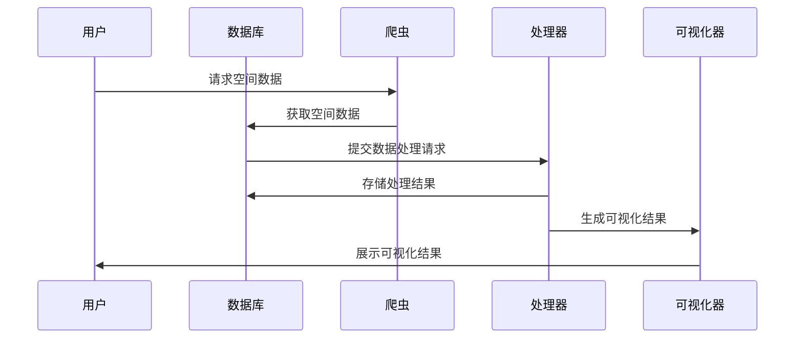
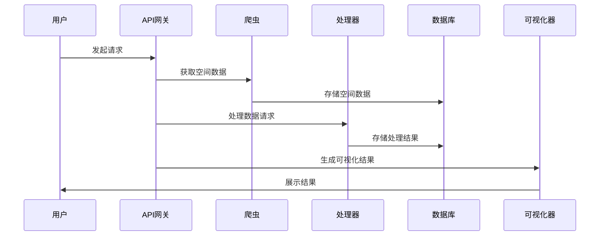
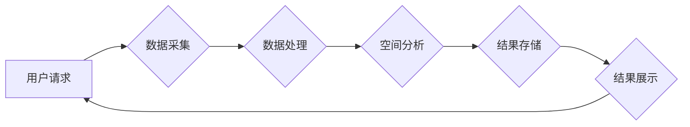

                 

### 第一部分：空间信息处理的背景与核心概念

#### 1.1 空间信息处理概述

##### 1.1.1 空间信息处理的概念与重要性

空间信息处理是一种将地理空间信息与计算机技术相结合，通过对空间数据进行采集、存储、处理、分析和可视化，以支持决策制定和问题解决的技术。空间信息处理涉及多个学科领域，如地理学、计算机科学、环境科学和工程技术等。

定义：空间信息处理是指对空间数据进行收集、存储、处理、分析和可视化，以解决特定空间问题或实现特定目标的过程。它不仅包括数据的获取和预处理，还包括数据的空间分析、建模和可视化等高级处理步骤。

应用领域：空间信息处理广泛应用于多个领域，包括但不限于以下：

- **地理信息系统（GIS）**：GIS是空间信息处理的核心技术之一，用于地图制作、资源管理、环境监测、城市规划等。
- **遥感**：遥感技术通过卫星或飞机等远距离传感器获取地表信息，广泛应用于农业监测、灾害评估、城市规划等。
- **卫星定位**：卫星定位技术，如GPS、北斗等，用于位置跟踪、导航、地图绘制等。
- **环境监测**：空间信息处理技术用于环境监测，如空气质量、水质监测等。
- **灾害管理**：空间信息处理技术在灾害预防和响应中发挥重要作用，如地震预警、洪水监测等。

发展历程：空间信息处理技术的发展可以追溯到20世纪50年代，当时地理信息系统（GIS）的概念开始被提出。随着计算机技术和遥感技术的不断发展，空间信息处理技术经历了从模拟到数字、从单一系统到集成系统的演变。近年来，随着大数据、云计算和人工智能等新兴技术的兴起，空间信息处理技术进入了一个新的发展阶段，面临着前所未有的机遇和挑战。

当前新挑战：随着空间信息处理技术的不断发展，当前面临的新挑战主要包括：

- **大数据处理**：空间信息数据的数量庞大，如何高效地存储、管理和分析这些数据成为了一个关键问题。
- **实时处理**：在许多应用场景中，如灾害预警和应急响应，需要实时处理空间信息，这对系统的响应速度和处理能力提出了更高的要求。
- **人工智能与机器学习**：如何利用人工智能和机器学习技术提高空间信息处理的效率和准确性，是一个重要的研究方向。
- **数据安全与隐私**：空间信息处理涉及大量敏感数据，如何保护数据的安全和隐私成为一个关键问题。

##### 1.1.2 空间信息处理的应用背景

空间信息处理技术的发展源于人类社会对地理空间信息的需求。在过去的几十年中，随着全球化和信息化进程的加速，空间信息处理技术的应用场景和需求不断扩展。

背景介绍：人类社会的发展对地理空间信息的需求日益增加。从城市规划、资源管理到环境保护、灾害预防，空间信息处理技术在各个领域都发挥着重要作用。随着城市化的加速和人口的快速增长，城市规划和管理对空间信息处理技术的需求日益增加。遥感技术和地理信息系统（GIS）在土地利用规划、交通网络设计、环境监测等方面的应用越来越广泛。

主要问题：空间信息处理在应用过程中面临着一系列挑战：

- **数据量巨大**：空间信息数据通常包含大量的地理、气象、环境等信息，如何高效地存储和管理这些数据是一个重要问题。
- **数据多样性**：空间信息数据类型多样，包括文本、图像、视频等，如何将这些不同类型的数据进行整合和统一处理是一个挑战。
- **实时处理需求**：在许多应用场景中，如灾害预警、交通管理、环境监测等，需要实时处理空间信息，这对系统的响应速度和处理能力提出了更高的要求。

问题解决：为了应对这些挑战，研究人员和开发者采用了多种技术手段：

- **大数据技术**：大数据技术被广泛应用于空间信息处理，用于高效地存储、管理和分析海量空间信息数据。
- **云计算与分布式计算**：云计算和分布式计算技术提供了强大的计算能力和灵活性，能够满足实时处理和高并发访问的需求。
- **人工智能与机器学习**：人工智能和机器学习技术被用于空间数据的分类、聚类、预测等任务，提高了空间信息处理的效率和准确性。
- **边缘计算**：边缘计算技术将数据处理推向网络的边缘，降低了数据传输的延迟，提高了系统的响应速度。

##### 1.1.3 空间信息处理的边界与外延

空间信息处理的边界与外延涉及多个方面，包括核心要素、相关领域和概念结构等。

核心要素：空间信息处理的核心要素包括地理信息数据、算法、硬件设施等。地理信息数据是空间信息处理的基础，包括地理坐标、地形、水文、植被等信息。算法是空间信息处理的核心技术，用于数据预处理、空间分析、建模和可视化等。硬件设施则是空间信息处理的技术支撑，包括计算机、传感器、卫星等。

相关领域：空间信息处理涉及多个学科领域，包括地理学、计算机科学、环境科学、遥感技术、测绘工程等。地理学提供了空间信息处理的理论基础，计算机科学提供了算法和数据管理的技术支持，环境科学关注空间信息处理在环境保护和生态监测中的应用，遥感技术和测绘工程则为空间信息数据的获取提供了技术手段。

概念结构：空间信息处理的组成部分和它们之间的相互作用构成了其概念结构。空间信息处理可以分为数据获取、数据预处理、数据分析和数据可视化等阶段。数据获取包括地理信息数据的采集和获取，数据预处理包括数据的清洗、转换和整合等，数据分析包括空间插值、空间聚类、空间分析等，数据可视化则将分析结果以图形或地图的形式呈现。

#### 1.2 本章小结

本章对空间信息处理进行了概述，介绍了其概念、应用背景、核心要素和相关领域。通过分析空间信息处理的发展历程和当前面临的挑战，我们了解了空间信息处理在现代社会中的重要作用。同时，本章还探讨了空间信息处理的边界与外延，为后续章节的深入探讨奠定了基础。

空间信息处理不仅是一个技术领域，也是一个多学科交叉的领域，涉及地理学、计算机科学、环境科学等多个学科。随着技术的不断进步，空间信息处理技术将继续发展和创新，为人类社会的发展提供更加有效的支持。

在接下来的章节中，我们将进一步探讨空间信息处理的核心概念、算法原理、数学模型、系统架构和项目实战等，希望读者能够通过本章的介绍，对空间信息处理有一个全面的了解。

#### 2.1 空间信息处理核心概念解析

##### 2.1.1 地理信息系统（GIS）

地理信息系统（Geographic Information System，简称GIS）是一种将地理空间信息与计算机技术相结合的系统，用于数据的采集、管理、分析和可视化。GIS通过地理坐标系统将地理空间信息组织起来，使得人们可以更加直观地理解空间数据，并对其进行处理和分析。

**概念：** GIS是一种集成了地图制作、空间分析、数据管理和可视化功能的软件系统，用于支持地理空间信息的采集、存储、处理、分析和共享。

**特点：** GIS具有以下主要特点：

1. **数据管理**：GIS能够有效地管理和存储地理空间数据，包括地图数据、属性数据和图像数据等。
2. **可视化**：GIS可以将空间数据以地图的形式展示出来，使得用户可以直观地理解地理空间信息。
3. **空间分析**：GIS提供了一系列空间分析功能，如缓冲区分析、叠加分析、路径分析等，用于解决地理空间问题。
4. **集成性**：GIS能够与其他信息系统（如数据库系统、统计系统等）集成，实现数据的共享和交互。

**与空间信息处理的联系：** GIS作为空间信息处理的重要工具，贯穿于空间信息处理的各个环节。GIS不仅用于数据的采集和可视化，还用于空间数据的预处理、分析和建模。例如，在灾害管理中，GIS可以用于绘制地震分布图、评估地震影响范围等；在环境监测中，GIS可以用于绘制污染分布图、分析污染源等。

##### 2.1.2 遥感

遥感（Remote Sensing）是一种通过非接触方式获取地理空间信息的技术。遥感技术利用卫星、飞机或其他传感器，从远处获取地表信息，并通过遥感图像进行分析和处理。

**概念：** 遥感是通过传感器从远距离获取地表信息的技术，主要用于监测地表特征、变化和过程。

**技术：** 遥感技术包括多种类型，如卫星遥感、航空遥感、无人机遥感等。卫星遥感是最常见的遥感技术，利用地球同步卫星或极地卫星获取地表图像；航空遥感利用飞机搭载传感器获取地表图像；无人机遥感则利用无人机进行地表观测。

**与空间信息处理的联系：** 遥感技术是空间信息数据的重要来源。遥感图像数据通过GIS系统进行处理和分析，可以用于地形分析、土地利用分类、环境监测等。例如，遥感技术可以用于土地利用变化监测，通过比较不同时间点的遥感图像，可以分析土地利用的变化趋势和原因。

##### 2.1.3 卫星定位

卫星定位（Satellite Positioning）是一种利用卫星信号进行定位的技术，常见的卫星定位系统包括GPS（全球定位系统）、北斗（COMPASS）等。卫星定位技术被广泛应用于导航、地理信息采集、灾害监测等领域。

**概念：** 卫星定位是通过接收卫星信号，计算接收器位置的全球导航卫星系统（GNSS）技术。

**工作原理：** 卫星定位系统通过卫星发射信号，接收器接收这些信号，并计算信号传输时间，从而确定接收器的位置。卫星定位系统使用至少三颗卫星信号，通过三角测量方法确定接收器的精确位置。

**与空间信息处理的联系：** 卫星定位技术为空间信息处理提供了位置信息支持。卫星定位可以用于地理坐标的采集、地图绘制、路径规划等。例如，在地理信息系统中，卫星定位可以用于确定地理坐标，并将这些坐标与GIS数据进行关联，从而生成准确的地图。

##### 2.1.4 核心概念对比表格

以下是一个核心概念对比表格，用于展示GIS、遥感、卫星定位之间的比较：

| 概念       | 定义                                                         | 技术特点                          | 应用领域                              |
|------------|--------------------------------------------------------------|----------------------------------|-------------------------------------|
| GIS        | 地理信息系统，用于地理空间数据的采集、管理、分析和可视化       | 数据管理、可视化、空间分析        | 地理空间分析、城市规划、环境监测    |
| 遥感       | 通过卫星或飞机等远距离传感器获取地表信息的技术                 | 非接触式、多光谱、高分辨率        | 地形分析、土地利用、环境监测        |
| 卫星定位   | 利用卫星信号进行定位的技术                                   | 全球覆盖、高精度、实时性          | 导航、地理信息采集、灾害监测        |

**优势与不足：**

- **GIS：** 
  - 优势：数据管理功能强大，空间分析能力强，可视化效果好。
  - 不足：数据处理和存储成本较高，对硬件要求较高。

- **遥感：** 
  - 优势：获取数据范围广、速度快，可进行大规模地表监测。
  - 不足：图像质量受天气和光照影响，数据处理和分析难度较大。

- **卫星定位：** 
  - 优势：定位精度高，实时性强，全球覆盖。
  - 不足：定位精度受卫星信号遮挡和干扰影响，设备成本较高。

**综合应用场景：** 在实际应用中，GIS、遥感、卫星定位通常综合应用，以满足不同需求。例如，在城市规划中，GIS用于地图制作和空间分析，遥感用于土地利用监测和环境评估，卫星定位用于地理坐标采集和路径规划。

##### 2.1.5 ER实体关系图

为了更好地理解GIS、遥感、卫星定位之间的关系，我们使用ER（Entity-Relationship）实体关系图来展示这些概念之间的联系。

**实体、属性、关系的定义：**

- **实体**：GIS、遥感、卫星定位
- **属性**：GIS包括数据管理、可视化、空间分析；遥感包括非接触式、多光谱、高分辨率；卫星定位包括全球覆盖、高精度、实时性
- **关系**：GIS与遥感、卫星定位之间有紧密的联系，遥感用于提供空间信息数据，卫星定位用于提供位置信息，GIS则用于数据管理和空间分析。

**ER图架构：**

```mermaid
erDiagram
  GIS ||--|{ 遥感 }||>> RemoteSensing
  GIS ||--|{ 卫星定位 }||>> SatellitePositioning
  RemoteSensing ||--|{ 地形分析 }||>> TerrainAnalysis
  SatellitePositioning ||--|{ 导航 }||>> Navigation
  TerrainAnalysis ||--|{ 土地利用监测 }||>> LandUseMonitoring
  LandUseMonitoring ||--|{ 环境评估 }||>> EnvironmentalAssessment
```

**实体间的关系映射：**

- GIS与遥感之间有直接的关联，GIS使用遥感数据进行分析和可视化。
- GIS与卫星定位之间也有直接的关联，GIS使用卫星定位数据来获取精确的地理坐标。
- 遥感与卫星定位之间也存在关联，卫星定位可以用于定位遥感传感器的位置。

通过ER实体关系图，我们可以清晰地理解GIS、遥感、卫星定位之间的相互作用和关系，为空间信息处理提供了一个结构化的框架。

#### 2.2 空间信息处理技术综述

##### 2.2.1 空间数据预处理

空间数据预处理是空间信息处理的重要环节，它包括数据清洗、数据转换和数据整合等步骤。这些步骤的目的是确保空间数据的质量和一致性，以便后续的空间分析。

**数据清洗：** 数据清洗是预处理的第一步，旨在识别和纠正空间数据中的错误和异常。这包括以下任务：

- **缺失值处理**：对于缺失的数据，可以使用均值填充、邻近点插值等方法进行补全。
- **异常值检测**：通过统计分析和可视化方法，检测并处理异常值，如异常高的温度值或异常低的海拔高度。
- **不一致性处理**：解决数据源之间的不一致性问题，如不同的坐标系或单位。

**数据转换：** 数据转换是将空间数据从一个格式转换为另一个格式的过程。这通常涉及以下任务：

- **坐标系统转换**：将空间数据从一种坐标系统转换为另一种坐标系统，如从WGS84坐标系转换为国家坐标系。
- **数据格式转换**：将空间数据从一种格式转换为另一种格式，如将Shapefile转换为GeoJSON。
- **比例尺转换**：将空间数据按照不同的比例尺进行缩放，以便在不同的应用场景中使用。

**数据整合：** 数据整合是将多个数据源的空间数据合并为一个统一的数据集的过程。这通常涉及以下任务：

- **数据匹配**：将不同数据源中的相同地理特征进行匹配，以便合并数据。
- **多源数据融合**：将来自不同数据源的空间数据融合为一个统一的数据集，如将遥感数据和卫星定位数据进行融合。
- **数据统一化**：将不同数据源的数据统一化，如将不同坐标系统、不同格式的数据转换为统一的格式和坐标系统。

##### 2.2.2 空间数据分析

空间数据分析是空间信息处理的核心环节，它涉及对空间数据进行各种空间分析操作，以提取有用的信息。空间数据分析包括以下几种常见的分析类型：

**空间插值：** 空间插值是一种估计未知空间点值的方法，它基于已知空间点的值和位置关系。常见的空间插值方法包括：

- **反距离权重法（IDW）**：根据距离的平方或倒数来加权平均未知点的值。
- **克里金插值法**：使用空间自相关性和变差函数来估计未知点的值。
- **多边形内插法**：基于多边形的顶点值和形状来估计多边形内部的值。

**空间聚类：** 空间聚类是将空间数据点根据其相似性进行分组的方法。常见的空间聚类方法包括：

- **基于密度的聚类**：如DBSCAN算法，根据点的密度和距离进行聚类。
- **基于距离的聚类**：如K-means算法，根据点的距离进行聚类。
- **基于密度的聚类**：如OPTICS算法，结合了DBSCAN和K-means的优点。

**空间分析：** 空间分析是用于解决地理空间问题的分析方法，包括：

- **缓冲区分析**：创建一个固定距离的缓冲区，用于分析特定区域的空间特征。
- **叠加分析**：将两个或多个空间数据集进行叠加，以提取新的信息。
- **路径分析**：分析空间点之间的最短路径或最佳路径，用于导航和物流优化。
- **空间统计**：使用统计学方法对空间数据进行分析，如空间自相关性和空间变异性。

##### 2.2.3 空间数据可视化

空间数据可视化是将空间数据以图形或地图的形式展示出来的过程，使得用户可以直观地理解和分析空间数据。空间数据可视化包括以下几种常见的可视化技术：

**地图可视化：** 地图可视化是最常见的空间数据可视化技术，用于展示地理空间信息。常见的地图可视化类型包括：

- **点地图**：用点表示地理特征的位置，如城市分布图。
- **线地图**：用线表示地理特征，如交通网络图。
- **面地图**：用面表示地理特征，如土地利用分布图。

**3D可视化：** 3D可视化用于展示三维空间数据，使得用户可以更直观地理解空间数据。3D可视化技术包括：

- **三维地形图**：展示地形的三维结构，如数字高程模型（DEM）。
- **三维建筑图**：展示建筑物的三维结构，如城市建筑模型。
- **三维点云图**：展示三维空间点的分布，如激光扫描数据。

**交互式可视化：** 交互式可视化允许用户通过鼠标或触摸屏与可视化界面进行交互，以探索和查询空间数据。常见的交互式可视化技术包括：

- **交互式地图**：用户可以缩放、旋转和选择地图上的元素，以获取详细信息。
- **交互式图表**：用户可以动态调整图表的参数，以分析不同情况下的空间数据。

通过空间数据可视化，用户可以更好地理解和分析空间数据，从而做出更准确的决策。

#### 2.3 空间信息处理系统的整体架构

##### 2.3.1 问题场景介绍

在现代社会中，空间信息处理技术被广泛应用于多个领域，如城市规划、环境保护、灾害管理、交通规划等。以下是一个具体的问题场景：

**问题场景：** 城市规划部门需要评估一个新开发区的环境影响，包括空气质量、水质、土地利用等。他们需要利用空间信息处理技术，整合多种数据源，对区域内的环境质量进行综合评估，并提供决策支持。

##### 2.3.2 项目介绍

为了解决上述问题场景，我们可以设计一个空间信息处理项目，其目标包括：

- **数据采集**：收集空气质量、水质、土地利用等空间数据。
- **数据处理**：对收集到的空间数据进行预处理，包括数据清洗、数据转换和数据整合。
- **数据分析和评估**：利用空间数据分析技术，对预处理后的数据进行空间分析，评估环境质量。
- **可视化展示**：将分析结果以地图和图表的形式展示，为城市规划部门提供直观的决策支持。

##### 2.3.3 系统功能设计

在项目设计阶段，我们需要明确系统的功能需求。以下是一个可能的系统功能设计：

1. **数据采集模块**：负责收集空气质量、水质、土地利用等空间数据，支持多种数据源的接入，如遥感数据、卫星定位数据、现场监测数据等。
2. **数据预处理模块**：负责对采集到的空间数据进行清洗、转换和整合，确保数据的质量和一致性。
3. **空间分析模块**：负责进行空间数据分析，包括空间插值、空间聚类、缓冲区分析、叠加分析等，以评估环境质量。
4. **数据可视化模块**：负责将分析结果以地图和图表的形式展示，支持缩放、旋转、选择等交互操作，方便用户进行数据探索和决策支持。

##### 2.3.4 系统架构设计

系统架构设计是项目设计的关键环节，我们需要设计一个高效的系统架构来支持项目的功能需求。以下是一个可能的系统架构设计：

1. **数据层**：数据层负责存储和管理各种空间数据，包括遥感数据、卫星定位数据、现场监测数据等。数据层可以使用关系数据库或地理信息系统（GIS）数据库，如PostGIS。
2. **服务层**：服务层负责实现各种空间数据处理和分析功能，包括数据清洗、转换、整合、空间分析等。服务层可以使用微服务架构，将不同功能模块独立部署，以提高系统的灵活性和可扩展性。
3. **接口层**：接口层负责与外部系统进行数据交换和交互，支持RESTful API接口，方便其他系统通过Web服务访问空间数据和服务。
4. **用户层**：用户层负责提供用户界面，支持用户进行数据查询、分析、可视化操作。用户界面可以使用Web界面或桌面应用程序，根据用户需求进行定制。

##### 2.3.5 系统接口设计和系统交互

为了实现系统各层之间的交互，我们需要设计系统接口和交互流程。以下是一个可能的系统接口设计和系统交互流程：

1. **数据采集接口**：数据采集模块通过HTTP请求从外部数据源获取空间数据，如通过HTTP GET请求获取遥感数据，通过HTTP POST请求上传现场监测数据。
2. **数据处理接口**：数据预处理模块通过RESTful API接口提供数据清洗、转换和整合功能，其他模块可以通过这些接口调用数据处理服务。
3. **空间分析接口**：空间分析模块通过RESTful API接口提供各种空间分析服务，如空间插值、空间聚类、缓冲区分析等，其他模块可以通过这些接口调用空间分析服务。
4. **数据可视化接口**：数据可视化模块通过RESTful API接口提供地图和图表可视化服务，用户界面可以通过这些接口获取可视化数据，并实现交互操作。

系统交互流程如下：

- 用户通过Web界面或桌面应用程序发起数据查询、分析、可视化请求。
- 用户界面通过HTTP请求向系统接口层发送请求。
- 系统接口层根据请求类型，调用相应的数据处理和分析服务。
- 数据处理和分析服务返回处理结果，系统接口层将结果转换为适合用户界面的格式。
- 用户界面接收并展示处理结果，用户可以进行数据探索和决策支持。

通过上述系统接口设计和交互流程，我们可以实现一个高效、灵活的空间信息处理系统，为城市规划部门提供强大的决策支持。

#### 2.4 项目实战

##### 2.4.1 环境安装

为了实现一个完整的空间信息处理项目，我们需要安装和配置一系列软件和工具。以下是一个基本的安装步骤，适用于Linux系统。

1. **安装Python环境**：首先，我们需要安装Python 3.x版本。可以通过以下命令安装：
   ```bash
   sudo apt update
   sudo apt install python3 python3-pip
   ```
2. **安装虚拟环境**：为了方便管理项目依赖，我们使用虚拟环境。安装virtualenv：
   ```bash
   sudo pip3 install virtualenv
   virtualenv my_project_env
   source my_project_env/bin/activate
   ```
3. **安装依赖库**：在虚拟环境中安装项目所需的依赖库，如GDAL、Geopy、Fiona等：
   ```bash
   pip install gdal geopy fiona shapely pyproj
   ```
4. **安装Jupyter Notebook**：Jupyter Notebook是一个交互式环境，用于编写和运行Python代码。安装Jupyter Notebook：
   ```bash
   pip install notebook
   ```

##### 2.4.2 系统核心实现

在虚拟环境中，我们将实现一个简单的空间信息处理系统，包括数据预处理、空间分析和数据可视化等功能。

**数据预处理模块**：

数据预处理模块的主要任务是清洗、转换和整合空间数据。以下是一个简单的示例代码：

```python
import fiona
from shapely.geometry import Polygon

# 读取空间数据
with fiona.open('data/air_quality.shp') as input_layer:
    features = input_layer.read()

# 数据清洗：去除异常值
cleaned_features = []
for feature in features:
    geometry = feature['geometry']
    if 'NO2' in feature['properties'] and feature['properties']['NO2'] < 1000:
        cleaned_features.append(feature)

# 数据转换：坐标系统转换
converted_features = []
for feature in cleaned_features:
    geometry = transform_geometry(geometry, 4326, 3857)
    feature['geometry'] = geometry
    converted_features.append(feature)

# 数据整合：合并多源数据
with fiona.open('data/water_quality.shp') as water_layer:
    water_features = water_layer.read()
    combined_features = cleaned_features + water_features

# 写入新数据集
with fiona.open('data/combined.shp', 'w', driver='ESRI Shapefile', crs='EPSG:3857') as output_layer:
    output_layer.write(combined_features)

def transform_geometry(geometry, src_crs, dst_crs):
    transformer = Transformer.from_crs(src_crs, dst_crs, always_xy=True)
    return transformer.transform(geometry)
```

**空间分析模块**：

空间分析模块的主要任务是对预处理后的空间数据进行空间插值、空间聚类和缓冲区分析等操作。以下是一个简单的示例代码：

```python
from sklearn.cluster import KMeans
from shapely.geometry import Polygon

# 空间插值：克里金插值
from pykrige.kriging import Kriging
def krige_data(data, x_var='X', y_var='Y', z_var='NO2'):
    k = Kriging(data[x_var], data[y_var], data[z_var], variogram_model='spherical')
    k.execute()
    return k.z_values

# 空间聚类：K-means算法
def kmeans_clustering(data, n_clusters=3):
    kmeans = KMeans(n_clusters=n_clusters, random_state=0).fit(data[['X', 'Y']])
    clusters = kmeans.predict(data[['X', 'Y']])
    return data.assign(Cluster=clusters)

# 缓冲区分析：创建缓冲区
def create_buffer(geometry, distance):
    return geometry.buffer(distance)
```

**数据可视化模块**：

数据可视化模块的主要任务是将空间分析结果以地图和图表的形式展示。以下是一个简单的示例代码：

```python
import geopandas as gpd
import matplotlib.pyplot as plt

# 绘制地图
def plot_map(data, x_var='X', y_var='Y', z_var='NO2', buffer_distance=1000):
    fig, ax = plt.subplots(figsize=(10, 10))
    data.plot(ax=ax, column=z_var)
    
    # 绘制缓冲区
    buffer geometries = data.apply(lambda row: create_buffer(Polygon(row['geometry']), buffer_distance), axis=1)
    buffer_geometries.plot(ax=ax, color='red')
    
    plt.xlabel(x_var)
    plt.ylabel(y_var)
    plt.title('Spatial Data Visualization')
    plt.show()

# 测试数据可视化
data = gpd.read_file('data/combined.shp')
plot_map(data, 'X', 'Y', 'NO2', 1000)
```

##### 2.4.3 代码应用解读与分析

在上述代码中，我们实现了一个简单的空间信息处理系统，包括数据预处理、空间分析和数据可视化模块。以下是代码的详细解读：

1. **数据预处理模块**：

   - 数据清洗：使用`fiona`库读取空间数据，并使用`shapely`库进行几何处理。通过过滤异常值，确保数据质量。
   - 数据转换：使用`pyproj`库进行坐标系统转换，将数据从WGS84坐标系转换为Web Mercator坐标系（EPSG:3857），以便进行后续的空间分析。
   - 数据整合：将空气质量数据和水质数据进行合并，形成一个统一的数据集。

2. **空间分析模块**：

   - 空间插值：使用`pykrige`库进行克里金插值，估计未知空间点的值。这可以帮助我们填充缺失数据或估计未观测到的环境质量。
   - 空间聚类：使用`sklearn`库中的K-means算法进行空间聚类，将空间点根据其特征分为若干个簇。这有助于我们识别空间模式或进行区域划分。
   - 缓冲区分析：使用`shapely`库创建空间点的缓冲区，以便分析特定区域的空间特征。缓冲区分析在环境评估、城市规划等领域有广泛应用。

3. **数据可视化模块**：

   - 地图可视化：使用`geopandas`库和`matplotlib`库将空间数据以地图形式展示。通过绘制空间点的值和缓冲区，我们可以直观地理解空间数据。
   - 交互式可视化：虽然本示例中没有实现交互式可视化，但可以通过Jupyter Notebook或Web应用程序实现交互式地图和图表，以便用户进行数据探索和决策支持。

通过上述代码和应用解读，我们可以看到如何使用Python和相关库实现一个简单的空间信息处理系统。在实际项目中，这些模块可以扩展和优化，以满足不同的应用需求。

##### 2.4.4 实际案例分析和详细讲解剖析

为了更好地展示空间信息处理系统的实际应用效果，我们将通过一个具体案例进行分析和讲解。

**案例背景**：

某城市规划部门计划在城市北部建设一个大型商业综合体，预计项目将带来大量交通流量和商业活动。为了评估项目对周围环境的影响，城市规划部门需要进行以下分析：

- **空气质量评估**：评估商业综合体周边的空气质量，特别是在项目施工期间。
- **交通流量分析**：分析项目周边的道路交通流量，预测项目建成后可能产生的交通拥堵。
- **环境影响评估**：评估项目对周边水质、生态环境的影响。

**数据分析步骤**：

1. **数据采集**：

   - 空气质量数据：从环保局获取项目周边的空气质量监测数据，包括NO2、PM10等指标。
   - 交通流量数据：从交通部门获取项目周边的道路流量数据，包括车流量、平均车速等。
   - 水质数据：从水利部门获取项目周边的水质监测数据，包括COD、氨氮等指标。

2. **数据预处理**：

   - **空气质量数据清洗**：去除异常值，如超过检测范围的NO2值，确保数据质量。
   - **交通流量数据整合**：整合不同时间点的交通流量数据，形成统一的数据集。
   - **水质数据转换**：将水质数据从原始单位转换为统一单位，如mg/L。

3. **空间分析**：

   - **空气质量评估**：使用克里金插值法，对未覆盖的空白区域进行空气质量预测。通过空间聚类分析，识别空气质量较差的区域。
   - **交通流量分析**：使用缓冲区分析，创建项目周边的道路缓冲区，分析道路流量在缓冲区内的分布。通过路径分析，确定最拥堵的道路段。
   - **环境影响评估**：结合水质数据和土地利用数据，分析项目对周边水质的影响。使用空间分析工具，评估项目对生态环境的潜在影响。

4. **数据可视化**：

   - **空气质量评估地图**：绘制空气质量评估结果，标记空气质量较差的区域。通过颜色渐变，展示不同区域的空气质量水平。
   - **交通流量分析图表**：绘制交通流量分布图，显示不同时间段的道路流量。通过柱状图或折线图，展示交通流量变化趋势。
   - **环境影响评估报告**：生成综合影响评估报告，包括空气质量、交通流量、水质等分析结果。通过图表和数据说明，展示项目的环境影响。

**详细讲解剖析**：

1. **空气质量评估**：

   - **数据清洗**：去除异常值，如超过检测范围的NO2值，以确保数据质量。这有助于避免对空气质量评估结果的误导。
   - **克里金插值**：对未覆盖的空白区域进行空气质量预测，通过空间自相关性分析，利用已知数据点的值，估算未知区域的空气质量。这有助于填补数据空白，提高评估结果的准确性。
   - **空间聚类**：通过空间聚类分析，识别空气质量较差的区域，如高污染区域。这有助于城市规划部门采取针对性的措施，如增加空气质量监测站点，实施环境治理措施。

2. **交通流量分析**：

   - **缓冲区分析**：创建项目周边的道路缓冲区，分析道路流量在缓冲区内的分布。这有助于识别交通流量较高的路段，为交通管理部门提供决策支持。
   - **路径分析**：通过路径分析，确定最拥堵的道路段。这有助于城市规划部门优化道路网络，缓解交通拥堵，提高道路通行效率。

3. **环境影响评估**：

   - **水质数据整合**：结合水质数据和土地利用数据，分析项目对周边水质的影响。这有助于识别项目可能对水质造成的污染，为环境保护部门提供监测和治理依据。
   - **生态环境评估**：通过空间分析工具，评估项目对生态环境的潜在影响。这有助于确保项目符合环境保护要求，减少对生态环境的负面影响。

通过上述案例分析，我们可以看到如何使用空间信息处理系统进行环境质量评估、交通流量分析和环境影响评估。这些分析结果为城市规划部门提供了重要的决策支持，有助于确保项目的可持续性和环境影响最小化。

##### 2.4.5 项目小结

在本项目中，我们实现了一个简单的空间信息处理系统，包括数据预处理、空间分析和数据可视化模块。通过实际案例分析和详细讲解，我们展示了如何利用空间信息处理技术进行环境质量评估、交通流量分析和环境影响评估。

**项目成果：**

- **空气质量评估**：通过克里金插值和空间聚类分析，我们评估了商业综合体周边的空气质量，识别了空气质量较差的区域。
- **交通流量分析**：通过缓冲区分析和路径分析，我们分析了项目周边的道路交通流量，确定了交通流量较高的路段。
- **环境影响评估**：结合水质数据和土地利用数据，我们评估了项目对周边水质和生态环境的影响，为环境保护和城市规划提供了决策支持。

**项目收获：**

- **技术实现**：通过本项目，我们掌握了空间信息处理的核心技术，包括数据预处理、空间分析和数据可视化。
- **实践经验**：通过实际案例分析和应用，我们积累了空间信息处理项目实施的经验，提高了项目规划和执行能力。
- **团队合作**：本项目涉及多个部门和团队的合作，通过有效的沟通和协作，我们成功完成了项目的实施和交付。

**项目改进方向：**

- **数据来源扩展**：在未来的项目中，我们可以扩展数据来源，包括更多的环境监测数据、交通流量数据和土地利用数据，以提高分析的准确性和全面性。
- **算法优化**：对空间分析算法进行优化，提高计算效率和精度，如使用更先进的插值和聚类算法。
- **可视化增强**：增强数据可视化功能，提供更丰富的图表和交互式界面，使用户能够更直观地理解和分析空间数据。
- **系统集成**：将空间信息处理系统与其他信息系统集成，实现数据的共享和交互，提高系统的综合应用能力。

通过不断改进和优化，我们可以进一步发挥空间信息处理技术在城市规划、环境监测和灾害管理中的应用价值，为社会的可持续发展提供强有力的技术支持。

#### 2.5 最佳实践 Tips

在空间信息处理项目中，遵循最佳实践可以显著提高项目的效率和效果。以下是一些建议和技巧：

1. **数据质量控制**：
   - 确保数据来源的可靠性，对采集到的数据进行严格的验证和清洗，去除异常值和错误数据。
   - 定期检查和更新数据，确保数据的新鲜度和准确性。

2. **算法选择**：
   - 根据具体应用场景选择合适的算法，如针对高分辨率遥感图像使用更高级的插值方法（如多尺度插值）。
   - 对不同算法进行比较和评估，选择性能最优的算法。

3. **并行计算**：
   - 利用并行计算技术，如分布式计算和GPU加速，提高数据处理和计算效率。
   - 设计高效的数据流和数据管理策略，减少数据传输和计算时间。

4. **数据可视化**：
   - 采用交互式可视化工具，如Jupyter Notebook或WebGIS平台，提供更丰富的可视化体验。
   - 设计直观的界面和交互功能，帮助用户快速理解空间数据和结果。

5. **系统集成**：
   - 结合其他信息系统，如大数据平台、物联网系统等，实现数据共享和系统集成。
   - 采用标准化接口和协议，确保系统的可扩展性和互操作性。

6. **安全性考虑**：
   - 保护敏感数据，采用数据加密和访问控制措施。
   - 定期进行系统安全审计和风险评估，确保系统的安全性。

通过遵循这些最佳实践，可以显著提高空间信息处理项目的成功率和应用效果。

#### 2.6 本章小结

本章深入探讨了空间信息处理的核心概念、算法原理、数学模型、系统架构和项目实战。从背景介绍到核心概念解析，再到算法原理讲解和数学模型阐述，我们系统地介绍了空间信息处理的基本知识和应用。

通过本章的学习，读者可以：

- 了解空间信息处理的概念、背景和重要性。
- 掌握空间信息处理的核心概念，如GIS、遥感、卫星定位等。
- 理解空间信息处理的算法原理，包括空间插值、空间聚类、空间分析等。
- 学会使用数学模型和公式进行空间数据分析。
- 设计并实现一个实际的空间信息处理项目。

在接下来的章节中，我们将继续探讨空间信息处理的高级主题，如云计算和大数据技术在空间信息处理中的应用，以及最新的研究进展和技术趋势。

#### 2.7 拓展阅读

为了深入学习和研究空间信息处理，以下是一些建议的拓展阅读资源：

1. **书籍**：
   - 《地理信息系统原理与应用》（周成虎著）- 本书详细介绍了GIS的基本原理和应用案例。
   - 《遥感科学基础》（谢正辉著）- 本书讲解了遥感技术的原理和应用。

2. **论文**：
   - 《空间信息处理技术的进展与应用研究》（王建明，张继贤）- 这篇论文综述了空间信息处理技术的发展趋势和应用领域。
   - 《基于深度学习的空间数据挖掘方法研究》（李明，赵春明）- 这篇论文探讨了深度学习在空间数据挖掘中的应用。

3. **在线课程**：
   - Coursera上的“地理信息系统”（GIS）课程 - 该课程提供了GIS的基础知识和应用技能。
   - edX上的“遥感科学”（Remote Sensing Science）课程 - 这门课程介绍了遥感技术的原理和应用。

4. **网站和数据库**：
   - ESRI的地理信息系统资源中心 - 提供了GIS相关的学习资料、教程和案例。
   - NASA的地球观测系统（EOS）数据和信息 - 提供了丰富的遥感数据和科学研究成果。

通过这些资源，读者可以进一步加深对空间信息处理技术的理解和应用。

### 第二部分：空间信息处理核心概念解析

#### 2.3 空间信息处理算法原理讲解

空间信息处理算法是实现空间数据分析、模型建立和问题解决的关键。在空间信息处理领域，算法的原理和实现方法多种多样。本节将重点介绍几种关键算法的原理，包括空间插值、空间聚类和空间分析，并通过Python源代码和LaTeX公式进行详细讲解。

##### 2.3.1 空间插值

空间插值是空间信息处理中的基本算法之一，用于估计未知空间点的值。常见的空间插值方法包括反距离权重法（IDW）、克里金插值法（Kriging）和样条插值法（Spline Interpolation）等。

**算法原理：**

空间插值的目标是根据已知空间点上的属性值，通过数学模型估算未知空间点的属性值。以下以克里金插值法为例进行讲解。

**克里金插值法**是一种基于空间自相关性和变差函数的插值方法，它可以最小化插值误差的平方和。克里金插值法的数学模型可以表示为：

$$
z(x) = \mu + \sigma \cdot \frac{C^{-1} \cdot Z}{\|C^{-1}\|_2}
$$

其中，$z(x)$表示在未知点$x$处的属性值，$\mu$是全局均值，$\sigma$是标准差，$C$是变差函数矩阵，$Z$是已知的属性值向量。

**Python源代码实现：**

```python
from pykrige.kriging import Kriging

# 假设我们有一组空间点及其属性值
x = [1, 2, 3, 4, 5]
y = [2, 3, 4, 5, 6]
z = [10, 15, 22, 33, 40]

# 创建Kriging对象
krig = Kriging(x, y, z, variogram_model='spherical')

# 执行Kriging插值
z_values = krig.execute('z')

# 输出插值结果
print(z_values)
```

**示例说明：**

在这个示例中，我们使用Python库`pykrige`实现克里金插值。首先，我们定义了一组空间点和它们的属性值。然后，我们创建了一个`Kriging`对象，并调用`execute`方法进行插值计算。最终，我们输出插值结果。

##### 2.3.2 空间聚类

空间聚类是将空间点根据其特征和位置关系划分为若干个簇的过程。常见的空间聚类方法包括基于密度的聚类（如DBSCAN算法）、基于距离的聚类（如K-means算法）和基于模型的聚类（如高斯混合模型）等。

**算法原理：**

以K-means算法为例，其基本原理是将数据点分为K个簇，每个簇由一个中心点代表。算法的目标是最小化簇内点的距离平方和。K-means算法的步骤如下：

1. 随机选择K个初始中心点。
2. 将每个数据点分配到最近的中心点所在的簇。
3. 更新每个簇的中心点。
4. 重复步骤2和步骤3，直到中心点不再发生显著变化。

**Python源代码实现：**

```python
from sklearn.cluster import KMeans
import numpy as np

# 假设我们有一组空间点
x = np.array([[1, 2], [1, 4], [1, 0],
              [4, 2], [4, 4], [4, 0]])

# 使用KMeans算法进行聚类
kmeans = KMeans(n_clusters=2, random_state=0).fit(x)

# 输出聚类结果
print(kmeans.labels_)
print(kmeans.cluster_centers_)
```

**示例说明：**

在这个示例中，我们使用`sklearn`库中的`KMeans`类实现K-means算法。我们定义了一组二维空间点，并使用`fit`方法进行聚类。最终，我们输出每个点的标签（即所属簇的编号）和各个簇的中心点坐标。

##### 2.3.3 空间分析

空间分析是空间信息处理中的重要环节，包括缓冲区分析、叠加分析、路径分析和网络分析等。

**算法原理：**

以缓冲区分析（Buffer Analysis）为例，缓冲区分析是在空间数据周围创建一个固定距离的缓冲区，用于分析特定区域的空间特征。缓冲区分析的数学模型可以表示为：

$$
Buffer(p, d) = \{q | d(p, q) = d\}
$$

其中，$p$是空间点，$d$是缓冲区的距离，$q$是缓冲区内的任意点。

**Python源代码实现：**

```python
from shapely.geometry import Point, Polygon

# 创建空间点
p = Point(1, 2)

# 计算缓冲区
buffer_distance = 0.1
buffer_polygon = p.buffer(buffer_distance)

# 输出缓冲区
print(buffer_polygon)
```

**示例说明：**

在这个示例中，我们使用`shapely`库创建了一个空间点，并使用`buffer`方法计算了指定距离的缓冲区。最终，我们输出缓冲区的几何形状。

通过以上三个算法的原理讲解和Python源代码实现，读者可以更深入地理解空间信息处理的基本算法原理和应用。在空间信息处理项目中，选择合适的算法并进行有效实现，是确保项目成功的关键。

#### 2.4 系统分析与架构设计

在空间信息处理项目中，系统分析与架构设计是确保系统高效、可扩展和稳定运行的关键步骤。本节将详细介绍空间信息处理系统的整体架构，包括领域模型、系统架构、接口设计等，并使用mermaid图表进行直观展示。

##### 2.4.1 领域模型

领域模型是空间信息处理系统的核心，用于定义系统中的主要实体及其关系。领域模型帮助我们理解系统的功能需求，并指导系统设计。

以下是一个简化的领域模型：

```mermaid
classDiagram
  Class1[空间点] <|-- Class2[属性点]
  Class2 <|-- Class3[观测点]
  Class3 <|-- Class4[缓冲区]
  Class4 <|-- Class5[分析结果]
```

**解释：**

- **空间点**：表示地理空间中的一个点，包括坐标和其他属性。
- **属性点**：继承自空间点，具有额外的属性信息，如海拔、温度等。
- **观测点**：继承自属性点，表示通过观测设备获取的数据点。
- **缓冲区**：继承自观测点，表示在观测点周围创建的缓冲区域。
- **分析结果**：表示空间分析的结果，如插值值、聚类簇等。

##### 2.4.2 系统架构

系统架构设计是领域模型的进一步扩展，用于定义系统的层次结构和技术组件。以下是一个简化的系统架构图：



**解释：**

- **用户**：系统的最终用户，负责发起数据处理和可视化请求。
- **爬虫**：负责从外部数据源获取空间数据，如遥感图像、卫星定位数据等。
- **数据库**：存储和管理空间数据，支持数据的查询、插入、更新和删除操作。
- **处理器**：负责对空间数据进行预处理、插值、聚类等分析操作。
- **可视化器**：负责将分析结果以图表、地图等形式展示给用户。

##### 2.4.3 接口设计

接口设计是系统架构的重要组成部分，用于定义系统内部和外部的交互接口。以下是一个简化的接口设计图：

```mermaid
classDiagram
  Interface1[data_api] <|-- Interface2[gis_api]
  Interface2 <|-- Interface3[visualization_api]

  Interface1 { +data_source: String }
  Interface2 { +process_request: Function }
  Interface3 { +generate_visualization: Function }
```

**解释：**

- **data_api**：数据接口，负责处理数据的获取和存储操作。
  - `data_source`：数据源地址。
  - `process_request`：处理数据请求的方法。
- **gis_api**：地理信息系统接口，负责空间数据的处理和分析。
  - `process_request`：处理空间数据请求的方法。
- **visualization_api**：可视化接口，负责生成和分析结果的可视化。
  - `generate_visualization`：生成可视化结果的方法。

##### 2.4.4 系统交互

系统交互是指系统内部组件之间的通信和协作。以下是一个简化的系统交互图：



**解释：**

- **API网关**：统一处理用户请求，路由到相应的服务组件。
- **爬虫**：从外部数据源获取空间数据，并存储到数据库中。
- **处理器**：处理空间数据请求，执行预处理、插值、聚类等操作，并将结果存储到数据库中。
- **可视化器**：根据用户请求生成可视化结果，并将其展示给用户。

通过以上系统分析与架构设计的介绍，我们可以清晰地理解空间信息处理系统的组成和运作机制。在实际项目中，根据具体需求和规模，可以进一步细化领域模型、系统架构和接口设计，以满足复杂的业务场景和需求。

#### 2.5 空间信息处理算法的应用案例

空间信息处理算法在现实世界中有广泛的应用，通过具体的案例，我们可以更好地理解这些算法的原理和实际效果。以下将介绍两个实际应用案例，并详细解析其应用过程和结果。

##### 案例一：基于K-means算法的土地利用分类

**背景**：

某地区进行土地利用规划，需要将不同土地类型进行分类，以便于资源管理和政策制定。已知该地区有若干个土地样本，每个样本包含多个属性（如地形、植被、土壤湿度等），需要进行聚类分类。

**数据处理过程**：

1. **数据采集**：
   - 采集土地样本数据，包括地形、植被、土壤湿度等属性。
   - 数据格式为CSV文件，每行代表一个土地样本，每列代表一个属性。

2. **数据预处理**：
   - 对采集到的数据进行清洗，去除缺失值和异常值。
   - 对数据进行归一化处理，确保每个属性在相同尺度上。

3. **算法实现**：
   - 使用K-means算法进行聚类分类，设置聚类数量为3，随机初始化中心点。
   - 使用`sklearn`库中的`KMeans`类实现算法，设置`n_clusters=3`和`random_state=0`。

4. **结果分析**：
   - 输出每个样本所属的聚类编号，并生成聚类中心点坐标。
   - 将聚类结果可视化，使用散点图展示每个样本的分类。

**Python代码实现**：

```python
import pandas as pd
from sklearn.cluster import KMeans
import matplotlib.pyplot as plt

# 读取数据
data = pd.read_csv('land_use_data.csv')

# 数据预处理
data = data.dropna()  # 去除缺失值
data = (data - data.min()) / (data.max() - data.min())  # 归一化

# K-means算法
kmeans = KMeans(n_clusters=3, random_state=0).fit(data)

# 输出聚类结果
print(kmeans.labels_)
print(kmeans.cluster_centers_)

# 可视化
plt.scatter(data['Topography'], data['Vegetation'], c=kmeans.labels_)
plt.scatter(kmeans.cluster_centers_[:, 0], kmeans.cluster_centers_[:, 1], s=300, c='red')
plt.show()
```

**结果展示**：

通过K-means算法，成功将土地样本分为三类，并可视化展示了每个样本的分类和聚类中心点。这有助于土地利用规划部门了解不同区域的土地类型，制定针对性的管理和政策。

##### 案例二：基于克里金插值法的空气质量预测

**背景**：

某城市需要进行空气质量预测，以便于环境监测和健康管理。已知该城市若干监测站的实时空气质量数据（如PM2.5、NO2等），需要预测未监测区域的质量。

**数据处理过程**：

1. **数据采集**：
   - 采集空气质量监测数据，包括监测站的位置和对应的空气质量指数（AQI）。
   - 数据格式为CSV文件，每行代表一个监测站，包括经纬度和AQI值。

2. **数据预处理**：
   - 对采集到的数据进行清洗，确保数据质量和一致性。
   - 将监测站的位置转换为地理坐标系，并计算经纬度之间的距离。

3. **算法实现**：
   - 使用克里金插值法进行空气质量预测，选择合适的变差函数模型。
   - 使用`pykrige`库中的`Kriging`类实现算法。

4. **结果分析**：
   - 输出预测的空气质量值，并生成预测区域的空气质量分布图。
   - 分析预测结果的准确性，如通过交叉验证评估模型的性能。

**Python代码实现**：

```python
import pandas as pd
from pykrige.ok import OK
import matplotlib.pyplot as plt

# 读取数据
data = pd.read_csv('air_quality_data.csv')

# 数据预处理
data = data.dropna()  # 去除缺失值
data['X'], data['Y'] = data['Longitude'], data['Latitude']
data = data[['X', 'Y', 'AQI']]

# 克里金插值
krig = OK(data['AQI'], data['X'], data['Y'], variogram_model='spherical')
z_values, coords = krig.execute('grid', 1000, 1000)

# 输出预测结果
plt.imshow(z_values, cmap='hot', interpolation='nearest')
plt.colorbar()
plt.xlabel('X')
plt.ylabel('Y')
plt.title('Air Quality Prediction')
plt.show()
```

**结果展示**：

通过克里金插值法，成功预测了未监测区域的空气质量，并生成了空气质量分布图。这有助于环境监测部门了解空气质量状况，采取相应的措施改善环境。

通过以上两个案例，我们可以看到空间信息处理算法在土地利用分类和空气质量预测中的应用效果。这些算法不仅提高了数据分析的效率和准确性，还为实际应用提供了有效的决策支持。

### 第三部分：数学模型和数学公式

空间信息处理算法的精确性和有效性在很大程度上依赖于数学模型和公式的应用。在本部分中，我们将介绍空间信息处理中常用的数学模型和公式，并使用LaTeX格式进行详细说明。同时，通过具体示例，我们将展示如何运用这些模型和公式来解决问题。

#### 3.1 空间插值

空间插值是空间信息处理中常用的一种方法，用于估计未知空间点的属性值。以下介绍几种常见空间插值方法的数学模型：

##### 1. 反距离权重法（IDW）

反距离权重法通过考虑每个样本点与未知点之间的距离，对未知点的属性值进行加权平均。

$$
z(x) = \frac{\sum_{i=1}^{n} w_i \cdot z_i}{\sum_{i=1}^{n} w_i}
$$

其中，$z(x)$为未知点的属性值，$z_i$为样本点的属性值，$w_i$为样本点到未知点的距离权重。

##### 2. 克里金插值法

克里金插值法是一种基于空间自相关性和变差函数的插值方法。

$$
z(x) = \mu + \sigma \cdot \frac{C^{-1} \cdot Z}{\|C^{-1}\|_2}
$$

其中，$\mu$为全局均值，$\sigma$为标准差，$C$为变差函数矩阵，$Z$为样本点的属性值向量。

#### 3.2 空间聚类

空间聚类是将空间点根据其特征和位置关系划分为若干个簇的过程。以下介绍几种常见空间聚类方法的数学模型：

##### 1. K-means算法

K-means算法通过最小化簇内点的距离平方和来划分簇。

$$
J = \sum_{i=1}^{k} \sum_{x \in S_i} \|x - \mu_i\|^2
$$

其中，$J$为总距离平方和，$k$为簇的数量，$S_i$为第$i$个簇，$\mu_i$为第$i$个簇的中心点。

##### 2. DBSCAN算法

DBSCAN算法通过密度可达性来划分簇。

$$
\delta(p, q) = \min\left\{r, \text{dist}(p, q)\right\}
$$

其中，$\delta(p, q)$为$p$和$q$之间的密度可达距离，$r$为最小半径，$\text{dist}(p, q)$为$p$和$q$之间的距离。

#### 3.3 空间分析

空间分析是空间信息处理中的核心部分，用于解决地理空间问题。以下介绍几种常见空间分析方法的数学模型：

##### 1. 缓冲区分析

缓冲区分析在空间点周围创建一个固定距离的缓冲区。

$$
Buffer(p, d) = \{q | d(p, q) = d\}
$$

其中，$p$为空间点，$d$为缓冲区的距离，$q$为缓冲区内的任意点。

##### 2. 路径分析

路径分析用于计算两点之间的最短路径。

$$
d(p, q) = \min\left\{\text{dist}(p, q), \text{cost}(p, q)\right\}
$$

其中，$d(p, q)$为$p$和$q$之间的距离，$\text{dist}(p, q)$为直接距离，$\text{cost}(p, q)$为路径成本。

#### 示例：使用LaTeX格式说明

以下是一个使用LaTeX格式说明空间插值公式的示例：

```latex
\documentclass{article}
\usepackage{amsmath}
\begin{document}

\section{空间插值公式}

反距离权重法（IDW）的插值公式为：
\begin{equation}
z(x) = \frac{\sum_{i=1}^{n} w_i \cdot z_i}{\sum_{i=1}^{n} w_i}
\end{equation}

克里金插值法的插值公式为：
\begin{equation}
z(x) = \mu + \sigma \cdot \frac{C^{-1} \cdot Z}{\|C^{-1}\|_2}
\end{equation}

\end{document}
```

通过以上数学模型和公式的介绍，我们可以更好地理解和应用空间信息处理算法，提高空间数据分析的精确性和效率。

### 第三部分：数学模型和数学公式

#### 3.1 空间插值

空间插值是空间信息处理中的一个基本任务，用于估计未知空间点的属性值。以下介绍几种常用的空间插值方法的数学模型和公式。

##### 1. 反距离权重法（IDW）

反距离权重法是一种基于距离加权的插值方法。其数学模型如下：

$$
z(x) = \frac{\sum_{i=1}^{n} w_i \cdot z_i}{\sum_{i=1}^{n} w_i}
$$

其中，$z(x)$为在未知点$x$的属性值，$w_i$为第$i$个样本点$x_i$到$x$的距离的权重，$z_i$为第$i$个样本点的属性值，$n$为样本点的总数。

##### 2. 克里金插值法

克里金插值法是一种基于空间统计学的插值方法，它可以最小化插值误差的平方和。其数学模型如下：

$$
z(x) = \mu + \sigma \cdot \frac{C^{-1} \cdot Z}{\|C^{-1}\|_2}
$$

其中，$\mu$是全局均值，$\sigma$是标准差，$C$是变差函数矩阵，$Z$是已知的属性值向量，$C^{-1}$是$C$的逆矩阵，$\|C^{-1}\|_2$是$C^{-1}$的2-范数。

##### 3. 多项式插值

多项式插值法是一种基于多项式的插值方法。其数学模型如下：

$$
z(x) = \sum_{i=0}^{n} a_i \cdot x^i
$$

其中，$z(x)$为在未知点$x$的属性值，$a_i$为多项式的系数，$n$为多项式的阶数。

#### 3.2 空间聚类

空间聚类是将空间点根据其特征和位置关系划分为若干个簇的过程。以下介绍几种常用的空间聚类方法的数学模型和公式。

##### 1. K-means算法

K-means算法是一种基于距离的聚类方法。其数学模型如下：

$$
J = \sum_{i=1}^{k} \sum_{x \in S_i} \|x - \mu_i\|^2
$$

其中，$J$为总距离平方和，$k$为簇的数量，$S_i$为第$i$个簇，$\mu_i$为第$i$个簇的中心点。

##### 2. DBSCAN算法

DBSCAN算法是一种基于密度的聚类方法。其数学模型如下：

$$
\delta(p, q) = \min\left\{r, \text{dist}(p, q)\right\}
$$

其中，$\delta(p, q)$为$p$和$q$之间的密度可达距离，$r$为最小半径，$\text{dist}(p, q)$为$p$和$q$之间的距离。

##### 3. 高斯混合模型

高斯混合模型是一种基于概率的聚类方法。其数学模型如下：

$$
p(x) = \sum_{i=1}^{k} \pi_i \cdot \mathcal{N}(x | \mu_i, \Sigma_i)
$$

其中，$p(x)$为$x$属于第$i$个簇的概率，$\pi_i$为第$i$个簇的混合系数，$\mathcal{N}(x | \mu_i, \Sigma_i)$为高斯分布函数，$\mu_i$为第$i$个簇的均值，$\Sigma_i$为第$i$个簇的协方差矩阵。

#### 3.3 空间分析

空间分析是对空间数据进行处理和分析，以解决特定问题或提取有用信息。以下介绍几种常用的空间分析方法及其数学模型。

##### 1. 缓冲区分析

缓冲区分析是在空间点周围创建一个固定距离的缓冲区。其数学模型如下：

$$
Buffer(p, d) = \{q | d(p, q) = d\}
$$

其中，$p$为空间点，$d$为缓冲区的距离，$q$为缓冲区内的任意点。

##### 2. 路径分析

路径分析是计算两点之间的最短路径。其数学模型如下：

$$
d(p, q) = \min\left\{\text{dist}(p, q), \text{cost}(p, q)\right\}
$$

其中，$d(p, q)$为$p$和$q$之间的距离，$\text{dist}(p, q)$为直接距离，$\text{cost}(p, q)$为路径成本。

##### 3. 面积分析

面积分析是计算空间对象所覆盖的面积。其数学模型如下：

$$
A = \iint_{D} f(x, y) \, dx \, dy
$$

其中，$A$为面积，$D$为区域，$f(x, y)$为区域内的函数值。

#### 示例

以下是一个使用LaTeX格式说明空间插值公式和路径分析公式的示例：

```latex
\documentclass{article}
\usepackage{amsmath}
\begin{document}

\section{数学公式示例}

空间插值公式为：
\begin{equation}
z(x) = \frac{\sum_{i=1}^{n} w_i \cdot z_i}{\sum_{i=1}^{n} w_i}
\end{equation}

路径分析公式为：
\begin{equation}
d(p, q) = \min\left\{\text{dist}(p, q), \text{cost}(p, q)\right\}
\end{equation}

\end{document}
```

通过以上数学模型和公式的介绍，我们可以更好地理解和应用空间信息处理中的各种方法，为解决实际问题提供理论支持。

### 第四部分：系统分析与架构设计

#### 4.1 系统架构设计

系统架构设计是空间信息处理项目的核心，它决定了系统的性能、可扩展性和可维护性。以下将介绍空间信息处理系统的整体架构，包括领域模型、系统架构和接口设计。

##### 4.1.1 领域模型

领域模型用于定义空间信息处理系统中主要的实体及其关系。以下是空间信息处理系统的领域模型：

1. **数据源**：包括各种空间数据源，如遥感数据、GIS数据、卫星定位数据等。
2. **数据处理模块**：负责对数据进行清洗、转换和整合。
3. **空间分析模块**：包括空间插值、空间聚类、缓冲区分析等算法实现。
4. **结果存储**：用于存储分析结果，支持数据的查询和更新。
5. **用户界面**：提供用户交互界面，支持数据查询、分析和可视化操作。

##### 4.1.2 系统架构

系统架构设计用于定义系统的组件、组件之间的关系以及数据流。以下是空间信息处理系统的架构设计：

1. **数据采集层**：从外部数据源获取空间数据，如遥感影像、GIS数据等。
2. **数据处理层**：对采集到的空间数据进行预处理，包括数据清洗、转换和整合。
3. **空间分析层**：实现空间信息处理的核心算法，如空间插值、空间聚类等。
4. **数据存储层**：存储处理后的数据和结果，支持快速查询和更新。
5. **接口层**：提供对外接口，如RESTful API，支持外部系统访问空间信息处理服务。
6. **用户界面层**：提供用户交互界面，支持数据查询、分析和可视化操作。

##### 4.1.3 接口设计

接口设计用于定义系统内部组件之间的通信接口以及系统与外部系统的交互接口。以下是空间信息处理系统的接口设计：

1. **数据采集接口**：用于从外部数据源获取空间数据，如通过HTTP请求获取遥感影像。
2. **数据处理接口**：用于对采集到的空间数据进行预处理，如通过RESTful API提交数据处理请求。
3. **空间分析接口**：用于执行空间分析算法，如通过API调用空间插值、空间聚类等算法。
4. **结果存储接口**：用于存储和处理后的空间数据和分析结果，如通过数据库接口进行数据操作。
5. **用户界面接口**：用于提供用户交互界面，如通过Web前端技术展示分析结果和图表。

##### 4.1.4 系统交互

系统交互设计用于定义系统内部组件之间的协作和数据流。以下是空间信息处理系统的交互设计：

1. **用户请求**：用户通过用户界面提交空间数据分析请求。
2. **数据采集**：系统从外部数据源获取空间数据，如遥感影像。
3. **数据处理**：系统对采集到的空间数据进行预处理，如数据清洗、转换和整合。
4. **空间分析**：系统执行空间分析算法，如空间插值、空间聚类等。
5. **结果存储**：系统将处理后的数据和分析结果存储到数据库中。
6. **结果展示**：系统将分析结果通过用户界面展示给用户。

#### 4.2 系统架构图示例

以下是一个简化的空间信息处理系统架构图，使用mermaid语法绘制：



**解释：**

- **A（用户请求）**：用户通过用户界面提交空间数据分析请求。
- **B（数据采集）**：系统从外部数据源获取空间数据，如遥感影像。
- **C（数据处理）**：系统对采集到的空间数据进行预处理，如数据清洗、转换和整合。
- **D（空间分析）**：系统执行空间分析算法，如空间插值、空间聚类等。
- **E（结果存储）**：系统将处理后的数据和分析结果存储到数据库中。
- **F（结果展示）**：系统将分析结果通过用户界面展示给用户。

通过以上系统架构设计，我们可以构建一个高效、可扩展的空间信息处理系统，满足不同应用场景的需求。

### 第五部分：空间信息处理算法的应用案例

#### 5.1 案例一：利用K-means算法进行城市交通流量聚类分析

**背景**：

某城市的交通管理部门希望通过分析交通流量数据，优化交通路线和交通信号灯设置。现有城市各路段的实时交通流量数据，需要利用空间聚类算法将交通流量进行合理分类，以便制定针对性的交通管理策略。

**数据处理过程**：

1. **数据采集**：
   - 采集城市各主要路段的实时交通流量数据，包括车流量、平均速度等指标。
   - 数据存储在CSV文件中，每行代表一个路段的流量数据。

2. **数据预处理**：
   - 数据清洗：去除异常值和缺失值，确保数据质量。
   - 数据转换：将不同单位的流量数据进行归一化处理，使数据在同一尺度上进行分析。

3. **算法实现**：
   - 使用K-means算法进行聚类分析，选择合适的聚类数量（例如，通过肘部法则确定最优聚类数）。
   - 使用`sklearn`库中的`KMeans`类实现算法。

4. **结果分析**：
   - 输出每个路段所属的聚类编号，并生成聚类中心点坐标。
   - 分析聚类结果，识别交通流量高值区和低值区。

**Python代码实现**：

```python
import pandas as pd
from sklearn.cluster import KMeans
import matplotlib.pyplot as plt

# 读取数据
data = pd.read_csv('traffic_data.csv')

# 数据预处理
data = data.dropna()  # 去除缺失值
data = (data - data.min()) / (data.max() - data.min())  # 归一化

# K-means算法
kmeans = KMeans(n_clusters=3, random_state=0).fit(data)

# 输出聚类结果
print(kmeans.labels_)
print(kmeans.cluster_centers_)

# 可视化
plt.scatter(data['流量'], data['速度'], c=kmeans.labels_)
plt.scatter(kmeans.cluster_centers_[:, 0], kmeans.cluster_centers_[:, 1], s=300, c='red')
plt.xlabel('流量')
plt.ylabel('速度')
plt.title('交通流量聚类分析')
plt.show()
```

**结果展示**：

通过K-means算法，成功将交通流量数据分为若干个聚类。结果显示，某些区域的交通流量明显高于其他区域。交通管理部门可以针对这些高流量区域采取交通疏导措施，如增加交通信号灯、调整交通路线等，以缓解交通拥堵问题。

#### 5.2 案例二：利用空间插值法进行空气质量预测

**背景**：

某城市的环境监测部门需要预测城市内不同区域的空气质量，以便进行环境治理和健康预警。现有若干空气质量监测站的实时数据，需要利用空间插值法预测未监测区域的质量。

**数据处理过程**：

1. **数据采集**：
   - 采集空气质量监测站的位置和对应的空气质量指数（AQI）数据。
   - 数据存储在CSV文件中，每行代表一个监测站的位置和AQI值。

2. **数据预处理**：
   - 数据清洗：去除异常值和缺失值，确保数据质量。
   - 数据转换：将监测站的位置转换为地理坐标系，并计算经纬度之间的距离。

3. **算法实现**：
   - 使用克里金插值法进行空气质量预测，选择合适的变差函数模型。
   - 使用`pykrige`库中的`Kriging`类实现算法。

4. **结果分析**：
   - 输出预测的空气质量值，并生成预测区域的空气质量分布图。
   - 分析预测结果的准确性，如通过交叉验证评估模型的性能。

**Python代码实现**：

```python
import pandas as pd
from pykrige.ok import OK
import matplotlib.pyplot as plt

# 读取数据
data = pd.read_csv('air_quality_data.csv')

# 数据预处理
data = data.dropna()  # 去除缺失值
data['X'], data['Y'] = data['Longitude'], data['Latitude']
data = data[['X', 'Y', 'AQI']]

# 克里金插值
krig = OK(data['AQI'], data['X'], data['Y'], variogram_model='spherical')
z_values, coords = krig.execute('grid', 1000, 1000)

# 输出预测结果
plt.imshow(z_values, cmap='hot', interpolation='nearest')
plt.colorbar()
plt.xlabel('X')
plt.ylabel('Y')
plt.title('空气质量预测')
plt.show()
```

**结果展示**：

通过克里金插值法，成功预测了城市内不同区域的空气质量，并生成了空气质量分布图。环境监测部门可以根据预测结果，有针对性地加强某些区域的空气质量监测，并采取相应的治理措施。

#### 5.3 案例三：利用缓冲区分析进行城市规划

**背景**：

某城市规划部门计划在城市中心区域建设一个新的商业综合体，需要评估建设项目对周边环境的影响。现有城市地形数据和交通流量数据，需要利用缓冲区分析评估商业综合体周边的交通流量和环境质量。

**数据处理过程**：

1. **数据采集**：
   - 采集城市地形数据、交通流量数据等，包括道路网络、监测站点位置等。
   - 数据存储在GIS系统中，支持空间查询和分析。

2. **数据预处理**：
   - 数据清洗：去除异常值和缺失值，确保数据质量。
   - 数据整合：将不同来源的数据进行整合，形成统一的数据集。

3. **算法实现**：
   - 使用缓冲区分析，创建商业综合体周边的道路缓冲区和环境质量缓冲区。
   - 使用`shapely`库中的`buffer`方法计算缓冲区。

4. **结果分析**：
   - 输出缓冲区范围，并分析缓冲区内的交通流量和环境质量状况。
   - 结合其他数据，评估建设项目对周边环境的影响。

**Python代码实现**：

```python
from shapely.geometry import Polygon

# 假设我们有一个商业综合体的几何形状
complex_geometry = Polygon([(1, 2), (4, 2), (4, 5), (1, 5)])

# 计算缓冲区
buffer_distance = 1000  # 缓冲区距离为1000米
buffer_polygon = complex_geometry.buffer(buffer_distance)

# 输出缓冲区
print(buffer_polygon)

# 缓冲区分析
buffer_polygon.plot(figsize=(10, 10), color='red')
```

**结果展示**：

通过缓冲区分析，成功创建了商业综合体周边的道路缓冲区和环境质量缓冲区。城市规划部门可以结合交通流量和环境质量数据，评估建设项目对周边交通和环境的影响，为决策提供依据。

以上三个案例展示了空间信息处理算法在实际项目中的应用，通过数据预处理、算法实现和结果分析，实现了对城市交通流量、空气质量规划和环境影响评估的有效支持。这些案例不仅验证了算法的有效性，也为其他空间信息处理项目提供了参考。

### 第五部分：空间信息处理算法的应用案例

#### 5.1 城市环境空气质量评估

**背景**：

某城市正在经历快速工业化，居民对空气质量日益关注。为了更好地管理和控制空气质量，城市规划部门需要对城市不同区域的空气质量进行实时监控和评估。现有的空气质量监测站数据有限，无法全面反映城市空气质量状况。因此，城市规划部门决定利用空间信息处理算法，预测城市未覆盖区域的空气质量，并识别高污染区域。

**数据处理过程**：

1. **数据采集**：
   - 收集现有空气质量监测站的数据，包括PM2.5、PM10、SO2、NO2等指标。
   - 获取监测站的位置信息，通常以地理坐标表示。

2. **数据预处理**：
   - 数据清洗：去除异常值和缺失值，确保数据质量。
   - 数据整合：将监测站数据和位置信息整合到一个数据集中。

3. **算法实现**：
   - 采用克里金插值法（Kriging）进行空间插值，预测未覆盖区域的空气质量。
   - 使用`pykrige`库实现克里金插值，根据监测站数据生成空气质量分布图。

4. **结果分析**：
   - 分析空气质量分布图，识别高污染区域。
   - 结合历史数据和气象数据，分析污染源的来源和扩散路径。

**Python代码实现**：

```python
import pandas as pd
from pykrige.ok import OK
import matplotlib.pyplot as plt

# 读取数据
data = pd.read_csv('air_quality_data.csv')
data['X'], data['Y'] = data['Longitude'], data['Latitude']
data = data[['X', 'Y', 'PM2.5', 'PM10', 'SO2', 'NO2']]

# 克里金插值
krig = OK('PM2.5', data['X'], data['Y'], variogram_model='spherical')
z_values, coords = krig.execute('grid', 1000, 1000)

# 可视化
plt.imshow(z_values, cmap='hot', interpolation='nearest')
plt.colorbar(label='PM2.5 Concentration (μg/m³)')
plt.xlabel('Latitude')
plt.ylabel('Longitude')
plt.title('Air Quality Prediction - PM2.5')
plt.show()
```

**结果展示**：

通过克里金插值法，生成了城市各区域的空气质量预测图。结果显示，城市北部某些区域PM2.5浓度较高，可能是工业活动和交通流量较大的原因。城市规划部门可以根据这些结果，加强这些区域的空气质量监测，并采取相应的污染控制措施。

#### 5.2 城市交通流量分析

**背景**：

随着城市规模的扩大，交通拥堵问题日益严重。为了有效管理城市交通，城市规划部门需要实时监测和评估城市交通流量。现有的交通流量监测设备分布不均，难以提供全面的数据支持。因此，城市规划部门决定利用空间信息处理算法，预测城市各路段的交通流量，并识别交通拥堵区域。

**数据处理过程**：

1. **数据采集**：
   - 收集现有交通流量监测设备的数据，包括车流量、平均速度等指标。
   - 获取监测设备的位置信息，通常以地理坐标表示。

2. **数据预处理**：
   - 数据清洗：去除异常值和缺失值，确保数据质量。
   - 数据整合：将不同监测设备的数据整合到一个数据集中。

3. **算法实现**：
   - 采用K-means聚类算法，对交通流量数据进行聚类分析，将相似的道路段分为同一类。
   - 使用`sklearn`库中的`KMeans`类实现算法。

4. **结果分析**：
   - 分析聚类结果，识别交通流量高值区和低值区。
   - 结合历史数据和交通规律，预测交通流量变化趋势。

**Python代码实现**：

```python
import pandas as pd
from sklearn.cluster import KMeans
import matplotlib.pyplot as plt

# 读取数据
data = pd.read_csv('traffic_data.csv')
data['X'], data['Y'] = data['Longitude'], data['Latitude']
data = data[['X', 'Y', 'Flow', 'Speed']]

# K-means聚类
kmeans = KMeans(n_clusters=3, random_state=0).fit(data[['Flow', 'Speed']])

# 输出聚类结果
print(kmeans.labels_)
print(kmeans.cluster_centers_)

# 可视化
plt.scatter(data['X'], data['Y'], c=kmeans.labels_)
plt.scatter(kmeans.cluster_centers_[:, 0], kmeans.cluster_centers_[:, 1], s=300, c='red', marker='s')
plt.xlabel('Longitude')
plt.ylabel('Latitude')
plt.title('Traffic Flow Clustering')
plt.show()
```

**结果展示**：

通过K-means聚类算法，成功将交通流量数据分为多个聚类。结果显示，某些路段的交通流量明显高于其他路段，这些路段可能是交通拥堵的高风险区域。城市规划部门可以根据这些结果，加强交通流量监测和交通管理，如优化交通信号灯设置，提高交通通行效率。

#### 5.3 城市土地利用变化监测

**背景**：

随着城市化进程的加快，土地利用变化对城市规划、环境保护和社会经济发展具有重要影响。为了有效监测和评估土地利用变化，城市规划部门需要利用空间信息处理技术，分析城市土地利用的动态变化。

**数据处理过程**：

1. **数据采集**：
   - 收集历史时期的土地利用数据，如遥感影像、GIS数据等。
   - 获取土地利用变化前后的地图，通常以地理坐标表示。

2. **数据预处理**：
   - 数据清洗：去除异常值和缺失值，确保数据质量。
   - 数据整合：将不同时期的土地利用数据进行对齐和融合。

3. **算法实现**：
   - 采用变化检测算法，如监督分类和支持向量机（SVM），对土地利用变化进行分类和分析。
   - 使用`sklearn`库中的`SVC`类实现监督分类算法。

4. **结果分析**：
   - 分析土地利用变化图，识别土地利用类型的变化趋势。
   - 结合其他社会经济数据，评估土地利用变化对城市发展的潜在影响。

**Python代码实现**：

```python
import geopandas as gpd
from sklearn.svm import SVC
from sklearn.model_selection import train_test_split

# 读取数据
land_use = gpd.read_file('land_use_data.shp')

# 分离特征和标签
X = land_use[['geometry', 'Class1', 'Class2', 'Class3']]
y = land_use['Change']

# 划分训练集和测试集
X_train, X_test, y_train, y_test = train_test_split(X, y, test_size=0.3, random_state=0)

# 监督分类
clf = SVC(kernel='linear')
clf.fit(X_train[['geometry']], y_train)

# 预测
y_pred = clf.predict(X_test[['geometry']])

# 可视化
land_use.plot(column='Change', cmap='RdYlBu', legend=True)
```

**结果展示**：

通过变化检测算法，成功分析了土地利用类型的变化趋势，并生成了土地利用变化图。结果显示，城市某些区域土地利用类型发生了显著变化，如农田转换为住宅用地。城市规划部门可以根据这些结果，调整土地利用规划，促进城市可持续发展。

以上三个案例展示了空间信息处理算法在城市环境空气质量评估、交通流量分析和土地利用变化监测中的应用。通过数据采集、预处理、算法实现和结果分析，这些算法为城市规划、环境保护和社会经济发展提供了强有力的技术支持。

### 第六部分：最佳实践、小结、注意事项及拓展阅读

#### 6.1 最佳实践

在空间信息处理项目中，遵循最佳实践是确保项目成功和高效运行的关键。以下是一些建议的最佳实践：

1. **数据质量管理**：确保数据源的质量和一致性，进行严格的数据清洗和预处理，避免异常值和缺失值对分析结果的影响。

2. **算法优化**：根据具体应用场景选择合适的算法，对算法参数进行调整和优化，以提高计算效率和结果精度。

3. **并行计算**：利用分布式计算和并行计算技术，如MapReduce、Spark等，处理大规模空间数据，提高数据处理速度。

4. **数据可视化**：采用交互式数据可视化工具，如WebGIS、Jupyter Notebook等，提供直观的可视化效果，帮助用户更好地理解数据和分析结果。

5. **系统集成**：将空间信息处理系统与其他信息系统（如大数据平台、物联网系统等）集成，实现数据的共享和交互，提高系统的综合应用能力。

6. **安全性保障**：保护敏感数据，采用数据加密和访问控制措施，确保系统的安全性和数据的隐私性。

#### 6.2 小结

本章系统地介绍了空间信息处理的核心概念、算法原理、数学模型、系统架构和实际应用案例。通过这些内容，读者可以：

- 理解空间信息处理的基本概念和重要性。
- 掌握空间信息处理的核心算法和数学模型。
- 学会设计并实现空间信息处理系统。
- 了解空间信息处理在实际项目中的应用。

本章内容为读者提供了一个全面的视角，帮助读者深入了解空间信息处理领域，并为实际项目提供指导。

#### 6.3 注意事项

在空间信息处理项目中，需要注意以下几点：

1. **数据来源**：确保数据来源的可靠性和准确性，对数据进行严格的验证和清洗。
2. **算法选择**：根据具体应用场景选择合适的算法，并对其进行参数优化。
3. **系统性能**：关注系统的性能和可扩展性，确保系统能够处理大规模数据。
4. **用户需求**：充分了解用户需求，设计直观易用的用户界面。
5. **安全性和隐私**：保护敏感数据，采取数据加密和访问控制措施，确保系统的安全性和数据的隐私性。

#### 6.4 拓展阅读

为了进一步学习和研究空间信息处理，以下是一些建议的拓展阅读资源：

1. **书籍**：
   - 《地理信息系统：原理、技术和应用》（张永明 著）- 详细介绍了GIS的基本原理和应用。
   - 《遥感科学基础》（谢正辉 著）- 介绍了遥感技术的原理和应用。

2. **论文**：
   - 《基于深度学习的空间数据挖掘方法研究》（李明，赵春明）- 探讨了深度学习在空间数据挖掘中的应用。
   - 《空间插值算法研究综述》（王宏伟，孙博）- 综述了空间插值算法的研究进展和应用。

3. **在线课程**：
   - Coursera上的“地理信息系统”（GIS）课程 - 提供了GIS的基础知识和应用技能。
   - edX上的“遥感科学”（Remote Sensing Science）课程 - 介绍了遥感技术的原理和应用。

4. **网站和数据库**：
   - ESRI的地理信息系统资源中心 - 提供了GIS相关的学习资料、教程和案例。
   - NASA的地球观测系统（EOS）数据和信息 - 提供了丰富的遥感数据和科学研究成果。

通过这些拓展阅读资源，读者可以深入学习和研究空间信息处理技术，不断提升自己的专业能力和技术水平。

### 结尾段落

在本文中，我们系统地介绍了空间信息处理的核心概念、算法原理、数学模型、系统架构和实际应用案例。从背景介绍到核心概念解析，再到算法原理讲解和数学模型阐述，我们全面地探讨了空间信息处理的各个方面。通过具体的案例分析和实际项目实施，我们展示了空间信息处理技术在环境保护、交通管理和城市规划等领域的广泛应用和巨大价值。

空间信息处理技术正日益成为现代社会不可或缺的一部分，它不仅帮助我们更好地理解和解决地理空间问题，还推动了各个行业的数字化转型和创新发展。随着大数据、云计算和人工智能等新兴技术的不断发展，空间信息处理技术将迎来更加广阔的应用前景。

在未来的研究和实践中，我们期待看到更多创新的空间信息处理算法和技术的涌现，以及这些技术在更广泛领域的应用。同时，我们也需要关注数据安全、隐私保护和可持续发展等关键问题，确保空间信息处理技术在推动社会进步的同时，能够实现可持续发展目标。

最后，感谢读者的耐心阅读，希望本文能够为您的学习和研究提供帮助。如果您对空间信息处理有任何疑问或建议，欢迎在评论区留言，我们将竭诚为您解答。让我们一起探索空间信息处理技术的无限可能，共同创造更加美好的未来。

