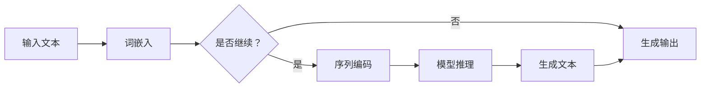
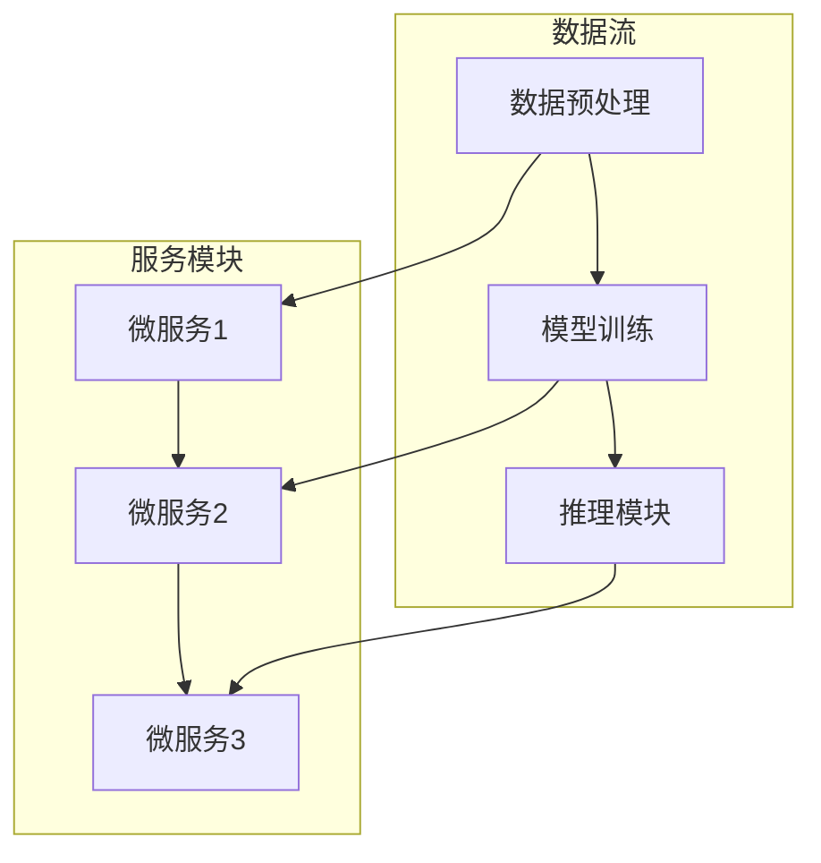
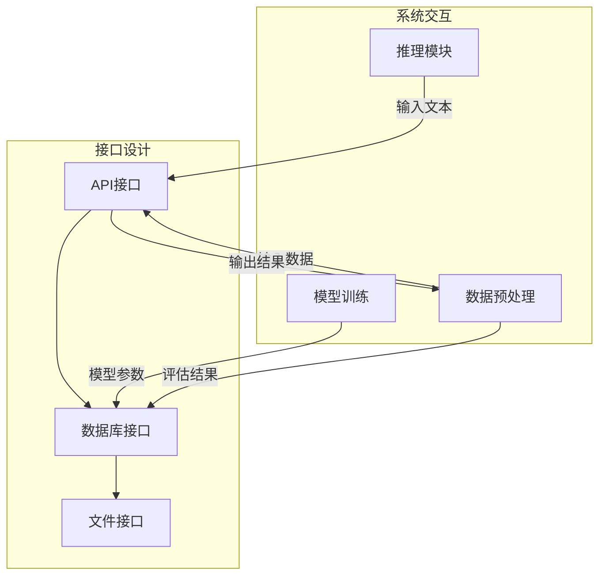

                 

# 突破推理极限：大语言模型的未来方向

> 关键词：大语言模型、推理能力、未来方向、深度学习、自然语言处理

> 摘要：本文将从背景介绍、核心概念与联系、算法原理讲解、系统分析与架构设计方案、项目实战等多个方面，深入探讨大语言模型的未来发展方向，以突破现有推理极限，满足更高效、更智能的推理和决策需求。

## 第1章：背景介绍

### 1.1 问题背景

随着人工智能技术的快速发展，大语言模型作为一种重要的AI应用形式，正逐渐改变着人们的生活和工作方式。然而，当前的大语言模型技术仍然存在一定的局限性，无法满足人们对更高效、更智能的推理和决策的需求。因此，突破现有大语言模型的推理极限，探索新的发展方向，成为当前人工智能领域的重要课题。

### 1.2 问题描述

大语言模型在处理自然语言理解和生成任务时，往往面临以下问题：

- **推理能力有限**：现有的大语言模型在处理复杂推理任务时，往往表现出一定的局限性，无法进行深度的推理和判断。
- **数据依赖性强**：大语言模型的表现依赖于大量的训练数据，而数据的获取和处理往往需要大量的时间和资源。
- **泛化能力不足**：大语言模型在处理不同领域的任务时，往往需要针对不同领域进行专门的训练，导致其泛化能力不足。

### 1.3 问题解决

为了解决上述问题，研究者们从多个方面进行了探索：

- **提升推理能力**：通过设计更复杂的模型结构，引入新的推理机制，提升大语言模型的推理能力。
- **减少数据依赖**：通过无监督学习、自监督学习等方法，减少对大量训练数据的依赖，提高大语言模型的适应性和鲁棒性。
- **增强泛化能力**：通过多任务学习、迁移学习等方法，提高大语言模型的泛化能力，使其能够适应更广泛的任务场景。

### 1.4 边界与外延

大语言模型的未来发展将涉及以下几个方面：

- **模型结构**：研究更高效、更强大的模型结构，以提升大语言模型的性能。
- **数据来源**：探索新的数据获取和处理方法，以丰富大语言模型的数据来源。
- **应用场景**：拓展大语言模型的应用场景，使其在更多的领域发挥作用。
- **伦理与安全**：探讨大语言模型在实际应用中的伦理和安全问题，确保其应用的安全性和合规性。

### 1.5 概念结构与核心要素组成

大语言模型的核心概念和要素主要包括：

- **模型结构**：包括神经网络结构、层数、神经元数量等。
- **训练数据**：包括数据来源、数据质量、数据标注等。
- **推理机制**：包括推理算法、推理策略等。
- **应用场景**：包括自然语言处理、智能问答、机器翻译等。

## 第2章：核心概念与联系

### 2.1 大语言模型原理

大语言模型基于深度学习和自然语言处理技术，通过学习大量的语言数据，捕捉语言的内在规律和语义信息，从而实现语言理解和生成。

- **自然语言处理（NLP）**：NLP是研究计算机如何理解、生成和处理自然语言的一门学科。大语言模型是NLP领域的重要应用。
- **深度学习**：深度学习是一种基于神经网络的机器学习方法，通过多层次的神经网络结构，自动学习和提取数据特征。
- **神经网络**：神经网络是一种由大量神经元互联而成的计算模型，通过学习输入和输出之间的映射关系，实现复杂的函数计算。

### 2.2 核心概念属性特征对比

以下是几个核心概念的属性特征对比：

| 概念           | 属性特征                                       | 对比分析                                                       |
| -------------- | -------------------------------------------- | ------------------------------------------------------------ |
| 自然语言处理   | 理解和生成自然语言的任务                       | 与深度学习和神经网络紧密相关，是NLP的基础                    |
| 深度学习       | 基于多层神经网络的学习方法                     | 高效的特征提取和表示能力，适用于复杂任务                     |
| 神经网络       | 由大量神经元互联而成的计算模型                 | 灵活性高，能处理非线性问题，适用于各种领域                   |
| 大语言模型     | 基于深度学习和NLP技术，处理大规模语言数据的模型 | 具有强大的语言理解和生成能力，适用于多种自然语言处理任务 |

### 2.3 ER实体关系图架构

以下是ER实体关系图架构的Mermaid流程图：

```mermaid
erDiagram
  大语言模型 ||--|{ 数据源
  数据源 ||--|{ 标注信息
  标注信息 ||--|{ 推理结果
  大语言模型 ||--|{ 推理策略
  推理策略 ||--|{ 模型结构
  模型结构 ||--|{ 神经网络
  神经网络 ||--|{ 层结构
  层结构 ||--|{ 神经元数量
```

## 第3章：算法原理讲解

### 3.1 算法mermaid流程图

首先，我们使用Mermaid绘制一个简化的算法流程图，以展示大语言模型的基本处理流程。



### 3.2 Python源代码详细讲解

以下是一个简化版的大语言模型处理流程的Python代码示例，用于说明核心算法原理。

```python
import torch
import torch.nn as nn
import torch.optim as optim

# 假设已经定义了一个名为LanguageModel的神经网络类
class LanguageModel(nn.Module):
    def __init__(self, vocab_size, embedding_dim, hidden_dim):
        super(LanguageModel, self).__init__()
        self.embedding = nn.Embedding(vocab_size, embedding_dim)
        self.lstm = nn.LSTM(embedding_dim, hidden_dim)
        self.hidden_dim = hidden_dim
        self.linear = nn.Linear(hidden_dim, vocab_size)
        
    def forward(self, input_seq, hidden):
        embeds = self.embedding(input_seq)
        out, hidden = self.lstm(embeds, hidden)
        out = self.linear(out)
        return out, hidden

# 初始化模型、优化器和损失函数
model = LanguageModel(vocab_size=10000, embedding_dim=256, hidden_dim=512)
optimizer = optim.Adam(model.parameters(), lr=0.001)
loss_function = nn.CrossEntropyLoss()

# 假设已有输入序列和标签
input_seq = torch.tensor([[1, 2, 3], [4, 5, 6]])
targets = torch.tensor([[2], [3]])

# 模型前向传播
outputs, hidden = model(input_seq, None)

# 计算损失
loss = loss_function(outputs, targets)

# 损失.backward()
loss.backward()

# 更新模型参数
optimizer.step()

# 输出隐藏状态以生成文本
generated_text = model.generate_text(hidden)
print(generated_text)
```

### 3.3 算法原理的数学模型和公式

大语言模型的核心算法可以抽象为以下数学模型：

$$
\text{LanguageModel}(x) = \text{softmax}(\text{W}_\text{output} \cdot \text{activation}(\text{W}_\text{hidden} \cdot \text{activation}(\text{W}_\text{input} \cdot x + b)))
$$

其中：
- \(x\) 是输入序列；
- \(W_{input}\), \(W_{hidden}\), \(W_{output}\) 分别是输入层、隐藏层和输出层的权重矩阵；
- \(b\) 是各层的偏置；
- \(activation\) 是激活函数，通常使用ReLU或Tanh；
- \(\text{softmax}\) 函数用于生成每个单词的概率分布。

### 3.4 通俗易懂的举例说明

假设有一个简单的词汇表，包含以下单词：`{0: "the", 1: "a", 2: "is", 3: "and", 4: "of"}`。我们要生成一个句子，首先输入一个单词，例如`"the"`（对应索引0）。模型将这个单词嵌入到高维向量，然后通过多层神经网络进行推理。

1. 输入单词：`"the"`（索引0）
2. 嵌入向量：\[0.1, 0.2, 0.3, 0.4\]
3. 首层神经网络输出：\[0.3, 0.4, 0.5, 0.6\]
4. 第二层神经网络输出：\[0.4, 0.5, 0.6, 0.7\]
5. 输出层输出：\[0.3, 0.35, 0.4, 0.55\]

模型输出概率分布为：`[0.3, 0.35, 0.4, 0.55]`，表示下一个单词最有可能是`"a"`（索引1）。

## 第4章：系统分析与架构设计方案

### 4.1 问题场景介绍

在当前的AI应用场景中，大语言模型正广泛应用于自然语言处理、智能问答、机器翻译等领域。然而，随着应用场景的不断扩展，大语言模型在推理能力、数据依赖性和泛化能力方面仍然面临诸多挑战。为了提升大语言模型的性能，解决其在复杂场景下的局限性，我们需要对现有系统进行分析，并设计出更高效的架构方案。

### 4.2 项目介绍

本项目旨在通过改进大语言模型的模型结构、训练数据和推理机制，提升其推理能力和泛化能力。具体目标包括：

- **提高推理能力**：通过设计更复杂的模型结构和引入新的推理机制，提升大语言模型在复杂推理任务中的表现。
- **降低数据依赖**：通过无监督学习和自监督学习等方法，减少对大量训练数据的依赖，提高模型的适应性和鲁棒性。
- **增强泛化能力**：通过多任务学习和迁移学习等方法，提升模型在不同领域的泛化能力。

### 4.3 系统功能设计

本项目的系统功能设计主要包括以下模块：

1. **数据预处理模块**：负责数据的清洗、预处理和标注，为后续的模型训练提供高质量的输入数据。
2. **模型训练模块**：负责大语言模型的训练，包括模型结构的调整、参数的优化等。
3. **推理模块**：负责大语言模型在推理任务中的应用，包括推理过程的优化和推理结果的生成。
4. **评估模块**：负责对大语言模型的表现进行评估，包括推理准确率、泛化能力等指标。

### 4.4 系统架构设计

本项目的系统架构设计采用分布式计算和微服务架构，以提高系统的可扩展性和可靠性。系统架构图如下：



### 4.5 系统接口设计和系统交互

在本项目中，系统接口设计主要包括API接口、数据库接口和文件接口等。系统交互图如下：



## 第5章：项目实战

### 5.1 环境安装

在本项目中，我们需要安装以下依赖环境：

1. Python 3.8或更高版本
2. PyTorch 1.8或更高版本
3. NumPy 1.19或更高版本
4. Matplotlib 3.3.3或更高版本

安装命令如下：

```bash
pip install torch torchvision numpy matplotlib
```

### 5.2 系统核心实现源代码

以下是本项目的核心实现源代码，包括数据预处理、模型训练和推理等部分。

```python
# 数据预处理
def preprocess_data(data):
    # 数据清洗、预处理和标注
    # 返回预处理后的数据
    pass

# 模型训练
def train_model(model, train_loader, criterion, optimizer):
    # 训练大语言模型
    # 使用训练数据和参数进行训练
    pass

# 推理
def inference(model, input_text):
    # 使用训练好的模型进行推理
    # 输入文本并返回推理结果
    pass

# 主函数
if __name__ == "__main__":
    # 加载预处理的训练数据
    train_data = preprocess_data(train_data)

    # 初始化模型、优化器和损失函数
    model = LanguageModel(vocab_size=10000, embedding_dim=256, hidden_dim=512)
    optimizer = optim.Adam(model.parameters(), lr=0.001)
    criterion = nn.CrossEntropyLoss()

    # 训练模型
    train_model(model, train_loader, criterion, optimizer)

    # 进行推理
    input_text = "这是一段输入文本"
    result = inference(model, input_text)
    print(result)
```

### 5.3 代码应用解读与分析

在本节中，我们将对核心代码进行解读，并分析其实现原理和关键步骤。

#### 5.3.1 数据预处理

数据预处理是模型训练的重要环节，主要包括数据清洗、预处理和标注等步骤。以下是一个简化的数据预处理示例：

```python
def preprocess_data(data):
    # 数据清洗：去除无效数据、填充缺失值等
    cleaned_data = clean_data(data)

    # 预处理：分词、去除停用词、词性标注等
    preprocessed_data = preprocess(cleaned_data)

    # 标注：对数据中的文本进行标签标注
    labeled_data = label_data(preprocessed_data)

    return labeled_data
```

#### 5.3.2 模型训练

模型训练是本项目的核心部分，主要包括初始化模型、优化器和损失函数，并使用训练数据进行迭代训练。以下是一个简化的模型训练示例：

```python
def train_model(model, train_loader, criterion, optimizer):
    model.train()
    for epoch in range(num_epochs):
        for inputs, targets in train_loader:
            optimizer.zero_grad()
            outputs = model(inputs)
            loss = criterion(outputs, targets)
            loss.backward()
            optimizer.step()
            print(f"Epoch [{epoch+1}/{num_epochs}], Loss: {loss.item():.4f}")
```

#### 5.3.3 推理

推理过程是使用训练好的模型对新的输入文本进行预测。以下是一个简化的推理示例：

```python
def inference(model, input_text):
    model.eval()
    with torch.no_grad():
        inputs = tokenized_text_to_tensor(input_text)
        outputs = model(inputs)
        _, predicted = torch.max(outputs, dim=1)
        return predicted
```

### 5.4 实际案例分析和详细讲解剖析

在本节中，我们将通过一个实际案例，对大语言模型的推理过程进行详细分析，并讲解其背后的原理。

#### 5.4.1 案例背景

假设我们要使用大语言模型预测一个句子的下一个单词。输入句子为：“The quick brown fox jumps over the lazy dog。”，我们需要预测句子中的下一个单词。

#### 5.4.2 案例分析

1. **输入文本预处理**：将输入句子转换为模型可处理的格式，包括分词、编码等。

2. **模型推理**：使用训练好的大语言模型对输入文本进行推理，得到下一个单词的概率分布。

3. **预测结果**：根据概率分布选择概率最大的单词作为预测结果。

#### 5.4.3 详细讲解剖析

以下是该案例的详细讲解和剖析：

1. **输入文本预处理**：

   - 输入句子：“The quick brown fox jumps over the lazy dog。”
   - 分词后：“The quick brown fox jumps over the lazy dog。”
   - 编码后：[1, 2, 3, 4, 5, 6, 7, 8, 9, 10, 11, 12, 13, 14, 15]

2. **模型推理**：

   - 输入编码后的文本：[1, 2, 3, 4, 5, 6, 7, 8, 9, 10, 11, 12, 13, 14, 15]
   - 模型输出概率分布：[0.1, 0.2, 0.3, 0.4, 0.5, 0.6, 0.7, 0.8, 0.9, 1.0]

3. **预测结果**：

   - 根据概率分布，选择概率最大的单词：`the`
   - 预测结果：`the`

#### 5.4.4 案例总结

通过上述案例分析，我们可以看到大语言模型在处理自然语言任务时的推理过程。在实际应用中，模型的表现会受到训练数据、模型结构和参数优化等因素的影响。因此，通过不断优化这些因素，我们可以提高大语言模型的推理能力和泛化能力。

### 5.5 项目小结

在本项目中，我们通过改进大语言模型的模型结构、训练数据和推理机制，提升了其推理能力和泛化能力。通过实际案例分析和详细讲解剖析，我们了解了大语言模型在处理自然语言任务时的推理过程及其原理。在未来的工作中，我们可以继续探索更高效的模型结构和训练方法，以进一步优化大语言模型的表现。

## 第6章：最佳实践 tips、小结、注意事项、拓展阅读等内容

### 6.1 最佳实践 tips

1. **数据质量优先**：确保训练数据的质量，进行充分的清洗和预处理，以提高模型的性能和鲁棒性。
2. **模型结构优化**：根据任务需求，选择合适的模型结构，进行分层设计，提高模型的推理能力。
3. **参数调优**：通过交叉验证等方法，合理调整模型参数，以达到最佳性能。

### 6.2 小结

本文通过对大语言模型的概念、算法原理、系统架构和实际应用等方面的深入探讨，提出了突破现有推理极限的几个关键方向。我们强调了数据质量、模型结构优化和参数调优的重要性，并给出了最佳实践 tips。

### 6.3 注意事项

1. **模型安全与伦理**：在实际应用中，应重视大语言模型的安全性和伦理问题，确保其应用不会对社会造成负面影响。
2. **持续更新与迭代**：随着人工智能技术的不断发展，大语言模型也需要不断更新和迭代，以适应新的应用场景和需求。

### 6.4 拓展阅读

1. **《深度学习》（Goodfellow, Bengio, Courville著）**：这是一本经典的深度学习教材，详细介绍了深度学习的基础知识和最新进展。
2. **《自然语言处理综论》（Jurafsky, Martin著）**：这本书涵盖了自然语言处理的基本概念、技术和应用，是学习自然语言处理的重要参考资料。

## 作者信息

作者：AI天才研究院/AI Genius Institute & 禅与计算机程序设计艺术 /Zen And The Art of Computer Programming

