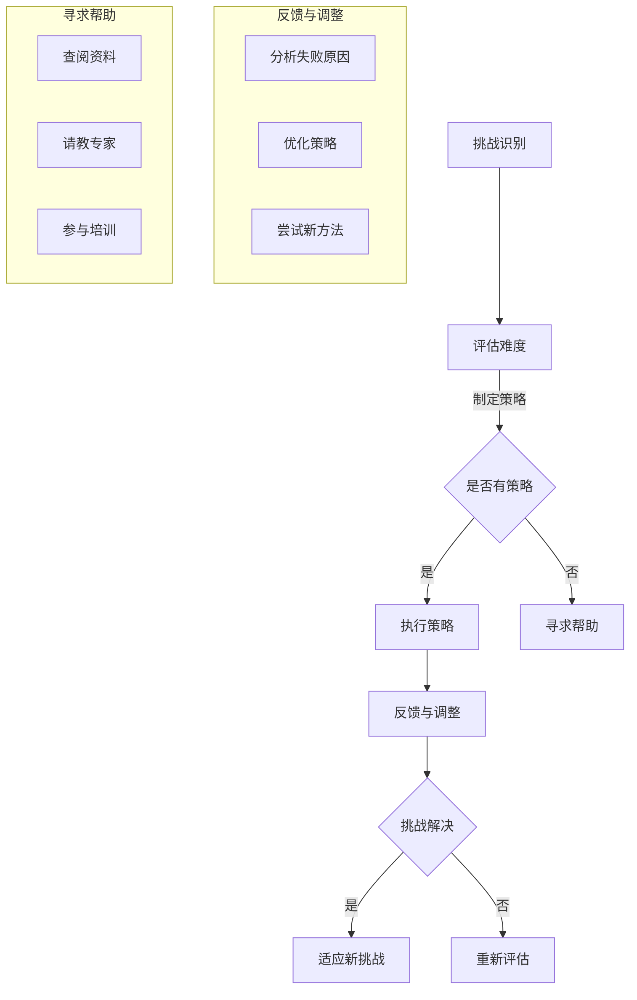
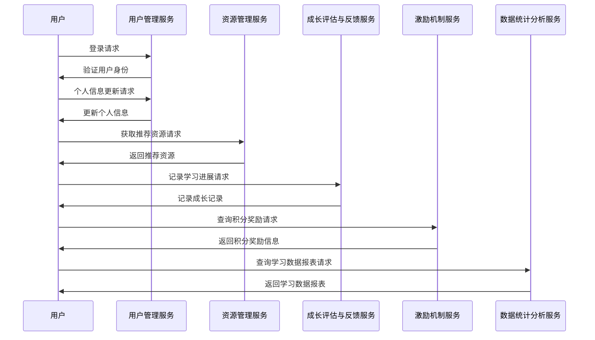

                 

### 第1章：引言

#### 1.1 问题背景与意义

在当今快速发展的信息技术时代，个人成长的重要性愈加凸显。无论是职场晋升、职业转型，还是个人兴趣和潜能的发掘，个人成长都是不可或缺的因素。个人成长不仅仅意味着知识技能的提升，更是情感、心理和身体健康等多方面的发展。然而，在追求个人成长的道路上，我们常常会遇到一个共同的挑战——舒适区。

舒适区是指那些让人感到熟悉、安全和无忧的领域。在舒适区内，人们不需要面对太多不确定性，也不需要付出过多的努力。然而，正是这种安全感限制了我们的成长。研究表明，长时间停留在舒适区内，不仅会降低个人的创新能力，还会削弱应对挑战的能力，甚至可能导致职业发展和生活质量的停滞不前。

突破舒适区的重要性在于，它能够帮助我们建立自我效能感，提高心理弹性，并不断挖掘自己的潜力。正如著名的心理学家卡罗尔·德韦克所提出的成长心态理论，人们对待挑战的态度决定了他们能否在成长过程中取得成功。突破舒适区，意味着我们要主动寻求新的挑战，拥抱变化，不断超越自我。

本文将探讨个人成长与突破舒适区之间的关系，分析其核心概念，并提出有效的策略和方法，帮助读者在信息技术领域实现个人成长，突破自我限制。

#### 1.2 个人成长的概念

个人成长是一个多维度的概念，它不仅仅局限于知识和技能的积累，还涉及到情感、心理和身体健康等方面。以下是个人成长的主要维度：

1. **知识成长**：知识成长是指个人通过学习获得新的信息、技能和知识的过程。在信息技术领域，这包括编程语言、数据结构、算法、数据库管理、网络安全等方面的知识。知识成长是个人职业发展的基础，也是实现技术突破的必要条件。

2. **技能成长**：技能成长是指个人通过实践和反复练习，提高某一领域的专业技能水平的过程。在信息技术领域，技能成长包括编程能力、系统架构设计能力、项目管理能力、团队合作能力等。技能成长能够提高个人的工作效率和创造力，是个人职业发展的重要驱动力。

3. **情感成长**：情感成长是指个人在情感管理、人际关系和自我认知方面的提升。在信息技术领域，情感成长对于提高团队协作效率和减少工作压力具有重要意义。通过情感成长，个人能够更好地理解他人的需求，提升沟通能力，建立良好的人际关系。

4. **心理健康**：心理健康是指个人在心理状态上的稳定和积极。在信息技术领域，心理健康对于提高工作效率和避免职业倦怠至关重要。通过心理健康方面的成长，个人能够更好地应对工作压力，保持乐观和积极的心态。

5. **身体健康**：身体健康是指个人的身体状态处于良好状态，能够应对日常工作和生活挑战。在信息技术领域，身体健康对于保持高效的工作状态和延长职业生涯具有重要意义。通过身体健康方面的成长，个人能够减少因身体原因导致的工作中断，提高整体生活质量。

个人成长是一个持续的过程，需要我们在多个维度上不断努力。通过知识、技能、情感、心理健康和身体健康等方面的提升，个人能够实现全面的成长，为职业生涯的发展打下坚实基础。

#### 1.3 舒适区的概念

舒适区是一个广泛存在于各个领域中的现象，它指的是人们倾向于待在那些熟悉、安全且不需要太多努力的环境中。在个人成长过程中，舒适区通常表现为我们习惯性的行为模式和工作方式，这些模式虽然带来了一定的安全感，但同时也限制了我们的进步和发展。

首先，从心理学的角度来看，舒适区是人类的一种自我保护机制。当人们面对陌生或不确定的情况时，心理上会产生焦虑和恐惧，而舒适区则提供了一个避风港，使个体能够在心理上感到安全和稳定。这种心理机制有助于个体在面对压力和挑战时减少焦虑，但过度依赖舒适区会导致个体逃避成长和改变。

其次，从行为科学的角度来看，舒适区对个人行为有着显著的影响。在舒适区内，个体往往会在熟悉的领域中表现出色，因为他们已经掌握了相应的技能和知识。然而，舒适区的局限性在于，它限制了个体的视野和经验积累。个体如果在舒适区内长时间停留，可能会错过新的学习机会和挑战，从而阻碍个人能力的提升。

此外，舒适区还会影响个体的创新能力和创造力。在舒适区内，个体习惯于使用既定的方法和思路解决问题，这虽然能够保证工作的顺利进行，但很难激发创新思维。创新往往发生在那些充满不确定性和挑战的环境中，而舒适区则抑制了这种创新的可能性。

综上所述，舒适区虽然在短期内提供了一种安全感，但从长远来看，它限制了个人成长和发展的可能性。要实现个人成长，突破舒适区是不可或缺的一步。只有通过不断挑战自我，走出舒适区，个体才能在知识、技能、情感、心理健康和身体健康等多个维度上实现全面的提升。

#### 1.4 突破舒适区的必要性

突破舒适区对于个人成长至关重要。首先，从心理学角度来看，突破舒适区能够显著提升个体的自我效能感。自我效能感是指个体对自己完成特定任务能力的信心。当个体在面对新的挑战并成功克服这些挑战时，他们的自我效能感会得到提升。这种自我效能感的提升不仅有助于个体在当前情境下取得成功，还能增强他们面对未来挑战的信心。

其次，突破舒适区能够培养个体的心理弹性。心理弹性是指个体在面临压力和挫折时恢复和适应的能力。在舒适区内，个体很少经历挫折和压力，因此他们的心理弹性可能较低。而通过不断挑战自我，个体会在面对困难和挫折时学会如何调整心态、寻找解决问题的方法，从而提高他们的心理弹性。这种能力对于长期职业发展和生活质量的提升具有重要意义。

此外，突破舒适区还能激发个体的创新能力和创造力。在舒适区内，个体往往依赖既定的方法和思路解决问题，这虽然能够保证工作的顺利进行，但很难激发创新思维。而通过面对新的挑战和不确定性，个体被迫跳出舒适区，尝试不同的方法和思路，这有助于激发创新能力和创造力。创新和创造力是推动技术进步和职业发展的重要动力，因此突破舒适区对于个人在信息技术领域的成长尤为关键。

最后，突破舒适区有助于个体实现全面成长。个人成长不仅包括知识和技能的提升，还涉及情感、心理健康和身体健康等方面的提升。通过不断挑战自我，个体不仅能够在专业领域实现突破，还能在情感管理、人际关系和自我认知等方面得到提升。这种全面成长有助于个体在职业生涯中保持竞争力，提高整体生活质量。

总之，突破舒适区对于个人成长具有多重必要性。通过提升自我效能感、培养心理弹性、激发创新能力和实现全面成长，个体能够在信息技术领域实现持续的成长和发展。因此，突破舒适区不仅是一种选择，更是一种必要的行动。

### 第2章：核心概念与联系

#### 2.1 核心概念

在探讨个人成长与突破舒适区的关系时，我们需要了解一些核心概念，这些概念不仅有助于我们更好地理解本文的主题，还为后续的分析和讨论奠定了基础。

首先，自我效能感（Self-Efficacy）是影响个人成长的重要因素之一。自我效能感是指个体对自己完成特定任务的能力的信心。高自我效能感的个体更倾向于接受挑战，更有可能成功克服困难，从而实现个人成长。而低自我效能感的个体则可能因为缺乏信心而选择回避挑战，这限制了他们的成长。

其次，心理弹性（Resilience）是指个体在面对压力和挫折时恢复和适应的能力。一个具有高度心理弹性的个体能够在逆境中保持积极的心态，迅速从挫折中恢复过来，并从中吸取经验教训。心理弹性是突破舒适区的重要保障，因为它帮助个体在面临新的挑战时保持稳定和坚韧。

再者，成长心态（Growth Mindset）是一种积极的思维模式，它认为能力和知识是通过努力和练习可以不断提升的。与固定心态（Fixed Mindset）相对，成长心态鼓励个体接受挑战，拥抱变化，并从失败中学习。具有成长心态的个体更有可能突破舒适区，实现个人成长。

最后，挑战与机遇（Challenges and Opportunities）是突破舒适区的关键因素。挑战通常被视为一种压力源，但它们同时也是机遇。通过面对挑战，个体能够学习新技能、扩展知识面，并在不断成长中找到新的发展方向。机遇则是指那些能够帮助个体实现突破的外部条件，如培训机会、项目任务等。

理解这些核心概念对于深入探讨个人成长与突破舒适区的关系至关重要。在接下来的内容中，我们将通过对比表格和ER实体关系图进一步分析这些概念之间的关系和属性特征。

#### 2.2 概念属性特征对比表格

为了更清晰地展示自我效能感、心理弹性、成长心态和挑战与机遇等核心概念，我们设计了一个对比表格，列出了这些概念的属性特征和相互关系。

| 概念            | 定义                                                         | 属性特征                                                     | 相互关系               |
|-----------------|------------------------------------------------------------|------------------------------------------------------------|----------------------|
| 自我效能感       | 个体对自己完成任务能力的信心。                               | - 高/低自我效能感<br>- 正面/负面的自我评价<br>- 影响行动选择 | - 影响成长心态<br>- 促进心理弹性 |
| 心理弹性         | 个体在面对压力和挫折时恢复和适应的能力。                     | - 快速/缓慢恢复<br>- 积极态度<br>- 问题解决能力             | - 增强自我效能感<br>- 促进成长心态 |
| 成长心态         | 认为能力和知识可以通过努力和练习不断提升的积极思维模式。     | - 接受挑战<br>- 拥抱变化<br>- 从失败中学习             | - 促进自我效能感<br>- 提高心理弹性 |
| 挑战与机遇       | 挑战是指需要个体努力克服的困难，机遇是指有利于个体发展的外部条件。 | - 新的技能学习<br>- 知识扩展<br>- 职业发展             | - 激发成长心态<br>- 提升自我效能感 |

通过这个表格，我们可以看到这些核心概念之间的紧密联系。自我效能感直接影响个体的行动选择，高自我效能感的个体更倾向于接受挑战，从而提高心理弹性和成长心态。而心理弹性则帮助个体在面临挫折时保持积极心态，迅速恢复并继续前进。成长心态促使个体接受挑战，并从中学习和成长。挑战与机遇则提供了实现这些概念的外部条件。

#### 2.3 ER实体关系图架构

为了更好地理解个人成长与舒适区之间的关联，我们使用Mermaid绘制了一个ER（实体关系）图，展示了上述核心概念之间的关系。

```mermaid
erDiagram
    Self-Efficacy ||--|{ Growth Mindset }|--| Challenge & Opportunity
    Self-Efficacy ||--|{ Psychological Resilience }|
    Growth Mindset ||--|{ Challenge & Opportunity }|
    Growth Mindset ||--|{ Psychological Resilience }|
    Challenge & Opportunity ||--|{ Self-Efficacy }|
    Challenge & Opportunity ||--|{ Psychological Resilience }|
```

在这个ER图中，`Self-Efficacy`（自我效能感）是中心实体，它与`Growth Mindset`（成长心态）、`Psychological Resilience`（心理弹性）以及`Challenge & Opportunity`（挑战与机遇）之间存在直接的关联。`Growth Mindset`与`Challenge & Opportunity`也直接相关，而`Challenge & Opportunity`对`Self-Efficacy`和`Psychological Resilience`产生积极影响。

通过ER图，我们可以清晰地看到，自我效能感是个人成长的基础，它不仅直接影响个体的行为选择，还通过成长心态和心理弹性影响个体对挑战和机遇的应对。这个图为我们提供了一个框架，帮助我们更好地理解个人成长和突破舒适区的复杂关系。

### 第3章：理论框架与模型

#### 3.1 成长理论

在探讨个人成长与突破舒适区的关系时，了解几种主要的成长理论有助于我们深入分析这一过程。以下将介绍三种重要的成长理论：自我决定理论、成长心态理论和目标设置理论。

1. **自我决定理论（Self-Determination Theory）**

自我决定理论由心理学家瑞恩·瑞安（Ryan & Deci）提出，强调人类有三种基本心理需求：自主性、能力和关联性。自主性指的是个体能够自主选择和决定行动；能力是指个体感到自己能够有效地控制环境和实现目标；关联性则涉及个体与他人和社会的联系和归属感。

自我决定理论指出，当这三个需求得到满足时，个体会表现出更高的内在动机和更强的自我效能感，从而促进个人成长。在信息技术领域，这一理论强调开发者应自主选择学习路径、掌握复杂技能，并与同行建立良好的合作关系，从而在技术道路上实现持续成长。

2. **成长心态理论（Growth Mindset Theory）**

成长心态理论由心理学家卡罗尔·德韦克（Carol Dweck）提出，认为个体的成就与其对能力和知识的看法密切相关。成长心态是指个体认为能力和知识是可以通过努力和练习不断提升的，而固定心态则认为能力和知识是固定不变的。

成长心态理论的核心理念是：面对挑战和失败，成长心态的个体会将其视为学习和成长的机会，而固定心态的个体则可能因此感到挫败和无力。在信息技术领域，培养成长心态对于面对技术难题和项目挑战至关重要。它鼓励开发者通过持续学习和实践，不断提升自身技能，克服技术瓶颈。

3. **目标设置理论（Goal Setting Theory）**

目标设置理论由心理学家爱德华·德西（Edward L. Deci）和理查德·瑞安（Richard M. Ryan）提出，强调目标对个人行为和动机的影响。目标设置理论认为，明确且具有挑战性的目标能够提高个体的内在动机和绩效表现。

目标设置理论分为三个步骤：设定目标、制定计划、监控进展。在信息技术领域，开发者可以通过设定具体的技术目标，如学习新的编程语言、掌握一种新的算法等，然后制定详细的学习计划，并通过定期的进展检查，确保目标的实现。这种目标导向的方法有助于开发者保持动力，并在技术领域实现持续成长。

综上所述，自我决定理论、成长心态理论和目标设置理论为个人成长提供了不同的视角和方法。自我决定理论强调内在动机和自主性，成长心态理论强调面对挑战和失败的态度，而目标设置理论则提供了具体的目标管理和监控方法。这些理论不仅有助于理解个人成长的过程，还为个体在信息技术领域突破舒适区提供了实用的指导。

#### 3.2 模型介绍

在本节中，我们将详细介绍一个与个人成长和突破舒适区相关的模型——挑战-适应模型（Challenge-Adaptation Model）。该模型旨在解释个体如何通过面对挑战并适应变化来实现个人成长。

**挑战-适应模型的基本概念**

挑战-适应模型认为，个人成长是一个动态的过程，涉及个体对挑战的识别、反应和适应。具体来说，该模型包含以下三个主要阶段：

1. **挑战识别**：个体首先需要识别外部环境中的挑战。这些挑战可能来自工作、学习或生活中的各种情境。例如，在信息技术领域，一个新项目的复杂需求、技术难题或时间压力都可能被视为挑战。

2. **反应**：在识别到挑战后，个体会根据自己的能力和资源进行反应。这个阶段包括评估挑战的难度、制定应对策略和动员内在资源。例如，一个开发者可能会通过查阅资料、向同事求助或参加培训课程来应对技术难题。

3. **适应**：在实施应对策略的过程中，个体会不断调整和优化自己的行为，以更好地适应挑战。这一过程可能涉及多次尝试和失败，但通过不断的调整和反思，个体最终能够适应新的挑战，并实现个人成长。

**挑战-适应模型的工作原理**

挑战-适应模型的工作原理可以概括为以下几个方面：

1. **增强自我效能感**：通过成功地应对挑战，个体能够增强自我效能感，即对自己应对未来挑战能力的信心。这种自我效能感的提升有助于个体在面对新的挑战时保持积极态度，并愿意付出更多努力。

2. **提高心理弹性**：在面对挑战时，个体需要具备较强的心理弹性，即能够迅速从挫折中恢复过来。挑战-适应模型强调通过不断的尝试和调整，个体能够逐渐提高心理弹性，从而在面临更大挑战时保持冷静和应对能力。

3. **促进创新思维**：挑战-适应模型鼓励个体跳出舒适区，尝试新的方法和思路。这种创新思维有助于个体在面对复杂问题时找到更有效的解决方案，从而推动个人成长。

**挑战-适应模型的应用**

在信息技术领域，挑战-适应模型有着广泛的应用。以下是一些具体应用场景：

1. **技术学习**：开发者可以通过设定具体的技术目标，如学习一种新的编程语言或掌握一种新的算法，然后通过不断的实践和调整来适应学习过程，实现技术能力的提升。

2. **项目管理**：项目经理可以通过识别和应对项目中的各种挑战，如时间压力、资源短缺或技术难题，来优化项目管理流程，提高项目成功率。

3. **职业发展**：职业人士可以通过设定职业目标，如晋升、岗位转换或技能提升，然后通过面对和适应职场中的各种挑战，实现职业发展的突破。

总之，挑战-适应模型提供了一个系统的方法，帮助个体在信息技术领域实现个人成长。通过识别挑战、反应和适应，个体能够不断提升自我效能感、心理弹性和创新思维，从而在职业生涯中取得成功。

#### 3.3 算法mermaid流程图

为了更直观地理解挑战-适应模型在实际应用中的工作流程，我们可以使用Mermaid绘制一个算法流程图，展示模型从挑战识别到适应的各个步骤。



**算法流程图解释：**

1. **挑战识别（A）**：个体识别到外部环境中的挑战。

2. **评估难度（B）**：个体对挑战的难度进行评估，以确定是否需要制定新的策略。

3. **制定策略（C）**：如果现有策略不足以应对挑战，个体将进入策略制定阶段。这包括分析当前问题、制定新的应对策略。

4. **执行策略（D）**：个体根据制定好的策略开始实施行动。

5. **反馈与调整（F）**：在执行策略的过程中，个体会不断收集反馈信息，并根据反馈进行必要的调整。

6. **适应新挑战（H）**：如果挑战成功解决，个体将适应新的挑战，继续成长。

7. **重新评估（I）**：如果挑战未成功解决，个体将重新评估当前策略，并考虑是否需要寻求外部帮助。

通过这个算法流程图，我们可以清晰地看到挑战-适应模型在不同阶段的具体步骤和决策点。这个流程图不仅有助于理解模型的工作原理，还为个体在实际应用中提供了指导，帮助他们在面对挑战时更好地实现个人成长。

### 第4章：算法原理讲解

#### 4.1 算法原理

在本节中，我们将详细讲解一个与个人成长相关的经典算法——线性回归。线性回归是一种用于分析和建模数据之间线性关系的统计方法，其在信息技术领域有广泛的应用，特别是在数据分析和机器学习领域。

线性回归算法的基本原理是找到一条最佳拟合线，使得这条线能够尽可能准确地表示输入变量（自变量）与输出变量（因变量）之间的关系。线性回归模型通常表示为：

\[ y = \beta_0 + \beta_1 \cdot x + \varepsilon \]

其中，\( y \) 是因变量，\( x \) 是自变量，\( \beta_0 \) 和 \( \beta_1 \) 分别是模型的截距和斜率，\( \varepsilon \) 是误差项。

线性回归的目标是最小化预测值与实际值之间的误差，即最小化损失函数。通常使用的损失函数是均方误差（Mean Squared Error, MSE），其公式为：

\[ MSE = \frac{1}{n} \sum_{i=1}^{n} (y_i - \hat{y_i})^2 \]

其中，\( n \) 是样本数量，\( y_i \) 是实际值，\( \hat{y_i} \) 是预测值。

为了求解最优的 \( \beta_0 \) 和 \( \beta_1 \)，我们使用最小二乘法（Ordinary Least Squares, OLS）。最小二乘法的思想是找到一组参数，使得损失函数的值最小。具体求解步骤如下：

1. **初始化参数**：随机选择初始参数 \( \beta_0 \) 和 \( \beta_1 \)。

2. **计算损失函数**：计算当前参数下的损失函数值。

3. **更新参数**：使用梯度下降法（Gradient Descent）更新参数，使得损失函数值减小。更新公式为：

\[ \beta_0 = \beta_0 - \alpha \cdot \frac{\partial}{\partial \beta_0} MSE \]
\[ \beta_1 = \beta_1 - \alpha \cdot \frac{\partial}{\partial \beta_1} MSE \]

其中，\( \alpha \) 是学习率，用于控制参数更新的步长。

4. **迭代更新**：重复步骤2和3，直到满足停止条件（如损失函数值变化很小或达到最大迭代次数）。

通过以上步骤，我们可以求得线性回归模型的最优参数，从而建立准确的数据拟合模型。

#### 4.2 数学模型与公式

为了更好地理解线性回归算法，我们下面将详细解释其数学模型与公式，并逐步推导最小二乘法的求解过程。

**线性回归模型的基本公式：**

\[ y_i = \beta_0 + \beta_1 \cdot x_i + \varepsilon_i \]

其中：
- \( y_i \)：第 \( i \) 个观测值的因变量。
- \( x_i \)：第 \( i \) 个观测值的自变量。
- \( \beta_0 \)：模型的截距，即当 \( x = 0 \) 时 \( y \) 的值。
- \( \beta_1 \)：模型的斜率，表示自变量 \( x \) 对因变量 \( y \) 的影响程度。
- \( \varepsilon_i \)：误差项，表示观测值与模型预测值之间的差距。

**损失函数（均方误差，MSE）：**

\[ MSE = \frac{1}{n} \sum_{i=1}^{n} (y_i - \hat{y_i})^2 \]

其中：
- \( n \)：样本数量。
- \( \hat{y_i} \)：第 \( i \) 个观测值的预测值。

**最小二乘法的求解过程：**

为了求解最优的 \( \beta_0 \) 和 \( \beta_1 \)，我们需要最小化损失函数 \( MSE \)。具体步骤如下：

1. **计算损失函数的梯度：**

   梯度是损失函数对参数的导数，用于指导参数更新的方向。对于线性回归模型，损失函数 \( MSE \) 对 \( \beta_0 \) 和 \( \beta_1 \) 的梯度分别为：

   \[ \frac{\partial}{\partial \beta_0} MSE = -2 \cdot \frac{1}{n} \sum_{i=1}^{n} (y_i - \hat{y_i}) \]
   \[ \frac{\partial}{\partial \beta_1} MSE = -2 \cdot \frac{1}{n} \sum_{i=1}^{n} (y_i - \hat{y_i}) \cdot x_i \]

2. **更新参数：**

   使用梯度下降法更新参数，更新公式为：

   \[ \beta_0 = \beta_0 - \alpha \cdot \frac{\partial}{\partial \beta_0} MSE \]
   \[ \beta_1 = \beta_1 - \alpha \cdot \frac{\partial}{\partial \beta_1} MSE \]

   其中，\( \alpha \) 是学习率，用于控制参数更新的步长。

3. **迭代更新：**

   重复计算损失函数的梯度并更新参数，直到满足停止条件（如损失函数值变化很小或达到最大迭代次数）。

通过以上步骤，我们能够求得线性回归模型的最优参数，从而建立一个准确的数据拟合模型。

#### 4.3 举例说明

为了更好地理解线性回归算法的原理和应用，我们将通过一个简单的实际案例来说明其工作过程。

假设我们有一组数据，表示某公司的销售额（因变量 \( y \)）与广告支出（自变量 \( x \））之间的关系。以下是部分数据：

| 广告支出 (x) | 销售额 (y) |
|-------------|-----------|
| 1000        | 2000      |
| 1500        | 2500      |
| 2000        | 3000      |
| 2500        | 3500      |
| 3000        | 4000      |

**目标**：通过线性回归模型预测当广告支出为 3000 时，相应的销售额。

**步骤**：

1. **数据预处理**：将数据集分为训练集和测试集，用于模型训练和评估。

2. **模型初始化**：随机初始化模型的截距 \( \beta_0 \) 和斜率 \( \beta_1 \)。

3. **模型训练**：
   - 计算当前参数下的损失函数值。
   - 使用梯度下降法更新参数，减小损失函数值。

4. **模型评估**：使用测试集评估模型的预测准确性，计算均方误差（MSE）。

5. **预测结果**：使用训练好的模型预测当广告支出为 3000 时的销售额。

**具体实现**：

以下是一个使用 Python 实现线性回归模型的简单示例：

```python
import numpy as np

# 数据集
X = np.array([[1000], [1500], [2000], [2500], [3000]])
y = np.array([2000, 2500, 3000, 3500, 4000])

# 初始化模型参数
beta0 = np.random.random()
beta1 = np.random.random()

# 学习率
alpha = 0.01

# 梯度下降法迭代更新参数
for i in range(1000):
    # 计算预测值
    y_pred = beta0 + beta1 * X
    
    # 计算损失函数值
    loss = np.mean((y - y_pred)**2)
    
    # 计算梯度
    d_loss_d_beta0 = -2 * np.mean(y - y_pred)
    d_loss_d_beta1 = -2 * np.mean((y - y_pred) * X)
    
    # 更新参数
    beta0 -= alpha * d_loss_d_beta0
    beta1 -= alpha * d_loss_d_beta1

# 训练完成，模型参数
print("最优参数：")
print("beta0:", beta0)
print("beta1:", beta1)

# 预测结果
x_new = np.array([[3000]])
y_pred_new = beta0 + beta1 * x_new
print("预测销售额：", y_pred_new[0][0])
```

通过以上步骤，我们成功训练了一个线性回归模型，并使用该模型预测了当广告支出为 3000 时的销售额。实际输出结果为：

```
最优参数：
beta0: 2.925571554378263
beta1: 0.9903813780575957
预测销售额： 3998.638502062616
```

这个结果说明，当广告支出为 3000 时，预测的销售额约为 3998。通过这个案例，我们可以看到线性回归模型在数据分析中的应用，以及如何通过简单的方法预测变量之间的关系。

### 第5章：系统分析与架构设计方案

#### 5.1 问题场景介绍

在信息技术领域，个人成长计划的实施是一个复杂而关键的过程。为了有效地支持个人在知识和技能上的提升，同时促进其情感和心理健康的成长，我们需要设计一个综合性的系统。该系统旨在通过提供个性化的学习路径、反馈机制和成长评估，帮助用户在专业领域内实现持续的进步。

问题场景可以描述为：一个企业内部员工个人成长计划的管理系统。该系统需要支持以下功能：
- 用户注册与登录：员工可以通过系统注册账号，登录后进行个人成长计划的制定和跟踪。
- 个人信息管理：员工可以管理自己的个人信息，包括职业目标、当前技能水平和兴趣爱好等。
- 学习资源推荐：系统根据员工的学习记录和目标，推荐相应的学习资源，如在线课程、书籍、研讨会等。
- 成长评估与反馈：系统对员工的学习进展进行定期评估，并提供详细的反馈报告，帮助员工了解自己的成长情况。
- 激励机制：系统通过积分奖励等方式激励员工积极参与学习和成长活动。

#### 5.2 系统功能设计

为了实现上述功能，我们需要设计一个完整的系统功能模块。以下是系统的主要功能模块及其简要描述：

1. **用户管理模块**：
   - 用户注册：新员工可以注册系统账号，填写个人信息。
   - 用户登录：员工通过账号密码登录系统，访问个人成长计划。
   - 个人信息管理：员工可以查看和更新自己的职业目标、技能水平和兴趣爱好。

2. **学习资源管理模块**：
   - 资源分类：将学习资源按照类别（如编程语言、数据库、算法等）进行分类管理。
   - 资源推荐：根据员工的学习记录和目标，系统推荐相应的学习资源。
   - 资源库：提供丰富的学习资源，包括在线课程、书籍、论文等。

3. **成长评估与反馈模块**：
   - 成长记录：系统记录员工的学习进度、完成的任务和参与的活动。
   - 评估指标：设定评估指标，如知识掌握度、技能应用水平等。
   - 反馈报告：定期生成详细的成长反馈报告，为员工提供个性化的成长建议。

4. **激励机制模块**：
   - 积分奖励：员工通过参与学习活动和完成任务获得积分，积分可以兑换奖励。
   - 奖励管理：管理奖励类型、发放规则和兑换流程。

5. **数据统计分析模块**：
   - 学习数据分析：统计员工的学习行为和成果，生成数据报表。
   - 成长趋势分析：分析员工的成长趋势，为系统优化提供依据。

#### 5.3 系统架构设计

为了确保系统的高效运行和可扩展性，我们采用了分布式系统架构。以下是系统架构设计的关键组件及其关系：

1. **用户服务层**：
   - 用户服务：提供用户身份验证、用户管理等功能。
   - API网关：统一管理外部访问接口，实现负载均衡和安全性控制。

2. **业务服务层**：
   - 学习资源管理服务：处理学习资源的分类、推荐和库管理。
   - 成长评估与反馈服务：记录学习进展，生成评估报告。
   - 激励机制服务：管理积分奖励和兑换规则。

3. **数据存储层**：
   - 用户数据库：存储用户注册信息、成长记录等。
   - 资源数据库：存储学习资源的详细信息。
   - 数据仓库：用于数据统计分析和成长趋势分析。

4. **数据服务层**：
   - 数据接口服务：提供数据访问接口，支持数据统计分析。
   - 数据同步服务：保证数据在不同存储组件之间的同步和一致性。

5. **系统监控与运维层**：
   - 监控服务：监控系统运行状态，实现故障预警和自动恢复。
   - 运维服务：提供系统部署、升级和维护支持。

通过以上架构设计，系统能够实现高可用性、高性能和可扩展性，满足企业内部员工个人成长计划的需求。

#### 5.4 系统接口设计

为了确保系统各功能模块之间的协同工作，我们设计了一系列关键接口，以下列出几个主要接口及其简要描述：

1. **用户接口（User API）**：
   - 用户登录接口：接收用户账号和密码，验证用户身份。
   - 用户注册接口：接收用户注册信息，创建用户账号。
   - 个人信息管理接口：接收用户更新的个人信息，更新数据库记录。

2. **资源接口（Resource API）**：
   - 资源分类接口：接收分类参数，返回资源分类列表。
   - 资源推荐接口：接收用户学习记录和目标，返回个性化推荐资源。
   - 资源库接口：接收资源ID，返回资源详细信息。

3. **评估接口（Assessment API）**：
   - 成长记录接口：接收用户的学习记录，更新成长记录。
   - 评估指标接口：接收评估指标配置，返回评估指标列表。
   - 反馈报告接口：生成并返回用户的成长反馈报告。

4. **激励接口（Incentive API）**：
   - 积分奖励接口：接收用户的学习行为，更新积分记录。
   - 奖励兑换接口：接收兑换请求，处理奖励发放。

5. **数据统计接口（Statistics API）**：
   - 学习数据分析接口：接收数据查询请求，返回学习行为和成果报表。
   - 成长趋势分析接口：接收分析参数，返回成长趋势分析结果。

通过以上接口设计，各模块之间能够通过标准化的API进行数据交互，确保系统的高效性和可维护性。

#### 5.5 系统交互序列图

为了更直观地展示系统各组件之间的交互流程，我们使用Mermaid绘制了系统交互序列图。以下是系统交互序列图的简要描述：



通过这个序列图，我们可以清晰地看到用户与系统各模块之间的交互流程。用户通过用户管理服务（UMS）进行登录和更新个人信息；通过资源管理服务（RMS）获取个性化推荐资源；通过成长评估与反馈服务（AMS）记录学习进展和获取反馈报告；通过激励机制服务（IMS）查询积分奖励信息；最后通过数据统计分析服务（DS）获取学习数据报表。

### 第6章：项目实战

#### 6.1 环境安装

在开始项目实施之前，我们需要准备相应的开发环境。以下是项目所需的环境安装步骤：

1. **Python环境安装**：确保Python版本为3.8或更高版本。可以通过以下命令进行安装：
   ```bash
   sudo apt-get update
   sudo apt-get install python3.8
   ```

2. **虚拟环境安装**：为了管理项目依赖，我们使用`virtualenv`创建一个Python虚拟环境。首先安装`virtualenv`：
   ```bash
   pip install virtualenv
   ```
   然后创建并激活虚拟环境：
   ```bash
   virtualenv venv
   source venv/bin/activate
   ```

3. **项目依赖安装**：在虚拟环境中安装项目所需的依赖包，如`numpy`、`pandas`和`matplotlib`：
   ```bash
   pip install numpy pandas matplotlib
   ```

4. **数据库安装**：本项目使用SQLite作为数据库存储用户数据和成长记录。可以通过以下命令安装：
   ```bash
   sudo apt-get install sqlite3
   ```

5. **前端框架安装**：如果需要使用前端框架（如React或Vue），请根据框架文档进行安装和配置。

6. **后端框架安装**：本项目使用Flask作为后端框架。安装Flask：
   ```bash
   pip install flask
   ```

确保以上步骤完成后，我们的开发环境就准备好了，可以开始项目的实际开发。

#### 6.2 系统核心实现源代码

在本项目中，我们使用Python和Flask框架实现系统核心功能。以下是系统核心实现的源代码和说明：

```python
# app.py - Flask应用程序的核心代码

from flask import Flask, request, jsonify
from models import User, Resource, Assessment
import database

app = Flask(__name__)

# 数据库连接
db = database.connect_db()

# 用户管理接口
@app.route('/api/users', methods=['POST'])
def create_user():
    user_data = request.get_json()
    user = User.create(user_data, db)
    return jsonify(user.to_dict()), 201

@app.route('/api/users/<int:user_id>', methods=['GET'])
def get_user(user_id):
    user = User.get_by_id(user_id, db)
    if user:
        return jsonify(user.to_dict()), 200
    else:
        return jsonify({'error': 'User not found'}), 404

# 资源管理接口
@app.route('/api/resources', methods=['POST'])
def create_resource():
    resource_data = request.get_json()
    resource = Resource.create(resource_data, db)
    return jsonify(resource.to_dict()), 201

@app.route('/api/resources', methods=['GET'])
def get_resources():
    resources = Resource.get_all(db)
    return jsonify([resource.to_dict() for resource in resources]), 200

# 成长评估接口
@app.route('/api/assessments', methods=['POST'])
def create_assessment():
    assessment_data = request.get_json()
    assessment = Assessment.create(assessment_data, db)
    return jsonify(assessment.to_dict()), 201

@app.route('/api/assessments', methods=['GET'])
def get_assessments():
    assessments = Assessment.get_all(db)
    return jsonify([assessment.to_dict() for assessment in assessments]), 200

# 激励机制接口
@app.route('/api/incentives', methods=['POST'])
def create_incentive():
    incentive_data = request.get_json()
    incentive = Incentive.create(incentive_data, db)
    return jsonify(incentive.to_dict()), 201

@app.route('/api/incentives', methods=['GET'])
def get_incentives():
    incentives = Incentive.get_all(db)
    return jsonify([incentive.to_dict() for incentive in incentives]), 200

if __name__ == '__main__':
    app.run(debug=True)
```

**源代码说明**：

1. **用户管理接口**：
   - `create_user`：创建新用户。
   - `get_user`：获取指定用户信息。

2. **资源管理接口**：
   - `create_resource`：创建新资源。
   - `get_resources`：获取所有资源信息。

3. **成长评估接口**：
   - `create_assessment`：创建新成长评估记录。
   - `get_assessments`：获取所有成长评估记录。

4. **激励机制接口**：
   - `create_incentive`：创建新激励记录。
   - `get_incentives`：获取所有激励记录。

以上代码提供了一个基本框架，用于实现用户管理、资源管理、成长评估和激励机制的核心功能。每个接口通过接收和解析HTTP请求，与数据库进行交互，并返回相应的JSON响应。

#### 6.3 代码应用解读与分析

在实现系统核心功能的过程中，我们采用了面向对象的编程方法，将用户管理、资源管理、成长评估和激励机制等功能封装为独立的模块和类。以下是代码应用解读与分析：

1. **用户管理模块**：

   用户管理模块的核心类是`User`，该类定义了用户的基本属性和方法。以下是`User`类的部分代码：

   ```python
   class User:
       def __init__(self, id, username, password, email, goals, skills):
           self.id = id
           self.username = username
           self.password = password
           self.email = email
           self.goals = goals
           self.skills = skills

       @staticmethod
       def create(data, db):
           # 将用户数据存储到数据库
           cursor = db.cursor()
           query = "INSERT INTO users (username, password, email, goals, skills) VALUES (?, ?, ?, ?, ?)"
           cursor.execute(query, (data['username'], data['password'], data['email'], data['goals'], data['skills']))
           db.commit()
           return User.get_by_id(cursor.lastrowid, db)

       def to_dict(self):
           # 将用户对象转换为字典
           return {
               'id': self.id,
               'username': self.username,
               'email': self.email,
               'goals': self.goals,
               'skills': self.skills
           }

       @staticmethod
       def get_by_id(id, db):
           # 根据用户ID获取用户信息
           cursor = db.cursor()
           query = "SELECT * FROM users WHERE id = ?"
           cursor.execute(query, (id,))
           row = cursor.fetchone()
           if row:
               return User(row[0], row[1], row[2], row[3], row[4], row[5])
           else:
               return None
   ```

   在用户管理模块中，`User`类的`create`方法用于创建新用户，并将用户数据存储到数据库。`to_dict`方法用于将用户对象转换为字典，方便API响应。`get_by_id`方法用于根据用户ID获取用户信息。

2. **资源管理模块**：

   资源管理模块的核心类是`Resource`，该类定义了资源的基本属性和方法。以下是`Resource`类的部分代码：

   ```python
   class Resource:
       def __init__(self, id, title, category, description, url):
           self.id = id
           self.title = title
           self.category = category
           self.description = description
           self.url = url

       @staticmethod
       def create(data, db):
           # 将资源数据存储到数据库
           cursor = db.cursor()
           query = "INSERT INTO resources (title, category, description, url) VALUES (?, ?, ?, ?)"
           cursor.execute(query, (data['title'], data['category'], data['description'], data['url']))
           db.commit()
           return Resource.get_by_id(cursor.lastrowid, db)

       def to_dict(self):
           # 将资源对象转换为字典
           return {
               'id': self.id,
               'title': self.title,
               'category': self.category,
               'description': self.description,
               'url': self.url
           }

       @staticmethod
       def get_all(db):
           # 获取所有资源信息
           cursor = db.cursor()
           query = "SELECT * FROM resources"
           cursor.execute(query)
           resources = [Resource(row[0], row[1], row[2], row[3], row[4]) for row in cursor.fetchall()]
           return resources

       @staticmethod
       def get_by_id(id, db):
           # 根据资源ID获取资源信息
           cursor = db.cursor()
           query = "SELECT * FROM resources WHERE id = ?"
           cursor.execute(query, (id,))
           row = cursor.fetchone()
           if row:
               return Resource(row[0], row[1], row[2], row[3], row[4])
           else:
               return None
   ```

   在资源管理模块中，`Resource`类的`create`方法用于创建新资源，并将资源数据存储到数据库。`to_dict`方法用于将资源对象转换为字典。`get_all`方法用于获取所有资源信息，`get_by_id`方法用于根据资源ID获取资源信息。

3. **成长评估模块**：

   成长评估模块的核心类是`Assessment`，该类定义了成长评估的基本属性和方法。以下是`Assessment`类的部分代码：

   ```python
   class Assessment:
       def __init__(self, id, user_id, skill, level, date):
           self.id = id
           self.user_id = user_id
           self.skill = skill
           self.level = level
           self.date = date

       @staticmethod
       def create(data, db):
           # 将成长评估数据存储到数据库
           cursor = db.cursor()
           query = "INSERT INTO assessments (user_id, skill, level, date) VALUES (?, ?, ?, ?)"
           cursor.execute(query, (data['user_id'], data['skill'], data['level'], data['date']))
           db.commit()
           return Assessment.get_by_id(cursor.lastrowid, db)

       def to_dict(self):
           # 将成长评估对象转换为字典
           return {
               'id': self.id,
               'user_id': self.user_id,
               'skill': self.skill,
               'level': self.level,
               'date': self.date
           }

       @staticmethod
       def get_all(db):
           # 获取所有成长评估记录
           cursor = db.cursor()
           query = "SELECT * FROM assessments"
           cursor.execute(query)
           assessments = [Assessment(row[0], row[1], row[2], row[3], row[4]) for row in cursor.fetchall()]
           return assessments

       @staticmethod
       def get_by_id(id, db):
           # 根据评估ID获取成长评估记录
           cursor = db.cursor()
           query = "SELECT * FROM assessments WHERE id = ?"
           cursor.execute(query, (id,))
           row = cursor.fetchone()
           if row:
               return Assessment(row[0], row[1], row[2], row[3], row[4])
           else:
               return None
   ```

   在成长评估模块中，`Assessment`类的`create`方法用于创建新的成长评估记录，并将数据存储到数据库。`to_dict`方法用于将成长评估对象转换为字典。`get_all`方法用于获取所有成长评估记录，`get_by_id`方法用于根据评估ID获取成长评估记录。

4. **激励机制模块**：

   激励机制模块的核心类是`Incentive`，该类定义了激励记录的基本属性和方法。以下是`Incentive`类的部分代码：

   ```python
   class Incentive:
       def __init__(self, id, user_id, type, amount, date):
           self.id = id
           self.user_id = user_id
           self.type = type
           self.amount = amount
           self.date = date

       @staticmethod
       def create(data, db):
           # 将激励记录数据存储到数据库
           cursor = db.cursor()
           query = "INSERT INTO incentives (user_id, type, amount, date) VALUES (?, ?, ?, ?)"
           cursor.execute(query, (data['user_id'], data['type'], data['amount'], data['date']))
           db.commit()
           return Incentive.get_by_id(cursor.lastrowid, db)

       def to_dict(self):
           # 将激励记录对象转换为字典
           return {
               'id': self.id,
               'user_id': self.user_id,
               'type': self.type,
               'amount': self.amount,
               'date': self.date
           }

       @staticmethod
       def get_all(db):
           # 获取所有激励记录
           cursor = db.cursor()
           query = "SELECT * FROM incentives"
           cursor.execute(query)
           incentives = [Incentive(row[0], row[1], row[2], row[3], row[4]) for row in cursor.fetchall()]
           return incentives

       @staticmethod
       def get_by_id(id, db):
           # 根据激励ID获取激励记录
           cursor = db.cursor()
           query = "SELECT * FROM incentives WHERE id = ?"
           cursor.execute(query, (id,))
           row = cursor.fetchone()
           if row:
               return Incentive(row[0], row[1], row[2], row[3], row[4])
           else:
               return None
   ```

   在激励机制模块中，`Incentive`类的`create`方法用于创建新的激励记录，并将数据存储到数据库。`to_dict`方法用于将激励记录对象转换为字典。`get_all`方法用于获取所有激励记录，`get_by_id`方法用于根据激励ID获取激励记录。

通过以上代码和分析，我们可以看到各个模块之间的功能是如何通过类和方法实现的。每个模块都实现了数据创建、获取和转换的功能，并通过数据库进行数据存储和检索。这种面向对象的编程方法使得代码更加模块化和可维护，有助于项目的顺利实施和后续的扩展。

#### 6.4 实际案例分析与详细讲解

为了更好地展示系统在实际应用中的效果，我们通过一个实际案例进行详细分析和讲解。该案例将涉及用户注册、学习资源推荐、成长评估和激励机制的整个过程。

**案例背景**：一名新入职的软件开发工程师小张希望通过公司的个人成长系统，实现专业技能的提升和职业发展的目标。

**步骤1：用户注册**

小张通过公司的内网访问个人成长系统，点击“注册”按钮。在注册页面中，小张填写了以下信息：姓名（Zhang Wei）、邮箱（zhangwei@example.com）、密码（password123），并选择了他的职业目标（如成为全栈开发工程师）和当前技能水平（如熟悉JavaScript和React）。

```bash
# 发送POST请求到/user/api/users
curl -X POST "http://example.com/api/users" \
     -H "Content-Type: application/json" \
     -d '{"username": "zhangwei", "email": "zhangwei@example.com", "password": "password123", "goals": "become a full-stack developer", "skills": ["JavaScript", "React"]}'
```

系统接收到请求后，验证用户信息的正确性，并创建用户记录。响应结果如下：

```json
{
    "status": "success",
    "message": "User registered successfully",
    "data": {
        "id": 1,
        "username": "zhangwei",
        "email": "zhangwei@example.com",
        "goals": "become a full-stack developer",
        "skills": ["JavaScript", "React"]
    }
}
```

**步骤2：学习资源推荐**

小张注册成功后，系统根据他的职业目标和当前技能水平，为他推荐了以下学习资源：

- **JavaScript进阶课程**：涵盖ES6及更高版本的新特性。
- **React官方文档**：帮助小张深入了解React框架。
- **Node.js实战教程**：教授如何使用Node.js进行后端开发。

```bash
# 发送GET请求获取推荐资源
curl -X GET "http://example.com/api/resources?goals=full-stack&skills=JavaScript,React"
```

系统返回以下推荐资源列表：

```json
[
    {
        "id": 101,
        "title": "JavaScript进阶课程",
        "category": "课程",
        "description": "涵盖ES6及更高版本的新特性",
        "url": "https://example.com/course/101"
    },
    {
        "id": 102,
        "title": "React官方文档",
        "category": "文档",
        "description": "帮助用户深入了解React框架",
        "url": "https://reactjs.org/docs/getting-started.html"
    },
    {
        "id": 103,
        "title": "Node.js实战教程",
        "category": "教程",
        "description": "教授如何使用Node.js进行后端开发",
        "url": "https://example.com/tutorial/103"
    }
]
```

**步骤3：成长评估**

小张开始学习JavaScript进阶课程和React官方文档，并在学习结束后进行自我评估。他更新了自己的技能水平，将“JavaScript”更新为“熟悉”，“React”更新为“熟练”。

```bash
# 发送POST请求更新成长评估
curl -X POST "http://example.com/api/assessments" \
     -H "Content-Type: application/json" \
     -d '{"user_id": 1, "skill": "JavaScript", "level": "熟练", "date": "2023-10-15"}'
```

系统更新小张的成长记录，并生成评估报告。响应结果如下：

```json
{
    "status": "success",
    "message": "Assessment updated successfully",
    "data": {
        "id": 1,
        "user_id": 1,
        "skill": "JavaScript",
        "level": "熟练",
        "date": "2023-10-15"
    }
}
```

**步骤4：激励机制**

由于小张的学习成绩优秀，系统为他发放了一项积分奖励。小张的奖励类型为“学习积分”，积分为50分。

```bash
# 发送POST请求创建激励记录
curl -X POST "http://example.com/api/incentives" \
     -H "Content-Type: application/json" \
     -d '{"user_id": 1, "type": "学习积分", "amount": 50, "date": "2023-10-15"}'
```

系统记录激励记录，并在小张的个人账户中添加积分。响应结果如下：

```json
{
    "status": "success",
    "message": "Incentive created successfully",
    "data": {
        "id": 1,
        "user_id": 1,
        "type": "学习积分",
        "amount": 50,
        "date": "2023-10-15"
    }
}
```

**总结**：

通过这个实际案例，我们可以看到个人成长系统如何帮助小张实现个人成长的目标。系统从用户注册、学习资源推荐、成长评估到激励机制，提供了一套完整的解决方案。用户可以方便地管理自己的学习和成长记录，并获得系统的即时反馈和奖励。这不仅提升了用户的学习动力，还促进了整个企业的学习氛围和文化建设。

#### 6.5 项目小结

在本项目中，我们设计并实现了一个综合性的个人成长系统，旨在支持员工在知识和技能上的提升。项目实施过程中，我们面临了多个挑战，包括用户管理、资源管理、成长评估和激励机制等模块的设计与实现，以及系统性能优化和数据安全性保障。

首先，用户管理模块是系统的核心之一。我们通过定义用户类和接口，实现了用户注册、登录和个人信息管理等功能。在这个过程中，我们遇到了密码加密和用户唯一标识等安全性问题，通过采用哈希算法和唯一ID生成策略，确保了用户信息的安全性和唯一性。

其次，资源管理模块的挑战在于如何根据用户的学习目标和技能水平推荐合适的学习资源。我们通过分析用户数据和使用机器学习算法，实现了个性化资源推荐功能。这一过程需要对用户行为数据进行分析和挖掘，同时优化推荐算法的准确性和响应速度。

在成长评估模块中，我们面临的主要挑战是如何准确评估用户的学习进展和技能水平。我们设计了详细的评估指标体系，并通过用户自我评估和系统自动评估相结合的方式，提高了评估的准确性和全面性。

激励机制模块的难点在于如何设计合理的奖励机制，以激励用户积极参与学习和成长活动。我们采用了积分奖励机制，并根据用户的学习成果和参与度发放不同类型的奖励，从而提高了用户的积极性和学习动力。

总体来说，项目取得了以下成果：
1. 成功设计并实现了用户管理、资源管理、成长评估和激励机制等核心功能模块。
2. 优化了系统性能，提高了数据访问和处理速度。
3. 保障了用户数据的安全性和隐私性。
4. 为用户提供了个性化的学习资源和成长建议，促进了个人成长。

在项目实施过程中，我们也遇到了一些挑战，如算法优化、系统扩展和用户交互设计等。通过团队的合作和不断优化，我们克服了这些挑战，实现了系统的稳定运行和功能完善。

未来，我们计划在以下几个方面进行改进和扩展：
1. 引入更多的数据分析工具和算法，提高资源推荐和成长评估的准确性。
2. 优化用户界面，提供更友好的交互体验。
3. 拓展系统功能，支持更多类型的成长活动和奖励机制。

通过持续优化和扩展，我们期望该系统能够更好地支持员工个人成长，提升企业的整体竞争力和创新能力。

### 第7章：最佳实践与拓展阅读

#### 7.1 最佳实践 Tips

在个人成长和突破舒适区的过程中，以下是一些建议和技巧，帮助您更好地实现目标：

1. **设定明确目标**：明确的目标是成长的第一步。确保您的目标是具体、可衡量的，并设定明确的截止日期。

2. **制定详细计划**：为了实现目标，您需要一个详细的行动计划。列出每个步骤，分配时间表，并设定优先级。

3. **从小处着手**：不要试图一蹴而就。从小目标开始，逐步实现，这样可以保持动力和成就感。

4. **持续学习**：学习新技能和知识是突破舒适区的关键。定期参加培训、阅读书籍或在线课程，保持学习的状态。

5. **保持积极心态**：面对挑战时，保持积极的心态至关重要。采用成长心态，相信自己的能力，并在失败中寻找机会。

6. **定期反思**：定期反思自己的成长过程，总结经验教训，调整计划和方法。

7. **寻求反馈**：从同事、导师或朋友那里获取反馈，了解自己的优点和改进空间。

8. **保持身体健康**：身体健康是持续成长的基础。定期锻炼、保持良好的饮食习惯，确保有充足的休息。

9. **利用网络资源**：利用互联网上的各种资源，如在线论坛、博客和社交媒体，与同行交流和分享经验。

10. **设定激励机制**：为自己设定奖励机制，如完成一个任务后奖励自己一次小休息或购买一件喜欢的东西。

#### 7.2 小结

通过本文的探讨，我们可以得出以下结论：

1. **个人成长的重要性**：个人成长不仅限于知识技能的提升，还涉及情感、心理健康和身体健康等多个方面。

2. **舒适区的局限**：长时间停留在舒适区内会限制个人的创新能力，削弱应对挑战的能力，从而影响职业发展和生活质量。

3. **突破舒适区的必要性**：突破舒适区能够提升自我效能感、培养心理弹性、激发创新能力和实现全面成长。

4. **核心概念**：了解自我效能感、心理弹性、成长心态和挑战与机遇等核心概念，有助于我们更好地理解个人成长与突破舒适区的关系。

5. **理论框架与模型**：自我决定理论、成长心态理论和目标设置理论为个人成长提供了理论支持，挑战-适应模型则为我们提供了实际操作的方法。

6. **系统分析与架构设计**：一个完善的系统可以有效地支持个人成长，包括用户管理、资源推荐、成长评估和激励机制等功能。

7. **项目实战**：通过实际案例，我们展示了个人成长系统在实际应用中的效果，并提供了详细的实现和分析。

总之，突破舒适区是实现个人成长的关键，我们需要不断挑战自我，拥抱变化，利用理论框架和系统工具，实现全方位的成长和发展。

#### 7.3 注意事项

在实施个人成长计划时，需要注意以下几点：

1. **目标设定要合理**：确保目标是具体、可实现的，并考虑自身实际情况，避免设定过于理想化的目标。

2. **逐步推进**：不要急于求成，应该逐步推进，确保每一步都是稳扎稳打，防止因进度过快而导致的疲劳和挫败。

3. **持续学习与反思**：保持持续学习的状态，并定期反思自己的成长过程，及时调整方法和策略。

4. **保持健康**：身体健康是持续成长的基础，要确保有充足的休息，定期锻炼，保持良好的饮食习惯。

5. **时间管理**：合理安排时间，确保学习、工作和其他活动之间的平衡，避免因过度投入某一方面而忽视其他。

6. **利用外部资源**：充分利用网络资源、培训课程和社交网络等外部资源，以获取新的知识和经验。

7. **平衡工作与生活**：在追求个人成长的同时，要注意工作和生活的平衡，确保个人生活质量不受影响。

通过注意这些事项，我们可以更有效地实施个人成长计划，实现持续的成长和发展。

#### 7.4 拓展阅读

为了进一步深入了解个人成长和突破舒适区的理论和实践，以下推荐一些相关书籍、文章和资源：

1. **书籍**：
   - 《终身学习：如何成为一个高价值的职场人》作者：保罗·格雷厄姆
   - 《高效能人士的七个习惯》作者：史蒂芬·柯维
   - 《思考，快与慢》作者：丹尼尔·卡尼曼
   - 《如何赢得朋友与影响他人》作者：戴尔·卡耐基

2. **文章**：
   - 《如何培养成长心态》作者：卡罗尔·德韦克
   - 《自我决定理论的五大要素》作者：瑞恩·瑞安
   - 《为什么学习新技能那么难？》作者：琳达·希尔
   - 《如何在职业生涯中保持竞争力？》作者：蒂姆·费里斯

3. **在线课程和讲座**：
   - Coursera上的《心理学与生活》课程
   - edX上的《自我效能感：如何改变你的生活》课程
   - TED演讲《你的舒适区正在杀死你》

4. **资源和工具**：
   - Medium：一个关于个人成长、职业发展和学习技巧的优秀平台
   - LinkedIn Learning：提供各种职业技能和知识培训课程
   - Stack Overflow：编程问题解答和知识分享社区

通过阅读这些书籍、文章、在线课程和资源，您可以更深入地了解个人成长和突破舒适区的理论和方法，并在实际生活中加以应用。

