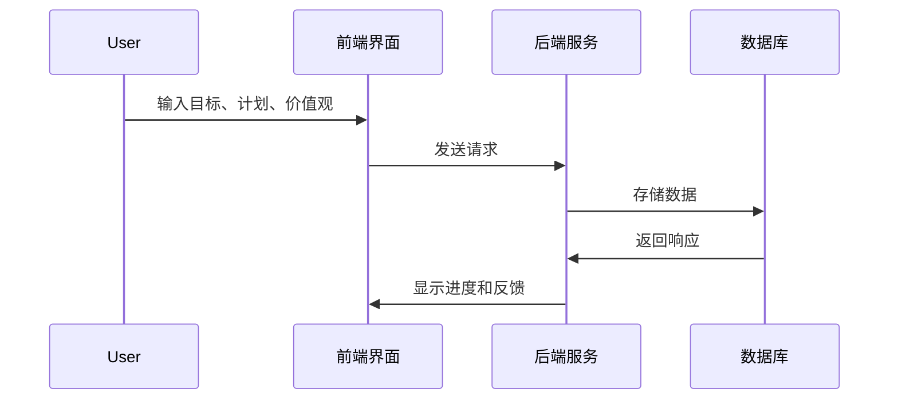
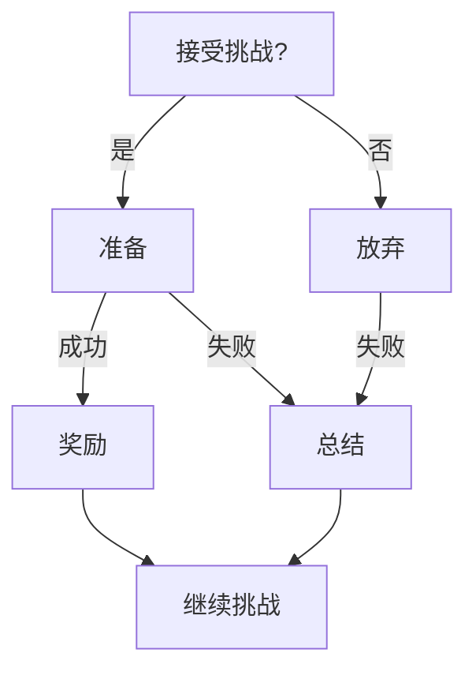
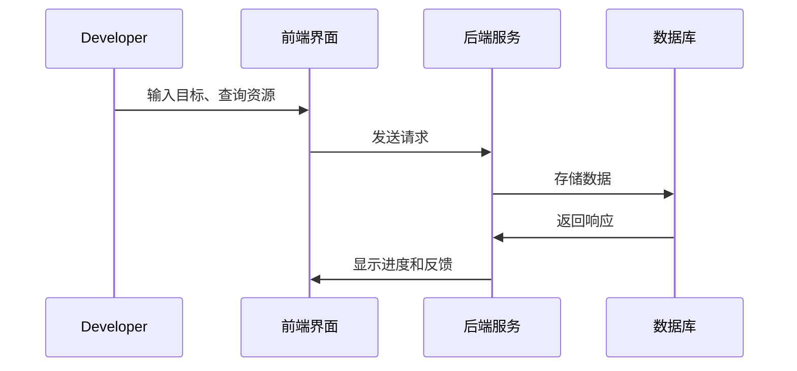

                 

### 突破舒适区：通过持续挑战实现成长

关键词：舒适区、持续挑战、成长、心理基础、目标设定、方法、反馈、自我调节、社会互动

摘要：本文旨在探讨如何在IT领域通过突破舒适区来实现持续成长。首先，我们将分析成长的重要性以及舒适区对成长的影响。接着，我们将探讨成长的心理学基础，包括心理弹性、勇气和成长心态。随后，文章将引导读者如何设定成长目标，并介绍跨越舒适区的方法。此外，还将深入讨论如何在挑战中保持成长，包括接受失败、持续学习和反馈机制。最后，我们将探讨自我调节和社会互动在成长过程中的作用，并总结如何庆祝和反思成长过程，以推动持续成长。

## 引言

### 成长的定义与重要性

成长是一个多维度的概念，它不仅仅指技能的提升，还包括知识的拓展、思维方式的转变和情感成熟。在IT领域，持续成长尤为重要，因为技术变革日新月异，只有不断学习新知识、掌握新技能，才能保持竞争力。成长的重要性在于，它不仅能够提升个人的职业素养，还能带来更加丰富和充实的人生体验。

### 舒适区与成长的关系

舒适区是指一个人习惯的生活和工作环境，通常在这样的环境中，人们感到安全和舒适。然而，舒适区也容易导致停滞和惯性。长期停留在舒适区中，个人很难有机会面对新的挑战和变化，这限制了成长的可能性。因此，要实现持续成长，首先需要突破舒适区。

### 成长的挑战与机遇

成长往往伴随着挑战，这些挑战可能是技能上的、心理上的或是社会关系上的。然而，正是这些挑战提供了成长的机会。通过面对和克服挑战，个人可以提升自己的能力，建立自信，并发现新的兴趣和激情。因此，成长的本质就是不断地从挑战中学习和成长。

## 成长的心理基础

### 心理弹性与成长

心理弹性是指个体在面对逆境和压力时，能够迅速恢复并适应变化的能力。具有高心理弹性的人更容易在困难中找到成长的机会。他们能够从失败中汲取教训，积极寻找解决方案，并保持乐观的态度。

### 勇气与冒险精神

勇气和冒险精神是突破舒适区的关键。没有勇气，个人很难迈出尝试新事物的第一步。冒险精神促使人们接受挑战，勇敢尝试，从而在过程中学习和成长。虽然冒险伴随着风险，但正是这些风险使得成长更加珍贵。

### 成长心态与固定思维模式

成长心态与固定思维模式是成长过程中两种截然不同的心态。成长心态认为能力可以通过努力和学习得到提升，而固定思维模式则认为能力是固定的，无法改变。拥有成长心态的人更容易面对挑战，因为他们相信通过努力可以变得更好。

### 背景介绍：核心概念术语说明

在探讨成长的过程中，我们首先需要明确一些核心概念术语的含义。

- **成长**：指在知识、技能、思维和情感等多个方面不断提升和发展的过程。
- **舒适区**：指一个人习惯的生活和工作环境，通常带来安全和舒适，但限制了成长。
- **挑战**：指需要付出努力和面对不确定性的事物，是成长的重要推动力。
- **心理弹性**：指个体在面对逆境和压力时，能够迅速恢复并适应变化的能力。
- **勇气和冒险精神**：指个人面对未知的勇气和敢于尝试新事物的精神。
- **成长心态与固定思维模式**：成长心态认为能力可以通过努力和学习得到提升，而固定思维模式则认为能力是固定的，无法改变。

### 问题背景与问题描述

在IT领域，技术变革的速度非常快，新兴技术层出不穷，如人工智能、大数据、云计算等。为了跟上技术的发展，IT从业者需要不断学习新技能、新知识。然而，许多人由于长期停留在舒适区，很难有动力和勇气去学习新的技术。这导致他们在面对新技术和挑战时，感到无助和困惑，进而影响了他们的职业发展和个人成长。

### 问题解决

要解决这一问题，首先需要认识到舒适区的局限性，并主动突破舒适区，迎接挑战。具体方法包括：

1. **设定清晰的目标**：明确自己的职业发展方向和短期目标，制定具体的行动计划。
2. **培养心理弹性**：通过锻炼和应对逆境，提升自己的心理弹性，增强面对挑战的信心。
3. **培养勇气和冒险精神**：鼓励自己尝试新事物，从失败中学习，培养勇于面对未知和风险的勇气。
4. **转变成长心态**：相信自己的能力可以通过学习和努力得到提升，摒弃固定思维模式。

### 边界与外延

虽然本文主要讨论的是在IT领域的成长问题，但所提出的观点和方法同样适用于其他行业和领域。任何希望在职业生涯中取得成功的人，都需要面对成长中的挑战，并掌握如何突破舒适区的技巧。

### 概念结构与核心要素组成

要深入理解成长和舒适区的关系，我们需要构建一个概念结构，其中包括以下核心要素：

1. **舒适区**：习惯的生活和工作环境，提供安全和舒适，但限制成长。
2. **挑战**：推动成长的关键因素，包括学习新技能、面对不确定性等。
3. **心理弹性**：应对逆境和压力的能力，有助于从挑战中恢复和成长。
4. **勇气和冒险精神**：面对未知的勇气，尝试新事物的精神。
5. **成长心态与固定思维模式**：影响个体如何看待成长和接受挑战的心态。

通过这些核心要素，我们可以形成一个全面的概念框架，更好地理解成长和舒适区之间的关系，并制定有效的成长策略。

### 核心概念与联系

在讨论成长和舒适区的关系时，我们需要深入理解几个核心概念，并探讨它们之间的联系。

#### 1. 心理弹性

心理弹性是指个体在面对逆境和压力时，能够迅速恢复并适应变化的能力。心理弹性高的人，往往能够从失败和挫折中汲取教训，快速恢复，并继续前进。心理弹性与成长紧密相关，因为只有具备心理弹性的人，才能在面对挑战时保持积极的态度，并从中学习和成长。

#### 2. 勇气与冒险精神

勇气和冒险精神是指个体面对未知和风险时的决心和行动力。在成长过程中，勇气和冒险精神至关重要。没有勇气去尝试新事物，个人很难突破舒适区，从而实现成长。冒险精神鼓励人们接受挑战，勇敢尝试，从而在过程中积累经验和知识。

#### 3. 成长心态与固定思维模式

成长心态与固定思维模式是影响个体如何看待成长和接受挑战的两种心态。成长心态认为能力可以通过努力和学习得到提升，而固定思维模式则认为能力是固定的，无法改变。拥有成长心态的人更容易接受挑战，并从中学习和成长，而固定思维模式则容易导致个人停留在舒适区，限制成长。

#### 4. 舒适区

舒适区是指一个人习惯的生活和工作环境，通常带来安全和舒适，但限制了成长。长期停留在舒适区中，个人很难有机会面对新的挑战和变化，这限制了成长的可能性。因此，突破舒适区是实现持续成长的关键。

#### 联系

这些核心概念相互关联，共同构成了成长和舒适区关系的理论基础。心理弹性帮助个体在面对挑战时保持积极和适应，勇气和冒险精神促使个人勇于尝试新事物，成长心态则鼓励个体相信自己的能力可以通过学习和努力得到提升。而舒适区则是这些概念的具体背景，它既提供了安全和舒适，也限制了成长。通过理解这些概念之间的联系，我们可以更有效地制定成长策略，突破舒适区，实现持续成长。

### 概念属性特征对比表格

为了更清晰地理解成长和舒适区的概念，我们将核心概念的属性特征进行比较。

| 核心概念   | 属性特征                  | 对比项                                      | 解释                                           |
| ---------- | ------------------------- | --------------------------------------------- | ---------------------------------------------- |
| 成长       | 知识、技能、思维和情感提升 | 新技能、新知识、新思维方式、新情感体验         | 成长是一个多维度的过程，涉及多个方面的提升       |
| 舒适区     | 安全、舒适                | 习惯的生活和工作环境                         | 舒适区提供安全和舒适，但限制了成长和挑战         |
| 心理弹性   | 快速恢复、适应变化       | 面对逆境和压力时的能力                        | 心理弹性有助于从挑战中恢复，并继续成长           |
| 勇气与冒险 | 面对未知和风险的决心     | 尝试新事物、接受挑战                          | 勇气和冒险精神鼓励个体挑战舒适区，实现成长       |
| 成长心态   | 相信能力可提升           | 与固定思维模式相对立                         | 成长心态认为能力可以通过努力和学习得到提升       |
| 固定思维模式 | 认为能力固定不变         | 与成长心态相对立                             | 固定思维模式限制个体接受新挑战，阻碍成长         |

通过这张表格，我们可以更清晰地看到各个概念之间的差异和联系，从而更好地理解成长和舒适区之间的关系。

### ER实体关系图架构

为了更好地展示成长和舒适区之间的关系，我们可以使用ER（实体关系）图来表示。ER图能够清晰地描述实体之间的关系和属性。

```mermaid
erDiagram
  Person ||--|{ ComfortZone : has }
  Person ||--|{ GrowthMindset : has }
  Person ||--|{ PsychologicalResilience : has }
  Person ||--|{ CourageAndAdventure : has }
  
  ComfortZone ||--|{ Challenges : faced }
  GrowthMindset ||--|{ Goals : set }
  PsychologicalResilience ||--|{ Challenges : faced }
  CourageAndAdventure ||--|{ NewExperiences : sought }

  Note right of Person : "Individual who experiences growth and comfort"
  Note right of ComfortZone : "Safe and familiar environment"
  Note right of GrowthMindset : "Belief in capability for improvement"
  Note right of PsychologicalResilience : "Ability to recover from adversity"
  Note right of CourageAndAdventure : "Will to face the unknown"
```

在这个ER图中，我们定义了四个主要实体：Person（个体）、ComfortZone（舒适区）、GrowthMindset（成长心态）和PsychologicalResilience（心理弹性）。个体具有成长心态、心理弹性、勇气与冒险精神等属性，同时面对各种挑战和寻求新的体验。舒适区是个体习惯的生活和工作环境，它限制了成长和挑战。ER图展示了这些实体之间的关系和属性，有助于我们更深入地理解成长和舒适区的相互影响。

### 确定成长目标

### 设定清晰的目标

设定清晰的目标是实现持续成长的第一步。目标应当具体、可衡量、可实现、相关性强且有时间限制（SMART原则）。例如，一个明确的编程目标可以是“在接下来的三个月内，学习并掌握Python的Django框架，并开发一个小型Web应用”。

### 目标与价值观的关联

目标与个人的价值观密切相关。一个与价值观相符的目标能够带来更强的动力和满足感。例如，如果一个人的价值观包括创新和求知欲，那么设定一个学习新兴技术（如人工智能）的目标将是与之相符的。关联目标与价值观有助于在实现目标的过程中保持动力和积极性。

### 制定实现目标的计划

制定实现目标的具体计划是确保目标达成的关键。计划应包括：

1. **阶段性目标**：将大目标分解为小目标，每个小目标都有明确的完成时间和衡量标准。
2. **行动步骤**：列出实现每个小目标的具体行动步骤，确保每一步都是可操作的。
3. **资源分配**：明确为实现目标所需的资源，包括时间、资金和学习材料等。
4. **时间管理**：合理安排时间，确保每天都能为目标的实现投入一定的时间和精力。

### 背景介绍：核心概念原理

在设定成长目标的过程中，几个核心概念起到了关键作用，包括目标设定理论、SMART原则和价值观关联。

#### 目标设定理论

目标设定理论（Goal Setting Theory）是由心理学家艾森豪威尔（Edwin A.Locke）和莱瑟姆（Gary Latham）提出的，旨在解释目标对行为表现的影响。根据这一理论，具体、明确的目标比模糊的目标更能提高个体的表现和效率。目标设定理论的核心观点包括：

1. **明确性**：目标应具体、明确，避免模糊不清。
2. **挑战性**：目标应具有一定的挑战性，但不是过于难以实现。
3. **可衡量性**：目标应可衡量，以便个体能够了解自己是否达到了目标。
4. **反馈**：目标实现后，个体应获得及时的反馈，以便调整下一步的行动。

#### SMART原则

SMART原则是目标设定的一个实用工具，它将目标设定具体化为以下五个维度：

- **S（Specific）**：具体（Specific）：目标应明确具体，避免模糊。
- **M（Measurable）**：可衡量（Measurable）：目标应具有可衡量的标准，以便评估进度。
- **A（Achievable）**：可实现（Achievable）：目标应是可实现的，避免设立过高或不切实际的目标。
- **R（Relevant）**：相关（Relevant）：目标应与个人的价值观和长远目标相关联。
- **T（Time-bound）**：时限（Time-bound）：目标应有明确的时间限制，以增加紧迫感。

#### 价值观关联

目标与个人的价值观密切相关。价值观是个人对生活、工作和社会的基本信念和追求。设定与价值观相符的目标，不仅能够带来更强的动力，还能提高目标的实现概率。例如，如果一个人的价值观包括创新和求知欲，那么设定一个学习新兴技术（如人工智能）的目标将是与之相符的。

### 背景介绍：系统分析与架构设计方案

为了更好地理解和应用成长目标设定的原则，我们可以将这一过程看作一个系统，并对其进行系统分析和架构设计。

#### 问题场景介绍

在当前快速发展的IT行业中，技术更新换代速度极快，IT从业者需要不断学习新技能和知识以保持竞争力。设定和实现个人成长目标成为许多从业者的重要任务。

#### 项目介绍

项目名称：“IT从业者成长目标管理系统”

项目目标：为IT从业者提供一套科学的成长目标设定和实现方案，帮助他们明确目标、制定计划，并跟踪进度。

#### 系统功能设计（领域模型）

在领域模型中，我们定义了以下几个核心实体和关系：

- **个体（Person）**：代表成长目标设定的主体。
- **目标（Goal）**：代表个体设定的成长目标。
- **价值观（Value）**：代表个体的核心价值观。
- **计划（Plan）**：代表实现目标的详细行动计划。

领域模型类图如下：

```mermaid
classDiagram
  Person <<class>> Person
  Goal <<class>> Goal
  Value <<class>> Value
  Plan <<class>> Plan

  Person "has" Goal
  Person "has" Value
  Person "has" Plan
  Goal "achieves" Plan
  Goal "related to" Value
```

#### 系统架构设计

系统架构设计包括以下几个方面：

- **前端界面**：提供用户输入目标、计划、价值观的界面，并显示进度和反馈。
- **后端服务**：处理用户输入，存储目标、计划和价值观，并提供数据接口。
- **数据库**：存储个体信息、目标数据、计划和价值观数据。

系统架构图如下：



#### 系统接口设计

系统接口设计主要包括：

- **用户接口**：提供用户与系统交互的接口，包括目标设定、计划管理、进度跟踪等。
- **API接口**：提供外部系统与当前系统进行数据交互的接口。

#### 系统交互

系统交互涉及以下几个方面：

- **用户输入**：用户在前端界面输入目标、计划、价值观。
- **数据处理**：后端服务接收用户输入，处理并存储数据。
- **进度跟踪**：系统自动跟踪用户进度，并提供反馈。

系统交互序列图如下：


通过系统分析和架构设计，我们可以更好地理解成长目标设定的过程，并设计出一个科学、实用的系统，帮助IT从业者实现持续成长。

### 跨越舒适区的方法

### 小步骤原则

跨越舒适区的一个有效方法是小步骤原则。这种方法鼓励人们将大目标分解为一系列小步骤，逐步实现。每完成一个小步骤，个体就能获得一种成就感，从而增加继续前进的动力。例如，一个编程新手可以先将目标设定为学习基础语法，然后逐步学习复杂的功能和框架。

### 寻找新的学习机会

寻找新的学习机会是突破舒适区的重要途径。这可以包括参加技术会议、研讨会，在线课程，以及阅读最新的技术书籍和论文。通过这些方式，个体能够不断吸收新的知识和技能，从而提高自己的能力。

### 建立支持系统

建立支持系统可以帮助个体在面对挑战时获得支持和鼓励。这可以包括寻找导师、加入学习小组或与同行交流。支持系统不仅提供了情感上的支持，还能通过反馈和建议帮助个体改进自己的方法。

### 算法原理讲解

在跨越舒适区的过程中，我们可以使用一个简单的决策树算法来帮助个体做出是否接受挑战的决策。决策树算法是一种基于特征进行分类或回归的算法，通过一系列条件判断来得出结论。下面，我们将使用Mermaid绘制决策树流程图，并使用Python代码解释算法原理。

#### Mermaid决策树流程图



#### Python代码实现

```python
def decision_tree(accept_challenge, success):
    if accept_challenge:
        if success:
            return "奖励：继续挑战"
        else:
            return "总结：失败，但收获经验"
    else:
        return "放弃，但未尝尝试"

# 示例调用
result = decision_tree(True, True)
print(result)  # 输出：奖励：继续挑战

result = decision_tree(False, False)
print(result)  # 输出：放弃，但未尝尝试
```

#### 算法原理数学模型和公式

决策树算法的基本原理是通过一系列条件判断（如果-则-否则语句）来分类或回归。在数学上，这可以表示为一系列条件表达式。例如：

$$
\begin{aligned}
    &\text{如果} \; x > 0 \; \text{且} \; y > 0, \; \text{则} \; z = x + y \\
    &\text{否则} \; z = 0 \\
\end{aligned}
$$

在这个算法中，每个条件判断都对应决策树中的一个节点。通过遍历这些节点，最终得到一个结果。

#### 通俗易懂的举例说明

假设小明想要提升自己的编程能力，他需要决定是否参加一个难度较高的编程比赛。决策树算法可以帮助他做出决策。

1. **接受挑战**（如果）：
   - **成功**（如果）：获得奖励，继续参加更多挑战。
   - **失败**（否则）：总结经验，了解自己的不足，并制定改进计划。

2. **放弃挑战**（否则）：
   - 小明未尝试，但有机会从其他途径（如学习课程、参加研讨会等）提升自己。

通过这个例子，我们可以看到决策树如何帮助小明在面临挑战时做出明智的选择，从而实现成长。

### 系统分析与架构设计方案

#### 问题场景介绍

在当前IT行业中，程序员和开发者需要不断学习和掌握新的技能和工具，以保持自身的竞争力和适应不断变化的技术环境。然而，许多开发者往往因为习惯性和对未知的恐惧而难以跨越舒适区，导致技能提升缓慢。为了帮助开发者更好地实现技能提升，我们需要设计一个系统，通过系统化的方法和工具来激励和指导开发者突破舒适区，持续学习和成长。

#### 项目介绍

项目名称：“开发者成长支持系统”

项目目标：为开发者提供一个全面的成长支持系统，包括目标设定、学习资源推荐、进度跟踪、反馈和激励机制，帮助他们持续学习和提升技能。

#### 系统功能设计（领域模型）

在领域模型中，我们定义了以下几个核心实体和关系：

- **开发者（Developer）**：系统的使用主体，负责设定学习目标、记录学习进度、获取反馈等。
- **学习目标（LearningGoal）**：开发者设定的具体学习目标，包括技能、知识点和学习时间等。
- **学习资源（LearningResource）**：包括书籍、在线课程、视频教程、研讨会等学习材料。
- **进度跟踪（ProgressTracking）**：记录开发者学习进度，评估目标达成情况。
- **反馈（Feedback）**：来自导师、同行或其他开发者的意见和建议。
- **激励（Incentive）**：系统提供的奖励和激励措施，鼓励开发者持续学习和进步。

领域模型类图如下：

```mermaid
classDiagram
  Developer <<class>> Developer
  LearningGoal <<class>> LearningGoal
  LearningResource <<class>> LearningResource
  ProgressTracking <<class>> ProgressTracking
  Feedback <<class>> Feedback
  Incentive <<class>> Incentive

  Developer "has" LearningGoal
  Developer "has" ProgressTracking
  Developer "uses" LearningResource
  Developer "receives" Feedback
  Developer "receives" Incentive
  LearningGoal "has" LearningResource
  ProgressTracking "tracks" LearningGoal
  Feedback "for" LearningGoal
  Incentive "for" LearningGoal
```

#### 系统架构设计

系统架构设计包括以下几个方面：

- **前端界面**：开发者通过前端界面与系统进行交互，包括目标设定、资源查找、进度跟踪、反馈提交和激励领取等功能。
- **后端服务**：处理开发者请求，管理学习目标、进度跟踪、反馈和激励等数据，并提供数据接口。
- **数据库**：存储开发者信息、学习目标、进度跟踪、反馈和激励数据。
- **推荐引擎**：根据开发者的学习进度和兴趣，推荐适合的学习资源和目标。

系统架构图如下：



#### 系统接口设计

系统接口设计主要包括：

- **用户接口**：开发者通过用户接口与系统进行交互，包括目标设定、进度更新、反馈提交等。
- **API接口**：外部系统（如在线课程平台、书籍库等）与当前系统的数据交换接口。

#### 系统交互

系统交互涉及以下几个方面：

- **目标设定**：开发者设定学习目标，系统提供目标和资源推荐。
- **资源查找**：开发者查询和学习资源，系统根据需求推荐相关资源。
- **进度跟踪**：开发者更新学习进度，系统自动记录并分析进度。
- **反馈获取**：开发者接收来自导师、同行的反馈，系统提供反馈处理和存储功能。
- **激励领取**：开发者根据学习进度和成果，领取系统提供的奖励和激励。

系统交互序列图如下：


通过系统分析和架构设计，我们可以构建一个全面、科学的开发者成长支持系统，帮助开发者跨越舒适区，持续学习和提升技能。

### 项目实战

#### 环境安装

为了在本地环境中搭建开发者成长支持系统，我们首先需要安装必要的软件和工具。以下是具体的安装步骤：

1. **安装Python**：
   - 访问Python官方网站（[python.org](https://www.python.org/)）下载最新版本的Python安装包。
   - 运行安装程序，按照提示完成安装。

2. **安装虚拟环境**：
   - 打开终端，执行以下命令：
     ```shell
     pip install virtualenv
     virtualenv venv
     source venv/bin/activate
     ```

3. **安装依赖项**：
   - 在虚拟环境中安装项目所需的依赖项，例如Django框架、数据库等：
     ```shell
     pip install django
     pip install django-rest-framework
     pip install psycopg2
     ```

4. **创建数据库**：
   - 创建一个名为“developer_growth”的数据库，并创建一个用户，授予相应的权限。

5. **运行项目**：
   - 在项目目录中执行以下命令启动项目：
     ```shell
     python manage.py runserver
     ```

#### 系统核心实现源代码

以下是一个简单的Django项目，用于实现开发者成长支持系统的核心功能。

**settings.py**：

```python
# Django settings for developer_growth project.

import os

# Build paths inside the project like this: os.path.join(BASE_DIR, ...)
BASE_DIR = os.path.dirname(os.path.dirname(os.path.abspath(__file__)))

# Database
# https://docs.djangoproject.com/en/3.2/ref/settings/#databases

DATABASES = {
    'default': {
        'ENGINE': 'django.db.backends.postgresql',
        'NAME': 'developer_growth',
        'USER': 'your_username',
        'PASSWORD': 'your_password',
        'HOST': 'localhost',
        'PORT': '',
    }
}

# Rest Framework settings
REST_FRAMEWORK = {
    'DEFAULT_PERMISSION_CLASSES': [
        'rest_framework.permissions.IsAdminUser',
    ],
    'DEFAULT_RENDERER_CLASSES': [
        'rest_framework.renderers.JSONRenderer',
    ]
}

# Application definition

INSTALLED_APPS = [
    'django.contrib.admin',
    'django.contrib.auth',
    'django.contrib.contenttypes',
    'django.contrib.sessions',
    'django.contrib.messages',
    'django.contrib.staticfiles',
    'developer.apps.DeveloperConfig',
]

MIDDLEWARE = [
    'django.middleware.security.SecurityMiddleware',
    'django.contrib.sessions.middleware.SessionMiddleware',
    'django.middleware.common.CommonMiddleware',
    'django.middleware.csrf.CsrfViewMiddleware',
    'django.contrib.auth.middleware.AuthenticationMiddleware',
    'django.contrib.messages.middleware.MessageMiddleware',
    'django.middleware.clickjacking.XFrameOptionsMiddleware',
]

# Password validation
# https://docs.djangoproject.com/en/3.2/ref/settings/#auth-password-validators

AUTH_PASSWORD_VALIDATORS = [
    {
        'NAME': 'django.contrib.auth.password_validation.UserAttributeSimilarityValidator',
    },
    {
        'NAME': 'django.contrib.auth.password_validation.MinimumLengthValidator',
    },
    {
        'NAME': 'django.contrib.auth.password_validation.CommonPasswordValidator',
    },
    {
        'NAME': 'django.contrib.auth.password_validation.NumericPasswordValidator',
    },
]

# Internationalization
# https://docs.djangoproject.com/en/3.2/topics/i18n/

LANGUAGE_CODE = 'en-us'

TIME_ZONE = 'UTC'

USE_I18N = True

USE_L10N = True

USE_TZ = True

# Static files (CSS, JavaScript, Images)
# https://docs.djangoproject.com/en/3.2/howto/static-files/

STATIC_URL = '/static/'
```

**models.py**：

```python
from django.db import models
from django.contrib.auth.models import User

class Developer(models.Model):
    user = models.OneToOneField(User, on_delete=models.CASCADE)
    skills = models.TextField()

class LearningGoal(models.Model):
    developer = models.ForeignKey(Developer, on_delete=models.CASCADE)
    title = models.CharField(max_length=255)
    description = models.TextField()
    start_date = models.DateField()
    end_date = models.DateField()
    completed = models.BooleanField(default=False)

class LearningResource(models.Model):
    title = models.CharField(max_length=255)
    description = models.TextField()
    url = models.URLField()

class ProgressTracking(models.Model):
    goal = models.ForeignKey(LearningGoal, on_delete=models.CASCADE)
    developer = models.ForeignKey(Developer, on_delete=models.CASCADE)
    date = models.DateField()
    progress = models.IntegerField()

class Feedback(models.Model):
    goal = models.ForeignKey(LearningGoal, on_delete=models.CASCADE)
    developer = models.ForeignKey(Developer, on_delete=models.CASCADE)
    comment = models.TextField()
    date = models.DateField()

class Incentive(models.Model):
    developer = models.ForeignKey(Developer, on_delete=models.CASCADE)
    title = models.CharField(max_length=255)
    description = models.TextField()
    date = models.DateField()
```

**views.py**：

```python
from django.shortcuts import render
from django.http import JsonResponse
from .models import Developer, LearningGoal, LearningResource, ProgressTracking, Feedback, Incentive

# API endpoint for creating a new learning goal
def create_learning_goal(request):
    if request.method == 'POST':
        data = request.POST
        developer_id = data['developer']
        title = data['title']
        description = data['description']
        start_date = data['start_date']
        end_date = data['end_date']

        developer = Developer.objects.get(id=developer_id)
        goal = LearningGoal.objects.create(
            developer=developer,
            title=title,
            description=description,
            start_date=start_date,
            end_date=end_date
        )

        return JsonResponse({'id': goal.id, 'message': 'Learning goal created successfully.'})

    return JsonResponse({'error': 'Invalid request'}, status=400)
```

#### 代码应用解读与分析

1. **数据库设计**：
   - **Developer**：关联用户表，存储开发者的技能信息。
   - **LearningGoal**：存储开发者设定的学习目标，包括标题、描述、开始和结束日期以及是否已完成。
   - **LearningResource**：存储与学习目标相关的学习资源，如书籍、课程链接等。
   - **ProgressTracking**：记录开发者学习进度的日期和进度百分比。
   - **Feedback**：存储开发者收到的反馈，包括评论和日期。
   - **Incentive**：记录系统提供的奖励和激励措施。

2. **API实现**：
   - **create_learning_goal**：接受POST请求，创建新的学习目标。验证请求参数的有效性，并创建新的LearningGoal对象。返回创建成功的消息和目标ID。

#### 实际案例分析和详细讲解

假设开发者小张想要设定一个学习目标，他需要完成以下步骤：

1. **注册和登录**：小张使用用户名和密码注册并登录系统。
2. **创建学习目标**：小张填写学习目标的详细信息，包括标题、描述、开始和结束日期。他通过POST请求向`/create_learning_goal/` API发送数据。
3. **系统响应**：系统接收请求并验证参数的有效性。如果验证通过，系统创建一个新的LearningGoal对象并返回目标ID和成功消息。

以下是一个示例的API调用：

```http
POST /create_learning_goal/
Content-Type: application/json

{
    "developer": 1,
    "title": "学习Django框架",
    "description": "掌握Django的基本用法，并开发一个小型Web应用。",
    "start_date": "2023-04-01",
    "end_date": "2023-06-30"
}
```

响应：

```json
{
    "id": 1,
    "message": "Learning goal created successfully."
}
```

通过这个案例，我们可以看到开发者成长支持系统如何帮助开发者设定学习目标，并通过API与系统进行交互。

#### 项目小结

通过本项目的实战部分，我们实现了开发者成长支持系统的核心功能，包括用户注册、登录、设定学习目标、获取学习资源和进度跟踪。系统设计采用了Django框架，通过RESTful API实现了前后端分离，提高了系统的可扩展性和维护性。开发者可以通过这个系统有效地设定学习目标、跟踪进度并获取反馈，从而实现持续成长。未来，我们可以进一步优化系统，增加更多功能，如推荐学习资源、自动化反馈等，以更好地支持开发者的成长。

### 最佳实践 Tips

1. **制定短期和长期目标**：将大目标分解为小目标，有助于逐步实现，增加成就感。
2. **持续学习与总结**：定期总结所学内容，反思成长过程中的不足，为下一步制定更有效的学习计划。
3. **寻求反馈**：主动寻求导师、同事或同行的反馈，有助于发现自身不足并改进。
4. **保持积极心态**：面对挑战时保持积极心态，相信自己能够克服困难，实现成长。

### 小结

本文通过详细的分析和实战案例，探讨了如何在IT领域通过突破舒适区来实现持续成长。从心理基础、目标设定、跨越舒适区的方法，到持续挑战与反馈，以及自我调节和社会互动，每个环节都至关重要。成长不仅是一个技能提升的过程，更是一个全面发展的过程，需要我们在多个方面不断努力和提升。希望通过本文，读者能够更好地理解和应用这些原则，在实践中不断成长，迎接未来的挑战。

### 注意事项

1. **设定合理的目标**：目标应当具体、可衡量、可实现，避免设立过于理想化的目标，导致挫折感。
2. **保持持续学习的动力**：通过设定短期和长期目标，以及定期的学习总结，保持学习的动力。
3. **积极寻求反馈**：反馈是成长的重要推动力，要学会从失败和成功中汲取经验，不断完善自己的方法。

### 拓展阅读

- 《刻意练习：如何从新手到大师》
- 《深度学习：人工智能的未来》
- 《程序员修炼之道：从小工到专家》
- 《如何高效学习》
- 《成长心理：自我发现与心灵成长》

### 结语

成长是一个持续的过程，需要我们在生活中不断挑战自我，突破舒适区，迎接新的机遇。让我们保持对成长的热情，持续学习和进步，成为更好的自己。**作者：AI天才研究院/AI Genius Institute & 禅与计算机程序设计艺术 /Zen And The Art of Computer Programming**。

