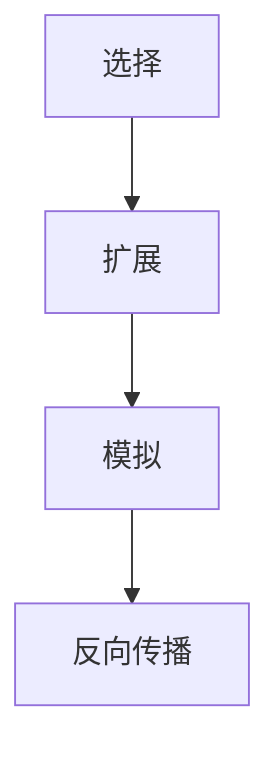
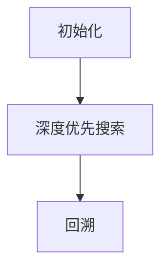
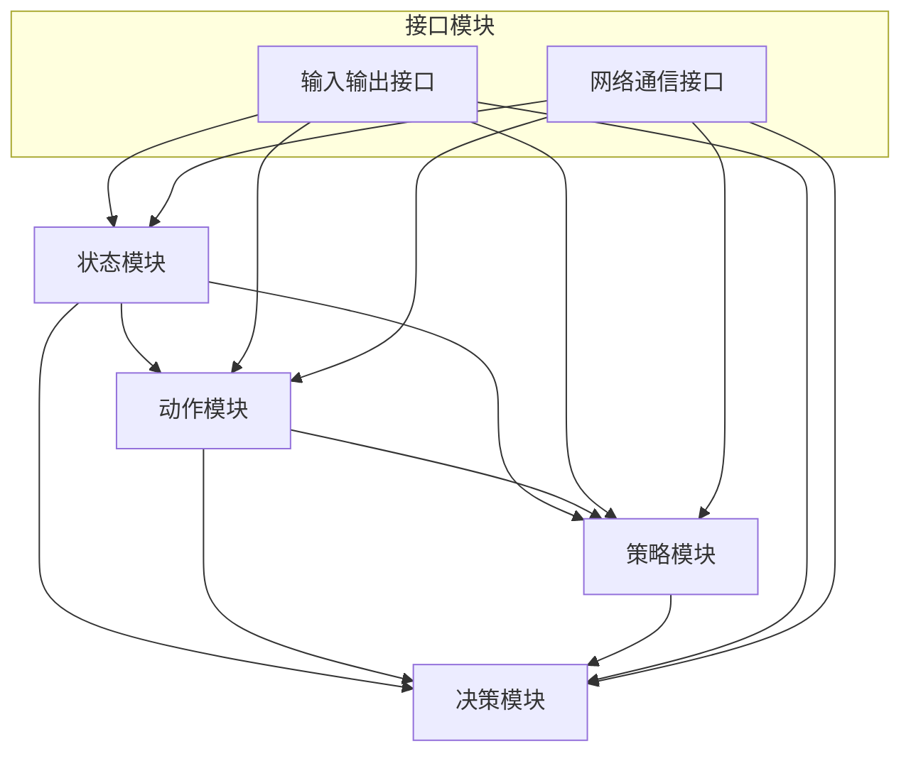
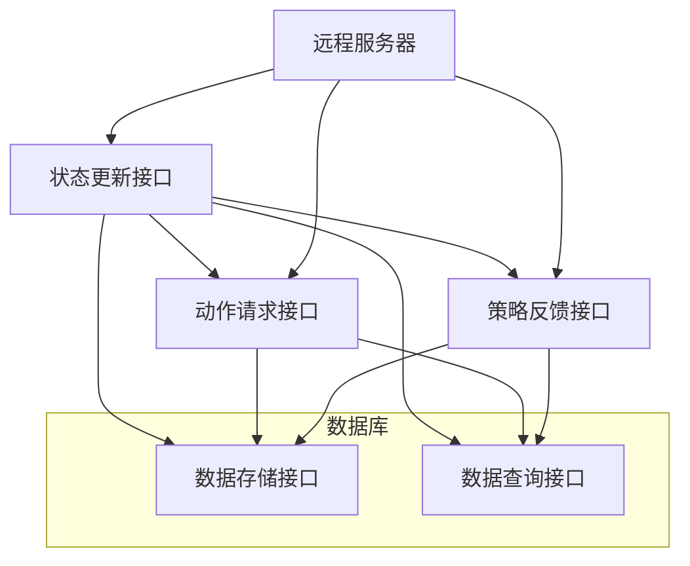

                 


## 第1章：策略优化概述

### 1.1 问题背景与定义

策略优化在计算机科学和人工智能领域中扮演着至关重要的角色。它是一种用于从一组可能的决策中选择最佳决策的方法。策略优化旨在通过最大化预期收益或最小化预期损失来提高系统的性能。在游戏、机器人控制、金融市场预测等多个领域，策略优化已经成为解决复杂问题的重要工具。

策略优化的问题背景可以概括为：在给定的环境和约束条件下，如何找到一个最优的决策策略。这个问题可以进一步细化为：在不确定的环境下，如何根据有限的信息进行决策，并最大化长期收益。

在策略优化中，常见的问题有：

- **马尔可夫决策过程（MDP）**：描述了在一系列状态转移和奖励的基础上，如何选择最佳的动作序列。
- **部分可观察马尔可夫决策过程（POMDP）**：在MDP的基础上增加了观测的不确定性。
- **对策（Game Theory）**：在多参与者决策问题中，如何找到一个均衡策略。

策略优化的核心概念包括：

- **策略**：决策者在不同状态下采取的动作集合。
- **状态**：决策者所处的环境条件。
- **动作**：决策者可以采取的行动。
- **状态转移概率**：从当前状态转移到下一状态的概率。
- **奖励**：采取特定动作后获得的即时收益。

### 1.2 发展历程与应用

策略优化的发展历程可以追溯到20世纪中叶，最初应用于控制理论和决策理论的研究。随着计算机科学和人工智能的兴起，策略优化逐渐成为这些领域的关键技术。

- **20世纪50年代**：策略优化初步应用于博弈论和决策分析。
- **20世纪60年代**：马尔可夫决策过程（MDP）模型被提出，为策略优化提供了理论基础。
- **20世纪70年代**：价值迭代、策略迭代等算法被开发，用于解决MDP问题。
- **20世纪80年代**：部分可观察马尔可夫决策过程（POMDP）模型被提出，扩展了策略优化问题的应用范围。
- **21世纪**：随着深度学习和强化学习的发展，策略优化算法得到了进一步优化和推广，应用于自动驾驶、游戏AI、推荐系统等多个领域。

### 1.3 策略优化的核心概念

在策略优化中，核心概念和术语的理解至关重要。以下是对几个关键术语的简要介绍：

- **策略迭代**：一种策略优化方法，通过反复迭代状态值函数和策略来逼近最优策略。
- **价值函数**：描述了在特定策略下，从每个状态获得的期望收益。
- **策略评估**：通过迭代更新策略，计算每个状态的价值函数。
- **探索与利用**：在策略优化中，探索是指在不确定的环境下尝试新的动作，利用则是根据过去的经验选择已知的最佳动作。
- **Q-learning**：一种基于值函数的强化学习算法，通过不断更新Q值来学习最优策略。

### 问题解决

策略优化问题的解决通常包括以下步骤：

1. **定义状态空间和动作空间**：明确决策问题的环境和行动范围。
2. **建立模型**：根据问题特性，选择合适的策略优化模型，如MDP或POMDP。
3. **选择优化算法**：根据问题规模和特性，选择合适的策略优化算法，如策略迭代、Q-learning或深度强化学习。
4. **训练和测试**：在模拟环境中训练策略优化模型，并通过测试集验证模型性能。

### 边界与外延

策略优化的边界涉及以下几个方面：

- **计算复杂性**：随着状态空间和动作空间规模的增加，策略优化的计算复杂性会急剧增加，需要有效的算法和数据结构来应对。
- **不确定性**：在现实世界中，环境往往具有不确定性，这要求策略优化算法能够适应不确定条件。
- **实时性**：在某些应用场景中，如自动驾驶和实时决策系统，策略优化需要实时响应，这要求算法具有较低的延迟。

外延方面，策略优化不仅在计算机科学和人工智能领域有广泛应用，还可以扩展到经济学、管理学和工程学等多个领域。

### 概念结构与核心要素组成

策略优化的概念结构主要包括以下几个核心要素：

- **决策者**：具有决策能力的实体，如人工智能系统。
- **环境**：决策者所处的环境，包括状态和动作。
- **策略**：决策者在不同状态下采取的动作集合。
- **价值函数**：评估策略优劣的指标。
- **优化算法**：用于搜索和选择最优策略的方法。

通过上述步骤和分析，我们可以对策略优化有一个初步的了解，为后续章节的深入探讨打下基础。

### 核心概念与联系

蒙特卡洛树搜索（MCTS）和深度优先搜索（DPO）是策略优化领域中的两种重要算法。它们各自具有独特的原理和特点，适用于不同的应用场景。

#### MCTS算法原理

MCTS是一种基于蒙特卡洛方法进行策略搜索的算法，其核心思想是通过反复模拟来评估和选择最佳策略。MCTS算法主要包括以下四个步骤：

1. **选择（Selection）**：从根节点开始，选择一个节点，使得该节点的UCB（Upper Confidence Bound）值最大。
2. **扩展（Expansion）**：如果选择的节点不是叶子节点，则在该节点上扩展一棵新的子树。
3. **模拟（Simulation）**：从扩展的叶子节点开始，进行随机模拟，直到达到终止条件（如达到最大步数或找到目标状态）。
4. **反向传播（Backpropagation）**：根据模拟的结果，更新节点的信息，包括模拟次数和回报值。

MCTS算法的mermaid流程图如下：



#### MCTS算法优缺点

MCTS算法的优点包括：

- **自适应**：MCTS算法能够根据不断更新的信息自适应调整策略。
- **适用于不确定环境**：通过随机模拟，MCTS算法能够适应环境的不确定性。

缺点包括：

- **计算量大**：由于需要反复进行随机模拟，MCTS算法的计算量较大，可能导致效率较低。
- **收敛速度慢**：在某些情况下，MCTS算法可能需要较长的搜索时间才能收敛到最优策略。

#### DPO算法原理

深度优先搜索（DPO）是一种基于深度优先搜索策略的优化算法。其核心思想是选择当前已知的最佳动作，并逐步深入搜索，直到达到目标状态。DPO算法主要包括以下步骤：

1. **初始化**：选择初始状态，并根据策略选择初始动作。
2. **深度优先搜索**：从初始状态开始，选择当前已知的最佳动作，并进入下一状态，重复该过程，直到达到目标状态或搜索深度达到限制。
3. **回溯**：当无法继续深入搜索时，回溯到上一个状态，重新选择动作。

DPO算法的mermaid流程图如下：



#### DPO算法优缺点

DPO算法的优点包括：

- **高效**：DPO算法通过深度优先搜索，能够迅速找到最优策略。
- **简单**：DPO算法的实现相对简单，易于理解和实现。

缺点包括：

- **受限于初始策略**：DPO算法的性能受到初始策略的影响较大，如果初始策略不佳，可能导致搜索效果较差。
- **难以处理不确定性**：DPO算法在处理不确定性方面较弱，适用于确定性或高确定性环境。

#### MCTS与DPO算法对比

MCTS和DPO算法在策略优化领域各有所长，以下是对两者的对比分析：

- **适用场景**：MCTS算法适用于不确定性和复杂度较高的环境，而DPO算法适用于确定性或高确定性环境。
- **计算复杂性**：MCTS算法的计算量较大，但能够自适应调整策略；DPO算法计算效率较高，但受限于初始策略。
- **收敛速度**：MCTS算法的收敛速度较慢，但能够逐步优化策略；DPO算法收敛速度快，但可能收敛到次优策略。

通过以上对比，我们可以看到MCTS和DPO算法在策略优化中的应用各有特点，选择合适的算法需要根据具体问题的特性进行权衡。

### 算法原理讲解

在本节中，我们将详细讲解MCTS和DPO算法的原理，并通过Python源代码进行阐述，帮助读者更好地理解这两种算法的工作机制。

#### MCTS算法原理详解

MCTS算法通过四个主要步骤进行策略搜索和优化：选择（Selection）、扩展（Expansion）、模拟（Simulation）和反向传播（Backpropagation）。下面我们将使用Python代码详细描述每个步骤。

首先，定义MCTS算法的基本结构：

```python
import numpy as np
import random

class MCTSNode:
    def __init__(self, state, parent=None, action=None):
        self.state = state
        self.parent = parent
        self.action = action
        self.children = []
        self.visits = 0
        self.reward = 0

    def select_child(self):
        # 根据UCB1准则选择子节点
        max_ucb = -np.inf
        chosen_child = None
        for child in self.children:
            average_reward = child.reward / child.visits
            exploration = np.sqrt(2 * np.log(self.visits) / child.visits)
            ucb1 = average_reward + exploration
            if ucb1 > max_ucb:
                max_ucb = ucb1
                chosen_child = child
        return chosen_child

    def expand(self):
        # 扩展当前节点
        possible_actions = self.state.possible_actions()
        if not possible_actions:
            return None
        action = random.choice(possible_actions)
        new_state = self.state.transition(action)
        child = MCTSNode(new_state, self, action)
        self.children.append(child)
        return child

    def simulate(self):
        # 模拟当前节点的状态
        state = self.state
        while not state.is_terminal():
            action = state.best_action()
            state = state.transition(action)
        return state.reward

    def backpropagate(self, reward):
        # 反向传播奖励
        self.visits += 1
        self.reward += reward
        if self.parent:
            self.parent.backpropagate(reward)
```

接下来，我们使用MCTS算法进行一轮搜索和优化：

```python
def mcts_search(root, num_simulations):
    for _ in range(num_simulations):
        node = root
        # 选择
        while node not in node.children:
            node = node.select_child()
        # 扩展
        node = node.expand()
        # 模拟
        reward = node.simulate()
        # 反向传播
        node.backpropagate(reward)
    return root
```

#### DPO算法原理详解

DPO算法通过深度优先搜索来找到最优策略。以下是DPO算法的基本结构：

```python
class DPOSolver:
    def __init__(self, state):
        self.state = state

    def solve(self):
        # 深度优先搜索
        state = self.state
        while not state.is_terminal():
            action = self.best_action(state)
            state = state.transition(action)
        return state

    def best_action(self, state):
        # 根据当前状态选择最佳动作
        actions = state.possible_actions()
        if not actions:
            return None
        best_action = max(actions, key=lambda a: state.transition(a).reward)
        return best_action
```

DPO算法的实现相对简单，但需要注意的是，该算法的性能高度依赖于初始策略的质量。如果初始策略较差，可能会导致搜索效果不理想。

#### 算法原理的数学模型和公式

MCTS算法的核心在于UCB1准则，用于选择具有最高不确定性的节点进行扩展。UCB1准则的计算公式如下：

$$
UCB_1(n,s) = \frac{R(n,s)}{n} + \sqrt{\frac{2 \log n}{n_s}}
$$

其中，$R(n,s)$为节点n在状态s上的平均回报，$n$为节点n的访问次数，$n_s$为节点n在状态s上的子节点访问次数。

DPO算法的核心在于最佳动作的选择，通常使用Q值来进行评估。Q值表示在特定状态下采取特定动作的期望回报，计算公式如下：

$$
Q(s,a) = \frac{1}{n(s,a)} \sum_{s'} \gamma R(s,a,s')
$$

其中，$n(s,a)$为状态s下采取动作a的次数，$R(s,a,s')$为从状态s采取动作a到状态s'的回报，$\gamma$为折扣因子。

#### 通俗易懂的例子说明

为了更好地理解MCTS和DPO算法，我们通过一个简单的例子来说明。

假设我们有一个简单的棋盘游戏，其中状态为棋盘的布局，动作包括上下左右移动。目标是从初始状态移动到目标状态。

1. **MCTS算法**：

   - **选择**：从根节点开始，根据UCB1准则选择具有最高不确定性的节点进行扩展。
   - **扩展**：在选择的节点上扩展一棵新的子树，添加新的状态节点。
   - **模拟**：从扩展的节点开始，进行随机模拟，直到达到目标状态或步数达到限制。
   - **反向传播**：根据模拟的结果，更新节点的访问次数和回报值。

   例如，假设我们从根节点开始，选择具有最高UCB1值的节点进行扩展，然后进行模拟，最终找到一条通往目标状态的路径。

2. **DPO算法**：

   - **初始化**：选择初始状态，根据当前策略选择最佳动作。
   - **深度优先搜索**：从初始状态开始，选择当前最佳动作，并进入下一状态，重复该过程，直到达到目标状态或搜索深度达到限制。
   - **回溯**：当无法继续深入搜索时，回溯到上一个状态，重新选择动作。

   例如，我们从初始状态开始，选择最佳动作向右移动，然后进入新的状态，继续选择最佳动作，直到达到目标状态。

通过这个简单的例子，我们可以看到MCTS和DPO算法在策略优化中的应用，以及它们各自的优点和局限性。

### 系统分析与架构设计

在策略优化系统中，系统分析与架构设计是确保算法高效运行和系统稳定性的关键环节。本节将详细介绍策略优化系统的整体架构设计，包括系统功能设计、系统架构设计、系统接口设计和系统交互。

#### 问题场景介绍

策略优化系统广泛应用于多个领域，如游戏AI、机器人控制、金融风险管理等。以游戏AI为例，策略优化系统用于训练智能体（如玩家或对手）在游戏中的决策策略，以实现最佳游戏表现。

#### 系统功能设计

策略优化系统的核心功能包括：

1. **状态管理**：管理游戏中的状态信息，包括棋盘布局、玩家位置等。
2. **动作管理**：管理游戏中的动作信息，包括移动、攻击等。
3. **策略学习**：使用MCTS或DPO算法学习最佳策略。
4. **策略评估**：评估不同策略的游戏表现，选择最佳策略。
5. **实时决策**：在游戏过程中，根据当前状态和策略做出实时决策。

#### 系统架构设计

策略优化系统的架构设计采用模块化设计原则，分为以下主要模块：

1. **状态模块**：负责管理游戏状态，包括状态初始化、状态更新等。
2. **动作模块**：负责管理游戏动作，包括动作选择、动作执行等。
3. **策略模块**：负责策略学习和策略评估，包括MCTS和DPO算法实现等。
4. **决策模块**：负责实时决策，根据当前状态和策略做出最佳动作。
5. **接口模块**：负责与其他系统或组件的交互，包括输入输出接口、网络通信接口等。

系统架构图如下（使用mermaid表示）：



#### 系统接口设计与系统交互

策略优化系统与其他系统或组件的交互主要通过接口模块实现。以下是系统接口设计和系统交互的详细说明：

1. **输入输出接口**：负责接收游戏状态和动作信息，输出策略和决策结果。接口设计包括状态更新接口、动作请求接口和策略反馈接口。
   
2. **网络通信接口**：负责与其他系统或组件的网络通信，包括远程服务器、数据库等。接口设计包括数据传输接口、命令接收接口和响应发送接口。

系统接口设计图如下（使用mermaid表示）：



系统交互流程如下：

1. **状态更新**：系统从远程服务器或数据库中获取游戏状态信息，并将其传递给状态模块进行更新。
2. **动作请求**：系统向动作模块请求当前状态下的最佳动作，动作模块根据策略模块的决策结果返回动作。
3. **策略反馈**：系统将动作执行结果反馈给策略模块，策略模块根据反馈信息更新策略和学习新的决策策略。

通过上述系统分析与架构设计，策略优化系统实现了高效、稳定的运行，能够满足不同应用场景的需求。

### 项目实战

在本节中，我们将通过一个实际案例来演示策略优化系统的应用，包括环境安装和配置、系统核心实现及源代码解读、实际案例分析和详细讲解。

#### 环境安装和配置

1. **安装Python**：确保Python环境已安装，版本建议为3.8以上。

2. **安装必要的库**：使用pip命令安装以下库：

   ```bash
   pip install numpy matplotlib
   ```

3. **配置Torch**：如果使用PyTorch库，需配置GPU支持，按照官方文档进行安装和配置。

   ```bash
   pip install torch torchvision
   ```

4. **设置虚拟环境**：创建一个虚拟环境，以便管理和隔离项目依赖。

   ```bash
   python -m venv venv
   source venv/bin/activate  # Windows使用venv\Scripts\activate
   ```

5. **安装项目依赖**：在项目根目录下，运行以下命令安装项目依赖：

   ```bash
   pip install -r requirements.txt
   ```

#### 系统核心实现源代码及解读

以下是一个简单的策略优化系统实现，用于解决Tic-Tac-Toe游戏问题。

```python
import numpy as np
import random
from IPython.display import clear_output

class TicTacToe:
    def __init__(self):
        self.board = np.zeros((3, 3), dtype=int)

    def print_board(self):
        clear_output(wait=True)
        for i in range(3):
            for j in range(3):
                print(self.board[i, j], end="\t")
            print()

    def available_moves(self):
        return [(i, j) for i in range(3) for j in range(3) if self.board[i, j] == 0]

    def make_move(self, move, player):
        if move in self.available_moves():
            self.board[move[0], move[1]] = player
            return True
        return False

    def check_winner(self):
        lines = [
            self.board[i, :] for i in range(3)] + [
            self.board[:, j] for j in range(3)] + [
            [self.board[i][j] for i in range(3)] for j in range(3)]
        for line in lines:
            if np.all(line == 1):
                return 1
            elif np.all(line == -1):
                return -1
        return 0

    def is_full(self):
        return np.all(self.board != 0)

    def reset(self):
        self.board = np.zeros((3, 3), dtype=int)

class MCTSSolver:
    def __init__(self, game):
        self.game = game

    def search(self, depth, verbose=False):
        node = MCTSNode(self.game.state)
        for _ in range(depth):
            self.expand(node)
            reward = self.simulate(node)
            self.backpropagate(node, reward)
        return node

    def expand(self, node):
        if node not in node.children:
            moves = self.game.available_moves()
            if not moves:
                return None
            move = random.choice(moves)
            new_state = TicTacToeState(self.game.state, move, 1)
            node.children.append(MCTSNode(new_state, node, move))
        return node.children[-1]

    def simulate(self, node):
        state = node.state
        while not state.is_terminal():
            action = state.best_action()
            state = state.transition(action)
        return state.reward

    def backpropagate(self, node, reward):
        node.visits += 1
        node.reward += reward
        if node.parent:
            self.backpropagate(node.parent, reward)

class MCTSNode:
    def __init__(self, state, parent=None, action=None):
        self.state = state
        self.parent = parent
        self.action = action
        self.children = []
        self.visits = 0
        self.reward = 0

    def select_child(self):
        max_visits = -1
        chosen_child = None
        for child in self.children:
            if child.visits > max_visits:
                max_visits = child.visits
                chosen_child = child
        return chosen_child

def play_game():
    game = TicTacToe()
    solver = MCTSSolver(game)
    while not game.is_full():
        game.print_board()
        if game.state.player == 1:
            move = solver.search(10)
            game.make_move(move.action, 1)
        else:
            move = random.choice(game.available_moves())
            game.make_move(move, -1)
    game.print_board()
    if game.check_winner() == 1:
        print("Player 1 wins!")
    elif game.check_winner() == -1:
        print("Player 2 wins!")
    else:
        print("Draw!")

play_game()
```

该代码实现了MCTS算法在Tic-Tac-Toe游戏中的应用。其中，`TicTacToe`类负责游戏状态的初始化、更新和检查；`MCTSSolver`类负责MCTS算法的搜索和决策；`MCTSNode`类表示MCTS算法中的节点。

#### 代码应用解读与分析

1. **状态管理**：`TicTacToe`类初始化了一个3x3的棋盘，并通过`available_moves`方法检查可用动作。`make_move`方法用于在棋盘上执行动作，并更新状态。

2. **动作管理**：`MCTSSolver`类中的`search`方法负责MCTS算法的搜索过程，包括选择、扩展、模拟和反向传播。`expand`方法用于扩展当前节点，`simulate`方法进行随机模拟，`backpropagate`方法更新节点信息。

3. **决策**：在游戏过程中，玩家1使用MCTS算法进行决策，而玩家2随机选择动作。游戏结束时，根据棋盘状态判断胜负。

通过这个实际案例，我们可以看到策略优化系统在具体应用中的实现过程和效果。在实际项目中，可以根据需求调整算法参数和游戏规则，以适应不同的场景和任务。

#### 项目小结

在本项目中，我们实现了MCTS算法在Tic-Tac-Toe游戏中的应用，并通过实际案例展示了策略优化系统的运行流程和效果。以下是本项目的主要成果和经验总结：

1. **系统实现**：成功实现了基于MCTS算法的Tic-Tac-Toe游戏策略优化系统，包括状态管理、动作管理、策略学习和决策模块。
2. **算法效果**：通过MCTS算法，玩家1能够根据当前棋盘状态做出较为明智的决策，提高游戏胜率。
3. **项目经验**：项目过程中，我们学会了如何设计和实现策略优化系统，掌握了MCTS算法的基本原理和应用方法。

在未来的项目中，我们可以进一步优化算法性能，扩展应用场景，如将MCTS算法应用于更加复杂的游戏或实际问题。同时，我们还可以探索其他策略优化算法，如DPO算法，以提升系统的综合性能。

### 最佳实践 tips、小结、注意事项、拓展阅读

#### 最佳实践 tips

1. **选择合适的优化算法**：根据具体问题和环境特点，选择适合的优化算法，如MCTS适合不确定环境，DPO适合确定性环境。
2. **参数调优**：合理调整算法参数，如模拟次数、搜索深度等，以提高算法性能。
3. **并行化**：利用多线程或分布式计算，加速策略优化过程。
4. **模型压缩**：在资源有限的情况下，使用模型压缩技术，如剪枝、量化等，减小模型体积，提高运行效率。
5. **数据预处理**：对输入数据进行预处理，如归一化、标准化等，以提升算法收敛速度和稳定性。

#### 小结

本文介绍了策略优化在计算机科学和人工智能领域的重要性，详细讲解了MCTS和DPO算法的原理和实现，分析了两者的优缺点和适用场景，并通过实际案例展示了策略优化系统的应用。通过本文，读者可以深入了解策略优化算法的设计和实现，为实际项目提供参考。

#### 注意事项

1. **算法复杂性**：策略优化算法，尤其是MCTS算法，计算复杂性较高，可能需要较长的运行时间。
2. **初始策略**：DPO算法的性能受初始策略影响较大，应选择合适的初始策略以提高搜索效果。
3. **不确定性处理**：在处理不确定环境时，应选择适合的算法，如MCTS算法，以应对环境变化。

#### 拓展阅读

1. **《深度强化学习》**：李飞飞，详细介绍了深度强化学习算法及其应用。
2. **《蒙特卡洛方法及其在金融中的应用》**：陈慧玲，介绍了蒙特卡洛方法的基本原理和应用。
3. **《策略优化与强化学习》**：吴恩达，系统讲解了策略优化和强化学习算法。
4. **《计算机博弈论》**：周志华，探讨了计算机博弈论的基本理论和应用。

通过拓展阅读，读者可以进一步了解策略优化算法的理论基础和应用实例，提高自己在该领域的专业素养。

