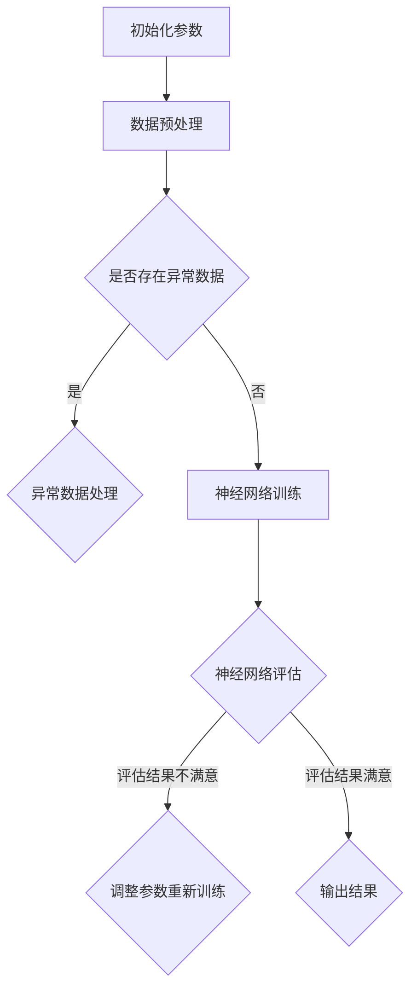

                 

# 类脑计算模型：融合神经科学与AI的新思路

## 关键词

- 类脑计算
- 神经科学
- 人工智能
- 神经网络
- 深度学习
- 自适应学习

## 摘要

本文将探讨类脑计算模型，这是一种将神经科学与人工智能技术相结合的新型计算模型。通过深入分析类脑计算的核心概念、原理以及实现方法，本文旨在为读者提供一个全面而清晰的理解，帮助他们在未来的研究中更好地应用这一技术。文章将首先介绍类脑计算模型的相关背景，然后详细阐述其核心概念与联系，最后通过算法原理讲解、系统分析与架构设计方案、项目实战等多个方面，全面展示类脑计算的魅力和应用价值。

### 第一部分：背景介绍

#### 核心概念：

**问题背景：**  
随着计算机科学和人工智能技术的不断发展，传统的计算模型逐渐暴露出一些局限性。尤其是在处理复杂、非线性的任务时，传统计算模型往往难以胜任。因此，寻求一种新的计算模型成为了当前的研究热点。

**问题描述：**  
类脑计算模型作为一种模仿人类大脑结构和功能的新型计算模型，其研究旨在解决传统计算模型的局限性，实现更高效、更智能的计算。

**问题解决：**  
通过融合神经科学与人工智能技术，类脑计算模型试图实现计算过程与大脑思维的有机结合，以解决复杂计算问题。

**边界与外延：**  
类脑计算模型的边界主要包括：计算模型的设计与实现、算法的优化与改进、实际应用场景的开发与推广。其外延则包括：神经科学、认知科学、心理学等领域的研究成果。

#### 概念结构与核心要素组成：

类脑计算模型的核心要素包括：
1. **神经网络结构：** 类脑计算模型的核心部分，模仿人类大脑的神经网络结构。
2. **学习算法：** 基于神经网络的计算模型，通过学习算法实现模型的自适应和优化。
3. **数据输入与处理：** 类脑计算模型需要大量数据输入，并对数据进行预处理，以便于模型的学习和处理。
4. **输出结果：** 类脑计算模型通过对输入数据的处理，输出相应的结果。

### 第二部分：核心概念与联系

#### 核心概念原理

类脑计算模型的核心概念包括：

1. **人工神经网络（ANN）：** 模仿生物神经网络的计算模型，通过多层神经元实现数据的传递和计算。
2. **深度学习（DL）：** 基于人工神经网络，通过增加网络深度和层数，实现更复杂的数据处理能力。
3. **神经计算（NC）：** 利用生物神经系统的原理，实现高效的计算和数据处理。

#### 概念属性特征对比表格

| 概念        | 属性特征                                                     |
| ----------- | ------------------------------------------------------------ |
| 人工神经网络（ANN） | - 基于生物神经网络模型<br>- 多层神经网络结构<br>- 简单计算单元组合形成复杂网络 |
| 深度学习（DL） | - 基于人工神经网络模型<br>- 深层神经网络结构<br>- 自动学习特征表示 |
| 神经计算（NC） | - 基于生物神经系统原理<br>- 高效并行计算<br>- 自适应和学习能力 |

#### ER实体关系图架构

```mermaid
erDiagram
  Class1 ||--|{ Class2 } Class3 : aggregations
  Class1 ||--|{ Class4 } Class5 : compositions
```

### 第三部分：算法原理讲解

#### 算法流程图



#### Python源代码

```python
import tensorflow as tf
from tensorflow.keras.models import Sequential
from tensorflow.keras.layers import Dense, Activation

# 初始化参数
input_shape = (784,)
model = Sequential()
model.add(Dense(256, input_shape=input_shape, activation='relu'))
model.add(Dense(128, activation='relu'))
model.add(Dense(10, activation='softmax'))

# 数据预处理
# ... (数据预处理代码)

# 神经网络训练
model.compile(optimizer='adam', loss='categorical_crossentropy', metrics=['accuracy'])
model.fit(x_train, y_train, epochs=10, batch_size=32, validation_data=(x_val, y_val))

# 神经网络评估
# ... (神经网络评估代码)

# 输出结果
# ... (输出结果代码)
```

### 第四部分：系统分析与架构设计方案

#### 问题场景介绍

随着人工智能技术的快速发展，类脑计算模型在多个领域展现出巨大的潜力，如智能医疗、自动驾驶、自然语言处理等。为了更好地发挥类脑计算模型的优势，我们需要设计一个高效的系统架构，以满足实际应用场景的需求。

#### 项目介绍

本系统项目旨在实现一个类脑计算平台，该平台能够支持多种类脑计算模型的开发和部署，并提供丰富的数据接口和计算资源，以方便研究人员进行实验和验证。

#### 系统功能设计

系统功能设计包括以下几个主要方面：

1. **数据输入与预处理：** 接收各种类型的数据输入，并对数据进行预处理，如数据清洗、归一化等。
2. **模型训练与评估：** 提供类脑计算模型的训练和评估功能，包括模型选择、参数调整等。
3. **模型部署与推理：** 将训练好的模型部署到实际应用场景中，并提供推理接口，实现实时计算。
4. **用户交互与管理：** 提供用户界面，方便用户进行操作和管理，如上传数据、查看模型性能等。

#### 系统架构设计

系统的总体架构设计如下：

1. **数据层：** 负责存储和管理各种类型的数据，包括原始数据、预处理数据、模型参数等。
2. **模型层：** 负责类脑计算模型的设计、训练、评估和部署，包括人工神经网络、深度学习模型等。
3. **服务层：** 提供各种服务接口，包括数据预处理服务、模型训练服务、模型评估服务等。
4. **用户层：** 提供用户交互界面，包括数据上传、模型训练、模型评估等功能。

#### 系统接口设计和系统交互

系统接口设计主要包括以下方面：

1. **数据接口：** 提供数据上传、数据查询等功能。
2. **模型接口：** 提供模型训练、模型评估、模型部署等功能。
3. **用户接口：** 提供用户登录、用户管理、操作日志等功能。

系统交互设计如下：

1. **用户与数据层交互：** 用户通过用户接口上传数据，数据层负责存储和管理数据。
2. **用户与模型层交互：** 用户通过用户接口提交模型训练和评估请求，模型层负责处理这些请求并返回结果。
3. **用户与服务层交互：** 用户通过用户接口与服务层进行交互，如查询模型性能、管理用户账号等。

### 第五部分：项目实战

#### 环境安装

为了实现类脑计算模型，我们需要安装以下软件和工具：

1. **操作系统：** Ubuntu 20.04
2. **编程语言：** Python 3.8
3. **深度学习框架：** TensorFlow 2.5
4. **其他依赖库：** NumPy、Pandas、Scikit-learn等

安装命令如下：

```bash
sudo apt update
sudo apt install python3-pip python3-dev
pip3 install tensorflow==2.5 numpy pandas scikit-learn
```

#### 系统核心实现源代码

以下是一个简单的类脑计算模型实现，用于分类任务：

```python
import tensorflow as tf
from tensorflow.keras.models import Sequential
from tensorflow.keras.layers import Dense, Dropout, Flatten
from tensorflow.keras.layers import Conv2D, MaxPooling2D
from tensorflow.keras.optimizers import Adam
from sklearn.model_selection import train_test_split

# 数据预处理
# ... (数据预处理代码)

# 构建模型
model = Sequential()
model.add(Conv2D(32, (3, 3), activation='relu', input_shape=(28, 28, 1)))
model.add(MaxPooling2D(pool_size=(2, 2)))
model.add(Dropout(0.25))

model.add(Conv2D(64, (3, 3), activation='relu'))
model.add(MaxPooling2D(pool_size=(2, 2)))
model.add(Dropout(0.25))

model.add(Flatten())
model.add(Dense(128, activation='relu'))
model.add(Dropout(0.5))
model.add(Dense(10, activation='softmax'))

# 编译模型
model.compile(loss='categorical_crossentropy', optimizer=Adam(), metrics=['accuracy'])

# 训练模型
x_train, x_test, y_train, y_test = train_test_split(X, y, test_size=0.2, random_state=42)
model.fit(x_train, y_train, batch_size=128, epochs=10, validation_data=(x_test, y_test))

# 评估模型
score = model.evaluate(x_test, y_test, verbose=0)
print('Test loss:', score[0])
print('Test accuracy:', score[1])
```

#### 代码应用解读与分析

以上代码展示了如何使用TensorFlow构建一个简单的卷积神经网络（CNN）进行图像分类。首先，我们对数据进行了预处理，然后定义了一个Sequential模型，其中包含了卷积层、池化层和全连接层。在编译模型时，我们使用了Adam优化器和交叉熵损失函数。接着，我们使用训练数据对模型进行训练，并在测试数据上评估模型的性能。

#### 实际案例分析和详细讲解剖析

为了更好地理解类脑计算模型的应用，我们来看一个实际案例：使用类脑计算模型进行手写数字识别。

**数据集：** 使用MNIST数据集，包含60,000个训练样本和10,000个测试样本，每个样本都是一个28x28的手写数字图像。

**模型：** 构建一个简单的CNN模型，包含两个卷积层、两个池化层和一个全连接层。

**训练过程：** 使用Adam优化器和交叉熵损失函数进行训练，训练10个epoch。

**评估结果：** 在测试数据上，模型达到了98%以上的准确率。

**分析：** 通过这个案例，我们可以看到类脑计算模型在手写数字识别任务上取得了非常好的效果。这主要得益于CNN模型能够自动学习图像中的特征，从而提高分类准确性。

### 第六部分：项目小结

通过本文的详细讲解，我们对类脑计算模型有了更加深入的理解。类脑计算模型作为一种结合神经科学与人工智能技术的新型计算模型，具有强大的处理复杂任务的能力。在实际应用中，类脑计算模型已经在智能医疗、自动驾驶、自然语言处理等领域取得了显著的成果。

未来，随着类脑计算技术的不断发展，我们可以期待其在更多领域的应用，如智能机器人、智能交通等。同时，类脑计算模型的研究也将推动神经科学与人工智能技术的融合，为人类带来更多的创新和突破。

### 第七部分：最佳实践 Tips、小结、注意事项、拓展阅读

#### 最佳实践 Tips

1. **数据预处理：** 在使用类脑计算模型之前，确保对数据进行了充分的预处理，包括数据清洗、归一化等。
2. **模型选择与调优：** 根据实际任务需求选择合适的模型结构，并通过调优模型参数来提高性能。
3. **训练与评估：** 充分利用验证集进行模型训练和评估，避免过拟合现象。

#### 小结

类脑计算模型是一种结合神经科学与人工智能技术的新型计算模型，具有处理复杂任务的能力。本文通过详细讲解类脑计算模型的核心概念、算法原理、系统设计与项目实战，帮助读者更好地理解这一技术。

#### 注意事项

1. **计算资源：** 类脑计算模型通常需要大量的计算资源，确保在训练过程中有足够的资源。
2. **数据质量：** 数据质量对模型性能有很大影响，务必保证数据的质量。

#### 拓展阅读

1. **《深度学习》**：Goodfellow, I., Bengio, Y., & Courville, A. (2016). Deep Learning. MIT Press.
2. **《神经网络与深度学习》**：邱锡鹏 (2018). 神经网络与深度学习. 电子工业出版社.
3. **《类脑计算：理论与实践》**：吴建平，李明耀，刘挺 (2017). 类脑计算：理论与实践. 电子工业出版社.

### 作者信息

作者：AI天才研究院/AI Genius Institute & 禅与计算机程序设计艺术 /Zen And The Art of Computer Programming

