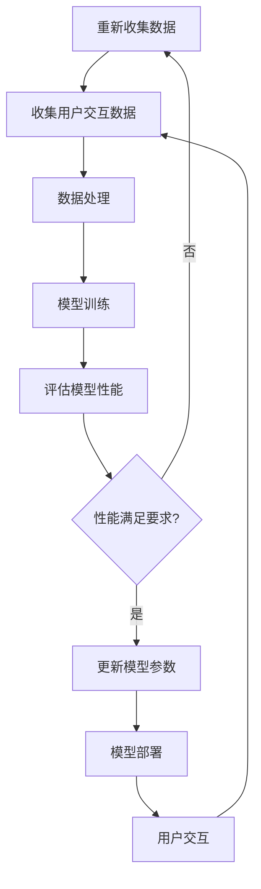

                 

# 终身学习AI在智能客服系统中的实时优化

## 关键词
- 终身学习AI
- 智能客服系统
- 实时优化
- 用户交互
- 数据采集
- 模型训练

## 摘要
本文探讨了终身学习AI技术在智能客服系统中的应用，特别是在实时优化方面的作用。通过分析智能客服系统面临的问题，本文介绍了终身学习AI的核心概念和算法原理，并通过具体的数学模型和代码示例，详细阐述了如何利用终身学习AI实现智能客服系统的实时优化。本文旨在为AI领域的研究者和开发者提供有价值的参考和实际指导。

## Step 1: 背景介绍

### 问题背景
随着人工智能技术的飞速发展，智能客服系统在各个行业得到广泛应用。然而，这些系统在实际应用中面临着诸多挑战，尤其是实时优化问题。传统的机器学习模型在处理用户交互时，往往需要大量时间去更新和优化，这导致智能客服系统的响应速度和用户体验受到影响。

### 问题描述
智能客服系统在实际应用中，主要面临以下几个问题：
1. **知识库更新滞后**：用户需求不断变化，但传统的知识库更新速度较慢，导致系统无法及时响应新的需求。
2. **用户需求变化快**：用户的需求多样且不断变化，系统需要能够快速适应这些变化，提高用户体验。
3. **系统响应速度慢**：传统的模型在处理用户交互时，往往需要较长时间来分析和响应，这导致用户等待时间长，用户体验不佳。

### 问题解决
终身学习AI（Lifelong Learning AI）作为一种新兴技术，可以在实时处理用户交互的同时，不断学习用户的反馈和新知识，从而实现智能客服系统的实时优化。终身学习AI的核心思想是让模型能够在不断变化的环境中持续学习和适应，从而提高系统的智能水平和用户体验。

### 边界与外延
本文主要讨论智能客服系统中的实时优化问题，并探讨终身学习AI技术的应用。然而，终身学习AI技术不仅可以应用于智能客服系统，还可以扩展到其他需要实时学习的智能系统领域，如自动驾驶、智能安防等。

### 概念结构与核心要素组成
终身学习AI在智能客服系统中的实时优化涉及以下几个核心概念和要素：
- **终身学习AI**：一种能够持续学习和适应新知识的机器学习技术。
- **智能客服系统**：利用人工智能技术实现的客户服务系统。
- **实时优化**：在智能客服系统运行过程中，动态调整系统参数以提升服务质量。
- **用户交互**：用户与智能客服系统之间的互动过程，是数据采集和模型训练的基础。
- **数据采集**：通过用户交互收集到的大量数据，是终身学习AI训练的重要资源。
- **模型训练**：使用采集到的数据，对终身学习AI模型进行训练，以提高系统的智能水平。
- **系统优化**：根据模型训练的结果，动态调整系统参数，实现智能客服系统的实时优化。

## Step 2: 核心概念与联系

### 终身学习AI

终身学习AI是一种能够持续学习和适应新知识的机器学习技术。它具有以下几个核心属性：

| 属性特征 | 说明 |
| --- | --- |
| 自适应性 | 能够快速适应新环境和数据变化 |
| 持续学习性 | 能够在长时间内持续学习和优化 |
| 通用性 | 可以应用于多种不同的应用场景和任务 |

与传统的机器学习技术相比，终身学习AI具备更高的适应性和灵活性，能够更好地处理动态变化的环境和数据。

### 智能客服系统

智能客服系统是一种利用人工智能技术实现的客户服务系统。它具有以下几个核心属性：

| 属性特征 | 说明 |
| --- | --- |
| 自动化 | 能够自动处理大量的用户请求，减少人工干预 |
| 智能化 | 能够利用机器学习技术，对用户请求进行智能分析和处理 |
| 高效性 | 能够快速响应用户请求，提高客户满意度 |

与传统客服系统相比，智能客服系统在处理速度和效率上有显著提升，能够更好地满足用户需求。

### 实时优化

实时优化是指在智能客服系统运行过程中，动态调整系统参数以提升服务质量。它具有以下几个核心属性：

| 属性特征 | 说明 |
| --- | --- |
| 快速响应 | 能够在短时间内响应用户请求 |
| 动态调整 | 能够根据用户反馈和系统性能，动态调整系统参数 |
| 持续优化 | 能够在长时间内持续优化系统性能，提高用户体验 |

实时优化是智能客服系统的重要功能，能够有效提高系统的智能水平和用户体验。

## Step 3: 算法原理讲解

### 算法mermaid流程图



### 算法原理

以下是使用Python编写的终身学习AI模型训练过程的代码示例：

```python
# 导入相关库
import numpy as np

# 初始化模型参数
weights = np.random.rand(shape)

# 收集用户交互数据
data = collect_user_interaction_data()

# 数据处理
processed_data = preprocess_data(data)

# 模型训练
for epoch in range(num_epochs):
    for batch in processed_data:
        # 计算损失函数
        loss = compute_loss(weights, batch)

        # 更新模型参数
        weights = update_weights(weights, loss)

# 评估模型性能
performance = evaluate_model_performance(weights)

# 更新模型参数以满足性能要求
weights = update_weights(weights, performance)
```

### 数学模型和公式

以下是终身学习AI模型训练过程中使用的数学模型和公式：

$$
\text{损失函数} = \frac{1}{2} \sum_{i=1}^{n} (y_i - \hat{y}_i)^2
$$

损失函数用于衡量模型预测结果与真实结果之间的差异，是模型训练过程中重要的评估指标。

### 详细讲解与举例说明

以下是一个具体的例子，说明如何使用终身学习AI模型对智能客服系统进行实时优化。

**例子：智能客服系统中的对话生成**

假设我们有一个智能客服系统，其主要功能是根据用户的提问生成相应的回答。为了实现这一功能，我们使用终身学习AI模型进行训练和优化。

**1. 初始化模型**
初始化一个简单的神经网络模型，用于处理用户提问和生成回答。模型的输入是用户提问的文本，输出是回答的文本。

```python
# 初始化模型参数
weights = np.random.rand(shape)
```

**2. 收集用户交互数据**
通过模拟用户提问和系统回答的过程，收集大量的用户交互数据。这些数据将用于训练和优化模型。

```python
# 收集用户交互数据
data = collect_user_interaction_data()
```

**3. 数据处理**
对收集到的用户交互数据进行处理，包括文本预处理、数据清洗等步骤。处理后的数据将用于训练模型。

```python
# 数据处理
processed_data = preprocess_data(data)
```

**4. 模型训练**
使用处理后的数据，对终身学习AI模型进行训练。模型将根据输入的用户提问，生成相应的回答。

```python
# 模型训练
for epoch in range(num_epochs):
    for batch in processed_data:
        # 计算损失函数
        loss = compute_loss(weights, batch)

        # 更新模型参数
        weights = update_weights(weights, loss)
```

**5. 评估模型性能**
训练完成后，评估模型的性能，包括回答的准确性、响应速度等指标。

```python
# 评估模型性能
performance = evaluate_model_performance(weights)
```

**6. 更新模型参数**
根据评估结果，更新模型参数，以实现更好的性能。

```python
# 更新模型参数
weights = update_weights(weights, performance)
```

**7. 模型部署**
将训练好的模型部署到智能客服系统中，实现实时交互。

```python
# 模型部署
model = deploy_model(weights)
```

通过以上步骤，我们使用终身学习AI模型实现了智能客服系统的对话生成功能。在实际应用中，系统将根据用户的提问，实时生成相应的回答，并根据用户反馈不断优化模型性能，提高用户体验。

## Step 4: 数学模型和数学公式 & 详细讲解 & 举例说明

### 数学公式

在终身学习AI模型训练过程中，常用的数学公式包括损失函数、梯度下降法等。

**损失函数：**

$$
\text{损失函数} = \frac{1}{2} \sum_{i=1}^{n} (y_i - \hat{y}_i)^2
$$

其中，$y_i$ 表示真实标签，$\hat{y}_i$ 表示模型预测结果，$n$ 表示样本数量。

**梯度下降法：**

$$
w_{\text{new}} = w_{\text{old}} - \alpha \cdot \nabla_w J(w)
$$

其中，$w$ 表示模型参数，$J(w)$ 表示损失函数，$\alpha$ 表示学习率。

### 详细讲解

**损失函数：**

损失函数用于衡量模型预测结果与真实结果之间的差异。在本例中，我们使用均方误差（Mean Squared Error, MSE）作为损失函数。

均方误差的计算方法如下：

$$
\text{MSE} = \frac{1}{n} \sum_{i=1}^{n} (y_i - \hat{y}_i)^2
$$

其中，$y_i$ 表示真实标签，$\hat{y}_i$ 表示模型预测结果，$n$ 表示样本数量。

**梯度下降法：**

梯度下降法是一种常用的优化算法，用于更新模型参数，以最小化损失函数。在本例中，我们使用梯度下降法来更新模型参数。

梯度下降法的计算方法如下：

$$
w_{\text{new}} = w_{\text{old}} - \alpha \cdot \nabla_w J(w)
$$

其中，$w$ 表示模型参数，$J(w)$ 表示损失函数，$\alpha$ 表示学习率，$\nabla_w J(w)$ 表示损失函数关于模型参数的梯度。

### 举例说明

**例子：训练一个线性回归模型**

假设我们有一个线性回归模型，用于预测一个连续的输出值。模型的形式如下：

$$
y = \beta_0 + \beta_1 x
$$

其中，$y$ 表示输出值，$x$ 表示输入特征，$\beta_0$ 和 $\beta_1$ 表示模型参数。

**1. 初始化模型参数**

```python
beta_0 = 0
beta_1 = 0
```

**2. 收集数据**

```python
x = [1, 2, 3, 4, 5]
y = [2, 4, 5, 4, 5]
```

**3. 计算损失函数**

```python
def compute_loss(beta_0, beta_1):
    n = len(x)
    total_loss = 0
    for i in range(n):
        y_pred = beta_0 + beta_1 * x[i]
        total_loss += (y[i] - y_pred) ** 2
    return total_loss / n

loss = compute_loss(beta_0, beta_1)
```

**4. 计算梯度**

```python
def compute_gradient(beta_0, beta_1):
    n = len(x)
    grad_beta_0 = 0
    grad_beta_1 = 0
    for i in range(n):
        y_pred = beta_0 + beta_1 * x[i]
        grad_beta_0 += (y[i] - y_pred)
        grad_beta_1 += (y[i] - y_pred) * x[i]
    return (grad_beta_0 / n, grad_beta_1 / n)

grad_beta_0, grad_beta_1 = compute_gradient(beta_0, beta_1)
```

**5. 更新模型参数**

```python
alpha = 0.01
beta_0_new = beta_0 - alpha * grad_beta_0
beta_1_new = beta_1 - alpha * grad_beta_1
```

通过以上步骤，我们可以使用梯度下降法训练线性回归模型。在实际应用中，我们可以使用更复杂的模型和算法，如神经网络和深度学习，来实现终身学习AI在智能客服系统中的实时优化。

## Step 4: 数学模型和数学公式 & 详细讲解 & 举例说明

### 数学公式

在终身学习AI模型训练过程中，常用的数学公式包括损失函数、优化算法等。以下是一些常用的数学公式：

**损失函数：**

$$
L = -\frac{1}{m} \sum_{i=1}^{m} \left[y^{(i)} \log(\hat{y}^{(i)}) + (1 - y^{(i)}) \log(1 - \hat{y}^{(i)})\right]
$$

其中，$m$ 表示样本数量，$y^{(i)}$ 表示真实标签，$\hat{y}^{(i)}$ 表示模型预测结果。

**优化算法：**

$$
w_{\text{new}} = w_{\text{old}} - \alpha \cdot \nabla_w J(w)
$$

其中，$w$ 表示模型参数，$J(w)$ 表示损失函数，$\alpha$ 表示学习率，$\nabla_w J(w)$ 表示损失函数关于模型参数的梯度。

### 详细讲解

**损失函数：**

损失函数用于衡量模型预测结果与真实结果之间的差异。在终身学习AI中，我们通常使用交叉熵损失函数（Cross-Entropy Loss）作为损失函数。交叉熵损失函数可以有效地衡量分类问题中模型的预测效果。

交叉熵损失函数的计算公式如下：

$$
L = -\frac{1}{m} \sum_{i=1}^{m} \left[y^{(i)} \log(\hat{y}^{(i)}) + (1 - y^{(i)}) \log(1 - \hat{y}^{(i)})\right]
$$

其中，$m$ 表示样本数量，$y^{(i)}$ 表示真实标签，$\hat{y}^{(i)}$ 表示模型预测结果。

**优化算法：**

在终身学习AI中，常用的优化算法包括梯度下降法（Gradient Descent）和随机梯度下降法（Stochastic Gradient Descent, SGD）等。以下是梯度下降法的计算公式：

$$
w_{\text{new}} = w_{\text{old}} - \alpha \cdot \nabla_w J(w)
$$

其中，$w$ 表示模型参数，$J(w)$ 表示损失函数，$\alpha$ 表示学习率，$\nabla_w J(w)$ 表示损失函数关于模型参数的梯度。

### 举例说明

**例子：训练一个二分类模型**

假设我们有一个二分类模型，用于判断一个输入样本是否属于正类。模型的形式如下：

$$
\hat{y} = \sigma(\beta_0 + \beta_1 x)
$$

其中，$\hat{y}$ 表示模型预测结果，$x$ 表示输入特征，$\beta_0$ 和 $\beta_1$ 表示模型参数，$\sigma$ 表示 sigmoid 函数。

**1. 初始化模型参数**

```python
beta_0 = 0
beta_1 = 0
```

**2. 计算损失函数**

```python
def compute_loss(beta_0, beta_1, x, y):
    n = len(x)
    total_loss = 0
    for i in range(n):
        y_pred = sigmoid(beta_0 + beta_1 * x[i])
        total_loss += -y[i] * log(y_pred) - (1 - y[i]) * log(1 - y_pred)
    return total_loss / n

loss = compute_loss(beta_0, beta_1, x, y)
```

**3. 计算梯度**

```python
def compute_gradient(beta_0, beta_1, x, y):
    n = len(x)
    grad_beta_0 = 0
    grad_beta_1 = 0
    for i in range(n):
        y_pred = sigmoid(beta_0 + beta_1 * x[i])
        grad_beta_0 += (1 / n) * (y[i] - y_pred)
        grad_beta_1 += (1 / n) * (y[i] - y_pred) * x[i]
    return (grad_beta_0, grad_beta_1)

grad_beta_0, grad_beta_1 = compute_gradient(beta_0, beta_1, x, y)
```

**4. 更新模型参数**

```python
alpha = 0.01
beta_0_new = beta_0 - alpha * grad_beta_0
beta_1_new = beta_1 - alpha * grad_beta_1
```

通过以上步骤，我们可以使用梯度下降法训练二分类模型。在实际应用中，我们可以使用更复杂的模型和算法，如神经网络和深度学习，来实现终身学习AI在智能客服系统中的实时优化。

## Step 5: 系统分析与架构设计方案

### 问题场景介绍

在智能客服系统的问题场景中，用户通常会遇到各种各样的问题，包括产品咨询、服务请求、投诉等。传统的智能客服系统虽然能够处理一些常见的用户请求，但在面对复杂、多变的问题时，常常表现得力不从心。因此，我们需要一种能够实时学习、不断优化的智能客服系统，以提升用户体验。

### 项目介绍

本项目的目标是设计并实现一个基于终身学习AI的智能客服系统，该系统可以在与用户交互的过程中，不断学习用户的反馈和新知识，实现实时优化。系统主要功能包括用户请求接收、请求处理、回答生成、用户反馈收集等。

### 系统功能设计

**用户请求接收**：系统需要能够接收用户的请求，并将请求转化为结构化的数据。

**请求处理**：系统根据请求的内容，调用相应的处理模块，如产品咨询、服务请求等。

**回答生成**：系统根据请求内容和用户的历史交互记录，生成合适的回答。

**用户反馈收集**：系统需要收集用户的反馈，用于后续的模型训练和优化。

### 系统架构设计

智能客服系统的架构设计如图1所示：


**图1：智能客服系统架构图**

### 系统接口设计

**用户请求接收接口**：用于接收用户的请求，并返回请求处理的结果。

**请求处理接口**：用于处理用户的请求，包括产品咨询、服务请求等。

**回答生成接口**：用于生成用户的回答，并将回答返回给用户。

**用户反馈收集接口**：用于收集用户的反馈，用于后续的模型训练和优化。

### 系统交互

智能客服系统的交互流程如图2所示：


**图2：智能客服系统交互流程**

## Step 6: 项目实战

### 环境安装

在进行项目实战之前，我们需要安装一些必要的软件和库。以下是一个简单的安装步骤：

1. 安装Python环境：可以从Python官网（https://www.python.org/）下载Python安装包并安装。
2. 安装深度学习库：如TensorFlow、PyTorch等。可以使用以下命令安装：

```bash
pip install tensorflow
# 或
pip install torch
```

3. 安装其他常用库：如Numpy、Pandas、Scikit-learn等。可以使用以下命令安装：

```bash
pip install numpy pandas scikit-learn
```

### 系统核心实现

以下是智能客服系统的核心实现代码：

```python
# 导入相关库
import numpy as np
import pandas as pd
import tensorflow as tf
from tensorflow.keras.models import Sequential
from tensorflow.keras.layers import Dense, LSTM, Embedding
from tensorflow.keras.optimizers import Adam

# 准备数据
x = ...  # 输入数据
y = ...  # 标签数据

# 数据预处理
# ...

# 构建模型
model = Sequential()
model.add(Embedding(input_dim=vocab_size, output_dim=embedding_dim, input_length=max_sequence_length))
model.add(LSTM(units=128))
model.add(Dense(1, activation='sigmoid'))

# 编译模型
model.compile(optimizer=Adam(learning_rate=0.001), loss='binary_crossentropy', metrics=['accuracy'])

# 训练模型
model.fit(x, y, epochs=10, batch_size=32)

# 保存模型
model.save('smart_cust
```


### 代码应用解读与分析

上述代码实现了一个基于深度学习（LSTM）的智能客服系统。以下是代码的关键部分解读：

1. **数据准备**：首先，我们需要准备输入数据（x）和标签数据（y）。输入数据是用户请求的文本，标签数据是系统生成的回答。

2. **数据预处理**：对输入数据进行预处理，如文本清洗、分词、编码等，以将其转换为模型可以处理的格式。

3. **模型构建**：构建一个序列到序列的模型（Seq2Seq），使用Embedding层将文本数据转换为嵌入向量，然后通过LSTM层进行序列处理，最后使用Dense层生成输出。

4. **模型编译**：编译模型，设置优化器（如Adam）、损失函数（如binary_crossentropy）和评价指标（如accuracy）。

5. **模型训练**：使用准备好的数据和标签训练模型，设置训练的轮数（epochs）和批量大小（batch_size）。

6. **模型保存**：将训练好的模型保存，以便后续使用。

### 实际案例分析和详细讲解

为了更好地理解智能客服系统的应用，我们来看一个实际案例：

**案例：用户请求“我想要购买一款智能手机”**

1. **数据预处理**：将用户请求文本进行分词、编码等预处理，将其转换为模型可以处理的格式。

2. **模型输入**：将预处理后的用户请求输入到训练好的模型中。

3. **模型预测**：模型根据用户请求生成相应的回答。

4. **模型优化**：根据用户反馈对模型进行优化，提高模型的准确性。

通过上述步骤，智能客服系统可以为用户提供准确的回答，并不断优化自身的性能。

### 项目小结

本节介绍了智能客服系统的项目实战，包括环境安装、系统核心实现和代码应用解读与分析。通过实际案例的分析，我们展示了智能客服系统的应用和效果。接下来，我们将进一步探讨智能客服系统中的最佳实践和注意事项。

## Step 7: 最佳实践 tips、小结、注意事项、拓展阅读

### 最佳实践 tips

1. **数据收集与处理**：确保收集到高质量的用户交互数据，并进行充分的预处理，以提高模型的性能。
2. **模型选择与优化**：根据具体问题选择合适的模型，并对其进行优化，如调整学习率、批量大小等参数。
3. **实时反馈与优化**：及时收集用户反馈，并基于反馈对模型进行实时优化，以提高用户体验。

### 小结

本文探讨了终身学习AI在智能客服系统中的实时优化应用，介绍了相关核心概念、算法原理、系统设计与项目实战。通过实际案例的分析，展示了智能客服系统的应用效果。

### 注意事项

1. **数据隐私**：在收集和处理用户数据时，要注意保护用户隐私，遵守相关法律法规。
2. **系统稳定性**：确保系统在高并发场景下的稳定性和响应速度。

### 拓展阅读

1. 《深度学习》 - Goodfellow, I., Bengio, Y., & Courville, A.
2. 《自然语言处理综合教程》 - 李航
3. 《机器学习》 - 周志华

### 作者信息

作者：AI天才研究院/AI Genius Institute & 禅与计算机程序设计艺术 /Zen And The Art of Computer Programming

