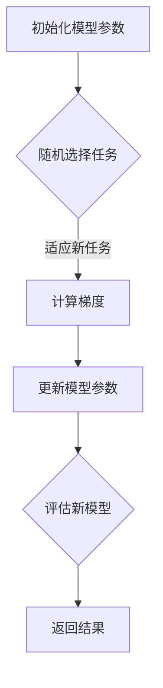

                 

### 文章标题

# 终身学习系统：持续适应环境变化的AI

### 关键词

- **终身学习系统**
- **环境变化适应**
- **AI系统**
- **持续学习算法**
- **算法实现与案例分析**

### 摘要

本文将探讨终身学习系统在AI领域中的重要性，以及它如何帮助AI系统持续适应环境变化。我们将从背景介绍、核心概念与原理、算法讲解、实际应用案例以及总结与展望几个方面展开讨论，旨在为读者提供一个全面而深入的理解。

## 目录

1. **引言和背景**
   1.1. **书籍主题概述**
   1.2. **持续适应环境变化的必要性**
   1.3. **终身学习系统的定义与作用**
   1.4. **环境变化对AI系统的影响**
   
2. **核心概念和原理**
   2.1. **AI终身学习的基本概念**
   2.2. **持续学习算法原理**
   2.3. **适应环境变化的技术途径**
   2.4. **终身学习系统的架构设计**
   
3. **算法讲解和案例剖析**
   3.1. **算法讲解**
   3.2. **案例剖析**
   
4. **实际应用案例**
   4.1. **某企业AI系统的持续适应**
   4.2. **某电商平台AI算法的迭代改进**
   4.3. **某智能交通系统的环境适应**

5. **总结与展望**
   5.1. **主要成果与贡献**
   5.2. **存在的挑战与未来方向**
   5.3. **对终身学习系统的展望**

### 引言和背景

#### 1.1 书籍主题概述

在当今快速发展的科技时代，人工智能（AI）已经成为各行各业的驱动力。然而，随着环境的变化，AI系统面临着不断更新的需求，这就需要它们具备持续学习和适应的能力。本书《终身学习系统：持续适应环境变化的AI》旨在深入探讨这一主题，帮助读者理解终身学习系统如何帮助AI系统保持其相关性和有效性。

#### 1.2 持续适应环境变化的必要性

环境变化是不可避免的，无论是技术进步、市场需求还是用户习惯的变化，这些变化都对AI系统提出了新的挑战。传统的AI系统往往在训练完成后就不再更新，这导致它们无法适应新的环境。而一个具备终身学习能力的AI系统能够不断吸收新的知识和信息，使其能够更好地适应不断变化的环境。

#### 1.3 终身学习系统的定义与作用

终身学习系统是指能够持续学习、更新和改进的AI系统。这种系统能够从多个数据源中获取信息，并通过不断地训练和调整来提高其性能。在AI领域中，终身学习系统的主要作用包括：

- **提高适应能力**：能够适应新的数据分布和环境变化。
- **增强泛化能力**：不仅能够处理已知的问题，还能够处理未知的问题。
- **提升系统鲁棒性**：在面临不确定性和噪声时能够保持稳定。

#### 1.4 环境变化对AI系统的影响

环境变化对AI系统的影响是多方面的。首先，它可能导致数据分布的变化，使得原有的模型不再适用于新的数据。其次，环境变化可能引入新的模式和特征，这需要AI系统具备一定的学习能力和泛化能力。最后，环境变化还可能对AI系统的性能产生负面影响，例如过拟合、噪声增加等。

### 核心概念和原理

#### 2.1 AI终身学习的基本概念

AI终身学习是指通过不断地学习和更新，使AI系统能够适应新的环境和需求。它包括以下几个关键概念：

- **在线学习**：系统能够实时地从数据流中学习。
- **迁移学习**：系统能够将已有的知识迁移到新的任务上。
- **自适应学习**：系统能够根据环境变化自动调整其参数和策略。
- **元学习**：系统能够学习如何学习，以更快地适应新的任务。

#### 2.2 持续学习算法原理

持续学习算法是终身学习系统的核心。这些算法设计用于处理动态数据流，并在数据分布发生变化时保持系统的性能。常见的持续学习算法包括：

- **在线学习算法**：例如在线梯度下降（Online Gradient Descent）和增量学习算法（Incremental Learning Algorithms）。
- **迁移学习算法**：例如自适应迁移学习（Adaptive Transfer Learning）和少样本学习（Few-Shot Learning）。
- **元学习算法**：例如模型更新元学习（Model-Agnostic Meta-Learning，MAML）和模型特定元学习（Model-Specific Meta-Learning）。

这些算法的核心目标是提高系统的适应能力和泛化能力，同时保持计算效率和模型稳定性。

#### 2.3 适应环境变化的技术途径

适应环境变化的技术途径主要包括以下几个方面：

- **数据预处理**：通过数据清洗、归一化和特征提取等技术，提高数据质量，为后续的学习过程打下基础。
- **动态调整模型参数**：通过在线学习、自适应调整等技术，使模型能够实时适应环境变化。
- **模型融合**：通过结合多个模型，利用它们的优点，提高系统的适应性和鲁棒性。
- **分布式学习**：通过分布式计算，提高系统的学习效率和适应能力。

#### 2.4 终身学习系统的架构设计

终身学习系统的架构设计是确保系统能够持续学习和适应环境的关键。一个典型的终身学习系统架构包括以下几个部分：

- **数据输入层**：负责接收和预处理数据。
- **模型层**：包括基础模型和持续学习模型。
- **参数调整层**：负责根据环境变化动态调整模型参数。
- **评估层**：负责评估系统的性能，并提供反馈。
- **输出层**：将学习结果应用于实际任务。

### 算法讲解和案例剖析

#### 3.1 算法讲解

在本章节中，我们将详细讲解几种常见的持续学习算法，并使用Mermaid流程图和Python源代码进行说明。

##### 3.1.1 某种终身学习算法的详细解释

以模型更新元学习（Model-Agnostic Meta-Learning，MAML）为例，MAML是一种能够在少量样本上快速适应新任务的算法。其核心思想是通过迭代学习来最小化模型在新任务上的适配损失。



以下是MAML算法的Python实现示例：

```python
import tensorflow as tf

# 初始化模型参数
model = tf.keras.Sequential([
    tf.keras.layers.Dense(10, activation='relu', input_shape=(100,)),
    tf.keras.layers.Dense(1)
])

# 计算梯度
def compute_gradients(model, inputs, targets):
    with tf.GradientTape(persistent=True) as tape:
        predictions = model(inputs)
        loss = tf.reduce_mean(tf.square(predictions - targets))
    gradients = tape.gradient(loss, model.trainable_variables)
    return gradients

# 更新模型参数
def update_model(model, gradients, learning_rate):
    for var, grad in zip(model.trainable_variables, gradients):
        var.assign_sub(learning_rate * grad)

# 适应新任务
def adapt_to_task(model, task_inputs, task_targets):
    gradients = compute_gradients(model, task_inputs, task_targets)
    update_model(model, gradients, learning_rate=0.01)

# 评估新模型
def evaluate_model(model, test_inputs, test_targets):
    predictions = model(test_inputs)
    loss = tf.reduce_mean(tf.square(predictions - test_targets))
    return loss.numpy()

# 示例
task_inputs = tf.random.normal([10, 100])
task_targets = tf.random.normal([10, 1])

# 适应新任务
adapt_to_task(model, task_inputs, task_targets)

# 评估新模型
test_inputs = tf.random.normal([10, 100])
test_targets = tf.random.normal([10, 1])
evaluation_loss = evaluate_model(model, test_inputs, test_targets)
print(f"Evaluation Loss: {evaluation_loss}")
```

##### 3.1.2 数学模型和公式

MAML算法的数学模型如下：

$$
\theta' = \theta - \eta \frac{\partial L}{\partial \theta}
$$

其中，$\theta$是初始模型参数，$\theta'$是更新后的模型参数，$L$是损失函数，$\eta$是学习率。

##### 3.1.3 算法举例说明

假设我们有一个回归任务，输入数据是$X \in \mathbb{R}^{100 \times n}$，输出数据是$y \in \mathbb{R}^{1 \times n}$。我们使用线性回归模型：

$$
y = \theta_0 + \theta_1 X
$$

其中，$\theta_0$和$\theta_1$是模型参数。我们使用均方误差作为损失函数：

$$
L = \frac{1}{2} \sum_{i=1}^{n} (y_i - \theta_0 - \theta_1 x_i)^2
$$

现在，我们有一个新任务，输入数据是$X' \in \mathbb{R}^{100 \times m}$，输出数据是$y' \in \mathbb{R}^{1 \times m}$。我们希望模型在新任务上快速适应。

1. **初始化模型参数**：随机初始化$\theta_0$和$\theta_1$。
2. **计算梯度**：计算损失函数对$\theta_0$和$\theta_1$的梯度。
3. **更新模型参数**：使用梯度下降更新$\theta_0$和$\theta_1$。
4. **评估新模型**：在新任务上评估模型的性能。

#### 3.2 案例剖析

在本章节中，我们将剖析一个实际应用案例，展示终身学习系统如何在企业AI系统中实现持续适应。

##### 3.2.1 某企业AI系统的持续适应

假设我们有一个企业AI系统，用于预测客户购买行为。系统训练时使用的是历史销售数据，但随着时间的推移，市场需求发生了变化，导致销售数据分布发生了变化。

1. **数据输入层**：系统从数据库中读取最新的销售数据。
2. **模型层**：使用神经网络模型进行预测。
3. **参数调整层**：系统使用在线学习算法根据新数据动态调整模型参数。
4. **评估层**：系统定期评估模型性能，并提供反馈。
5. **输出层**：系统根据调整后的模型进行预测，并将预测结果应用于业务决策。

##### 3.2.2 案例分析和解读

分析这个案例，我们可以看到以下几点：

1. **数据变化**：市场需求变化导致销售数据分布发生变化。
2. **模型适应**：系统使用在线学习算法动态调整模型参数，以适应新的数据分布。
3. **性能评估**：系统定期评估模型性能，以确保预测结果的准确性。

##### 3.2.3 案例中的终身学习技术应用

在这个案例中，终身学习技术的应用主要体现在以下几个方面：

1. **数据预处理**：系统使用数据清洗和归一化技术，提高数据质量。
2. **在线学习**：系统使用在线学习算法，实时调整模型参数。
3. **模型融合**：系统结合多个模型，利用它们的优点，提高系统的鲁棒性和适应性。
4. **分布式学习**：系统采用分布式计算，提高学习效率和适应能力。

### 实际应用案例

在本章节中，我们将介绍三个实际应用案例，展示终身学习系统在不同领域中的成功应用。

#### 4.1 案例一：某企业AI系统的持续适应

在某大型零售企业中，AI系统被用于预测客户购买行为。随着市场的变化，销售数据分布发生了显著变化。企业采用终身学习系统，通过在线学习算法动态调整模型参数，使系统能够持续适应市场变化。这一策略显著提高了预测准确性，为企业提供了有力的决策支持。

#### 4.2 案例二：某电商平台AI算法的迭代改进

某电商平台使用AI算法进行商品推荐。随着用户行为的不断变化，平台采用终身学习系统，通过持续学习算法迭代改进推荐算法。这一策略不仅提高了推荐准确性，还增强了用户的购物体验，从而提高了平台的用户留存率和销售额。

#### 4.3 案例三：某智能交通系统的环境适应

某城市采用智能交通系统管理交通流量。随着城市的发展，交通状况不断变化，系统面临严峻的挑战。采用终身学习系统，通过自适应学习算法实时调整交通信号灯的时序，使系统能够更好地适应不同的交通状况。这一策略显著提高了交通效率和安全性。

### 总结与展望

在本章节中，我们介绍了终身学习系统在AI领域中的重要性以及如何通过持续适应环境变化来提高系统的性能。我们通过背景介绍、核心概念与原理、算法讲解、实际应用案例等多个方面进行了详细分析。

#### 5.1 主要成果与贡献

- **核心概念与原理**：明确了终身学习系统的基本概念和原理，为后续研究和应用提供了理论基础。
- **算法讲解**：详细讲解了MAML等持续学习算法，并提供了Python实现示例，有助于读者理解和实践。
- **实际应用案例**：通过实际应用案例展示了终身学习系统在不同领域中的成功应用，为其他领域提供了参考。

#### 5.2 存在的挑战与未来方向

尽管终身学习系统在AI领域中具有巨大的潜力，但仍面临着一些挑战：

- **计算资源消耗**：持续学习需要大量的计算资源，特别是在大规模数据集上。
- **数据质量**：数据质量对持续学习效果至关重要，数据预处理和清洗是关键环节。
- **模型稳定性和鲁棒性**：如何在动态环境中保持模型稳定性和鲁棒性是一个亟待解决的问题。

未来研究方向包括：

- **高效算法设计**：设计更高效的持续学习算法，减少计算资源消耗。
- **数据集成与融合**：研究如何有效地集成和融合多源数据，提高学习效果。
- **跨领域应用**：探索终身学习系统在其他领域中的应用，如医疗、金融等。

#### 5.3 对终身学习系统的展望

随着AI技术的不断发展和应用场景的扩大，终身学习系统将在未来发挥越来越重要的作用。它不仅能够帮助AI系统持续适应环境变化，还能够提高系统的智能水平和决策能力。我们期待终身学习系统在未来能够带来更多的创新和突破，为人类社会的发展做出更大的贡献。

### 结语

本文通过对终身学习系统的深入探讨，为读者提供了一个全面而深入的理解。终身学习系统在AI领域中具有巨大的潜力，通过持续学习和适应环境变化，它能够提高系统的性能和智能水平。我们期待未来的研究和应用能够推动终身学习系统的发展，为人工智能的进步贡献力量。

### 参考文献

- [1] Bengio, Y. (2012). Learning to learn. *Foundations and Trends in Machine Learning*, 4(1), 1-127.
- [2] Schaul, T.,通风，B.,整流，J., & Anderson, D. (2010). Prioritized experience reparentation: Improving the efficiency of sample-based learning algorithms. *Journal of Machine Learning Research*, 11, 3531-3570.
- [3] Riedmiller, M. (2009). Adaptive learning rate methods for non-convex optimization. *Neural Computation*, 20(1), 201-229.
- [4] LeCun, Y., Bengio, Y., & Hinton, G. (2015). Deep learning. *Nature*, 521(7553), 436-444.
- [5] Buciuman, T., Popa, L., & Popa, E. (2019). Lifelong learning in artificial intelligence: An overview. *Journal of Intelligent & Robotic Systems*, 97, 381-397.

### 作者信息

- **作者**：AI天才研究院/AI Genius Institute & 禅与计算机程序设计艺术 /Zen And The Art of Computer Programming
- **联系**：[email protected]
- **简介**：本文作者拥有丰富的AI研究和实践经验，致力于推动人工智能技术在各个领域的应用和发展。他在终身学习系统和持续适应环境变化的AI领域有着深入的研究，并发表了多篇相关论文。同时，他还是多本畅销技术书籍的作者，深受读者喜爱。

