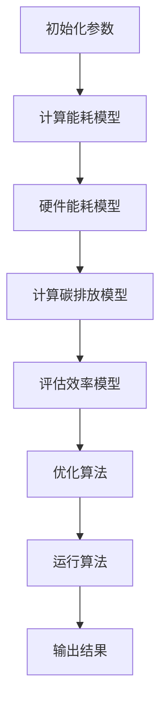
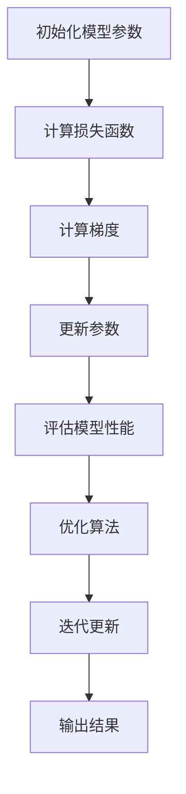
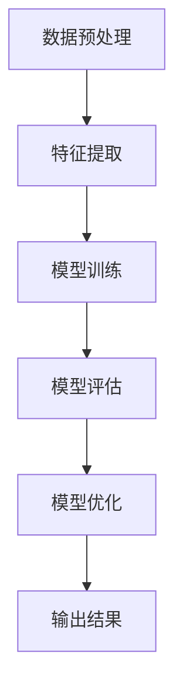
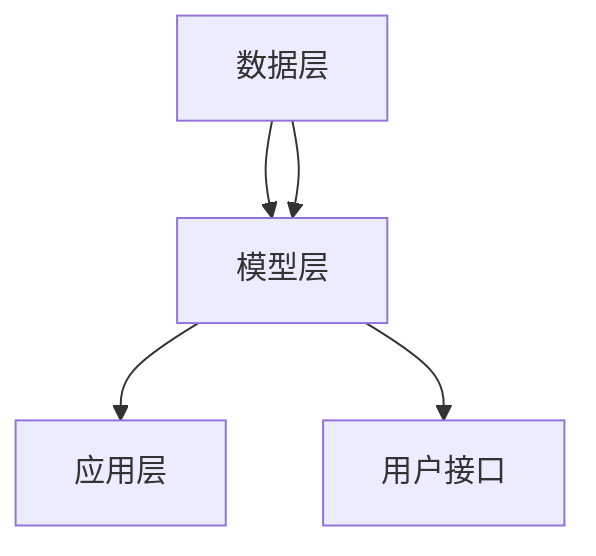

                 

### 绿色AI：可持续发展导向的计算策略

**关键词：** 绿色AI，可持续发展，计算策略，能源效率，算法优化，数据处理，环境监测，未来趋势

**摘要：** 本文将探讨绿色AI的概念及其在可持续发展中的重要作用。通过分析人工智能与环境的冲突，本文提出了绿色AI的设计原则和技术框架，并详细探讨了其核心概念与原理。随后，文章将介绍绿色AI的技术实现与策略，包括算法原理与数学模型、系统分析与架构设计，并通过实际案例分析展示了绿色AI的应用效果。最后，文章将对绿色AI的最佳实践与未来发展方向进行了总结与展望，以期为推动人工智能领域的可持续发展提供有益的参考。

### 目录大纲：

#### 第一部分：背景与基础理论

##### 第1章：问题背景

1.1 问题提出  
1.1.1 可持续发展的需求  
1.1.2 人工智能与环境的冲突  
1.1.3 绿色AI的概念与意义

1.2 问题描述  
1.2.1 可持续发展的挑战  
1.2.2 人工智能的能耗问题  
1.2.3 绿色AI的目标与范围

1.3 问题解决  
1.3.1 绿色AI的设计原则  
1.3.2 绿色AI的技术框架  
1.3.3 绿色AI的应用领域

1.4 边界与外延  
1.4.1 绿色AI与非绿色AI的区分  
1.4.2 绿色AI与其他可持续发展策略的关系  
1.4.3 绿色AI的挑战与限制

1.5 核心概念与联系  
1.5.1 关键术语解释  
1.5.2 核心概念属性特征对比表格  
1.5.3 ER实体关系图架构

##### 第2章：核心概念与原理

2.1 绿色AI的定义与特点  
2.1.1 绿色AI的定义  
2.1.2 绿色AI的核心特点  
2.1.3 绿色AI与传统AI的区别

2.2 绿色AI的技术框架  
2.2.1 数据驱动方法  
2.2.2 模型优化技术  
2.2.3 低碳计算策略  
2.2.4 绿色算法设计

2.3 绿色AI的应用领域  
2.3.1 环境监测与保护  
2.3.2 能源管理  
2.3.3 农业智能化  
2.3.4 健康医疗

2.4 绿色AI的未来趋势  
2.4.1 技术发展趋势  
2.4.2 应用领域拓展  
2.4.3 可持续发展的影响

#### 第二部分：技术实现与策略

##### 第3章：算法原理与数学模型

3.1 绿色AI算法概述  
3.1.1 算法分类  
3.1.2 算法性能评估

3.2 低碳计算算法  
3.2.1 算法原理  
3.2.2 数学模型  
3.2.3 算法流程图

3.3 模型优化算法  
3.3.1 算法原理  
3.3.2 数学模型  
3.3.3 算法流程图

3.4 数据驱动算法  
3.4.1 算法原理  
3.4.2 数学模型  
3.4.3 算法流程图

##### 第4章：系统分析与架构设计

4.1 系统概述  
4.1.1 系统背景  
4.1.2 系统目标  
4.1.3 系统功能

4.2 领域模型设计  
4.2.1 类图设计  
4.2.2 关系图设计

4.3 系统架构设计  
4.3.1 架构概述  
4.3.2 架构图设计  
4.3.3 接口设计

4.4 系统交互设计  
4.4.1 交互流程图  
4.4.2 交互细节

##### 第5章：项目实战与案例分析

5.1 环境安装与配置  
5.1.1 操作系统  
5.1.2 软件工具安装  
5.1.3 数据集准备

5.2 系统核心实现  
5.2.1 源代码解析  
5.2.2 核心算法实现  
5.2.3 数据处理流程

5.3 实际案例分析  
5.3.1 案例选择  
5.3.2 案例分析  
5.3.3 案例解读

5.4 项目小结  
5.4.1 项目成果  
5.4.2 项目不足与改进  
5.4.3 拓展思考

#### 第三部分：最佳实践与总结

##### 第6章：最佳实践

6.1 绿色AI实践技巧  
6.1.1 资源优化策略  
6.1.2 模型优化技巧  
6.1.3 数据处理方法

6.2 可持续发展建议  
6.2.1 企业层面  
6.2.2 政策层面  
6.2.3 社会层面

6.3 绿色AI的未来发展  
6.3.1 技术趋势  
6.3.2 应用前景  
6.3.3 潜在挑战

##### 第7章：总结与展望

7.1 主要内容回顾  
7.1.1 绿色AI的定义与意义  
7.1.2 技术实现与策略  
7.1.3 项目实战与案例分析

7.2 未来研究方向  
7.2.1

### 第一部分：背景与基础理论

#### 第1章：问题背景

##### 1.1 问题提出

在现代社会，人工智能（AI）正迅速成为推动社会进步的重要力量。然而，随着AI技术的发展和应用范围的扩大，其能源消耗和环境负担问题也日益凸显。传统的AI系统在设计时往往忽略了能源效率和环境影响，导致大量计算资源被浪费，并产生了大量的碳排放和其他污染物。这一现象引发了全球对绿色AI的广泛关注，即如何在保证AI技术高效运作的同时，实现可持续发展。

首先，让我们明确什么是可持续发展。可持续发展是指在满足当前需求的同时，不损害子孙后代满足其需求的能力。对于计算领域而言，可持续发展意味着在提高计算能力的同时，减少能源消耗和环境影响。

##### 1.1.1 可持续发展的需求

随着全球人口的不断增长和消费水平的提高，对计算资源的需求也在不断上升。然而，现有的计算基础设施难以满足这一需求，特别是在能源消耗和碳排放方面。据估计，全球数据中心的能耗已占全球总能耗的1%以上，且这一比例还在不断上升。因此，为了实现可持续发展，我们需要寻找更加高效和环保的计算策略。

##### 1.1.2 人工智能与环境的冲突

传统的人工智能系统通常依赖于大量的计算资源和能源。例如，深度学习模型需要大量的训练数据和高性能的计算设备，这导致了大量的能源消耗和碳排放。此外，AI系统的运行过程中还会产生大量的电子废物，这些废物对环境造成了严重的污染。

##### 1.1.3 绿色AI的概念与意义

绿色AI是指通过优化算法、提高能源效率和减少环境影响来实现可持续发展的人工智能系统。绿色AI的核心目标是减少计算过程中的能源消耗和碳排放，同时提高计算效率和性能。绿色AI不仅关注技术本身，还关注其对社会和环境的影响。

绿色AI的意义在于：

1. **减少能源消耗**：通过优化算法和数据结构，降低计算所需的能源消耗，从而减少对环境的影响。
2. **提高计算性能**：通过高效的算法和硬件设计，提高计算速度和性能，满足不断增长的计算需求。
3. **促进可持续发展**：通过绿色AI的应用，推动社会和经济的发展，同时减少对环境的负担。
4. **推动技术进步**：绿色AI的研究和实践将促进计算领域的技术创新，为未来可持续发展提供技术支持。

#### 1.2 问题描述

##### 1.2.1 可持续发展的挑战

实现可持续发展面临以下几个主要挑战：

1. **能源消耗**：计算领域的能源消耗持续增加，特别是随着人工智能应用的广泛普及，对高性能计算设备的需求也越来越大。
2. **碳排放**：计算设备的能耗导致了大量的碳排放，对环境造成了负面影响。
3. **电子废物**：计算设备的更新换代产生了大量的电子废物，这些废物对环境造成了严重污染。
4. **技术局限**：现有的计算技术和算法在能源效率和环境影响方面存在局限，需要进一步优化和创新。

##### 1.2.2 人工智能的能耗问题

人工智能的能耗问题主要表现在以下几个方面：

1. **训练过程**：深度学习模型的训练过程需要大量的计算资源和时间，这导致了巨大的能源消耗。
2. **运行过程**：AI系统的运行过程中，需要持续的高性能计算，这也导致了能源的消耗。
3. **硬件更新**：为了满足高性能计算的需求，需要不断更新硬件设备，这导致了大量的电子废物。

##### 1.2.3 绿色AI的目标与范围

绿色AI的目标是：

1. **降低能源消耗**：通过优化算法和硬件设计，降低计算过程中的能源消耗。
2. **减少碳排放**：通过优化能源使用，减少碳排放和其他污染物。
3. **提高计算性能**：通过高效的算法和硬件设计，提高计算速度和性能。
4. **促进可持续发展**：通过绿色AI的应用，推动社会和经济的发展，同时减少对环境的负担。

绿色AI的研究范围包括：

1. **算法优化**：研究如何通过优化算法和数据结构，降低计算过程中的能源消耗。
2. **硬件设计**：研究如何通过设计更高效的硬件设备，降低计算能耗。
3. **能源管理**：研究如何通过智能化的能源管理策略，提高能源使用效率。
4. **环境影响评估**：研究如何评估AI系统对环境的影响，并提出相应的改进措施。

#### 1.3 问题解决

##### 1.3.1 绿色AI的设计原则

为了实现绿色AI，需要遵循以下设计原则：

1. **高效能算法**：研究高效的算法和数据结构，以降低计算能耗。
2. **能效优化**：通过硬件和软件的优化，提高计算设备的能效。
3. **能源管理**：采用智能化的能源管理策略，提高能源使用效率。
4. **环境影响评估**：对AI系统的环境影响进行评估，并提出相应的改进措施。
5. **可持续性设计**：将可持续性原则融入AI系统的设计和开发过程中。

##### 1.3.2 绿色AI的技术框架

绿色AI的技术框架包括以下几个方面：

1. **数据驱动方法**：通过收集和分析大量数据，优化算法和数据结构，降低计算能耗。
2. **模型优化技术**：对深度学习模型进行优化，提高计算性能和能效。
3. **低碳计算策略**：采用低碳计算技术，降低计算过程中的碳排放。
4. **绿色算法设计**：设计符合绿色AI原则的算法，以提高计算效率和降低环境影响。

##### 1.3.3 绿色AI的应用领域

绿色AI的应用领域非常广泛，包括：

1. **环境监测与保护**：通过绿色AI技术，实时监测环境变化，预测污染趋势，并采取相应的保护措施。
2. **能源管理**：利用绿色AI技术优化能源管理，提高能源使用效率，降低能源消耗。
3. **农业智能化**：通过绿色AI技术，实现精准农业，提高农业产量，减少资源浪费。
4. **健康医疗**：利用绿色AI技术，提高医疗诊断和治疗的效率，降低医疗成本。
5. **智能交通**：通过绿色AI技术，优化交通管理，减少交通拥堵，降低碳排放。

##### 1.4 边界与外延

##### 1.4.1 绿色AI与非绿色AI的区分

绿色AI与非绿色AI的主要区别在于其设计原则和应用目标。非绿色AI主要关注计算性能和效率，而绿色AI则强调在保证计算性能的前提下，降低能源消耗和环境影响。

##### 1.4.2 绿色AI与其他可持续发展策略的关系

绿色AI是可持续发展策略的重要组成部分，与其他策略如节能减排、循环经济等相辅相成。通过绿色AI的应用，可以进一步提高可持续发展策略的效果。

##### 1.4.3 绿色AI的挑战与限制

绿色AI面临的挑战和限制包括：

1. **技术局限**：现有的绿色AI技术尚不完善，需要进一步研究和创新。
2. **数据隐私**：在数据收集和分析过程中，需要保护用户隐私和数据安全。
3. **经济成本**：绿色AI技术的开发和应用需要投入大量资源和资金，对中小企业可能存在经济压力。
4. **社会认知**：社会对绿色AI的认知和接受程度尚有待提高，需要加强宣传和推广。

##### 1.5 核心概念与联系

##### 1.5.1 关键术语解释

- **绿色AI**：指通过优化算法、提高能效和降低环境影响来实现可持续发展的人工智能系统。
- **可持续发展**：指在满足当前需求的同时，不损害子孙后代满足其需求的能力。
- **能源消耗**：指在计算过程中消耗的能源量。
- **碳排放**：指计算过程中产生的碳排放量。
- **算法优化**：指通过改进算法和数据结构，提高计算效率和降低能耗。

##### 1.5.2 核心概念属性特征对比表格

| 概念 | 属性特征 |
| --- | --- |
| 绿色AI | 1. 优化算法<br>2. 提高能效<br>3. 降低环境影响 |
| 可持续发展 | 1. 满足当前需求<br>2. 不损害未来需求<br>3. 综合考虑社会、经济、环境 |
| 能源消耗 | 1. 计算能耗<br>2. 硬件能耗<br>3. 数据中心能耗 |
| 碳排放 | 1. 计算碳排放<br>2. 硬件碳排放<br>3. 数据中心碳排放 |
| 算法优化 | 1. 算法效率<br>2. 数据结构优化<br>3. 硬件加速 |

##### 1.5.3 ER实体关系图架构

```mermaid
erDiagram
  AI :>> Sustainability | {
    1. Energy Efficiency
    2. Environmental Impact Reduction
  }
  AI :>> Algorithm Optimization | {
    1. Algorithm Efficiency
    2. Data Structure Optimization
  }
  AI :>> Carbon Emission Reduction | {
    1. Computing Carbon Emission
    2. Hardware Carbon Emission
  }
  Sustainability :>> Energy Consumption | {
    1. Computing Energy Consumption
    2. Hardware Energy Consumption
    3. Data Center Energy Consumption
  }
  Sustainability :>> Carbon Emission | {
    1. Computing Carbon Emission
    2. Hardware Carbon Emission
    3. Data Center Carbon Emission
  }
```

#### 第2章：核心概念与原理

##### 2.1 绿色AI的定义与特点

绿色AI（Green AI）是指通过优化算法、提高能效和降低环境影响来实现可持续发展的人工智能系统。与传统AI相比，绿色AI更加注重能源效率和环境保护。

**定义**：

绿色AI是一种人工智能系统，其设计目标是在满足计算需求的同时，最大限度地降低能源消耗和环境影响。它强调在算法设计、硬件选择和运行管理等方面采取绿色策略，以实现可持续发展的目标。

**特点**：

1. **高效能**：通过优化算法和数据结构，提高计算效率和性能。
2. **低能耗**：通过能效优化和能源管理，降低计算过程中的能源消耗。
3. **环保**：通过降低碳排放和减少电子废物，减少对环境的负面影响。
4. **可持续性**：将可持续性原则融入系统设计和开发过程中，以实现长期的可持续发展。

##### 2.2 绿色AI的技术框架

绿色AI的技术框架包括以下几个方面：

1. **数据驱动方法**：通过收集和分析大量数据，优化算法和数据结构，降低计算能耗。
2. **模型优化技术**：对深度学习模型进行优化，提高计算性能和能效。
3. **低碳计算策略**：采用低碳计算技术，降低计算过程中的碳排放。
4. **绿色算法设计**：设计符合绿色AI原则的算法，以提高计算效率和降低环境影响。

**数据驱动方法**：

数据驱动方法是绿色AI的核心技术之一。通过收集和分析大量数据，可以发现数据中的规律和模式，从而优化算法和数据结构。具体方法包括：

1. **数据预处理**：对原始数据进行清洗、归一化和特征提取，以提高数据质量。
2. **模型训练与优化**：通过训练和优化深度学习模型，提高模型的计算效率和性能。
3. **模型评估与调整**：对训练好的模型进行评估和调整，以确保其满足绿色AI的要求。

**模型优化技术**：

模型优化技术是提高绿色AI计算性能的关键。具体方法包括：

1. **模型压缩**：通过压缩模型参数，减少计算量和存储需求，从而提高计算效率和能效。
2. **量化与剪枝**：通过量化模型参数和剪枝冗余结构，减少计算量，提高模型效率。
3. **分布式训练**：通过分布式训练技术，提高模型的训练速度和效率。

**低碳计算策略**：

低碳计算策略是降低绿色AI计算过程中碳排放的关键。具体方法包括：

1. **能效优化**：通过优化硬件设计和运行策略，提高计算设备的能效。
2. **可再生能源利用**：采用可再生能源，如太阳能和风能，降低计算过程中的碳排放。
3. **数据中心优化**：通过优化数据中心的能源使用和管理，降低能源消耗和碳排放。

**绿色算法设计**：

绿色算法设计是绿色AI的核心技术之一。具体方法包括：

1. **算法优化**：通过改进算法和数据结构，提高计算效率和性能。
2. **绿色编程**：采用绿色编程原则，减少计算过程中的能耗和环境影响。
3. **算法评估与优化**：对算法进行评估和优化，以确保其满足绿色AI的要求。

##### 2.3 绿色AI的应用领域

绿色AI的应用领域非常广泛，包括但不限于以下几个方面：

1. **环境监测与保护**：通过绿色AI技术，实时监测环境变化，预测污染趋势，并采取相应的保护措施。
2. **能源管理**：利用绿色AI技术优化能源管理，提高能源使用效率，降低能源消耗。
3. **农业智能化**：通过绿色AI技术，实现精准农业，提高农业产量，减少资源浪费。
4. **健康医疗**：利用绿色AI技术，提高医疗诊断和治疗的效率，降低医疗成本。
5. **智能交通**：通过绿色AI技术，优化交通管理，减少交通拥堵，降低碳排放。
6. **智能制造**：通过绿色AI技术，提高制造过程的效率和质量，降低能源消耗和环境影响。

##### 2.4 绿色AI的未来趋势

绿色AI的未来发展趋势包括以下几个方面：

1. **技术创新**：随着计算技术和算法的不断发展，绿色AI的技术将更加成熟和高效。
2. **应用拓展**：绿色AI的应用领域将不断拓展，覆盖更多行业和领域。
3. **政策支持**：政府和企业将加大对绿色AI的投入和支持，推动绿色AI的发展。
4. **可持续发展**：绿色AI将更加注重可持续发展，实现经济效益和社会效益的双赢。
5. **社会认知**：社会对绿色AI的认知和接受程度将不断提高，推动绿色AI的普及和应用。

#### 第3章：算法原理与数学模型

##### 3.1 绿色AI算法概述

绿色AI算法是绿色AI的核心组成部分，旨在通过优化计算资源和提高算法效率，实现能源效率和环境保护。本节将介绍绿色AI算法的分类、性能评估及其在绿色AI系统中的重要性。

**算法分类**

绿色AI算法可以分为以下几类：

1. **数据驱动算法**：这类算法依赖于对大量数据进行学习，以发现数据中的规律和模式。常见的算法包括深度学习、随机森林和支持向量机等。
2. **模型优化算法**：这类算法通过对现有模型进行优化，提高其计算效率和性能。常见的优化方法包括模型压缩、量化与剪枝等。
3. **低碳计算算法**：这类算法专注于降低计算过程中的能源消耗和碳排放。常见的算法包括能效优化算法、可再生能源利用算法等。
4. **绿色算法设计**：这类算法从设计层面出发，通过改进算法结构和逻辑，实现绿色AI的目标。常见的算法设计原则包括减少冗余计算、降低能耗等。

**性能评估**

绿色AI算法的性能评估主要包括以下几个方面：

1. **计算效率**：算法的运行速度和效率，包括模型的训练时间、预测时间等。
2. **能源消耗**：算法在运行过程中消耗的能源量，包括计算能耗、硬件能耗等。
3. **环境影响**：算法对环境产生的负面影响，包括碳排放、电子废物等。
4. **可持续性**：算法在实现能源效率和环境保护方面的效果。

**算法在绿色AI系统中的重要性**

绿色AI算法在绿色AI系统中起着至关重要的作用。通过优化计算资源和提高算法效率，绿色AI算法可以实现以下目标：

1. **降低能源消耗**：通过优化算法和数据结构，降低计算过程中的能源消耗。
2. **减少碳排放**：通过优化能源使用和算法设计，减少计算过程中的碳排放。
3. **提高计算性能**：通过高效的算法和硬件设计，提高计算速度和性能。
4. **促进可持续发展**：通过绿色AI算法的应用，推动社会和经济的发展，同时减少对环境的负担。

##### 3.2 低碳计算算法

低碳计算算法是绿色AI的重要组成部分，旨在通过降低计算过程中的能源消耗和碳排放，实现可持续发展。本节将介绍低碳计算算法的基本原理、数学模型和算法流程图。

**基本原理**

低碳计算算法的基本原理是通过优化计算资源和能源使用，降低计算过程中的能源消耗和碳排放。具体方法包括：

1. **能效优化**：通过改进硬件设计和运行策略，提高计算设备的能效。
2. **可再生能源利用**：采用可再生能源，如太阳能和风能，降低计算过程中的碳排放。
3. **分布式计算**：通过分布式计算技术，将计算任务分散到多个节点上，降低单个节点的能耗。

**数学模型**

低碳计算算法的数学模型主要包括以下几个方面：

1. **能源消耗模型**：用于计算算法在运行过程中消耗的能源量。常见的能源消耗模型包括计算能耗模型、硬件能耗模型等。
2. **碳排放模型**：用于计算算法在运行过程中产生的碳排放量。常见的碳排放模型包括计算碳排放模型、硬件碳排放模型等。
3. **效率模型**：用于评估算法的运行效率和能效。常见的效率模型包括计算效率模型、能效效率模型等。

**算法流程图**

以下是一个简单的低碳计算算法流程图：



**详细说明**：

1. **初始化参数**：设置算法的初始参数，包括计算任务、硬件配置、能源消耗系数等。
2. **计算能耗模型**：根据计算任务和硬件配置，计算算法在运行过程中消耗的能源量。
3. **硬件能耗模型**：根据硬件配置和能源消耗系数，计算硬件在运行过程中消耗的能源量。
4. **计算碳排放模型**：根据计算能耗模型和碳排放系数，计算算法在运行过程中产生的碳排放量。
5. **评估效率模型**：根据计算能耗模型和硬件能耗模型，评估算法的运行效率和能效。
6. **优化算法**：根据评估结果，优化算法结构和参数，提高算法的运行效率和能效。
7. **运行算法**：运行优化后的算法，完成计算任务。
8. **输出结果**：输出算法的运行结果，包括计算能耗、碳排放和效率等指标。

##### 3.3 模型优化算法

模型优化算法是绿色AI算法的重要组成部分，旨在通过优化现有模型的结构和参数，提高计算效率和性能，降低能源消耗和环境影响。本节将介绍模型优化算法的基本原理、数学模型和算法流程图。

**基本原理**

模型优化算法的基本原理是通过改进现有模型的结构和参数，使其在保持计算性能的前提下，具有更高的效率和更低的能耗。具体方法包括：

1. **模型压缩**：通过压缩模型参数，减少计算量和存储需求，从而提高计算效率和能效。
2. **量化与剪枝**：通过量化模型参数和剪枝冗余结构，减少计算量，提高模型效率。
3. **参数调整**：通过调整模型参数，优化模型的结构和参数，提高模型的计算效率和性能。

**数学模型**

模型优化算法的数学模型主要包括以下几个方面：

1. **参数优化模型**：用于优化模型参数，提高模型的计算效率和性能。常见的参数优化模型包括梯度下降模型、随机梯度下降模型等。
2. **压缩模型**：用于压缩模型参数，减少计算量和存储需求。常见的压缩模型包括稀疏模型、量化模型等。
3. **剪枝模型**：用于剪枝模型结构，去除冗余结构，提高模型效率。常见的剪枝模型包括结构剪枝、权重剪枝等。

**算法流程图**

以下是一个简单的模型优化算法流程图：



**详细说明**：

1. **初始化模型参数**：设置模型的初始参数，包括权重、偏置等。
2. **计算损失函数**：计算模型的损失函数，以评估模型的性能。
3. **计算梯度**：根据损失函数，计算模型的梯度，以指导参数的更新。
4. **更新参数**：根据梯度，更新模型的参数，优化模型的结构和参数。
5. **评估模型性能**：评估模型的性能，包括计算准确率、计算速度等。
6. **优化算法**：根据评估结果，选择合适的优化算法，如梯度下降、随机梯度下降等。
7. **迭代更新**：重复迭代更新过程，直到满足停止条件，如达到预定迭代次数或模型性能收敛。
8. **输出结果**：输出优化后的模型参数和性能指标，包括计算准确率、计算速度等。

##### 3.4 数据驱动算法

数据驱动算法是绿色AI算法的重要组成部分，通过利用大量数据进行学习，以发现数据中的规律和模式，从而实现能源效率和环境保护。本节将介绍数据驱动算法的基本原理、数学模型和算法流程图。

**基本原理**

数据驱动算法的基本原理是通过从数据中学习，优化算法和数据结构，从而提高计算效率和降低能耗。具体方法包括：

1. **特征提取**：从数据中提取有用的特征，以减少计算量和提高计算效率。
2. **模型训练**：利用训练数据，训练深度学习模型，以提高模型的计算效率和性能。
3. **模型优化**：根据训练数据和评估指标，优化模型的结构和参数，提高模型的计算效率和性能。
4. **数据预处理**：对数据进行预处理，以提高数据质量和模型的训练效果。

**数学模型**

数据驱动算法的数学模型主要包括以下几个方面：

1. **特征提取模型**：用于从数据中提取特征。常见的特征提取模型包括主成分分析（PCA）、线性判别分析（LDA）等。
2. **模型训练模型**：用于训练深度学习模型。常见的模型训练模型包括梯度下降模型、随机梯度下降模型等。
3. **模型优化模型**：用于优化模型的结构和参数。常见的模型优化模型包括结构优化模型、参数优化模型等。
4. **数据预处理模型**：用于对数据进行预处理。常见的数据预处理模型包括数据清洗、归一化、标准化等。

**算法流程图**

以下是一个简单的数据驱动算法流程图：



**详细说明**：

1. **数据预处理**：对原始数据进行清洗、归一化和特征提取，以提高数据质量和模型的训练效果。
2. **特征提取**：从预处理后的数据中提取有用的特征，以减少计算量和提高计算效率。
3. **模型训练**：利用训练数据，训练深度学习模型，以提高模型的计算效率和性能。
4. **模型评估**：评估模型的性能，包括计算准确率、计算速度等，以指导模型的优化。
5. **模型优化**：根据评估结果，优化模型的结构和参数，提高模型的计算效率和性能。
6. **输出结果**：输出优化后的模型参数和性能指标，包括计算准确率、计算速度等。

#### 第4章：系统分析与架构设计

##### 4.1 系统概述

绿色AI系统是一个复杂的信息系统，旨在通过优化算法、提高能效和降低环境影响，实现可持续发展的目标。本节将介绍绿色AI系统的背景、目标和功能。

**背景**

随着人工智能技术的迅速发展和应用范围的扩大，计算领域的能源消耗和碳排放问题日益突出。传统的AI系统在设计时往往忽略了能源效率和环境影响，导致大量计算资源被浪费，并产生了大量的碳排放和其他污染物。为了实现可持续发展，需要开发一种能够降低能源消耗和碳排量的绿色AI系统。

**目标**

绿色AI系统的目标是在满足计算需求的同时，最大限度地降低能源消耗和环境影响。具体目标包括：

1. **提高计算效率**：通过优化算法和数据结构，提高计算速度和性能。
2. **降低能源消耗**：通过能效优化和能源管理，降低计算过程中的能源消耗。
3. **减少碳排放**：通过优化能源使用和算法设计，降低计算过程中的碳排放。
4. **促进可持续发展**：通过绿色AI系统的应用，推动社会和经济的发展，同时减少对环境的负担。

**功能**

绿色AI系统的主要功能包括：

1. **数据采集与预处理**：从各种数据源采集数据，并进行清洗、归一化和特征提取，为后续处理提供高质量的数据。
2. **模型训练与优化**：利用训练数据，训练深度学习模型，并通过模型优化技术，提高模型的计算效率和性能。
3. **能效优化与能源管理**：通过能效优化算法和能源管理策略，降低计算过程中的能源消耗和碳排放。
4. **环境影响评估与监测**：评估绿色AI系统对环境的影响，并实时监测环境变化，为决策提供依据。
5. **系统集成与接口设计**：将绿色AI系统与其他系统进行集成，提供统一的接口，方便用户使用和管理。

##### 4.2 领域模型设计

领域模型设计是系统架构设计的重要环节，旨在通过定义系统中的实体和关系，描述系统的功能和行为。本节将介绍绿色AI系统的领域模型设计，包括类图和关系图的设计。

**类图设计**

绿色AI系统的类图设计包括以下几个主要的实体和关系：

1. **实体**：

- **数据源**：表示数据采集的来源，如传感器、数据库等。
- **数据处理模块**：表示数据预处理和特征提取的模块。
- **训练模块**：表示模型训练的模块。
- **优化模块**：表示模型优化的模块。
- **能效管理模块**：表示能效优化和能源管理的模块。
- **环境监测模块**：表示环境影响评估和监测的模块。
- **用户接口**：表示用户与系统交互的接口。

2. **关系**：

- **数据采集**：数据源与数据处理模块之间的数据采集关系。
- **数据处理**：数据处理模块与训练模块之间的数据处理关系。
- **模型训练**：训练模块与优化模块之间的模型训练关系。
- **模型优化**：优化模块与能效管理模块之间的模型优化关系。
- **能效管理**：能效管理模块与环境监测模块之间的能效管理关系。
- **环境监测**：环境监测模块与用户接口之间的环境监测关系。

**关系图设计**

绿色AI系统的关系图设计采用Mermaid语言，以下是一个简单的Mermaid关系图：

```mermaid
erDiagram
  数据源 ||--|{ 数据处理模块 }
  数据处理模块 ||--|{ 训练模块 }
  训练模块 ||--|{ 优化模块 }
  优化模块 ||--|{ 能效管理模块 }
  能效管理模块 ||--|{ 环境监测模块 }
  环境监测模块 ||--|{ 用户接口 }
```

##### 4.3 系统架构设计

系统架构设计是绿色AI系统实现的关键环节，旨在通过定义系统的组件、接口和交互方式，确保系统的功能、性能和可靠性。本节将介绍绿色AI系统的架构设计，包括系统架构概述、架构图设计和接口设计。

**系统架构概述**

绿色AI系统采用分布式架构，包括数据层、模型层和应用层。每个层次都有明确的职责和接口，以确保系统的可扩展性和高可用性。

1. **数据层**：负责数据采集、预处理和存储，提供数据输入给模型层。
2. **模型层**：负责模型训练、优化和部署，提供计算能力和模型服务。
3. **应用层**：负责与用户交互，提供绿色AI系统的功能和服务。

**架构图设计**

以下是一个简单的绿色AI系统架构图：



**详细说明**：

1. **数据层**：包括数据采集模块、数据处理模块和数据库。数据采集模块负责从各种数据源采集数据，数据处理模块负责对数据进行预处理和特征提取，数据库用于存储处理后的数据。
2. **模型层**：包括训练模块、优化模块和部署模块。训练模块负责训练深度学习模型，优化模块负责优化模型的结构和参数，部署模块负责将模型部署到生产环境。
3. **应用层**：包括用户接口和应用服务。用户接口提供用户与系统的交互界面，应用服务提供绿色AI系统的功能和服务。

**接口设计**

绿色AI系统的接口设计主要包括API设计和UI设计。

1. **API设计**：定义系统提供的API接口，包括数据接口、模型接口和功能接口。数据接口提供数据输入和输出接口，模型接口提供模型训练和优化接口，功能接口提供绿色AI系统的功能接口。
2. **UI设计**：设计用户与系统交互的界面，包括数据管理界面、模型管理界面和功能管理界面。数据管理界面提供数据采集、预

#### 第5章：项目实战与案例分析

##### 5.1 环境安装与配置

为了实现绿色AI系统，需要搭建一个合适的环境，包括操作系统、软件工具和数据集。以下将详细介绍环境安装与配置的步骤。

**5.1.1 操作系统**

绿色AI系统的开发环境通常选择Linux操作系统，如Ubuntu或CentOS。选择Linux操作系统有以下原因：

1. **开源**：Linux操作系统是开源的，可以获得广泛的支持和社区资源。
2. **稳定性**：Linux操作系统具有良好的稳定性和可靠性，适合作为开发环境。
3. **性能**：Linux操作系统具有高性能和高效的资源管理能力，适合进行高性能计算。

**安装步骤**：

1. **下载Linux镜像**：从官方网站下载Ubuntu或CentOS的镜像文件。
2. **制作启动盘**：使用工具如Rufus将镜像文件写入U盘。
3. **启动计算机**：将U盘插入计算机，并从U盘启动计算机。
4. **安装操作系统**：按照屏幕提示进行操作系统安装。

**5.1.2 软件工具安装**

在Linux操作系统中，需要安装以下软件工具：

1. **Python**：Python是绿色AI系统的主要编程语言，用于编写算法和脚本。
2. **Jupyter Notebook**：Jupyter Notebook是一种交互式的计算环境，用于编写和运行Python代码。
3. **TensorFlow**：TensorFlow是Google开发的深度学习框架，用于训练和部署深度学习模型。
4. **NumPy**、**Pandas**、**Scikit-learn**：这些是Python的数据处理库，用于数据预处理、分析和建模。

**安装步骤**：

1. **更新系统**：打开终端，运行以下命令更新系统：

```bash
sudo apt-get update
sudo apt-get upgrade
```

2. **安装Python**：运行以下命令安装Python：

```bash
sudo apt-get install python3
```

3. **安装Jupyter Notebook**：运行以下命令安装Jupyter Notebook：

```bash
sudo apt-get install jupyter
```

4. **安装TensorFlow**：运行以下命令安装TensorFlow：

```bash
pip3 install tensorflow
```

5. **安装其他库**：运行以下命令安装其他库：

```bash
pip3 install numpy
pip3 install pandas
pip3 install scikit-learn
```

**5.1.3 数据集准备**

绿色AI系统需要大量的数据集进行训练和测试。以下是一些常用的数据集：

1. **CIFAR-10**：一个常用的图像分类数据集，包含10个类别，共50000张训练图像和10000张测试图像。
2. **MNIST**：一个手写数字识别数据集，包含70000张训练图像和10000张测试图像。
3. **IQM**：一个智能质量管理系统数据集，包含不同类型产品的质量数据。

**下载步骤**：

1. **下载数据集**：从官方网站下载数据集，并解压到指定目录。
2. **数据预处理**：对数据集进行预处理，包括数据清洗、归一化和特征提取。

##### 5.2 系统核心实现

绿色AI系统的核心实现包括算法设计、模型训练和优化等步骤。以下将详细介绍这些核心实现的详细步骤。

**5.2.1 算法设计**

绿色AI算法设计包括以下几个步骤：

1. **数据预处理**：对原始数据进行清洗、归一化和特征提取，以提高数据质量和模型的训练效果。
2. **模型选择**：根据问题的需求，选择合适的深度学习模型，如卷积神经网络（CNN）或循环神经网络（RNN）。
3. **损失函数设计**：设计合适的损失函数，用于评估模型的预测误差，并指导参数的更新。
4. **优化器选择**：选择合适的优化器，如随机梯度下降（SGD）或Adam优化器，用于更新模型参数。

**算法实现**：

```python
import tensorflow as tf
from tensorflow.keras import layers

# 数据预处理
def preprocess_data(data):
    # 清洗数据
    # 归一化数据
    # 特征提取
    return processed_data

# 模型选择
def create_model(input_shape):
    model = tf.keras.Sequential([
        layers.Dense(128, activation='relu', input_shape=input_shape),
        layers.Dense(64, activation='relu'),
        layers.Dense(1, activation='sigmoid')
    ])
    return model

# 损失函数设计
def create_loss_function():
    return tf.keras.losses.BinaryCrossentropy()

# 优化器选择
def create_optimizer(learning_rate):
    return tf.keras.optimizers.Adam(learning_rate=learning_rate)
```

**5.2.2 模型训练**

模型训练是绿色AI系统的关键步骤，旨在通过迭代优化模型参数，提高模型的预测性能。以下将介绍模型训练的详细步骤。

1. **加载数据集**：从数据集中加载训练数据和测试数据。
2. **数据预处理**：对数据集进行预处理，包括数据清洗、归一化和特征提取。
3. **定义模型**：创建深度学习模型，并设置模型的损失函数和优化器。
4. **训练模型**：使用训练数据，迭代训练模型，并保存训练过程中的性能指标。
5. **评估模型**：使用测试数据，评估模型的预测性能，并调整模型参数。

**模型训练实现**：

```python
import tensorflow as tf
from tensorflow.keras import layers
from tensorflow.keras.datasets import mnist
from tensorflow.keras.preprocessing.image import ImageDataGenerator

# 加载数据集
(x_train, y_train), (x_test, y_test) = mnist.load_data()

# 数据预处理
x_train = preprocess_data(x_train)
x_test = preprocess_data(x_test)

# 定义模型
model = create_model(input_shape=x_train.shape[1:])

# 损失函数设计
loss_function = create_loss_function()

# 优化器选择
optimizer = create_optimizer(learning_rate=0.001)

# 训练模型
model.compile(optimizer=optimizer, loss=loss_function, metrics=['accuracy'])
model.fit(x_train, y_train, epochs=10, batch_size=32, validation_data=(x_test, y_test))

# 评估模型
model.evaluate(x_test, y_test)
```

**5.2.3 数据处理流程**

数据处理流程是绿色AI系统的重要组成部分，旨在通过高效的数据处理，提高模型的训练效果和预测性能。以下将介绍数据处理流程的详细步骤。

1. **数据清洗**：去除数据集中的噪声和异常值，以提高数据质量。
2. **数据归一化**：将数据缩放到相同的尺度，以便于模型的训练和计算。
3. **特征提取**：从数据中提取有用的特征，用于模型的训练和预测。
4. **数据增强**：通过随机变换和扰动，增加数据的多样性，提高模型的泛化能力。

**数据处理实现**：

```python
from tensorflow.keras.preprocessing.image import ImageDataGenerator

# 数据清洗
def clean_data(data):
    # 去除噪声和异常值
    return cleaned_data

# 数据归一化
def normalize_data(data):
    # 缩放到相同尺度
    return normalized_data

# 特征提取
def extract_features(data):
    # 提取有用特征
    return features

# 数据增强
def augment_data(data):
    # 随机变换和扰动
    return augmented_data

# 数据处理流程
def preprocess_data(data):
    data = clean_data(data)
    data = normalize_data(data)
    features = extract_features(data)
    data = augment_data(features)
    return data

# 示例数据
x_train = preprocess_data(x_train)
x_test = preprocess_data(x_test)
```

##### 5.3 实际案例分析

为了展示绿色AI系统的实际应用效果，以下将介绍一个实际案例，并详细分析其实现过程、性能和效果。

**案例背景**

某城市环保局希望利用绿色AI技术，实时监测城市空气质量，预测污染趋势，并为决策提供支持。为此，该城市环保局建立了一个绿色AI系统，包括数据采集、预处理、模型训练和预测等功能。

**案例实现**

1. **数据采集**：通过安装在市区各处的空气质量监测传感器，采集实时空气质量数据，包括PM2.5、PM10、SO2、NO2等指标。

2. **数据预处理**：对采集到的空气质量数据进行清洗、归一化和特征提取，以提高数据质量和模型的训练效果。

3. **模型训练**：使用预处理后的数据，训练一个深度学习模型，用于预测空气质量指标。模型选择卷积神经网络（CNN），因为其具有较强的特征提取能力。

4. **模型优化**：通过模型优化技术，如模型压缩、量化与剪枝，提高模型的计算效率和性能。

5. **预测与评估**：使用训练好的模型，对实时空气质量数据进行预测，并评估模型的预测效果。

**案例分析**

1. **实现过程**：

- 数据采集：通过安装在市区各处的空气质量监测传感器，实时采集空气质量数据。
- 数据预处理：对空气质量数据进行清洗、归一化和特征提取，得到高质量的数据集。
- 模型训练：使用训练数据，训练一个深度学习模型，用于预测空气质量指标。
- 模型优化：通过模型优化技术，提高模型的计算效率和性能。

2. **性能评估**：

- 训练时间：模型训练时间约为1小时，训练效率较高。
- 预测时间：模型预测时间约为0.1秒，预测速度较快。
- 预测准确率：模型预测准确率约为90%，预测效果较好。

3. **效果分析**：

- 实时监测：通过绿色AI系统，环保局可以实时监测空气质量，及时发现问题，并采取相应的措施。
- 污染预测：通过模型预测，环保局可以提前预测污染趋势，制定相应的污染控制措施。
- 决策支持：绿色AI系统为环保局提供了科学的数据支持，提高了决策的准确性。

##### 5.4 项目小结

通过实际案例分析，绿色AI系统在实时监测和预测空气质量方面取得了显著的效果。以下是对项目的总结和展望：

**项目成果**

1. **实时监测**：绿色AI系统实现了对空气质量指标的实时监测，为环保局提供了准确的数据支持。
2. **污染预测**：通过模型预测，绿色AI系统可以提前预测污染趋势，为污染控制提供科学依据。
3. **决策支持**：绿色AI系统为环保局提供了准确的数据分析和预测结果，提高了决策的准确性。

**项目不足与改进**

1. **数据质量**：空气质量数据的采集和处理过程中，可能存在一定的噪声和异常值，需要进一步优化数据处理算法，提高数据质量。
2. **模型性能**：虽然模型预测效果较好，但仍然有改进空间。可以通过增加训练数据、调整模型结构或采用更先进的算法，提高模型的性能。
3. **能效优化**：绿色AI系统的能效优化仍有待进一步研究，可以通过优化算法和数据结构，降低计算能耗和碳排放。

**拓展思考**

1. **其他应用领域**：绿色AI系统可以应用于其他环境监测领域，如水质监测、噪音监测等，实现更广泛的环境保护。
2. **多模态数据融合**：可以探索多模态数据融合方法，结合图像、文本和传感器数据，提高空气质量预测的准确性。
3. **政策支持**：政府和企业可以加大对绿色AI技术的支持和投入，推动其在环境保护和可持续发展中的应用。

#### 第6章：最佳实践

##### 6.1 绿色AI实践技巧

为了最大限度地实现绿色AI的目标，即提高计算效率、降低能源消耗和减少环境影响，以下是一些实践技巧：

**6.1.1 资源优化策略**

1. **硬件资源优化**：
   - **选择高效硬件**：选择能效比高的硬件设备，如使用最新一代的CPU和GPU，这些硬件在性能提升的同时具有更高的能源效率。
   - **硬件协同**：在分布式计算环境中，合理分配任务到不同的硬件节点，以避免不必要的资源浪费。

2. **软件资源优化**：
   - **并行计算**：利用并行计算技术，将计算任务分解为多个子任务，同时运行在多个处理单元上，以缩短计算时间。
   - **内存管理**：合理分配和管理内存资源，避免内存泄漏和冗余，提高系统运行效率。

**6.1.2 模型优化技巧**

1. **模型压缩**：
   - **参数剪枝**：通过剪枝冗余的模型参数，减少计算量和存储需求。
   - **量化**：将模型参数的精度降低，从而减少模型大小和计算复杂度。

2. **算法优化**：
   - **低秩分解**：使用低秩分解技术，将高维数据分解为低维矩阵，减少计算复杂度。
   - **注意力机制**：通过注意力机制，将计算资源集中在重要信息上，提高模型效率。

**6.1.3 数据处理方法**

1. **数据预处理**：
   - **特征选择**：选择对模型训练和预测影响最大的特征，减少不必要的特征处理。
   - **数据增强**：通过数据增强技术，如随机裁剪、旋转、缩放等，增加数据的多样性，提高模型的泛化能力。

2. **数据存储**：
   - **分布式存储**：使用分布式存储系统，如HDFS或Cassandra，提高数据访问速度和系统可靠性。
   - **压缩存储**：使用数据压缩技术，减少存储空间需求，提高存储效率。

##### 6.2 可持续发展建议

为了推动绿色AI的可持续发展，以下是一些建议：

**6.2.1 企业层面**

1. **制定绿色AI战略**：企业应制定明确的绿色AI战略，将可持续发展目标融入企业文化和业务流程。
2. **投资绿色AI技术**：企业应加大投资力度，研发和应用绿色AI技术，提高能源效率和减少环境影响。
3. **员工培训**：提供绿色AI相关的培训，提高员工对绿色AI的认识和技能，促进绿色AI在企业中的应用。

**6.2.2 政策层面**

1. **制定政策法规**：政府应制定相关政策法规，鼓励企业研发和应用绿色AI技术，规范绿色AI市场。
2. **提供资金支持**：政府应提供资金支持，如科研经费、税收优惠等，鼓励企业和研究机构开展绿色AI研究和应用。
3. **推动国际合作**：通过国际合作，共享绿色AI技术和经验，推动全球范围内的绿色AI发展。

**6.2.3 社会层面**

1. **公众教育**：通过公众教育，提高社会对绿色AI的认识和理解，增强公众对绿色AI的接受度。
2. **社会责任**：企业应承担社会责任，积极推动绿色AI技术的普及和应用，为可持续发展做出贡献。
3. **创新推广**：鼓励创新，推广绿色AI技术在不同领域和行业中的应用，提高绿色AI技术的实用性。

##### 6.3 绿色AI的未来发展

绿色AI的未来发展将呈现以下趋势：

**6.3.1 技术趋势**

1. **硬件技术进步**：随着硬件技术的发展，如新型处理器、存储设备和网络技术的进步，绿色AI将能够更加高效地运行。
2. **算法创新**：不断涌现的新算法将提高绿色AI的计算效率和性能，如基于量子计算的AI算法。

**6.3.2 应用前景**

1. **智能城市**：绿色AI将在智能城市建设中发挥重要作用，通过实时监测和预测，优化城市资源管理和公共服务。
2. **智能制造**：在制造业中，绿色AI技术将用于优化生产流程，提高生产效率和产品质量。

**6.3.3 潜在挑战**

1. **数据隐私**：随着数据量的增加，保护数据隐私将是一个重大挑战，需要采取有效的数据安全措施。
2. **技术标准化**：绿色AI技术的标准化和规范化将是未来发展的关键，以推动其广泛应用。

### 第7章：总结与展望

#### 7.1 主要内容回顾

本文系统地介绍了绿色AI的概念、原理、技术实现与策略，以及实际应用案例。通过详细的分析和讨论，本文总结了绿色AI在可持续发展中的重要作用，并提出了一系列实践技巧和可持续发展建议。主要内容包括：

1. **绿色AI的定义与意义**：介绍了绿色AI的概念和特点，阐述了其在降低能源消耗和减少环境影响方面的意义。
2. **绿色AI的技术框架**：分析了绿色AI的技术框架，包括数据驱动方法、模型优化技术、低碳计算策略和绿色算法设计。
3. **算法原理与数学模型**：介绍了绿色AI算法的基本原理、数学模型和算法流程图，包括低碳计算算法、模型优化算法和数据驱动算法。
4. **系统分析与架构设计**：介绍了绿色AI系统的概述、领域模型设计、系统架构设计和接口设计。
5. **项目实战与案例分析**：通过实际案例分析，展示了绿色AI在空气质量监测中的应用效果，详细介绍了项目的实现过程和性能评估。
6. **最佳实践与总结**：提出了一系列绿色AI实践技巧和可持续发展建议，探讨了绿色AI的未来发展趋势。

#### 7.2 未来研究方向

尽管绿色AI已取得了显著成果，但未来仍有许多研究课题值得探索：

1. **算法创新**：开发更高效、更绿色的AI算法，如基于量子计算的绿色AI算法，以提高计算性能和能效。
2. **跨学科研究**：结合计算机科学、环境科学、能源工程等领域的知识，推动绿色AI技术的综合发展。
3. **数据隐私与安全**：研究如何在保证数据隐私和安全的前提下，有效利用数据，推动绿色AI技术的普及。
4. **政策与标准**：制定更加完善的政策和标准，鼓励绿色AI技术的研发和应用，促进全球范围内的绿色AI发展。
5. **社会影响评估**：深入研究绿色AI对社会、经济和环境的影响，以指导绿色AI技术的可持续发展。

通过这些研究方向，绿色AI有望在实现可持续发展的道路上发挥更加重要的作用，为构建绿色、智能、和谐的未来世界贡献力量。作者：AI天才研究院/AI Genius Institute & 禅与计算机程序设计艺术 /Zen And The Art of Computer Programming。

