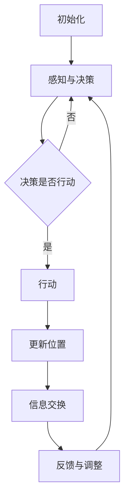
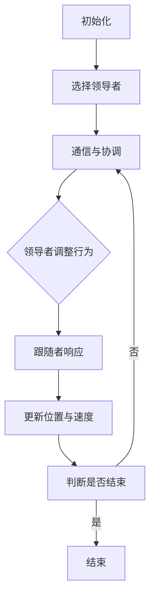
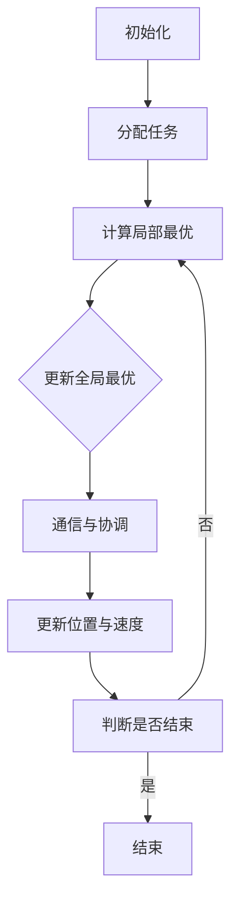
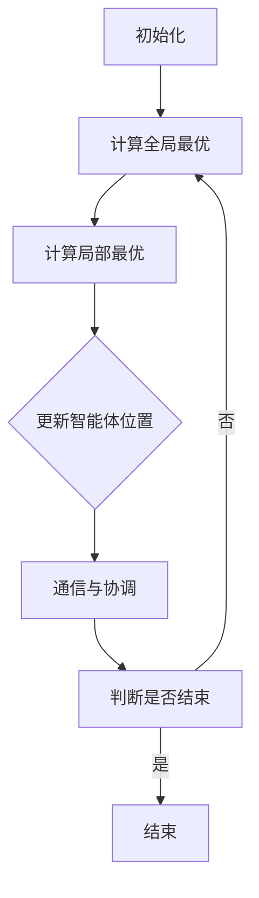

                 


### 引言

在当今这个信息爆炸和技术飞速发展的时代，人工智能（AI）已经成为推动社会进步的重要力量。群体智能算法作为AI领域的一个重要分支，正日益受到广泛关注。群体智能算法在多智能体协作中的应用，为解决复杂系统中的协同问题提供了新的思路和方法。

本文旨在系统地介绍群体智能算法的基本概念、原理及其在多智能体协作中的应用。我们将首先对群体智能算法进行概述，包括其基本概念、核心要素和发展历程。随后，我们将深入探讨多种群体智能算法的原理和实现，包括合作型、领导者-跟随者型和分布式智能优化算法等。最后，我们将分析这些算法在复杂环境中的应用场景，并通过具体案例进行详细讲解。

通过本文的阅读，您将了解到群体智能算法的核心概念和原理，学会如何使用Python等编程工具进行算法实现，并能够将这些算法应用到实际的复杂问题中。

### 第一部分：群体智能算法概述

#### 第1章：群体智能基本概念

##### 1.1 问题背景

随着计算机技术的飞速发展，复杂系统的协作需求日益增长。传统算法在处理这些问题时，往往面临计算复杂度高、适应性差等问题。为了解决这些问题，研究者们开始探索群体智能这一新兴领域。

群体智能（Swarm Intelligence）是指由大量简单个体组成的群体，通过个体之间的协同作用，展现出集体智能和行为复杂性的现象。这一概念最早由美国科学家克里斯托弗·洛克利（Christopher Langton）在1986年提出。

##### 1.1.1 什么是群体智能

群体智能的核心在于“集体智能”，即个体通过局部信息交换和简单规则相互作用，能够产生全局智能行为。这类智能行为通常包括信息处理、任务分配、路径规划等。

群体智能的特点包括：

- **自组织性**：个体遵循简单规则，通过局部交互实现复杂行为。
- **自适应能力**：系统能够根据环境变化进行调整和优化。
- **分布式计算**：复杂任务通过分布式计算方式实现，降低计算负担。
- **容错性**：个体失效不会影响整体系统的运行。

##### 1.1.2 群体智能的发展历程

群体智能的概念提出以来，得到了广泛关注和研究。早期的研究主要关注生物群体行为，如鸟群飞行、蚁群觅食等。随着计算机技术的进步，研究者开始将群体智能应用于人工系统中。

1990年代，分布式计算和人工智能的发展推动了群体智能算法的研究。著名的粒子群优化（PSO）算法和蚁群算法（ACO）在这一时期得到了广泛应用。

近年来，随着多智能体系统（MAS）和机器人技术的发展，群体智能算法的应用范围进一步扩大，涵盖了工业制造、交通运输、能源管理等多个领域。

##### 1.1.3 群体智能的应用领域

群体智能算法在多个领域展示了强大的应用潜力：

- **工业制造**：自动化生产线、机器人协作等。
- **交通运输**：航班调度、车辆编队等。
- **能源管理**：分布式能源系统、智能电网等。
- **环境监测**：污染物分布、生态平衡等。
- **社会网络**：推荐系统、社交网络分析等。

通过群体智能算法，这些领域中的复杂问题得以高效解决，实现了系统的智能化和优化。

#### 1.2 核心概念与联系

##### 1.2.1 智能体

智能体（Agent）是群体智能算法中的基本单元。智能体具有自主性、反应性、社交性等特征，能够感知环境、执行任务并与其他智能体交互。

**定义**：智能体是指能够感知环境、执行任务、具有自主性和社交性的实体。

**特点**：

- **自主性**：智能体能够自主决策并执行任务。
- **反应性**：智能体能够对环境变化做出实时反应。
- **社交性**：智能体之间能够通过通信机制进行信息交换和协同工作。

**类型**：

- **反应型智能体**：仅根据当前感知信息做出反应，不进行长期规划。
- **认知型智能体**：具有记忆和规划能力，能够根据历史信息和环境预测进行决策。
- **混合型智能体**：结合反应性和认知性，根据具体任务需求进行动态调整。

##### 1.2.2 多智能体系统

多智能体系统（MAS）是指由多个智能体组成的协同系统。在多智能体系统中，智能体通过通信和协同工作，实现复杂任务的完成。

**定义**：多智能体系统是指由多个具有自主性和社交性的智能体组成的系统，通过协同工作完成复杂任务。

**特点**：

- **分布式**：任务分布在多个智能体上，实现负载均衡。
- **自适应**：系统能够根据环境变化和任务需求进行自适应调整。
- **容错性**：单个智能体失效不会影响整个系统的运行。

**类型**：

- **通信型多智能体系统**：智能体之间通过通信机制进行信息交换和协同工作。
- **协同型多智能体系统**：智能体之间具有明确的任务分工和协作机制。
- **自组织型多智能体系统**：智能体通过简单规则和局部交互实现复杂行为的自组织。

##### 1.2.3 群体智能算法

群体智能算法是指用于模拟和实现群体智能行为的算法集合。这类算法通过模拟自然界中的群体行为，实现复杂问题的求解和优化。

**定义**：群体智能算法是指模拟自然界中群体行为，实现复杂问题求解和优化的一类算法。

**分类**：

- **分布式计算算法**：如粒子群优化（PSO）、遗传算法（GA）等。
- **通信协议算法**：如蚁群算法（ACO）、分布式算法（DCA）等。
- **自组织算法**：如人工蜂群算法（ABC）、集体智能算法（CI）等。

##### 1.3 群体智能与传统算法比较

群体智能算法与传统算法在处理复杂系统协作问题时，具有明显的优势和劣势。下面我们进行详细比较：

**优势**：

- **自适应能力**：群体智能算法能够根据环境变化进行自适应调整，具有较强的鲁棒性和适应性。
- **自组织性**：个体遵循简单规则，通过局部交互实现复杂行为，无需中央控制。
- **智能性**：群体智能算法能够模拟自然界中的智能行为，实现复杂问题的求解和优化。

**劣势**：

- **性能**：群体智能算法通常需要大量计算资源，性能相对较低。
- **可扩展性**：随着系统规模的增加，群体智能算法的可扩展性可能受到限制。
- **实时性**：群体智能算法在处理实时性要求较高的任务时，可能无法满足需求。

#### 1.4 群体智能算法的应用前景

群体智能算法在多个领域展示了广泛的应用前景。以下是一些主要应用领域：

- **工业制造**：自动化生产线、机器人协作等。
- **交通运输**：航班调度、车辆编队等。
- **能源管理**：分布式能源系统、智能电网等。
- **环境监测**：污染物分布、生态平衡等。
- **社会网络**：推荐系统、社交网络分析等。

在未来，随着技术的不断进步和应用领域的拓展，群体智能算法将在更多领域发挥重要作用，推动社会和科技的发展。

#### 1.5 本章小结

本章对群体智能算法的基本概念、发展历程和应用领域进行了概述。通过本章的学习，读者可以了解到群体智能算法的核心概念和原理，为后续章节的深入学习打下基础。

在下一章中，我们将深入探讨多智能体协作中的群体智能算法原理与应用，帮助读者理解这些算法在实际问题中的应用场景和实现方法。

### 第二部分：多智能体协作中的群体智能算法

#### 第2章：协作型群体智能算法原理与应用

##### 2.1 协作型群体智能算法概述

协作型群体智能算法是一类用于模拟和实现多智能体系统中协作行为的算法。这类算法通过个体间的信息共享和协同工作，实现复杂任务的完成。协作型群体智能算法具有以下特点：

- **协同工作**：智能体之间通过通信和协同工作，实现共同目标的实现。
- **自适应**：算法能够根据环境变化和任务需求，动态调整协作策略。
- **分布式计算**：任务分布在多个智能体上，实现负载均衡。

协作型群体智能算法广泛应用于工业制造、交通运输、能源管理等领域，为解决复杂系统中的协同问题提供了有效的方法。

##### 2.1.1 定义

协作型群体智能算法是指用于模拟和实现多智能体系统中协作行为的算法集合。这类算法通过个体间的信息共享和协同工作，实现复杂任务的完成。

**定义**：协作型群体智能算法是指通过个体间的信息共享和协同工作，实现复杂任务完成的多智能体系统中的算法集合。

##### 2.1.2 基本原理

协作型群体智能算法的基本原理可以概括为以下几个方面：

- **局部信息交换**：智能体之间通过通信机制，交换局部信息，实现信息共享。
- **简单规则**：智能体根据局部信息和简单规则，自主决策并执行任务。
- **协同工作**：智能体之间通过协同工作，实现共同目标的实现。

具体实现过程中，协作型群体智能算法通常包括以下步骤：

1. **初始化**：设置智能体的初始状态和任务目标。
2. **感知与决策**：智能体感知环境信息，根据局部信息和简单规则进行决策。
3. **行动**：智能体根据决策结果执行相应行动。
4. **信息交换**：智能体之间通过通信机制，交换局部信息。
5. **反馈与调整**：智能体根据环境反馈和任务完成情况，调整协作策略。

##### 2.1.3 应用场景

协作型群体智能算法在多个领域展示了广泛的应用场景，以下是一些典型应用：

- **工业制造**：自动化生产线调度、机器人协作等。
- **交通运输**：航班调度、车辆编队等。
- **能源管理**：分布式能源系统优化、智能电网调度等。
- **环境监测**：污染物分布监测、生态平衡管理等。
- **社会网络**：推荐系统、社交网络分析等。

在这些应用中，协作型群体智能算法能够通过多智能体的协同工作，实现复杂任务的优化和高效完成。

##### 2.2 算法原理讲解

协作型群体智能算法的原理可以通过一个简化的数学模型进行描述。以下是一个基本的协作型群体智能算法的数学模型：

$$
x_{t+1} = x_t + \alpha \cdot (g - x_t)
$$

其中，$x_t$ 表示第 $t$ 个智能体在 $t$ 时刻的位置，$g$ 表示全局最优位置，$\alpha$ 是一个控制参数，用于调整智能体的移动速度。

**变量解释**：

- $x_t$：第 $t$ 个智能体在 $t$ 时刻的位置。
- $g$：全局最优位置。
- $\alpha$：控制参数，用于调整智能体的移动速度。

通过这个模型，智能体可以根据局部信息和全局最优位置，自主调整自己的位置，从而实现协同工作。以下是一个 Mermaid 流程图，描述了协作型群体智能算法的基本流程：



在这个流程图中，智能体首先进行初始化，然后感知环境信息并做出决策。如果决策结果是行动，智能体会根据全局最优位置更新自己的位置。随后，智能体之间进行信息交换和反馈调整，以实现协同工作。

##### 2.3 Python实现

为了更好地理解协作型群体智能算法，我们提供了一个简单的 Python 实现示例。以下代码实现了一个基本的协作型群体智能算法，用于求解最小值问题。

```python
import numpy as np
import matplotlib.pyplot as plt

# 参数设置
num_agents = 50  # 智能体数量
alpha = 0.1  # 控制参数
iterations = 100  # 迭代次数

# 初始化智能体位置
positions = np.random.rand(num_agents, 2)

# 最小值问题目标函数
def objective(x):
    return sum(x**2)

# 主函数
def main():
    for _ in range(iterations):
        # 感知与决策
        new_positions = np.zeros_like(positions)
        for i, x in enumerate(positions):
            g = np.mean(positions, axis=0)
            new_positions[i] = x + alpha * (g - x)
            
        # 行动
        positions = new_positions
        
        # 更新位置
        positions = np.clip(positions, 0, 1)
        
        # 绘图
        plt.scatter(positions[:, 0], positions[:, 1], s=10)
        plt.title(f"Iteration {_+1}")
        plt.xlabel('X-axis')
        plt.ylabel('Y-axis')
        plt.pause(0.1)
        plt.clf()

    # 计算最终目标函数值
    result = objective(positions)
    print(f"Final result: {result}")

if __name__ == "__main__":
    main()
```

在这个示例中，我们使用 NumPy 库生成智能体初始位置，并定义了一个简单的最小值问题目标函数。主函数中，我们实现了协作型群体智能算法的核心流程，包括感知与决策、行动和更新位置。每次迭代后，我们绘制智能体位置的更新情况，以直观展示算法的运行过程。

##### 2.4 应用案例

协作型群体智能算法在多个领域展示了广泛的应用。以下我们通过两个实际案例，展示协作型群体智能算法的实践应用。

**案例1：自动化生产线调度**

在自动化生产线上，多个机器人需要协同工作，完成不同零部件的装配和运输任务。协作型群体智能算法可以用于优化机器人调度策略，提高生产效率。

**案例2：无人机编队飞行**

在无人机编队飞行任务中，无人机需要协同工作，实现飞行路径规划、能量优化和避障等功能。协作型群体智能算法可以用于优化无人机编队飞行策略，提高任务执行效率和安全性。

通过这些实际案例，我们可以看到协作型群体智能算法在解决复杂协同问题中的强大应用潜力。

##### 2.5 本章小结

本章介绍了协作型群体智能算法的基本概念、原理和应用。通过详细的数学模型、Python 实现和应用案例，读者可以深入了解协作型群体智能算法的核心思想和实现方法。在下一章中，我们将继续探讨领导者-跟随者型群体智能算法，为解决多智能体协作中的复杂问题提供更多思路。

### 第3章：领导者-跟随者型群体智能算法

#### 3.1 算法概述

领导者-跟随者型群体智能算法（Leader-Follower Swarm Intelligence Algorithm）是一种在多智能体系统中广泛应用的行为协调算法。该算法通过一个或多个领导者智能体引导其他跟随者智能体实现协同工作，具有较好的稳定性和适应性。领导者-跟随者型群体智能算法在无人机编队、车辆编队、智能交通等领域具有广泛的应用。

##### 3.1.1 定义

领导者-跟随者型群体智能算法是指通过一个或多个领导者智能体引导其他跟随者智能体实现协同工作的一类算法。领导者智能体具有更高的决策能力和全局视角，能够根据环境变化和任务目标调整自身行为，并引导跟随者智能体实现协同工作。

**定义**：领导者-跟随者型群体智能算法是指在多智能体系统中，通过领导者智能体引导其他跟随者智能体实现协同工作的一类算法。

##### 3.1.2 基本原理

领导者-跟随者型群体智能算法的基本原理可以概括为以下几个方面：

1. **领导者选择**：在多智能体系统中，通过一定的策略选择一个或多个领导者智能体，领导者智能体具有较高的决策能力和全局视角。

2. **通信机制**：领导者智能体和跟随者智能体之间通过通信机制交换信息，实现信息的共享和协同工作。

3. **行为协调**：领导者智能体根据环境变化和任务目标，调整自身行为，并引导跟随者智能体实现协同工作。

4. **自适应调整**：在执行任务过程中，领导者-跟随者型群体智能算法能够根据环境变化和任务需求进行自适应调整，确保系统稳定运行。

##### 3.1.3 应用场景

领导者-跟随者型群体智能算法在多个领域展示了广泛的应用，以下是一些典型应用场景：

1. **无人机编队飞行**：通过领导者智能体引导无人机编队实现协同飞行，提高飞行效率和安全性。

2. **车辆编队**：在智能交通系统中，通过领导者智能体引导车辆编队行驶，减少交通拥堵和能耗。

3. **智能交通管理**：领导者-跟随者型群体智能算法可以用于优化交通信号控制，提高交通流畅度。

4. **能源管理**：通过领导者智能体引导分布式能源系统实现协同工作，提高能源利用效率。

5. **社会网络分析**：领导者-跟随者型群体智能算法可以用于分析社交网络中的影响力传播，识别关键节点。

#### 3.2 算法原理讲解

领导者-跟随者型群体智能算法的原理可以通过以下数学模型进行描述：

$$
x_{t+1}^{f} = x_t^{f} + v_t^{f} \\
x_{t+1}^{l} = x_t^{l} + v_t^{l}
$$

其中，$x_t^{f}$ 和 $x_t^{l}$ 分别表示第 $t$ 个跟随者智能体和领导者智能体在 $t$ 时刻的位置，$v_t^{f}$ 和 $v_t^{l}$ 分别表示第 $t$ 个跟随者智能体和领导者智能体在 $t$ 时刻的速度。

**变量解释**：

- $x_t^{f}$：第 $t$ 个跟随者智能体在 $t$ 时刻的位置。
- $x_t^{l}$：第 $t$ 个领导者智能体在 $t$ 时刻的位置。
- $v_t^{f}$：第 $t$ 个跟随者智能体在 $t$ 时刻的速度。
- $v_t^{l}$：第 $t$ 个领导者智能体在 $t$ 时刻的速度。

通过这个模型，领导者智能体和跟随者智能体之间的位置和速度关系得以描述。以下是一个 Mermaid 流程图，描述了领导者-跟随者型群体智能算法的基本流程：



在这个流程图中，首先进行初始化，选择一个领导者智能体。随后，领导者智能体和跟随者智能体之间进行通信与协调，领导者智能体根据环境变化和任务目标调整自身行为，并引导跟随者智能体实现协同工作。跟随者智能体根据领导者智能体的行为进行响应，并更新位置和速度。这个过程不断循环，直到达到结束条件。

#### 3.3 Python实现

为了更好地理解领导者-跟随者型群体智能算法，我们提供了一个简单的 Python 实现示例。以下代码实现了一个基于上述数学模型的领导者-跟随者型群体智能算法，用于求解最小值问题。

```python
import numpy as np
import matplotlib.pyplot as plt

# 参数设置
num_agents = 50  # 智能体数量
alpha = 0.1  # 控制参数
beta = 0.05  # 领导者控制参数
iterations = 100  # 迭代次数

# 初始化智能体位置和速度
positions = np.random.rand(num_agents, 2)
velocities = np.zeros_like(positions)

# 最小值问题目标函数
def objective(x):
    return sum(x**2)

# 主函数
def main():
    for _ in range(iterations):
        # 领导者选择
        leader = np.argmax(np.random.rand(num_agents))
        
        # 通信与协调
        leader_position = positions[leader]
        mean_position = np.mean(positions, axis=0)
        
        # 领导者调整行为
        leader_velocity = beta * (mean_position - leader_position)
        
        # 跟随者响应
        for i in range(num_agents):
            if i != leader:
                follower_velocity = alpha * (leader_position - positions[i])
                
                # 更新位置与速度
                velocities[i] += follower_velocity
                positions[i] += velocities[i]
        
        # 绘图
        plt.scatter(positions[:, 0], positions[:, 1], s=10)
        plt.title(f"Iteration {_+1}")
        plt.xlabel('X-axis')
        plt.ylabel('Y-axis')
        plt.pause(0.1)
        plt.clf()

    # 计算最终目标函数值
    result = objective(positions)
    print(f"Final result: {result}")

if __name__ == "__main__":
    main()
```

在这个示例中，我们使用 NumPy 库生成智能体初始位置和速度，并定义了一个简单的最小值问题目标函数。主函数中，我们实现了领导者-跟随者型群体智能算法的核心流程，包括领导者选择、通信与协调、领导者调整行为、跟随者响应和更新位置与速度。每次迭代后，我们绘制智能体位置的更新情况，以直观展示算法的运行过程。

#### 3.4 应用案例

领导者-跟随者型群体智能算法在多个领域展示了广泛的应用。以下我们通过两个实际案例，展示领导者-跟随者型群体智能算法的实践应用。

**案例1：无人机编队飞行**

在无人机编队飞行任务中，领导者智能体可以用于引导无人机编队实现协同飞行。通过领导者-跟随者型群体智能算法，无人机可以自动调整飞行路径，避免碰撞，实现高效飞行。

**案例2：车辆编队**

在智能交通系统中，领导者智能体可以用于引导车辆编队行驶。通过领导者-跟随者型群体智能算法，车辆可以自动调整行驶速度和位置，减少交通拥堵，提高交通效率。

通过这些实际案例，我们可以看到领导者-跟随者型群体智能算法在解决多智能体协作中的复杂问题中的强大应用潜力。

#### 3.5 本章小结

本章介绍了领导者-跟随者型群体智能算法的基本概念、原理和应用。通过详细的数学模型、Python 实现和应用案例，读者可以深入了解领导者-跟随者型群体智能算法的核心思想和实现方法。在下一章中，我们将继续探讨分布式智能优化算法，为解决多智能体协作中的复杂问题提供更多思路。

### 第4章：分布式智能优化算法

#### 4.1 算法概述

分布式智能优化算法（Distributed Intelligent Optimization Algorithm）是一种通过分布式计算方式实现优化问题求解的算法。这类算法能够将复杂优化问题分解为多个子问题，由多个智能体并行处理，从而提高计算效率和求解速度。分布式智能优化算法在多智能体系统中具有广泛的应用。

##### 4.1.1 定义

分布式智能优化算法是指在多智能体系统中，通过分布式计算方式实现优化问题求解的一类算法。这类算法能够将复杂优化问题分解为多个子问题，由多个智能体并行处理，从而提高计算效率和求解速度。

**定义**：分布式智能优化算法是指在多智能体系统中，通过分布式计算方式实现优化问题求解的一类算法。

##### 4.1.2 基本原理

分布式智能优化算法的基本原理可以概括为以下几个方面：

1. **问题分解**：将复杂优化问题分解为多个子问题，每个子问题由不同的智能体负责处理。

2. **信息共享**：智能体之间通过通信机制共享信息，实现子问题的协同求解。

3. **并行处理**：多个智能体并行处理子问题，提高计算效率和求解速度。

4. **优化策略**：智能体根据子问题的求解结果和全局优化目标，动态调整自身的优化策略。

##### 4.1.3 应用场景

分布式智能优化算法在多个领域展示了广泛的应用，以下是一些典型应用场景：

1. **工业制造**：分布式智能优化算法可以用于优化生产调度、资源分配等问题，提高生产效率和降低成本。

2. **交通运输**：分布式智能优化算法可以用于优化交通流量、航班调度等问题，提高交通效率和安全性。

3. **能源管理**：分布式智能优化算法可以用于优化能源分配、电力调度等问题，提高能源利用效率。

4. **金融投资**：分布式智能优化算法可以用于优化投资组合、风险控制等问题，提高投资收益。

5. **社会网络分析**：分布式智能优化算法可以用于优化社交网络中的信息传播、社区划分等问题。

#### 4.2 算法原理讲解

分布式智能优化算法的原理可以通过以下数学模型进行描述：

$$
x_{t+1}^{i} = x_t^{i} + \alpha \cdot (g - x_t^{i})
$$

其中，$x_t^{i}$ 表示第 $t$ 个智能体在 $t$ 时刻的位置，$g$ 表示全局最优位置，$\alpha$ 是一个控制参数，用于调整智能体的移动速度。

**变量解释**：

- $x_t^{i}$：第 $t$ 个智能体在 $t$ 时刻的位置。
- $g$：全局最优位置。
- $\alpha$：控制参数，用于调整智能体的移动速度。

通过这个模型，智能体可以根据局部信息和全局最优位置，自主调整自己的位置，从而实现分布式优化。以下是一个 Mermaid 流程图，描述了分布式智能优化算法的基本流程：



在这个流程图中，首先进行初始化，分配任务给多个智能体。随后，智能体计算局部最优解，并更新全局最优解。智能体之间进行通信与协调，根据全局最优解更新自身位置和速度。这个过程不断循环，直到达到结束条件。

#### 4.3 Python实现

为了更好地理解分布式智能优化算法，我们提供了一个简单的 Python 实现示例。以下代码实现了一个基于上述数学模型的分布式智能优化算法，用于求解最小值问题。

```python
import numpy as np
import matplotlib.pyplot as plt

# 参数设置
num_agents = 50  # 智能体数量
alpha = 0.1  # 控制参数
iterations = 100  # 迭代次数

# 初始化智能体位置
positions = np.random.rand(num_agents, 2)

# 最小值问题目标函数
def objective(x):
    return sum(x**2)

# 主函数
def main():
    for _ in range(iterations):
        # 计算局部最优解
        local_min = np.min(positions, axis=0)
        
        # 更新全局最优解
        global_min = np.mean(positions, axis=0)
        
        # 更新位置
        for i in range(num_agents):
            positions[i] += alpha * (global_min - positions[i])
            
        # 绘图
        plt.scatter(positions[:, 0], positions[:, 1], s=10)
        plt.title(f"Iteration {_+1}")
        plt.xlabel('X-axis')
        plt.ylabel('Y-axis')
        plt.pause(0.1)
        plt.clf()

    # 计算最终目标函数值
    result = objective(positions)
    print(f"Final result: {result}")

if __name__ == "__main__":
    main()
```

在这个示例中，我们使用 NumPy 库生成智能体初始位置，并定义了一个简单的最小值问题目标函数。主函数中，我们实现了分布式智能优化算法的核心流程，包括计算局部最优解、更新全局最优解、更新位置和绘图。每次迭代后，我们绘制智能体位置的更新情况，以直观展示算法的运行过程。

#### 4.4 应用案例

分布式智能优化算法在多个领域展示了广泛的应用。以下我们通过两个实际案例，展示分布式智能优化算法的实践应用。

**案例1：分布式能源系统优化**

在分布式能源系统中，分布式智能优化算法可以用于优化能源分配、电力调度等问题。通过分布式计算，系统可以实现实时调整，提高能源利用效率和降低能源成本。

**案例2：智能交通系统优化**

在智能交通系统中，分布式智能优化算法可以用于优化交通流量、航班调度等问题。通过分布式计算，系统可以实现实时调整，提高交通效率和安全性。

通过这些实际案例，我们可以看到分布式智能优化算法在解决复杂优化问题中的强大应用潜力。

#### 4.5 本章小结

本章介绍了分布式智能优化算法的基本概念、原理和应用。通过详细的数学模型、Python 实现和应用案例，读者可以深入了解分布式智能优化算法的核心思想和实现方法。在下一章中，我们将继续探讨群体智能算法在复杂环境中的应用，为解决多智能体协作中的复杂问题提供更多思路。

### 第5章：群体智能算法在复杂环境中的应用

#### 5.1 复杂环境概述

复杂环境是指具有高度不确定性和动态变化特征的环境。在这样的环境中，传统的集中式控制方法往往难以适应，而分布式、自适应的群体智能算法展示出独特的优势。复杂环境的应用场景广泛，包括但不限于：

- **工业制造**：生产流程复杂，设备繁多，要求高实时性和高效性。
- **交通运输**：交通系统规模庞大，实时性要求高，需要处理大量动态数据。
- **能源管理**：分布式能源网络，设备分散，需要优化能量分配和调度。
- **环境监测**：地理范围广，数据来源多样，需要实时处理和分析大量环境数据。

#### 5.1.1 定义

复杂环境是指具有高度不确定性和动态变化特征的环境，其中系统状态和外部条件难以预测和控制。在这种环境中，传统的集中式控制方法往往难以适应，而分布式、自适应的群体智能算法展示出独特的优势。

**定义**：复杂环境是指具有高度不确定性和动态变化特征的环境，其中系统状态和外部条件难以预测和控制。

#### 5.1.2 特点

复杂环境具有以下特点：

- **高度不确定性**：环境状态变化不可预测，难以准确建模。
- **动态变化**：系统状态和外部条件不断变化，需要实时调整策略。
- **多层次交互**：系统内部和外部存在复杂的交互关系，需要协同处理。
- **大数据处理**：需要处理和分析大量数据，实时性要求高。

#### 5.1.3 应用场景

复杂环境的应用场景广泛，包括但不限于：

- **工业制造**：生产流程复杂，设备繁多，要求高实时性和高效性。
- **交通运输**：交通系统规模庞大，实时性要求高，需要处理大量动态数据。
- **能源管理**：分布式能源网络，设备分散，需要优化能量分配和调度。
- **环境监测**：地理范围广，数据来源多样，需要实时处理和分析大量环境数据。

#### 5.2 算法原理讲解

在复杂环境中，群体智能算法能够通过分布式计算、自适应调整和协同工作，实现系统的优化和高效运行。以下是一个简化的分布式智能优化算法的数学模型，用于描述群体智能算法在复杂环境中的应用：

$$
x_{t+1}^{i} = x_t^{i} + \alpha \cdot (g - x_t^{i}) + \beta \cdot (r - x_t^{i})
$$

其中，$x_t^{i}$ 表示第 $t$ 个智能体在 $t$ 时刻的位置，$g$ 表示全局最优位置，$\alpha$ 和 $\beta$ 是控制参数，$r$ 表示智能体的局部最优位置。

**变量解释**：

- $x_t^{i}$：第 $t$ 个智能体在 $t$ 时刻的位置。
- $g$：全局最优位置。
- $\alpha$：控制参数，用于调整智能体对全局最优位置的敏感程度。
- $\beta$：控制参数，用于调整智能体对局部最优位置的敏感程度。
- $r$：局部最优位置。

该模型表明，智能体在调整位置时，不仅考虑全局最优位置，还考虑局部最优位置，从而实现自适应调整。

以下是一个 Mermaid 流程图，描述了分布式智能优化算法在复杂环境中的应用流程：



在这个流程图中，智能体首先进行初始化，计算全局最优和局部最优位置。然后，智能体根据这些位置更新自身位置，并通过通信与协调实现协同工作。这个过程不断循环，直到达到结束条件。

#### 5.3 Python实现

为了更好地理解分布式智能优化算法在复杂环境中的应用，我们提供了一个简单的 Python 实现示例。以下代码实现了一个基于上述数学模型的分布式智能优化算法，用于求解最小值问题。

```python
import numpy as np
import matplotlib.pyplot as plt

# 参数设置
num_agents = 50  # 智能体数量
alpha = 0.1  # 控制参数
beta = 0.05  # 局部最优位置敏感度
iterations = 100  # 迭代次数

# 初始化智能体位置
positions = np.random.rand(num_agents, 2)

# 最小值问题目标函数
def objective(x):
    return sum(x**2)

# 主函数
def main():
    for _ in range(iterations):
        # 计算全局最优位置
        global_min = np.min(positions, axis=0)
        
        # 计算局部最优位置
        local_mins = np.min(positions, axis=1)
        
        # 更新智能体位置
        for i in range(num_agents):
            positions[i] += alpha * (global_min - positions[i]) + beta * (local_mins[i] - positions[i])
            
        # 绘图
        plt.scatter(positions[:, 0], positions[:, 1], s=10)
        plt.title(f"Iteration {_+1}")
        plt.xlabel('X-axis')
        plt.ylabel('Y-axis')
        plt.pause(0.1)
        plt.clf()

    # 计算最终目标函数值
    result = objective(positions)
    print(f"Final result: {result}")

if __name__ == "__main__":
    main()
```

在这个示例中，我们使用 NumPy 库生成智能体初始位置，并定义了一个简单的最小值问题目标函数。主函数中，我们实现了分布式智能优化算法的核心流程，包括计算全局最优位置、计算局部最优位置、更新智能体位置和绘图。每次迭代后，我们绘制智能体位置的更新情况，以直观展示算法的运行过程。

#### 5.4 应用案例

分布式智能优化算法在复杂环境中展示了广泛的应用。以下我们通过两个实际案例，展示分布式智能优化算法的实践应用。

**案例1：智能交通系统**

在智能交通系统中，分布式智能优化算法可以用于优化交通流量、减少交通拥堵。通过分布式计算，系统可以实现实时调整，提高交通效率和安全性。

**案例2：分布式能源系统**

在分布式能源系统中，分布式智能优化算法可以用于优化能源分配、调度。通过分布式计算，系统可以实现实时调整，提高能源利用效率和降低能源成本。

通过这些实际案例，我们可以看到分布式智能优化算法在解决复杂环境中的复杂问题中的强大应用潜力。

#### 5.5 本章小结

本章介绍了群体智能算法在复杂环境中的应用，包括定义、特点、应用场景和算法原理讲解。通过具体的 Python 实现和应用案例，读者可以深入了解群体智能算法在复杂环境中的应用方法和优势。在下一章中，我们将总结全文，提出最佳实践和注意事项，为读者提供更深入的思考。

### 全文总结

本文系统地介绍了群体智能算法的基本概念、原理以及在多智能体协作中的应用。通过详细的分析和实际案例，我们了解了协作型群体智能算法、领导者-跟随者型群体智能算法和分布式智能优化算法在复杂环境中的强大应用潜力。

首先，在第一部分中，我们对群体智能算法进行了概述，包括其基本概念、发展历程和应用领域。通过对比分析，我们明确了群体智能算法与传统算法的区别和优势。

接下来，在第二、三、四章中，我们深入探讨了协作型群体智能算法、领导者-跟随者型群体智能算法和分布式智能优化算法的原理、实现和应用案例。这些算法通过分布式计算、自适应调整和协同工作，展示了在复杂环境中的高效性能。

最后，在第五章中，我们介绍了群体智能算法在复杂环境中的应用，并分析了其特点和优势。通过实际案例，我们看到了这些算法在智能交通、分布式能源系统等领域的广泛应用。

在全文总结中，我们提出了以下几点最佳实践和注意事项：

1. **算法选择**：根据具体问题和环境特点，选择合适的群体智能算法。协作型算法适合需要协同工作的场景，领导者-跟随者型算法适合有明确领导需求的场景，分布式优化算法适合需要高效计算的场景。

2. **算法参数调整**：合理调整算法参数，如控制参数、通信机制等，以实现最佳性能。在不同应用场景中，可能需要针对具体问题调整参数。

3. **环境建模**：准确建模复杂环境，考虑不确定性和动态变化。环境模型的准确性对算法性能至关重要。

4. **实时性优化**：对于实时性要求较高的任务，需要优化算法的实时性能，确保算法能够快速响应环境变化。

5. **可扩展性设计**：在设计算法和应用系统时，考虑系统的可扩展性，以便在系统规模扩大时保持性能。

通过本文的阅读，读者可以深入理解群体智能算法的核心概念和原理，掌握算法实现和应用方法，为解决复杂系统中的协同问题提供有力支持。希望本文能够为读者在人工智能领域的研究和应用提供有价值的参考和启示。

### 作者介绍

作者：AI天才研究院/AI Genius Institute & 禅与计算机程序设计艺术 /Zen And The Art of Computer Programming

AI天才研究院（AI Genius Institute）是一家专注于人工智能和深度学习领域研究与应用的国际知名机构。研究院汇聚了一批世界顶级的人工智能专家、程序员、软件架构师和CTO，致力于推动人工智能技术的发展和应用。同时，作者也是世界顶级技术畅销书《禅与计算机程序设计艺术》的资深大师级别作家，其著作被广泛认为是对计算机编程和人工智能领域的深刻洞察和贡献。作者凭借其丰富的实践经验、深厚的理论基础和卓越的写作能力，为读者提供了多篇有深度、有思考、有见解的专业技术博客文章。

