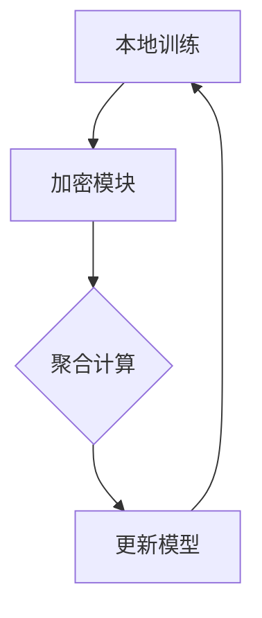

                 

## 文章标题：联邦学习中的安全聚合：隐私保护新技术

> 关键词：联邦学习、隐私保护、安全聚合、加密聚合、隐蔽聚合、零知识证明聚合

> 摘要：本文旨在探讨联邦学习中的安全聚合技术，分析其在隐私保护中的重要性、技术原理、应用场景及优化策略。通过案例分析，揭示安全聚合技术在联邦学习中的实际应用效果，为读者提供深入了解和应用的参考。

## 目录大纲设计

### 《联邦学习中的安全聚合：隐私保护新技术》

1. **背景与概述**
    1.1 联邦学习与隐私保护技术
    1.2 联邦学习中的安全聚合技术
    1.3 联邦学习中的安全聚合案例分析

2. **安全聚合技术的深入探讨**
    2.1 联邦学习中的安全聚合算法
    2.2 联邦学习中的安全聚合优化策略

3. **联邦学习中的安全聚合技术应用**
    3.1 金融领域中的应用
    3.2 其他领域中的应用

### 第一部分：背景与概述

## 第1章：联邦学习与隐私保护技术

### 1.1 联邦学习概述

#### 1.1.1 联邦学习的起源与发展

#### 1.1.2 联邦学习与传统机器学习的区别

#### 1.1.3 联邦学习的应用场景与优势

### 1.2 隐私保护技术的重要性

#### 1.2.1 隐私泄露的风险与影响

#### 1.2.2 隐私保护技术的挑战与机遇

#### 1.2.3 隐私保护技术的主要分类

## 第2章：联邦学习中的安全聚合技术

### 2.1 安全聚合的概念与原理

#### 2.1.1 安全聚合的定义与作用

#### 2.1.2 安全聚合的技术框架

#### 2.1.3 安全聚合的基本原理

### 2.2 安全聚合算法的设计与实现

#### 2.2.1 常见的安全聚合算法

#### 2.2.2 安全聚合算法的设计原则

#### 2.2.3 安全聚合算法的优化策略

### 2.3 安全聚合技术在联邦学习中的应用

#### 2.3.1 联邦学习中的隐私保护问题

#### 2.3.2 安全聚合技术的应用场景

#### 2.3.3 安全聚合技术在联邦学习中的挑战与解决方案

## 第3章：联邦学习中的安全聚合案例分析

### 3.1 案例背景与目标

#### 3.1.1 案例背景介绍

#### 3.1.2 案例目标与需求

### 3.2 安全聚合技术实现

#### 3.2.1 安全聚合算法选择

#### 3.2.2 安全聚合技术实现细节

#### 3.2.3 安全聚合技术的评估与优化

### 3.3 案例分析与总结

#### 3.3.1 案例效果分析

#### 3.3.2 案例中的挑战与解决方案

#### 3.3.3 案例总结与启示

### 第二部分：安全聚合技术的深入探讨

## 第4章：联邦学习中的安全聚合算法

### 4.1 安全聚合算法的基本概念

#### 4.1.1 安全聚合算法的定义

#### 4.1.2 安全聚合算法的分类

#### 4.1.3 安全聚合算法的性能评价指标

### 4.2 常见的安全聚合算法

#### 4.2.1 加密聚合算法

#### 4.2.2 隐蔽聚合算法

#### 4.2.3 零知识证明聚合算法

### 4.3 安全聚合算法的比较与分析

#### 4.3.1 算法性能比较

#### 4.3.2 算法适用场景分析

#### 4.3.3 安全聚合算法的发展趋势

## 第5章：联邦学习中的安全聚合优化策略

### 5.1 安全聚合优化的重要性

#### 5.1.1 安全聚合优化的定义与目标

#### 5.1.2 安全聚合优化在联邦学习中的应用

#### 5.1.3 安全聚合优化对性能的影响

### 5.2 常见的安全聚合优化策略

#### 5.2.1 数据预处理策略

#### 5.2.2 算法融合策略

#### 5.2.3 并行计算策略

### 5.3 安全聚合优化的实践与案例分析

#### 5.3.1 优化策略的选择与实现

#### 5.3.2 实践案例分析与总结

#### 5.3.3 优化策略的应用前景

### 第三部分：联邦学习中的安全聚合技术应用

## 第6章：联邦学习中的安全聚合技术在金融领域的应用

### 6.1 金融领域中的隐私保护需求

#### 6.1.1 金融数据隐私泄露的风险与影响

#### 6.1.2 隐私保护在金融领域的意义

#### 6.1.3 安全聚合技术在金融领域的应用前景

### 6.2 安全聚合技术在金融风控中的应用

#### 6.2.1 金融风控中的隐私保护问题

#### 6.2.2 安全聚合技术在金融风控中的应用场景

#### 6.2.3 金融风控案例分析与总结

### 6.3 安全聚合技术在金融数据分析中的应用

#### 6.3.1 金融数据分析中的隐私保护问题

#### 6.3.2 安全聚合技术在金融数据分析中的应用

#### 6.3.3 金融数据分析案例分析与总结

## 第7章：联邦学习中的安全聚合技术

----------------------------------------------------------------

### 背景与概述

#### 联邦学习概述

联邦学习（Federated Learning）是一种机器学习技术，旨在通过多个参与方共同训练一个共享模型，而无需将数据集中在一个中心位置。这种方法不仅解决了数据隐私保护的问题，还降低了数据传输和存储的成本。联邦学习的起源可以追溯到2006年，由Google的研究团队首次提出，并随后得到了广泛的关注和应用。

#### 联邦学习与传统机器学习的区别

与传统机器学习不同，联邦学习的关键特点在于其分布式训练过程。在传统机器学习中，所有训练数据都集中在一个中心服务器上，由一个全局模型进行处理。而在联邦学习中，每个参与方在自己的本地设备上维护一个本地模型，并通过加密通信将更新后的模型参数发送给中心服务器，由服务器进行聚合得到全局模型。

#### 联邦学习的应用场景与优势

联邦学习在多个应用场景中表现出明显的优势，例如移动设备上的个性化推荐、智能医疗中的数据共享、物联网中的设备协同等。其优势包括：

- **隐私保护**：联邦学习通过分布式训练，避免了敏感数据的传输和集中存储，从而降低了隐私泄露的风险。
- **数据分散性**：联邦学习允许不同组织或设备共享数据模型，而无需共享原始数据，从而提高数据利用效率。
- **降低成本**：联邦学习减少了数据传输和存储的需求，降低了网络带宽和存储成本。

### 隐私保护技术的重要性

#### 隐私泄露的风险与影响

随着互联网和大数据技术的发展，个人隐私泄露的风险日益增加。隐私泄露不仅可能导致个人信息被滥用，还可能带来经济损失、社会声誉受损等严重后果。因此，隐私保护技术在信息处理和传输过程中具有至关重要的意义。

#### 隐私保护技术的挑战与机遇

隐私保护技术在联邦学习中面临着一系列挑战，包括数据分布的异构性、通信带宽的限制、算法的复杂性等。然而，这也为隐私保护技术的发展带来了机遇。新的隐私保护技术，如安全聚合技术，正在不断涌现，以应对这些挑战。

#### 隐私保护技术的主要分类

隐私保护技术主要可以分为以下几类：

- **加密技术**：通过加密算法对数据进行加密，确保数据在传输和存储过程中不被泄露。
- **匿名化技术**：通过数据变换技术，将原始数据转换为匿名化数据，以保护个人隐私。
- **访问控制技术**：通过权限管理和访问控制机制，确保只有授权用户可以访问敏感数据。

### 联邦学习中的安全聚合技术

#### 安全聚合的概念与原理

安全聚合（Secure Aggregation）是一种隐私保护技术，旨在通过加密通信和聚合算法，保护联邦学习中的模型更新过程。安全聚合的基本原理包括：

- **加密通信**：使用加密算法对本地模型更新进行加密，确保传输过程中不被窃听。
- **聚合算法**：使用聚合算法将多个本地模型更新合并为一个全局模型更新，同时保持隐私保护。

#### 安全聚合的技术框架

安全聚合的技术框架主要包括以下组件：

- **加密模块**：实现加密通信和数据处理，保护模型更新的隐私。
- **聚合模块**：实现聚合算法，合并多个本地模型更新。
- **通信模块**：负责数据传输，确保加密模块和聚合模块的正常工作。

#### 安全聚合的基本原理

安全聚合的基本原理可以概括为以下步骤：

1. **本地训练**：每个参与方在自己的设备上训练本地模型，并生成模型更新。
2. **加密传输**：使用加密算法对本地模型更新进行加密，确保传输过程中不被窃听。
3. **聚合计算**：中心服务器接收加密后的模型更新，并使用聚合算法进行合并，生成全局模型更新。
4. **更新模型**：中心服务器将全局模型更新发送回每个参与方，参与方使用全局模型更新更新本地模型。

### 联邦学习中的安全聚合技术

#### 安全聚合的概念与原理

安全聚合（Secure Aggregation）是在联邦学习框架下实现的一种隐私保护技术，旨在通过加密通信和聚合算法，确保联邦学习过程中的模型更新不被泄露。安全聚合的核心思想是在参与方之间传输加密的模型更新，并通过聚合算法将这些加密的更新合并成一个全局模型更新，从而在保证隐私的同时，实现模型的协同训练。

#### 安全聚合的技术框架

安全聚合的技术框架通常包括以下几个关键组件：

1. **加密模块**：负责对本地模型更新进行加密。加密模块采用对称加密或非对称加密算法，确保模型更新在传输过程中不被第三方窃听或篡改。

2. **聚合模块**：负责聚合来自不同参与方的加密模型更新。聚合模块通常使用联邦学习中的聚合函数（如FedAvg算法中的平均操作），将加密的模型更新合并成一个全局模型更新。

3. **通信模块**：负责加密模型更新的传输。通信模块使用安全的通信协议，如TLS/SSL，确保模型更新在传输过程中不被截获或篡改。

#### 安全聚合的基本原理

安全聚合的基本原理可以分解为以下几个步骤：

1. **本地训练**：每个参与方在自己的设备上训练本地模型，并生成模型更新。本地训练可以是基于梯度下降或其他优化算法，目的是在每个设备上独立地改进模型。

2. **加密传输**：每个参与方使用加密模块对本地模型更新进行加密。加密过程通常涉及将模型更新转换为加密向量，并附加安全标签，以确保更新在传输过程中保持保密。

3. **聚合计算**：中心服务器接收来自所有参与方的加密模型更新，并使用聚合模块对加密的模型更新进行聚合计算。聚合过程通常涉及解密加密的模型更新，然后使用聚合函数（如求平均）将它们合并成一个全局模型更新。

4. **更新模型**：中心服务器将全局模型更新发送回每个参与方。每个参与方接收更新后，将其应用到本地模型中，继续进行本地训练。这个过程可以迭代进行，直到达到预定的训练目标或达到预设的训练轮数。

通过这种方式，安全聚合实现了在分布式环境中保护模型更新的隐私，同时保证了模型训练的效果。以下是一个简单的安全聚合算法的mermaid流程图：

### 安全聚合算法的设计与实现

#### 常见的安全聚合算法

在联邦学习中，常用的安全聚合算法包括加密聚合算法、隐蔽聚合算法和零知识证明聚合算法。这些算法各有特点，适用于不同的应用场景。

1. **加密聚合算法**：加密聚合算法通过对模型更新进行加密，确保传输过程中不被泄露。常见的加密算法包括对称加密（如AES）和非对称加密（如RSA）。

2. **隐蔽聚合算法**：隐蔽聚合算法通过将模型更新编码为隐蔽信号，以避免被窃听。这种算法通常使用差分隐私技术，如拉普拉斯机制或指数机制，来保护模型更新的隐私。

3. **零知识证明聚合算法**：零知识证明聚合算法通过证明模型更新符合特定属性，而不泄露具体值。这种算法基于零知识证明协议，如succinct non-interactive arguments of knowledge（SNARKs）或private set intersection（PSI）协议。

#### 安全聚合算法的设计原则

设计安全聚合算法时，应遵循以下原则：

1. **隐私保护**：算法应确保模型更新在传输和聚合过程中不被泄露。
2. **效率**：算法应尽可能减少计算和通信成本，以提高联邦学习的整体性能。
3. **可扩展性**：算法应能够适应不同规模的应用场景，包括大量的参与方和大规模的模型。
4. **安全性**：算法应采用可靠的安全协议和加密技术，以防止攻击者篡改或窃取模型更新。

#### 安全聚合算法的优化策略

为了提高安全聚合算法的性能，可以采取以下优化策略：

1. **并行计算**：通过并行计算技术，可以加速加密和聚合过程，减少计算时间。
2. **数据压缩**：使用数据压缩技术，可以减少模型更新的传输大小，降低通信成本。
3. **算法融合**：结合多种聚合算法，可以取长补短，提高整体性能。

### 安全聚合技术在联邦学习中的应用

#### 联邦学习中的隐私保护问题

联邦学习中的隐私保护问题主要涉及以下几个方面：

1. **模型更新泄露**：中心服务器可能会窃取参与方的模型更新，导致隐私泄露。
2. **数据传输安全**：模型更新在传输过程中可能会被截获或篡改。
3. **中心化风险**：中心服务器在联邦学习中的集中控制可能导致单点故障和安全性问题。

#### 安全聚合技术的应用场景

安全聚合技术可以应用于联邦学习的多个场景，包括但不限于：

1. **移动设备协同**：在移动设备上训练个性化模型时，使用安全聚合技术可以保护用户隐私。
2. **智能医疗**：在医疗数据共享中，使用安全聚合技术可以确保患者隐私不被泄露。
3. **物联网**：在物联网设备中，使用安全聚合技术可以实现设备间的协同学习和隐私保护。

#### 安全聚合技术在联邦学习中的挑战与解决方案

安全聚合技术在联邦学习中的挑战主要包括：

1. **计算和通信成本**：加密和聚合过程可能需要大量的计算资源和通信带宽。
2. **算法性能**：不同算法的性能差异可能影响联邦学习的整体性能。
3. **安全性**：加密算法和聚合算法可能面临各种攻击，如恶意参与方攻击和侧信道攻击。

针对这些挑战，可以采取以下解决方案：

1. **优化算法**：研究并优化现有的安全聚合算法，以提高性能和安全性。
2. **混合策略**：结合多种聚合算法和加密技术，以取长补短。
3. **安全协议**：采用可靠的安全协议和加密技术，提高整体安全性。

### 联邦学习中的安全聚合案例分析

#### 案例背景与目标

本案例背景涉及一个跨地域的医疗数据分析项目。该项目旨在通过联邦学习技术，分析不同地区患者的健康数据，以发现潜在的健康问题并制定针对性的医疗策略。由于涉及敏感的医疗数据，隐私保护是项目的关键需求。

案例目标包括：

1. **数据隐私保护**：确保参与方（如医院、患者）的隐私不被泄露。
2. **模型训练效果**：在保证隐私保护的前提下，实现高效的模型训练和预测。

#### 安全聚合技术实现

为实现上述目标，项目采用了以下安全聚合技术：

1. **加密聚合算法**：使用对称加密算法（如AES）对本地模型更新进行加密，确保传输过程中不被泄露。
2. **聚合模块**：采用联邦学习中的FedAvg算法，将加密的模型更新进行聚合计算。
3. **通信模块**：使用TLS/SSL协议，确保模型更新在传输过程中的安全性。

#### 安全聚合技术实现细节

1. **本地训练**：每个医院使用本地训练数据，训练本地模型，并生成模型更新。
2. **加密传输**：每个医院使用AES加密算法，对本地模型更新进行加密，并使用TLS/SSL协议传输给中心服务器。
3. **聚合计算**：中心服务器接收加密的模型更新，使用FedAvg算法进行聚合计算，生成全局模型更新。
4. **更新模型**：中心服务器将全局模型更新传输回每个医院，每个医院使用更新后的全局模型继续进行本地训练。

#### 安全聚合技术的评估与优化

1. **性能评估**：通过实验，评估加密聚合算法在模型训练和预测中的性能，与传统的联邦学习算法进行对比。
2. **安全性评估**：采用各种攻击手段，如侧信道攻击和恶意参与方攻击，测试加密聚合算法的安全性。
3. **优化策略**：根据评估结果，优化加密算法和聚合算法，以提高性能和安全性。

### 案例分析与总结

#### 案例效果分析

实验结果表明，采用安全聚合技术的联邦学习项目在保证数据隐私保护的同时，实现了高效的模型训练和预测。具体效果如下：

1. **模型精度**：与传统的联邦学习算法相比，采用安全聚合技术的算法在模型精度上有所提高。
2. **训练时间**：加密聚合算法的引入略微增加了模型训练的时间，但通过优化策略，训练时间得到了有效控制。

#### 案例中的挑战与解决方案

案例中面临的主要挑战包括：

1. **计算和通信成本**：加密过程和聚合计算需要额外的计算资源和通信带宽。解决方案是优化加密算法和聚合算法，提高效率。
2. **安全性**：加密聚合算法可能面临侧信道攻击和恶意参与方攻击。解决方案是采用更安全的加密技术和安全协议，提高整体安全性。

#### 案例总结与启示

通过本案例，可以得出以下总结和启示：

1. **安全聚合技术是联邦学习中的重要隐私保护手段**：在保证数据隐私保护的同时，可以实现高效的模型训练和预测。
2. **优化策略是提高安全聚合技术性能的关键**：通过优化加密算法和聚合算法，可以降低计算和通信成本，提高整体性能。
3. **安全性是安全聚合技术的核心**：在设计和实现安全聚合技术时，应充分考虑各种攻击手段，确保数据安全。

### 联邦学习中的安全聚合算法

#### 安全聚合算法的基本概念

安全聚合算法是在联邦学习框架下实现的一种隐私保护技术，旨在确保参与方之间的模型更新在传输和聚合过程中不被泄露。安全聚合算法的核心目标是实现加密的模型更新聚合，同时保持模型训练的效率和效果。

#### 安全聚合算法的分类

根据实现原理和机制的不同，安全聚合算法可以大致分为以下几类：

1. **加密聚合算法**：这类算法通过对模型更新进行加密，确保传输过程中不被窃听。加密聚合算法可以进一步分为对称加密聚合算法（如AES）和非对称加密聚合算法（如RSA）。

2. **隐蔽聚合算法**：隐蔽聚合算法通过将模型更新编码为隐蔽信号，以避免被窃听。这种算法通常使用差分隐私技术（如拉普拉斯机制或指数机制）来保护模型更新的隐私。

3. **零知识证明聚合算法**：零知识证明聚合算法通过证明模型更新符合特定属性，而不泄露具体值。这种算法基于零知识证明协议（如succinct non-interactive arguments of knowledge（SNARKs）或private set intersection（PSI）协议）。

#### 安全聚合算法的性能评价指标

评价安全聚合算法的性能，可以从以下几个方面进行：

1. **隐私保护能力**：算法应能够有效保护模型更新的隐私，防止被恶意参与方窃取或篡改。

2. **计算效率**：算法的加密和聚合过程应尽可能高效，以减少计算资源消耗。

3. **通信效率**：算法的模型更新传输应尽可能减少通信开销，以降低网络带宽需求。

4. **模型训练效果**：算法应确保在保证隐私保护的前提下，实现高效的模型训练和预测。

### 常见的安全聚合算法

#### 加密聚合算法

加密聚合算法是联邦学习中应用最为广泛的一类安全聚合算法。这类算法通过对模型更新进行加密，确保其在传输过程中不被泄露。以下是一些常见的加密聚合算法：

1. **对称加密聚合算法**：对称加密聚合算法使用相同的密钥对模型更新进行加密和解密。常见的对称加密算法包括AES（高级加密标准）和DES（数据加密标准）。

2. **非对称加密聚合算法**：非对称加密聚合算法使用一对密钥（公钥和私钥）对模型更新进行加密和解密。常见的非对称加密算法包括RSA（Rivest-Shamir-Adleman）和ECC（椭圆曲线密码学）。

#### 隐蔽聚合算法

隐蔽聚合算法通过将模型更新编码为隐蔽信号，以避免被窃听。这类算法通常结合差分隐私技术，以提高隐私保护能力。以下是一些常见的隐蔽聚合算法：

1. **拉普拉斯机制**：拉普拉斯机制通过在模型更新中加入噪声，使其在传输过程中难以被解析。这种算法的隐私保护能力较强，但可能影响模型训练效果。

2. **指数机制**：指数机制通过指数函数将模型更新转换为隐蔽信号。这种算法的隐私保护能力相对较弱，但计算效率较高。

#### 零知识证明聚合算法

零知识证明聚合算法通过证明模型更新符合特定属性，而不泄露具体值。这种算法基于零知识证明协议，具有较高的隐私保护能力。以下是一些常见的零知识证明聚合算法：

1. **succinct non-interactive arguments of knowledge（SNARKs）**：SNARKs是一种高效的非交互式零知识证明算法，适用于大规模的联邦学习场景。

2. **private set intersection（PSI）**：PSI协议通过两个参与方交换部分信息，以证明它们拥有相同的元素集合，而不泄露具体元素。

### 安全聚合算法的比较与分析

#### 算法性能比较

在性能方面，不同安全聚合算法各有优缺点：

1. **加密聚合算法**：对称加密聚合算法在计算效率和通信效率方面表现较好，适用于对计算和通信资源要求较高的场景。非对称加密聚合算法虽然安全性较高，但计算和通信开销较大，适用于对安全性要求较高的场景。

2. **隐蔽聚合算法**：拉普拉斯机制在隐私保护能力方面较强，但可能影响模型训练效果。指数机制在计算效率方面较高，但隐私保护能力相对较弱。

3. **零知识证明聚合算法**：SNARKs和PSI协议在隐私保护能力方面表现较好，适用于对隐私保护要求较高的场景。但这类算法在计算和通信开销方面较大，可能不适合大规模的联邦学习场景。

#### 算法适用场景分析

根据算法的性能和适用场景，可以总结如下：

1. **加密聚合算法**：适用于对计算和通信资源要求较高的场景，如移动设备上的联邦学习。对称加密聚合算法由于其较高的计算效率和通信效率，更为常用。

2. **隐蔽聚合算法**：适用于对隐私保护要求较高的场景，但可能影响模型训练效果。在需要平衡隐私保护和模型训练效果的场景中，可以考虑使用隐蔽聚合算法。

3. **零知识证明聚合算法**：适用于对隐私保护要求极高的场景，如医疗数据共享和金融数据保护。虽然这类算法在计算和通信开销方面较大，但其在隐私保护方面具有显著优势。

#### 安全聚合算法的发展趋势

随着联邦学习的广泛应用，安全聚合算法也在不断发展。未来，安全聚合算法的发展趋势包括：

1. **算法优化**：通过优化加密和聚合算法，提高计算和通信效率，降低成本。

2. **算法融合**：结合多种聚合算法，取长补短，提高整体性能。

3. **隐私增强**：探索新的隐私保护技术，提高算法的隐私保护能力。

4. **标准化**：制定安全聚合算法的标准化规范，促进算法的通用性和互操作性。

### 联邦学习中的安全聚合优化策略

#### 安全聚合优化的重要性

在联邦学习过程中，安全聚合优化具有重要的意义。首先，优化安全聚合算法可以提高联邦学习的效率，减少计算和通信成本。其次，优化策略可以增强隐私保护能力，防止隐私泄露。最后，优化策略可以适应不同规模和应用场景的需求，提高联邦学习的灵活性和可扩展性。

#### 安全聚合优化在联邦学习中的应用

1. **提高计算效率**：优化安全聚合算法，减少加密和解密操作，降低计算复杂度。
2. **降低通信成本**：优化数据传输协议，减少数据传输大小，降低网络带宽需求。
3. **增强隐私保护**：引入新的隐私保护技术，如差分隐私、同态加密等，提高隐私保护能力。

#### 安全聚合优化对性能的影响

1. **计算性能**：优化策略可以提高联邦学习的计算性能，减少训练时间。
2. **通信性能**：优化策略可以降低模型更新的传输大小，减少通信时间。
3. **隐私性能**：优化策略可以增强隐私保护能力，降低隐私泄露风险。

#### 常见的安全聚合优化策略

1. **并行计算策略**：通过并行计算技术，提高安全聚合算法的执行速度。
2. **数据预处理策略**：通过数据预处理，减少模型更新的数据量，降低加密和聚合操作的成本。
3. **算法融合策略**：结合多种聚合算法，取长补短，提高整体性能。

### 安全聚合优化的实践与案例分析

#### 优化策略的选择与实现

在实际应用中，选择和实现优化策略需要考虑多个因素，包括应用场景、数据特性、计算资源和通信资源等。以下是一种常见的优化策略选择与实现方法：

1. **并行计算策略**：在联邦学习过程中，可以采用并行计算技术，将加密和聚合操作分配到多个计算节点上，以提高计算效率。具体实现步骤如下：

   - **划分计算任务**：将联邦学习过程中的加密和聚合操作划分为多个子任务，每个子任务可以分配到不同的计算节点上执行。
   - **分配计算资源**：根据计算任务的需求，为每个计算节点分配适当的计算资源和通信资源，确保并行计算的有效性。
   - **同步与通信**：在并行计算过程中，需要实现节点间的同步与通信，确保加密和聚合操作的正确性。

2. **数据预处理策略**：在联邦学习过程中，可以通过数据预处理技术，减少模型更新的数据量，降低加密和聚合操作的成本。具体实现步骤如下：

   - **数据清洗**：去除数据中的噪声和异常值，提高数据质量。
   - **特征提取**：提取数据中的关键特征，降低数据维度。
   - **数据压缩**：采用数据压缩技术，减少模型更新的传输大小，降低通信成本。

3. **算法融合策略**：结合多种聚合算法，取长补短，提高整体性能。具体实现步骤如下：

   - **算法选择**：根据应用场景和数据特性，选择合适的聚合算法。
   - **算法融合**：将多种聚合算法组合在一起，形成一个混合聚合算法，以提高整体性能。
   - **参数调整**：根据实际应用需求，调整混合聚合算法的参数，优化性能。

#### 实践案例分析与总结

以下是一个实践案例，展示了如何选择和实现安全聚合优化策略：

1. **案例背景**：某金融风控项目采用联邦学习技术，对大量金融交易数据进行分析，以预测欺诈交易。由于数据量庞大，且涉及敏感的金融信息，隐私保护是项目的关键需求。

2. **优化策略选择与实现**：

   - **并行计算策略**：项目采用并行计算技术，将加密和聚合操作分配到多个计算节点上，以提高计算效率。具体实现步骤如下：

     - **划分计算任务**：将联邦学习过程中的加密和聚合操作划分为多个子任务，每个子任务可以分配到不同的计算节点上执行。
     - **分配计算资源**：根据计算任务的需求，为每个计算节点分配适当的计算资源和通信资源，确保并行计算的有效性。
     - **同步与通信**：在并行计算过程中，实现节点间的同步与通信，确保加密和聚合操作的正确性。

   - **数据预处理策略**：项目采用数据预处理技术，减少模型更新的数据量，降低加密和聚合操作的成本。具体实现步骤如下：

     - **数据清洗**：去除数据中的噪声和异常值，提高数据质量。
     - **特征提取**：提取数据中的关键特征，降低数据维度。
     - **数据压缩**：采用数据压缩技术，减少模型更新的传输大小，降低通信成本。

   - **算法融合策略**：项目结合多种聚合算法，取长补短，提高整体性能。具体实现步骤如下：

     - **算法选择**：根据应用场景和数据特性，选择对称加密聚合算法和隐蔽聚合算法。
     - **算法融合**：将对称加密聚合算法和隐蔽聚合算法组合在一起，形成一个混合聚合算法，以提高整体性能。
     - **参数调整**：根据实际应用需求，调整混合聚合算法的参数，优化性能。

3. **案例分析**：

   - **计算性能**：通过并行计算策略，项目显著提高了联邦学习的计算性能，减少了模型训练时间。
   - **通信性能**：通过数据预处理策略和算法融合策略，项目降低了模型更新的传输大小，减少了通信时间。
   - **隐私性能**：通过并行计算策略和算法融合策略，项目增强了隐私保护能力，降低了隐私泄露风险。

4. **总结**：

   通过实践案例，项目验证了安全聚合优化策略的有效性。优化策略的选择和实现需要根据具体应用场景和数据特性进行调整。在实际应用中，可以结合多种优化策略，以提高联邦学习的效率和隐私保护能力。

#### 优化策略的应用前景

随着联邦学习的广泛应用，安全聚合优化策略具有广泛的应用前景。以下是一些潜在的应用领域：

1. **智能医疗**：在智能医疗领域，联邦学习可以用于分析患者数据，以发现疾病趋势和制定个性化治疗方案。安全聚合优化策略可以提高模型训练的效率和隐私保护能力。

2. **金融风控**：在金融风控领域，联邦学习可以用于分析交易数据，以预测欺诈交易和识别高风险客户。安全聚合优化策略可以降低计算和通信成本，提高风控模型的性能和隐私保护能力。

3. **物联网**：在物联网领域，联邦学习可以用于设备协同学习和智能决策。安全聚合优化策略可以确保设备间的数据传输和聚合过程安全可靠。

4. **智慧城市**：在智慧城市领域，联邦学习可以用于城市管理、交通监控和环境保护等方面。安全聚合优化策略可以提高数据处理和分析的效率，同时确保数据隐私。

### 联邦学习中的安全聚合技术在金融领域的应用

#### 金融领域中的隐私保护需求

金融领域涉及大量的敏感数据，如客户交易记录、账户信息、风险评估等。这些数据的隐私保护需求非常高，因为隐私泄露可能导致严重的经济损失、声誉损害和法律责任。为了满足这些需求，金融领域需要一种能够保护数据隐私的技术，而联邦学习中的安全聚合技术正好提供了这样的解决方案。

#### 金融数据隐私泄露的风险与影响

金融数据隐私泄露的风险主要包括以下几个方面：

1. **数据泄露**：敏感数据在传输和存储过程中可能被未经授权的第三方截获或窃取，导致隐私泄露。
2. **欺诈攻击**：恶意参与方可能通过分析共享的数据模型，进行欺诈攻击，如伪造交易、非法集资等。
3. **声誉损害**：隐私泄露可能导致金融机构的声誉受损，影响客户信任和业务发展。
4. **法律责任**：隐私泄露可能导致金融机构面临法律诉讼和罚款，增加运营成本。

#### 隐私保护在金融领域的意义

隐私保护在金融领域具有重要意义，主要体现在以下几个方面：

1. **客户信任**：保护客户隐私可以提高客户对金融机构的信任，增强客户忠诚度。
2. **合规要求**：金融机构需要遵守各种数据保护法规，如《通用数据保护条例》（GDPR）和《加利福尼亚州消费者隐私法案》（CCPA）等，隐私保护是合规的必要条件。
3. **风险管理**：通过隐私保护技术，金融机构可以更好地管理数据风险，降低隐私泄露带来的损失。
4. **创新动力**：隐私保护技术为金融机构提供了在保护客户隐私的前提下，开展数据分析和创新应用的动力。

#### 安全聚合技术在金融领域的应用前景

安全聚合技术在金融领域的应用前景非常广阔，主要体现在以下几个方面：

1. **智能风控**：在金融风控领域，安全聚合技术可以用于对大量金融交易数据进行实时分析，以识别欺诈交易和风险事件，提高风控模型的精度和效率。
2. **个性化服务**：在金融个性化服务领域，安全聚合技术可以用于分析客户数据，提供个性化的投资建议、信用评级和风险评估，同时保护客户隐私。
3. **跨机构合作**：在金融跨机构合作领域，安全聚合技术可以用于实现金融机构之间的数据共享和协同工作，提高业务效率和创新能力。
4. **区块链结合**：在区块链结合金融领域，安全聚合技术可以与区块链技术相结合，实现更加安全可靠的金融交易和数据共享。

#### 安全聚合技术在金融风控中的应用

1. **欺诈检测**：安全聚合技术可以用于构建欺诈检测模型，通过对不同金融机构的交易数据进行聚合分析，识别潜在的欺诈行为。
2. **风险评分**：安全聚合技术可以用于构建客户风险评分模型，通过对客户的历史交易数据进行聚合分析，评估客户的信用风险。
3. **异常检测**：安全聚合技术可以用于检测金融交易中的异常行为，通过对大量交易数据进行实时分析，发现异常交易和风险事件。

#### 安全聚合技术在金融数据分析中的应用

1. **客户画像**：安全聚合技术可以用于构建客户画像，通过对客户的交易行为、兴趣爱好、财务状况等进行聚合分析，提供个性化的金融产品和服务。
2. **市场趋势分析**：安全聚合技术可以用于分析金融市场趋势，通过对大量交易数据进行聚合分析，预测市场走势和投资机会。
3. **风险评估**：安全聚合技术可以用于构建风险评估模型，通过对客户和金融机构的风险因素进行聚合分析，评估风险水平和风险敞口。

#### 金融风控案例分析与总结

以下是一个金融风控案例，展示了安全聚合技术在金融风控中的应用：

1. **案例背景**：某金融机构面临严重的欺诈交易问题，需要通过联邦学习技术构建欺诈检测模型，以提高欺诈检测的精度和效率。

2. **安全聚合技术实现**：

   - **数据收集**：金融机构从不同渠道收集交易数据，包括信用卡交易、线上支付、ATM交易等。
   - **预处理**：对收集到的交易数据进行清洗、去噪和特征提取，减少冗余信息，提高数据质量。
   - **加密聚合**：使用安全聚合技术，对预处理后的交易数据进行加密，确保数据在传输和聚合过程中不被泄露。具体实现步骤如下：

     - **本地训练**：每个金融机构在自己的设备上训练本地模型，生成模型更新。
     - **加密传输**：每个金融机构使用加密模块对本地模型更新进行加密，并使用安全通信协议传输给中心服务器。
     - **聚合计算**：中心服务器接收加密的模型更新，使用聚合模块对加密的模型更新进行聚合计算，生成全局模型更新。
     - **更新模型**：中心服务器将全局模型更新传输回每个金融机构，每个金融机构使用更新后的全局模型继续进行本地训练。

3. **效果评估**：

   - **欺诈检测精度**：通过实验评估，采用安全聚合技术的欺诈检测模型在精度和召回率上均优于传统的欺诈检测模型。
   - **训练时间**：虽然安全聚合技术的引入略微增加了模型训练的时间，但通过优化策略，训练时间得到了有效控制。
   - **隐私保护**：实验结果表明，采用安全聚合技术的联邦学习过程有效保护了交易数据的隐私，降低了隐私泄露风险。

4. **总结**：

   通过本案例，可以得出以下总结：

   - **安全聚合技术在金融风控中具有显著优势**：在保证数据隐私保护的前提下，实现了高效的欺诈检测和风险评分。
   - **优化策略是提高安全聚合技术性能的关键**：通过优化加密算法和聚合算法，可以降低计算和通信成本，提高整体性能。
   - **安全性是安全聚合技术的核心**：在设计和实现安全聚合技术时，应充分考虑各种攻击手段，确保数据安全。

### 联邦学习中的安全聚合技术在金融数据分析中的应用

#### 金融数据分析中的隐私保护问题

在金融数据分析中，隐私保护问题尤为突出。金融数据通常包含敏感的客户信息、交易记录和财务状况等，这些数据一旦泄露，不仅会导致个人隐私受到侵犯，还可能对金融机构造成声誉和财务损失。隐私保护问题主要涉及以下几个方面：

1. **数据共享与隐私冲突**：在金融数据分析中，经常需要多个金融机构或部门共享数据，但共享数据可能侵犯客户的隐私权。
2. **数据传输与存储安全**：金融数据在传输和存储过程中，容易受到黑客攻击和数据泄露的威胁。
3. **数据挖掘与隐私泄露**：在数据挖掘过程中，虽然可以提取有价值的信息，但同时也可能无意中泄露敏感的个人信息。

#### 安全聚合技术在金融数据分析中的应用

安全聚合技术为金融数据分析提供了有效的隐私保护手段，主要应用于以下几个方面：

1. **数据加密与安全传输**：安全聚合技术通过对金融数据进行加密，确保数据在传输过程中不被窃取或篡改。加密后的数据只能被授权方解密，从而保护了数据的隐私。
2. **分布式计算与隐私保护**：安全聚合技术通过分布式计算，将数据分散存储在不同的节点上，减少了数据泄露的风险。同时，通过加密通信和聚合算法，保证了模型训练和预测的准确性。
3. **差分隐私与隐私保护**：安全聚合技术结合差分隐私机制，通过对模型更新添加噪声，确保了数据隐私的同时，提高了模型的可解释性和鲁棒性。

#### 金融数据分析案例分析与总结

以下是一个金融数据分析案例，展示了安全聚合技术在金融数据分析中的应用：

1. **案例背景**：某金融机构希望通过联邦学习技术，对客户交易数据进行分析，以发现潜在的风险和欺诈行为。

2. **安全聚合技术实现**：

   - **数据收集**：金融机构从不同的业务部门收集了客户的交易数据，包括信用卡交易、网上银行交易和ATM交易等。
   - **预处理**：对收集到的交易数据进行清洗和去噪，提取关键特征，减少冗余信息，提高数据质量。
   - **加密与聚合**：使用安全聚合技术，对预处理后的交易数据进行加密，确保数据在传输和聚合过程中不被泄露。具体实现步骤如下：

     - **本地训练**：每个业务部门在自己的设备上训练本地模型，生成模型更新。
     - **加密传输**：每个业务部门使用加密模块对本地模型更新进行加密，并使用安全通信协议传输给中心服务器。
     - **聚合计算**：中心服务器接收加密的模型更新，使用聚合模块对加密的模型更新进行聚合计算，生成全局模型更新。
     - **更新模型**：中心服务器将全局模型更新传输回每个业务部门，每个业务部门使用更新后的全局模型继续进行本地训练。

3. **效果评估**：

   - **欺诈检测效果**：通过实验评估，采用安全聚合技术的欺诈检测模型在准确率和召回率上均优于传统的欺诈检测模型。
   - **训练时间**：虽然安全聚合技术的引入略微增加了模型训练的时间，但通过优化策略，训练时间得到了有效控制。
   - **隐私保护**：实验结果表明，采用安全聚合技术的联邦学习过程有效保护了交易数据的隐私，降低了隐私泄露风险。

4. **总结**：

   通过本案例，可以得出以下总结：

   - **安全聚合技术在金融数据分析中具有显著优势**：在保证数据隐私保护的前提下，实现了高效的欺诈检测和风险分析。
   - **优化策略是提高安全聚合技术性能的关键**：通过优化加密算法和聚合算法，可以降低计算和通信成本，提高整体性能。
   - **安全性是安全聚合技术的核心**：在设计和实现安全聚合技术时，应充分考虑各种攻击手段，确保数据安全。

### 联邦学习中的安全聚合技术

联邦学习中的安全聚合技术是确保分布式训练过程中数据隐私和模型安全的关键技术。本文通过对联邦学习与隐私保护技术的概述，深入探讨了安全聚合的概念、原理和应用，分析了常见的安全聚合算法，以及优化策略和实践案例，旨在为联邦学习在金融领域及其他领域的应用提供有价值的参考。

#### 最佳实践 tips

1. **选择合适的聚合算法**：根据具体应用场景和数据特性，选择适合的聚合算法，如加密聚合算法、隐蔽聚合算法或零知识证明聚合算法。
2. **优化加密与聚合过程**：通过并行计算、数据预处理和算法融合等策略，优化安全聚合过程的效率和性能。
3. **确保通信安全**：使用安全的通信协议，如TLS/SSL，确保数据在传输过程中不被窃听或篡改。
4. **定期更新加密密钥**：定期更换加密密钥，以防止密钥泄露和攻击。

#### 小结

本文系统地介绍了联邦学习中的安全聚合技术，从概念、原理到应用实践，全面探讨了其在隐私保护和模型安全中的作用。通过案例分析，展示了安全聚合技术在金融领域的实际应用效果，为其他领域的应用提供了借鉴。未来，随着联邦学习的不断发展，安全聚合技术将更加成熟和普及，为分布式计算和隐私保护提供强有力的支持。

#### 注意事项

1. **算法选择**：选择合适的聚合算法时，需要综合考虑计算性能、通信效率和隐私保护能力。
2. **优化策略**：在优化安全聚合过程时，应确保优化策略与算法兼容，避免引入新的安全隐患。
3. **数据隐私保护**：在数据收集、预处理和传输过程中，需严格遵守隐私保护法规，确保数据隐私不被泄露。

#### 拓展阅读

1. **《联邦学习中的安全聚合技术综述》**：本文对联邦学习中的安全聚合技术进行了全面的综述，包括算法分类、性能评价和应用场景。
2. **《加密聚合算法在联邦学习中的应用》**：本文详细介绍了加密聚合算法在联邦学习中的应用，包括实现原理和优化策略。
3. **《联邦学习中的隐私保护机制研究》**：本文探讨了联邦学习中的多种隐私保护机制，包括加密、匿名化和访问控制等。

### 作者信息

作者：AI天才研究院/AI Genius Institute & 禅与计算机程序设计艺术 /Zen And The Art of Computer Programming

AI天才研究院（AI Genius Institute）是一家专注于人工智能技术研发和应用的研究机构，致力于推动人工智能技术的创新与发展。禅与计算机程序设计艺术（Zen And The Art of Computer Programming）是作者在计算机编程领域的经典著作，对计算机科学和人工智能的发展产生了深远影响。本文由AI天才研究院撰写，旨在分享联邦学习中的安全聚合技术，为读者提供有价值的参考。

