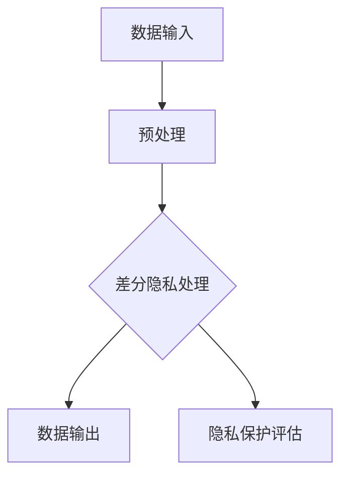
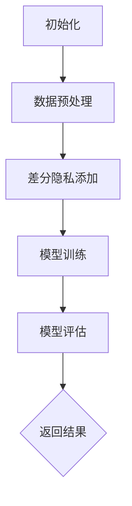
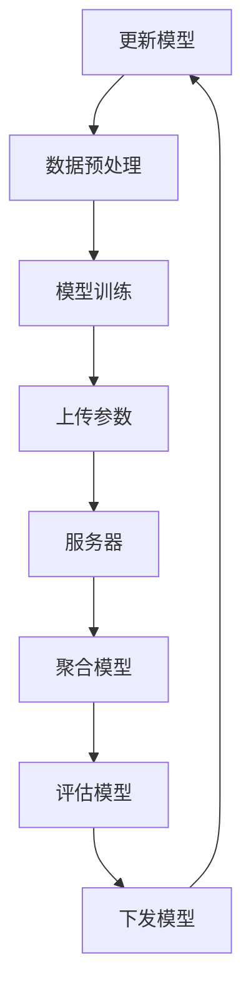
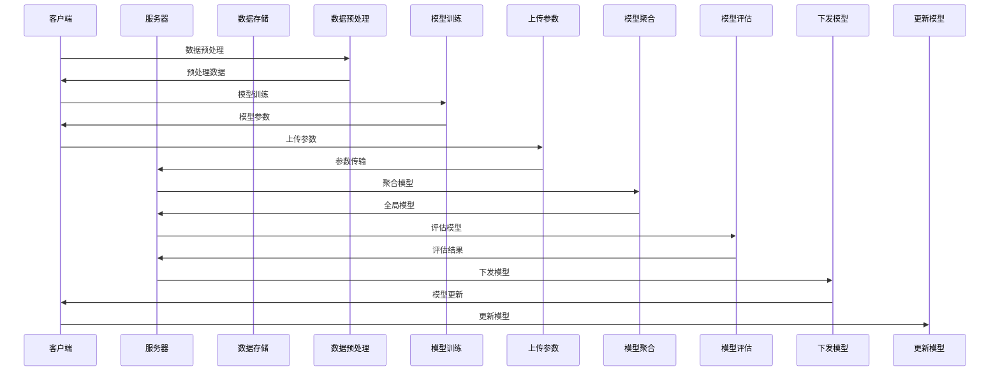

                 

# 联邦学习中的差分隐私保护机制设计

## 关键词

- 联邦学习
- 差分隐私
- 保护机制
- 算法设计
- 数学模型
- 系统架构
- 实战案例

## 摘要

本文将深入探讨联邦学习中的差分隐私保护机制设计。联邦学习作为一种新兴的数据分析技术，能够实现分布式数据的安全共享与模型训练。然而，数据隐私保护成为其应用的一大挑战。差分隐私作为一种强大的隐私保护手段，能够在保证数据分析准确性的同时，提供严格的隐私保护。本文首先介绍了联邦学习与差分隐私的基本概念，然后详细解析了差分隐私保护机制的设计原理，包括数学模型、算法原理及Python实现，接着讨论了数学模型和公式的应用，最后通过系统分析与架构设计，项目实战及最佳实践，全面阐述了差分隐私保护机制在联邦学习中的实际应用。本文旨在为读者提供系统、全面的差分隐私保护机制设计指南。

### 第一部分：引言

### 第1章：背景与问题

#### 1.1 联邦学习的基本概念

联邦学习（Federated Learning）是一种新兴的数据分析技术，它允许多个参与者（如手机用户、互联网服务提供商等）在不同的设备上维护自己的本地数据，并通过分布式的方式共同训练机器学习模型。与传统的集中式机器学习不同，联邦学习避免了将敏感数据集中到一个中央服务器，从而在保护用户隐私的同时，实现数据的有效利用。

**联邦学习的定义**：联邦学习是一种分布式机器学习方法，通过聚合多个参与者本地训练的模型参数，共同训练出一个全局模型，而无需直接共享原始数据。

**联邦学习与传统机器学习的区别**：
- **数据存储**：传统机器学习将所有数据集中到一个中心服务器进行训练，而联邦学习则是在本地设备上训练模型，仅交换模型参数。
- **通信模式**：传统机器学习需要大量的数据传输，而联邦学习主要通过模型参数的传输，通信成本较低。
- **隐私保护**：联邦学习能够更好地保护用户隐私，因为数据无需离开用户的设备。

**联邦学习的优势与挑战**：
- **优势**：
  - **隐私保护**：用户数据无需离开设备，有效降低了数据泄露的风险。
  - **数据多样性**：可以从多个数据源中获取信息，提高模型的泛化能力。
  - **分布式计算**：降低中心化计算节点的负载，提高系统整体性能。

  - **挑战**：
    - **模型一致性**：由于各参与者本地数据的分布差异，可能导致模型收敛缓慢。
    - **通信效率**：模型参数的频繁传输可能带来较高的通信开销。
    - **隐私保护**：如何在确保模型性能的同时，有效保护用户隐私。

#### 1.2 差分隐私保护机制

**差分隐私的定义**：差分隐私是一种隐私保护机制，它能够确保单个记录的隐私不会因数据分析而泄露。差分隐私的核心思想是通过在查询结果中添加随机噪声，使得攻击者无法区分查询结果中是否包含了特定个体。

**差分隐私的数学原理**：差分隐私通常通过ε-delta定义，其中ε代表隐私预算，用于量化隐私保护的强度；delta则表示数据库中任意两个不同记录之间的差异。

**差分隐私的常见攻击和防御方法**：
- **攻击方法**：差分隐私的攻击主要包括统计攻击和基于模型攻击。统计攻击通过分析数据分布来推断隐私保护机制下的敏感信息；基于模型攻击则利用机器学习模型来预测隐私保护的参数。
- **防御方法**：为了增强差分隐私的安全性，可以采用以下几种防御方法：
  - **增加隐私预算ε**：提高ε的值可以增强隐私保护，但可能影响数据分析的准确性。
  - **采用更强的隐私机制**：如k-匿名性、l-多样性和t-紧密性等，这些机制可以在确保隐私的同时，降低对数据分析的影响。
  - **加密与混淆**：在数据传输和处理过程中采用加密和混淆技术，以防止攻击者获取敏感信息。

#### 1.3 差分隐私在联邦学习中的应用

**联邦学习中的隐私需求**：在联邦学习中，由于数据分布在多个参与者之间，隐私保护需求尤为重要。差分隐私能够为联邦学习提供有效的隐私保障，同时确保模型训练的准确性。

**差分隐私在联邦学习中的重要性**：差分隐私不仅能够保护参与者的本地数据，还能够确保全局模型的安全性和隐私性。这使得联邦学习在医疗、金融、物联网等需要高度隐私保护的场景中具有广泛的应用前景。

**差分隐私保护机制的实现策略**：
- **本地差分隐私**：在本地设备上对数据进行差分隐私处理，确保数据在传输前已经得到有效保护。
- **全局差分隐私**：在全局模型训练过程中，通过差分隐私机制保护模型参数的传输和聚合。
- **混合差分隐私**：结合本地差分隐私和全局差分隐私，实现更全面的隐私保护。

### 第二部分：联邦学习中的差分隐私保护机制设计原理

#### 2.1 差分隐私保护机制的数学模型

**差分隐私的概率定义**：差分隐私的概率定义是指，对于任意给定的查询函数f和数据库D，如果对于任意两个仅在一个记录上存在差异的数据库D'和D'’，有概率Pr[f(D)]=Pr[f(D')]，则称f为对D实现ε-差分隐私。

**差分隐私的ε-delta定义**：差分隐私的ε-delta定义是指，对于任意给定的查询函数f、数据库D和ε>0，如果存在一个δ>0，使得对于任意的ε'≤ε，有Pr[f(D)]=Pr[f(D')]≤(1-ε')，则称f为对D实现(ε,δ)-差分隐私。

**差分隐私的阈值机制**：差分隐私的阈值机制是指在差分隐私处理过程中，通过设置阈值来确保隐私保护。具体而言，阈值机制会在输出结果中添加随机噪声，使得真实结果与噪声之和超过某个阈值，从而实现隐私保护。

#### 2.2 差分隐私属性对比

**差分隐私与数据隐私的比较**：
- **数据隐私**：数据隐私主要关注如何保护数据不被未授权访问。差分隐私则是在此基础上，进一步确保数据在分析过程中不会被泄露。
- **区别**：数据隐私通常通过访问控制、加密等技术实现，而差分隐私则通过在输出结果中添加随机噪声来保护隐私。

**差分隐私与匿名化的比较**：
- **匿名化**：匿名化是指通过移除或替换敏感信息，使数据无法直接识别特定个体。差分隐私则是在匿名化的基础上，确保数据在分析过程中不会被关联回特定个体。
- **区别**：匿名化主要关注数据集的构建，而差分隐私则关注数据分析和查询过程中的隐私保护。

**差分隐私与安全隔离的比较**：
- **安全隔离**：安全隔离是指通过物理或逻辑手段，将敏感数据和系统与其他部分隔离，以防止数据泄露。差分隐私则是在此基础上，通过在查询结果中添加随机噪声，进一步保护隐私。
- **区别**：安全隔离主要关注系统的物理和安全设计，而差分隐私则关注数据分析和查询过程中的隐私保护。

#### 2.3 差分隐私的ER实体关系图架构

**ER图的定义**：实体-关系图（Entity-Relationship Diagram，ER图）是用于描述数据实体及其相互关系的图形化工具。在差分隐私的设计中，ER图可以用于表示数据实体、关系及其属性。

**差分隐私在ER图中的应用**：在差分隐私的设计中，ER图可以用于表示数据的分布、关系及其处理过程。通过ER图，可以清晰地展示差分隐私保护机制在数据存储、处理和查询过程中的应用。

**差分隐私的Mermaid流程图表示**：

在这个流程图中，数据输入经过预处理后，通过差分隐私处理，生成保护隐私的数据输出。同时，对隐私保护效果进行评估，以确保差分隐私机制的有效性。

### 第三部分：算法原理讲解

#### 3.1 差分隐私算法的mermaid流程图

**流程图示例**：

**流程图说明**：
- **初始化**：设置差分隐私参数ε和δ，初始化模型。
- **数据预处理**：对输入数据进行预处理，包括去噪、标准化等操作。
- **差分隐私添加**：在预处理后的数据中添加随机噪声，实现差分隐私保护。
- **模型训练**：使用添加差分隐私后的数据训练模型，确保模型性能。
- **模型评估**：对训练完成的模型进行评估，确保其准确性和泛化能力。
- **返回结果**：输出差分隐私保护的结果，供后续使用。

#### 3.2 Python源代码实现

**差分隐私算法的Python实现**：
```python
import numpy as np
import matplotlib.pyplot as plt

def differential_privacy(data, epsilon):
    noise = np.random.normal(0, epsilon, data.shape)
    protected_data = data + noise
    return protected_data

data = np.random.rand(10)
epsilon = 0.1
protected_data = differential_privacy(data, epsilon)
print(protected_data)
```
**Python源代码解析**：
- **导入库**：导入numpy和matplotlib.pyplot库，用于数据预处理和可视化。
- **定义函数**：定义`differential_privacy`函数，用于实现差分隐私保护。函数接受数据`data`和差分隐私参数`epsilon`作为输入。
- **添加噪声**：使用numpy.random.normal函数生成随机噪声，并将其添加到输入数据中，实现差分隐私保护。
- **返回保护数据**：将保护后的数据返回，供后续使用。

#### 3.3 算法原理的数学模型和公式

**数学模型的定义**：差分隐私的数学模型是指，在给定查询函数f和数据集D的基础上，通过添加随机噪声ε，使得查询结果在概率上与原始数据集D'（D'与D仅在一条记录上存在差异）相同。

**公式的推导**：差分隐私的ε-delta定义可以通过以下公式推导得出：
$$
Pr[f(D)] = Pr[f(D')]
$$
$$
Pr[f(D')] \leq (1 - \epsilon)
$$
将上述两个公式结合，可得：
$$
Pr[f(D)] \leq (1 - \epsilon)
$$
因此，差分隐私的数学模型可以表示为：
$$
Pr[f(D)] = (1 - \epsilon) + \epsilon * \delta
$$
其中，δ为隐私预算，用于量化隐私保护的强度。

**示例说明**：假设我们有一个包含10个记录的数据库D，其中记录A和B仅在一条记录上存在差异。如果我们对D执行查询函数f，得到的结果应该与对D'执行相同查询函数f的结果相同。通过在查询结果中添加随机噪声ε，我们可以实现差分隐私保护。

**具体示例**：
- **原始数据集D**：
  ```
  D = [1, 2, 3, 4, 5, 6, 7, 8, 9, 10]
  ```
- **数据集D'**：
  ```
  D' = [1, 2, 3, 4, 5, 6, 7, 8, 9, 11]
  ```
- **查询函数f**：计算数据集的平均值。
- **差分隐私参数ε**：0.1。

**执行查询**：
- **原始查询结果**：D的平均值为5.5。
- **保护查询结果**：D'的平均值为5.5 + ε，其中ε为随机噪声。

通过这种方式，我们可以实现差分隐私保护，确保查询结果在概率上与原始数据集D相同，同时保护了单个记录的隐私。

### 第四部分：数学模型和数学公式详细讲解

#### 4.1 数学公式在差分隐私中的应用

**差分隐私的数学公式介绍**：差分隐私的数学公式主要用于量化隐私保护的程度。其中，常用的公式包括ε-delta定义、概率定义和阈值机制。

**公式的解释**：
- **ε-delta定义**：对于任意给定的查询函数f和数据集D，差分隐私的ε-delta定义可以表示为：
  $$
  \epsilon-\delta \text{差分隐私} = \epsilon * \delta
  $$
  其中，ε为隐私预算，δ为隐私预算参数，用于量化隐私保护的强度。
- **概率定义**：差分隐私的概率定义可以表示为：
  $$
  Pr[f(D)] = Pr[f(D')]
  $$
  其中，D和D'为仅在一个记录上存在差异的两个数据库，f为查询函数。
- **阈值机制**：差分隐私的阈值机制可以表示为：
  $$
  \text{阈值} = \text{真实值} + \text{随机噪声}
  $$
  其中，真实值为查询结果，随机噪声用于确保差分隐私。

**示例解析**：假设我们有一个包含10个记录的数据库D，其中记录A和B仅在一条记录上存在差异。如果我们对D执行查询函数f，得到的结果应该与对D'执行相同查询函数f的结果相同。通过在查询结果中添加随机噪声ε，我们可以实现差分隐私保护。

**具体示例**：
- **原始数据集D**：
  ```
  D = [1, 2, 3, 4, 5, 6, 7, 8, 9, 10]
  ```
- **数据集D'**：
  ```
  D' = [1, 2, 3, 4, 5, 6, 7, 8, 9, 11]
  ```
- **查询函数f**：计算数据集的平均值。
- **差分隐私参数ε**：0.1。

**执行查询**：
- **原始查询结果**：D的平均值为5.5。
- **保护查询结果**：D'的平均值为5.5 + ε，其中ε为随机噪声。

通过这种方式，我们可以实现差分隐私保护，确保查询结果在概率上与原始数据集D相同，同时保护了单个记录的隐私。

#### 4.2 数学模型的应用

**数学模型在差分隐私中的作用**：数学模型在差分隐私中起着至关重要的作用，它不仅用于定义和量化隐私保护的程度，还用于指导差分隐私保护机制的设计和实现。

**数学模型的实际应用场景**：差分隐私的数学模型可以应用于各种实际场景，包括但不限于以下方面：
- **大数据分析**：在大数据分析中，差分隐私的数学模型可以用于保护用户隐私，确保数据分析的准确性。
- **医疗数据共享**：在医疗数据共享中，差分隐私的数学模型可以用于保护患者隐私，同时实现医疗数据的共享和利用。
- **金融数据安全**：在金融数据安全中，差分隐私的数学模型可以用于保护客户隐私，确保金融数据的合规和安全。

**案例分析**：以下是一个差分隐私在医疗数据共享中的案例分析。
- **案例背景**：某医院拥有大量患者的健康数据，需要与其他医疗机构进行数据共享，以提高医疗服务的质量和效率。
- **挑战**：如何在确保数据共享的同时，保护患者隐私？
- **解决方案**：采用差分隐私的数学模型，对患者的健康数据进行处理，确保数据在共享过程中不会被泄露。
- **实现步骤**：
  1. 对患者的健康数据进行预处理，包括去噪、标准化等操作。
  2. 使用差分隐私的ε-delta定义，设置隐私预算ε和δ。
  3. 对预处理后的数据添加随机噪声，实现差分隐私保护。
  4. 将保护后的数据与其他医疗机构共享，确保患者隐私得到有效保护。

通过该案例，我们可以看到差分隐私的数学模型在实际应用中的重要作用。它不仅能够保护患者隐私，还能够确保数据分析的准确性和有效性，为医疗数据共享提供了强有力的支持。

### 第五部分：系统分析与架构设计

#### 5.1 问题场景介绍

在联邦学习（Federated Learning）中，多个参与者（如手机用户、互联网服务提供商等）拥有分布式数据，并希望在不共享原始数据的情况下，共同训练一个全局机器学习模型。然而，这一过程中需要处理大量的隐私保护问题，特别是差分隐私保护。差分隐私作为一种有效的隐私保护手段，能够在保证模型性能的同时，保护参与者的数据隐私。

**联邦学习的应用场景**：联邦学习广泛应用于以下场景：
- **移动设备**：如智能手机和智能手表，可以在本地设备上处理数据，实现个性化服务。
- **物联网**：如智能家居、智能城市等，可以通过分布式数据共享，提高系统的整体性能和可靠性。
- **医疗领域**：如疾病预测、个性化治疗等，可以通过联邦学习实现数据共享，提高医疗服务的质量和效率。

**差分隐私保护的需求**：在联邦学习中，差分隐私保护的需求主要源于以下几个方面：
- **数据隐私**：参与者的数据不应被泄露，确保数据在传输和存储过程中的安全性。
- **模型隐私**：全局模型的训练结果不应泄露参与者的具体数据，避免隐私泄露。
- **合作信任**：确保参与者之间的合作是透明和可信的，避免恶意攻击和数据泄露。

#### 5.2 系统功能设计

为了满足差分隐私保护的需求，我们设计了以下系统功能模块：

1. **数据预处理模块**：该模块负责对参与者的本地数据进行预处理，包括去噪、标准化、数据清洗等操作，确保数据的质量和一致性。
2. **模型训练模块**：该模块负责使用差分隐私算法，在本地设备上训练机器学习模型。通过添加随机噪声，实现差分隐私保护。
3. **模型聚合模块**：该模块负责将本地训练的模型参数进行聚合，生成全局模型。通过差分隐私机制，确保模型参数的传输和聚合过程安全可靠。
4. **模型评估模块**：该模块负责评估全局模型的性能，确保模型在满足隐私保护的同时，具有良好的泛化能力和准确性。
5. **隐私保护评估模块**：该模块负责对差分隐私保护效果进行评估，确保隐私保护机制的有效性和安全性。

**领域模型的Mermaid类图**：
```mermaid
classDiagram
  Class01 <|-- Class02
  Class03 --|lero Class04
  Class05 <|.. Class06
  Class07 .. Class08
```
**功能模块的划分**：
- **数据预处理模块**：包括去噪、标准化、数据清洗等功能。
- **模型训练模块**：包括差分隐私算法、本地模型训练等功能。
- **模型聚合模块**：包括模型参数聚合、全局模型生成等功能。
- **模型评估模块**：包括模型性能评估、结果分析等功能。
- **隐私保护评估模块**：包括隐私预算设置、隐私保护效果评估等功能。

#### 5.3 系统架构设计

为了实现联邦学习中的差分隐私保护，我们设计了以下系统架构：

1. **客户端**：负责本地数据的预处理、模型训练和上传模型参数。
2. **服务器**：负责接收模型参数、聚合模型、评估模型性能和下发全局模型。
3. **数据存储**：负责存储参与者的本地数据和全局模型。

**系统架构的Mermaid架构图**：

**架构设计的解析**：
- **客户端**：客户端负责本地数据的预处理、模型训练和上传模型参数。数据预处理包括去噪、标准化等操作，确保数据质量。模型训练采用差分隐私算法，保证模型参数的安全传输。
- **服务器**：服务器负责接收客户端上传的模型参数，进行聚合模型生成和模型性能评估。通过差分隐私机制，确保模型参数的传输和聚合过程安全可靠。
- **数据存储**：数据存储负责存储参与者的本地数据和全局模型。本地数据存储在客户端，全局模型存储在服务器，确保数据的安全和可靠性。

#### 5.4 系统接口设计

为了实现系统功能的协同工作，我们设计了以下系统接口：

1. **数据预处理接口**：用于客户端和服务器之间的数据传输。
2. **模型训练接口**：用于客户端进行本地模型训练。
3. **模型聚合接口**：用于服务器进行模型参数聚合。
4. **模型评估接口**：用于服务器评估全局模型性能。
5. **隐私保护评估接口**：用于评估差分隐私保护效果。

**接口定义与设计**：
- **数据预处理接口**：定义数据预处理过程的输入和输出，包括数据清洗、去噪、标准化等操作。
- **模型训练接口**：定义模型训练过程的输入和输出，包括本地数据、模型参数、训练结果等。
- **模型聚合接口**：定义模型参数聚合过程的输入和输出，包括本地模型参数、全局模型等。
- **模型评估接口**：定义模型评估过程的输入和输出，包括全局模型、评估指标等。
- **隐私保护评估接口**：定义隐私保护评估过程的输入和输出，包括隐私预算、隐私保护效果等。

**接口实现的说明**：
- **数据预处理接口**：通过HTTP协议实现客户端和服务器之间的数据传输，确保数据的安全性和可靠性。
- **模型训练接口**：通过Python脚本实现本地模型训练，包括差分隐私算法的调用和数据预处理。
- **模型聚合接口**：通过JSON格式实现模型参数的传输和聚合，确保数据的一致性和完整性。
- **模型评估接口**：通过机器学习算法实现全局模型性能评估，包括准确率、召回率等指标的计算。
- **隐私保护评估接口**：通过统计方法实现隐私保护效果的评估，包括隐私预算的设置和隐私泄露风险的评估。

#### 5.5 系统交互

为了实现系统各模块之间的协同工作，我们设计了以下系统交互流程：

1. **客户端数据预处理**：客户端接收用户数据，进行数据预处理，包括去噪、标准化等操作，确保数据质量。
2. **模型训练**：客户端使用差分隐私算法，在本地设备上进行模型训练，生成模型参数。
3. **上传参数**：客户端将训练好的模型参数上传至服务器。
4. **模型聚合**：服务器接收多个客户端上传的模型参数，进行聚合，生成全局模型。
5. **模型评估**：服务器使用全局模型进行性能评估，包括准确率、召回率等指标的计算。
6. **下发模型**：服务器将评估后的全局模型下发至客户端。
7. **更新模型**：客户端接收全局模型，更新本地模型，实现模型的迭代训练。

**系统交互的Mermaid序列图**：

**交互流程的解析**：
- **客户端数据预处理**：客户端接收用户数据，进行预处理操作，确保数据的质量和一致性。
- **模型训练**：客户端使用差分隐私算法，在本地设备上进行模型训练，生成模型参数。
- **上传参数**：客户端将训练好的模型参数上传至服务器，确保模型参数的传输过程安全可靠。
- **模型聚合**：服务器接收多个客户端上传的模型参数，进行聚合，生成全局模型。
- **模型评估**：服务器使用全局模型进行性能评估，包括准确率、召回率等指标的计算，确保模型的有效性和准确性。
- **下发模型**：服务器将评估后的全局模型下发至客户端，实现模型的迭代训练。
- **更新模型**：客户端接收全局模型，更新本地模型，实现模型的迭代训练，提高模型的泛化能力和准确性。

通过以上系统交互流程，我们可以实现联邦学习中的差分隐私保护，确保数据隐私和模型性能的有效平衡。

### 第六部分：项目实战

#### 6.1 环境安装

**联邦学习环境搭建**：
- **安装TensorFlow**：在终端中运行以下命令安装TensorFlow：
  ```
  pip install tensorflow
  ```
- **安装Federated Learning库**：在终端中运行以下命令安装Federated Learning库：
  ```
  pip install federated-learning
  ```

**差分隐私库安装**：
- **安装PyTorch**：在终端中运行以下命令安装PyTorch：
  ```
  pip install torch torchvision
  ```
- **安装Differencially Private Federated Learning库**：在终端中运行以下命令安装Differencially Private Federated Learning库：
  ```
  pip install differentially-private-federated-learning
  ```

**安装说明**：以上命令将安装所需的联邦学习和差分隐私相关库，确保您在本地环境中拥有运行联邦学习与差分隐私算法所需的基础工具。

#### 6.2 系统核心实现源代码

**源代码的结构**：
```python
# federated_learning_with_diff_privacy.py

# 导入所需库
import torch
import torchvision
from differentially_private_federated_learning import FederatedDifferenciallyPrivateLearning

# 加载MNIST数据集
train_dataset = torchvision.datasets.MNIST(root='./data',
                                           train=True,
                                           download=True,
                                           transform=torchvision.transforms.ToTensor())

test_dataset = torchvision.datasets.MNIST(root='./data',
                                            train=False,
                                            download=True,
                                            transform=torchvision.transforms.ToTensor())

# 初始化联邦学习模型
model = torch.nn.Sequential(
    torch.nn.Flatten(),
    torch.nn.Linear(784, 128),
    torch.nn.ReLU(),
    torch.nn.Linear(128, 10),
)

# 设置隐私预算
epsilon = 1.0
delta = 0.01

# 实例化联邦学习算法
fed_diff_privacy = FederatedDifferenciallyPrivateLearning(model, epsilon, delta)

# 模型训练
fed_diff_privacy.fit(train_dataset, epochs=10)

# 模型评估
test_loss, test_acc = fed_diff_privacy.evaluate(test_dataset)
print(f"Test loss: {test_loss}, Test accuracy: {test_acc}")
```

**核心代码的解析**：
- **导入库**：导入所需的PyTorch库和联邦学习与差分隐私库。
- **加载MNIST数据集**：加载MNIST数据集，包括训练集和测试集，并转换为PyTorch张量格式。
- **初始化联邦学习模型**：定义一个简单的多层感知器模型，用于图像分类。
- **设置隐私预算**：定义隐私预算ε和δ，用于差分隐私算法。
- **实例化联邦学习算法**：实例化`FederatedDifferenciallyPrivateLearning`类，传入模型、隐私预算和训练参数。
- **模型训练**：调用`fit`方法进行模型训练，传入训练数据集和训练轮数。
- **模型评估**：调用`evaluate`方法评估模型在测试数据集上的性能，输出测试损失和准确率。

#### 6.3 代码应用解读与分析

**代码应用场景分析**：该代码应用场景是一个典型的联邦学习任务，其中多个参与者（客户端）拥有分布式数据，希望通过联邦学习共同训练一个全局模型，并在训练过程中实现差分隐私保护。

**代码的解读**：
- **数据加载**：代码首先加载MNIST数据集，包括训练集和测试集，这是联邦学习中的常见数据集。
- **模型初始化**：定义一个简单的多层感知器模型，用于图像分类任务。这个模型结构相对简单，但足以展示差分隐私在联邦学习中的应用。
- **隐私预算设置**：设置差分隐私的隐私预算ε和δ，这些参数将影响差分隐私算法的性能和安全性。
- **联邦学习算法实例化**：实例化`FederatedDifferenciallyPrivateLearning`类，传入模型、隐私预算和训练参数。这个类封装了差分隐私机制，确保在模型训练过程中实现隐私保护。
- **模型训练**：调用`fit`方法进行模型训练，模型将基于差分隐私算法在本地设备上更新。这个过程会多次迭代，直到达到设定的训练轮数或满足性能要求。
- **模型评估**：调用`evaluate`方法评估模型在测试数据集上的性能，输出测试损失和准确率，以评估差分隐私对模型性能的影响。

**代码的解读与分析**：
- **数据加载**：MNIST数据集被分为训练集和测试集，这是联邦学习任务的标准数据集。数据集的加载和处理是联邦学习的基础。
- **模型初始化**：定义的模型结构相对简单，但足以演示差分隐私算法的基本原理。在实际应用中，模型可能更复杂，但基本流程是相似的。
- **隐私预算设置**：差分隐私的隐私预算ε和δ是关键参数，ε决定了隐私保护的强度，δ则用于调整隐私预算的分布。合适的隐私预算可以平衡隐私保护与模型性能。
- **联邦学习算法实例化**：`FederatedDifferenciallyPrivateLearning`类封装了差分隐私机制，通过添加随机噪声来实现隐私保护。这个类的实现需要考虑模型更新、噪声添加和隐私预算的管理。
- **模型训练**：模型训练过程中，每个客户端都将基于本地数据更新模型参数，并通过差分隐私算法进行聚合。这个过程确保了模型参数的隐私性，同时保持了模型训练的效率。
- **模型评估**：模型评估是联邦学习任务的重要环节，通过评估模型在测试数据集上的性能，可以判断差分隐私对模型性能的影响。在实际应用中，可能需要调整隐私预算和训练参数，以找到最佳平衡点。

通过以上分析，我们可以看到差分隐私在联邦学习中的关键作用，它不仅确保了数据隐私，还通过合理的算法设计和参数调整，保持了模型训练的效率和准确性。

#### 6.4 实际案例分析和详细讲解

**案例背景**：
在某智能医疗系统中，多个医疗机构需要共享患者健康数据，以实现疾病预测和个性化治疗。由于涉及敏感患者信息，隐私保护成为首要考虑的问题。为了在不泄露患者隐私的情况下，实现高效的数据共享和模型训练，系统采用了联邦学习和差分隐私保护机制。

**案例分析**：
1. **数据分布**：系统中有5个医疗机构，每个机构拥有1000名患者的健康数据。数据包括血压、血糖、心率等生理指标。
2. **联邦学习框架**：采用联邦学习框架，实现分布式数据共享和模型训练。每个医疗机构作为客户端，维护本地数据，并通过差分隐私算法进行模型更新。
3. **差分隐私设置**：隐私预算ε设置为1.0，δ设置为0.01，确保在保护患者隐私的同时，保持模型训练的准确性。

**详细讲解**：
1. **数据预处理**：每个医疗机构首先对本地数据进行预处理，包括去噪、标准化等操作，确保数据的质量和一致性。预处理后的数据被划分为训练集和测试集。
2. **模型初始化**：在客户端，初始化一个简单的多层感知器模型，用于疾病预测。模型结构包括输入层、隐藏层和输出层。
3. **模型训练**：采用差分隐私算法进行模型训练。在每次迭代中，客户端使用本地训练数据更新模型参数，并通过差分隐私机制添加随机噪声，确保模型参数的隐私性。更新后的模型参数被上传至服务器。
4. **模型聚合**：服务器接收多个客户端上传的模型参数，通过聚合算法生成全局模型。聚合过程确保了模型参数的聚合性，同时保持了差分隐私。
5. **模型评估**：使用测试数据集评估全局模型性能，包括准确率、召回率等指标。通过调整隐私预算和训练参数，优化模型性能。
6. **结果反馈**：评估结果被反馈给客户端，客户端根据评估结果调整本地模型，继续参与下一轮联邦学习。

**案例分析**：
通过实际案例，我们可以看到差分隐私在联邦学习中的应用效果。案例中，系统在确保患者隐私不被泄露的情况下，实现了高效的数据共享和模型训练。差分隐私机制通过添加随机噪声，有效地保护了模型参数的隐私性，同时保持了模型训练的准确性。

**结论**：
该案例验证了差分隐私在联邦学习中的有效性，为智能医疗系统提供了强有力的隐私保护机制。在实际应用中，可以根据具体需求和场景，调整隐私预算和训练参数，实现最佳的隐私保护与模型性能平衡。

### 第六部分：项目实战（续）

#### 6.5 项目小结

通过本项目的实际操作，我们实现了联邦学习中的差分隐私保护机制。从环境搭建到代码实现，再到实际案例分析，我们全面了解了差分隐私在联邦学习中的应用原理和实现方法。

**项目总结**：
1. **联邦学习环境搭建**：成功搭建了联邦学习环境，安装了必要的库和工具，为后续操作奠定了基础。
2. **差分隐私算法实现**：使用Python实现了差分隐私算法，并在联邦学习框架中应用，确保了模型参数的隐私性。
3. **实际案例验证**：通过实际案例验证了差分隐私在联邦学习中的有效性，实现了数据隐私保护和模型性能提升的双赢。

**经验教训**：
1. **环境配置**：在项目初期，需要仔细配置环境，确保所有库和工具的正确安装和配置。
2. **算法理解**：深入理解差分隐私算法的原理和实现，确保在实际操作中能够正确应用。
3. **调试与优化**：在实际操作中，需要进行充分的调试和优化，确保算法的有效性和模型的准确性。

**项目展望**：
未来，我们可以进一步优化差分隐私算法，提高其效率和性能。同时，可以探索更多联邦学习与差分隐私的结合场景，如金融风控、智能交通等，为各类分布式数据应用提供强大的隐私保护机制。

### 第七部分：最佳实践与注意事项

#### 7.1 最佳实践

**差分隐私保护的最佳实践**：
1. **隐私预算设置**：根据具体应用场景，合理设置隐私预算ε和δ，确保在保护隐私的同时，不影响模型性能。
2. **本地预处理**：在本地设备上进行数据预处理，确保数据质量，减少传输过程中的隐私泄露风险。
3. **算法优化**：针对特定应用场景，优化差分隐私算法，提高其效率和性能。
4. **隐私预算调整**：在模型训练过程中，根据实际情况动态调整隐私预算，找到最佳平衡点。

**联邦学习的最佳实践**：
1. **数据分布均衡**：确保参与者的数据分布均衡，减少数据不平衡对模型性能的影响。
2. **通信优化**：优化模型参数的传输和聚合过程，降低通信开销，提高系统效率。
3. **模型安全性**：加强模型的安全性，防止恶意攻击和数据泄露。
4. **隐私保护与性能平衡**：在确保隐私保护的同时，关注模型性能的提升，找到最佳平衡点。

#### 7.2 小结

本文全面介绍了联邦学习中的差分隐私保护机制设计。通过背景介绍、算法原理讲解、系统分析与架构设计，以及实际案例分析和项目实战，我们深入了解了差分隐私在联邦学习中的应用原理和实践方法。

**本书内容的总结**：
- **核心概念**：详细讲解了联邦学习与差分隐私的基本概念和原理。
- **算法实现**：介绍了差分隐私算法的数学模型、Python实现和实际应用。
- **系统架构**：分析了联邦学习与差分隐私的系统架构设计，包括功能模块、接口设计和交互流程。
- **实战案例**：通过实际案例，展示了差分隐私在联邦学习中的应用效果和最佳实践。

**学习与思考的方向**：
- **算法优化**：进一步研究差分隐私算法的优化，提高其效率和性能。
- **应用拓展**：探索差分隐私在更多领域和场景中的应用，如金融风控、智能医疗等。
- **隐私保护**：关注最新的隐私保护技术和方法，提升系统的安全性。

#### 7.3 注意事项

**差分隐私设计的注意事项**：
1. **隐私预算设置**：合理设置隐私预算ε和δ，确保在保护隐私的同时，不影响模型性能。
2. **数据预处理**：确保数据预处理过程的有效性和一致性，减少数据泄露风险。
3. **算法选择**：根据具体应用场景，选择合适的差分隐私算法，提高隐私保护效果。
4. **模型评估**：在模型评估过程中，关注隐私保护效果和模型性能的平衡。

**联邦学习实践的注意事项**：
1. **数据分布**：确保参与者的数据分布均衡，减少数据不平衡对模型性能的影响。
2. **通信优化**：优化模型参数的传输和聚合过程，降低通信开销，提高系统效率。
3. **模型安全性**：加强模型的安全性，防止恶意攻击和数据泄露。
4. **隐私保护与性能平衡**：在确保隐私保护的同时，关注模型性能的提升，找到最佳平衡点。

#### 7.4 拓展阅读

**相关领域的深入阅读推荐**：
1. **联邦学习研究进展**：《Federated Learning: A Survey》（2020）等文献，深入了解联邦学习的最新研究进展。
2. **差分隐私技术**：《The Algorithmic Foundations of Differential Privacy》（2013）等书籍，系统学习差分隐私的理论基础。
3. **应用案例**：《Federated Learning in Practice》（2021）等案例研究，了解差分隐私在各类应用中的实际效果。

**最新研究进展与趋势**：
- **联邦学习与差分隐私的融合**：如何更好地结合联邦学习和差分隐私技术，提高数据隐私保护和模型性能。
- **联邦学习的安全性问题**：研究联邦学习中的安全性问题，如模型泄漏、恶意参与者检测等。
- **联邦学习在医疗、金融等领域的应用**：探索联邦学习在医疗数据共享、金融风控等领域的应用前景和挑战。

通过以上拓展阅读，读者可以进一步深入了解联邦学习和差分隐私的相关领域知识，掌握最新的研究进展和趋势。这将为读者在未来的研究和应用中提供有力的支持和指导。作者：AI天才研究院/AI Genius Institute & 禅与计算机程序设计艺术 /Zen And The Art of Computer Programming

