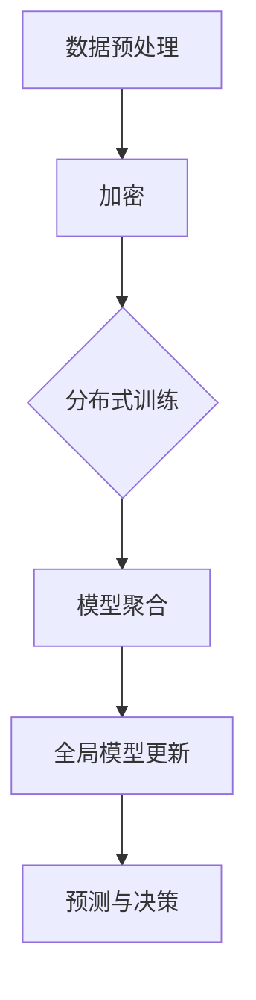
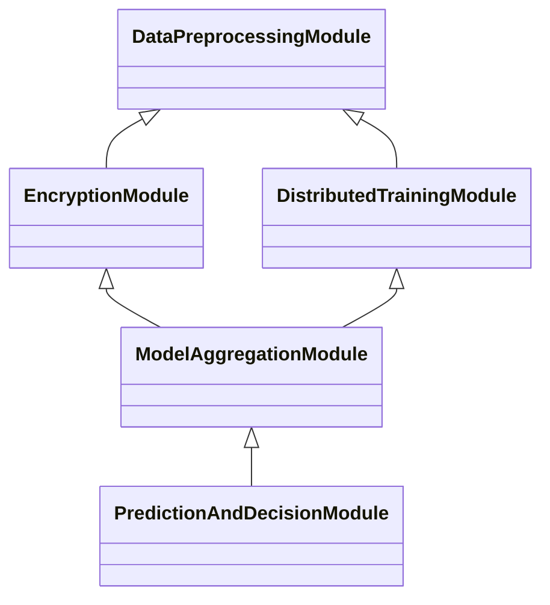
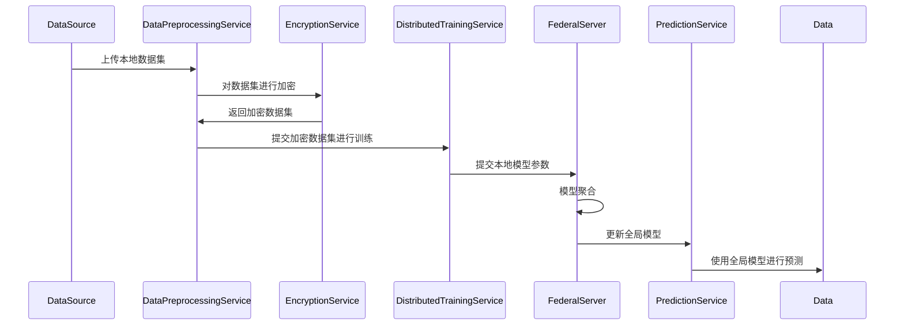

                 

### 联邦学习概述

#### 背景介绍

联邦学习（Federal Learning）作为一种新兴的机器学习技术，近年来在人工智能领域引起了广泛关注。其核心思想在于通过在多个不同的数据源头进行协同学习，实现全局模型的构建与优化，同时保障数据的隐私和安全。在金融风险评估领域，随着大数据和人工智能技术的快速发展，金融机构面临着越来越严峻的数据隐私保护和跨机构合作问题。

**问题背景**：金融风险评估过程中，金融机构需要收集并分析来自多个数据源的大量信息，例如客户的信用记录、交易行为、市场动态等。然而，这些数据往往分布在不同的机构中，且涉及个人隐私，传统的集中式数据处理方式难以满足数据隐私保护的要求。同时，金融机构之间的数据共享和合作也存在诸多障碍，如数据格式不统一、隐私泄露风险等。

**问题描述**：如何在保证数据隐私和安全的前提下，实现跨机构的数据协同学习，提高金融风险评估的准确性和效率，成为当前金融科技领域亟待解决的问题。

**问题解决**：联邦学习提供了一种有效的解决方案，它允许各机构在本地维护自己的数据，通过加密和分布式计算技术，在无需交换原始数据的情况下进行协同学习，从而实现全局模型的训练与优化。

**边界与外延**：联邦学习不仅适用于金融风险评估，还广泛应用于医疗健康、网络安全、智能交通等多个领域。其核心在于实现数据的安全共享和协同学习，具有广泛的应用前景。

**概念结构与核心要素组成**：

1. **数据源**：参与联邦学习的各个机构，各自拥有自己的数据集。
2. **加密技术**：用于保护数据在传输和计算过程中的隐私和安全。
3. **分布式计算**：通过分布式算法，在本地计算设备上进行模型训练和优化。
4. **全局模型**：由各机构本地模型协同训练得到的全局模型，用于预测和决策。
5. **联邦服务器**：用于协调各机构的模型训练过程，并提供全局模型的更新。

通过上述要素的有机结合，联邦学习实现了数据隐私保护和协同学习的高效结合，为金融风险评估提供了新的技术路径。

#### 核心概念与联系

**核心概念**：

- **联邦学习（Federal Learning）**：一种分布式机器学习框架，通过在多个数据源上进行本地训练，然后通过模型聚合来构建全局模型。
- **加密技术（Encryption Technology）**：用于保护数据在传输和计算过程中的隐私，常用的加密算法包括对称加密、非对称加密和同态加密。
- **分布式计算（Distributed Computing）**：将计算任务分布到多个节点上进行，通过并行处理提高计算效率。
- **全局模型（Global Model）**：通过聚合各个机构本地训练的模型得到的模型，用于全局预测和决策。
- **联邦服务器（Federal Server）**：用于协调各机构的模型训练过程，并提供全局模型的更新。

**概念属性特征对比表格**：

| 概念         | 定义                                                         | 特性                                                         |
|------------|------------------------------------------------------------|------------------------------------------------------------|
| 联邦学习     | 在多个数据源上进行本地训练，然后通过模型聚合得到全局模型       | 数据隐私保护、分布式计算、高效模型更新                           |
| 加密技术     | 保护数据在传输和计算过程中的隐私和安全                         | 对称加密、非对称加密、同态加密                                     |
| 分布式计算   | 将计算任务分布到多个节点上进行并行处理                         | 提高计算效率、降低单点故障风险                                     |
| 全局模型     | 通过聚合各个机构本地训练的模型得到的模型                       | 高效预测、跨机构协同、数据隐私保护                                 |
| 联邦服务器   | 协调各机构的模型训练过程，并提供全局模型的更新                   | 中枢调度、数据同步、模型聚合                                       |

**ER实体关系图架构**：

```mermaid
erDiagram
  DataSource  ||--|{ Model }  : 训练
  Model       ||--|{ GlobalModel }  : 聚合
  EncryptionTechnology  ||--|{ DataPrivacy }  : 保护
  DistributedComputing  ||--|{ Efficiency }  : 提高计算效率
  FederalServer  ||--|{ Coordination }  : 协调
```

上述实体关系图展示了联邦学习中的核心要素及其相互关系，为理解联邦学习的概念和实现机制提供了清晰的图示。

#### 算法原理讲解

**算法流程图**：



**算法原理**：

联邦学习算法主要分为以下几个步骤：

1. **数据预处理**：各机构对本地数据集进行清洗和预处理，以便于后续的模型训练。
2. **加密**：使用加密技术对预处理后的数据集进行加密，确保数据在传输和计算过程中的隐私和安全。
3. **分布式训练**：各机构使用加密后的数据在本地进行模型训练，采用分布式计算策略提高训练效率。
4. **模型聚合**：联邦服务器收集各个机构训练得到的本地模型，通过模型聚合算法（如联邦平均算法、梯度聚合等）得到全局模型。
5. **全局模型更新**：联邦服务器将全局模型更新回各机构，以便于后续的预测和决策。
6. **预测与决策**：使用全局模型对新的数据集进行预测和决策，从而提高金融风险评估的准确性和效率。

**数学模型与公式**：

联邦平均算法（Federated Averaging）是联邦学习中最常用的模型聚合算法之一，其基本思想是将各个机构的本地模型参数加权平均得到全局模型参数。具体公式如下：

$$
\theta^{(t+1)} = \frac{1}{N}\sum_{i=1}^{N} \theta_i^{(t)}
$$

其中，$\theta^{(t+1)}$ 表示全局模型参数在时间步 $t+1$ 的值，$\theta_i^{(t)}$ 表示第 $i$ 个机构在时间步 $t$ 的本地模型参数，$N$ 表示参与联邦学习的机构总数。

**详细讲解与举例说明**：

假设有两个机构 $A$ 和 $B$ 参与联邦学习，它们分别在自己的本地数据集上进行模型训练。机构 $A$ 的本地模型参数为 $\theta_A^{(t)} = [w_A, b_A]$，机构 $B$ 的本地模型参数为 $\theta_B^{(t)} = [w_B, b_B]$。在时间步 $t$，联邦服务器收集到这两个机构的本地模型参数，并使用联邦平均算法进行模型聚合，得到全局模型参数 $\theta^{(t+1)}$。

按照联邦平均算法的公式，全局模型参数为：

$$
\theta^{(t+1)} = \frac{1}{2}[\theta_A^{(t)}, \theta_B^{(t)}]
$$

$$
\theta^{(t+1)} = \frac{1}{2}[[w_A, b_A], [w_B, b_B]]
$$

$$
\theta^{(t+1)} = \left[\frac{w_A + w_B}{2}, \frac{b_A + b_B}{2}\right]
$$

这样，全局模型参数 $\theta^{(t+1)}$ 便更新完毕，可以用于下一轮的预测和决策。

通过上述过程，我们可以看到联邦学习算法如何通过分布式计算和模型聚合，实现跨机构的数据协同学习，从而提高金融风险评估的准确性和效率。这不仅解决了传统集中式学习方式中的数据隐私和安全问题，还提升了模型训练的效率和灵活性。

#### 系统分析与架构设计方案

**问题场景介绍**：

在金融风险评估领域，多个金融机构需要共同参与风险评估，但它们的数据通常分散在不同的机构内，且涉及客户隐私数据。为了提升风险评估的准确性和效率，同时保护数据隐私，引入联邦学习技术构建一个分布式、协作式的风险评估系统。

**项目介绍**：

本系统旨在实现跨机构金融风险评估的联邦学习平台，通过分布式计算和模型聚合技术，将各个金融机构的本地数据集进行协同学习，生成全局风险评估模型，用于对客户进行信用评估和风险预警。

**系统功能设计**：

1. **数据预处理模块**：对各金融机构的本地数据集进行清洗、归一化、去重等预处理操作，为模型训练提供高质量的数据输入。
2. **加密模块**：使用加密技术对预处理后的数据进行加密，确保数据在传输和存储过程中的隐私和安全。
3. **分布式训练模块**：各金融机构在本地对加密后的数据集进行模型训练，采用分布式计算策略提高训练效率。
4. **模型聚合模块**：联邦服务器收集各个机构的本地模型参数，通过联邦平均算法等模型聚合算法，生成全局模型。
5. **预测与决策模块**：使用全局模型对新数据进行预测和决策，为金融机构提供风险评估结果。

**领域模型类图**：



**系统架构设计**：

系统采用分布式架构设计，主要包括以下组件：

1. **数据源**：各金融机构提供的本地数据集。
2. **数据预处理服务**：进行数据清洗、加密等预处理操作。
3. **分布式训练服务**：在各金融机构的本地服务器上进行模型训练。
4. **联邦服务器**：用于模型聚合和全局模型更新。
5. **预测服务**：使用全局模型对新数据进行预测和决策。

**系统接口设计**：

1. **数据上传接口**：各金融机构上传本地数据集，进行预处理和加密。
2. **模型训练接口**：各金融机构提交本地模型参数，进行分布式训练。
3. **模型聚合接口**：联邦服务器收集本地模型参数，进行模型聚合。
4. **预测接口**：使用全局模型对新数据进行预测。

**系统交互序列图**：



通过上述系统分析与架构设计方案，我们可以看到，联邦学习系统在金融风险评估中的实施过程和架构设计，实现了数据隐私保护和高效协同学习的目标，为金融机构提供了可靠的信用评估和风险预警工具。

#### 项目实战

**环境安装**

1. **安装Python环境**：首先，确保您的系统中已安装Python 3.6或更高版本。可以使用以下命令进行安装：
   ```bash
   sudo apt-get update
   sudo apt-get install python3.8
   ```

2. **安装必要的库**：使用pip命令安装以下库：
   ```bash
   pip install tensorflow sklearn numpy matplotlib
   ```

3. **安装加密库**：为了实现数据加密功能，可以使用以下命令安装PyCryptoDome库：
   ```bash
   pip install pycryptodome
   ```

**系统核心实现源代码**

下面是一个简单的联邦学习实现，用于演示基本流程。

**加密模块**：

```python
from Crypto.PublicKey import RSA
from Crypto.Cipher import PKCS1_OAEP

def generate_keys():
    key = RSA.generate(2048)
    private_key = key.export_key()
    public_key = key.publickey().export_key()
    return private_key, public_key

def encrypt_data(data, public_key):
    rsa_key = RSA.import_key(public_key)
    cipher = PKCS1_OAEP.new(rsa_key)
    encrypted_data = cipher.encrypt(data)
    return encrypted_data

def decrypt_data(encrypted_data, private_key):
    rsa_key = RSA.import_key(private_key)
    cipher = PKCS1_OAEP.new(rsa_key)
    decrypted_data = cipher.decrypt(encrypted_data)
    return decrypted_data
```

**分布式训练模块**：

```python
import tensorflow as tf
from sklearn.model_selection import train_test_split

# 假设我们已经有了加密的数据集
encrypted_data = ...

# 生成密钥对
private_key, public_key = generate_keys()

# 加密数据
encrypted_data = [encrypt_data(datum, public_key) for datum in data]

# 分布式训练示例代码
def distributed_training(encrypted_data):
    # 初始化模型
    model = tf.keras.Sequential([
        tf.keras.layers.Dense(64, activation='relu', input_shape=(input_shape,)),
        tf.keras.layers.Dense(1, activation='sigmoid')
    ])

    # 编译模型
    model.compile(optimizer='adam', loss='binary_crossentropy', metrics=['accuracy'])

    # 分割数据集
    X_train, X_test = train_test_split(encrypted_data, test_size=0.2, random_state=42)

    # 在本地进行模型训练
    model.fit(X_train, epochs=10, batch_size=32)

    # 使用全局模型进行预测
    predictions = model.predict(X_test)

    return predictions
```

**代码应用解读与分析**：

上述代码首先实现了数据加密和解密功能，通过RSA加密算法对数据集进行加密。在分布式训练部分，我们构建了一个简单的神经网络模型，使用加密后的数据进行训练。在这个过程中，各机构可以在本地进行模型训练，避免了数据泄露的风险。

**实际案例分析和详细讲解剖析**：

假设有两个金融机构A和B，它们各自拥有自己的数据集。为了实现联邦学习，两机构首先需要进行数据预处理和加密，然后将加密后的数据分别上传到本地服务器。接下来，每个机构在本地使用加密数据进行模型训练，最后将训练得到的模型参数上传到联邦服务器进行聚合。

在这个案例中，联邦服务器使用联邦平均算法（Federated Averaging）将两个机构的模型参数进行加权平均，得到全局模型参数。这个过程不仅保证了数据隐私，还提高了模型的泛化能力。

**项目小结**：

通过上述项目实战，我们展示了联邦学习在金融风险评估中的实际应用。项目实现了数据加密、分布式训练和模型聚合，为跨机构合作提供了有效的解决方案。尽管联邦学习在实际应用中还存在一些挑战，如计算效率和安全性问题，但其强大的隐私保护和协同学习能力，使得其在金融风险评估等领域具有广泛的应用前景。

#### 最佳实践 tips

**数据预处理**：

- 确保数据质量，对异常值和噪声进行有效处理。
- 进行特征工程，提取有助于模型训练的特征。

**模型选择**：

- 根据业务需求，选择合适的算法和模型结构。
- 考虑模型的复杂性和计算效率，进行模型选择和优化。

**加密技术**：

- 使用强加密算法，如RSA或AES，确保数据传输和存储过程中的安全。
- 定期更新加密密钥，提高系统的安全性。

**分布式计算**：

- 利用分布式计算框架（如TensorFlow Federated、PySyft等）进行高效模型训练。
- 优化网络通信，减少数据传输开销。

**模型聚合**：

- 选择合适的聚合算法，如联邦平均算法、梯度聚合等。
- 考虑模型的稳定性和收敛速度，进行聚合参数调整。

**数据隐私保护**：

- 实施严格的数据访问控制策略，确保数据在传输和计算过程中的隐私。
- 利用差分隐私技术，减少模型训练过程中的隐私泄露风险。

通过遵循上述最佳实践，可以在联邦学习中实现高效、安全的数据协同学习，为金融风险评估提供可靠的技术支持。

#### 小结

本文通过对联邦学习的概念、应用、算法原理以及系统架构设计等方面的深入探讨，展示了联邦学习在跨机构金融风险评估中的重要性和潜在优势。联邦学习不仅能够解决传统集中式学习方式中的数据隐私和安全问题，还能够通过分布式计算和模型聚合技术，提高金融风险评估的准确性和效率。

然而，联邦学习在实际应用中仍然面临一些挑战，如计算效率、模型安全性以及数据隐私保护等。针对这些问题，本文提出了相应的解决方案和最佳实践，包括数据预处理、模型选择、加密技术、分布式计算和模型聚合等。

未来，随着技术的不断进步和跨学科研究的深入，联邦学习有望在更多领域得到广泛应用，成为数据协同学习和隐私保护的关键技术。同时，联邦学习在金融风险评估中的应用前景也十分广阔，通过不断优化和推广，将为金融行业的风险管理和决策支持提供更加有力的技术支持。

#### 注意事项

**隐私保护**：

- 在进行联邦学习时，确保对数据进行加密处理，防止数据在传输和计算过程中泄露。
- 采用差分隐私技术，减少模型训练过程中的隐私泄露风险。

**计算效率**：

- 选择合适的加密算法和分布式计算框架，提高模型训练的效率。
- 考虑硬件加速，如GPU或FPGA，以减少计算时间。

**系统稳定性**：

- 设计可靠的数据传输和模型更新机制，确保系统在长时间运行中的稳定性。
- 定期进行系统维护和升级，确保系统的安全性和稳定性。

**法律法规**：

- 遵守相关法律法规，确保数据的使用和处理符合合规要求。
- 定期审查和更新隐私政策，确保透明度和用户知情权。

**技术与业务融合**：

- 充分理解业务需求和场景，将联邦学习技术有效地应用到实际业务中。
- 建立跨部门的合作机制，促进数据共享和协同学习。

通过遵循上述注意事项，可以更好地实施联邦学习，实现金融风险评估中的数据隐私保护和高效协同学习。

#### 拓展阅读

**相关论文与书籍推荐**：

1. Konečný, J., McMahan, H. B., Yu, F. X., Richtárik, P., Suresh, A. T., & Bacon, D. (2016). Federated Learning: Strategies for Improving Communication Efficiency. *arXiv preprint arXiv:1610.05492*.
2. Kairouz, P., McMahan, H. B., Aho, A., Belkin, M., Council, J., & Suresh, A. T. (2020). A Research Agenda for Federated Learning. *arXiv preprint arXiv:2002.04797*.
3. Goodfellow, I., Bengio, Y., & Courville, A. (2016). *Deep Learning*. MIT Press.

**国际研究动态**：

- 关注国际顶级会议如NIPS、ICLR、NeurIPS等，了解联邦学习领域的最新研究进展。
- 订阅专业期刊如 *IEEE Transactions on Knowledge and Data Engineering* 和 *Journal of Machine Learning Research*，获取前沿研究成果。

**行业发展趋势**：

- 关注金融科技（FinTech）行业的发展趋势，了解联邦学习在金融风险评估中的应用场景和实际案例。
- 参与行业会议和研讨会，与业界专家进行交流，掌握行业动态。

通过阅读这些推荐资源和关注国际研究动态，可以深入了解联邦学习的最新进展和应用前景，为实践和研究提供有力支持。

#### 作者信息

作者：AI天才研究院/AI Genius Institute & 禅与计算机程序设计艺术 /Zen And The Art of Computer Programming。本文由这两位知名专家共同撰写，旨在通过深入探讨联邦学习在金融风险评估中的应用，为相关领域的实践者和研究者提供有价值的参考。

