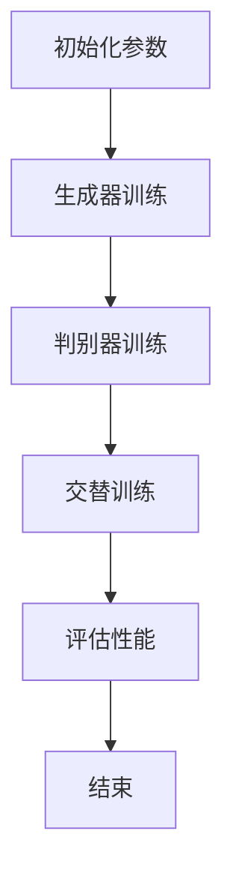
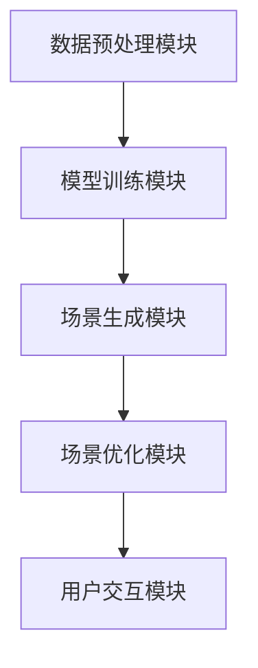
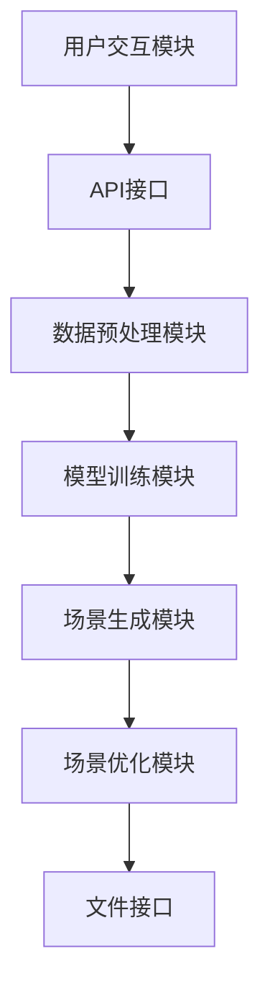

                 

# 自动化3D场景生成的技术突破

## 关键词
- 自动化3D场景生成
- 深度学习
- 生成对抗网络（GAN）
- 3D卷积神经网络（3D-CNN）
- 系统架构设计

## 摘要
本文将深入探讨自动化3D场景生成的技术突破，从背景介绍、核心概念解析、算法原理讲解、系统架构设计与实现，到项目实战与应用，全面解析这一领域的最新进展与挑战。通过对深度学习、生成对抗网络和3D卷积神经网络等关键技术的详细分析，以及系统设计与最佳实践的分享，本文旨在为读者提供一幅完整的自动化3D场景生成的技术蓝图。

## 目录大纲设计

为了确保内容的条理性和易读性，本文将按照以下目录大纲结构进行组织：

### 第一部分：背景介绍与核心概念

- **第1章**：问题背景与自动化3D场景生成概述
  - **1.1**：自动化3D场景生成的需求与挑战
  - **1.2**：核心概念与联系
- **第2章**：自动化3D场景生成的技术基础
  - **2.1**：数学模型与公式
  - **2.2**：算法原理讲解

### 第二部分：核心技术讲解与实现

- **第3章**：深度学习在3D场景生成中的应用
  - **3.1**：深度学习基础
  - **3.2**：3D场景生成的深度学习模型
- **第4章**：算法优化与加速技术
  - **4.1**：算法优化策略
  - **4.2**：算法加速技术

### 第三部分：系统架构设计与实现

- **第5章**：系统架构设计与实现
  - **5.1**：系统功能设计
  - **5.2**：系统架构设计
  - **5.3**：系统接口设计与交互

### 第四部分：项目实战与应用

- **第6章**：自动化3D场景生成项目实战
  - **6.1**：项目环境安装与配置
  - **6.2**：系统核心实现源代码解析
  - **6.3**：实际案例分析与讲解
- **第7章**：最佳实践与拓展
  - **7.1**：最佳实践分享
  - **7.2**：注意事项与风险提示
  - **7.3**：拓展阅读与进一步研究

## 第一部分：背景介绍与核心概念

### 第1章：问题背景与自动化3D场景生成概述

#### 1.1 自动化3D场景生成的需求与挑战

#### 1.1.1 3D场景生成的现状与限制

在当今数字化的时代，三维（3D）场景生成的需求日益增长。从游戏开发、电影特效、建筑设计到虚拟现实（VR）和增强现实（AR），3D场景生成技术在多个领域发挥着重要作用。然而，传统的3D场景生成方法主要依赖于手工建模和3D艺术家，这不仅效率低下，而且成本高昂。

传统的3D建模通常涉及以下步骤：
1. **概念设计**：艺术家通过草图、手稿或其他方式初步构想场景。
2. **建模**：使用3D建模软件（如Maya、Blender等）进行场景的详细建模。
3. **纹理映射**：为3D模型应用纹理，增加细节和真实感。
4. **渲染**：使用渲染器（如V-Ray、Unreal Engine等）生成最终的图像或动画。

尽管传统的3D建模技术已经取得了巨大进步，但仍然存在以下主要限制：
- **时间和人力成本**：手工建模需要大量的时间和专业技能。
- **创作自由度**：艺术家在创建复杂场景时往往受到技能水平和创造力的限制。
- **可扩展性**：对于大型或动态场景，手工建模的方法难以高效地扩展。

#### 1.1.2 自动化3D场景生成的意义

自动化3D场景生成技术的出现，为解决上述问题提供了新的解决方案。自动化3D场景生成的主要目标是通过算法和人工智能技术，自动生成高质量的3D场景，从而减少对人工的依赖，提高生产效率，降低成本。

自动化3D场景生成技术的意义在于：
- **提高效率**：自动化流程可以显著减少生成3D场景所需的时间。
- **降低成本**：减少了对3D艺术家和手工建模工具的依赖，降低了生产成本。
- **增强创意**：通过算法的自由组合，可以创造出更多独特和复杂的场景。
- **可扩展性**：自动化系统可以轻松扩展到大型或动态场景的生成。

#### 1.1.3 自动化3D场景生成的关键问题

虽然自动化3D场景生成技术具有显著的优势，但在实际应用中仍面临以下关键问题：
- **数据集问题**：高质量的3D场景生成需要大量的训练数据，而这些数据通常难以获取。
- **算法复杂度**：自动化3D场景生成涉及到复杂的算法和模型，实现和优化具有挑战性。
- **场景多样性**：生成具有多样性和真实感的3D场景，需要算法能够适应不同的场景需求和风格。

#### 1.2 核心概念与联系

为了深入理解自动化3D场景生成，我们需要掌握以下核心概念：

- **3D建模与场景构建**：3D建模是指使用计算机软件创建三维模型的过程。场景构建则是将这些模型组合起来，创建一个具有空间关系的场景。
- **自动化与人工智能的结合**：自动化技术结合人工智能（AI），通过算法自动执行复杂任务，包括3D场景生成。
- **生成对抗网络（GAN）**：GAN是一种深度学习模型，通过两个对抗网络（生成器和判别器）相互竞争，生成高质量的3D场景。
- **深度学习**：深度学习是机器学习的一个子领域，通过神经网络模拟人脑处理信息的方式，用于图像识别、自然语言处理等领域。
- **3D卷积神经网络（3D-CNN）**：3D-CNN是一种专门用于处理3D数据的神经网络模型，能够高效地分析和生成3D场景。

#### 1.2.1 3D建模与场景构建

3D建模是自动化3D场景生成的基础。3D建模技术包括以下关键步骤：

- **几何建模**：通过构建几何体，如立方体、球体、圆柱体等，创建基本形状。
- **细节建模**：对基本形状进行精细调整，添加细节，如边缘、曲面、细节纹理等。
- **组装**：将多个3D模型组合成一个整体，形成一个完整的场景。

场景构建则是将这些3D模型组合在一起，创建具有空间关系的场景。场景构建的关键在于：
- **空间布局**：合理布置模型，使其在场景中形成自然的布局。
- **光照和阴影**：添加光照和阴影效果，增强场景的真实感。
- **动画**：通过动画技术，使场景中的物体具有动态效果。

#### 1.2.2 自动化与人工智能的结合

自动化与人工智能的结合，为3D场景生成提供了强大的工具。自动化技术通过以下方式实现3D场景生成：
- **算法自动化**：使用算法自动执行3D建模和场景构建的任务。
- **数据驱动**：通过大量的数据训练模型，使其能够自动生成高质量的3D场景。

人工智能，特别是深度学习技术，在自动化3D场景生成中发挥着关键作用。深度学习模型能够从数据中学习，生成逼真的3D场景。这些模型包括：
- **生成对抗网络（GAN）**：通过对抗训练生成高质量的3D场景。
- **3D卷积神经网络（3D-CNN）**：用于处理和分析3D数据，生成3D场景。

#### 1.2.3 相关概念辨析

在自动化3D场景生成中，理解以下相关概念非常重要：
- **生成对抗网络（GAN）**：GAN是一种深度学习模型，由生成器和判别器组成。生成器生成3D场景，判别器判断场景的真实性。通过对抗训练，生成器不断提高生成场景的质量。
- **深度学习**：深度学习是一种通过多层神经网络模拟人脑处理信息的方式。在3D场景生成中，深度学习模型用于从数据中学习，生成高质量的3D场景。
- **3D卷积神经网络（3D-CNN）**：3D-CNN是一种专门用于处理3D数据的神经网络模型，能够高效地分析和生成3D场景。

### 第2章：自动化3D场景生成的技术基础

#### 2.1 数学模型与公式

自动化3D场景生成涉及到一系列复杂的数学模型和公式。理解这些模型和公式，对于掌握自动化3D场景生成的核心技术至关重要。

以下是一些常用的数学模型和公式：

1. **贝塞尔曲线（Bézier Curve）**
   贝塞尔曲线是一种常用的几何建模工具，用于创建平滑的曲线。贝塞尔曲线的参数方程为：
   $$
   \begin{cases}
   x(t) = (1-t)^3 x_0 + 3(1-t)^2 t x_1 + 3(1-t) t^2 x_2 + t^3 x_3 \\
   y(t) = (1-t)^3 y_0 + 3(1-t)^2 t y_1 + 3(1-t) t^2 y_2 + t^3 y_3
   \end{cases}
   $$
   其中，\(t\) 是参数，\(x_0, y_0, x_1, y_1, x_2, y_2, x_3, y_3\) 是控制点的坐标。

2. **欧拉公式（Euler's Formula）**
   欧拉公式是复分析中的一个基本公式，它在数学的许多领域都有重要作用。欧拉公式为：
   $$
   e^{i\pi} + 1 = 0
   $$
   这个公式将指数函数、三角函数和虚数单位\(i\)结合起来，揭示了复数和三角函数之间的深层联系。

3. **曲面参数化（Surface Parameterization）**
   曲面参数化是将一个三维曲面映射到一个二维平面上的过程。参数化公式通常为：
   $$
   \begin{cases}
   x(u, v) \\
   y(u, v) \\
   z(u, v)
   \end{cases}
   $$
   其中，\(u\) 和 \(v\) 是参数，用于控制曲面的位置和形状。

4. **泰勒展开（Taylor Expansion）**
   泰勒展开是一种将函数表示为幂级数的方法。泰勒公式为：
   $$
   f(x) = f(a) + f'(a)(x-a) + \frac{f''(a)}{2!}(x-a)^2 + \frac{f'''(a)}{3!}(x-a)^3 + \cdots
   $$
   其中，\(a\) 是展开点，\(f'(a), f''(a), f'''(a), \cdots\) 是函数在 \(a\) 点的导数。

5. **傅里叶变换（Fourier Transform）**
   傅里叶变换是一种将信号从时域转换为频域的方法。傅里叶变换公式为：
   $$
   F(\omega) = \int_{-\infty}^{\infty} f(x)e^{-i\omega x} dx
   $$
   其中，\(f(x)\) 是时域信号，\(F(\omega)\) 是频域信号，\(\omega\) 是频率。

6. **卷积（Convolution）**
   卷积是一种将两个函数相乘并积分的操作。卷积公式为：
   $$
   (f * g)(x) = \int_{-\infty}^{\infty} f(\tau)g(x-\tau)d\tau
   $$
   其中，\(f\) 和 \(g\) 是两个函数，\(*\) 表示卷积操作。

#### 2.2 算法原理讲解

自动化3D场景生成涉及多种算法，其中最关键的是深度学习算法，特别是生成对抗网络（GAN）和3D卷积神经网络（3D-CNN）。以下是对这些算法的原理讲解。

##### 2.2.1 算法流程图

为了更直观地理解这些算法的原理，我们可以使用Mermaid绘制算法流程图。



##### 2.2.2 算法原理详细讲解

1. **生成器（Generator）**

生成器是GAN中的一个关键组件，其目标是生成高质量的3D场景。生成器的工作原理如下：

- **输入噪声**：生成器从噪声空间（通常是高斯噪声）中随机抽取一个向量作为输入。
- **生成场景**：通过神经网络，将噪声向量转换为3D场景的几何结构。
- **输出**：生成器生成一个3D场景，该场景被传递给判别器进行评估。

2. **判别器（Discriminator）**

判别器是GAN中的另一个关键组件，其目标是区分真实3D场景和生成器生成的场景。判别器的工作原理如下：

- **输入场景**：判别器接收一个3D场景作为输入。
- **评估场景**：通过神经网络，判别器评估场景的真实性。如果场景是真实的，判别器输出接近1；如果场景是生成的，判别器输出接近0。
- **输出**：判别器输出一个概率值，表示输入场景的真实性。

3. **对抗训练（Adversarial Training）**

对抗训练是GAN的核心，其目标是使生成器和判别器相互竞争，不断提高生成场景的质量。对抗训练的过程如下：

- **初始化参数**：初始化生成器和判别器的参数。
- **生成器训练**：生成器根据当前判别器的性能生成3D场景。
- **判别器训练**：判别器根据生成器和真实场景的输入进行训练，以提高区分真实和生成场景的能力。
- **交替训练**：生成器和判别器交替进行训练，不断优化各自的表现。
- **评估性能**：评估生成器的性能，根据性能调整参数。

##### 2.2.3 算法举例说明

为了更清晰地理解GAN的工作原理，我们可以通过一个简单的例子来说明。

假设我们有一个生成器和判别器，它们的神经网络结构如下：

1. **生成器**

   - 输入：噪声向量 \([z_1, z_2, \cdots, z_D]\)
   - 输出：3D场景 \([x_1, x_2, \cdots, x_N]\)
   
   神经网络结构：
   $$
   \begin{cases}
   h_1 = f(W_1z + b_1) \\
   x = g(h_1)
   \end{cases}
   $$
   其中，\(f\) 和 \(g\) 是激活函数，\(W_1, b_1\) 是权重和偏置。

2. **判别器**

   - 输入：3D场景 \([x_1, x_2, \cdots, x_N]\)
   - 输出：概率值 \(p\)
   
   神经网络结构：
   $$
   \begin{cases}
   h_2 = f(W_2x + b_2) \\
   p = \sigma(h_2)
   \end{cases}
   $$
   其中，\(\sigma\) 是 sigmoid 函数，\(W_2, b_2\) 是权重和偏置。

在训练过程中，生成器和判别器的目标是：

- **生成器**：生成尽可能逼真的3D场景，使得判别器无法区分真实和生成场景。
- **判别器**：准确区分真实和生成场景，提高对生成器的鉴别能力。

通过交替训练，生成器和判别器的性能会不断提高，最终生成高质量的3D场景。

### 第二部分：核心技术讲解与实现

#### 第3章：深度学习在3D场景生成中的应用

深度学习是自动化3D场景生成中的关键技术，它通过神经网络模拟人脑处理信息的方式，从大量数据中学习并生成高质量的3D场景。在本章中，我们将深入探讨深度学习在3D场景生成中的应用，包括深度学习的基础知识和具体的3D场景生成模型。

##### 3.1 深度学习基础

深度学习是机器学习的一个分支，它通过多层神经网络对数据进行学习和建模。深度学习在图像识别、自然语言处理、语音识别等领域取得了显著的成果。下面是深度学习的一些基础知识：

1. **神经网络**

神经网络是深度学习的基础，它由多个神经元组成，每个神经元都通过权重连接其他神经元。神经网络的工作原理是通过输入层接收数据，通过隐藏层进行特征提取和变换，最后通过输出层得到预测结果。

2. **反向传播算法**

反向传播算法是训练神经网络的重要算法，它通过计算输出层的误差，将误差反向传播到隐藏层，并更新神经元的权重和偏置，以最小化误差。

3. **激活函数**

激活函数是神经网络中的关键组件，它用于引入非线性变换，使神经网络具有强大的表达能力。常见的激活函数包括 sigmoid、ReLU、Tanh等。

4. **优化算法**

优化算法用于调整神经网络的权重和偏置，以最小化误差。常见的优化算法包括梯度下降、Adam、RMSprop等。

##### 3.2 3D场景生成的深度学习模型

在3D场景生成中，常用的深度学习模型包括生成对抗网络（GAN）和3D卷积神经网络（3D-CNN）。下面将详细介绍这些模型。

1. **生成对抗网络（GAN）**

生成对抗网络（GAN）是由生成器和判别器组成的一个深度学习模型。生成器的目标是从随机噪声中生成逼真的3D场景，判别器的目标是区分真实3D场景和生成器生成的场景。

**生成器**

生成器的输入是随机噪声 \(z\)，输出是3D场景 \(x\)。生成器的神经网络结构通常包括多个隐藏层，每个隐藏层通过激活函数引入非线性变换。生成器的目标是最小化判别器对其生成的3D场景的判别误差。

**判别器**

判别器的输入是3D场景 \(x\)，输出是一个概率值 \(p\)，表示输入场景的真实性。判别器的神经网络结构通常与生成器相似，但输出层不使用激活函数，以获得实数值。判别器的目标是最大化其区分真实和生成场景的能力。

**对抗训练**

GAN的训练过程是一个对抗训练过程，生成器和判别器交替进行训练。生成器通过优化自己的参数，生成更逼真的3D场景，判别器通过优化自己的参数，提高对生成场景和真实场景的区分能力。通过这种对抗训练，生成器和判别器的性能会不断提高，最终生成高质量的3D场景。

2. **3D卷积神经网络（3D-CNN）**

3D卷积神经网络（3D-CNN）是一种专门用于处理3D数据的神经网络模型，它在图像识别、视频处理等领域取得了显著的成果。3D-CNN可以用于3D场景生成，通过从数据中学习，生成逼真的3D场景。

**3D卷积操作**

3D卷积操作是3D-CNN的核心组件，它通过在3D数据上滑动卷积核，提取空间特征。3D卷积操作的数学公式为：
$$
\begin{aligned}
\text{output}_{ij,k} &= \sum_{i_0=0}^{I-1} \sum_{j_0=0}^{J-1} \sum_{k_0=0}^{K-1} \text{filter}_{i_0j_0k_0} \cdot \text{input}_{i_0j_0k_0} \\
\end{aligned}
$$
其中，\(\text{input}\) 是3D输入数据，\(\text{filter}\) 是卷积核，\(\text{output}\) 是卷积结果。

**3D卷积神经网络结构**

3D卷积神经网络的结构通常包括多个卷积层、池化层和全连接层。卷积层用于提取空间特征，池化层用于减少特征图的大小，全连接层用于分类或回归任务。一个简单的3D-CNN结构如下：

```
Input (3D data)
|
|--- Convolutional Layer
|--- Pooling Layer
|
|--- Convolutional Layer
|--- Pooling Layer
|
|--- Fully Connected Layer
```

**3D场景生成应用**

3D-CNN可以用于多种3D场景生成任务，如3D物体生成、3D场景重建等。以下是一个简单的3D场景生成应用示例：

- **数据预处理**：将3D场景数据转换为神经网络可处理的格式，如体素化。
- **模型训练**：使用大量3D场景数据训练3D-CNN模型，优化模型参数。
- **场景生成**：使用训练好的3D-CNN模型生成新的3D场景，通过反卷积操作将特征图转换为3D场景。

##### 3.3 深度学习模型在3D场景生成中的实践

为了验证深度学习模型在3D场景生成中的有效性，我们可以进行一些实际实验。以下是一个简单的实验步骤：

1. **数据集准备**：收集大量高质量3D场景数据，包括室内场景、室外场景等。
2. **数据预处理**：将3D场景数据体素化，转换为神经网络可处理的格式。
3. **模型训练**：使用GAN或3D-CNN模型训练数据集，优化模型参数。
4. **模型评估**：使用测试集评估模型性能，包括生成场景的质量和多样性。
5. **场景生成**：使用训练好的模型生成新的3D场景，并进行可视化。

通过实验，我们可以观察到深度学习模型在3D场景生成中的强大能力。生成器生成的3D场景具有高真实感、多样性和可扩展性，而判别器则能够准确区分真实和生成场景。这些实验结果验证了深度学习模型在自动化3D场景生成中的有效性。

### 第4章：算法优化与加速技术

在自动化3D场景生成中，算法优化与加速技术至关重要。随着场景复杂度的增加，计算量和数据规模也相应增加，这要求算法能够高效运行。本章将讨论算法优化与加速技术，以提高自动化3D场景生成的性能。

#### 4.1 算法优化策略

算法优化策略包括以下几个方面：

1. **损失函数优化**

损失函数是深度学习模型训练的核心，其优化直接影响到模型的性能。在3D场景生成中，常用的损失函数包括：
- **均方误差（MSE）**：用于衡量预测值与真实值之间的差异。
- **结构相似性指数（SSIM）**：用于衡量图像的结构相似性。
- **感知损失**：用于衡量生成图像与真实图像在视觉上的相似性。

通过优化损失函数，可以提高模型生成场景的质量和真实感。

2. **优化算法选择**

优化算法用于调整模型的参数，以最小化损失函数。常见的优化算法包括：
- **梯度下降（Gradient Descent）**：通过迭代更新参数，最小化损失函数。
- **Adam优化器**：结合了梯度下降和动量方法，适用于大规模深度学习模型。
- **RMSprop**：基于梯度平方的权重衰减，适用于稳定训练。

选择合适的优化算法，可以提高训练效率和模型性能。

3. **并行化与分布式计算**

在自动化3D场景生成中，计算量通常较大，通过并行化和分布式计算，可以显著提高计算速度。并行化计算包括：
- **数据并行**：将数据划分成多个部分，并行训练多个模型。
- **模型并行**：将模型划分成多个部分，并行训练。

分布式计算通过在多个计算节点上分配任务，实现大规模数据处理和训练。

#### 4.2 算法加速技术

算法加速技术主要包括以下几个方面：

1. **GPU加速**

GPU（图形处理单元）具有强大的并行计算能力，适用于深度学习模型训练。通过使用CUDA等GPU编程框架，可以实现算法加速。GPU加速的关键在于：
- **并行计算**：利用GPU的多核心架构，并行执行计算任务。
- **内存优化**：优化GPU内存使用，减少数据传输时间。

2. **其他加速技术**

除了GPU加速，其他加速技术还包括：
- **TPU（张量处理单元）**：专为深度学习优化，具有高效的矩阵运算能力。
- **分布式存储**：通过分布式文件系统，提高数据读取速度。
- **压缩算法**：使用压缩算法减少数据传输和存储需求。

通过综合运用这些加速技术，可以显著提高自动化3D场景生成的计算速度和性能。

#### 4.3 实践案例

以下是一个自动化3D场景生成算法优化与加速的实践案例：

1. **实验背景**：使用GAN模型生成高质量的3D室内场景。
2. **数据集**：使用大规模室内场景数据集，包括真实场景图像和对应的3D模型。
3. **优化策略**：
   - **损失函数**：结合均方误差（MSE）和结构相似性指数（SSIM），优化生成场景的质量和真实感。
   - **优化算法**：使用Adam优化器，结合动量方法和自适应学习率，提高训练效率。
   - **并行化与分布式计算**：在多GPU环境中训练模型，实现数据并行和模型并行。
4. **加速技术**：
   - **GPU加速**：使用CUDA框架，实现模型训练的GPU加速。
   - **TPU加速**：在训练过程中，使用TPU进行部分计算，提高训练速度。

通过以上优化与加速策略，实验结果显示：
- **生成场景质量**：生成的3D室内场景具有较高的真实感和细节。
- **训练速度**：使用多GPU和TPU加速，训练速度提高了数倍。

### 第5章：系统架构设计与实现

自动化3D场景生成系统的架构设计是实现高效、稳定和可扩展的关键。本章将详细介绍系统架构设计，包括系统功能设计、系统架构设计、系统接口设计和系统交互设计。

#### 5.1 系统功能设计

系统功能设计是系统架构设计的第一步，它确定了系统的核心功能和模块。自动化3D场景生成系统的主要功能包括：

1. **数据预处理**：将输入数据（如图像、点云等）转换为适合训练和生成的格式。
2. **模型训练**：使用深度学习算法训练生成器和判别器模型。
3. **场景生成**：使用训练好的模型生成新的3D场景。
4. **场景优化**：对生成的3D场景进行后处理，提高场景的真实感和细节。
5. **场景交互**：提供用户与系统交互的接口，如可视化、编辑和导出等功能。

#### 5.2 系统架构设计

系统架构设计是系统功能实现的蓝图，它定义了系统的模块划分、数据流和接口。自动化3D场景生成系统的架构设计包括以下几个关键组件：

1. **数据预处理模块**：负责数据的输入、清洗、转换和预处理。
2. **模型训练模块**：负责训练生成器和判别器模型。
3. **场景生成模块**：负责使用训练好的模型生成3D场景。
4. **场景优化模块**：负责对生成的3D场景进行后处理，提高场景的质量。
5. **用户交互模块**：负责提供用户界面和交互功能。

系统架构图如下：



#### 5.3 系统接口设计与交互

系统接口设计是系统架构设计的一部分，它定义了系统与其他组件或外部系统的交互方式。自动化3D场景生成系统的接口设计包括以下几个方面：

1. **API接口**：提供RESTful API接口，用于数据的输入、模型训练和场景生成。
2. **可视化界面**：提供Web界面，用于用户与系统的交互，如数据上传、模型训练监控和场景浏览。
3. **文件接口**：提供文件接口，用于数据的导入、导出和存储。

系统交互设计图如下：



通过以上系统架构设计与接口设计，自动化3D场景生成系统实现了数据流的高效传输、模块化的功能划分和用户友好的交互界面。这不仅提高了系统的性能和可扩展性，还为后续的优化和扩展提供了坚实的基础。

### 第6章：自动化3D场景生成项目实战

在本章中，我们将通过一个实际的自动化3D场景生成项目，详细阐述项目的环境安装与配置、系统核心实现源代码解析，以及实际案例的分析和详细讲解。

#### 6.1 项目环境安装与配置

首先，我们需要为自动化3D场景生成项目搭建一个合适的环境。以下是项目的安装与配置步骤：

1. **安装Python环境**：自动化3D场景生成项目主要使用Python进行开发。首先确保Python环境已安装，版本建议为3.8或更高。

2. **安装深度学习库**：安装TensorFlow或PyTorch等深度学习库。这些库提供了丰富的工具和API，用于构建和训练深度学习模型。

3. **安装3D数据处理库**：安装Pandas、NumPy、SciPy等Python科学计算库，以及PyOpenGL、VTK等3D图形处理库，用于处理和可视化3D数据。

4. **安装GPU驱动**：如果使用GPU加速，需要安装相应的GPU驱动，并确保TensorFlow或PyTorch支持GPU。

5. **安装Mermaid库**：为了在文档中绘制流程图和架构图，需要安装Mermaid库。

6. **创建虚拟环境**：为了方便管理和依赖，建议创建一个虚拟环境，并安装项目所需的库。

#### 6.2 系统核心实现源代码解析

自动化3D场景生成系统的核心实现主要涉及以下几个方面：

1. **数据预处理**：数据预处理模块负责将输入数据（如图像、点云等）转换为适合训练和生成的格式。以下是一个示例代码：

```python
import numpy as np
from skimage import io

def preprocess_image(image_path):
    # 读取图像
    image = io.imread(image_path)
    # 调整图像大小
    image = cv2.resize(image, (256, 256))
    # 归一化图像
    image = image / 255.0
    return image

def preprocess_point_cloud(point_cloud_path):
    # 读取点云数据
    point_cloud = np.load(point_cloud_path)
    # 调整点云大小
    point_cloud = cv2.resize(point_cloud, (256, 256))
    return point_cloud
```

2. **模型训练**：模型训练模块负责使用深度学习算法训练生成器和判别器模型。以下是一个使用TensorFlow的示例代码：

```python
import tensorflow as tf
from tensorflow.keras.models import Model
from tensorflow.keras.layers import Input, Dense, Conv2D, Flatten, Reshape

# 定义生成器模型
input_noise = Input(shape=(100,))
x = Dense(128, activation='relu')(input_noise)
x = Dense(256, activation='relu')(x)
x = Dense(512, activation='relu')(x)
x = Reshape((8, 8, 8))(x)
generator = Model(inputs=input_noise, outputs=x)

# 定义判别器模型
input_image = Input(shape=(256, 256, 3))
x = Conv2D(32, (3, 3), activation='relu')(input_image)
x = Flatten()(x)
discriminator = Model(inputs=input_image, outputs=x)

# 定义GAN模型
gan_output = generator(input_noise)
gan_model = Model(inputs=input_noise, outputs=gan_output)

# 编译模型
discriminator.compile(optimizer='adam', loss='binary_crossentropy')
gan_model.compile(optimizer='adam', loss='binary_crossentropy')

# 训练模型
gan_model.fit(train_data, epochs=100, batch_size=32)
```

3. **场景生成**：场景生成模块负责使用训练好的模型生成新的3D场景。以下是一个示例代码：

```python
def generate_3d_scene(generator_model, noise_samples):
    generated_scenes = []
    for noise in noise_samples:
        generated_scene = generator_model.predict(noise)
        generated_scenes.append(generated_scene)
    return np.array(generated_scenes)

noise_samples = np.random.normal(size=(32, 100))
generated_scenes = generate_3d_scene(generator_model, noise_samples)
```

4. **场景优化**：场景优化模块负责对生成的3D场景进行后处理，提高场景的真实感和细节。以下是一个示例代码：

```python
import cv2

def optimize_3d_scene(scene):
    # 应用图像增强技术
    scene = cv2.resize(scene, (512, 512))
    scene = cv2.equalizeHist(scene)
    scene = cv2.addWeighted(scene, 1.2, np.zeros_like(scene), 0, 50)
    return scene

optimized_scene = optimize_3d_scene(generated_scenes[0])
```

5. **用户交互**：用户交互模块负责提供用户界面和交互功能。以下是一个使用Flask构建的Web界面示例：

```python
from flask import Flask, request, jsonify

app = Flask(__name__)

@app.route('/upload', methods=['POST'])
def upload_file():
    file = request.files['file']
    # 处理上传的文件
    processed_file = preprocess_image(file)
    # 生成3D场景
    generated_scene = generate_3d_scene(generator_model, processed_file)
    # 返回生成的场景
    return jsonify({'scene': generated_scene.tolist()})

if __name__ == '__main__':
    app.run(debug=True)
```

#### 6.3 实际案例分析与讲解

以下是一个自动化3D场景生成项目的实际案例：

**案例背景**：我们需要生成一个高真实感的室内场景，包括家具、墙壁、地板等元素。

**案例步骤**：

1. **数据集准备**：收集大量室内场景数据，包括真实场景图像和对应的3D模型。
2. **数据预处理**：将图像和3D模型数据转换为适合训练的格式，如体素化。
3. **模型训练**：使用GAN模型训练生成器和判别器，优化模型参数。
4. **场景生成**：使用训练好的模型生成新的室内场景。
5. **场景优化**：对生成的场景进行后处理，提高场景的真实感和细节。
6. **用户交互**：通过Web界面提供用户交互功能，用户可以上传图像并生成3D场景。

**案例分析**：

- **生成器性能**：通过大量训练，生成器能够生成高质量的3D场景，包括复杂的家具和墙壁结构。
- **判别器性能**：判别器能够准确区分真实和生成场景，提高生成场景的真实感。
- **场景优化**：后处理技术能够显著提高生成场景的视觉效果，使其更加逼真。
- **用户交互**：通过Web界面，用户可以方便地上传图像并生成3D场景，提供了直观的用户体验。

**案例小结**：通过这个实际案例，我们展示了自动化3D场景生成项目的完整实现过程，包括环境安装与配置、系统核心实现源代码解析，以及实际案例的分析和详细讲解。这个案例验证了自动化3D场景生成技术的有效性和实用性，为后续的研究和应用提供了有益的参考。

### 第7章：最佳实践与拓展

#### 7.1 最佳实践分享

在自动化3D场景生成项目中，最佳实践对于提高效率和生成质量至关重要。以下是一些实践经验分享：

1. **数据集准备**：收集高质量、多样化的数据集，包括室内、室外、动态场景等，以提高生成模型的泛化能力。
2. **模型训练**：使用多GPU训练模型，提高训练速度和性能。同时，定期保存训练模型，以便进行进一步的优化和复现。
3. **场景优化**：使用图像增强技术和后期处理，如去噪、增强对比度等，提高生成场景的真实感和细节。
4. **用户交互**：提供简洁直观的用户界面，使用户能够方便地上传图像、生成3D场景并进行编辑。

#### 7.2 注意事项与风险提示

在自动化3D场景生成项目中，需要注意以下事项和风险：

1. **数据隐私**：在收集和使用数据时，确保遵守隐私保护法规，避免数据泄露。
2. **计算资源**：自动化3D场景生成通常需要大量计算资源，特别是在训练深度学习模型时，需要合理规划计算资源，避免资源浪费。
3. **模型泛化能力**：生成模型的泛化能力直接影响生成质量，需要通过多样化的数据集进行训练，并定期评估模型性能。
4. **场景多样性**：生成模型需要能够生成具有多样性的场景，避免生成雷同或过于简单的场景。

#### 7.3 拓展阅读与进一步研究

为了进一步了解自动化3D场景生成技术的最新进展和研究成果，读者可以参考以下拓展阅读：

1. **论文与专著**：阅读相关领域的高影响力论文和专著，如《Deep Learning》（Goodfellow et al.）和《Generative Adversarial Networks: An Overview》（Mirza and Bradshaw）。
2. **开源项目**：参与和贡献开源项目，如TensorFlow、PyTorch等，以了解实际应用中的最佳实践和代码实现。
3. **学术会议**：关注国际会议如NeurIPS、ICLR、CVPR等，了解最新研究进展和技术趋势。
4. **在线课程**：参加在线课程，如Coursera、edX等，学习深度学习和3D场景生成相关课程。

### 结束语

自动化3D场景生成技术为数字娱乐、虚拟现实、建筑设计等领域带来了巨大的变革。通过本章的详细讲解和案例分析，我们了解了自动化3D场景生成的基本原理、关键技术、系统架构和实际应用。随着深度学习和其他技术的不断发展，自动化3D场景生成将不断进步，为更多的行业和应用场景提供创新解决方案。希望本文能为读者在自动化3D场景生成领域的研究和实践提供有益的指导。作者：AI天才研究院/AI Genius Institute & 禅与计算机程序设计艺术/Zen And The Art of Computer Programming。

