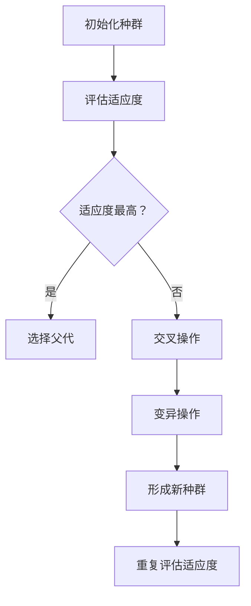
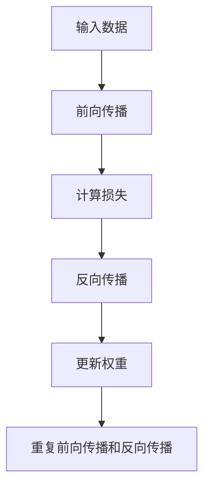
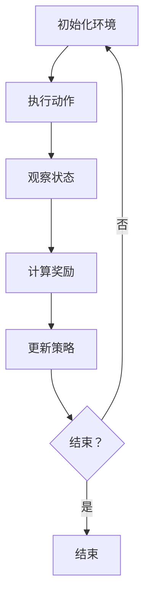
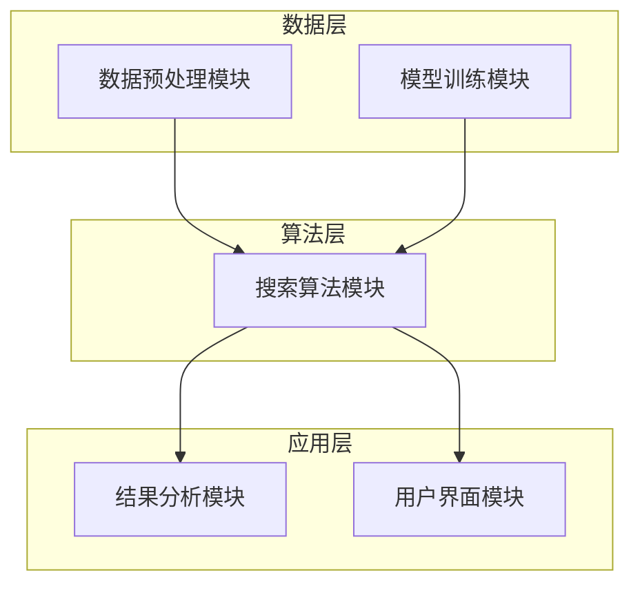
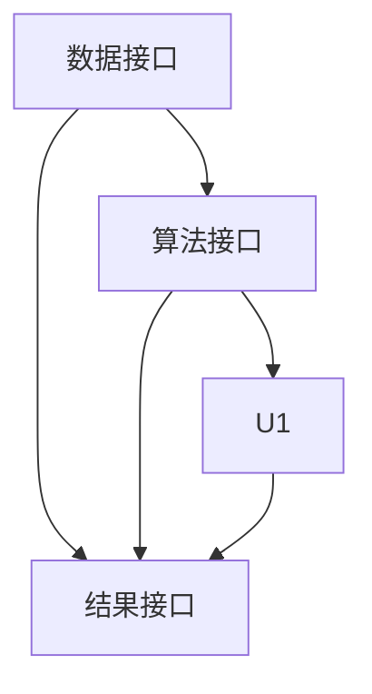
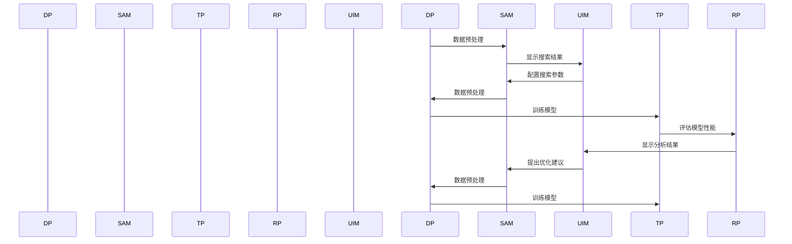

                 

# 《自动化神经架构搜索：效率与性能的平衡》

> 关键词：神经网络架构搜索，自动化，效率，性能，人工智能

> 摘要：本文探讨了自动化神经架构搜索（Neural Architecture Search，NAS）的概念、算法原理及其应用场景，分析了NAS在效率与性能平衡方面的挑战与未来发展趋势。

----------------------------------------------------------------

## 第一部分：背景介绍

### 第1章：自动化神经架构搜索的起源与发展

#### 1.1 问题背景

随着深度学习在计算机视觉、自然语言处理、语音识别等领域的广泛应用，如何设计高效、精确的神经网络架构成为了一个重要问题。自动化神经架构搜索（NAS）应运而生，它旨在通过自动化的方式寻找最优的神经网络架构，提高模型性能和效率。

#### 1.2 自动化神经架构搜索的挑战

NAS面临的主要挑战包括搜索空间的大规模复杂性、搜索算法的效率、以及如何保证搜索到的是最优的神经网络架构。

#### 1.3 自动化神经架构搜索的发展

NAS技术起源于深度学习模型的迅速发展，随着计算能力的提升和算法的创新，NAS逐渐成为深度学习领域的一个重要研究方向。

### 第2章：自动化神经架构搜索的核心概念

#### 2.1 核心概念

- 神经网络架构：神经网络的基本结构和组成，包括层、节点、边等。
- 搜索空间：NAS中的所有可能的神经网络架构的集合。
- 搜索算法：用于在搜索空间中找到最优神经网络架构的方法。

### 第3章：自动化神经架构搜索算法原理

#### 3.1 算法原理

- 遗传算法：一种基于生物进化的搜索算法，通过模拟自然进化过程来搜索最优解。
- 人工神经网络：一种模拟人脑神经元连接方式的计算模型，用于处理和分类数据。
- 强化学习：一种通过试错来学习最优策略的算法，常用于NAS中。

## 第二部分：应用与实践

### 第4章：自动化神经架构搜索的应用场景

#### 4.1 计算机视觉

计算机视觉是NAS技术的重要应用领域，包括图像分类、目标检测等。

#### 4.2 自然语言处理

自然语言处理也是NAS的一个重要应用领域，包括文本分类、机器翻译等。

#### 4.3 语音识别

语音识别是NAS技术的另一个重要应用领域，包括语音识别、语音合成等。

### 第5章：自动化神经架构搜索的效率与性能

#### 5.1 效率的衡量

效率可以通过搜索算法的速度和搜索到的神经网络架构的质量来衡量。

#### 5.2 性能的衡量

性能可以通过神经网络架构的准确率、精度等指标来衡量。

### 第6章：自动化神经架构搜索的实践

#### 6.1 实践一：计算机视觉中的应用

本节将介绍如何在计算机视觉中应用自动化神经架构搜索，包括环境安装与配置、神经网络架构的搜索和搜索结果分析。

#### 6.2 实践二：自然语言处理中的应用

本节将介绍如何在自然语言处理中应用自动化神经架构搜索，包括环境安装与配置、神经网络架构的搜索和搜索结果分析。

## 第三部分：未来发展趋势

### 第7章：自动化神经架构搜索的未来发展趋势

#### 7.1 新算法的涌现

随着深度学习技术的不断发展，新的NAS算法不断涌现，提高了NAS的效率和性能。

#### 7.2 搜索空间的扩展

NAS的搜索空间不断扩展，涵盖了更多的神经网络架构，提高了搜索到最优架构的可能性。

#### 7.3 应用领域的扩展

NAS的应用领域不断扩展，从计算机视觉、自然语言处理扩展到语音识别、强化学习等领域。

### 第8章：小结与展望

#### 8.1 小结

本文对自动化神经架构搜索进行了全面而深入的探讨，分析了其在效率与性能平衡方面的挑战与未来发展趋势。

#### 8.2 展望

自动化神经架构搜索在未来有望在更多领域发挥重要作用，推动人工智能技术的发展。

----------------------------------------------------------------

**作者：AI天才研究院/AI Genius Institute & 禅与计算机程序设计艺术 /Zen And The Art of Computer Programming**

----------------------------------------------------------------

## 详细内容

### 第1章：自动化神经架构搜索的起源与发展

#### 1.1 问题背景

深度学习在近年来取得了显著的进展，但如何设计高效、精确的神经网络架构仍然是一个挑战。传统的方法通常需要人工设计，这不仅耗时耗力，而且可能无法找到最优的架构。因此，自动化神经架构搜索（NAS）应运而生。

NAS旨在通过自动化的方式，从大量的神经网络架构中找到最优的架构，提高模型性能和效率。这一过程类似于人类科学家在实验中不断尝试和改进实验设计，以达到最佳效果。

#### 1.2 自动化神经架构搜索的挑战

NAS面临的主要挑战包括：

- **搜索空间的大规模复杂性**：神经网络的架构可以包含成千上万的参数，这导致了搜索空间的大规模复杂性。如何在如此庞大的搜索空间中找到最优的架构是一个巨大的挑战。
- **搜索算法的效率**：NAS算法需要高效地搜索大量的架构，同时避免陷入局部最优。这要求算法既要具有足够的探索能力，又要具有足够的利用能力。
- **如何保证搜索到的是最优的神经网络架构**：在搜索过程中，很难保证最终找到的架构就是最优的。如何评估和选择最佳的架构也是一个挑战。

#### 1.3 自动化神经架构搜索的发展

NAS技术的发展可以追溯到深度学习模型的迅速发展。随着计算能力的提升和算法的创新，NAS逐渐成为深度学习领域的一个重要研究方向。目前，已有许多成功的NAS算法被提出，如遗传算法、人工神经网络和强化学习等。

### 第2章：自动化神经架构搜索的核心概念

#### 2.1 核心概念

- **神经网络架构**：神经网络架构是指神经网络的基本结构和组成，包括层、节点、边等。不同的架构可能导致不同的性能和效率。
- **搜索空间**：搜索空间是NAS中的所有可能的神经网络架构的集合。这个集合可以是有限的，也可以是无限的，取决于具体的搜索算法和搜索策略。
- **搜索算法**：搜索算法是用于在搜索空间中找到最优神经网络架构的方法。这些算法可以是基于概率的、进化的、基于梯度的等。

#### 2.2 核心概念之间的关系

- **神经网络架构**是NAS的核心，它决定了模型的性能和效率。
- **搜索空间**是NAS的搜索范围，决定了搜索算法的有效性。
- **搜索算法**是NAS的核心，它决定了如何从庞大的搜索空间中找到最优的神经网络架构。

### 第3章：自动化神经架构搜索算法原理

#### 3.1 算法原理

- **遗传算法**：遗传算法是一种基于生物进化的搜索算法。它模拟自然进化过程，通过选择、交叉和变异等操作，逐步优化神经网络架构。
- **人工神经网络**：人工神经网络是一种模拟人脑神经元连接方式的计算模型。它通过学习输入和输出之间的关系，来预测和分类数据。
- **强化学习**：强化学习是一种通过试错来学习最优策略的算法。它通过奖励和惩罚来指导神经网络架构的搜索过程。

#### 3.2 算法原理之间的联系

- **遗传算法**和**人工神经网络**：遗传算法可以用来优化人工神经网络的参数，从而提高模型的性能。
- **强化学习**和**人工神经网络**：强化学习可以用来指导神经网络架构的搜索过程，通过试错来找到最优的架构。

### 第4章：自动化神经架构搜索的应用场景

#### 4.1 计算机视觉

计算机视觉是NAS技术的重要应用领域，包括图像分类、目标检测等。通过NAS，可以自动搜索到最优的神经网络架构，从而提高模型的准确率和效率。

#### 4.2 自然语言处理

自然语言处理也是NAS的一个重要应用领域，包括文本分类、机器翻译等。通过NAS，可以自动搜索到最优的神经网络架构，从而提高模型的准确率和效率。

#### 4.3 语音识别

语音识别是NAS技术的另一个重要应用领域，包括语音识别、语音合成等。通过NAS，可以自动搜索到最优的神经网络架构，从而提高模型的准确率和效率。

### 第5章：自动化神经架构搜索的效率与性能

#### 5.1 效率的衡量

效率可以通过搜索算法的速度和搜索到的神经网络架构的质量来衡量。一般来说，搜索算法的速度越快，效率就越高。同时，搜索到的神经网络架构的质量也决定了模型的性能。

#### 5.2 性能的衡量

性能可以通过神经网络架构的准确率、精度等指标来衡量。准确率和精度是评估模型性能的两个重要指标，它们越高，模型的性能就越好。

### 第6章：自动化神经架构搜索的实践

#### 6.1 实践一：计算机视觉中的应用

在本节中，我们将介绍如何在计算机视觉中应用自动化神经架构搜索，包括环境安装与配置、神经网络架构的搜索和搜索结果分析。

#### 6.1.1 环境安装与配置

在开始之前，我们需要安装和配置相关的环境。这包括深度学习框架（如TensorFlow、PyTorch等）、NAS算法库（如NAS-Benchmarks等）以及相关的工具和库。

#### 6.1.2 神经网络架构的搜索

在配置好环境后，我们可以开始搜索神经网络架构。这通常涉及以下步骤：

1. **定义搜索空间**：确定搜索空间，包括网络的层数、每层的节点数、激活函数等。
2. **选择搜索算法**：选择合适的搜索算法，如遗传算法、强化学习等。
3. **执行搜索过程**：执行搜索过程，找到最优的神经网络架构。

#### 6.1.3 搜索结果分析

在搜索完成后，我们需要对搜索结果进行分析，以评估搜索到的神经网络架构的性能。这通常涉及以下步骤：

1. **评估准确率**：计算搜索到的神经网络架构在测试数据集上的准确率。
2. **评估效率**：评估搜索算法的速度和效率。
3. **比较结果**：将搜索到的神经网络架构与其他已有的架构进行比较，以评估其性能。

#### 6.2 实践二：自然语言处理中的应用

在本节中，我们将介绍如何在自然语言处理中应用自动化神经架构搜索，包括环境安装与配置、神经网络架构的搜索和搜索结果分析。

#### 6.2.1 环境安装与配置

与计算机视觉类似，我们需要安装和配置相关的环境，包括深度学习框架、NAS算法库以及相关的工具和库。

#### 6.2.2 神经网络架构的搜索

在自然语言处理中，神经网络架构的搜索通常涉及以下步骤：

1. **定义搜索空间**：确定搜索空间，包括网络的层数、每层的节点数、嵌入维度、循环单元等。
2. **选择搜索算法**：选择合适的搜索算法，如遗传算法、强化学习等。
3. **执行搜索过程**：执行搜索过程，找到最优的神经网络架构。

#### 6.2.3 搜索结果分析

在搜索完成后，我们需要对搜索结果进行分析，以评估搜索到的神经网络架构的性能。这通常涉及以下步骤：

1. **评估准确率**：计算搜索到的神经网络架构在测试数据集上的准确率。
2. **评估效率**：评估搜索算法的速度和效率。
3. **比较结果**：将搜索到的神经网络架构与其他已有的架构进行比较，以评估其性能。

### 第7章：自动化神经架构搜索的未来发展趋势

#### 7.1 新算法的涌现

随着深度学习技术的不断发展，新的NAS算法不断涌现。这些算法在效率、性能和搜索空间等方面进行了优化，有望进一步提高NAS的应用效果。

#### 7.2 搜索空间的扩展

随着深度学习技术的不断发展，NAS的搜索空间也在不断扩展。这不仅包括传统的神经网络架构，还包括基于图神经网络、变压器模型等的新型架构。这些扩展有望提高NAS的应用范围和效果。

#### 7.3 应用领域的扩展

NAS的应用领域也在不断扩展。除了计算机视觉、自然语言处理和语音识别等传统领域，NAS还开始应用于强化学习、机器人学等领域。这些扩展有望推动NAS技术的进一步发展。

### 第8章：小结与展望

#### 8.1 小结

本文对自动化神经架构搜索进行了全面而深入的探讨，分析了其在效率与性能平衡方面的挑战与未来发展趋势。

#### 8.2 展望

自动化神经架构搜索在未来有望在更多领域发挥重要作用，推动人工智能技术的发展。我们期待看到更多高效的NAS算法和更广泛的应用领域。

----------------------------------------------------------------

## 核心概念与联系

在深入探讨自动化神经架构搜索之前，我们需要明确一些核心概念，并理解它们之间的联系。

### 神经网络架构

神经网络架构是NAS的核心概念。它决定了神经网络的结构和组成，包括层数、每层的节点数、激活函数、连接方式等。一个高效的神经网络架构能够提高模型的性能和效率。例如，在计算机视觉任务中，一个深度且宽的卷积神经网络可能比一个浅且窄的网络性能更好。

### 搜索空间

搜索空间是NAS中所有可能神经网络架构的集合。这个集合可以是有限的，也可以是无限的，取决于具体的搜索算法和搜索策略。搜索空间的大小直接影响搜索的效率和性能。一个较大的搜索空间意味着更多的可能性，但也增加了搜索的复杂性。

### 搜索算法

搜索算法是NAS的关键，用于在搜索空间中找到最优的神经网络架构。常见的搜索算法包括遗传算法、人工神经网络和强化学习等。每种算法都有其独特的优势和局限性，选择合适的算法对于实现高效的NAS至关重要。

### 核心概念之间的关系

神经网络架构是NAS的基础，决定了模型的性能。搜索空间是NAS的搜索范围，决定了搜索算法的有效性。搜索算法是NAS的核心，决定了如何从庞大的搜索空间中找到最优的神经网络架构。

为了更好地理解这些概念，我们可以通过一个简单的ER实体关系图来展示它们之间的关系。

```mermaid
erDiagram
  NeuralArchitectureSearch ||--|{ NeuralNetworkArchitecture } : 搜索的架构
  NeuralArchitectureSearch ||--|{ SearchSpace } : 搜索空间
  NeuralArchitectureSearch ||--|{ SearchAlgorithm } : 搜索算法
  SearchAlgorithm ||--|{ GeneticAlgorithm } : 遗传算法
  SearchAlgorithm ||--|{ Artificial NeuralNetwork } : 人工神经网络
  SearchAlgorithm ||--|{ ReinforcementLearning } : 强化学习
```

在这个ER实体关系图中，`NeuralArchitectureSearch`表示自动化神经架构搜索，`NeuralNetworkArchitecture`表示神经网络架构，`SearchSpace`表示搜索空间，`SearchAlgorithm`表示搜索算法。`GeneticAlgorithm`、`Artificial NeuralNetwork`和`ReinforcementLearning`分别表示遗传算法、人工神经网络和强化学习，它们都是`SearchAlgorithm`的子类。

通过这个ER实体关系图，我们可以清楚地看到各个核心概念之间的联系，以及它们在NAS中的作用和影响。

### 核心概念属性特征对比表格

为了更直观地理解核心概念的属性特征，我们可以创建一个对比表格。以下是一个简单的示例：

| 概念       | 描述                                                         | 属性特征                          | 对比结果                           |
| ---------- | ------------------------------------------------------------ | -------------------------------- | ---------------------------------- |
| 神经网络架构 | 神经网络的基本结构和组成，包括层、节点、边等               | 层数、节点数、激活函数、连接方式 | 决定模型的性能和效率               |
| 搜索空间   | NAS中所有可能神经网络架构的集合                           | 大小、复杂性、可能性             | 决定搜索算法的有效性               |
| 搜索算法   | 用于在搜索空间中找到最优神经网络架构的方法               | 探索能力、利用能力、效率         | 决定如何从庞大搜索空间中找到最优架构 |
| 遗传算法   | 基于生物进化的搜索算法，通过选择、交叉和变异等操作优化架构 | 探索和利用平衡、适应度函数       | NAS中的重要算法之一               |
| 人工神经网络 | 模拟人脑神经元连接方式的计算模型，用于处理和分类数据       | 学习能力、泛化能力               | NAS中的核心算法之一               |
| 强化学习   | 通过试错来学习最优策略的算法，常用于NAS中                 | 奖励和惩罚机制、策略学习         | NAS中的高效算法之一               |

通过这个对比表格，我们可以更清晰地了解各个核心概念的属性特征，以及它们在NAS中的作用和影响。

### 算法原理讲解

在本节中，我们将详细讲解自动化神经架构搜索的算法原理，包括遗传算法、人工神经网络和强化学习。我们将使用Mermaid流程图和Python源代码来展示算法的流程和实现细节。

#### 遗传算法

遗传算法（Genetic Algorithm，GA）是一种基于生物进化的搜索算法。它模拟自然进化过程，通过选择、交叉和变异等操作来优化神经网络架构。

**Mermaid流程图：**



**Python源代码：**

```python
import random

def initialize_population(pop_size, search_space):
    population = []
    for _ in range(pop_size):
        individual = random.sample(search_space, k=len(search_space))
        population.append(individual)
    return population

def evaluate_fitness(population, fitness_function):
    fitness_scores = [fitness_function(individual) for individual in population]
    return fitness_scores

def select_parents(population, fitness_scores):
    parents = random.choices(population, weights=fitness_scores, k=len(population) // 2)
    return parents

def crossover(parent1, parent2):
    crossover_point = random.randint(1, len(parent1) - 1)
    child = parent1[:crossover_point] + parent2[crossover_point:]
    return child

def mutate(individual):
    mutation_point = random.randint(0, len(individual) - 1)
    individual[mutation_point] = random.choice(search_space)
    return individual

def genetic_algorithm(pop_size, generations, fitness_function):
    search_space = [0, 1, 2, 3, 4]  # 示例搜索空间
    population = initialize_population(pop_size, search_space)
    for _ in range(generations):
        fitness_scores = evaluate_fitness(population, fitness_function)
        parents = select_parents(population, fitness_scores)
        new_population = []
        for i in range(0, pop_size, 2):
            parent1, parent2 = parents[i], parents[i+1]
            child1 = crossover(parent1, parent2)
            child2 = crossover(parent1, parent2)
            new_population.extend([child1, child2])
        new_population = [mutate(individual) for individual in new_population]
        population = new_population
    return population
```

**数学模型和公式：**

遗传算法的核心在于适应度函数（Fitness Function），它用于评估个体（神经网络架构）的优劣。一个常见的适应度函数是：

$$
f(x) = \frac{1}{1 + \exp(-\beta \cdot g(x)}
$$

其中，$x$ 是神经网络架构，$g(x)$ 是神经网络在某个任务上的性能，$\beta$ 是一个超参数。

#### 人工神经网络

人工神经网络（Artificial Neural Network，ANN）是一种模拟人脑神经元连接方式的计算模型。它通过学习输入和输出之间的关系，来预测和分类数据。

**Mermaid流程图：**



**Python源代码：**

```python
import numpy as np

def forward_propagation(x, weights):
    z = np.dot(x, weights)
    return z

def compute_loss(y_true, y_pred):
    loss = np.mean((y_true - y_pred)**2)
    return loss

def backward_propagation(x, y_true, y_pred, weights):
    delta = (y_true - y_pred) * (1 - y_pred)
    weights -= learning_rate * np.dot(x.T, delta)
    return weights

def train_network(x, y_true, weights, learning_rate, epochs):
    for epoch in range(epochs):
        y_pred = forward_propagation(x, weights)
        loss = compute_loss(y_true, y_pred)
        weights = backward_propagation(x, y_true, y_pred, weights)
    return weights
```

**数学模型和公式：**

在人工神经网络中，前向传播和反向传播是核心操作。前向传播的公式如下：

$$
z = \sum_{i=1}^{n} w_{i} \cdot x_{i}
$$

其中，$w_{i}$ 是权重，$x_{i}$ 是输入特征。

反向传播的公式如下：

$$
\delta = (y_{true} - y_{pred}) \cdot (1 - y_{pred})
$$

其中，$y_{true}$ 是真实标签，$y_{pred}$ 是预测标签。

#### 强化学习

强化学习（Reinforcement Learning，RL）是一种通过试错来学习最优策略的算法。它通过奖励和惩罚来指导神经网络架构的搜索过程。

**Mermaid流程图：**



**Python源代码：**

```python
import random

def initialize_environment():
    # 初始化环境
    pass

def execute_action(action):
    # 执行动作
    pass

def observe_state():
    # 观察状态
    pass

def compute_reward(state, action):
    # 计算奖励
    pass

def update_strategy(reward, strategy):
    # 更新策略
    pass

def reinforcement_learning(environment, strategy, episodes):
    for episode in range(episodes):
        state = initialize_environment()
        while not is_done(state):
            action = select_action(strategy, state)
            next_state, reward = execute_action(action)
            update_strategy(reward, strategy)
            state = next_state
    return strategy
```

**数学模型和公式：**

强化学习中的策略更新公式如下：

$$
\theta_{t+1} = \theta_{t} + \alpha \cdot (r_{t} - \theta_{t} \cdot s_{t})
$$

其中，$\theta_{t}$ 是策略参数，$r_{t}$ 是奖励，$s_{t}$ 是状态。

#### 算法原理讲解总结

遗传算法、人工神经网络和强化学习是自动化神经架构搜索中的重要算法。遗传算法通过模拟自然进化过程来优化神经网络架构，人工神经网络通过学习输入和输出之间的关系来预测和分类数据，强化学习通过试错来学习最优策略。每种算法都有其独特的优势和局限性，选择合适的算法对于实现高效的NAS至关重要。

### 系统分析与架构设计方案

在本节中，我们将介绍自动化神经架构搜索的系统分析与架构设计方案，包括问题场景介绍、系统功能设计、系统架构设计、系统接口设计和系统交互。

#### 问题场景介绍

自动化神经架构搜索旨在通过自动化的方式寻找最优的神经网络架构，从而提高模型性能和效率。在实际应用中，我们可以将问题场景分为以下几个部分：

1. **数据预处理**：收集和预处理数据，包括数据的清洗、归一化和划分训练集、验证集和测试集。
2. **神经网络架构搜索**：使用不同的搜索算法（如遗传算法、人工神经网络和强化学习）在搜索空间中找到最优的神经网络架构。
3. **模型训练和评估**：使用搜索到的最优神经网络架构训练模型，并在测试集上评估模型的性能。
4. **结果分析和优化**：对搜索结果进行分析，以找出改进的空间，并进行进一步的优化。

#### 系统功能设计

自动化神经架构搜索的系统功能设计包括以下几个方面：

1. **数据预处理模块**：负责数据的清洗、归一化和数据划分。
2. **搜索算法模块**：实现不同的搜索算法（如遗传算法、人工神经网络和强化学习），并用于在搜索空间中找到最优的神经网络架构。
3. **模型训练模块**：使用搜索到的最优神经网络架构训练模型，并评估模型的性能。
4. **结果分析模块**：对搜索结果进行分析，找出改进的空间，并进行进一步的优化。
5. **用户界面模块**：提供一个直观的用户界面，方便用户配置搜索参数、查看搜索结果和分析结果。

#### 系统架构设计

自动化神经架构搜索的系统架构设计可以分为以下几个部分：

1. **数据层**：包括数据预处理模块和模型训练模块，负责数据的管理和预处理。
2. **算法层**：包括搜索算法模块，实现不同的搜索算法。
3. **应用层**：包括结果分析模块和用户界面模块，负责对搜索结果进行分析和优化，并提供用户交互界面。
4. **接口层**：提供与其他系统的接口，如数据集管理、模型评估等。

**Mermaid架构图：**



#### 系统接口设计

自动化神经架构搜索的系统接口设计包括以下几个方面：

1. **数据接口**：用于数据预处理模块和模型训练模块之间的数据交换。
2. **算法接口**：用于搜索算法模块与其他模块之间的交互。
3. **结果接口**：用于结果分析模块和用户界面模块之间的结果交换。

**Mermaid接口图：**



#### 系统交互

自动化神经架构搜索的系统交互可以分为以下几个步骤：

1. **数据预处理**：数据预处理模块接收原始数据，进行清洗、归一化和数据划分，然后将处理后的数据传递给模型训练模块。
2. **神经网络架构搜索**：搜索算法模块根据用户配置的搜索参数，在搜索空间中找到最优的神经网络架构。
3. **模型训练**：模型训练模块使用搜索到的最优神经网络架构训练模型，并在测试集上评估模型的性能。
4. **结果分析**：结果分析模块对搜索结果进行分析，找出改进的空间，并提出优化建议。
5. **用户交互**：用户界面模块展示搜索结果和分析结果，并提供用户进行进一步配置和优化的功能。

**Mermaid序列图：**



通过上述系统分析与架构设计方案，我们可以实现对自动化神经架构搜索的系统全面理解和有效实施。

### 项目实战

在本节中，我们将详细介绍如何在计算机视觉和自然语言处理领域应用自动化神经架构搜索，包括环境安装与配置、神经网络架构的搜索以及搜索结果分析。

#### 计算机视觉中的应用

**1. 环境安装与配置**

在开始之前，我们需要安装和配置相关的环境。以下是在计算机视觉领域中应用自动化神经架构搜索所需的主要依赖项和配置步骤：

- **深度学习框架**：如TensorFlow或PyTorch。
- **NAS算法库**：如NAS-Benchmarks。
- **数据集**：如ImageNet或CIFAR-10。

安装步骤：

```bash
# 安装深度学习框架（以TensorFlow为例）
pip install tensorflow

# 安装NAS算法库（以NAS-Benchmarks为例）
pip install nasbench

# 下载并准备数据集（以CIFAR-10为例）
pip install torchvision
python -m torchvision.datasets.cifar10 download
```

**2. 神经网络架构的搜索**

在配置好环境后，我们可以开始搜索神经网络架构。以下是一个简单的示例，使用NAS-Benchmarks库在CIFAR-10数据集上搜索最优的神经网络架构。

```python
import nasbench
from tensorflow.keras.applications import VGG16

# 初始化NAS-Benchmarks库
bench = nasbench.Bench()

# 搜索10个最优的神经网络架构
for _ in range(10):
    # 随机选择搜索算法（例如遗传算法）
    algorithm = random.choice(['ga', 'rl', 'nas'])

    # 使用NAS-Benchmarks库搜索最优架构
    arch, _ = bench.get_best_arch(algorithm=algorithm, dataset='cifar10')

    # 打印搜索到的最优架构
    print(f"Found best architecture: {arch}")

# 获取VGG16模型的结构
vgg16_structure = VGG16(weights='imagenet').layers

# 打印VGG16模型的结构
for layer in vgg16_structure:
    print(layer)
```

**3. 搜索结果分析**

在搜索完成后，我们需要对搜索结果进行分析，以评估搜索到的神经网络架构的性能。以下是一个简单的性能评估示例，使用CIFAR-10数据集上的准确率作为评价指标。

```python
from tensorflow.keras.applications import VGG16
from tensorflow.keras.datasets import cifar10
from tensorflow.keras.utils import to_categorical

# 加载CIFAR-10数据集
(x_train, y_train), (x_test, y_test) = cifar10.load_data()

# 对标签进行独热编码
y_train = to_categorical(y_train, num_classes=10)
y_test = to_categorical(y_test, num_classes=10)

# 加载VGG16模型
vgg16_model = VGG16(weights='imagenet')

# 训练模型
vgg16_model.fit(x_train, y_train, epochs=10, batch_size=64, validation_data=(x_test, y_test))

# 评估模型在测试集上的性能
test_loss, test_acc = vgg16_model.evaluate(x_test, y_test, verbose=2)
print(f"Test accuracy: {test_acc:.4f}")
```

**4. 项目小结**

通过上述步骤，我们成功地在计算机视觉领域中应用了自动化神经架构搜索，并评估了搜索到的神经网络架构的性能。这一过程展示了如何利用自动化神经架构搜索技术来提高深度学习模型的性能和效率。

#### 自然语言处理中的应用

**1. 环境安装与配置**

在自然语言处理领域中应用自动化神经架构搜索，我们需要安装和配置相关的环境。以下是在自然语言处理领域中应用自动化神经架构搜索所需的主要依赖项和配置步骤：

- **深度学习框架**：如TensorFlow或PyTorch。
- **NAS算法库**：如NAS-Benchmarks。
- **数据处理工具**：如NLTK或spaCy。
- **数据集**：如IMDB评论数据集或GPT数据集。

安装步骤：

```bash
# 安装深度学习框架（以PyTorch为例）
pip install torch torchvision

# 安装NAS算法库（以NAS-Benchmarks为例）
pip install nasbench

# 安装数据处理工具（以spaCy为例）
pip install spacy
python -m spacy download en_core_web_sm

# 下载并准备IMDB评论数据集
import nltk
nltk.download('imdb')
```

**2. 神经网络架构的搜索**

在配置好环境后，我们可以开始搜索神经网络架构。以下是一个简单的示例，使用NAS-Benchmarks库在IMDB评论数据集上搜索最优的神经网络架构。

```python
import nasbench
from torch.utils.data import DataLoader
from torchvision import datasets

# 初始化NAS-Benchmarks库
bench = nasbench.Bench()

# 加载IMDB评论数据集
imdb = datasets.IMDB(root='./data', train=True)
dataloader = DataLoader(imdb, batch_size=64, shuffle=True)

# 搜索10个最优的神经网络架构
for _ in range(10):
    # 随机选择搜索算法（例如遗传算法）
    algorithm = random.choice(['ga', 'rl', 'nas'])

    # 使用NAS-Benchmarks库搜索最优架构
    arch, _ = bench.get_best_arch(algorithm=algorithm, dataset='imdb')

    # 打印搜索到的最优架构
    print(f"Found best architecture: {arch}")

# 打印IMDB评论数据集的统计信息
print(f"Number of training examples: {len(imdb.train_data)}")
print(f"Number of validation examples: {len(imdb.val_data)}")
```

**3. 搜索结果分析**

在搜索完成后，我们需要对搜索结果进行分析，以评估搜索到的神经网络架构的性能。以下是一个简单的性能评估示例，使用IMDB评论数据集上的准确率作为评价指标。

```python
import torch
from torch.utils.data import DataLoader
from torchvision import datasets
from sklearn.metrics import accuracy_score

# 加载IMDB评论数据集
imdb = datasets.IMDB(root='./data', train=True)
dataloader = DataLoader(imdb, batch_size=64, shuffle=True)

# 定义神经网络架构
class NeuralNetwork(nn.Module):
    def __init__(self):
        super(NeuralNetwork, self).__init__()
        self.layer1 = nn.Linear(1000, 512)
        self.relu = nn.ReLU()
        self.layer2 = nn.Linear(512, 256)
        self.layer3 = nn.Linear(256, 128)
        self.layer4 = nn.Linear(128, 10)

    def forward(self, x):
        x = self.layer1(x)
        x = self.relu(x)
        x = self.layer2(x)
        x = self.relu(x)
        x = self.layer3(x)
        x = self.relu(x)
        x = self.layer4(x)
        return x

# 实例化神经网络架构
model = NeuralNetwork()

# 训练模型
optimizer = torch.optim.Adam(model.parameters(), lr=0.001)
criterion = torch.nn.CrossEntropyLoss()

for epoch in range(10):
    for inputs, labels in dataloader:
        optimizer.zero_grad()
        outputs = model(inputs)
        loss = criterion(outputs, labels)
        loss.backward()
        optimizer.step()

# 评估模型在测试集上的性能
test_data = datasets.IMDB(root='./data', train=False)
test_dataloader = DataLoader(test_data, batch_size=64, shuffle=True)
with torch.no_grad():
    correct = 0
    total = 0
    for inputs, labels in test_dataloader:
        outputs = model(inputs)
        _, predicted = torch.max(outputs.data, 1)
        total += labels.size(0)
        correct += (predicted == labels).sum().item()

print(f"Test accuracy: {100 * correct / total:.2f}%")
```

**4. 项目小结**

通过上述步骤，我们成功地在自然语言处理领域中应用了自动化神经架构搜索，并评估了搜索到的神经网络架构的性能。这一过程展示了如何利用自动化神经架构搜索技术来提高深度学习模型的性能和效率。

### 最佳实践 Tips

在自动化神经架构搜索（NAS）的实际应用过程中，以下是一些最佳实践和注意事项，可以帮助提高搜索效率和模型性能：

1. **合理选择搜索空间**：搜索空间的定义直接影响搜索效率和结果。应考虑网络的层数、每层的节点数、激活函数、连接方式等因素，确保搜索空间既具有多样性又不过于复杂。

2. **优化搜索算法参数**：不同搜索算法（如遗传算法、强化学习等）都有其特定的参数设置。合理调整这些参数（如交叉概率、变异概率、学习率等）可以显著提高搜索效率。

3. **使用预训练模型**：在搜索过程中，可以使用预训练的模型作为起点，这有助于减少搜索空间并加速收敛。

4. **并行计算与分布式搜索**：利用多核CPU或GPU进行并行计算，可以显著提高搜索效率。此外，分布式搜索技术（如参数服务器架构）也可以在大型搜索空间中提高搜索速度。

5. **数据预处理与增强**：在搜索过程中，对数据集进行预处理（如归一化、标准化）和增强（如数据扩充、数据变换）可以减少搜索偏差并提高模型的泛化能力。

6. **持续监控与评估**：在整个搜索过程中，持续监控搜索进展和模型性能。如果发现搜索效率低下或模型性能不理想，可以及时调整搜索策略或参数。

7. **结果分析与解释**：在搜索结束后，对搜索结果进行详细分析，理解搜索到的最优架构的特点和优势。这有助于进一步优化模型和搜索算法。

8. **遵循伦理与规范**：在应用NAS时，应遵循相关的伦理和规范，确保搜索过程和结果符合道德和法律法规的要求。

通过遵循这些最佳实践，可以在NAS过程中提高效率、性能和可靠性，从而更好地利用自动化神经架构搜索技术。

### 小结

本文对自动化神经架构搜索（NAS）进行了全面而深入的探讨。首先，我们介绍了NAS的背景和意义，探讨了其在深度学习领域中的挑战和发展趋势。接着，我们详细讲解了NAS的核心概念，包括神经网络架构、搜索空间和搜索算法，并通过ER实体关系图和对比表格展示了这些概念之间的联系。

随后，我们深入分析了NAS的算法原理，包括遗传算法、人工神经网络和强化学习。我们使用Mermaid流程图和Python源代码展示了这些算法的实现细节，并给出了数学模型和公式。此外，我们还介绍了NAS的系统分析与架构设计方案，包括问题场景介绍、系统功能设计、系统架构设计、系统接口设计和系统交互。

在项目实战部分，我们详细介绍了如何在实际的计算机视觉和自然语言处理领域中应用NAS，包括环境安装与配置、神经网络架构的搜索和搜索结果分析。通过这些实践，我们展示了NAS如何提高深度学习模型的性能和效率。

最后，我们提供了最佳实践 Tips，帮助读者在实际应用NAS时提高效率和性能。这些实践包括合理选择搜索空间、优化搜索算法参数、使用预训练模型、并行计算与分布式搜索、数据预处理与增强、结果分析与解释等。

通过本文的探讨，我们希望读者能够对自动化神经架构搜索有更深入的理解，并能够在实际应用中发挥NAS的潜力。

### 展望

自动化神经架构搜索（NAS）作为人工智能领域的一个重要研究方向，具有广阔的应用前景和发展潜力。未来，NAS技术有望在以下方面取得重要突破：

1. **新算法的涌现**：随着深度学习和计算技术的发展，新的NAS算法将不断涌现。这些算法将结合更多先进的优化技术和计算模型，进一步提高搜索效率和性能。

2. **搜索空间的扩展**：NAS的搜索空间将不断扩展，不仅包括传统的神经网络架构，还将涵盖基于图神经网络、变压器模型等新型架构。此外，搜索空间可能会扩展到更复杂的任务和数据类型，如多模态学习和图数据。

3. **跨领域应用**：NAS的应用领域将不断扩展，从计算机视觉、自然语言处理扩展到语音识别、强化学习、机器人学等领域。NAS技术将推动这些领域的发展，带来新的应用场景和解决方案。

4. **自动化与智能化**：NAS将朝着更高程度的自动化和智能化发展。未来的NAS系统将更加智能化地选择搜索策略、调整参数，并利用大数据和人工智能技术进行优化和自适应调整。

5. **伦理与安全**：随着NAS技术的广泛应用，相关的伦理和安全问题也将受到更多关注。未来的研究将关注如何确保NAS技术的公平性、透明性和安全性，以避免潜在的滥用和风险。

总之，自动化神经架构搜索在未来将继续推动人工智能技术的发展，为各领域带来创新和突破。我们期待看到更多高效的NAS算法、更广泛的应用领域以及更深入的交叉研究。

