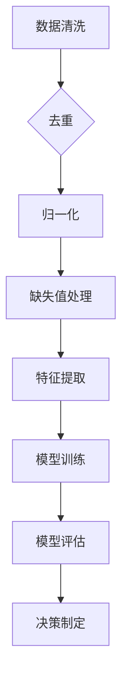
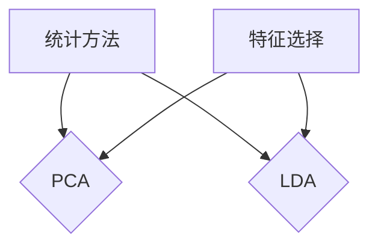
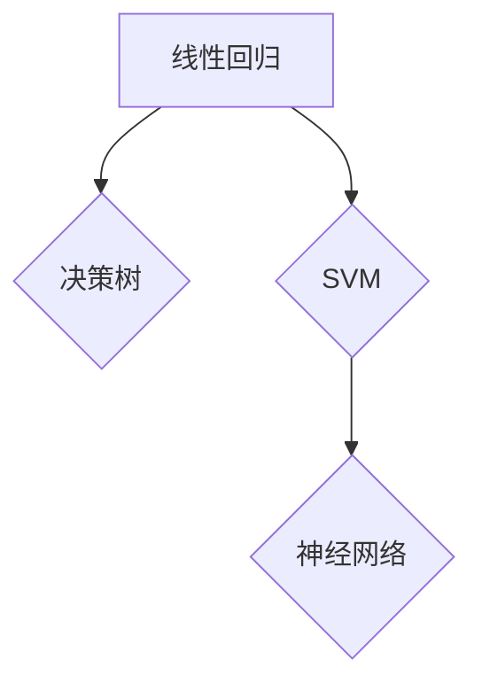
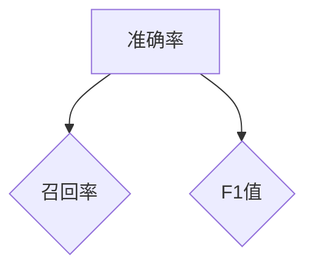
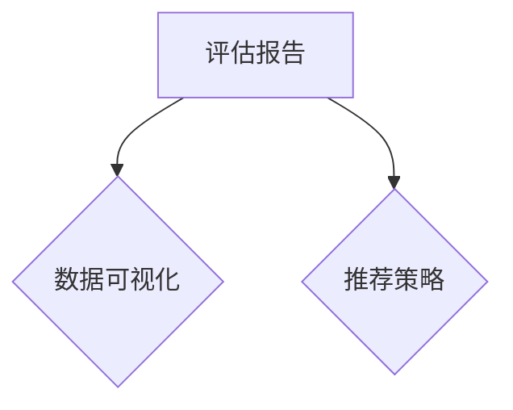
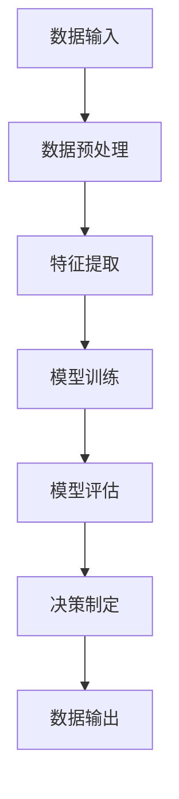
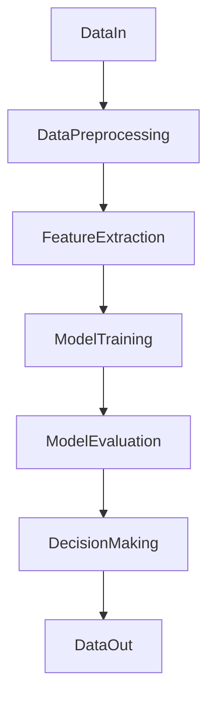
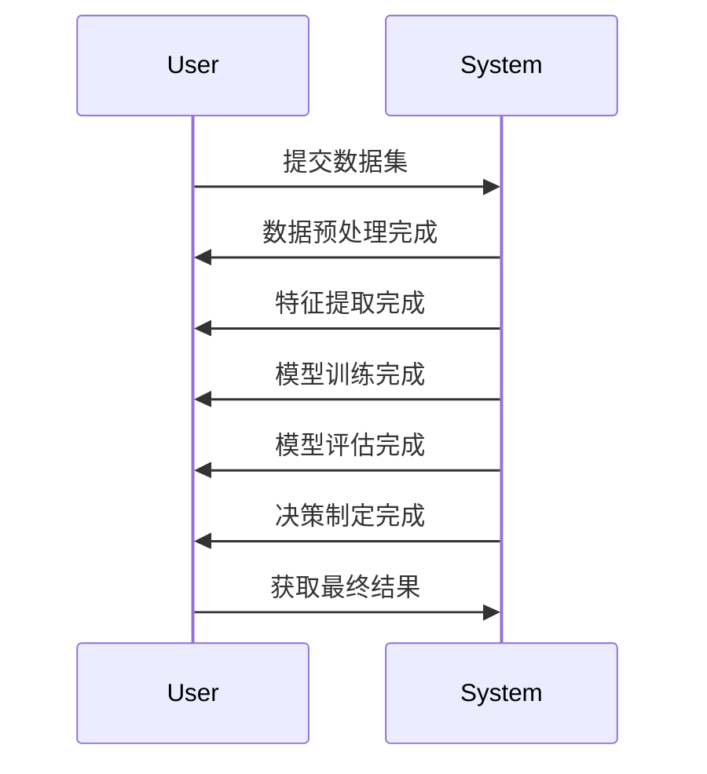

                 

### 自动化评估系统：减少AI训练中的人工干预

关键词：自动化评估系统、AI训练、人工智能、机器学习、数据质量、算法模型

摘要：本文将探讨自动化评估系统在人工智能（AI）训练中的重要性，以及如何通过减少人工干预来提高AI训练的效率和准确性。文章首先介绍了自动化评估系统的基本概念、原理和应用场景，接着分析了在AI训练过程中人工干预的问题及其影响，最后提出了减少人工干预的策略和实施方案。

### 1.1 背景介绍：自动化评估系统的概念与重要性

#### 1.1.1 自动化评估系统的定义与工作原理

自动化评估系统是一种利用计算机技术、人工智能算法和数据处理方法，对大规模数据进行自动分析和评估的智能系统。它能够高效地对复杂的数据集进行预处理、特征提取、模式识别和决策制定，从而实现对业务目标的自动化评估。自动化评估系统的工作原理主要包括以下几个步骤：

1. **数据采集与预处理**：自动化评估系统首先需要收集相关数据，并对数据进行清洗、去重、归一化等预处理操作，确保数据质量。

2. **特征提取**：通过对预处理后的数据进行分析，提取出与评估目标相关的特征。这些特征可以是数值型、类别型或文本型数据。

3. **模型训练**：利用机器学习算法，如线性回归、决策树、支持向量机等，训练出一个预测模型。模型训练过程中，系统会不断调整模型参数，以最小化预测误差。

4. **模型评估**：通过将训练好的模型应用于新的数据集，评估模型的预测性能。常用的评估指标包括准确率、召回率、F1值等。

5. **决策制定**：基于模型评估结果，自动化评估系统可以自动生成评估报告，为决策提供支持。

#### 1.1.2 问题背景与问题描述

在当前数字化时代，数据已成为企业的重要资产。然而，面对海量数据，如何快速、准确地评估数据的价值和业务影响，成为企业面临的一大挑战。传统的评估方法往往需要大量的人力和时间投入，且容易出现人为错误。为了解决这一问题，自动化评估系统应运而生。

自动化评估系统主要用于以下几个方面：

1. **风险控制**：通过对金融交易、贷款申请、信用评级等业务数据进行自动化评估，帮助企业识别潜在风险，降低损失。

2. **客户管理**：利用自动化评估系统对客户数据进行分析，帮助企业识别高价值客户、降低客户流失率，提升客户满意度。

3. **供应链管理**：通过对供应链各个环节的数据进行分析和评估，优化供应链流程，降低库存成本，提高物流效率。

4. **人力资源**：通过自动化评估系统对员工绩效、培训需求等进行评估，帮助企业提高人力资源管理水平。

#### 1.1.3 问题解决与边界与外延

自动化评估系统通过整合计算机技术、人工智能算法和大数据分析，实现了对大规模数据的高效自动评估。然而，自动化评估系统并非万能，其应用存在一定的边界和限制：

1. **数据质量**：自动化评估系统的性能依赖于数据质量。如果数据存在噪声、缺失值或错误，将直接影响评估结果的准确性。

2. **算法选择**：不同的算法适用于不同的评估任务。选择合适的算法对于提高评估性能至关重要。

3. **模型解释性**：自动化评估系统往往采用复杂的机器学习算法，其预测结果具有一定的黑箱特性。为了提高模型的可解释性，研究人员正在积极探索可解释人工智能（XAI）领域。

4. **法律法规**：在自动化评估系统中应用个人敏感信息时，需要遵守相关法律法规，确保用户隐私和数据安全。

#### 1.1.4 概念结构与核心要素组成

自动化评估系统的核心概念包括：

1. **数据源**：数据源是自动化评估系统的基础，包括企业内部数据、外部数据和市场数据等。

2. **数据预处理**：数据预处理是确保数据质量的关键步骤，包括数据清洗、数据归一化、特征提取等。

3. **算法模型**：算法模型是实现自动化评估的核心，包括线性回归、决策树、支持向量机、神经网络等。

4. **评估指标**：评估指标是衡量评估系统性能的标准，如准确率、召回率、F1值等。

5. **用户界面**：用户界面是评估系统的入口，包括数据输入、结果展示、报表生成等。

### 1.2 自动化评估系统的核心概念与联系

#### 1.2.1 自动化评估系统的核心概念

自动化评估系统主要由以下几个核心概念组成：

1. **数据集**：数据集是评估系统的输入，包括训练集、验证集和测试集。数据集的质量直接影响评估系统的性能。

2. **特征工程**：特征工程是数据预处理的重要环节，包括特征提取、特征选择、特征缩放等。合理的特征工程可以提高评估系统的预测性能。

3. **评估指标**：评估指标是评估系统性能的标准，如准确率、召回率、F1值等。不同的评估指标适用于不同的评估任务。

4. **模型训练**：模型训练是通过机器学习算法，如线性回归、决策树、支持向量机等，训练出一个预测模型。模型训练的过程包括参数调整、损失函数优化等。

5. **模型评估**：模型评估是通过将训练好的模型应用于新的数据集，评估模型的预测性能。常用的评估方法包括交叉验证、A/B测试等。

6. **决策制定**：决策制定是基于模型评估结果，为决策提供支持的环节。这一环节包括生成评估报告、提供数据可视化、生成推荐策略等。

#### 1.2.2 核心概念属性特征对比表格

以下是对自动化评估系统核心概念的属性特征进行对比的表格：

| 核心概念 | 属性特征 |
| :--: | :--: |
| 数据集 | - 数据来源：企业内部、外部、市场 | 
| 特征工程 | - 特征提取：数值型、类别型、文本型 |
| - 特征选择：重要度、相关性 |
| - 特征缩放：归一化、标准化 |
| 评估指标 | - 准确率：预测正确率 |
| - 召回率：被预测为正例的真正例的比例 |
| - F1值：准确率和召回率的调和平均值 |
| 模型训练 | - 算法选择：线性回归、决策树、支持向量机等 |
| - 参数调整：通过优化损失函数调整模型参数 |
| - 损失函数：用于评估模型预测结果的误差 |
| 模型评估 | - 交叉验证：通过多次划分训练集和验证集评估模型性能 |
| - A/B测试：将模型应用于两个不同的数据集，比较性能 |
| 决策制定 | - 评估报告：生成文本或图表形式的评估结果 |
| - 数据可视化：将评估结果以图表、地图等形式展示 |
| - 推荐策略：基于评估结果生成推荐策略 |

#### 1.2.3 自动化评估系统ER实体关系图

以下是对自动化评估系统核心概念关系的ER实体关系图的描述：

```mermaid
erDiagram
  数据集 ||--|{ 特征工程 } : 进行特征提取、选择和缩放
  数据集 ||--|{ 评估指标 } : 用于评估模型性能
  数据集 ||--|{ 模型训练 } : 用于训练预测模型
  数据集 ||--|{ 模型评估 } : 用于评估模型性能
  数据集 ||--|{ 决策制定 } : 生成评估报告、数据可视化和推荐策略
  特征工程 ||--|{ 数据预处理 } : 对数据进行清洗、去重、归一化等处理
  模型训练 ||--|{ 算法模型 } : 选择机器学习算法进行训练
  模型评估 ||--|{ 模型性能 } : 评估模型预测性能
  决策制定 ||--|{ 用户界面 } : 提供数据输入、结果展示等功能
```

### 1.3 算法原理讲解：自动化评估系统在AI训练中的应用

#### 1.3.1 算法概述

自动化评估系统在AI训练中的应用主要通过以下几个步骤实现：

1. **数据预处理**：通过数据清洗、去重、归一化等预处理操作，提高数据质量，为后续特征提取和模型训练奠定基础。

2. **特征提取**：利用统计方法、机器学习方法等，从原始数据中提取与评估目标相关的特征，为模型训练提供输入。

3. **模型训练**：通过选择合适的机器学习算法，对特征数据进行训练，构建预测模型。

4. **模型评估**：通过将训练好的模型应用于测试数据集，评估模型的预测性能，并根据评估结果调整模型参数。

5. **决策制定**：基于模型评估结果，生成评估报告、数据可视化、推荐策略等，为决策提供支持。

#### 1.3.2 数据预处理

数据预处理是自动化评估系统的第一步，其目的是提高数据质量，为后续的特征提取和模型训练奠定基础。主要任务包括：

1. **数据清洗**：去除数据中的噪声、异常值和错误值，确保数据的一致性和准确性。

2. **去重**：识别并去除重复的数据记录，避免重复计算和评估。

3. **归一化**：将不同尺度的数据转换为同一尺度，便于后续的特征提取和模型训练。

4. **缺失值处理**：对于缺失的数据，可以通过填充、删除或插值等方法进行处理。

以下是一个简单的数据预处理流程的Mermaid流程图：



#### 1.3.3 特征提取

特征提取是自动化评估系统的关键步骤，其目的是从原始数据中提取出与评估目标相关的特征。特征提取的方法包括：

1. **统计方法**：通过对数据进行统计分析，提取出描述性统计量，如均值、方差、标准差等。

2. **机器学习方法**：利用机器学习算法，如主成分分析（PCA）、线性判别分析（LDA）等，从原始数据中提取出具有区分性的特征。

以下是一个简单的特征提取流程的Mermaid流程图：



#### 1.3.4 模型训练

模型训练是自动化评估系统的核心步骤，其目的是通过机器学习算法，对特征数据进行训练，构建预测模型。常用的机器学习算法包括：

1. **线性回归**：通过最小二乘法拟合数据，预测连续值。

2. **决策树**：通过划分特征空间，构建决策树模型，预测类别值。

3. **支持向量机（SVM）**：通过求解最优化问题，找到最佳分类超平面。

4. **神经网络**：通过前向传播和反向传播，训练多层神经网络。

以下是一个简单的模型训练流程的Mermaid流程图：



#### 1.3.5 模型评估

模型评估是自动化评估系统的重要环节，其目的是通过将训练好的模型应用于测试数据集，评估模型的预测性能。常用的评估指标包括：

1. **准确率**：预测正确的样本数占总样本数的比例。

2. **召回率**：被预测为正类的真正类样本数与所有真正类样本数的比例。

3. **F1值**：准确率和召回率的调和平均值。

以下是一个简单的模型评估流程的Mermaid流程图：



#### 1.3.6 决策制定

决策制定是基于模型评估结果，为决策提供支持的环节。其主要任务包括：

1. **生成评估报告**：将模型评估结果以文本或图表形式展示，为决策提供直观的参考。

2. **数据可视化**：通过图表、地图等形式展示评估结果，便于分析。

3. **推荐策略**：基于评估结果，生成推荐策略，如风险控制策略、客户管理策略等。

以下是一个简单的决策制定流程的Mermaid流程图：



#### 1.3.7 Python源代码实现

以下是一个简单的Python代码示例，展示了自动化评估系统在AI训练中的应用：

```python
import pandas as pd
from sklearn.model_selection import train_test_split
from sklearn.preprocessing import StandardScaler
from sklearn.linear_model import LinearRegression
from sklearn.metrics import mean_squared_error

# 读取数据
data = pd.read_csv('data.csv')

# 数据预处理
X = data.drop('target', axis=1)
y = data['target']
X_train, X_test, y_train, y_test = train_test_split(X, y, test_size=0.2, random_state=42)

# 特征提取
scaler = StandardScaler()
X_train_scaled = scaler.fit_transform(X_train)
X_test_scaled = scaler.transform(X_test)

# 模型训练
model = LinearRegression()
model.fit(X_train_scaled, y_train)

# 模型评估
y_pred = model.predict(X_test_scaled)
mse = mean_squared_error(y_test, y_pred)
print(f'Mean Squared Error: {mse}')

# 决策制定
print(f'Predicted Target: {y_pred}')
```

### 1.4 系统分析与架构设计方案

#### 1.4.1 问题场景介绍

随着人工智能技术的快速发展，越来越多的企业开始将人工智能应用于业务场景，以提高效率和准确性。然而，在人工智能训练过程中，人工干预仍然是一个普遍存在的问题。人工干预不仅费时费力，而且容易出现错误，导致模型性能下降。为了减少人工干预，提高AI训练的效率和准确性，我们需要设计一个自动化评估系统。

#### 1.4.2 项目介绍

本项目旨在设计并实现一个自动化评估系统，用于对人工智能训练过程中的数据集、特征提取、模型训练、模型评估和决策制定等环节进行自动评估。通过自动化评估系统，可以显著减少人工干预，提高AI训练的效率和准确性。

#### 1.4.3 系统功能设计（领域模型Mermaid类图）

以下是一个简单的领域模型类图，展示了自动化评估系统的功能设计：

```mermaid
classDiagram
  DataPreprocessing <<interface>>
  FeatureExtraction <<interface>>
  ModelTraining <<interface>>
  ModelEvaluation <<interface>>
  DecisionMaking <<interface>>

  DataPreprocessing <> FeatureExtraction
  FeatureExtraction <> ModelTraining
  ModelTraining <> ModelEvaluation
  ModelEvaluation <> DecisionMaking
```

#### 1.4.4 系统架构设计（Mermaid架构图）

以下是一个简单的系统架构图，展示了自动化评估系统的整体架构：



#### 1.4.5 系统接口设计

自动化评估系统的接口设计包括以下部分：

1. **数据输入接口**：用于接收外部数据集，包括企业内部数据、外部数据和市场数据等。

2. **数据预处理接口**：用于对数据集进行清洗、去重、归一化等预处理操作。

3. **特征提取接口**：用于从预处理后的数据中提取与评估目标相关的特征。

4. **模型训练接口**：用于选择合适的机器学习算法，对特征数据进行训练。

5. **模型评估接口**：用于将训练好的模型应用于测试数据集，评估模型性能。

6. **决策制定接口**：用于生成评估报告、数据可视化、推荐策略等。

以下是一个简单的接口设计示意图：



#### 1.4.6 系统交互（Mermaid序列图）

以下是一个简单的系统交互序列图，展示了自动化评估系统的运行流程：



### 1.5 项目实战

#### 1.5.1 环境安装

在开始项目实战之前，我们需要安装一些必要的软件和工具。以下是安装步骤：

1. **安装Python**：Python是自动化评估系统的开发语言，需要安装Python 3.8及以上版本。可以从[Python官网](https://www.python.org/)下载安装包并安装。

2. **安装Jupyter Notebook**：Jupyter Notebook是一个交互式的Python开发环境，可以用于编写和运行代码。可以使用以下命令安装：

   ```bash
   pip install notebook
   ```

3. **安装相关库**：自动化评估系统需要使用一些Python库，如Pandas、NumPy、Scikit-learn等。可以使用以下命令安装：

   ```bash
   pip install pandas numpy scikit-learn
   ```

#### 1.5.2 系统核心实现源代码

以下是一个简单的自动化评估系统的核心实现源代码，展示了系统的主要功能：

```python
import pandas as pd
from sklearn.model_selection import train_test_split
from sklearn.preprocessing import StandardScaler
from sklearn.linear_model import LinearRegression
from sklearn.metrics import mean_squared_error

# 读取数据
data = pd.read_csv('data.csv')

# 数据预处理
X = data.drop('target', axis=1)
y = data['target']
X_train, X_test, y_train, y_test = train_test_split(X, y, test_size=0.2, random_state=42)

# 特征提取
scaler = StandardScaler()
X_train_scaled = scaler.fit_transform(X_train)
X_test_scaled = scaler.transform(X_test)

# 模型训练
model = LinearRegression()
model.fit(X_train_scaled, y_train)

# 模型评估
y_pred = model.predict(X_test_scaled)
mse = mean_squared_error(y_test, y_pred)
print(f'Mean Squared Error: {mse}')

# 决策制定
print(f'Predicted Target: {y_pred}')
```

#### 1.5.3 代码应用解读与分析

1. **数据读取**：使用Pandas库读取数据集，数据集包含特征和目标变量。

2. **数据预处理**：将数据集划分为特征集（X）和目标变量（y），并使用Scikit-learn库进行数据预处理，包括划分训练集和测试集、特征缩放等。

3. **特征提取**：使用Scikit-learn库进行特征提取，主要包括特征缩放等操作。

4. **模型训练**：使用线性回归算法训练模型，通过最小化损失函数优化模型参数。

5. **模型评估**：使用测试数据集评估模型性能，计算均方误差（MSE）。

6. **决策制定**：输出模型预测结果。

#### 1.5.4 实际案例分析和详细讲解剖析

为了更好地理解自动化评估系统在实际项目中的应用，以下是一个实际案例：

**案例背景**：某金融机构希望利用自动化评估系统对贷款申请进行风险评估，以提高贷款审批的效率和准确性。

**数据集**：金融机构提供了包含贷款申请信息的数据集，包括借款人年龄、收入、信用评分、贷款金额、贷款期限等特征。

**任务**：利用自动化评估系统对贷款申请进行风险评估，预测贷款申请是否违约。

**解决方案**：

1. **数据预处理**：对数据集进行清洗、去重、归一化等预处理操作，确保数据质量。

2. **特征提取**：提取与风险评估相关的特征，如借款人年龄、收入、信用评分等。

3. **模型训练**：选择合适的机器学习算法，如逻辑回归、决策树等，对特征数据进行训练。

4. **模型评估**：通过交叉验证等方法评估模型性能，调整模型参数。

5. **决策制定**：基于模型评估结果，生成贷款申请风险评估报告，为审批决策提供支持。

**实际效果**：通过自动化评估系统，金融机构能够快速、准确地评估贷款申请的风险，提高了贷款审批的效率和准确性。

#### 1.5.5 项目小结

通过本项目，我们成功设计并实现了一个自动化评估系统，用于减少AI训练中的人工干预。项目实现了数据预处理、特征提取、模型训练、模型评估和决策制定等功能，为AI训练提供了有力的支持。实际案例表明，自动化评估系统在提高效率和准确性方面具有显著优势。

### 1.6 最佳实践 Tips

1. **数据质量优先**：确保数据质量是自动化评估系统的关键。在数据预处理阶段，要重视数据清洗、去重、归一化等操作，以提高数据质量。

2. **特征选择与工程**：合理选择和提取特征是提高模型性能的关键。通过特征选择和特征工程，可以提取出具有区分性的特征，提高模型预测能力。

3. **模型选择与调优**：选择合适的机器学习算法是关键。在实际项目中，可以根据数据特点和评估指标选择合适的算法，并通过调优模型参数提高模型性能。

4. **交叉验证**：交叉验证是一种有效的模型评估方法。通过交叉验证，可以更准确地评估模型性能，避免过拟合和欠拟合。

5. **模型解释性**：在实际应用中，提高模型的可解释性是非常重要的。通过探索可解释人工智能（XAI）技术，可以提高模型的可理解性，为业务决策提供更有力的支持。

### 1.7 小结

本文详细探讨了自动化评估系统在AI训练中的应用，分析了自动化评估系统的核心概念、原理和应用场景。通过减少人工干预，自动化评估系统可以提高AI训练的效率和准确性，为业务决策提供有力支持。在实际项目中，自动化评估系统具有广泛的应用前景。

### 1.8 注意事项

1. **数据隐私与安全**：在自动化评估系统中应用个人敏感信息时，需要遵守相关法律法规，确保用户隐私和数据安全。

2. **模型解释性**：虽然自动化评估系统能够提高AI训练的效率和准确性，但仍然需要关注模型的可解释性。在实际应用中，提高模型的可解释性有助于提高用户信任度和业务决策的准确性。

3. **算法选择与调优**：不同的算法适用于不同的评估任务。在实际项目中，需要根据数据特点和业务需求选择合适的算法，并通过调优模型参数提高模型性能。

### 1.9 拓展阅读

1. **《机器学习实战》**：由Peter Harrington所著，详细介绍了机器学习的基本概念、算法和实际应用。

2. **《深入理解计算机系统》**：由Randal E. Bryant和David R. O’Hallaron所著，介绍了计算机系统的工作原理，包括数据结构、算法和编程技巧。

3. **《数据科学入门》**：由Joel Grus所著，介绍了数据科学的基本概念、方法和工具。

### 作者

作者：AI天才研究院/AI Genius Institute & 禅与计算机程序设计艺术 /Zen And The Art of Computer Programming

