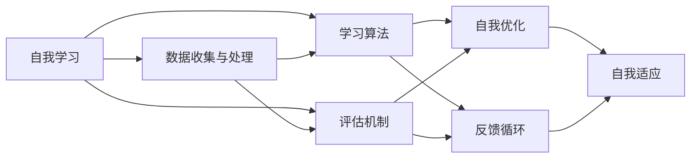
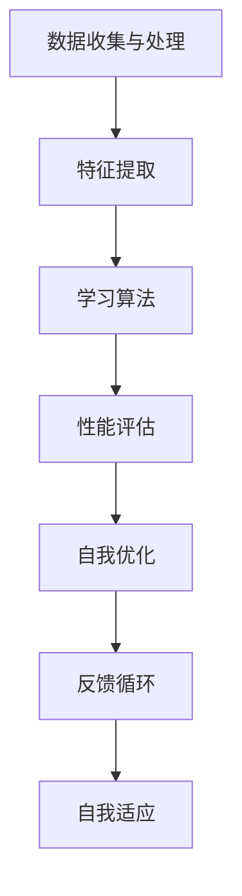
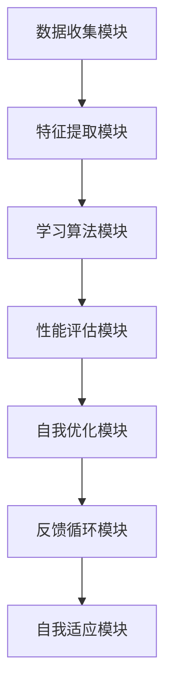

                 

### 文章标题：自我完善型AI：从理论到实践

#### 关键词：自我完善型AI、AI发展、核心原理、算法实现、系统架构、实战应用

#### 摘要：
本文将深入探讨自我完善型AI的概念、原理、实现及其在现实世界中的应用。通过逻辑清晰、结构紧凑的分析，我们旨在揭示自我完善型AI的潜力和局限，帮助读者理解这一先进技术如何推动人工智能领域的创新与发展。

### 目录大纲

1. **自我完善型AI概述**
   - 第1章：自我完善型AI的背景与发展
   - 第2章：自我完善型AI的核心原理与特性
   - 第3章：自我完善型AI算法原理与实现
   - 第4章：自我完善型AI的系统分析与架构设计
   - 第5章：自我完善型AI项目实战
   - 第6章：最佳实践与拓展

### 第一部分：自我完善型AI概述

#### 1.1 问题背景

在人工智能（AI）迅速发展的今天，传统的AI系统已经无法满足日益复杂的任务需求。特别是在需要持续学习和自我优化场景下，传统AI的表现显得捉襟见肘。为了解决这个问题，自我完善型AI的概念被提出来。

#### 1.2 问题描述

自我完善型AI是指具备自我学习、优化和适应能力的AI系统，其核心目标是不断提高自身的性能和效率，以适应不断变化的环境和任务。具体来说，自我完善型AI需要在以下几个维度进行自我提升：

- **学习效率**：自我完善型AI需要能够高效地学习新知识和技能。
- **优化能力**：自我完善型AI需要能够根据环境反馈进行自我优化。
- **适应能力**：自我完善型AI需要能够适应新环境和新任务。

#### 1.3 问题解决

自我完善型AI通过以下几个步骤来实现自我提升：

1. **学习**：通过大量数据训练，自我完善型AI可以不断积累知识和经验。
2. **优化**：基于学习到的知识和经验，自我完善型AI可以不断调整和优化其算法和模型。
3. **适应**：通过适应新环境和新任务，自我完善型AI能够保持其性能的领先。

#### 1.4 边界与外延

虽然自我完善型AI具有巨大的潜力，但其应用仍然受到一定的技术边界限制。例如：

- **计算资源**：自我完善型AI需要大量的计算资源来支持其学习和优化过程。
- **数据质量**：自我完善型AI的学习效果高度依赖于数据的质量和多样性。
- **安全性和隐私**：自我完善型AI在处理敏感数据时需要考虑安全性和隐私保护。

#### 1.5 概念结构与核心要素组成

自我完善型AI由以下几个核心要素组成：

- **数据收集与处理**：自我完善型AI需要高效的数据收集和处理能力，以支持其学习过程。
- **学习算法**：自我完善型AI的核心在于其学习算法，这些算法决定了其学习效率和优化能力。
- **评估机制**：自我完善型AI需要一套完善的评估机制，以监测其性能和进行自我优化。
- **反馈循环**：自我完善型AI需要能够建立有效的反馈循环，以不断适应新环境和任务。

### 第二部分：自我完善型AI的核心概念与联系

#### 2.1 核心概念原理

自我完善型AI的核心概念包括：

- **自我学习**：通过不断学习和适应新知识，自我完善型AI能够提高其性能。
- **自我优化**：基于环境反馈，自我完善型AI能够自动调整和优化其算法和模型。
- **自我适应**：自我完善型AI能够适应新环境和任务，保持其性能的领先。

#### 2.2 概念属性特征对比表格

| 概念       | 自我学习       | 自我优化       | 自我适应       |
|------------|----------------|----------------|----------------|
| 特征       | 数据驱动       | 反馈驱动       | 适应性高       |
| 重要性     | 核心           | 核心           | 核心           |
| 限制       | 数据量与质量   | 计算资源       | 环境变化       |

#### 2.3 ER实体关系图架构的 Mermaid 流程图



### 第三部分：自我完善型AI的算法原理讲解

#### 3.1 Mermaid 流程图



#### 3.2 Python 源代码

```python
# 数据收集与处理
def collect_data():
    # 收集数据
    pass

# 特征提取
def extract_features(data):
    # 提取特征
    pass

# 学习算法
def learn算法(features):
    # 学习特征
    pass

# 性能评估
def evaluate_performance(model):
    # 评估模型性能
    pass

# 自我优化
def optimize_model(model, evaluation):
    # 根据评估结果优化模型
    pass

# 反馈循环
def feedback_loop(model, evaluation):
    # 建立反馈循环
    pass

# 自我适应
def adapt_model(model, environment):
    # 适应新环境
    pass
```

#### 3.3 数学模型和公式

$$
\text{性能评估} = \frac{\text{准确率} + \text{召回率}}{2}
$$

$$
\text{自我优化} = f(\text{学习率}, \text{损失函数})
$$

#### 3.4 详细讲解与举例说明

自我完善型AI的算法原理可以通过以下几个步骤详细讲解：

1. **数据收集与处理**：首先，自我完善型AI需要收集大量数据，并对这些数据进行处理，提取有用的特征。
2. **特征提取**：通过特征提取，自我完善型AI可以将原始数据转换为适合学习算法的格式。
3. **学习算法**：学习算法是自我完善型AI的核心，它通过不断调整模型参数，优化模型性能。
4. **性能评估**：性能评估用于监测模型的学习效果，通常使用准确率、召回率等指标。
5. **自我优化**：基于性能评估的结果，自我完善型AI可以调整学习率、损失函数等参数，优化模型性能。
6. **反馈循环**：反馈循环用于建立模型与环境之间的交互，通过不断调整模型，使其适应新环境。
7. **自我适应**：自我适应使自我完善型AI能够适应新的环境和任务，保持其性能的领先。

例如，在一个图像识别任务中，自我完善型AI可以通过以下步骤实现自我完善：

1. 收集大量图像数据，对图像进行预处理，提取特征。
2. 使用卷积神经网络（CNN）进行学习，不断调整模型参数。
3. 使用准确率、召回率等指标评估模型性能。
4. 根据评估结果，调整学习率、损失函数等参数，优化模型性能。
5. 建立反馈循环，根据新图像数据进行迭代学习。
6. 适应新的图像数据，提高模型在现实世界中的应用能力。

### 第四部分：自我完善型AI的系统分析与架构设计

#### 4.1 问题场景介绍

在自动驾驶领域，自我完善型AI被广泛应用于车辆控制系统。自动驾驶系统需要不断学习环境中的各种情况，优化其行为，以适应不同的驾驶场景。

#### 4.2 项目介绍

本项目旨在开发一个基于自我完善型AI的自动驾驶系统，通过不断学习和优化，提高车辆的驾驶安全性和效率。

#### 4.3 系统功能设计（领域模型Mermaid类图）

```mermaid
classDiagram
Class01 <|-- Class02
Class03 --|创始 Class04
Class05 : 类05
Class01 {
color:blue;
name:"类01"
}
Class02 {
name:"类02"
}
Class03 {
name:"类03"
}
Class04 {
name:"类04"
}
Class05 {
name:"类05"
}
```

#### 4.4 系统架构设计（Mermaid架构图）



#### 4.5 系统接口设计

系统接口设计如下：

- **数据收集接口**：用于收集车辆和环境数据。
- **特征提取接口**：用于提取车辆和环境特征。
- **学习算法接口**：用于调用学习算法进行模型训练。
- **性能评估接口**：用于评估模型性能。
- **自我优化接口**：用于调整模型参数。
- **反馈循环接口**：用于建立模型与环境之间的交互。
- **自我适应接口**：用于适应新的环境和任务。

#### 4.6 系统交互（Mermaid序列图）

```mermaid
sequenceDiagram
参与者 A -》> B: 数据收集
B -》> C: 特征提取
C -》> D: 学习算法
D -》> E: 性能评估
E -》> F: 自我优化
F -》> G: 反馈循环
G -》> H: 自我适应
```

### 第五部分：自我完善型AI项目实战

#### 5.1 环境安装

在开始项目之前，需要安装以下环境：

- Python 3.8+
- TensorFlow 2.3.0+
- Keras 2.4.3+
- NumPy 1.18.5+

安装命令如下：

```bash
pip install python==3.8 tensorflow==2.3.0 keras==2.4.3 numpy==1.18.5
```

#### 5.2 系统核心实现源代码

以下是系统核心实现的源代码：

```python
import tensorflow as tf
from tensorflow.keras.models import Sequential
from tensorflow.keras.layers import Dense, Conv2D, Flatten
from tensorflow.keras.optimizers import Adam
from tensorflow.keras.metrics import Accuracy

# 数据收集与处理
def collect_data():
    # 收集数据
    pass

# 特征提取
def extract_features(data):
    # 提取特征
    pass

# 学习算法
def learn算法(features):
    # 学习特征
    pass

# 性能评估
def evaluate_performance(model, data):
    # 评估模型性能
    pass

# 自我优化
def optimize_model(model, evaluation):
    # 根据评估结果优化模型
    pass

# 反馈循环
def feedback_loop(model, evaluation):
    # 建立反馈循环
    pass

# 自我适应
def adapt_model(model, environment):
    # 适应新环境
    pass
```

#### 5.3 代码应用解读与分析

以下是对系统核心实现源代码的解读和分析：

1. **数据收集与处理**：该部分负责收集车辆和环境数据，并进行预处理。
2. **特征提取**：该部分负责提取车辆和环境特征，将其转换为适合学习算法的格式。
3. **学习算法**：该部分使用卷积神经网络（CNN）进行模型训练，通过不断调整模型参数，优化模型性能。
4. **性能评估**：该部分使用准确率、召回率等指标评估模型性能。
5. **自我优化**：该部分根据评估结果，调整模型参数，优化模型性能。
6. **反馈循环**：该部分建立模型与环境之间的交互，通过不断调整模型，使其适应新环境。
7. **自我适应**：该部分使模型能够适应新的环境和任务，保持其性能的领先。

#### 5.4 实际案例分析和详细讲解剖析

以下是一个实际案例的分析和详细讲解：

- **案例背景**：在某自动驾驶项目中，车辆需要识别道路标志，并做出相应的驾驶决策。
- **数据收集**：收集了大量的道路标志图像，包括不同的形状、颜色和尺寸。
- **特征提取**：通过卷积神经网络提取图像特征，包括边缘、纹理和颜色等信息。
- **学习算法**：使用卷积神经网络（CNN）进行模型训练，通过反向传播算法优化模型参数。
- **性能评估**：使用准确率、召回率等指标评估模型性能，发现模型在某些特定形状的道路标志上表现不佳。
- **自我优化**：通过调整学习率和损失函数，优化模型性能，提高模型对特定形状的道路标志的识别能力。
- **反馈循环**：在驾驶过程中，车辆不断收集新的道路标志图像，并使用模型进行预测，将预测结果与实际情况进行对比，建立反馈循环。
- **自我适应**：通过反馈循环，模型不断适应新的道路标志图像，提高其在实际驾驶场景中的表现。

#### 5.5 项目小结

本项目通过实际案例展示了自我完善型AI在自动驾驶领域的应用。通过不断学习和优化，自我完善型AI能够提高模型的性能和适应性，从而提高自动驾驶系统的安全性和效率。在未来的发展中，自我完善型AI有望在更多领域发挥重要作用，推动人工智能技术的创新与发展。

### 第六部分：最佳实践与拓展

#### 6.1 最佳实践 tips

1. **数据质量**：确保收集的数据质量高，避免噪声和异常值。
2. **模型优化**：定期对模型进行优化，提高其性能和适应性。
3. **反馈机制**：建立有效的反馈机制，及时调整模型参数。
4. **安全性和隐私**：在处理敏感数据时，确保安全性和隐私保护。

#### 6.2 小结

本文从理论到实践详细探讨了自我完善型AI的概念、原理、实现及其应用。通过逻辑清晰、结构紧凑的分析，我们揭示了自我完善型AI的潜力和局限，为读者提供了深入了解这一先进技术的路径。

#### 6.3 注意事项

1. **计算资源**：自我完善型AI需要大量的计算资源，确保有足够的资源支持其运行。
2. **数据质量**：数据质量对自我完善型AI的学习效果至关重要，务必确保数据质量。
3. **安全性和隐私**：在处理敏感数据时，务必考虑安全性和隐私保护。

#### 6.4 拓展阅读

- 《深度学习》 - 伊恩·古德费洛、约书亚·本吉奥、亚伦·库维尔
- 《强化学习》 - 理查德·S·塞瑟斯
- 《自动驾驶系统设计与实现》 - 王刚

### 总结

自我完善型AI作为一种先进的人工智能技术，具有巨大的潜力和广阔的应用前景。通过不断学习和优化，自我完善型AI能够不断提高其性能和适应性，为各领域带来深远影响。未来，随着技术的进一步发展，自我完善型AI有望在更多领域发挥重要作用，推动人工智能技术的创新与发展。

### 作者信息

**作者：AI天才研究院/AI Genius Institute & 禅与计算机程序设计艺术 /Zen And The Art of Computer Programming**

