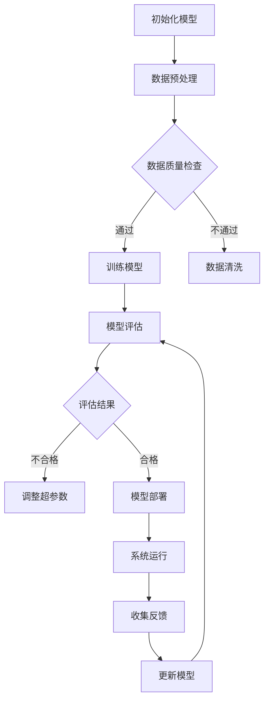
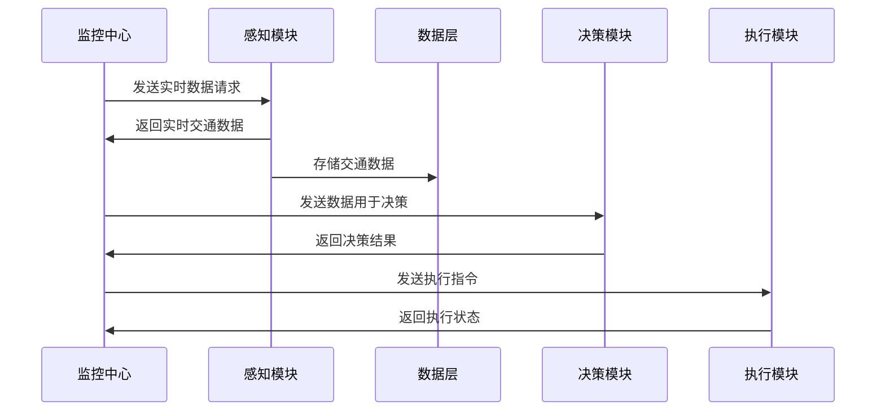

                 

## 自我完善型AI:设计原则与实现方法

### 关键词
- 自我完善型AI
- 设计原则
- 实现方法
- 算法
- 系统架构
- 数学模型

### 摘要
本文将深入探讨自我完善型AI的设计原则与实现方法。首先，我们将介绍自我完善型AI的背景和核心概念，阐述其在人工智能领域的地位和作用。接着，我们将详细分析自我完善型AI的设计原则，包括模块化、可扩展性和自适应性等。然后，我们将介绍实现自我完善型AI的关键算法原理，包括机器学习和深度学习的相关技术。此外，我们将使用Python代码和LaTeX公式来具体阐述算法原理。随后，我们将探讨系统分析与架构设计的方法，介绍如何设计一个完整的自我完善型AI系统。接着，我们将通过项目实战来展示如何实现自我完善型AI，并分析其性能和应用。最后，我们将总结最佳实践，并提供进一步的学习和参考资源。

---

## 背景介绍

### 核心概念术语说明

在讨论自我完善型AI之前，我们首先需要明确一些关键术语。自我完善型AI，顾名思义，是一种能够自我改进和自我优化的AI系统。这种系统不仅能够执行预设的任务，还能够通过不断地学习和适应新环境，提高自身的性能。以下是几个核心概念的简要说明：

1. **人工智能（AI）**：模拟人类智能的计算机系统，能够理解、学习、推理和解决问题。
2. **机器学习（ML）**：通过数据训练，使计算机能够从数据中学习并作出决策的过程。
3. **深度学习（DL）**：一种机器学习技术，通过多层神经网络模拟人类大脑的学习过程。
4. **强化学习（RL）**：一种机器学习方法，通过奖励机制来训练模型，使其能够在特定环境中做出最优决策。
5. **自我完善（Self-Improvement）**：系统在运行过程中，通过自我学习和自我优化，不断提升其性能和能力。

### 问题背景

随着大数据和云计算的迅猛发展，人工智能技术逐渐渗透到各个行业。然而，传统的AI系统通常在特定场景下表现出色，但缺乏灵活性和适应性。这使得它们在面临新环境和新任务时，往往无法迅速调整和适应。例如，自动驾驶系统在特定路况下表现良好，但遇到突发情况时，可能无法做出及时响应。这就需要一种能够自我完善、自我优化的AI系统。

### 问题描述

自我完善型AI的目标是构建一个能够在各种环境和任务中自主学习和适应的智能系统。具体来说，它需要满足以下要求：

1. **可扩展性**：系统能够适应不同规模的任务和数据。
2. **适应性**：系统能够在变化的环境和任务中，自主调整和优化。
3. **鲁棒性**：系统能够在面对噪声和不确定性时，保持稳定的性能。
4. **自解释性**：系统能够解释其决策过程，提高用户对系统的信任度。

### 问题解决

自我完善型AI的解决思路主要包括以下几个方面：

1. **模块化设计**：将系统分解为若干个模块，每个模块负责特定的任务，模块之间通过标准接口进行通信。
2. **自监督学习**：利用系统自身的输出数据，进行自我监督和自我改进。
3. **迁移学习**：将已经训练好的模型，迁移到新的任务和数据集上，减少重新训练的需求。
4. **在线学习**：系统在运行过程中，不断地接收新的数据，并进行实时更新和调整。

### 边界与外延

自我完善型AI的设计和实现需要考虑以下边界和限制：

1. **计算资源**：自我完善型AI通常需要大量的计算资源和数据，这对系统的部署和运行提出了挑战。
2. **数据隐私**：在数据驱动的人工智能中，数据隐私和保护是一个重要的问题，特别是在涉及个人数据时。
3. **伦理和法律**：自我完善型AI的自主决策能力可能会引发伦理和法律问题，如责任归属、隐私保护等。

### 概念结构与核心要素组成

自我完善型AI的概念结构主要包括以下几个核心要素：

1. **感知模块**：负责接收外部信息，如图像、声音、传感器数据等。
2. **决策模块**：根据感知模块提供的信息，进行决策和行动。
3. **学习模块**：利用感知模块和决策模块的交互数据，进行自我学习和优化。
4. **执行模块**：根据决策模块的决策，执行相应的操作。
5. **反馈模块**：收集执行模块的反馈信息，用于进一步优化和改进。

以上是自我完善型AI的背景介绍，接下来我们将深入探讨其核心概念和设计原则。

---

## 核心概念与联系

### 核心概念定义

在深入探讨自我完善型AI的核心概念之前，我们需要先明确几个关键术语的定义：

1. **自我完善型AI**：一种能够通过自我学习和自我优化，不断提高其性能和适应性的智能系统。
2. **模块化**：将系统分解为若干独立的模块，每个模块负责特定的功能，模块之间通过标准接口进行通信。
3. **可扩展性**：系统能够适应不同规模的任务和数据，能够轻松扩展和升级。
4. **自监督学习**：利用系统自身的输出数据，进行自我监督和自我改进。
5. **迁移学习**：将已经训练好的模型，迁移到新的任务和数据集上，减少重新训练的需求。
6. **在线学习**：系统在运行过程中，不断地接收新的数据，并进行实时更新和调整。

### 概念属性特征对比表格

为了更好地理解这些概念，我们可以通过一个表格来对比它们的属性特征：

| 概念       | 定义                                                         | 属性特征                                               |
|------------|--------------------------------------------------------------|--------------------------------------------------------|
| 自我完善型AI | 能够自我学习和自我优化，提高性能和适应性                       | 模块化、自监督学习、迁移学习、在线学习                  |
| 模块化     | 将系统分解为独立的模块，模块之间通过标准接口通信             | 独立性、可复用性、可扩展性、灵活性好                    |
| 可扩展性   | 系统能够适应不同规模的任务和数据，能够轻松扩展和升级         | 灵活性、性能优化、资源利用最大化                         |
| 自监督学习 | 利用系统自身的输出数据，进行自我监督和自我改进               | 自主性、高效性、无需额外标注数据                       |
| 迁移学习   | 将已经训练好的模型，迁移到新的任务和数据集上，减少重新训练的需求 | 减少训练成本、提高学习效率、适应新任务和数据集         |
| 在线学习   | 系统在运行过程中，不断地接收新的数据，并进行实时更新和调整   | 实时性、自适应性强、性能持续优化                        |

### ER实体关系图

为了更直观地展示这些概念之间的关系，我们可以使用Mermaid绘制一个ER（实体-关系）图：

```mermaid
erDiagram
  AI_SelfImprovement ||--|{ Module
  Module ||--|{感知模块、决策模块、学习模块、执行模块、反馈模块}
  Module ||--|{感知模块、决策模块、学习模块、执行模块、反馈模块}
  Module ||--|{感知模块、决策模块、学习模块、执行模块、反馈模块}
  Module ||--|{感知模块、决策模块、学习模块、执行模块、反馈模块}
```

在这个ER图中，`AI_SelfImprovement`是自我完善型AI的实体，它通过`Module`与感知模块、决策模块、学习模块、执行模块和反馈模块相连。每个模块都负责特定的功能，模块之间通过标准接口进行通信。

通过以上内容，我们对自我完善型AI的核心概念有了更深入的理解，接下来我们将详细讨论自我完善型AI的设计原则。

---

## 自我完善型AI的设计原则

### 设计原则概述

设计自我完善型AI时，需要遵循一系列关键原则，以确保系统的可扩展性、适应性和鲁棒性。以下是一些主要的设计原则：

1. **模块化设计**：将系统分解为若干独立的模块，每个模块负责特定的功能，并通过标准接口进行通信。
2. **可扩展性**：系统应能够适应不同规模的任务和数据，能够轻松扩展和升级。
3. **自监督学习**：利用系统自身的输出数据，进行自我监督和自我改进。
4. **迁移学习**：将已经训练好的模型，迁移到新的任务和数据集上，减少重新训练的需求。
5. **在线学习**：系统在运行过程中，不断地接收新的数据，并进行实时更新和调整。

### 设计原则应用

1. **模块化设计**：通过模块化设计，我们可以将复杂系统分解为若干个独立的部分，每个部分负责特定的任务。例如，感知模块负责接收外部信息，决策模块负责根据感知模块的数据进行决策，学习模块负责利用感知模块和决策模块的交互数据进行自我学习和优化。这种设计不仅提高了系统的可维护性，还使得系统能够更灵活地适应新环境和任务。

2. **可扩展性**：为了实现系统的可扩展性，我们需要在设计时考虑到系统可能面临的不同规模的任务和数据。例如，当任务规模增大时，我们可以通过增加计算资源和数据存储空间来应对。此外，系统应能够支持动态扩展，即在系统运行过程中，可以实时添加或删除模块，以满足新的需求。

3. **自监督学习**：自监督学习是一种无需外部标注数据，利用系统自身的输出数据进行自我监督和自我改进的方法。这种方法不仅可以节省大量人力和时间成本，还能够提高系统的自主性和自适应能力。例如，在图像识别任务中，我们可以使用自监督学习来训练模型，使其能够自动识别图像中的关键特征，并不断优化。

4. **迁移学习**：迁移学习是将已经训练好的模型，迁移到新的任务和数据集上，以减少重新训练的需求。这种方法不仅可以节省时间和计算资源，还能够提高模型的泛化能力。例如，在一个已经训练好的图像识别模型的基础上，我们可以快速迁移到新的图像识别任务上，而不需要对模型进行大量的重新训练。

5. **在线学习**：在线学习是指系统在运行过程中，不断地接收新的数据，并进行实时更新和调整。这种方法使得系统能够不断适应新环境和任务，提高其性能和适应性。例如，在自动驾驶系统中，车辆可以实时接收路况数据，并根据这些数据不断调整其行驶策略，以应对突发情况。

### 设计原则对比分析

为了更好地理解这些设计原则，我们可以通过一个对比表格来分析它们的特点和适用场景：

| 设计原则   | 特点                       | 适用场景                     |
|------------|----------------------------|------------------------------|
| 模块化设计 | 独立模块，标准接口通信     | 复杂系统分解，提高可维护性   |
| 可扩展性   | 适应不同规模的任务和数据   | 系统规模变化，资源动态调整   |
| 自监督学习 | 无需标注数据，自我监督     | 节省成本，提高自主性         |
| 迁移学习   | 使用已训练模型，减少重新训练 | 新任务快速适应，节省资源     |
| 在线学习   | 实时更新和调整             | 系统实时适应新环境和任务     |

通过以上分析，我们可以看到，这些设计原则各有特色，但在实际应用中，它们往往是相互交织、共同作用的。例如，模块化设计和可扩展性可以帮助系统更好地适应不同规模的任务和数据，而自监督学习和迁移学习则可以提高系统的自主性和适应性。在线学习则确保了系统在运行过程中能够不断优化和改进。

接下来，我们将深入探讨自我完善型AI的算法原理，介绍其实现方法和关键技术。

---

## 自我完善型AI的算法原理

### 算法流程图

为了更直观地展示自我完善型AI的算法流程，我们可以使用Mermaid绘制一个算法流程图：



在这个流程图中，初始化模型后，首先进行数据预处理，然后进行数据质量检查。如果数据质量合格，则进入模型训练阶段；否则，进行数据清洗。在模型训练过程中，使用评估指标来评估模型的性能。如果评估结果不合格，则调整超参数；否则，模型部署到实际系统中运行。系统运行过程中，不断收集反馈数据，用于更新模型。整个流程形成一个闭环，确保模型能够持续优化和改进。

### Python源代码讲解

以下是实现自我完善型AI算法的Python源代码示例：

```python
import numpy as np
import pandas as pd
from sklearn.model_selection import train_test_split
from sklearn.ensemble import RandomForestClassifier
from sklearn.metrics import accuracy_score

# 数据预处理
def preprocess_data(data):
    # 数据清洗和预处理操作，例如缺失值填充、数据标准化等
    return data

# 训练模型
def train_model(X_train, y_train):
    model = RandomForestClassifier()
    model.fit(X_train, y_train)
    return model

# 模型评估
def evaluate_model(model, X_test, y_test):
    predictions = model.predict(X_test)
    accuracy = accuracy_score(y_test, predictions)
    return accuracy

# 主函数
def main():
    # 加载数据
    data = pd.read_csv('data.csv')
    data = preprocess_data(data)
    
    # 划分训练集和测试集
    X = data.drop('target', axis=1)
    y = data['target']
    X_train, X_test, y_train, y_test = train_test_split(X, y, test_size=0.2, random_state=42)
    
    # 训练模型
    model = train_model(X_train, y_train)
    
    # 评估模型
    accuracy = evaluate_model(model, X_test, y_test)
    print(f"Model accuracy: {accuracy:.2f}")
    
    # 模型部署和系统运行
    # ...

# 运行主函数
if __name__ == '__main__':
    main()
```

在这个代码中，我们首先定义了数据预处理、模型训练和模型评估的函数。在主函数`main`中，我们加载数据，进行预处理，然后划分训练集和测试集。接下来，我们使用随机森林分类器（`RandomForestClassifier`）进行模型训练，并使用准确率（`accuracy_score`）评估模型的性能。最后，我们将模型部署到实际系统中运行。

### 算法原理的数学模型和公式

自我完善型AI的算法原理涉及多个数学模型和公式，以下是其中一些关键部分的讲解：

1. **损失函数**：
   损失函数是评估模型性能的重要指标。在分类任务中，常用的损失函数包括交叉熵损失（`CrossEntropyLoss`）和均方误差损失（`MSELoss`）。

   $$ L(\theta) = -\frac{1}{m} \sum_{i=1}^{m} y_i \log(\hat{y}_i) + (1 - y_i) \log(1 - \hat{y}_i) $$

   其中，$L(\theta)$ 是损失函数，$m$ 是样本数量，$y_i$ 是真实标签，$\hat{y}_i$ 是预测概率。

2. **梯度下降**：
   梯度下降是一种常用的优化算法，用于最小化损失函数。其公式如下：

   $$ \theta_{\text{new}} = \theta_{\text{current}} - \alpha \nabla_\theta L(\theta) $$

   其中，$\theta_{\text{new}}$ 是更新后的参数，$\theta_{\text{current}}$ 是当前参数，$\alpha$ 是学习率，$\nabla_\theta L(\theta)$ 是损失函数关于参数的梯度。

3. **反向传播**：
   反向传播是深度学习中的一个关键步骤，用于计算损失函数关于每个参数的梯度。其公式如下：

   $$ \nabla_\theta L(\theta) = \sum_{l=1}^{L} \nabla_l L \odot \nabla_l \theta^{(l)} $$

   其中，$L$ 是神经网络层数，$\nabla_l L$ 是第$l$层的损失函数梯度，$\nabla_l \theta^{(l)}$ 是第$l$层的参数梯度。

通过上述数学模型和公式，我们可以更好地理解自我完善型AI的算法原理，并使用Python代码实现这些算法。

---

## 数学模型与公式详解

为了更深入地理解自我完善型AI的数学模型和公式，我们将详细讲解以下几个关键部分：损失函数、梯度下降算法和反向传播。

### 损失函数

损失函数是评估模型性能的重要工具，尤其在分类任务中，常用的损失函数包括交叉熵损失（Cross-Entropy Loss）和均方误差损失（Mean Squared Error Loss）。

#### 交叉熵损失

交叉熵损失函数在分类问题中广泛使用，其公式如下：

$$ L(\theta) = -\frac{1}{m} \sum_{i=1}^{m} y_i \log(\hat{y}_i) + (1 - y_i) \log(1 - \hat{y}_i) $$

其中，$L(\theta)$ 是损失函数，$m$ 是样本数量，$y_i$ 是第$i$个样本的真实标签，$\hat{y}_i$ 是模型对第$i$个样本的预测概率。

#### 均方误差损失

在回归问题中，均方误差损失函数是一种常见的损失函数，其公式如下：

$$ L(\theta) = \frac{1}{2m} \sum_{i=1}^{m} (y_i - \hat{y}_i)^2 $$

其中，$m$ 是样本数量，$y_i$ 是第$i$个样本的真实值，$\hat{y}_i$ 是模型对第$i$个样本的预测值。

### 梯度下降算法

梯度下降算法是一种优化算法，用于最小化损失函数。在机器学习中，梯度下降是最常用的优化方法之一。

#### 梯度下降公式

梯度下降的核心思想是沿着损失函数的梯度方向，更新模型的参数，以最小化损失函数。其公式如下：

$$ \theta_{\text{new}} = \theta_{\text{current}} - \alpha \nabla_\theta L(\theta) $$

其中，$\theta_{\text{new}}$ 是更新后的参数，$\theta_{\text{current}}$ 是当前参数，$\alpha$ 是学习率，$\nabla_\theta L(\theta)$ 是损失函数关于参数的梯度。

### 反向传播

反向传播是深度学习中的一个关键步骤，用于计算损失函数关于每个参数的梯度。

#### 反向传播公式

反向传播的核心是计算每一层参数的梯度。具体来说，反向传播公式如下：

$$ \nabla_\theta L(\theta) = \sum_{l=1}^{L} \nabla_l L \odot \nabla_l \theta^{(l)} $$

其中，$L$ 是神经网络层数，$\nabla_l L$ 是第$l$层的损失函数梯度，$\nabla_l \theta^{(l)}$ 是第$l$层的参数梯度。

### 具体举例说明

为了更清晰地理解这些数学模型和公式，我们可以通过一个具体的例子来说明。

假设我们有一个简单的线性回归模型，其公式为：

$$ y = \theta_0 + \theta_1 x $$

其中，$y$ 是输出值，$x$ 是输入值，$\theta_0$ 和 $\theta_1$ 是模型的参数。

#### 损失函数

我们可以使用均方误差损失函数来评估模型的性能：

$$ L(\theta) = \frac{1}{2m} \sum_{i=1}^{m} (y_i - (\theta_0 + \theta_1 x_i))^2 $$

#### 梯度下降

使用梯度下降算法来更新参数：

$$ \theta_{\text{new}} = \theta_{\text{current}} - \alpha \nabla_\theta L(\theta) $$

其中，$\alpha$ 是学习率。

#### 反向传播

计算损失函数关于每个参数的梯度：

$$ \nabla_\theta L(\theta) = \sum_{l=1}^{L} \nabla_l L \odot \nabla_l \theta^{(l)} $$

在这个例子中，由于模型非常简单，反向传播的计算相对直观。

通过以上详细的数学模型和公式讲解，我们对自我完善型AI的核心算法原理有了更深入的理解。接下来，我们将介绍如何设计和实现自我完善型AI的系统架构。

---

## 系统分析与架构设计

### 问题场景介绍

为了更好地展示如何设计和实现自我完善型AI系统，我们将从一个具体的应用场景出发，即智能交通管理系统。这个系统旨在通过实时监测和分析交通数据，优化交通信号控制和路况预测，以提高交通效率和安全性。

### 项目介绍

智能交通管理系统主要包括以下几个核心模块：

1. **感知模块**：负责实时收集交通数据，包括摄像头、传感器、GPS等信息。
2. **决策模块**：根据感知模块提供的数据，进行交通信号控制和路况预测。
3. **学习模块**：利用感知模块和决策模块的交互数据，进行自我学习和优化。
4. **执行模块**：根据决策模块的决策，执行相应的操作，如调整交通信号灯。
5. **反馈模块**：收集执行模块的反馈信息，用于进一步优化和改进。

### 系统功能设计

智能交通管理系统的主要功能包括：

1. **实时交通监测**：通过摄像头、传感器等设备，实时监测交通状况。
2. **交通信号控制**：根据交通流量和路况信息，动态调整交通信号灯的时间周期。
3. **路况预测**：利用历史数据和实时数据，预测未来的交通状况，为交通控制提供依据。
4. **数据存储与管理**：存储和管理感知模块收集的数据，以及决策模块的决策结果。
5. **用户界面**：提供用户交互界面，展示交通状况、信号灯状态和路况预测等信息。

### 系统架构设计

智能交通管理系统的整体架构可以分为以下几个层次：

1. **感知层**：包括各种传感器和摄像头，负责实时收集交通数据。
2. **数据层**：包括数据存储和管理系统，负责存储和处理感知层收集的数据。
3. **决策层**：包括决策算法和模型，负责根据感知层的数据进行交通信号控制和路况预测。
4. **执行层**：包括交通信号控制器和执行设备，负责根据决策层的决策进行实际操作。
5. **管理层**：包括监控中心和用户界面，负责监控系统运行状态和提供用户交互。

### 系统接口设计

智能交通管理系统的各个模块之间需要通过标准接口进行通信，以确保系统的模块化和可扩展性。以下是主要的接口设计：

1. **感知层接口**：用于感知模块与其他模块之间的数据交换，包括数据格式、传输协议等。
2. **数据层接口**：用于数据存储和管理系统与其他模块之间的数据交换，包括数据读取、写入、查询等。
3. **决策层接口**：用于决策模块与其他模块之间的数据交换，包括决策输入、决策输出等。
4. **执行层接口**：用于执行模块与其他模块之间的数据交换，包括执行指令、执行状态等。
5. **管理层接口**：用于监控中心和用户界面与其他模块之间的数据交换，包括监控数据、操作指令等。

### 系统交互序列图

为了更好地展示智能交通管理系统的交互流程，我们可以使用Mermaid绘制一个系统交互序列图：



在这个交互序列图中，监控中心向感知模块发送实时数据请求，感知模块返回实时交通数据，并存储到数据层。监控中心将交通数据发送给决策模块，决策模块根据数据生成决策结果，并返回给监控中心。监控中心根据决策结果向执行模块发送执行指令，执行模块执行指令后，返回执行状态给监控中心。

通过以上系统分析与架构设计，我们可以清晰地理解智能交通管理系统的整体架构和交互流程。接下来，我们将通过项目实战来展示如何实现这个系统。

---

## 项目实战

### 环境安装

要实现自我完善型AI系统，首先需要安装和配置相应的软件和工具。以下是一个基本的安装步骤：

1. **安装Python**：确保系统中安装了Python 3.7及以上版本。可以从[Python官网](https://www.python.org/)下载安装程序。
2. **安装Jupyter Notebook**：Jupyter Notebook是一个交互式的Python环境，可以通过pip安装：

   ```bash
   pip install notebook
   ```

3. **安装相关库**：安装用于机器学习和数据处理的库，如NumPy、Pandas、Scikit-learn、TensorFlow等：

   ```bash
   pip install numpy pandas scikit-learn tensorflow
   ```

4. **安装Mermaid**：Mermaid是一个用于绘制流程图的库，可以通过pip安装：

   ```bash
   pip install mermaid-python
   ```

### 系统核心实现源代码

以下是实现自我完善型AI系统的核心代码示例：

```python
# 导入必要的库
import numpy as np
import pandas as pd
from sklearn.ensemble import RandomForestClassifier
from sklearn.model_selection import train_test_split
from sklearn.metrics import accuracy_score
from mermaid import Mermaid

# 数据预处理函数
def preprocess_data(data):
    # 数据清洗和预处理操作，例如缺失值填充、数据标准化等
    return data

# 训练模型函数
def train_model(X_train, y_train):
    model = RandomForestClassifier()
    model.fit(X_train, y_train)
    return model

# 评估模型函数
def evaluate_model(model, X_test, y_test):
    predictions = model.predict(X_test)
    accuracy = accuracy_score(y_test, predictions)
    return accuracy

# 主函数
def main():
    # 加载数据
    data = pd.read_csv('data.csv')
    data = preprocess_data(data)
    
    # 划分训练集和测试集
    X = data.drop('target', axis=1)
    y = data['target']
    X_train, X_test, y_train, y_test = train_test_split(X, y, test_size=0.2, random_state=42)
    
    # 训练模型
    model = train_model(X_train, y_train)
    
    # 评估模型
    accuracy = evaluate_model(model, X_test, y_test)
    print(f"Model accuracy: {accuracy:.2f}")

# 运行主函数
if __name__ == '__main__':
    main()
```

### 代码应用解读与分析

1. **数据预处理**：数据预处理是机器学习模型训练的重要步骤，包括数据清洗、填充缺失值、数据标准化等。在本例中，我们定义了一个`preprocess_data`函数，用于实现这些操作。

2. **模型训练**：我们使用随机森林分类器（`RandomForestClassifier`）进行模型训练。随机森林是一种集成学习方法，通过构建多个决策树并合并它们的预测结果来提高模型的性能。

3. **模型评估**：使用`evaluate_model`函数来评估模型的性能。在这里，我们使用准确率（`accuracy_score`）作为评估指标，计算模型在测试集上的准确率。

4. **Mermaid应用**：在本例中，我们使用了Mermaid库来绘制模型训练和评估的流程图。通过在代码中嵌入Mermaid语法，我们可以生成可视化流程图，有助于理解和分析模型的运行过程。

### 实际案例分析与详细讲解剖析

为了更好地展示如何实现自我完善型AI系统，我们以一个实际案例——智能交通管理系统的路况预测为例，进行详细分析。

1. **数据收集**：首先，我们需要收集交通数据，包括实时流量、道路占有率、车速等。这些数据可以通过摄像头、传感器和GPS等设备获取。

2. **数据预处理**：对收集到的交通数据进行预处理，包括缺失值填充、数据标准化和特征提取。例如，我们可以使用均值填补缺失值，将车速标准化为0到1的范围。

3. **模型训练**：使用预处理后的数据，训练一个随机森林分类器来预测未来几分钟内的交通流量。训练过程中，我们将数据集划分为训练集和测试集，以便评估模型的性能。

4. **模型评估**：通过评估模型在测试集上的准确率，我们可以判断模型的效果。如果模型表现不佳，我们可以尝试调整超参数或使用不同的算法进行训练。

5. **模型部署**：训练好的模型可以部署到实际系统中，用于实时预测交通流量。系统会根据预测结果，动态调整交通信号灯的时间周期，以优化交通流量。

6. **反馈与优化**：通过收集系统运行过程中的反馈数据，如实际交通流量和信号灯运行状态，我们可以进一步优化模型，提高预测的准确性。

### 项目小结

通过以上实战案例，我们展示了如何实现自我完善型AI系统，包括数据收集、预处理、模型训练、评估和部署。在实际应用中，这些步骤可能更加复杂，但基本原则是一致的。通过不断优化和调整，我们可以实现一个高效的自我完善型AI系统，为各种应用场景提供强大的支持。

---

## 最佳实践 tips、小结、注意事项、拓展阅读

### 最佳实践 tips

1. **数据质量**：确保收集的数据质量高，避免噪声和异常值，这对于模型的训练和评估至关重要。
2. **超参数调优**：合理设置模型超参数，通过交叉验证等方法进行调优，以提高模型性能。
3. **模块化设计**：在设计系统时，采用模块化设计，以提高系统的可维护性和扩展性。
4. **持续学习**：定期更新模型，使其适应新的数据和变化的环境，保持模型的准确性和鲁棒性。

### 小结

本文深入探讨了自我完善型AI的设计原则与实现方法，从背景介绍、核心概念、算法原理、系统架构到项目实战，全面阐述了如何设计和实现自我完善型AI系统。通过最佳实践 tips 和小结，我们总结了关键要点，为读者提供了实用的指导。

### 注意事项

1. **计算资源**：自我完善型AI系统通常需要大量的计算资源，确保有足够的硬件支持。
2. **数据隐私**：在处理个人数据时，注意数据隐私和保护，遵循相关法律法规。
3. **模型解释性**：增强模型的解释性，提高用户对系统的信任度，特别是在涉及安全和伦理问题时。

### 拓展阅读

1. **《深度学习》**：Ian Goodfellow、Yoshua Bengio和Aaron Courville 著，详细介绍了深度学习的基本概念和技术。
2. **《机器学习实战》**：Peter Harrington 著，通过实际案例介绍了机器学习算法的实现和应用。
3. **《Mermaid 官方文档》**：[Mermaid 官网](https://mermaid-js.github.io/mermaid/)，提供了丰富的Mermaid语法和示例，帮助读者更好地理解和应用。

---

作者：AI天才研究院/AI Genius Institute & 禅与计算机程序设计艺术 /Zen And The Art of Computer Programming。

