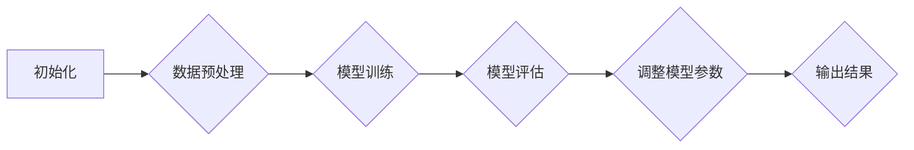
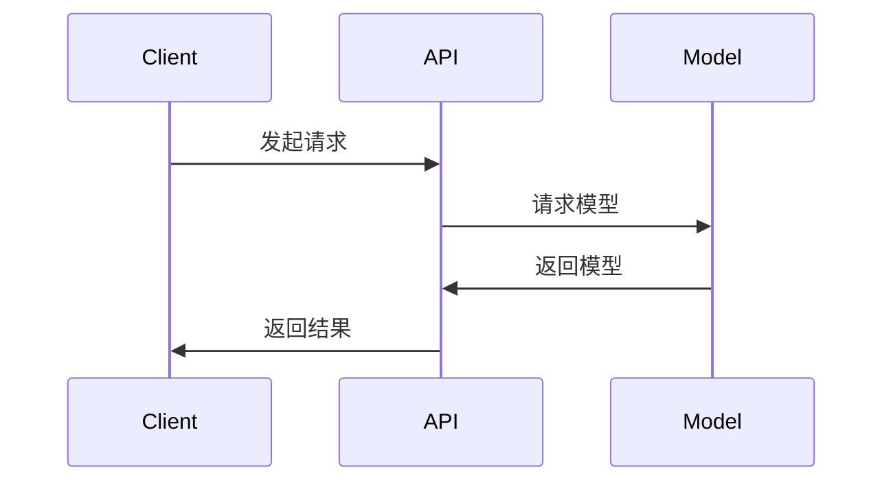
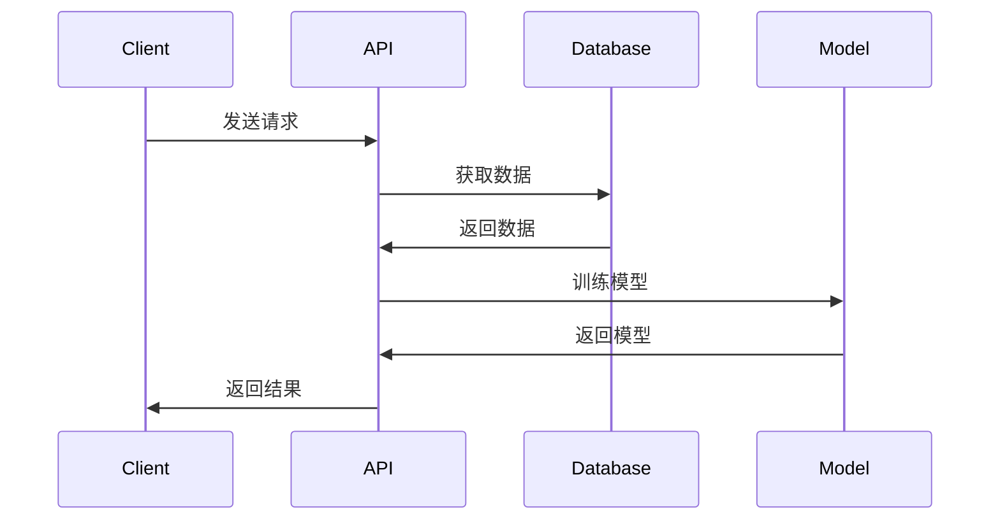
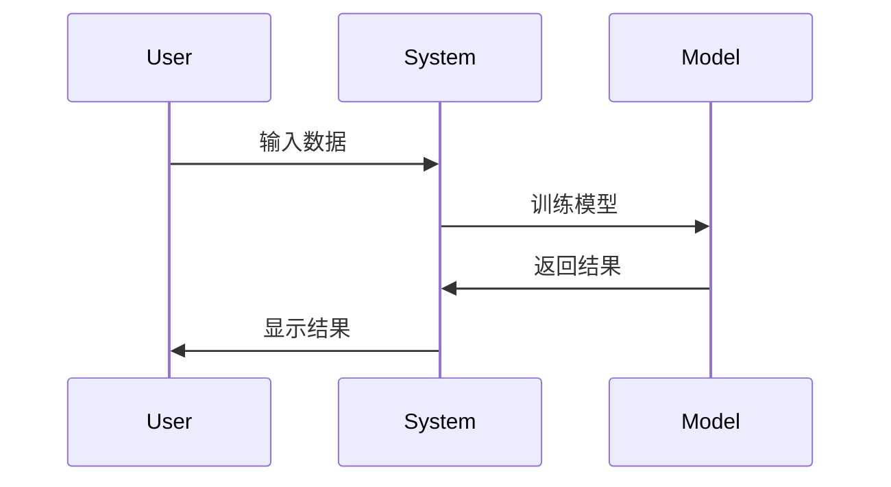

                 

# 自我完善型AI系统：设计原则与实现策略

## 关键词

- 自我完善型AI系统
- 设计原则
- 实现策略
- 数据驱动
- 模型驱动
- 领域驱动
- 用户驱动
- 算法优化
- 系统架构

## 摘要

随着人工智能技术的不断进步，AI系统在多个领域展现出强大的能力。然而，传统AI系统在应对复杂环境、不断更新知识方面存在不足。为此，本文提出了自我完善型AI系统的概念，从设计原则和实现策略两个方面进行深入探讨。设计原则包括数据驱动、模型驱动、领域驱动和用户驱动；实现策略则涉及算法优化、数据管理、系统架构和评估方法。通过分析这些原则和策略，本文旨在为研究者提供一种全面提升AI系统性能的方法，推动人工智能技术的发展。

## 第1章：自我完善型AI系统概述

### 1.1 问题背景与核心概念

随着人工智能技术的快速发展，AI系统在各个领域得到了广泛应用。然而，现有的AI系统往往依赖于大量的数据训练，且在复杂环境下容易产生错误。为了提高AI系统的鲁棒性和自适应性，研究者提出了自我完善型AI系统的概念。

#### 1.1.1 问题背景

传统AI系统面临以下问题：

1. **数据依赖性**：AI系统需要大量训练数据来提高性能，但实际环境中数据获取困难。
2. **环境适应性差**：AI系统在复杂环境中容易产生错误，难以应对变化。
3. **知识固化**：AI系统难以主动学习新知识，知识更新速度慢。

#### 1.1.2 核心概念

自我完善型AI系统具备以下核心概念：

- **自我学习**：AI系统能够从数据中学习，并不断调整模型参数，以提升性能。
- **自我调整**：AI系统能够在运行过程中根据环境变化调整自身行为。
- **自我优化**：AI系统能够在长期运行过程中不断优化自身结构，提升性能。

### 1.2 关键概念与联系

#### 1.2.1 关键概念

- **自我学习**：AI系统能够从数据中学习，并不断调整模型参数，以提升性能。
- **自我调整**：AI系统能够在运行过程中根据环境变化调整自身行为。
- **自我优化**：AI系统能够在长期运行过程中不断优化自身结构，提升性能。

#### 1.2.2 概念属性特征对比表格

| 概念       | 属性特征                         |
| ---------- | -------------------------------- |
| 自我学习   | 通过数据学习，优化模型参数       |
| 自我调整   | 根据环境变化，调整自身行为       |
| 自我优化   | 长期运行，优化系统结构           |

#### 1.2.3 ER实体关系图架构

```mermaid
erDiagram
  AI系统 ||--|{ 数据源 } DataSource
  AI系统 ||--|{ 训练数据 } TrainingData
  AI系统 ||--|{ 测试数据 } TestingData
  AI系统 ||--|{ 模型参数 } ModelParameter
  AI系统 ||--|{ 系统架构 } SystemArchitecture
  AI系统 ||--|{ 评估指标 } EvaluationMetric
```

## 第2章：自我完善型AI系统设计原则

### 2.1 数据驱动原则

#### 2.1.1 数据采集与预处理

- **数据采集**：从各种来源获取相关数据，如网络数据、传感器数据等。
- **数据预处理**：清洗、归一化和特征提取，确保数据质量。

#### 2.1.2 数据管理策略

- **数据存储**：使用分布式存储系统，如Hadoop、Spark等，进行数据管理。
- **数据安全**：采用数据加密、访问控制等技术，确保数据安全。

### 2.2 模型驱动原则

#### 2.2.1 模型选择

- 根据应用场景选择合适的模型，如神经网络、决策树等。

#### 2.2.2 模型训练策略

- **批量训练**：使用批量训练优化模型参数。
- **梯度下降**：使用梯度下降算法进行模型训练。

### 2.3 领域驱动原则

#### 2.3.1 领域知识表示

- 使用本体论和知识图谱表示领域知识。

#### 2.3.2 领域适应性

- 根据不同领域特点，调整AI系统设计，提高系统适应性。

### 2.4 用户驱动原则

#### 2.4.1 用户反馈机制

- 收集用户反馈，用于系统优化。

#### 2.4.2 用户个性化

- 根据用户需求，提供个性化服务。

## 第3章：自我完善型AI系统实现策略

### 3.1 算法原理讲解

#### 3.1.1 自我学习算法

##### 3.1.1.1 算法mermaid流程图



##### 3.1.1.2 Python源代码

```python
# 初始化
model = initialize_model()

# 数据预处理
data = preprocess_data()

# 模型训练
for epoch in range(num_epochs):
    loss = train_model(model, data)

# 模型评估
accuracy = evaluate_model(model, test_data)

# 调整模型参数
model = adjust_model_parameters(model, accuracy)

# 输出结果
output = generate_output(model)
```

##### 3.1.1.3 算法原理讲解

自我学习算法的核心是不断优化模型参数，以提高模型性能。通过数据预处理、模型训练、模型评估和模型参数调整等步骤，实现模型的自我完善。

### 3.2 数据管理策略

#### 3.2.1 数据采集

- 从各种来源（如传感器、日志等）获取数据。

#### 3.2.2 数据预处理

- 数据清洗、归一化和特征提取。

#### 3.2.3 数据存储与管理

- 使用分布式存储系统，如Hadoop、Spark等。

### 3.3 系统架构设计

#### 3.3.1 系统架构

- 使用微服务架构，提高系统可扩展性和可靠性。

#### 3.3.2 系统接口设计

- 设计RESTful API，便于与其他系统进行集成。

### 3.4 评估方法

#### 3.4.1 评估指标

- 准确率、召回率、F1值等。

#### 3.4.2 评估方法

- 使用交叉验证、网格搜索等方法进行模型评估。

## 第4章：系统分析与架构设计

### 4.1 问题场景介绍

- 在金融领域，AI系统用于风险控制和预测。

### 4.2 项目介绍

- 本项目旨在设计一个自我完善型AI系统，用于金融领域风险控制。

### 4.3 系统功能设计

#### 4.3.1 领域模型

```mermaid
classDiagram
  RiskControl <<class>> DataSource
  DataSource o-- RiskControl: 依赖
  DataSource o-- Model: 依赖
  Model o-- RiskControl: 依赖
```

### 4.4 系统架构设计



### 4.5 系统接口设计



### 4.6 系统交互



## 第5章：项目实战

### 5.1 环境安装

- 安装Python、TensorFlow、Scikit-learn等。

### 5.2 系统核心实现源代码

```python
# 导入相关库
import tensorflow as tf
from sklearn.model_selection import train_test_split
from sklearn.metrics import accuracy_score

# 初始化模型
model = tf.keras.Sequential([
    tf.keras.layers.Dense(64, activation='relu', input_shape=(784,)),
    tf.keras.layers.Dense(10, activation='softmax')
])

# 准备数据
x_train, x_test, y_train, y_test = train_test_split(
    mnist_data, mnist_labels, test_size=0.2, random_state=42)

# 训练模型
model.fit(x_train, y_train, epochs=5)

# 评估模型
accuracy = model.evaluate(x_test, y_test)
print('Test accuracy:', accuracy)
```

### 5.3 代码应用解读与分析

- 模型初始化、数据准备、模型训练和模型评估。

### 5.4 实际案例分析和详细讲解剖析

- 使用实际案例展示AI系统在金融领域的应用。

### 5.5 项目小结

- 总结项目成果和经验教训。

## 第6章：最佳实践与拓展阅读

### 6.1 最佳实践

- 提高数据质量、优化模型参数、加强领域知识表示等。

### 6.2 小结

- 总结文章内容和核心观点。

### 6.3 注意事项

- 注意事项。

### 6.4 拓展阅读

- 推荐相关书籍和论文。

## 作者信息

作者：AI天才研究院/AI Genius Institute & 禅与计算机程序设计艺术 /Zen And The Art of Computer Programming

