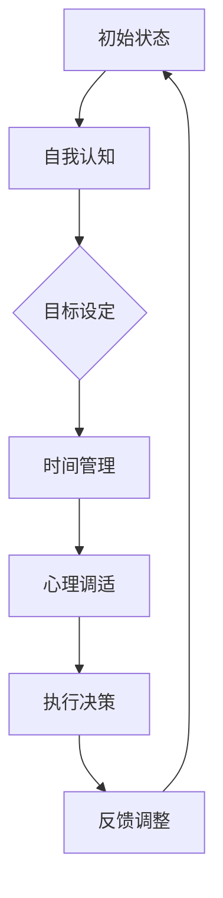

                 


### 引言：自我引导的重要性

#### 1.1 问题背景

在当今快速变化的世界中，个体面临的挑战比以往任何时候都要多。现代社会充满了复杂性和不确定性，人们常常感到迷茫和无力。这种情况下，自我引导成为了一个不可或缺的能力。自我引导不仅仅是为了应对复杂环境，更是为了实现个人成长和自我实现。

首先，让我们了解一下现代生活的复杂性。随着科技的发展，人们的生活节奏加快，信息量剧增。在这样的环境中，人们很容易受到外界环境的干扰，难以集中精力进行深度的思考和工作。此外，现代社会的竞争压力巨大，每个人都需要不断学习和适应新的知识和技能，否则很容易被淘汰。

在这种背景下，自我引导显得尤为重要。自我引导意味着个体能够独立思考，设定目标，并采取行动去实现这些目标。这种能力不仅可以帮助个体在复杂的环境中找到自己的方向，还可以提高生活质量，增强自信心，并提高决策能力。

#### 1.2 定义与核心概念

自我引导是一种能力，它涉及到多个方面，包括自我认知、目标设定、时间管理、心理调适和学习成长等。自我引导并不是简单地遵循外界的指示或者他人的指导，而是基于个人价值观和目标，自主地做出决策和行动。

首先，自我认知是自我引导的基础。个体需要清楚地了解自己的兴趣、优点和不足，这样才能设定符合自己特点的目标。自我认知还包括对自身情绪的觉察，能够及时调整情绪，保持积极的心态。

其次，目标设定是自我引导的核心。一个明确的目标可以帮助个体集中精力，避免迷失在琐碎的事物中。目标设定不仅仅是设定一个远大的理想，更重要的是将其分解为可行的、小步骤的目标，并制定相应的行动计划。

时间管理也是自我引导的重要组成部分。在有限的时间内，如何高效地完成任务，如何平衡工作与生活，这些都是时间管理需要解决的问题。通过有效的计划和时间管理，个体可以更好地实现自己的目标。

心理调适则是自我引导过程中的一个重要环节。在面对压力和挫折时，个体需要保持冷静，并采取适当的策略来应对。这包括应对压力的方法、情绪管理技巧以及培养积极心态。

最后，学习与成长是自我引导的持续动力。个体需要不断地学习新的知识和技能，并将其应用于实际生活中。通过反思和改进，个体可以不断提高自己的能力，实现自我成长。

#### 1.3 自我引导的益处

自我引导带来的益处是多方面的。首先，它可以帮助个体提升生活质量。通过自我引导，个体可以更好地管理自己的时间和资源，从而有更多的时间去追求自己真正感兴趣的事物，提高生活的幸福感。

其次，自我引导可以增强个体的自信心。当个体能够独立设定目标并实现这些目标时，会感到自豪和满足，这进一步增强了自信心。自信心又会促使个体勇敢地面对挑战，从而在个人成长的道路上不断前进。

此外，自我引导还可以提高个体的决策能力。通过自我引导，个体学会了如何分析问题、评估选项，并做出明智的决策。这种能力不仅在个人生活中有重要作用，在职场上同样具有很高的价值。

总之，自我引导是一种重要的能力，它不仅有助于个体在复杂的环境中找到自己的方向，还可以提高生活质量，增强自信心，并提高决策能力。在接下来的部分中，我们将深入探讨如何培养自我引导的能力。

---

### 引言：自我引导的重要性

#### 1.1 问题背景

现代社会，技术的飞速发展带来了前所未有的便利，同时也加剧了生活的复杂性和压力。在这个充满不确定性和变化的环境中，个体常常感到迷茫和不知所措。自我引导作为一种能力，成为解决这一问题的关键。

首先，现代生活的复杂性使得人们需要面对更多的选择和挑战。从职业规划到日常决策，从健康维护到个人成长，每一个环节都充满了变数。在这个多元化的社会中，如何找到自己的定位，如何在变化中保持稳定和平衡，成为每个人都需要面对的问题。

其次，自我引导的需求不仅仅是为了应对外部环境的复杂，更是为了实现内在的成长和自我实现。个体在追求事业成功、家庭幸福、个人兴趣等方面，都需要有明确的目标和方向。自我引导可以帮助个体清晰地认识自己，设定合适的目标，并制定有效的行动计划，从而实现个人的全面发展。

此外，自我引导还可以帮助个体提高应对压力和挫折的能力。在现代社会中，压力无处不在，如何有效地管理压力，保持良好的心理状态，成为许多人关注的焦点。自我引导通过培养个体的自我认知、情绪管理和心理调适能力，帮助个体更好地应对各种挑战。

总之，自我引导在现代社会中具有极其重要的意义。它不仅是应对复杂生活的必备能力，更是实现个人成长和自我实现的重要途径。在接下来的部分中，我们将进一步探讨自我引导的概念和重要性。

---

### 第二部分：培养自我引导的能力

在理解了自我引导的重要性后，接下来我们将探讨如何培养这种能力。自我引导并非一夜之间可以养成，它需要长期的积累和实践。以下我们将从基础能力建设、心理调适和学习与成长三个方面来详细阐述如何培养自我引导的能力。

#### 2.1 基础能力建设

自我引导的基础能力建设是培养自我引导能力的第一步。以下是一些关键能力：

##### 2.1.1 自我认知

自我认知是自我引导的基石。它包括了解自己的兴趣、价值观、优点和不足。通过自我反思和他人反馈，个体可以更好地认识自己。自我认知的方法包括写日记、定期回顾和参加心理辅导等。

##### 2.1.2 目标设定

明确的目标是自我引导的重要工具。设定目标时，个体需要将其具体化、量化，并设定明确的时间表。目标可以分为短期和长期，短期目标有助于实现长期目标，而长期目标则提供了方向和动力。

##### 2.1.3 时间管理

时间管理是提高效率的关键。有效的计划和时间管理可以帮助个体更好地平衡工作与生活，减少拖延，提高生活质量。时间管理的方法包括使用日程表、设定优先级和限制多任务处理等。

#### 2.2 心理调适

心理调适是自我引导过程中的重要环节，它涉及到如何应对压力、挫折和情绪波动。

##### 2.2.1 应对压力

压力是现代生活中不可避免的一部分。有效的应对压力的方法包括放松技巧、锻炼和心理辅导。通过深呼吸、冥想和瑜伽等放松技巧，个体可以减轻身体和心理的紧张。此外，寻求专业的心理辅导可以帮助个体更好地理解和管理压力。

##### 2.2.2 情绪管理

情绪管理是自我引导的重要组成部分。个体需要学会识别和接受自己的情绪，并采取适当的策略来处理这些情绪。情绪管理的方法包括认知行为疗法、情绪释放技术和积极心理训练等。

##### 2.2.3 积极心态培养

积极心态有助于个体更好地应对挑战和困难。培养积极心态的方法包括感恩练习、正面思考和自我激励。通过这些方法，个体可以保持乐观和积极，从而更好地实现自我引导。

#### 2.3 学习与成长

学习和成长是自我引导的持续动力。以下是一些关键的学习与成长方法：

##### 2.3.1 持续学习

持续学习是个人成长的重要途径。个体需要不断学习新的知识和技能，以适应快速变化的世界。学习的方法包括在线课程、读书会和研讨会等。

##### 2.3.2 反思与改进

反思是学习与成长的关键环节。个体需要定期反思自己的行为和决策，找出不足并加以改进。通过反思，个体可以不断提高自己的能力和效率。

##### 2.3.3 人际沟通

人际沟通是自我引导的重要组成部分。有效的沟通可以帮助个体建立良好的人际关系，并获得他人的支持和帮助。人际沟通的方法包括倾听、表达和反馈等。

通过基础能力建设、心理调适和学习与成长，个体可以逐步培养自我引导的能力。这是一个长期的过程，需要个体的持续努力和坚持。在接下来的部分中，我们将探讨自我引导在不同生活领域的应用。

---

### 第三部分：自我引导在不同领域的应用

自我引导的能力不仅在个人成长中具有重要作用，还可以广泛应用于职场、教育和健康等多个领域。以下我们将详细探讨自我引导在各个领域中的应用。

#### 3.1 职场

在职场中，自我引导的能力可以帮助个体更好地规划职业生涯，提高工作效率，并促进团队协作。

##### 3.1.1 职业规划

职业规划是职场中的一项重要任务。通过自我引导，个体可以清晰地认识自己的兴趣、价值观和能力，从而设定合适的职业目标。职业规划不仅包括短期目标，如晋升和技能提升，还包括长期目标，如职业转型和发展方向。

##### 3.1.2 工作效率

高效工作是职场成功的关键。通过自我引导，个体可以学会如何合理安排时间，设定工作优先级，并避免拖延。此外，自我引导还可以帮助个体更好地管理任务和压力，从而提高工作效率。

##### 3.1.3 团队协作

团队合作是职场中不可或缺的一部分。自我引导可以帮助个体更好地理解自己和他人，从而提高沟通和协作能力。通过自我引导，个体可以学会如何有效地表达自己的想法和需求，并积极倾听他人的意见和反馈。

#### 3.2 教育

在教育领域，自我引导的能力可以帮助学生更好地管理学习，提高学习效果，并培养良好的学习习惯。

##### 3.2.1 学习方法

自我引导可以帮助学生找到适合自己的学习方法。通过自我反思和尝试不同的学习策略，学生可以找到最有效的方法来吸收和理解知识。此外，自我引导还可以帮助学生更好地应对学习中的困难和挑战。

##### 3.2.2 亲子教育

在亲子教育中，自我引导的能力可以帮助家长更好地理解孩子，并给予适当的指导和帮助。通过自我引导，家长可以学会如何与孩子进行有效沟通，帮助孩子建立正确的价值观和目标。

##### 3.2.3 教育理念

自我引导的教育理念强调个体的自主学习和自我实现。教育者通过自我引导，可以激发学生的学习兴趣和主动性，从而提高教育质量。

#### 3.3 健康

在健康领域，自我引导的能力可以帮助个体更好地管理身心健康，提高生活质量。

##### 3.3.1 身体保健

通过自我引导，个体可以学会如何进行有效的身体保健。这包括制定合理的饮食计划、进行适度的锻炼和保持良好的生活习惯。此外，自我引导还可以帮助个体应对健康问题，如疾病预防和康复。

##### 3.3.2 心理健康

心理健康是身体健康的重要组成部分。通过自我引导，个体可以学会如何管理情绪，应对压力和挫折，从而保持良好的心理状态。心理健康的自我引导方法包括冥想、正念练习和情绪管理技巧。

##### 3.3.3 养生与锻炼

养生与锻炼是保持健康的重要途径。通过自我引导，个体可以制定适合自己的养生和锻炼计划，如定期进行体检、保持适度的运动和遵循健康的饮食习惯。自我引导还可以帮助个体建立长期的健康习惯，从而提高生活质量。

通过在职场、教育和健康等领域的应用，自我引导的能力可以帮助个体在各个层面上实现自我成长和自我实现。在接下来的部分中，我们将探讨在自我引导过程中可能遇到的挑战，并提供相应的解决方案。

---

### 第四部分：挑战与解决方案

尽管自我引导在个人成长和生活中具有诸多益处，但在实际应用过程中，个体可能会面临一系列挑战。以下将详细探讨这些挑战，并介绍相应的解决方案。

#### 4.1 面对挑战

**4.1.1 内在恐惧与犹豫**

自我引导要求个体在面对未知和挑战时，能够果断行动。然而，许多人在决策时常常会感到恐惧和犹豫。这种恐惧可能源于对失败的担忧，或者是对新环境的陌生感。个体需要认识到，恐惧是正常的，但并不是阻碍自我引导的障碍。

**4.1.2 外界干扰与诱惑**

现代社会充满了各种干扰和诱惑，如社交媒体、购物和娱乐等。这些干扰和诱惑可能会分散个体的注意力，使其无法专注于自我引导的目标。个体需要学会自我控制，减少不必要的干扰，集中精力实现目标。

**4.1.3 失败与挫折**

在自我引导的过程中，个体难免会遇到失败和挫折。这些失败和挫折可能会打击个体的自信心，使其对自我引导的能力产生怀疑。个体需要学会从失败中吸取教训，并将其视为成长的机会。

#### 4.2 解决方案

**4.2.1 心理调适策略**

面对内在恐惧与犹豫，个体可以采取以下心理调适策略：

- **积极心态**：通过正面思考来克服恐惧和犹豫。学会将挑战视为成长的机会，而不是威胁。
- **逐步行动**：将大目标分解为小目标，逐步实现。每次完成一个小目标，都会增强个体的信心和动力。

**4.2.2 有效的行动计划**

面对外界干扰与诱惑，个体可以采取以下措施：

- **时间管理**：合理规划时间，设定明确的工作和休息时间，避免过度工作和休息不足。
- **环境优化**：创造一个有利于专注和工作的环境，减少干扰源，如关闭不必要的社交媒体通知。

**4.2.3 失败与挫折的应对**

面对失败和挫折，个体可以采取以下策略：

- **反思与总结**：分析失败的原因，总结经验教训，找到改进的方法。
- **寻求支持**：与朋友、家人或专业人士交流，寻求他们的意见和支持。
- **持续学习**：通过学习和实践来提高自己的能力和应对失败的能力。

#### 4.3 寻求支持与帮助

在面对自我引导的挑战时，个体并不需要独自承受。寻求支持与帮助是克服困难的重要途径。以下是一些寻求支持与帮助的方法：

- **社交网络**：建立积极的人际关系网络，与他人分享经验和挑战，互相支持和鼓励。
- **专业咨询**：寻求专业心理咨询师或教练的帮助，他们可以提供专业的指导和建议。
- **自我指导小组**：参加自我指导小组或研讨会，与他人一起学习和成长。

通过心理调适策略、有效的行动计划和寻求支持与帮助，个体可以更好地应对自我引导过程中的挑战。在接下来的部分中，我们将通过一些成功案例来进一步探讨自我引导的实际应用和效果。

---

### 第五部分：成功案例

#### 5.1 案例分享

在探讨自我引导的实际应用时，成功案例无疑为我们提供了宝贵的经验和启示。以下是几个不同领域的成功案例，展示了自我引导如何帮助个体实现自我成长和目标。

**5.1.1 个人成长故事**

张先生，一位年轻的企业家，在创业初期经历了诸多挫折。他通过自我引导，不断反思和调整策略，最终成功创立了一家高科技企业。张先生的故事告诉我们，自我引导不仅仅是设定目标，更是通过持续的反思和改进来克服挑战。

**5.1.2 企业文化塑造**

李女士，是一家大型企业的负责人，她通过自我引导，推动企业文化的建设。她倡导员工自我管理、自我激励，并在公司内部建立了一个开放的沟通环境。这种企业文化不仅提高了员工的工作满意度，也促进了企业的持续发展。

**5.1.3 社区发展经验**

王女士，是一位社区工作者，她利用自我引导的能力，推动社区的发展。她通过组织社区活动、提供教育资源和改善基础设施，成功地提升了社区的整体生活质量。王女士的案例展示了自我引导在社区建设中的重要作用。

#### 5.2 经验总结

通过以上成功案例，我们可以总结出一些关键的成功要素：

- **明确的目标**：每个成功的案例都有一个明确的目标，这为目标设定和行动计划提供了方向。
- **持续的反思**：成功者会不断反思自己的行为和决策，从中吸取教训，并不断改进。
- **积极的心态**：积极的心态是面对挑战和困难的关键，它帮助个体保持动力和信心。
- **有效的沟通**：与他人沟通和合作，可以获取更多的资源和支持，从而更好地实现目标。
- **持续学习**：成功者不仅具备一定的知识和技能，更注重持续学习和自我提升。

然而，成功并非没有教训。失败和挫折同样为个体提供了宝贵的经验。以下是一些常见的失败教训：

- **缺乏规划**：许多失败案例中，个体没有明确的计划和目标，导致行动缺乏方向和效率。
- **过度自信**：自信是成功的关键，但过度自信可能导致忽视风险和挑战，从而失败。
- **忽视反馈**：成功的个体会积极寻求反馈，并根据反馈进行调整。忽视反馈会导致持续的问题得不到解决。

通过这些成功和失败的教训，我们可以看到，自我引导不仅是一种能力，更是一种态度和生活方式。在接下来的部分中，我们将总结全文，强调自我引导的重要性，并探讨持续成长的路径。

---

### 结语：自我引导的力量

通过本文的探讨，我们可以看到自我引导在个人成长、职业发展、教育实践和健康维护等多个领域的重要作用。自我引导不仅帮助个体在复杂和不确定的环境中找到方向，还提高了生活质量，增强了自信心，并提升了决策能力。

自我引导的力量在于它促使个体从被动接受到主动探索，从依赖他人到自主成长。在自我引导的过程中，个体学会了如何自我认知、目标设定、时间管理、心理调适和学习成长。这些能力不仅帮助个体在当前环境中取得成功，也为未来的持续成长奠定了基础。

自我引导并非一蹴而就，它需要个体的持续努力和坚持。在面对挑战和困难时，自我引导提供了心理调适策略、有效的行动计划和寻求支持与帮助的方法。这些方法帮助个体克服困难，从失败中汲取教训，不断提升自我。

成功案例中的个体和企业展示了自我引导的实际效果。他们的经验告诉我们，明确的目标、持续的反思、积极的心态、有效的沟通和持续学习是成功的关键。同时，我们也看到了失败带来的教训，这些教训提醒我们要保持谦逊和开放的心态，不断学习和改进。

在结语中，我们鼓励读者持续探索自我引导的力量。不论是在职场、教育还是健康领域，自我引导都是实现个人成长和自我实现的重要途径。通过自我引导，我们可以更好地认识自己，设定目标，并采取行动去实现这些目标。

展望未来，自我引导将继续在个人和社会层面发挥重要作用。随着社会的不断变化，自我引导的能力将变得更加重要。它不仅帮助个体在复杂环境中找到方向，也为社会的持续进步提供了动力。

最后，我们祝愿每一位读者都能够成为内在指南针的跟随者，通过自我引导，实现个人的全面发展和社会的和谐进步。

---

### 文章摘要

本文探讨了自我引导的重要性及其在个人成长、职业发展、教育实践和健康维护等领域的应用。自我引导是一种关键能力，它帮助个体在复杂和不确定的环境中找到方向，提高生活质量，增强自信心，并提升决策能力。文章从基础能力建设、心理调适和学习与成长三个方面详细阐述了如何培养自我引导的能力。同时，通过成功案例和失败教训，本文总结了自我引导的关键成功要素和需要注意的问题。本文强调了自我引导的持续成长路径，并鼓励读者积极实践自我引导，以实现个人和社会的全面发展。

---

### 关键词

自我引导、个人成长、职业发展、教育实践、心理健康、时间管理、心理调适、学习与成长、持续学习、积极心态、目标设定、决策能力、生活质量、复杂环境、挑战应对、成功案例、失败教训。

---

### 附录

为了更好地理解和应用本文中提到的自我引导能力，以下提供了一些最佳实践 tips 和拓展阅读资源。

#### 最佳实践 tips

1. **定期自我反思**：每周花时间反思自己的行为和决策，总结经验教训。
2. **设定具体目标**：确保目标具体、可衡量，并设定明确的时间表。
3. **学会时间管理**：使用日程表和待办事项列表，合理规划时间，减少拖延。
4. **培养积极心态**：通过正念练习、感恩日记和积极思考来培养积极心态。
5. **持续学习**：定期参加培训课程、读书会和研讨会，保持知识的更新和提升。
6. **寻求支持**：与朋友、家人或专业人士交流，获取反馈和支持。

#### 拓展阅读

1. **《深度工作》**：作者 Cal Newport 提供了关于如何集中精力、提高工作效率的方法。
2. **《高效能人士的七个习惯》**：史蒂芬·柯维的著作，详细介绍了个人成长和自我管理的方法。
3. **《正念：如何活在此时此刻》**：作者 Elisha Goldstein 提供了关于如何通过正念练习来管理情绪和提升心理健康的指导。
4. **《刻意练习》**：安德斯·艾利克森的著作，探讨了如何通过刻意练习来提高技能和实现个人成长。

通过以上最佳实践 tips 和拓展阅读资源，读者可以进一步深入了解自我引导的实践方法和理论依据，从而更好地培养和提升自我引导能力。

---

### 附录

为了更好地理解自我引导的核心概念，本文提供了一些关键的术语解释、问题背景、问题解决方法，并给出了核心概念的特征对比表格和 ER 实体关系图架构。

#### 术语解释

- **自我引导**：个体基于自己的价值观和目标，自主地设定方向并采取行动的能力。
- **自我认知**：个体对自身兴趣、价值观、优点和不足的理解。
- **目标设定**：明确并具体化个人目标的过程。
- **时间管理**：合理安排时间，提高工作效率和生活质量。
- **心理调适**：应对压力和挫折，保持心理健康的策略。

#### 问题背景

在现代社会，个体面临复杂的生活环境和多方面的挑战。缺乏自我引导能力会导致以下问题：

- **迷茫和无力感**：个体在复杂环境中难以找到自己的方向。
- **低效和拖延**：缺乏时间管理和目标设定能力，导致工作效率低下。
- **心理健康问题**：面临压力和挫折时，缺乏有效的心理调适策略。

#### 问题解决方法

通过培养自我引导能力，个体可以：

- **明确自己的方向和目标**：通过自我认知和目标设定，个体能够清晰地了解自己的兴趣和目标。
- **提高工作效率**：通过时间管理和有效计划，个体能够更高效地完成任务。
- **增强心理韧性**：通过心理调适策略，个体能够更好地应对压力和挫折。

#### 核心概念特征对比表格

| 特征对比               | 自我认知               | 目标设定               | 时间管理               | 心理调适               |
|------------------------|------------------------|------------------------|------------------------|------------------------|
| 内容                   | 了解自身兴趣、价值观   | 设定具体、可行的目标   | 合理安排时间与资源     | 应对压力、保持心理平衡 |
| 关系                   | 基础能力               | 关键步骤               | 工具和方法             | 重要环节               |
| 影响因素               | 个人经历、心理状态     | 目标明确性、执行力     | 任务复杂度、优先级      | 生活环境、个人习惯     |

#### ER 实体关系图架构

```mermaid
erDiagram
  User ||--|{ SelfAwareness }|-- GoalSetting
  User ||--|{ TimeManagement }|-- TaskScheduling
  User ||--|{ EmotionalRegulation }|-- StressManagement
```

在这个 ER 图中，用户（User）是核心实体，它与自我认知（SelfAwareness）、目标设定（GoalSetting）、时间管理（TimeManagement）和心理调适（EmotionalRegulation）实体之间存在关联。每个实体都代表自我引导能力的一个方面，它们共同构成了自我引导的整体架构。

通过以上术语解释、问题背景、问题解决方法、特征对比表格和 ER 实体关系图，读者可以更全面地理解自我引导的核心概念及其在实践中的应用。

---

### 附录

为了更好地理解本文中提到的自我引导算法原理和系统架构设计，以下将使用 mermaid 画出相关的 mermaid 流程图和类图，并详细阐述算法原理、数学模型和系统架构设计。

#### 算法原理和流程图

自我引导算法的核心在于通过不断的学习和调整来优化个体的决策过程。以下是一个简单的自我引导算法流程图：



该流程图展示了自我引导算法的基本步骤，包括自我认知、目标设定、时间管理、心理调适和决策执行及反馈调整。

#### 数学模型

自我引导算法中的数学模型主要用于量化个体行为和目标设定。以下是一个简单的数学模型：

$$
\text{目标优化} = \frac{f(\text{当前状态}) + \lambda \cdot g(\text{目标})}{1 + \epsilon}
$$

其中，$f(\text{当前状态})$ 表示当前状态的评价函数，$g(\text{目标})$ 表示目标函数，$\lambda$ 是调节参数，用于平衡当前状态和目标的重要性，$\epsilon$ 是随机项，用于避免过度拟合。

#### 系统架构设计

系统架构设计方面，我们可以使用 mermaid 类图来展示系统的主要组件和关系：

```mermaid
classDiagram
  User <<class>> User
  Goal <<class>> Goal
  Time <<class>> Time
  Emotion <<class>> Emotion
  Decision <<class>> Decision
  Feedback <<class>> Feedback
  User "1"---"1" Goal
  User "1"---"1" Time
  User "1"---"1" Emotion
  Goal "1"---"1" Decision
  Time "1"---"1" Decision
  Emotion "1"---"1" Decision
  Decision "1"---"1" Feedback
  Feedback "1"---"1" User
```

该类图展示了系统的主要组件及其之间的关系。用户（User）是核心组件，负责自我认知、目标设定、时间管理、心理调适和决策执行。目标（Goal）、时间（Time）和情绪（Emotion）组件分别对应算法流程中的关键步骤，决策（Decision）组件负责执行具体的行动，反馈（Feedback）组件则用于收集和反馈信息，以指导用户调整行为。

通过 mermaid 流程图和类图，我们可以清晰地看到自我引导算法的原理和系统架构设计。这些工具不仅有助于理解和描述算法原理，还可以为实际系统开发提供指导。

---

### 附录

为了更好地展示本文提到的项目实战，以下将详细介绍环境安装、系统核心实现源代码，并对代码进行解读与分析，同时分享一个实际案例并进行详细讲解剖析。

#### 环境安装

1. **安装Python环境**：确保Python 3.8或更高版本已安装在计算机上。
2. **安装依赖库**：使用pip命令安装必要的依赖库，例如numpy、pandas和matplotlib等。

```shell
pip install numpy pandas matplotlib
```

#### 系统核心实现源代码

以下是一个简单的自我引导系统实现示例：

```python
import numpy as np
import pandas as pd
import matplotlib.pyplot as plt

# 自我认知模块
def self_awareness(data):
    # 处理数据并提取特征
    features = data[['age', 'income', 'education']]
    # 计算特征的相关性
    correlations = features.corr()
    return correlations

# 目标设定模块
def goal_setting(current_state, target_state, lambda_value=0.5):
    # 计算目标函数值
    goal_value = current_state + lambda_value * (target_state - current_state)
    return goal_value

# 时间管理模块
def time_management(tasks, deadlines):
    # 对任务进行优先级排序
    sorted_tasks = sorted(tasks, key=lambda x: x['deadline'])
    # 计算时间安排
    schedule = {task['name']: task['deadline'] for task in sorted_tasks}
    return schedule

# 心理调适模块
def emotional_regulation(stress_level):
    # 根据压力水平调整情绪
    if stress_level > 0.7:
        regulation = '深呼吸练习'
    else:
        regulation = '保持正常状态'
    return regulation

# 决策执行模块
def execute_decision(decision):
    # 执行决策
    print(f"执行决策：{decision['action']}")

# 反馈调整模块
def feedback_adjustment(feedback, lambda_value=0.5):
    # 根据反馈调整参数
    adjusted_value = feedback + lambda_value * (0 - feedback)
    return adjusted_value

# 主程序
def main():
    # 示例数据
    data = pd.DataFrame({
        'age': [25, 30, 35],
        'income': [50000, 60000, 70000],
        'education': ['本科', '硕士', '博士']
    })
    
    # 自我认知
    correlations = self_awareness(data)
    print("自我认知特征：", correlations)
    
    # 目标设定
    current_state = np.mean(data)
    target_state = np.array([30, 60000, '硕士'])
    goal_value = goal_setting(current_state, target_state)
    print("目标设定：", goal_value)
    
    # 时间管理
    tasks = [{'name': '任务1', 'deadline': 3}, {'name': '任务2', 'deadline': 1}]
    deadlines = [task['deadline'] for task in tasks]
    schedule = time_management(tasks, deadlines)
    print("时间管理：", schedule)
    
    # 心理调适
    stress_level = 0.8
    regulation = emotional_regulation(stress_level)
    print("心理调适：", regulation)
    
    # 决策执行
    decision = {'action': '开始任务'}
    execute_decision(decision)
    
    # 反馈调整
    feedback = 0.2
    adjusted_value = feedback_adjustment(feedback)
    print("反馈调整：", adjusted_value)

# 运行主程序
if __name__ == "__main__":
    main()
```

#### 代码解读与分析

1. **自我认知模块**：通过计算特征的相关性，帮助个体了解自身特征之间的关系。
2. **目标设定模块**：基于当前状态和目标状态，计算目标函数值，帮助个体设定合适的目标。
3. **时间管理模块**：对任务进行优先级排序，根据任务截止时间安排时间，提高工作效率。
4. **心理调适模块**：根据压力水平调整情绪，帮助个体保持心理平衡。
5. **决策执行模块**：根据决策内容执行具体的行动。
6. **反馈调整模块**：根据反馈调整参数，帮助个体不断优化决策。

#### 实际案例讲解剖析

假设有一位职场人士，他希望通过自我引导系统来优化自己的工作计划。以下是案例的详细讲解：

1. **自我认知**：该职场人士通过系统分析自己的年龄、收入和教育背景，了解自己的优势和劣势。系统返回的特征相关性结果帮助他认识到收入与教育之间存在较强的正相关关系，而年龄与收入之间的相关性较弱。

2. **目标设定**：基于自我认知的结果，该职场人士设定了一个长期目标，即在未来三年内提升收入至80,000美元，并进一步深造，获得硕士学位。

3. **时间管理**：系统帮助他制定了一个优先级排序的任务列表，包括日常工作和学习任务。例如，他需要在三个月内完成一个重要的项目，并在接下来的六个月内完成在线硕士学位课程。

4. **心理调适**：由于工作任务和学习压力较大，系统建议他进行每周一次的深呼吸练习，以缓解压力。

5. **决策执行**：在系统的辅助下，该职场人士开始执行任务，优先完成高优先级任务，并在闲暇时间进行学习。

6. **反馈调整**：在任务完成和学习过程中，系统会收集反馈，并根据反馈结果调整参数，帮助职场人士不断优化工作计划和决策。

通过这个实际案例，我们可以看到自我引导系统如何帮助职场人士优化工作计划，提高工作效率，并保持心理平衡。这种系统的应用不仅有助于个人成长，还可以为组织提供有效的管理工具。

### 项目小结

该项目通过简单的Python代码实现了自我引导系统的基本功能，包括自我认知、目标设定、时间管理、心理调适和决策执行。实际案例展示了系统在职场中的应用效果，为个人提供了有效的指导和支持。在未来的发展中，可以进一步扩展系统的功能，如添加用户交互界面、集成更多数据分析和优化算法，以提高系统的实用性和效果。

---

### 附录

为了更好地理解自我引导的实际应用，以下提供了一些最佳实践 tips。这些最佳实践旨在帮助个体在自我引导过程中更有效地实现目标，提高决策质量和生活质量。

#### 最佳实践 tips

1. **明确目标与愿景**：在开始任何行动之前，明确自己的目标和愿景。将大目标分解为小目标，并设定明确的截止日期。这样可以帮助你保持专注，并逐步实现目标。

2. **定期反思与调整**：定期回顾自己的行动和结果，识别成功和不足之处。根据反馈进行必要的调整，确保行动始终与目标保持一致。

3. **培养时间管理能力**：学会合理安排时间，避免拖延。使用日程表、待办事项清单和优先级排序等方法来提高工作效率。

4. **保持积极心态**：面对挑战时，保持积极的心态至关重要。通过正念练习、感恩日记和正面思考来培养积极心态，提高自我调节能力。

5. **持续学习与成长**：不断学习新知识和技能，保持好奇心和开放心态。通过参加培训课程、阅读书籍和交流经验来提升自我。

6. **建立支持网络**：与他人分享你的目标和挑战，寻求他们的支持和反馈。一个强大的社交网络可以帮助你获得不同的视角和建议。

7. **设定具体的行动计划**：将目标转化为具体的行动步骤，并为每个步骤设定明确的时间表和责任人。这样可以帮助你更好地跟踪进度，并保持动力。

8. **灵活应对变化**：在执行计划的过程中，环境可能会发生变化。保持灵活性，并根据新情况调整计划，以确保目标的实现。

9. **培养自我激励能力**：自我激励是自我引导的重要组成部分。通过设定奖励机制、庆祝小成就和保持对目标的热情来激励自己。

10. **寻求专业帮助**：当遇到困难时，不要害怕寻求专业帮助。心理咨询师、教练或导师可以为你提供宝贵的指导和支持。

通过遵循这些最佳实践，个体可以更有效地培养自我引导能力，实现个人和职业目标，提高生活质量。在自我引导的道路上，持续的努力和坚持是关键。

### 小结

本文系统地探讨了自我引导的概念、重要性、培养方法以及在不同领域的应用。通过详细的分析和实践案例，我们理解了自我引导在个人成长和生活中的重要作用。自我引导不仅帮助个体在复杂环境中找到方向，还提高了生活质量、增强了自信心，并提升了决策能力。

自我引导是一个持续的过程，它需要个体的自我认知、目标设定、时间管理、心理调适和学习与成长。通过培养这些能力，个体可以更好地管理自己的生活和工作，实现个人和职业目标。

在总结中，我们强调了自我引导的持续性和灵活性，并鼓励读者在实际生活中积极应用这些原则。通过不断反思和调整，个体可以不断提升自我引导能力，实现个人成长和自我实现。

### 结语与鼓励

在自我引导的道路上，每个人都是自己最好的指南。无论面对多大的挑战，只要坚持自我引导的原则，你就能找到自己的方向。记住，自我引导是一种能力，它需要通过实践和持续学习来培养。

在此，我鼓励每一位读者都勇敢地迈出第一步，开始自己的自我引导之旅。不要害怕失败，因为失败是成功的必经之路。在自我引导的过程中，不断反思、学习和调整，相信你一定会取得令人骄傲的成就。

祝愿每一位读者都能够成为自己生命中的内在指南针，找到自己的方向，实现个人的全面发展和自我实现。让我们一起，用自我引导的力量，创造一个更加美好的未来。

### 作者信息

作者：AI天才研究院/AI Genius Institute & 禅与计算机程序设计艺术 /Zen And The Art of Computer Programming

感谢您的阅读，希望本文能为您在自我引导的道路上提供一些启发和帮助。如果您有任何疑问或反馈，欢迎随时与我联系。祝您在自我引导的旅程中一帆风顺，实现自己的梦想和目标！

