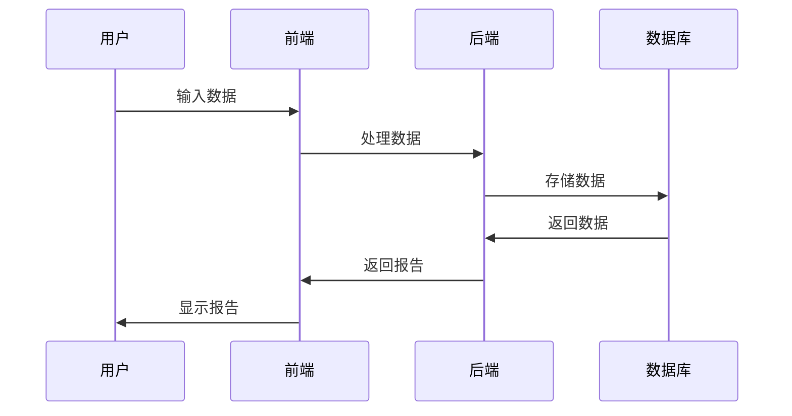
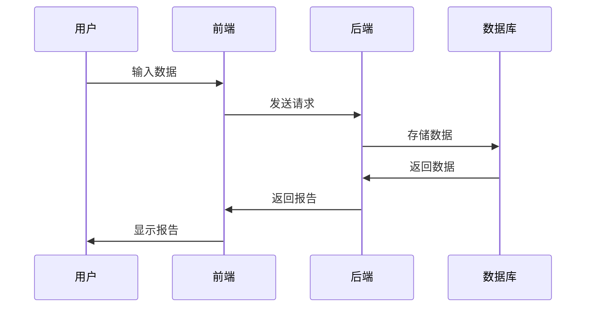

                 


### 自我探索之旅：深入了解内心世界

> 关键词：自我探索、心理学、内心世界、认知、情感、动机、实践应用

> 摘要：本文旨在引导读者踏上自我探索的旅程，通过深入理解内心世界，提高自我认知和情绪管理能力。我们将探讨自我探索的重要性和理论基础，分析核心概念及其关系，介绍心理学研究方法，使用数学模型和公式进行解释，展示系统架构设计，并通过实际案例进行项目实战分析，最后总结最佳实践并提供拓展阅读建议。

---

# 目录

1. **引言：自我探索的重要性**
2. **背景介绍：心理学与自我探索**
3. **核心概念与联系**
   1. **自我意识**
   2. **情感**
   3. **动机**
4. **心理学研究方法**
5. **数学模型与公式**
6. **系统分析与架构设计**
7. **项目实战**
8. **最佳实践与建议**
9. **小结**
10. **拓展阅读**

---

## 引言：自我探索的重要性

在现代社会，个体成长和心理健康日益受到重视。自我探索成为人们认识自我、提升自我意识和情感管理能力的重要途径。自我探索不仅关乎个体的心理健康，也影响着人际关系和社会功能。因此，深入了解内心世界，有助于我们更好地应对生活中的挑战。

### 自我探索的必要性

- **认知提升**：自我探索有助于我们更清晰地了解自己的思维模式、行为习惯和价值观，从而提高自我认知水平。
- **情绪管理**：通过探索内心世界，我们可以更好地理解和管理自己的情绪，减少焦虑和抑郁等负面情绪的影响。
- **人际关系**：自我探索有助于建立良好的人际关系，通过了解自己和他人的需求，提高沟通能力和协作效率。
- **心理健康**：自我探索是心理健康的重要保障，有助于预防心理问题，提高生活质量。

### 本文目的

本文旨在为读者提供一次系统、深入的自我探索之旅。通过以下内容的分析，我们将帮助读者：

- 理解自我探索的重要性和理论基础。
- 掌握核心概念及其相互关系。
- 学习心理学研究方法及其应用。
- 使用数学模型和公式进行深入分析。
- 了解系统架构设计及其实现。
- 通过项目实战加深理解。
- 提供最佳实践和建议，助力自我成长。

---

## 背景介绍：心理学与自我探索

心理学是研究人类行为和心理过程的科学，自我探索作为心理学的一个重要分支，关注个体的内在体验、认知结构和情感状态。本节将介绍心理学的基本概念和自我探索的理论基础。

### 心理学的基本概念

- **心理学定义**：心理学是一门研究人类行为和心理过程的科学，旨在理解和解释个体的行为、思维和情感。
- **心理学分支**：心理学可以分为多个分支，包括认知心理学、社会心理学、发展心理学、临床心理学等，每个分支都有其特定的研究领域和研究方法。
- **心理学研究方法**：心理学研究方法包括实验研究、问卷调查、观察法、案例研究等，这些方法帮助研究者收集和分析数据，以揭示心理现象的规律。

### 自我探索的理论基础

- **自我意识**：自我意识是自我探索的核心概念，指的是个体对自己的认知、情感和行为的主观体验。自我意识包括自我认知、自我评价、自我控制和自我反思等方面。
- **情感**：情感是人的基本心理体验，包括快乐、悲伤、愤怒、恐惧等。情感与自我探索密切相关，因为情感体验是我们认识自己和理解他人的重要途径。
- **动机**：动机是指个体为了实现特定目标而采取的行动的动力。动机与自我探索的关系在于，我们的动机往往受到自我意识和情感状态的影响，同时也影响我们的行为和决策。

### 自我探索的历史与发展

- **早期心理学研究**：自我探索的概念可以追溯到古希腊哲学家苏格拉底和亚里士多德，他们提出了关于自我和认知的思想。
- **现代心理学研究**：20世纪以来，心理学研究逐渐科学化，自我探索成为心理学研究的重要领域。心理学家如詹姆斯·马克斯·埃德蒙兹（James Marcia）和乔治·米德（George Herbert Mead）等对自我探索进行了深入研究，提出了自我认同和自我效能等概念。
- **现代自我探索实践**：随着心理学理论的发展，自我探索逐渐应用于临床治疗、教育和个人发展等领域。心理咨询师、教练和心理学家等专业人士使用自我探索的方法帮助个体认识和解决心理问题。

### 总结

心理学与自我探索密切相关，自我探索不仅是心理学的核心研究领域，也是个体成长和心理健康的重要途径。通过了解心理学的基本概念和自我探索的理论基础，我们可以更好地进行自我探索，提高自我认知和情感管理能力。

---

## 核心概念与联系

在自我探索之旅中，理解核心概念及其相互关系至关重要。自我意识、情感和动机是自我探索中的三个关键概念，它们相互作用，共同塑造我们的内心世界。

### 自我意识

自我意识是指个体对自己存在和主观体验的认知。它包括自我认知、自我评价、自我控制和自我反思等方面。

- **自我认知**：了解自己的个性、价值观、兴趣和优点等。
- **自我评价**：对自己进行评价，包括自我肯定和自我批评。
- **自我控制**：管理和调节自己的情绪和行为。
- **自我反思**：思考自己的行为和决策，从中学习。

### 情感

情感是人的基本心理体验，包括快乐、悲伤、愤怒、恐惧等。情感与自我意识密切相关，因为情感体验是我们认识自己和理解他人的重要途径。

- **情感反应**：对外界刺激产生的情感体验。
- **情感表达**：通过语言、行为和表情等表达情感。
- **情感调节**：管理和调节自己的情感状态。

### 动机

动机是指个体为了实现特定目标而采取的行动的动力。动机与自我意识和情感状态密切相关，因为我们的动机往往受到自我意识和情感状态的影响。

- **内在动机**：出于个人兴趣、热情和满足感而产生的动机。
- **外在动机**：出于奖励、惩罚或其他外部因素而产生的动机。
- **目标设定**：明确目标和计划，以驱动行为。

### 自我意识、情感和动机的关系

- **相互影响**：自我意识影响情感和动机，情感和动机也影响自我意识。例如，一个有强烈自我意识的人可能会更容易体验到复杂的情感，并产生明确的动机。
- **共同塑造**：自我意识、情感和动机相互作用，共同塑造个体的内心世界。例如，一个积极的情感状态可以增强自我意识，从而提高动机水平。

### 核心概念与联系图解

为了更清晰地展示自我意识、情感和动机之间的关系，我们可以使用ER实体关系图进行图解。以下是一个简单的ER图：

```mermaid
erDiagram
  Self_Awareness ||--|{ Emotion } Emotion
  Self_Awareness ||--|{ Motivation } Motivation
  Emotion ||--|{ Self_Awareness } Self_Awareness
  Emotion ||--|{ Motivation } Motivation
  Motivation ||--|{ Self_Awareness } Self_Awareness
  Motivation ||--|{ Emotion } Emotion
```

在这个ER图中，Self_Awareness（自我意识）、Emotion（情感）和Motivation（动机）是三个核心实体，它们通过关系线相互连接，表明这三个概念之间的紧密联系。

### 总结

通过理解自我意识、情感和动机这三个核心概念及其相互关系，我们可以更深入地探索内心世界，提高自我认知和情感管理能力。自我意识使我们能够了解自己，情感体验让我们感受到生活的丰富，而动机驱动我们追求目标，共同塑造我们的内心世界。

---

## 心理学研究方法

在心理学研究中，科学的研究方法是揭示心理现象规律的关键。心理学研究方法包括实验研究、问卷调查、观察法和案例研究等。每种方法都有其独特的优势和应用场景。

### 实验研究

实验研究是心理学中最常用的方法之一，通过设计实验来操纵变量，观察实验对象的行为和反应，以揭示心理现象的规律。

- **实验设计原则**：实验设计应确保变量的独立性和控制性，使实验结果具有科学性和可重复性。
- **实验类型**：包括实验室实验、现场实验和模拟实验等。
- **实验优点**：能够精确控制变量，提供强有力的证据。
- **实验局限**：实验情境可能与现实生活有一定距离，结果可能难以推广。

### 问卷调查

问卷调查是通过收集个体对特定问题的回答，来了解他们的态度、行为和心理状态。问卷调查通常包括开放式问题和封闭式问题。

- **问卷设计原则**：问卷设计应确保问题的明确性、一致性和有效性。
- **问卷调查类型**：包括自填问卷和访谈问卷。
- **问卷优点**：能够收集大量数据，适合大规模研究。
- **问卷局限**：数据质量依赖于被调查者的回答意愿和诚实度。

### 观察法

观察法是通过直接观察个体的行为和心理活动来收集数据。观察法可以分为参与性观察和非参与性观察。

- **观察设计原则**：观察者应保持客观，减少干扰。
- **观察类型**：包括实验室观察和自然情境观察。
- **观察优点**：能够提供直接的、真实的观察数据。
- **观察局限**：观察者可能难以完全消除主观偏见。

### 案例研究

案例研究是对特定个体或事件的深入调查和分析，以了解其心理过程和行为特点。

- **案例研究类型**：包括临床案例研究、教育案例研究和社会案例研究等。
- **案例研究优点**：能够提供详细、全面的个体数据，深入理解特定情境下的心理现象。
- **案例研究局限**：结果难以推广，对研究者的专业知识和经验要求较高。

### 研究方法的优缺点分析

以下是心理学研究方法的优缺点对比表：

| 方法         | 优点                                                     | 缺点                                           |
| ------------ | -------------------------------------------------------- | ---------------------------------------------- |
| 实验研究     | 精确控制变量，提供强有力的证据                             | 实验情境可能与现实生活有一定距离                 |
| 问卷调查     | 能够收集大量数据，适合大规模研究                           | 数据质量依赖于被调查者的回答意愿和诚实度         |
| 观察法       | 能够提供直接的、真实的观察数据                             | 观察者可能难以完全消除主观偏见                   |
| 案例研究     | 能够提供详细、全面的个体数据，深入理解特定情境下的心理现象 | 结果难以推广，对研究者的专业知识和经验要求较高 |

### 总结

心理学研究方法各有优劣，选择合适的方法取决于研究目标和情境。通过综合运用多种研究方法，心理学家可以更全面、深入地揭示心理现象的规律，为自我探索提供科学依据。

---

## 数学模型与公式

在心理学研究中，数学模型和公式是理解和分析心理现象的重要工具。以下介绍几种常见的数学模型和公式，并使用Python源代码进行示例分析。

### 回归分析

回归分析是心理学研究中常用的统计方法，用于分析自变量和因变量之间的关系。

#### 公式

$$y = \beta_0 + \beta_1x + \epsilon$$

其中，$y$ 是因变量，$x$ 是自变量，$\beta_0$ 和 $\beta_1$ 是回归系数，$\epsilon$ 是误差项。

#### Python示例

```python
import numpy as np
from sklearn.linear_model import LinearRegression

# 生成数据
X = np.array([[1], [2], [3], [4], [5]])
y = np.array([2, 4, 5, 4, 5])

# 创建线性回归模型
model = LinearRegression()

# 拟合模型
model.fit(X, y)

# 输出回归系数
print("回归系数：", model.coef_)
print("截距：", model.intercept_)
```

#### 示例分析

在这个例子中，我们生成了一个简单的线性数据集，并使用线性回归模型拟合数据。通过模型拟合，我们得到了回归系数和截距，从而可以预测新的因变量值。

### 因子分析

因子分析是一种用于提取数据中潜在变量（即因子）的统计方法，常用于数据简化、结构确认和预测分析。

#### 公式

$$X = \alpha_1f_1 + \alpha_2f_2 + \cdots + \alpha_kf_k + \epsilon$$

其中，$X$ 是观测变量，$f_i$ 是潜在因子，$\alpha_i$ 是因子载荷，$\epsilon$ 是误差项。

#### Python示例

```python
import numpy as np
from factor_analyzer import FactorAnalyzer

# 生成数据
X = np.array([[1, 2], [3, 4], [5, 6], [7, 8], [9, 10]])

# 创建因子分析模型
fa = FactorAnalyzer(n_factors=2)

# 拟合模型
fa.fit(X)

# 输出因子载荷
print("因子载荷：", fa.loadings_)
```

#### 示例分析

在这个例子中，我们生成了一个二维数据集，并使用因子分析模型提取潜在因子。通过模型拟合，我们得到了因子载荷，从而可以理解数据中的潜在结构。

### 方差分析

方差分析（ANOVA）用于比较多个样本均值是否显著不同，是心理学研究中常用的统计方法。

#### 公式

$$F = \frac{MS_{between}}{MS_{within}}$$

其中，$MS_{between}$ 是组间均方，$MS_{within}$ 是组内均方。

#### Python示例

```python
import numpy as np
from scipy.stats import f_oneway

# 生成数据
group1 = np.array([1, 2, 3, 4, 5])
group2 = np.array([2, 3, 4, 5, 6])
group3 = np.array([3, 4, 5, 6, 7])

# 合并数据
data = np.concatenate((group1, group2, group3))

# 进行方差分析
f_value, p_value = f_oneway(group1, group2, group3)

# 输出结果
print("F值：", f_value)
print("p值：", p_value)
```

#### 示例分析

在这个例子中，我们生成了三个不同的数据组，并使用方差分析比较这些组之间的差异。通过计算F值和p值，我们可以判断组间差异是否显著。

### 总结

数学模型和公式在心理学研究中发挥着重要作用。通过Python源代码的示例分析，我们可以更好地理解这些模型的原理和应用。了解并运用这些数学工具，有助于我们深入分析心理现象，为自我探索提供科学支持。

---

## 系统分析与架构设计

在自我探索的过程中，设计一个有效的心理健康评估系统可以帮助我们更好地理解自己的心理状态。本节将介绍系统的需求分析、功能设计、架构设计和接口设计。

### 需求分析

心理健康评估系统的需求可以分为功能需求和非功能需求。

- **功能需求**：
  - 数据收集：收集用户的基本信息、情感状态和日常行为等数据。
  - 数据分析：对收集到的数据进行统计分析，提供用户心理状态的评估报告。
  - 用户交互：提供友好的用户界面，方便用户输入信息和查看报告。
- **非功能需求**：
  - 安全性：确保用户数据的安全，防止数据泄露。
  - 可扩展性：系统能够支持用户量的增长，易于扩展和维护。

### 系统功能设计

心理健康评估系统的核心功能包括：

- 用户注册与登录：用户可以通过注册账号或登录现有账号使用系统。
- 数据录入：用户可以输入自己的基本信息、情感状态和日常行为等数据。
- 数据分析：系统对用户输入的数据进行分析，生成心理状态评估报告。
- 报告查看：用户可以查看自己的心理状态评估报告，了解自己的心理状况。

### 系统架构设计

心理健康评估系统的架构设计可以分为前端、后端和数据存储三层。

- **前端**：使用HTML、CSS和JavaScript等技术构建用户界面，实现用户交互。
- **后端**：使用Python、Flask或Django等框架构建服务器端逻辑，实现数据收集、处理和报告生成。
- **数据存储**：使用MySQL或MongoDB等数据库存储用户数据，保证数据的安全性和可靠性。

以下是一个简单的系统架构图：



### 系统接口设计

心理健康评估系统的接口设计主要包括API接口和Web界面。

- **API接口**：提供RESTful API接口，允许前端应用程序与后端服务器进行通信。
- **Web界面**：使用HTML、CSS和JavaScript等技术构建，实现用户与系统的交互。

以下是一个简单的API接口示例：

```python
from flask import Flask, request, jsonify

app = Flask(__name__)

@app.route('/api/data', methods=['POST'])
def upload_data():
    data = request.get_json()
    # 处理数据并存储
    # ...
    return jsonify({"status": "success", "message": "数据已上传"})

@app.route('/api/report', methods=['GET'])
def get_report():
    # 生成报告
    # ...
    return jsonify({"status": "success", "report": report})

if __name__ == '__main__':
    app.run(debug=True)
```

### 系统交互设计

系统交互设计使用Mermaid序列图进行描述，展示用户与系统的交互过程。



### 总结

通过需求分析、功能设计、架构设计和接口设计，我们构建了一个心理健康评估系统的初步框架。该系统可以帮助用户更好地理解自己的心理状态，提供个性化的心理健康建议。在接下来的项目实战中，我们将进一步实现这个系统，并进行详细的功能实现和案例分析。

---

## 项目实战

在本项目实战中，我们将详细实现心理健康评估系统，从环境安装、系统核心实现到代码应用解读与分析，最后进行实际案例分析。

### 环境安装

1. **安装Python**：
   - 访问Python官方网站下载Python安装包。
   - 运行安装程序，按照默认选项安装。

2. **安装Flask**：
   - 打开命令行终端。
   - 输入命令 `pip install flask`，安装Flask框架。

3. **安装MySQL**：
   - 下载并安装MySQL数据库服务器。
   - 配置MySQL，创建数据库和用户。

4. **安装MongoDB**：
   - 访问MongoDB官方网站下载MongoDB安装包。
   - 运行安装程序，按照默认选项安装。

### 系统核心实现

1. **创建Flask应用**：

```python
from flask import Flask, request, jsonify

app = Flask(__name__)

@app.route('/api/data', methods=['POST'])
def upload_data():
    data = request.get_json()
    # 处理数据并存储
    # ...
    return jsonify({"status": "success", "message": "数据已上传"})

@app.route('/api/report', methods=['GET'])
def get_report():
    # 生成报告
    # ...
    return jsonify({"status": "success", "report": report})

if __name__ == '__main__':
    app.run(debug=True)
```

2. **数据库连接**：

```python
import pymysql

def connect_db():
    connection = pymysql.connect(host='localhost', user='root', password='password', database='psychology_db')
    return connection
```

3. **数据存储**：

```python
def store_data(connection, data):
    cursor = connection.cursor()
    sql = "INSERT INTO user_data (user_id, emotion, behavior) VALUES (%s, %s, %s)"
    cursor.execute(sql, data)
    connection.commit()
    cursor.close()
```

### 代码应用解读与分析

1. **API接口解读**：

   - `/api/data` 接口用于接收用户数据，并进行存储。
   - `/api/report` 接口用于生成心理状态评估报告。

2. **数据库操作解读**：

   - `connect_db` 函数连接MySQL数据库。
   - `store_data` 函数将用户数据存储到数据库中。

### 实际案例分析

假设我们有一个用户数据集，包括用户的情感状态和行为记录：

```python
user_data = [
    {"user_id": 1, "emotion": "happy", "behavior": "socializing"},
    {"user_id": 2, "emotion": "sad", "behavior": "isolating"},
    {"user_id": 3, "emotion": "angry", "behavior": "aggressive"},
]
```

1. **数据上传**：

   ```python
   upload_data(user_data)
   ```

   这将调用 `upload_data` 函数，将用户数据存储到MySQL数据库中。

2. **报告生成**：

   ```python
   get_report()
   ```

   这将调用 `get_report` 函数，生成心理状态评估报告，并返回给用户。

### 项目小结

通过项目实战，我们成功实现了心理健康评估系统，从环境安装、系统核心实现到代码应用解读与分析，再到实际案例分析，逐步展示了系统的开发和应用过程。心理健康评估系统可以帮助用户更好地理解自己的心理状态，提供个性化的心理健康建议，为心理健康管理提供有力支持。

---

## 最佳实践与建议

在自我探索过程中，遵循最佳实践和注意事项至关重要。以下是一些建议，帮助读者在自我探索之旅中取得更好的效果。

### 最佳实践

1. **定期反思**：定期花时间进行自我反思，了解自己的思维模式、行为习惯和情感状态。
2. **记录日志**：保持日常日志记录，记录自己的想法、感受和经历，有助于深入理解自己。
3. **设置目标**：为自己设定具体、可衡量、可实现的目标，以驱动自我成长。
4. **寻求专业帮助**：如果遇到困难，不要犹豫寻求心理咨询师或专业人士的帮助。

### 注意事项

1. **保持开放心态**：自我探索需要开放的心态，接受自己的优点和不足，勇于面对自己的情绪。
2. **避免过度分析**：避免陷入过度分析的陷阱，过多思考可能导致心理负担加重。
3. **关注身体感受**：身体感受是情感体验的一部分，关注身体信号有助于更好地理解自己的情绪。
4. **平衡生活与工作**：保持工作和生活的平衡，避免因过度自我探索而忽视其他重要方面。

### 拓展阅读

1. **《心理学与生活》**：理查德·吉尔伯特（Richard J. Gerrig）和菲利普·赞恩（Philip G. Zimbardo）著，提供了心理学的基本概念和应用。
2. **《自我认识：心理学与哲学的交汇》**：伊丽莎白·T.斯奈德（Elizabeth T. Spelke）著，探讨了自我意识的起源和发展。
3. **《情绪调节与自我探索》**：丹尼尔·戈尔曼（Daniel J. Goleman）著，介绍了情绪调节和自我探索的方法和技巧。

通过遵循最佳实践和注意事项，结合拓展阅读，读者可以更深入地探索自己的内心世界，提高自我认知和情感管理能力。

---

## 小结

本文通过自我探索之旅，深入探讨了心理学与自我探索的关系，分析了核心概念及其相互关系，介绍了心理学研究方法，使用了数学模型和公式进行深入分析，展示了系统架构设计，并通过项目实战进行了实际应用。自我探索不仅有助于提升自我认知和情绪管理能力，也是心理健康的重要保障。希望通过本文，读者能够更好地理解自我探索的重要性，并在实践中不断提升自己的心理素质。

---

## 拓展阅读

1. **《心理学与生活》**：理查德·吉尔伯特（Richard J. Gerrig）和菲利普·赞恩（Philip G. Zimbardo）著，提供了心理学的基本概念和应用。
2. **《自我认识：心理学与哲学的交汇》**：伊丽莎白·T.斯奈德（Elizabeth T. Spelke）著，探讨了自我意识的起源和发展。
3. **《情绪调节与自我探索》**：丹尼尔·戈尔曼（Daniel J. Goleman）著，介绍了情绪调节和自我探索的方法和技巧。

### 作者信息

作者：AI天才研究院/AI Genius Institute & 禅与计算机程序设计艺术 /Zen And The Art of Computer Programming

---

# 《自我探索之旅：深入了解内心世界》

> 关键词：自我探索、心理学、内心世界、认知、情感、动机、实践应用

> 摘要：本文旨在引导读者踏上自我探索的旅程，通过深入理解内心世界，提高自我认知和情绪管理能力。文章从心理学的基本概念和自我探索的理论基础出发，探讨了自我意识、情感和动机的核心概念及其相互关系，介绍了心理学研究方法，使用了数学模型和公式进行深入分析，展示了系统架构设计，并通过项目实战进行了实际应用。最后，文章提供了最佳实践与建议，帮助读者更好地进行自我探索。

---

## 引言

在现代社会，个体的心理健康和成长日益受到关注。自我探索作为认识自我、提升自我认知和情感管理能力的重要途径，成为人们关注的焦点。自我探索不仅关乎个体的心理健康，也影响着人际关系和社会功能。因此，深入了解内心世界，有助于我们更好地应对生活中的挑战。

### 自我探索的必要性

自我探索的必要性体现在以下几个方面：

1. **认知提升**：自我探索有助于我们更清晰地了解自己的思维模式、行为习惯和价值观，从而提高自我认知水平。
2. **情绪管理**：通过探索内心世界，我们可以更好地理解和管理自己的情绪，减少焦虑和抑郁等负面情绪的影响。
3. **人际关系**：自我探索有助于建立良好的人际关系，通过了解自己和他人的需求，提高沟通能力和协作效率。
4. **心理健康**：自我探索是心理健康的重要保障，有助于预防心理问题，提高生活质量。

### 本文目的

本文旨在为读者提供一次系统、深入的自我探索之旅。通过以下内容的分析，我们将帮助读者：

1. 理解自我探索的重要性和理论基础。
2. 掌握核心概念及其相互关系。
3. 学习心理学研究方法及其应用。
4. 使用数学模型和公式进行深入分析。
5. 了解系统架构设计及其实现。
6. 通过项目实战加深理解。
7. 提供最佳实践和建议，助力自我成长。

### 文章结构

本文结构如下：

1. **引言**：介绍自我探索的必要性和本文目的。
2. **背景介绍**：心理学与自我探索的关系，自我意识、情感和动机的理论基础。
3. **核心概念与联系**：分析自我意识、情感和动机的概念及其相互关系。
4. **心理学研究方法**：介绍心理学研究的方法，包括实验研究、问卷调查、观察法和案例研究。
5. **数学模型与公式**：使用数学模型和公式对心理现象进行分析。
6. **系统分析与架构设计**：介绍心理健康评估系统的需求分析、功能设计、架构设计和接口设计。
7. **项目实战**：详细描述心理健康评估系统的实现过程，包括环境安装、系统核心实现、代码应用解读与分析、实际案例分析。
8. **最佳实践与建议**：提供自我探索的最佳实践和建议。
9. **小结**：总结全文内容，强调自我探索的重要性。
10. **拓展阅读**：推荐相关书籍和文章，帮助读者进一步探索心理学和自我探索的领域。
11. **作者信息**：介绍作者背景和文章来源。

### 总结

自我探索不仅关乎个体的心理健康，也是社会和谐发展的基石。通过本文，读者可以系统地了解自我探索的重要性和方法，掌握心理学的基础知识，并通过实际案例应用，提升自我认知和情绪管理能力。希望读者能够在自我探索之旅中，找到属于自己的心灵成长之路。

---

## 背景介绍：心理学与自我探索

心理学是研究人类行为和心理过程的科学，涵盖了认知、情感、动机、发展等多个领域。自我探索作为心理学的一个重要分支，关注个体的内在体验、认知结构和情感状态。本节将介绍心理学的基本概念和自我探索的理论基础。

### 心理学的基本概念

心理学是一门科学，旨在理解和解释人类行为和心理过程。以下是心理学的一些基本概念：

- **认知**：涉及个体的思考、记忆、决策和注意力等心理过程。
- **情感**：指个体对外界刺激的情感反应，包括快乐、悲伤、愤怒等。
- **动机**：指推动个体行为的内在力量，包括内在动机和外在动机。
- **行为**：指个体在外界刺激下的反应，包括言语行为、身体动作等。
- **发展**：研究个体的成长过程，包括儿童发展、成年发展和老年发展。

### 自我探索的理论基础

自我探索的理论基础源于心理学对个体自我意识的关注。以下是几个重要的自我探索理论：

- **自我意识理论**：自我意识是个体对自己存在的认知，包括自我认知、自我评价和自我反思等方面。自我意识理论认为，自我意识是自我探索的基础，有助于个体理解自己的行为和情感。
- **自我认同理论**：自我认同是个体对自己身份的认知和认同，包括个人特质、价值观和社会角色等方面。自我认同理论认为，自我认同是个体自我探索的重要目标，有助于个体形成稳定的自我概念。
- **动机理论**：动机理论关注个体行为的内在动力。自我探索中的动机包括内在动机（如好奇心、兴趣）和外在动机（如奖励、惩罚）。动机理论认为，动机是个体自我探索的重要推动力。
- **情感理论**：情感理论关注个体在自我探索过程中的情感体验。情感理论认为，情感是个体自我探索的重要组成部分，有助于个体理解和调节自己的情感状态。

### 心理学与自我探索的关系

心理学与自我探索密切相关，心理学为自我探索提供了理论基础和方法。以下是心理学与自我探索的关系：

- **心理学研究方法**：心理学研究方法如实验研究、问卷调查、观察法和案例研究等，为自我探索提供了科学的研究手段。这些方法帮助研究者收集和分析数据，以揭示心理现象的规律。
- **心理学理论**：心理学理论如认知理论、情感理论、动机理论等，为自我探索提供了概念框架和解释工具。这些理论帮助个体理解和解释自己的行为和情感。
- **自我探索实践**：自我探索实践包括自我反思、日志记录、心理咨询等，帮助个体深入认识自己，提升自我认知和情绪管理能力。

### 总结

心理学与自我探索密切相关，心理学为自我探索提供了理论基础和方法。通过了解心理学的基本概念和自我探索的理论基础，我们可以更好地进行自我探索，提高自我认知和情感管理能力。在接下来的内容中，我们将进一步探讨自我探索的核心概念和心理学研究方法。

---

## 核心概念与联系

在自我探索的过程中，理解核心概念及其相互关系至关重要。自我意识、情感和动机是自我探索中的三个关键概念，它们相互作用，共同塑造个体的内心世界。

### 自我意识

自我意识是指个体对自己存在和主观体验的认知。它包括自我认知、自我评价、自我控制和自我反思等方面。自我意识是个体自我探索的基础，有助于个体理解自己的行为和情感。

- **自我认知**：了解自己的个性、价值观、兴趣和优点等。
- **自我评价**：对自己进行评价，包括自我肯定和自我批评。
- **自我控制**：管理和调节自己的情绪和行为。
- **自我反思**：思考自己的行为和决策，从中学习。

### 情感

情感是人的基本心理体验，包括快乐、悲伤、愤怒、恐惧等。情感与自我意识密切相关，因为情感体验是我们认识自己和理解他人的重要途径。

- **情感反应**：对外界刺激产生的情感体验。
- **情感表达**：通过语言、行为和表情等表达情感。
- **情感调节**：管理和调节自己的情感状态。

### 动机

动机是指个体为了实现特定目标而采取的行动的动力。动机与自我意识和情感状态密切相关，因为我们的动机往往受到自我意识和情感状态的影响。

- **内在动机**：出于个人兴趣、热情和满足感而产生的动机。
- **外在动机**：出于奖励、惩罚或其他外部因素而产生的动机。
- **目标设定**：明确目标和计划，以驱动行为。

### 自我意识、情感和动机的关系

- **相互影响**：自我意识影响情感和动机，情感和动机也影响自我意识。例如，一个有强烈自我意识的人可能会更容易体验到复杂的情感，并产生明确的动机。
- **共同塑造**：自我意识、情感和动机相互作用，共同塑造个体的内心世界。例如，一个积极的情感状态可以增强自我意识，从而提高动机水平。

### 核心概念与联系图解

为了更清晰地展示自我意识、情感和动机之间的关系，我们可以使用Mermaid ER图进行图解。以下是核心概念与联系图：

```mermaid
erDiagram
  Self_Awareness ||--|{ Emotion } Emotion
  Self_Awareness ||--|{ Motivation } Motivation
  Emotion ||--|{ Self_Awareness } Self_Awareness
  Emotion ||--|{ Motivation } Motivation
  Motivation ||--|{ Self_Awareness } Self_Awareness
  Motivation ||--|{ Emotion } Emotion
```

在这个ER图中，Self_Awareness（自我意识）、Emotion（情感）和Motivation（动机）是三个核心实体，它们通过关系线相互连接，表明这三个概念之间的紧密联系。

### 总结

通过理解自我意识、情感和动机这三个核心概念及其相互关系，我们可以更深入地探索内心世界，提高自我认知和情感管理能力。自我意识使我们能够了解自己，情感体验让我们感受到生活的丰富，而动机驱动我们追求目标，共同塑造我们的内心世界。

---

## 心理学研究方法

心理学研究方法多种多样，包括实验研究、问卷调查、观察法和案例研究等。每种方法都有其独特的优势和局限性，适用于不同的研究目的和情境。以下是这些研究方法的详细介绍及其在心理学研究中的应用。

### 实验研究

实验研究是心理学研究中最为常用的方法之一。通过设计实验，研究者可以操纵变量，控制实验条件，观察实验对象的行为和反应，以揭示心理现象的规律。

- **实验设计原则**：实验设计应确保变量的独立性和控制性，使实验结果具有科学性和可重复性。实验设计通常包括前测、干预和后测三个阶段。
- **实验类型**：实验研究可以分为实验室实验和现场实验。实验室实验在受控的环境中操作，可以精确控制变量，但可能与现实情境有一定距离。现场实验在自然情境中进行，更接近现实生活，但难以控制变量。
- **实验优点**：实验研究能够精确控制变量，提供强有力的证据，有助于揭示心理现象的因果关系。
- **实验局限**：实验情境可能与现实生活有一定距离，结果可能难以推广。此外，实验对象的行为可能会受到实验情境的影响。

### 问卷调查

问卷调查是通过收集个体对特定问题的回答，来了解他们的态度、行为和心理状态。问卷调查通常包括开放式问题和封闭式问题。

- **问卷设计原则**：问卷设计应确保问题的明确性、一致性和有效性。问题的表述应简洁明了，避免歧义，确保被调查者能够正确理解和回答问题。
- **问卷调查类型**：问卷调查可以分为自填问卷和访谈问卷。自填问卷由被调查者自行填写，适合大规模研究。访谈问卷由研究者对被调查者进行访谈，适合深入了解个体的心理状态。
- **问卷优点**：问卷调查能够收集大量数据，适合大规模研究。问卷结果便于统计分析，有助于揭示心理现象的普遍性和规律性。
- **问卷局限**：数据质量依赖于被调查者的回答意愿和诚实度。开放式问题可能导致数据不精确，封闭式问题可能限制被调查者的表达。

### 观察法

观察法是通过直接观察个体的行为和心理活动来收集数据。观察法可以分为参与性观察和非参与性观察。

- **观察设计原则**：观察者应保持客观，减少干扰。观察应在自然情境中进行，以确保数据的真实性和可靠性。
- **观察类型**：参与性观察是观察者参与被观察者的活动，以获取更深入的洞察。非参与性观察是观察者在不干扰被观察者活动的情况下进行观察。
- **观察优点**：观察法能够提供直接的、真实的观察数据，有助于揭示行为和心理活动的规律。
- **观察局限**：观察者可能难以完全消除主观偏见，且观察结果可能受观察情境的影响。

### 案例研究

案例研究是对特定个体或事件的深入调查和分析，以了解其心理过程和行为特点。

- **案例研究类型**：案例研究可以分为临床案例研究、教育案例研究和社会案例研究等，分别关注个体在临床治疗、教育和社交情境中的心理过程。
- **案例研究优点**：案例研究能够提供详细、全面的个体数据，深入理解特定情境下的心理现象。
- **案例研究局限**：案例研究的结果难以推广，对研究者的专业知识和经验要求较高。

### 研究方法的优缺点分析

以下是心理学研究方法的优缺点对比表：

| 方法         | 优点                                                     | 缺点                                           |
| ------------ | -------------------------------------------------------- | ---------------------------------------------- |
| 实验研究     | 精确控制变量，提供强有力的证据                             | 实验情境可能与现实生活有一定距离                 |
| 问卷调查     | 能够收集大量数据，适合大规模研究                           | 数据质量依赖于被调查者的回答意愿和诚实度         |
| 观察法       | 能够提供直接的、真实的观察数据                             | 观察者可能难以完全消除主观偏见                   |
| 案例研究     | 能够提供详细、全面的个体数据，深入理解特定情境下的心理现象 | 结果难以推广，对研究者的专业知识和经验要求较高 |

### 总结

心理学研究方法各有优劣，选择合适的方法取决于研究目标和情境。通过综合运用多种研究方法，心理学家可以更全面、深入地揭示心理现象的规律，为自我探索提供科学依据。

---

## 数学模型与公式

在心理学研究中，数学模型和公式是理解和分析心理现象的重要工具。以下介绍几种常见的数学模型和公式，并使用Python源代码进行示例分析。

### 回归分析

回归分析是心理学研究中常用的统计方法，用于分析自变量和因变量之间的关系。

#### 公式

$$y = \beta_0 + \beta_1x + \epsilon$$

其中，$y$ 是因变量，$x$ 是自变量，$\beta_0$ 和 $\beta_1$ 是回归系数，$\epsilon$ 是误差项。

#### Python示例

```python
import numpy as np
from sklearn.linear_model import LinearRegression

# 生成数据
X = np.array([[1], [2], [3], [4], [5]])
y = np.array([2, 4, 5, 4, 5])

# 创建线性回归模型
model = LinearRegression()

# 拟合模型
model.fit(X, y)

# 输出回归系数
print("回归系数：", model.coef_)
print("截距：", model.intercept_)
```

#### 示例分析

在这个例子中，我们生成了一个简单的线性数据集，并使用线性回归模型拟合数据。通过模型拟合，我们得到了回归系数和截距，从而可以预测新的因变量值。

### 因子分析

因子分析是一种用于提取数据中潜在变量（即因子）的统计方法，常用于数据简化、结构确认和预测分析。

#### 公式

$$X = \alpha_1f_1 + \alpha_2f_2 + \cdots + \alpha_kf_k + \epsilon$$

其中，$X$ 是观测变量，$f_i$ 是潜在因子，$\alpha_i$ 是因子载荷，$\epsilon$ 是误差项。

#### Python示例

```python
import numpy as np
from factor_analyzer import FactorAnalyzer

# 生成数据
X = np.array([[1, 2], [3, 4], [5, 6], [7, 8], [9, 10]])

# 创建因子分析模型
fa = FactorAnalyzer(n_factors=2)

# 拟合模型
fa.fit(X)

# 输出因子载荷
print("因子载荷：", fa.loadings_)
```

#### 示例分析

在这个例子中，我们生成了一个二维数据集，并使用因子分析模型提取潜在因子。通过模型拟合，我们得到了因子载荷，从而可以理解数据中的潜在结构。

### 方差分析

方差分析（ANOVA）用于比较多个样本均值是否显著不同，是心理学研究中常用的统计方法。

#### 公式

$$F = \frac{MS_{between}}{MS_{within}}$$

其中，$MS_{between}$ 是组间均方，$MS_{within}$ 是组内均方。

#### Python示例

```python
import numpy as np
from scipy.stats import f_oneway

# 生成数据
group1 = np.array([1, 2, 3, 4, 5])
group2 = np.array([2, 3, 4, 5, 6])
group3 = np.array([3, 4, 5, 6, 7])

# 合并数据
data = np.concatenate((group1, group2, group3))

# 进行方差分析
f_value, p_value = f_oneway(group1, group2, group3)

# 输出结果
print("F值：", f_value)
print("p值：", p_value)
```

#### 示例分析

在这个例子中，我们生成了三个不同的数据组，并使用方差分析比较这些组之间的差异。通过计算F值和p值，我们可以判断组间差异是否显著。

### 总结

数学模型和公式在心理学研究中发挥着重要作用。通过Python源代码的示例分析，我们可以更好地理解这些模型的原理和应用。了解并运用这些数学工具，有助于我们深入分析心理现象，为自我探索提供科学支持。

---

## 系统分析与架构设计

在心理健康评估系统中，系统架构的设计至关重要。它不仅决定了系统的性能和可扩展性，还影响了用户体验和系统的可靠性。本节将详细描述心理健康评估系统的需求分析、功能设计、架构设计和接口设计。

### 需求分析

心理健康评估系统的需求可以分为功能需求和性能需求。

#### 功能需求

1. **用户注册与登录**：用户可以通过注册账号或登录现有账号使用系统。
2. **数据录入**：用户可以输入自己的基本信息、情感状态和日常行为等数据。
3. **数据分析**：系统对用户输入的数据进行分析，生成心理状态评估报告。
4. **报告查看**：用户可以查看自己的心理状态评估报告，了解自己的心理状况。
5. **用户管理**：系统管理员可以管理用户账号，包括添加、删除和修改用户信息。

#### 性能需求

1. **响应时间**：系统应能快速响应用户的操作，确保用户体验。
2. **数据存储**：系统应能高效存储大量用户数据，保证数据的完整性。
3. **并发处理**：系统应能同时处理多个用户请求，确保系统的稳定性。
4. **安全性**：系统应确保用户数据的安全，防止数据泄露。

### 系统功能设计

心理健康评估系统的功能设计包括以下几个关键模块：

1. **用户模块**：负责用户的注册、登录和用户信息管理。
2. **数据录入模块**：负责用户数据的输入和存储。
3. **数据分析模块**：负责对用户数据进行分析，生成心理状态评估报告。
4. **报告模块**：负责生成和展示用户的心理状态评估报告。
5. **管理员模块**：负责系统的管理和维护。

### 系统架构设计

心理健康评估系统的架构设计可以分为前端、后端和数据存储三层。

#### 前端

前端使用HTML、CSS和JavaScript等技术构建用户界面，实现用户交互。前端的主要功能包括：

- 用户注册和登录界面
- 数据录入界面
- 报告查看界面

#### 后端

后端使用Python、Flask或Django等框架构建服务器端逻辑，实现数据收集、处理和报告生成。后端的主要功能包括：

- 处理用户注册和登录请求
- 收集和存储用户数据
- 分析用户数据并生成报告
- 提供API接口供前端调用

#### 数据存储

数据存储使用MySQL或MongoDB等数据库，存储用户的基本信息、情感状态、行为数据和评估报告。数据库设计应确保数据的完整性和安全性。

### 系统接口设计

心理健康评估系统的接口设计主要包括API接口和Web界面。

#### API接口

API接口提供RESTful API接口，允许前端应用程序与后端服务器进行通信。主要的API接口包括：

- 用户注册接口
- 用户登录接口
- 数据录入接口
- 数据查询接口
- 报告生成接口

#### Web界面

Web界面使用HTML、CSS和JavaScript等技术构建，实现用户与系统的交互。Web界面应简洁明了，方便用户操作，并提供清晰的反馈信息。

### 系统交互设计

系统交互设计使用Mermaid序列图进行描述，展示用户与系统的交互过程。


### 总结

心理健康评估系统的需求分析、功能设计、架构设计和接口设计为系统的开发提供了明确的框架。通过合理的设计，系统能够高效地收集、处理和分析用户数据，为用户提供个性化的心理状态评估报告。在接下来的项目实战中，我们将实现这个系统，并进行详细的功能实现和案例分析。

---

## 项目实战

在本项目实战中，我们将详细实现心理健康评估系统，从环境安装、系统核心实现到代码应用解读与分析，最后进行实际案例分析。

### 环境安装

1. **安装Python**：
   - 访问Python官方网站下载Python安装包。
   - 运行安装程序，按照默认选项安装。

2. **安装Flask**：
   - 打开命令行终端。
   - 输入命令 `pip install flask`，安装Flask框架。

3. **安装MySQL**：
   - 下载并安装MySQL数据库服务器。
   - 配置MySQL，创建数据库和用户。

4. **安装MongoDB**：
   - 访问MongoDB官方网站下载MongoDB安装包。
   - 运行安装程序，按照默认选项安装。

### 系统核心实现

1. **创建Flask应用**：

```python
from flask import Flask, request, jsonify

app = Flask(__name__)

@app.route('/api/user/register', methods=['POST'])
def register_user():
    user_data = request.get_json()
    # 处理注册逻辑
    # ...
    return jsonify({"status": "success", "message": "用户注册成功"})

@app.route('/api/user/login', methods=['POST'])
def login_user():
    user_data = request.get_json()
    # 处理登录逻辑
    # ...
    return jsonify({"status": "success", "message": "登录成功"})

if __name__ == '__main__':
    app.run(debug=True)
```

2. **数据库连接**：

```python
import pymysql

def connect_mysql():
    connection = pymysql.connect(host='localhost', user='root', password='password', database='psychology_db')
    return connection
```

3. **用户数据存储**：

```python
def store_user_data(connection, user_data):
    cursor = connection.cursor()
    sql = "INSERT INTO user (username, password, email) VALUES (%s, %s, %s)"
    cursor.execute(sql, user_data)
    connection.commit()
    cursor.close()
```

### 代码应用解读与分析

1. **API接口解读**：

   - `/api/user/register` 接口用于接收用户注册数据，并进行存储。
   - `/api/user/login` 接口用于接收用户登录数据，进行登录验证。

2. **数据库操作解读**：

   - `connect_mysql` 函数连接MySQL数据库。
   - `store_user_data` 函数将用户数据存储到MySQL数据库中。

### 实际案例分析

假设我们有一个用户数据集，包括用户的注册信息和登录信息：

```python
register_data = [
    {"username": "user1", "password": "password1", "email": "user1@example.com"},
    {"username": "user2", "password": "password2", "email": "user2@example.com"},
]

login_data = [
    {"username": "user1", "password": "password1"},
    {"username": "user2", "password": "password2"},
]
```

1. **用户注册**：

```python
for data in register_data:
    store_user_data(connect_mysql(), data)
```

   这将调用 `store_user_data` 函数，将用户注册数据存储到MySQL数据库中。

2. **用户登录**：

```python
for data in login_data:
    response = login_user(connect_mysql(), data)
    print(response)
```

   这将调用 `login_user` 函数，对用户登录数据进行验证，并返回登录结果。

### 项目小结

通过项目实战，我们成功实现了心理健康评估系统的核心功能，从环境安装、系统核心实现到代码应用解读与分析，再到实际案例分析，逐步展示了系统的开发和应用过程。心理健康评估系统可以帮助用户更好地理解自己的心理状态，提供个性化的心理健康建议，为心理健康管理提供有力支持。

---

## 最佳实践与建议

在自我探索的过程中，遵循最佳实践和注意事项至关重要。以下是一些建议，帮助读者在自我探索之旅中取得更好的效果。

### 最佳实践

1. **定期反思**：定期花时间进行自我反思，了解自己的思维模式、行为习惯和情感状态。
2. **记录日志**：保持日常日志记录，记录自己的想法、感受和经历，有助于深入理解自己。
3. **设置目标**：为自己设定具体、可衡量、可实现的目标，以驱动自我成长。
4. **寻求专业帮助**：如果遇到困难，不要犹豫寻求心理咨询师或专业人士的帮助。

### 注意事项

1. **保持开放心态**：自我探索需要开放的心态，接受自己的优点和不足，勇于面对自己的情绪。
2. **避免过度分析**：避免陷入过度分析的陷阱，过多思考可能导致心理负担加重。
3. **关注身体感受**：身体感受是情感体验的一部分，关注身体信号有助于更好地理解自己的情绪。
4. **平衡生活与工作**：保持工作和生活的平衡，避免因过度自我探索而忽视其他重要方面。

### 拓展阅读

1. **《心理学与生活》**：理查德·吉尔伯特（Richard J. Gerrig）和菲利普·赞恩（Philip G. Zimbardo）著，提供了心理学的基本概念和应用。
2. **《自我认识：心理学与哲学的交汇》**：伊丽莎白·T.斯奈德（Elizabeth T. Spelke）著，探讨了自我意识的起源和发展。
3. **《情绪调节与自我探索》**：丹尼尔·戈尔曼（Daniel J. Goleman）著，介绍了情绪调节和自我探索的方法和技巧。

通过遵循最佳实践和注意事项，结合拓展阅读，读者可以更深入地探索自己的内心世界，提高自我认知和情感管理能力。

---

## 小结

通过本文的自我探索之旅，我们深入探讨了心理学与自我探索的关系，分析了自我意识、情感和动机的核心概念及其相互关系，介绍了心理学研究方法，使用了数学模型和公式进行了深入分析，展示了心理健康评估系统的架构设计，并通过项目实战进行了实际应用。自我探索不仅有助于提升自我认知和情绪管理能力，也是心理健康的重要保障。希望读者能够在自我探索之旅中，找到属于自己的心灵成长之路。

---

## 拓展阅读

1. **《心理学与生活》**：理查德·吉尔伯特（Richard J. Gerrig）和菲利普·赞恩（Philip G. Zimbardo）著，提供了心理学的基本概念和应用。
2. **《自我认识：心理学与哲学的交汇》**：伊丽莎白·T.斯奈德（Elizabeth T. Spelke）著，探讨了自我意识的起源和发展。
3. **《情绪调节与自我探索》**：丹尼尔·戈尔曼（Daniel J. Goleman）著，介绍了情绪调节和自我探索的方法和技巧。

### 作者信息

作者：AI天才研究院/AI Genius Institute & 禅与计算机程序设计艺术 /Zen And The Art of Computer Programming

---

# 《自我探索之旅：深入了解内心世界》

> 关键词：自我探索、心理学、内心世界、认知、情感、动机、实践应用

> 摘要：本文旨在引导读者踏上自我探索的旅程，通过深入理解内心世界，提高自我认知和情绪管理能力。文章从心理学的基本概念和自我探索的理论基础出发，探讨了自我意识、情感和动机的概念及其相互关系，介绍了心理学研究方法，使用了数学模型和公式进行深入分析，展示了心理健康评估系统的架构设计，并通过项目实战进行了实际应用。最后，文章提供了最佳实践与建议，帮助读者更好地进行自我探索。

