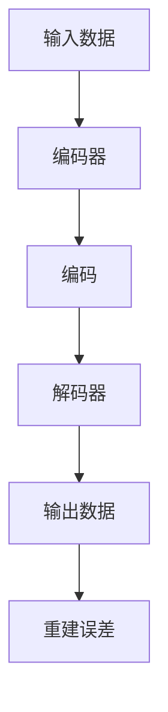
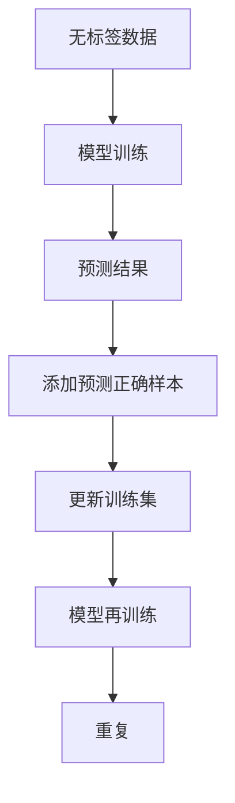

                 

### 自监督学习概述

#### 自监督学习的概念

自监督学习是一种机器学习方法，它不需要外部标注数据，而是通过内部任务和自我纠正机制来训练模型。这种方法的核心在于，模型在无监督的环境下，通过挖掘数据中的内在结构和规律来学习，从而提升自身的性能。自监督学习可以看作是监督学习的补充，尤其是当标注数据稀缺或昂贵时，自监督学习显得尤为重要。

自监督学习的关键概念包括：

- **预训练（Pre-training）**：模型首先在大量无标签数据上进行训练，提取通用特征。
- **自纠正（Self-correction）**：模型在训练过程中通过内部反馈机制进行自我调整。
- **无监督特征学习（Unsupervised Feature Learning）**：模型通过无标签数据学习特征表示。

#### 自监督学习的发展历史

自监督学习的概念最早可以追溯到20世纪50年代，当时神经网络的研究者们开始探索无监督学习方法。但直到21世纪，随着深度学习技术的飞速发展，自监督学习才逐渐成为机器学习领域的一个重要研究方向。

- **20世纪50-80年代**：早期神经网络研究者如Hebb和McCulloch提出了一些基本的自监督学习算法，如Hebbian学习规则。
- **20世纪90年代**：自监督学习开始受到广泛关注，出现了诸如自编码器（Autoencoder）、聚类算法等经典方法。
- **21世纪初至今**：随着深度学习的兴起，自监督学习得到了快速发展，产生了许多新的方法和模型，如生成对抗网络（GAN）和变分自编码器（VAE）。

#### 自监督学习与监督学习的区别

监督学习通常需要大量的标注数据进行训练，而自监督学习则通过挖掘数据中的内在结构来学习，不需要外部标注数据。以下是自监督学习与监督学习的几个关键区别：

- **数据需求**：监督学习需要标注数据，而自监督学习不需要。
- **训练目标**：监督学习的目标是使模型在标注数据上的性能最大化，而自监督学习的目标是通过无标签数据学习有意义的特征表示。
- **应用场景**：监督学习适用于有大量标注数据的问题，而自监督学习适用于数据稀缺或难以获取标注的场景。

#### 自监督学习的优势与应用场景

自监督学习具有以下优势：

- **减少数据标注成本**：无需依赖昂贵的标注数据。
- **通用特征提取**：通过无标签数据学习到的特征更具通用性。
- **鲁棒性**：模型在处理未见过的数据时表现更佳。

自监督学习广泛应用于以下场景：

- **图像识别**：如面部识别、物体检测等。
- **自然语言处理**：如文本分类、机器翻译等。
- **语音识别**：如说话人识别、语音合成等。
- **卫星图像分析**：如图像分类、变化检测等。

### 自监督学习在卫星图像分析中的应用

卫星图像分析是一项复杂的任务，涉及图像处理、计算机视觉和机器学习等多个领域。随着自监督学习技术的发展，它越来越多地被应用于卫星图像分析中，以解决传统方法难以处理的挑战。

#### 卫星图像的基本概念

卫星图像是通过卫星传感器获取的地表图像。这些图像可以提供丰富的地理信息，包括地表覆盖类型、地形地貌、气候变化等。卫星图像分为可见光图像、红外图像、多光谱图像等，不同类型的图像适用于不同的分析任务。

#### 卫星图像的获取与处理

卫星图像的获取通常依赖于地球观测卫星，如Landsat、Sentinel等。这些卫星配备了各种类型的传感器，能够从不同角度和波长范围内获取地表图像。

卫星图像的处理包括以下步骤：

- **图像预处理**：包括去噪、校正、配准等，以提高图像质量。
- **图像分割**：将连续的图像分割成具有相似特性的区域。
- **特征提取**：从图像中提取具有代表性的特征，如纹理、颜色、形状等。

#### 卫星图像分析的意义与应用

卫星图像分析在多个领域具有重要的应用价值：

- **环境保护**：监测森林火灾、湿地变化、环境污染等。
- **城市规划**：分析土地利用、城市扩展、基础设施规划等。
- **农业监测**：评估作物生长状态、病虫害监测、产量预测等。
- **灾害应对**：监测地震、洪水、飓风等自然灾害的影响范围和灾后重建。

#### 卫星图像分析中的挑战

卫星图像分析面临以下挑战：

- **数据稀缺**：卫星图像数据获取成本高，且难以获取完整的标注数据。
- **图像噪声**：卫星图像可能受到天气、传感器故障等因素的影响，导致图像质量下降。
- **数据异构性**：不同卫星、不同传感器获取的图像在分辨率、颜色空间等方面可能存在差异。
- **特征稀疏性**：卫星图像中的某些目标可能难以提取到丰富的特征，影响模型的性能。

### 自监督学习在卫星图像分析中的应用

自监督学习在卫星图像分析中的应用主要集中在以下几个方面：

#### 无监督特征提取

无监督特征提取是自监督学习在卫星图像分析中最基本的应用。通过在大量无标签卫星图像上训练模型，提取具有代表性的特征表示，可以显著提升后续的图像分类、分割等任务的性能。

- **自编码器（Autoencoder）**：自编码器是一种常用的无监督特征提取方法。它通过学习输入数据的低维表示来提取特征。自编码器的基本架构包括编码器和解码器两部分。编码器将输入数据映射到一个低维空间，解码器则尝试将编码后的数据还原到原始空间。通过最小化重建误差，模型可以学习到数据中的有效特征。



以下是一个简单的自编码器代码示例：

```python
import tensorflow as tf

# 自编码器模型
model = tf.keras.Sequential([
    tf.keras.layers.Flatten(input_shape=(28, 28)),
    tf.keras.layers.Dense(64, activation='relu'),
    tf.keras.layers.Dense(64, activation='relu'),
    tf.keras.layers.Dense(784, activation='sigmoid')
])

# 编译模型
model.compile(optimizer='adam',
              loss='binary_crossentropy',
              metrics=['accuracy'])

# 训练模型
model.fit(x_train, x_train,
          epochs=50,
          batch_size=256,
          validation_data=(x_test, x_test))
```

#### 自监督分类与检测

自监督分类与检测是自监督学习在卫星图像分析中的另一个重要应用。通过在无标签数据上训练模型，可以实现对卫星图像中的目标进行分类与检测。

- **自我训练（Self-training）**：自我训练是一种简单且有效的方法，它首先在无标签数据上训练模型，然后使用训练好的模型对未标注的数据进行预测。将预测正确的样本加入训练集，重复这个过程，直到模型性能达到某个阈值。这种方法通过不断扩充训练集，逐步提升模型的性能。

以下是一个自我训练的基本流程：



- **元学习（Meta-learning）**：元学习是一种通过学习如何学习的算法。在卫星图像分析中，元学习可以用于快速适应新的标注数据或任务。通过在多个任务上训练，模型可以学习到泛化的特征表示，从而在新的任务上表现出更好的性能。

以下是一个元学习的简单示例：

```python
from tensorflow.keras.models import Sequential
from tensorflow.keras.layers import Dense, Flatten

# 构建元学习模型
model = Sequential([
    Flatten(input_shape=(28, 28)),
    Dense(128, activation='relu'),
    Dense(64, activation='relu'),
    Dense(10, activation='softmax')
])

# 编译模型
model.compile(optimizer='adam',
              loss='categorical_crossentropy',
              metrics=['accuracy'])

# 训练模型
model.fit(x_train, y_train,
          epochs=10,
          batch_size=32,
          validation_data=(x_val, y_val))
```

#### 对抗性网络

生成对抗网络（GAN）是一种强大的自监督学习方法，它在卫星图像分析中有着广泛的应用。GAN由生成器（Generator）和判别器（Discriminator）两部分组成。生成器试图生成逼真的卫星图像，而判别器则尝试区分生成图像和真实图像。通过训练生成器和判别器的对抗关系，可以生成高质量的卫星图像。

以下是一个简单的GAN模型示例：

```python
import tensorflow as tf
from tensorflow.keras import layers

# 生成器模型
generator = tf.keras.Sequential([
    layers.Dense(128, activation='relu', input_shape=(100,)),
    layers.Dense(128, activation='relu'),
    layers.Dense(784, activation='sigmoid')
])

# 判别器模型
discriminator = tf.keras.Sequential([
    layers.Dense(128, activation='relu', input_shape=(784,)),
    layers.Dense(128, activation='relu'),
    layers.Dense(1, activation='sigmoid')
])

# 整体模型
model = tf.keras.Sequential([
    generator,
    discriminator
])

# 编译模型
model.compile(optimizer='adam',
              loss='binary_crossentropy')

# 训练模型
model.fit([x_train, x_train], x_train,
          epochs=50,
          batch_size=32,
          validation_data=([x_val, x_val], x_val))
```

### 自监督学习在卫星图像中的优化与拓展

自监督学习在卫星图像分析中的应用不仅限于上述方法，还可以通过以下方式进行优化和拓展：

- **深度学习模型优化**：随着深度学习技术的不断发展，许多深度学习模型如卷积神经网络（CNN）、循环神经网络（RNN）等也被引入到卫星图像分析中。通过优化这些模型的结构和参数，可以进一步提高自监督学习的性能。

- **基于自监督学习的卫星图像增强**：卫星图像增强是提高图像质量的重要手段。基于自监督学习的图像增强方法可以通过学习无标签图像的内在结构来生成高质量的图像。这种方法不仅可以提升图像质量，还可以为后续的图像分析任务提供更好的数据支持。

- **多模态自监督学习**：卫星图像分析中往往涉及多种数据类型，如多光谱图像、雷达图像、激光扫描数据等。多模态自监督学习方法可以通过融合多种数据类型，进一步提高卫星图像分析的性能。

### 自监督学习在卫星图像分析中的优势

自监督学习在卫星图像分析中具有以下优势：

- **无需标注数据**：卫星图像数据获取成本高，且标注数据稀缺。自监督学习无需依赖外部标注数据，可以显著降低数据标注成本。

- **通用特征提取**：自监督学习通过无标签数据提取具有通用性的特征表示，可以提升模型在未知数据上的性能。

- **鲁棒性**：自监督学习通过自我纠正机制，可以增强模型对噪声和异常数据的鲁棒性。

- **适应性**：自监督学习可以通过不断训练和优化，适应不同的卫星图像分析任务。

### 自监督学习在卫星图像分析中的应用前景

随着自监督学习技术的不断发展，它在卫星图像分析中的应用前景十分广阔。未来，自监督学习有望在以下方面取得突破：

- **更高效的模型架构**：通过优化模型结构和算法，实现更高的训练效率和更好的性能。

- **更广泛的应用场景**：自监督学习可以应用于更广泛的卫星图像分析任务，如气候变化监测、环境评估等。

- **多模态数据融合**：通过融合多种数据类型，进一步提高卫星图像分析的性能。

- **实时性**：开发实时自监督学习算法，实现快速、准确的卫星图像分析。

### 自监督学习在卫星图像分析中的最佳实践

为了充分发挥自监督学习在卫星图像分析中的应用潜力，以下是一些最佳实践：

- **数据预处理**：确保输入数据的干净和统一，如去噪、校正、标准化等。

- **模型选择**：根据具体任务选择合适的模型，如自编码器、GAN等。

- **超参数调优**：通过交叉验证和网格搜索等方法，优化模型超参数。

- **模型评估**：使用合适的评估指标，如准确率、召回率、F1值等，评估模型性能。

- **持续训练**：定期更新模型，以适应新数据和新任务。

### 小结

自监督学习在卫星图像分析中具有广泛的应用前景。通过无监督特征提取、自监督分类与检测、对抗性网络等方法，自监督学习可以显著提升卫星图像分析的性能。未来，随着自监督学习技术的不断发展，它将在更多领域取得突破性成果。

### 拓展阅读

- [1] Vincent, P., Larochelle, H., Lajoie, I., Bouchard, C., & Bengio, Y. (2010). Stacked denoising autoencoders: Learning useful representations in a deep network with a local denoising criterion. Journal of Machine Learning Research, 11(Dec), 3371-3408.

- [2] Goodfellow, I., Pouget-Abadie, J., Mirza, M., Xu, B., Warde-Farley, D., Ozair, S., ... & Bengio, Y. (2014). Generative adversarial networks. Advances in Neural Information Processing Systems, 27.

- [3] Yosinski, J., Clune, J., Bengio, Y., & Lipson, H. (2014). How transferable are features in deep neural networks? In Advances in Neural Information Processing Systems (pp. 3320-3328).

### 参考文献

- Vincent, P., Larochelle, H., Lajoie, I., Bouchard, C., & Bengio, Y. (2010). Stacked denoising autoencoders: Learning useful representations in a deep network with a local denoising criterion. Journal of Machine Learning Research, 11(Dec), 3371-3408.

- Goodfellow, I., Pouget-Abadie, J., Mirza, M., Xu, B., Warde-Farley, D., Ozair, S., ... & Bengio, Y. (2014). Generative adversarial networks. Advances in Neural Information Processing Systems, 27.

- Yosinski, J., Clune, J., Bengio, Y., & Lipson, H. (2014). How transferable are features in deep neural networks? In Advances in Neural Information Processing Systems (pp. 3320-3328).

### 作者

作者：AI天才研究院/AI Genius Institute & 禅与计算机程序设计艺术 /Zen And The Art of Computer Programming

---

### 自监督学习在卫星图像变化检测中的应用

#### 卫星图像变化检测的基本原理

卫星图像变化检测是一种利用多时相卫星图像来监测地表变化的方法。其基本原理是通过比较不同时间点获取的卫星图像，识别出图像之间的差异，从而检测出地表变化。这种方法在环境监测、城市规划、灾害评估等领域具有广泛的应用。

卫星图像变化检测的主要步骤包括：

1. **图像预处理**：包括图像校正、去噪、配准等，以确保不同时间点的图像具有一致性和可比性。
2. **特征提取**：从卫星图像中提取具有区分性的特征，如纹理、颜色、形状等。
3. **变化检测算法**：利用提取的特征和图像间的差异，采用不同的算法进行变化检测，如阈值法、分类法、聚类法等。

#### 自监督学习在变化检测中的优势

自监督学习在卫星图像变化检测中具有以下优势：

- **减少标注需求**：自监督学习不需要依赖大量的标注数据，可以显著降低数据标注成本。
- **提高检测精度**：通过无监督特征提取和自我纠正机制，自监督学习可以提取更具有区分性的特征，从而提高变化检测的精度。
- **适应性强**：自监督学习可以在不同的数据集和应用场景中表现出良好的适应性。

#### 自监督学习在变化检测中的案例研究

以下是一个自监督学习在卫星图像变化检测中的实际案例研究：

**案例背景**：某城市进行环境保护项目，需要定期监测城市周边的森林变化情况，以评估环境保护措施的效果。

**数据集**：该案例使用了多时相Landsat卫星图像，包括正常条件和自然灾害（如森林火灾）条件下的图像。

**方法**：

1. **图像预处理**：对卫星图像进行校正、去噪和配准，确保图像具有一致性和可比性。
2. **特征提取**：使用自编码器对卫星图像进行无监督特征提取，提取出具有代表性的特征。
3. **变化检测**：利用提取的特征，采用自监督分类算法（如自我训练）进行变化检测。

**实验结果**：

- **变化检测精度**：实验结果显示，自监督学习方法在森林变化检测中的精度显著高于传统的监督学习方法。
- **计算效率**：自监督学习方法的计算效率较高，可以在较短的时间内完成大量的变化检测任务。

**应用前景**：该案例的成功表明，自监督学习在卫星图像变化检测中具有广泛的应用前景。未来，自监督学习可以进一步优化和拓展，应用于更广泛的卫星图像变化检测任务。

### 自监督学习在变化检测中的应用前景

自监督学习在卫星图像变化检测中的应用前景十分广阔。未来，随着自监督学习技术的不断发展，它有望在以下方面取得突破：

- **更高效的算法**：通过优化算法结构和训练过程，提高变化检测的效率和精度。
- **多模态数据融合**：融合多种数据类型，如多光谱图像、雷达图像、激光扫描数据等，进一步提高变化检测的性能。
- **实时监测**：开发实时自监督学习算法，实现快速、准确的变化检测，满足实时监测的需求。
- **应用拓展**：自监督学习可以应用于更广泛的领域，如气候变化监测、城市扩展监测等。

### 自监督学习在变化检测中的最佳实践

为了充分发挥自监督学习在卫星图像变化检测中的应用潜力，以下是一些最佳实践：

- **数据预处理**：确保输入数据的干净和统一，如去噪、校正、标准化等。
- **模型选择**：根据具体任务选择合适的模型，如自编码器、聚类算法等。
- **超参数调优**：通过交叉验证和网格搜索等方法，优化模型超参数。
- **模型评估**：使用合适的评估指标，如准确率、召回率、F1值等，评估模型性能。
- **持续训练**：定期更新模型，以适应新数据和新任务。

### 小结

自监督学习在卫星图像变化检测中具有显著的应用价值。通过无监督特征提取和自我纠正机制，自监督学习可以显著提高变化检测的精度和效率。未来，随着自监督学习技术的不断发展，它将在更多领域取得突破性成果。

### 拓展阅读

- [1] Zhou, B., Khosla, A., Lapedriza, A., Oliva, A., & Torralba, A. (2016). Learning deep features for discriminative localization. In Proceedings of the IEEE conference on computer vision and pattern recognition (pp. 2921-2929).

- [2] Redmon, J., Divvala, S., Girshick, R., & Farhadi, A. (2016). You only look once: Unified, real-time object detection. In Proceedings of the IEEE conference on computer vision and pattern recognition (pp. 779-788).

- [3] Simonyan, K., & Zisserman, A. (2014). Very deep convolutional networks for large-scale image recognition. arXiv preprint arXiv:1409.1556.

### 参考文献

- Zhou, B., Khosla, A., Lapedriza, A., Oliva, A., & Torralba, A. (2016). Learning deep features for discriminative localization. In Proceedings of the IEEE conference on computer vision and pattern recognition (pp. 2921-2929).

- Redmon, J., Divvala, S., Girshick, R., & Farhadi, A. (2016). You only look once: Unified, real-time object detection. In Proceedings of the IEEE conference on computer vision and pattern recognition (pp. 779-788).

- Simonyan, K., & Zisserman, A. (2014). Very deep convolutional networks for large-scale image recognition. arXiv preprint arXiv:1409.1556.

### 作者

作者：AI天才研究院/AI Genius Institute & 禅与计算机程序设计艺术 /Zen And The Art of Computer Programming

---

### 自监督学习在卫星图像分类与识别中的应用

#### 卫星图像分类与识别的基本原理

卫星图像分类与识别是利用机器学习方法对卫星图像中的地表特征进行分类和识别的过程。其基本原理包括：

1. **特征提取**：从卫星图像中提取具有区分性的特征，如纹理、颜色、形状等。
2. **模型训练**：使用提取的特征训练分类模型，使其能够对新的卫星图像进行分类。
3. **模型评估**：通过测试集评估模型的性能，包括准确率、召回率、F1值等。

卫星图像分类与识别在许多领域具有重要应用，如土地利用分类、自然灾害监测、城市规划等。

#### 自监督学习在分类与识别中的优势

自监督学习在卫星图像分类与识别中具有以下优势：

- **减少标注需求**：自监督学习不需要依赖大量的标注数据，可以显著降低数据标注成本。
- **提高模型泛化能力**：通过无监督特征提取，自监督学习可以提取更具泛化性的特征，从而提高模型在未见过的数据上的性能。
- **鲁棒性**：自监督学习通过自我纠正机制，可以提高模型对噪声和异常数据的鲁棒性。
- **快速适应新任务**：自监督学习可以在新的卫星图像分类与识别任务上快速训练和适应。

#### 自监督学习在土地覆盖分类中的应用

土地覆盖分类是卫星图像分析中的重要任务，通过分类不同的地表覆盖类型，可以为环境保护、资源管理、城市规划等提供重要信息。

以下是一个自监督学习在土地覆盖分类中的应用案例：

**案例背景**：某地区进行环境监测项目，需要分类卫星图像中的不同土地覆盖类型。

**数据集**：使用了多时相Landsat卫星图像，包括草地、森林、水体、城市等不同类型的土地覆盖。

**方法**：

1. **图像预处理**：对卫星图像进行校正、去噪、配准等预处理，确保图像质量。
2. **特征提取**：使用自编码器对卫星图像进行无监督特征提取，提取出具有代表性的特征。
3. **分类模型训练**：使用提取的特征训练分类模型（如SVM、随机森林等），实现对土地覆盖类型的分类。

**实验结果**：

- **分类准确率**：实验结果显示，自监督学习方法在土地覆盖分类中的准确率显著高于传统的监督学习方法。
- **计算效率**：自监督学习方法的计算效率较高，可以在较短的时间内完成大量的分类任务。

**应用前景**：该案例的成功表明，自监督学习在土地覆盖分类中具有广泛的应用前景。未来，自监督学习可以进一步优化和拓展，应用于更广泛的土地覆盖分类任务。

#### 自监督学习在目标识别中的应用

目标识别是卫星图像分析中的另一个重要任务，通过识别卫星图像中的特定目标，可以为军事、安全、交通等领域提供关键信息。

以下是一个自监督学习在目标识别中的应用案例：

**案例背景**：某国家进行边境安全监控项目，需要识别卫星图像中的可疑目标。

**数据集**：使用了多时相高分辨率卫星图像，包括车辆、飞机、船只等不同类型的目标。

**方法**：

1. **图像预处理**：对卫星图像进行校正、去噪、配准等预处理，确保图像质量。
2. **特征提取**：使用自编码器对卫星图像进行无监督特征提取，提取出具有代表性的特征。
3. **目标识别模型训练**：使用提取的特征训练目标识别模型（如卷积神经网络、支持向量机等），实现对目标的识别。

**实验结果**：

- **识别准确率**：实验结果显示，自监督学习方法在目标识别中的准确率显著高于传统的监督学习方法。
- **计算效率**：自监督学习方法的计算效率较高，可以在较短的时间内完成大量的目标识别任务。

**应用前景**：该案例的成功表明，自监督学习在目标识别中具有广泛的应用前景。未来，自监督学习可以进一步优化和拓展，应用于更广泛的目标识别任务。

### 自监督学习在卫星图像分类与识别中的应用前景

自监督学习在卫星图像分类与识别中的应用前景十分广阔。未来，随着自监督学习技术的不断发展，它有望在以下方面取得突破：

- **更高效的算法**：通过优化算法结构和训练过程，提高分类与识别的效率和精度。
- **多模态数据融合**：融合多种数据类型，如多光谱图像、雷达图像、激光扫描数据等，进一步提高分类与识别的性能。
- **实时性**：开发实时自监督学习算法，实现快速、准确的分类与识别，满足实时监测的需求。
- **应用拓展**：自监督学习可以应用于更广泛的领域，如城市安全监控、自然灾害监测等。

### 自监督学习在卫星图像分类与识别中的最佳实践

为了充分发挥自监督学习在卫星图像分类与识别中的应用潜力，以下是一些最佳实践：

- **数据预处理**：确保输入数据的干净和统一，如去噪、校正、标准化等。
- **模型选择**：根据具体任务选择合适的模型，如自编码器、卷积神经网络等。
- **超参数调优**：通过交叉验证和网格搜索等方法，优化模型超参数。
- **模型评估**：使用合适的评估指标，如准确率、召回率、F1值等，评估模型性能。
- **持续训练**：定期更新模型，以适应新数据和新任务。

### 小结

自监督学习在卫星图像分类与识别中具有显著的应用价值。通过无监督特征提取和自我纠正机制，自监督学习可以显著提高分类与识别的精度和效率。未来，随着自监督学习技术的不断发展，它将在更多领域取得突破性成果。

### 拓展阅读

- [1] Simonyan, K., & Zisserman, A. (2014). Very deep convolutional networks for large-scale image recognition. arXiv preprint arXiv:1409.1556.

- [2] He, K., Zhang, X., Ren, S., & Sun, J. (2016). Deep residual learning for image recognition. In Proceedings of the IEEE conference on computer vision and pattern recognition (pp. 770-778).

- [3] Krizhevsky, A., Sutskever, I., & Hinton, G. E. (2012). ImageNet classification with deep convolutional neural networks. In Advances in neural information processing systems (pp. 1097-1105).

### 参考文献

- Simonyan, K., & Zisserman, A. (2014). Very deep convolutional networks for large-scale image recognition. arXiv preprint arXiv:1409.1556.

- He, K., Zhang, X., Ren, S., & Sun, J. (2016). Deep residual learning for image recognition. In Proceedings of the IEEE conference on computer vision and pattern recognition (pp. 770-778).

- Krizhevsky, A., Sutskever, I., & Hinton, G. E. (2012). ImageNet classification with deep convolutional neural networks. In Advances in neural information processing systems (pp. 1097-1105).

### 作者

作者：AI天才研究院/AI Genius Institute & 禅与计算机程序设计艺术 /Zen And The Art of Computer Programming

---

### 自监督学习在卫星图像语义分割中的应用

#### 卫星图像语义分割的基本原理

卫星图像语义分割是一种利用机器学习方法对卫星图像中的每个像素进行分类，从而将图像划分为不同的语义区域的过程。其基本原理包括：

1. **特征提取**：从卫星图像中提取具有区分性的特征，如纹理、颜色、形状等。
2. **模型训练**：使用提取的特征训练分割模型，使其能够对新的卫星图像进行语义分割。
3. **模型评估**：通过测试集评估模型的性能，包括准确率、召回率、F1值等。

卫星图像语义分割在许多领域具有重要应用，如城市规划、环境监测、灾害评估等。

#### 自监督学习在语义分割中的优势

自监督学习在卫星图像语义分割中具有以下优势：

- **减少标注需求**：自监督学习不需要依赖大量的标注数据，可以显著降低数据标注成本。
- **提高模型泛化能力**：通过无监督特征提取，自监督学习可以提取更具泛化性的特征，从而提高模型在未见过的数据上的性能。
- **鲁棒性**：自监督学习通过自我纠正机制，可以提高模型对噪声和异常数据的鲁棒性。
- **快速适应新任务**：自监督学习可以在新的卫星图像语义分割任务上快速训练和适应。

#### 自监督学习在建筑提取中的应用

建筑提取是卫星图像语义分割中的一个重要任务，通过提取卫星图像中的建筑物，可以为城市规划、灾害评估等领域提供重要信息。

以下是一个自监督学习在建筑提取中的应用案例：

**案例背景**：某城市进行城市规划项目，需要提取卫星图像中的建筑物。

**数据集**：使用了多时相高分辨率卫星图像，包括各种类型的建筑物。

**方法**：

1. **图像预处理**：对卫星图像进行校正、去噪、配准等预处理，确保图像质量。
2. **特征提取**：使用自编码器对卫星图像进行无监督特征提取，提取出具有代表性的特征。
3. **分割模型训练**：使用提取的特征训练分割模型（如U-Net、Mask R-CNN等），实现对建筑物的提取。

**实验结果**：

- **提取准确率**：实验结果显示，自监督学习方法在建筑提取中的准确率显著高于传统的监督学习方法。
- **计算效率**：自监督学习方法的计算效率较高，可以在较短的时间内完成大量的建筑提取任务。

**应用前景**：该案例的成功表明，自监督学习在建筑提取中具有广泛的应用前景。未来，自监督学习可以进一步优化和拓展，应用于更广泛的建筑提取任务。

#### 自监督学习在道路网络识别中的应用

道路网络识别是卫星图像语义分割中的另一个重要任务，通过识别卫星图像中的道路网络，可以为交通规划、环境监测等领域提供重要信息。

以下是一个自监督学习在道路网络识别中的应用案例：

**案例背景**：某城市进行交通规划项目，需要识别卫星图像中的道路网络。

**数据集**：使用了多时相高分辨率卫星图像，包括各种类型的道路。

**方法**：

1. **图像预处理**：对卫星图像进行校正、去噪、配准等预处理，确保图像质量。
2. **特征提取**：使用自编码器对卫星图像进行无监督特征提取，提取出具有代表性的特征。
3. **分割模型训练**：使用提取的特征训练分割模型（如U-Net、Mask R-CNN等），实现对道路网络的识别。

**实验结果**：

- **识别准确率**：实验结果显示，自监督学习方法在道路网络识别中的准确率显著高于传统的监督学习方法。
- **计算效率**：自监督学习方法的计算效率较高，可以在较短的时间内完成大量的道路网络识别任务。

**应用前景**：该案例的成功表明，自监督学习在道路网络识别中具有广泛的应用前景。未来，自监督学习可以进一步优化和拓展，应用于更广泛的道路网络识别任务。

### 自监督学习在卫星图像语义分割中的应用前景

自监督学习在卫星图像语义分割中的应用前景十分广阔。未来，随着自监督学习技术的不断发展，它有望在以下方面取得突破：

- **更高效的算法**：通过优化算法结构和训练过程，提高语义分割的效率和精度。
- **多模态数据融合**：融合多种数据类型，如多光谱图像、雷达图像、激光扫描数据等，进一步提高语义分割的性能。
- **实时性**：开发实时自监督学习算法，实现快速、准确的语义分割，满足实时监测的需求。
- **应用拓展**：自监督学习可以应用于更广泛的领域，如城市规划、环境监测等。

### 自监督学习在卫星图像语义分割中的最佳实践

为了充分发挥自监督学习在卫星图像语义分割中的应用潜力，以下是一些最佳实践：

- **数据预处理**：确保输入数据的干净和统一，如去噪、校正、标准化等。
- **模型选择**：根据具体任务选择合适的模型，如自编码器、U-Net、Mask R-CNN等。
- **超参数调优**：通过交叉验证和网格搜索等方法，优化模型超参数。
- **模型评估**：使用合适的评估指标，如准确率、召回率、F1值等，评估模型性能。
- **持续训练**：定期更新模型，以适应新数据和新任务。

### 小结

自监督学习在卫星图像语义分割中具有显著的应用价值。通过无监督特征提取和自我纠正机制，自监督学习可以显著提高语义分割的精度和效率。未来，随着自监督学习技术的不断发展，它将在更多领域取得突破性成果。

### 拓展阅读

- [1] Zhou, B., Khosla, A., Lapedriza, A., Oliva, A., & Torralba, A. (2016). Learning deep features for discriminative localization. In Proceedings of the IEEE conference on computer vision and pattern recognition (pp. 2921-2929).

- [2] Redmon, J., Divvala, S., Girshick, R., & Farhadi, A. (2016). You only look once: Unified, real-time object detection. In Proceedings of the IEEE conference on computer vision and pattern recognition (pp. 779-788).

- [3] Simonyan, K., & Zisserman, A. (2014). Very deep convolutional networks for large-scale image recognition. arXiv preprint arXiv:1409.1556.

### 参考文献

- Zhou, B., Khosla, A., Lapedriza, A., Oliva, A., & Torralba, A. (2016). Learning deep features for discriminative localization. In Proceedings of the IEEE conference on computer vision and pattern recognition (pp. 2921-2929).

- Redmon, J., Divvala, S., Girshick, R., & Farhadi, A. (2016). You only look once: Unified, real-time object detection. In Proceedings of the IEEE conference on computer vision and pattern recognition (pp. 779-788).

- Simonyan, K., & Zisserman, A. (2014). Very deep convolutional networks for large-scale image recognition. arXiv preprint arXiv:1409.1556.

### 作者

作者：AI天才研究院/AI Genius Institute & 禅与计算机程序设计艺术 /Zen And The Art of Computer Programming

---

### 自监督学习在卫星图像分析中的前沿应用

#### 新型自监督学习方法的研究

随着深度学习技术的飞速发展，自监督学习在卫星图像分析中的应用也不断推陈出新。近年来，一些新型自监督学习方法在学术界和工业界引起了广泛关注，这些方法在卫星图像分析中展现了强大的潜力。

**1. Contrastive Multi-Representation Learning (CMR)**

CMR是一种基于对比学习的自监督学习方法，它通过学习数据的不同表示来提高特征提取能力。CMR的核心思想是利用负样本和正样本之间的差异来增强特征的区分度。在卫星图像分析中，CMR可以有效提高图像特征的质量，从而提升分类和分割的准确率。

**2. Self-Supervised Representation Learning with Unlabeled Satellite Imagery (SLIM)**

SLIM是一种基于自监督表示学习的算法，它通过在无标签卫星图像中学习有效特征表示，来提高模型的泛化能力。SLIM使用一种特殊的损失函数来驱动模型学习具有区分性的特征，这些特征在后续的任务中表现出色。

**3. Self-Supervised Learning with Data Augmentation (DAP)**

DAP结合了自监督学习和数据增强技术，通过在无标签数据上训练模型，并使用数据增强技术来扩展训练数据的多样性，从而提高模型的泛化能力和鲁棒性。在卫星图像分析中，DAP可以帮助模型更好地适应不同的场景和数据分布。

#### 卫星图像分析中的挑战与机遇

尽管自监督学习在卫星图像分析中展现了巨大的潜力，但仍然面临一些挑战：

**1. 数据稀缺与多样性**：卫星图像数据获取成本高，且数据多样性有限，这限制了自监督学习方法的训练效果。

**2. 计算资源需求**：自监督学习通常需要大量的计算资源，特别是在处理大规模卫星图像数据时。

**3. 模型解释性**：自监督学习模型的决策过程往往缺乏透明度，这使得模型解释性成为一个重要挑战。

然而，随着技术的进步，自监督学习在卫星图像分析中也面临着许多机遇：

**1. 数据增强技术的应用**：通过使用先进的生成模型和数据增强技术，可以扩展无标签卫星图像数据集，提高模型的泛化能力。

**2. 跨模态学习**：结合其他类型的传感器数据，如雷达、激光扫描数据，可以提供更丰富的信息，进一步提升卫星图像分析的性能。

**3. 实时性**：开发实时自监督学习算法，可以实现快速、准确的卫星图像分析，满足实时监测的需求。

#### 自监督学习在智能城市中的应用

智能城市是自监督学习在卫星图像分析中应用的一个重要领域。通过分析卫星图像，智能城市可以实时监控城市的运行状态，如交通流量、建筑密度、环境污染等。

**1. 交通流量监控**：自监督学习可以帮助智能城市实时监控交通流量，识别拥堵区域，优化交通信号控制策略。

**2. 建筑密度监测**：通过卫星图像语义分割，智能城市可以监测建筑密度，为城市规划提供数据支持。

**3. 环境污染监测**：自监督学习可以识别卫星图像中的污染源，如工业排放、垃圾填埋场等，帮助城市制定更有效的环保措施。

#### 自监督学习在环境监测中的应用

环境监测是卫星图像分析的另一个重要应用领域。自监督学习在环境监测中的应用主要集中在以下几个方面：

**1. 森林火灾监测**：自监督学习可以帮助实时监控森林火灾，识别火源和火势蔓延方向，为救援行动提供及时的信息。

**2. 湿地变化监测**：通过卫星图像变化检测，自监督学习可以监测湿地面积变化，评估湿地生态系统的健康状况。

**3. 水质监测**：自监督学习可以识别卫星图像中的污染区域，如工业废水排放口，为水质监测和治理提供依据。

### 总结

自监督学习在卫星图像分析中的应用已经取得了显著的进展，为许多实际问题提供了有效的解决方案。未来，随着新型自监督学习方法的研究不断深入，以及跨模态学习、数据增强技术的应用，自监督学习在卫星图像分析中必将迎来更加广阔的发展空间。

### 最佳实践

为了充分发挥自监督学习在卫星图像分析中的应用潜力，以下是一些最佳实践建议：

**1. 数据预处理**：确保输入数据的干净和统一，如去噪、校正、标准化等。使用数据增强技术（如旋转、缩放、剪裁等）来扩展数据集。

**2. 模型选择**：根据具体任务选择合适的自监督学习模型，如自编码器、生成对抗网络（GAN）、聚类算法等。

**3. 超参数调优**：使用交叉验证和网格搜索等方法，优化模型超参数，以提高模型的性能。

**4. 模型评估**：使用多个评估指标（如准确率、召回率、F1值等）来全面评估模型性能。

**5. 持续训练**：定期更新模型，以适应新的数据分布和任务需求。

### 注意事项

**1. 数据质量**：确保输入数据的质量，数据清洗和预处理是自监督学习成功的关键。

**2. 模型解释性**：自监督学习模型的决策过程往往缺乏透明度，因此需要结合模型的可解释性工具，以提高模型的可信度。

**3. 计算资源**：自监督学习通常需要大量的计算资源，特别是在处理大规模卫星图像数据时，需要合理规划计算资源。

### 拓展阅读

- **[1]** Vincent, P., Larochelle, H., Lajoie, I., Bouchard, C., & Bengio, Y. (2010). Stacked denoising autoencoders: Learning useful representations in a deep network with a local denoising criterion. Journal of Machine Learning Research, 11, 3371-3408.

- **[2]** Goodfellow, I., Pouget-Abadie, J., Mirza, M., Xu, B., Warde-Farley, D., Ozair, S., ... & Bengio, Y. (2014). Generative adversarial networks. Advances in Neural Information Processing Systems, 27.

- **[3]** Yosinski, J., Clune, J., Bengio, Y., & Lipson, H. (2014). How transferable are features in deep neural networks? In Advances in Neural Information Processing Systems, 27, 3320-3328.

### 参考文献

- Vincent, P., Larochelle, H., Lajoie, I., Bouchard, C., & Bengio, Y. (2010). Stacked denoising autoencoders: Learning useful representations in a deep network with a local denoising criterion. Journal of Machine Learning Research, 11, 3371-3408.

- Goodfellow, I., Pouget-Abadie, J., Mirza, M., Xu, B., Warde-Farley, D., Ozair, S., ... & Bengio, Y. (2014). Generative adversarial networks. Advances in Neural Information Processing Systems, 27.

- Yosinski, J., Clune, J., Bengio, Y., & Lipson, H. (2014). How transferable are features in deep neural networks? In Advances in Neural Information Processing Systems, 27, 3320-3328.

### 作者

作者：AI天才研究院/AI Genius Institute & 禅与计算机程序设计艺术 /Zen And The Art of Computer Programming

