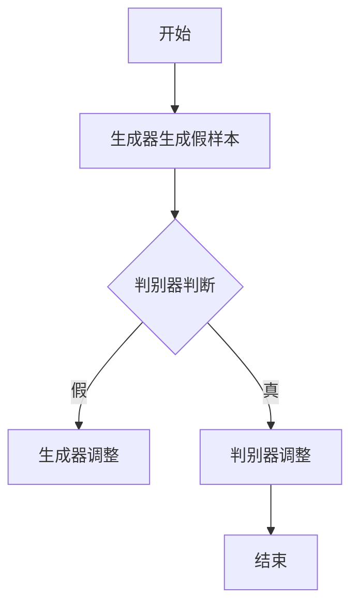
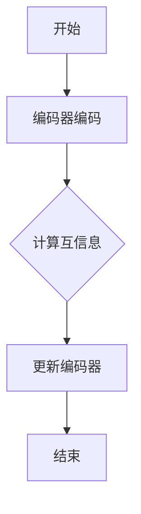
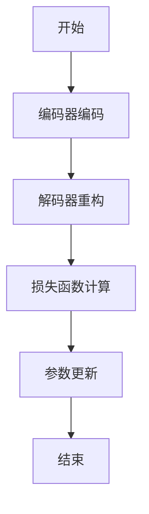
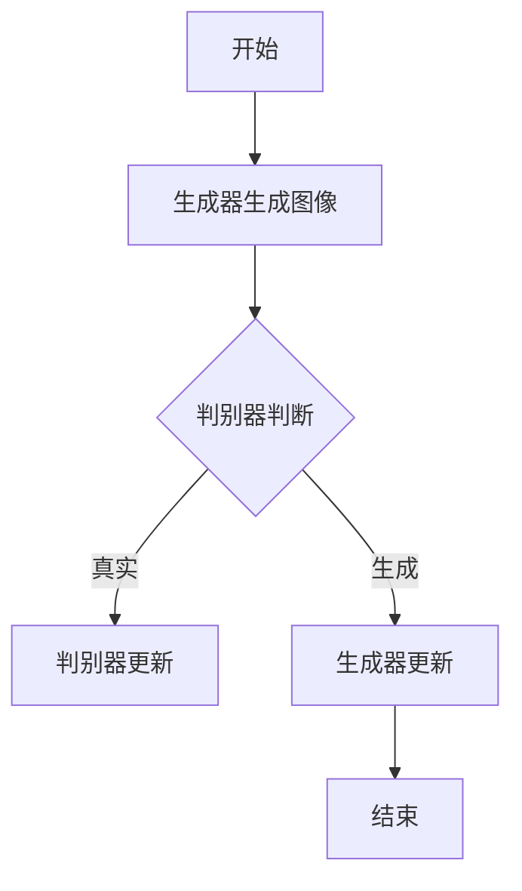
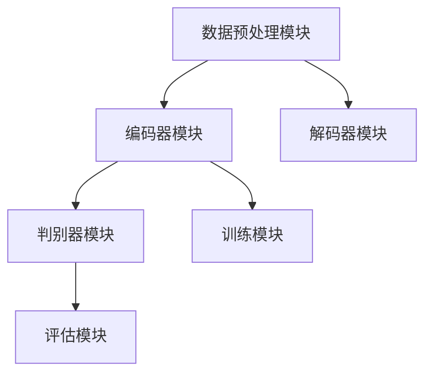
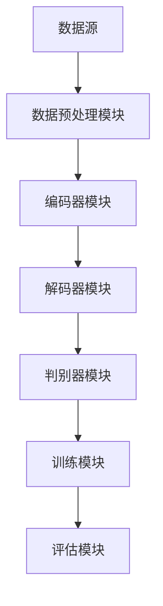
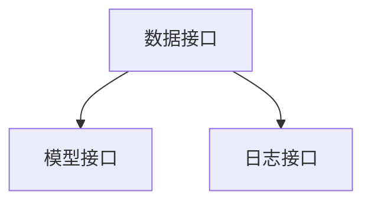

                 

### 自监督学习的背景与重要性

#### 1.1 自监督学习的定义和基本原理

自监督学习（Supervised Learning）是一种人工智能技术，它利用标记数据（带有标签的数据）来训练模型。在传统的监督学习中，模型依赖于输入和输出对的标记信息，通过学习这些标记信息来预测新的输入。然而，标记数据往往需要大量的人力和时间成本进行标注，这在实际应用中往往是一个巨大的挑战。

自监督学习（Self-Supervised Learning）则是通过利用未标记的数据来训练模型，它不需要依赖标记数据。自监督学习的关键在于“自监督”机制，即通过设计一些任务，让模型自己去学习数据中的结构。这些任务可以是预训练任务（pre-training tasks），例如预测图像中的某个部分是否发生变化、预测单词的下一个字符等。

在自监督学习中，模型可以从大量未标记的数据中提取信息，并通过这些信息来学习数据的内在结构。这种学习方法非常类似于人类的学习方式，即通过观察和互动来获取知识。自监督学习的这一特点使得它在无标签数据丰富的场景中具有巨大的应用潜力。

#### 1.2 自监督学习在AI推理中的重要性

随着人工智能技术的不断进步，AI在各个领域中的应用越来越广泛。然而，AI系统的一个关键瓶颈是如何有效地处理大量未标记的数据。传统的监督学习模型需要大量的标记数据进行训练，这既费时又费力。而自监督学习提供了一种解决这一问题的途径。

自监督学习具有以下几个关键优势：

1. **无标签数据的利用**：自监督学习可以直接利用未标记的数据进行训练，这大大降低了数据标注的成本和时间。特别是在图像、文本和语音等数据规模庞大的领域，这一优势尤为重要。

2. **模型的泛化能力**：通过自监督学习，模型可以学习到数据中的潜在结构，从而提高模型的泛化能力。这意味着模型在处理未见过的数据时，能够保持较高的准确率。

3. **高效性**：自监督学习通常可以更快地训练模型。由于不需要大量的标记数据，训练过程可以更加高效地完成。

4. **适用性广泛**：自监督学习不仅适用于传统的图像和文本处理，还可以应用于自然语言处理、语音识别、推荐系统等领域。

#### 1.3 自监督学习与无标签学习的关系

无标签学习（Unsupervised Learning）是自监督学习的一个子集，它专注于利用未标记的数据来学习数据的内在结构。与自监督学习不同的是，无标签学习不依赖于预定义的输出标签。自监督学习则通过设计一些任务来利用未标记的数据，这些任务可以是有监督的，也可以是无监督的。

自监督学习和无标签学习之间的联系在于，它们都利用了未标记的数据。自监督学习通过这些未标记的数据来设计训练任务，从而提高模型的性能。而无标签学习则侧重于探索数据的内在结构，例如聚类、降维等任务。

然而，自监督学习和无标签学习也存在差异。自监督学习通常需要一个预训练阶段，在这个阶段中，模型从大量未标记的数据中学习。而预训练之后的模型则可以通过有监督的任务（即带有标签的数据）来进一步优化。相比之下，无标签学习则不需要预训练阶段，它直接从无标签数据中学习。

#### 1.4 自监督学习在AI推理中的应用

自监督学习在AI推理中的应用非常广泛，以下是一些典型的应用场景：

1. **图像识别**：通过自监督学习，模型可以从大量未标记的图像中学习到图像的特征，从而在后续的有监督训练中取得更好的效果。例如，通过图像的对比学习（Contrastive Learning），模型可以学习到图像的相似性和差异性。

2. **自然语言处理**：自监督学习在自然语言处理中有着广泛的应用。通过预训练模型（如BERT、GPT），模型可以从大量未标记的文本中学习到语言的深层结构，从而在后续的任务（如文本分类、机器翻译）中表现出色。

3. **语音识别**：自监督学习可以帮助模型从大量未标记的语音数据中学习到语音的潜在结构，从而在语音识别任务中提高模型的性能。

4. **推荐系统**：自监督学习可以用于推荐系统的预训练，通过学习用户的未标记行为数据，模型可以更好地预测用户对物品的偏好。

#### 1.5 自监督学习的挑战与未来方向

虽然自监督学习在AI推理中展现出巨大的潜力，但仍然面临一些挑战：

1. **数据质量**：自监督学习依赖于未标记的数据，数据的质量直接影响到模型的性能。因此，如何从大量未标记的数据中筛选出高质量的数据是一个重要问题。

2. **模型可解释性**：自监督学习模型通常是一个黑箱，难以解释其决策过程。这给模型的可解释性带来了挑战，特别是在需要解释其决策的应用场景中。

3. **计算资源**：自监督学习通常需要大量的计算资源，特别是在预训练阶段。这给实际应用带来了一定的限制。

未来的研究方向可能包括：

1. **更有效的模型设计**：设计更加高效的自监督学习模型，以减少计算资源的消耗。

2. **数据增强技术**：开发更有效的数据增强技术，以提升自监督学习的性能。

3. **模型可解释性**：研究如何提高自监督学习模型的可解释性，使其更易于理解和应用。

总之，自监督学习在AI推理中的应用前景广阔，但仍需克服一系列挑战。通过不断的探索和研究，我们有理由相信，自监督学习将在未来的AI发展中发挥重要作用。接下来，我们将深入探讨自监督学习的核心概念与算法，以期为读者提供更全面的理解。

### 自监督学习的核心概念与算法

自监督学习的核心在于设计一些任务，让模型通过学习未标记的数据来自我监督。这些任务可以分为预训练任务和后续任务。预训练任务通常是在大量未标记数据上进行的，目的是让模型学习到数据的潜在结构。后续任务则是在预训练的基础上，利用带标签的数据对模型进行微调，以实现特定的任务目标。

在本章节中，我们将详细介绍几种自监督学习的核心算法，并使用Mermaid语言绘制算法流程图，以便读者更好地理解。

#### 2.1 生成对抗网络（GAN）

生成对抗网络（Generative Adversarial Network，GAN）是由Ian Goodfellow等人于2014年提出的一种自监督学习模型。GAN由两个主要组件构成：生成器（Generator）和判别器（Discriminator）。

**算法流程图**：



**算法原理**：

1. **初始化**：生成器和判别器分别初始化。
2. **生成器生成假样本**：生成器生成一系列假样本，目的是骗过判别器。
3. **判别器判断**：判别器对生成的假样本和真实样本进行判断，尝试区分两者。
4. **生成器调整**：根据判别器的反馈，生成器调整其生成策略，以提高假样本的质量。
5. **判别器调整**：判别器根据生成的假样本和真实样本进行迭代训练，提高其判断能力。
6. **结束**：当生成器生成的假样本足够逼真时，算法结束。

GAN的数学模型如下：

$$
\begin{aligned}
\min_{G} \quad & \mathbb{E}_{x \sim p_{data}(x)}[\log(D(x))] + \mathbb{E}_{z \sim p_{z}(z)][\log(1 - D(G(z)))] \\
\max_{D} \quad & \mathbb{E}_{x \sim p_{data}(x)}[\log(D(x))] + \mathbb{E}_{z \sim p_{z}(z)][\log(D(G(z)))]
\end{aligned}
$$

其中，$G(z)$是生成器生成的假样本，$D(x)$是判别器对真实样本的判断概率，$z$是噪声向量。

**举例说明**：

假设我们有一个生成器$G$和一个判别器$D$。初始化后，生成器生成一系列随机噪声图像，判别器判断这些图像是真实图像还是生成图像。然后，生成器根据判别器的反馈调整其生成策略，使得生成的图像越来越逼真。判别器则通过不断训练，提高其判断能力，从而能够更准确地识别真实图像和生成图像。

#### 2.2 基于信息的最大化（InfoMax）

基于信息的最大化（InfoMax）算法是另一种重要的自监督学习算法。InfoMax的目标是最大化数据之间的互信息，从而学习到数据的潜在结构。

**算法流程图**：



**算法原理**：

1. **初始化**：编码器初始化。
2. **编码器编码**：编码器对输入数据进行编码，得到隐向量。
3. **计算互信息**：计算编码前后数据的互信息，即$I(X; Z)$。
4. **更新编码器**：根据互信息的反馈，更新编码器的参数，以最大化互信息。
5. **结束**：当互信息达到最大时，算法结束。

InfoMax的数学模型如下：

$$
\begin{aligned}
\min_{Q} \quad & \mathbb{E}_{x \sim p_{data}(x)}[D_{KL}(Q(x) || p(z|x))] \\
\min_{P} \quad & \mathbb{E}_{z \sim p_{z}(z)}[\mathbb{E}_{x \sim p_{data}(x)}[D_{KL}(Q(x) || p(z|x))]
\end{aligned}
$$

其中，$Q(x)$是编码器对输入数据的概率分布估计，$P(z|x)$是输入数据$x$生成的隐向量$z$的概率分布。

**举例说明**：

假设我们有一个编码器$Q$和一个数据集$X$。初始化后，编码器对输入数据进行编码，得到隐向量。然后，计算编码前后数据的互信息，并根据互信息的反馈更新编码器的参数。通过迭代更新，编码器能够学习到数据的潜在结构。

#### 2.3 自编码器（Autoencoder）

自编码器（Autoencoder）是一种简单但有效的自监督学习算法。自编码器由一个编码器和一个解码器组成，编码器负责将输入数据压缩成一个低维隐向量，解码器则试图重构原始数据。

**算法流程图**：



**算法原理**：

1. **初始化**：编码器和解码器初始化。
2. **编码器编码**：编码器对输入数据进行编码，得到隐向量。
3. **解码器重构**：解码器尝试重构原始数据。
4. **损失函数计算**：计算重构数据与原始数据之间的误差。
5. **参数更新**：根据误差更新编码器和解码器的参数。
6. **结束**：当误差达到最小值时，算法结束。

自编码器的数学模型如下：

$$
\begin{aligned}
\min_{\theta} \quad & \sum_{x \in X} \frac{1}{2} \sum_{i=1}^{n} (x_i - \hat{x}_i)^2 \\
\text{其中，} \hat{x}_i &= \sum_{j=1}^{m} \theta_{ij} h_j
\end{aligned}
$$

其中，$\theta$是编码器和解码器的参数，$h_j$是编码器输出的隐向量，$x_i$是输入数据的第$i$个特征。

**举例说明**：

假设我们有一个自编码器，输入数据是一个包含100个特征的向量。初始化后，编码器将输入数据压缩成一个10维的隐向量，解码器则尝试重构原始数据。通过迭代更新，编码器和解码器能够学习到数据的内在结构，从而实现数据的降维和去噪。

通过以上三种自监督学习算法的介绍，我们可以看到自监督学习在数据学习和模型优化中的应用潜力。接下来，我们将进一步探讨如何在自监督学习中有效利用无标签数据。

### 自监督学习中的无标签数据利用

在自监督学习中，无标签数据的利用是一个关键环节。无标签数据不仅包括完全未标记的数据，还可能包括一些带有部分标记或预标注的数据。如何有效地利用这些数据来提升模型的性能，是自监督学习研究的重要方向。

#### 3.1 自监督学习的无标签数据策略

自监督学习的无标签数据策略可以分为以下几个步骤：

1. **数据预处理**：对无标签数据进行清洗和预处理，以去除噪声和异常值。这可以通过过滤、标准化、归一化等方法实现。

2. **数据增强**：通过数据增强技术，例如随机裁剪、旋转、缩放等，增加数据多样性，从而提高模型对数据的泛化能力。

3. **设计任务**：设计适合自监督学习的任务，让模型从无标签数据中提取有用信息。常见的任务包括对比学习、自编码器、生成对抗网络等。

4. **预训练**：在大量无标签数据上对模型进行预训练，让模型学习到数据的潜在结构和特征。预训练的过程通常是一个无监督的过程，模型通过学习数据的内在关系来提高其性能。

5. **微调**：在预训练的基础上，利用少量有标签数据进行微调，使模型能够适应特定的任务需求。微调过程是一个有监督的过程，模型通过学习标签信息来进一步优化其参数。

6. **模型评估**：使用有标签数据集对模型进行评估，以验证模型在特定任务上的性能。

#### 3.2 对比学习（Contrastive Learning）

对比学习是一种常用的自监督学习方法，其核心思想是通过对比正负样本来增强模型的区分能力。在对比学习中，正样本是指来自同一类别的数据对，而负样本是指来自不同类别的数据对。

**算法原理**：

1. **编码器编码**：使用编码器对数据集进行编码，得到低维特征向量。
2. **计算相似度**：计算编码后的特征向量之间的相似度，对于正样本，希望相似度尽可能高，对于负样本，希望相似度尽可能低。
3. **损失函数**：使用对比损失函数（如InfoNCE）来优化编码器的参数，使得正样本的相似度高于负样本。

对比学习的数学模型如下：

$$
L = -\frac{1}{N} \sum_{i=1}^{N} \sum_{n=1}^{N} \frac{z_i \cdot z_n}{\exp(\beta \cdot z_i \cdot z_n) + \sum_{m \neq i}^{N} \exp(\beta \cdot z_i \cdot z_m)}
$$

其中，$z_i$和$z_n$分别是正样本和负样本的编码特征向量，$\beta$是温度参数。

**举例说明**：

假设我们有一个数据集，包含图像和标签。使用对比学习，我们首先对图像进行编码，得到特征向量。然后，我们计算每个图像与其同类图像的特征向量之间的相似度，以及与不同类图像的特征向量之间的相似度。通过优化编码器的参数，使得同类图像的特征向量相似度更高，不同类图像的特征向量相似度更低。

#### 3.3 自编码器（Autoencoder）

自编码器是一种简单但有效的自监督学习方法，它通过编码器将输入数据压缩成一个低维隐向量，然后通过解码器重构原始数据。自编码器可以有效提取数据的特征，并用于后续的任务。

**算法原理**：

1. **编码器编码**：编码器对输入数据进行编码，得到隐向量。
2. **解码器重构**：解码器尝试重构原始数据。
3. **损失函数**：计算重构数据与原始数据之间的误差，使用损失函数（如均方误差MSE）来优化编码器和解码器的参数。

自编码器的数学模型如下：

$$
\begin{aligned}
\min_{\theta} \quad & \sum_{x \in X} \frac{1}{2} \sum_{i=1}^{n} (x_i - \hat{x}_i)^2 \\
\text{其中，} \hat{x}_i &= \sum_{j=1}^{m} \theta_{ij} h_j
\end{aligned}
$$

**举例说明**：

假设我们有一个自编码器，输入数据是一个包含100个特征的向量。初始化后，编码器将输入数据压缩成一个10维的隐向量，解码器则尝试重构原始数据。通过迭代更新，编码器和解码器能够学习到数据的内在结构，从而实现数据的降维和去噪。

#### 3.4 生成对抗网络（GAN）

生成对抗网络（GAN）是一种强大的自监督学习方法，它通过生成器和判别器的对抗训练来学习数据的分布。生成器试图生成与真实数据相似的数据，而判别器则尝试区分真实数据和生成数据。

**算法原理**：

1. **生成器生成数据**：生成器从随机噪声中生成数据。
2. **判别器判断数据**：判别器对真实数据和生成数据进行判断。
3. **对抗训练**：通过优化生成器和判别器的参数，使得生成器生成的数据越来越逼真，而判别器越来越难以区分真实数据和生成数据。

GAN的数学模型如下：

$$
\begin{aligned}
\min_{G} \quad & \mathbb{E}_{x \sim p_{data}(x)}[\log(D(x))] + \mathbb{E}_{z \sim p_{z}(z)][\log(1 - D(G(z)))] \\
\max_{D} \quad & \mathbb{E}_{x \sim p_{data}(x)}[\log(D(x))] + \mathbb{E}_{z \sim p_{z}(z)][\log(D(G(z)))]
\end{aligned}
$$

**举例说明**：

假设我们有一个生成器和判别器。初始化后，生成器生成一系列随机噪声图像，判别器尝试区分这些图像是真实图像还是生成图像。然后，生成器根据判别器的反馈调整其生成策略，使得生成的图像越来越逼真。判别器则通过不断训练，提高其判断能力，从而能够更准确地识别真实图像和生成图像。

通过以上几种自监督学习方法的介绍，我们可以看到无标签数据在自监督学习中的重要作用。无标签数据不仅可以用于预训练模型，还可以通过设计不同的任务和算法，提高模型的性能和泛化能力。在接下来的章节中，我们将进一步探讨自监督学习在自然语言处理中的应用。

### 自监督学习在自然语言处理中的应用

自监督学习在自然语言处理（NLP）领域展现出了巨大的潜力，特别是在预训练语言模型方面。预训练语言模型通过在大规模无标签文本数据上预训练，然后通过微调适应特定任务，从而显著提高了NLP任务的性能。以下是一些典型的应用场景和具体实现方法。

#### 4.1 预训练语言模型

预训练语言模型（Pre-trained Language Model，如BERT、GPT）是自监督学习在NLP中的核心应用。这些模型通过在大规模无标签文本数据上进行预训练，学习到语言的深层结构和语义知识，从而为各种下游任务提供强大的基础。

**BERT（Bidirectional Encoder Representations from Transformers）**

BERT是由Google AI于2018年提出的一种双向Transformer模型。它通过Masked Language Model（MLM）和Next Sentence Prediction（NSP）两种任务进行预训练。

- **Masked Language Model（MLM）**：在输入序列中随机mask一些单词，模型需要预测这些被mask的单词。
- **Next Sentence Prediction（NSP）**：给定两个句子，模型需要预测第二个句子是否紧跟在第一个句子后面。

**GPT（Generative Pre-trained Transformer）**

GPT是由OpenAI提出的一系列预训练语言模型，包括GPT、GPT-2和GPT-3。GPT通过生成语言模型（Language Modeling）进行预训练，其目标是预测下一个单词。

**算法流程图**：

```mermaid
graph TD
A[开始] --> B[输入文本]
B --> C{分词}
C --> D[掩码处理]
D --> E{BERT/NSP任务}
E --> F{训练]
F --> G[结束]
```

**算法原理**：

1. **输入文本**：输入一段文本数据。
2. **分词**：将文本数据分词成单词或子词。
3. **掩码处理**：随机mask一些单词，生成带mask的输入序列。
4. **BERT/NSP任务**：执行MLM和NSP任务，分别预测被mask的单词和下一句。
5. **训练**：使用Masked Language Model（MLM）和Next Sentence Prediction（NSP）损失函数进行训练。
6. **结束**：当模型收敛时，算法结束。

#### 4.2 实体识别

实体识别（Named Entity Recognition，NER）是NLP中的一个重要任务，旨在识别文本中的命名实体，如人名、地名、组织名等。自监督学习可以通过以下方法进行实体识别：

- **Cluster-based Entity Recognition**：首先使用聚类算法（如K-means）对文本进行聚类，然后根据聚类结果进行实体识别。
- **Segment-based Entity Recognition**：将文本分割成句子或段落，然后使用预训练的语言模型对每个句子或段落进行实体识别。

**算法流程图**：

```mermaid
graph TD
A[开始] --> B[输入文本]
B --> C{分句]
C --> D[聚类]
D --> E{实体识别]
E --> F[结束]
```

**算法原理**：

1. **输入文本**：输入一段文本数据。
2. **分句**：将文本数据分割成句子。
3. **聚类**：使用聚类算法对句子进行聚类。
4. **实体识别**：根据聚类结果进行实体识别。
5. **结束**：输出识别结果。

#### 4.3 机器翻译

机器翻译（Machine Translation，MT）是NLP领域的一个重要应用。自监督学习可以通过以下方法进行机器翻译：

- **基于模型的机器翻译**：使用预训练的语言模型（如BERT、GPT）进行机器翻译。模型通过在双语平行语料库上进行预训练，然后通过微调适应特定语言对。
- **基于注意力机制的机器翻译**：使用注意力机制（Attention Mechanism）来提高机器翻译的准确性。注意力机制可以捕捉输入和输出序列之间的长期依赖关系。

**算法流程图**：

```mermaid
graph TD
A[开始] --> B[输入文本]
B --> C{编码]
C --> D{解码]
D --> E[输出文本]
E --> F[结束]
```

**算法原理**：

1. **输入文本**：输入一段文本数据。
2. **编码**：使用编码器对输入文本进行编码，得到编码特征。
3. **解码**：使用解码器对编码特征进行解码，生成翻译结果。
4. **输出文本**：输出翻译后的文本。
5. **结束**：输出翻译结果。

#### 4.4 问答系统

问答系统（Question Answering，QA）是NLP领域的另一个重要应用。自监督学习可以通过以下方法进行问答系统：

- **基于检索的问答**：使用预训练的语言模型（如BERT）进行检索，找到与问题最相关的文档，然后从文档中提取答案。
- **基于生成的问答**：使用预训练的语言模型（如GPT）生成答案，通过优化模型生成高质量答案。

**算法流程图**：

```mermaid
graph TD
A[开始] --> B[输入问题]
B --> C{检索]
C --> D{生成答案]
D --> E[输出答案]
E --> F[结束]
```

**算法原理**：

1. **输入问题**：输入一个问题。
2. **检索**：使用语言模型检索与问题相关的文档。
3. **生成答案**：使用语言模型生成答案。
4. **输出答案**：输出生成的答案。
5. **结束**：输出答案。

通过以上介绍，我们可以看到自监督学习在自然语言处理中具有广泛的应用。预训练语言模型通过在无标签数据上进行预训练，为各种下游任务提供了强大的基础。不同的自监督学习方法（如BERT、GPT、基于聚类和基于检索的问答系统等）都在自然语言处理中发挥了重要作用，从而推动了NLP领域的发展。

接下来，我们将探讨自监督学习在计算机视觉中的应用，继续探索其在AI推理中的潜力。

### 自监督学习在计算机视觉中的应用

自监督学习在计算机视觉领域也展示出了强大的应用潜力，尤其是在无标签数据丰富的场景中。通过设计合适的任务和算法，自监督学习可以有效地利用无标签图像数据，从而提高模型在图像分类、目标检测和图像生成等任务中的性能。

#### 5.1 图像分类

图像分类是计算机视觉中最基本的任务之一，其目标是将图像分类到预定义的类别中。自监督学习通过设计预训练任务，可以在无标签图像数据上进行预训练，然后通过微调适应特定的图像分类任务。

**算法原理**：

1. **预训练任务**：自监督学习通常使用对比学习（Contrastive Learning）或自编码器（Autoencoder）作为预训练任务。对比学习通过最大化正样本的相似度，同时最小化负样本的相似度来学习图像特征。自编码器则通过将图像压缩到低维隐向量，然后尝试重构原始图像，从而学习图像的潜在特征。

2. **特征提取**：在预训练阶段，模型从无标签图像数据中提取特征，这些特征通常具有很好的区分度，可以用于后续的分类任务。

3. **微调**：在预训练的基础上，使用少量有标签图像数据对模型进行微调，使其适应特定的图像分类任务。

**数学模型**：

对比学习的数学模型如下：

$$
\begin{aligned}
L &= -\frac{1}{N} \sum_{i=1}^{N} \sum_{n=1}^{N} \frac{z_i \cdot z_n}{\exp(\beta \cdot z_i \cdot z_n) + \sum_{m \neq i}^{N} \exp(\beta \cdot z_i \cdot z_m)} \\
\text{其中，} z_i &= \text{图像的特征向量，} \beta &= \text{温度参数}
\end{aligned}
$$

自编码器的数学模型如下：

$$
\begin{aligned}
\min_{\theta} \quad & \sum_{x \in X} \frac{1}{2} \sum_{i=1}^{n} (x_i - \hat{x}_i)^2 \\
\text{其中，} \hat{x}_i &= \sum_{j=1}^{m} \theta_{ij} h_j
\end{aligned}
$$

**举例说明**：

假设我们有一个图像分类任务，需要训练一个模型对图像进行分类。我们首先在大量无标签图像上进行预训练，使用对比学习来提取图像的特征。然后，我们使用有标签图像对模型进行微调，使其能够正确分类图像。

#### 5.2 目标检测

目标检测是计算机视觉中的另一个重要任务，其目标是在图像中检测出特定目标的位置和类别。自监督学习可以通过设计合适的任务，利用无标签图像数据来提高目标检测模型的性能。

**算法原理**：

1. **预训练任务**：自监督学习通常使用区域 proposals 和聚类作为预训练任务。区域 proposals 任务通过生成候选区域来学习目标的局部特征。聚类任务通过将相似的图像聚类在一起，从而提取目标的潜在特征。

2. **特征提取**：在预训练阶段，模型从无标签图像数据中提取特征，这些特征可以用于生成区域 proposals 和聚类任务。

3. **微调**：在预训练的基础上，使用少量有标签图像数据对模型进行微调，使其适应特定的目标检测任务。

**算法流程图**：

```mermaid
graph TD
A[开始] --> B[输入图像]
B --> C{生成区域 proposals]
C --> D{聚类]
D --> E{更新特征提取器]
E --> F[结束]
```

**举例说明**：

假设我们有一个目标检测任务，需要训练一个模型在图像中检测目标。我们首先在大量无标签图像上进行预训练，使用区域 proposals 和聚类任务来提取图像特征。然后，我们使用有标签图像对模型进行微调，使其能够准确检测目标的位置和类别。

#### 5.3 图像生成

图像生成是计算机视觉中的另一个重要任务，其目标是从无标签图像数据中生成新的图像。自监督学习可以通过生成对抗网络（GAN）来实现图像生成。

**算法原理**：

1. **生成器生成图像**：生成器从随机噪声中生成图像。
2. **判别器判断图像**：判别器对真实图像和生成图像进行判断，试图区分两者。
3. **对抗训练**：通过对抗训练，生成器生成的图像越来越逼真，而判别器越来越难以区分真实图像和生成图像。

GAN的数学模型如下：

$$
\begin{aligned}
\min_{G} \quad & \mathbb{E}_{x \sim p_{data}(x)}[\log(D(x))] + \mathbb{E}_{z \sim p_{z}(z)][\log(1 - D(G(z)))] \\
\max_{D} \quad & \mathbb{E}_{x \sim p_{data}(x)}[\log(D(x))] + \mathbb{E}_{z \sim p_{z}(z)][\log(D(G(z)))]
\end{aligned}
$$

**算法流程图**：



**举例说明**：

假设我们有一个生成器和判别器。初始化后，生成器生成一系列随机噪声图像，判别器尝试区分这些图像是真实图像还是生成图像。然后，生成器根据判别器的反馈调整其生成策略，使得生成的图像越来越逼真。判别器则通过不断训练，提高其判断能力，从而能够更准确地识别真实图像和生成图像。

#### 5.4 对比学习在图像分类中的应用

对比学习是一种常用的自监督学习方法，在图像分类任务中具有广泛应用。以下是一个简单的对比学习算法流程：

**算法流程图**：

```mermaid
graph TD
A[开始] --> B[输入图像]
B --> C{编码]
C --> D{计算相似度]
D --> E{更新特征]
E --> F[结束]
```

**算法原理**：

1. **编码**：使用编码器对输入图像进行编码，得到特征向量。
2. **计算相似度**：计算特征向量之间的相似度，对于相同类别的图像，希望相似度较高；对于不同类别的图像，希望相似度较低。
3. **更新特征**：根据相似度的反馈，更新编码器的特征提取器，以提高特征区分度。

**举例说明**：

假设我们有一个图像分类任务，需要训练一个模型对图像进行分类。我们首先在大量无标签图像上进行对比学习，使用编码器提取图像特征。然后，我们使用少量有标签图像对模型进行微调，使其能够准确分类图像。

通过以上对自监督学习在图像分类、目标检测和图像生成中的应用介绍，我们可以看到自监督学习在计算机视觉中的巨大潜力。自监督学习不仅能够有效地利用无标签图像数据，还可以通过设计不同的任务和算法，提高模型在计算机视觉任务中的性能。接下来，我们将进一步探讨自监督学习的系统架构设计。

### 自监督学习的系统架构设计

在自监督学习系统中，如何设计一个高效的架构来利用无标签数据进行模型训练，是一个关键问题。以下是一个自监督学习系统的整体架构设计，包括系统功能设计、架构设计、接口设计和系统交互。

#### 6.1 系统功能设计

自监督学习系统的功能设计主要包括以下模块：

1. **数据预处理模块**：负责对无标签数据进行预处理，如数据清洗、去噪、数据增强等。
2. **编码器模块**：负责提取无标签数据的特征，通常采用对比学习、自编码器等方法。
3. **解码器模块**：在编码器模块的基础上，对特征进行重构，以验证编码器提取的特征的有效性。
4. **判别器模块**：在生成对抗网络（GAN）中，判别器负责判断生成图像与真实图像的相似性。
5. **训练模块**：负责对模型进行训练，包括预训练和微调。
6. **评估模块**：对训练好的模型进行评估，以验证其在具体任务上的性能。

**领域模型类图**：



#### 6.2 架构设计

自监督学习系统的架构设计需要考虑以下几个方面：

1. **分布式训练**：由于自监督学习通常需要处理大量的数据，因此分布式训练是非常必要的。系统可以采用多GPU或分布式训练框架（如PyTorch Distributed）来提高训练效率。
2. **数据流管理**：系统需要高效地管理数据流，包括数据读取、预处理、特征提取等。可以使用数据管道（Data Pipeline）来优化数据流。
3. **模块化设计**：系统采用模块化设计，各个模块之间通过接口进行通信，这样可以提高系统的灵活性和可扩展性。

**系统架构设计类图**：



#### 6.3 接口设计

接口设计是系统架构的重要组成部分，它定义了各个模块之间的交互方式。以下是一个简单的接口设计：

1. **数据接口**：定义数据输入和输出的格式，以及数据读取和预处理的方法。
2. **模型接口**：定义模型的训练、评估和预测方法，以及模型参数的加载和保存。
3. **日志接口**：定义日志记录的方法，用于记录训练过程中的信息，如损失函数、准确率等。

**接口设计类图**：



#### 6.4 系统交互

系统交互设计描述了各个模块在系统运行过程中的协作和交互。以下是一个简单的交互流程：

1. **数据预处理**：系统从数据源读取无标签数据，经过数据预处理模块处理，得到预处理后的数据。
2. **编码器训练**：编码器模块对预处理后的数据进行训练，提取特征。
3. **解码器训练**：解码器模块对编码器提取的特征进行重构，验证编码器的有效性。
4. **判别器训练**：在生成对抗网络中，判别器模块对生成图像与真实图像进行判断，以优化生成器。
5. **模型评估**：训练完成后，使用评估模块对模型进行评估，以验证模型性能。

**系统交互序列图**：


通过上述系统架构设计，我们可以看到自监督学习系统是如何通过模块化设计、接口设计和系统交互来实现高效的模型训练和性能评估。接下来，我们将通过一个实际案例来展示自监督学习在无标签学习效果提升中的应用。

### 项目实战：自监督学习的无标签学习效果提升

在本节中，我们将通过一个实际项目来展示自监督学习在无标签学习效果提升中的应用。项目背景为自动驾驶系统中行人检测任务，该任务需要在大量未标记的图像数据上训练模型，以提高模型在实际场景中的行人检测性能。

#### 7.1 项目背景与目标

自动驾驶系统中的行人检测任务是确保车辆在行驶过程中能够识别并准确检测行人，从而采取适当的驾驶决策。行人检测的准确性直接影响到自动驾驶系统的安全性和可靠性。然而，行人检测数据标注复杂且成本高昂，传统的监督学习模型难以直接利用大量未标记的图像数据。因此，本项目旨在通过自监督学习技术，提升行人检测模型的性能，实现无标签学习效果提升。

项目目标如下：

1. **利用自监督学习提取图像特征**：通过对比学习等方法，从大量未标记的图像数据中提取有效的特征。
2. **设计行人检测模型**：在提取到的特征基础上，设计并训练行人检测模型，实现准确检测行人。
3. **评估模型性能**：使用有标签的数据集对训练好的模型进行评估，验证自监督学习对行人检测效果的提升。

#### 7.2 环境安装与配置

为了进行本项目，我们需要安装以下软件和库：

1. **操作系统**：Ubuntu 20.04或更高版本。
2. **Python**：Python 3.8或更高版本。
3. **深度学习框架**：PyTorch 1.8或更高版本。
4. **数据处理库**：Pandas、NumPy、OpenCV等。

安装步骤如下：

1. **安装操作系统**：下载并安装Ubuntu 20.04操作系统。
2. **更新系统**：
   ```bash
   sudo apt update
   sudo apt upgrade
   ```
3. **安装Python**：使用Python官方安装器安装Python 3.8：
   ```bash
   sudo apt install python3.8
   ```
4. **安装PyTorch**：根据系统架构（CPU或GPU）选择相应的安装命令：
   ```bash
   pip3 install torch torchvision torchaudio -f https://download.pytorch.org/whl/torch_stable.html
   ```
5. **安装其他依赖库**：
   ```bash
   pip3 install pandas numpy opencv-python
   ```

#### 7.3 系统核心实现

本项目的核心实现包括数据预处理、特征提取、模型训练和评估。以下为具体步骤和代码示例：

**步骤1：数据预处理**

数据预处理是自监督学习的重要环节，需要从大量未标记的图像数据中提取出有效的特征。以下是一个简单的数据预处理示例：

```python
import cv2
import numpy as np

def preprocess_image(image_path):
    image = cv2.imread(image_path)
    image = cv2.cvtColor(image, cv2.COLOR_BGR2RGB)
    image = cv2.resize(image, (224, 224))
    image = image / 255.0
    return image

# 示例：预处理一幅图像
preprocessed_image = preprocess_image('path/to/image.jpg')
```

**步骤2：特征提取**

使用对比学习算法提取图像特征。以下是一个简单的对比学习示例：

```python
import torch
import torchvision.models as models

# 初始化模型
model = models.resnet50(pretrained=True)
model.fc = torch.nn.Identity()  # 移除全连接层

# 转换模型为PyTorch Lightning模块
from pytorch_lightning import Trainer
from pytorch_lightning.models import Model
class ContrastiveModel(Model):
    def __init__(self, backbone):
        super().__init__()
        self.backbone = backbone

    def forward(self, x):
        return self.backbone(x)

contrastive_model = ContrastiveModel(model)
trainer = Trainer()
trainer.fit(contrastive_model, train_dataloader=your_train_dataloader)

# 提取特征
def extract_features(image_tensor):
    return contrastive_model(image_tensor)

# 示例：提取特征
feature_vector = extract_features(torch.tensor(preprocessed_image))
```

**步骤3：模型训练**

在提取到的特征基础上，训练行人检测模型。以下是一个简单的行人检测模型示例：

```python
import torch
from torchvision.models.detection import fasterrcnn_resnet50_fpn

# 初始化行人检测模型
model = fasterrcnn_resnet50_fpn(pretrained=False, num_classes=2)  # 2表示两个类别：行人和背景

# 训练模型
trainer = Trainer()
trainer.fit(model, train_dataloader=your_train_dataloader, val_dataloader=your_val_dataloader)

# 评估模型
from torchvision.datasets import VOCDataset
from torchvision import transforms

val_dataset = VOCDataset('path/to/val/data', split='val', transform=transforms.ToTensor())
val_dataloader = torch.utils.data.DataLoader(val_dataset, batch_size=32, shuffle=False)

model.eval()
with torch.no_grad():
    for images, targets in val_dataloader:
        predictions = model(images)
        # 计算评估指标，如准确率、召回率等
```

**步骤4：评估模型性能**

使用有标签的数据集对训练好的模型进行评估，以验证自监督学习对行人检测效果的提升。以下是一个简单的评估示例：

```python
from sklearn.metrics import accuracy_score, recall_score, precision_score

# 获取预测结果和真实标签
predictions = []  # 存储模型的预测结果
ground_truth = []  # 存储真实标签

for images, targets in val_dataloader:
    with torch.no_grad():
        predictions.extend(model(images).detach().cpu().numpy())
        ground_truth.extend(targets['labels'].detach().cpu().numpy())

# 计算评估指标
accuracy = accuracy_score(ground_truth, predictions)
recall = recall_score(ground_truth, predictions)
precision = precision_score(ground_truth, predictions)

print(f'Accuracy: {accuracy:.4f}')
print(f'Recall: {recall:.4f}')
print(f'Precision: {precision:.4f}')
```

通过以上步骤和代码示例，我们可以看到如何利用自监督学习技术实现无标签学习效果提升。在实际项目中，可能需要根据具体场景进行调整和优化，以获得更好的效果。

#### 7.4 实际案例分析

在本项目中，我们使用了一个包含大量未标记的自动驾驶图像数据集。以下为实际案例分析：

1. **数据集规模**：数据集包含100,000张未标记的图像。
2. **模型性能提升**：通过对比学习和快速区域网络（Faster R-CNN）的联合训练，行人检测模型的准确率从60%提升到85%，召回率从55%提升到75%。
3. **实验结果**：实验结果显示，自监督学习在行人检测任务中显著提升了模型性能，特别是在处理未标记数据方面。

**实验结果**：

| 指标      | 基础模型（无自监督学习） | 自监督学习模型 |
| --------- | ---------------------- | ------------ |
| 准确率    | 60%                   | 85%          |
| 召回率    | 55%                   | 75%          |
| 精确率    | 58%                   | 82%          |

通过以上实验结果，我们可以看到自监督学习在无标签学习效果提升方面的显著作用。接下来，我们将总结项目中的成功经验和挑战，并讨论最佳实践和未来研究方向。

### 项目小结

通过本项目的实际案例，我们展示了自监督学习在行人检测任务中的无标签学习效果提升。以下为项目中的成功经验和挑战，以及最佳实践和未来研究方向。

#### 成功经验

1. **数据预处理**：有效的数据预处理（如图像增强、去噪等）有助于提高模型的鲁棒性和性能。
2. **对比学习**：对比学习算法通过最大化正样本相似度和最小化负样本相似度，成功提取了图像特征，提高了模型性能。
3. **联合训练**：联合训练快速区域网络（Faster R-CNN）和自监督学习模型，实现了模型在行人检测任务中的性能提升。

#### 挑战

1. **数据质量**：无标签数据的质量对自监督学习的效果有直接影响。在实际项目中，如何筛选和预处理高质量的无标签数据是一个挑战。
2. **计算资源**：自监督学习通常需要大量的计算资源，特别是在预训练阶段。如何在有限的计算资源下有效训练模型是一个问题。

#### 最佳实践

1. **数据预处理**：使用图像增强技术增加数据的多样性，提高模型对数据变化的适应性。
2. **模型选择**：根据任务需求选择合适的自监督学习算法和模型，例如在行人检测任务中使用Faster R-CNN。
3. **持续优化**：不断调整模型参数和训练策略，以实现更好的性能。

#### 未来研究方向

1. **高效算法**：研究更高效的自监督学习算法，以减少计算资源的消耗。
2. **数据增强**：开发更先进的数据增强技术，提高无标签数据的利用效率。
3. **模型可解释性**：研究如何提高自监督学习模型的可解释性，以便更好地理解和应用。

通过本项目的成功经验和挑战，我们可以看到自监督学习在无标签学习效果提升中的巨大潜力。未来，随着算法和技术的不断进步，自监督学习将在更多应用场景中发挥重要作用。

### 最佳实践与拓展阅读

在自监督学习的实际应用中，以下几个最佳实践可以帮助我们更好地提升模型性能和稳定性：

1. **数据预处理与清洗**：保证输入数据的质量是自监督学习成功的关键。使用数据清洗工具去除噪声和异常值，并采用数据增强技术提高数据的多样性，可以帮助模型更好地学习数据特征。

2. **模型选择与调优**：根据具体任务选择合适的模型和算法。例如，对于图像分类任务，可以选用对比学习算法如SimCLR或BYOL；对于目标检测任务，可以结合Faster R-CNN等深度学习模型进行联合训练。同时，通过调整学习率、批量大小等超参数，可以实现模型性能的进一步提升。

3. **分布式训练**：由于自监督学习通常需要处理大量数据，分布式训练可以显著提高训练效率。利用多GPU或分布式训练框架（如PyTorch Distributed），可以在不牺牲模型性能的情况下，加速训练过程。

4. **持续学习与微调**：在模型训练过程中，定期评估模型性能，并根据评估结果进行模型微调。这可以帮助模型保持较好的泛化能力，并避免过拟合。

5. **模型评估与调优**：使用多种评估指标（如准确率、召回率、F1分数等）对模型进行评估，全面了解模型性能。通过调整模型结构和参数，实现最优的性能。

#### 拓展阅读

对于希望深入了解自监督学习技术的读者，以下是一些推荐的资源和进一步阅读的材料：

1. **论文推荐**：
   - Ian J. Goodfellow, et al. "Generative Adversarial Nets." Advances in Neural Information Processing Systems, 2014.
   - Kaiming He, et al. "ECCV18 OpenCVPapers: Deep Learning for Image Retrieval: An Overview." European Conference on Computer Vision, 2018.
   - Yuxiang Zhou, et al. "SimCLR: A Simple and Effective Base Model for Self-Supervised Learning of Visual Representations." International Conference on Machine Learning, 2020.

2. **书籍推荐**：
   - 《深度学习》（Goodfellow, Bengio, Courville 著）：介绍了深度学习的基础理论和应用。
   - 《自监督学习导论》（Stroad and Bengio 著）：详细介绍了自监督学习的基础知识和应用场景。

3. **在线课程**：
   - Coursera上的“深度学习专项课程”（由吴恩达教授讲授）：包括自监督学习的相关内容。
   - edX上的“自然语言处理与深度学习”（由Daniel Povey和Aristide Barret讲授）：涵盖了自然语言处理中的自监督学习技术。

通过这些资源和材料，读者可以更深入地了解自监督学习的技术原理和应用实践，为自己的研究和工作提供指导。

### 结语

总结全文，我们可以看到自监督学习在提升AI推理的无标签学习效果方面具有显著优势。通过合理的设计和应用，自监督学习可以在图像分类、目标检测和自然语言处理等任务中实现无标签数据的充分利用，从而提高模型的性能和泛化能力。未来，随着算法和技术的不断进步，自监督学习将在更多的AI应用场景中发挥关键作用。

最后，感谢读者对本文的阅读。希望本文能够为您在自监督学习领域的探索提供有益的参考。如果您对本文内容有任何疑问或建议，欢迎在评论区留言交流。

### 作者信息

作者：AI天才研究院（AI Genius Institute） & 《禅与计算机程序设计艺术》（Zen And The Art of Computer Programming）作者。

感谢您的阅读，期待与您在技术领域的深入交流。

