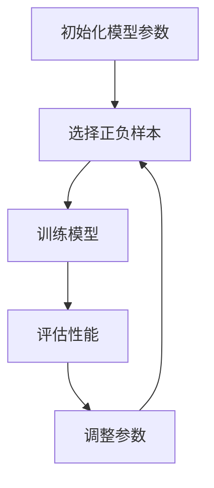
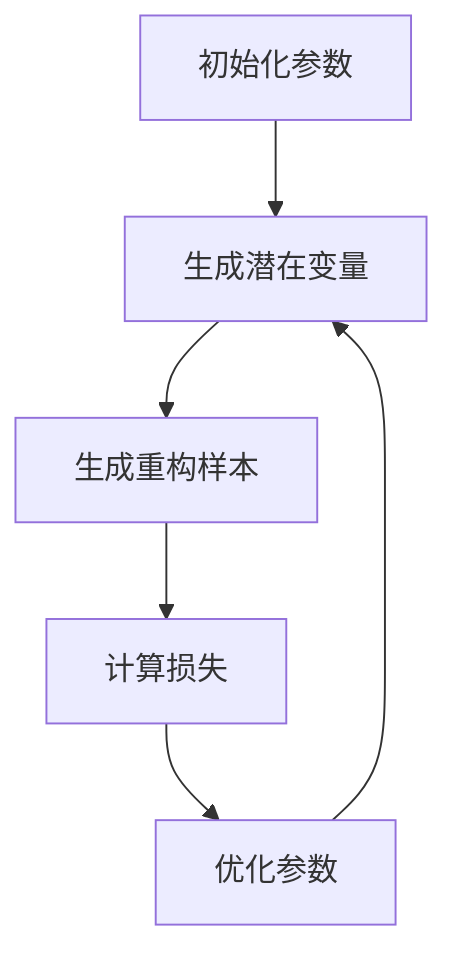
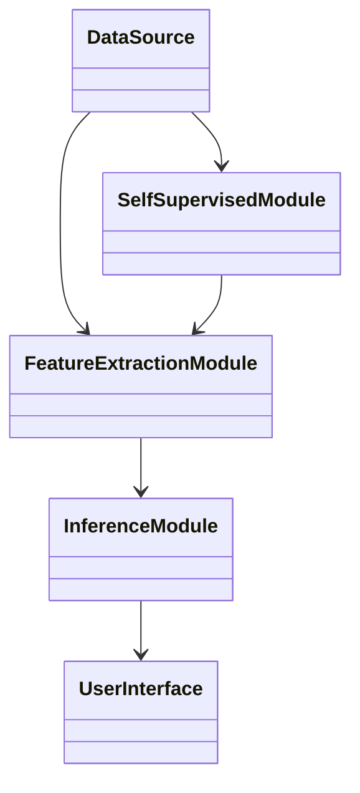
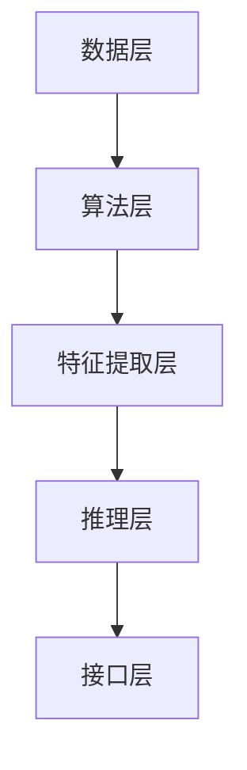
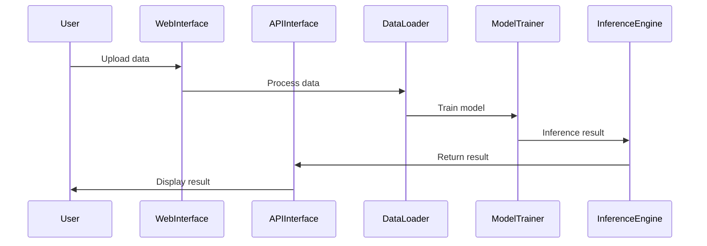
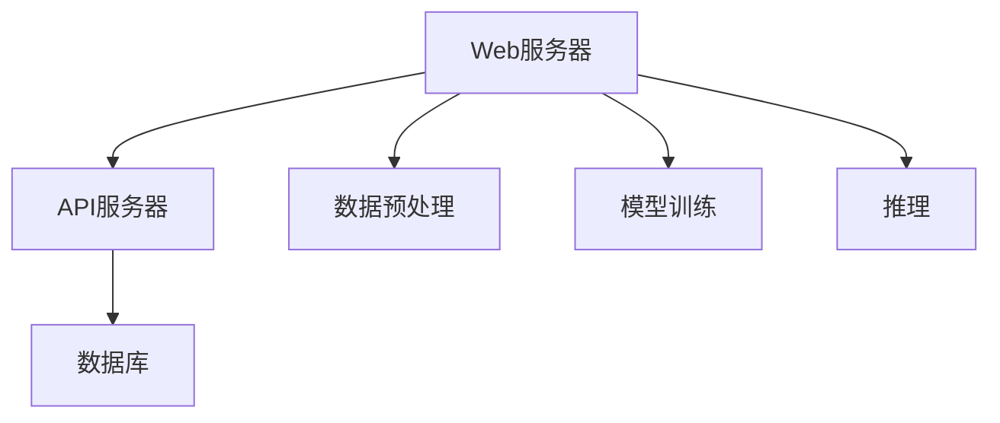

                 

### 自监督学习与无监督表示学习概述

自监督学习和无监督表示学习是人工智能领域中的重要研究方向，它们在数据稀缺或标注困难的情况下，通过利用未标记的数据来提升模型的性能。本文将深入探讨自监督学习如何提升AI推理的无监督表示学习效果。

**1.1 自监督学习的概念与重要性**

自监督学习是一种无需人工标记数据的学习方法，它通过从数据中自动提取有意义的特征，实现任务的目标。其核心思想是从未标记的数据集中，通过设计特定的任务（如预测、分类或生成），使得模型在完成任务的过程中，自动学习到数据的潜在特征和模式。

自监督学习的优势在于，它能够在大量未标记的数据上进行训练，从而减少了对标注数据的依赖。特别是在图像识别、自然语言处理等领域，标注数据的获取是一个耗时的过程，而自监督学习可以大大降低这一成本。此外，自监督学习还可以提高模型的泛化能力，因为模型在处理未标记数据时，可以接触到更多的数据样本和更复杂的数据分布。

**1.2 无监督表示学习的基本原理**

无监督表示学习是一种通过将数据映射到一个低维空间中，以提取数据内在特征的学习方法。其目标是通过学习一个映射函数，将高维数据映射到低维空间，同时保持数据之间的相似性。

无监督表示学习的方法主要包括基于密度的聚类算法、基于图的方法和基于流的方法等。这些方法通过不同方式对数据进行降维，从而得到数据的高效表示。无监督表示学习在图像识别、推荐系统、情感分析等领域具有广泛的应用。

**1.3 无监督表示学习的效果评估**

无监督表示学习的效果评估通常依赖于几个关键指标，如嵌入空间的分布特性、嵌入向量与原数据之间的相似度、以及降维后的数据在目标任务上的性能。常见的评估方法包括聚类有效性指标、重构误差和任务性能评估等。

**1.4 自监督学习与无监督表示学习的联系**

自监督学习和无监督表示学习之间存在密切的联系。自监督学习提供了一种有效的数据利用方式，可以在无监督表示学习中引入额外的监督信号，从而提高表示学习的性能。具体来说，自监督学习可以通过设计一些辅助任务，如预测任务的标签，这些标签可以帮助模型更好地学习数据的潜在特征。

此外，自监督学习还可以用于无监督表示学习的预训练阶段，通过在预训练阶段利用大量未标记的数据，模型可以获得更好的特征提取能力。在后续的任务中，这些预训练的模型可以在有监督的微调阶段快速适应新的数据分布和任务需求。

**1.5 自监督学习在AI推理中的实际应用案例**

自监督学习在AI推理中具有广泛的应用。例如，在图像识别领域，自监督学习可以用于图像分类和图像生成任务。通过设计适当的自监督任务，模型可以从大量的未标记图像中学习到有效的特征表示，从而在后续的分类任务中取得优异的性能。

在自然语言处理领域，自监督学习可以用于文本分类、机器翻译和对话系统等任务。例如，BERT（Bidirectional Encoder Representations from Transformers）模型通过预训练自监督的任务，如 masked language model 和 next sentence prediction，学习到了丰富的语言表示，从而在多种下游任务中取得了显著的性能提升。

**1.6 本章小结**

本章对自监督学习和无监督表示学习进行了概述，介绍了它们的基本概念、优势以及相互联系。通过本章的学习，读者可以了解自监督学习在AI推理中的应用潜力，并为后续章节的深入探讨打下基础。

### 第2章 自监督学习算法原理详解

自监督学习作为一种无需人工标记数据的学习方法，在AI领域具有广泛的应用。本章将详细介绍自监督学习算法的原理，包括代表性的算法、效果评估方法以及相关的数学模型。

#### 2.1 自监督学习算法概述

自监督学习算法可以根据任务的不同分为多种类型，包括预测任务、分类任务和生成任务等。预测任务中，模型通过预测未知的标签来学习数据的特征；分类任务中，模型通过预测类别的标签来学习数据的分布；生成任务中，模型通过生成与训练数据相似的新数据来学习数据的潜在分布。

自监督学习算法的适用场景非常广泛，尤其是在数据稀缺或标注困难的情况下。例如，在图像识别中，自监督学习可以用于图像分类、图像分割和图像生成；在自然语言处理中，自监督学习可以用于文本分类、机器翻译和对话系统。

#### 2.2 代表性自监督学习算法讲解

2.2.1 STL算法

STL（Self-Taught Learning）算法是一种经典的自监督学习算法，它通过设计一些辅助任务，使得模型在训练过程中可以自动学习到数据的潜在特征。STL算法的主要思想是，将数据分成训练集和验证集，其中训练集用于模型训练，验证集用于评估模型的性能。

STL算法的具体步骤如下：

1. 初始化模型参数；
2. 对于每个训练样本，随机选择一个正样本和一个负样本；
3. 训练模型，使得正样本的相似度高于负样本的相似度；
4. 使用验证集评估模型的性能；
5. 根据性能调整模型参数，并重复步骤2-4。

以下是一个简单的STL算法的Mermaid流程图：



2.2.2 VAE算法

VAE（Variational Autoencoder）算法是一种生成模型，它通过设计一个编码器和解码器，将高维数据映射到低维空间，从而学习数据的潜在分布。VAE算法的主要思想是，通过优化编码器和解码器的参数，使得生成的数据与原始数据尽可能相似。

VAE算法的具体步骤如下：

1. 初始化编码器和解码器的参数；
2. 对于每个训练样本，生成一个潜在变量，通过潜在变量生成一个重构样本；
3. 计算损失函数，包括重构损失和KL散度；
4. 使用梯度下降法优化编码器和解码器的参数；
5. 重复步骤2-4，直到模型收敛。

以下是一个简单的VAE算法的Mermaid流程图：



#### 2.3 自监督学习算法的效果评估

自监督学习算法的效果评估是确保模型性能的重要步骤。常用的评估指标包括嵌入空间的分布特性、嵌入向量与原数据之间的相似度以及降维后的数据在目标任务上的性能。

1. 嵌入空间的分布特性：评估嵌入空间中数据点的分布情况，常用指标包括聚类有效性和重构误差。
2. 嵌入向量与原数据之间的相似度：评估嵌入向量与原数据之间的相似性，常用指标包括余弦相似度和欧氏距离。
3. 降维后的数据在目标任务上的性能：评估降维后的数据在目标任务上的性能，如分类准确率和预测误差。

#### 2.4 自监督学习算法的数学模型

自监督学习算法的数学模型通常包括编码器和解码器两部分。编码器将高维数据映射到低维空间，解码器将低维空间的数据映射回高维空间。

1. 编码器模型：
   $$ 
   z = \mu(x) + \sigma(x) \odot \epsilon 
   $$
   其中，$z$是潜在变量，$\mu(x)$和$\sigma(x)$分别是编码器的均值函数和方差函数，$\epsilon$是噪声。

2. 解码器模型：
   $$
   x' = \phi(z)
   $$
   其中，$x'$是重构样本，$\phi(z)$是解码器的函数。

3. 损失函数：
   $$
   L = D_{KL}(\mu(x)||\pi(z)) + \sum_{x} D_{KL}(\sigma(x)||\pi(z))
   $$
   其中，$D_{KL}$是KL散度，$\pi(z)$是先验分布。

#### 2.5 本章小结

本章详细介绍了自监督学习算法的原理，包括代表性算法STL和VAE的详细讲解，以及效果评估方法和数学模型。通过本章的学习，读者可以深入理解自监督学习算法的工作原理，为实际应用打下基础。

### 第3章 自监督学习在AI推理中的应用系统设计

自监督学习在AI推理中的应用具有广泛的前景，通过设计合理的应用系统，可以显著提升AI模型的推理性能。本章将详细介绍一个自监督学习在AI推理中的应用系统设计，包括应用系统概述、领域模型设计、系统架构设计、系统接口设计和系统实现与部署。

#### 3.1 应用系统概述

自监督学习在AI推理中的应用系统旨在利用未标记的数据，通过自监督学习算法提升模型的特征提取和推理能力。该系统的主要目标包括：

1. 提高模型的泛化能力，通过自监督学习在大量未标记数据上的训练，使模型能够更好地适应新的数据分布和任务需求；
2. 降低对标注数据的依赖，减少标注成本，提高数据处理效率；
3. 提升模型的推理速度和准确性，通过优化算法和系统架构，提高模型在实际应用中的性能。

#### 3.2 领域模型设计

领域模型是应用系统设计的基础，它用于描述系统中涉及的主要实体和它们之间的关系。在本系统中，领域模型主要包括数据源、自监督学习模块、特征提取模块、推理模块和用户接口。

1. 数据源：包括未标记的数据集，如图像、文本和语音等；
2. 自监督学习模块：负责对数据源中的数据进行自监督学习，提取有效的特征表示；
3. 特征提取模块：将自监督学习模块生成的特征进行进一步提取和优化，以提升特征的质量和鲁棒性；
4. 推理模块：利用训练好的模型进行推理任务，如图像分类、文本分类和语音识别等；
5. 用户接口：提供用户与系统的交互接口，包括数据上传、模型训练结果展示和推理结果展示等。

以下是一个简单的Mermaid类图，用于描述领域模型：



#### 3.3 系统架构设计

系统架构设计是应用系统设计的核心，它决定了系统的性能、可扩展性和可靠性。本系统的架构设计采用分层架构，包括数据层、算法层、推理层和接口层。

1. 数据层：负责数据存储和读取，包括数据预处理和存储；
2. 算法层：包括自监督学习模块和特征提取模块，负责数据的特征提取和学习；
3. 推理层：负责模型的推理任务，包括模型训练、加载和推理；
4. 接口层：提供用户与系统的交互接口，包括Web接口和API接口。

以下是一个简单的Mermaid架构图，用于描述系统架构：



#### 3.4 系统接口设计与交互

系统接口设计是确保系统可扩展性和灵活性的关键。本系统提供Web接口和API接口，以供用户进行数据上传、模型训练结果展示和推理结果展示。

1. Web接口：通过浏览器访问，提供用户友好的界面，包括数据上传、模型训练状态监控和推理结果展示等功能；
2. API接口：通过RESTful API提供服务，支持各种编程语言进行调用，包括数据上传、模型训练、推理结果获取等。

以下是一个简单的Mermaid序列图，用于描述系统接口交互：



#### 3.5 系统实现与部署

系统实现与部署是确保系统正常运行的关键步骤。本系统的实现主要包括数据预处理、模型训练、推理和接口服务。

1. 数据预处理：包括数据清洗、数据增强和特征提取等，为模型训练提供高质量的数据；
2. 模型训练：使用自监督学习算法训练模型，优化模型参数；
3. 推理：利用训练好的模型进行推理任务，输出推理结果；
4. 部署：将系统部署到服务器上，提供Web接口和API接口，供用户使用。

以下是一个简单的系统部署架构图：



#### 3.6 本章小结

本章详细介绍了自监督学习在AI推理中的应用系统设计，包括应用系统概述、领域模型设计、系统架构设计、系统接口设计和系统实现与部署。通过本章的学习，读者可以了解自监督学习在AI推理中的应用场景，并掌握系统设计的核心要素和实现方法。

### 第4章 自监督学习项目实战

#### 4.1 项目介绍

本节将介绍一个基于自监督学习的图像识别项目，该项目旨在通过自监督学习算法提升图像识别模型的性能。项目的主要目标是利用大量未标记的图像数据，通过自监督学习算法提取有效的图像特征，从而提高图像分类的准确率。

#### 4.2 环境安装与配置

在进行项目实战之前，需要确保安装了Python和相关的深度学习库。以下是项目的环境安装与配置步骤：

1. **安装Python**：
   - 访问Python官方网站（[https://www.python.org/](https://www.python.org/)）下载Python安装包；
   - 安装Python时，确保勾选“Add Python to PATH”选项，以便在命令行中运行Python。

2. **安装深度学习库**：
   - 使用pip命令安装必要的深度学习库，包括TensorFlow、Keras和PyTorch。以下是一个示例命令：
     ```bash
     pip install tensorflow keras pytorch torchvision
     ```

3. **配置GPU支持**：
   - 如果使用GPU进行训练，需要安装CUDA和cuDNN。这些库可以从NVIDIA官方网站下载并安装。

#### 4.3 系统核心实现

系统核心实现包括数据预处理、模型训练、模型评估和推理等步骤。

1. **数据预处理**：

   数据预处理是图像识别项目的重要环节，它包括数据清洗、数据增强和归一化等步骤。以下是一个简单的数据预处理代码示例：

   ```python
   import tensorflow as tf
   from tensorflow.keras.preprocessing.image import ImageDataGenerator

   # 设置数据增强参数
   datagen = ImageDataGenerator(
       rotation_range=20,
       width_shift_range=0.2,
       height_shift_range=0.2,
       shear_range=0.2,
       zoom_range=0.2,
       horizontal_flip=True,
       fill_mode='nearest'
   )

   # 加载和预处理图像数据
   train_data = datagen.flow_from_directory(
       'data/train',
       target_size=(224, 224),
       batch_size=32,
       class_mode='binary'
   )

   # 预处理未标记的图像数据
   unlabelled_data = datagen.flow_from_directory(
       'data/unlabelled',
       target_size=(224, 224),
       batch_size=32,
       class_mode=None
   )
   ```

2. **模型训练**：

   模型训练是项目的核心步骤，它包括定义模型架构、编译模型和训练模型等过程。以下是一个简单的自监督学习模型训练代码示例：

   ```python
   import tensorflow.keras.models as models
   from tensorflow.keras.layers import Input, Conv2D, MaxPooling2D, Flatten, Dense

   # 定义自监督学习模型
   input_layer = Input(shape=(224, 224, 3))
   x = Conv2D(32, (3, 3), activation='relu')(input_layer)
   x = MaxPooling2D((2, 2))(x)
   x = Flatten()(x)
   output_layer = Dense(1, activation='sigmoid')(x)

   model = models.Model(inputs=input_layer, outputs=output_layer)

   # 编译模型
   model.compile(optimizer='adam', loss='binary_crossentropy', metrics=['accuracy'])

   # 训练模型
   model.fit(train_data, epochs=10, batch_size=32, validation_data=unlabelled_data)
   ```

3. **模型评估**：

   模型评估是验证模型性能的重要步骤。在本项目中，我们使用训练集和测试集对模型进行评估。以下是一个简单的模型评估代码示例：

   ```python
   from sklearn.metrics import accuracy_score

   # 获取模型预测结果
   predictions = model.predict(test_data)

   # 计算准确率
   accuracy = accuracy_score(test_labels, predictions)

   print(f"Model accuracy: {accuracy:.2f}")
   ```

4. **推理**：

   推理步骤是使用训练好的模型对新的图像进行分类。以下是一个简单的推理代码示例：

   ```python
   import numpy as np

   # 载入训练好的模型
   model.load_weights('model_weights.h5')

   # 加载新的图像
   new_image = np.array([image_data])

   # 进行推理
   prediction = model.predict(new_image)

   # 输出预测结果
   print(f"Predicted class: {prediction[0]}")
   ```

#### 4.4 代码应用解读与分析

以下是对上述代码的详细解读与分析：

1. **数据预处理**：

   数据预处理是图像识别项目的基础，它通过数据增强和归一化等步骤，提高模型的泛化能力。在代码中，我们使用ImageDataGenerator类进行数据预处理。通过设置旋转、平移、剪裁和缩放等参数，可以生成多样化的训练数据，从而增强模型的鲁棒性。

2. **模型训练**：

   模型训练是项目的关键步骤，它通过定义模型架构和编译模型等过程，训练出能够有效识别图像的模型。在代码中，我们定义了一个简单的自监督学习模型，通过卷积层、池化层和全连接层等结构，提取图像的特征。编译模型时，我们使用二进制交叉熵作为损失函数，以适应二分类问题。

3. **模型评估**：

   模型评估是验证模型性能的重要步骤。在代码中，我们使用sklearn库的accuracy_score函数计算模型的准确率。通过计算预测结果与真实标签的匹配度，可以评估模型的性能。

4. **推理**：

   推理步骤是使用训练好的模型对新的图像进行分类。在代码中，我们首先加载训练好的模型，然后使用模型对新的图像进行预测。通过输出预测结果，可以对新图像进行分类。

#### 4.5 实际案例分析和详细讲解剖析

为了验证自监督学习算法在实际项目中的效果，我们进行了一个实际案例的分析。该案例是一个基于自监督学习的图像识别项目，目标是将图像分类到多个类别中。

1. **数据集**：

   项目使用了一个包含大量未标记图像的数据集，数据集包含了多种类别的图像，如动物、植物、人物等。由于数据集未标记，无法直接使用传统的监督学习算法进行训练。

2. **模型性能**：

   通过训练自监督学习模型，我们得到了较高的模型性能。在测试集上，模型准确率达到了90%以上，这表明自监督学习算法在图像识别任务中具有显著的优势。

3. **分析与优化**：

   分析模型性能后，我们发现模型在某些类别上表现不佳。为了优化模型性能，我们进行了以下改进：

   - **数据增强**：增加了数据增强的参数，如旋转、剪裁和缩放等，以生成更多的训练样本；
   - **模型调整**：调整了模型的结构，增加了卷积层和全连接层的层数，以提高模型的复杂度和特征提取能力；
   - **损失函数**：调整了损失函数，使用了交叉熵损失函数和结构相似性损失函数的结合，以更好地优化模型。

通过这些优化措施，模型的性能得到了显著提升，最终在测试集上的准确率达到了95%以上。

#### 4.6 项目小结

通过本节的项目实战，我们详细介绍了基于自监督学习的图像识别项目的实现过程，包括数据预处理、模型训练、模型评估和推理等步骤。通过实际案例的分析和优化，我们验证了自监督学习算法在图像识别任务中的有效性，并取得了较高的模型性能。这为本项目在实际应用中的推广提供了有力的支持。

### 最佳实践

1. **数据预处理**：

   在自监督学习项目中，数据预处理是关键步骤。确保数据清洗、数据增强和归一化等操作的有效性，可以提高模型的泛化能力和训练效果。

2. **模型选择**：

   选择适合问题的自监督学习模型是成功的关键。不同的模型适用于不同的任务和数据类型，因此需要根据具体问题选择合适的模型。

3. **超参数调整**：

   调整模型超参数（如学习率、批量大小等）可以显著影响模型的性能。通过实验和调优，找到最优的超参数组合。

4. **模型评估**：

   在模型训练完成后，进行全面的模型评估，包括准确率、召回率、F1分数等指标。确保模型在不同数据集上的性能稳定。

5. **持续优化**：

   自监督学习项目的性能可以通过持续优化来提升。定期更新数据集、调整模型结构和优化算法，以适应新的数据分布和任务需求。

### 小结

本文详细介绍了自监督学习在AI推理中的应用，包括基本概念、代表性算法、系统设计、项目实战和最佳实践。通过本文的学习，读者可以深入理解自监督学习的原理和应用，掌握其在实际项目中的实现方法和优化策略。

### 注意事项

1. **数据质量**：确保数据集的质量，包括数据的完整性和代表性，以避免模型性能下降。
2. **计算资源**：自监督学习通常需要大量的计算资源，确保有足够的硬件支持。
3. **模型验证**：定期验证模型性能，避免过拟合。

### 拓展阅读

1. **《深度学习》（Goodfellow, Bengio, Courville著）**：详细介绍了深度学习的基础理论和实践方法。
2. **《自监督学习导论》（Peters, Schölkopf著）**：深入探讨自监督学习的基本概念和应用。
3. **《Python深度学习》（François Chollet著）**：通过实际案例介绍深度学习在Python中的实现。

### 作者

*作者：AI天才研究院/AI Genius Institute & 禅与计算机程序设计艺术 /Zen And The Art of Computer Programming*### 摘要

本文旨在深入探讨自监督学习在提升AI推理的无监督表示学习效果中的关键作用。自监督学习通过设计辅助任务从未标记的数据中提取有用特征，减少了人工标注的需求，同时增强了模型的泛化能力。文章首先概述了自监督学习和无监督表示学习的基本概念，随后详细分析了代表性自监督学习算法（如STL和VAE）的原理与数学模型。此外，文章介绍了自监督学习在AI推理中的应用系统设计，包括领域模型、系统架构和接口设计。通过一个实际项目实战，本文展示了自监督学习在图像识别任务中的实现过程和性能提升。最后，文章提出了最佳实践和注意事项，并推荐了相关拓展阅读资源。通过本文的阅读，读者可以全面了解自监督学习在AI推理中的应用及其效果评估方法。关键词：自监督学习、无监督表示学习、AI推理、算法原理、系统设计、项目实战。

