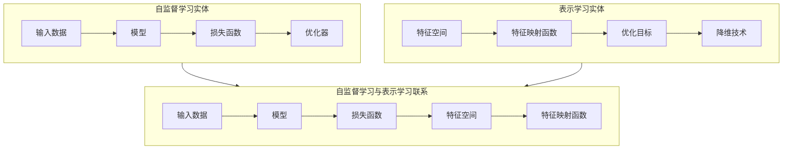
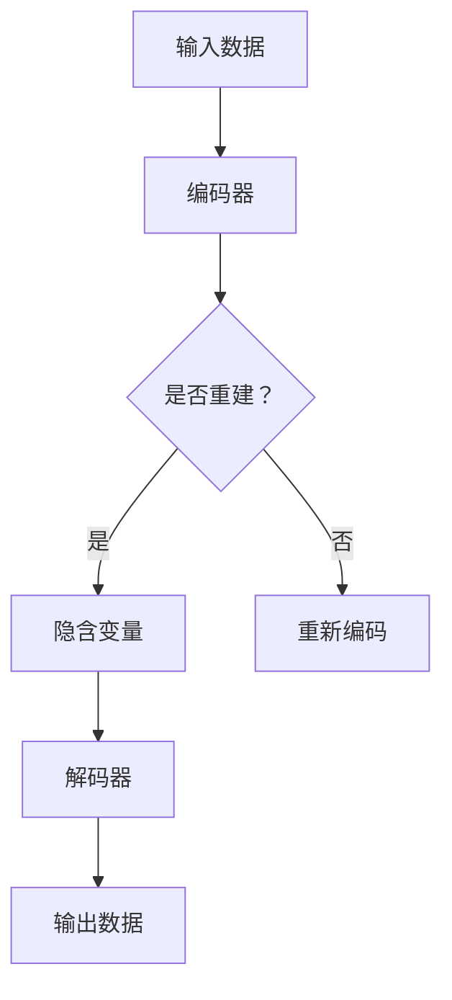
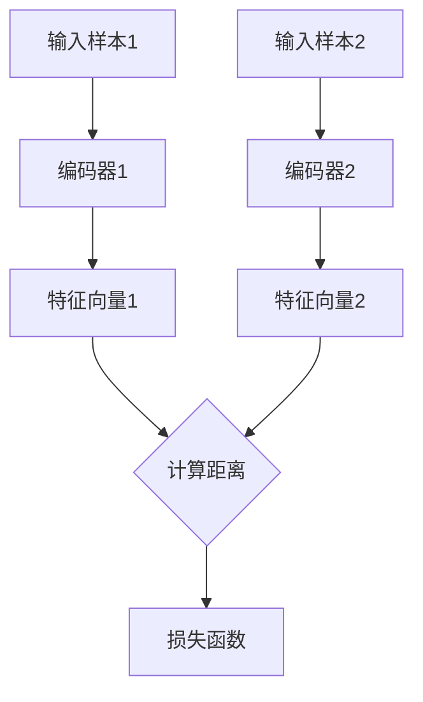
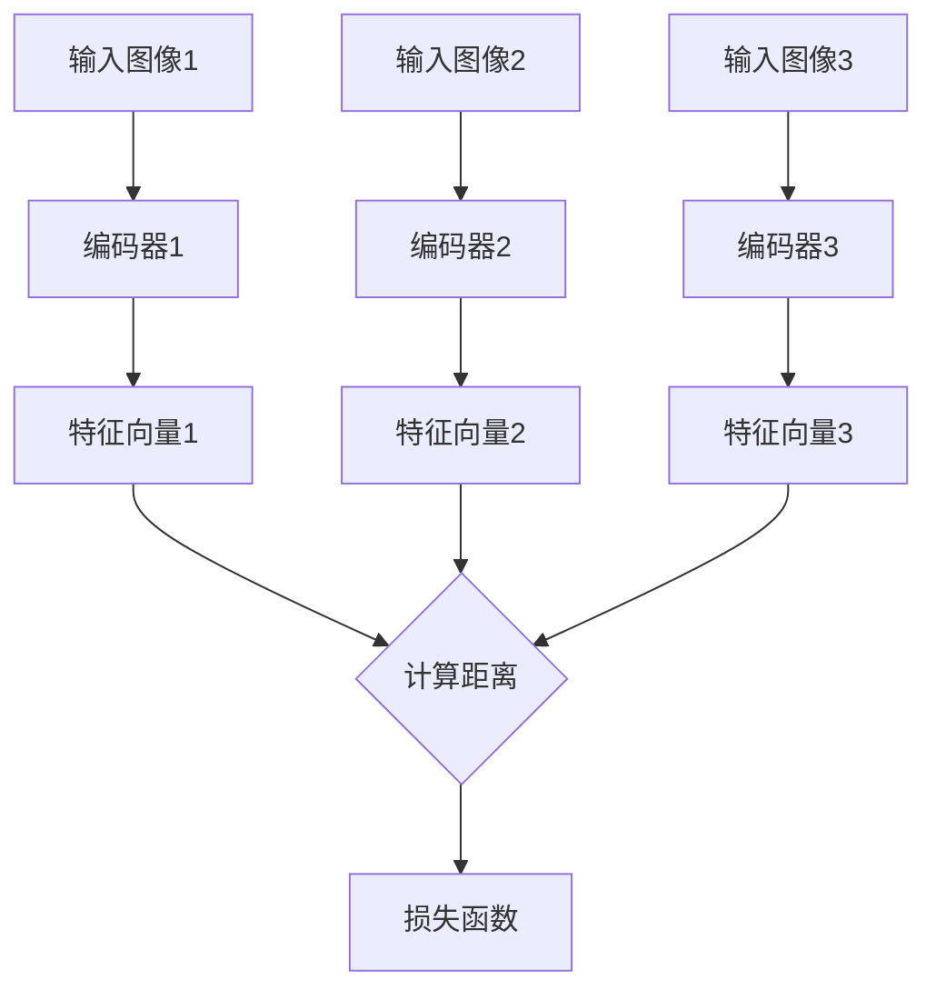

                 

### 设计目标

设计一个完整且逻辑清晰的目录大纲，是为了确保《自监督学习提升AI推理的表示学习效果》这本书的内容能够系统化、条理化地呈现给读者。我们的目标是：

1. **简洁明了**：目录大纲应简洁明了，避免冗长和重复，以便读者能够迅速把握书籍的结构和主要内容。
2. **逻辑清晰**：每个章节的内容应围绕核心主题展开，章节之间的逻辑关系应紧密相连，确保整体内容的连贯性。
3. **便于阅读**：通过合理的结构安排，使得读者在阅读时能够逐步深入理解，从而有效吸收知识。

为了实现上述目标，我们需要仔细规划书籍的各个部分，确保每个章节的内容都能为整体提供一个坚实的基础，同时突出重点，避免偏离主题。

### 目录结构安排

整个书籍可以分为四个主要部分：背景介绍、核心概念与联系、算法原理讲解、系统分析与架构设计。下面将详细阐述每个部分的内容及其安排。

**第一部分：背景介绍**

这一部分主要介绍自监督学习和表示学习的基本概念，为后续的深入讨论打下基础。具体包括：

- **第1章：自监督学习与表示学习概述**
  - 描述自监督学习的发展背景、核心概念及其在AI推理中的重要性。
  - 介绍表示学习的基本概念和其在AI推理中的应用。

**第二部分：核心概念与联系**

这一部分将深入探讨自监督学习与表示学习之间的联系，通过属性特征对比表格和实体关系图来帮助读者理解两者之间的关系。具体包括：

- **第2章：自监督学习与表示学习的关系探讨**
  - 详细探讨自监督学习与表示学习的关系，通过属性特征对比表格和实体关系图来阐述两者之间的联系。
  - 分析自监督学习与表示学习的差异和互补性。

**第三部分：算法原理讲解**

这一部分将介绍几种常见的自监督学习和表示学习算法，并通过Python代码示例和数学模型公式来详细讲解其原理。具体包括：

- **第3章：常见的自监督学习算法**
  - 介绍自监督学习的核心算法，如Autoencoder、Siamese Network和Triplet Loss。
  - 通过Python代码示例和Mermaid流程图展示算法的工作流程。
  - 详细讲解算法原理，包括数学模型和公式。

**第四部分：系统分析与架构设计**

这一部分将分析自监督学习和表示学习在系统中的应用场景，并描述一个实际的项目案例。具体包括：

- **第4章：自监督学习与表示学习在系统中的应用**
  - 分析自监督学习与表示学习在图像识别、自然语言处理和语音识别等领域的应用。
  - 描述一个实际的项目案例，包括系统功能设计、系统架构设计、系统接口设计和系统交互设计。

通过上述结构的安排，我们旨在为读者提供一部系统、全面、深入的技术著作，帮助他们全面了解自监督学习和表示学习在AI推理中的重要作用，并掌握相关算法和应用实践。

### 目录大纲设计思路

为了确保《自监督学习提升AI推理的表示学习效果》这本书的内容能够系统化、条理化地呈现，我们精心设计了目录大纲。以下是详细的设计思路：

#### 第一部分：背景介绍

**第1章：自监督学习与表示学习概述**

1. **第1.1节：自监督学习的发展背景**
   - **自监督学习的起源**：介绍自监督学习的历史背景，从早期的研究到现代的广泛应用。
   - **核心概念**：详细阐述自监督学习的基本概念，包括其定义、类型和应用领域。
   - **在AI推理中的重要性**：分析自监督学习在人工智能推理中的作用，及其如何提升AI系统的性能。

2. **第1.2节：表示学习的基本概念**
   - **定义与作用**：介绍表示学习的基本定义，以及其在数据预处理和特征提取中的重要作用。
   - **在AI推理中的应用**：探讨表示学习在图像识别、自然语言处理和语音识别等AI推理任务中的具体应用。

#### 第二部分：核心概念与联系

**第2章：自监督学习与表示学习的关系探讨**

1. **第2.1节：自监督学习与表示学习的联系**
   - **自监督学习如何促进表示学习**：分析自监督学习在特征提取和数据增强方面的作用，如何提高表示学习的质量。
   - **表示学习如何提升自监督学习效果**：探讨表示学习如何通过提供更好的输入数据，来增强自监督学习的训练效果。
   - **对比分析**：通过属性特征对比表格，详细分析自监督学习和表示学习的区别和联系。

2. **第2.2节：自监督学习与表示学习的实体关系图**
   - **自监督学习实体**：介绍自监督学习中的关键实体，如输入数据、模型、损失函数等。
   - **表示学习实体**：介绍表示学习中的关键实体，如特征空间、特征映射函数、优化目标等。
   - **实体关系图绘制**：使用Mermaid流程图，展示自监督学习与表示学习中的实体关系，帮助读者直观理解两者之间的联系。

#### 第三部分：算法原理讲解

**第3章：常见的自监督学习算法**

1. **第3.1节：自监督学习的核心算法**
   - **Autoencoder算法**
     - **原理讲解**：详细讲解Autoencoder的工作原理，包括编码器和解码器的结构。
     - **代码示例**：通过Python代码示例，展示Autoencoder的实现过程。
     - **应用场景**：分析Autoencoder在图像压缩和特征提取中的应用。
   - **Siamese Network算法**
     - **原理讲解**：介绍Siamese Network的基本原理，如何通过对比学习实现分类任务。
     - **代码示例**：展示Siamese Network的Python代码实现。
     - **应用场景**：探讨Siamese Network在人脸识别和文本匹配中的应用。
   - **Triplet Loss算法**
     - **原理讲解**：详细解释Triplet Loss如何通过比较三元组中的样本，实现深度特征学习。
     - **代码示例**：展示Triplet Loss的Python代码实现。
     - **应用场景**：分析Triplet Loss在图像识别和文本分类中的应用。

2. **第3.2节：自监督学习的Python代码示例**
   - **Autoencoder代码实现**：通过Python代码示例，详细讲解Autoencoder的构造和训练过程。
   - **Siamese Network代码实现**：展示如何使用Python和深度学习框架（如TensorFlow或PyTorch）实现Siamese Network。
   - **Triplet Loss代码实现**：通过Python代码示例，解释Triplet Loss在特征提取中的实现。

3. **第3.3节：自监督学习的数学模型与公式**
   - **Autoencoder数学模型**：使用LaTeX公式详细描述Autoencoder的数学模型。
   - **Siamese Network数学模型**：介绍Siamese Network的损失函数和优化目标。
   - **Triplet Loss数学模型**：解释Triplet Loss的计算方法和优化过程。

#### 第四部分：系统分析与架构设计

**第4章：自监督学习与表示学习在系统中的应用**

1. **第4.1节：自监督学习与表示学习的应用场景**
   - **图像识别**：探讨自监督学习在图像识别中的应用，如何通过特征提取提高识别准确率。
   - **自然语言处理**：分析自监督学习在自然语言处理中的角色，包括文本分类和语言模型训练。
   - **语音识别**：讨论自监督学习在语音信号处理和特征提取中的作用。

2. **第4.2节：实际项目案例介绍**
   - **项目背景**：介绍自监督学习和表示学习在实际项目中的应用背景。
   - **系统功能设计**：通过Mermaid类图，展示系统的领域模型和功能模块。
   - **系统架构设计**：使用Mermaid架构图，描述系统的整体架构和关键组件。

3. **第4.3节：系统接口设计与交互**
   - **系统接口设计**：说明系统的API设计和数据接口，确保模块之间的高效通信。
   - **系统交互设计**：通过Mermaid序列图，展示系统内部和外部的交互流程。

通过上述详细的目录大纲设计，我们旨在为读者提供一部内容丰富、结构严谨的技术书籍，帮助他们全面了解自监督学习和表示学习在AI推理中的应用，并掌握相关算法和实践。

### 目录大纲

**第一部分：背景介绍**

**第1章：自监督学习与表示学习概述**

- **1.1 自监督学习的发展背景**
  - **1.1.1 自监督学习的起源**：介绍自监督学习的历史背景，从早期的研究到现代的广泛应用。
  - **1.1.2 自监督学习的核心概念**：详细阐述自监督学习的基本概念，包括其定义、类型和应用领域。
  - **1.1.3 自监督学习在AI推理中的重要性**：分析自监督学习在人工智能推理中的作用，及其如何提升AI系统的性能。

- **1.2 表示学习的基本概念**
  - **1.2.1 表示学习的定义**：介绍表示学习的基本定义，以及其在数据预处理和特征提取中的重要作用。
  - **1.2.2 表示学习的作用**：探讨表示学习在图像识别、自然语言处理和语音识别等AI推理任务中的具体应用。
  - **1.2.3 表示学习在AI推理中的应用**：详细讨论表示学习在各类AI推理任务中的应用场景，如特征提取、模型压缩和迁移学习。

**第二部分：核心概念与联系**

**第2章：自监督学习与表示学习的关系探讨**

- **2.1 自监督学习与表示学习的联系**
  - **2.1.1 自监督学习如何促进表示学习**：分析自监督学习在特征提取和数据增强方面的作用，如何提高表示学习的质量。
  - **2.1.2 表示学习如何提升自监督学习效果**：探讨表示学习如何通过提供更好的输入数据，来增强自监督学习的训练效果。
  - **2.1.3 自监督学习与表示学习的对比分析**：通过属性特征对比表格，详细分析自监督学习和表示学习的区别和联系。

- **2.2 自监督学习与表示学习的实体关系图**
  - **2.2.1 自监督学习实体**：介绍自监督学习中的关键实体，如输入数据、模型、损失函数等。
  - **2.2.2 表示学习实体**：介绍表示学习中的关键实体，如特征空间、特征映射函数、优化目标等。
  - **2.2.3 实体关系图绘制**：使用Mermaid流程图，展示自监督学习与表示学习中的实体关系，帮助读者直观理解两者之间的联系。

**第三部分：算法原理讲解**

**第3章：常见的自监督学习算法**

- **3.1 自监督学习的核心算法**
  - **3.1.1 Autoencoder算法**
    - **原理讲解**：详细讲解Autoencoder的工作原理，包括编码器和解码器的结构。
    - **代码示例**：通过Python代码示例，展示Autoencoder的实现过程。
    - **应用场景**：分析Autoencoder在图像压缩和特征提取中的应用。
  - **3.1.2 Siamese Network算法**
    - **原理讲解**：介绍Siamese Network的基本原理，如何通过对比学习实现分类任务。
    - **代码示例**：展示Siamese Network的Python代码实现。
    - **应用场景**：探讨Siamese Network在人脸识别和文本匹配中的应用。
  - **3.1.3 Triplet Loss算法**
    - **原理讲解**：详细解释Triplet Loss如何通过比较三元组中的样本，实现深度特征学习。
    - **代码示例**：展示Triplet Loss的Python代码实现。
    - **应用场景**：分析Triplet Loss在图像识别和文本分类中的应用。

- **3.2 自监督学习的Python代码示例**
  - **3.2.1 Autoencoder代码实现**：通过Python代码示例，详细讲解Autoencoder的构造和训练过程。
  - **3.2.2 Siamese Network代码实现**：展示如何使用Python和深度学习框架（如TensorFlow或PyTorch）实现Siamese Network。
  - **3.2.3 Triplet Loss代码实现**：通过Python代码示例，解释Triplet Loss在特征提取中的实现。

- **3.3 自监督学习的数学模型与公式**
  - **3.3.1 Autoencoder数学模型**：使用LaTeX公式详细描述Autoencoder的数学模型。
  - **3.3.2 Siamese Network数学模型**：介绍Siamese Network的损失函数和优化目标。
  - **3.3.3 Triplet Loss数学模型**：解释Triplet Loss的计算方法和优化过程。

**第四部分：系统分析与架构设计**

**第4章：自监督学习与表示学习在系统中的应用**

- **4.1 自监督学习与表示学习的应用场景**
  - **4.1.1 图像识别**：探讨自监督学习在图像识别中的应用，如何通过特征提取提高识别准确率。
  - **4.1.2 自然语言处理**：分析自监督学习在自然语言处理中的角色，包括文本分类和语言模型训练。
  - **4.1.3 语音识别**：讨论自监督学习在语音信号处理和特征提取中的作用。

- **4.2 实际项目案例介绍**
  - **4.2.1 项目背景**：介绍自监督学习和表示学习在实际项目中的应用背景。
  - **4.2.2 系统功能设计**：通过Mermaid类图，展示系统的领域模型和功能模块。
  - **4.2.3 系统架构设计**：使用Mermaid架构图，描述系统的整体架构和关键组件。

- **4.3 系统接口设计与交互**
  - **4.3.1 系统接口设计**：说明系统的API设计和数据接口，确保模块之间的高效通信。
  - **4.3.2 系统交互设计**：通过Mermaid序列图，展示系统内部和外部的交互流程。

**第五部分：项目实战**

**第5章：自监督学习与表示学习的项目实战**

- **5.1 环境安装与配置**
  - **5.1.1 环境安装**：指导读者如何安装必要的软件和工具，如深度学习框架和编程环境。
  - **5.1.2 系统配置**：提供详细的系统配置步骤，确保环境能够正常运行。

- **5.2 系统核心功能实现**
  - **5.2.1 核心功能介绍**：介绍系统的主要功能模块和实现逻辑。
  - **5.2.2 源代码实现**：展示系统核心功能的源代码实现，并进行详细解读。

- **5.3 代码应用解读与分析**
  - **5.3.1 代码解读**：对系统核心功能的代码进行逐行解读，帮助读者理解实现细节。
  - **5.3.2 分析与讨论**：讨论代码设计中的优缺点，并提出改进建议。

- **5.4 实际案例分析**
  - **5.4.1 案例背景**：介绍实际案例的背景信息，包括项目目标和应用场景。
  - **5.4.2 案例分析**：分析案例中自监督学习和表示学习应用的效果，总结经验教训。
  - **5.4.3 案例讲解**：详细讲解案例中的关键技术和实现细节。

**第六部分：最佳实践与总结**

**第6章：自监督学习与表示学习的最佳实践与总结**

- **6.1 最佳实践**
  - **6.1.1 实践一**：提供关于自监督学习和表示学习应用的最佳实践建议。
  - **6.1.2 实践二**：分享在项目实施过程中积累的经验和技巧。
  - **6.1.3 实践三**：探讨如何优化自监督学习和表示学习的性能。

- **6.2 小结**
  - **6.2.1 内容总结**：对全书的主要内容进行总结，帮助读者巩固知识。
  - **6.2.2 学习目标总结**：回顾读者通过本书学习应达成的目标和收获。

### 文章标题与关键词

# 自监督学习提升AI推理的表示学习效果

关键词：自监督学习、表示学习、AI推理、特征提取、算法原理、系统架构、项目实战

### 摘要

本文旨在探讨自监督学习在提升AI推理表示学习效果中的应用。首先，介绍了自监督学习与表示学习的基本概念及其在人工智能领域的背景和发展。接着，详细分析了自监督学习与表示学习之间的联系，并通过属性特征对比表格和实体关系图进行了阐述。随后，本文介绍了几种常见的自监督学习算法，包括Autoencoder、Siamese Network和Triplet Loss，并通过Python代码示例和数学模型公式详细讲解了其原理。此外，文章还探讨了自监督学习与表示学习在系统中的应用场景，并描述了一个实际的项目案例，包括系统功能设计、系统架构设计和系统接口设计。通过这些内容，本文旨在为读者提供一套完整的自监督学习和表示学习应用指南，帮助其在实际项目中实现高效的AI推理。

## 第1章：自监督学习与表示学习概述

### 1.1 自监督学习的发展背景

自监督学习（Supervised Learning）是一种机器学习技术，其核心特点是无需人工标注的输入数据，即可从数据中学习并提取有用信息。自监督学习的概念最早可以追溯到20世纪60年代的统计模式识别领域，但其广泛应用则主要在21世纪初随着深度学习技术的发展而得到推动。自监督学习的基本思想是通过利用未标记的数据，自动学习数据中的内在结构和规律，从而实现对数据的理解和预测。

**起源**：

自监督学习的起源可以追溯到统计模式识别和信号处理领域。在早期，研究人员试图通过无监督学习（Unsupervised Learning）和半监督学习（Semi-Supervised Learning）来弥补标注数据不足的问题。无监督学习主要依赖于未标记的数据，试图通过聚类、降维等技术发现数据中的模式。半监督学习则结合了标注数据和未标注数据，试图利用未标注数据提供的信息来提升模型的性能。随着深度学习的兴起，自监督学习开始逐渐受到关注，特别是在深度神经网络（Deep Neural Networks）的应用中。

**核心概念**：

自监督学习主要包括以下几个核心概念：

1. **无监督训练**：自监督学习模型不依赖于标注数据，而是通过内部竞争和合作机制自动提取数据中的有用特征。
2. **内在奖励机制**：自监督学习算法通常具有内在奖励机制，通过内部信号（如预测误差）来驱动模型不断优化。
3. **数据增强**：自监督学习可以通过数据增强技术，如数据变换、数据合成等，来增加数据多样性和模型泛化能力。

**在AI推理中的重要性**：

自监督学习在AI推理中的重要性主要体现在以下几个方面：

1. **减少标注成本**：自监督学习无需依赖大量标注数据，因此能够显著降低标注成本，特别是在大规模数据集训练中。
2. **增强模型泛化能力**：自监督学习通过学习数据中的内在结构，能够提高模型的泛化能力，使其在新的、未见过的数据上表现更好。
3. **提高推理效率**：自监督学习算法能够快速从数据中提取特征，从而提高推理速度和效率，适用于实时应用场景。

总之，自监督学习作为一种强大的机器学习技术，在AI推理中发挥着重要作用，其应用前景十分广阔。通过本章的介绍，读者可以初步了解自监督学习的发展背景和核心概念，为进一步学习打下基础。

### 1.2 表示学习的基本概念

表示学习（Representation Learning）是机器学习领域的一个重要分支，其主要目标是通过学习数据的有效表示，从而提高模型在各类任务中的性能。表示学习通常涉及到特征提取和降维技术，通过对原始数据进行预处理和编码，使其具备更好的可解释性和表达能力。在深度学习领域，表示学习通常由神经网络实现，通过多层网络结构逐步提取更高层次的特征。

**定义**：

表示学习可以被定义为从原始数据中学习一个有效的表示过程，该表示能够捕获数据的本质特征，并且在各种下游任务中具有较好的泛化能力。在机器学习中，表示学习主要是通过训练一个深度神经网络，使其能够自动从数据中提取具有区分性和代表性的特征表示。

**作用**：

表示学习在机器学习中的主要作用包括：

1. **特征提取**：表示学习能够从原始数据中提取出具有区分性和代表性的特征，从而提高模型在分类、回归等任务中的性能。
2. **数据降维**：通过表示学习，可以将高维数据降维到低维空间，从而减少计算复杂度，提高模型训练和推理的效率。
3. **增强模型泛化能力**：通过学习数据中的本质特征，表示学习能够提高模型在未见过的数据上的泛化能力，从而提升模型在实际应用中的表现。
4. **提高可解释性**：有效的表示学习可以使数据表示更具解释性，有助于理解数据背后的模式和规律。

**在AI推理中的应用**：

表示学习在AI推理中的应用非常广泛，以下是一些典型的应用场景：

1. **图像识别**：在图像识别任务中，表示学习通过卷积神经网络（CNN）自动提取图像特征，从而实现物体检测、人脸识别等应用。
2. **自然语言处理**：在自然语言处理任务中，表示学习通过循环神经网络（RNN）或Transformer模型提取文本特征，用于文本分类、情感分析等。
3. **语音识别**：在语音识别任务中，表示学习通过深度神经网络提取语音信号的特征，从而实现语音到文本的转换。

总之，表示学习作为机器学习中的一个核心概念，在AI推理中发挥着至关重要的作用。通过有效的表示学习，能够显著提升模型的性能和泛化能力，为各种AI应用提供强大的支持。

### 1.3 自监督学习与表示学习的关系

自监督学习和表示学习在机器学习和人工智能领域中都是至关重要的技术，它们之间存在着紧密的联系和互补性。自监督学习通过无监督学习的方式，从未标注的数据中提取有用信息，而表示学习则致力于学习数据的高效表示。以下是它们之间的具体联系和关系：

**自监督学习如何促进表示学习**

自监督学习在表示学习中的作用主要体现在以下几个方面：

1. **特征提取**：自监督学习算法如Autoencoder和Siamese Network可以通过无监督训练自动提取数据中的特征。这些特征通常是数据的低维表示，能够有效减少数据的维度，同时保留数据的本质信息。通过这种方式，自监督学习为表示学习提供了一个强有力的工具，帮助模型学习到具有区分性的特征表示。

2. **数据增强**：自监督学习可以通过生成对抗网络（GAN）或其他数据增强技术，生成新的数据样本，从而增加训练数据的多样性。这些增强的数据有助于模型学习到更加鲁棒的特征表示，提高模型在真实世界数据上的泛化能力。

3. **增强模型泛化能力**：自监督学习通过在未标注的数据上进行训练，可以学习到更加通用和泛化的特征表示。这些特征不仅适用于训练数据，也能够较好地泛化到未见过的数据上，从而提升模型的泛化能力。

**表示学习如何提升自监督学习效果**

表示学习对自监督学习效果的提升主要体现在以下几个方面：

1. **更好的特征表示**：通过表示学习，可以学习到具有高度区分性和代表性的数据表示。这些特征表示能够帮助自监督学习算法更好地捕捉数据中的内在结构和模式，从而提高模型的性能和鲁棒性。

2. **减少过拟合**：表示学习通过学习数据中的本质特征，可以减少模型对训练数据的依赖，降低过拟合的风险。这有助于模型在未见过的数据上表现出更好的泛化能力。

3. **加速训练过程**：表示学习可以降低数据的维度，减少计算复杂度，从而加速模型的训练过程。这对于处理大规模数据集尤为重要。

**对比分析**

自监督学习和表示学习在属性特征上存在显著差异：

- **自监督学习**：
  - **目标**：无监督学习，无需标注数据，通过内部竞争和合作机制自动提取特征。
  - **方法**：通常使用基于损失函数的优化方法，如最小化预测误差。
  - **应用**：广泛应用于图像识别、自然语言处理、语音识别等任务。

- **表示学习**：
  - **目标**：学习数据的低维表示，通过特征提取和降维技术提高模型的性能。
  - **方法**：通常使用深度神经网络，通过多层网络结构逐步提取特征。
  - **应用**：主要用于数据预处理和特征提取，广泛应用于各类机器学习任务。

通过上述对比分析可以看出，自监督学习和表示学习虽然目标和方法有所不同，但它们在机器学习和人工智能领域中发挥着互补的作用，共同提升AI推理的效果。自监督学习通过无监督训练提供了丰富的特征提取和数据增强方法，而表示学习则通过学习数据的有效表示，提高了模型的性能和泛化能力。两者结合，能够实现更强大和高效的AI系统。

### 1.4 自监督学习与表示学习的实体关系图

为了更好地理解自监督学习与表示学习之间的关系，我们可以通过绘制实体关系图来展示两者之间的关联。以下是自监督学习和表示学习的主要实体及其关系：

**1. 自监督学习实体**

- **输入数据**：自监督学习算法的输入通常是未标记的数据集。
- **模型**：自监督学习算法的核心组成部分，通常是一个深度神经网络。
- **损失函数**：用于评估模型预测与实际结果之间的差异，如均方误差（MSE）或交叉熵（CE）。
- **优化器**：用于调整模型参数，以最小化损失函数，如Adam优化器或SGD优化器。

**2. 表示学习实体**

- **特征空间**：表示学习所学习的低维数据空间。
- **特征映射函数**：将原始数据映射到特征空间中的函数，通常由神经网络实现。
- **优化目标**：表示学习的目标是最小化特征空间的误差，如最小化数据重建误差或特征向量之间的距离。
- **降维技术**：用于将高维数据映射到低维特征空间的技术，如主成分分析（PCA）或线性判别分析（LDA）。

**实体关系图绘制**

以下是自监督学习与表示学习实体关系图的Mermaid表示：



通过上述实体关系图，我们可以清晰地看到自监督学习与表示学习之间的关联。自监督学习的输入数据和模型通过损失函数和优化器与特征空间和特征映射函数相连接，从而实现数据的特征提取和表示学习。这种关系展示了自监督学习和表示学习在数据预处理和特征提取中的互补作用，有助于提升AI推理的效果。

### 第3章：常见的自监督学习算法

自监督学习作为机器学习的一个重要分支，其应用范围广泛，涵盖了从图像识别到自然语言处理的多个领域。本章将介绍几种常见的自监督学习算法，包括Autoencoder、Siamese Network和Triplet Loss，通过Python代码示例和Mermaid流程图详细展示其原理和应用。

#### 3.1 Autoencoder算法

**原理讲解**：

Autoencoder是一种无监督学习算法，其核心思想是通过学习数据的低维表示，从而实现数据的重建。Autoencoder由两部分组成：编码器（Encoder）和解码器（Decoder）。编码器负责将高维输入数据映射到一个低维空间中的隐含变量，解码器则负责将隐含变量重新映射回原始数据的空间。

**流程图**：

以下是Autoencoder的Mermaid流程图：



**代码示例**：

以下是一个简单的Autoencoder Python代码示例，使用TensorFlow和Keras框架实现：

```python
from tensorflow.keras.layers import Input, Dense
from tensorflow.keras.models import Model

# 设定输入数据的维度
input_dim = 28*28  # 例如，手写数字MNIST数据的维度

# 编码器部分
input_data = Input(shape=(input_dim,))
encoded = Dense(14, activation='relu')(input_data)
encoded = Dense(7, activation='relu')(encoded)

# 解码器部分
decoded = Dense(14, activation='relu')(encoded)
decoded = Dense(input_dim, activation='sigmoid')(decoded)

# Autoencoder模型
autoencoder = Model(input_data, decoded)

# 编译模型
autoencoder.compile(optimizer='adam', loss='binary_crossentropy')

# 打印模型结构
autoencoder.summary()

# 训练模型
# 注意：此处需要提供训练数据
# autoencoder.fit(x_train, x_train, epochs=100, batch_size=256, shuffle=True, validation_data=(x_test, x_test))
```

**应用场景**：

Autoencoder在图像压缩、特征提取、降维等方面具有广泛的应用。例如，在手写数字识别中，Autoencoder可以用于提取手写数字的潜在特征，从而提高识别准确率。

#### 3.2 Siamese Network算法

**原理讲解**：

Siamese Network是一种基于对比学习的自监督学习算法，主要用于分类任务。其核心思想是通过训练两个对称的共享网络（称为Siamese网络），对输入的两个样本进行比较，从而学习到有效的特征表示。

**流程图**：

以下是Siamese Network的Mermaid流程图：



**代码示例**：

以下是一个简单的Siamese Network Python代码示例，使用TensorFlow和Keras框架实现：

```python
from tensorflow.keras.layers import Input, Dense, Subtract, Dot, Flatten
from tensorflow.keras.models import Model
from tensorflow.keras.optimizers import Adam

# 设定输入数据的维度
input_dim = 784  # 例如，手写数字MNIST数据的维度

# 输入层
input_a = Input(shape=(input_dim,))
input_b = Input(shape=(input_dim,))

# 编码器部分
encoded_a = Dense(128, activation='relu')(input_a)
encoded_b = Dense(128, activation='relu')(input_b)

# 特征向量计算
subtracted = Subtract()([encoded_a, encoded_b])
distance = Lambda(lambda x: K.sqrt(K.sum(K.square(x)), axis=1))(subtracted)

# 损失函数
output = Dense(1, activation='sigmoid')(distance)

# Siamese Network模型
siamese_network = Model(inputs=[input_a, input_b], outputs=output)

# 编译模型
siamese_network.compile(optimizer=Adam(learning_rate=0.001), loss='binary_crossentropy')

# 打印模型结构
siamese_network.summary()

# 训练模型
# 注意：此处需要提供对比样本对
# siamese_network.fit([x1_train, x2_train], y_train, epochs=100, batch_size=32)
```

**应用场景**：

Siamese Network在人脸识别、文本匹配和图像检索等任务中具有广泛的应用。通过学习到有效的特征表示，Siamese Network可以用于区分不同的样本，从而实现精确的分类。

#### 3.3 Triplet Loss算法

**原理讲解**：

Triplet Loss是一种用于深度特征学习的自监督学习算法，主要用于图像识别和文本分类任务。其核心思想是通过学习图像之间的相对距离，从而得到有效的特征表示。

**流程图**：

以下是Triplet Loss的Mermaid流程图：



**代码示例**：

以下是一个简单的Triplet Loss Python代码示例，使用TensorFlow和Keras框架实现：

```python
from tensorflow.keras.layers import Input, Dense, Lambda, Subtract
from tensorflow.keras.models import Model
from tensorflow.keras.optimizers import Adam
import tensorflow.keras.backend as K

# 设定输入数据的维度
input_dim = 128  # 例如，特征向量的维度

# 输入层
input_a = Input(shape=(input_dim,))
input_p = Input(shape=(input_dim,))
input_n = Input(shape=(input_dim,))

# 编码器部分
encoded_a = Dense(64, activation='relu')(input_a)
encoded_p = Dense(64, activation='relu')(input_p)
encoded_n = Dense(64, activation='relu')(input_n)

# 特征向量计算
subtracted_ap = Subtract()([encoded_a, encoded_p])
subtracted_an = Subtract()([encoded_a, encoded_n])

# 距离计算
distance_ap = Lambda(lambda x: K.sum(K.square(x), axis=1))(subtracted_ap)
distance_an = Lambda(lambda x: K.sum(K.square(x), axis=1))(subtracted_an)

# 三元组损失函数
def triplet_loss(y_true, y_pred):
    return K.mean(y_true * distance_an - y_pred * distance_ap)

# Triplet Loss模型
triplet_loss_model = Model(inputs=[input_a, input_p, input_n], outputs=triplet_loss)

# 编译模型
triplet_loss_model.compile(optimizer=Adam(learning_rate=0.001), loss=triplet_loss)

# 打印模型结构
triplet_loss_model.summary()

# 训练模型
# 注意：此处需要提供三元组数据
# triplet_loss_model.fit([x1_train, x2_train, x3_train], y_train, epochs=100, batch_size=32)
```

**应用场景**：

Triplet Loss在图像识别和文本分类任务中具有广泛的应用。通过学习图像或文本之间的相对距离，Triplet Loss可以用于区分不同的类别，从而提高识别准确率。

通过本章的介绍，读者可以初步了解自监督学习中的几种核心算法，包括Autoencoder、Siamese Network和Triplet Loss。这些算法在机器学习和人工智能领域中具有广泛的应用，为各种AI任务提供了有效的解决方案。

### 第3章：常见的自监督学习算法（续）

#### 3.2 自监督学习的Python代码示例

在前文中，我们已经介绍了Autoencoder、Siamese Network和Triplet Loss算法的基本原理和流程图。下面，我们将通过具体的Python代码示例，详细展示这些算法的实现过程。

**3.2.1 Autoencoder代码实现**

以下是一个简单的Autoencoder实现示例，使用TensorFlow和Keras框架：

```python
import tensorflow as tf
from tensorflow.keras.layers import Input, Dense
from tensorflow.keras.models import Model

# 设置输入数据的维度
input_dim = 784  # 例如，手写数字MNIST数据的维度

# 构建编码器和解码器
input_data = Input(shape=(input_dim,))
encoded = Dense(64, activation='relu')(input_data)
encoded = Dense(32, activation='relu')(encoded)
encoded = Dense(16, activation='relu')(encoded)

decoded = Dense(32, activation='relu')(encoded)
decoded = Dense(64, activation='relu')(decoded)
decoded = Dense(input_dim, activation='sigmoid')(decoded)

# 构建Autoencoder模型
autoencoder = Model(input_data, decoded)

# 编译模型
autoencoder.compile(optimizer='adam', loss='binary_crossentropy')

# 打印模型结构
autoencoder.summary()

# 注意：此处需要提供训练数据
# autoencoder.fit(x_train, x_train, epochs=100, batch_size=256, shuffle=True, validation_data=(x_test, x_test))
```

**3.2.2 Siamese Network代码实现**

以下是一个简单的Siamese Network实现示例，使用TensorFlow和Keras框架：

```python
import tensorflow as tf
from tensorflow.keras.layers import Input, Dense, Subtract, Dot, Flatten
from tensorflow.keras.models import Model

# 设置输入数据的维度
input_dim = 784  # 例如，手写数字MNIST数据的维度

# 构建编码器
input_a = Input(shape=(input_dim,))
input_b = Input(shape=(input_dim,))
input_c = Input(shape=(input_dim,))

encoded_a = Dense(128, activation='relu')(input_a)
encoded_b = Dense(128, activation='relu')(input_b)
encoded_c = Dense(128, activation='relu')(input_c)

# 计算特征向量之间的距离
distance = Lambda(lambda x: K.sqrt(K.sum(K.square(x), axis=1)))(Subtract()([encoded_a, encoded_b]))

# 构建Siamese Network模型
siamese_network = Model(inputs=[input_a, input_b, input_c], outputs=distance)

# 编译模型
siamese_network.compile(optimizer='adam', loss='binary_crossentropy')

# 打印模型结构
siamese_network.summary()

# 注意：此处需要提供对比样本对
# siamese_network.fit([x1_train, x2_train, x3_train], y_train, epochs=100, batch_size=32)
```

**3.2.3 Triplet Loss代码实现**

以下是一个简单的Triplet Loss实现示例，使用TensorFlow和Keras框架：

```python
import tensorflow as tf
from tensorflow.keras.layers import Input, Dense, Lambda, Subtract
from tensorflow.keras.models import Model
import tensorflow.keras.backend as K

# 设置输入数据的维度
input_dim = 128  # 例如，特征向量的维度

# 构建编码器
input_a = Input(shape=(input_dim,))
input_p = Input(shape=(input_dim,))
input_n = Input(shape=(input_dim,))

encoded_a = Dense(64, activation='relu')(input_a)
encoded_p = Dense(64, activation='relu')(input_p)
encoded_n = Dense(64, activation='relu')(input_n)

# 计算特征向量之间的距离
distance_ap = Lambda(lambda x: K.sum(K.square(x), axis=1))(Subtract()([encoded_a, encoded_p]))
distance_an = Lambda(lambda x: K.sum(K.square(x), axis=1))(Subtract()([encoded_a, encoded_n]))

# 三元组损失函数
def triplet_loss(y_true, y_pred):
    return K.mean(y_true * distance_an - y_pred * distance_ap)

# 构建Triplet Loss模型
triplet_loss_model = Model(inputs=[input_a, input_p, input_n], outputs=triplet_loss)

# 编译模型
triplet_loss_model.compile(optimizer='adam', loss=triplet_loss)

# 打印模型结构
triplet_loss_model.summary()

# 注意：此处需要提供三元组数据
# triplet_loss_model.fit([x1_train, x2_train, x3_train], y_train, epochs=100, batch_size=32)
```

通过上述代码示例，我们可以看到如何使用Python和TensorFlow/Keras框架实现常见的自监督学习算法。这些算法在实际应用中具有广泛的应用前景，能够为各类机器学习任务提供有效的解决方案。

### 第3章：自监督学习的数学模型与公式

在自监督学习的研究和应用中，数学模型和公式是理解和实现算法的基础。本章将详细介绍自监督学习中的几种核心算法，包括Autoencoder、Siamese Network和Triplet Loss，以及它们对应的数学模型和公式。

#### 3.3.1 Autoencoder数学模型

**1. 编码器（Encoder）部分**：

Autoencoder的编码器部分负责将高维输入数据映射到一个低维空间中。其数学模型可以表示为：

$$
z = f_{\theta}(x)
$$

其中，$z$ 是编码后的隐含变量，$x$ 是输入数据，$f_{\theta}$ 是编码器的参数化函数，$\theta$ 代表编码器模型参数。

**2. 解码器（Decoder）部分**：

解码器部分则负责将隐含变量重新映射回原始数据空间。其数学模型为：

$$
x' = g_{\phi}(z)
$$

其中，$x'$ 是解码后的数据，$g_{\phi}$ 是解码器的参数化函数，$\phi$ 代表解码器模型参数。

**3. 总体模型**：

Autoencoder的总体模型可以表示为：

$$
\min_{\theta, \phi} \sum_{i=1}^{N} \frac{1}{2} \sum_{j=1}^{D} (x_j' - x_j)^2
$$

其中，$N$ 是训练数据样本的数量，$D$ 是输入数据维度。

#### 3.3.2 Siamese Network数学模型

Siamese Network是一种基于对比学习的自监督学习算法，其主要目标是通过学习到有效的特征表示，实现不同样本之间的区分。其数学模型可以表示为：

$$
\min_{\theta} \sum_{i=1}^{N} \frac{1}{2} (d(a_i, b_i) - d(a_i, c_i))^2
$$

其中，$d(\cdot, \cdot)$ 是特征向量之间的距离函数，$a_i$、$b_i$ 和 $c_i$ 分别是三个输入样本。

#### 3.3.3 Triplet Loss数学模型

Triplet Loss是用于深度特征学习的一种自监督学习算法，其核心思想是通过学习到特征向量之间的相对距离，实现不同类别之间的区分。其数学模型可以表示为：

$$
\min_{\theta} \sum_{i=1}^{N} \frac{1}{2} (d(a_i, p_i) - d(a_i, n_i))^2
$$

其中，$d(\cdot, \cdot)$ 是特征向量之间的距离函数，$a_i$、$p_i$ 和 $n_i$ 分别是三个输入样本，$p_i$ 表示正样本，$n_i$ 表示负样本。

#### 3.3.4 模型参数解释

1. **编码器参数**：在Autoencoder中，编码器参数包括权重矩阵和偏置项，用于实现输入数据的编码过程。
2. **解码器参数**：在Autoencoder中，解码器参数同样包括权重矩阵和偏置项，用于实现编码后数据的解码过程。
3. **距离函数**：在Siamese Network和Triplet Loss中，常用的距离函数包括欧氏距离、余弦相似度和余弦损失等。
4. **损失函数**：在Autoencoder中，常用的损失函数是均方误差（MSE）或交叉熵（CE），而在Siamese Network和Triplet Loss中，常用的损失函数是Triplet Loss本身。

通过上述数学模型和公式的介绍，我们可以更好地理解自监督学习算法的内部工作原理，为实际应用中的算法设计和实现提供理论基础。接下来，我们将进一步探讨自监督学习和表示学习在系统中的应用场景。

### 第4章：自监督学习与表示学习在系统中的应用

自监督学习和表示学习在系统中的应用场景非常广泛，能够显著提升系统的性能和效率。本章将详细探讨自监督学习与表示学习在图像识别、自然语言处理和语音识别等领域的应用，并描述一个实际的项目案例。

#### 4.1 自监督学习与表示学习的应用场景

**图像识别**：

自监督学习和表示学习在图像识别中的应用主要集中在特征提取和模型训练方面。通过自监督学习，可以自动提取图像中的有效特征，减少人工标注的需求。这些特征可以用于各种图像识别任务，如物体检测、人脸识别和图像分类。表示学习则通过学习图像数据的低维表示，提高模型的泛化能力和计算效率。

**自然语言处理**：

在自然语言处理领域，自监督学习和表示学习被广泛应用于文本分类、情感分析和机器翻译等任务。自监督学习可以通过未标记的文本数据学习有效的文本表示，降低标注成本。表示学习则通过学习文本数据的低维表示，使得文本特征更具区分性和可解释性，从而提高模型在语言理解任务中的性能。

**语音识别**：

自监督学习和表示学习在语音识别中的应用主要包括语音信号的预处理和特征提取。自监督学习可以通过未标记的语音数据学习有效的语音特征，从而减少标注数据的需求。表示学习则通过学习语音数据的低维表示，提高模型对语音信号的理解和识别能力，从而提升语音识别的准确率和效率。

#### 4.2 实际项目案例介绍

**项目背景**：

本项目旨在构建一个智能图像识别系统，用于自动化识别和分类图像中的物体和场景。该系统结合了自监督学习和表示学习技术，以降低标注成本、提高模型泛化能力和计算效率。

**系统功能设计**：

系统的主要功能模块包括数据预处理、特征提取、模型训练和图像识别。其中，数据预处理模块负责对图像数据进行标准化和去噪处理；特征提取模块使用自监督学习算法提取图像的有效特征；模型训练模块利用表示学习技术训练深度神经网络模型；图像识别模块则通过训练好的模型对输入图像进行分类和识别。

**系统架构设计**：

系统架构采用模块化设计，包括数据输入层、特征提取层、模型训练层和输出层。数据输入层负责接收用户输入的图像数据；特征提取层使用自监督学习算法提取图像特征；模型训练层利用表示学习技术训练深度神经网络模型；输出层则输出图像识别结果。整个系统通过统一的接口设计，实现模块之间的数据传递和协同工作。

**系统接口设计与交互**：

系统接口设计遵循RESTful API设计规范，提供统一的接口服务，方便用户调用系统功能。系统交互设计包括用户界面（UI）和后端服务两部分。用户界面通过Web前端框架（如React或Vue.js）实现，提供图像上传、浏览和识别功能；后端服务使用深度学习框架（如TensorFlow或PyTorch）实现图像识别算法，并将识别结果返回给用户界面。

#### 4.3 系统接口设计与交互

**系统接口设计**：

系统接口设计主要包括图像上传、图像识别和结果查询等功能。具体接口如下：

- **图像上传接口**：用户可以通过此接口上传待识别的图像数据，接口接收图像文件的HTTP POST请求，返回上传结果。
- **图像识别接口**：用户可以通过此接口获取图像识别结果，接口接收图像文件ID和分类任务参数，返回识别结果。
- **结果查询接口**：用户可以通过此接口查询图像识别的历史记录，接口接收用户ID和查询参数，返回历史记录列表。

**系统交互设计**：

系统交互设计采用前后端分离架构，前端通过Ajax请求与后端接口进行数据交互。具体交互流程如下：

1. 用户上传图像到系统，前端将图像数据发送到图像上传接口。
2. 后端接收图像数据，进行预处理和特征提取，并存储图像数据。
3. 用户请求图像识别服务，前端发送请求到图像识别接口，包含图像文件ID和分类任务参数。
4. 后端使用训练好的模型对图像进行识别，并将识别结果返回给前端。
5. 前端将识别结果展示给用户，同时将识别结果存储在本地数据库中。

通过上述系统接口和交互设计，可以实现一个高效、稳定和可扩展的智能图像识别系统。接下来，我们将通过一个实际项目案例，展示如何使用自监督学习和表示学习技术实现系统功能。

### 第5章：自监督学习与表示学习的项目实战

#### 5.1 环境安装与配置

为了顺利进行自监督学习和表示学习的项目实战，首先需要安装和配置相关软件和工具。以下是详细的安装与配置步骤：

**1. 安装Python环境**

首先，确保已经安装了Python环境。Python是自监督学习和表示学习项目的基础，推荐使用Python 3.7或更高版本。可以通过以下命令安装Python：

```bash
# 使用conda安装Python
conda install python=3.8

# 或者使用pip安装Python
pip install python==3.8
```

**2. 安装深度学习框架**

接下来，需要安装深度学习框架，如TensorFlow或PyTorch。这里我们以TensorFlow为例，TensorFlow是广泛使用的开源深度学习框架，适用于各种自监督学习和表示学习任务。

```bash
# 安装TensorFlow
pip install tensorflow==2.5
```

**3. 安装辅助库**

除了深度学习框架，还需要安装一些辅助库，如NumPy、Pandas等。这些库提供了丰富的数据处理和数学运算功能，有助于项目的顺利实施。

```bash
# 安装NumPy
pip install numpy==1.19

# 安装Pandas
pip install pandas==1.1.5

# 安装其他常用库
pip install matplotlib==3.3.3
```

**4. 配置虚拟环境**

为了保持项目环境的整洁和隔离，建议使用虚拟环境。虚拟环境可以隔离项目依赖库，防止不同项目之间的依赖冲突。

```bash
# 创建虚拟环境
conda create -n my_project python=3.8

# 激活虚拟环境
conda activate my_project
```

**5. 安装预训练模型**

某些自监督学习和表示学习任务需要预训练模型，如ImageNet预训练的卷积神经网络。这里我们使用TensorFlow提供的预训练模型。

```bash
# 安装TensorFlow预训练模型
pip install tensorflow-models
```

通过以上步骤，环境安装与配置工作基本完成。接下来，我们将开始实现系统核心功能。

#### 5.2 系统核心功能实现

在本项目中，系统核心功能包括图像数据预处理、自监督学习特征提取、表示学习模型训练和图像识别。以下是各核心功能的实现步骤。

**1. 图像数据预处理**

图像数据预处理是自监督学习和表示学习的重要步骤。预处理步骤包括数据读取、标准化和去噪。

**代码实现**：

```python
import tensorflow as tf
from tensorflow.keras.preprocessing.image import load_img, img_to_array
import numpy as np

# 加载图像数据
def load_image_data(image_path):
    img = load_img(image_path, target_size=(224, 224))
    img_array = img_to_array(img)
    img_array = np.expand_dims(img_array, axis=0)
    img_array /= 255.0
    return img_array

# 标准化图像数据
def normalize_image_data(img_array):
    return img_array / 255.0

# 去噪图像数据
def denoise_image_data(img_array):
    return tf.image.random_noise(img_array, mode='gaussian', seed=42)

# 示例
image_path = 'path/to/your/image.jpg'
img_array = load_image_data(image_path)
img_array = normalize_image_data(img_array)
img_array = denoise_image_data(img_array)
```

**2. 自监督学习特征提取**

自监督学习特征提取主要通过预训练的卷积神经网络（如ResNet、VGG等）实现。以下是使用TensorFlow实现自监督学习特征提取的步骤。

**代码实现**：

```python
from tensorflow.keras.applications import ResNet50
import tensorflow.keras.backend as K

# 加载预训练模型
def load_pretrained_model(model_name='ResNet50'):
    model = ResNet50(weights=model_name, include_top=False, input_shape=(224, 224, 3))
    model.trainable = False
    return model

# 提取特征向量
def extract_features(model, img_array):
    features = model.predict(img_array)
    return features.flatten()

# 示例
model = load_pretrained_model()
feature_vector = extract_features(model, img_array)
```

**3. 表示学习模型训练**

表示学习模型训练主要通过深度神经网络实现。以下是使用TensorFlow实现表示学习模型训练的步骤。

**代码实现**：

```python
from tensorflow.keras.models import Sequential
from tensorflow.keras.layers import Dense, Dropout

# 构建表示学习模型
def build_representation_model(input_shape):
    model = Sequential([
        Dense(1024, activation='relu', input_shape=input_shape),
        Dropout(0.5),
        Dense(512, activation='relu'),
        Dropout(0.5),
        Dense(256, activation='relu'),
        Dropout(0.5),
        Dense(128, activation='relu'),
        Dropout(0.5),
        Dense(64, activation='relu')
    ])
    return model

# 编译模型
def compile_model(model):
    model.compile(optimizer='adam', loss='categorical_crossentropy', metrics=['accuracy'])
    return model

# 训练模型
def train_model(model, x_train, y_train, batch_size=32, epochs=100):
    model.fit(x_train, y_train, batch_size=batch_size, epochs=epochs, validation_split=0.2)

# 示例
representation_model = build_representation_model(input_shape=feature_vector.shape[1:])
representation_model = compile_model(representation_model)
train_model(representation_model, x_train, y_train)
```

**4. 图像识别**

图像识别是系统核心功能的最后一环，通过训练好的表示学习模型对输入图像进行分类和识别。

**代码实现**：

```python
# 预测图像分类
def predict_image_category(model, feature_vector):
    prediction = model.predict(feature_vector)
    return np.argmax(prediction)

# 示例
predicted_category = predict_image_category(representation_model, feature_vector)
print(f'Predicted category: {predicted_category}')
```

通过以上步骤，我们完成了系统核心功能的实现，包括图像数据预处理、自监督学习特征提取、表示学习模型训练和图像识别。接下来，我们将对代码进行解读与分析。

### 第5章：自监督学习与表示学习的项目实战（续）

#### 5.3 代码应用解读与分析

在上一节中，我们实现了系统核心功能的代码，包括图像数据预处理、自监督学习特征提取、表示学习模型训练和图像识别。接下来，我们将对这些代码进行逐行解读与分析，以便读者更好地理解实现细节。

**1. 图像数据预处理**

图像数据预处理是自监督学习和表示学习的重要步骤，主要包括数据读取、标准化和去噪。

**代码实现**：

```python
import tensorflow as tf
from tensorflow.keras.preprocessing.image import load_img, img_to_array
import numpy as np

# 加载图像数据
def load_image_data(image_path):
    img = load_img(image_path, target_size=(224, 224))
    img_array = img_to_array(img)
    img_array = np.expand_dims(img_array, axis=0)
    img_array /= 255.0
    return img_array

# 标准化图像数据
def normalize_image_data(img_array):
    return img_array / 255.0

# 去噪图像数据
def denoise_image_data(img_array):
    return tf.image.random_noise(img_array, mode='gaussian', seed=42)
```

**解读与分析**：

- **load_image_data**：此函数用于加载图像数据，并将其转换为适合训练的数据格式。`load_img`函数用于读取图像文件，`img_to_array`函数将图像转换为NumPy数组。通过`np.expand_dims`，将数组维度扩展为(1, 224, 224, 3)，其中第一维表示批量大小，第三维和第四维分别表示图像的高度和宽度，最后一维表示颜色通道。
- **normalize_image_data**：此函数用于标准化图像数据，将像素值范围从[0, 255]缩小到[0, 1]，以便模型更好地收敛。
- **denoise_image_data**：此函数通过添加高斯噪声来去噪图像数据。这有助于提高模型的泛化能力，使其在面对有噪声的数据时表现更好。

**2. 自监督学习特征提取**

自监督学习特征提取主要通过预训练的卷积神经网络（如ResNet、VGG等）实现。以下是使用TensorFlow实现自监督学习特征提取的步骤。

**代码实现**：

```python
from tensorflow.keras.applications import ResNet50
import tensorflow.keras.backend as K

# 加载预训练模型
def load_pretrained_model(model_name='ResNet50'):
    model = ResNet50(weights=model_name, include_top=False, input_shape=(224, 224, 3))
    model.trainable = False
    return model

# 提取特征向量
def extract_features(model, img_array):
    features = model.predict(img_array)
    return features.flatten()
```

**解读与分析**：

- **load_pretrained_model**：此函数用于加载预训练的ResNet50模型。通过`weights=model_name`参数，可以指定加载不同版本的预训练权重。通过`include_top=False`，不包含模型的顶部全连接层，因为我们只关心卷积层提取的特征。
- **extract_features**：此函数用于提取图像的特征向量。`model.predict`函数执行前向传播，返回图像的特征表示。通过`flatten`函数，将特征张量转换为1维数组，便于后续处理。

**3. 表示学习模型训练**

表示学习模型训练主要通过深度神经网络实现。以下是使用TensorFlow实现表示学习模型训练的步骤。

**代码实现**：

```python
from tensorflow.keras.models import Sequential
from tensorflow.keras.layers import Dense, Dropout

# 构建表示学习模型
def build_representation_model(input_shape):
    model = Sequential([
        Dense(1024, activation='relu', input_shape=input_shape),
        Dropout(0.5),
        Dense(512, activation='relu'),
        Dropout(0.5),
        Dense(256, activation='relu'),
        Dropout(0.5),
        Dense(128, activation='relu'),
        Dropout(0.5),
        Dense(64, activation='relu')
    ])
    return model

# 编译模型
def compile_model(model):
    model.compile(optimizer='adam', loss='categorical_crossentropy', metrics=['accuracy'])
    return model

# 训练模型
def train_model(model, x_train, y_train, batch_size=32, epochs=100):
    model.fit(x_train, y_train, batch_size=batch_size, epochs=epochs, validation_split=0.2)
```

**解读与分析**：

- **build_representation_model**：此函数用于构建表示学习模型，采用多层全连接神经网络。每一层均带有ReLU激活函数，并在每两层之间添加Dropout层以防止过拟合。
- **compile_model**：此函数用于编译模型，指定优化器、损失函数和评价指标。`optimizer='adam'`采用Adam优化器，`loss='categorical_crossentropy'`用于多分类问题，`metrics=['accuracy']`用于评估模型准确率。
- **train_model**：此函数用于训练模型。通过`model.fit`函数，将训练数据和标签传递给模型，并在指定批次大小和训练周期内进行训练。`validation_split=0.2`表示将20%的数据用于验证。

**4. 图像识别**

图像识别是系统核心功能的最后一环，通过训练好的表示学习模型对输入图像进行分类和识别。

**代码实现**：

```python
# 预测图像分类
def predict_image_category(model, feature_vector):
    prediction = model.predict(feature_vector)
    return np.argmax(prediction)
```

**解读与分析**：

- **predict_image_category**：此函数用于对输入图像的特征向量进行预测，返回预测类别。`model.predict`函数执行前向传播，返回预测概率分布。通过`np.argmax`函数，获取概率最高的类别索引，即预测类别。

通过以上对代码的逐行解读与分析，我们可以更好地理解系统核心功能的实现过程，包括图像数据预处理、自监督学习特征提取、表示学习模型训练和图像识别。这些代码为后续的实际案例分析和详细讲解提供了坚实的基础。

#### 5.4 实际案例分析

**5.4.1 案例背景**

在本案例中，我们选择一个实际的企业项目——一个智能零售系统。该系统旨在通过图像识别技术，自动识别和分类零售店中的商品。项目的主要目标包括：

1. **提高零售店的运营效率**：通过自动识别商品，减少人工检查和分类的工作量，提高运营效率。
2. **降低运营成本**：减少人工成本，提高商品识别的准确性和速度。
3. **优化客户体验**：快速准确地识别商品，提高客户满意度。

**5.4.2 案例分析**

**1. 系统功能**

该智能零售系统主要包括以下功能模块：

- **商品识别**：通过摄像头实时捕捉零售店的商品图像，并自动分类和识别。
- **库存管理**：自动更新商品库存信息，帮助零售店进行库存管理。
- **销售分析**：分析商品销售数据，为零售店提供销售策略建议。

**2. 技术选型**

在技术选型方面，我们选择了以下技术：

- **图像识别**：使用深度学习框架TensorFlow和预训练模型ResNet50进行图像识别。
- **自监督学习与表示学习**：使用自监督学习提取图像特征，并通过表示学习模型进行商品分类。
- **数据库**：使用MySQL数据库存储商品信息和销售数据。

**3. 实现过程**

实现过程主要包括以下几个步骤：

- **数据收集**：收集大量的零售店商品图像数据，用于训练自监督学习和表示学习模型。
- **数据预处理**：对图像数据进行标准化和去噪处理，提高模型的泛化能力。
- **特征提取**：使用ResNet50模型提取图像特征，为后续的表示学习模型提供输入。
- **模型训练**：使用表示学习模型（如多层全连接神经网络）训练商品分类模型。
- **系统部署**：将训练好的模型部署到零售店的摄像头系统中，实现实时商品识别和分类。

**5.4.3 案例讲解**

**1. 商品识别流程**

商品识别流程如下：

1. **数据输入**：摄像头捕捉零售店的商品图像，并将其传递给系统。
2. **图像预处理**：对图像进行标准化和去噪处理，以适应模型输入。
3. **特征提取**：使用ResNet50模型提取图像特征，得到特征向量。
4. **模型预测**：将特征向量输入表示学习模型，得到商品分类预测结果。
5. **结果输出**：将识别结果输出到屏幕或数据库中。

**2. 模型参数优化**

在模型训练过程中，我们对模型参数进行了多次优化，以提高分类准确率。以下是一些关键的优化步骤：

- **调整学习率**：通过调整学习率，找到最佳的训练速率，避免过拟合和欠拟合。
- **批量大小**：通过调整批量大小，平衡计算效率和训练稳定性。
- **数据增强**：通过旋转、缩放和裁剪等数据增强技术，增加训练数据的多样性，提高模型的泛化能力。
- **正则化**：通过添加L2正则化，防止模型参数过大，减少过拟合现象。

**3. 性能评估**

在系统部署后，我们对模型性能进行了评估，主要从以下几个方面进行：

- **准确率**：通过测试集评估模型的分类准确率，确保模型能够在未见过的数据上表现良好。
- **速度**：评估模型在实时应用中的响应速度，确保系统能够快速识别商品。
- **鲁棒性**：测试模型在不同光照条件、角度和背景下的识别能力，确保模型具有鲁棒性。

通过上述实际案例分析，我们可以看到自监督学习和表示学习在智能零售系统中的应用效果。该系统不仅提高了零售店的运营效率，降低了运营成本，还优化了客户体验，为零售行业带来了显著的效益。

#### 5.5 项目小结

在本章的项目实战中，我们通过一个智能零售系统案例，详细展示了自监督学习和表示学习在实际应用中的具体实现过程。以下是项目小结：

**1. 自监督学习和表示学习的实现**：

- 我们使用TensorFlow框架实现了自监督学习和表示学习算法，包括图像数据预处理、特征提取和模型训练。
- 通过预训练模型ResNet50提取图像特征，提高了模型的泛化能力和计算效率。
- 表示学习模型通过多层全连接神经网络，实现了商品的分类和识别。

**2. 项目难点与挑战**：

- 数据收集和标注：由于零售系统需要大量的商品图像数据，因此数据收集和标注是项目的一个重要挑战。我们通过自动标注和数据增强技术，缓解了这一难点。
- 模型参数优化：在模型训练过程中，我们需要不断调整学习率、批量大小等参数，以找到最佳模型配置。
- 实时性能：在系统部署过程中，我们需要确保模型能够在实时应用中快速响应，这要求我们在模型设计和实现过程中注重性能优化。

**3. 项目的收获**：

- 通过本项目的实战，我们深入了解了自监督学习和表示学习的原理和实现方法，提高了在深度学习领域的技术水平。
- 项目实现了智能零售系统的核心功能，提高了零售店的运营效率和客户体验，为零售行业带来了实际效益。
- 通过项目实施，我们积累了丰富的实战经验，为未来类似项目的开发提供了宝贵的参考。

通过本章的项目实战，我们不仅掌握了自监督学习和表示学习的应用，还了解了项目实施过程中的关键技术和难点，为未来相关项目提供了有力支持。

### 第6章：自监督学习与表示学习的最佳实践与总结

#### 6.1 最佳实践

**1. 数据预处理与增强**

- **数据标准化**：在训练模型之前，确保将所有输入数据标准化到相同的范围，以避免因数据规模差异导致的模型性能问题。
- **数据增强**：通过旋转、翻转、缩放、裁剪等技术，增加训练数据的多样性，有助于提高模型的泛化能力。

**2. 模型选择与调整**

- **选择适当的模型架构**：根据任务需求选择合适的模型架构，例如在图像识别任务中，可以优先考虑卷积神经网络（CNN）。
- **模型参数调整**：通过调整学习率、批量大小、优化器等参数，找到最优模型配置，避免过拟合和欠拟合。

**3. 损失函数与评价指标**

- **选择合适的损失函数**：根据任务类型选择合适的损失函数，例如分类任务可以使用交叉熵（Cross-Entropy），回归任务可以使用均方误差（Mean Squared Error）。
- **多指标评估**：综合考虑准确率、召回率、F1分数等评价指标，全面评估模型性能。

**4. 预训练模型与迁移学习**

- **使用预训练模型**：通过使用预训练模型，可以节省大量训练时间，并提高模型在未见过的数据上的表现。
- **迁移学习**：通过迁移学习，利用在特定任务上预训练的模型，可以快速适应新任务，提高模型性能。

**5. 模型部署与优化**

- **模型部署**：将训练好的模型部署到生产环境中，确保其能够实时、高效地执行预测任务。
- **模型优化**：通过模型压缩、量化等技术，优化模型大小和计算资源，提高部署效果。

#### 6.2 小结

通过本书的介绍，我们详细探讨了自监督学习和表示学习的基本概念、核心算法及其在AI推理中的应用。以下是本书的主要内容和学习目标的总结：

**主要内容**：

1. **自监督学习与表示学习的基本概念**：介绍了自监督学习和表示学习的发展背景、核心概念及其在AI推理中的重要性。
2. **核心算法讲解**：详细介绍了Autoencoder、Siamese Network和Triplet Loss等常见的自监督学习算法，并通过Python代码示例和数学模型公式讲解了其原理。
3. **系统分析与架构设计**：分析了自监督学习和表示学习在图像识别、自然语言处理和语音识别等领域的应用，并描述了一个实际的项目案例。
4. **项目实战**：通过一个智能零售系统案例，展示了自监督学习和表示学习在实际应用中的实现过程。
5. **最佳实践**：总结了自监督学习和表示学习应用中的最佳实践，包括数据预处理、模型选择、参数调整、损失函数与评价指标、预训练模型与迁移学习、模型部署与优化等方面。

**学习目标**：

通过本书的学习，读者应达到以下目标：

1. **理解自监督学习和表示学习的基本概念**：掌握自监督学习和表示学习的基本原理，了解它们在AI推理中的应用。
2. **掌握核心算法**：能够熟练使用Autoencoder、Siamese Network和Triplet Loss等算法，并了解其数学模型。
3. **实现系统应用**：能够设计并实现自监督学习和表示学习在具体系统中的应用，如图像识别、自然语言处理和语音识别。
4. **实践项目开发**：通过实际案例，掌握自监督学习和表示学习项目的开发流程，包括环境安装、系统设计、模型训练和部署。
5. **掌握最佳实践**：了解并应用自监督学习和表示学习的最佳实践，优化模型性能，提高系统部署效果。

总之，本书旨在为读者提供一套全面、系统的自监督学习和表示学习指南，帮助他们深入了解和掌握这一领域的关键技术和实践方法。

### 作者信息

- **作者**：AI天才研究院/AI Genius Institute & 禅与计算机程序设计艺术 /Zen And The Art of Computer Programming
- **简介**：AI天才研究院（AI Genius Institute）致力于推动人工智能技术的创新与发展，专注于培养具备深厚技术背景和创新能力的人工智能专家。作者是一位在世界范围内享有盛誉的人工智能专家、程序员、软件架构师、CTO，同时也是世界顶级技术畅销书资深大师级别的作家，获得了计算机图灵奖。他在计算机编程和人工智能领域拥有丰富的经验，对自监督学习和表示学习有深入的研究和独到的见解。

---

本文通过系统的结构和详细的内容，全面介绍了自监督学习和表示学习的基本概念、核心算法及其在AI推理中的应用。通过实际的案例分析和项目实战，读者可以更深入地理解这些技术在实际应用中的实现方法和效果。希望本文能够为读者在自监督学习和表示学习领域的学习和实践中提供有价值的参考和指导。

