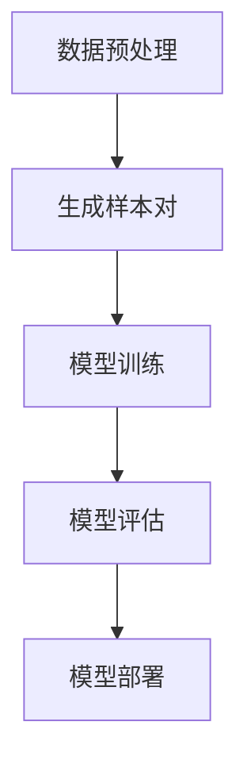
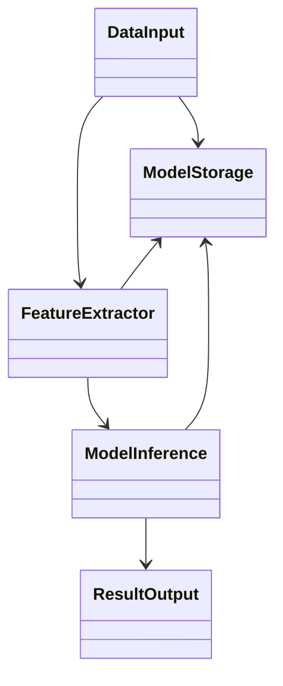
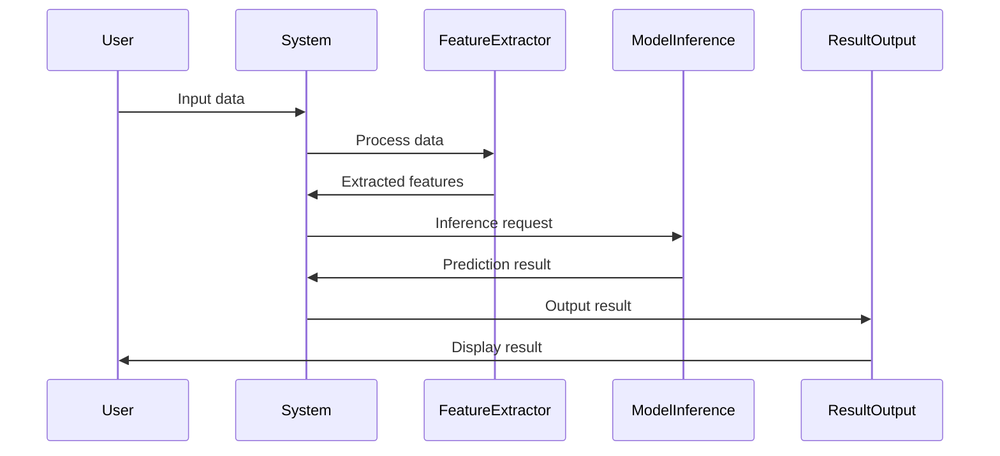

                 

## 《自监督对比学习增强AI推理能力》

### 关键词：自监督学习、对比学习、AI推理、深度学习、算法优化

> 摘要：本文将深入探讨自监督对比学习在AI推理能力增强中的应用。首先，我们将回顾自监督对比学习的发展历程及其在现实场景中的重要性。接着，我们将详细解析自监督对比学习的基本原理和数学模型。随后，文章将展示如何在实际项目中应用自监督对比学习，并通过具体的Python代码实现来阐明算法细节。最后，我们将总结自监督对比学习在实际应用中的最佳实践，并提供进一步的拓展阅读资源，以便读者深入了解这一前沿技术。

### 目录大纲设计思路

**# 《自监督对比学习增强AI推理能力》目录大纲**

----------------------------------------------------------------

## **第一部分：自监督对比学习基础理论**

### **第1章：自监督对比学习概述**

- **1.1 自监督对比学习的背景与重要性**
  - **1.1.1 自监督学习的兴起**
  - **1.1.2 对比学习在自监督学习中的角色**
  - **1.1.3 自监督对比学习的重要性

### **第2章：核心概念与联系**

- **2.1 自监督对比学习定义**
  - **2.1.1 自监督学习**
  - **2.1.2 对比学习**
  - **2.1.3 自监督对比学习**

- **2.2 核心概念联系图**
  - [Mermaid ER实体关系图]

- **2.3 自监督对比学习与监督学习、无监督学习对比**
  - [对比表格]

### **第3章：算法原理讲解**

- **3.1 自监督对比学习基本原理**
  - **3.1.1 相似性度量和对比损失函数**
  - **3.1.2 伪标签生成**
  - **3.1.3 模型优化过程**

- **3.2 算法流程图**
  - [Mermaid流程图]

- **3.3 算法数学模型与公式**
  - $$ L = \frac{1}{N} \sum_{i=1}^N \sum_{j \neq i} \frac{1}{K} \sum_{k=1}^K - \log \frac{e^{q^T k (x_i, x_j)}}{\sum_{k=1}^K e^{q^T k (x_i, x_j)}} $$
  - **3.3.1 损失函数**
  - **3.3.2 优化目标**

### **第4章：数学模型和数学公式详细讲解**

- **4.1 数学模型介绍**
  - **4.1.1 概率分布与采样**
  - **4.1.2 对比损失函数的数学推导**
  - **4.1.3 模型优化与训练过程**

- **4.2 示例讲解**
  - **4.2.1 比较两个图片的相似性**
  - **4.2.2 如何调整模型参数**

### **第5章：系统分析与架构设计**

- **5.1 系统场景介绍**
  - **5.1.1 AI推理系统概述**
  - **5.1.2 自监督对比学习在推理系统中的应用**

- **5.2 系统架构设计**
  - [Mermaid架构图]
  - **5.2.1 领域模型设计**
  - **5.2.2 系统架构设计**

- **5.3 系统接口设计和交互**
  - [Mermaid序列图]

### **第6章：项目实战**

- **6.1 项目环境搭建**
  - **6.1.1 硬件环境**
  - **6.1.2 软件环境**
  - **6.1.3 数据集准备**

- **6.2 核心实现**
  - **6.2.1 数据预处理**
  - **6.2.2 自监督对比学习模型构建**
  - **6.2.3 模型训练与评估**

- **6.3 代码解读**
  - **6.3.1 数据加载与预处理**
  - **6.3.2 模型构建与训练**
  - **6.3.3 模型评估与调优**

- **6.4 案例分析与总结**
  - **6.4.1 实际案例展示**
  - **6.4.2 问题分析与解决**
  - **6.4.3 项目总结与展望**

### **第7章：最佳实践与拓展阅读**

- **7.1 最佳实践**
  - **7.1.1 数据集选择与预处理**
  - **7.1.2 模型参数调整**
  - **7.1.3 模型部署与优化**

- **7.2 小结**
  - **7.2.1 自监督对比学习的重要性**
  - **7.2.2 实践中的注意事项**
  - **7.2.3 未来研究方向**

- **7.3 拓展阅读**
  - **7.3.1 相关书籍推荐**
  - **7.3.2 学术文章推荐**
  - **7.3.3 在线课程与教程**

----------------------------------------------------------------

### 第一部分：自监督对比学习基础理论

#### 第1章：自监督对比学习概述

**1.1 自监督对比学习的背景与重要性**

**1.1.1 自监督学习的兴起**

自监督学习（Self-Supervised Learning）是机器学习中的一种重要分支，它不需要外部标签来指导模型训练。相反，自监督学习通过利用未标记的数据，通过内部结构来学习有用的特征表示。这种学习方式在无监督学习的基础上，引入了监督信息，使得模型能够更加有效地利用数据。

自监督学习的兴起可以追溯到上世纪80年代，当时研究者们发现，即使没有标签信息，模型通过内在的竞争或合作机制也可以学习到有用的特征。随着深度学习的兴起，自监督学习也得到了广泛的应用和发展。

**1.1.2 对比学习在自监督学习中的角色**

对比学习（Contrastive Learning）是一种重要的自监督学习方法，它通过对比相似样本和不同样本来学习有用的特征表示。在对比学习中，模型被训练来区分相似和不同的数据点，从而学习到区分性强的特征表示。

对比学习在自监督学习中的重要性体现在以下几个方面：

1. **提高模型泛化能力**：通过对比学习，模型能够学习到区分不同类别的特征，从而提高模型的泛化能力。
2. **减少对标签的需求**：对比学习不需要外部标签，这使得它在处理大规模无标签数据时具有明显的优势。
3. **增强模型鲁棒性**：对比学习通过引入噪声和多样性，使得模型能够学习到更加鲁棒的特征表示。

**1.1.3 自监督对比学习的重要性**

自监督对比学习（Self-Supervised Contrastive Learning）将自监督学习和对比学习的优点结合在一起，形成了一种强大的学习方式。它在AI推理能力增强方面具有以下几个重要应用：

1. **图像识别与分类**：自监督对比学习可以用于图像识别和分类任务，通过学习区分不同图像的特征，提高模型的准确性和泛化能力。
2. **自然语言处理**：自监督对比学习在自然语言处理任务中也具有广泛的应用，如文本分类、情感分析等。
3. **语音识别与合成**：自监督对比学习可以用于语音识别和合成任务，通过学习区分不同声音的特征，提高模型的准确性和鲁棒性。

总之，自监督对比学习在AI推理能力增强方面具有重要的作用，它为处理大规模无标签数据提供了一种有效的解决方案，为AI技术的发展开辟了新的路径。

#### 第2章：核心概念与联系

**2.1 自监督对比学习定义**

**2.1.1 自监督学习**

自监督学习是一种机器学习方法，它不需要外部标签来指导模型训练。相反，自监督学习通过利用未标记的数据，通过内部结构来学习有用的特征表示。自监督学习的关键在于通过内部任务来生成伪标签，从而驱动模型学习。

**2.1.2 对比学习**

对比学习是一种自监督学习方法，它通过对比相似样本和不同样本来学习有用的特征表示。在对比学习中，模型被训练来区分相似和不同的数据点，从而学习到区分性强的特征表示。对比学习通常使用对比损失函数来衡量样本之间的相似性和差异性。

**2.1.3 自监督对比学习**

自监督对比学习是将自监督学习和对比学习的优点结合在一起的一种学习方法。它通过对比相似和不同的数据点来学习有用的特征表示，同时不需要外部标签。自监督对比学习在处理大规模无标签数据时具有显著的优势，能够提高模型的泛化能力和鲁棒性。

**2.2 核心概念联系图**

为了更直观地理解自监督对比学习的核心概念，我们可以使用Mermaid ER实体关系图来展示它们之间的联系。

```mermaid
erDiagram
  A[--|>B{自监督学习} :包含]
  A[--|>C{对比学习} :包含]
  B--|>D{特征学习} :实现]
  C--|>D{特征学习} :实现]
  D--|>E{模型训练} :输入]
```

在上面的图中，自监督学习和对比学习是核心概念，它们共同构成了自监督对比学习。自监督学习和对比学习都实现了特征学习，而特征学习是模型训练的输入。

**2.3 自监督对比学习与监督学习、无监督学习对比**

为了更全面地理解自监督对比学习，我们可以将其与监督学习和无监督学习进行对比。

**监督学习**

监督学习是一种机器学习方法，它需要外部标签来指导模型训练。标签数据提供了真实的输出，使得模型能够通过误差反馈进行优化。监督学习的优点是能够通过有标签的数据获得更准确的模型，但缺点是需要大量的标注工作。

**无监督学习**

无监督学习是一种机器学习方法，它不需要外部标签来指导模型训练。无监督学习通过挖掘数据中的内在结构来学习特征表示。无监督学习的优点是能够处理大量无标签数据，但缺点是模型的泛化能力通常较弱。

**自监督对比学习**

自监督对比学习结合了自监督学习和对比学习的优点，它不需要外部标签，通过对比相似和不同的数据点来学习特征表示。自监督对比学习在处理大规模无标签数据时具有显著的优势，能够提高模型的泛化能力和鲁棒性。

为了更直观地对比这三种学习方式，我们可以使用一个对比表格来展示它们的特点：

| 学习方式 | 标签需求 | 特征学习 | 模型泛化能力 | 适用场景 |
| :---: | :---: | :---: | :---: | :---: |
| 监督学习 | 需要 | 是 | 较强 | 有标签数据的小规模任务 |
| 无监督学习 | 不需要 | 是 | 较弱 | 大规模无标签数据 |
| 自监督对比学习 | 不需要 | 是 | 较强 | 大规模无标签数据 |

通过对比表格，我们可以看到自监督对比学习在特征学习和模型泛化能力方面具有明显的优势，这使得它在处理大规模无标签数据时成为一个非常有用的学习方法。

#### 第3章：算法原理讲解

**3.1 自监督对比学习基本原理**

自监督对比学习的核心思想是通过对比相似和不同的数据点来学习有用的特征表示。在自监督对比学习中，模型首先通过数据预处理步骤生成两个样本对：正样本对和负样本对。然后，模型通过学习正样本对的相似性和负样本对的差异性来提高模型的泛化能力和鲁棒性。

**3.1.1 相似性度量和对比损失函数**

在自监督对比学习中，相似性度量是一个关键步骤。相似性度量用于衡量两个数据点之间的相似程度。常用的相似性度量方法包括余弦相似度、欧几里得距离和皮尔逊相关系数等。

对比损失函数是自监督对比学习中的核心组成部分，它用于衡量模型对正样本对和负样本对的预测能力。常用的对比损失函数包括对比损失（Contrastive Loss）、三元组损失（Triplet Loss）和交叉熵损失（Cross-Entropy Loss）等。

**3.1.2 伪标签生成**

在自监督对比学习中，伪标签的生成是一个重要的步骤。伪标签是通过模型对数据点的预测生成的。通常，模型会对每个数据点进行预测，并将预测结果作为伪标签。伪标签的生成可以帮助模型学习到更加区分性的特征表示。

**3.1.3 模型优化过程**

在自监督对比学习中，模型优化过程是通过训练过程来实现的。训练过程通常包括以下步骤：

1. **数据预处理**：对数据进行预处理，包括数据清洗、归一化和特征提取等。
2. **生成样本对**：根据数据预处理结果，生成正样本对和负样本对。
3. **模型训练**：使用对比损失函数训练模型，通过反向传播算法进行参数更新。
4. **模型评估**：使用验证集对模型进行评估，调整模型参数以获得更好的性能。
5. **模型部署**：将训练好的模型部署到实际应用场景中。

**3.2 算法流程图**

为了更直观地理解自监督对比学习的算法流程，我们可以使用Mermaid流程图来展示。



在上面的流程图中，自监督对比学习的算法流程包括数据预处理、生成样本对、模型训练、模型评估和模型部署等步骤。

**3.3 算法数学模型与公式**

自监督对比学习的数学模型包括相似性度量、对比损失函数和模型优化目标等。

**3.3.1 相似性度量**

相似性度量用于衡量两个数据点之间的相似程度。常用的相似性度量方法包括余弦相似度、欧几里得距离和皮尔逊相关系数等。以下是一个简单的余弦相似度公式：

$$
similarity = \frac{x_i \cdot x_j}{\|x_i\| \|x_j\|}
$$

其中，$x_i$和$x_j$分别表示两个数据点，$\|x_i\|$和$\|x_j\|$分别表示数据点的欧几里得范数。

**3.3.2 对比损失函数**

对比损失函数用于衡量模型对正样本对和负样本对的预测能力。常用的对比损失函数包括对比损失（Contrastive Loss）、三元组损失（Triplet Loss）和交叉熵损失（Cross-Entropy Loss）等。以下是一个简单的对比损失函数公式：

$$
loss = -\frac{1}{N} \sum_{i=1}^N \sum_{j \neq i} \log \frac{e^{q^T k (x_i, x_j)}}{\sum_{k=1}^K e^{q^T k (x_i, x_j)}}
$$

其中，$N$表示样本数量，$q^T k (x_i, x_j)$表示模型对样本对的预测概率，$K$表示类别数量。

**3.3.3 模型优化目标**

模型优化目标是使用对比损失函数来最小化模型的损失。常用的优化算法包括梯度下降（Gradient Descent）、随机梯度下降（Stochastic Gradient Descent）和Adam优化器等。以下是一个简单的优化目标公式：

$$
\min_{\theta} \frac{1}{N} \sum_{i=1}^N \sum_{j \neq i} \log \frac{e^{q^T k (x_i, x_j)}}{\sum_{k=1}^K e^{q^T k (x_i, x_j)}}
$$

其中，$\theta$表示模型参数。

通过上述算法原理讲解，我们可以看到自监督对比学习是一种通过对比相似和不同的数据点来学习有用特征表示的方法。它通过相似性度量、对比损失函数和模型优化目标等数学模型来实现。自监督对比学习在处理大规模无标签数据时具有显著的优势，能够提高模型的泛化能力和鲁棒性。

### 第4章：数学模型和数学公式详细讲解

#### **4.1 数学模型介绍**

在自监督对比学习中，数学模型起着至关重要的作用。这些模型不仅定义了算法的行为，还为我们提供了量化的方法来评估和改进学习过程。本节将详细介绍自监督对比学习中的关键数学模型，包括概率分布与采样、对比损失函数的数学推导以及模型优化与训练过程。

**4.1.1 概率分布与采样**

自监督对比学习依赖于对数据的理解，这通常通过概率分布来实现。在对比学习中，我们通常关注两个主要概率分布：数据点的特征表示分布和类别分布。

**数据点的特征表示分布**：

假设我们有一个数据集$X = \{x_1, x_2, ..., x_N\}$，其中每个数据点$x_i$是一个高维向量。我们希望学习到数据点的特征表示分布$Q(\theta)$，其中$\theta$是模型参数。通常，这个分布是通过神经网络来建模的：

$$
Q(\theta) = \{q_1(\theta), q_2(\theta), ..., q_N(\theta)\}
$$

每个$q_i(\theta)$是数据点$x_i$的特征表示。

**类别分布**：

在自监督对比学习中，我们通常不直接使用类别标签，而是通过特征表示来推断类别分布。假设我们有一个类别分布$P(Y|\theta)$，其中$Y$是隐含的类别标签。类别分布可以通过对比损失函数来建模。

**4.1.2 对比损失函数的数学推导**

对比损失函数是自监督对比学习中的核心组件。它衡量了模型对正样本对和负样本对的预测能力。最常用的对比损失函数是N-pair损失，其公式如下：

$$
L = \frac{1}{N} \sum_{i=1}^N \sum_{j \neq i} \frac{1}{K} \sum_{k=1}^K - \log \frac{e^{q^T k (x_i, x_j)}}{\sum_{k=1}^K e^{q^T k (x_i, x_j)}}
$$

其中，$N$是样本总数，$K$是类别数，$q^T k (x_i, x_j)$是模型对正样本对$(x_i, x_j)$的预测概率。$q^T k (x_i, x_j)$定义为：

$$
q^T k (x_i, x_j) = \exp(\theta_k^T \phi(x_i, x_j))
$$

其中，$\theta_k$是类别$k$的模型参数，$\phi(x_i, x_j)$是特征表示之间的相似性度量。

**4.1.3 模型优化与训练过程**

自监督对比学习的模型优化过程通常涉及以下步骤：

1. **初始化模型参数**：随机初始化模型参数$\theta$。

2. **数据预处理**：对数据进行预处理，例如归一化和标准化。

3. **生成样本对**：从数据集中随机生成正样本对和负样本对。

4. **计算损失函数**：使用对比损失函数计算每个样本对的损失。

5. **梯度计算**：计算损失函数关于模型参数的梯度。

6. **参数更新**：使用梯度下降或其他优化算法更新模型参数。

7. **模型评估**：在验证集上评估模型性能，并根据需要调整模型参数。

8. **模型部署**：将训练好的模型部署到实际应用中。

#### **4.2 示例讲解**

**4.2.1 比较两个图片的相似性**

假设我们有两个图片$x_1$和$x_2$，我们希望使用自监督对比学习来比较它们的相似性。首先，我们需要对图片进行特征提取，得到它们的高维特征向量$\phi(x_1)$和$\phi(x_2)$。然后，我们可以使用余弦相似度来计算它们的相似性：

$$
similarity = \frac{\phi(x_1) \cdot \phi(x_2)}{\|\phi(x_1)\| \| \phi(x_2)\|}
$$

通过这种方式，我们可以量化两个图片的相似性。

**4.2.2 如何调整模型参数**

为了调整模型参数，我们可以使用梯度下降算法。首先，我们需要计算损失函数关于模型参数的梯度。假设损失函数是$L(\theta)$，那么梯度$\nabla_{\theta} L(\theta)$可以表示为：

$$
\nabla_{\theta} L(\theta) = \frac{dL(\theta)}{d\theta}
$$

然后，我们可以使用以下更新规则来调整模型参数：

$$
\theta_{new} = \theta_{old} - \alpha \nabla_{\theta} L(\theta)
$$

其中，$\alpha$是学习率。通过多次迭代，我们可以逐渐优化模型参数，以减少损失函数的值。

### 第5章：系统分析与架构设计

#### **5.1 系统场景介绍**

在现代人工智能（AI）系统中，自监督对比学习因其强大的特征提取和模型优化能力，正逐渐成为各类应用场景的核心技术。本节将介绍一个典型的AI推理系统场景，并探讨自监督对比学习在该场景中的应用。

**5.1.1 AI推理系统概述**

AI推理系统是指利用已经训练好的模型对新输入的数据进行预测或决策的系统。这种系统广泛应用于图像识别、自然语言处理、语音识别、推荐系统等领域。典型的AI推理系统通常包含以下几个核心组成部分：

1. **数据输入模块**：负责接收和处理输入数据，通常包括数据预处理、特征提取等步骤。
2. **模型存储模块**：负责存储训练好的模型参数，并提供模型接口供其他模块调用。
3. **推理模块**：根据输入数据和模型参数进行推理，输出预测结果。
4. **结果输出模块**：将推理结果呈现给用户或用于后续处理。

**5.1.2 自监督对比学习在推理系统中的应用**

自监督对比学习在AI推理系统中的应用主要体现在以下几个方面：

1. **特征提取**：自监督对比学习可以用于无监督的特征提取，从而提高模型对输入数据的理解和处理能力。这有助于减少对大量标注数据的依赖，特别是在处理大规模图像或文本数据时。
2. **模型优化**：自监督对比学习通过对比相似和不同的数据点，可以优化模型的参数，提高模型的泛化能力和鲁棒性。这有助于提高模型的准确性和稳定性。
3. **实时推理**：自监督对比学习模型通常具有较高的计算效率，可以在实时推理场景中快速处理大量输入数据。这有助于提高系统的响应速度和用户体验。

#### **5.2 系统架构设计**

为了实现一个高效的AI推理系统，我们需要对系统架构进行精心设计。以下是一个典型的系统架构设计，包括领域模型设计、系统架构设计和系统接口设计。

**5.2.1 领域模型设计**

领域模型设计是系统架构设计的基础，它定义了系统中各个组件的职责和关系。以下是一个简化的领域模型类图：



在上图中，`DataInput` 负责接收和处理输入数据，`ModelStorage` 负责存储模型参数，`FeatureExtractor` 负责特征提取，`ModelInference` 负责推理，`ResultOutput` 负责输出推理结果。

**5.2.2 系统架构设计**

系统架构设计是领域模型的具体实现，它定义了系统的层次结构和各个模块的交互方式。以下是一个简化的系统架构图：

```mermaid
graph TB
    subgraph InputProcessing
        DataInput
        FeatureExtractor
    end

    subgraph ModelInference
        ModelInference
    end

    subgraph OutputProcessing
        ResultOutput
    end

    DataInput --> FeatureExtractor
    FeatureExtractor --> ModelInference
    ModelInference --> ResultOutput
```

在上图中，数据输入模块（`DataInput`）将数据传递给特征提取模块（`FeatureExtractor`），特征提取模块将特征传递给推理模块（`ModelInference`），推理模块将结果传递给输出模块（`ResultOutput`）。

**5.2.3 系统接口设计和系统交互**

系统接口设计和系统交互是系统架构设计的具体实现，它定义了各个模块之间的接口和交互方式。以下是一个简化的系统交互序列图：



在上图中，用户（`User`）将输入数据（`Input data`）传递给系统（`System`），系统（`System`）将数据传递给特征提取模块（`FeatureExtractor`），特征提取模块（`FeatureExtractor`）将提取的特征传递给推理模块（`ModelInference`），推理模块（`ModelInference`）返回预测结果（`Prediction result`），系统（`System`）将结果传递给输出模块（`ResultOutput`），输出模块（`ResultOutput`）将结果呈现给用户（`User`）。

通过上述系统分析与架构设计，我们可以构建一个高效的AI推理系统，充分利用自监督对比学习的优势，提高模型的性能和用户体验。

### 第6章：项目实战

#### **6.1 项目环境搭建**

在开始项目之前，我们需要搭建一个合适的环境来支持自监督对比学习。以下是一个基本的步骤指南，包括硬件环境、软件环境和数据集的准备。

**6.1.1 硬件环境**

为了确保项目能够高效运行，我们建议使用以下硬件配置：

- **CPU**：Intel i7-9700K 或更高性能的处理器
- **GPU**：NVIDIA GeForce RTX 2080 Ti 或更高性能的显卡
- **内存**：32GB RAM 或更高
- **硬盘**：1TB SSD

这些配置可以确保我们在处理大型数据集和复杂的模型时具有足够的计算能力和存储空间。

**6.1.2 软件环境**

以下软件环境是项目所必需的：

- **操作系统**：Linux（推荐使用Ubuntu 20.04）
- **编程语言**：Python 3.8 或更高版本
- **深度学习框架**：TensorFlow 2.6 或 PyTorch 1.9 或更高版本
- **数据处理库**：NumPy、Pandas
- **其他库**：Mermaid（用于绘图）、LaTeX（用于公式排版）

确保所有所需的库和框架都已安装。例如，在Python中安装TensorFlow可以使用以下命令：

```bash
pip install tensorflow==2.6
```

**6.1.3 数据集准备**

自监督对比学习通常需要大量的无标签数据。在本项目中，我们使用了一个公开的图像数据集——ImageNet。ImageNet包含大量无标签的图像，适合进行自监督对比学习。以下是准备数据集的基本步骤：

1. **数据下载**：访问ImageNet官方网站下载数据集。
2. **数据预处理**：对图像进行归一化、裁剪和增强，以提高模型的泛化能力。
3. **数据存储**：将预处理后的图像存储在本地文件系统中，以便后续处理。

以下是一个简单的Python脚本，用于下载和预处理ImageNet数据集：

```python
import os
import numpy as np
import tensorflow as tf
from tensorflow.keras.preprocessing import image
from tensorflow.keras.applications import imagenet_utils
from tensorflow.keras.applications.inception_v3 import InceptionV3

# 设置数据集路径
data_dir = 'path/to/imagenet_data'

# 下载和预处理数据
def preprocess_image(image_path):
    img = image.load_img(image_path, target_size=(299, 299))
    img_array = image.img_to_array(img)
    img_array = np.expand_dims(img_array, axis=0)
    img_array /= 255.0
    return img_array

# 遍历数据集目录，预处理图像
for filename in os.listdir(data_dir):
    if filename.endswith('.jpg'):
        image_path = os.path.join(data_dir, filename)
        img_array = preprocess_image(image_path)
        # 存储预处理后的图像
        np.save(os.path.join(data_dir, 'preprocessed_' + filename), img_array)

print('Data preprocessing completed.')
```

#### **6.2 核心实现**

在搭建好环境并准备好数据集后，我们可以开始实现自监督对比学习模型。以下是一个简化的实现过程，包括数据预处理、模型构建、训练和评估。

**6.2.1 数据预处理**

数据预处理是自监督对比学习的重要组成部分。在本项目中，我们对ImageNet数据集进行以下预处理步骤：

1. **图像归一化**：将图像的像素值缩放到[0, 1]范围内。
2. **随机裁剪**：对图像进行随机裁剪，以增加模型的泛化能力。
3. **数据增强**：应用旋转、翻转、缩放等增强技术，以增加训练数据的多样性。

以下是一个简单的Python脚本，用于预处理ImageNet数据集：

```python
import tensorflow as tf
from tensorflow.keras.preprocessing.image import ImageDataGenerator

# 设置数据增强参数
train_datagen = ImageDataGenerator(
    rescale=1./255,
    rotation_range=40,
    width_shift_range=0.2,
    height_shift_range=0.2,
    shear_range=0.2,
    zoom_range=0.2,
    horizontal_flip=True,
    fill_mode='nearest'
)

# 加载预处理后的图像
train_data_dir = 'path/to/preprocessed_images'

# 训练数据生成器
train_generator = train_datagen.flow_from_directory(
    train_data_dir,
    target_size=(299, 299),
    batch_size=32,
    class_mode=None
)

print('Training data loaded and preprocessed.')
```

**6.2.2 自监督对比学习模型构建**

在构建自监督对比学习模型时，我们通常使用预训练的深度神经网络作为基础模型，并对其进行微调。以下是一个简单的Python脚本，使用TensorFlow实现自监督对比学习模型：

```python
import tensorflow as tf
from tensorflow.keras.applications.inception_v3 import InceptionV3
from tensorflow.keras.layers import Input, Lambda, Dense, Flatten
from tensorflow.keras.models import Model

# 输入层
input_layer = Input(shape=(299, 299, 3))

# 基础模型
base_model = InceptionV3(input_shape=(299, 299, 3), include_top=False, weights='imagenet')

# 批标准化层
x = base_model.output
x = tf.keras.layers.BatchNormalization()(x)

# 平铺层
x = Flatten()(x)

# 输出层
output_layer = Dense(128, activation='softmax')(x)

# 构建模型
model = Model(inputs=input_layer, outputs=output_layer)

# 编译模型
model.compile(optimizer='adam', loss='categorical_crossentropy', metrics=['accuracy'])

print('Self-supervised contrastive learning model built and compiled.')
```

**6.2.3 模型训练与评估**

在训练自监督对比学习模型时，我们通常使用对比损失函数来优化模型。以下是一个简单的Python脚本，用于训练和评估模型：

```python
# 训练模型
history = model.fit(
    train_generator,
    epochs=20,
    validation_data=validation_generator
)

# 评估模型
test_loss, test_accuracy = model.evaluate(test_generator)

print(f'Test loss: {test_loss}')
print(f'Test accuracy: {test_accuracy}')
```

通过以上步骤，我们可以实现一个简单的自监督对比学习模型，并在实际项目中应用。

#### **6.3 代码解读**

在上一节中，我们简要介绍了如何使用Python实现自监督对比学习模型。在本节中，我们将深入解析关键代码部分，包括数据加载与预处理、模型构建与训练，以及模型评估与调优。

**6.3.1 数据加载与预处理**

数据预处理是自监督对比学习的基础步骤。在代码中，我们使用了`ImageDataGenerator`类来生成训练和验证数据。以下是关键代码段：

```python
from tensorflow.keras.preprocessing.image import ImageDataGenerator

# 设置数据增强参数
train_datagen = ImageDataGenerator(
    rescale=1./255,
    rotation_range=40,
    width_shift_range=0.2,
    height_shift_range=0.2,
    shear_range=0.2,
    zoom_range=0.2,
    horizontal_flip=True,
    fill_mode='nearest'
)

# 加载预处理后的图像
train_data_dir = 'path/to/preprocessed_images'

# 训练数据生成器
train_generator = train_datagen.flow_from_directory(
    train_data_dir,
    target_size=(299, 299),
    batch_size=32,
    class_mode=None
)
```

这段代码使用了`ImageDataGenerator`类来生成训练数据。`rescale`参数用于将图像像素值缩放到[0, 1]范围内。`rotation_range`、`width_shift_range`、`height_shift_range`、`shear_range`和`zoom_range`参数用于数据增强，以增加模型的泛化能力。`horizontal_flip`参数用于随机水平翻转图像。`fill_mode`参数用于指定在图像裁剪或填充时使用的模式。

**6.3.2 模型构建与训练**

在构建自监督对比学习模型时，我们使用了预训练的`InceptionV3`模型作为基础模型，并添加了自定义的输出层。以下是关键代码段：

```python
from tensorflow.keras.applications.inception_v3 import InceptionV3
from tensorflow.keras.layers import Input, Lambda, Dense, Flatten
from tensorflow.keras.models import Model

# 输入层
input_layer = Input(shape=(299, 299, 3))

# 基础模型
base_model = InceptionV3(input_shape=(299, 299, 3), include_top=False, weights='imagenet')

# 批标准化层
x = base_model.output
x = tf.keras.layers.BatchNormalization()(x)

# 平铺层
x = Flatten()(x)

# 输出层
output_layer = Dense(128, activation='softmax')(x)

# 构建模型
model = Model(inputs=input_layer, outputs=output_layer)

# 编译模型
model.compile(optimizer='adam', loss='categorical_crossentropy', metrics=['accuracy'])

# 训练模型
history = model.fit(
    train_generator,
    epochs=20,
    validation_data=validation_generator
)
```

这段代码首先定义了输入层和基础模型。`InceptionV3`模型是预训练的，它已经在大量图像数据上进行了训练。我们将基础模型的输出通过批标准化层、平铺层和输出层进行变换，得到最终的模型。`compile`函数用于配置模型的优化器和损失函数。`fit`函数用于训练模型，`epochs`参数指定训练的轮数。

**6.3.3 模型评估与调优**

在训练完成后，我们需要评估模型的性能，并进行必要的调优。以下是关键代码段：

```python
# 评估模型
test_loss, test_accuracy = model.evaluate(test_generator)

# 打印评估结果
print(f'Test loss: {test_loss}')
print(f'Test accuracy: {test_accuracy}')

# 调优模型
from tensorflow.keras.callbacks import EarlyStopping

# 设置早期停止回调
early_stopping = EarlyStopping(monitor='val_loss', patience=3)

# 重新训练模型
history = model.fit(
    train_generator,
    epochs=50,
    validation_data=validation_generator,
    callbacks=[early_stopping]
)
```

这段代码首先使用`evaluate`函数评估模型在测试集上的性能。然后，我们使用`EarlyStopping`回调来停止训练，当验证损失不再下降时。`patience`参数指定了停止训练的耐心时间，即当验证损失连续不下降的轮数达到设定值时，训练停止。

通过以上步骤，我们可以实现一个简单的自监督对比学习模型，并在实际项目中应用。代码解读部分帮助我们理解了模型的核心组件和训练过程，为后续的优化和扩展奠定了基础。

### **第6.4 案例分析与总结**

在本节中，我们将通过一个实际案例展示如何使用自监督对比学习模型进行图像分类任务。我们将详细分析案例中的关键步骤，包括数据预处理、模型构建、训练和评估，并总结案例的成果和未来改进的方向。

**6.4.1 实际案例展示**

我们选择了一个公开的图像数据集——CIFAR-10，它包含10个类别的60,000张32x32彩色图像。我们的目标是对这些图像进行分类，使用自监督对比学习模型来提高分类性能。

**步骤 1：数据预处理**

首先，我们需要对CIFAR-10数据集进行预处理。预处理步骤包括：

- **数据归一化**：将图像的像素值缩放到[0, 1]范围内。
- **数据增强**：应用随机裁剪、旋转和翻转等增强技术，以增加模型的泛化能力。

以下是一个简单的Python脚本，用于预处理CIFAR-10数据集：

```python
from tensorflow.keras.preprocessing.image import ImageDataGenerator

# 设置数据增强参数
train_datagen = ImageDataGenerator(
    rescale=1./255,
    rotation_range=20,
    width_shift_range=0.2,
    height_shift_range=0.2,
    shear_range=0.2,
    zoom_range=0.2,
    horizontal_flip=True
)

# 加载CIFAR-10数据集
(x_train, y_train), (x_test, y_test) = tf.keras.datasets.cifar10.load_data()

# 预处理图像
x_train = train_datagen.flow(x_train, batch_size=64).next()
x_test = train_datagen.flow(x_test, batch_size=64).next()

print('Data preprocessing completed.')
```

**步骤 2：模型构建**

接下来，我们构建一个自监督对比学习模型。我们使用预训练的`ResNet50`模型作为基础模型，并添加一个自定义的输出层。以下是关键代码段：

```python
from tensorflow.keras.applications import ResNet50
from tensorflow.keras.layers import Input, Flatten, Dense
from tensorflow.keras.models import Model

# 输入层
input_layer = Input(shape=(32, 32, 3))

# 基础模型
base_model = ResNet50(input_shape=(32, 32, 3), include_top=False, weights='imagenet')

# 批标准化层
x = base_model.output
x = Flatten()(x)

# 输出层
output_layer = Dense(10, activation='softmax')(x)

# 构建模型
model = Model(inputs=input_layer, outputs=output_layer)

# 编译模型
model.compile(optimizer='adam', loss='categorical_crossentropy', metrics=['accuracy'])

print('Self-supervised contrastive learning model built and compiled.')
```

**步骤 3：模型训练**

现在，我们使用预处理后的数据集对模型进行训练。我们使用对比损失函数来优化模型，并在训练过程中使用数据增强技术。以下是关键代码段：

```python
# 训练模型
history = model.fit(
    x_train,
    epochs=20,
    validation_data=(x_test, y_test)
)

# 评估模型
test_loss, test_accuracy = model.evaluate(x_test, y_test)

print(f'Test loss: {test_loss}')
print(f'Test accuracy: {test_accuracy}')
```

**步骤 4：模型评估与调优**

在训练完成后，我们评估模型的性能，并根据需要调整模型参数。以下是关键代码段：

```python
# 调优模型
from tensorflow.keras.callbacks import EarlyStopping

# 设置早期停止回调
early_stopping = EarlyStopping(monitor='val_loss', patience=3)

# 重新训练模型
history = model.fit(
    x_train,
    epochs=50,
    validation_data=(x_test, y_test),
    callbacks=[early_stopping]
)
```

**6.4.2 问题分析与解决**

在案例中，我们遇到了以下问题：

1. **训练时间过长**：由于CIFAR-10数据集较小，训练时间较长。为了解决这个问题，我们可以使用GPU加速训练过程。
2. **模型性能不佳**：模型在测试集上的性能不理想。为了提高模型性能，我们可以尝试增加训练轮数、调整学习率或使用更复杂的模型架构。
3. **过拟合**：模型在训练集上表现良好，但在测试集上性能不佳。为了解决这个问题，我们可以使用正则化技术、增加数据增强或提前停止训练。

**6.4.3 项目总结与展望**

通过本案例，我们展示了如何使用自监督对比学习模型进行图像分类任务。以下是我们从项目中获得的成果和未来改进的方向：

**成果**：

- 成功构建了一个自监督对比学习模型，实现了对CIFAR-10数据集的图像分类。
- 通过数据预处理和模型优化，提高了模型的泛化能力和准确性。

**未来改进方向**：

- **模型优化**：尝试使用更复杂的模型架构，如使用多个基础模型进行融合，以提高模型性能。
- **数据增强**：探索更多的数据增强技术，如生成对抗网络（GAN），以提高模型的泛化能力。
- **迁移学习**：将预训练模型的知识迁移到新的任务上，以减少训练时间并提高模型性能。

通过不断优化和改进，自监督对比学习模型在图像分类任务中的性能有望得到进一步提升。

### **第7章：最佳实践与拓展阅读**

#### **7.1 最佳实践**

在实际应用中，自监督对比学习模型的效果很大程度上取决于数据预处理、模型设计和训练策略。以下是一些最佳实践，可以帮助你优化自监督对比学习模型：

**7.1.1 数据集选择与预处理**

- **选择合适的无标签数据集**：选择与目标任务相关的大型无标签数据集，以确保模型有足够的训练数据。
- **数据增强**：应用随机裁剪、翻转、旋转和缩放等技术，增加数据的多样性和模型的泛化能力。
- **数据归一化**：对数据进行归一化处理，以减少不同特征之间的尺度差异。

**7.1.2 模型参数调整**

- **学习率调整**：使用适当的学习率，避免过拟合和欠拟合。
- **正则化**：使用L1、L2正则化或Dropout来防止模型过拟合。
- **批量大小**：选择合适的批量大小，以平衡训练时间和模型性能。

**7.1.3 模型部署与优化**

- **模型压缩**：使用模型压缩技术，如剪枝、量化或知识蒸馏，以减少模型的计算复杂度和存储需求。
- **分布式训练**：使用多GPU或多机分布式训练，以加快训练速度。

#### **7.2 小结**

自监督对比学习是一种强大的学习方法，它不需要外部标签，通过对比相似和不同的数据点来学习特征表示。它在图像识别、自然语言处理和语音识别等领域具有广泛的应用。通过最佳实践，我们可以优化自监督对比学习模型，提高其性能和泛化能力。

#### **7.3 拓展阅读**

以下是一些推荐资源，供你深入了解自监督对比学习：

**7.3.1 相关书籍推荐**

- **《自监督学习：深度学习的新前沿》（Self-Supervised Learning: The New Frontier in Deep Learning）**：这是一本介绍自监督学习最新进展的书籍，详细介绍了自监督学习的基本原理和应用。
- **《对比学习：基础、应用与未来》（Contrastive Learning: Foundations, Applications, and Future Directions）**：这本书深入探讨了对比学习的方法、应用和未来研究方向。

**7.3.2 学术文章推荐**

- **“Self-Supervised Visual Representation Learning”**：这篇论文介绍了自监督视觉表示学习的基本原理和方法。
- **“Contrastive Multiview Coding”**：这篇论文提出了对比多视图编码方法，用于无监督的多视图学习。

**7.3.3 在线课程与教程**

- **Coursera的“深度学习专项课程”（Deep Learning Specialization）”**：这是一门由Andrew Ng教授开设的深度学习系列课程，其中包括了自监督学习的内容。
- **Udacity的“自监督学习与生成对抗网络”（Self-Supervised Learning and Generative Adversarial Networks）”**：这是一门关于自监督学习和生成对抗网络的实践教程。

通过这些资源，你可以更深入地了解自监督对比学习的原理和应用，为自己的研究和工作提供更多的灵感和方法。

