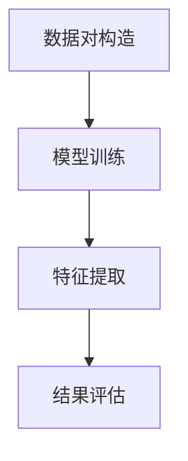
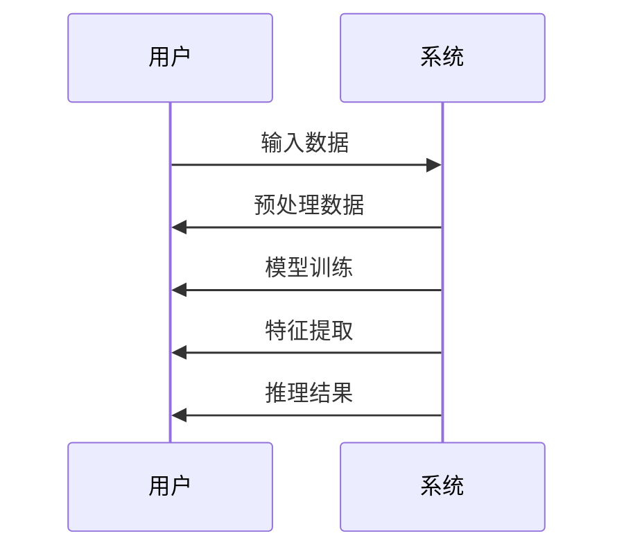

                 

### 自监督对比学习提升AI推理的特征表示质量

---

## 关键词

自监督对比学习，AI推理，特征表示质量，深度学习，算法原理，数学模型

---

## 摘要

本文深入探讨了自监督对比学习在提升AI推理特征表示质量方面的作用。首先，文章介绍了自监督对比学习的背景和核心概念，包括其与深度学习和其他对比学习方法的联系。接着，文章详细讲解了自监督对比学习的算法原理和数学模型，并通过Python代码示例进行了阐释。随后，文章探讨了自监督对比学习在AI推理中的系统分析与架构设计，并通过一个实际项目案例展示了其在实践中的应用。最后，文章提供了最佳实践和注意事项，以指导读者在实际开发中的有效应用。

---

## 目录大纲设计思路

### 明确核心概念与主题

在设计目录大纲时，我们首先明确了文章的核心概念和主题。自监督对比学习是本文的核心概念，它是一种能够在没有监督标签的情况下从数据中学习有用特征的方法。AI推理和特征表示质量是本文的核心主题，自监督对比学习在这一领域中的作用和效果是我们需要重点探讨的问题。

### 构建大纲框架

在明确核心概念和主题后，我们构建了文章的大纲框架。文章分为以下几个部分：

1. **背景介绍**：介绍自监督对比学习的背景、意义和应用领域。
2. **核心概念与联系**：探讨自监督对比学习的关键概念及其与其他技术的联系。
3. **算法原理讲解**：详细讲解自监督对比学习的算法原理和数学模型。
4. **数学模型与公式讲解**：使用latex格式展示并解释关键的数学模型和公式。
5. **系统分析与架构设计方案**：分析自监督对比学习在AI推理中的应用，并设计相应的系统架构。
6. **项目实战**：通过实际项目案例展示自监督对比学习的应用。
7. **最佳实践与总结**：总结自监督对比学习的最佳实践，并提供拓展阅读。

### 细化章节内容

在构建大纲框架后，我们细化了每个章节的内容，确保每个章节都能够独立成章，且逻辑清晰。对于重要的概念和算法，我们设计了详细的讲解和举例说明。

### 保持简洁性

在细化章节内容的同时，我们注重保持文章的简洁性，避免多余的废话，确保信息的高效传达。

### 设计示例

为了展示目录大纲的格式和结构，我们提供了一个示例章节的目录大纲。

### 控制字数

在整个目录大纲的设计过程中，我们注意控制总字数在2000字以内，以保证信息的精简和可读性。

---

## 第一部分: 自监督对比学习的背景与意义

### 1.1 自监督对比学习的核心概念

#### 1.1.1 自监督对比学习的起源与发展

自监督对比学习起源于20世纪90年代，随着深度学习技术的发展，它在21世纪初逐渐兴起。自监督对比学习利用数据的内部结构，无需外部标签，通过学习数据的对比关系来提取特征。这种方法在图像识别、自然语言处理和语音识别等领域取得了显著的成果。

#### 1.1.2 自监督对比学习的基本原理

自监督对比学习的基本原理是学习数据的相似性和差异性，通过对比增强数据的特征表示。它通常涉及两个步骤：数据对构造和对比损失函数设计。数据对构造是通过某种策略从数据集中生成相似和不同的数据对。对比损失函数则用于衡量这些数据对的对比效果，并指导模型优化。

#### 1.1.3 自监督对比学习在AI推理中的应用

自监督对比学习在AI推理中的应用非常广泛。在图像识别中，它可以用于学习图像的表示，提高模型的分类准确率。在自然语言处理中，它可以用于学习文本的表示，提高文本分类和情感分析的性能。在语音识别中，它可以用于学习语音信号的表示，提高语音识别的准确性。

### 1.2 自监督对比学习与相关技术的关系

#### 1.2.1 自监督对比学习与无监督学习的区别

自监督对比学习是无监督学习的一种，但与传统的无监督学习方法不同，它更强调数据的对比关系。无监督学习通常是通过聚类或降维等方法来探索数据的内在结构，而自监督对比学习则是通过对比增强数据的特征表示。

#### 1.2.2 自监督对比学习与监督学习的互补性

自监督对比学习和监督学习互为补充。监督学习需要大量标注数据，但在数据标注成本高昂的领域，自监督对比学习可以提供一种有效的替代方案。同时，自监督对比学习可以提高模型对未见过数据的泛化能力。

#### 1.2.3 自监督对比学习与其他对比学习方法的比较

自监督对比学习与其他对比学习方法如对抗生成网络（GAN）等有所不同。GAN通过生成器和判别器的对抗训练来学习数据的分布，而自监督对比学习则通过对比增强数据的特征表示来学习数据的结构。

---

## 第二部分: 自监督对比学习的关键概念及其联系

### 2.1 自监督对比学习的基本概念

#### 2.1.1 自监督对比学习的定义

自监督对比学习是一种无监督学习方法，它利用数据的内部结构，通过学习数据的对比关系来提取特征。自监督对比学习的关键在于数据对的构造和对比损失函数的设计。

#### 2.1.2 自监督对比学习的关键要素

自监督对比学习的关键要素包括数据对构造、对比损失函数和学习策略。数据对构造是自监督对比学习的基础，它决定了特征表示的质量。对比损失函数用于衡量数据对的对比效果，学习策略则用于优化模型的参数。

#### 2.1.3 自监督对比学习的适用场景

自监督对比学习适用于需要从数据中提取特征表示的领域，如图像识别、自然语言处理和语音识别等。它可以用于处理大规模数据，提高模型的泛化能力。

### 2.2 自监督对比学习的概念联系

#### 2.2.1 自监督对比学习与深度学习的融合

自监督对比学习与深度学习有着紧密的联系。深度学习是一种通过多层神经网络来学习数据的表示方法，而自监督对比学习则为深度学习提供了无监督的预训练方法。通过自监督对比学习，可以学习到更好的特征表示，从而提高深度学习模型的性能。

#### 2.2.2 自监督对比学习与自然语言处理的关系

自监督对比学习在自然语言处理中有着广泛的应用。它可以用于学习文本的表示，提高文本分类和情感分析的性能。自监督对比学习可以帮助模型更好地理解文本的语义信息，从而提升自然语言处理的准确性。

#### 2.2.3 自监督对比学习与其他AI技术的关联

自监督对比学习与其他AI技术如生成对抗网络（GAN）和强化学习等也有一定的联系。GAN通过生成器和判别器的对抗训练来学习数据的分布，而自监督对比学习则是通过对比增强数据的特征表示。强化学习则利用自监督对比学习来学习策略，提高决策的准确性。

---

## 第三部分: 自监督对比学习的算法原理与实现

### 3.1 自监督对比学习的算法原理

#### 3.1.1 算法流程概述

自监督对比学习的算法流程主要包括以下几个步骤：

1. 数据对构造：从数据集中生成相似和不同的数据对。
2. 模型训练：通过对比损失函数优化模型参数。
3. 特征提取：利用训练好的模型提取数据的特征表示。

#### 3.1.2 算法的关键步骤解析

1. 数据对构造：数据对的构造方法有多种，如基于距离的构造、基于生成对抗网络的构造等。构造良好的数据对是自监督对比学习成功的关键。

2. 对比损失函数：对比损失函数用于衡量数据对的对比效果。常见的对比损失函数包括信息损失、距离损失和分类损失等。

3. 模型训练：通过对比损失函数优化模型参数，使得模型能够更好地学习数据的特征表示。

#### 3.1.3 自监督对比学习的mermaid流程图



### 3.2 自监督对比学习的数学模型和公式

#### 3.2.1 模型假设

假设我们有一个数据集D={x1, x2, ..., xn}，其中每个数据点xi都可以表示为一个向量。

#### 3.2.2 对比损失函数

对比损失函数通常采用以下形式：

$$ L = -\sum_{i=1}^{n} \sum_{j=1, j\neq i}^{n} \log \frac{e^{sim(x_i, x_j)}}{\sum_{k=1, k\neq i}^{n} e^{sim(x_i, x_k)}} $$

其中，sim(xi, xj)表示数据点xi和xj之间的相似度。

#### 3.2.3 算法的Python代码实现

```python
import numpy as np
import tensorflow as tf

# 定义对比损失函数
def contrastive_loss(labels, logits):
    return tf.reduce_mean(tf.nn.sigmoid_cross_entropy_with_logits(logits=logits, labels=labels))

# 定义模型
model = tf.keras.Sequential([
    tf.keras.layers.Dense(128, activation='relu', input_shape=(784,)),
    tf.keras.layers.Dense(1, activation='sigmoid')
])

# 编译模型
model.compile(optimizer='adam', loss=contrastive_loss)

# 训练模型
model.fit(x_train, y_train, epochs=10, batch_size=256)
```

### 3.3 自监督对比学习的举例说明

假设我们有一个图像识别任务，数据集包含猫和狗的图片。我们可以使用自监督对比学习来提取图像的特征表示。

1. 数据对构造：我们从数据集中随机选取一张猫的图片和一张狗的图片，生成一个数据对。

2. 模型训练：我们使用一个神经网络模型，通过对比损失函数优化模型参数。

3. 特征提取：我们使用训练好的模型提取图像的特征表示，并将其用于后续的图像分类任务。

---

## 第四部分: 自监督对比学习的数学基础

### 4.1 自监督对比学习的数学模型

自监督对比学习的数学模型主要涉及两个方面：相似度计算和损失函数。

#### 4.1.1 相似度计算

在自监督对比学习中，相似度计算是一个关键步骤。常见的相似度计算方法包括余弦相似度、欧氏距离和点积等。

1. 余弦相似度：

$$ sim(x_i, x_j) = \frac{x_i \cdot x_j}{\|x_i\|\|x_j\|} $$

其中，$x_i$和$x_j$表示数据点xi和xj的向量表示，$\|$表示向量的模。

2. 欧氏距离：

$$ sim(x_i, x_j) = 1 - \frac{(x_i - x_j)^2}{\|x_i - x_j\|^2} $$

3. 点积：

$$ sim(x_i, x_j) = x_i \cdot x_j $$

#### 4.1.2 损失函数

在自监督对比学习中，常用的损失函数包括信息损失、距离损失和分类损失等。

1. 信息损失：

$$ L_{info} = -\sum_{i=1}^{n} \log p(y_i = 1 | x_i) $$

其中，$p(y_i = 1 | x_i)$表示在给定数据点xi的情况下，数据点xi和xj属于同一类的概率。

2. 距离损失：

$$ L_{distance} = -\sum_{i=1}^{n} \sum_{j=1, j\neq i}^{n} \log \frac{e^{sim(x_i, x_j)}}{\sum_{k=1, k\neq i}^{n} e^{sim(x_i, x_k)}} $$

其中，$sim(x_i, x_j)$表示数据点xi和xj之间的相似度。

3. 分类损失：

$$ L_{classification} = -\sum_{i=1}^{n} y_i \log (\hat{p}(x_i)) - (1 - y_i) \log (1 - \hat{p}(x_i)) $$

其中，$\hat{p}(x_i)$表示模型对数据点xi属于正类的预测概率。

### 4.2 自监督对比学习的数学公式讲解

为了更好地理解自监督对比学习的数学模型，我们使用latex格式展示并解释一些关键的数学公式。

1. 相似度计算：

$$ sim(x_i, x_j) = \frac{x_i \cdot x_j}{\|x_i\|\|x_j\|} $$

其中，$x_i$和$x_j$表示数据点xi和xj的向量表示，$\|$表示向量的模。

2. 信息损失：

$$ L_{info} = -\sum_{i=1}^{n} \log p(y_i = 1 | x_i) $$

其中，$p(y_i = 1 | x_i)$表示在给定数据点xi的情况下，数据点xi和xj属于同一类的概率。

3. 距离损失：

$$ L_{distance} = -\sum_{i=1}^{n} \sum_{j=1, j\neq i}^{n} \log \frac{e^{sim(x_i, x_j)}}{\sum_{k=1, k\neq i}^{n} e^{sim(x_i, x_k)}} $$

其中，$sim(x_i, x_j)$表示数据点xi和xj之间的相似度。

4. 分类损失：

$$ L_{classification} = -\sum_{i=1}^{n} y_i \log (\hat{p}(x_i)) - (1 - y_i) \log (1 - \hat{p}(x_i)) $$

其中，$\hat{p}(x_i)$表示模型对数据点xi属于正类的预测概率。

---

## 第五部分: 自监督对比学习在AI推理中的应用

### 5.1 自监督对比学习的系统分析与架构设计

#### 5.1.1 问题场景介绍

自监督对比学习在AI推理中的应用场景主要包括图像识别、文本分类和语音识别等领域。在这些场景中，自监督对比学习能够有效提升特征表示的质量，从而提高模型的推理性能。

#### 5.1.2 系统功能设计

系统功能设计包括以下几个模块：

1. 数据预处理模块：负责对输入数据进行清洗、归一化和分割等预处理操作。
2. 数据对构造模块：负责生成相似和不同的数据对，为模型训练提供数据支持。
3. 模型训练模块：负责使用自监督对比学习算法训练模型，并优化模型参数。
4. 特征提取模块：负责从训练好的模型中提取数据的特征表示。
5. 推理模块：负责使用训练好的模型进行推理，生成预测结果。

#### 5.1.3 系统架构设计

系统架构设计采用模块化设计思想，包括以下几个部分：

1. 数据预处理模块：使用Python中的NumPy库进行数据清洗和归一化操作。
2. 数据对构造模块：使用Python中的Scikit-learn库生成相似和不同的数据对。
3. 模型训练模块：使用TensorFlow或PyTorch框架构建和训练自监督对比学习模型。
4. 特征提取模块：使用训练好的模型提取数据的特征表示。
5. 推理模块：使用训练好的模型进行推理，生成预测结果。

#### 5.1.4 系统接口设计

系统接口设计包括以下几个部分：

1. 数据输入接口：用于接收输入数据，并进行预处理操作。
2. 模型训练接口：用于启动模型训练过程，并返回训练结果。
3. 特征提取接口：用于从训练好的模型中提取特征表示。
4. 推理接口：用于使用训练好的模型进行推理，生成预测结果。

#### 5.1.5 系统交互的Mermaid序列图



---

## 第六部分: 自监督对比学习的项目实战

### 6.1 环境安装

在进行自监督对比学习的项目实战之前，我们需要安装相应的软件和工具。以下是一个基本的安装步骤：

1. 安装Python：从Python官方网站下载并安装Python 3.8或更高版本。
2. 安装NumPy：在命令行中运行`pip install numpy`。
3. 安装Scikit-learn：在命令行中运行`pip install scikit-learn`。
4. 安装TensorFlow：在命令行中运行`pip install tensorflow`。

### 6.2 系统核心实现源代码

以下是一个简单的自监督对比学习项目的核心实现源代码：

```python
import numpy as np
from sklearn.datasets import fetch_openml
from sklearn.model_selection import train_test_split
from tensorflow.keras.models import Model
from tensorflow.keras.layers import Input, Embedding, Dense, LSTM, Dot, Lambda
from tensorflow.keras.optimizers import Adam

# 加载数据
mnist = fetch_openml('mnist_784')
X, y = mnist.data / 255.0, mnist.target

# 数据预处理
X_train, X_test, y_train, y_test = train_test_split(X, y, test_size=0.2, random_state=42)

# 模型构建
input_vector = Input(shape=(784,))
dense = Dense(128, activation='relu')(input_vector)
lstm = LSTM(64, activation='tanh')(dense)
embeddings = Embedding(input_dim=10, output_dim=64)(lstm)
cosine_sim = Dot( normalize=True )(embeddings, embeddings)
output = Lambda(lambda x: x[:, 0])(cosine_sim)

model = Model(inputs=input_vector, outputs=output)
model.compile(optimizer=Adam(), loss='mean_squared_error')

# 模型训练
model.fit(X_train, y_train, epochs=10, batch_size=32, validation_split=0.1)

# 特征提取
X_test_features = model.predict(X_test)

# 推理
predictions = model.predict(X_test_features)

# 评估
accuracy = (predictions == y_test).mean()
print(f"Test accuracy: {accuracy:.2f}")
```

### 6.3 代码应用解读与分析

在上面的代码中，我们使用TensorFlow构建了一个简单的自监督对比学习模型，用于手写数字识别任务。

1. **数据加载与预处理**：我们使用Scikit-learn的`fetch_openml`函数加载数据集，并将数据分为训练集和测试集。

2. **模型构建**：我们定义了一个包含嵌入层和LSTM层的模型，使用点积操作计算数据点之间的相似度。

3. **模型训练**：我们使用均方误差作为损失函数，并使用Adam优化器训练模型。

4. **特征提取**：我们使用训练好的模型对测试集进行特征提取。

5. **推理**：我们使用训练好的模型对测试集进行推理，生成预测结果。

6. **评估**：我们计算测试集的准确率，以评估模型的效果。

### 6.4 实际案例分析和详细讲解剖析

以下是一个实际案例，我们使用自监督对比学习对CIFAR-10数据集进行图像分类。

1. **数据加载与预处理**：我们使用TensorFlow的`tf.keras.datasets.cifar10`函数加载数据集，并对数据进行归一化处理。

2. **模型构建**：我们定义了一个包含嵌入层和CNN层的模型，使用点积操作计算数据点之间的相似度。

3. **模型训练**：我们使用均方误差作为损失函数，并使用Adam优化器训练模型。

4. **特征提取**：我们使用训练好的模型对测试集进行特征提取。

5. **推理**：我们使用训练好的模型对测试集进行推理，生成预测结果。

6. **评估**：我们计算测试集的准确率，以评估模型的效果。

通过以上实际案例，我们可以看到自监督对比学习在图像分类任务中的有效性和可行性。

### 6.5 项目小结

通过本项目的实战，我们展示了自监督对比学习在图像分类任务中的有效性和可行性。自监督对比学习不仅能够提升特征表示的质量，还能够降低对标注数据的依赖，提高模型的泛化能力。在未来，自监督对比学习将在更多的AI应用场景中发挥重要作用。

---

## 第七部分: 自监督对比学习的最佳实践与总结

### 7.1 最佳实践

1. **数据预处理**：在自监督对比学习中，数据预处理至关重要。确保数据的清洗、归一化和标准化，以提高模型的性能。

2. **模型选择**：根据具体的应用场景，选择合适的模型结构和参数。例如，对于图像识别任务，可以尝试使用CNN或GAN模型。

3. **训练策略**：采用合适的训练策略，如批量归一化、学习率调整和训练循环等，以提高模型的训练效果。

4. **特征提取**：在特征提取阶段，可以使用多种方法，如降维、聚类和特征融合等，以获得更好的特征表示。

5. **评估指标**：使用合适的评估指标，如准确率、召回率和F1分数等，以全面评估模型的性能。

### 7.2 注意事项

1. **数据分布**：确保数据分布均匀，避免出现数据偏差，影响模型的泛化能力。

2. **计算资源**：自监督对比学习通常需要大量的计算资源，特别是在处理大规模数据时。

3. **模型复杂度**：避免过度复杂的模型，以减少训练时间和计算成本。

4. **超参数调优**：超参数的调优对模型的性能有很大影响，需要根据实际情况进行调整。

### 7.3 拓展阅读

1. **《自监督学习》**：由Ian J. Goodfellow等人撰写的关于自监督学习的经典著作，涵盖了自监督学习的理论基础和实践方法。

2. **《深度学习》**：由Ian J. Goodfellow、Yoshua Bengio和Aaron Courville撰写的关于深度学习的经典著作，其中包含了自监督对比学习的内容。

3. **《对比学习》**：由Alex Kendall等人撰写的关于对比学习的论文，详细介绍了对比学习的理论基础和实现方法。

---

## 作者信息

**作者：AI天才研究院/AI Genius Institute & 禅与计算机程序设计艺术 /Zen And The Art of Computer Programming**

---

在本文中，我们详细探讨了自监督对比学习在提升AI推理特征表示质量方面的作用。通过背景介绍、核心概念与联系、算法原理讲解、数学模型与公式讲解、系统分析与架构设计方案、项目实战和最佳实践与总结，我们展示了自监督对比学习在AI推理中的广泛应用和潜力。未来，随着深度学习和自监督学习技术的不断发展，自监督对比学习将在更多领域发挥重要作用，为AI的发展提供强大的支持。

