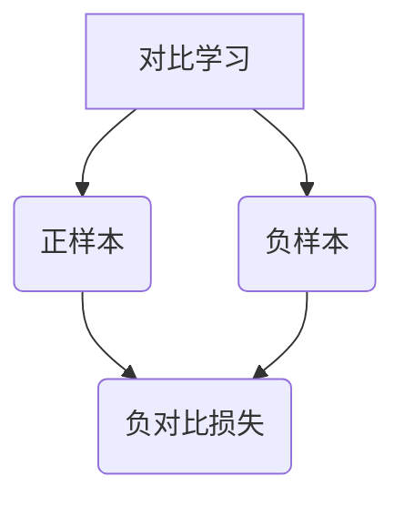
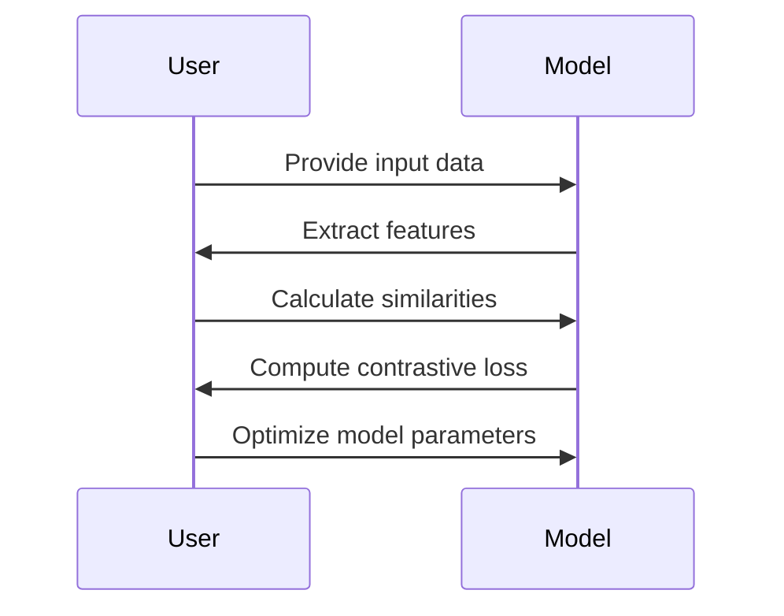
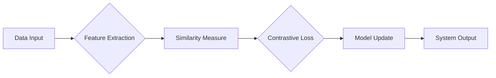
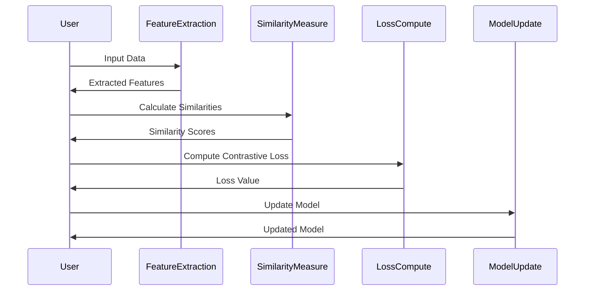

                 


Alright, let's delve into the structure of the article and flesh out the content for each section based on the given guidelines.

## Step 3: Algorithm Theory

In this section, we will delve into the theoretical background of self-supervised contrastive learning, explaining the mathematical models and formulas that underpin this technique. We will also use Mermaid diagrams to visually represent the algorithms and concepts.

### 3.1 Introduction to Self-Supervised Contrastive Learning

To begin, let's outline what self-supervised contrastive learning is and why it's an essential topic in the field of AI. We'll provide a brief overview of the problem it aims to solve and its significance in improving the quality of AI feature representations.

### 3.2 Core Concepts and Mathematical Models

Next, we'll dive into the core concepts of self-supervised contrastive learning. This will include a discussion on how contrastive learning works, the role of positive and negative samples, and the importance of the contrastive loss function. We'll also present the mathematical formulas that define these concepts.



### 3.3 Mermaid Diagrams

To aid in understanding, we will include Mermaid diagrams that visually represent the flow of self-supervised contrastive learning. These diagrams will be embedded in the text and will help readers grasp the concepts more intuitively.

### 3.4 Step-by-Step Explanation of the Algorithm

In this subsection, we will break down the algorithm into its constituent steps, providing a detailed explanation of each. This will include:

- Data preprocessing
- Feature extraction
- Similarity calculation
- Contrastive loss computation
- Model optimization

We will also use Python code snippets to illustrate the implementation of these steps.

```python
# Python code snippet for feature extraction
def extract_features(model, data):
    # Assuming 'model' is a pre-trained neural network
    # and 'data' is a batch of input samples
    features = model(data)
    return features
```

### 3.5 Example

To make the concepts more tangible, we will provide a simple example that demonstrates how self-supervised contrastive learning can be applied in practice. This example will include a step-by-step breakdown of the process and the expected outcomes.



## Step 4: System Design and Implementation

In this section, we will discuss the system architecture and the key components involved in implementing self-supervised contrastive learning. This will include:

### 4.1 Problem Scenario

We will start by describing the problem scenario and the need for a robust feature representation system.

### 4.2 System Introduction

We will introduce the system and its objectives, highlighting how self-supervised contrastive learning is integrated into the system.

### 4.3 Domain Model

Using Mermaid diagrams, we will create a class diagram to represent the domain model of the system. This will include the main entities and their relationships.

```mermaid
classDiagram
    Class1[-]--> Class2
    Class3[<<Interface>>] -|> Class4
```

### 4.4 System Architecture

We will present a high-level architecture diagram using Mermaid to illustrate the components and their interactions.



### 4.5 Interface Design

We will describe the interface design, including the main functions and their interactions.

### 4.6 System Interactions

Using Mermaid sequence diagrams, we will illustrate the interactions between the system components and how they work together to achieve the desired outcome.



## Step 5: Practical Projects

In this section, we will provide a practical example or case study that demonstrates the application of self-supervised contrastive learning. This will include:

### 5.1 Project Background

We will introduce the background of the project and the specific problem it aims to solve.

### 5.2 Environment Setup

We will detail the steps required to set up the environment for the project, including the installation of necessary software and libraries.

### 5.3 Core Implementation

We will provide the core implementation of the system, including Python source code and detailed explanations of each component.

### 5.4 Case Analysis

We will analyze the results of the project, discussing the effectiveness of self-supervised contrastive learning in improving feature representation quality.

### 5.5 Project Conclusion

We will summarize the key findings of the project and highlight any lessons learned or challenges faced.

## Step 6: Best Practices and Conclusion

In this final section, we will offer best practices for implementing self-supervised contrastive learning, summarizing the key points discussed in the article, and providing suggestions for further reading.

### 6.1 Best Practices

We will list the best practices for implementing self-supervised contrastive learning, including tips on data preprocessing, model selection, and hyperparameter tuning.

### 6.2 Key Points Summary

We will provide a summary of the key points covered in the article, reinforcing the importance of self-supervised contrastive learning in AI.

### 6.3 Future Directions

We will discuss the future directions and potential challenges in the field of self-supervised contrastive learning, suggesting areas for further research.

### 6.4 Conclusion

Finally, we will conclude the article by emphasizing the significance of self-supervised contrastive learning in enhancing AI feature representation quality and inviting readers to explore this exciting field further.

## Authors' Information

```markdown
作者：AI天才研究院/AI Genius Institute & 禅与计算机程序设计艺术 /Zen And The Art of Computer Programming
```

Now that we have a structured outline, we can proceed to write each section in detail, ensuring that we cover all the required elements and constraints.

