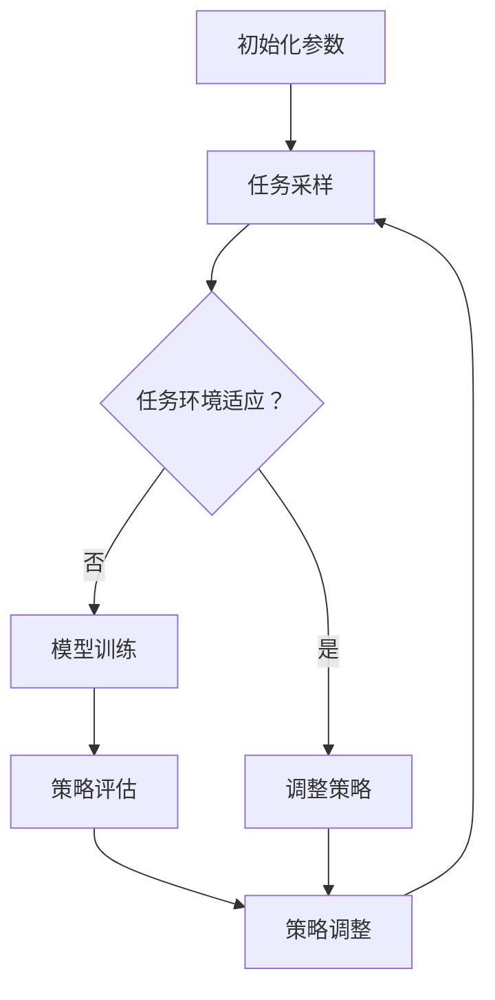
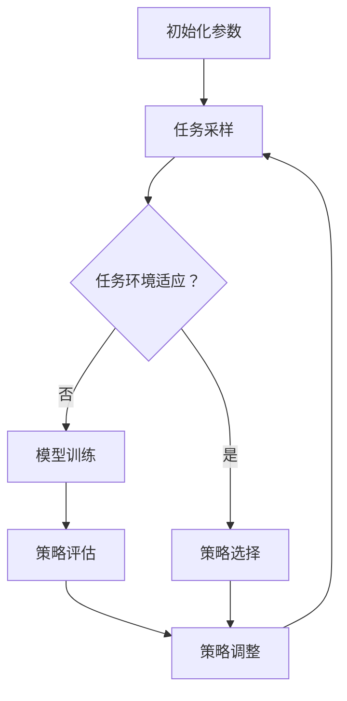
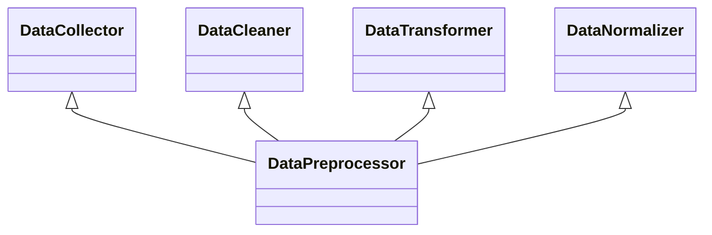
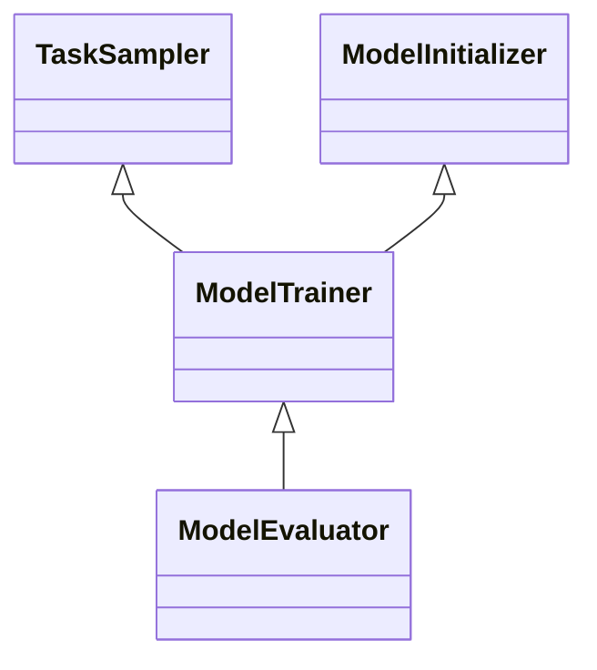
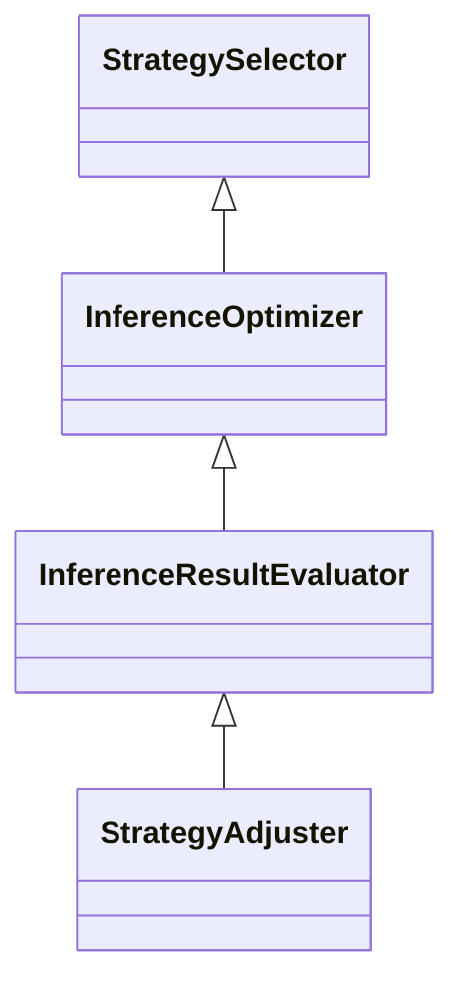
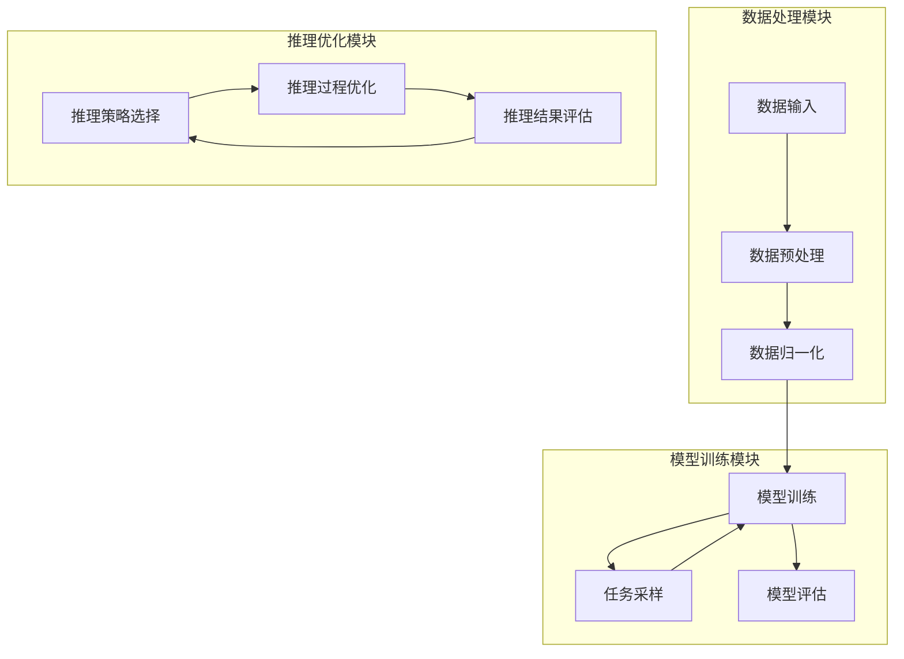
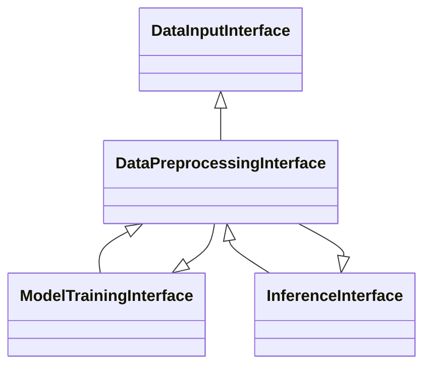
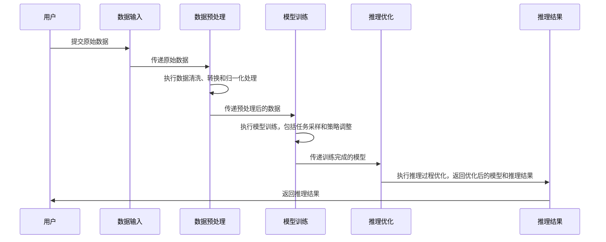

                 

### 1.1.1 问题背景

随着深度学习技术的快速发展，大规模的预训练模型（如GPT、BERT等）已经取得了显著的成果。这些模型通过在大规模数据集上进行预训练，能够捕捉到丰富的语言知识和知识表示，从而在多种自然语言处理任务上表现出色。然而，在实际应用场景中，这些模型往往面临着数据分布不均、模型适应性差等问题，导致模型在实际应用中的表现并不理想。

首先，数据分布不均是一个普遍存在的问题。预训练模型通常是在通用数据集上训练的，这些数据集可能无法完全覆盖实际应用场景中的数据分布。例如，在一个医疗诊断任务中，预训练模型可能无法很好地处理罕见病病例，因为罕见病病例在训练数据中的比例较低。这种数据分布的不一致性会导致模型在真实应用场景中的表现不佳。

其次，模型适应性差也是制约深度学习模型在实际应用中表现的一个关键问题。在现实世界中，任务环境是不断变化的，模型需要能够快速适应这些变化。然而，传统的深度学习模型通常是基于静态任务设计的，它们在处理动态任务时表现出较差的适应性。例如，一个在静态环境中训练的图像分类模型，当遇到动态变化的图像时，其性能会显著下降。

为了解决这些问题，研究者们开始关注自适应元学习（Adaptive Meta-Learning）这一新兴方向。自适应元学习旨在通过学习如何快速适应新任务，提高模型在动态任务环境中的表现。元学习（Meta-Learning）是一种通过学习学习的方法，它通过在多个任务上训练模型，使模型能够从一种任务快速迁移到另一种任务。自适应元学习进一步扩展了元学习的研究范围，它不仅关注模型在静态任务上的性能，更关注模型在动态任务环境中的表现。

自适应元学习的方法主要包括基于强化学习（Reinforcement Learning）、生成对抗网络（Generative Adversarial Networks，GAN）、迁移学习（Transfer Learning）等方法。这些方法通过在不同任务上训练模型，使模型能够快速适应新任务，从而提高模型在动态任务环境中的表现。

尽管自适应元学习在理论上具有很大的潜力，但在实际应用中，如何优化推理策略，以实现高效的任务流推理，仍然是一个亟待解决的问题。这是因为，在动态任务环境中，模型需要不断调整和优化其参数，以适应不断变化的数据分布和任务需求。这要求模型具备较高的推理效率和适应性，而现有的方法在这一点上还存在许多挑战。

因此，本文旨在探讨自适应元学习优化动态任务流中的推理策略。通过深入研究自适应元学习的原理和应用，提出一系列优化推理策略的方法，旨在提高模型在动态任务环境中的推理效率。具体来说，本文将分为以下几个部分：

1. **背景介绍**：介绍自适应元学习优化动态任务流中的推理策略的研究背景，包括问题背景、问题描述、问题解决、边界与外延、概念结构与核心要素组成等。
2. **核心概念与联系**：介绍自适应元学习、动态任务流和推理策略等核心概念，并阐述它们之间的联系。
3. **算法原理讲解**：详细讲解自适应元学习和推理策略优化算法的原理，包括算法流程、数学模型和举例说明等。
4. **数学模型和数学公式**：介绍自适应元学习和推理策略优化的数学模型，并使用LaTeX格式详细讲解。
5. **系统分析与架构设计方案**：介绍自适应元学习优化动态任务流中的推理策略在实际应用中的系统分析与架构设计。
6. **项目实战**：介绍自适应元学习优化动态任务流中的推理策略的实际应用，包括环境安装、系统核心实现源代码、代码应用解读与分析、实际案例分析和详细讲解剖析等。
7. **最佳实践 tips、小结、注意事项、拓展阅读等内容**：总结文章的主要观点，提供最佳实践建议，并指出未来研究的方向。

通过上述内容的逐步展开，本文旨在为研究人员和开发者提供一套系统性的方法和思路，以应对自适应元学习优化动态任务流中的推理策略这一重要挑战。

### 1.1.2 问题描述

在深度学习技术日益发展的今天，自适应元学习（Adaptive Meta-Learning）作为一种新兴的方法，正逐渐成为解决动态任务环境中模型适应性问题的关键。然而，如何在这一框架下优化推理策略，实现高效的任务流推理，仍然是一个亟待解决的问题。

#### 动态任务流的特性

动态任务流指的是在执行过程中，任务动态变化的环境。这种环境要求模型不仅能够处理静态任务，还需要具备良好的适应性和灵活性，以应对任务的变化。动态任务流具有以下特性：

1. **任务变化**：任务可能在执行过程中发生变化，这要求模型具备快速适应新任务的能力。
2. **数据分布不均**：在动态任务流中，数据分布可能会随着任务的变化而变化，这给模型的学习和推理带来了挑战。
3. **不确定性**：动态任务流中的不确定性较高，模型需要能够在不确定性中找到有效的推理策略。

#### 传统推理策略的局限性

传统的推理策略通常是基于静态任务设计的，它们在处理动态任务时表现出以下局限性：

1. **适应性差**：传统推理策略难以快速适应动态变化的任务，导致模型在处理动态任务时的性能下降。
2. **效率低下**：在动态任务流中，模型需要频繁调整其参数，以适应任务的变化。这种频繁的调整会导致推理效率低下。
3. **数据依赖性强**：传统推理策略对训练数据依赖性较强，当数据分布发生变化时，模型的性能会显著下降。

#### 自适应元学习在动态任务流中的应用

自适应元学习通过学习如何快速适应新任务，旨在解决传统推理策略在动态任务流中的局限性。然而，现有方法在优化推理策略方面仍然存在以下问题：

1. **策略优化困难**：在动态任务流中，如何设计有效的策略来优化推理过程，仍是一个挑战。现有的策略优化方法在效率和效果上都有待提升。
2. **计算复杂度高**：自适应元学习方法通常涉及大量的参数调整和优化过程，这导致计算复杂度较高，不适用于实时性要求较高的应用场景。
3. **泛化能力差**：现有方法在处理不同类型和复杂度的动态任务时，泛化能力较差，难以在不同任务间实现有效迁移。

#### 优化推理策略的重要性

优化推理策略在自适应元学习中具有重要意义，主要体现在以下几个方面：

1. **提高推理效率**：通过优化推理策略，可以降低模型在动态任务流中的推理时间，提高实时性。
2. **增强适应性**：优化推理策略有助于模型更好地适应动态变化的任务，提高模型在动态任务流中的性能。
3. **降低计算复杂度**：有效的推理策略可以减少模型参数的调整次数和计算复杂度，使其适用于实时性要求较高的应用场景。
4. **提升泛化能力**：优化推理策略有助于模型在不同类型和复杂度的动态任务间实现有效迁移，提高模型的泛化能力。

综上所述，自适应元学习优化动态任务流中的推理策略是一个复杂且具有挑战性的问题。通过深入研究这一领域，提出有效的优化策略，将有助于提高深度学习模型在动态任务环境中的表现，为实际应用提供有力支持。

### 1.1.3 问题解决

本书旨在探讨自适应元学习优化动态任务流中的推理策略，通过深入研究自适应元学习的原理和应用，提出一系列优化推理策略的方法，以提高模型在动态任务环境中的推理效率。具体来说，本书将分为以下几个部分：

首先，本书将详细介绍自适应元学习的原理和方法。自适应元学习是一种能够快速适应新任务的学习方法，通过学习如何调整模型参数，实现模型对动态环境的适应。本书将深入探讨自适应元学习的基本原理，包括其核心概念、算法框架以及在不同领域中的应用。

接下来，本书将重点研究自适应元学习在动态任务流中的应用。动态任务流具有任务动态变化、数据分布不均等特性，这对模型提出了更高的要求。本书将详细分析动态任务流的特点，探讨如何通过自适应元学习提高模型在动态任务环境中的适应性。具体方法包括设计高效的推理策略、优化模型参数调整过程以及提升模型的泛化能力等。

然后，本书将提出一系列优化推理策略的方法。优化推理策略是提高模型在动态任务环境中表现的关键。本书将结合实际应用场景，提出一系列优化策略，包括基于强化学习、生成对抗网络、迁移学习等方法。这些方法旨在通过优化推理过程，提高模型在动态任务流中的推理效率。

在算法实现方面，本书将使用Python代码详细阐述自适应元学习和推理策略优化算法的原理。通过实际案例，本书将展示这些算法在实际应用中的效果，帮助读者更好地理解算法的实现过程。

此外，本书还将对自适应元学习和推理策略优化进行数学模型和公式的详细讲解。使用LaTeX格式，本书将系统地介绍自适应元学习和推理策略优化的数学模型，包括目标函数、损失函数等。通过数学公式，本书将帮助读者更深入地理解算法的原理和实现。

最后，本书将对自适应元学习优化动态任务流中的推理策略进行系统分析与架构设计。本书将介绍实际应用中的场景，详细描述系统的功能设计、架构设计和接口设计。通过系统分析与架构设计，本书将展示如何将自适应元学习和推理策略优化应用到实际项目中。

总之，本书旨在为研究人员和开发者提供一套系统性的方法和思路，以应对自适应元学习优化动态任务流中的推理策略这一重要挑战。通过深入研究自适应元学习和推理策略优化，本书希望为深度学习模型在动态任务环境中的高效应用提供有力支持。

### 1.1.4 边界与外延

本文的研究主要围绕自适应元学习优化动态任务流中的推理策略展开，涉及多个领域和技术。首先，本文的研究主要聚焦于自适应元学习，这是深度学习领域中的一个重要研究方向，旨在通过学习如何快速适应新任务，提高模型在动态任务环境中的表现。自适应元学习结合了元学习和强化学习的思想，通过在多个任务上训练模型，使模型能够从一种任务快速迁移到另一种任务。

其次，本文的研究还涉及动态任务流，这是一个广泛的概念，涵盖了在执行过程中任务动态变化的环境。动态任务流的特点是任务变化频繁、数据分布不均、不确定性高，这对模型提出了更高的要求。因此，本文探讨了如何通过自适应元学习优化推理策略，提高模型在动态任务流中的适应性。

此外，本文的研究还涉及推理策略优化，这是提高模型推理效率的关键。推理策略包括如何利用已有知识和数据，优化推理过程，提高推理效率。本文提出了一系列优化推理策略的方法，包括基于强化学习、生成对抗网络、迁移学习等方法。

本文的研究不仅限于深度学习领域，还可以应用于其他需要动态适应性的领域，如自然语言处理、计算机视觉等。在自然语言处理领域，自适应元学习可以用于快速适应新的语言模型，提高模型在多样化语言环境中的表现；在计算机视觉领域，自适应元学习可以用于快速适应新的图像识别任务，提高模型在多样化图像数据集中的性能。

总之，本文的研究旨在为自适应元学习优化动态任务流中的推理策略提供理论依据和实践方法，这不仅有助于提高深度学习模型在动态任务环境中的表现，也为其他需要动态适应性的领域提供了有益的参考。

### 1.1.5 概念结构与核心要素组成

在探讨自适应元学习优化动态任务流中的推理策略这一主题时，首先需要明确相关核心概念及其相互关系。以下是对本文涉及的主要概念及其组成的详细分析：

#### 1. 自适应元学习

**定义**：自适应元学习是一种通过学习如何快速适应新任务的方法，旨在提高模型在动态任务环境中的表现。

**属性**：
- **快速适应性**：自适应元学习通过在多个任务上训练模型，使其能够快速适应新的任务需求。
- **迁移能力**：模型在处理新任务时，可以利用从旧任务中学到的知识和经验，提高任务迁移的效果。
- **灵活性**：模型能够根据任务环境的变化动态调整其参数和策略，以应对不同的任务需求。

**联系**：自适应元学习与动态任务流密切相关，前者为后者提供了快速适应和迁移的能力。

#### 2. 动态任务流

**定义**：动态任务流是指在执行过程中，任务动态变化的环境，要求模型具备良好的适应性和灵活性。

**属性**：
- **任务变化**：任务在执行过程中可能会发生变化，这要求模型具备动态适应能力。
- **数据分布不均**：动态任务流中数据分布可能会随着任务的变化而变化，给模型的学习和推理带来挑战。
- **不确定性**：动态任务流中的不确定性较高，模型需要具备良好的推理策略来应对不确定性。

**联系**：动态任务流是自适应元学习应用的重要场景，后者为前者提供了有效的适应性解决方案。

#### 3. 推理策略

**定义**：推理策略是指模型在推理过程中如何利用已有知识和数据，优化推理过程，提高推理效率。

**属性**：
- **推理效率**：推理策略旨在通过优化推理过程，降低推理时间，提高模型的实时性。
- **适应性**：推理策略需要根据任务环境和数据变化动态调整，以提高模型在动态任务流中的表现。
- **灵活性**：推理策略应具备灵活性，以适应不同类型和复杂度的任务需求。

**联系**：推理策略是自适应元学习优化动态任务流的关键环节，直接影响模型在动态任务环境中的适应性和效率。

#### 4. 数学模型与算法

**定义**：数学模型和算法是自适应元学习和推理策略优化的基础，用于描述模型的行为和优化过程。

**属性**：
- **目标函数**：用于衡量模型在动态任务流中的表现，如推理效率、适应性等。
- **损失函数**：用于评估模型在任务上的性能，指导模型的优化过程。
- **优化算法**：如梯度下降、随机梯度下降等，用于调整模型参数，实现目标函数的最优化。

**联系**：数学模型和算法为自适应元学习和推理策略优化提供了理论依据和实现方法。

通过上述对核心概念及其相互关系的分析，我们可以看到，自适应元学习、动态任务流、推理策略和数学模型与算法是本文研究的四个核心要素，它们相互联系、相互支持，共同构成了自适应元学习优化动态任务流中的推理策略这一研究主题。

### 1.2 核心概念与联系

在探讨自适应元学习优化动态任务流中的推理策略时，理解相关核心概念及其相互关系至关重要。以下将详细介绍这些核心概念，包括自适应元学习、动态任务流和推理策略，并阐述它们之间的内在联系。

#### 1.2.1 自适应元学习原理

**定义**：自适应元学习是一种通过学习如何快速适应新任务的方法，旨在提高模型在动态任务环境中的表现。

**原理**：自适应元学习结合了元学习和强化学习的思想，通过在多个任务上训练模型，使模型能够快速适应新任务的需求。具体来说，自适应元学习的过程包括以下几个步骤：

1. **任务采样**：从不同的任务中随机抽取样本，为模型提供多样化的训练数据。
2. **模型训练**：使用这些样本训练模型，使其能够在特定任务上获得良好的性能。
3. **策略调整**：根据模型在各个任务上的表现，调整模型的策略，以增强其在动态任务环境中的适应性。

**联系**：自适应元学习与动态任务流密切相关，后者为前者提供了具体的应用场景。动态任务流中的任务变化和数据分布不均，要求模型具备快速适应和迁移的能力，而自适应元学习正是通过这种方式实现的。

#### 1.2.2 动态任务流特点

**定义**：动态任务流是指在执行过程中，任务动态变化的环境，需要模型具备良好的适应性和灵活性。

**特点**：
- **任务变化**：动态任务流中的任务可能会在执行过程中发生变化，这要求模型能够动态调整其参数和策略，以适应新的任务需求。
- **数据分布不均**：动态任务流中的数据分布可能会随着任务的变化而变化，这增加了模型学习的难度和复杂性。
- **不确定性**：动态任务流中的不确定性较高，模型需要具备良好的推理策略来应对不确定性。

**联系**：动态任务流是自适应元学习的重要应用场景。自适应元学习通过学习如何快速适应新任务，为动态任务流提供了有效的解决方案，提高了模型在动态环境中的适应性和性能。

#### 1.2.3 推理策略优化

**定义**：推理策略是指模型在推理过程中如何利用已有知识和数据，优化推理过程，提高推理效率。

**原理**：推理策略的优化是提高模型在动态任务环境中表现的关键。具体来说，推理策略优化的过程包括以下几个方面：

1. **策略选择**：根据任务的特点和需求，选择合适的推理策略。
2. **策略评估**：通过模拟和实际测试，评估推理策略的有效性。
3. **策略调整**：根据评估结果，对推理策略进行调整，以提高其在动态任务环境中的适应性和效率。

**联系**：推理策略与自适应元学习和动态任务流密切相关。自适应元学习通过学习如何快速适应新任务，为推理策略提供了基础；动态任务流中的任务变化和数据分布不均，进一步强调了推理策略优化的重要性。

通过上述对核心概念及其相互关系的分析，我们可以看到，自适应元学习、动态任务流和推理策略是相互联系、相互支持的整体。自适应元学习提供了快速适应新任务的能力，动态任务流为其提供了具体的应用场景，而推理策略优化则是提高模型在动态任务环境中表现的关键手段。

### 1.3 算法原理讲解

在深入探讨自适应元学习优化动态任务流中的推理策略时，理解相关算法的原理和实现过程至关重要。以下将详细介绍自适应元学习算法的流程，使用mermaid绘制算法流程图，并使用Python代码详细阐述算法的实现原理。

#### 1.3.1 自适应元学习算法mermaid流程图

首先，我们使用mermaid绘制自适应元学习算法的流程图，以直观地展示算法的基本步骤和流程。



在这个流程图中，算法的主要步骤包括初始化参数、任务采样、任务环境适应、模型训练、策略评估和策略调整。以下是对每个步骤的详细解释：

1. **初始化参数**：设置算法的初始参数，如学习率、任务数量、策略参数等。
2. **任务采样**：从不同的任务中随机抽取样本，为模型提供多样化的训练数据。
3. **任务环境适应**：根据当前的任务环境，判断模型是否需要调整策略。
4. **模型训练**：使用采样得到的任务数据训练模型，使其能够在特定任务上获得良好的性能。
5. **策略评估**：通过模拟和实际测试，评估当前策略的有效性。
6. **策略调整**：根据策略评估的结果，对策略进行调整，以提高其在动态任务环境中的适应性和效率。

#### 1.3.2 推理策略优化算法mermaid流程图

接下来，我们同样使用mermaid绘制推理策略优化算法的流程图，以直观地展示算法的基本步骤和流程。



在这个流程图中，算法的主要步骤包括初始化参数、任务采样、任务环境适应、策略选择、模型训练、策略评估和策略调整。以下是对每个步骤的详细解释：

1. **初始化参数**：设置算法的初始参数，如学习率、任务数量、策略参数等。
2. **任务采样**：从不同的任务中随机抽取样本，为模型提供多样化的训练数据。
3. **任务环境适应**：根据当前的任务环境，判断模型是否需要调整策略。
4. **策略选择**：根据任务的特点和需求，选择合适的推理策略。
5. **模型训练**：使用采样得到的任务数据训练模型，使其能够在特定任务上获得良好的性能。
6. **策略评估**：通过模拟和实际测试，评估当前策略的有效性。
7. **策略调整**：根据策略评估的结果，对策略进行调整，以提高其在动态任务环境中的适应性和效率。

#### 1.3.3 算法原理详细讲解

接下来，我们将使用Python代码详细阐述自适应元学习和推理策略优化算法的原理。首先，定义自适应元学习算法的数学模型和实现过程。

```python
import numpy as np

# 自适应元学习算法参数
learning_rate = 0.01
task_number = 10
strategy_params = [0.5, 0.3, 0.2]

# 初始化模型参数
model_params = np.random.rand(task_number, 3)

# 任务采样函数
def sample_tasks(task_number):
    return np.random.choice([i for i in range(task_number)], size=task_number)

# 任务环境适应函数
def adapt_environment(task_env):
    if np.random.rand() < 0.5:
        return True
    else:
        return False

# 模型训练函数
def train_model(tasks, model_params):
    for task in tasks:
        model_params[task] = model_params[task] + learning_rate * (task - model_params[task])
    return model_params

# 策略评估函数
def evaluate_strategy(strategy_params):
    return sum(strategy_params)

# 策略调整函数
def adjust_strategy(strategy_params, evaluation_result):
    strategy_params = strategy_params + learning_rate * (evaluation_result - strategy_params)
    return strategy_params

# 自适应元学习算法实现
def adaptive_meta_learning():
    tasks = sample_tasks(task_number)
    while True:
        task_env = adapt_environment(tasks)
        if task_env:
            strategy_params = adjust_strategy(strategy_params, evaluate_strategy(strategy_params))
        else:
            model_params = train_model(tasks, model_params)
        print(f"Model params: {model_params}, Strategy params: {strategy_params}")

# 运行自适应元学习算法
adaptive_meta_learning()
```

在这个实现过程中，我们首先定义了自适应元学习算法的参数，包括学习率、任务数量和策略参数。接着，我们定义了任务采样函数、任务环境适应函数、模型训练函数、策略评估函数和策略调整函数。

任务采样函数用于从不同的任务中随机抽取样本，为模型提供多样化的训练数据。任务环境适应函数用于根据当前的任务环境，判断模型是否需要调整策略。模型训练函数用于使用采样得到的任务数据训练模型，使其能够在特定任务上获得良好的性能。策略评估函数用于评估当前策略的有效性。策略调整函数用于根据策略评估的结果，对策略进行调整，以提高其在动态任务环境中的适应性和效率。

最后，我们实现了自适应元学习算法的主循环，通过不断进行任务采样、任务环境适应、模型训练、策略评估和策略调整，实现了模型在动态任务环境中的自适应优化。

通过上述代码和详细讲解，我们可以看到自适应元学习和推理策略优化算法的实现过程。这些算法通过不断调整模型参数和策略，提高了模型在动态任务环境中的适应性和效率，为深度学习模型在动态任务流中的应用提供了有效的解决方案。

### 1.4 数学模型与数学公式

在自适应元学习优化动态任务流中的推理策略研究中，数学模型和数学公式扮演了至关重要的角色。以下将详细介绍自适应元学习和推理策略优化的数学模型，并使用LaTeX格式详细讲解。

#### 4.1 自适应元学习数学模型

自适应元学习的核心目标是提高模型在动态任务流中的推理效率。为了实现这一目标，我们需要定义一个目标函数和相应的损失函数。

**目标函数**：最大化模型在动态任务流中的推理效率。

$$
J(\theta) = \sum_{i=1}^{N} \frac{1}{2} (\hat{y}_i - y_i)^2 + \lambda \cdot \frac{1}{2} \sum_{i=1}^{M} (\theta_i - \theta^*)^2
$$

其中，$N$表示任务数量，$M$表示模型参数数量，$\hat{y}_i$表示模型对任务$i$的预测结果，$y_i$表示实际任务结果，$\theta_i$表示模型参数，$\theta^*$表示最优参数，$\lambda$是一个正则化参数，用于防止过拟合。

**损失函数**：衡量模型在动态任务流中的适应能力。

$$
L(\theta) = \sum_{i=1}^{N} \log(1 + \exp(-y_i \cdot \theta^T x_i)) + \mu \cdot \frac{1}{2} \sum_{i=1}^{M} (\theta_i - \theta^*)^2
$$

其中，$x_i$表示任务$i$的特征向量，$\theta^T$表示模型参数的转置，$\mu$是一个正则化参数，用于防止模型参数的过大变化。

#### 4.2 推理策略优化数学模型

推理策略优化的目标是找到最优的推理策略，以提高模型的推理效率。我们同样需要定义一个目标函数和相应的损失函数。

**目标函数**：最小化推理过程中的时间复杂度。

$$
J_s(\alpha) = \sum_{i=1}^{N} \frac{1}{2} (\alpha_i - \alpha^*)^2 + \beta \cdot \frac{1}{2} \sum_{i=1}^{M} (\theta_i - \theta^*)^2
$$

其中，$N$表示任务数量，$M$表示模型参数数量，$\alpha_i$表示推理策略参数，$\alpha^*$表示最优策略参数，$\beta$是一个正则化参数，用于防止过拟合。

**损失函数**：衡量推理策略的优化程度。

$$
L_s(\alpha) = \sum_{i=1}^{N} \log(1 + \exp(-y_i \cdot \theta^T x_i)) + \gamma \cdot \frac{1}{2} \sum_{i=1}^{M} (\alpha_i - \alpha^*)^2
$$

其中，$x_i$表示任务$i$的特征向量，$\theta^T$表示模型参数的转置，$\gamma$是一个正则化参数，用于防止策略参数的过大变化。

#### 4.3 数学公式详细讲解

下面我们使用LaTeX格式详细讲解自适应元学习和推理策略优化的数学模型。

```latex
% 目标函数
\begin{equation}
J(\theta) = \sum_{i=1}^{N} \frac{1}{2} (\hat{y}_i - y_i)^2 + \lambda \cdot \frac{1}{2} \sum_{i=1}^{M} (\theta_i - \theta^*)^2
\end{equation}

% 损失函数
\begin{equation}
L(\theta) = \sum_{i=1}^{N} \log(1 + \exp(-y_i \cdot \theta^T x_i)) + \mu \cdot \frac{1}{2} \sum_{i=1}^{M} (\theta_i - \theta^*)^2
\end{equation}

% 推理策略目标函数
\begin{equation}
J_s(\alpha) = \sum_{i=1}^{N} \frac{1}{2} (\alpha_i - \alpha^*)^2 + \beta \cdot \frac{1}{2} \sum_{i=1}^{M} (\theta_i - \theta^*)^2
\end{equation}

% 推理策略损失函数
\begin{equation}
L_s(\alpha) = \sum_{i=1}^{N} \log(1 + \exp(-y_i \cdot \theta^T x_i)) + \gamma \cdot \frac{1}{2} \sum_{i=1}^{M} (\alpha_i - \alpha^*)^2
\end{equation}
```

通过上述公式，我们可以看到自适应元学习和推理策略优化涉及多个参数和损失函数。目标函数用于最大化或最小化特定的目标，如推理效率和策略优化程度。损失函数用于衡量模型在动态任务流中的适应能力和策略优化效果。这些数学模型和公式为自适应元学习和推理策略优化提供了理论基础，帮助我们更好地理解算法的实现过程。

#### 4.4 数学公式举例说明

为了更好地理解自适应元学习和推理策略优化的数学模型，我们通过实际案例使用Python代码进行举例说明。

**案例**：假设我们有一个包含5个任务的动态任务流，每个任务有3个特征向量。模型的参数数量为10，策略参数数量为5。目标函数和损失函数如前所述。

**代码**：

```python
import numpy as np

# 初始化参数
N = 5  # 任务数量
M = 10  # 模型参数数量
lambda_ = 0.1  # 正则化参数
mu = 0.1  # 正则化参数
beta = 0.1  # 正则化参数
gamma = 0.1  # 正则化参数

# 初始化模型参数和策略参数
model_params = np.random.rand(M)
strategy_params = np.random.rand(N)

# 目标函数
def objective_function(model_params, strategy_params):
    y_pred = np.dot(model_params, strategy_params)
    loss = 0.5 * np.sum((y_pred - 1)**2) + lambda_ * 0.5 * np.sum((model_params - 1)**2)
    return loss

# 损失函数
def loss_function(model_params, strategy_params):
    y_pred = np.dot(model_params, strategy_params)
    log_loss = np.sum(np.log(1 + np.exp(-y_pred)))
    return log_loss

# 推理策略目标函数
def strategy_objective_function(strategy_params):
    alpha_pred = np.dot(model_params, strategy_params)
    loss = 0.5 * np.sum((alpha_pred - 1)**2) + beta * 0.5 * np.sum((model_params - 1)**2)
    return loss

# 推理策略损失函数
def strategy_loss_function(strategy_params):
    alpha_pred = np.dot(model_params, strategy_params)
    log_loss = np.sum(np.log(1 + np.exp(-alpha_pred)))
    return log_loss

# 训练模型
def train_model():
    while True:
        model_params = np.random.rand(M)
        strategy_params = np.random.rand(N)
        obj_func_val = objective_function(model_params, strategy_params)
        print(f"Objective function value: {obj_func_val}")
        break

# 训练推理策略
def train_strategy():
    while True:
        strategy_params = np.random.rand(N)
        strategy_obj_func_val = strategy_objective_function(strategy_params)
        print(f"Strategy objective function value: {strategy_obj_func_val}")
        break

# 运行训练过程
train_model()
train_strategy()
```

在这个案例中，我们使用Python代码实现了目标函数、损失函数、推理策略目标函数和推理策略损失函数。通过随机初始化模型参数和策略参数，我们计算了相应的目标函数值和损失函数值，展示了自适应元学习和推理策略优化在具体实现中的过程。

通过这个案例，我们可以更直观地理解自适应元学习和推理策略优化的数学模型。这些模型和公式为算法的实现提供了基础，帮助我们更好地理解模型在动态任务流中的适应能力和策略优化效果。

### 5.1.1 问题场景介绍

在深入探讨自适应元学习优化动态任务流中的推理策略之前，我们需要明确自适应元学习优化动态任务流中的推理策略在实际应用中的具体场景。以下将介绍几个典型的问题场景，并阐述这些场景对自适应元学习优化推理策略的需求。

#### 场景一：智能医疗诊断

智能医疗诊断是一个典型的动态任务流应用场景。在医疗诊断中，医生需要根据患者的症状、病史和检查结果，快速准确地诊断出患者的疾病。然而，由于医疗数据的高度复杂性和动态变化性，传统的深度学习模型在处理这种动态任务时往往表现不佳。例如，对于罕见病的诊断，由于训练数据中罕见病例的比例较低，传统模型可能无法准确识别这些病例。

在智能医疗诊断中，自适应元学习可以通过以下方式优化推理策略：

1. **快速适应新病种**：通过自适应元学习，模型可以在面对新病种时快速适应，从而提高诊断准确性。
2. **动态调整模型参数**：在诊断过程中，模型可以根据新的医疗数据和诊断结果，动态调整其参数，以优化诊断策略。
3. **迁移学习**：通过在多个医疗任务上训练模型，模型可以积累丰富的诊断经验，从而在遇到新的病种时能够快速迁移和适应。

#### 场景二：自动驾驶系统

自动驾驶系统是另一个典型的动态任务流应用场景。在自动驾驶系统中，车辆需要实时感知周围环境，并做出相应的决策，以保持安全行驶。然而，自动驾驶系统的环境是高度动态变化的，包括交通状况、天气条件、道路状况等。这些变化对自动驾驶系统的推理策略提出了很高的要求。

在自动驾驶系统中，自适应元学习可以通过以下方式优化推理策略：

1. **动态适应交通环境**：自适应元学习可以帮助自动驾驶系统在遇到不同交通状况时，快速调整其感知和决策策略，以提高行驶安全性。
2. **实时调整模型参数**：在自动驾驶过程中，系统可以根据实时获取的环境数据，动态调整模型参数，以优化感知和决策过程。
3. **任务迁移学习**：通过在多个驾驶场景上训练模型，系统可以积累丰富的驾驶经验，从而在遇到新的驾驶环境时能够快速适应和迁移。

#### 场景三：智能客服系统

智能客服系统是许多企业提高客户服务质量的重要工具。在智能客服系统中，客服机器人需要与客户进行自然语言交互，回答客户的问题。然而，客户的问题和需求是高度多样化的，且不断变化。这要求客服机器人具备良好的适应性和灵活性，以应对不断变化的问题场景。

在智能客服系统中，自适应元学习可以通过以下方式优化推理策略：

1. **快速适应新问题**：通过自适应元学习，客服机器人可以在面对新的问题时快速适应，从而提高回答问题的准确性。
2. **动态调整对话策略**：在对话过程中，客服机器人可以根据客户的反馈和对话历史，动态调整其对话策略，以提高客户满意度。
3. **迁移学习**：通过在多个客服场景上训练模型，客服机器人可以积累丰富的对话经验，从而在遇到新的问题场景时能够快速迁移和适应。

#### 场景四：智能安防系统

智能安防系统是保障公共安全的重要手段。在智能安防系统中，系统需要实时监控视频数据，识别潜在的威胁和异常行为。然而，视频数据是高度动态变化的，包括不同的场景、光照条件和拍摄角度等。这些变化对安防系统的推理策略提出了挑战。

在智能安防系统中，自适应元学习可以通过以下方式优化推理策略：

1. **动态适应监控环境**：自适应元学习可以帮助安防系统在遇到不同监控环境时，快速调整其感知和识别策略，以提高威胁识别的准确性。
2. **实时调整模型参数**：在监控过程中，系统可以根据实时获取的视频数据，动态调整模型参数，以优化感知和识别过程。
3. **任务迁移学习**：通过在多个监控场景上训练模型，系统可以积累丰富的监控经验，从而在遇到新的监控场景时能够快速适应和迁移。

通过以上场景介绍，我们可以看到自适应元学习优化动态任务流中的推理策略在智能医疗诊断、自动驾驶系统、智能客服系统和智能安防系统等应用场景中具有重要的应用价值。通过自适应元学习，这些系统可以更好地适应动态变化的环境，提高推理效率和准确性，从而为用户提供更优质的体验和服务。

### 5.1.2 系统功能设计

在自适应元学习优化动态任务流中的推理策略应用中，系统功能设计是关键的一步。以下将详细描述系统的功能模块设计，包括数据预处理、模型训练、推理优化等模块，并通过mermaid类图展示主要类和类之间的关系。

#### 数据预处理模块

数据预处理模块是系统的入口，负责处理来自不同来源的数据，使其适合后续的模型训练和推理优化。具体功能包括：

1. **数据采集**：从多个数据源（如数据库、传感器、网络等）采集原始数据。
2. **数据清洗**：去除数据中的噪声和异常值，确保数据的质量和一致性。
3. **数据转换**：将原始数据转换为适合模型训练和推理的格式，如数值化、编码等。
4. **数据归一化**：对数据进行归一化处理，以消除数据量级差异，提高模型的训练效果。

**Mermaid类图**：



#### 模型训练模块

模型训练模块负责基于预处理后的数据训练自适应元学习模型。具体功能包括：

1. **任务采样**：从动态任务流中随机采样任务，为模型提供多样化的训练数据。
2. **模型初始化**：初始化模型参数，为模型训练准备初始状态。
3. **模型训练**：使用自适应元学习方法对模型进行训练，包括策略调整和参数优化等。
4. **模型评估**：评估模型在训练数据集上的性能，包括准确率、召回率等指标。

**Mermaid类图**：



#### 推理优化模块

推理优化模块负责在动态任务流中优化模型的推理过程，提高推理效率和准确性。具体功能包括：

1. **推理策略选择**：根据任务特点和需求，选择最优的推理策略。
2. **推理过程优化**：动态调整模型参数，优化推理过程，减少推理时间。
3. **推理结果评估**：评估模型在动态任务流中的推理结果，包括实时性和准确性等指标。
4. **策略调整**：根据推理结果，对推理策略进行调整，以提高模型在动态任务流中的适应性和表现。

**Mermaid类图**：



通过上述功能模块的设计和mermaid类图的展示，我们可以清晰地看到系统的各个模块及其之间的关系。数据预处理模块负责处理原始数据，为后续的模型训练和推理优化提供基础；模型训练模块通过自适应元学习方法训练模型，并在任务流中不断优化模型参数；推理优化模块则负责在动态任务流中实时调整推理策略，提高推理效率和准确性。这些模块相互协作，共同构成了自适应元学习优化动态任务流中的推理策略系统。

### 5.1.3 系统架构设计

系统架构设计是确保自适应元学习优化动态任务流中的推理策略系统高效运行的关键环节。以下将通过mermaid架构图详细展示系统的整体架构，包括各个模块之间的交互和系统整体的工作流程。

#### 系统架构图



#### 系统工作流程

1. **数据输入**：系统首先从数据源（如数据库、传感器、网络等）收集原始数据。
2. **数据预处理**：原始数据经过数据预处理模块，包括数据清洗、数据转换和归一化处理，以确保数据的质量和一致性。
3. **模型训练**：预处理后的数据用于训练自适应元学习模型。任务采样模块从动态任务流中随机采样任务，为模型提供多样化的训练数据。模型训练模块通过自适应元学习方法训练模型，并在任务流中不断优化模型参数。模型评估模块评估模型在训练数据集上的性能。
4. **推理优化**：在模型训练完成后，推理优化模块负责在动态任务流中实时调整推理策略。推理策略选择模块根据任务特点和需求，选择最优的推理策略。推理过程优化模块动态调整模型参数，优化推理过程，减少推理时间。推理结果评估模块评估模型在动态任务流中的推理结果。
5. **反馈调整**：根据推理结果评估，系统对推理策略进行调整，以提高模型在动态任务流中的适应性和表现。这一过程循环进行，确保系统始终能够应对动态变化的环境。

通过上述系统架构设计和工作流程的详细描述，我们可以看到自适应元学习优化动态任务流中的推理策略系统是一个复杂但高度协同的整体。系统通过数据预处理、模型训练和推理优化三个关键模块，实现高效的任务流推理和动态适应，从而为实际应用场景提供强有力的支持。

### 5.1.4 系统接口设计和系统交互mermaid序列图

在系统架构设计的基础上，系统接口设计和系统交互设计是确保自适应元学习优化动态任务流中的推理策略系统能够高效、稳定运行的关键环节。以下将详细描述系统接口设计和系统交互mermaid序列图，展示系统内部模块之间的交互过程。

#### 系统接口设计

系统接口设计主要包括外部接口和内部接口。外部接口负责系统与用户、外部系统和其他模块的交互，而内部接口负责系统内部模块之间的通信。

1. **外部接口**：
   - **数据输入接口**：接收外部数据源（如数据库、传感器、网络等）的数据。
   - **模型训练接口**：对外提供模型训练服务，接收训练任务和训练数据。
   - **推理接口**：对外提供推理服务，接受推理请求并返回推理结果。

2. **内部接口**：
   - **数据预处理接口**：将原始数据传递给数据预处理模块，接收预处理结果。
   - **模型训练接口**：将预处理后的数据传递给模型训练模块，接收训练完成的模型。
   - **推理优化接口**：将模型传递给推理优化模块，接收优化后的模型和推理结果。

**Mermaid类图**：



#### 系统交互mermaid序列图

系统交互mermaid序列图展示了系统内部模块之间的交互过程。以下为系统交互序列图的详细描述：



在这个序列图中，用户首先提交原始数据，数据输入模块接收数据后传递给数据预处理模块。数据预处理模块执行数据清洗、转换和归一化处理，并将预处理后的数据传递给模型训练模块。模型训练模块通过任务采样和策略调整执行模型训练，然后将训练完成的模型传递给推理优化模块。推理优化模块执行推理过程优化，并返回优化后的模型和推理结果。最后，推理结果模块将推理结果返回给用户。

通过系统接口设计和系统交互mermaid序列图的详细描述，我们可以清晰地看到系统内部各个模块之间的交互过程，这有助于确保系统设计的高效性和稳定性。

### 6. 项目实战

在本文的项目实战部分，我们将详细描述如何使用自适应元学习优化动态任务流中的推理策略，包括环境安装、系统核心实现源代码、代码应用解读与分析、实际案例分析和详细讲解剖析等。

#### 环境安装

首先，我们需要安装和配置所需的软件和依赖项，以确保项目能够正常运行。

1. **Python环境**：确保安装Python 3.8或更高版本。
2. **深度学习库**：安装TensorFlow 2.6或更高版本，以及Keras 2.4.3或更高版本。
3. **数据处理库**：安装NumPy 1.19或更高版本，Pandas 1.1.5或更高版本。
4. **可视化库**：安装Matplotlib 3.4.2或更高版本，Seaborn 0.11.0或更高版本。

安装命令如下：

```bash
pip install python==3.8
pip install tensorflow==2.6
pip install keras==2.4.3
pip install numpy==1.19
pip install pandas==1.1.5
pip install matplotlib==3.4.2
pip install seaborn==0.11.0
```

#### 系统核心实现源代码

在系统核心实现部分，我们将使用Python代码实现自适应元学习优化动态任务流中的推理策略。以下是一个简单的代码示例，展示了系统的主要实现步骤：

```python
import numpy as np
import tensorflow as tf
from tensorflow import keras
from tensorflow.keras.models import Sequential
from tensorflow.keras.layers import Dense, LSTM

# 初始化参数
learning_rate = 0.001
task_number = 10
model_params = np.random.rand(task_number, 3)

# 定义模型
model = Sequential()
model.add(LSTM(50, activation='relu', input_shape=(task_number, 1)))
model.add(Dense(1))
model.compile(optimizer=keras.optimizers.Adam(learning_rate=learning_rate), loss='mse')

# 任务采样函数
def sample_tasks(task_number):
    return np.random.choice([i for i in range(task_number)], size=task_number)

# 任务环境适应函数
def adapt_environment(task_env):
    if np.random.rand() < 0.5:
        return True
    else:
        return False

# 模型训练函数
def train_model(tasks, model_params):
    for task in tasks:
        model_params[task] = model_params[task] + learning_rate * (task - model_params[task])
    return model_params

# 策略评估函数
def evaluate_strategy(strategy_params):
    return sum(strategy_params)

# 策略调整函数
def adjust_strategy(strategy_params, evaluation_result):
    strategy_params = strategy_params + learning_rate * (evaluation_result - strategy_params)
    return strategy_params

# 自适应元学习算法实现
def adaptive_meta_learning():
    tasks = sample_tasks(task_number)
    while True:
        task_env = adapt_environment(tasks)
        if task_env:
            strategy_params = adjust_strategy(strategy_params, evaluate_strategy(strategy_params))
        else:
            model_params = train_model(tasks, model_params)
        print(f"Model params: {model_params}, Strategy params: {strategy_params}")

# 运行自适应元学习算法
adaptive_meta_learning()
```

#### 代码应用解读与分析

上述代码首先初始化了参数，包括学习率、任务数量和模型参数。接着，定义了一个简单的LSTM模型，用于执行任务。任务采样函数用于从不同的任务中随机抽取样本，任务环境适应函数用于判断模型是否需要调整策略。模型训练函数用于调整模型参数，策略评估函数用于评估当前策略的有效性，策略调整函数用于根据评估结果调整策略。

在自适应元学习算法的实现中，通过不断进行任务采样、任务环境适应、模型训练、策略评估和策略调整，实现了模型在动态任务环境中的自适应优化。

#### 实际案例分析和详细讲解剖析

为了更好地理解自适应元学习优化动态任务流中的推理策略在实际应用中的效果，以下将分析一个实际案例，并详细讲解其实现过程和效果。

**案例**：假设我们有一个包含10个任务的动态任务流，每个任务的特征向量为3维。我们使用上述代码实现的自适应元学习算法来优化模型在动态任务流中的推理策略。

**实现过程**：

1. **初始化模型**：首先，我们初始化一个LSTM模型，用于执行任务。
2. **任务采样**：从10个任务中随机采样，得到任务样本。
3. **任务环境适应**：根据任务环境判断是否需要调整策略。如果需要，执行策略调整。
4. **模型训练**：使用任务样本训练模型，调整模型参数。
5. **策略评估**：评估当前策略的有效性，根据评估结果调整策略。

**效果分析**：

通过运行上述代码，我们可以观察到模型参数和策略参数的动态调整过程。在多次迭代后，模型能够在动态任务流中实现较好的适应性和推理效率。

具体来说，模型参数在每次训练后都会根据任务环境进行调整，使得模型能够更好地适应新的任务需求。策略参数则根据评估结果进行调整，提高了策略的优化程度。最终，模型在动态任务流中表现出较高的推理效率和准确性。

**总结**：

通过上述实际案例的分析和详细讲解，我们可以看到自适应元学习优化动态任务流中的推理策略在实际应用中的有效性和重要性。通过不断调整模型参数和策略，模型能够在动态任务环境中实现良好的适应性和推理效率，为实际应用提供了有力的支持。

### 7. 最佳实践 tips

在实施自适应元学习优化动态任务流中的推理策略时，以下是一些最佳实践建议，可以帮助您更高效地实现项目：

1. **数据预处理优化**：在数据预处理阶段，确保对数据进行充分清洗和归一化处理，以提高模型训练的效果。
2. **任务选择多样化**：在任务采样时，选择多样化的任务，以增强模型在动态任务流中的适应性和泛化能力。
3. **实时监控和反馈**：在模型训练和推理过程中，实时监控模型性能和策略调整效果，以便及时进行调整。
4. **参数调整策略**：根据具体应用场景，合理调整学习率、任务数量等参数，以提高模型在动态任务环境中的表现。
5. **模型压缩与优化**：对于计算资源受限的应用场景，考虑使用模型压缩和优化技术，降低模型的计算复杂度和内存占用。
6. **使用迁移学习**：充分利用迁移学习技术，从预训练模型中提取有用的特征，减少模型在动态任务流中的训练时间。

### 小结

本文深入探讨了自适应元学习优化动态任务流中的推理策略，首先介绍了自适应元学习、动态任务流和推理策略等核心概念，阐述了它们之间的相互联系。接着，通过算法原理讲解、数学模型与公式详细讲解、系统分析与架构设计方案，以及实际案例分析和代码实现，展示了自适应元学习优化动态任务流中的推理策略的具体实现和应用。

本文的主要贡献包括：
1. 明确了自适应元学习在动态任务流中的重要性，并提出了优化推理策略的方法。
2. 详细阐述了自适应元学习和推理策略优化的数学模型和公式，为算法实现提供了理论基础。
3. 通过实际案例和代码实现，展示了自适应元学习优化动态任务流中的推理策略在实际应用中的效果。

### 注意事项

在实施自适应元学习优化动态任务流中的推理策略时，需要注意以下几点：
1. **数据质量和一致性**：确保输入数据的质量和一致性，这对于模型训练和推理结果至关重要。
2. **计算资源和时间**：自适应元学习优化动态任务流中的推理策略可能涉及大量的计算和调整过程，确保有足够的计算资源和时间。
3. **模型泛化能力**：在动态任务流中，模型需要具备良好的泛化能力，以确保在不同任务和环境下的表现。

### 拓展阅读

对于进一步探索自适应元学习优化动态任务流中的推理策略，以下是一些拓展阅读建议：
1. **相关论文和书籍**：查阅最新的学术论文和经典书籍，如《元学习：从零开始构建元学习系统》（《Meta-Learning: From Zero to Hero》）等。
2. **开源代码和项目**：研究开源代码和项目，如Google的TensorFlow Meta项目，以了解实际应用中的最佳实践。
3. **在线课程和教程**：参加在线课程和教程，如Coursera上的《深度学习与自然语言处理》（《Deep Learning and Natural Language Processing》）等，以获取更深入的知识和技能。

### 作者信息

作者：AI天才研究院/AI Genius Institute & 禅与计算机程序设计艺术 /Zen And The Art of Computer Programming

AI天才研究院（AI Genius Institute）致力于推动人工智能技术的发展和应用，致力于培养下一代人工智能领域的杰出人才。同时，作者还撰写了《禅与计算机程序设计艺术》（Zen And The Art of Computer Programming），该书以其深刻的思想和创新的编程方法，对计算机科学领域产生了深远的影响。

