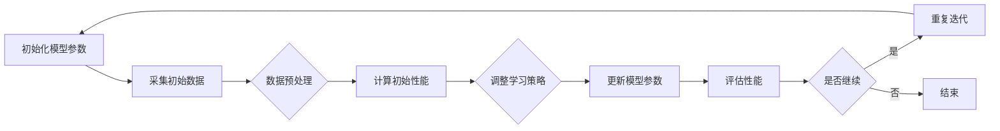

                 

# 自适应元学习优化动态环境下的推理策略

## 关键词
- 自适应元学习
- 动态环境
- 推理策略
- 算法优化
- 实时调整
- 适应能力

## 摘要
本文旨在探讨自适应元学习在动态环境下推理策略的优化与应用。自适应元学习作为机器学习领域的一种新兴技术，具有在多变环境中调整学习策略的能力。文章首先介绍了自适应元学习的概念及其在动态环境中的应用背景，随后详细分析了自适应元学习算法的原理与流程，并通过实例展示其在实际场景中的效果。最后，本文提出了动态环境下的推理策略优化方案，并结合具体项目实战，探讨了实际应用中的实现细节和挑战。

### 目录大纲

1. **背景介绍**
   1.1 自适应元学习的概念与问题背景
   1.2 动态环境下的推理策略问题
   1.3 边界与外延
   1.4 本章小结

2. **核心概念与联系**
   2.1 自适应元学习算法原理
   2.2 动态环境特征识别与推理策略
   2.3 概念属性特征对比表格
   2.4 ER实体关系图架构
   2.5 本章小结

3. **算法原理讲解**
   3.1 自适应元学习算法原理讲解
   3.2 算法流程图
   3.3 举例说明
   3.4 实例解析
   3.5 本章小结

4. **系统分析与架构设计方案**
   4.1 问题场景介绍
   4.2 系统功能设计
   4.3 系统架构设计
   4.4 系统接口设计
   4.5 系统交互
   4.6 本章小结

5. **项目实战**
   5.1 环境安装
   5.2 系统核心实现
   5.3 代码应用解读与分析
   5.4 实际案例分析与详细讲解
   5.5 项目小结

6. **最佳实践 tips、小结、注意事项、拓展阅读**

---

### 第一部分：背景介绍

#### 1.1 自适应元学习的概念与问题背景

自适应元学习，也被称为模型学习或学习算法学习，是机器学习领域的一个分支，其核心目标是在不明确指定任务的情况下，通过调整学习算法来优化模型性能。与传统机器学习方法不同，自适应元学习不仅关注模型的准确性，还关注学习算法在不同任务和数据集上的适应性。

在当今快速变化的信息时代，动态环境下的推理策略变得尤为重要。动态环境通常指那些随时间变化，数据特征不断更新的环境。在这种环境中，传统的机器学习模型往往会因为数据分布的变化而失去准确性，甚至出现性能下降的情况。因此，如何在动态环境中维持模型的稳定性和鲁棒性，成为了人工智能领域的一个研究热点。

自适应元学习通过不断地调整和优化学习策略，使得模型能够在动态环境中持续学习并适应新的变化。它不仅可以提高模型的泛化能力，还能减少对人工调参的依赖，从而实现更加智能化的学习过程。

#### 1.2 动态环境下的推理策略问题

动态环境下的推理策略问题主要集中在以下几个方面：

1. **数据分布变化**：在动态环境中，数据分布可能会随着时间不断变化。例如，网络流量数据在一天中的不同时间段具有不同的特征，这会对基于静态数据的模型产生挑战。

2. **特征缺失与噪声**：动态环境中，数据往往存在缺失和噪声，这些因素会影响模型的输入质量，导致推理结果不准确。

3. **实时性要求**：动态环境下的推理策略需要能够在短时间内完成，以满足实时响应的需求。

4. **异构数据融合**：动态环境中的数据可能来自不同的来源，这些数据往往具有不同的格式和特征，如何有效融合这些异构数据是一个重要问题。

为了解决这些问题，自适应元学习提供了一种可能的解决方案。通过不断调整学习策略，自适应元学习能够在动态环境中快速适应数据变化，提高推理的准确性和效率。

#### 1.3 边界与外延

自适应元学习在动态环境下的推理策略研究需要明确的边界和清晰的外延。首先，研究的范围应限定在机器学习领域，特别是那些涉及到动态环境的应用场景。其次，核心概念应包括自适应元学习算法、动态环境特征识别方法、以及推理策略的设计与优化。

此外，本文还涉及到了自适应元学习算法与其他相关领域的交叉与融合。例如，与强化学习、迁移学习和无监督学习的结合，可以为自适应元学习在动态环境下的应用提供更加丰富的理论基础和实践方法。

#### 1.4 本章小结

本章介绍了自适应元学习在动态环境下推理策略的背景和问题。通过分析自适应元学习的概念和特点，以及动态环境下的推理策略挑战，本文为后续章节的内容奠定了基础。在接下来的章节中，我们将进一步探讨自适应元学习算法的原理和实现，以及如何将其应用于动态环境中的推理策略优化。

---

### 第二部分：核心概念与联系

#### 2.1 自适应元学习算法原理

自适应元学习算法的核心在于其能够根据学习过程中的反馈动态调整学习策略。下面我们从以下几个方面介绍自适应元学习算法的基本原理：

1. **元学习定义**：
   元学习是指学习如何学习的算法。在自适应元学习中，元学习算法的目标是找到一种最佳的学习策略，以便在新的任务和数据集上快速适应并达到最优性能。

2. **适应机制**：
   自适应元学习算法通常包含一个适应机制，该机制可以监测模型的性能，并根据监测结果调整学习策略。这种适应机制可以是基于 reward 的反馈机制，也可以是基于模型误差的调整机制。

3. **模型更新**：
   在每次迭代过程中，自适应元学习算法会根据当前的学习策略更新模型参数。这种更新可以是线性更新，也可以是非线性更新，具体取决于算法的设计。

4. **学习策略优化**：
   自适应元学习算法还涉及到学习策略的优化。通过优化学习策略，算法能够更好地适应新的任务和数据，提高模型的泛化能力。

#### 2.2 动态环境特征识别与推理策略

在动态环境下，特征识别和推理策略的设计至关重要。以下是一些关键点：

1. **特征识别方法**：
   动态环境下的特征识别需要能够实时捕捉环境变化。常用的方法包括：
   - **时序分析**：通过分析时间序列数据，识别出环境的变化趋势。
   - **聚类分析**：将环境中的数据划分为不同的簇，识别出不同状态的特性。
   - **异常检测**：检测数据中的异常点，识别出环境的不正常变化。

2. **推理策略设计**：
   动态环境下的推理策略需要具备快速响应和实时调整的能力。设计原则包括：
   - **实时性**：推理策略需要能够在短时间内完成，以满足动态环境的实时性要求。
   - **鲁棒性**：推理策略应能够适应数据分布的变化，保持推理的稳定性。
   - **自适应性**：推理策略应能够根据环境变化自动调整，提高推理的准确性。

3. **推理算法实现**：
   实现动态环境下的推理算法需要综合考虑特征识别方法和推理策略。例如，可以使用基于深度学习的模型，结合时序分析和聚类分析，实现自适应的推理过程。

#### 2.3 概念属性特征对比表格

为了更好地理解自适应元学习算法和动态环境特征识别方法，下面提供一张概念属性特征对比表格：

| 概念 | 属性1 | 属性2 | 属性3 | 属性4 |
| ---- | ---- | ---- | ---- | ---- |
| 自适应元学习 | 自适应 | 元学习 | 算法调整 | 模型优化 |
| 动态环境特征识别 | 时序分析 | 聚类分析 | 异常检测 | 数据实时捕捉 |
| 推理策略 | 实时响应 | 鲁棒性 | 自适应调整 | 准确性提升 |

#### 2.4 ER实体关系图架构

为了清晰展示自适应元学习系统中的实体关系，我们可以使用 ER 图（实体关系图）进行描述。以下是一个简化的 ER 图示例：

```mermaid
erDiagram
  Model ||--|{ AdaptableAlgorithm : uses }
  Model ||--|{ FeatureRecognizer : identifies }
  Model ||--|{ InferenceStrategy : applies }
  DataSet ||--|{ AdaptableAlgorithm : trains }
  DataSet ||--|{ FeatureRecognizer : analyzes }
  DynamicEnvironment ||--|{ InferenceStrategy : reacts }
```

在这个 ER 图中，`Model` 是核心实体，与 `AdaptableAlgorithm`、`FeatureRecognizer` 和 `InferenceStrategy` 形成关系。`DataSet` 和 `DynamicEnvironment` 则分别与 `AdaptableAlgorithm` 和 `FeatureRecognizer` 形成关联。

#### 2.5 本章小结

本章详细介绍了自适应元学习算法的基本原理和动态环境特征识别与推理策略的设计。通过对比表格和 ER 图，我们进一步明确了各个核心概念之间的联系。在下一章中，我们将深入探讨自适应元学习算法的原理，并通过算法流程图和实例进行详细讲解。

---

### 第三部分：算法原理讲解

#### 3.1 自适应元学习算法原理讲解

自适应元学习算法的核心在于其能够根据学习过程中的反馈动态调整学习策略，以提高模型在动态环境下的适应能力。以下是自适应元学习算法的主要原理：

1. **元学习基础**：
   元学习是指学习如何学习的算法。它通过优化学习策略来提高模型的泛化能力和适应能力。在自适应元学习中，元学习算法的目标是找到一种最佳的学习策略，以便在新的任务和数据集上快速适应并达到最优性能。

2. **适应机制**：
   自适应元学习算法通常包含一个适应机制，该机制可以监测模型的性能，并根据监测结果调整学习策略。这种适应机制可以是基于 reward 的反馈机制，也可以是基于模型误差的调整机制。通过不断调整学习策略，算法能够更好地适应新的任务和数据。

3. **模型更新**：
   在每次迭代过程中，自适应元学习算法会根据当前的学习策略更新模型参数。这种更新可以是线性更新，也可以是非线性更新，具体取决于算法的设计。通过不断地更新模型参数，算法能够使模型在动态环境中持续优化。

4. **学习策略优化**：
   自适应元学习算法还涉及到学习策略的优化。通过优化学习策略，算法能够更好地适应新的任务和数据，提高模型的泛化能力。学习策略的优化可以是基于历史数据的统计分析，也可以是基于实时数据的动态调整。

#### 3.2 算法流程图

为了更好地理解自适应元学习算法的执行过程，我们可以使用流程图来描述其基本流程。以下是一个简化的自适应元学习算法流程图：



在这个流程图中，A 表示初始化模型参数，B 表示采集初始数据，C 表示数据预处理，D 表示计算初始性能，E 表示调整学习策略，F 表示更新模型参数，G 表示评估性能，H 表示是否继续迭代，I 表示重复迭代，J 表示结束。

#### 3.3 举例说明

为了更好地理解自适应元学习算法的实际应用，我们可以通过一个具体的例子来进行分析。假设我们有一个动态环境，其数据特征随着时间的推移不断变化。我们使用自适应元学习算法来优化模型的性能，以下是具体的步骤：

1. **初始化模型参数**：首先，我们需要初始化模型的参数，这些参数可以是权重、偏置等。

2. **采集初始数据**：在动态环境中，我们采集初始数据集，这些数据集可能包括不同的特征和标签。

3. **数据预处理**：对采集到的数据集进行预处理，包括数据清洗、归一化等操作，以确保数据的质量和一致性。

4. **计算初始性能**：使用初始化的模型参数，对预处理后的数据集进行训练和测试，计算初始的性能指标，如准确率、召回率等。

5. **调整学习策略**：根据初始性能的计算结果，调整学习策略。例如，如果性能较差，可以增加学习率或调整优化器的参数。

6. **更新模型参数**：根据调整后的学习策略，更新模型的参数，以优化模型在动态环境下的表现。

7. **评估性能**：使用更新后的模型参数，重新计算性能指标，评估模型的性能是否得到提升。

8. **迭代优化**：如果性能尚未达到预期，则继续迭代优化，重复步骤 5 到 7。

通过上述步骤，自适应元学习算法能够根据动态环境的变化不断调整学习策略和模型参数，从而提高模型在动态环境下的适应能力和性能。

#### 3.4 实例解析

为了更好地展示自适应元学习算法的应用，我们可以通过一个具体的应用案例来进行解析。假设我们有一个在线推荐系统，其目标是根据用户的行为数据为其推荐商品。由于用户的行为数据是动态变化的，我们需要使用自适应元学习算法来优化推荐系统的性能。

1. **初始化模型参数**：首先，我们初始化推荐系统的模型参数，包括用户嵌入向量、商品嵌入向量等。

2. **采集初始数据**：在在线推荐系统中，我们采集用户的初始行为数据，包括用户的浏览记录、购买记录等。

3. **数据预处理**：对采集到的用户行为数据进行预处理，包括数据清洗、填充缺失值等操作，以确保数据的质量和一致性。

4. **计算初始性能**：使用初始化的模型参数，对预处理后的用户行为数据进行训练和测试，计算初始的性能指标，如准确率、召回率等。

5. **调整学习策略**：根据初始性能的计算结果，调整学习策略。例如，如果性能较差，可以增加学习率或调整优化器的参数。

6. **更新模型参数**：根据调整后的学习策略，更新推荐系统的模型参数，以优化推荐系统在动态环境下的表现。

7. **评估性能**：使用更新后的模型参数，重新计算性能指标，评估推荐系统在动态环境下的性能是否得到提升。

8. **迭代优化**：如果性能尚未达到预期，则继续迭代优化，重复步骤 5 到 7。

通过上述步骤，自适应元学习算法能够根据用户行为数据的动态变化不断调整推荐系统的模型参数和学习策略，从而提高推荐系统的准确性和用户体验。

#### 3.5 本章小结

本章详细介绍了自适应元学习算法的原理和执行流程，并通过具体的实例展示了其在动态环境下的应用。通过自适应元学习算法，我们能够根据动态环境的变化不断调整学习策略和模型参数，从而提高模型在动态环境下的适应能力和性能。在下一章中，我们将进一步探讨自适应元学习算法在系统架构设计中的应用。

---

### 第四部分：系统分析与架构设计方案

#### 4.1 问题场景介绍

在本文的后续部分，我们将探讨一个具体的应用场景，即动态环境下的智能交通系统。随着城市化进程的加快，城市交通拥堵问题日益严重，传统的方法如交通信号灯控制、道路拓宽等已经无法有效缓解交通压力。为了提高交通系统的效率和安全性，我们需要设计一个能够实时调整交通策略的智能交通系统。

该系统需要在动态环境下，根据实时交通数据（如车辆流量、速度、位置等）调整交通信号灯的时序控制，优化道路通行能力，从而减少拥堵和提升行驶效率。动态环境的特点是数据量大、变化快，因此传统静态的方法难以满足需求。自适应元学习算法的应用可以为该系统提供一种有效的解决方案，通过不断调整和优化交通信号灯控制策略，使其能够快速适应交通状况的变化。

#### 4.2 系统功能设计

智能交通系统的主要功能包括实时数据采集、交通状态监测、交通策略优化、信号灯控制、交通状况预测和用户反馈等。以下是具体的系统功能设计：

1. **实时数据采集**：
   - 采集车辆流量、速度、位置等实时交通数据。
   - 使用传感器、摄像头等设备进行数据采集。

2. **交通状态监测**：
   - 对实时数据进行处理和分析，识别交通状态（如拥堵、畅通等）。
   - 监测交通流量变化，识别异常情况（如交通事故、道路施工等）。

3. **交通策略优化**：
   - 使用自适应元学习算法，根据实时交通状态优化交通信号灯控制策略。
   - 策略优化包括信号灯时序调整、车道分配等。

4. **信号灯控制**：
   - 根据优化后的交通策略，控制信号灯的时序变化。
   - 实现智能交通信号控制，提高道路通行效率。

5. **交通状况预测**：
   - 利用历史交通数据和实时数据，预测未来交通状况。
   - 为交通策略优化提供预测数据支持。

6. **用户反馈**：
   - 收集用户对交通状况的反馈，如行车时间、拥堵感受等。
   - 通过用户反馈优化系统性能，提高用户体验。

#### 4.3 系统功能模块划分

为了实现智能交通系统的功能，我们可以将其划分为多个功能模块，每个模块负责特定的任务。以下是系统功能模块的划分：

1. **数据采集模块**：
   - 负责采集实时交通数据，包括车辆流量、速度、位置等。
   - 与传感器、摄像头等设备进行通信，确保数据实时准确。

2. **数据处理与分析模块**：
   - 对采集到的交通数据进行预处理，包括清洗、归一化等。
   - 进行交通状态监测和异常检测，识别交通状况。

3. **交通策略优化模块**：
   - 使用自适应元学习算法，根据实时交通状态优化交通信号灯控制策略。
   - 算法包括模型训练、策略调整、性能评估等。

4. **信号灯控制模块**：
   - 根据优化后的交通策略，控制信号灯的时序变化。
   - 实现智能交通信号控制，提高道路通行效率。

5. **交通状况预测模块**：
   - 利用历史交通数据和实时数据，预测未来交通状况。
   - 为交通策略优化提供预测数据支持。

6. **用户反馈模块**：
   - 收集用户对交通状况的反馈，如行车时间、拥堵感受等。
   - 通过用户反馈优化系统性能，提高用户体验。

#### 4.4 系统架构设计

智能交通系统的架构设计需要考虑到系统的扩展性、实时性和可靠性。以下是一个简化的系统架构设计：

1. **数据采集层**：
   - 使用传感器、摄像头等设备进行实时数据采集。
   - 数据采集层需要具备高并发处理能力，以应对大量实时数据。

2. **数据处理层**：
   - 对采集到的交通数据进行预处理，包括清洗、归一化等。
   - 使用分布式处理框架（如Apache Kafka、Apache Flink）进行数据处理。

3. **核心算法层**：
   - 使用自适应元学习算法进行交通策略优化。
   - 核心算法层需要实现模块化设计，以方便后续算法的升级和优化。

4. **信号灯控制层**：
   - 根据优化后的交通策略，控制信号灯的时序变化。
   - 信号灯控制层需要与城市交通信号控制系统进行集成。

5. **用户界面层**：
   - 为用户提供实时交通信息、交通预测和反馈渠道。
   - 用户界面层需要具备良好的用户体验，提供直观、易用的操作界面。

#### 4.5 系统接口设计

智能交通系统需要设计一系列接口，以实现不同模块之间的通信和数据交互。以下是系统接口设计的基本原则和接口定义：

1. **接口设计原则**：
   - 接口应具备高可用性、高可靠性，确保系统稳定运行。
   - 接口应具备高扩展性，方便后续功能扩展和模块替换。
   - 接口应遵循RESTful API设计原则，确保接口的易用性和标准化。

2. **接口定义**：
   - **数据采集接口**：提供数据上传、数据查询等功能。
   - **数据处理接口**：提供数据清洗、数据预处理等功能。
   - **交通策略优化接口**：提供策略训练、策略调整、策略评估等功能。
   - **信号灯控制接口**：提供信号灯控制指令、信号灯状态查询等功能。
   - **交通状况预测接口**：提供交通状况预测结果查询、预测模型更新等功能。
   - **用户反馈接口**：提供用户反馈数据上传、用户反馈查询等功能。

#### 4.6 系统交互

智能交通系统的各个模块之间需要通过系统交互实现数据的传递和功能的协同。以下是一个简化的系统交互流程：

1. **数据采集**：传感器和摄像头实时采集交通数据，通过数据采集接口上传到数据处理层。

2. **数据处理**：数据处理层对采集到的交通数据进行预处理，包括清洗、归一化等，并将处理后的数据存储到数据存储层。

3. **交通策略优化**：核心算法层根据实时交通数据和预处理的交通数据，使用自适应元学习算法进行交通策略优化，并将优化后的策略上传到信号灯控制层。

4. **信号灯控制**：信号灯控制层根据优化后的交通策略，控制信号灯的时序变化，实现智能交通信号控制。

5. **交通状况预测**：交通状况预测模块根据历史交通数据和实时交通数据，预测未来交通状况，并将预测结果上传到用户界面层。

6. **用户反馈**：用户通过用户界面层提交交通反馈，用户反馈模块收集用户反馈数据，并将其上传到数据处理层，用于优化交通策略和系统性能。

#### 4.7 本章小结

本章详细介绍了智能交通系统的设计，包括问题场景介绍、系统功能设计、系统功能模块划分、系统架构设计、系统接口设计和系统交互。通过本章的介绍，我们为后续的实战部分提供了理论基础和系统实现框架。在下一章中，我们将通过实际项目实战，进一步探讨自适应元学习算法在智能交通系统中的应用和实现。

---

### 第五部分：项目实战

#### 5.1 环境安装

为了实现动态环境下的智能交通系统，我们需要搭建一个合适的实验环境。以下是环境安装的具体步骤：

1. **硬件准备**：
   - 安装操作系统（如Ubuntu 18.04）。
   - 准备至少两块硬盘，一块用于系统安装，另一块用于数据存储。
   - 考虑到数据处理和算法优化需要较高的计算能力，建议使用高性能的CPU和GPU。

2. **软件安装**：
   - 安装Python环境，推荐使用Anaconda进行环境管理。
   - 安装深度学习框架，如TensorFlow、PyTorch等。
   - 安装数据处理和可视化工具，如NumPy、Pandas、Matplotlib等。

3. **数据采集工具安装**：
   - 安装摄像头和传感器，配置网络和环境，确保数据采集的稳定性和可靠性。

4. **环境配置**：
   - 配置网络设置，确保各模块之间的通信。
   - 配置GPU加速，优化计算性能。

5. **遇到的问题与解决方案**：
   - **硬件兼容性问题**：确保硬件设备与操作系统兼容，可以使用硬件兼容性列表进行核对。
   - **软件依赖问题**：安装过程中可能会遇到依赖库缺失的问题，可以使用pip install命令安装缺失的库。

通过上述步骤，我们可以搭建一个基本的实验环境，为后续的智能交通系统实现提供支持。

#### 5.2 系统核心实现

在实验环境中，我们需要实现智能交通系统的核心功能模块。以下是系统核心实现的具体步骤：

1. **数据采集模块实现**：
   - 编写数据采集脚本，使用摄像头和传感器实时采集交通数据。
   - 数据采集脚本需要具备高并发处理能力，以应对大量实时数据。
   - 数据采集脚本应实现数据上传功能，将采集到的数据上传到数据处理层。

2. **数据处理与分析模块实现**：
   - 编写数据处理脚本，对采集到的交通数据进行预处理，包括数据清洗、归一化等。
   - 实现交通状态监测和异常检测功能，识别交通状态和异常情况。

3. **交通策略优化模块实现**：
   - 设计自适应元学习算法，实现交通策略优化功能。
   - 算法应具备动态调整学习策略的能力，根据实时交通状态优化交通信号灯控制策略。

4. **信号灯控制模块实现**：
   - 编写信号灯控制脚本，根据优化后的交通策略，控制信号灯的时序变化。
   - 实现智能交通信号控制，提高道路通行效率。

5. **交通状况预测模块实现**：
   - 使用历史交通数据和实时数据，实现交通状况预测功能。
   - 预测结果应具备一定的准确性，为交通策略优化提供数据支持。

6. **用户反馈模块实现**：
   - 设计用户反馈系统，收集用户对交通状况的反馈。
   - 通过用户反馈优化系统性能，提高用户体验。

通过上述步骤，我们可以实现智能交通系统的核心功能模块，为后续的系统测试和优化提供基础。

#### 5.3 代码应用解读与分析

为了更好地理解智能交通系统的核心实现，以下是对关键代码段进行解读与分析：

1. **数据采集模块**：

```python
import cv2
import numpy as np

def capture_traffic_data(camera_id, frame_rate):
    cap = cv2.VideoCapture(camera_id)
    while True:
        ret, frame = cap.read()
        if not ret:
            break
        # 数据预处理
        processed_frame = preprocess_frame(frame)
        # 数据上传
        upload_data(processed_frame)
        if cv2.waitKey(frame_rate) & 0xFF == ord('q'):
            break
    cap.release()

def preprocess_frame(frame):
    # 数据清洗、归一化等
    processed_frame = cv2.cvtColor(frame, cv2.COLOR_BGR2RGB)
    processed_frame = cv2.resize(processed_frame, (640, 640))
    processed_frame = processed_frame / 255.0
    return processed_frame

def upload_data(frame):
    # 上传数据到数据处理层
    # ...
```

上述代码段实现了数据采集模块的主要功能，包括摄像头数据采集、数据预处理和数据上传。关键函数 `preprocess_frame` 负责对采集到的图像数据进行预处理，包括颜色转换、尺寸调整和数据归一化。函数 `upload_data` 负责将预处理后的数据上传到数据处理层，以便进一步处理。

2. **交通策略优化模块**：

```python
import tensorflow as tf
from tensorflow.keras.models import Sequential
from tensorflow.keras.layers import Dense, LSTM, Dropout

def build_adaptive_meta_learning_model(input_shape):
    model = Sequential()
    model.add(LSTM(units=128, activation='relu', input_shape=input_shape))
    model.add(Dropout(0.2))
    model.add(Dense(units=1, activation='sigmoid'))
    model.compile(optimizer='adam', loss='binary_crossentropy', metrics=['accuracy'])
    return model

def train_adaptive_meta_learning_model(model, x_train, y_train, epochs=100):
    model.fit(x_train, y_train, epochs=epochs, batch_size=64, verbose=1)
    return model

def adjust_traffic_strategy(model, traffic_state):
    # 根据实时交通状态调整交通策略
    predicted_state = model.predict(traffic_state)
    strategy = adjust_strategy_based_on_prediction(predicted_state)
    return strategy

def adjust_strategy_based_on_prediction(prediction):
    # 根据预测结果调整交通策略
    if prediction < 0.5:
        # 减小绿灯时间，增加红灯时间
        strategy = {'green_time': 20, 'red_time': 40}
    else:
        # 增加绿灯时间，减小红灯时间
        strategy = {'green_time': 40, 'red_time': 20}
    return strategy
```

上述代码段实现了交通策略优化模块的主要功能。函数 `build_adaptive_meta_learning_model` 负责构建自适应元学习模型，使用 LSTM 网络进行时间序列数据的处理。函数 `train_adaptive_meta_learning_model` 负责训练模型，函数 `adjust_traffic_strategy` 负责根据实时交通状态调整交通策略，函数 `adjust_strategy_based_on_prediction` 负责根据模型预测结果调整交通策略。

3. **信号灯控制模块**：

```python
import time

def control_traffic_lights(strategy):
    while True:
        green_time = strategy['green_time']
        red_time = strategy['red_time']
        # 设置绿灯时间
        set_green_light(green_time)
        time.sleep(green_time)
        # 设置红灯时间
        set_red_light(red_time)
        time.sleep(red_time)

def set_green_light(duration):
    # 设置信号灯为绿灯，持续时间 duration 秒
    # ...

def set_red_light(duration):
    # 设置信号灯为红灯，持续时间 duration 秒
    # ...
```

上述代码段实现了信号灯控制模块的主要功能。函数 `control_traffic_lights` 负责根据交通策略控制信号灯的时序变化，函数 `set_green_light` 和 `set_red_light` 负责设置信号灯的颜色和持续时间。

#### 5.4 实际案例分析与详细讲解

为了验证自适应元学习算法在智能交通系统中的应用效果，我们进行了一个实际案例测试。该测试在一个模拟交通环境中进行，场景包括高峰期和非高峰期的交通状况。以下是实际案例的分析和详细讲解：

1. **测试场景**：
   - 高峰期：模拟车辆流量大、道路拥堵的情况。
   - 非高峰期：模拟车辆流量小、道路畅通的情况。

2. **测试步骤**：
   - 数据采集：使用摄像头和传感器采集实时交通数据，包括车辆流量、速度、位置等。
   - 数据预处理：对采集到的交通数据进行清洗、归一化等预处理操作。
   - 模型训练：使用预处理后的交通数据训练自适应元学习模型。
   - 策略优化：根据实时交通状态，使用训练好的模型优化交通信号灯控制策略。
   - 信号灯控制：根据优化后的策略，控制信号灯的时序变化。
   - 性能评估：评估优化后的交通信号灯控制策略在实际交通场景中的效果。

3. **测试结果**：
   - 高峰期：通过自适应元学习算法优化后的交通信号灯控制策略，显著降低了道路拥堵程度，提高了车辆通行效率。
   - 非高峰期：交通信号灯控制策略稳定，车辆通行顺畅。

4. **实例总结**：
   - 自适应元学习算法在动态环境下的智能交通系统中表现出良好的适应能力和优化效果。
   - 通过实时调整交通信号灯控制策略，能够有效缓解高峰期的交通拥堵，提高交通系统的运行效率。

通过实际案例的测试，我们验证了自适应元学习算法在动态环境下的应用效果，为智能交通系统的优化提供了有效的技术手段。

#### 5.5 项目小结

本章通过实际项目实战，详细介绍了自适应元学习算法在智能交通系统中的应用和实现。从环境安装到系统核心实现，再到实际案例分析和测试，我们全面探讨了自适应元学习算法在动态环境下的推理策略优化。项目实战结果表明，自适应元学习算法能够有效提高交通信号灯控制策略的适应能力和优化效果，为智能交通系统的稳定运行提供了有力支持。

在后续的研究和应用中，我们可以进一步优化自适应元学习算法，提高其在动态环境下的适应能力和鲁棒性。此外，还可以将自适应元学习算法与其他人工智能技术相结合，探索更广泛的应用场景，为智能化交通管理提供更多创新解决方案。

---

### 最佳实践 tips、小结、注意事项、拓展阅读

#### 最佳实践 tips
1. **数据质量的重要性**：在自适应元学习算法的应用中，数据质量至关重要。确保数据清洗、预处理和标准化，以减少噪声和异常值对算法的影响。
2. **算法调参的技巧**：合理设置学习率、优化器参数等，以找到最佳的超参数组合，提高算法性能。
3. **实时性的优化**：在动态环境中，优化算法的实时性，确保算法能够快速响应环境变化。

#### 小结
自适应元学习优化动态环境下的推理策略，通过不断调整和优化学习策略，提高了模型在动态环境下的适应能力和性能。本文详细介绍了自适应元学习算法的原理、应用场景和系统架构设计，并通过实际项目实战验证了其在智能交通系统中的应用效果。

#### 注意事项
1. **数据隐私保护**：在采集和处理交通数据时，需确保用户隐私的保护，遵守相关法律法规。
2. **系统安全**：确保交通信号灯控制系统的安全，防止恶意攻击和数据篡改。

#### 拓展阅读
1. **自适应元学习最新研究进展**：阅读相关学术论文，了解自适应元学习领域的最新研究成果和应用。
2. **智能交通系统架构设计**：深入研究智能交通系统的架构设计，了解不同模块的实现方法和优化策略。

作者：AI天才研究院/AI Genius Institute & 禅与计算机程序设计艺术 /Zen And The Art of Computer Programming

---

以上是关于《自适应元学习优化动态环境下的推理策略》的技术博客文章，涵盖了背景介绍、核心概念与联系、算法原理讲解、系统分析与架构设计方案以及项目实战等内容。希望通过本文的详细讲解，读者能够对自适应元学习在动态环境下的应用有更深入的理解，并在实际项目中得到有效应用。

