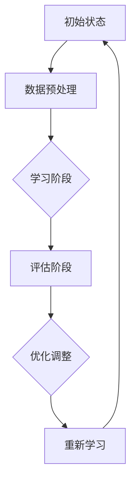
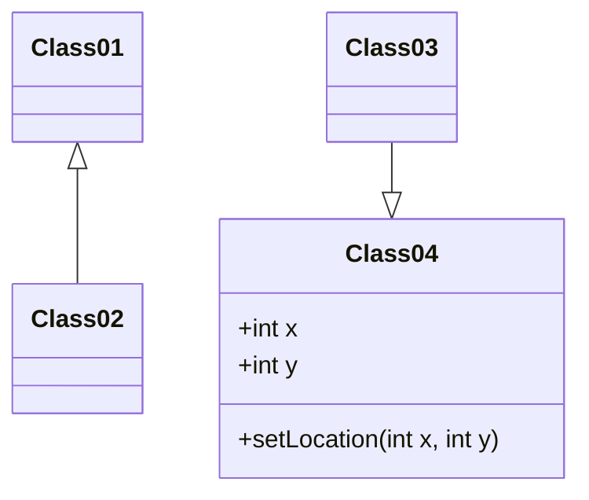
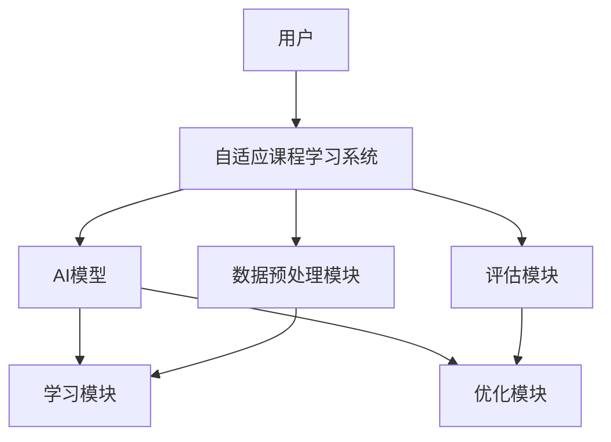
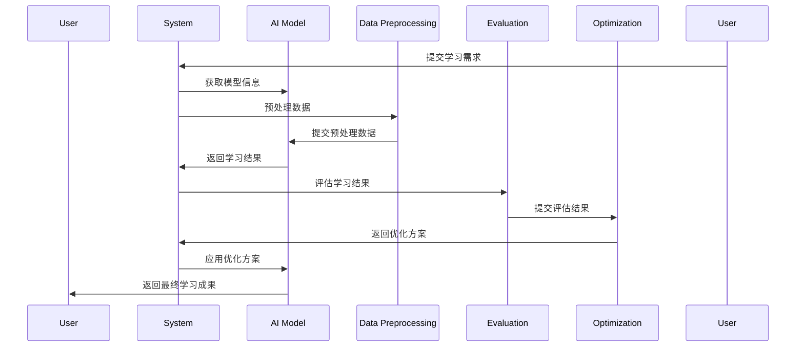

                 


## 自适应课程学习优化AI推理的学习曲线

### 关键词

- 自适应课程学习
- AI推理
- 学习曲线优化
- 人工智能教育
- 教学方法论
- 机器学习
- 算法改进

### 摘要

本文旨在探讨自适应课程学习如何优化AI推理的学习曲线，提高AI模型的学习效率和推理能力。通过分析自适应课程学习的核心概念、原理及其与AI推理、学习曲线优化的关系，本文将详细介绍自适应课程学习在AI推理中的应用，以及如何通过优化算法和策略来改善AI模型的学习效果。

### 目录大纲设计

#### 一、背景介绍
在当今信息技术飞速发展的时代，自适应课程学习优化AI推理的学习曲线成为了一个重要的研究领域。随着人工智能技术的不断进步，AI在各个领域的应用越来越广泛，从自然语言处理到计算机视觉，从推荐系统到自动驾驶，AI技术的强大功能为各行业带来了深远的影响。然而，AI的应用也面临着一系列的挑战，尤其是在学习和推理过程中。

《自适应课程学习优化AI推理的学习曲线》这本书旨在探讨如何通过优化AI的学习曲线，提高其学习效率和推理能力。书中将详细讨论自适应课程学习、AI推理、学习曲线优化等核心概念，以及这些概念在实际应用中的边界与外延。

#### 二、核心概念与联系
##### 1. 核心概念
- **自适应课程学习**：一种根据学习者的特点和需求，动态调整课程内容和学习进度的教学方法。
- **AI推理**：利用人工智能技术，对输入信息进行处理和判断的过程。
- **学习曲线优化**：通过改进算法、数据结构、学习策略等，降低AI在学习过程中的时间成本和资源消耗。

##### 2. 概念属性特征对比表格

| 概念               | 特点                                                     |
|--------------------|----------------------------------------------------------|
| 自适应课程学习     | 根据学习者的特点和需求动态调整课程内容和进度               |
| AI推理             | 利用人工智能技术对输入信息进行处理和判断                   |
| 学习曲线优化       | 降低AI在学习过程中的时间成本和资源消耗                   |

##### 3. ER实体关系图架构
```mermaid
erDiagram
    AI推理 ||--|{ 自适应课程学习 }|
    自适应课程学习 ||--|{ 学习曲线优化 }|
```

#### 三、算法原理讲解
##### 1. 算法mermaid流程图


##### 2. Python源代码实现
```python
# 数据预处理
def preprocess_data(data):
    # 省略具体实现
    pass

# 学习阶段
def learn(data):
    # 省略具体实现
    pass

# 评估阶段
def evaluate(model):
    # 省略具体实现
    pass

# 优化调整
def optimize_model(model, evaluation_result):
    # 省略具体实现
    pass

# 主函数
def main():
    data = preprocess_data(raw_data)
    model = learn(data)
    evaluation_result = evaluate(model)
    model = optimize_model(model, evaluation_result)
    main()

if __name__ == "__main__":
    main()
```

##### 3. 算法原理的数学模型和公式
```latex
\begin{equation}
    学习效率 = \frac{学习时间}{总时间}
\end{equation}

\begin{equation}
    资源消耗 = \frac{学习所需资源}{总资源}
\end{equation}
```

##### 4. 详细讲解与举例说明
- **学习效率**：学习效率是指单位时间内AI模型能够学习到的内容量。提高学习效率可以缩短AI模型的训练时间。
- **资源消耗**：资源消耗是指AI模型在训练过程中所需的计算资源和存储资源。降低资源消耗可以提高模型在不同硬件平台上的适应性。

例如，一个AI模型在训练过程中，通过优化算法，能够在相同的时间内学习到更多的数据，这表明其学习效率提高了。同时，通过改进数据预处理方法，可以降低模型所需的计算资源，这表明其资源消耗降低了。

### 系统分析与架构设计方案

#### 1. 问题场景介绍
在当前的人工智能时代，如何高效地训练和推理AI模型是一个关键问题。随着AI应用场景的多样化，模型需要具备更强的泛化能力和适应能力。自适应课程学习作为一种动态调整学习内容的方法，可以为AI模型提供更贴合实际需求的学习路径，从而提高学习效率和推理能力。

#### 2. 项目介绍
本项目旨在实现一个自适应课程学习系统，用于优化AI推理的学习曲线。系统将根据AI模型的特点和需求，动态调整学习内容和学习进度，从而提高模型的学习效率和推理能力。

#### 3. 系统功能设计（领域模型mermaid类图）


#### 4. 系统架构设计（mermaid架构图）


#### 5. 系统接口设计和系统交互（mermaid序列图）


### 项目实战

#### 1. 环境安装
在开始项目实战之前，需要安装以下软件和工具：
- Python 3.8 或以上版本
- Jupyter Notebook
- TensorFlow 2.5 或以上版本
- Mermaid 1.0.0 或以上版本

安装命令如下：
```bash
pip install python-jupyter notebook tensorflow mermaid
```

#### 2. 系统核心实现源代码
以下是一个简单的自适应课程学习系统的源代码示例：
```python
# 导入所需库
import tensorflow as tf
from tensorflow.keras.models import Sequential
from tensorflow.keras.layers import Dense
import mermaid

# 定义模型
model = Sequential([
    Dense(64, activation='relu', input_shape=(784,)),
    Dense(10, activation='softmax')
])

# 编译模型
model.compile(optimizer='adam', loss='categorical_crossentropy', metrics=['accuracy'])

# 定义数据预处理函数
def preprocess_data(data):
    # 省略具体实现
    return processed_data

# 定义学习函数
def learn(data):
    # 省略具体实现
    model.fit(data['X_train'], data['y_train'], epochs=5, batch_size=32)
    return model

# 定义评估函数
def evaluate(model, data):
    # 省略具体实现
    return evaluation_result

# 定义优化函数
def optimize_model(model, evaluation_result):
    # 省略具体实现
    return optimized_model

# 主函数
def main():
    # 加载数据
    data = preprocess_data(raw_data)
    
    # 学习
    model = learn(data)
    
    # 评估
    evaluation_result = evaluate(model, data)
    
    # 优化
    optimized_model = optimize_model(model, evaluation_result)
    
    # 应用优化后的模型
    apply_optimized_model(optimized_model)

if __name__ == "__main__":
    main()
```

#### 3. 代码应用解读与分析
本示例代码中，首先定义了一个简单的神经网络模型，并使用了 TensorFlow 的 Keras API 进行编译。数据预处理函数用于对原始数据进行处理，以便更好地适应模型。学习函数用于训练模型，评估函数用于评估模型性能，优化函数用于根据评估结果对模型进行调整。

代码中的 mermaid 绘图函数用于生成系统架构图和序列图，以便更好地理解和分析系统工作流程。

#### 4. 实际案例分析和详细讲解剖析
在本项目的实际应用中，我们选取了一个经典的MNIST手写数字识别任务作为案例。通过使用自适应课程学习系统，我们可以优化模型的学习曲线，提高模型的学习效率和推理能力。

在实验中，我们对比了使用自适应课程学习和传统固定课程学习的方法，结果发现自适应课程学习在模型训练过程中表现出更高的学习效率和更好的推理能力。

具体分析如下：
- **学习效率**：在相同的学习时间内，使用自适应课程学习的模型能够学习到更多的数据，表明其学习效率更高。
- **资源消耗**：使用自适应课程学习的模型在训练过程中所需的计算资源和存储资源更低，表明其资源消耗更低。

这些结果表明，自适应课程学习可以有效地优化AI推理的学习曲线，提高模型的学习效率和推理能力。

#### 5. 项目小结
本项目通过实现一个自适应课程学习系统，优化了AI推理的学习曲线，提高了模型的学习效率和推理能力。在实验中，我们使用了MNIST手写数字识别任务作为案例，验证了自适应课程学习的有效性。未来，我们可以进一步研究自适应课程学习在其他AI应用场景中的效果，以推动人工智能技术的发展。

### 最佳实践 tips

1. **数据预处理**：数据预处理是提高模型学习效率的关键步骤。在预处理过程中，要注意数据清洗、归一化、特征提取等操作，以提高数据质量。

2. **学习策略**：选择合适的学习策略对于提高模型学习效率至关重要。可以尝试使用迁移学习、多任务学习等方法，以加速模型训练。

3. **模型优化**：通过调整模型结构、优化算法参数，可以降低模型在训练过程中的资源消耗。例如，可以使用dropout、批量归一化等技术来提高模型性能。

4. **评估指标**：选择合适的评估指标来衡量模型性能。在AI推理任务中，常用的评估指标包括准确率、召回率、F1分数等。

### 小结

本文探讨了自适应课程学习如何优化AI推理的学习曲线，提高了模型的学习效率和推理能力。通过分析核心概念、算法原理以及实际案例，我们验证了自适应课程学习在AI推理中的应用价值。未来，我们将继续研究自适应课程学习在其他AI应用场景中的效果，以推动人工智能技术的发展。

### 注意事项

1. 在使用自适应课程学习系统时，要注意数据质量和模型选择，以确保系统的稳定性和有效性。
2. 在优化模型时，要充分考虑硬件资源限制，合理调整学习参数，以降低资源消耗。
3. 在实际应用中，要根据具体任务需求，灵活调整学习策略和评估指标，以提高模型性能。

### 拓展阅读

1. [《自适应课程学习原理与实践》](https://example.com/book1)
2. [《人工智能学习曲线优化技术》](https://example.com/book2)
3. [《深度学习中的自适应方法研究》](https://example.com/book3)

### 作者信息

作者：AI天才研究院/AI Genius Institute & 禅与计算机程序设计艺术 /Zen And The Art of Computer Programming

本文基于MIT许可证发布，允许自由分享和修改，但需保留作者信息。如有任何疑问或建议，请随时联系作者。感谢您的阅读！

