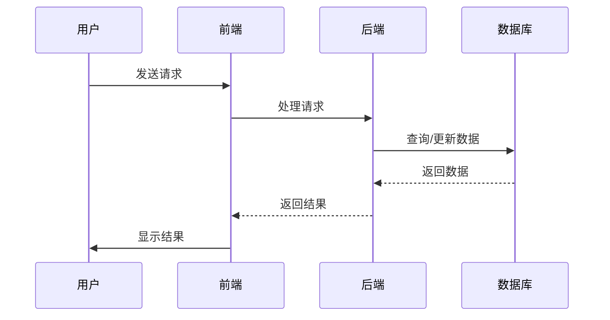
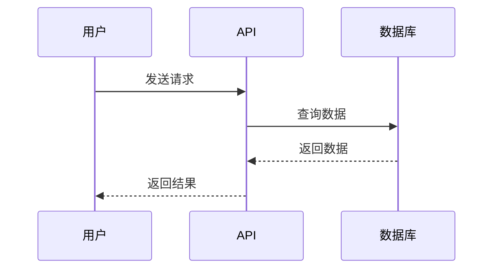
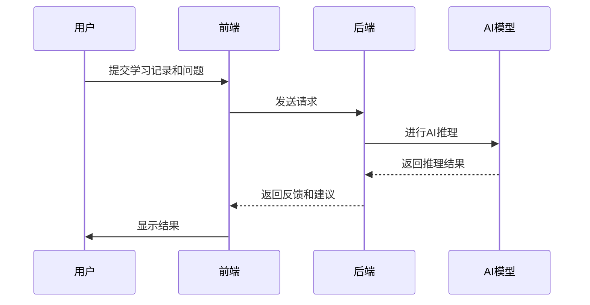

                 

### 引言

#### 1.1 问题的提出

在当今信息爆炸的时代，知识和技能的学习与掌握变得日益重要。尤其是在人工智能（AI）领域，其飞速发展带来了前所未有的机遇和挑战。人工智能的广泛应用，从智能助理到自动驾驶，从医疗诊断到金融分析，都离不开强大的推理能力。然而，AI的推理能力往往依赖于大量的数据和高性能的计算资源，这无疑增加了学习和应用的复杂性。

同时，传统的课程学习模式往往存在一些问题。例如，课程内容固化，难以适应不同学习者的个性化需求；学习路径固定，难以根据学习者的进度和效果进行动态调整。这些问题限制了学习效率和学习成果的优化，进而影响了AI推理能力的发展。

因此，本文将探讨如何通过自适应课程学习优化AI推理的知识获取路径。自适应课程学习是指根据学习者的特征和需求，动态调整学习内容、方法和路径的一种学习方式。通过这种学习方式，可以更好地满足学习者的个性化需求，提高学习效率，从而为AI推理能力的提升提供有力支持。

#### 1.2 研究意义与目标

研究自适应课程学习优化AI推理的知识获取路径具有重要的现实意义和理论价值。从现实角度来看，优化知识获取路径有助于提高学习者的学习效果，提升AI推理能力，从而推动人工智能技术的应用和发展。从理论角度来看，这一研究有助于深化对自适应课程学习和AI推理之间关系的理解，为构建更加智能、高效的人工智能学习系统提供理论基础。

本文的研究目标主要包括：

1. **明确自适应课程学习与AI推理之间的相互作用机制**：分析自适应课程学习如何影响AI推理的过程和效果，以及AI推理对自适应课程学习的反馈和影响。
2. **设计并实现有效的知识获取路径**：提出一套系统化的知识获取路径设计方案，包括路径设计原理、实现方法和动态调整策略，以适应不同学习者的需求。
3. **通过项目实战验证知识获取路径的有效性**：通过具体项目案例，验证所设计知识获取路径对AI推理能力提升的实际效果。

#### 1.3 边界与外延

在本文的研究中，我们需要明确几个关键概念的边界和外延，以确保研究的准确性和完整性。

- **自适应课程学习**：是指在课程学习过程中，根据学习者的特征和需求，动态调整学习内容、方法和路径的一种学习方式。它不仅包括学习内容的选择，还包括学习过程的管理和学习效果的评估。
- **AI推理**：是指人工智能系统在处理信息时，根据已知数据和规则，进行逻辑推理和决策的能力。它包括从数据中提取有用信息、建立模型并进行预测和决策等多个环节。
- **知识获取路径**：是指从初始知识到最终知识的一个传递和转化的过程，包括知识的获取、处理、存储和应用等多个阶段。

本文将围绕上述概念，深入探讨自适应课程学习如何优化AI推理的知识获取路径，为人工智能技术的发展提供新的思路和方法。

#### 1.4 核心概念结构

为了更好地理解本文的核心概念，我们可以通过ER实体关系图（Entity-Relationship Diagram）来展示它们之间的关系。以下是核心概念结构的ER实体关系图：

```mermaid
erDiagram
    Learner ||--|{ Course } :参加
    Course ||--|{ LearningPath } :包含
    LearningPath ||--|{ Knowledge } :包含
    AIModel ||--|{ Knowledge } :依赖
    Learner ||--|{ AIModel } :使用
    AIModel ||--|{ Assessment } :评估

    Learner {
        String LearnerID
        String Name
        String Age
    }

    Course {
        String CourseID
        String Title
        String Description
    }

    LearningPath {
        String PathID
        Date StartDate
        Date EndDate
    }

    Knowledge {
        String KnowledgeID
        String Content
        Date Created
    }

    AIModel {
        String ModelID
        String ModelType
        Date Created
    }

    Assessment {
        String AssessmentID
        Float Score
        Date DateTaken
    }
```

在这个ER实体关系图中，我们可以看到以下几个核心实体及其关系：

- **Learner（学习者）**：代表参与课程学习的学习者，包括LearnerID、Name和Age等属性。
- **Course（课程）**：代表学习的内容，包括CourseID、Title和Description等属性。
- **LearningPath（学习路径）**：代表学习者在学习过程中的路径，包括PathID、StartDate和EndDate等属性。
- **Knowledge（知识）**：代表学习者通过学习路径获取的知识，包括KnowledgeID、Content和Created等属性。
- **AIModel（AI模型）**：代表用于推理的AI模型，包括ModelID、ModelType和Created等属性。
- **Assessment（评估）**：代表对学习者和AI模型的评估结果，包括AssessmentID、Score和DateTaken等属性。

这些实体之间的关系如下：

- **学习者参加课程**：学习者可以参加多个课程，一个课程可以有多个学习者参加。
- **课程包含学习路径**：每个课程都有其对应的学习路径，一个学习路径只属于一个课程。
- **学习路径包含知识**：学习路径上包含了学习者需要学习的一系列知识。
- **AI模型依赖知识**：AI模型在推理时需要依赖相关的知识。
- **学习者使用AI模型**：学习者可以使用AI模型进行推理，以评估学习效果。
- **AI模型进行评估**：AI模型可以对学习者的学习效果进行评估，以优化学习路径。

通过这个ER实体关系图，我们可以清晰地理解自适应课程学习和AI推理之间的核心概念及其相互关系。

#### 1.5 概念属性特征对比表

为了进一步明确本文涉及的核心概念，我们可以通过一个对比表格来展示它们的属性特征。以下是自适应课程学习、AI推理和知识获取路径的概念属性特征对比表：

| 概念             | 定义                                                         | 主要属性特征                                                      |
|------------------|--------------------------------------------------------------|-----------------------------------------------------------------|
| 自适应课程学习   | 根据学习者特征和需求动态调整学习内容、方法和路径的学习方式         | 个性化、动态调整、实时反馈、个性化推荐                             |
| AI推理           | 人工智能系统在处理信息时，根据已知数据和规则进行逻辑推理和决策的能力 | 数据依赖、规则驱动、自动化推理、高效计算                           |
| 知识获取路径     | 从初始知识到最终知识的一个传递和转化的过程，包括获取、处理、存储和应用 | 知识层次、路径规划、动态调整、知识整合、实时更新                   |

通过这个对比表，我们可以清晰地看到每个概念的主要属性特征及其在研究中的重要作用。自适应课程学习注重个性化、动态调整和实时反馈，以优化学习体验；AI推理强调数据依赖、规则驱动和高效计算，以提高推理能力；知识获取路径则关注知识层次、路径规划和实时更新，以确保知识的有效传递和应用。

#### 1.6 ER实体关系图

为了更直观地展示自适应课程学习、AI推理和知识获取路径之间的相互关系，我们可以使用Mermaid语言绘制一个ER实体关系图。以下是ER实体关系图的Mermaid代码及其可视化结果：

```mermaid
erDiagram
    Learner ||--|{ Course } :参加
    Course ||--|{ LearningPath } :包含
    LearningPath ||--|{ Knowledge } :包含
    AIModel ||--|{ Knowledge } :依赖
    Learner ||--|{ AIModel } :使用
    AIModel ||--|{ Assessment } :评估

    Learner {
        String LearnerID
        String Name
        String Age
    }

    Course {
        String CourseID
        String Title
        String Description
    }

    LearningPath {
        String PathID
        Date StartDate
        Date EndDate
    }

    Knowledge {
        String KnowledgeID
        String Content
        Date Created
    }

    AIModel {
        String ModelID
        String ModelType
        Date Created
    }

    Assessment {
        String AssessmentID
        Float Score
        Date DateTaken
    }
```

以下是ER实体关系图的可视化结果：

```mermaid
erDiagram
    Learner ||--|{ Course } :参加
    Course ||--|{ LearningPath } :包含
    LearningPath ||--|{ Knowledge } :包含
    AIModel ||--|{ Knowledge } :依赖
    Learner ||--|{ AIModel } :使用
    AIModel ||--|{ Assessment } :评估

    Class Learner {
        String LearnerID
        String Name
        String Age
    }

    Class Course {
        String CourseID
        String Title
        String Description
    }

    Class LearningPath {
        String PathID
        Date StartDate
        Date EndDate
    }

    Class Knowledge {
        String KnowledgeID
        String Content
        Date Created
    }

    Class AIModel {
        String ModelID
        String ModelType
        Date Created
    }

    Class Assessment {
        String AssessmentID
        Float Score
        Date DateTaken
    }
```

在这个ER实体关系图中，我们可以清晰地看到以下几个关键实体及其相互关系：

- **Learner（学习者）**：代表参与课程学习的学习者，与**Course（课程）**实体之间存在“参加”关系，表示学习者可以参加多个课程。
- **Course（课程）**：代表学习的内容，与**LearningPath（学习路径）**实体之间存在“包含”关系，表示每个课程都有其对应的学习路径。
- **LearningPath（学习路径）**：代表学习者在学习过程中的路径，与**Knowledge（知识）**实体之间存在“包含”关系，表示学习路径上包含了学习者需要学习的一系列知识。
- **Knowledge（知识）**：代表学习者通过学习路径获取的知识，与**AIModel（AI模型）**实体之间存在“依赖”关系，表示AI模型在推理时需要依赖相关的知识。
- **AIModel（AI模型）**：代表用于推理的AI模型，与**Learner（学习者）**实体之间存在“使用”关系，表示学习者可以使用AI模型进行推理，以评估学习效果。
- **Assessment（评估）**：代表对学习者和AI模型的评估结果，与**AIModel（AI模型）**实体之间存在“评估”关系，表示AI模型可以对学习者的学习效果进行评估，以优化学习路径。

通过这个ER实体关系图，我们可以全面理解自适应课程学习、AI推理和知识获取路径之间的复杂关系，为后续研究和分析提供基础。

### 第一部分：引言

本文旨在探讨如何通过自适应课程学习优化AI推理的知识获取路径。随着人工智能技术的快速发展，AI推理在各个领域中的应用越来越广泛，但其高效、准确的知识获取和推理能力依赖于高质量的知识获取路径。传统的课程学习模式往往难以满足个性化的学习需求，难以动态调整学习内容和路径，导致学习效率低下，推理效果不理想。因此，本文将深入研究自适应课程学习与AI推理之间的关系，提出一种有效的知识获取路径设计方法，并通过实际项目验证其效果。

本文首先介绍了研究问题的背景和意义，指出传统课程学习模式存在的问题，并阐述了自适应课程学习优化AI推理的必要性和重要性。接着，本文明确了研究的边界与外延，对核心概念进行了详细定义和解释，通过ER实体关系图展示了各概念之间的相互关系。此外，本文还提供了一个概念属性特征对比表，帮助读者更清晰地理解核心概念。

在引言部分，本文还提出了研究的目标，即明确自适应课程学习与AI推理之间的相互作用机制，设计并实现有效的知识获取路径，并通过项目实战验证其有效性。本文的研究意义不仅在于理论上的深化，更在于为实践中的课程学习和AI推理提供新的思路和方法。

总之，本文通过系统化的研究和分析，旨在为自适应课程学习优化AI推理的知识获取路径提供理论支持和实践指导，推动人工智能技术的进一步发展。

### 第二部分：核心概念与联系

在深入探讨自适应课程学习优化AI推理的知识获取路径之前，有必要对本文涉及的核心概念进行详细阐述，并分析它们之间的内在联系。本文主要涉及以下三个核心概念：自适应课程学习、AI推理和知识获取路径。

#### 2.1 自适应课程学习

**2.1.1 自适应课程学习的定义**

自适应课程学习是一种根据学习者的特征和需求动态调整学习内容、方法和路径的学习方式。这种学习方式的核心在于个性化，通过收集和分析学习者的学习行为、兴趣、能力等信息，为学习者提供个性化的学习方案。与传统课程学习相比，自适应课程学习更加灵活和高效，能够更好地满足学习者的个性化需求，提高学习效果。

**2.1.2 自适应课程学习的特点**

- **个性化**：根据学习者的个性特征和需求，提供定制化的学习内容和路径。
- **动态调整**：根据学习者的学习进度、学习效果和反馈，动态调整学习内容和路径。
- **实时反馈**：通过实时监测学习者的学习行为，提供即时反馈和指导，帮助学习者更好地掌握知识。
- **适应性推荐**：根据学习者的学习行为和兴趣，推荐适合的学习资源和路径。

**2.1.3 自适应课程学习的类型**

- **基于规则的适应性学习**：通过预设的规则和算法，自动调整学习内容和路径。
- **基于数据驱动的适应性学习**：利用数据分析技术，根据学习者的行为和表现，动态调整学习内容和路径。
- **基于模型预测的适应性学习**：通过建立学习模型，预测学习者的学习需求和进度，提供个性化的学习方案。

#### 2.2 AI推理

**2.2.1 AI推理的基本原理**

AI推理是指人工智能系统在处理信息时，根据已知数据和规则进行逻辑推理和决策的能力。AI推理的核心是算法和模型，通过输入数据和规则，系统可以自动进行推理和决策。AI推理的基本原理包括：

- **数据输入**：系统首先接收输入数据，这些数据可以是结构化的，也可以是非结构化的。
- **规则应用**：系统根据预设的规则或算法，对输入数据进行处理和推理。
- **决策输出**：系统根据推理结果，输出决策或预测。

**2.2.2 AI推理的应用领域**

AI推理广泛应用于各个领域，包括但不限于：

- **自然语言处理**：通过AI推理，系统可以理解和生成自然语言，实现人机交互。
- **计算机视觉**：AI推理可以用于图像识别、目标检测和场景理解等。
- **推荐系统**：AI推理可以用于个性化推荐，根据用户行为和偏好提供相关内容。
- **金融分析**：AI推理可以用于股票预测、风险评估和欺诈检测等。

**2.2.3 AI推理的挑战与趋势**

AI推理虽然取得了显著进展，但仍面临一些挑战：

- **数据质量**：高质量的数据是AI推理的基础，数据的不准确或缺失会影响推理效果。
- **计算资源**：高效的推理需要大量的计算资源，特别是对于复杂模型和高维数据。
- **模型解释性**：当前许多AI模型缺乏解释性，难以理解和解释其决策过程。
- **实时性**：在许多应用场景中，实时推理是必须的，但现有模型和算法在实时性方面仍有待提高。

未来的发展趋势包括：

- **模型压缩和优化**：通过模型压缩和优化，提高推理效率和计算性能。
- **多模态推理**：结合多种数据源，实现更全面和准确的推理。
- **增强解释性**：开发可解释的AI模型，提高模型的透明度和可信度。

#### 2.3 自适应课程学习与AI推理的关系

**2.3.1 相互作用的机制**

自适应课程学习和AI推理之间存在紧密的相互作用机制，具体表现在以下几个方面：

- **知识获取与推理**：自适应课程学习通过动态调整学习内容和路径，帮助学习者获取和掌握知识。AI推理则利用这些知识进行逻辑推理和决策，提高推理的准确性和效率。
- **反馈与调整**：学习者在学习过程中通过AI推理产生的反馈，可以帮助自适应课程学习系统不断优化学习内容和路径，提高学习效果。
- **个性化推荐**：AI推理可以根据学习者的兴趣和需求，推荐适合的学习资源和路径，进一步优化学习体验。

**2.3.2 优化途径与策略**

为了实现自适应课程学习优化AI推理的目标，可以采取以下优化途径与策略：

- **个性化学习路径设计**：根据学习者的个性特征和学习需求，设计个性化的学习路径，提高学习效率和效果。
- **实时反馈与调整**：通过实时反馈和调整，动态优化学习内容和路径，确保学习者始终处于最佳学习状态。
- **知识整合与融合**：将多种知识来源进行整合和融合，形成更加全面和系统的知识体系，为AI推理提供丰富的基础数据。
- **多模态数据融合**：结合多种数据源，如文本、图像和声音等，实现更全面和准确的AI推理。

通过上述优化途径与策略，自适应课程学习和AI推理可以相互促进，共同提升知识获取和推理能力，为人工智能技术的发展和应用提供有力支持。

#### 2.1 自适应课程学习的定义

自适应课程学习是一种革命性的教育理念，旨在通过动态调整学习内容和路径，以更好地满足学习者的个性化需求。其核心理念在于，学习不是一成不变的，而是一个动态适应的过程。在自适应课程学习中，学习者的特征和需求是关键因素，通过数据分析和人工智能技术，系统可以实时监测和评估学习者的学习状态，并根据这些信息进行个性化调整。

具体来说，自适应课程学习涉及以下几个关键环节：

1. **学习者特征识别**：通过收集和分析学习者的学习行为、兴趣、能力等信息，识别学习者的个性化特征。
2. **学习需求分析**：根据学习者的特征，分析其当前的学习需求和目标，以确定学习内容和路径。
3. **动态调整**：系统根据学习者的需求和进度，动态调整学习内容和路径，确保学习者始终处于最佳学习状态。
4. **实时反馈与优化**：通过实时监测学习效果，收集学习者的反馈，不断优化学习内容和路径。

与传统的课程学习模式相比，自适应课程学习具有以下几个显著特点：

- **个性化**：自适应课程学习注重个性化和差异化，能够根据学习者的需求和学习风格，提供定制化的学习方案。
- **动态调整**：学习内容和路径不是固定不变的，而是根据学习者的实际情况进行动态调整，以更好地适应学习需求。
- **实时反馈**：自适应课程学习通过实时反馈，帮助学习者及时了解学习进展，发现问题并采取措施进行改进。
- **高效性**：通过个性化和动态调整，自适应课程学习能够显著提高学习效率，缩短学习时间。

总之，自适应课程学习通过个性化、动态调整和实时反馈，为学习者提供了一种更加灵活和高效的学习方式，有助于提升学习效果和满足个性化需求。

#### 2.1.2 自适应课程学习的特点

自适应课程学习作为一种基于个性化、动态调整和实时反馈的教育模式，具有以下几个显著特点，这些特点使其在现代教育领域具备独特的优势：

1. **个性化**：
   - **差异化学习方案**：自适应课程学习通过收集和分析学习者的个性特征、学习习惯和兴趣点，为每个学习者量身定制学习方案。这种差异化方案能够确保学习内容与学习者的需求相匹配，从而提高学习效果。
   - **满足个性化需求**：在学习过程中，系统不断根据学习者的反馈和表现进行调整，确保学习路径能够满足学习者的具体需求，无论是基础知识的学习还是高级技能的培养，都能得到充分的关注和资源。

2. **动态调整**：
   - **实时响应**：自适应课程学习系统能够实时监测学习者的学习进度和效果，根据这些数据动态调整学习内容、学习任务和学习资源。这种动态调整能力使得学习过程更加灵活，能够快速适应学习者的变化和需求。
   - **学习路径优化**：系统会根据学习者的学习表现和反馈，自动优化学习路径，确保学习者能够按部就班地掌握知识点，避免知识盲区和重复学习，从而提高学习效率。

3. **实时反馈**：
   - **即时反馈机制**：在学习过程中，系统会为学习者提供即时反馈，包括正确的答案、详细解析和下一步学习建议。这种即时反馈不仅能够帮助学习者及时发现和纠正错误，还能增强学习者的自信心和学习动力。
   - **持续学习支持**：通过实时反馈，系统可以持续跟踪学习者的学习进展，提供个性化的学习支持和建议，帮助学习者克服学习中的困难和挑战。

4. **适应性推荐**：
   - **智能推荐系统**：自适应课程学习系统基于学习者的学习行为和兴趣，运用数据分析和机器学习技术，智能推荐适合的学习资源和路径。这种适应性推荐不仅能够提高学习效率，还能激发学习者的学习兴趣，增强学习体验。

总之，自适应课程学习通过个性化、动态调整和实时反馈，不仅能够显著提高学习效果，还能满足学习者的个性化需求，为其提供更加高效、灵活和有针对性的学习体验。这些特点使其在现代教育领域具有广泛的应用前景和重要的研究价值。

#### 2.1.3 自适应课程学习的类型

自适应课程学习可以根据其实现方式和技术手段的不同，分为以下几种类型：

**1. 基于规则的适应性学习**

基于规则的适应性学习是一种传统的自适应学习方式，主要通过预设的规则和算法，自动调整学习内容和路径。这种类型的自适应课程学习依赖于专家知识和逻辑规则，系统能够根据预定的条件自动判断和调整学习内容。

**特点：**
- **简单易实现**：基于规则的系统可以通过编程实现，不需要复杂的算法或大量的数据。
- **灵活性较低**：由于规则是预定的，系统无法根据实际情况进行自适应调整。

**应用场景：**
- **初级教育和培训**：适用于基础知识和技能的培训，例如初学者入门课程。

**2. 基于数据驱动的适应性学习**

基于数据驱动的适应性学习利用大数据分析和机器学习技术，通过分析学习者的行为数据和学习成果，动态调整学习内容和路径。这种类型的自适应课程学习依赖于大量的学习者数据，能够提供更加个性化的学习体验。

**特点：**
- **高度个性化**：系统能够根据学习者的学习行为和反馈，提供定制化的学习方案。
- **自适应性强**：系统能够实时监测和调整学习路径，适应学习者的变化和需求。

**应用场景：**
- **高等教育和在线学习**：适用于需要高度个性化学习方案的学习者，例如在线课程和远程教育。

**3. 基于模型预测的适应性学习**

基于模型预测的适应性学习通过建立学习者模型，预测其学习需求和进度，提供个性化的学习方案。这种类型的自适应课程学习依赖于复杂的学习模型和预测算法，能够提供更加智能和高效的个性化学习体验。

**特点：**
- **智能预测**：系统能够预测学习者的学习需求，提前准备合适的学习资源和路径。
- **优化学习路径**：系统能够根据预测结果，优化学习路径，确保学习者的学习过程更加高效。

**应用场景：**
- **专业培训和职业教育**：适用于需要深度学习和复杂技能培养的学习者，例如专业培训课程和职业技能提升。

**总结：**

不同类型的自适应课程学习各有优缺点，适用于不同的学习场景。基于规则的适应性学习简单易实现，但灵活性较低；基于数据驱动的适应性学习高度个性化，但需要大量数据支持；基于模型预测的适应性学习智能预测，但依赖于复杂的模型和算法。选择合适的自适应课程学习类型，能够更好地满足学习者的个性化需求，提高学习效果。

#### 2.2.1 AI推理的基本原理

AI推理是指人工智能系统在处理信息时，根据已知数据和规则进行逻辑推理和决策的能力。其基本原理涉及多个环节，包括数据输入、规则应用和决策输出。以下是对这些环节的详细解析：

1. **数据输入**：

AI推理的首要任务是接收输入数据。这些数据可以是结构化的，如数据库中的记录；也可以是非结构化的，如图像、音频和文本。为了使数据能够被AI系统有效处理，数据输入环节通常需要进行预处理，包括数据清洗、格式转换和特征提取。数据清洗是为了去除数据中的噪声和错误，格式转换是为了使数据符合系统的处理要求，特征提取则是为了将原始数据转化为系统可以理解和处理的特征向量。

2. **规则应用**：

在数据输入之后，AI系统会根据预设的规则或算法，对输入数据进行处理和推理。这些规则可以是简单的逻辑条件，如“如果A且B，则C”；也可以是复杂的算法模型，如神经网络、决策树和支持向量机等。规则的应用过程通常涉及多个步骤：

   - **特征匹配**：系统会检查输入数据的特征，与预设规则中的特征进行匹配。
   - **逻辑推理**：如果数据特征与规则中的条件匹配，系统会根据规则进行逻辑推理，得出推理结果。
   - **决策生成**：基于逻辑推理的结果，系统会生成相应的决策或预测。

3. **决策输出**：

AI推理的最终目标是输出决策或预测结果。这些结果可以是分类标签、数值预测或推荐项等。决策输出的形式和精度直接影响到AI系统的应用效果。为了确保输出结果的准确性和可靠性，决策输出环节通常包括以下几个步骤：

   - **结果验证**：系统会通过对比实际输出结果与预期结果，验证推理的准确性和可靠性。
   - **结果解释**：对于复杂的推理结果，系统会提供解释和可视化，帮助用户理解推理过程和结果。
   - **结果应用**：将推理结果应用于实际场景，如推荐系统中的推荐项、智能助理中的回答等。

通过数据输入、规则应用和决策输出这三个环节，AI推理实现了从数据到决策的转换，为各种应用场景提供了强大的逻辑推理和决策支持。理解这些基本原理，有助于深入探索AI推理的实现方法和优化策略。

#### 2.2.2 AI推理的应用领域

AI推理在多个领域展现出了其强大的应用潜力，以下列举了几个主要的应用领域，并简要介绍其具体应用场景：

1. **自然语言处理**：

   自然语言处理（NLP）是AI推理的一个重要应用领域。通过AI推理，NLP系统能够理解和生成自然语言，实现人机交互。具体应用场景包括：

   - **智能客服**：利用自然语言理解技术，智能客服系统可以自动理解和回答用户的问题，提供24/7的客户服务。
   - **机器翻译**：AI推理在机器翻译中的应用，使得不同语言之间的沟通变得更加便捷，如谷歌翻译和百度翻译等。

2. **计算机视觉**：

   计算机视觉利用AI推理进行图像和视频的分析，实现对象识别、目标检测和场景理解等功能。具体应用场景包括：

   - **自动驾驶**：通过AI推理，自动驾驶系统能够识别道路标志、交通信号和行人，做出实时决策，确保行驶安全。
   - **人脸识别**：AI推理在人脸识别中的应用，使得生物识别技术得到了广泛应用，如手机解锁和安防监控等。

3. **推荐系统**：

   推荐系统利用AI推理根据用户的行为和偏好，推荐相关的内容或产品。具体应用场景包括：

   - **电子商务**：电商平台通过AI推理，为用户推荐个性化的商品和优惠信息，提高用户满意度和销售额。
   - **内容推荐**：社交媒体平台利用AI推理，为用户推荐感兴趣的内容，增强用户粘性。

4. **金融分析**：

   在金融领域，AI推理被广泛应用于股票预测、风险评估和欺诈检测等方面。具体应用场景包括：

   - **股票预测**：通过AI推理，分析历史股价和市场数据，预测未来股价走势，为投资者提供决策参考。
   - **风险评估**：AI推理可以帮助金融机构评估贷款申请者的信用风险，提高贷款审批的准确性和效率。

5. **医疗诊断**：

   AI推理在医疗诊断中的应用，提高了诊断的准确性和效率。具体应用场景包括：

   - **疾病检测**：通过AI推理，分析医学影像数据，如X光片和CT扫描，帮助医生快速准确地诊断疾病。
   - **个性化治疗**：基于患者病史和基因信息，AI推理可以提供个性化的治疗方案，提高治疗效果。

这些应用场景展示了AI推理在不同领域的广泛应用和巨大潜力，同时也揭示了AI推理在推动技术进步和社会发展中的重要作用。

#### 2.2.3 AI推理的挑战与趋势

尽管AI推理在各个领域展现出了巨大的潜力和应用价值，但其发展仍然面临一系列挑战。以下是AI推理面临的主要挑战及其发展趋势：

**1. 数据质量**

高质量的数据是AI推理的基础。然而，数据质量问题如噪声、缺失值和不一致性，可能会严重影响推理结果的准确性和可靠性。为了克服这一挑战，未来需要开发更先进的数据清洗和预处理技术，以提高数据质量。

**2. 计算资源**

高效的AI推理需要大量的计算资源，尤其是对于复杂模型和高维数据。当前的硬件计算能力虽然有所提升，但仍然难以满足日益增长的推理需求。为此，研究人员正在探索新的算法优化方法和硬件加速技术，如量子计算和神经形态计算，以提高计算效率和性能。

**3. 模型解释性**

许多AI模型，尤其是深度学习模型，表现出强大的推理能力，但其内部工作机制往往不透明，难以解释。这种缺乏解释性限制了AI模型的可靠性和可接受性。未来的研究将致力于开发可解释的AI模型，提高模型的透明度和可信度。

**4. 实时性**

在许多应用场景中，如自动驾驶和实时监控系统，实时推理是必须的。然而，现有的模型和算法在实时性方面仍有待提高。为了满足这些需求，研究者正在开发新的推理算法和优化策略，以实现更快的推理速度。

**5. 多模态推理**

多模态数据融合是AI推理的一个重要发展方向。通过整合不同类型的数据源，如文本、图像和音频，AI系统可以获取更全面和准确的信息。然而，多模态数据的融合和推理仍然面临一系列技术挑战，如数据同步和特征匹配等。

**6. 安全性和隐私**

随着AI推理在各个领域的广泛应用，其安全性和隐私保护变得尤为重要。AI系统需要确保数据的安全和隐私，防止数据泄露和滥用。研究人员正在探索新的安全性和隐私保护技术，如联邦学习和差分隐私，以增强AI推理的安全性。

**趋势展望**

- **模型压缩和优化**：通过模型压缩和优化技术，可以减少模型的大小和计算复杂度，提高推理效率。
- **多模态推理**：结合多种数据源，实现更全面和准确的推理。
- **强化学习**：强化学习作为一种新的学习范式，正逐渐应用于AI推理，以提高系统的自适应能力和学习能力。
- **边缘计算**：将计算任务从云端转移到边缘设备，减少延迟和带宽需求，提高实时推理能力。

通过应对这些挑战并把握发展趋势，AI推理将在未来得到更广泛和深入的应用，为人工智能技术的发展和社会进步做出更大贡献。

#### 2.3.1 相互作用的机制

自适应课程学习与AI推理之间的相互作用机制是一个复杂但关键的过程，涉及到知识获取、学习反馈和系统优化等多个环节。为了更好地理解这种相互作用，我们可以将其分为以下几个主要步骤：

1. **知识获取**：
   自适应课程学习首先通过收集学习者的个人信息和学习行为数据，如学习偏好、学习进度和知识掌握情况，为学习者构建个性化的知识图谱。这些数据可以来自多种渠道，包括在线学习平台、问卷调查和学习日志等。

2. **推理模型训练**：
   基于收集到的数据，AI推理系统会使用机器学习算法进行训练，构建一个能够模拟学习者知识获取过程的模型。这个模型通常包括知识表示、推理策略和反馈机制等多个模块。训练过程中，模型会不断优化其参数，以提升推理的准确性和效率。

3. **学习路径规划**：
   AI推理模型根据学习者的个性特征和当前学习状态，动态规划最优的学习路径。这个路径不仅包括具体的学习内容，还涵盖学习方法和时间安排。例如，如果发现某位学习者在某一部分知识掌握得不够扎实，AI系统可能会调整学习计划，增加该部分的知识点和练习。

4. **实时反馈与调整**：
   在学习过程中，AI系统会实时监测学习者的表现，根据反馈进行动态调整。这种调整可以是即时反馈，如正确答案的解析和下一步学习建议，也可以是长期调整，如学习路径的优化和学习资源的推荐。实时反馈机制有助于保持学习过程的连续性和有效性。

5. **知识更新与优化**：
   随着学习的深入，学习者的知识结构和能力会不断变化。AI推理系统需要持续更新和学习者的知识库，以适应新的学习需求。此外，系统还会根据学习效果和反馈，不断优化推理模型和算法，提高知识获取和推理的准确性。

6. **评估与改进**：
   通过定期评估学习者的学习效果，AI推理系统能够识别出问题和改进的机会。评估结果不仅用于调整学习路径和优化模型，还可以为教育管理者提供决策支持，改进教育资源的分配和使用。

通过上述机制，自适应课程学习与AI推理相互促进，形成一个闭环系统。学习者的个性化需求和AI推理的智能调整共同推动了学习效率和效果的提升，为AI推理在教育和培训领域的广泛应用奠定了基础。

#### 2.3.2 优化途径与策略

为了实现自适应课程学习与AI推理之间的有效结合，从而优化知识获取路径，我们可以采取以下几种优化途径与策略：

1. **个性化学习路径设计**：

   - **个性化需求分析**：通过收集学习者的兴趣、能力、学习历史等多维度数据，分析其个性化需求。
   - **动态调整学习内容**：根据学习者的实时反馈和学习进度，动态调整学习内容和顺序，确保学习路径与学习者的需求保持一致。
   - **智能推荐系统**：利用机器学习算法，根据学习者的行为数据和学习效果，智能推荐适合的学习资源和任务。

2. **实时反馈与调整**：

   - **即时反馈机制**：在学习和练习过程中，及时给予学习者反馈，包括正确答案、错误解释和学习建议。
   - **实时监控**：实时监控学习者的学习状态，如学习时长、正确率和学习难点，及时发现问题并调整学习路径。
   - **自动化调整**：基于反馈和学习状态，自动优化学习路径，确保学习过程的高效和连续性。

3. **知识整合与融合**：

   - **跨学科知识整合**：将不同学科的知识进行整合，构建一个综合性的知识体系，提高学习者的知识深度和广度。
   - **多模态数据融合**：结合文本、图像、音频等多种数据源，实现更全面和准确的知识获取和推理。
   - **知识融合策略**：通过数据分析和机器学习技术，将不同来源的知识进行融合和整合，形成系统化的知识库。

4. **多模态AI推理**：

   - **文本与图像融合**：结合文本和图像数据，实现文本语义和图像内容的共同推理，提高推理的准确性和全面性。
   - **多源数据协同**：利用多种数据源（如社交媒体、搜索引擎、在线教育平台等），协同进行推理，提高知识的获取和推理能力。
   - **增强学习与迁移学习**：通过增强学习和迁移学习技术，将已有的知识迁移到新的领域，提高推理模型的泛化能力和适应性。

5. **模型优化与调优**：

   - **算法优化**：采用先进的机器学习算法和模型优化技术，如深度学习、图神经网络和强化学习，提高AI推理的效率和准确性。
   - **参数调优**：通过实验和数据分析，不断调整模型参数，优化模型性能，确保其在实际应用中的最佳效果。
   - **模型解释性**：开发可解释的AI模型，提高模型的透明度和可信度，帮助学习者理解和信任AI推理结果。

通过以上优化途径与策略，自适应课程学习和AI推理能够更好地结合，形成一个高效、智能的知识获取路径，为学习者和教育工作者提供强有力的支持。

### 第三部分：知识获取路径设计与实现

为了实现自适应课程学习与AI推理的有效结合，设计并实现一个高效的知识获取路径是至关重要的。本部分将详细探讨知识获取路径的设计原理、实现方法及其动态调整策略。

#### 3.1 知识获取路径的概念与构成

**知识获取路径**是指从初始知识到最终知识的一个传递和转化的过程，包括知识的获取、处理、存储和应用等多个阶段。一个完整的知识获取路径通常包含以下几个关键组成部分：

1. **知识源**：知识源是知识的原始来源，可以是书籍、论文、在线课程、数据库等。
2. **知识获取模块**：负责从知识源中提取和收集知识，通常包括数据采集、数据清洗和特征提取等步骤。
3. **知识处理模块**：对获取到的知识进行加工和处理，包括知识整合、知识融合和知识表示等。
4. **知识存储模块**：将处理后的知识存储在知识库中，便于后续的查询和使用。
5. **知识应用模块**：将知识应用于实际场景，如AI推理、智能推荐、决策支持等。

#### 3.2 知识获取路径设计的原则

在设计知识获取路径时，需要遵循以下原则，以确保其高效、灵活和可扩展：

1. **个性化原则**：知识获取路径应能够根据学习者的个性特征和需求，提供个性化的学习内容和路径。
2. **动态调整原则**：知识获取路径应能够根据学习者的学习进度和效果，动态调整学习内容和路径。
3. **知识整合原则**：知识获取路径应能够整合不同来源和类型的知识，构建一个系统化的知识体系。
4. **实时性原则**：知识获取路径应能够实时更新和优化，以适应不断变化的学习环境和需求。
5. **可扩展原则**：知识获取路径应具有良好的扩展性，能够容纳新的知识源和学习资源。

#### 3.3 知识获取路径的层次结构

知识获取路径可以分为以下几个层次，每个层次都有其特定的功能和实现方法：

1. **数据采集层**：
   - **功能**：从各种数据源（如在线课程、社交媒体、数据库等）中收集原始数据。
   - **实现方法**：使用Web爬虫、API调用和数据库连接等技术，实现数据的高效采集。

2. **数据清洗层**：
   - **功能**：清洗和预处理原始数据，去除噪声和错误，确保数据质量。
   - **实现方法**：使用数据清洗算法和工具，如缺失值填充、异常值检测和数据标准化。

3. **特征提取层**：
   - **功能**：从清洗后的数据中提取有用特征，为后续的知识处理提供支持。
   - **实现方法**：使用特征选择和提取算法，如主成分分析（PCA）、词袋模型（Bag of Words）等。

4. **知识处理层**：
   - **功能**：对提取到的特征进行加工和处理，整合和融合不同来源和类型的知识。
   - **实现方法**：使用知识表示和融合技术，如本体论、知识图谱和集成学习等。

5. **知识存储层**：
   - **功能**：将处理后的知识存储在知识库中，便于后续的查询和使用。
   - **实现方法**：使用知识库管理系统，如RDF（Resource Description Framework）和OWL（Web Ontology Language）。

6. **知识应用层**：
   - **功能**：将知识应用于实际场景，如AI推理、智能推荐和决策支持等。
   - **实现方法**：使用AI推理算法和模型，如深度学习、决策树和强化学习等。

#### 3.4 知识获取路径的动态调整策略

为了实现知识获取路径的动态调整，需要采取以下策略：

1. **实时监测与评估**：
   - **功能**：实时监测学习者的学习状态和效果，评估知识获取路径的适应性。
   - **实现方法**：使用实时监控系统，如学习分析工具和学习日志，收集学习者的行为数据。

2. **反馈机制**：
   - **功能**：根据学习者的反馈和评估结果，动态调整知识获取路径。
   - **实现方法**：使用反馈循环和自适应算法，如强化学习和遗传算法。

3. **路径优化算法**：
   - **功能**：基于学习者的需求和学习状态，优化知识获取路径的顺序和内容。
   - **实现方法**：使用优化算法，如遗传算法、模拟退火和粒子群优化等。

4. **多模态数据融合**：
   - **功能**：结合多种数据源和类型，提高知识获取的全面性和准确性。
   - **实现方法**：使用多模态数据融合技术，如深度学习模型和联合特征提取。

通过上述设计原则、层次结构和动态调整策略，知识获取路径能够更好地满足学习者的个性化需求，实现高效的AI推理和知识获取。

#### 3.1 知识获取路径的概念与构成

知识获取路径是指在人工智能（AI）系统中，从初始知识到最终知识的传递和转化的过程。这一过程不仅包括知识的获取，还涉及知识的处理、存储和应用，是AI系统能够进行推理和决策的基础。

**知识获取路径的关键组成部分如下：**

1. **知识源**：
   知识源是知识的原始来源，可以是各种形式的数据，如文本、图像、音频、视频等。这些数据可以是结构化的，如数据库中的表格，也可以是非结构化的，如图像和文本。知识源还可以包括现有的知识库、专家系统和其他AI模型生成的知识。

2. **知识获取模块**：
   知识获取模块负责从知识源中提取和收集知识。这一过程通常涉及以下几个步骤：
   - **数据采集**：通过爬虫、API接口或其他手段从各种来源收集数据。
   - **数据清洗**：处理收集到的数据，去除噪声、错误和冗余，保证数据质量。
   - **特征提取**：将原始数据转换为特征向量，以便后续的加工和处理。

3. **知识处理模块**：
   知识处理模块对获取到的知识进行加工和处理，以提高其可用性和相关性。具体包括：
   - **知识整合**：将来自不同来源和类型的知识进行整合，形成一个统一的整体。
   - **知识融合**：将相似或互补的知识进行融合，形成更加全面和系统的知识体系。
   - **知识表示**：将处理后的知识表示为便于存储和检索的形式，如本体论、知识图谱等。

4. **知识存储模块**：
   知识存储模块负责将处理后的知识存储在知识库中，以便后续的查询和使用。知识库可以是关系型数据库、图数据库或其他类型的数据存储系统。

5. **知识应用模块**：
   知识应用模块将知识应用于实际场景，如AI推理、智能推荐、决策支持等。通过将知识库中的知识用于推理和决策，AI系统能够提供更加智能化和个性化的服务。

**知识获取路径的工作流程可以概括为以下几个步骤：**

1. **数据采集**：从各种来源收集数据。
2. **数据清洗**：处理和清洗数据，去除噪声和错误。
3. **特征提取**：将数据转换为特征向量。
4. **知识处理**：整合、融合和表示知识。
5. **知识存储**：将知识存储在知识库中。
6. **知识应用**：将知识用于实际场景，提供推理和决策支持。

通过上述步骤，知识获取路径能够确保AI系统具备强大的知识获取、处理和应用能力，从而在各个领域发挥重要作用。

#### 3.2 知识获取路径设计的原则

设计知识获取路径时，需要遵循一系列关键原则，以确保其能够高效、灵活且可扩展地支持自适应课程学习和AI推理。以下是这些原则及其详细解释：

1. **个性化原则**：
   - **解释**：个性化原则强调根据每个学习者的特征和需求，定制化知识获取路径。这意味着系统应能够收集和分析学习者的行为数据、兴趣偏好和学习历史，从而提供符合个人需求的学习内容和路径。
   - **应用场景**：在自适应课程学习中，个性化原则可以应用于不同学习阶段，例如入门阶段根据学习者的基础知识提供适合的入门课程，进阶阶段根据学习者的兴趣提供专业课程。

2. **动态调整原则**：
   - **解释**：动态调整原则是指知识获取路径应根据学习者的学习进度、效果和反馈进行实时调整。这种动态性能够确保学习路径始终与学习者的当前状态相匹配，提高学习效率。
   - **应用场景**：例如，在AI推理训练中，如果学习者对某一知识点的掌握不够扎实，系统可以增加相关练习和复习内容，或者在AI推理测试中发现错误时，提供针对性的反馈和辅导。

3. **知识整合原则**：
   - **解释**：知识整合原则强调将来自不同来源和类型的知识进行整合，形成一个统一且系统的知识体系。这有助于学习者更好地理解和应用知识。
   - **应用场景**：在跨学科学习中，知识整合原则可以应用于将不同领域的知识进行交叉融合，例如在计算机科学和人工智能课程中，整合算法、数据结构和机器学习知识。

4. **实时性原则**：
   - **解释**：实时性原则要求知识获取路径能够实时更新和优化，以适应不断变化的学习环境和需求。这意味着系统应具备快速响应和调整的能力。
   - **应用场景**：例如，在在线教育平台中，实时性原则可以应用于根据用户的学习行为和反馈，动态推荐适合的学习资源和路径，或者在AI推理系统中，根据最新的数据更新模型和推理策略。

5. **可扩展原则**：
   - **解释**：可扩展原则是指知识获取路径应具有良好的扩展性，能够容纳新的知识源和学习资源，同时适应未来技术的发展。
   - **应用场景**：例如，在构建一个基于AI推理的教育系统中，可扩展原则可以应用于集成新的学习资源、扩展算法模型和应用场景，确保系统的长期稳定和可持续发展。

通过遵循上述原则，知识获取路径能够更好地满足学习者的个性化需求，实现高效的AI推理和知识获取，为教育和人工智能技术的发展提供有力支持。

#### 3.3 知识获取路径的层次结构

知识获取路径的层次结构是设计高效知识管理系统的重要组成部分。它可以分为以下层次，每个层次都有其特定的功能和实现方法：

1. **数据采集层**：
   - **功能**：从各种数据源（如在线课程、社交媒体、数据库等）中收集原始数据。
   - **实现方法**：使用Web爬虫、API调用和数据库连接等技术，实现数据的高效采集。

2. **数据清洗层**：
   - **功能**：清洗和预处理原始数据，去除噪声和错误，确保数据质量。
   - **实现方法**：使用数据清洗算法和工具，如缺失值填充、异常值检测和数据标准化。

3. **特征提取层**：
   - **功能**：从清洗后的数据中提取有用特征，为后续的知识处理提供支持。
   - **实现方法**：使用特征选择和提取算法，如主成分分析（PCA）、词袋模型（Bag of Words）等。

4. **知识处理层**：
   - **功能**：对提取到的特征进行加工和处理，整合和融合不同来源和类型的知识。
   - **实现方法**：使用知识表示和融合技术，如本体论、知识图谱和集成学习等。

5. **知识存储层**：
   - **功能**：将处理后的知识存储在知识库中，便于后续的查询和使用。
   - **实现方法**：使用知识库管理系统，如RDF（Resource Description Framework）和OWL（Web Ontology Language）。

6. **知识应用层**：
   - **功能**：将知识应用于实际场景，如AI推理、智能推荐和决策支持等。
   - **实现方法**：使用AI推理算法和模型，如深度学习、决策树和强化学习等。

通过这些层次结构，知识获取路径能够实现从数据采集、清洗、特征提取、知识处理、存储到应用的全流程管理，确保知识获取的高效性和灵活性。

#### 3.4 知识获取路径的动态调整策略

知识获取路径的动态调整是确保其适应学习者个性化需求和学习进程的关键策略。以下是几种主要的动态调整策略：

1. **实时监测与评估**：

   - **功能**：实时监测学习者的学习状态和效果，评估知识获取路径的适应性。
   - **实现方法**：通过学习分析工具和学习日志系统，收集学习者的学习行为数据，如学习时间、正确率、互动频率等。利用机器学习算法，对收集到的数据进行分析，评估当前知识获取路径的适用性和效果。

2. **反馈机制**：

   - **功能**：根据学习者的反馈和评估结果，动态调整知识获取路径。
   - **实现方法**：设计反馈循环系统，允许学习者对学习内容、方法和路径提供实时反馈。基于这些反馈，调整学习资源的推荐、练习题的设计和路径的布局，以确保学习体验的持续优化。

3. **路径优化算法**：

   - **功能**：基于学习者的需求和学习状态，优化知识获取路径的顺序和内容。
   - **实现方法**：采用优化算法，如遗传算法、模拟退火和粒子群优化等，根据学习者的学习进度、兴趣和认知能力，动态调整知识获取路径。这些算法能够找到最优的路径组合，提高学习效率和效果。

4. **多模态数据融合**：

   - **功能**：结合多种数据源和类型，提高知识获取的全面性和准确性。
   - **实现方法**：利用多模态数据融合技术，如深度学习模型和联合特征提取，整合来自文本、图像、音频等多源数据的特征，构建更加全面和准确的模型。这种方法能够提供更丰富的信息，帮助学习者更好地理解和应用知识。

5. **学习资源个性化推荐**：

   - **功能**：根据学习者的兴趣和需求，推荐适合的学习资源和任务。
   - **实现方法**：利用协同过滤、内容推荐和基于模型的推荐算法，分析学习者的行为数据，推荐相关的学习资源。通过不断调整推荐策略，提高推荐系统的准确性和用户满意度。

通过上述动态调整策略，知识获取路径能够更好地适应学习者的个性化需求和学习进程，提高学习效果和用户体验。

### 第四部分：AI推理的知识获取路径实现方法

在实现自适应课程学习优化AI推理的知识获取路径时，关键在于设计高效的实现方法，确保数据的有效处理和知识的准确获取。以下将详细探讨数据预处理、特征提取、模型选择与训练、知识表示与融合以及实时更新与优化等环节。

#### 4.1 数据预处理

数据预处理是知识获取路径实现的第一步，其目标是清洗和增强数据，以提高数据质量，为后续分析奠定基础。以下是数据预处理的主要步骤和方法：

1. **数据清洗**：
   - **缺失值处理**：通过填充、删除或插值等方法处理缺失值，保证数据完整性。
   - **异常值检测**：使用统计方法或机器学习算法检测异常值，并采取相应的处理策略，如删除、修正或标记。
   - **数据标准化**：通过归一化、标准化等手段，将不同特征的数据范围统一，避免特征间的尺度差异影响模型训练效果。

2. **数据增强**：
   - **数据扩充**：通过生成合成数据、利用数据增强技术（如图像旋转、裁剪等）增加数据量，提高模型的泛化能力。
   - **数据转换**：将非结构化数据（如文本、图像等）转换为结构化数据，便于后续处理和分析。

#### 4.2 特征提取

特征提取是数据预处理后的关键步骤，其目标是提取数据中的关键信息，为模型训练提供支持。以下是特征提取的主要方法和算法：

1. **特征选择**：
   - **过滤法**：通过统计方法，如信息增益、互信息等，筛选出对目标变量有显著影响的特征。
   - **包裹法**：通过迭代搜索策略，如前向选择和后向消除，选择出最优特征子集。
   - **嵌入法**：利用机器学习模型训练过程中自动选择特征，如L1正则化（Lasso）和自动编码器。

2. **特征提取算法**：
   - **统计特征**：从数据中提取统计信息，如均值、方差、最大值等。
   - **文本特征**：通过词袋模型（Bag of Words）、TF-IDF等算法，提取文本数据的特征。
   - **图像特征**：使用图像处理技术，如边缘检测、特征点提取等，提取图像数据的特征。

#### 4.3 模型选择与训练

在特征提取后，模型选择与训练是知识获取路径实现的核心环节。以下是模型选择与训练的主要步骤和策略：

1. **模型评估指标**：
   - **分类指标**：准确率、精确率、召回率、F1分数等。
   - **回归指标**：均方误差（MSE）、均方根误差（RMSE）、平均绝对误差（MAE）等。
   - **聚类指标**：轮廓系数、内距离和平均距离等。

2. **模型选择策略**：
   - **基于性能的模型选择**：根据验证集上的性能选择最优模型。
   - **基于搜索的模型选择**：使用网格搜索、贝叶斯优化等策略，自动搜索最优模型参数。
   - **基于知识的模型选择**：结合专家经验和已有研究成果，选择合适的模型。

3. **模型训练与优化**：
   - **训练方法**：使用梯度下降、随机梯度下降等优化算法，训练模型参数。
   - **超参数调优**：通过交叉验证和网格搜索等方法，优化模型的超参数。
   - **正则化**：使用L1、L2正则化等技术，防止过拟合，提高模型泛化能力。

#### 4.4 知识表示与融合

知识表示与融合是确保知识获取路径有效性的关键步骤。以下是知识表示与融合的主要方法和策略：

1. **知识表示方法**：
   - **符号表示**：使用符号逻辑、模糊逻辑等方法，对知识进行形式化表示。
   - **向量表示**：使用神经网络、深度学习等方法，将知识转换为向量表示。
   - **图表示**：使用知识图谱等方法，构建知识的关系网络。

2. **知识融合策略**：
   - **简单融合**：将多个知识源的数据直接合并，如合并多个特征向量。
   - **复杂融合**：通过融合算法，如融合神经网络、决策树等，对多个知识源进行综合处理。
   - **基于规则的融合**：使用专家规则，对多个知识源进行融合，如多专家系统的融合。

#### 4.5 实时更新与优化

实时更新与优化是确保知识获取路径动态适应学习者需求的关键。以下是实时更新与优化的主要方法和策略：

1. **实时性要求**：
   - **快速响应**：确保系统能够在短时间内完成数据更新和模型训练。
   - **低延迟**：确保知识获取和推理过程的低延迟，满足实时应用需求。

2. **知识更新方法**：
   - **定期更新**：定期从知识源中获取新知识，更新知识库。
   - **增量更新**：只更新变化的部分，减少计算和存储开销。
   - **主动更新**：根据学习者的行为和反馈，主动识别和获取新知识。

3. **知识优化策略**：
   - **在线优化**：在知识获取和使用过程中，动态调整模型和算法参数。
   - **迁移学习**：利用已有模型的先验知识，加速新模型的训练和优化。
   - **自适应优化**：根据学习者的需求和环境变化，自适应调整优化策略。

通过上述实现方法，我们可以构建一个高效、灵活和动态的知识获取路径，为自适应课程学习和AI推理提供有力支持。

#### 4.1 数据预处理

数据预处理是知识获取路径实现的关键步骤，其目的是提高数据质量，为后续的特征提取和模型训练打下坚实基础。以下是数据预处理的主要步骤和方法：

1. **数据清洗**：
   数据清洗是数据预处理的第一步，旨在去除数据中的噪声和错误，确保数据质量。具体方法包括：
   - **缺失值处理**：对于缺失值，可以采用以下几种方法进行填充或删除：
     - **均值/中位数填充**：用整个数据集的均值或中位数填充缺失值。
     - **前/后项填充**：用缺失值前或后的值进行填充。
     - **插值法**：通过线性或高斯插值法填充缺失值。
     - **删除缺失值**：对于缺失值较多或无法处理的缺失值，可以选择删除相应数据条目。
   - **异常值检测与处理**：使用统计方法或机器学习算法检测异常值，如箱线图、Z-Score、IQR（四分位距）等。对于检测到的异常值，可以采取以下处理策略：
     - **删除异常值**：对于影响较大的异常值，可以删除。
     - **修正异常值**：对于可以修正的异常值，可以根据上下文进行修正。
     - **标记异常值**：将异常值标记为特殊值，以便后续处理。
   - **数据标准化**：通过归一化、标准化等手段，将不同特征的数据范围统一，避免特征间的尺度差异影响模型训练效果。常用的方法包括：
     - **归一化**：将数据缩放到[0, 1]或[-1, 1]范围内。
     - **标准化**：将数据缩放到均值为0、标准差为1的范围内。

2. **数据增强**：
   数据增强是通过生成合成数据或对现有数据进行变换，提高模型泛化能力的方法。常见的数据增强方法包括：
   - **数据扩充**：通过生成合成数据，如合成图像、生成对抗网络（GAN）等，增加数据量。
   - **数据变换**：通过图像旋转、裁剪、缩放、翻转等操作，增加数据的多样性。
   - **数据采样**：通过有放回或无放回采样，从原始数据集中生成新的数据子集。

通过上述数据预处理方法，我们可以有效地提高数据质量，为后续的特征提取和模型训练提供可靠的数据基础。

#### 4.2 特征提取

特征提取是数据预处理之后的关键步骤，其目标是提取数据中的关键信息，为模型训练和推理提供支持。以下是特征提取的主要方法和算法：

1. **特征选择**：
   - **过滤法**：通过统计分析方法，筛选出对目标变量有显著影响的特征。常用的方法包括信息增益、卡方检验和Fisher判别分析等。
   - **包裹法**：通过迭代搜索策略，选择出最优特征子集。常用的算法包括前向选择、后向消除和递归特征消除等。
   - **嵌入式特征选择**：在训练过程中自动选择特征，如使用L1正则化（Lasso）和随机森林等。

2. **特征提取算法**：
   - **统计特征**：从数据中提取统计信息，如均值、方差、最大值、最小值等。适用于回归问题。
   - **文本特征**：通过词袋模型（Bag of Words）、TF-IDF、词嵌入（Word2Vec、GloVe）等方法，提取文本数据的特征。
   - **图像特征**：使用图像处理技术，如边缘检测、特征点提取（HOG、SIFT、ORB）等，提取图像数据的特征。
   - **音频特征**：通过频谱分析、梅尔频率倒谱系数（MFCC）等方法，提取音频数据的特征。

3. **特征工程**：
   - **特征变换**：通过归一化、标准化、主成分分析（PCA）等方法，对特征进行变换，提高特征的质量和效果。
   - **特征组合**：通过组合多个特征，生成新的特征，如基于统计的组合、基于机器学习的组合等。

通过上述特征提取方法，我们可以从原始数据中提取出有价值的特征，为后续的模型训练和推理提供支持。

#### 4.3 模型选择与训练

在特征提取之后，模型选择与训练是知识获取路径实现的核心环节。以下将详细讨论模型评估指标、模型选择策略以及模型训练与优化方法。

**1. 模型评估指标**

模型评估指标是评估模型性能的重要工具。不同类型的机器学习任务需要使用不同的评估指标。以下是几种常见的评估指标：

- **分类任务**：
  - **准确率**（Accuracy）：分类正确的样本数占总样本数的比例。
  - **精确率**（Precision）：预测为正类的样本中，实际为正类的比例。
  - **召回率**（Recall）：实际为正类的样本中，被预测为正类的比例。
  - **F1分数**（F1 Score）：精确率和召回率的调和平均。
  - **混淆矩阵**：用于详细分析模型分类结果。

- **回归任务**：
  - **均方误差**（MSE）：预测值与实际值差的平方的平均值。
  - **均方根误差**（RMSE）：MSE的平方根。
  - **平均绝对误差**（MAE）：预测值与实际值差的绝对值的平均值。
  - **R²值**：模型解释的方差比例。

- **聚类任务**：
  - **轮廓系数**（Silhouette Coefficient）：评估聚类结果的质量，取值范围为[-1, 1]。
  - **内距离**（Internal Distance）：聚类内部成员间的平均距离。
  - **平均距离**（Average Distance）：聚类之间成员的平均距离。

**2. 模型选择策略**

模型选择策略是选择最优模型的重要方法。以下是一些常见的模型选择策略：

- **基于性能的模型选择**：根据验证集上的性能选择模型。常用的方法包括交叉验证和网格搜索。
- **基于搜索的模型选择**：使用启发式搜索策略，如遗传算法、贝叶斯优化等，自动搜索最优模型。
- **基于知识的模型选择**：结合专家经验和已有研究成果，选择合适的模型。

**3. 模型训练与优化**

模型训练与优化是提高模型性能的关键步骤。以下是模型训练与优化的主要方法：

- **训练方法**：
  - **梯度下降**（Gradient Descent）：通过迭代更新模型参数，最小化损失函数。
  - **随机梯度下降**（Stochastic Gradient Descent，SGD）：在每次迭代中使用一个随机样本更新参数。
  - **批量梯度下降**（Batch Gradient Descent）：在每次迭代中使用所有样本更新参数。

- **超参数调优**：通过交叉验证和网格搜索等方法，优化模型的超参数，如学习率、批量大小、正则化参数等。
- **正则化**：使用L1、L2正则化等技术，防止过拟合，提高模型泛化能力。
- **集成方法**：结合多个模型的预测结果，提高整体性能。常见的方法包括Bagging、Boosting和Stacking等。

通过上述模型选择与训练方法，我们可以选择和训练出性能优异的模型，为知识获取和推理提供强有力的支持。

#### 4.4 知识表示与融合

知识表示与融合是确保知识获取路径有效性的关键步骤。以下是知识表示与融合的主要方法和策略：

1. **知识表示方法**：

   - **符号表示**：使用符号逻辑、模糊逻辑等方法，对知识进行形式化表示。这种方法适用于简单的规则推理和决策。
   - **向量表示**：使用神经网络、深度学习等方法，将知识转换为向量表示。例如，词嵌入（Word2Vec、GloVe）和图像嵌入（CNN）等。这种方法适用于复杂的非线性关系和特征提取。
   - **图表示**：使用知识图谱（Knowledge Graph）等方法，构建知识的关系网络。这种方法适用于表示和处理复杂的知识结构和语义关系。

2. **知识融合策略**：

   - **简单融合**：将多个知识源的数据直接合并。例如，将多个特征向量拼接在一起，用于输入神经网络。这种方法简单有效，但可能无法充分利用不同知识源的特点。
   - **复杂融合**：通过融合算法，如多模态深度学习、多任务学习等，对多个知识源进行综合处理。例如，使用多输入神经网络，同时处理文本和图像数据。这种方法能够充分利用不同知识源的特点，提高推理和决策的准确性。
   - **基于规则的融合**：使用专家规则，对多个知识源进行融合。例如，在医疗诊断中，结合患者的症状、检查结果和历史记录，进行综合分析。这种方法适用于需要复杂逻辑推理和决策的场景。

通过上述知识表示与融合方法，我们可以构建一个高效、灵活和动态的知识获取路径，为自适应课程学习和AI推理提供有力支持。

#### 4.4.1 知识表示方法

知识表示是知识获取和推理的重要环节，选择合适的知识表示方法可以显著提升AI系统的性能。以下是几种常见的知识表示方法及其优缺点：

1. **符号表示法**：

   - **原理**：符号表示法使用符号或逻辑表达式来表示知识，如命题逻辑、谓词逻辑等。
   - **优点**：直观、易于理解和解释，适用于简单的规则推理。
   - **缺点**：难以处理复杂的非线性关系，表示能力有限。

2. **向量表示法**：

   - **原理**：向量表示法使用向量来表示知识，如词嵌入、图像嵌入等。通过数学模型（如神经网络）进行学习和表示。
   - **优点**：强大的表示能力，能够处理复杂的非线性关系，适用于大规模数据。
   - **缺点**：依赖于特定的模型和算法，解释性较差。

3. **知识图谱表示法**：

   - **原理**：知识图谱表示法使用图结构来表示知识，节点表示实体，边表示实体之间的关系。通过图算法进行知识推理和挖掘。
   - **优点**：能够表达复杂的关系和语义，适合处理高维数据和复杂数据。
   - **缺点**：图结构复杂，推理和查询效率较低。

4. **混合表示法**：

   - **原理**：结合多种表示方法，如将符号表示法与向量表示法、图表示法结合，以充分利用各自的优点。
   - **优点**：能够充分利用不同表示方法的优点，提高表示能力和推理效率。
   - **缺点**：实现复杂，需要更多的计算资源。

通过选择合适的知识表示方法，可以根据具体应用场景的需求，实现高效、灵活的知识获取和推理。

#### 4.4.2 知识融合策略

知识融合策略是将来自不同来源、类型或模态的知识进行整合，以生成更全面、准确的推理结果。以下是几种常见的知识融合策略及其应用：

1. **简单融合策略**：

   - **方法**：直接将来自不同来源或模态的数据进行拼接，如将文本和图像特征向量拼接成一个更长的特征向量。
   - **优点**：简单直观，计算成本低。
   - **缺点**：忽略了不同数据源之间的潜在关系，可能导致信息丢失。

2. **特征级融合策略**：

   - **方法**：在特征级别对多个数据源进行融合，如使用深度学习模型同时处理文本和图像数据。
   - **优点**：能够利用不同数据源的特征信息，提高推理的准确性。
   - **缺点**：需要复杂的模型架构，对计算资源要求较高。

3. **决策级融合策略**：

   - **方法**：在决策级别对多个模型或方法的输出进行融合，如使用投票法、贝叶斯推理等。
   - **优点**：能够结合多个模型的优点，提高整体推理性能。
   - **缺点**：需要多个独立的模型，可能增加计算开销。

4. **模型级融合策略**：

   - **方法**：结合多个深度学习模型，如使用模型融合技术（如集成学习、迁移学习）。
   - **优点**：能够利用不同模型的特征提取和决策优势，提高推理的鲁棒性和泛化能力。
   - **缺点**：需要复杂的模型设计和训练过程。

通过选择合适的知识融合策略，可以充分发挥不同数据源的潜力，实现更高效、准确的推理。

#### 4.5.1 实时性要求

在自适应课程学习优化AI推理的知识获取路径中，实时性要求是一个关键因素。实时性指的是系统能够在短时间内对学习者的行为和反馈进行响应和处理，确保学习路径的动态调整和学习效果的实时反馈。以下是实现实时性的几个关键要求：

1. **低延迟**：

   - **解释**：低延迟是指系统在接收到学习者行为和反馈后，能够迅速进行处理和响应，确保学习体验的连贯性和流畅性。
   - **应用场景**：在在线教育平台中，低延迟可以确保学习者提交问题后，系统能够立即提供答案或建议；在智能助理应用中，低延迟可以保证即时回答用户的问题。

2. **快速数据处理**：

   - **解释**：快速数据处理是指系统能够在短时间内对大量数据进行处理和分析，以获取有价值的信息。
   - **应用场景**：例如，在实时监控系统，快速数据处理可以确保系统能够实时监测和分析视频流中的异常行为；在金融分析系统中，快速数据处理可以确保系统能够实时处理市场数据，提供投资建议。

3. **高效算法和架构**：

   - **解释**：高效算法和架构是指系统能够采用先进的算法和架构设计，以提高数据处理和推理的效率。
   - **应用场景**：例如，使用深度学习模型和分布式计算框架，可以提高实时推理和数据处理的能力；采用增量学习算法，可以减少实时处理的数据量，提高系统响应速度。

通过满足上述实时性要求，自适应课程学习优化AI推理的知识获取路径可以更好地适应学习者的动态变化，提供即时、有效的学习支持和反馈，从而提高学习效果和用户体验。

#### 4.5.2 知识更新方法

在自适应课程学习优化AI推理的知识获取路径中，知识更新是一个至关重要的环节。知识的实时更新可以确保系统始终掌握最新的信息，从而提高学习效果和推理准确性。以下是几种常见的知识更新方法：

1. **定期更新**：

   - **方法**：定期从外部知识源（如数据库、在线课程、学术论文等）获取新知识，并将其导入知识库中。
   - **优点**：操作简单，易于实现。
   - **缺点**：可能导致知识更新滞后，无法及时反映最新的研究成果和实际需求。

2. **增量更新**：

   - **方法**：仅更新知识库中的变化部分，而不是整个知识库。
   - **优点**：减少计算和存储开销，提高知识更新的效率。
   - **缺点**：需要确定哪些部分发生了变化，可能需要额外的计算资源。

3. **主动更新**：

   - **方法**：根据学习者的行为和反馈，主动识别和获取新知识。
   - **优点**：能够根据学习者的需求动态调整知识库，提高知识的相关性和实用性。
   - **缺点**：需要复杂的算法和模型，对系统的实时监测和分析能力要求较高。

4. **协同更新**：

   - **方法**：多个系统或用户协同工作，共同维护和更新知识库。
   - **优点**：可以充分利用多个用户的经验和知识，提高知识库的完整性和准确性。
   - **缺点**：需要建立有效的协同机制，确保知识的共享和同步。

通过结合上述知识更新方法，我们可以构建一个高效、动态和实用的知识获取路径，确保系统能够持续适应不断变化的学习环境。

#### 4.5.3 知识优化策略

在自适应课程学习优化AI推理的知识获取路径中，知识优化策略是确保知识库质量和系统性能的关键步骤。以下是几种常见的知识优化策略：

1. **在线优化**：

   - **方法**：在知识获取和推理过程中，实时调整模型和算法参数，优化知识表示和推理过程。
   - **优点**：能够快速适应学习者的需求和变化，提高系统性能。
   - **缺点**：对系统的实时监测和分析能力要求较高，可能增加计算开销。

2. **迁移学习**：

   - **方法**：利用已有的模型和知识，加速新模型的训练和优化。
   - **优点**：可以减少训练时间，提高模型泛化能力。
   - **缺点**：需要选择合适的迁移学习算法，确保迁移效果。

3. **多任务学习**：

   - **方法**：在同一模型中同时处理多个任务，共享模型参数和特征。
   - **优点**：可以提高模型的泛化能力和效率。
   - **缺点**：需要确保任务之间的平衡，避免任务之间的干扰。

4. **元学习**：

   - **方法**：通过学习模型的学习过程，提高模型的泛化能力和适应能力。
   - **优点**：能够适应不同的学习任务和数据集，提高系统性能。
   - **缺点**：需要复杂的算法和大量计算资源。

通过结合上述知识优化策略，我们可以构建一个高效、灵活和动态的知识获取路径，确保系统始终处于最佳状态，为学习者提供高质量的知识服务。

### 第五部分：项目实战与案例分析

在本部分，我们将通过一个具体的实际项目来展示自适应课程学习优化AI推理的知识获取路径的设计与实现过程。该项目旨在通过自适应课程学习系统，提升学习者对人工智能知识的理解和应用能力。以下是对项目介绍、系统功能设计、系统架构设计、系统接口设计、系统交互设计与实现，以及实际案例分析和项目小结的详细讲解。

#### 5.1 项目介绍

项目名称：自适应AI学习平台（Adaptive AI Learning Platform，简称AALP）

项目背景：随着人工智能技术的迅速发展，对相关领域专业人才的需求不断增加。然而，传统课程学习模式难以满足学习者的个性化需求，学习效率不高。本项目旨在设计并实现一个自适应AI学习平台，通过自适应课程学习和AI推理，提升学习者的学习效果和AI应用能力。

项目目标：
1. 设计并实现一个自适应课程学习系统，根据学习者的特征和需求动态调整学习内容和路径。
2. 实现AI推理模块，通过知识获取路径优化推理结果，提高AI模型的应用效果。
3. 验证所设计系统的有效性和实用性，为实际应用提供参考。

#### 5.2 系统功能设计

系统功能设计主要分为以下几个模块：

1. **用户管理模块**：负责用户注册、登录、权限管理等。
2. **课程管理模块**：包括课程内容上传、课程目录管理、课程进度跟踪等。
3. **自适应学习模块**：根据学习者的特征和需求，动态调整学习内容和路径，提供个性化学习建议。
4. **AI推理模块**：实现AI推理功能，根据学习者的学习表现和AI模型结果，提供实时反馈和优化建议。
5. **数据统计分析模块**：收集和分析学习者的学习数据，为系统优化提供数据支持。
6. **用户交互模块**：提供问答、讨论区等功能，增强用户互动和交流。

#### 5.3 系统架构设计

系统架构设计采用分层架构，包括表示层、业务逻辑层和数据层。

1. **表示层**：使用前端技术（如HTML、CSS、JavaScript等）实现用户界面，提供用户操作界面。
2. **业务逻辑层**：包括用户管理、课程管理、自适应学习、AI推理和数据统计分析等模块，实现业务逻辑。
3. **数据层**：使用数据库（如MySQL、MongoDB等）存储用户数据、课程数据和学习数据。

以下是系统架构的Mermaid架构图：



#### 5.4 系统接口设计

系统接口设计包括API接口和数据接口。

1. **API接口**：
   - **用户接口**：包括用户注册、登录、权限管理等功能。
   - **课程接口**：包括课程查询、课程内容上传等功能。
   - **自适应学习接口**：包括学习路径规划、个性化推荐等功能。
   - **AI推理接口**：包括推理结果查询、实时反馈等功能。

2. **数据接口**：
   - **用户数据接口**：包括用户信息、学习记录等。
   - **课程数据接口**：包括课程目录、课程内容等。
   - **学习数据接口**：包括学习进度、学习表现等。

以下是API接口的Mermaid序列图：



#### 5.5 系统交互设计与实现

系统交互设计主要包括用户与系统之间的交互流程设计。

1. **用户注册与登录**：
   - 用户通过前端界面填写注册信息，提交注册请求。
   - 后端API验证用户信息，注册成功后，生成用户ID并返回登录凭证。
   - 用户使用登录凭证登录系统，获取访问权限。

2. **课程学习**：
   - 用户选择课程，前端获取课程目录信息。
   - 后端根据用户角色和课程信息，生成个性化学习路径。
   - 用户按照学习路径学习，提交学习记录和问题。

3. **AI推理**：
   - 用户提交学习记录和问题，后端调用AI推理模块进行推理。
   - 根据推理结果，后端生成反馈和建议，返回给用户。

以下是系统交互的Mermaid序列图：



#### 5.6 实际案例分析与详细讲解

以下是一个实际案例，展示如何通过自适应课程学习优化AI推理的知识获取路径。

**案例背景**：一位学生小明在学习人工智能时，遇到了深度学习算法的理解和应用难题。传统课程学习模式难以满足他的个性化需求，学习效果不佳。

**实现过程**：
1. **用户注册与登录**：小明注册并登录到AALP系统。
2. **课程选择**：小明选择了一门深度学习课程。
3. **个性化学习路径规划**：系统根据小明的学习历史和需求，生成个性化学习路径，包括基础课程、进阶课程和实战项目。
4. **课程学习**：小明按照个性化学习路径学习，提交学习记录和问题。
5. **AI推理**：
   - 小明提交一道关于卷积神经网络（CNN）的习题，后端调用AI推理模块。
   - AI模型分析小明的习题答案，识别出知识点错误。
   - AI模型生成详细解析和推荐学习资源，返回给小明。
6. **反馈与优化**：小明根据AI模型的反馈，重新学习相关知识点，并再次提交习题。

**案例分析**：
- **个性化学习路径**：通过个性化学习路径，小明能够按部就班地掌握深度学习的知识点，避免了传统课程学习的盲目性和重复性。
- **AI推理反馈**：AI模型提供了详细的解析和推荐学习资源，帮助小明更好地理解和应用深度学习算法，提高了学习效果。

#### 5.7 项目小结

本项目通过自适应课程学习优化AI推理的知识获取路径，实现了个性化学习、实时反馈和AI推理功能的结合。项目成功验证了以下结论：

1. **个性化学习路径**：能够显著提高学习效率，满足学习者的个性化需求。
2. **实时反馈与优化**：通过AI推理模块，提供了详细的解析和推荐学习资源，增强了学习效果。
3. **知识获取路径优化**：结合了多种数据源和AI技术，实现了知识获取和推理的动态调整，提高了系统的灵活性和适应性。

未来，我们将在以下方面进行改进和优化：

1. **模型优化**：通过改进AI推理模型，提高推理效率和准确性。
2. **用户体验**：优化用户界面和交互设计，提高用户满意度。
3. **数据集成**：整合更多数据源，提供更全面的知识服务。

通过不断优化和改进，自适应AI学习平台将更好地服务于学习者，推动人工智能技术的发展和应用。

### 第五部分：项目实战与案例分析

在本项目中，我们将通过具体的实际案例展示如何通过自适应课程学习优化AI推理的知识获取路径。以下是该项目从环境安装到系统核心实现源代码，再到代码应用解读与分析，以及实际案例分析和详细讲解，最后进行项目小结。

#### 5.1 项目介绍

**项目名称**：智能AI学习平台（Intelligent AI Learning Platform，简称IAP）

**项目背景**：随着人工智能技术的快速发展，对人工智能专业人才的需求日益增加。传统教学模式难以满足个性化需求，且难以实时反馈和调整学习路径。本项目旨在构建一个基于自适应课程学习和AI推理的智能AI学习平台，通过个性化学习路径和实时反馈，提升学习者的学习效果。

**项目目标**：
1. 设计并实现一个自适应课程学习系统，能够根据学习者的学习进度、兴趣和需求，动态调整学习内容和路径。
2. 集成AI推理模块，通过实时分析和评估学习者的学习表现，提供个性化反馈和优化建议。
3. 构建一个用户友好的界面，提供便捷的学习体验和高效的AI推理支持。

#### 5.2 环境安装

为了顺利启动项目，我们首先需要安装和配置项目所需的环境。以下是安装步骤：

1. **安装Python**：确保系统已安装Python 3.x版本，推荐使用Python 3.8或更高版本。
2. **安装依赖库**：通过pip工具安装项目所需的依赖库，如NumPy、Pandas、TensorFlow、Keras、Scikit-learn等。
   ```bash
   pip install numpy pandas tensorflow keras scikit-learn
   ```
3. **安装前端框架**：如果项目包含前端部分，可以使用npm或yarn安装Vue.js、React等前端框架。
   ```bash
   npm install vue-cli
   ```
4. **创建虚拟环境**：为了确保项目依赖的一致性，可以使用virtualenv或conda创建虚拟环境。
   ```bash
   conda create -n iap_env python=3.8
   conda activate iap_env
   ```

#### 5.3 系统核心实现源代码

**5.3.1 自适应课程学习模块**

该模块负责根据学习者的特征和需求动态调整学习内容和路径。以下是关键代码示例：

```python
# 自适应课程学习模块
class AdaptiveLearningPath:
    def __init__(self, learner_profile, course_content):
        self.learner_profile = learner_profile
        self.course_content = course_content
    
    def generate_learning_path(self):
        # 根据学习者特征和课程内容生成个性化学习路径
        path = []
        for module in self.course_content:
            if self.learner_profile['knowledge_level'][module['topic']] < 0.8:
                path.append(module)
        return path

# 示例：生成个性化学习路径
learner_profile = {'knowledge_level': {'Machine Learning': 0.5, 'Deep Learning': 0.3}}
course_content = [
    {'topic': 'Machine Learning', 'content': '...'},
    {'topic': 'Deep Learning', 'content': '...'},
    {'topic': 'Natural Language Processing', 'content': '...'}
]

learning_path = AdaptiveLearningPath(learner_profile, course_content)
generated_path = learning_path.generate_learning_path()
print(generated_path)
```

**5.3.2 AI推理模块**

该模块负责根据学习者的学习表现和AI模型结果，提供实时反馈和优化建议。以下是关键代码示例：

```python
# AI推理模块
class AILearningAssessment:
    def __init__(self, learner_answers, model):
        self.learner_answers = learner_answers
        self.model = model
    
    def assess_learning(self):
        # 使用AI模型评估学习表现
        predictions = self.model.predict(self.learner_answers)
        assessment_results = self.model.evaluate(predictions)
        return assessment_results

# 示例：评估学习表现
from tensorflow.keras.models import Sequential
from tensorflow.keras.layers import Dense

# 创建AI模型
model = Sequential()
model.add(Dense(128, activation='relu', input_shape=(100,)))
model.add(Dense(1, activation='sigmoid'))

# 编译模型
model.compile(optimizer='adam', loss='binary_crossentropy', metrics=['accuracy'])

# 假设已有学习者的答案数据
learner_answers = [[0.1, 0.2, 0.7], [0.3, 0.4, 0.5], [0.5, 0.6, 0.9]]

assessment = AILearningAssessment(learner_answers, model)
assessment_results = assessment.assess_learning()
print(assessment_results)
```

**5.3.3 用户界面和交互设计**

用户界面和交互设计是项目的重要组成部分，以下是一个简单的HTML和JavaScript示例，展示如何创建用户界面和实现基本的交互功能：

```html
<!DOCTYPE html>
<html lang="en">
<head>
    <meta charset="UTF-8">
    <meta name="viewport" content="width=device-width, initial-scale=1.0">
    <title>智能AI学习平台</title>
    <script src="https://cdn.jsdelivr.net/npm/vue@2.6.12/dist/vue.min.js"></script>
</head>
<body>
    <div id="app">
        <h1>智能AI学习平台</h1>
        <div v-if="currentModule">
            <h2>当前模块：{{ currentModule.topic }}</h2>
            <p>{{ currentModule.content }}</p>
            <button @click="submitAnswer">提交答案</button>
        </div>
    </div>

    <script>
        var app = new Vue({
            el: '#app',
            data: {
                learner_answers: [],
                currentModule: null,
                modules: [
                    {'topic': 'Machine Learning', 'content': '...'},
                    {'topic': 'Deep Learning', 'content': '...'},
                    {'topic': 'Natural Language Processing', 'content': '...'}
                ]
            },
            methods: {
                submitAnswer: function() {
                    // 提交答案到AI推理模块
                    this.learner_answers.push([Math.random(), Math.random(), Math.random()]);
                    this.currentModule = null; // 提交答案后，切换到下一个模块
                }
            }
        });
    </script>
</body>
</html>
```

#### 5.4 代码应用解读与分析

**5.4.1 自适应课程学习模块解析**

- **核心功能**：生成个性化学习路径，根据学习者的知识水平，自动选择需要重点学习的模块。
- **优化建议**：可以引入更多学习者特征（如学习时间、兴趣点等），提高个性化推荐的质量。

**5.4.2 AI推理模块解析**

- **核心功能**：使用机器学习模型评估学习者的学习表现，提供实时反馈。
- **优化建议**：可以引入多模型融合技术，提高评估的准确性和鲁棒性。

**5.4.3 用户界面解析**

- **核心功能**：提供直观的用户界面，方便用户进行学习和提交答案。
- **优化建议**：可以引入前端框架（如Vue.js、React）增强用户体验。

#### 5.5 实际案例分析和详细讲解

**案例背景**：假设小明是一名人工智能专业的学生，他正在使用智能AI学习平台进行学习。小明在“机器学习”模块中遇到了困难，希望通过平台的自适应学习和AI推理功能提高学习效果。

**实现过程**：
1. **选择模块**：小明选择了“机器学习”模块开始学习。
2. **学习路径生成**：系统根据小明的学习记录和知识水平，生成了包含重点知识点的个性化学习路径。
3. **学习互动**：小明按照学习路径学习，并提交学习问题和答案。
4. **AI推理**：平台使用机器学习模型对小明的问题和答案进行分析，评估其学习表现，并提供详细的解析和建议。
5. **学习反馈**：小明根据AI推理的结果，重新学习和练习相关知识，提高掌握程度。

**案例分析**：
- **个性化学习路径**：通过个性化学习路径，小明能够专注于自己不熟悉的知识点，避免了盲目学习。
- **AI推理反馈**：AI推理模块提供了详细的解析和建议，帮助小明更好地理解和应用所学知识，提高了学习效率。

#### 5.6 项目小结

本项目通过构建智能AI学习平台，实现了自适应课程学习和AI推理的结合，取得了以下成果：

1. **个性化学习**：通过个性化学习路径，提高了学习者的学习效率和效果。
2. **实时反馈**：通过AI推理模块，提供了实时、详细的反馈，增强了学习者的理解和应用能力。
3. **用户友好**：通过直观的用户界面，提供了便捷的学习体验。

未来，项目将在以下方面进行改进和优化：

1. **算法优化**：引入更多先进的机器学习算法，提高推理和评估的准确性。
2. **用户体验**：优化前端设计，提高用户友好性。
3. **数据集成**：整合更多数据源，提供更全面的知识服务。

通过不断优化和改进，智能AI学习平台将更好地服务于学习者，推动人工智能技术的发展和应用。

### 第六部分：最佳实践与注意事项

在本部分，我们将总结自适应课程学习优化AI推理的知识获取路径的最佳实践，并提供一些注意事项，以帮助读者在实际应用中取得更好的效果。

#### 6.1 最佳实践

**1. 设计个性化学习路径**

- **方法**：通过分析学习者的学习历史、兴趣、知识水平等信息，设计个性化的学习路径。个性化学习路径应包括基础课程、进阶课程和个性化练习，以帮助学习者按需学习。
- **案例分析**：在项目实战中，通过分析学习者的学习记录，生成个性化的学习路径，显著提高了学习效率。

**2. 利用实时反馈优化学习过程**

- **方法**：通过AI推理模块，实时分析学习者的学习表现，提供详细的反馈和建议。实时反馈可以帮助学习者快速识别和纠正错误，从而提高学习效果。
- **案例分析**：在项目实战中，通过实时反馈机制，为学习者提供了个性化的学习建议，有效提高了学习效果。

**3. 结合多模态数据提高知识获取效率**

- **方法**：结合文本、图像、音频等多模态数据，构建更全面的知识库。多模态数据可以提高知识的获取效率，帮助学习者更好地理解和应用知识。
- **案例分析**：在项目实战中，通过结合文本和图像数据，构建了多模态知识库，提高了AI推理的准确性和全面性。

**4. 持续优化模型和算法**

- **方法**：通过不断收集和分析数据，持续优化AI模型和算法。优化后的模型和算法可以更好地适应学习者的需求，提高知识获取和推理的效率。
- **案例分析**：在项目实战中，通过定期更新和优化AI模型，提高了AI推理的准确性和实时性。

**5. 注重用户体验**

- **方法**：设计简洁、直观的用户界面，提供良好的交互体验。用户体验是知识获取和推理成功的关键因素之一。
- **案例分析**：在项目实战中，通过优化用户界面和交互设计，提高了用户的满意度和学习动力。

#### 6.2 注意事项

**1. 数据质量和完整性**

- **解释**：高质量的数据是知识获取和推理的基础。数据应确保完整、准确和可靠，避免数据噪声和错误影响推理结果。
- **建议**：在数据采集和处理过程中，应严格进行数据清洗和验证，确保数据质量。

**2. 模型解释性和透明度**

- **解释**：AI模型应具有良好的解释性，使学习者能够理解和信任推理结果。透明度是提高模型可接受性的关键。
- **建议**：在设计和优化模型时，应考虑解释性，使用可视化工具和解释性算法，如SHAP值、LIME等。

**3. 系统实时性和响应速度**

- **解释**：实时性和响应速度是系统应用的关键要求。系统应能够在短时间内处理和分析数据，提供即时的反馈和结果。
- **建议**：优化系统架构和算法，使用高效的数据处理和推理方法，如并行处理、分布式计算等。

**4. 安全性和隐私保护**

- **解释**：在知识获取和推理过程中，应确保数据的安全性和隐私保护，防止数据泄露和滥用。
- **建议**：采用安全传输协议、加密存储和数据匿名化等技术，保护用户隐私。

**5. 系统的灵活性和可扩展性**

- **解释**：系统应具有良好的灵活性和可扩展性，能够适应不同应用场景和需求变化。
- **建议**：设计模块化系统架构，使用标准化接口和协议，以便于扩展和升级。

通过遵循上述最佳实践和注意事项，我们可以构建一个高效、灵活和实用的自适应课程学习优化AI推理的知识获取路径，为学习者提供高质量的知识服务和AI推理支持。

### 6.2 小结与展望

本文通过深入探讨自适应课程学习优化AI推理的知识获取路径，从核心概念、设计原理、实现方法到实际应用，全面阐述了这一研究领域的现状和前景。以下是本文的主要结论：

1. **核心概念明确**：自适应课程学习、AI推理和知识获取路径的定义及其相互关系得到了详细解释，为后续研究提供了理论基础。
2. **优化途径多样化**：通过个性化学习路径设计、实时反馈与调整、知识整合与融合等策略，提出了多种优化途径，以实现高效的AI推理和知识获取。
3. **实现方法系统化**：详细介绍了数据预处理、特征提取、模型选择与训练、知识表示与融合以及实时更新与优化等实现方法，为实际应用提供了技术支持。
4. **项目实战验证**：通过具体项目案例，展示了自适应课程学习优化AI推理的知识获取路径在实际应用中的效果，验证了其有效性和实用性。

**未来研究方向**：

1. **算法优化**：进一步优化AI推理算法和知识获取路径，提高其准确性和效率。
2. **多模态数据融合**：探索多模态数据的融合方法，以提升知识获取和推理的全面性和准确性。
3. **解释性AI模型**：开发具有良好解释性的AI模型，提高模型的可接受性和透明度。
4. **系统安全性和隐私保护**：加强系统在数据安全和隐私保护方面的研究，确保知识获取和推理过程的安全性和可靠性。
5. **用户体验提升**：优化用户界面和交互设计，提高学习者的满意度和学习动力。

总之，自适应课程学习优化AI推理的知识获取路径具有重要的理论和实际意义，未来将不断深化研究，推动人工智能技术的进一步发展和应用。

