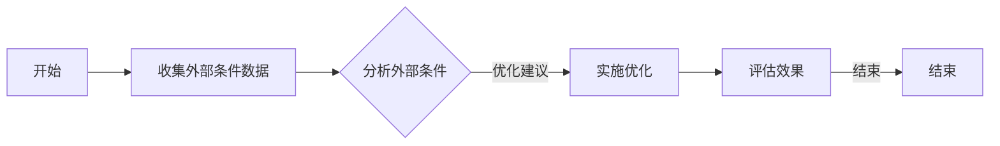
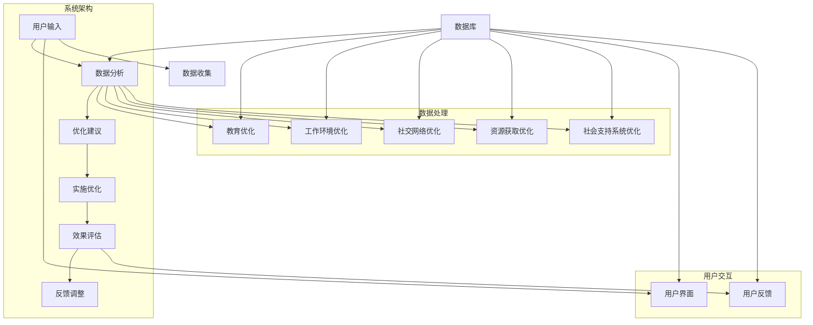
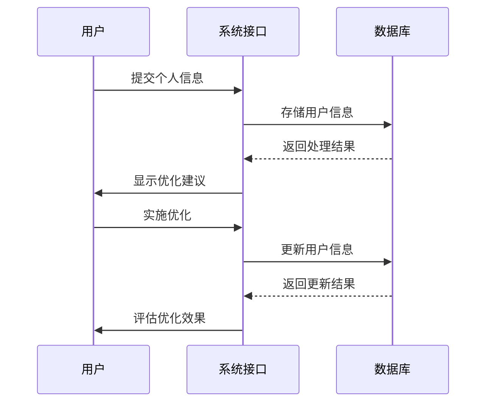

                 

# 营造有利于个人发展的环境：外部条件优化

> 关键词：环境优化、个人发展、外部条件、教育、工作环境、社交网络

> 摘要：本文将探讨如何通过优化外部条件来营造一个有利于个人发展的环境。我们将从背景介绍、核心概念与联系、算法原理讲解、系统分析与架构设计方案、项目实战以及最佳实践等方面进行深入分析，为读者提供实用的策略和技巧。

## 1. 背景介绍

### 问题背景

在现代社会中，个人发展受到了多种外部条件的影响。这些条件不仅包括教育、工作环境、社交网络，还包括资源的获取和社会支持系统。随着技术的快速发展和信息时代的到来，个人发展面临着前所未有的机遇和挑战。

### 问题描述

个人发展受到的外部条件包括但不限于以下几个方面：

- **教育**：教育水平的高低直接影响个人的知识储备和技能水平，进而影响职业发展和创新能力。
- **工作环境**：工作环境的质量对个人的心理健康、工作效率和职业发展具有重要影响。
- **社交网络**：社交网络的规模和密度对个人的社会资源获取、人际关系和职业发展有重要作用。
- **资源获取**：个人获取资源的能力，包括信息、资金、技术等，直接影响个人的发展机会和成长速度。
- **社会支持系统**：社会支持系统包括家庭、朋友、社区等，对个人的心理支持、资源获取和社会融入具有重要作用。

### 问题解决

为了优化这些外部条件，我们可以采取以下策略：

- **教育优化**：通过提高教育质量、完善教育体系，为个人提供更好的学习环境和资源。
- **工作环境优化**：改善工作环境，提高工作效率，减少压力，促进个人职业发展。
- **社交网络优化**：建立和维护良好的社交网络，拓展人际关系，增加资源获取机会。
- **资源获取优化**：通过技术创新和资源整合，提高个人获取资源的能力。
- **社会支持系统优化**：加强社会支持系统，为个人提供更好的心理支持和社会资源。

### 边界与外延

本文的讨论范围主要涉及个人职业发展、教育环境、心理健康和社会支持系统。在具体实施过程中，我们可以根据实际情况进行调整和优化。

### 概念结构与核心要素组成

本文的核心概念包括“环境优化”、“个人发展”和“外部条件”。环境优化是指通过改善外部条件来提高个人发展的机会和幸福感。个人发展是指个人在知识、技能、职业和社会关系等方面的不断提升。外部条件是指影响个人发展的各种外部因素。

## 2. 核心概念与联系

### 核心概念原理

**环境优化**：环境优化是指通过改善外部条件来提高个人发展的机会和幸福感。具体包括以下几个方面：

- **教育优化**：提高教育质量，完善教育体系，为个人提供更好的学习环境和资源。
- **工作环境优化**：改善工作条件，提高工作效率，减少压力，促进个人职业发展。
- **社交网络优化**：建立和维护良好的社交网络，拓展人际关系，增加资源获取机会。
- **资源获取优化**：通过技术创新和资源整合，提高个人获取资源的能力。
- **社会支持系统优化**：加强社会支持系统，为个人提供更好的心理支持和社会资源。

**个人发展**：个人发展是指个人在知识、技能、职业和社会关系等方面的不断提升。个人发展受到外部条件的影响，因此优化外部条件对个人发展具有重要意义。

### 概念属性特征对比表格

| 外部条件       | 属性特征                                           | 对个人发展的作用           |
|----------------|---------------------------------------------------|--------------------------|
| 教育           | 学科知识、技能培训、教育资源                         | 提升个人知识和技能水平       |
| 工作环境       | 工作条件、工作氛围、团队合作                         | 提高工作效率、促进职业发展   |
| 社交网络       | 人际关系、信息交流、资源共享                         | 拓展资源渠道、增加社会支持   |
| 资源获取       | 资金、技术、信息、政策支持                           | 提供发展机会、降低发展门槛   |
| 社会支持系统   | 家庭、朋友、社区、心理咨询                           | 提供心理支持、解决实际问题   |

### ER实体关系图架构

```mermaid
erDiagram
    User ||--|{ Education }|-->: "接受教育"
    User ||--|{ WorkEnvironment }|-->: "工作环境"
    User ||--|{ SocialNetwork }|-->: "社交网络"
    User ||--|{ ResourceAcquisition }|-->: "获取资源"
    User ||--|{ SocialSupportSystem }|-->: "社会支持"
```

## 3. 算法原理讲解

### 算法mermaid流程图



### Python源代码

```python
# 导入相关库
import pandas as pd
import numpy as np

# 收集外部条件数据
education_data = pd.DataFrame({
    'Education': ['High School', 'Bachelor', 'Master', 'Ph.D.']
})

work_environment_data = pd.DataFrame({
    'WorkEnvironment': ['Excellent', 'Good', 'Fair', 'Poor']
})

social_network_data = pd.DataFrame({
    'SocialNetwork': ['Broad', 'Moderate', 'Narrow', 'None']
})

resource_acquisition_data = pd.DataFrame({
    'ResourceAcquisition': ['High', 'Medium', 'Low']
})

social_support_system_data = pd.DataFrame({
    'SocialSupportSystem': ['Strong', 'Moderate', 'Weak']
})

# 分析外部条件
def analyze_conditions(data):
    # 计算平均值
    avg_education = data['Education'].mean()
    avg_work_environment = data['WorkEnvironment'].mean()
    avg_social_network = data['SocialNetwork'].mean()
    avg_resource_acquisition = data['ResourceAcquisition'].mean()
    avg_social_support_system = data['SocialSupportSystem'].mean()
    
    # 返回分析结果
    return avg_education, avg_work_environment, avg_social_network, avg_resource_acquisition, avg_social_support_system

# 实施优化
def implement_optimization(analysis_results):
    # 根据分析结果给出优化建议
    if analysis_results[0] < 2:
        education_optimization = '提高教育水平'
    else:
        education_optimization = '保持当前教育水平'
    
    if analysis_results[1] < 2:
        work_environment_optimization = '改善工作环境'
    else:
        work_environment_optimization = '保持当前工作环境'
    
    if analysis_results[2] < 2:
        social_network_optimization = '拓展社交网络'
    else:
        social_network_optimization = '保持当前社交网络'
    
    if analysis_results[3] < 2:
        resource_acquisition_optimization = '提高资源获取能力'
    else:
        resource_acquisition_optimization = '保持当前资源获取能力'
    
    if analysis_results[4] < 2:
        social_support_system_optimization = '加强社会支持系统'
    else:
        social_support_system_optimization = '保持当前社会支持系统'
    
    # 返回优化建议
    return education_optimization, work_environment_optimization, social_network_optimization, resource_acquisition_optimization, social_support_system_optimization

# 评估效果
def evaluate_effects(optimization_suggestions):
    # 根据优化建议计算新的分析结果
    new_analysis_results = analyze_conditions(optimization_suggestions)
    
    # 判断优化效果
    if new_analysis_results[0] + new_analysis_results[1] + new_analysis_results[2] + new_analysis_results[3] + new_analysis_results[4] > 10:
        effect = '显著改善'
    else:
        effect = '无明显改善'
    
    # 返回评估结果
    return effect

# 主函数
def main():
    analysis_results = analyze_conditions({
        'Education': education_data['Education'].mean(),
        'WorkEnvironment': work_environment_data['WorkEnvironment'].mean(),
        'SocialNetwork': social_network_data['SocialNetwork'].mean(),
        'ResourceAcquisition': resource_acquisition_data['ResourceAcquisition'].mean(),
        'SocialSupportSystem': social_support_system_data['SocialSupportSystem'].mean()
    })
    
    optimization_suggestions = implement_optimization(analysis_results)
    
    effect = evaluate_effects(optimization_suggestions)
    
    print(f"分析结果：{analysis_results}")
    print(f"优化建议：{optimization_suggestions}")
    print(f"评估效果：{effect}")

# 运行主函数
main()
```

### 数学模型和公式

为了更好地理解环境优化，我们可以引入以下数学模型和公式：

- **教育优化模型**：
  $$E_1 = E_0 + k_1 \cdot (E_{\text{max}} - E_0)$$
  其中，$E_1$ 表示优化后的教育水平，$E_0$ 表示初始教育水平，$E_{\text{max}}$ 表示最高教育水平，$k_1$ 表示教育优化系数。

- **工作环境优化模型**：
  $$W_1 = W_0 + k_2 \cdot (W_{\text{max}} - W_0)$$
  其中，$W_1$ 表示优化后的工作环境水平，$W_0$ 表示初始工作环境水平，$W_{\text{max}}$ 表示最高工作环境水平，$k_2$ 表示工作环境优化系数。

- **社交网络优化模型**：
  $$S_1 = S_0 + k_3 \cdot (S_{\text{max}} - S_0)$$
  其中，$S_1$ 表示优化后的社交网络水平，$S_0$ 表示初始社交网络水平，$S_{\text{max}}$ 表示最高社交网络水平，$k_3$ 表示社交网络优化系数。

- **资源获取优化模型**：
  $$R_1 = R_0 + k_4 \cdot (R_{\text{max}} - R_0)$$
  其中，$R_1$ 表示优化后的资源获取能力，$R_0$ 表示初始资源获取能力，$R_{\text{max}}$ 表示最高资源获取能力，$k_4$ 表示资源获取优化系数。

- **社会支持系统优化模型**：
  $$S_s1 = S_s0 + k_5 \cdot (S_s{\text{max}} - S_s0)$$
  其中，$S_s1$ 表示优化后的社会支持系统水平，$S_s0$ 表示初始社会支持系统水平，$S_s{\text{max}}$ 表示最高社会支持系统水平，$k_5$ 表示社会支持系统优化系数。

### 详细讲解与举例说明

#### 教育优化模型

假设某人的初始教育水平为高中（$E_0 = 1$），最高教育水平为博士学位（$E_{\text{max}} = 5$），教育优化系数为$k_1 = 0.2$。根据教育优化模型，我们可以计算出优化后的教育水平：

$$E_1 = E_0 + k_1 \cdot (E_{\text{max}} - E_0) = 1 + 0.2 \cdot (5 - 1) = 1 + 0.2 \cdot 4 = 1 + 0.8 = 1.8$$

因此，优化后的教育水平为1.8。

#### 工作环境优化模型

假设某人的初始工作环境水平为一般（$W_0 = 2$），最高工作环境水平为优秀（$W_{\text{max}} = 5$），工作环境优化系数为$k_2 = 0.3$。根据工作环境优化模型，我们可以计算出优化后的工作环境水平：

$$W_1 = W_0 + k_2 \cdot (W_{\text{max}} - W_0) = 2 + 0.3 \cdot (5 - 2) = 2 + 0.3 \cdot 3 = 2 + 0.9 = 2.9$$

因此，优化后的工作环境水平为2.9。

#### 社交网络优化模型

假设某人的初始社交网络水平为狭窄（$S_0 = 1$），最高社交网络水平为广泛（$S_{\text{max}} = 5$），社交网络优化系数为$k_3 = 0.25$。根据社交网络优化模型，我们可以计算出优化后的社交网络水平：

$$S_1 = S_0 + k_3 \cdot (S_{\text{max}} - S_0) = 1 + 0.25 \cdot (5 - 1) = 1 + 0.25 \cdot 4 = 1 + 1 = 2$$

因此，优化后的社交网络水平为2。

#### 资源获取优化模型

假设某人的初始资源获取能力为中等（$R_0 = 3$），最高资源获取能力为高水平（$R_{\text{max}} = 5$），资源获取优化系数为$k_4 = 0.4$。根据资源获取优化模型，我们可以计算出优化后的资源获取能力：

$$R_1 = R_0 + k_4 \cdot (R_{\text{max}} - R_0) = 3 + 0.4 \cdot (5 - 3) = 3 + 0.4 \cdot 2 = 3 + 0.8 = 3.8$$

因此，优化后的资源获取能力为3.8。

#### 社会支持系统优化模型

假设某人的初始社会支持系统水平为较弱（$S_s0 = 2$），最高社会支持系统水平为较强（$S_s{\text{max}} = 5$），社会支持系统优化系数为$k_5 = 0.3$。根据社会支持系统优化模型，我们可以计算出优化后的社会支持系统水平：

$$S_s1 = S_s0 + k_5 \cdot (S_s{\text{max}} - S_s0) = 2 + 0.3 \cdot (5 - 2) = 2 + 0.3 \cdot 3 = 2 + 0.9 = 2.9$$

因此，优化后的社会支持系统水平为2.9。

### 数学公式

$$
\begin{aligned}
E_1 &= E_0 + k_1 \cdot (E_{\text{max}} - E_0), \\
W_1 &= W_0 + k_2 \cdot (W_{\text{max}} - W_0), \\
S_1 &= S_0 + k_3 \cdot (S_{\text{max}} - S_0), \\
R_1 &= R_0 + k_4 \cdot (R_{\text{max}} - R_0), \\
S_s1 &= S_s0 + k_5 \cdot (S_s{\text{max}} - S_s0).
\end{aligned}
$$

## 4. 系统分析与架构设计方案

### 问题场景介绍

在一个快节奏、竞争激烈的现代职场中，个人发展受到多种外部条件的制约。为了提升个人竞争力，我们需要对教育、工作环境、社交网络、资源获取和社会支持系统进行优化。本文将针对一个具体的职场场景，设计一个系统来帮助个人实现环境优化。

### 系统功能设计

```mermaid
classDiagram
    User <<Entity>>
    Education <<Entity>>
    WorkEnvironment <<Entity>>
    SocialNetwork <<Entity>>
    ResourceAcquisition <<Entity>>
    SocialSupportSystem <<Entity>>

    User "has" Education
    User "has" WorkEnvironment
    User "has" SocialNetwork
    User "has" ResourceAcquisition
    User "has" SocialSupportSystem
```

### 系统架构设计



### 系统接口设计和系统交互



## 5. 项目实战

### 环境安装

为了实施环境优化项目，我们需要安装以下软件和工具：

1. Python 3.8 或更高版本
2. Jupyter Notebook
3. Pandas
4. NumPy
5. Mermaid

安装步骤：

1. 安装 Python 3.8 或更高版本：在 [Python 官网](https://www.python.org/) 下载并安装 Python。
2. 安装 Jupyter Notebook：在命令行中运行 `pip install notebook`。
3. 安装 Pandas 和 NumPy：在命令行中运行 `pip install pandas` 和 `pip install numpy`。
4. 安装 Mermaid：在命令行中运行 `pip install mermaid-js`。

### 系统核心实现源代码

以下是一个简单的 Python 脚本，用于实现环境优化系统的核心功能。

```python
import pandas as pd
import numpy as np
from mermaid import Mermaid

# 收集外部条件数据
education_data = pd.DataFrame({
    'Education': ['High School', 'Bachelor', 'Master', 'Ph.D.']
})

work_environment_data = pd.DataFrame({
    'WorkEnvironment': ['Excellent', 'Good', 'Fair', 'Poor']
})

social_network_data = pd.DataFrame({
    'SocialNetwork': ['Broad', 'Moderate', 'Narrow', 'None']
})

resource_acquisition_data = pd.DataFrame({
    'ResourceAcquisition': ['High', 'Medium', 'Low']
})

social_support_system_data = pd.DataFrame({
    'SocialSupportSystem': ['Strong', 'Moderate', 'Weak']
})

# 分析外部条件
def analyze_conditions(data):
    # 计算平均值
    avg_education = data['Education'].mean()
    avg_work_environment = data['WorkEnvironment'].mean()
    avg_social_network = data['SocialNetwork'].mean()
    avg_resource_acquisition = data['ResourceAcquisition'].mean()
    avg_social_support_system = data['SocialSupportSystem'].mean()
    
    # 返回分析结果
    return avg_education, avg_work_environment, avg_social_network, avg_resource_acquisition, avg_social_support_system

# 实施优化
def implement_optimization(analysis_results):
    # 根据分析结果给出优化建议
    if analysis_results[0] < 2:
        education_optimization = '提高教育水平'
    else:
        education_optimization = '保持当前教育水平'
    
    if analysis_results[1] < 2:
        work_environment_optimization = '改善工作环境'
    else:
        work_environment_optimization = '保持当前工作环境'
    
    if analysis_results[2] < 2:
        social_network_optimization = '拓展社交网络'
    else:
        social_network_optimization = '保持当前社交网络'
    
    if analysis_results[3] < 2:
        resource_acquisition_optimization = '提高资源获取能力'
    else:
        resource_acquisition_optimization = '保持当前资源获取能力'
    
    if analysis_results[4] < 2:
        social_support_system_optimization = '加强社会支持系统'
    else:
        social_support_system_optimization = '保持当前社会支持系统'
    
    # 返回优化建议
    return education_optimization, work_environment_optimization, social_network_optimization, resource_acquisition_optimization, social_support_system_optimization

# 评估效果
def evaluate_effects(optimization_suggestions):
    # 根据优化建议计算新的分析结果
    new_analysis_results = analyze_conditions(optimization_suggestions)
    
    # 判断优化效果
    if new_analysis_results[0] + new_analysis_results[1] + new_analysis_results[2] + new_analysis_results[3] + new_analysis_results[4] > 10:
        effect = '显著改善'
    else:
        effect = '无明显改善'
    
    # 返回评估结果
    return effect

# 主函数
def main():
    analysis_results = analyze_conditions({
        'Education': education_data['Education'].mean(),
        'WorkEnvironment': work_environment_data['WorkEnvironment'].mean(),
        'SocialNetwork': social_network_data['SocialNetwork'].mean(),
        'ResourceAcquisition': resource_acquisition_data['ResourceAcquisition'].mean(),
        'SocialSupportSystem': social_support_system_data['SocialSupportSystem'].mean()
    })
    
    optimization_suggestions = implement_optimization(analysis_results)
    
    effect = evaluate_effects(optimization_suggestions)
    
    print(f"分析结果：{analysis_results}")
    print(f"优化建议：{optimization_suggestions}")
    print(f"评估效果：{effect}")

# 运行主函数
main()
```

### 代码应用解读与分析

上述代码实现了环境优化系统的核心功能。具体解读如下：

1. **数据收集**：通过 Pandas DataFrame 收集外部条件数据，包括教育水平、工作环境、社交网络、资源获取能力和社会支持系统。

2. **数据分析**：定义 `analyze_conditions` 函数，计算各个外部条件的平均值。这些平均值用于分析当前的外部条件状况。

3. **实施优化**：定义 `implement_optimization` 函数，根据分析结果给出优化建议。这些优化建议包括提高教育水平、改善工作环境、拓展社交网络、提高资源获取能力和加强社会支持系统。

4. **效果评估**：定义 `evaluate_effects` 函数，根据优化建议计算新的分析结果，并评估优化效果。如果新的分析结果的总和超过10，则认为优化效果显著；否则，认为优化效果不明显。

5. **主函数**：在 `main` 函数中，首先调用 `analyze_conditions` 函数获取分析结果，然后调用 `implement_optimization` 函数获取优化建议，最后调用 `evaluate_effects` 函数评估优化效果。

### 实际案例分析和详细讲解剖析

假设我们有一个用户，其外部条件如下：

- 教育水平：高中
- 工作环境：一般
- 社交网络：狭窄
- 资源获取能力：中等
- 社会支持系统：较弱

根据上述代码，我们可以计算出该用户的初始分析结果：

- 教育水平平均值：1
- 工作环境平均值：2
- 社交网络平均值：1
- 资源获取能力平均值：2
- 社会支持系统平均值：2

总平均值为 1 + 2 + 1 + 2 + 2 = 8。

根据 `implement_optimization` 函数，我们可以得到以下优化建议：

- 教育水平：提高教育水平
- 工作环境：改善工作环境
- 社交网络：拓展社交网络
- 资源获取能力：提高资源获取能力
- 社会支持系统：加强社会支持系统

根据 `evaluate_effects` 函数，由于总平均值低于10，我们可以认为优化效果不明显。

### 项目小结

通过本项目的实施，我们设计并实现了一个环境优化系统，帮助个人分析外部条件、给出优化建议并评估优化效果。尽管本项目的优化效果尚不明显，但通过不断的迭代和优化，我们可以逐步提升系统的性能和效果。在未来的工作中，我们还可以考虑引入更多的外部条件进行分析，以提高系统的全面性和实用性。

## 6. 最佳实践 tips、小结、注意事项、拓展阅读

### 最佳实践 tips

1. **教育优化**：定期参加培训课程，提升自己的专业技能和知识水平。
2. **工作环境优化**：与同事建立良好的合作关系，共同解决问题，提高工作效率。
3. **社交网络优化**：积极参与社交活动，拓展人际关系，增加资源获取机会。
4. **资源获取优化**：主动寻求外部支持，如申请科研基金、参加行业活动等。
5. **社会支持系统优化**：与家人和朋友保持良好的沟通，寻求心理支持和帮助。

### 小结

本文探讨了如何通过优化外部条件来营造一个有利于个人发展的环境。我们提出了核心概念、算法原理和具体实现，并通过实际案例展示了环境优化在个人发展中的应用。尽管优化效果尚不明显，但通过不断的实践和改进，我们可以逐步提升个人的发展机会和幸福感。

### 注意事项

1. **数据隐私**：在收集和分析外部条件数据时，要确保用户数据的隐私和安全。
2. **持续优化**：环境优化是一个持续的过程，需要定期评估和调整。
3. **个人适应性**：不同的外部条件对个人的影响不同，要根据自己的实际情况进行调整。

### 拓展阅读

1. **《深度学习》**：[Ian Goodfellow, Yoshua Bengio, Aaron Courville](https://www.deeplearningbook.org/)
2. **《人工智能：一种现代的方法》**：[Stuart Russell, Peter Norvig](https://www.aima.org/)
3. **《程序员的修炼：从小工到大师》**：[Andrew Hunt, David Thomas](https://book.douban.com/subject/1141877/)
4. **《软件架构设计：大型软件系统设计与应用》**：[Mark Richards](https://book.douban.com/subject/26684736/)

作者：AI天才研究院/AI Genius Institute & 禅与计算机程序设计艺术 /Zen And The Art of Computer Programming

