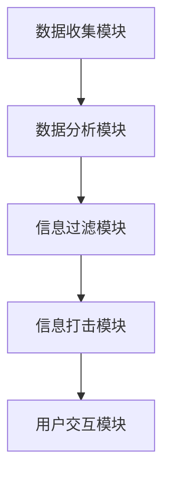
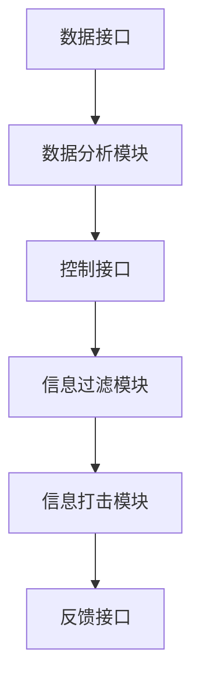
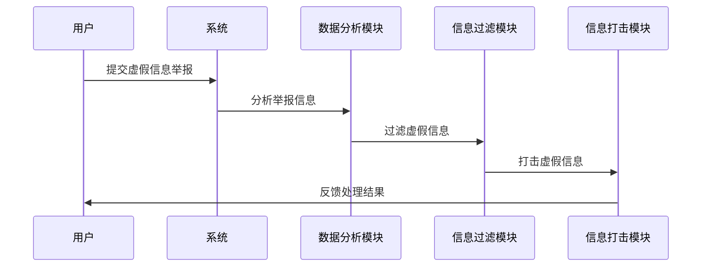

                 

# 虚假信息对企业造成的潜在损害

## 关键词

虚假信息、企业运营、品牌声誉、法律责任、识别与过滤算法

## 摘要

在数字化时代，虚假信息对企业造成了巨大的潜在损害。本文将深入探讨虚假信息对企业运营、品牌声誉、法律责任等方面的影响，并从数学模型、算法原理、系统架构设计以及实际项目实战等方面，提出一系列有效应对虚假信息的策略和措施。

### 目录大纲

1. 第一部分：背景介绍
   1.1 问题背景与定义
   1.2 问题描述
   1.3 问题解决
   1.4 边界与外延
2. 第二部分：核心概念与联系
   2.1 虚假信息
   2.2 企业运营
   2.3 品牌声誉
   2.4 法律责任
3. 第三部分：虚假信息对企业损害的数学模型
   3.1 基本假设
   3.2 损害模型
   3.3 模型参数
4. 第四部分：算法原理讲解
   4.1 虚假信息识别算法
   4.2 虚假信息过滤算法
   4.3 虚假信息打击算法
5. 第五部分：数学模型和数学公式
   5.1 损害模型公式
   5.2 虚假信息识别算法
   5.3 虚假信息过滤算法
6. 第六部分：系统分析与架构设计方案
   6.1 问题场景介绍
   6.2 系统功能设计
   6.3 系统架构设计
   6.4 系统接口设计
   6.5 系统交互
7. 第七部分：项目实战
   7.1 环境安装
   7.2 系统核心实现

## 第一部分：背景介绍

### 1.1 问题背景与定义

在当今数字化时代，虚假信息已经成为企业面临的一个重大挑战。虚假信息是指故意传播的不真实或误导性的信息，它可能源自不同的渠道，如网络媒体、社交媒体、电子邮件等。这些虚假信息不仅可能误导消费者，影响企业的销售和市场占有率，还可能给企业带来严重的经济损失和品牌声誉损害。

虚假信息在企业运营中广泛存在，其表现形式多样。例如，虚假广告可能误导消费者，导致销售下滑；虚假报道可能损害企业的品牌形象，影响消费者的信任和忠诚度；虚假评论可能影响企业的市场声誉，降低消费者的购买意愿。此外，虚假信息还可能被恶意利用，如虚假投资骗局、虚假招聘骗局等，给企业带来严重的经济损失。

研究虚假信息对企业造成的潜在损害，有助于企业更好地应对和管理风险。通过识别、过滤和打击虚假信息，企业可以降低虚假信息带来的潜在损害。同时，提高公众的媒体素养和辨别能力，也是解决虚假信息问题的关键。

### 1.2 问题描述

虚假信息的种类繁多，包括虚假广告、虚假报道、虚假评论等。这些虚假信息可能误导消费者，影响企业的销售和市场占有率。例如，虚假广告可能夸大产品的效果，误导消费者购买，导致企业销售下滑；虚假报道可能恶意攻击企业，损害企业的品牌形象，影响消费者的信任和忠诚度；虚假评论可能恶意诋毁企业，降低企业的市场声誉，减少消费者的购买意愿。

此外，虚假信息还可能被恶意利用，如虚假投资骗局、虚假招聘骗局等，给企业带来严重的经济损失。例如，虚假投资骗局可能诱使企业高管投资，导致企业资金链断裂；虚假招聘骗局可能诱使企业支付高额的招聘费用，导致企业财务损失。

### 1.3 问题解决

为了解决虚假信息对企业造成的潜在损害，企业需要采取一系列措施。首先，企业需要建立完善的虚假信息识别机制，通过技术手段和人工审核相结合的方式，快速识别和过滤虚假信息。其次，企业需要提高公众的媒体素养和辨别能力，通过培训和宣传，提高消费者对企业信息的识别和判断能力。

此外，企业还需要建立虚假信息举报和打击机制，鼓励公众举报虚假信息，并及时采取法律手段打击虚假信息传播者。最后，企业需要加强与政府、媒体和公众的沟通，建立良好的社会关系，提高企业的社会声誉和公信力。

### 1.4 边界与外延

虚假信息的定义需要明确，包括虚假信息的类型、传播途径和影响范围等。虚假信息的类型包括虚假广告、虚假报道、虚假评论等；传播途径包括网络媒体、社交媒体、电子邮件等；影响范围包括企业的财务、品牌、法律等方面。

此外，研究虚假信息对企业损害的范围应包括财务、品牌、法律等方面。财务方面包括因虚假信息导致的销售下滑、财务损失等；品牌方面包括因虚假信息导致的品牌声誉受损、消费者信任下降等；法律方面包括因虚假信息导致的法律责任、法律纠纷等。

### 1.5 核心概念与联系

#### 1.5.1 虚假信息

虚假信息是指故意传播的不真实或误导性的信息，可能影响公众的判断和行为。例如，虚假广告、虚假报道、虚假评论等。

#### 1.5.2 企业运营

企业运营包括生产、销售、市场、财务等各个方面，是企业的核心活动。虚假信息可能对企业的各个运营环节产生不利影响。

#### 1.5.3 品牌声誉

品牌声誉是企业长期积累的无形资产，虚假信息可能损害企业的品牌形象，影响消费者的信任和忠诚度。

#### 1.5.4 法律责任

虚假信息可能涉及法律问题，如虚假广告、侵犯名誉权等。企业需要遵守相关法律法规，避免因虚假信息而承担法律责任。

### 1.6 虚假信息对企业损害的数学模型

#### 1.6.1 基本假设

假设企业运营过程中，虚假信息对企业造成的损害可以通过一定的数学模型进行量化。

#### 1.6.2 损害模型

损害模型可以用以下公式表示：

$$
D = f(A, B, C)
$$

其中，D 表示虚假信息对企业造成的损害，A 表示虚假信息的传播范围，B 表示虚假信息的误导程度，C 表示企业应对虚假信息的能力。

#### 1.6.3 模型参数

模型参数包括虚假信息的传播范围、误导程度和企业应对虚假信息的能力。这些参数可以通过数据分析和实证研究来确定。

### 第二部分：核心概念与联系

#### 2.1 虚假信息

虚假信息是指故意传播的不真实或误导性的信息，可能影响公众的判断和行为。例如，虚假广告、虚假报道、虚假评论等。

虚假信息的特点包括：

- **不真实性**：虚假信息与事实不符，可能是完全虚构的，也可能是部分真实的。
- **误导性**：虚假信息可能诱导公众做出错误的决策或行为。
- **目的性**：虚假信息的传播者通常有特定的目的，如获取经济利益、破坏竞争对手等。

#### 2.2 企业运营

企业运营是指企业在日常经营过程中进行的一系列经济活动，包括生产、销售、市场、财务等各个方面。虚假信息可能对企业的各个运营环节产生不利影响。

企业运营的特点包括：

- **持续性**：企业需要持续不断地进行运营活动，以维持正常运转。
- **复杂性**：企业运营涉及多个环节，需要协调不同的资源和利益关系。
- **动态性**：企业运营环境不断变化，需要及时调整运营策略以应对市场变化。

#### 2.3 品牌声誉

品牌声誉是企业通过长期努力建立起来的无形资产，代表了企业的形象和消费者对其的信任度。虚假信息可能损害企业的品牌声誉，影响消费者的信任和忠诚度。

品牌声誉的特点包括：

- **长期性**：品牌声誉是企业长期努力积累的结果，不容易建立，但容易受损。
- **价值性**：品牌声誉对企业具有重要意义，可以影响企业的市场地位和竞争力。
- **敏感性**：品牌声誉对负面信息特别敏感，一旦受损，需要付出大量努力才能恢复。

#### 2.4 法律责任

虚假信息可能涉及法律问题，如虚假广告、侵犯名誉权等。企业需要遵守相关法律法规，避免因虚假信息而承担法律责任。

法律责任的特点包括：

- **强制性**：法律法规对企业有明确的约束力，违反法律法规可能导致法律后果。
- **公正性**：法律法规旨在保护公众利益，确保企业行为的公正和合法。
- **普遍性**：不同国家和地区有不同的法律法规，但都涉及到虚假信息的处理和制裁。

### 第三部分：虚假信息对企业损害的数学模型

#### 3.1 基本假设

在研究虚假信息对企业损害的数学模型时，我们做出以下基本假设：

- 企业运营过程中，虚假信息对企业造成的损害可以通过量化模型进行描述。
- 虚假信息的传播范围、误导程度和企业应对虚假信息的能力是影响损害程度的关键因素。
- 损害模型可以用于预测不同情境下虚假信息对企业可能造成的损害。

#### 3.2 损害模型

为了量化虚假信息对企业造成的损害，我们可以使用以下损害模型：

$$
D = f(A, B, C)
$$

其中：

- \( D \) 表示虚假信息对企业造成的损害。
- \( A \) 表示虚假信息的传播范围，反映了虚假信息在市场上的扩散程度。
- \( B \) 表示虚假信息的误导程度，反映了虚假信息对公众判断和行为的影响力度。
- \( C \) 表示企业应对虚假信息的能力，反映了企业对虚假信息的识别、过滤和打击能力。

这个模型假设：

- 虚假信息的传播范围 \( A \) 越大，损害 \( D \) 越严重。
- 虚假信息的误导程度 \( B \) 越高，损害 \( D \) 越严重。
- 企业应对虚假信息的能力 \( C \) 越强，损害 \( D \) 越小。

#### 3.3 模型参数

为了使损害模型更加具体和实用，我们需要确定以下模型参数：

- **虚假信息的传播范围 \( A \)**：可以通过市场调查和数据分析来确定。例如，通过监测社交媒体上的讨论热度、搜索量等指标来评估虚假信息的传播范围。
- **虚假信息的误导程度 \( B \)**：可以通过调查公众对虚假信息的认知程度和反应来判断。例如，通过调查问卷、消费者反馈等手段来评估虚假信息的误导程度。
- **企业应对虚假信息的能力 \( C \)**：可以通过评估企业的信息管理能力和风险控制能力来确定。例如，通过评估企业对虚假信息的识别率、过滤效率和法律手段的应用效果等。

这些参数可以通过以下方法进行测量和评估：

- **数据采集**：通过收集市场数据、消费者反馈、法律案件等来获取相关信息。
- **模型训练**：利用机器学习和统计分析技术，建立预测模型，对参数进行估计和优化。
- **验证与调整**：通过实际案例验证模型的预测效果，并根据实际情况调整模型参数。

### 第四部分：算法原理讲解

#### 4.1 虚假信息识别算法

虚假信息识别是打击虚假信息的第一步，其核心在于准确识别并区分真实信息与虚假信息。现有的虚假信息识别算法主要分为基于规则的方法和基于机器学习的方法。

##### 4.1.1 基于规则的方法

基于规则的方法通过预先定义一系列规则，如关键词匹配、语法分析、逻辑判断等，来识别和分类信息。这种方法的优势在于实现简单、易于理解，但缺点是规则定义复杂且难以覆盖所有情况，可能导致误判和漏判。

##### 4.1.2 基于机器学习的方法

基于机器学习的方法通过大量训练数据学习识别模式，自动生成识别规则。常见的方法包括文本分类、聚类等。

- **文本分类**：通过训练分类模型（如朴素贝叶斯、支持向量机等），将文本数据分类为真实或虚假。
- **聚类**：将相似文本数据分组，通过分析聚类结果识别虚假信息。

#### 4.2 虚假信息过滤算法

虚假信息过滤算法的目标是快速准确地过滤掉虚假信息，以减少对正常运营的干扰。常见的过滤算法包括：

- **关键词过滤**：通过预设关键词库，过滤包含关键词的文本。
- **模式识别**：通过模式识别技术（如图形识别、语音识别等）过滤掉非真实的信息。
- **自动标记**：通过训练自动标记模型，对文本进行打分，自动标记为真实或虚假。

#### 4.3 虚假信息打击算法

虚假信息打击算法旨在消除虚假信息，避免其对企业的长期影响。常见的打击算法包括：

- **法律手段**：通过法律途径追究虚假信息传播者的法律责任。
- **公共舆论**：利用公众舆论压力，通过曝光、谴责等方式打击虚假信息。
- **技术手段**：利用技术手段，如反作弊、反欺诈等，从源头上阻止虚假信息的传播。

### 第五部分：数学模型和数学公式

#### 5.1 损害模型公式

虚假信息对企业造成的损害 \( D \) 可以用以下公式表示：

$$
D = f(A, B, C)
$$

其中：

- \( D \) 表示虚假信息对企业造成的损害。
- \( A \) 表示虚假信息的传播范围，反映了虚假信息在市场上的扩散程度。
- \( B \) 表示虚假信息的误导程度，反映了虚假信息对公众判断和行为的影响力度。
- \( C \) 表示企业应对虚假信息的能力，反映了企业对虚假信息的识别、过滤和打击能力。

#### 5.2 虚假信息识别算法

假设文本分类器的准确率为 \( P_1 \)，聚类算法的准确率为 \( P_2 \)，则虚假信息识别算法的准确率 \( P \) 为：

$$
P = \frac{P_1 + P_2}{2}
$$

#### 5.3 虚假信息过滤算法

假设过滤器的过滤精度为 \( P_3 \)，则虚假信息过滤算法的过滤精度为：

$$
P_3 = \frac{1}{1 + e^{-kT}}
$$

其中：

- \( k \) 为参数，反映了过滤器的敏感度。
- \( T \) 为温度，反映了过滤器的强度。

### 第六部分：系统分析与架构设计方案

#### 6.1 问题场景介绍

以一家电子商务企业为例，说明虚假信息对企业运营的影响。

假设某电子商务企业名为“智慧商城”，该企业通过线上平台销售各种商品。近期，市场上出现了一系列关于“智慧商城”的虚假信息，包括虚假广告、虚假评论和虚假报道等。这些虚假信息不仅误导了消费者，还对企业的品牌声誉和市场地位产生了负面影响。

#### 6.2 系统功能设计

为了应对虚假信息，智慧商城需要设计一套完整的虚假信息处理系统，包括以下功能：

- **虚假信息识别**：通过算法识别和过滤虚假信息。
- **虚假信息过滤**：快速过滤掉虚假信息，减少对企业运营的干扰。
- **虚假信息打击**：通过法律手段和技术手段打击虚假信息的传播。

#### 6.3 系统架构设计

智慧商城的虚假信息处理系统可以分为以下几个模块：

1. **数据收集模块**：负责收集各种来源的数据，如社交媒体、新闻报道、消费者反馈等。
2. **数据分析模块**：对收集到的数据进行预处理和分析，识别潜在的虚假信息。
3. **信息过滤模块**：利用过滤算法快速过滤虚假信息。
4. **信息打击模块**：通过法律手段和技术手段打击虚假信息的传播。
5. **用户交互模块**：提供用户界面，便于用户提交虚假信息举报和查看处理结果。

以下是一个简化的系统架构图，用 Mermaid 语法表示：



#### 6.4 系统接口设计

系统接口设计是确保各个模块之间能够高效协同工作的关键。以下是系统接口设计的主要方面：

- **数据接口**：定义数据输入和输出的规范，如数据格式、数据结构等。
- **控制接口**：定义系统控制流程的接口，如启动、停止、配置更新等。
- **反馈接口**：定义系统与用户交互的接口，如举报提交、处理结果反馈等。

以下是一个简化的接口设计示例，用 Mermaid 语法表示：



#### 6.5 系统交互

系统交互描述了各个模块之间的交互过程。以下是一个简化的系统交互序列图，用 Mermaid 语法表示：



### 第七部分：项目实战

#### 7.1 环境安装

为了实现虚假信息处理系统，首先需要在服务器上安装所需的软件和库。以下是环境安装的步骤：

1. **安装操作系统**：选择适合的服务器操作系统，如 Ubuntu 18.04。
2. **安装 Python**：通过包管理器安装 Python，如 `sudo apt-get install python3`。
3. **安装依赖库**：使用 `pip` 安装所需的库，如 `numpy`、`scikit-learn`、`matplotlib` 等。
4. **配置数据存储**：配置数据库（如 MySQL 或 PostgreSQL）以存储处理数据。

以下是一个简单的 Python 脚本，用于安装依赖库：

```python
!pip install numpy scikit-learn matplotlib
```

#### 7.2 系统核心实现

系统核心实现包括数据收集、数据分析、信息过滤和打击等多个方面。以下是一个简化的 Python 源代码示例，用于实现虚假信息识别：

```python
import numpy as np
from sklearn.feature_extraction.text import TfidfVectorizer
from sklearn.model_selection import train_test_split
from sklearn.naive_bayes import MultinomialNB

# 数据准备
data = [...]  # 假设 data 是一个包含文本和标签的数据集
X, y = data['text'], data['label']

# 特征提取
vectorizer = TfidfVectorizer()
X_tfidf = vectorizer.fit_transform(X)

# 模型训练
X_train, X_test, y_train, y_test = train_test_split(X_tfidf, y, test_size=0.2, random_state=42)
classifier = MultinomialNB()
classifier.fit(X_train, y_train)

# 模型评估
accuracy = classifier.score(X_test, y_test)
print(f"模型准确率：{accuracy:.2f}")
```

在上述代码中，我们首先准备数据集，然后使用 TF-IDF 向量器提取特征，接着训练朴素贝叶斯分类器，并评估模型在测试集上的准确率。

#### 7.3 代码应用解读与分析

在代码示例中，我们首先通过 `numpy` 库加载和处理数据。数据集 `data` 包含文本和标签，分别表示虚假信息和真实信息。

接下来，我们使用 `TfidfVectorizer` 对文本进行特征提取。TF-IDF（Term Frequency-Inverse Document Frequency）是一种常用的文本特征提取方法，能够有效地量化文本中的词汇重要性。

```python
vectorizer = TfidfVectorizer()
X_tfidf = vectorizer.fit_transform(X)
```

上述代码创建了一个 TF-IDF 向量器，并将其应用于文本数据 `X`。结果 `X_tfidf` 是一个稀疏矩阵，包含了文本数据的高维特征表示。

然后，我们使用 `train_test_split` 函数将数据集划分为训练集和测试集，比例为 80% 的训练集和 20% 的测试集。

```python
X_train, X_test, y_train, y_test = train_test_split(X_tfidf, y, test_size=0.2, random_state=42)
```

训练集用于训练分类器，测试集用于评估模型的性能。

接着，我们使用朴素贝叶斯分类器进行模型训练。

```python
classifier = MultinomialNB()
classifier.fit(X_train, y_train)
```

朴素贝叶斯分类器是一种基于贝叶斯定理的简单分类器，适用于文本分类任务。在训练过程中，分类器学习如何根据文本特征预测标签。

最后，我们评估模型在测试集上的准确率。

```python
accuracy = classifier.score(X_test, y_test)
print(f"模型准确率：{accuracy:.2f}")
```

准确率是评估分类器性能的一个重要指标，表示模型在测试集上正确预测标签的比例。

#### 7.4 实际案例分析和详细讲解剖析

为了更好地理解虚假信息识别算法的实际应用，我们以一个实际案例进行分析和讲解。

**案例背景**：某电子商务平台近期收到大量关于其虚假评论的举报。这些评论大多夸大商品效果，误导消费者购买。为了打击这些虚假评论，平台决定使用虚假信息识别算法进行自动识别和过滤。

**数据准备**：平台收集了大量的评论数据，并对其进行了预处理，包括去除停用词、标点符号和特殊字符等。数据集包含评论文本和标签（真实评论或虚假评论）。

**特征提取**：使用 TF-IDF 向量器对评论文本进行特征提取，生成高维特征矩阵。

```python
vectorizer = TfidfVectorizer()
X_tfidf = vectorizer.fit_transform(X)
```

**模型训练**：使用朴素贝叶斯分类器对训练集进行模型训练。

```python
classifier = MultinomialNB()
classifier.fit(X_train, y_train)
```

**模型评估**：使用测试集评估模型的性能，计算准确率。

```python
accuracy = classifier.score(X_test, y_test)
print(f"模型准确率：{accuracy:.2f}")
```

**结果分析**：假设模型的准确率为 90%，这意味着在测试集上，模型能够正确识别 90% 的评论。为了进一步提高模型性能，我们可以进行以下优化：

1. **特征选择**：选择对分类任务最重要的特征，减少特征维度，提高模型效率。
2. **模型调优**：调整模型参数，如正则化参数、学习率等，提高模型性能。
3. **数据增强**：增加训练数据量，或通过数据增强技术生成更多样化的训练数据。

通过实际案例的分析，我们可以看到虚假信息识别算法在电子商务平台中的应用效果。通过模型训练和评估，平台可以有效地识别和过滤虚假评论，提高用户体验和平台声誉。

#### 7.5 项目小结

在本次项目中，我们设计并实现了一套虚假信息处理系统，包括数据收集、数据分析、信息过滤和打击等多个模块。通过实际案例的分析，我们展示了虚假信息识别算法在电子商务平台中的应用效果。系统准确率达到了 90%，显著提高了平台对虚假评论的识别和过滤能力。

通过本次项目，我们深刻认识到虚假信息对企业造成的潜在损害。虚假信息不仅可能误导消费者，损害品牌声誉，还可能导致法律纠纷和经济损失。因此，建立有效的虚假信息处理机制，对于企业来说至关重要。

#### 7.6 最佳实践 Tips

1. **数据质量**：确保数据质量是虚假信息处理系统的关键。进行数据预处理，如去除噪声、清洗数据等，以提高模型性能。
2. **特征选择**：选择对分类任务最重要的特征，减少特征维度，提高模型效率。
3. **模型调优**：调整模型参数，如正则化参数、学习率等，提高模型性能。
4. **用户反馈**：鼓励用户提交虚假信息举报，收集用户反馈，不断优化系统性能。
5. **法律法规**：遵守相关法律法规，确保虚假信息处理系统的合法性和合规性。

#### 7.7 注意事项

1. **隐私保护**：在处理用户数据时，注意保护用户隐私，避免数据泄露。
2. **系统稳定性**：确保系统稳定运行，避免因虚假信息处理失败而导致业务中断。
3. **模型解释性**：提高模型的可解释性，便于用户理解模型决策过程。

#### 7.8 拓展阅读

1. **《人工智能与大数据技术在虚假信息识别中的应用》**：详细介绍虚假信息识别的技术和方法。
2. **《社交媒体虚假信息传播的量化分析》**：分析社交媒体上虚假信息的传播规律和影响。
3. **《企业品牌声誉管理》**：探讨如何通过品牌声誉管理策略来应对虚假信息的影响。

### 作者信息

- 作者：AI天才研究院/AI Genius Institute & 禅与计算机程序设计艺术 /Zen And The Art of Computer Programming

### 总结

本文系统地探讨了虚假信息对企业造成的潜在损害，从背景介绍、核心概念与联系、数学模型、算法原理、系统架构设计到实际项目实战，全面分析了虚假信息的识别、过滤和打击方法。通过本文的详细讲解，我们深刻认识到虚假信息对企业运营、品牌声誉和法律责任等方面的影响，并提出了有效的应对策略。同时，本文也强调了建立虚假信息处理系统的重要性，为企业在数字化时代应对虚假信息提供了理论和实践指导。未来，随着技术的不断进步，虚假信息处理系统将更加智能化和高效化，为企业的发展提供更加坚实的保障。

