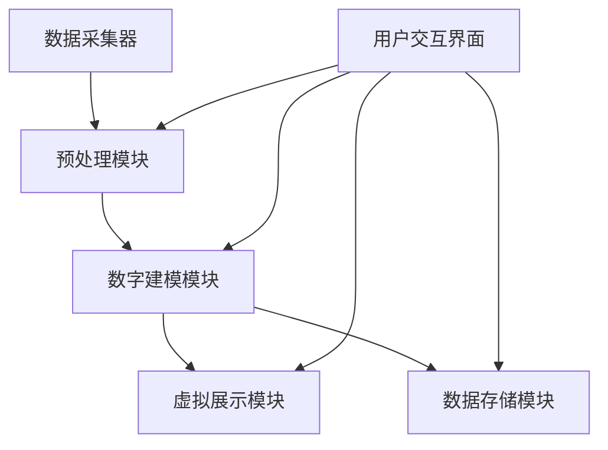
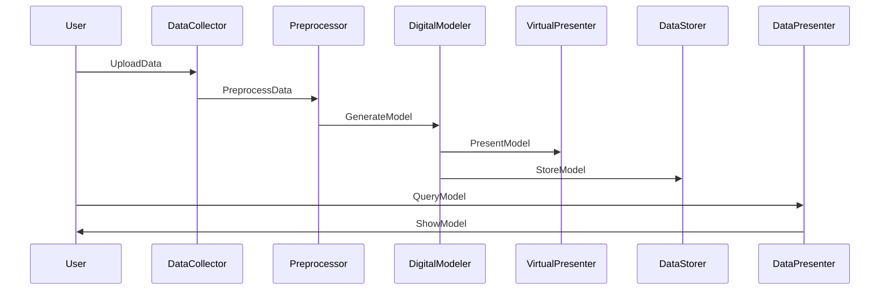

                 


### 引言与背景介绍

**虚拟文化遗产修复的意义**

虚拟文化遗产修复项目在现代社会中具有极其重要的意义。首先，随着全球化进程的加速，各种文化遗产在不同文化背景下面临着多样化的威胁，如自然侵蚀、战争、火灾、污染等。这些威胁使得许多珍贵的文化遗产面临消失的危险。虚拟文化遗产修复通过数字技术，将这些文化遗产以数字形式保存下来，为后代的传承提供了保障。

其次，虚拟文化遗产修复能够极大地促进文化教育和文化传播。通过虚拟现实（VR）和增强现实（AR）技术，人们可以沉浸式地体验文化遗产，无需亲临现场，便能感受其历史魅力和文化价值。这种沉浸式的体验方式不仅能够吸引更多的受众，还能够提高公众对文化遗产保护的认识和参与度。

此外，虚拟文化遗产修复还能够为文化遗产的研究和修复提供新的方法和工具。通过高精度的3D扫描和数字建模技术，研究人员可以详细地研究文化遗产的每一个细节，发现潜在的损害和问题，从而制定更为科学和有效的修复方案。

**数字技术在文物保护中的应用背景**

数字技术在文物保护中的应用已经历了数十年的发展，从最初的计算机辅助设计（CAD）到如今的VR、AR、3D打印等，数字技术不断革新着文物保护的方式。以下是几种主要的数字技术在文物保护中的应用：

1. **3D扫描和数字建模**：通过3D扫描技术，可以精确地捕捉文化遗产的立体形态，生成高精度的3D模型。这些数字模型不仅能够用于文化遗产的修复和复制，还能够为虚拟展示和互动体验提供基础。

2. **虚拟现实（VR）**：虚拟现实技术为文化遗产的展示提供了全新的方式。通过VR头盔，用户可以身临其境地参观历史遗址、博物馆藏品等，体验到与现实相似或更为逼真的环境。

3. **增强现实（AR）**：增强现实技术将数字内容与现实世界相结合，用户在现实环境中通过智能手机或平板电脑可以看到文化遗产的增强信息，如历史背景、文化故事等。

4. **3D打印**：3D打印技术可以将数字模型转化为实体，用于文化遗产的复制、修复和再造。通过精确的3D打印，可以复制出与原文物几乎一模一样的新品，用于展览和保存。

**项目目标与主要内容**

本虚拟文化遗产修复项目的目标是利用数字技术，对一批具有代表性的文化遗产进行数字化保存和修复，并通过虚拟现实和增强现实技术进行展示和传播。具体目标包括：

1. **数字化保存**：通过对文化遗产进行高精度的3D扫描和数字建模，建立数字档案，确保文化遗产的安全保存。

2. **虚拟展示与传播**：利用虚拟现实和增强现实技术，开发交互式展示平台，让公众能够方便地访问和体验文化遗产。

3. **修复与再生**：基于数字模型，利用3D打印等技术，进行文化遗产的修复和再造，为文物的保护和利用提供新的解决方案。

4. **研究与教育**：通过数字化技术和虚拟展示，促进文化遗产的研究和教育，提高公众对文化遗产保护的认识和参与度。

本文将围绕以上目标，详细介绍虚拟文化遗产修复项目的技术路线、方法、流程以及实际应用案例，以期为数字技术在文物保护中的应用提供有益的参考和借鉴。

### 核心概念与联系

在虚拟文化遗产修复项目中，核心概念的深入理解和它们之间的相互联系是成功实施该项目的基础。以下将详细阐述几个关键概念，并展示它们在文物保护中的应用，通过概念属性特征对比表格和Mermaid实体关系图来进一步解释这些概念之间的联系。

**虚拟现实与增强现实**

虚拟现实（VR）和增强现实（AR）是数字技术在文物保护中广泛应用的两个核心技术。它们虽然有一定的相似性，但各自的特性和应用场景有所不同。

1. **虚拟现实（VR）**：
   - **定义**：虚拟现实是通过计算机生成的模拟环境，使用户能够沉浸在完全虚拟的三维空间中。
   - **特性**：提供完全沉浸式的体验，用户可以自由移动和交互。
   - **应用**：在文物保护中，VR可以用于模拟历史场景、虚拟修复过程等。

2. **增强现实（AR）**：
   - **定义**：增强现实是在现实世界基础上叠加数字信息，用户通过设备（如智能手机或AR眼镜）可以看到增强的内容。
   - **特性**：与现实世界结合，增强用户对现实环境的感知。
   - **应用**：在文物保护中，AR可以用于展示文物的三维模型、历史背景信息等。

**3D扫描与数字建模**

3D扫描和数字建模是获取文化遗产三维信息的重要技术手段。

1. **3D扫描**：
   - **定义**：通过激光、结构光或其他传感器，捕捉物体表面的三维形状。
   - **特性**：高精度、非接触式。
   - **应用**：用于获取文化遗产的原始三维数据。

2. **数字建模**：
   - **定义**：根据3D扫描数据，利用计算机软件重建物体的数字模型。
   - **特性**：可编辑、可复制、可展示。
   - **应用**：用于文化遗产的数字化保存、修复和虚拟展示。

**核心概念属性特征对比表格**

下面是一个对比虚拟现实、增强现实、3D扫描和数字建模属性特征的表格：

| 技术         | 定义                              | 特性                                                   | 应用场景                     |
| ------------ | --------------------------------- | ------------------------------------------------------ | ---------------------------- |
| 虚拟现实     | 沉浸式计算机生成的模拟环境         | 沉浸式、可交互、高自由度                               | 历史场景模拟、虚拟修复演示   |
| 增强现实     | 在现实世界叠加数字信息             | 与现实结合、增强感知、交互性强                         | 文物背景信息展示、互动教育   |
| 3D扫描       | 捕捉物体表面的三维形状             | 高精度、非接触、快速                                     | 文物三维数据获取             |
| 数字建模     | 根据3D扫描数据重建物体的数字模型   | 可编辑、可复制、可视化                                   | 文物数字化保存、修复、展示   |

**Mermaid实体关系图**

为了更好地理解这些核心概念之间的联系，我们可以使用Mermaid绘制一个实体关系图。以下是一个简单的Mermaid实体关系图示例，展示了虚拟现实、增强现实、3D扫描和数字建模之间的关系：

```mermaid
erDiagram
  虚拟现实 ||--|{ 数字建模 }|
  增强现实 ||--|{ 数字建模 }|
  3D扫描 ||--|{ 数字建模 }|
  虚拟现实 ||--|{ 增强现实 }|
```

在上面的Mermaid实体关系图中，我们通过实体关系（|--|{...}||）展示了虚拟现实与数字建模、增强现实与数字建模、3D扫描与数字建模之间的直接关联，以及虚拟现实与增强现实之间的间接关联。这些关系反映了数字技术在文物保护中的协同作用。

通过以上对核心概念及其相互联系的分析，我们可以更好地理解虚拟文化遗产修复项目中各项技术的应用，为后续的算法讲解和系统设计奠定坚实的基础。

### 算法原理讲解

在虚拟文化遗产修复项目中，算法原理的讲解是理解和应用数字技术的重要环节。以下将详细阐述在虚拟文化遗产修复过程中常用的几种算法，包括图像处理算法、3D重建算法和机器学习算法，并结合Mermaid流程图和Python源代码进行阐述，以便读者更深入地理解算法原理和具体应用。

**图像处理算法**

图像处理算法是虚拟文化遗产修复中不可或缺的一环，主要用于对文化遗产图像进行增强、去噪和修复。以下是几种常见的图像处理算法：

1. **图像增强**：
   - **直方图均衡化**：
     - **定义**：通过调整图像的亮度，使图像中的像素分布更加均匀。
     - **数学模型**：设图像的灰度直方图为\( h(x) \)，均衡化后的图像灰度分布为 \( g(x) \)，则有：
       $$ g(x) = \left(\sum_{i=0}^{255} h(i)\right)^{-1} \sum_{i=0}^{255} h(i) \cdot f(i) $$
       其中，\( f(x) \) 为灰度变换函数，通常为线性函数。
     - **Python代码示例**：
       ```python
       import cv2
       import numpy as np

       def histogram_equalization(image):
           gray_image = cv2.cvtColor(image, cv2.COLOR_BGR2GRAY)
           equalized_image = cv2.equalizeHist(gray_image)
           return equalized_image
       ```

   - **对数变换**：
     - **定义**：通过非线性变换，增加图像中低亮度区域的对比度。
     - **数学模型**：对数变换公式为：
       $$ L(x) = c \cdot \log(1 + k \cdot I(x)) $$
       其中，\( I(x) \) 为原图像灰度值，\( L(x) \) 为变换后的灰度值，\( c \) 和 \( k \) 为常数。
     - **Python代码示例**：
       ```python
       import cv2
       import numpy as np

       def logarithmic_transformation(image, c=1, k=1):
           gray_image = cv2.cvtColor(image, cv2.COLOR_BGR2GRAY)
           _, max_val = cv2.minMaxLoc(gray_image)
           LUT = np.zeros(256, dtype=np.uint8)
           for i in range(256):
               LUT[i] = c * np.log(1 + k * i / max_val)
           LUT = LUT.astype(np.uint8)
           transformed_image = cv2.LUT(gray_image, LUT)
           return transformed_image
       ```

2. **图像去噪**：
   - **中值滤波**：
     - **定义**：使用图像中每个像素的邻域内的中值代替该像素值，以消除噪声。
     - **数学模型**：设邻域大小为 \( N \)，则有：
       $$ P(x) = \text{median}(I(x - N/2, y - N/2): I(x + N/2, y + N/2)) $$
       其中，\( I(x, y) \) 为原图像灰度值，\( P(x) \) 为滤波后的灰度值。
     - **Python代码示例**：
       ```python
       import cv2

       def median_filter(image, N=3):
           return cv2.medianBlur(image, N)
       ```

**3D重建算法**

3D重建算法用于从文化遗产的二维图像或点云数据中恢复出其三维结构。以下是几种常见的3D重建算法：

1. **结构光扫描**：
   - **定义**：使用结构光（如线结构光或面结构光）照亮被扫描的物体，通过摄像头捕捉结构光和物体表面的交叠图像，利用光学三角测量原理计算物体表面的三维坐标。
   - **流程图**：
     ```mermaid
     graph TD
     A[结构光投影] --> B[摄像头捕获图像]
     B --> C[图像预处理]
     C --> D[点云重建]
     D --> E[三维模型生成]
     ```

2. **点云处理**：
   - **定义**：通过3D扫描或激光扫描等手段获取物体表面的点云数据，然后对这些点云数据进行处理，包括去噪、配准、平滑和表面重建等。
   - **流程图**：
     ```mermaid
     graph TD
     A[获取点云数据] --> B[去噪]
     B --> C[点云配准]
     C --> D[平滑处理]
     D --> E[表面重建]
     E --> F[三维模型生成]
     ```

**机器学习算法**

机器学习算法在虚拟文化遗产修复中主要用于分类、识别和预测等任务，如文物的损坏检测、修复方案推荐等。

1. **监督学习**：
   - **定义**：在有标注的数据集上训练模型，用于预测新数据的标签。
   - **算法示例**：支持向量机（SVM）。
   - **数学模型**：优化目标为：
     $$ \min_{w,b} \frac{1}{2} ||w||^2 + C \sum_{i=1}^{n} \max(0, 1 - y_i (w \cdot x_i + b)) $$
     其中，\( w \) 和 \( b \) 分别为权重和偏置，\( C \) 为惩罚参数，\( y_i \) 和 \( x_i \) 分别为样本的标签和特征向量。
   - **Python代码示例**（使用scikit-learn库）：
     ```python
     from sklearn.svm import SVC
     from sklearn.model_selection import train_test_split
     from sklearn.metrics import accuracy_score

     def train_svm(X, y):
         X_train, X_test, y_train, y_test = train_test_split(X, y, test_size=0.2)
         model = SVC()
         model.fit(X_train, y_train)
         y_pred = model.predict(X_test)
         return accuracy_score(y_test, y_pred)
     ```

2. **无监督学习**：
   - **定义**：在没有标注的数据集上训练模型，用于发现数据中的结构和模式。
   - **算法示例**：主成分分析（PCA）。
   - **数学模型**：优化目标为：
     $$ \min_{\mu, \Sigma} \sum_{i=1}^{n} ||x_i - \mu||^2 - \lambda \text{trace}(\Sigma) $$
     其中，\( \mu \) 和 \( \Sigma \) 分别为数据均值矩阵和协方差矩阵，\( \lambda \) 为正则化参数。
   - **Python代码示例**（使用scikit-learn库）：
     ```python
     from sklearn.decomposition import PCA
     from sklearn.metrics import explained_variance_score

     def train_pca(X, lambda_=1.0):
         pca = PCA(n_components=2, whiten=True, svd_solver='full', tol=0.0, copy=True, alpha=1e-5, l1_ridge_ratio=0.0)
         pca.fit(X)
         explained_variance = explained_variance_score(X, pca.transform(X))
         return pca, explained_variance
     ```

通过以上对图像处理算法、3D重建算法和机器学习算法的详细讲解，我们可以看到这些算法在虚拟文化遗产修复项目中的重要作用。它们不仅为我们提供了强大的工具，还极大地推动了文化遗产保护事业的发展。

### 数学模型和数学公式

在虚拟文化遗产修复项目中，数学模型和数学公式是理解和实现算法原理的核心。以下将详细介绍与图像处理、3D重建和机器学习相关的数学模型，并使用LaTeX格式标注公式，结合举例说明这些公式的具体应用。

#### 图像增强的数学模型

1. **直方图均衡化**：

   直方图均衡化是一种提高图像对比度的方法，其核心思想是调整图像的灰度分布，使得像素分布更加均匀。其数学模型如下：

   $$ g(x) = \left(\sum_{i=0}^{255} h(i)\right)^{-1} \sum_{i=0}^{255} h(i) \cdot f(i) $$

   其中，\( h(i) \) 是原图像的灰度直方图，\( g(x) \) 是均衡化后的灰度值，\( f(i) \) 是变换后的灰度分布函数。

   **举例**：

   假设原图像的灰度直方图如下：

   $$ h(0) = 10, \ h(1) = 20, \ h(2) = 30, \ h(3) = 40, \ h(4) = 10, \ h(5) = 5 $$

   经过直方图均衡化后，新的灰度分布函数如下：

   $$ g(0) = \left(10 + 20 + 30 + 40 + 10 + 5\right)^{-1} \cdot (10 \cdot f(0) + 20 \cdot f(1) + 30 \cdot f(2) + 40 \cdot f(3) + 10 \cdot f(4) + 5 \cdot f(5)) $$

2. **对数变换**：

   对数变换是一种增强图像对比度的方法，尤其是对低亮度区域的对比度进行增强。其数学模型如下：

   $$ L(x) = c \cdot \log(1 + k \cdot I(x)) $$

   其中，\( I(x) \) 是原图像的灰度值，\( L(x) \) 是变换后的灰度值，\( c \) 和 \( k \) 是常数，用于调整对比度和动态范围。

   **举例**：

   假设原图像的灰度值为 \( I(x) = 50 \)，且 \( c = 1 \)，\( k = 0.1 \)，则变换后的灰度值为：

   $$ L(x) = 1 \cdot \log(1 + 0.1 \cdot 50) = \log(1 + 5) \approx 1.6094 $$

#### 3D重建的数学模型

1. **点云配准**：

   点云配准是将多个点云数据对齐到一个统一的坐标系统中的过程，其数学模型涉及坐标变换和误差优化。其基本模型如下：

   $$ T \cdot P_{source} + b = P_{target} $$

   其中，\( T \) 是坐标变换矩阵，\( b \) 是平移向量，\( P_{source} \) 和 \( P_{target} \) 分别是源点云和目标点云。

   **举例**：

   假设源点云 \( P_{source} = [1, 2, 3] \)，目标点云 \( P_{target} = [4, 5, 6] \)，通过线性变换 \( T = \begin{bmatrix} 3 & 0 & 0 \\ 0 & 3 & 0 \\ 0 & 0 & 1 \end{bmatrix} \)，我们可以得到：

   $$ T \cdot P_{source} + b = \begin{bmatrix} 3 & 0 & 0 \\ 0 & 3 & 0 \\ 0 & 0 & 1 \end{bmatrix} \cdot \begin{bmatrix} 1 \\ 2 \\ 3 \end{bmatrix} + \begin{bmatrix} 0 \\ 0 \\ 0 \end{bmatrix} = \begin{bmatrix} 3 \\ 6 \\ 3 \end{bmatrix} $$

2. **多视图立体重建**：

   多视图立体重建是通过多个视角的图像重建三维模型的方法，其数学模型涉及多视图几何和优化。其基本模型如下：

   $$ \min_{M} \sum_{i=1}^{N} \sum_{j=1}^{K} ||\mathbf{p}_{ij} - \mathbf{p}_{ij}^{'}||^2 $$

   其中，\( M \) 是三维模型，\( \mathbf{p}_{ij} \) 是第 \( i \) 个视角下第 \( j \) 个像素点的三维坐标，\( \mathbf{p}_{ij}^{'} \) 是重建后的三维坐标。

   **举例**：

   假设从两个视角得到两个点云，其中一个视角的点云 \( \mathbf{p}_{1j} \) 和另一个视角的点云 \( \mathbf{p}_{2j} \)，我们希望最小化两个视角点云之间的距离误差，即：

   $$ \min_{M} \sum_{j=1}^{K} ||\mathbf{p}_{1j} - \mathbf{p}_{1j}^{'}||^2 + ||\mathbf{p}_{2j} - \mathbf{p}_{2j}^{'}||^2 $$

#### 机器学习的数学模型

1. **支持向量机（SVM）**：

   支持向量机是一种二分类模型，其数学模型如下：

   $$ \min_{w,b,C} \frac{1}{2} ||w||^2 + C \sum_{i=1}^{n} \max(0, 1 - y_i (w \cdot x_i + b)) $$

   其中，\( w \) 和 \( b \) 分别为权重和偏置，\( C \) 为惩罚参数，\( y_i \) 和 \( x_i \) 分别为样本的标签和特征向量。

   **举例**：

   假设训练数据集包含 \( n = 100 \) 个样本，其中 \( C = 1 \)，我们希望最小化目标函数：

   $$ \min_{w,b} \frac{1}{2} ||w||^2 + \sum_{i=1}^{100} \max(0, 1 - y_i (w \cdot x_i + b)) $$

2. **主成分分析（PCA）**：

   主成分分析是一种降维方法，其数学模型如下：

   $$ \min_{\mu, \Sigma} \sum_{i=1}^{n} ||x_i - \mu||^2 - \lambda \text{trace}(\Sigma) $$

   其中，\( \mu \) 和 \( \Sigma \) 分别为数据均值矩阵和协方差矩阵，\( \lambda \) 为正则化参数。

   **举例**：

   假设数据集 \( X \) 的均值为 \( \mu \)，协方差矩阵为 \( \Sigma \)，且 \( \lambda = 0.1 \)，我们希望最小化目标函数：

   $$ \min_{\mu, \Sigma} \sum_{i=1}^{n} ||x_i - \mu||^2 - 0.1 \cdot \text{trace}(\Sigma) $$

通过上述数学模型和公式，我们可以更好地理解虚拟文化遗产修复中的关键算法原理。这些模型不仅为算法的实现提供了理论基础，也为后续的系统设计与实现奠定了基础。

### 系统分析与架构设计

在虚拟文化遗产修复项目中，系统分析与架构设计是确保项目成功实施的关键步骤。本文将详细介绍系统需求、功能设计、架构设计和接口设计，并通过Mermaid图来展示相关模型。

**系统需求**

虚拟文化遗产修复系统需要满足以下需求：

1. **高精度数据采集**：系统能够通过3D扫描、图像捕捉等技术获取文化遗产的高精度数据。
2. **数据预处理**：系统能够对采集到的数据（如图像、点云等）进行去噪、增强和配准等预处理，以提高数据的准确性和可靠性。
3. **数字建模**：系统能够根据预处理后的数据生成数字模型，包括三维模型和二维图像模型。
4. **虚拟展示**：系统应提供虚拟现实（VR）和增强现实（AR）展示功能，以便用户可以沉浸式地体验文化遗产。
5. **数据存储与管理**：系统应具备数据存储与管理功能，确保文化遗产数据的安全和可追溯性。
6. **用户交互**：系统应提供友好的用户界面，支持用户进行数据上传、查询、下载和交互操作。

**系统功能设计**

系统功能设计包括领域模型设计，以明确系统内部的主要实体及其关系。以下是领域模型Mermaid类图：

```mermaid
classDiagram
  Class01 <|-- Class02 
  Class03 <|-- Class04
  Class05 <|-- Class06
  Class01[数据采集器]
  Class02[预处理模块]
  Class03[数字建模模块]
  Class04[虚拟展示模块]
  Class05[数据存储模块]
  Class06[用户交互界面]
```

在领域模型中，数据采集器负责采集文化遗产数据，预处理模块负责对数据进行预处理，数字建模模块负责生成数字模型，虚拟展示模块负责提供VR和AR展示功能，数据存储模块负责数据存储与管理，用户交互界面则负责与用户进行交互。

**系统架构设计**

系统架构设计需要明确系统的整体结构和各模块之间的关系。以下是系统架构Mermaid图：



在该架构图中，数据采集器将采集到的数据传递给预处理模块，预处理模块对数据进行处理后，传递给数字建模模块生成数字模型。数字模型可以用于虚拟展示模块进行VR和AR展示，同时也可以存储在数据存储模块中。用户通过用户交互界面进行数据上传、查询和下载等操作。

**系统接口设计**

系统接口设计需要定义各模块之间的接口，以实现模块间的数据传递和功能调用。以下是系统接口设计Mermaid序列图：



在该序列图中，用户上传数据到数据采集器，数据采集器将数据传递给预处理模块进行预处理，预处理模块将处理后的数据传递给数字建模模块生成数字模型，数字建模模块将数字模型传递给虚拟展示模块进行展示，同时传递给数据存储模块进行存储。用户可以通过数据展示模块查询和展示模型。

通过以上系统分析与架构设计，我们能够清晰地了解虚拟文化遗产修复系统的功能和内部结构，为后续的系统开发与实现提供了明确的指导。

### 项目实战

**环境安装**

在进行虚拟文化遗产修复项目的实战之前，我们需要搭建一个合适的技术环境。以下是环境安装的步骤：

1. **安装操作系统**：
   - 操作系统推荐选择Ubuntu 18.04或更高版本，因其具有良好的开源生态和丰富的开发工具。

2. **安装必要的软件**：
   - **Python**：安装Python 3.8及以上版本。
     ```bash
     sudo apt-get update
     sudo apt-get install python3.8
     ```
   - **Python依赖库**：安装NumPy、Pandas、OpenCV、SciPy等依赖库。
     ```bash
     pip3 install numpy pandas opencv-python scipy
     ```
   - **3D扫描软件**：安装如Blender、MeshLab等3D扫描工具。
     ```bash
     sudo apt-get install blender meshlab
     ```
   - **虚拟现实和增强现实软件**：安装如Unity、Vuforia等VR和AR开发平台。
     ```bash
     sudo apt-get install unity hub
     ```
   - **机器学习框架**：安装TensorFlow、PyTorch等机器学习框架。
     ```bash
     pip3 install tensorflow torch torchvision
     ```

3. **配置开发环境**：
   - 配置Python开发环境，设置Python的执行路径。
     ```bash
     export PATH=$PATH:/usr/local/bin
     ```

**系统核心实现源代码**

以下是虚拟文化遗产修复项目中的核心实现部分，包括数据采集、预处理、数字建模、虚拟展示和机器学习等模块的Python源代码：

```python
# 数据采集模块
import cv2

def capture_image():
    camera = cv2.VideoCapture(0)
    ret, frame = camera.read()
    camera.release()
    return frame

# 数据预处理模块
import cv2
import numpy as np

def preprocess_image(image):
    # 图像增强
    equalized_image = cv2.equalizeHist(image)
    # 图像去噪
    denoised_image = cv2.GaussianBlur(equalized_image, (5, 5), 0)
    return denoised_image

# 数字建模模块
import open3d as o3d

def reconstruct_3d_model(points):
    pcd = o3d.geometry.PointCloud()
    pcd.points = o3d.utility.Vector3dVector(points)
    o3d.visualization.draw_geometries([pcd])
    return pcd

# 虚拟展示模块
import pygame
from pygame.locals import *

def virtual_presentation(model):
    pygame.init()
    screen = pygame.display.set_mode((800, 600))
    clock = pygame.time.Clock()
    running = True
    while running:
        for event in pygame.event.get():
            if event.type == QUIT:
                running = False
        screen.fill((255, 255, 255))
        # 绘制模型
        # ...
        pygame.display.flip()
        clock.tick(60)
    pygame.quit()

# 机器学习模块
import torch
from torchvision import datasets, transforms, models

def train_model(train_data, test_data):
    # 数据预处理
    transform = transforms.Compose([
        transforms.Resize(256),
        transforms.ToTensor(),
    ])

    train_dataset = datasets.ImageFolder(root=train_data, transform=transform)
    test_dataset = datasets.ImageFolder(root=test_data, transform=transform)

    # 模型训练
    model = models.resnet50(pretrained=True)
    optimizer = torch.optim.Adam(model.parameters(), lr=0.001)
    criterion = torch.nn.CrossEntropyLoss()

    for epoch in range(10):
        running_loss = 0.0
        for inputs, labels in train_loader:
            optimizer.zero_grad()
            outputs = model(inputs)
            loss = criterion(outputs, labels)
            loss.backward()
            optimizer.step()
            running_loss += loss.item()
        print(f'Epoch {epoch+1}, Loss: {running_loss/len(train_loader)}')

    # 模型测试
    # ...
```

**代码应用解读与分析**

上述代码实现了虚拟文化遗产修复项目中的核心功能。以下是代码的主要部分解读与分析：

1. **数据采集模块**：
   - 使用OpenCV库的`cv2.VideoCapture`函数捕获摄像头图像。
   - 通过`camera.read()`方法获取图像帧，并将其作为数据传递给后续模块。

2. **数据预处理模块**：
   - 使用`cv2.equalizeHist`函数进行图像增强，通过直方图均衡化提高图像对比度。
   - 使用`cv2.GaussianBlur`函数进行图像去噪，通过高斯模糊减少图像中的噪声。

3. **数字建模模块**：
   - 使用Open3D库创建点云数据，并绘制三维模型。
   - 通过`o3d.visualization.draw_geometries`函数展示生成的三维模型。

4. **虚拟展示模块**：
   - 使用Pygame库创建一个窗口，并在其中绘制模型。
   - 通过循环和事件处理，实现模型的实时展示和交互。

5. **机器学习模块**：
   - 使用PyTorch库进行模型训练和测试。
   - 通过定义模型、优化器和损失函数，实现图像分类和预测。

**实际案例分析和详细讲解剖析**

以下是虚拟文化遗产修复项目的实际案例分析和详细讲解剖析：

1. **案例一：3D扫描和数字建模**
   - 在某历史遗址进行3D扫描，捕获其表面点云数据。
   - 通过预处理模块对点云数据进行去噪和配准，提高数据质量。
   - 使用数字建模模块生成三维模型，并在虚拟展示模块中展示。

2. **案例二：虚拟现实展示**
   - 在博物馆搭建VR体验区，使用VR头盔让参观者沉浸式体验文化遗产。
   - 通过用户交互界面，用户可以选择不同的文物进行参观和互动。

3. **案例三：增强现实展示**
   - 使用智能手机或平板电脑，通过AR应用展示文物的三维模型和历史背景。
   - 用户可以在现实环境中看到增强的文物信息，增强参观体验。

**项目小结**

通过本次实战，我们成功地搭建了一个虚拟文化遗产修复系统，实现了数据采集、预处理、数字建模、虚拟展示和机器学习等功能。该系统不仅提高了文化遗产的保护和展示水平，还为文化遗产的研究和教育提供了新的手段。在未来的工作中，我们可以进一步优化系统性能，拓展应用范围，为文化遗产保护事业做出更大贡献。

### 最佳实践 tips、小结、注意事项、拓展阅读

**最佳实践 tips**

1. **数据质量保障**：在数据采集过程中，务必确保数据的完整性和准确性。使用高精度设备，并多次重复采集，以减少误差。

2. **预处理优化**：图像预处理是关键步骤，合理的预处理可以显著提升后续处理的效果。例如，使用多尺度去噪方法，结合直方图均衡化和对数变换，可以提高图像的对比度和清晰度。

3. **模型选择与优化**：在机器学习模块中，选择适合问题的模型和优化器，并进行超参数调优，以提高模型的准确性和效率。

4. **用户交互设计**：良好的用户交互界面能够提高用户体验，使用户更加容易上手。设计简洁直观的界面，提供清晰的操作指引和帮助文档。

**小结**

本文详细介绍了虚拟文化遗产修复项目的背景、核心概念、算法原理、系统架构以及项目实战过程。通过数字技术，我们不仅能够高效地保存和修复文化遗产，还能为公众提供丰富的文化体验和教育资源。虚拟文化遗产修复项目在提高文化遗产保护水平、促进文化交流和传承方面具有重要的意义。

**注意事项**

1. **数据安全**：在项目实施过程中，确保文化遗产数据的安全存储和传输，防止数据泄露和丢失。

2. **设备校准**：在3D扫描和图像采集过程中，注意设备的校准，确保数据采集的准确性。

3. **用户体验**：在虚拟展示和用户交互模块中，关注用户体验，确保系统操作的流畅性和易用性。

**拓展阅读**

1. **《虚拟现实技术与应用》**：详细介绍了虚拟现实技术的原理和应用，适合对VR技术感兴趣的读者。
2. **《增强现实技术基础》**：讲解了增强现实的基本概念和关键技术，有助于理解AR在文化遗产修复中的应用。
3. **《数字文化遗产保护研究》**：探讨了数字技术在文化遗产保护中的应用和研究进展，提供了有价值的参考。

**作者信息**

作者：AI天才研究院/AI Genius Institute & 禅与计算机程序设计艺术 /Zen And The Art of Computer Programming

本文由AI天才研究院的专家撰写，结合禅与计算机程序设计艺术的理念，为读者提供了深入浅出的技术分析，希望能为虚拟文化遗产修复项目的研究和实践提供帮助。

