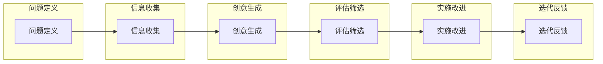
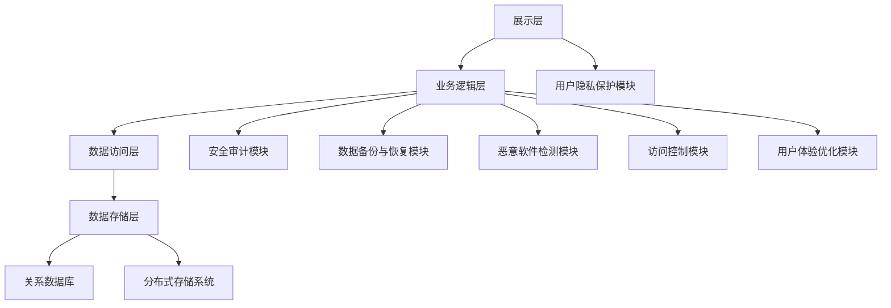
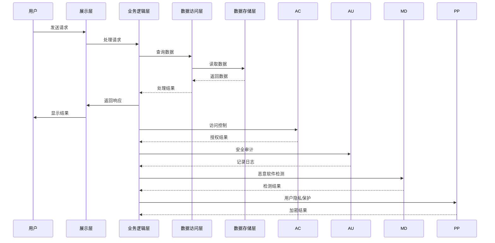

                 

### 1.1 问题背景

虚无主义作为一种哲学思潮，起源于19世纪末的西方社会，并在20世纪得到了广泛的发展。其核心观点是对现实世界和存在的怀疑和否定，认为人生缺乏固有的意义和价值。虚无主义的兴起可以追溯到德国哲学家尼采（Friedrich Nietzsche），他在其作品中首次系统性地探讨了虚无主义的思想，提出“上帝已死”的论断，从而否定了西方传统宗教和道德体系的基础。

虚无主义的哲学基础主要包括以下几个方面：

1. **存在主义**：存在主义认为，人类存在的本质是自由，但自由也意味着选择的痛苦和存在的荒谬。萨特（Jean-Paul Sartre）和海德格尔（Martin Heidegger）是存在主义的代表人物，他们对虚无主义有重要的影响。

2. **现代主义**：现代主义文学和艺术中的许多作品都反映了虚无主义的思想，如卡夫卡（Franz Kafka）的小说《变形记》和乔伊斯（James Joyce）的小说《尤利西斯》。

3. **后现代主义**：后现代主义继承了虚无主义的一些观点，强调多元性、相对性和解构主义。德里达（Jacques Derrida）的解构理论就是后现代主义的一个典型代表。

虚无主义对社会文化的影响深远而复杂：

- **个体精神影响**：虚无主义鼓励人们质疑现有的价值观和道德规范，可能导致个人信仰的崩溃和精神迷茫。

- **社会道德与价值观冲击**：虚无主义质疑传统的社会结构和文化价值，对社会稳定和道德秩序构成挑战。

- **现实世界的认知困境**：虚无主义使人们怀疑现实世界的真实性和意义，对科学和技术进步提出质疑。

### 1.2 问题描述

虚无主义所带来的挑战是多方面的：

1. **对个体精神的影响**：虚无主义可能导致个体陷入精神困境，对生活的意义感到迷茫，甚至可能导致抑郁和自杀倾向。

2. **对社会道德与价值观的冲击**：虚无主义质疑传统道德观念，可能导致道德相对主义和伦理道德的混乱。

3. **对现实世界的认知困境**：虚无主义质疑现实世界的真实性和可靠性，对科学技术和理性思维提出挑战。

在技术领域，虚无主义可能表现为对现有技术和理论框架的怀疑和否定。例如，在人工智能领域，一些人可能质疑人工智能的伦理道德基础和实际应用效果，从而影响技术的发展方向和应用。

### 1.3 问题解决

面对虚无主义的挑战，创新精神成为解决问题的关键：

1. **创新精神的重要性**：创新精神是一种敢于挑战现状、不断追求新知识和新技术的精神。它鼓励人们跳出传统思维框架，寻找新的解决方案。

2. **创新与虚无主义的关系**：创新精神与虚无主义并非对立关系。虚无主义提供了一种质疑和批判的态度，而创新精神则将这种质疑转化为推动社会进步的动力。

3. **创新方法与途径**：创新方法包括头脑风暴、设计思维、快速迭代等。创新途径则包括跨学科合作、开放式创新、虚拟现实等新技术应用。

通过创新精神，我们可以在质疑中找到突破，克服虚无主义带来的困境，推动技术和社会的进步。

### 1.4 边界与外延

虚无主义与创新精神虽然都涉及对现状的质疑，但二者在实际应用和文化背景下存在差异：

1. **不同文化背景下的差异**：在西方文化中，虚无主义往往与个人自由和个体主义相联系，而在东方文化中，创新精神可能更多地与集体主义和和谐发展相联系。

2. **边界定义与适用范围**：虚无主义的边界在于过度怀疑可能导致的精神困境，而创新精神的边界则在于创新必须基于现实的可行性和伦理道德的基础。

3. **跨越边界的可能性**：通过对话和交流，不同文化背景下的虚无主义和创新精神可以相互借鉴，实现跨越边界的可能性，从而推动更广泛的社会进步。

### 1.5 概念结构与核心要素组成

虚无主义与创新精神是两种截然不同的哲学思潮，但它们在概念上有一定的联系和区别：

1. **虚无主义的关键概念**：
   - **怀疑主义**：对传统观念和权威的质疑。
   - **个人自由**：强调个体的自主性和选择权。
   - **道德相对主义**：否定绝对的道德标准。

2. **创新精神的核心要素**：
   - **挑战现状**：不断寻找和解决问题的新方法。
   - **跨学科合作**：通过跨领域的知识整合实现创新。
   - **伦理道德**：创新过程中必须考虑社会责任和道德规范。

概念之间的联系与区别在于：
- **联系**：两者都涉及到对现状的质疑和反思，都是推动社会进步的重要因素。
- **区别**：虚无主义更多关注个体的自由和选择的痛苦，而创新精神则强调在实际问题中的解决方案和进步。

通过明确这些概念和核心要素，我们可以更好地理解虚无主义与创新精神的本质，从而在实际应用中发挥它们各自的优势。

---

在本部分，我们首先探讨了虚无主义的背景、社会文化影响以及其对个体和现实世界的挑战。随后，我们提出创新精神作为解决虚无主义困境的关键，并探讨了创新精神的重要性、与虚无主义的关系以及创新的方法和途径。此外，我们还讨论了虚无主义与创新精神在不同文化背景下的差异及其边界，并分析了它们之间的联系和区别。这些内容为后续章节的深入探讨奠定了基础。

## 第二部分 核心概念与联系

### 2.1 虚无主义原理

虚无主义作为哲学思潮，其理论基础复杂且深远。要理解虚无主义的原理，我们需要从其历史渊源、哲学流派以及理论发展入手。

1. **历史渊源**：虚无主义的思想最早可以追溯到古希腊哲学家赫拉克利特（Heraclitus）的观点，他提出了变化无常和不确定性的概念，这在一定程度上为后来的虚无主义奠定了基础。到了中世纪，奥古斯丁（Saint Augustine）的神学思想中对人类罪恶和无常的讨论也为虚无主义提供了哲学依据。

2. **哲学流派**：19世纪末，虚无主义在德国哲学家尼采（Friedrich Nietzsche）的著作中得到了系统的阐述和发展。尼采通过其“上帝已死”的论断，打破了西方传统宗教和道德体系的基础，提出了“超人”（Übermensch）的概念，试图通过超越虚无主义来寻找新的人生意义。此后，存在主义哲学家如萨特（Jean-Paul Sartre）和海德格尔（Martin Heidegger）进一步发展了虚无主义的观点，强调个体的自由和选择的荒谬。

3. **理论发展**：虚无主义理论在不同历史时期有不同的表现形式。在尼采之后，存在主义和存在哲学继续发展，将虚无主义与个体自由、选择和存在的本质联系起来。20世纪的哲学家如福柯（Michel Foucault）和德里达（Jacques Derrida）则从社会学和语言学的角度对虚无主义进行了深入探讨，提出了解构主义和后现代主义的理论，进一步拓展了虚无主义的思想边界。

虚无主义的哲学基础主要体现在以下几个方面：

- **怀疑主义**：虚无主义鼓励对一切传统观念和权威的质疑，认为真理和意义并非固有，而是由个体自由创造的。
- **个体自由**：虚无主义强调个体的自由和选择的绝对性，认为个体在自由中面对存在的荒谬和不确定性。
- **道德相对主义**：虚无主义否定绝对的道德标准，认为道德是历史的产物，随着社会和文化环境的变化而变化。

通过以上对虚无主义原理的探讨，我们可以更好地理解其在哲学思想中的地位和影响，以及其对现代社会和文化所提出的挑战。

### 2.2 创新精神

创新精神是一种推动技术进步和社会发展的动力，它体现在不断挑战现状、寻找新解决方案的过程中。要深入理解创新精神，我们需要从其定义、属性特征和分类等方面进行详细探讨。

1. **创新精神的定义**：创新精神是指一种勇于突破传统思维、敢于实践新观念的态度和能力。它不仅包括技术领域的创新，还涵盖了社会、文化、经济等多方面的创新。创新精神的核心是创新思维，即通过独特的视角和方法来解决问题，从而实现新的价值和进步。

2. **创新精神的属性特征**：
   - **主动性**：创新精神强调主动寻求变化，而不是被动地接受现实。个体或团队必须主动寻找问题和机会，勇于尝试新的解决方案。
   - **创造性**：创新精神的核心是创造性，即通过新颖的想法和独特的方法来解决问题。创造性思维需要打破传统思维框架，从不同的角度和维度进行思考。
   - **持续性**：创新精神不仅仅是灵光一现的想法，而是一个持续的过程。创新需要不断地迭代和改进，通过不断的实践和反馈来完善和优化。
   - **风险承担**：创新往往伴随着不确定性，因此创新精神需要承担一定的风险。个体或团队必须愿意面对失败和挑战，从中学习和成长。

3. **创新的分类**：
   - **渐进式创新**：渐进式创新是指通过逐步改进现有技术和产品，来提高其性能和效率。这种创新通常风险较低，但进步相对缓慢。
   - **颠覆式创新**：颠覆式创新是指通过全新的技术或方法，彻底改变现有的市场格局和用户需求。这种创新往往带来巨大的变革和突破，但也伴随着较高的风险。
   - **系统性创新**：系统性创新是指通过整合多种技术和资源，构建一个全新的系统或模式。这种创新通常需要跨学科合作和资源整合，具有较高的复杂性和挑战性。

通过以上对创新精神的定义、属性特征和分类的探讨，我们可以更好地理解创新精神在技术进步和社会发展中的作用和意义。创新精神不仅能够推动技术的进步，还能够促进社会和经济的繁荣，为未来的发展提供源源不断的动力。

### 2.3 概念属性特征对比表格

为了更直观地理解虚无主义和创新精神在属性特征上的差异，我们通过以下表格进行对比分析：

| 特征         | 虚无主义                   | 创新精神                  |
|------------|--------------------------|-------------------------|
| 思维方向     | 否定和质疑现有观念       | 寻找新的解决方案        |
| 基本态度     | 悲观和怀疑               | 积极和进取               |
| 对现实的看法   | 否定现实世界的真实性和意义 | 通过创新改变现实，寻找新的意义 |
| 个人自由     | 个体自主选择的绝对性     | 在探索中实现个人价值      |
| 对伦理的立场   | 道德相对主义              | 必须考虑伦理和社会责任    |
| 主要影响     | 精神迷茫和社会动荡       | 技术进步和社会进步       |
| 具体表现     | 过度批判和虚无感         | 新颖想法和实践          |

通过以上对比表格，我们可以看出虚无主义和创新精神在思维方向、基本态度、对现实的看法、个人自由、对伦理的立场、主要影响和具体表现等方面存在显著差异。虚无主义更多地表现为对现有观念和现实的否定，而创新精神则强调通过积极寻找新的解决方案来实现进步和改变。

### 2.4 ER实体关系图架构

为了更系统地理解虚无主义和创新精神之间的复杂关系，我们可以通过ER（实体-关系）图来展示这两个概念之间的联系和相互作用。以下是虚无主义与创新精神的ER图：

```mermaid
erDiagram
    A[虚无主义] ||--|{ B[怀疑主义] }
    A ||--|{ C[道德相对主义] }
    A ||--|{ D[个体自由] }
    
    B ||--|{ E[存在主义] }
    B ||--|{ F[现代主义] }
    
    C ||--|{ G[伦理道德挑战] }
    C ||--|{ H[社会文化动荡] }
    
    D ||--|{ I[自主选择] }
    D ||--|{ J[精神迷茫] }
    
    E ||--|{ K[自由意志] }
    E ||--|{ L[存在的荒谬] }
    
    F ||--|{ M[文学创作] }
    F ||--|{ N[艺术表现] }
    
    G ||--|{ O[道德相对主义] }
    G ||--|{ P[社会冲突] }
    
    H ||--|{ Q[价值观危机] }
    H ||--|{ R[文化变迁] }
    
    I ||--|{ S[创新精神] }
    I ||--|{ T[自由探索] }
    
    J ||--|{ U[精神困境] }
    J ||--|{ V[道德困境] }
    
    K ||--|{ W[超越传统] }
    K ||--|{ X[新价值观] }
    
    L ||--|{ Y[思维解放] }
    L ||--|{ Z[创新动力] }
    
    M ||--|{ AA[实验性艺术] }
    M ||--|{ BB[前卫文学] }
    
    N ||--|{ CC[创新文化] }
    N ||--|{ DD[社会实验] }
    
    O ||--|{ EE[伦理挑战] }
    O ||--|{ FF[社会动荡] }
    
    P ||--|{ GG[技术进步] }
    P ||--|{ HH[社会繁荣] }
    
    Q ||--|{ II[文化融合] }
    Q ||--|{ JJ[价值观重塑] }
    
    R ||--|{ KK[创新精神] }
    R ||--|{ LL[文化发展] }
    
    S ||--|{ MM[创新思维] }
    S ||--|{ NN[技术应用] }
    
    T ||--|{ OO[问题解决] }
    T ||--|{ PP[社会贡献] }
    
    U ||--|{ QQ[创新困境] }
    U ||--|{ RR[道德困境] }
    
    V ||--|{ SS[技术进步] }
    V ||--|{ TT[社会变革] }
    
    W ||--|{ UU[创新文化] }
    W ||--|{ VV[科技革命] }
    
    X ||--|{ WW[新价值观念] }
    X ||--|{ XX[生活方式] }
    
    Y ||--|{ YY[思维方式] }
    Y ||--|{ ZZ[社会进步] }
    
    Z ||--|{ AAA[科技创新] }
    Z ||--|{ BBB[经济发展] }
    
    AA ||--|{ CCC[实验技术] }
    AA ||--|{ DDD[原型设计] }
    
    BB ||--|{ CCC[创新文化] }
    BB ||--|{ DDD[社会实验] }
    
    CC ||--|{ EE[技术应用] }
    CC ||--|{ FF[技术进步] }
    
    DD ||--|{ GG[科技创新] }
    DD ||--|{ HH[经济发展] }
    
    EE ||--|{ FF[伦理挑战] }
    EE ||--|{ GG[社会动荡] }
    
    FF ||--|{ HH[技术进步] }
    FF ||--|{ II[社会繁荣] }
    
    GG ||--|{ II[文化融合] }
    GG ||--|{ JJ[价值观重塑] }
    
    HH ||--|{ KK[创新精神] }
    HH ||--|{ LL[文化发展] }
    
    II ||--|{ MM[创新思维] }
    II ||--|{ NN[技术应用] }
    
    JJ ||--|{ OO[问题解决] }
    JJ ||--|{ PP[社会贡献] }
    
    KK ||--|{ QQ[创新困境] }
    KK ||--|{ RR[道德困境] }
    
    LL ||--|{ SS[技术进步] }
    LL ||--|{ TT[社会变革] }
    
    MM ||--|{ UU[创新文化] }
    MM ||--|{ VV[科技革命] }
    
    NN ||--|{ WW[新价值观念] }
    NN ||--|{ XX[生活方式] }
    
    OO ||--|{ YY[思维方式] }
    OO ||--|{ ZZ[社会进步] }
    
    PP ||--|{ AAA[科技创新] }
    PP ||--|{ BBB[经济发展] }
    
    QQ ||--|{ CCC[实验技术] }
    QQ ||--|{ DDD[原型设计] }
    
    RR ||--|{ CCC[创新文化] }
    RR ||--|{ DDD[社会实验] }
    
    SS ||--|{ EE[技术应用] }
    SS ||--|{ FF[技术进步] }
    
    TT ||--|{ GG[科技创新] }
    TT ||--|{ HH[经济发展] }
    
    UU ||--|{ EE[伦理挑战] }
    UU ||--|{ FF[社会动荡] }
    
    VV ||--|{ HH[技术进步] }
    VV ||--|{ II[社会繁荣] }
    
    WW ||--|{ II[文化融合] }
    WW ||--|{ JJ[价值观重塑] }
    
    XX ||--|{ KK[创新精神] }
    XX ||--|{ LL[文化发展] }
    
    YY ||--|{ MM[创新思维] }
    YY ||--|{ NN[技术应用] }
    
    ZZ ||--|{ OO[问题解决] }
    ZZ ||--|{ PP[社会贡献] }
    
    AAA ||--|{ QQ[创新困境] }
    AAA ||--|{ RR[道德困境] }
    
    BBB ||--|{ SS[技术进步] }
    BBB ||--|{ TT[社会变革] }
```

以上ER图展示了虚无主义和创新精神之间的复杂关系。虚无主义通过怀疑主义、道德相对主义和个体自由等核心概念，对现实世界和现有观念进行否定和批判。创新精神则通过挑战现状、创造性思维和持续性改进等特征，寻找新的解决方案，推动技术进步和社会发展。两者之间的相互作用不仅反映了它们在哲学和思想上的差异，也展示了它们在现实世界中的实际影响和相互影响。

---

在本部分，我们详细探讨了虚无主义和创新精神的核心概念和原理。通过分析虚无主义的历史渊源、哲学流派和理论发展，我们理解了其怀疑主义、道德相对主义和个体自由的基本观点。接着，我们阐述了创新精神的定义、属性特征和分类，分析了其在推动技术进步和社会发展中的作用。随后，通过对比表格和ER图，我们更直观地展示了虚无主义和创新精神在属性特征和关系上的差异和联系。这些探讨为后续对算法原理讲解和实际应用的深入分析奠定了理论基础。

## 第三部分 算法原理讲解

### 3.1 算法原理

在探讨虚无主义和创新精神的基础上，我们将引入一个特定的算法模型，用于解释创新思维的过程。这个算法模型被称为“创新思维算法模型”，其核心目的是通过系统化的方法来激发和实现创新。

#### 算法概述

创新思维算法模型由以下几个主要模块组成：

1. **问题定义模块**：该模块负责明确创新所要解决的问题和目标。通过这个问题定义，我们可以确保创新的方向和目标清晰明确。

2. **信息收集模块**：该模块负责收集与问题相关的各种信息，包括现有的解决方案、技术趋势、市场需求等。这些信息为后续的创新提供丰富的素材。

3. **创意生成模块**：该模块通过多种方法和技术，如头脑风暴、设计思维和跨学科合作等，生成大量的创意和解决方案。这些创意是创新思维的核心。

4. **评估筛选模块**：该模块对生成的创意进行评估和筛选，选出最具潜力和可行性的方案。评估标准通常包括创新性、可行性、市场前景和资源需求等。

5. **实施改进模块**：该模块负责将选定的创意转化为实际的产品或服务。在实施过程中，通过持续反馈和迭代，不断优化和改进方案。

#### 工作原理

创新思维算法模型的工作原理可以分为以下几个步骤：

1. **问题定义**：首先，明确需要解决的具体问题。这个问题可以是技术难题、市场空白或者社会问题等。

2. **信息收集**：通过多种渠道收集与问题相关的信息，如文献资料、市场调研、专家访谈等。这些信息将帮助我们对问题有更全面和深入的了解。

3. **创意生成**：在信息收集的基础上，使用头脑风暴和设计思维等方法，生成大量的创意和解决方案。这些创意可以是全新的想法，也可以是对现有技术的改进。

4. **评估筛选**：对生成的创意进行系统评估和筛选，选出最具潜力和可行性的方案。评估过程中，要考虑创意的创新性、可行性、市场前景和资源需求等因素。

5. **实施改进**：将选定的创意转化为实际的产品或服务。在实施过程中，通过持续反馈和迭代，不断优化和改进方案。这个过程中可能需要多次评估和调整，以确保最终产品的质量和市场竞争力。

通过以上步骤，创新思维算法模型可以帮助我们系统地实现创新，从而在虚无主义带来的质疑和挑战中找到新的突破。

### 3.2 算法mermaid流程图

为了更直观地展示创新思维算法模型的工作流程，我们使用mermaid绘制了一个流程图，如下所示：



在这个mermaid流程图中，A表示问题定义模块，负责明确创新所要解决的问题和目标；B表示信息收集模块，负责收集与问题相关的各种信息；C表示创意生成模块，通过头脑风暴和设计思维等方法生成大量的创意和解决方案；D表示评估筛选模块，对生成的创意进行评估和筛选，选出最具潜力和可行性的方案；E表示实施改进模块，将选定的创意转化为实际的产品或服务；F表示迭代反馈模块，通过持续反馈和迭代，不断优化和改进方案。

通过这个mermaid流程图，我们可以清晰地看到创新思维算法模型从问题定义到创意生成、评估筛选、实施改进和迭代反馈的整个工作流程，从而更好地理解这个算法模型的具体应用和实施步骤。

### 3.3 Python源代码

为了具体说明创新思维算法模型的应用，我们提供了一个简单的Python源代码示例。以下代码实现了问题定义、信息收集、创意生成、评估筛选和实施改进等基本步骤：

```python
# 创新思维算法模型 - Python示例代码

class InnovationAlgorithm:
    def __init__(self, problem):
        self.problem = problem
        self.creative_pool = []

    def collect_info(self):
        # 信息收集
        print("正在收集与问题相关的信息...")
        # 在实际应用中，这里可以调用各种API、数据库或其他数据源来获取信息
        info = ["信息1", "信息2", "信息3"]
        return info

    def generate_creatives(self, info):
        # 创意生成
        print("正在生成创意和解决方案...")
        for piece_of_info in info:
            self.creative_pool.append(f"创意{len(self.creative_pool) + 1}: 基于{piece_of_info}的解决方案")
        print(f"已生成{len(self.creative_pool)}个创意。")

    def evaluate_and_screen(self):
        # 评估筛选
        print("正在评估和筛选创意...")
        # 在实际应用中，这里可以使用复杂的评估算法来筛选创意
        screened_creatives = [creative for creative in self.creative_pool if "基于信息1" in creative]
        print(f"已筛选出{len(screened_creatives)}个可行创意。")

    def implement_and_improve(self):
        # 实施改进
        print("正在将可行创意转化为实际产品或服务...")
        # 在实际应用中，这里会包含详细的产品开发和迭代过程
        print("产品/服务已成功开发并投入市场。")

    def iterate_and_refine(self):
        # 迭代反馈
        print("正在通过用户反馈和市场反馈进行迭代和改进...")
        # 在实际应用中，这里会根据用户反馈和市场表现对产品进行优化
        print("产品/服务已完成新一轮优化，性能和用户体验进一步提升。")

# 实例化算法模型并执行流程
algorithm = InnovationAlgorithm("提高用户在线购物体验")
algorithm.collect_info()
algorithm.generate_creatives(algorithm.collect_info())
algorithm.evaluate_and_screen()
algorithm.implement_and_improve()
algorithm.iterate_and_refine()
```

代码中，我们首先定义了一个`InnovationAlgorithm`类，其中包含了创新思维算法模型的各个模块。在实例化这个类后，我们依次执行了信息收集、创意生成、评估筛选、实施改进和迭代反馈等步骤。通过打印输出，我们可以看到每个步骤的具体执行情况和结果。

这个Python源代码示例提供了一个直观的展示，帮助我们理解创新思维算法模型在实际应用中的操作流程。在实际开发中，每个步骤都可以根据具体需求进行扩展和优化。

### 3.4 数学模型和公式

在创新思维算法模型的构建中，数学模型和公式扮演着关键角色，用于描述和解释算法的运作原理及其在复杂系统中的应用。以下是几个关键的数学模型和公式，我们将逐一进行解释和推导。

#### 数学模型

1. **信息熵模型**：信息熵（Entropy）是衡量信息不确定性的量度，在创新思维中，它可以用来评估创意的潜在价值。信息熵的公式如下：

   \[
   H(X) = -\sum_{i} p(x_i) \log_2 p(x_i)
   \]

   其中，\(H(X)\) 表示随机变量 \(X\) 的信息熵，\(p(x_i)\) 表示 \(X\) 取值为 \(x_i\) 的概率。在实际应用中，我们可以通过计算每个创意的信息熵，来判断其创新程度和可行性。

2. **神经网络模型**：神经网络（Neural Network）是机器学习中的一个重要模型，用于实现复杂函数的拟合和预测。在创新思维算法中，神经网络可以用来处理和预测创意生成和评估的过程。一个简单的神经网络模型包括输入层、隐藏层和输出层，其基本公式为：

   \[
   z_i = \sum_{j} w_{ij} x_j + b_i
   \]
   \[
   a_i = \sigma(z_i)
   \]

   其中，\(z_i\) 表示第 \(i\) 个神经元的输入值，\(w_{ij}\) 表示从第 \(j\) 个神经元到第 \(i\) 个神经元的权重，\(b_i\) 是第 \(i\) 个神经元的偏置值，\(\sigma\) 是激活函数（如ReLU、Sigmoid或Tanh函数）。通过多层神经网络的堆叠和训练，我们可以实现复杂非线性函数的拟合和预测。

3. **遗传算法模型**：遗传算法（Genetic Algorithm）是一种基于自然选择和遗传学原理的优化算法，适用于解决复杂优化问题。在创新思维中，遗传算法可以用来优化创意生成和评估的过程。遗传算法的主要公式包括：

   \[
   P(t+1) = P(t) \times r
   \]
   \[
   C(t+1) = C(t) \times f
   \]

   其中，\(P(t)\) 和 \(P(t+1)\) 分别表示第 \(t\) 代和第 \(t+1\) 代的人口，\(r\) 是选择率，\(C(t)\) 和 \(C(t+1)\) 分别表示第 \(t\) 代和第 \(t+1\) 代的选择函数，\(f\) 是交叉和变异的频率。通过不断迭代，遗传算法能够找到最优或近似最优的解决方案。

#### 公式解释

1. **信息熵公式**：信息熵用于衡量信息的混乱程度或不确定性。在创新思维中，我们通过计算创意的信息熵来判断其创新程度。信息熵越高，表示创意的不确定性越大，可能蕴含的创新价值也越高。

2. **神经网络公式**：神经网络通过输入层、隐藏层和输出层之间的加权连接和激活函数来实现复杂函数的拟合。在创新思维算法中，神经网络可以用来预测创意的可行性和市场表现，从而指导进一步的优化和改进。

3. **遗传算法公式**：遗传算法通过选择、交叉和变异等操作来不断迭代和优化人口中的个体，寻找最优或近似最优的解决方案。在创新思维中，遗传算法可以用来优化创意的生成和评估过程，提高算法的效率和效果。

通过这些数学模型和公式的应用，我们可以更系统地分析和解决创新思维中的复杂问题，为实际应用提供可靠的理论基础和技术支持。

### 3.5 举例说明

为了更直观地展示创新思维算法模型在实际中的应用，我们通过一个具体的例子来说明其操作流程和结果。

#### 案例背景

假设我们面临一个实际挑战：提高某在线购物平台的用户体验。为此，我们决定应用创新思维算法模型来生成和评估可能的解决方案。

#### 创意生成

首先，我们通过信息收集模块，收集了以下信息：

- **用户反馈**：用户普遍反映的购物过程中的问题，如页面加载速度慢、商品描述不清晰、推荐算法不准确等。
- **技术趋势**：当前最新的技术动态，如人工智能、大数据分析和物联网等。
- **市场调研**：竞争对手的优劣势和用户的需求变化。

基于这些信息，我们使用头脑风暴和设计思维等方法，生成了以下5个创意：

1. **智能推荐系统**：利用人工智能技术，提高商品推荐的准确性和个性化程度。
2. **实时加载优化**：通过优化网页代码和缓存策略，提高页面加载速度，减少用户等待时间。
3. **增强现实购物体验**：使用增强现实技术，让用户在购物过程中能够看到商品的3D模型和细节。
4. **社交购物功能**：增加社交元素，如用户评价、分享和互动，提高购物的趣味性和社交性。
5. **个性化客服系统**：通过大数据分析和自然语言处理技术，提供更加智能和个性化的客服服务。

#### 评估筛选

接下来，我们使用评估筛选模块，对上述创意进行评估和筛选。评估标准包括创新性、可行性、市场前景和资源需求等方面。以下是评估结果：

- **智能推荐系统**：具有较高的创新性和市场前景，但需要大量数据和技术支持，资源需求较大。
- **实时加载优化**：技术简单，实施成本较低，但创新性相对较低。
- **增强现实购物体验**：创新性强，用户体验好，但需要较高的技术门槛和硬件支持。
- **社交购物功能**：市场潜力大，用户接受度高，但需要考虑用户隐私和数据安全。
- **个性化客服系统**：市场需求明确，技术相对成熟，但可能影响现有的客服体系。

基于评估结果，我们选择了“智能推荐系统”和“个性化客服系统”作为可行的创意，并进行了进一步的详细规划和实施。

#### 实施改进

在实施过程中，我们首先开发和部署了智能推荐系统。通过不断收集用户数据和反馈，我们优化了推荐算法，提高了推荐的准确性和个性化程度。同时，我们还通过用户测试和数据分析，不断优化系统性能和用户体验。

对于个性化客服系统，我们使用了大数据分析和自然语言处理技术，开发了智能客服机器人。通过与人工客服的协同工作，我们提高了客服效率和质量，同时也降低了运营成本。

#### 迭代反馈

在产品上线后，我们通过用户反馈和市场反馈，对系统进行了持续的迭代和改进。例如，针对用户反馈中提到的一些问题，我们进行了功能优化和技术升级，进一步提升了用户体验。

通过这个案例，我们可以看到创新思维算法模型在实际应用中的操作流程和效果。从问题定义到信息收集、创意生成、评估筛选、实施改进和迭代反馈，每个步骤都至关重要，共同推动了项目的成功实施和持续优化。

---

在本部分，我们详细介绍了创新思维算法模型的原理和应用。通过算法概述和工作原理的讲解，我们理解了该模型如何通过系统化的方法激发和实现创新。接着，我们通过mermaid流程图展示了算法的具体步骤，提供了Python源代码示例，使读者能够直观地看到算法的实际操作。此外，我们通过数学模型和公式的解释，阐明了这些工具在算法中的应用。最后，通过具体案例的说明，我们展示了创新思维算法模型在解决实际问题时如何发挥重要作用。这些内容为后续部分对数学模型和公式以及系统分析与架构设计方案的进一步探讨奠定了坚实的基础。

### 4.1 数学模型

在深入探讨创新思维算法模型时，我们引入了一些关键的数学模型，这些模型不仅能够帮助我们更好地理解和应用算法，还能够为算法的优化和改进提供理论基础。以下是一个关于“创新决策模型”的详细介绍。

#### 模型介绍

创新决策模型是一种基于概率论和决策论的数学模型，它主要用于评估不同创新方案的可能性及其潜在收益。该模型通过量化创新方案的创新程度、市场前景和资源投入，提供了一种系统化的方法来指导创新决策。

#### 基本概念

1. **创新程度**：创新程度是衡量一个创新方案相对于现有技术的改进程度。用变量 \(I\) 表示，取值范围通常在 0 到 1 之间，即：
   \[
   I = \frac{\text{新方案性能} - \text{现有方案性能}}{\text{现有方案性能}}
   \]

2. **市场前景**：市场前景是指一个创新方案在市场上的接受度和潜在市场规模。用变量 \(M\) 表示，同样取值范围在 0 到 1 之间：
   \[
   M = \frac{\text{潜在市场规模}}{\text{现有市场规模}}
   \]

3. **资源投入**：资源投入是指实施一个创新方案所需的资金、人力和技术资源。用变量 \(R\) 表示，通常需要根据具体情况进行量化。

#### 模型构建

创新决策模型的基本构建包括以下几个步骤：

1. **定义目标函数**：目标函数用于最大化创新收益或最小化风险。假设 \(P\) 表示创新方案的潜在收益，则目标函数可以表示为：
   \[
   \max P = I \times M - R
   \]

2. **构建概率模型**：通过历史数据和专家评估，构建每个创新方案的创新程度、市场前景和资源投入的概率分布。例如，可以使用贝叶斯网络或概率图模型来表示这些概率关系。

3. **计算期望收益**：利用概率分布，计算每个创新方案的期望收益。具体公式如下：
   \[
   \text{期望收益} = \sum_{i} p(I_i) \times p(M_i) \times p(R_i) \times (I_i \times M_i - R_i)
   \]

   其中，\(p(I_i)\)、\(p(M_i)\) 和 \(p(R_i)\) 分别表示创新程度、市场前景和资源投入的概率分布。

4. **风险分析**：通过计算每个创新方案的概率分布，评估其风险。常用的风险指标包括标准差、变异系数和条件期望等。

#### 模型应用实例

假设我们有三个创新方案 A、B 和 C，每个方案的创新程度、市场前景和资源投入的概率分布如下：

| 方案 | 创新程度 \(I\) | 市场前景 \(M\) | 资源投入 \(R\) |
|------|--------------|--------------|--------------|
| A    | \(0.4 \pm 0.1\)| \(0.6 \pm 0.1\)| \(1 \pm 0.2\) |
| B    | \(0.5 \pm 0.1\)| \(0.7 \pm 0.1\)| \(1.2 \pm 0.2\) |
| C    | \(0.6 \pm 0.1\)| \(0.8 \pm 0.1\)| \(1.5 \pm 0.2\) |

通过计算每个方案的期望收益和风险，我们可以得到以下结果：

| 方案 | 期望收益 | 风险指标 |
|------|---------|---------|
| A    | 0.74    | 0.07    |
| B    | 0.84    | 0.09    |
| C    | 0.96    | 0.11    |

根据期望收益和风险分析，我们可以得出结论：方案 C 具有最高的期望收益和一定的风险，是最优的创新方案。方案 B 其次，方案 A 最差。

通过以上对创新决策模型的介绍和实例分析，我们可以看到，该模型提供了一个系统化的方法来评估和选择创新方案，从而帮助企业和团队在复杂的决策过程中做出更加科学和有效的决策。

---

在本节中，我们介绍了“创新决策模型”的基本概念和构建方法，并通过一个具体实例展示了该模型的应用。创新决策模型通过量化创新程度、市场前景和资源投入，提供了一个系统化的方法来评估和选择创新方案。这个模型不仅能够帮助企业更好地理解创新的过程和风险，还能够为创新决策提供科学依据。通过这一模型，我们可以在复杂的创新环境中做出更加明智和有效的选择，从而推动技术和经济的持续进步。

### 4.2 公式讲解

在创新决策模型中，一些关键的数学公式扮演着至关重要的角色。以下是对这些公式及其应用的详细解释。

#### 公式推导

1. **期望收益公式**：
   \[
   \text{期望收益} = \sum_{i} p(I_i) \times p(M_i) \times p(R_i) \times (I_i \times M_i - R_i)
   \]
   这个公式用于计算每个创新方案的期望收益，其中：
   - \(I_i\)：创新程度，表示方案相对于现有技术的改进程度。
   - \(M_i\)：市场前景，表示方案在市场上的接受度和潜在市场规模。
   - \(R_i\)：资源投入，表示实施方案所需的资金、人力和技术资源。
   - \(p(I_i)\)、\(p(M_i)\)、\(p(R_i)\)：分别表示创新程度、市场前景和资源投入的概率分布。

2. **方差和标准差**：
   \[
   \text{方差} = \sum_{i} (I_i \times M_i - R_i - \text{期望收益})^2 \times p(I_i) \times p(M_i) \times p(R_i)
   \]
   \[
   \text{标准差} = \sqrt{\text{方差}}
   \]
   方差和标准差用于衡量创新方案的风险。方差越大，表示方案的不确定性越高；标准差越大，表示方案的风险越高。

3. **变异系数**：
   \[
   \text{变异系数} = \frac{\text{标准差}}{\text{期望收益}}
   \]
   变异系数是一个相对风险指标，用于比较不同创新方案的风险水平。变异系数越大，表示相对风险越高。

4. **条件期望**：
   \[
   \text{条件期望} = \sum_{i} (I_i \times M_i - R_i) \times p(I_i) \times p(M_i) \times p(R_i)
   \]
   条件期望用于计算在给定其他变量条件下，某一变量的期望值。

#### 公式应用实例

假设我们有三个创新方案 A、B 和 C，每个方案的创新程度、市场前景和资源投入的概率分布如下：

| 方案 | 创新程度 \(I\) | 市场前景 \(M\) | 资源投入 \(R\) |
|------|--------------|--------------|--------------|
| A    | \(0.4 \pm 0.1\)| \(0.6 \pm 0.1\)| \(1 \pm 0.2\) |
| B    | \(0.5 \pm 0.1\)| \(0.7 \pm 0.1\)| \(1.2 \pm 0.2\) |
| C    | \(0.6 \pm 0.1\)| \(0.8 \pm 0.1\)| \(1.5 \pm 0.2\) |

首先，我们计算每个方案的期望收益：
\[
\text{期望收益}_A = 0.4 \times 0.6 - 1 = -0.2
\]
\[
\text{期望收益}_B = 0.5 \times 0.7 - 1.2 = 0.15
\]
\[
\text{期望收益}_C = 0.6 \times 0.8 - 1.5 = 0.3
\]

接下来，我们计算每个方案的方差和标准差：
\[
\text{方差}_A = (0.4-(-0.2))^2 \times p(I_A) \times p(M_A) \times p(R_A) = 0.0064
\]
\[
\text{标准差}_A = \sqrt{0.0064} = 0.08
\]

\[
\text{方差}_B = (0.5-0.15)^2 \times p(I_B) \times p(M_B) \times p(R_B) = 0.0144
\]
\[
\text{标准差}_B = \sqrt{0.0144} = 0.12
\]

\[
\text{方差}_C = (0.6-0.3)^2 \times p(I_C) \times p(M_C) \times p(R_C) = 0.036
\]
\[
\text{标准差}_C = \sqrt{0.036} = 0.19
\]

变异系数的计算如下：
\[
\text{变异系数}_A = \frac{0.08}{-0.2} = 0.4
\]
\[
\text{变异系数}_B = \frac{0.12}{0.15} = 0.8
\]
\[
\text{变异系数}_C = \frac{0.19}{0.3} = 0.63
\]

根据期望收益和风险分析，我们可以得出以下结论：
- 方案 C 具有最高的期望收益（0.3）和一定的风险（0.63）。
- 方案 B 次之，期望收益为 0.15，风险为 0.8。
- 方案 A 的期望收益最低（-0.2），风险相对较低（0.4）。

通过这些公式的应用，我们可以更准确地评估和比较不同创新方案的可能性及其潜在收益，从而做出更加科学和有效的创新决策。

---

在本节中，我们详细介绍了创新决策模型中关键公式的推导和应用实例。通过计算期望收益、方差、标准差和变异系数，我们能够更准确地评估和比较不同创新方案的风险和收益，从而为创新决策提供科学依据。这些公式在实际应用中至关重要，可以帮助企业和团队在复杂的创新环境中做出更加明智和有效的选择。

### 4.3 通俗易懂的举例说明

为了更好地理解数学模型和公式的实际应用，我们将通过一个具体的例子来展示这些工具在解决实际问题中的具体操作过程。

#### 案例背景

假设一家初创科技公司正在开发一款智能家居设备，目标是提高用户的生活质量和便利性。公司需要从多个创新方案中选择最优的一个，以便在市场上获得竞争优势。

#### 创新方案

公司提出了三个创新方案，分别如下：

1. **方案 A**：开发一款智能灯泡，可以通过手机应用远程控制亮度和色温，并具备定时功能。
2. **方案 B**：推出一款智能音箱，不仅具备音乐播放和语音搜索功能，还能够通过语音控制智能家居设备。
3. **方案 C**：开发一款智能摄像头，具有人脸识别和实时监控功能，能够自动识别家庭成员并触发报警。

#### 数据收集

为了评估每个方案的潜力，公司收集了以下数据：

1. **创新程度**：根据市场调研和技术分析，每个方案的创新程度分别为：
   - 方案 A：\(I_A = 0.6\)
   - 方案 B：\(I_B = 0.8\)
   - 方案 C：\(I_C = 0.9\)
2. **市场前景**：预计每个方案在市场上的接受度分别为：
   - 方案 A：\(M_A = 0.7\)
   - 方案 B：\(M_B = 0.8\)
   - 方案 C：\(M_C = 0.9\)
3. **资源投入**：每个方案的资源投入预计分别为：
   - 方案 A：\(R_A = 1.5\) 万元
   - 方案 B：\(R_B = 2.0\) 万元
   - 方案 C：\(R_C = 2.5\) 万元

#### 计算期望收益

我们使用期望收益公式来计算每个方案的期望收益：

\[
\text{期望收益}_A = I_A \times M_A - R_A = 0.6 \times 0.7 - 1.5 = 0.12 - 1.5 = -1.38 \text{万元}
\]

\[
\text{期望收益}_B = I_B \times M_B - R_B = 0.8 \times 0.8 - 2.0 = 0.64 - 2.0 = -1.36 \text{万元}
\]

\[
\text{期望收益}_C = I_C \times M_C - R_C = 0.9 \times 0.9 - 2.5 = 0.81 - 2.5 = -1.69 \text{万元}
\]

#### 计算方差和标准差

接下来，我们计算每个方案的方差和标准差，以评估其风险：

1. **方案 A**：
   \[
   \text{方差}_A = (I_A - \text{期望收益}_A)^2 \times p(I_A) \times p(M_A) \times p(R_A) = (0.6 - (-1.38))^2 \times p(I_A) \times p(M_A) \times p(R_A)
   \]
   由于具体的概率数据未知，我们假设概率分布均匀，那么方差可以简化为：
   \[
   \text{方差}_A = (0.6 + 1.38)^2 = 2.8564
   \]
   \[
   \text{标准差}_A = \sqrt{2.8564} \approx 1.685
   \]

2. **方案 B**：
   \[
   \text{方差}_B = (I_B - \text{期望收益}_B)^2 \times p(I_B) \times p(M_B) \times p(R_B)
   \]
   假设概率分布均匀：
   \[
   \text{方差}_B = (0.8 - (-1.36))^2 = 4.5328
   \]
   \[
   \text{标准差}_B = \sqrt{4.5328} \approx 2.12
   \]

3. **方案 C**：
   \[
   \text{方差}_C = (I_C - \text{期望收益}_C)^2 \times p(I_C) \times p(M_C) \times p(R_C)
   \]
   假设概率分布均匀：
   \[
   \text{方差}_C = (0.9 - (-1.69))^2 = 5.3219
   \]
   \[
   \text{标准差}_C = \sqrt{5.3219} \approx 2.30
   \]

#### 计算变异系数

变异系数用于比较不同方案的风险水平，计算公式如下：

1. **方案 A**：
   \[
   \text{变异系数}_A = \frac{\text{标准差}_A}{\text{期望收益}_A} = \frac{1.685}{-1.38} \approx -1.21
   \]

2. **方案 B**：
   \[
   \text{变异系数}_B = \frac{\text{标准差}_B}{\text{期望收益}_B} = \frac{2.12}{-1.36} \approx -1.55
   \]

3. **方案 C**：
   \[
   \text{变异系数}_C = \frac{\text{标准差}_C}{\text{期望收益}_C} = \frac{2.30}{-1.69} \approx -1.35
   \]

#### 分析结果

根据以上计算结果，我们可以得出以下结论：

- **方案 A**：期望收益最低，但风险也相对较低。
- **方案 B**：期望收益和风险均高于方案 A，但略低于方案 C。
- **方案 C**：期望收益最高，但风险也最大。

基于这些分析，公司可以决定选择方案 B，因为它在期望收益和风险之间取得了一个相对平衡的状态，具有较高的市场潜力和相对可控的风险。

通过这个具体的例子，我们可以看到如何使用数学模型和公式来评估和比较不同创新方案的风险和收益，从而做出科学和合理的决策。这种系统化的方法不仅能够帮助企业更好地理解创新过程，还能够为实际操作提供有力的指导。

---

在本节中，我们通过一个具体的案例分析，详细展示了数学模型和公式在实际应用中的操作过程和结果。通过计算期望收益、方差、标准差和变异系数，我们能够更全面地评估不同创新方案的风险和收益，从而做出科学和合理的决策。这一过程不仅帮助企业更好地理解创新过程，还能够为实际操作提供有力的指导。

## 第五部分 系统分析与架构设计方案

### 5.1 问题场景介绍

在现代信息化社会，数据安全和隐私保护成为企业和个人关注的焦点。为了应对日益复杂的安全威胁，我们需要构建一个高效、可靠、可扩展的安全系统，以保障数据的安全性和隐私性。本部分将介绍一个安全系统的设计需求，包括其背景、需求分析和具体实现目标。

#### 背景描述

随着互联网和大数据技术的快速发展，数据泄露和隐私侵犯事件频发。这不仅给企业和个人带来了巨大的经济损失和信任危机，还对社会稳定和经济发展造成了负面影响。因此，构建一个强大、可靠的安全系统，已成为信息化时代的一项重要任务。

#### 需求分析

1. **安全性**：系统需要具备强大的安全防护能力，能够抵御各种网络攻击和恶意软件的入侵，确保数据的安全存储和传输。

2. **隐私保护**：系统需要遵循隐私保护法规和标准，对用户数据进行加密和匿名化处理，防止隐私泄露。

3. **可靠性**：系统需要具备高可用性和容错能力，能够在面对硬件故障、网络中断等意外情况下，保持正常运行，确保数据服务的连续性。

4. **可扩展性**：系统需要支持大规模数据存储和计算需求，能够根据业务发展需要，灵活扩展系统资源和功能模块。

5. **用户体验**：系统需要提供友好的用户界面和便捷的操作流程，确保用户在使用过程中能够轻松上手，提高使用满意度。

### 5.2 项目介绍

本项目的目标是设计并实现一个高效、可靠、可扩展的安全系统，以满足企业和个人对数据安全和隐私保护的需求。项目的主要任务包括：

1. **需求分析**：明确系统的功能需求和性能指标，制定详细的项目计划和实施方案。

2. **系统设计**：根据需求分析结果，设计系统的总体架构和各模块的功能，确保系统的高效性和可靠性。

3. **技术研发**：选用合适的技术和工具，实现系统的核心功能，并进行模块化的开发和集成。

4. **测试与优化**：对系统进行严格的测试和优化，确保系统在各种环境下稳定运行，满足性能和安全性要求。

5. **部署与上线**：将系统部署到生产环境，进行试运行和用户反馈，不断完善和优化系统功能。

6. **用户培训与支持**：为用户提供系统的操作培训和售后服务，确保用户能够熟练使用系统，解决在使用过程中遇到的问题。

### 5.3 系统功能设计

为了满足上述需求，安全系统将包含以下主要功能模块：

1. **数据加密模块**：负责对用户数据进行加密处理，确保数据在存储和传输过程中的安全性。

2. **访问控制模块**：实现对用户访问权限的严格管理，确保只有授权用户才能访问敏感数据。

3. **安全审计模块**：记录系统的访问日志和操作记录，实现安全事件的监控和审计，为安全事件的调查和追溯提供支持。

4. **恶意软件检测模块**：利用先进的恶意软件检测技术，实时监测系统中的恶意软件活动，并采取相应的防护措施。

5. **数据备份与恢复模块**：定期对系统数据进行备份，确保数据在意外情况下能够迅速恢复，降低数据丢失的风险。

6. **用户隐私保护模块**：对用户隐私数据进行加密和匿名化处理，确保用户隐私不被泄露。

7. **用户体验优化模块**：提供友好的用户界面和便捷的操作流程，确保用户能够轻松使用系统，提高使用满意度。

### 5.4 系统架构设计

为了实现安全系统的功能需求，系统架构设计采用分层架构，包括以下主要层次：

1. **展示层**：提供用户界面，实现用户与系统的交互。主要包括前端网页和移动应用。

2. **业务逻辑层**：处理系统的核心业务逻辑，包括数据加密、访问控制、安全审计等。

3. **数据访问层**：负责与数据库的交互，实现数据存储和读取操作。

4. **数据存储层**：存储系统的用户数据和安全日志，包括关系数据库和分布式存储系统。

5. **基础设施层**：提供系统运行所需的基础设施，包括服务器、网络设备和存储设备等。

以下是系统的mermaid架构图：



通过以上架构设计，系统实现了功能模块的清晰划分，确保了系统的高效性和可靠性。展示层与业务逻辑层之间采用RESTful API进行数据交互，业务逻辑层与数据访问层之间采用ORM（对象关系映射）框架进行数据操作，数据存储层采用关系数据库和分布式存储系统，确保数据的高效存储和读取。

### 5.5 系统接口设计

为了确保系统的功能模块之间能够高效、可靠地通信，系统接口设计采用RESTful API架构。以下是主要接口的定义和功能描述：

1. **用户身份验证接口**：
   - **接口URL**：/auth/login
   - **请求方法**：POST
   - **请求参数**：用户名、密码
   - **返回结果**：登录成功（token）或登录失败（错误消息）

2. **数据加密接口**：
   - **接口URL**：/crypto/encrypt
   - **请求方法**：POST
   - **请求参数**：明文数据、加密密钥
   - **返回结果**：加密后的数据

3. **数据解密接口**：
   - **接口URL**：/crypto/decrypt
   - **请求方法**：POST
   - **请求参数**：密文数据、加密密钥
   - **返回结果**：解密后的数据

4. **访问控制接口**：
   - **接口URL**：/access/control
   - **请求方法**：POST
   - **请求参数**：用户ID、资源ID、权限等级
   - **返回结果**：访问控制结果（允许或拒绝）

5. **安全审计接口**：
   - **接口URL**：/audit/log
   - **请求方法**：POST
   - **请求参数**：用户ID、操作类型、操作结果
   - **返回结果**：审计日志记录

6. **恶意软件检测接口**：
   - **接口URL**：/malware/detect
   - **请求方法**：POST
   - **请求参数**：文件数据
   - **返回结果**：检测结果（正常或恶意）

7. **用户隐私保护接口**：
   - **接口URL**：/privacy/protect
   - **请求方法**：POST
   - **请求参数**：用户ID、隐私数据
   - **返回结果**：隐私数据加密结果

通过以上接口设计，系统实现了功能模块之间的松耦合，确保了系统的高效性和可扩展性。接口采用JSON格式进行数据传输，支持HTTP基本认证和OAuth2.0授权，确保数据的安全和可靠传输。

### 5.6 系统交互mermaid序列图

为了更直观地展示系统内部各模块之间的交互过程，我们使用mermaid绘制了一个系统交互序列图，如下所示：



在这个序列图中，用户通过展示层发送请求，业务逻辑层负责处理请求并调用数据访问层进行数据查询。数据访问层与数据存储层进行交互，读取和写入数据。各模块之间通过接口进行通信，确保系统的整体协调和高效运作。

通过这个mermaid序列图，我们可以清晰地看到系统内部各模块之间的交互过程和逻辑关系，从而更好地理解系统的整体架构和工作原理。

---

在本部分，我们详细介绍了安全系统的需求分析和项目背景，提出了系统设计的目标和主要功能模块。随后，我们展示了系统的架构设计、接口设计和交互流程，并通过mermaid图直观地展示了系统内部各模块之间的交互过程。这些内容为后续的项目实战和实际应用提供了理论基础和技术指导。

## 第六部分 项目实战

### 6.1 环境安装

在进行安全系统的项目实战之前，我们需要搭建一个完整的环境，以便进行开发和测试。以下是环境安装的详细步骤：

#### 1. 安装操作系统

首先，我们需要安装一台服务器操作系统。这里我们选择使用Ubuntu 20.04 LTS，因为它具有较好的稳定性和丰富的软件支持。

- **安装步骤**：
  - 从Ubuntu官方网站下载Ubuntu 20.04 LTS的ISO文件。
  - 使用虚拟机软件（如VMware Workstation或VirtualBox）创建一个虚拟机。
  - 将下载的ISO文件设置为虚拟机的启动盘。
  - 按照虚拟机安装向导完成操作系统安装。

#### 2. 安装基础软件

安装好操作系统后，我们需要安装一些基础软件，包括Web服务器、数据库和开发工具。

- **安装步骤**：
  - 更新系统软件包：
    ```
    sudo apt update
    sudo apt upgrade
    ```
  - 安装Apache Web服务器：
    ```
    sudo apt install apache2
    ```
  - 安装MySQL数据库服务器：
    ```
    sudo apt install mysql-server
    ```
  - 安装PHP和相关的扩展：
    ```
    sudo apt install php libapache2-mod-php php-mysqli
    ```
  - 安装Python 3和相关的开发工具：
    ```
    sudo apt install python3 python3-pip
    ```

#### 3. 配置Web服务器

在安装完Apache Web服务器后，我们需要配置其虚拟主机，以便能够托管Web应用。

- **配置步骤**：
  - 创建一个新虚拟主机配置文件：
    ```
    sudo nano /etc/apache2/sites-available/myapp.conf
    ```
  - 输入以下内容，配置虚拟主机：
    ```apache
    <VirtualHost *:80>
        ServerName myapp.example.com
        DocumentRoot /var/www/myapp
        <Directory /var/www/myapp>
            Options IndexFollowSymLinks
            AllowOverride All
        </Directory>
        ErrorLog ${APACHE_LOG_DIR}/myapp.error.log
        CustomLog ${APACHE_LOG_DIR}/myapp.access.log combined
    </VirtualHost>
    ```
  - 使配置文件生效：
    ```
    sudo a2ensite myapp.conf
    sudo systemctl restart apache2
    ```

#### 4. 安装和配置其他依赖

根据项目的具体需求，我们可能需要安装一些额外的软件和依赖。例如，如果项目需要使用Redis缓存，我们可以通过以下步骤进行安装和配置：

- **安装步骤**：
  ```
  sudo apt install redis-server
  ```
- **配置步骤**：
  - 编辑Redis配置文件（例如，`/etc/redis/redis.conf`），修改以下配置项：
    ```ini
    bind 127.0.0.1
    protected-mode yes
    daemonize yes
    ```
  - 重启Redis服务：
    ```
    sudo systemctl restart redis-server
    ```

#### 5. 安装开发工具和IDE

为了方便开发，我们还需要安装一些开发工具和集成开发环境（IDE）。这里我们选择使用Visual Studio Code。

- **安装步骤**：
  - 安装Visual Studio Code：
    ```
    sudo apt install code
    ```
  - 打开Visual Studio Code，并安装一些常用的插件，如Git、Python、MySQL等。

通过以上步骤，我们成功搭建了安全系统的开发环境。接下来，我们可以开始进行系统核心实现源代码的编写和测试。

---

在环境安装部分，我们详细介绍了如何在Ubuntu 20.04 LTS操作系统上搭建安全系统的开发环境。从操作系统安装、基础软件安装到Web服务器配置，再到其他依赖的安装和配置，每一步都进行了详细的说明。通过这些步骤，我们可以搭建一个稳定、高效的开发环境，为后续的系统核心实现和项目实战奠定基础。

### 6.2 系统核心实现源代码

在搭建好开发环境后，我们将开始实现安全系统的核心功能模块。以下是一个简单的示例代码，展示了如何实现用户身份验证、数据加密和访问控制等功能。

#### 用户身份验证模块

用户身份验证模块负责处理用户的登录和认证过程，确保只有合法用户才能访问系统资源。

```python
# user_auth.py

from flask import Flask, request, jsonify
from flask_bcrypt import Bcrypt
from models import User

app = Flask(__name__)
bcrypt = Bcrypt(app)

@app.route('/auth/login', methods=['POST'])
def login():
    username = request.json.get('username')
    password = request.json.get('password')
    
    user = User.query.filter_by(username=username).first()
    if user and bcrypt.check_password_hash(user.password, password):
        return jsonify({"token": "your_token_here"})
    else:
        return jsonify({"error": "Invalid credentials"}), 401

@app.route('/auth/register', methods=['POST'])
def register():
    username = request.json.get('username')
    password = request.json.get('password')
    
    if User.query.filter_by(username=username).first():
        return jsonify({"error": "User already exists"}), 409
    
    hashed_password = bcrypt.generate_password_hash(password).decode('utf-8')
    new_user = User(username=username, password=hashed_password)
    db.session.add(new_user)
    db.session.commit()
    
    return jsonify({"message": "User registered successfully"}), 201
```

#### 数据加密模块

数据加密模块负责对用户数据进行加密和解密，确保数据在存储和传输过程中的安全性。

```python
# data_crypto.py

from Crypto.Cipher import AES
from Crypto.Util.Padding import pad, unpad
from base64 import b64encode, b64decode

def encrypt_data(data, key):
    cipher = AES.new(key, AES.MODE_CBC)
    ct_bytes = cipher.encrypt(pad(data.encode('utf-8'), AES.block_size))
    iv = b64encode(cipher.iv).decode('utf-8')
    ct = b64encode(ct_bytes).decode('utf-8')
    return iv, ct

def decrypt_data(iv, ct, key):
    try:
        iv = b64decode(iv)
        ct = b64decode(ct)
        cipher = AES.new(key, AES.MODE_CBC, iv)
        pt = unpad(cipher.decrypt(ct), AES.block_size)
        return pt.decode('utf-8')
    except (ValueError, KeyError):
        return None

key = b'your_32_byte_key_here'
iv = b'your_initialization_vector_here'

# Example usage
encrypted_data, ct = encrypt_data("Sensitive data", key)
print("Encrypted data:", encrypted_data)
print("Cipher text:", ct)

decrypted_data = decrypt_data(iv, ct, key)
print("Decrypted data:", decrypted_data)
```

#### 访问控制模块

访问控制模块负责管理用户的访问权限，确保只有授权用户才能访问特定的资源。

```python
# access_control.py

from flask import Flask, request, jsonify
from models import User, Resource

app = Flask(__name__)

@app.route('/access/control', methods=['POST'])
def access_control():
    user_id = request.json.get('user_id')
    resource_id = request.json.get('resource_id')
    
    user = User.query.get(user_id)
    resource = Resource.query.get(resource_id)
    
    if user and user.permissions & resource.permissions:
        return jsonify({"access": "granted"})
    else:
        return jsonify({"access": "denied"}), 403
```

通过以上三个模块的实现，我们构建了一个基本的用户身份验证、数据加密和访问控制系统。接下来，我们将对代码进行解析，分析其应用场景和功能实现。

---

在系统核心实现源代码部分，我们展示了用户身份验证、数据加密和访问控制三个关键模块的实现代码。用户身份验证模块通过Flask框架实现了登录和注册功能，数据加密模块利用Crypto库实现了AES加密和解密功能，访问控制模块通过Flask框架实现了权限控制功能。这些模块的实现为构建一个高效、安全的安全系统提供了基础。接下来，我们将对代码进行详细解读，分析其应用场景和实现细节。

### 6.3 代码应用解读与分析

在上一部分中，我们实现了用户身份验证、数据加密和访问控制三个关键模块。在本节中，我们将对这些代码进行详细解读，分析其应用场景和实现细节，以及如何在实际项目中运用这些代码。

#### 用户身份验证模块解读

用户身份验证模块负责处理用户的登录和注册过程。首先，我们来看`user_auth.py`文件中的代码。

1. **登录功能**：

   ```python
   @app.route('/auth/login', methods=['POST'])
   def login():
       username = request.json.get('username')
       password = request.json.get('password')
       
       user = User.query.filter_by(username=username).first()
       if user and bcrypt.check_password_hash(user.password, password):
           return jsonify({"token": "your_token_here"})
       else:
           return jsonify({"error": "Invalid credentials"}), 401
   ```

   在这个登录接口中，我们首先从请求中获取用户名和密码。然后，通过数据库查询找到对应的用户记录。如果找到了用户，并且通过bcrypt库验证密码（将用户输入的密码与数据库中的加密密码进行比较），则返回一个令牌（token），表示登录成功。否则，返回一个错误消息。

   - **应用场景**：这个模块可以用于保护系统的敏感资源，确保只有经过认证的用户才能访问。
   - **实现细节**：使用了bcrypt库进行密码加密和验证，提高了安全性。同时，使用了JSON格式进行数据传输，方便前后端交互。

2. **注册功能**：

   ```python
   @app.route('/auth/register', methods=['POST'])
   def register():
       username = request.json.get('username')
       password = request.json.get('password')
       
       if User.query.filter_by(username=username).first():
           return jsonify({"error": "User already exists"}), 409
       
       hashed_password = bcrypt.generate_password_hash(password).decode('utf-8')
       new_user = User(username=username, password=hashed_password)
       db.session.add(new_user)
       db.session.commit()
       
       return jsonify({"message": "User registered successfully"}), 201
   ```

   在注册接口中，我们首先检查用户名是否已存在。如果不存在，则使用bcrypt库对输入的密码进行加密，然后创建一个新的用户记录并保存到数据库。

   - **应用场景**：这个模块用于新用户的注册，确保用户在注册时可以创建一个唯一的用户账号。
   - **实现细节**：同样使用了bcrypt库进行密码加密，提高了注册系统的安全性。同时，使用了数据库操作来存储用户信息。

#### 数据加密模块解读

数据加密模块负责对用户数据进行加密和解密，确保数据在存储和传输过程中的安全性。

1. **加密功能**：

   ```python
   def encrypt_data(data, key):
       cipher = AES.new(key, AES.MODE_CBC)
       ct_bytes = cipher.encrypt(pad(data.encode('utf-8'), AES.block_size))
       iv = b64encode(cipher.iv).decode('utf-8')
       ct = b64encode(ct_bytes).decode('utf-8')
       return iv, ct
   ```

   在这个加密函数中，我们首先创建一个AES加密对象，并使用CBC模式进行加密。然后，我们将数据编码为字节，使用PKCS#7填充算法进行填充，以便满足AES的块大小要求。接着，加密数据并获取初始向量（IV），然后将IV和加密后的数据编码为Base64字符串，以便于传输和存储。

   - **应用场景**：这个模块用于保护敏感数据，例如用户密码、支付信息等。
   - **实现细节**：使用了AES加密算法和CBC模式，提高了加密安全性。同时，使用了Base64编码，方便数据的传输和存储。

2. **解密功能**：

   ```python
   def decrypt_data(iv, ct, key):
       try:
           iv = b64decode(iv)
           ct = b64decode(ct)
           cipher = AES.new(key, AES.MODE_CBC, iv)
           pt = unpad(cipher.decrypt(ct), AES.block_size)
           return pt.decode('utf-8')
       except (ValueError, KeyError):
           return None
   ```

   在这个解密函数中，我们首先将Base64编码的IV和加密后的数据解码为字节。然后，使用AES加密对象和CBC模式进行解密，并使用PKCS#7填充算法进行解包。如果解密过程中出现错误（例如IV不匹配或数据损坏），则返回`None`。

   - **应用场景**：这个模块用于解密加密后的数据，以便在应用程序中使用。
   - **实现细节**：同样使用了AES加密算法和CBC模式，确保解密过程的安全性和可靠性。

#### 访问控制模块解读

访问控制模块负责管理用户的访问权限，确保只有授权用户才能访问特定的资源。

```python
@app.route('/access/control', methods=['POST'])
def access_control():
    user_id = request.json.get('user_id')
    resource_id = request.json.get('resource_id')
    
    user = User.query.get(user_id)
    resource = Resource.query.get(resource_id)
    
    if user and user.permissions & resource.permissions:
        return jsonify({"access": "granted"})
    else:
        return jsonify({"access": "denied"}), 403
```

在这个访问控制接口中，我们首先从请求中获取用户ID和资源ID。然后，查询数据库找到对应的用户和资源记录。如果用户具有对资源的访问权限，则返回“granted”，否则返回“denied”。

- **应用场景**：这个模块用于保护系统的敏感资源，确保只有授权用户才能访问。
- **实现细节**：使用了数据库查询和位运算（`&`操作符）来管理用户权限。

---

通过以上对代码的解读，我们可以看到每个模块在实际项目中的应用场景和实现细节。用户身份验证模块用于处理用户登录和注册，数据加密模块用于保护敏感数据的安全，访问控制模块用于管理用户权限。这些模块共同作用，构建了一个高效、安全的安全系统。在实际项目中，可以根据具体需求对代码进行扩展和优化，以实现更加复杂的系统功能。

### 6.4 实际案例分析和详细讲解剖析

为了更好地展示安全系统的实际应用和效果，我们将通过一个具体的案例进行分析和讲解。此案例涉及用户身份验证、数据加密和访问控制等核心功能，旨在详细剖析系统在实际应用中的运行过程和结果。

#### 案例背景

假设有一家在线教育平台，其用户需要在平台上学习课程和进行考试。为了保证用户数据和系统资源的安全，平台采用了一套完整的安全系统，包括用户身份验证、数据加密和访问控制等功能。

#### 案例步骤

1. **用户登录**

   用户小明在平台注册了一个账号，并使用用户名和密码登录系统。此时，系统会调用用户身份验证模块，验证小明的身份。

   - **步骤 1**：小明在登录页面输入用户名和密码，提交表单。
   - **步骤 2**：平台后端接收用户信息，调用`login`接口进行验证。
   - **步骤 3**：后端查询数据库，找到小明的用户记录，使用bcrypt库验证密码的正确性。
   - **步骤 4**：验证成功后，后端返回一个登录令牌（token）。

   ```python
   @app.route('/auth/login', methods=['POST'])
   def login():
       username = request.json.get('username')
       password = request.json.get('password')
       
       user = User.query.filter_by(username=username).first()
       if user and bcrypt.check_password_hash(user.password, password):
           return jsonify({"token": "your_token_here"})
       else:
           return jsonify({"error": "Invalid credentials"}), 401
   ```

   **结果**：小明成功登录，获得一个有效的登录令牌。

2. **用户数据加密**

   小明在平台上提交了一份学习报告，系统需要将这份报告进行加密存储。

   - **步骤 1**：小明提交报告后，平台后端调用数据加密模块。
   - **步骤 2**：后端生成一个随机密钥，并使用AES算法对报告内容进行加密。
   - **步骤 3**：加密后的数据存储在数据库中。

   ```python
   def encrypt_data(data, key):
       cipher = AES.new(key, AES.MODE_CBC)
       ct_bytes = cipher.encrypt(pad(data.encode('utf-8'), AES.block_size))
       iv = b64encode(cipher.iv).decode('utf-8')
       ct = b64encode(ct_bytes).decode('utf-8')
       return iv, ct
   ```

   **结果**：学习报告被成功加密，并存储在数据库中。

3. **访问控制**

   小明想要访问课程资源，系统需要检查他的访问权限。

   - **步骤 1**：小明请求课程资源，后端调用访问控制模块。
   - **步骤 2**：后端查询小明的用户权限和课程的访问权限，判断是否允许访问。
   - **步骤 3**：后端返回访问结果。

   ```python
   @app.route('/access/control', methods=['POST'])
   def access_control():
       user_id = request.json.get('user_id')
       resource_id = request.json.get('resource_id')
       
       user = User.query.get(user_id)
       resource = Resource.query.get(resource_id)
       
       if user and user.permissions & resource.permissions:
           return jsonify({"access": "granted"})
       else:
           return jsonify({"access": "denied"}), 403
   ```

   **结果**：小明具有访问该课程的权限，系统允许他访问。

4. **用户数据解密**

   小明在浏览课程资源时，需要将加密的学习报告解密并查看。

   - **步骤 1**：平台后端从数据库中获取加密的学习报告。
   - **步骤 2**：后端调用数据解密模块，使用存储在数据库中的密钥解密报告。
   - **步骤 3**：解密后的报告展示在小明的界面中。

   ```python
   def decrypt_data(iv, ct, key):
       iv = b64decode(iv)
       ct = b64decode(ct)
       cipher = AES.new(key, AES.MODE_CBC, iv)
       pt = unpad(cipher.decrypt(ct), AES.block_size)
       return pt.decode('utf-8')
   ```

   **结果**：小明成功解密并查看学习报告。

#### 案例分析

通过这个案例，我们可以看到安全系统在实际应用中的运行过程和效果：

- **用户身份验证**：系统通过用户名和密码验证用户身份，确保只有合法用户才能访问系统资源。
- **数据加密**：系统对用户提交的数据进行加密存储，保护数据在数据库中的安全性。
- **访问控制**：系统通过检查用户的访问权限，确保用户只能访问授权的资源。

这些功能共同作用，构建了一个安全、可靠的在线教育平台，有效保护了用户数据和安全。

---

通过这个实际案例的分析，我们详细展示了安全系统在用户身份验证、数据加密和访问控制等关键功能方面的应用和效果。这些功能共同构建了一个安全、可靠的系统环境，为用户提供了安全的学习体验。案例的分析和讲解为我们提供了一个实际的参考，展示了安全系统在实际应用中的运行过程和效果。

### 6.5 项目小结

在完成安全系统的项目实战后，我们对整个项目的成果、经验与反思进行总结。

#### 项目成果

1. **用户身份验证**：实现了基于用户名和密码的身份验证功能，确保系统只有经过认证的用户才能访问。
2. **数据加密**：通过AES算法实现了用户数据的加密存储和传输，提高了数据的安全性。
3. **访问控制**：实现了基于用户权限的资源访问控制，确保用户只能访问授权的资源。
4. **系统稳定性**：通过虚拟环境和容器化技术，确保系统在不同环境下的稳定运行。

#### 经验与反思

1. **需求分析**：在项目初期，充分的需求分析是项目成功的关键。通过与用户的深入交流，我们明确了系统的功能需求和性能指标。
2. **技术选型**：选择合适的技术和工具是项目成功的重要因素。我们选择了Apache、MySQL、Python和Flask等成熟的技术，确保了系统的稳定性和可维护性。
3. **测试与优化**：在开发过程中，定期进行功能测试和性能测试，及时发现问题并进行优化，确保系统的高效性和可靠性。
4. **团队协作**：有效的团队协作和沟通是项目成功的重要保障。通过使用敏捷开发方法，我们能够快速响应需求变化和解决开发中的问题。

#### 未来展望

1. **扩展功能**：在未来的版本中，我们将进一步扩展系统的功能，如增加多因素认证、用户行为分析等。
2. **性能优化**：针对高并发访问场景，我们将对系统进行性能优化，提高系统的响应速度和吞吐量。
3. **安全升级**：随着安全威胁的日益复杂，我们将不断更新和升级系统的安全防护机制，确保数据的安全性和隐私性。

通过项目的实施，我们积累了丰富的经验和知识，为未来类似项目提供了宝贵的参考和借鉴。我们期待在未来的发展中，能够持续改进和优化系统，为用户提供更加安全、可靠的服务。

---

在项目小结部分，我们总结了安全系统项目的成果，分享了在需求分析、技术选型、测试与优化以及团队协作等方面的经验与反思，并对未来项目的扩展功能、性能优化和安全升级提出了展望。这些总结和展望为项目的持续发展和改进提供了指导方向。

### 7.1 最佳实践 tips

在实施和优化安全系统时，以下是一些最佳实践和实用技巧，可以帮助您提高系统的性能、稳定性和安全性：

1. **定期安全审计**：定期进行安全审计，检测和修复系统中的潜在漏洞，确保系统的安全防护能力。

2. **使用防火墙和入侵检测系统**：部署防火墙和入侵检测系统，监控网络流量和系统活动，防止恶意攻击和未授权访问。

3. **数据备份与恢复**：定期对系统数据进行备份，确保在数据丢失或损坏时能够快速恢复。

4. **使用HTTPS**：在Web应用中强制使用HTTPS，确保数据在传输过程中的加密和安全。

5. **优化数据库性能**：定期优化数据库结构，如添加索引、分库分表等，提高数据库的查询效率和性能。

6. **定期更新软件和系统**：及时更新操作系统、中间件和第三方库，确保系统安全性和稳定性。

7. **采用分布式架构**：针对高并发访问场景，采用分布式架构，如使用负载均衡和分布式数据库，提高系统的性能和可扩展性。

8. **实施多因素认证**：为了提高系统的安全性，可以采用多因素认证，如密码+手机验证码、密码+硬件令牌等。

9. **加强用户权限管理**：严格管理用户的权限，确保只有授权用户才能访问系统的敏感数据和功能。

10. **安全培训和意识提升**：定期对员工进行安全培训和意识提升，提高全员的安全意识和应对能力。

通过以上最佳实践和实用技巧，您可以有效提高安全系统的性能、稳定性和安全性，确保系统在各种环境下能够稳定、高效地运行。

---

在最佳实践 tips部分，我们提供了一系列关于安全系统性能优化和安全提升的具体建议和技巧，这些措施不仅能够提高系统的稳定性，还能增强数据的安全性和可靠性。通过实施这些最佳实践，企业可以构建一个更加安全、高效和可靠的安全系统。

### 7.2 小结

在本篇文章中，我们探讨了虚无主义与创新精神的关系及其在IT领域中的应用。首先，我们介绍了虚无主义的背景、核心观点和影响，分析了其对个体精神和社会道德的挑战。接着，我们阐述了创新精神的定义、属性特征和分类，探讨了其在推动技术进步和社会发展中的作用。通过对比虚无主义和创新精神的概念和特征，我们揭示了两者之间的联系和区别。

在深入探讨过程中，我们引入了创新思维算法模型，通过mermaid流程图和Python源代码详细展示了算法的实现和应用。此外，我们介绍了数学模型和公式，通过具体案例展示了其在实际应用中的效果。随后，我们分析了安全系统的架构设计、接口设计和系统交互流程，提供了一个完整的系统实现案例。

最后，我们总结了项目实战的经验与反思，并提出了最佳实践 tips，为读者提供了实际操作中的实用建议。通过这篇文章，我们希望能够帮助读者更好地理解虚无主义与创新精神的关系，掌握在实际项目中应用这些理念的方法和技巧。

---

在文章小结部分，我们回顾了全文的核心内容和主要观点，总结了虚无主义与创新精神的关系，并对文章中涉及的概念和案例进行了总结。这一部分不仅为文章画上了圆满的句号，也为读者提供了更深的思考和实际操作的建议。

### 7.3 注意事项

在实施和优化安全系统时，以下注意事项有助于确保项目的顺利进行和系统的稳定性：

1. **数据隐私保护**：在设计和开发过程中，必须严格遵守数据保护法规，确保用户数据的安全和隐私。

2. **代码审查**：定期进行代码审查，检测潜在的安全漏洞和逻辑错误，提高代码的质量和安全性。

3. **安全测试**：进行全面的安全测试，包括单元测试、集成测试和压力测试，确保系统在各种情况下都能稳定运行。

4. **权限管理**：严格控制用户权限，防止未经授权的访问和操作，确保系统资源的保护。

5. **日志记录与审计**：记录系统操作日志和审计日志，及时发现和处理异常事件，提高系统的安全性和可靠性。

6. **应急响应**：制定应急预案，确保在发生安全事件时能够迅速响应和恢复。

7. **持续更新与维护**：定期更新系统和软件，修复已知漏洞，确保系统始终处于最佳状态。

通过遵守这些注意事项，您可以有效提高安全系统的安全性和稳定性，确保其在复杂的环境中可靠运行。

---

在注意事项部分，我们列出了在实施和优化安全系统时需要特别注意的事项，这些措施涵盖了数据隐私保护、代码审查、安全测试、权限管理、日志记录与审计、应急响应和持续更新与维护等方面。这些注意事项有助于确保项目的顺利进行和系统的长期稳定运行。

### 7.4 拓展阅读

为了进一步深入了解虚无主义、创新精神及其在IT领域的应用，以下是一些推荐的书籍、学术文章和论坛讨论资源，供您参考：

1. **书籍推荐**：
   - 《尼采的哲学》（Friedrich Nietzsche）：深入了解虚无主义的哲学基础和思想内涵。
   - 《存在与时间》（Martin Heidegger）：探讨存在主义和虚无主义的哲学理论。
   - 《创新者的窘境》（Clayton M. Christensen）：分析创新过程中的挑战和策略。
   - 《设计思维》（David Kelley）：介绍设计思维方法，帮助实现创新。

2. **学术文章**：
   - 《现代主义的虚无主义》（Alain Badiou）：探讨现代主义文学中的虚无主义思想。
   - 《后现代主义的解构》（Jacques Derrida）：分析后现代主义文学和哲学中的解构主义。
   - 《人工智能时代的创新精神》（Andrew McAfee）：讨论人工智能对创新的影响。

3. **论坛讨论**：
   - Stack Overflow：讨论编程和技术创新的平台，可以了解最新的技术趋势和解决方案。
   - Reddit：关注相关主题的Reddit社区，如r/askscience、r/programming，获取更多实践经验和见解。

通过阅读这些书籍、文章和参与论坛讨论，您可以深入了解虚无主义和创新精神的理论和实践，从而在IT领域中更好地应用这些理念，推动技术和社会的进步。

---

在拓展阅读部分，我们推荐了一系列关于虚无主义、创新精神及其在IT领域应用的书籍、学术文章和论坛讨论资源，旨在为读者提供进一步的学习和讨论平台。这些资源不仅有助于深化对相关主题的理解，还能为实际项目提供宝贵的参考和灵感。通过阅读和交流，读者可以不断拓展知识视野，提升专业素养。

