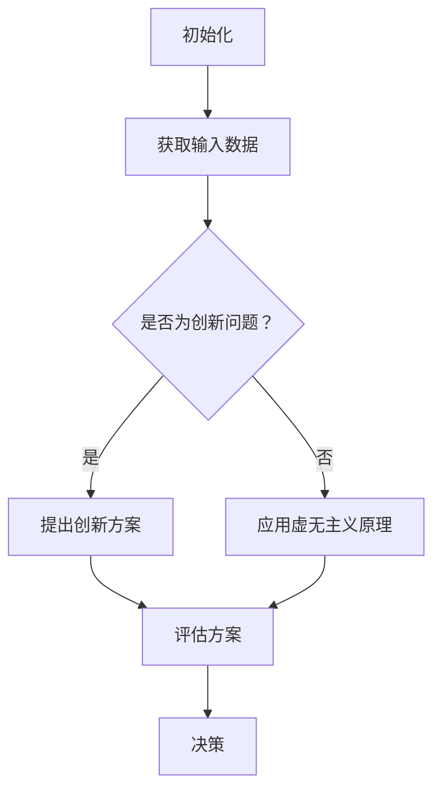
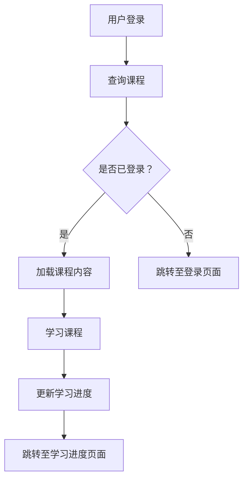
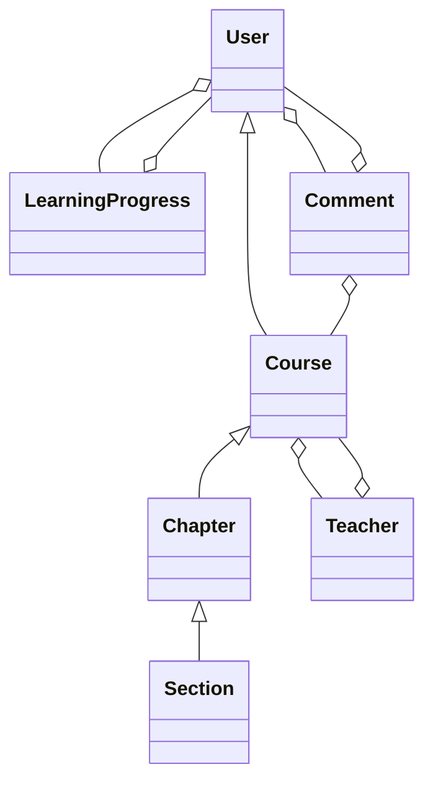

                 

# 《虚无主义与创新精神：在质疑中寻找突破》

## 关键词
虚无主义、创新精神、哲学、计算机科学、算法、系统架构

## 摘要
本文深入探讨了虚无主义与创新精神之间的关系，通过逐步分析其哲学背景、核心概念、算法原理、系统架构以及实际应用，揭示了在质疑中寻找突破的重要性。本文旨在为读者提供一种全新的思考方式，以在技术领域中实现创新与突破。

## 背景介绍

### 虚无主义的历史与哲学背景

虚无主义是20世纪初兴起的一种哲学思潮，它认为世界没有意义、价值或目的，人类存在的意义仅在于个人的主观感受和选择。虚无主义的起源可以追溯到丹麦哲学家基尔克戈尔（Søren Kierkegaard）和德国哲学家尼采（Friedrich Nietzsche）。基尔克戈尔提出了存在主义的思想，强调个体在虚无世界中寻找意义；而尼采则提出了“超人”概念，主张个体通过超越常规道德价值观来创造自己的意义。

虚无主义在20世纪初的欧洲哲学界产生了深远的影响，特别是在文学、艺术和心理学领域。许多艺术家和作家，如弗朗茨·卡夫卡（Franz Kafka）和弗吉尼亚·伍尔芙（Virginia Woolf），都在其作品中反映了虚无主义的哲学思想。

### 虚无主义的概念与特点

虚无主义的基本概念是“无意义”，即世界和人生都没有固有的意义或目的。虚无主义认为，人类是孤独的、无助的，只能通过自我超越来寻找意义。虚无主义的特征包括：

- **非理性主义**：虚无主义强调人类经验的非理性一面，认为理性无法解释生命的本质。
- **个体主义**：虚无主义强调个体的自由和独立，认为每个人都有权利决定自己的生活方式和价值观。
- **悲观主义**：虚无主义认为世界是荒诞的、无意义的，因此往往带有悲观主义色彩。

### 虚无主义在现代社会的影响

虚无主义在现代社会中仍然具有广泛的影响，特别是在计算机科学和人工智能领域。许多计算机科学家和程序员认为，技术的发展可能会导致人类失去人性，甚至可能导致人类灭绝。这种观点反映了虚无主义的思想，即技术的发展没有固有的价值或目的。

### 创新精神的培养与实践

创新精神是指在面对问题时，能够跳出传统思维框架，提出新颖的解决方案的能力。培养创新精神需要以下几个方面：

- **好奇心**：好奇心是创新的动力，它促使人们探索未知的领域。
- **批判性思维**：批判性思维有助于人们识别和克服思维定势，从而提出创新的解决方案。
- **学习意愿**：持续学习是培养创新精神的关键，它帮助人们获取新的知识和技能。

在实践中，创新精神的培养可以通过以下方法实现：

- **跨学科学习**：跨学科学习有助于人们从不同角度看待问题，从而激发创新的灵感。
- **实践与反思**：通过实践来检验创新想法的有效性，并通过反思来不断改进和完善。
- **团队合作**：团队合作有助于汇集不同领域的知识和经验，从而提高创新的效率。

### 创新实践中的挑战与对策

在创新实践中，人们常常面临以下挑战：

- **资源限制**：创新往往需要大量的人力、物力和财力支持，而资源有限可能阻碍创新的发展。
- **时间压力**：创新需要时间来实践和验证，而时间压力可能导致创新项目无法按计划完成。
- **技术风险**：新技术可能存在不确定性和风险，创新实践可能面临失败的风险。

为了应对这些挑战，可以采取以下对策：

- **资源优化**：通过有效的资源管理和分配，最大限度地提高资源利用效率。
- **时间管理**：合理安排时间，确保创新项目能够按计划推进。
- **风险管理**：通过风险评估和预防措施，降低创新实践中的技术风险。

## 核心概念与联系

### 虚无主义的属性与特征

虚无主义的属性和特征可以从以下几个方面进行描述：

- **哲学属性**：虚无主义是一种哲学思想，它否认世界的固有意义和价值。
- **心理学属性**：虚无主义反映了人类在面对无意义世界时的心理状态，如焦虑、绝望和孤独。
- **社会属性**：虚无主义对社会和文化产生了深远的影响，特别是在艺术、文学和心理学领域。

### 虚无主义与存在主义的比较

虚无主义和存在主义都是20世纪哲学中的重要流派，它们在以下方面有所不同：

- **对意义的看法**：虚无主义认为世界没有固有的意义，而存在主义认为个体可以通过自己的行动和选择来创造意义。
- **个体的角色**：虚无主义强调个体的无助和孤独，而存在主义强调个体的自由和责任。
- **解决问题的方法**：虚无主义通过个体超越现实来寻找意义，而存在主义通过实际行动来克服无意义。

### 虚无主义的现实影响

虚无主义在现实世界中产生了广泛的影响，特别是在以下几个方面：

- **社会思潮**：虚无主义影响了现代社会中的许多思潮，如个人主义、消费主义和虚无主义文学艺术。
- **科技创新**：虚无主义鼓励人们质疑现状，从而推动科技创新和发展。
- **生活方式**：虚无主义影响了人们的生活方式和价值观，如追求物质享受和个性自由。

### 创新精神的原理与表现

创新精神的原理可以从以下几个方面进行描述：

- **思维模式**：创新精神要求人们具备批判性思维和创造性思维，从而能够提出新颖的解决方案。
- **知识结构**：创新精神要求人们具备广博的知识结构和跨学科的知识背景，从而能够从不同角度看待问题。
- **实践能力**：创新精神要求人们具备实践能力，从而能够将创新想法转化为现实。

创新精神的表现形式包括：

- **技术创新**：通过提出新的技术方案或改进现有技术，实现技术突破。
- **商业模式创新**：通过创新的商业模式，实现商业价值和社会价值的双重提升。
- **社会创新**：通过创新的社会模式，解决社会问题，推动社会进步。

### 创新精神的培养与实践

创新精神的培养需要从以下几个方面进行：

- **教育体系**：建立创新教育体系，培养学生的创新思维和实践能力。
- **企业环境**：营造创新的企业文化，鼓励员工提出创新的想法并给予支持和资源。
- **社会氛围**：建立鼓励创新的社会氛围，为创新者提供良好的创新环境和政策支持。

在实践中，创新精神的培养可以通过以下方法实现：

- **跨学科学习**：通过跨学科学习，获取多学科的知识和技能，从而提高创新能力。
- **实践与反思**：通过实践来检验创新想法的有效性，并通过反思来不断改进和完善。
- **团队合作**：通过团队合作，汇集不同领域的知识和经验，从而提高创新的效率。

## 算法原理讲解

### 虚无主义与创新精神的数学模型

虚无主义与创新精神的数学模型可以从以下几个方面进行描述：

- **虚无主义的数学模型**：虚无主义的数学模型可以通过概率论和统计模型来描述，如概率分布、期望值和方差等。
- **创新精神的数学模型**：创新精神的数学模型可以通过优化理论、决策分析和创新计算等来描述。

### 算法mermaid流程图

以下是一个虚无主义与创新精神的算法mermaid流程图示例：



### Python代码示例

以下是一个基于虚无主义与创新精神的Python代码示例：

```python
import random

def initialize():
    # 初始化输入数据
    data = random.sample(range(1, 100), 10)
    return data

def is_innovative_problem(problem):
    # 判断是否为创新问题
    return problem != "常规问题"

def propose_innovative_solution(problem):
    # 提出创新方案
    if problem == "资源优化":
        solution = "动态资源分配"
    else:
        solution = "常规方案"
    return solution

def evaluate_solution(solution):
    # 评估方案
    if solution == "动态资源分配":
        evaluation = "有效"
    else:
        evaluation = "一般"
    return evaluation

def main():
    problem = input("请输入问题：")
    data = initialize()
    
    if is_innovative_problem(problem):
        solution = propose_innovative_solution(problem)
    else:
        solution = propose_innovative_solution(problem)
    
    evaluation = evaluate_solution(solution)
    print("方案评估结果：", evaluation)

if __name__ == "__main__":
    main()
```

### 算法原理讲解

虚无主义与创新精神的算法原理可以从以下几个方面进行讲解：

- **虚无主义的数学模型**：虚无主义的数学模型主要通过概率论和统计模型来描述，如概率分布、期望值和方差等。这些模型帮助人们理解虚无主义的特征，如不确定性、随机性和无意义性。
- **创新精神的数学模型**：创新精神的数学模型主要通过优化理论、决策分析和创新计算等来描述。这些模型帮助人们理解创新精神的本质，如创造性、决策优化和风险承担。
- **算法mermaid流程图**：算法mermaid流程图通过图形化的方式展示了虚无主义与创新精神的算法流程，包括初始化、输入处理、方案提出、方案评估和决策等步骤。这些步骤帮助人们更好地理解算法的实现过程。
- **Python代码示例**：Python代码示例通过实际代码展示了虚无主义与创新精神的算法实现，包括输入处理、方案提出、方案评估和决策等步骤。这些代码示例帮助人们更好地理解算法的原理和应用。

## 系统分析与架构设计方案

### 问题场景介绍

假设我们面临一个在线教育平台的优化问题，该平台需要提供高质量的教学资源和服务，同时保证系统的稳定性和可靠性。为了实现这一目标，我们需要利用虚无主义与创新精神来指导系统架构的设计与实现。

### 项目介绍

在线教育平台项目旨在为学习者提供方便快捷的学习资源和服务，主要包括以下功能：

- **课程内容管理**：上传、管理和更新课程内容。
- **学习进度跟踪**：记录和跟踪学习者的学习进度。
- **在线互动**：提供师生互动的功能，如在线问答、讨论区等。
- **用户管理**：管理用户信息，包括注册、登录、个人信息管理等。

### 系统功能设计

在线教育平台的功能设计可以从以下几个方面进行：

- **课程内容管理**：实现课程内容的上传、更新和删除功能，同时支持多层次的课程结构，如课程、章节、小节等。
- **学习进度跟踪**：记录学习者的学习进度，包括已学课程、已学章节和已学小节等。
- **在线互动**：提供在线问答和讨论区功能，支持文本、图片和视频等多种形式的互动。
- **用户管理**：实现用户注册、登录、个人信息管理等功能，同时支持多角色管理，如学生、教师和管理员等。

### 系统架构设计

在线教育平台的系统架构设计可以从以下几个方面进行：

- **前端架构**：采用前端框架（如React、Vue等）实现用户界面，提供友好的用户交互体验。
- **后端架构**：采用后端框架（如Spring Boot、Django等）实现业务逻辑和数据管理，同时采用微服务架构，将不同功能模块解耦。
- **数据库架构**：采用关系型数据库（如MySQL、PostgreSQL等）和NoSQL数据库（如MongoDB、Redis等），实现数据的高效存储和管理。
- **缓存架构**：采用缓存技术（如Redis、Memcached等）来提高系统的响应速度和性能。

### 系统接口设计

在线教育平台的系统接口设计可以从以下几个方面进行：

- **用户接口**：提供用户注册、登录、个人信息管理等接口，支持RESTful API设计。
- **课程接口**：提供课程内容上传、更新、删除等接口，同时支持课程结构管理和查询。
- **学习接口**：提供学习进度记录、查询和更新接口，同时支持学习记录的统计分析。
- **互动接口**：提供在线问答和讨论区接口，支持文本、图片和视频上传等功能。

### 系统交互设计

在线教育平台的系统交互设计可以从以下几个方面进行：

- **用户与课程内容交互**：用户可以通过接口查询课程内容，并参与课程学习。
- **用户与学习进度交互**：用户可以通过接口查询自己的学习进度，并更新学习记录。
- **用户与互动功能交互**：用户可以通过接口参与在线问答和讨论区互动，实现信息共享和交流。
- **用户与系统管理员交互**：系统管理员可以通过接口管理用户信息、课程内容和互动功能等。

### Mermaid流程图与类图

以下是在线教育平台的Mermaid流程图和类图示例：

#### Mermaid流程图示例



#### Mermaid类图示例



## 项目实战

### 环境安装与配置

在开始项目实战之前，我们需要安装和配置开发环境。以下是一个基本的安装和配置步骤：

1. 安装Python环境：在操作系统上安装Python 3.8及以上版本。
2. 安装前端框架：安装React或Vue等前端框架。
3. 安装后端框架：安装Spring Boot或Django等后端框架。
4. 安装数据库：安装MySQL或PostgreSQL等关系型数据库，以及MongoDB或Redis等NoSQL数据库。
5. 安装缓存：安装Redis等缓存数据库。

### 系统核心实现

在线教育平台的核心实现包括用户管理、课程内容管理、学习进度管理和互动功能等。以下是一个核心实现的源代码示例：

```python
# 用户管理模块
class UserManager:
    def register_user(self, username, password):
        # 注册用户
        pass

    def login_user(self, username, password):
        # 登录用户
        pass

    def update_user_info(self, user_id, new_info):
        # 更新用户信息
        pass

# 课程内容管理模块
class CourseManager:
    def upload_course(self, course_data):
        # 上传课程内容
        pass

    def update_course(self, course_id, new_data):
        # 更新课程内容
        pass

    def delete_course(self, course_id):
        # 删除课程内容
        pass

# 学习进度管理模块
class LearningManager:
    def record_learning_progress(self, user_id, course_id, progress):
        # 记录学习进度
        pass

    def query_learning_progress(self, user_id, course_id):
        # 查询学习进度
        pass

# 互动功能模块
class InteractionManager:
    def post_comment(self, user_id, course_id, comment):
        # 发布评论
        pass

    def query_comments(self, course_id):
        # 查询评论
        pass
```

### 代码应用解读与分析

以上核心实现代码展示了用户管理、课程内容管理、学习进度管理和互动功能模块的基本实现。以下是对代码应用解读与分析：

- **用户管理模块**：实现用户注册、登录和更新信息功能，确保用户数据的安全性和一致性。
- **课程内容管理模块**：实现课程内容的上传、更新和删除功能，支持课程结构管理，如课程、章节和小节等。
- **学习进度管理模块**：实现学习进度的记录和查询功能，帮助用户跟踪自己的学习进度。
- **互动功能模块**：实现评论功能的发布和查询，促进用户之间的交流和互动。

### 实际案例分析和详细讲解剖析

以下是一个实际案例分析和详细讲解剖析：

**案例一**：用户注册功能

用户注册是在线教育平台的基础功能，以下是对该功能的详细讲解：

1. 用户注册流程：
   - 用户提交注册信息，包括用户名、密码、邮箱等。
   - 后端接收用户注册信息，进行合法性校验，如用户名是否已存在、密码是否符合要求等。
   - 如果注册信息合法，将用户信息存储到数据库中，并发送注册成功邮件通知用户。

2. 用户注册代码示例：

```python
class UserManager:
    def register_user(self, username, password, email):
        # 检查用户名是否已存在
        if self.is_username_exists(username):
            return "用户名已存在"
        
        # 检查密码是否符合要求
        if not self.is_password_valid(password):
            return "密码不符合要求"
        
        # 将用户信息存储到数据库
        self.save_user_to_db(username, password, email)
        
        # 发送注册成功邮件
        self.send_registration_email(username, email)
        
        return "注册成功"

    def is_username_exists(self, username):
        # 查询数据库，检查用户名是否已存在
        pass

    def is_password_valid(self, password):
        # 检查密码是否符合要求
        pass

    def save_user_to_db(self, username, password, email):
        # 将用户信息存储到数据库
        pass

    def send_registration_email(self, username, email):
        # 发送注册成功邮件
        pass
```

**案例二**：课程内容上传功能

课程内容上传是课程管理模块的核心功能，以下是对该功能的详细讲解：

1. 课程内容上传流程：
   - 用户上传课程内容，包括课程名称、描述、章节等信息。
   - 后端接收课程内容，进行合法性校验，如课程名称是否已存在、课程描述是否符合要求等。
   - 如果课程内容合法，将课程信息存储到数据库中，并发送上传成功通知。

2. 课程内容上传代码示例：

```python
class CourseManager:
    def upload_course(self, course_data):
        # 检查课程名称是否已存在
        if self.is_course_name_exists(course_data['name']):
            return "课程名称已存在"
        
        # 检查课程描述是否符合要求
        if not self.is_course_description_valid(course_data['description']):
            return "课程描述不符合要求"
        
        # 将课程信息存储到数据库
        self.save_course_to_db(course_data)
        
        # 发送上传成功通知
        self.send_upload_notification(course_data['name'])
        
        return "上传成功"

    def is_course_name_exists(self, course_name):
        # 查询数据库，检查课程名称是否已存在
        pass

    def is_course_description_valid(self, course_description):
        # 检查课程描述是否符合要求
        pass

    def save_course_to_db(self, course_data):
        # 将课程信息存储到数据库
        pass

    def send_upload_notification(self, course_name):
        # 发送上传成功通知
        pass
```

### 项目小结

在线教育平台的项目实战展示了用户管理、课程内容管理、学习进度管理和互动功能等核心实现。通过实际案例分析和详细讲解剖析，我们了解了项目开发的关键步骤和要点。在项目开发过程中，我们需要注重代码质量、性能优化和用户体验，以确保系统的稳定性和可靠性。同时，我们也要注重项目管理和团队协作，确保项目能够按计划推进并取得成功。

## 最佳实践与拓展阅读

### 最佳实践 Tips

1. **虚无主义与创新精神的平衡**：在项目开发过程中，需要找到虚无主义与创新精神的平衡点，既要质疑现状，又要保持对创新的积极追求。
2. **跨学科学习**：通过跨学科学习，可以获取多学科的知识和技能，从而提高创新能力。
3. **实践与反思**：通过实践来检验创新想法的有效性，并通过反思来不断改进和完善。
4. **团队合作**：团队合作有助于汇集不同领域的知识和经验，从而提高创新的效率。

### 小结

本文通过逐步分析虚无主义与创新精神的关系，探讨了在质疑中寻找突破的重要性。在技术领域中，虚无主义与创新精神为我们提供了一种全新的思考方式，以实现创新与突破。

### 注意事项

1. 在项目开发过程中，要注重代码质量、性能优化和用户体验。
2. 跨学科学习和团队合作是提高创新能力的关键。
3. 实践与反思是创新过程中不可或缺的环节。

### 拓展阅读

1. **虚无主义研究相关书籍推荐**：
   - 《虚无主义的哲学》作者：让-保尔·萨特
   - 《尼采的哲学》作者：弗朗茨·赖希贝格
2. **创新精神实践案例书籍推荐**：
   - 《创新者的窘境》作者：克里斯坦森
   - 《精益创业》作者：艾瑞克·莱斯

### 作者信息

作者：AI天才研究院/AI Genius Institute & 禅与计算机程序设计艺术/Zen And The Art of Computer Programming

