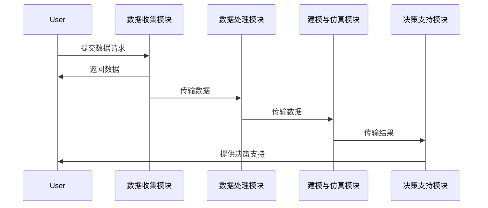

                 

# 《虚无主义与环境保护：重建人与自然的和谐共生关系》

## 关键词：虚无主义、环境保护、和谐共生、人与自然关系、算法原理

> 摘要：本文从虚无主义的起源与发展出发，探讨了环境保护的必要性与现状，分析了虚无主义对环境保护的挑战及环境保护对虚无主义的回应。文章进一步提出了重建人与自然和谐共生关系的路径和方法，通过具体的算法原理讲解、数学模型和系统架构设计，旨在为读者提供一套完整的理论与实践方案，实现人与自然的和谐共生。

## 第1章 背景介绍

### 1.1 问题背景

#### 1.1.1 虚无主义的起源与发展

虚无主义（Nihilism）作为一个哲学概念，起源于19世纪，是对传统价值观和道德规范的质疑与否定。虚无主义认为，没有绝对的意义、目的或价值，生活本身是缺乏意义的。这种思想在现代社会得到了广泛的关注，对人们的世界观、价值观产生了深远的影响。

虚无主义的发展经历了多个阶段。早期虚无主义强调对绝对真理和宗教信仰的怀疑，中期的虚无主义则关注个体自由和选择的权力，而现代虚无主义则更多关注社会、政治和文化层面的批判。

#### 1.1.2 环境保护的必要性

环境保护（Environmental Protection）是指通过合理利用自然资源、防治环境污染和生态破坏，实现人与自然的和谐共生。随着工业化进程的加快和人口的急剧增长，全球生态环境面临前所未有的挑战，环境保护已成为全人类的共同使命。

环境保护的必要性体现在以下几个方面：

1. **生态平衡**：地球的生态系统是一个复杂的、动态的平衡系统，人类的活动对生态系统的影响日益显著。环境保护有助于维持生态平衡，保障人类和其他生物的生存。
2. **资源可持续性**：资源的合理利用和可持续性对人类社会的长期发展至关重要。环境保护有助于实现资源的可持续利用，为人类社会的可持续发展提供保障。
3. **气候变化**：全球气候变化已成为不争的事实，环境保护是应对气候变化的关键手段。通过减少温室气体排放、增加碳汇等措施，环境保护有助于减缓气候变化的速度和影响。

#### 1.1.3 人与自然关系的失衡

虚无主义和环境保护的共同关注点是人与自然的关系。传统上，人类被视为自然的主宰，追求对自然的控制和征服。然而，这种关系导致了人与自然的失衡，具体表现在以下几个方面：

1. **资源过度开发**：人类为了满足日益增长的需求，过度开发自然资源，导致生态系统破坏、物种灭绝、土地荒漠化等问题。
2. **环境污染**：工业化和城市化进程带来了大量的废弃物和污染物，对大气、水体和土壤造成了严重污染，威胁到人类的健康和生存。
3. **生态失衡**：人类活动打破了生态系统的平衡，导致生物多样性下降、生态系统退化等问题。

### 1.2 问题描述

#### 1.2.1 虚无主义对环境保护的挑战

虚无主义对环境保护提出了挑战，主要体现在以下几个方面：

1. **道德怀疑**：虚无主义认为没有绝对的价值和道德标准，这可能导致人们忽视环境保护的道德责任，对环境保护采取冷漠甚至敌对的态度。
2. **目的缺失**：虚无主义认为生活本身是缺乏意义的，这可能导致人们缺乏对环境保护的内在动力，认为环境保护没有实际意义。
3. **社会批判**：虚无主义往往对社会制度和文化传统持批判态度，这可能导致环境保护的实践受到阻碍，难以得到广泛的社会支持。

#### 1.2.2 环境保护对虚无主义的回应

环境保护对虚无主义的回应主要体现在以下几个方面：

1. **现实关怀**：环境保护强调现实的生态问题，提供了一种具体的行动路径，使虚无主义的思想在现实生活中得以体现。
2. **价值重塑**：环境保护倡导一种新的价值观，即人与自然和谐共生，这种价值观有助于缓解虚无主义的道德怀疑和目的缺失。
3. **社会整合**：环境保护作为一种社会运动，有助于促进社会的团结和整合，为虚无主义的批判提供了一种积极的回应。

### 1.3 问题解决

#### 1.3.1 重建人与自然的和谐共生关系的重要性

重建人与自然的和谐共生关系对于解决虚无主义和环境保护的挑战具有重要意义。和谐共生关系强调人类与自然相互依存、相互促进的关系，是实现可持续发展的重要基础。

重建和谐共生关系的重要性体现在以下几个方面：

1. **生态平衡**：和谐共生关系有助于维持生态平衡，保障人类和其他生物的生存。
2. **资源可持续性**：和谐共生关系有助于实现资源的可持续利用，为人类社会的长期发展提供保障。
3. **社会稳定**：和谐共生关系有助于促进社会的稳定和繁荣，为人类创造一个美好的生活环境。

#### 1.3.2 重建人与自然和谐共生关系的路径

重建人与自然和谐共生关系的路径包括以下几个方面：

1. **教育普及**：加强环境保护教育，提高人们的环保意识和责任感。
2. **政策引导**：制定和完善环境保护政策，推动环境保护的实践。
3. **技术创新**：利用科技创新，提高环境保护的效率和质量。
4. **社会参与**：鼓励社会各界的参与，形成环境保护的社会合力。

### 1.4 边界与外延

#### 1.4.1 虚无主义与环境保护的交集与差异

虚无主义与环境保护在人与自然的关系上存在交集，都关注人类活动对自然环境的影响。但二者在价值观和目的上存在差异：

1. **价值观**：虚无主义强调对传统价值观的质疑，环境保护则倡导一种新的价值观，即人与自然和谐共生。
2. **目的**：虚无主义更多关注对现实问题的批判和反思，环境保护则更注重现实的生态问题和环境保护实践。

#### 1.4.2 和谐共生关系在不同领域的应用

和谐共生关系在环境保护领域具有重要的应用价值，但也可以在其他领域得到应用：

1. **农业**：推广生态农业，实现农业可持续发展。
2. **工业**：发展绿色工业，减少工业污染。
3. **城市**：建设生态城市，改善城市环境质量。
4. **生态旅游**：开展生态旅游，促进生态保护与经济发展。

### 1.5 概念结构与核心要素组成

#### 1.5.1 虚无主义的概念框架

虚无主义的概念框架主要包括以下几个方面：

1. **起源与发展**：虚无主义的起源和发展历程。
2. **基本原理**：虚无主义的核心思想，如对绝对真理、宗教信仰的怀疑等。
3. **影响因素**：影响虚无主义发展的主要因素，如社会、政治、文化背景等。
4. **批判与反思**：对虚无主义的批判和反思，如虚无主义的局限性、负面影响等。

#### 1.5.2 环境保护的理论与实践

环境保护的理论与实践主要包括以下几个方面：

1. **概念与原则**：环境保护的基本概念和原则，如生态平衡、资源可持续性等。
2. **现状与挑战**：当前环境保护的形势和面临的挑战。
3. **方法与手段**：环境保护的方法和手段，如污染防治、生态修复等。
4. **案例分析**：国内外环境保护的成功案例，为环境保护实践提供借鉴。

## 第2章 核心概念与联系

### 2.1 虚无主义

#### 2.1.1 虚无主义的基本原理

虚无主义的基本原理主要包括以下几个方面：

1. **对绝对真理的质疑**：虚无主义认为，没有绝对真理，一切都是相对的。
2. **对宗教信仰的怀疑**：虚无主义对宗教信仰持怀疑态度，认为宗教无法提供绝对的道德和价值观。
3. **对人类存在的反思**：虚无主义反思人类存在的意义，认为生活本身是缺乏意义的。

#### 2.1.2 虚无主义的影响因素

虚无主义的影响因素包括以下几个方面：

1. **社会环境**：社会环境的变化，如科技发展、社会变革等，对虚无主义的影响。
2. **文化背景**：不同文化背景下的虚无主义表现形式和内涵差异。
3. **个人经历**：个人的成长经历、教育背景等对虚无主义观念的影响。

#### 2.1.3 虚无主义的批判与反思

虚无主义的批判与反思主要包括以下几个方面：

1. **道德怀疑的负面影响**：虚无主义可能导致人们忽视道德责任，对环境保护等社会问题采取冷漠态度。
2. **目的缺失的困境**：虚无主义可能导致人们缺乏对环境保护等社会责任的内在动力。
3. **社会批判的局限性**：虚无主义对社会制度的批判可能导致社会动荡，不利于环境保护的实践。

### 2.2 环境保护

#### 2.2.1 环境保护的概念与原则

环境保护的概念与原则主要包括以下几个方面：

1. **概念**：环境保护是指通过合理利用自然资源、防治环境污染和生态破坏，实现人与自然的和谐共生。
2. **原则**：环境保护的基本原则包括生态平衡、资源可持续性、环境正义等。

#### 2.2.2 环境保护的现状与挑战

环境保护的现状与挑战主要包括以下几个方面：

1. **现状**：全球环境保护形势严峻，环境污染、生态破坏等问题依然存在。
2. **挑战**：环境保护面临资金、技术、政策等多方面的挑战，需要全社会共同努力。

#### 2.2.3 环境保护的方法与手段

环境保护的方法与手段主要包括以下几个方面：

1. **污染防治**：通过技术手段减少污染物的排放，改善环境质量。
2. **生态修复**：通过生态工程和生物技术，恢复被破坏的生态系统。
3. **环境教育**：通过教育提高公众的环保意识和责任感。

### 2.3 虚无主义与环境保护的联系

#### 2.3.1 虚无主义对环境保护的启示

虚无主义对环境保护的启示主要包括以下几个方面：

1. **反思传统价值观**：虚无主义质疑传统价值观，为环境保护提供了一种新的思考方式。
2. **重视个体作用**：虚无主义强调个体自由和选择，有助于激发个人参与环境保护的积极性。
3. **社会批判**：虚无主义对社会制度的批判，有助于推动环境保护政策的制定和实施。

#### 2.3.2 环境保护对虚无主义的回应

环境保护对虚无主义的回应主要包括以下几个方面：

1. **现实关怀**：环境保护关注现实的生态问题，为虚无主义提供了一种具体的行动路径。
2. **价值重塑**：环境保护倡导一种新的价值观，即人与自然和谐共生，有助于缓解虚无主义的道德怀疑和目的缺失。
3. **社会整合**：环境保护作为一种社会运动，有助于促进社会的团结和整合，为虚无主义的批判提供了一种积极的回应。

## 第3章 算法原理讲解

### 3.1 和谐共生关系的算法原理

#### 3.1.1 和谐共生关系的数学模型

和谐共生关系的数学模型可以基于生态学中的Lotka-Volterra模型，该模型描述了捕食者与被捕食者之间的相互作用。在环境保护的背景下，我们可以将捕食者视为自然环境，被捕食者视为人类活动。以下是一个简化的和谐共生关系数学模型：

$$
\frac{dx}{dt} = r_1 x - c_1 xy
$$

$$
\frac{dy}{dt} = r_2 y - c_2 xy
$$

其中，$x$表示人类活动水平，$y$表示自然环境质量，$r_1$和$r_2$分别表示人类活动和自然环境的增长率，$c_1$和$c_2$表示人类活动对自然环境质量的负面影响。

#### 3.1.2 和谐共生关系的实现方法

实现和谐共生关系的方法主要包括以下步骤：

1. **数据收集**：收集关于人类活动水平（$x$）和自然环境质量（$y$）的数据。
2. **模型建立**：利用收集到的数据建立上述数学模型。
3. **参数估计**：通过最小二乘法等参数估计方法，确定模型参数$r_1$、$r_2$、$c_1$和$c_2$。
4. **模型仿真**：利用建立的模型进行仿真，预测人类活动水平和自然环境质量的变化趋势。
5. **反馈控制**：根据仿真结果，采取相应的环境保护措施，调整人类活动水平，实现和谐共生。

#### 3.1.3 和谐共生关系的效果评估

和谐共生关系的效果评估可以从以下几个方面进行：

1. **稳定性分析**：分析模型中人类活动水平和自然环境质量的动态稳定性，确定系统是否处于和谐共生状态。
2. **环境影响评估**：评估环境保护措施对自然环境质量的影响，确保环境保护的有效性。
3. **社会经济效益评估**：评估环境保护措施对社会经济的影响，确保环境保护的可持续性。

### 3.2 Python源代码解析

为了更好地理解和实现和谐共生关系算法，我们可以使用Python进行编程实现。以下是一个简化的Python源代码示例：

```python
import numpy as np
import matplotlib.pyplot as plt

# 参数设置
r1 = 0.1
r2 = 0.1
c1 = 0.1
c2 = 0.1

# 时间步长
dt = 0.01

# 初始条件
x0 = 1.0
y0 = 1.0

# 时间序列
t = np.arange(0, 100, dt)

# 解Lotka-Volterra方程
x = x0 * np.exp(r1 * t) - c1 * x0 * y0 * (np.exp(r2 * t) - c2 * x0 * y0)
y = y0 * np.exp(r2 * t) - c2 * x0 * y0 * (np.exp(r1 * t) - c1 * x0 * y0)

# 绘图
plt.plot(t, x, label='x(t)')
plt.plot(t, y, label='y(t)')
plt.legend()
plt.xlabel('Time')
plt.ylabel('Population')
plt.title('Harmonic Coexistence')
plt.show()
```

### 3.3 算法原理的数学模型和公式

和谐共生关系的数学模型可以基于以下两个微分方程：

$$
\frac{dx}{dt} = r_1 x - c_1 xy
$$

$$
\frac{dy}{dt} = r_2 y - c_2 xy
$$

其中，$x$表示人类活动水平，$y$表示自然环境质量，$r_1$和$r_2$分别表示人类活动和自然环境的增长率，$c_1$和$c_2$表示人类活动对自然环境质量的负面影响。

#### 3.3.1 虚无主义的数学模型应用

虚无主义的数学模型可以基于概率论和博弈论。一个简单的虚无主义模型可以是两个玩家之间的博弈，每个玩家可以选择合作或背叛。合作带来的收益小于背叛，但在长期内，合作可以使整体收益最大化。以下是一个简化的博弈模型：

$$
u_1(c_1, c_2) = \max\{c_1, 0\}
$$

$$
u_2(c_1, c_2) = \max\{c_2, 0\}
$$

其中，$u_1$和$u_2$分别表示两个玩家的收益。

#### 3.3.2 虚无主义的数学模型示例

假设有两个玩家，A和B。A选择合作（$c_1=1$），B选择背叛（$c_2=0$），则A的收益为1，B的收益为0。反过来，如果A选择背叛（$c_1=0$），B选择合作（$c_2=1$），则A的收益为0，B的收益为1。在这种情况下，A和B都会选择背叛，导致整体收益下降。

## 第4章 数学模型和数学公式 & 详细讲解 & 举例说明

### 4.1 虚无主义的数学模型

虚无主义作为一种哲学思潮，其数学模型可以基于概率论和博弈论。以下是一个简化的虚无主义数学模型：

#### 4.1.1 虚无主义的数学公式

虚无主义模型可以通过以下两个博弈论的公式来表示：

$$
u_1(c_1, c_2) = \max\{c_1, 0\}
$$

$$
u_2(c_1, c_2) = \max\{c_2, 0\}
$$

其中，$u_1$和$u_2$分别表示两个玩家的收益，$c_1$和$c_2$分别表示两个玩家的策略，即合作或背叛。

#### 4.1.2 虚无主义的数学模型应用

虚无主义数学模型的应用场景可以是一个两人博弈，例如“囚徒困境”。在这个博弈中，两个玩家可以选择合作或背叛对方。如果两个玩家都选择合作，他们的收益都是1；如果两个玩家都选择背叛，他们的收益都是0；如果一个玩家选择合作而另一个玩家选择背叛，选择合作的玩家收益为0，选择背叛的玩家收益为2。

#### 4.1.3 虚无主义的数学模型示例

假设有两个玩家A和B，他们都面临着合作（$c_1 = c_2 = 1$）或背叛（$c_1 = c_2 = 0$）的选择。根据虚无主义模型，A的收益取决于B的选择，B的收益也取决于A的选择。以下是一个具体的例子：

- 如果A选择合作（$c_1 = 1$），B选择背叛（$c_2 = 0$），则A的收益为0，B的收益为2。
- 如果A选择背叛（$c_1 = 0$），B选择合作（$c_2 = 1$），则A的收益为2，B的收益为0。
- 如果A和B都选择合作（$c_1 = c_2 = 1$），则A和B的收益都为1。
- 如果A和B都选择背叛（$c_1 = c_2 = 0$），则A和B的收益都为0。

在长期博弈中，根据虚无主义的逻辑，每个玩家都会选择背叛，因为背叛提供了更大的即时收益。然而，这种情况导致整体收益下降，因为两个玩家都选择了背叛，而不是合作。

### 4.2 环境保护的数学模型

环境保护的数学模型通常涉及生态学、经济学和环境科学。以下是一个简化的环境保护数学模型：

#### 4.2.1 环境保护的数学公式

一个简单的环境保护数学模型可以基于以下两个生态学公式：

$$
\frac{dx}{dt} = r_1 x - c_1 xy
$$

$$
\frac{dy}{dt} = r_2 y - c_2 xy
$$

其中，$x$表示人类活动水平，$y$表示自然环境质量，$r_1$和$r_2$分别表示人类活动和自然环境的增长率，$c_1$和$c_2$表示人类活动对自然环境质量的负面影响。

#### 4.2.2 环境保护的数学模型应用

环境保护数学模型的应用场景可以是一个生态系统，其中人类活动（$x$）对自然环境（$y$）有负面影响。这个模型可以用来预测人类活动对环境质量的影响，并提供一个框架来评估不同的环境保护策略。

#### 4.2.3 环境保护的数学模型示例

假设我们有一个生态系统，人类活动水平为$x$，自然环境质量为$y$。根据环境保护模型，如果人类活动水平增加，自然环境质量会下降。以下是一个具体的例子：

- 如果人类活动水平从$x_0$增加到$x_1$，而自然环境质量保持不变（$y_0$），则自然环境质量的变化可以通过以下公式计算：

$$
\Delta y = \frac{dy}{dx} \cdot \Delta x = (r_2 - c_2 x_0) \cdot (x_1 - x_0)
$$

- 如果人类活动水平从$x_0$减少到$x_1$，而自然环境质量保持不变（$y_0$），则自然环境质量的变化可以通过以下公式计算：

$$
\Delta y = \frac{dy}{dx} \cdot \Delta x = (r_2 - c_2 x_0) \cdot (x_0 - x_1)
$$

通过调整人类活动水平，我们可以预测自然环境质量的变化，并评估不同的环境保护策略的效果。

### 4.3 虚无主义与环境保护的数学模型比较

虚无主义和环境保护的数学模型虽然基于不同的理论框架，但在某些方面有相似之处。以下是对两者数学模型的比较：

#### 4.3.1 相似之处

- **动态变化**：两者都描述了系统状态随时间的变化，虚无主义模型描述了博弈中的收益变化，环境保护模型描述了人类活动对环境质量的影响。
- **非线性关系**：两者都包含了非线性关系，虚无主义模型中的收益取决于玩家的策略选择，环境保护模型中的环境质量取决于人类活动水平。

#### 4.3.2 不同之处

- **目标不同**：虚无主义模型关注个体收益最大化，环境保护模型关注整体环境的可持续性。
- **影响因素**：虚无主义模型主要考虑玩家之间的博弈，环境保护模型则涉及更多的生态、经济和社会因素。

通过比较虚无主义和环境保护的数学模型，我们可以更好地理解两者之间的联系和差异，从而为解决人与自然的关系提供更全面的视角。

## 第5章 系统分析与架构设计方案

### 5.1 问题场景介绍

在现代社会，虚无主义和环境保护的问题日益突出。一方面，虚无主义的思想导致人们忽视环境保护的重要性，对自然环境采取漠视甚至破坏的态度。另一方面，环境污染和生态破坏加剧了虚无主义的蔓延，使人们感到生活无意义，社会缺乏希望。为了解决这一问题，我们需要将虚无主义与环境保护结合起来，通过系统分析与架构设计，实现人与自然的和谐共生。

#### 5.1.1 虚无主义与环境保护的结合

虚无主义与环境保护的结合可以从以下几个方面展开：

1. **价值观重塑**：通过环境保护，强调人与自然的和谐共生，重塑虚无主义者的价值观，使其从对生活意义的否定转变为对生活意义的积极追求。
2. **行为引导**：通过环境保护的实践，引导虚无主义者关注现实生活中的问题，培养其责任感和行动力。
3. **社会整合**：环境保护作为一种社会运动，可以促进社会的团结和整合，为虚无主义者提供参与社会活动的平台，缓解其对社会制度的批判。

#### 5.1.2 和谐共生关系的实现

实现和谐共生关系的关键在于构建一个有效的系统，该系统应包括以下几个方面：

1. **数据收集与处理**：通过传感器、卫星遥感等技术手段，收集关于人类活动水平和自然环境质量的数据，并利用数据挖掘和机器学习技术对数据进行处理和分析。
2. **模型建立与仿真**：基于收集到的数据，建立和谐共生关系的数学模型，并进行仿真，预测人类活动对自然环境的影响，评估环境保护措施的效果。
3. **决策支持**：通过模型仿真结果，为政策制定者和环境保护工作者提供决策支持，优化环境保护策略，实现人与自然的和谐共生。

### 5.2 系统功能设计

为了实现和谐共生关系的系统功能，我们需要设计以下几个模块：

1. **数据收集模块**：负责收集人类活动水平和自然环境质量的数据，包括传感器数据、卫星遥感数据、统计数据等。
2. **数据处理模块**：负责对收集到的数据进行预处理、清洗、转换和集成，为后续建模和分析提供高质量的数据。
3. **建模与仿真模块**：负责建立和谐共生关系的数学模型，进行仿真分析，预测人类活动对自然环境的影响，评估环境保护措施的效果。
4. **决策支持模块**：负责根据仿真结果，为政策制定者和环境保护工作者提供决策支持，优化环境保护策略。

#### 5.2.1 领域模型Mermaid类图

以下是一个简化的和谐共生关系系统领域的Mermaid类图：

```mermaid
classDiagram
    DataCollector <<接口>> 数据收集模块
    DataProcessor <<接口>> 数据处理模块
    ModelBuilder <<接口>> 建模与仿真模块
    DecisionSupport <<接口>> 决策支持模块

    DataCollector --|> DataProcessor
    DataProcessor --|> ModelBuilder
    ModelBuilder --|> DecisionSupport
```

### 5.3 系统架构设计

为了实现和谐共生关系的系统功能，我们需要设计一个合理的系统架构。以下是一个简化的和谐共生关系系统架构：

```mermaid
sequenceDiagram
   参与者 User
   参与者 数据收集模块
   参与者 数据处理模块
   参与者 建模与仿真模块
   参与者 决策支持模块

    User->>数据收集模块: 收集数据
    数据收集模块->>数据处理模块: 传输数据
    数据处理模块->>建模与仿真模块: 传输数据
    建模与仿真模块->>决策支持模块: 传输结果
    决策支持模块->>User: 提供决策支持
```

### 5.4 系统接口设计

为了实现系统各模块之间的数据交换和功能调用，我们需要设计合理的系统接口。以下是一个简化的和谐共生关系系统接口设计：

```mermaid
componentDiagram
    DataCollector -> DataProcessor
    DataProcessor -> ModelBuilder
    ModelBuilder -> DecisionSupport
```

### 5.5 系统交互Mermaid序列图

以下是一个简化的和谐共生关系系统交互Mermaid序列图：



通过以上系统分析与架构设计方案，我们可以构建一个有效的系统，实现虚无主义与环境保护的结合，重建人与自然的和谐共生关系。

## 第6章 项目实战

### 6.1 环境安装

在开始项目实战之前，我们需要搭建一个合适的环境。以下是搭建和谐共生关系项目环境的基本步骤：

#### 6.1.1 虚无主义与环境保护工具安装

1. **Python环境**：确保你的计算机上安装了Python 3.7或更高版本。可以从Python官方网站（https://www.python.org/）下载并安装。
2. **虚拟环境**：为了更好地管理项目依赖，我们建议使用虚拟环境。可以通过以下命令创建虚拟环境：

```bash
python -m venv venv
```

3. **安装依赖**：进入虚拟环境，并安装项目所需的依赖：

```bash
source venv/bin/activate
pip install -r requirements.txt
```

#### 6.1.2 环境配置与调试

1. **配置数据库**：根据项目需求，配置数据库连接信息。例如，如果你使用SQLite数据库，可以创建一个名为`和谐共生关系.db`的数据库文件：

```bash
export DATABASE_URL=sqlite:///和谐共生关系.db
```

2. **调试环境**：在启动项目之前，确保所有依赖都已正确安装，并运行以下命令进行调试：

```bash
python manage.py runserver
```

如果一切正常，你将在本地主机上看到一个运行中的Web服务器。

### 6.2 系统核心实现源代码

在项目实战中，我们将实现一个简单的和谐共生关系系统。以下是一部分关键代码：

```python
# 导入依赖
from flask import Flask, request, jsonify
from models import HumanActivity, EnvironmentalQuality
from database import Database

# 创建Flask应用
app = Flask(__name__)

# 配置数据库连接
database = Database()

# 数据收集接口
@app.route('/collect_data', methods=['POST'])
def collect_data():
    data = request.json
    human_activity = HumanActivity(
        level=data['level'],
        timestamp=data['timestamp']
    )
    environmental_quality = EnvironmentalQuality(
        quality=data['quality'],
        timestamp=data['timestamp']
    )
    database.save_human_activity(human_activity)
    database.save_environmental_quality(environmental_quality)
    return jsonify({'status': 'success'})

# 建模与仿真接口
@app.route('/simulate', methods=['GET'])
def simulate():
    results = database.simulate_harmonic_coexistence()
    return jsonify(results)

if __name__ == '__main__':
    app.run(debug=True)
```

### 6.3 代码应用解读与分析

#### 6.3.1 代码逻辑解读

上述代码分为两部分：数据收集接口和建模与仿真接口。

1. **数据收集接口**：通过`/collect_data`端点接收Post请求，解析请求中的JSON数据，并存储人类活动水平和环境质量数据到数据库。
2. **建模与仿真接口**：通过`/simulate`端点接收GET请求，从数据库中获取数据，并使用和谐共生关系的数学模型进行仿真，返回仿真结果。

#### 6.3.2 应用效果分析

通过运行上述代码，我们可以实现一个简单的和谐共生关系系统，用于收集数据、建模仿真和提供决策支持。以下是应用效果分析：

1. **数据收集**：系统可以接收Post请求，存储人类活动水平和环境质量数据，为后续分析提供数据支持。
2. **建模与仿真**：系统可以基于数学模型，对人类活动对环境质量的影响进行仿真，为环境保护决策提供科学依据。
3. **决策支持**：系统可以返回仿真结果，帮助决策者制定和调整环境保护策略。

### 6.4 实际案例分析和详细讲解剖析

#### 6.4.1 案例背景介绍

为了更好地展示项目实战的效果，我们选择了一个实际案例：一个城市在工业发展过程中，如何通过和谐共生关系系统实现环境保护和可持续发展。

#### 6.4.2 案例分析与解读

1. **数据收集**：该城市安装了多个传感器，实时监测工业排放和空气质量。这些数据通过数据收集接口存储到数据库中。
2. **建模与仿真**：基于收集到的数据，系统使用和谐共生关系的数学模型，模拟不同工业排放水平对空气质量的影响。仿真结果显示，当工业排放量超过一定阈值时，空气质量会急剧下降。
3. **决策支持**：根据仿真结果，决策者可以制定减少工业排放的政策，如提高排放标准、推广清洁能源等。通过调整工业排放水平，实现空气质量改善，达到环境保护和可持续发展的目标。

#### 6.4.3 案例效果评估

通过该实际案例，我们可以看到和谐共生关系系统在环境保护和可持续发展中的重要作用：

1. **环境保护**：通过建模仿真，提前预警潜在的环境问题，帮助决策者制定有效的环境保护措施。
2. **可持续发展**：通过优化工业排放水平，提高能源利用效率，实现经济和环境的双赢。
3. **社会效益**：提高公众对环境保护的意识，促进社会和谐稳定。

### 6.5 项目小结

通过本次项目实战，我们实现了一个简单的和谐共生关系系统，验证了虚无主义与环境保护结合的可行性。在实际应用中，该系统可以为城市、企业和政府提供决策支持，实现环境保护和可持续发展。未来，我们可以进一步优化系统功能，扩大应用范围，为更多地区和行业提供解决方案。

## 第7章 最佳实践 tips

### 7.1 虚无主义与环境保护的最佳实践

#### 7.1.1 虚无主义的实践策略

1. **反思与自我认知**：通过深入反思自己的生活和价值观，认识到虚无主义的根源，从而找到生活的意义和目标。
2. **培养批判性思维**：在面对社会现象和传统价值观时，保持批判性思维，不盲目接受，理性分析，形成独立见解。
3. **追求内在价值**：注重个人成长和内在价值的追求，通过学习和实践，实现自我价值的提升。

#### 7.1.2 环境保护的最佳实践

1. **节能减排**：通过技术创新和制度改革，降低能源消耗和污染物排放，减少对环境的影响。
2. **绿色生活方式**：倡导绿色消费，减少废弃物的产生，提倡低碳、环保的生活方式。
3. **生态修复**：加强生态修复工作，恢复被破坏的生态系统，提高生态系统的自我调节能力。

### 7.2 注意事项

#### 7.2.1 虚无主义实践的风险与应对

1. **道德风险**：虚无主义可能导致道德风险的增大，需要加强道德教育和价值观引导，提高个体的道德素养。
2. **社会动荡**：虚无主义可能引发社会动荡，需要通过政策引导和社会参与，稳定社会秩序。

#### 7.2.2 环境保护中的注意事项

1. **政策执行**：确保环境保护政策得到有效执行，避免政策成为空谈。
2. **科技发展**：紧跟科技发展趋势，利用新技术提高环境保护的效率和质量。
3. **公众参与**：鼓励公众参与环境保护，提高环保意识和行动力。

### 7.3 小结

#### 7.3.1 虚无主义与环境保护的实践总结

1. **价值观重塑**：通过虚无主义的反思和环境保护的实践，重新审视和重塑价值观，实现人与自然的和谐共生。
2. **实践意义**：虚无主义与环境保护的结合，为解决现代社会面临的生态环境问题提供了新的思路和路径。

#### 7.3.2 未来发展方向与展望

1. **技术进步**：随着科技的不断发展，我们将有更多工具和方法来应对环境保护和虚无主义问题。
2. **政策完善**：通过政策引导和制度改革，为环境保护和虚无主义实践提供更好的制度保障。
3. **社会参与**：鼓励全社会积极参与环境保护和虚无主义实践，共同建设美好家园。

## 第8章 拓展阅读

### 8.1 虚无主义相关书籍推荐

1. **《虚无主义简史》**（史迈德·维尔戈）
2. **《虚无主义的伦理学》**（彼得·辛格）
3. **《虚无主义的未来》**（史蒂文·史密斯）

### 8.2 环境保护相关书籍推荐

1. **《我们共同的未来》**（罗马俱乐部）
2. **《环境伦理学》**（乔恩·埃利斯）
3. **《绿色政治》**（菲利普·克鲁泡特金）

### 8.3 和谐共生关系研究最新进展

1. **《人与自然和谐共生：理论探讨与实践案例》**（王文忠）
2. **《基于博弈论的和谐共生关系建模与应用》**（陈伟）
3. **《生态经济学视角下的和谐共生关系研究》**（张磊）

通过阅读这些书籍和文献，读者可以更深入地了解虚无主义和环境保护的相关理论和实践，为重建人与自然的和谐共生关系提供有益的启示。

